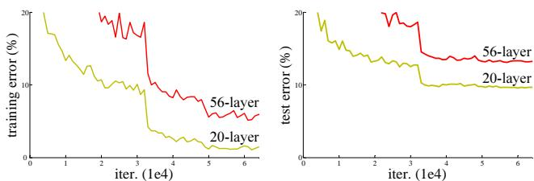
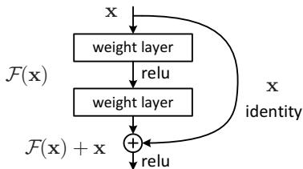
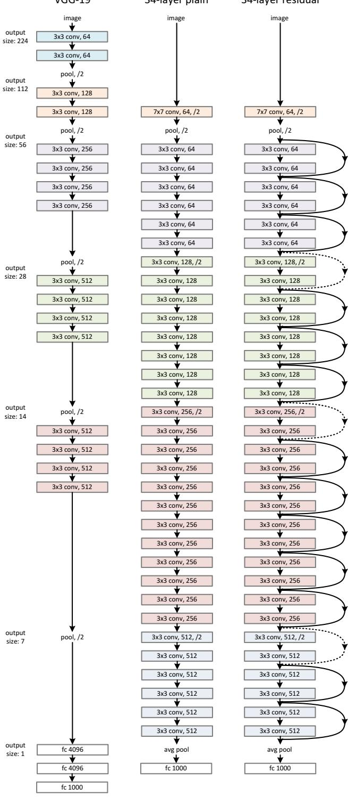
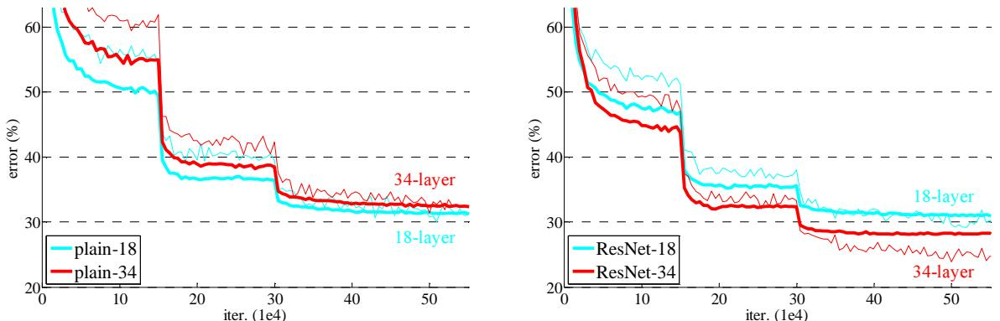
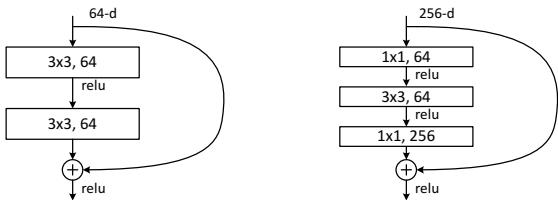
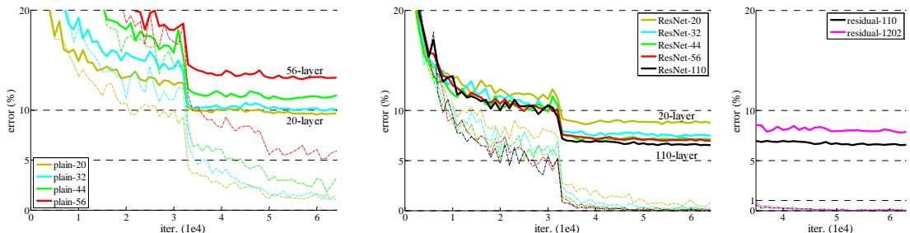
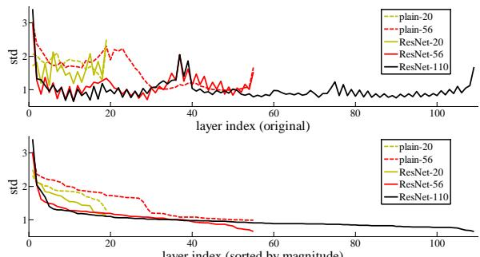

# 深度残差学习用于图像识别

Kaiming He, Xiangyu Zhang, Shaoqing Ren, Jian Sun, 微软研究院 {kahe, v-xiangz, v-shren, jiansun}@microsoft.com

# 摘要

深度神经网络的训练更加困难。我们提出了一种残差学习框架，以简化比以往使用的网络深得多的网络训练。我们明确定义层作为参考层输入的学习残差函数，而不是学习无参考的函数。我们提供了全面的实证证据，表明这些残差网络更易于优化，并且可以从显著增加的深度中获得准确性。在ImageNet数据集上，我们评估了深度达到152层的残差网络——其深度是VGG网络的$8 \times$，但复杂度仍然较低。这些残差网络的集成在ImageNet测试集上达到了$3.57\%$的错误率。这个结果在ILSVRC 2015分类任务中获得了第1名。我们还对CIFAR-10进行了100层和1000层的分析。

表示的深度对许多视觉识别任务至关重要。仅仅由于我们极其深的表示，我们在COCO物体检测数据集上获得了$28 \%$的相对提升。深度残差网络是我们提交给ILSVRC和COCO 2015竞赛的基础1，在这些竞赛中，我们还在ImageNet检测、ImageNet定位、COCO检测和COCO分割任务上获得了第一名。

# 1. 引言

深度卷积神经网络[22, 21]在图像分类方面带来了系列突破[21, 50, 40]。深度网络自然以端到端的多层方式集成低级/中级/高级特征[50]和分类器，而特征的“层次”可以通过堆叠层的数量（深度）来丰富。最新证据[41, 44]表明，网络深度至关重要，挑战性强的ImageNet数据集[36]上的领先结果[41, 44, 13, 16]都利用了“非常深”的[41]模型，深度从十六[41]到三十[16]不等。许多其他非平凡的视觉识别任务[8, 12, 7, 32, 27]也从非常深的模型中获益匪浅。

  
Figure 1. Training error (left) and test error (right) on CIFAR-10 with 20-layer and 56-layer "plain" networks. The deeper network has higher training error, and thus test error. Similar phenomena on ImageNet is presented in Fig. 4.

由深度的重要性驱动，一个问题出现了：学习更好的网络是否仅仅是堆叠更多的层？回答这个问题的一个障碍是著名的消失/爆炸梯度问题 [1, 9]，它从一开始就阻碍了收敛。然而，这个问题已经通过归一化初始化 [23, 9, 37, 13] 和中间归一化层 [16] 进行了很大程度的解决，使得拥有数十层的网络能够开始在带有反向传播的随机梯度下降 (SGD) 中收敛 [22]。

当更深的网络能够开始收敛时，出现了一个退化问题：随着网络深度的增加，准确率趋于饱和（这可能并不令人惊讶），然后迅速下降。意外的是，这种退化并不是由于过拟合造成的，向一个适当深的模型中添加更多层会导致更高的训练误差，如 [11, 42] 中所述，并通过我们的实验进行了充分验证。图1展示了一个典型的例子。

训练准确率的下降表明，并非所有系统都同样容易优化。让我们考虑一个较浅的架构及其更深的对应模型，后者在其上添加了更多层。对于更深的模型，通过构造存在一个解决方案：所添加的层是恒等映射，而其他层则是从已学习的较浅模型中复制而来。这个构造解决方案的存在表明，更深的模型不应该产生比其较浅对应模型更高的训练误差。然而，实验表明我们目前掌握的求解器无法找到与构造解决方案同样好或更好的解决方案（或无法在可行时间内做到这一点）。

  
Figure 2. Residual learning: a building block.

在本文中，我们通过引入深度残差学习框架来解决退化问题。我们不是希望每几层堆叠的层直接拟合所需的基础映射，而是明确让这些层拟合一个残差映射。形式上，设所需的基础映射为 $\mathcal { H } ( \mathbf { x } )$，我们让堆叠的非线性层拟合另一个映射 $\mathcal { F } ( \mathbf { x } ) : = \mathcal { H } ( \mathbf { x } ) - \mathbf { x }$。原始映射被重构为 $\mathcal F ( \mathbf x ) + \mathbf x$。我们假设优化残差映射比优化原始的、未参考的映射更容易。极端地说，如果身份映射是最佳的，将残差推至零会比通过一堆非线性层拟合身份映射更容易。

$\mathcal { F } ( { \bf x } ) + { \bf x }$的公式可以通过具有“快捷连接”的前馈神经网络实现（图2）。快捷连接[2, 34, 49]是指跳过一个或多个层。在我们的案例中，快捷连接简单地执行恒等映射，其输出与堆叠层的输出相加（图2）。恒等快捷连接不会增加额外的参数或计算复杂性。整个网络仍然可以通过带有反向传播的随机梯度下降（SGD）进行端到端训练，并且可以使用常用库（例如，Caffe [19]）轻松实现，而无需修改求解器。

我们在 ImageNet [36] 上进行了全面实验，以展示降级问题并评估我们的方法。我们展示了：1) 我们的极深残差网络易于优化，但对应的“普通”网络（仅通过堆叠层构建）在深度增加时表现出更高的训练误差；2) 我们的深残差网络可以轻松地从大幅增加的深度中获得准确率提升，产生的结果显著优于之前的网络。

类似现象在CIFAR-10数据集上也得到了体现[20]，这表明优化难度和我们方法的效果不仅仅与特定数据集相关。我们展示了在该数据集上成功训练的超过100层的模型，并探索了超过1000层的模型。

在ImageNet分类数据集[36]上，我们通过极深的残差网络获得了卓越的结果。我们的152层残差网络是迄今为止在ImageNet上提出的最深网络，同时其复杂度仍低于VGG网络[41]。我们的集成方法在顶级5错误率上达到了$3.57\%$。

ImageNet测试集，并在2015年ILSVRC分类竞赛中获得第1名。这种极深的表示在其他识别任务上也具有优异的泛化性能，并使我们在ILSVRC和COCO 2015竞赛中进一步赢得了：ImageNet检测、ImageNet定位、COCO检测和COCO分割的第1名。这一有力证据表明残差学习原理是通用的，我们期待它适用于其他视觉和非视觉问题。

# 2. 相关研究

残差表示。在图像识别中，VLAD [18] 是一种通过与字典相关的残差向量进行编码的表示，而Fisher向量 [30] 可以被公式化为VLAD的概率版本 [18]。它们都是用于图像检索和分类的强大浅层表示 [4, 48]。对于矢量量化，编码残差向量 [17] 被证明比编码原始向量更有效。

在低级视觉和计算机图形学中，解决偏微分方程（PDEs）时，广泛使用的多重网格方法[3]将系统重新表述为多个尺度上的子问题，其中每个子问题负责较粗糙尺度和更细致尺度之间的残差解。多重网格的另一种替代方法是层次基预处理[45, 46]，该方法依赖于表示两个尺度之间残差向量的变量。已经证明[3, 45, 46]这些求解器的收敛速度远快于那些不考虑解的残余特性的标准求解器。这些方法表明，良好的重构或预处理可以简化优化。

快捷连接。导致快捷连接的实践和理论已经研究了很长时间。早期训练多层感知器（MLP）的一个做法是添加一个从网络输入直接连接到输出的线性层。在[44, 24]中，一些中间层直接连接到辅助分类器，以解决消失/爆炸梯度问题。[39, 38, 31, 47]的论文提出了通过快捷连接实现中心化层响应、梯度和传播错误的方法。在[44]中，一个“ inception”层由一个快捷分支和几个更深的分支组成。

与我们的工作同时，“高速公路网络”[42, 43]提供了带有门控函数的快捷连接[15]。这些门是数据依赖的，并且有参数，而我们的身份快捷连接是无参数的。当门控快捷连接“关闭”（接近零）时，高速公路网络中的层表示非残差函数。相反，我们的公式始终学习残差函数；我们的身份快捷连接从未关闭，所有信息始终通过，并学习额外的残差函数。此外，高速公路网络在极大加深（例如超过100层）时并没有显示出准确性的提升。

# 3. 深度残差学习

# 3.1. 残差学习

我们考虑 $\mathcal { H } ( \mathbf { x } )$ 作为一个基础映射，通过一些堆叠层进行拟合（不一定是整个网络），其中 $x$ 表示这些层的第一个输入。如果假设多个非线性层可以渐近地逼近复杂函数，那么假设它们可以渐近地逼近残差函数是等价的，即 $\mathcal { H } ( \mathbf { x } ) - \mathbf { x }$（假设输入和输出的维度相同）。因此，与其期望堆叠层逼近 $\mathcal { H } ( \mathbf { x } )$，不如明确让这些层逼近残差函数 $\mathcal { F } ( \mathbf { x } ) := \mathcal { H } ( \mathbf { x } ) - \mathbf { x }$。所以原函数变为 $\mathcal F ( { \mathbf { x } } ) + { \mathbf { x } }$。尽管这两种形式都应该能够渐近地逼近所需的函数（如假设的那样），但学习的难易程度可能不同。

这种重新表述是由于有关退化问题的反直觉现象（图1，左）而产生的。如我们在介绍中所讨论的，如果添加的层可以构建为恒等映射，那么一个更深的模型的训练误差应该不大于其较浅的对应模型。退化问题表明，求解器可能在通过多个非线性层来近似恒等映射方面遇到困难。通过残差学习的重新表述，如果恒等映射是最优的，求解器可能会简单地将多个非线性层的权重驱动为零，以接近期望的恒等映射。

在实际案例中，身份映射不太可能是最优的，但我们的重新表述可能有助于对问题进行预条件处理。如果最优函数更接近身份映射而非零映射，求解器应更容易找到相对于身份映射的扰动，而不是将该函数视为一个新函数。我们通过实验（图7）表明，学习到的残差函数通常响应较小，这表明身份映射提供了合理的预条件。

# 3.2. 通过捷径进行身份映射

我们在每几个堆叠层上采用残差学习。图2展示了一个构建块。正式地，在本文中，我们考虑一个定义为：

$$
\mathbf { y } = \mathcal { F } ( \mathbf { x } , \{ W _ { i } \} ) + \mathbf { x } .
$$

这里 $\mathbf{x}$ 和 $\mathbf{y}$ 是所考虑层的输入和输出向量。函数 $\mathcal{F}(\mathbf{x}, \{ W_{i} \})$ 表示需要学习的残差映射。对于图2中的例子，它有两个层，${\mathcal F} = W_{2} \sigma(W_{1} \mathbf{x})$，其中 $\sigma$ 表示

为了简化符号，ReLU [29] 和偏置被省略。操作 $\mathcal { F } + \mathbf { x }$ 通过快捷连接和逐元素加法进行。我们在加法之后采用第二个非线性（即 $\sigma ( \mathbf { y } )$ ，见图 2）。

公式(1)中的快捷连接既不引入额外的参数，也不增加计算复杂性。这在实际应用中不仅具有吸引力，而且在我们对比普通网络和残差网络时也很重要。我们可以公正地比较具有相同参数数量、深度、宽度和计算成本（除了可忽略的逐元素加法）的普通网络和残差网络。

在方程（1）中，$\mathbf{x}$和$\mathcal{F}$的维度必须相等。如果不是这种情况（例如，当改变输入/输出通道时），我们可以通过快捷连接执行线性投影$W_{s}$来匹配维度：

$$
\mathbf { y } = \mathcal { F } ( \mathbf { x } , \{ W _ { i } \} ) + W _ { s } \mathbf { x } .
$$

我们还可以在公式(1)中使用一个方阵 $W_{s}$。但是我们将通过实验表明，恒等映射足以解决退化问题，并且是经济的，因此 $W_{s}$ 仅在匹配维度时使用。

残差函数 $\mathcal{F}$ 的形式是灵活的。本文中的实验涉及一个具有两层或三层的函数 $\mathcal{F}$（图 5），但更多层也是可能的。然而，如果 $\mathcal{F}$ 只有一层，方程（1）类似于一个线性层：$\mathbf{y} = W_{1} \mathbf{x} + \mathbf{x}$，对此我们尚未观察到优势。

我们还注意到，尽管上述符号是为了简化而对全连接层的描述，但它们同样适用于卷积层。函数 $\mathcal { F } ( \mathbf { x } , \{ W _ { i } \} )$ 可以表示多个卷积层。进行按元素的加法操作是对两个特征图逐通道进行的。

# 3.3. 网络架构

我们测试了各种简单/残差网络，并观察到了一致的现象。为了提供讨论的实例，我们为ImageNet描述了两个模型，如下所示。

纯网络。我们的纯基线（图3，中）主要受到VGG网络[41]（图3，左）的理念启发。卷积层大多使用$3 \times 3$的滤波器，并遵循两个简单的设计规则：（i）对于相同的输出特征图大小，各层具有相同数量的滤波器；（ii）如果特征图大小减半，则滤波器的数量加倍，以保持每层的时间复杂度。我们直接通过步幅为2的卷积层进行下采样。网络以全局平均池化层和具有softmax的1000方式全连接层结束。图3（中）中的加权层总数为34。

值得注意的是，我们的模型比VGG网络[41]（图3，左侧）具有更少的滤波器和更低的复杂性。我们34层的基线模型具有36亿FLOPs（乘加运算），仅为VGG-19（196亿FLOPs）的18%。

  
Figure 3. Example network architectures for ImageNet. Left: the VGG-19 model [41] (19.6 billion FLOPs) as a reference. Middle: a plain network with 34 parameter layers (3.6 billion FLOPs). Right: a residual network with 34 parameter layers (3.6 billion FLOPs). The dotted shortcuts increase dimensions. Table 1 shows more details and other variants.

残差网络。基于上述普通网络，我们插入了快捷连接（图3，右），将网络转变为其对应的残差版本。当输入和输出的维度相同时（图3中的实线快捷连接），可以直接使用恒等快捷连接（方程（1））。当维度增加时（图3中的虚线快捷连接），我们有两个选择：（A）快捷连接仍然执行恒等映射，额外填充零条目以增加维度。这个选项不引入额外参数；（B）使用方程（2）中的投影快捷连接以匹配维度（通过$1 \times 1$卷积实现）。对于这两种选择，当快捷连接跨越两个大小的特征图时，使用的步幅为2。

# 3.4. 实施

我们的 ImageNet 实现遵循 [21, 41] 中的做法。图像的短边随机调整到 [256, 480] 范围内以进行尺度增强 [41]。从图像或其水平翻转中随机采样 $2 2 4 \times 2 2 4$ 的裁剪，并减去每个像素的均值 [21]。我们采用 [21] 中的标准颜色增强。我们在每次卷积后和激活之前采用批归一化（BN） [16]。我们按照 [13] 中的方式初始化权重，并从头开始训练所有普通/残差网络。我们使用小批量大小为 256 的 SGD。学习率从 0.1 开始，当误差趋于平稳时除以 10，模型训练最多进行 $6 0 \times 1 0 ^ { 4 }$ 次迭代。我们使用 0.0001 的权重衰减和 0.9 的动量。我们未使用 dropout [14]，遵循 [16] 中的做法。

在测试中，对于比较研究，我们采用标准的10裁剪测试[21]。为了获得最佳结果，我们采用完全卷积的形式，如[41，13]所示，并在多个尺度上平均分数（图像的短边被调整为$\{ 224 , 256 , 384 , 480 , 640 \}$）

# 4. 实验

# 4.1. ImageNet 分类

我们在包含1000个类别的ImageNet 2012分类数据集[36]上评估我们的方法。模型在128万张训练图像上进行训练，在50k张验证图像上进行评估。我们还在100k张测试图像上获得最终结果，由测试服务器报告。我们评估了top-1和top-5错误率。

普通网络。我们首先评估18层和34层的普通网络。34层普通网络见图3（中间）。18层普通网络形式相似。请参见表1以获取详细架构。

表2的结果表明，34层的普通网络的验证错误率高于18层的普通网络。为了解释原因，在图4（左）中，我们比较了它们在训练过程中的训练/验证错误。我们观察到降级问题 -

<table><tr><td rowspan=1 colspan=1>层名称</td><td rowspan=1 colspan=1>输出大小</td><td rowspan=1 colspan=11>18层       34层       50层        101层        152层</td></tr><tr><td rowspan=1 colspan=1>conv1</td><td rowspan=1 colspan=1>112×112</td><td rowspan=1 colspan=11>7×7, 64, 步幅 2</td></tr><tr><td rowspan=2 colspan=1>conv2 x</td><td rowspan=2 colspan=1>56×56</td><td rowspan=1 colspan=11>3×3 最大池化, 步幅 2</td></tr><tr><td rowspan=1 colspan=1>3×3,64×23×3,64</td><td rowspan=1 colspan=1>3×3,64×33×3,64</td><td></td><td rowspan=1 colspan=1>1×1, 643×3, 641×1, 256</td><td rowspan=1 colspan=1>×3</td><td rowspan=1 colspan=1></td><td rowspan=1 colspan=1>1×1, 643×3, 641×1, 256</td><td rowspan=1 colspan=1>×3</td><td rowspan=1 colspan=1></td><td rowspan=1 colspan=1>1×1, 643×3, 641×1, 256</td><td rowspan=1 colspan=1>×3</td></tr><tr><td rowspan=2 colspan=1>conv3_x</td><td rowspan=2 colspan=1>28×28</td><td rowspan=2 colspan=1>3×3, 128×23×3, 128</td><td rowspan=2 colspan=1>3×3, 128×43×3, 128</td><td rowspan=2 colspan=2>1×1, 1283×3, 1281×1,512</td><td rowspan=2 colspan=1>×4</td><td rowspan=2 colspan=1></td><td rowspan=2 colspan=1>1×1, 1283×3, 1281×1,512</td><td rowspan=2 colspan=1>×4</td><td rowspan=2 colspan=1></td><td rowspan=1 colspan=1>1×1, 1283×3, 128</td><td rowspan=2 colspan=1>×8</td></tr><tr><td rowspan=1 colspan=1>1×1,512</td></tr><tr><td rowspan=1 colspan=1>conv4_x</td><td rowspan=1 colspan=1>14×14</td><td rowspan=1 colspan=1>3×3, 256×23×3, 256</td><td rowspan=1 colspan=1>3×3, 256×63×3, 256</td><td></td><td rowspan=1 colspan=1>1×1, 2563×3, 2561×1, 1024</td><td rowspan=1 colspan=1>×6</td><td rowspan=1 colspan=2>1×1, 2563×3, 2561×1, 1024</td><td rowspan=1 colspan=1>×23</td><td rowspan=1 colspan=2>1×1, 2563×3, 2561×1, 1024</td><td rowspan=1 colspan=1>×36</td></tr><tr><td rowspan=1 colspan=1>conv5_x</td><td rowspan=1 colspan=1>7×7</td><td rowspan=1 colspan=1>3×3,512×23×3, 512</td><td rowspan=1 colspan=1>3×3,512×33×3,512</td><td></td><td rowspan=1 colspan=1>1×1, 5123×3,5121×1, 2048</td><td rowspan=1 colspan=1>×3</td><td></td><td rowspan=1 colspan=1>1×1,5123×3,5121×1, 2048</td><td rowspan=1 colspan=1>×3</td><td></td><td rowspan=1 colspan=1>1×1, 5123×3, 5121×1, 2048</td><td rowspan=1 colspan=1>×3</td></tr><tr><td rowspan=1 colspan=1></td><td rowspan=1 colspan=1>1×1</td><td rowspan=1 colspan=2></td><td rowspan=1 colspan=3>平均池化, 1000维全连接, softmax</td><td rowspan=1 colspan=3></td><td rowspan=1 colspan=3></td></tr><tr><td rowspan=1 colspan=2>FLOPs</td><td rowspan=1 colspan=2>1.8×10^9       3.6×10^9</td><td rowspan=1 colspan=3>3.8×10^9</td><td rowspan=1 colspan=3>7.6×10^9</td><td rowspan=1 colspan=3>11.3×10^9</td></tr></table>

<table><tr><td></td><td>普通网络</td><td>ResNet</td></tr><tr><td>18层</td><td>27.94</td><td>27.88</td></tr><tr><td>34层</td><td>28.54</td><td>25.03</td></tr></table>

尽管18层普通网络的解空间是34层网络解空间的一个子空间，但34层普通网络在整个训练过程中有更高的训练错误率。

  
sampling is performed by conv3_1, conv4_1, and conv5_1 with a stride of 2.   
their plain counterparts.

Table 2. Top-1 error ( $\%$ , 10-crop testing) on ImageNet validation. Here the ResNets have no extra parameter compared to their plain counterparts. Fig. 4 shows the training procedures.   

我们认为这种优化困难不太可能是由梯度消失造成的。这些普通网络使用BN[16]进行训练，确保前向传播的信号具有非零方差。我们还验证了反向传播的梯度在BN下表现出健康的范数。因此，前向和反向信号都没有消失。事实上，34层的普通网络仍然能够达到竞争力的准确性（表3），这表明求解器在某种程度上是有效的。我们推测，深层普通网络可能具有指数级低的收敛速度，这影响了训练误差的降低。对于这种优化困难的原因，将在未来进行研究。

残差网络。接下来，我们评估18层和34层的残差网络（ResNets）。基线架构与上述普通网络相同，只是在每对$3 \times 3$滤波器之间添加了一个快捷连接，如图3（右）所示。在第一次比较中（表2和图4右），我们对所有快捷连接使用恒等映射，并对增加维度使用零填充（选项A）。因此，它们与普通网络相比没有额外的参数。

我们从表2和图4中有三个主要观察。首先，情况发生了逆转，残差学习使得34层ResNet优于18层ResNet（提高了2.8%）。更重要的是，34层ResNet的训练错误显著较低，并且对验证数据具有良好的泛化能力。这表明在这种情况下，退化问题得到了很好的解决，我们成功地从增加深度中获得了准确性提升。

其次，与其普通版本相比，34层模型的表现如下：

<table><tr><td>模型</td><td>top-1 错误率</td><td>top-5 错误率</td></tr><tr><td>VGG-16 [41]</td><td>28.07</td><td>9.33</td></tr><tr><td>GoogLeNet [44]</td><td>-</td><td>9.15</td></tr><tr><td>PReLU-net [13]</td><td>24.27</td><td>7.38</td></tr><tr><td>plain-34</td><td>28.54</td><td>10.02</td></tr><tr><td>ResNet-34 A</td><td>25.03</td><td>7.76</td></tr><tr><td>ResNet-34 B</td><td>24.52</td><td>7.46</td></tr><tr><td>ResNet-34 C</td><td>24.19</td><td>7.40</td></tr><tr><td>ResNet-50</td><td>22.85</td><td>6.71</td></tr><tr><td>ResNet-101</td><td>21.75</td><td>6.05</td></tr><tr><td>ResNet-152</td><td>21.43</td><td>5.71</td></tr></table>

<table><tr><td>方法</td><td>top-1 错误率</td><td>top-5 错误率</td></tr><tr><td>VGG [41] (ILSVRC'14)</td><td>-</td><td>8.43†</td></tr><tr><td>GoogLeNet [44] (ILSVRC'14)</td><td></td><td>7.89</td></tr><tr><td>VGG [41] (v5)</td><td>24.4</td><td>7.1</td></tr><tr><td>PReLU-net [13]</td><td>21.59</td><td>5.71</td></tr><tr><td>BN-inception [16]</td><td>21.99</td><td>5.81</td></tr><tr><td>ResNet-34 B</td><td>21.84</td><td>5.71</td></tr><tr><td>ResNet-34 C</td><td>21.53</td><td>5.60</td></tr><tr><td>ResNet-50</td><td>20.74</td><td>5.25</td></tr><tr><td>ResNet-101</td><td>19.87</td><td>4.60</td></tr><tr><td>ResNet-152</td><td>19.38</td><td>4.49</td></tr></table>

<table><tr><td>方法</td><td>top-5 错误率 (测试)</td></tr><tr><td>VGG [41] (ILSVRC'14)</td><td>7.32</td></tr><tr><td>GoogLeNet [44] (ILSVRC'14)</td><td>6.66</td></tr><tr><td>VGG [41] (v5)</td><td>6.8</td></tr><tr><td>PReLU-net [13]</td><td>4.94</td></tr><tr><td>BN-inception [16] ResNet (ILSVRC'15)</td><td>4.82</td></tr><tr><td></td><td>3.57</td></tr></table>

Table 3. Error rates $\%$ , 10-crop testing) on ImageNet validation. VGG-16 is based on our test. ResNet-50/101/152 are of option B that only uses projections for increasing dimensions.   

Table 4. Error rates $( \% )$ of single-model results on the ImageNet validation set (except † reported on the test set).   

Table 5. Error rates $( \% )$ of ensembles. The top-5 error is on the test set of ImageNet and reported by the test server.

ResNet将Top-1错误率降低了$3.5\%$（表2），这得益于成功降低的训练错误（图4右侧与左侧比较）。这个比较验证了残差学习在极深系统上的有效性。

最后，我们还注意到18层平面/残差网络的准确性相当（表2），但18层ResNet收敛更快（图4右侧与左侧比较）。当网络“不过于深”（这里是18层）时，当前的SGD求解器仍然能够为平面网络找到良好的解决方案。在这种情况下，ResNet通过在早期阶段提供更快的收敛来简化优化。

身份与投影快捷方式。我们已经证明，免参数的身份快捷方式有助于训练。接下来，我们研究投影快捷方式（公式(2)）。在表3中，我们比较了三种选项：(A) 用于增加维度的零填充快捷方式，所有快捷方式均为免参数（与表2和图4右侧相同）；(B) 用于增加维度的投影快捷方式，其他快捷方式为身份；以及(C) 所有快捷方式均为投影。

  
Figure 5. A deeper residual function $\mathcal { F }$ for ImageNet. Left: a building block (on $5 6 \times 5 6$ feature maps) as in Fig. 3 for ResNet34. Right: a "bottleneck" building block for ResNet-50/101/152.

表3显示，所有三个选项都比普通的对应选项要好得多。B略微好于A。我们认为这是因为A中的零填充维度实际上没有残差学习。C略好于B，我们将此归因于许多（十三个）投影捷径引入的额外参数。但A/B/C之间的小差异表明，投影捷径对于解决退化问题并不是必不可少的。因此，我们在本文的其余部分中不使用选项C，以减少内存/时间复杂性和模型大小。身份捷径对于不增加下面介绍的瓶颈架构的复杂性尤为重要。

更深的瓶颈架构。接下来我们描述用于ImageNet的更深网络。由于我们对可以承受的训练时间的担忧，我们将构建模块修改为瓶颈设计4。对于每个残差函数$\mathcal { F }$，我们使用3层堆叠而不是2层（图5）。这三层分别是$1 \times 1$、$3 \times 3$和$1 \times 1$卷积，其中$1 \times 1$层负责减少然后再增加（恢复）维度，使得$3 \times 3$层成为具有较小输入/输出维度的瓶颈。图5展示了一个例子，其中两种设计具有相似的时间复杂度。

无参数的恒等快捷方式对于瓶颈架构特别重要。如果图5（右侧）中的恒等快捷方式被替换为投影，可以证明时间复杂度和模型大小会翻倍，因为快捷方式连接到两个高维端。因此，恒等快捷方式使瓶颈设计的模型更加高效。

50层ResNet：我们将34层网络中的每个2层块替换为这个3层瓶颈块，导致一个50层的ResNet（表1）。我们使用选项B来增加维度。该模型具有38亿FLOPs。

101层和152层ResNets：我们通过使用更多的3层块构建了101层和152层ResNets（表1）。值得注意的是，尽管深度显著增加，152层ResNet（113亿FLOPs）的复杂度仍然低于VGG-16/19网络（153亿/196亿FLOPs）。

50/101/152层的ResNet比34层的ResNet具有显著的准确性提升（表3和表4）。我们未观察到退化问题，因此从显著增加的深度中获得了显著的准确性提升。所有评估指标均体现了深度的益处（表3和表4）。

与最先进方法的比较。在表4中，我们与之前最佳的单模型结果进行了比较。我们的基线34层ResNet达到了非常有竞争力的准确率。我们的152层ResNet的单模型top-5验证错误率为$4.49\%$。这个单模型结果超越了所有以前的集成结果（表5）。我们将六个不同深度的模型结合在一起形成一个集成（提交时只有两个152层的模型）。这导致了测试集上的$3.57\%$的top-5错误率（表5）。该条目在ILSVRC 2015中获得了第一名。

# 4.2. CIFAR-10 和分析

我们在CIFAR-10数据集[20]上进行了更多研究，该数据集包含$5 0 \mathrm { k }$张训练图像和10k张测试图像，分为10个类别。我们展示了在训练集上训练并在测试集上评估的实验。我们的重点是极深网络的行为，而不是推动最先进的结果，因此我们故意使用简单的架构，如下所示。

简单/残差网络架构遵循图3（中/右）的形式。网络输入为 $3 2 \times 3 2$ 的图像，像素均值已被减去。第一层是 $3 \times 3$ 的卷积。然后我们在特征图尺寸 $\{ 3 2 , 1 6 , 8 \}$ 上使用 $6 n$ 层 $3 \times 3$ 的卷积，每个特征图尺寸有 $2 n$ 层。滤波器的数量分别为 $\{ 1 6 , 3 2 , 6 4 \}$。下采样是通过步幅为2的卷积进行的。网络以全局平均池化、一个10路全连接层和softmax结束。总共有 $6 n { + 2 }$ 层堆叠加权层。以下表格总结了架构：

<table><tr><td>输出地图大小</td><td>32×32</td><td>16×16</td><td>8×8</td></tr><tr><td>层数</td><td>1+2n</td><td>2n</td><td>2n</td></tr><tr><td>过滤器数</td><td>16</td><td>32</td><td>64</td></tr></table>

当使用快捷连接时，它们连接到一对 $3 \times 3$ 层（总共 $3 n$ 个快捷连接）。在这个数据集上，我们在所有情况下使用恒等快捷连接（即选项 A），所以我们的残差模型在深度、宽度和参数数量上与普通模型完全相同。

Table 6. Classification error on the CIFAR-10 test set. All methods are with data augmentation. For ResNet-110, we run it 5 times and show "best (mean $\pm$ std)" as in [43].   

<table><tr><td rowspan=1 colspan=4>方法</td><td rowspan=1 colspan=1>错误 (%)</td></tr><tr><td rowspan=1 colspan=4>Maxout [10] NIN [25] DSN [24]</td><td rowspan=1 colspan=1>9.388.818.22</td></tr><tr><td rowspan=1 colspan=1></td><td rowspan=1 colspan=2>层数</td><td rowspan=1 colspan=1>参数数量</td><td rowspan=1 colspan=1></td></tr><tr><td rowspan=2 colspan=1>FitNet [35] Highway [42, 43]</td><td rowspan=2 colspan=2>1919</td><td rowspan=3 colspan=1>2.5M 2.3M 1.25M</td><td rowspan=3 colspan=1>8.397.54 (7.72±0.16) 8.80</td></tr><tr><td rowspan=1 colspan=1>19</td></tr><tr><td rowspan=1 colspan=1>Highway [42, 43]</td><td rowspan=1 colspan=2>32</td></tr><tr><td rowspan=1 colspan=1>ResNet</td><td rowspan=1 colspan=2>20</td><td rowspan=1 colspan=1>0.27M</td><td rowspan=1 colspan=1>8.75</td></tr><tr><td rowspan=1 colspan=1>ResNet</td><td rowspan=1 colspan=2>32</td><td rowspan=1 colspan=1>0.46M</td><td rowspan=2 colspan=1>7.517.17</td></tr><tr><td rowspan=1 colspan=1>ResNet</td><td rowspan=1 colspan=2>44</td><td rowspan=1 colspan=1>0.66M</td></tr><tr><td rowspan=1 colspan=1>ResNet</td><td rowspan=1 colspan=2>56</td><td rowspan=1 colspan=1>0.85M</td><td rowspan=1 colspan=1>6.97</td></tr><tr><td rowspan=1 colspan=1>ResNet</td><td rowspan=1 colspan=2>110</td><td rowspan=1 colspan=1>1.7M</td><td rowspan=2 colspan=1>6.43 (6.61±0.16) 7.93</td></tr><tr><td rowspan=1 colspan=1>ResNet</td><td rowspan=1 colspan=2>1202</td><td rowspan=1 colspan=1>19.4M</td></tr></table>

我们使用0.0001的权重衰减和0.9的动量，并采用文献[13]中的权重初始化和文献[16]中的批量归一化，但不使用dropout。这些模型在两个GPU上以128的最小批量大小进行训练。我们以0.1的学习率开始，在32000和48000次迭代时将其除以10，并在64000次迭代时终止训练，这一决定是基于44500/5000的训练/验证拆分。我们遵循文献[24]中的简单数据增强进行训练：在每一侧填充4个像素，并从填充图像或其水平翻转中随机采样一个32×32的裁剪。在测试时，我们仅评估原始32×32图像的单一视图。

我们比较 $n = \{ 3 , 5 , 7 , 9 \}$，得到了20、32、44和56层网络。图6（左）显示了普通网络的行为。深度普通网络在增加深度时遭遇训练误差上升的情况。这个现象类似于在ImageNet（图4，左）和MNIST（见[42]）上的表现，表明这种优化困难是一个基本问题。

图6（中间）展示了ResNets的行为。与ImageNet案例（图4，右）类似，我们的ResNets成功克服了优化难题，并在深度增加时展示了准确性提升。

我们进一步探讨 $n \ = \ 1 8$，这导致了一个 110 层的 ResNet。在这种情况下，我们发现初始学习率 0.1 稍微有些大，难以开始收敛。因此我们使用 0.01 来预热训练，直到训练误差低于 $80 \%$（大约 400 次迭代），然后返回到 0.1 并继续训练。其余的学习计划与之前所做的一样。这个 110 层的网络收敛良好（图 6，中间）。它的参数数量比其他深而薄的网络如 FitNet [35] 和 Highway [42] （表 6）更少，但在最新的结果中，其成绩达到了 $6 . 4 3 \%$ （表 6）。

  
of plain-110 is higher than $60 \%$ and not displayed. Middle: ResNets. Right: ResNets with 110 and 1202 layers.

  
Figure 7. Standard deviations (std) of layer responses on CIFAR10. The responses are the outputs of each $3 \times 3$ layer, after BN and before nonlinearity. Top: the layers are shown in their original order. Bottom: the responses are ranked in descending order.

层响应分析。图7显示了层响应的标准差（std）。这些响应是每个$3 \times 3$层的输出，在BN之后和其他非线性操作（ReLU/加法）之前。对于ResNets，这一分析揭示了残差函数的响应强度。图7显示ResNets的响应通常比它们的普通对应物要小。这些结果支持了我们的基本动机（第3.1节），即残差函数可能普遍接近于零，而非残差函数相对较大。我们还注意到，深层ResNet的响应幅度较小，正如图7中ResNet-20、56和110之间的比较所证明的。当层数增多时，ResNets的单个层往往对信号的修改较少。

探索超过1000层。我们探索一个超过1000层的深度模型。我们设置$n = 200$，这导致一个1202层的网络，按照上述方式进行训练。我们的方法没有显示出优化困难，而这个$10^3$层的网络能够达到训练误差$< 0.1 \%$（图6，右侧）。其测试误差仍然相当不错（$7.93 \%$，表6）。

但对于如此深度的模型仍然存在未解决的问题。这个1202层网络的测试结果比我们的110层网络差，尽管它们的训练误差相似。我们认为这是因为过拟合。对于这个小数据集，1202层网络可能大得不必要（19.4M）。应用强正则化如maxout或dropout可以在这个数据集上获得最佳结果。在本文中，我们没有使用maxout/dropout，而是通过设计深而稀疏的架构简单地施加正则化，而不分散对优化困难的关注。但结合更强的正则化可能会改善结果，我们将在未来进行研究。

Table 7. Object detection mAP $( \% )$ on the PASCAL VOC 2007/2012 test sets using baseline Faster R-CNN. See also Table 10 and 11 for better results.   

<table><tr><td>训练数据</td><td>07+12</td><td>07++12</td></tr><tr><td>测试数据</td><td>VOC 07 测试</td><td>VOC 12 测试</td></tr><tr><td>VGG-16</td><td>73.2</td><td>70.4</td></tr><tr><td>ResNet-101</td><td>76.4</td><td>73.8</td></tr></table>

<table><tr><td>指标</td><td>mAP@.5</td><td>mAP@[.5, .95]</td></tr><tr><td>VGG-16</td><td>41.5</td><td>21.2</td></tr><tr><td>ResNet-101</td><td>48.4</td><td>27.2</td></tr></table>

Table 8. Object detection mAP $( \% )$ on the COCO validation set using baseline Faster R-CNN. See also Table 9 for better results.   

# 4.3. 在PASCAL和MS COCO上的目标检测

我们的方法在其他识别任务上具有良好的泛化性能。表7和表8显示了在PASCAL VOC 2007和2012 [5]以及COCO [26]上的目标检测基线结果。我们采用Faster R-CNN [32]作为检测方法。这里我们关注的是用ResNet-101替换VGG-16 [41]的改进。使用这两个模型的检测实现（见附录）是相同的，因此提升只能归因于更好的网络。最值得注意的是，在具有挑战性的COCO数据集上，我们在COCO的标准度量上获得了6.0%的提升（$\mathrm{mAP}@[.5,.95]$），这相当于28%的相对改善。这个提高完全是由于学习到的表示。

基于深度残差网络，我们在2015年ILSVRC和COCO比赛的多个赛道中获得了第一名：ImageNet检测、ImageNet定位、COCO检测和COCO分割。具体细节在附录中。