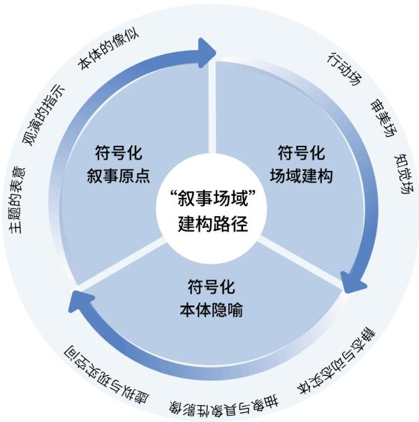
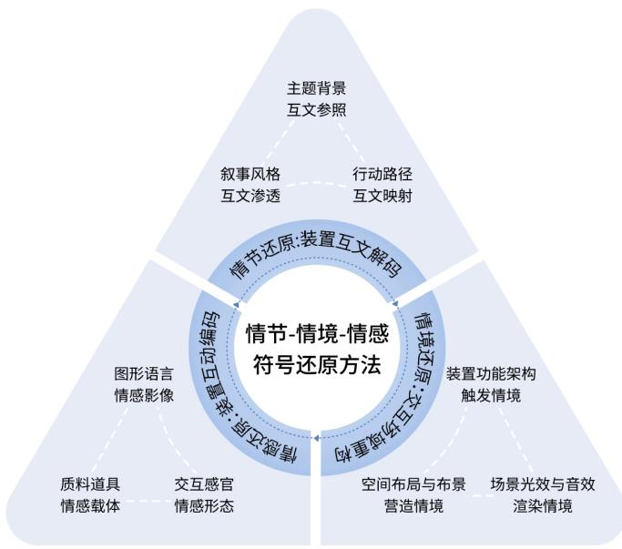
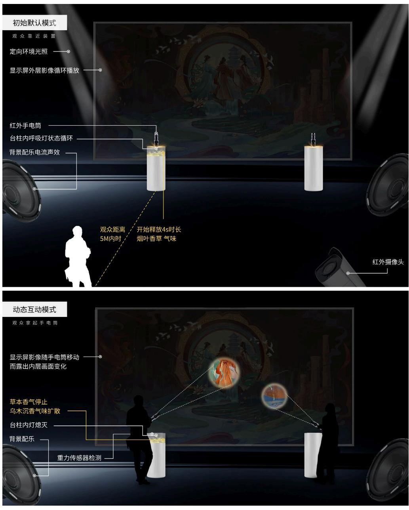
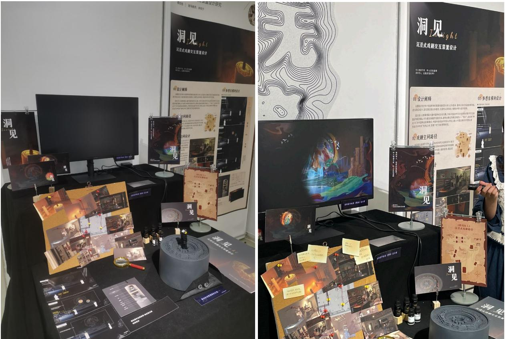

# 1. 论文基本信息

## 1.1. 标题
**中文标题：** 符号学视域下沉浸式戏剧交互装置设计研究
**英文并列题目：** Research on the Design of Interactive Devices for Immersive Theatre under the Perspective of Semiotics

## 1.2. 作者
**研究生姓名：** 蔡欣怡
**所属机构：** 江南大学 (Jiangnan University)
**专业领域：** 艺术设计
**研究方向：** 数字媒体艺术

## 1.3. 指导教师
**导师①：** 李栋宁（教授）
**导师②：** 任广军（高级工程师）

## 1.4. 发表年份与日期
**学位授予日期：** 2024 年 6 月
**文献类型：** 全日制专业硕士学位论文

## 1.5. 摘要
本文针对沉浸式戏剧中数字交互装置过度追求“数字化”“沉浸化”导致语义紊乱、遮蔽戏剧本质（戏剧性）的问题，引入符号学理论进行研究。旨在深入探究数字交互装置在戏剧符号编码与解码过程中的作用，构建沉浸式情节、情境及情感的符号意义范式。
主要内容包括：
1.  **符号学释义：** 剖析装置的伴随文本（语词、语义、语境）、场域元语言（流动、在场、弥合）及符码要素（技术、影像、媒介）。
2.  **叙事场域建构：** 围绕“叙事场域”，厘清装置符号化构建路径，建构行动场、审美场、知觉场。
3.  **符号还原方法：** 提出情节还原法（互文解码）、情境还原法（多元重构）、情感还原法（互动编码）。
4.  **实践验证：** 基于上述方法论，创作了沉浸式戏剧《四川好人》的交互装置作品《洞见》。

## 1.6. 原文链接与状态
**PDF 链接：** /files/papers/69a2c40f7c21358b9f9cdd85/paper.pdf
**发布状态：** 已完成的学位论文（未正式期刊发表，属学术预印本/学位论文库资源）

# 2. 整体概括

## 2.1. 研究背景与动机

### 2.1.1. 核心问题
当前沉浸式戏剧发展迅速，数字交互装置成为主流舞美手段。然而，部分作品存在**形式主义倾向**：过度依赖技术堆砌，忽视戏剧叙事内涵，导致“装置形式与叙事内容失衡、语义紊乱”。数字交互装置反而可能**遮蔽沉浸式戏剧的本质——戏剧性**，使观众沦为单纯的技术体验者而非剧情参与者。

### 2.1.2. 研究缺口（Gap）
现有研究多集中于单一技术应用或商业案例分析，缺乏从**符号学视角**系统探究交互装置在戏剧叙事中的编码与解码机制的理论框架。设计师往往凭经验或视觉美感进行设计，缺乏深层的符号逻辑支撑，导致作品“有技无戏”。

### 2.1.3. 切入点与创新思路
本文选取<strong>符号学（Semiotics）</strong>作为核心理论工具，将数字交互装置视为一种特殊的**戏剧符号**。通过解构装置的表意功能，建立一套从理论到实践的**符号还原设计方法**，旨在让技术服务于叙事，恢复装置的戏剧属性。

## 2.2. 核心贡献与主要发现

### 2.2.1. 理论贡献
1.  **符号化特征归纳：** 明确了沉浸式戏剧交互装置的三层伴随文本特性（显性语词、生成性语义、解释性语境）及场域元语言特征。
2.  <strong>“叙事场域”</strong>框架： 提出了包含“行动场”、“审美场”、“知觉场”的三维场域建构模型。
3.  **设计方法论：** 构建了以“情节 - 情境 - 情感”为核心的**符号还原设计体系**，为后续设计提供了可操作的方法论指导。

### 2.2.2. 实践发现
通过对调研数据分析与创作实践（《洞见》），证实了以下观点：
1.  **用户偏好：** 观众对交互装置持开放态度，但高度关注**故事性与互动性的融合**，以及对多感官体验的需求（视觉权重最高）。
2.  **设计有效性：** 基于符号还原理念设计的装置，能够有效增强观众的沉浸感与情感共鸣，避免了技术空壳化。

# 3. 预备知识与相关工作

## 3.1. 基础概念解析

为了确保初学者理解本研究，以下是对核心术语的详细解释：

### 3.1.1. 符号学 (Semiotics)
符号学是研究符号及其意义产生过程的学科。在本研究中，核心借用的是<strong>皮尔斯 (Charles Sanders Peirce)</strong> 的符号三分模型：
*   <strong>再现体 (Representamen)：</strong> 符号的物质形式（如舞台上的灯光、装置本身）。
*   <strong>对象 (Object)：</strong> 符号所代表的真实事物或概念（如剧本中的“死亡”概念）。
*   <strong>解释项 (Interpretant)：</strong> 接收者（观众）心中产生的理解或联想。
*   **翻译说明：** 通俗来说，就是研究物体如何代表意义，以及观众如何解读这些意义的学问。

### 3.1.2. 沉浸式戏剧 (Immersive Theatre)
不同于传统镜框式舞台，沉浸式戏剧打破“第四堵墙”，允许观众自由移动并参与剧情。
*   **核心特征：** 空间的多重性、观演的流动性、叙事的非线性和高参与度。
*   **典型代表：** Punchdrunk 剧团的《不眠之夜》(Sleep No More)。

### 3.1.3. 交互装置 (Interactive Installation)
结合数字感应技术与物理实体的艺术作品。
*   **功能：** 赋予雕塑或空间信息交互功能。
*   **在本研究中：** 特指用于沉浸式戏剧舞台，能够实时响应演员或观众动作、改变光影或声音的数字媒体装置。

## 3.2. 前人工作与现状

### 3.2.1. 符号学研究现状
*   **国内：** 侧重于语言学、文学应用。胡妙胜等学者将符号学应用于戏剧演出分析，提出了“戏剧符号系统”和“舞台设计美学”的概念。
*   **国外：** 历史悠久，涵盖索绪尔的语言学模式、皮尔斯的逻辑修辞模式。罗兰·巴特 (Roland Barthes) 的“作者之死”理论强调了文本的开放性，支持沉浸式戏剧的去中心化叙事。
*   **局限性：** 现有研究多关注戏剧文本本身，较少关注**数字交互装置**作为一种新型符号载体的具体编码规则。

### 3.2.2. 沉浸式戏剧研究现状
*   **趋势：** 随着“体验经济”推动，产业规模扩大（预计 2026 年突破 500 亿元）。
*   **问题：** 商业化导向严重，容易出现“弱文本化”，即过分注重视觉奇观而忽略内容深度。
*   **相关案例：** 《又见平遥》、《成都偷心》、《不眠之夜》等，展示了不同的空间形态（引导类、探索类、互动类）。

### 3.2.3. 戏剧交互装置研究现状
*   **技术发展：** 从早期的幻灯投影发展到 VR、AR、动作捕捉、全息影像。
*   **研究空白：** 虽然技术应用丰富，但针对**戏剧叙事逻辑与装置形态匹配**的系统理论研究相对匮乏。现有文献多集中在技术实现，缺乏符号学层面的深度阐释。

## 3.3. 差异化分析

| 维度 | 现有技术/研究 | 本文研究方法 |
| :--- | :--- | :--- |
| **核心视角** | 视觉艺术、工程技术优先 | **符号学与戏剧叙事优先** |
| **设计目标** | 营造氛围、感官刺激 | **还原戏剧性、传递深层含义** |
| **评价标准** | 技术新颖度、视觉效果 | **符号表意清晰度、情感共鸣深度** |
| **方法论** | 试错法、经验主义 | <strong>符号还原理论体系（情节 - 情境 - 情感）</strong> |

# 4. 方法论

本章详细拆解论文提出的核心设计理论与方法流程。由于本论文属于设计类研究，其“方法”体现为**理论架构**与**设计实施步骤**。

## 4.1. 符号学释义与分析框架

研究者首先建立了沉浸式戏剧交互装置的符号学分析框架（如图 5-2-1 所示）。该框架从三个维度剖析装置属性：

### 4.1.1. 伴随文本解码 (Accompanying Text)
装置的意义不仅在于实体，还在于其周围的文本信息。作者将其分为三层（对应原文 Table 2-1）：
*   <strong>显性语词文本 (Explicit Semantic)：</strong> 剧本中的直接对白、舞台指示。这是创作的基石。
*   <strong>生成性语义文本 (Generative Semantic)：</strong> 由语词衍生的内在意义，包括前文本（历史背景、文化典故）的影响。
*   <strong>解释性语境文本 (Interpretive Contextual)：</strong> 观众反馈、评论等二次传播形成的意义网络。

### 4.1.2. 场域元语言 (Meta-language of Field)
沉浸式戏剧的“沉浸”特性被定义为三种元语言属性：
1.  **布景形态的流动：** 空间不是固定的，而是随剧情或观众移动而变化（如《不眠之夜》的多楼层结构）。
2.  **观演动线的在场：** 观众身体进入戏剧空间，成为表演的一部分（具身在场性）。
3.  **场域界限的弥合：** 打破“台上 - 台下”二元对立，虚实空间交融。

### 4.1.3. 装置符码 (Code of Device)
装置被视为由以下符码构成的系统：
*   **技术表现：** 动作捕捉、全息、VR/AR 等技术的应用。
*   **影像再现：** 实时影像或预录影像的投射。
*   **媒介诠释：** 观众对装置内容的动态解读过程。

    下图（原文 Figure 3-1）展示了“叙事场域”的建构路径框架，是整个方法论的核心图示：

    
    *该图像是示意图，展示了沉浸式戏剧交互装置中的‘叙事场域’建构路径框架，涵盖了叙事原点、场域结构、本体隐喻等要素，体现了不同场景对叙事的影响。*

## 4.2. “叙事场域”建构路径

为了不让装置脱离剧情，作者提出了基于“叙事场域”的建构路径。该路径包含三个核心场域的符号化构建：

### 4.2.1. 符号化叙事原点
设计起点必须是戏剧文本。
*   **主题表意：** 装置需隐喻剧本主题（如善与恶）。
*   **观演指示：** 装置引导观众行为（如拿起手电筒提示前行）。
*   **本体像似：** 装置外观需与剧情设定相似（如复古烟铺）。

### 4.2.2. 三重场域建构
作者将沉浸式场域细分为三个层级，装置设计需覆盖这三层：
1.  <strong>行动场 (Action Field)：</strong> 涉及角色的动作空间。包括区域划分（前屋/后屋）、支点设置（互动点）、路径设计。
2.  <strong>审美场 (Aesthetic Field)：</strong> 涉及空间形态与视觉符号。包括形状（几何线条）、色彩与肌理（旧物处理）、声光电装饰。
3.  <strong>知觉场 (Perception Field)：</strong> 涉及全感官体验。调动观众的五感（视、听、触、嗅、味），形成通感联觉。

### 4.2.3. 符号化本体隐喻
装置本身应蕴含多重意义：
*   **静态与动态实体：** 如机械装置的固定结构与运动部件的对比。
*   **抽象与具象影像：** 虚拟影像既可以是写实场景，也可以是抽象符号。
*   **虚拟与现实空间：** 利用数字技术模糊物理边界，创造“真实的虚拟”。

## 4.3. 符号还原设计方法

这是论文最核心的创新点，提出了一套具体的设计操作流程，称为“符号还原方法”（对应原文 Figure 4-1）：

*该图像是图4-1，展示了沉浸式戏剧交互装置的符号还原方法框架。图中包含多个互动元素，如情境-情感符号还原方法和相关的互动机制，适用于设计相关的交互装置。*

该方法论分为三个递进步骤：

### 4.3.1. 情节还原法：互文解码 (Intertextual Decoding)
目的是确保装置内容与剧本一致。
1.  **主题背景的互文参照：** 调研剧本的历史背景、文化内涵，提取符号元素（如四川好人中的巴蜀纹样）。
2.  **叙事风格的互文渗透：** 根据剧本风格（如现实主义 vs 荒诞主义）确定装置的艺术风格。
3.  **观众行动路径的互文映射：** 规划观众动线与剧情节点同步，确保互动触发关键剧情。

### 4.3.2. 情境还原法：多元重构 (Multilateral Reconstruction)
目的是营造逼真的戏剧情境。
1.  **功能架构触发情境：** 利用传感器、控制器等技术底层逻辑，实现预设的剧情触发（如拿起道具触发音效）。
2.  **空间布局与布景：** 结合物理空间的尺寸、材质，还原特定时代或地点的氛围（如烟铺的做旧处理）。
3.  **光效与音效渲染：** 利用自然光源模拟昼夜变化，利用环绕声构建立体音场，烘托氛围。

### 4.3.3. 情感还原法：互动编码 (Interactive Encoding)
目的是引发观众的情感共鸣。
1.  **质料载体搭建：** 选择具有象征意义的材料（如木料代表传统，金属代表工业）。
2.  **图形语言内置：** 影像内容融入情感符号（如荆棘代表苦难，生命之树代表希望）。
3.  **外延形态互动：** 通过多感官交互（触觉震动、气味释放）将生理反应转化为情感体验。

## 4.4. 创作实践流程： 《洞见》装置
基于上述理论，作者进行了名为《洞见》的创作实践。流程图如下：

*该图像是示意图，展示了一种沉浸式戏剧交互装置的初始功能模型和动态功能模型。图中描述了红外手电筒与观众之间的互动，通过调整灯光和声音，观众可以体验到不同的空间氛围与场景变化。*

该流程展示了从初始默认模式、动态互动模式到过渡重置模式的完整循环，体现了方法论的落地。

# 5. 实验设置

为了验证设计方法的可行性及用户需求，作者进行了问卷调查与实践原型测试。

## 5.1. 数据集与问卷调研

### 5.1.1. 数据来源
作者设计了针对性的调查问卷，旨在了解观众对沉浸式戏剧交互装置的认知、体验需求及期望。
*   **发放渠道：** 多个平台线上投放。
*   **样本总量：** 回收问卷 202 份。
*   **有效样本：** 剔除答题时间异常、逻辑矛盾（如表示从未参与却精通技术）的问卷 27 份。
*   **最终有效数：** $N = 175$ 份。
*   **有效率：** 86.63%。

### 5.1.2. 样本特征
根据调研数据（如图 5-2 至 5-4），受众群体特征如下：
*   **性别分布：** 男性 50.86%，女性 49.14%（比例均衡）。
*   **年龄分布：** 主要集中在青年群体，18-24 岁占 36%，24-34 岁占 43.43%。
*   **城市分布：** 主要为杭州、无锡、上海、广州等一二线城市。
*   **经验分布：** 53.14% 偶尔参加，19.43% 经常参加，27.43% 从未参加过此类活动。

## 5.2. 评估指标与变量分析

本研究没有传统的数值计算指标，而是采用了**感知偏好指标**与**满意度评分**。

### 5.2.1. 感官重要性排序
调查询问了观众对不同感官体验的重视程度。结果如下表（原文 Table 5-1）：

<table>
<thead>
<tr><th>选项</th><th>综合得分</th><th>第 1 位 (人数/%)</th><th>第 2 位</th><th>第 3 位</th><th>第 4 位</th><th>第 5 位</th><th>小计</th></tr>
</thead>
<tbody>
<tr><td>视觉效果</td><td>2.99</td><td>60(41.67%)</td><td>18(12.5%)</td><td>31(21.53%)</td><td>24(16.67%)</td><td>11(7.64%)</td><td>144</td></tr>
<tr><td>听觉效果</td><td>2.79</td><td>22(15.71%)</td><td>59(42.14%)</td><td>34(24.29%)</td><td>15(10.71%)</td><td>10(7.14%)</td><td>140</td></tr>
<tr><td>嗅觉效果</td><td>2.52</td><td>30(22.39%)</td><td>30(22.39%)</td><td>35(26.12%)</td><td>27(20.15%)</td><td>12(8.96%)</td><td>134</td></tr>
<tr><td>触觉效果</td><td>2.22</td><td>34(27.2%)</td><td>22(17.6%)</td><td>24(19.2%)</td><td>13(10.4%)</td><td>32(25.6%)</td><td>125</td></tr>
<tr><td>味觉效果</td><td>2.11</td><td>29(24.17%)</td><td>29(24.17%)</td><td>8(6.67%)</td><td>31(25.83%)</td><td>23(19.17%)</td><td>120</td></tr>
</tbody>
</table>

*   **数据分析：** 视觉效果排名最高，其次是听觉和嗅觉。这直接影响了《洞见》装置的设计侧重（视觉为主，辅以嗅觉与触觉）。

### 5.2.2. 交互形式偏好
调查比较了三种常见的交互方式：
1.  借助道具自由探索影像。
2.  影像感应肢体动作变动。
3.  指定界面操作控制。

    下表（原文 Table 5-2）显示了结果：

    <table>
    <thead>
    <tr><th>选项</th><th>综合得分</th><th>第 1 位 (人数/%)</th><th>第 2 位</th><th>第 3 位</th><th>小计</th></tr>
    </thead>
    <tbody>
    <tr><td>借助道具可以在空间内 自由探索影像装置</td><td>2.3</td><td>84(48.84%)</td><td>63(36.63%)</td><td>25(14.53%)</td><td>172</td></tr>
    <tr><td>影像感应肢体动作变动 而变化</td><td>1.85</td><td>44(25.88%)</td><td>66(38.82%)</td><td>60(35.29%)</td><td>170</td></tr>
    <tr><td>在指定的界面中操作来 控制装置</td><td>1.74</td><td>47(27.49%)</td><td>40(23.39%)</td><td>84(49.12%)</td><td>171</td></tr>
    </tbody>
    </table>

*   **结论：** 接近半数用户最喜欢“借助道具自由探索”的模式。这也决定了《洞见》采用了手持红外手电筒作为交互道具的方案。

### 5.2.3. 存在问题反馈
调研揭示了当前沉浸式戏剧交互装置的主要痛点（见图 5-10）：
1.  <strong>互动影像内容单一或重复 (53.71%)</strong>
2.  <strong>故事性与互动性融合不足 (46.86%)</strong>
3.  <strong>反馈延迟、不流畅或不准确 (44%)</strong>
4.  <strong>操作复杂性 (36.57%)</strong>

## 5.3. 对比基线
本研究并未与传统算法模型对比，而是以**现有的通用沉浸式戏剧交互设计模式**作为基线。
*   **基线缺点：** 常见的设计往往仅关注视觉特效，忽视了与剧本的深度互文，且交互反馈常出现技术延迟。
*   **本文改进：** 通过“符号还原”强调内容与形式的统一，并通过技术调试减少延迟。

# 6. 实验结果与分析

## 6.1. 核心结果分析

### 6.1.1. 互动意愿与体验影响
数据显示观众对交互装置持积极态度，但也存在顾虑。
*   **互动意愿：** 约 86% 的受访者表示“比较愿意”或“非常愿意”与装置互动（见 Figure 5-8）。
*   **阻碍因素：** 不愿互动的主要原因通常是“反馈延迟”、“影像单一”或缺乏引导（见 Figure 5-9）。
*   **剧情沉浸帮助：** 42.29% 的受访者认为装置有助于沉浸剧情；42.86% 认为能增强情感共鸣（见 Figure 5-11, 5-12）。

    这表明，如果设计得当，交互装置确实能成为连接观众与剧情的桥梁，而非干扰源。

### 6.1.2. 装置设计优化建议
调研结果显示了用户对理想装置的期待：
*   **最重要因素：** 多感官沉浸 (57.71%)、新颖的设计 (54.86%)、互动的流畅 (52%)（见 Figure 5-14）。
*   **相关性分析：** 研究发现，对装置了解越多的观众越希望互动（相关系数 $r = 0.33$）；装置能否帮助沉浸剧情与能否增强情感体验呈显著正相关 ($r = 0.47$)。

## 6.2. 《洞见》装置效果分析

基于上述调研，《洞见》装置在设计上做了针对性调整：
1.  **形式选择：** 采用“借助道具自由探索”模式（符合 48.84% 的最高偏好）。
2.  **感官配置：** 重点强化了视觉与嗅觉的结合。视觉上使用双层影像（红外手电筒照亮），嗅觉上设计了“烟叶香草”与“乌木沉香”两种气味切换。
3.  **交互逻辑：** 设置了初始、动态、重置三种模式，确保体验闭环，避免技术故障导致的脱节。

    下图（原文 Figure 5-33）展示了《洞见》的实际展示与体验效果：

    
    *该图像是图5-33，展示了沉浸式戏剧《洞见》的交互装置设计与体验效果。图中包含展示屏幕和相关道具，旨在呈现该项目的整体设计理念与用户参与体验。*

## 6.3. 数据呈现总结
以下是原文 [图表 5-1] 关于感官重要程度的详细数据总结：
视觉效果的平均得分最高（2.99），表明它是观众感知沉浸感的基石。虽然触觉和味觉也是选项，但在当前技术水平下，视觉仍是主导。这解释了为何《洞见》将红外投影作为核心交互手段。

# 7. 总结与思考

## 7.1. 结论总结

本文系统地完成了从理论构建到实践验证的全过程，主要结论如下：
1.  **理论价值：** 成功将符号学引入沉浸式戏剧交互装置设计，构建了包含“伴随文本”、“场域元语言”、“装置符码”的分析框架。
2.  **方法创新：** 提出了“情节还原 - 情境还原 - 情感还原”的三重符号还原设计方法，解决了技术堆砌与叙事缺失之间的矛盾。
3.  **实践验证：** 通过《洞见》装置证明，基于符号学理论的设计能有效提升观众的沉浸感与情感共鸣，实现了技术服务于戏剧性的初衷。

## 7.2. 局限性与未来工作

作者在第六章明确指出了研究的不足之处及未来展望：

### 7.2.1. 局限性
1.  **理论深度：** 对符号学基础理论的挖掘尚不够深入，不同文化背景下符号差异的研究有待加强。
2.  **技术前沿：** 对新兴技术（如 AI、元宇宙）的应用探索还不够全面。
3.  **运行细节：** 在实际运行中，如何确保各环节转换流畅、多感官干扰屏蔽等技术细节仍需反复验证。

### 7.2.2. 未来工作方向
1.  **跨文化研究：** 对比不同文化语境下的装置设计特性，探索全球化与本土化的结合策略。
2.  **新技术融合：** 深化 AI、VR、MR 等技术在交互装置中的应用研究，重塑叙事结构与表达方式。
3.  **大规模实践：** 结合更多题材和群体，完善设计方法的普适性，为行业提供更具前瞻性的指南。

## 7.3. 个人启发与批判

### 7.3.1. 启发性
该论文最大的启示在于提醒设计师：**技术只是手段，叙事才是目的。** 在数字媒体飞速发展的今天，许多创作者容易迷失于炫技，忽略了艺术作品的灵魂。本文提供的符号学视角是一个非常有力的“纠偏”工具，它将抽象的叙事要求转化为了具体的设计参数（如纹理代表历史厚重感，气味代表记忆唤醒）。

### 7.3.2. 潜在问题与改进
*   **主观性风险：** 符号学的解读具有一定的主观性（“一千个读者有一千个哈姆雷特”）。如何确保设计师编码的符号能被大众准确解码？论文中提到通过问卷了解受众偏好，这是一个很好的量化补充，但仍可进一步结合眼动追踪等更客观的神经科学方法来测量观众的真实注意力分布。
*   **技术成本：** 文中提到的复杂交互装置（如红外感应、气味扩散、多层投影）制作成本高、维护难。在未来的推广中，是否需要考虑开发低成本、模块化的替代方案，以适应中小型剧团的需求？
*   **标准化缺失：** 目前沉浸式戏剧交互装置缺乏统一的标准。未来是否可以建立一套通用的交互接口标准或叙事脚本模板，降低行业门槛？

    综上所述，这是一篇理论与实践结合紧密的佳作，为数字媒体艺术与传统戏剧的交叉融合提供了有价值的参考路径。