# 江南大学

# 全日制专业硕士学位论文

题 目： 符号学视域下沉浸式戏剧交互装置设计研究

英文并列题目： Research on the Design of Interactive Devices for Immersive Theatre under the Perspective of Semiotics

研究生： 蔡欣怡 专业领域： 艺术设计

研究方向： 数字媒体艺术

导师 $\textcircled{1}$ 姓名： 李栋宁 职 称： 教授

导师 $\textcircled{2}$ 姓名： 任广军 职 称： 高级工程师

指导小组成员：

学位授予日期： 2024年6月

# 江南大学

地址：无锡市蠡湖大道1800 号二〇二四年六月

# 摘要

数字技术的革新为戏剧艺术赋能，催生了沉浸式戏剧的新观念与新形式，数字交互装置作为舞台创作的主流手段之一，亦为沉浸式戏剧注入了新活力。然而，由于部分沉浸式戏剧作品过度追求“数字化”“沉浸化”，导致装置形式与叙事内容失衡、语义紊乱，以至戏剧叙事符号语用错乱现象时有发生，舞台交互装置反倒遮蔽了沉浸式戏剧的本质一一戏剧性。籍此，深入探究数字交互装置在戏剧符号编码与解码过程，构筑沉浸式情节、情境及情感的符号意义范式，成为戏剧舞美设计领域重要的数字媒体艺术论题。本文即是将装置中叙事结构、场域关系及内涵机制，置身于符号学理论视野下进行考察，建构出沉浸式戏剧交互装置设计方法，以期创作出彰显戏剧性的数字交互装置作品。

首先，聚焦沉浸式戏剧交互装置的符号学释义。剖析沉浸式戏剧交互装置伴随文本的显性语词、生成性语义以及解释性语境特征；梳理出装置在戏剧场域中，流动性布景形态、在场性观演动线、弥合性场域界限的元语言属性；归纳出装置本体内可表现的技术、可再现的影像和可诠释的媒介等符码要素。

其次，围绕“叙事场域”，厘清沉浸式戏剧交互装置的符号化构建路径。明晰戏剧叙事对装置主题的表意、对观演的指示以及对装置的像似等坐标原点；针对装置的沉浸式“行动场”“审美场”“知觉场”三个场域进行建构；继而，构筑出沉浸式戏剧交互装置的符号化隐喻本体。

再者，提出沉浸式戏剧交互装置的符号化还原设计方法。以戏剧情节的主题背景、叙事风格和行动路径，对装置互文性解码；继而在交互场域中，借助装置的功能架构、空间布局与布景、场景的声光效果，营造沉浸式情境；进而搭建装置质料载体、内置图形语言影像，使其在多感官交互中外延形态，以此晰出沉浸式戏剧交互装置的情感互动设计方法。

最后，基由上述设计方法论，创作《洞见》一一沉浸式戏剧《四川好人》交互装置。遵循符号化还原理念，预设装置的主题、风格与路径，并通过空间布景与声光还原沉浸式情境，最终在质料、影像、多感官设计中引发情感的深度再现。

关键词：符号学；数字交互装置；沉浸式戏剧；叙事场域；戏剧性

# Abstract

The innovation of digital technology has empowered theatre art, giving rise to new concepts and forms of immersive theatre. As one of the mainstream means of choreographic creation, digital interactive installation has also brought new vitality to immersive theatre. However, some immersive theatre works show excessive pursuit of "digital" and "immersive" phenomena, in which the form of the device is imbalanced with the narrative content and the semantics are disordered. So much so, that the phenomenon of discursive disorders in theatre narrative symbols occurs from time to time. Stage interaction devices in turn obscure the essence of immersive theatre - theatricality. Therefore, in-depth investigation of digital interactive devices in the process of encoding and decoding theatre symbols, how to construct the immersive plot, situation and emotional symbolic meaning paradigm, which has become an important digital media art thesis in the field of theatre choreography. In this paper, the narrative structure, field relationship and connotation mechanism of immersive theatre interactive devices are used to construct an immersive theatre interactive device design method under the perspective of semiotic theory. The aim is to create a digital interactive device design work that highlights the theatricality of the theatre.

Firstly, the paper focuses on the semiotic interpretation of immersive theatre interactive devices. It analyses the features of explicit semantics, generative semantics and interpretive context within the accompanying text of the device. And in the theatre field of the digital interactive device, meta-linguistic atributes such as the fluidity of the set form, the presence of the viewing relationship,and the bridging field are sorted out. The symbolic elements of the digital interactive device ontology are summarised， such as expressve technology, reproducible images and interpretable media.

Secondly, around the "narrative field", the symbolic construction path of immersive theatre interactive devices is clarified. It clarifies the origin of the coordinates of the theatre's narrative in terms of its representation of the theme of the digital interactive device, its instructions to the audience,and its resemblance to the device. Construct the immersive "action field", "aesthetic field" and "perception field" of the installation. Then, the symbolic metaphor ontology of the immersive theatre interactive device is constructed.

Furthermore, the symbolic restoration design method of the immersive theatre interactive device is proposed. Based on the thematic background, narrative style and action path of the theatre, the device is decoded intertextually. Following this, an immersive theatre situation is created with the help of the functional structure of the installation, the spatial layout and set, and the sound and light effects of the scene. Then, the material carrier of the installation and the built-in graphic language image are constructed, so as to extend the form in the multisensory interaction. In this way, the design methodology of the immersive theatre interactive device for emotional interaction is clarified.

Finally, based on the above design methodology, "Insight" was designed to create the immersive theatre "Der Gute Mensch Von Sezuan" interactive installation. In order to realise the context of the immersive theatre, following the concept of symbolic reduction, the theme, design style and action path of the installation were predefined, combined with the spatial set, sound and light efects. In the end, the texture, moving image and multi-sensory design triggers the audience's emotions to be reproduced in depth.

Keywords: Semiotics; Digital interactive installation; Immersive theatre; Narrative fields; Theatricality

# 目录

第一章绪论..  
1.1选题缘由  
1.1.1 需求驱动沉浸式戏剧形态创新.  
1.1.2 数字技术赋能交互装置与沉浸式戏剧的融合 2  
1.1.3 符号学对沉浸式戏剧交互装置设计理论关照 .2  
1.2 国内外研究现状 .2  
1.2.1 符号学研究现状.. .2  
1.2.2沉浸式戏剧研究现状. ..5  
1.2.3 戏剧交互装置研究现状. ..8  
1.3 研究目的. .10  
1.4 研究意义.... ....10  
1.4.1 理论意义. ..10  
1.4.2 实践意义... ....11  
1.5 研究创新点. ...11  
1.5.1 学术观点创新. ..11  
1.5.2 设计方法创新. ..12  
1.6 论文方法与框架.. ..12  
1.6.1 研究方法. ..12  
1.6.2 研究框架 ..13  
第二章 沉浸式戏剧交互装置的符号学释义. ...14  
2.1 语词、语义、语境:沉浸式戏剧的伴随文本 ....14  
2.1.1 语词:装置显性伴随文本.. ...15  
2.1.2 语义:装置生成性伴随文本 ..16  
2.1.3 语境:装置解释性伴随文本 ....17  
2.2 流动、在场、弥合:沉浸式戏剧场域的元语言 ..17  
2.2.1 布景形态的流动... ....18  
2.2.2 观演动线的在场. ..20  
2.2.3 场域界限的弥合 ..21  
2.3 表现、再现、诠释:沉浸式戏剧交互装置的符码， ...21  
2.3.1 戏剧交互装置的技术表现. ..22  
2.3.2戏剧交互装置的影像再现 ..24  
2.3.3 戏剧交互装置的媒介诠释. ..25  
第三章 沉浸式戏剧交互装置中的"叙事场域"建构路径 ..26  
3.1 沉浸式戏剧交互装置的符号化叙事原点. .27  
3.1.2 戏剧叙事对交互装置观演的指示. .28  
3.1.3 戏剧叙事对交互装置本体的像似. .29  
3.2 沉浸式戏剧交互装置的符号化场域建构 .31  
3.2.1 交互装置的沉浸式"行动场"建构， ..31  
3.2.2 交互装置的沉浸式"审美场"建构. ..33  
3.2.3 交互装置的沉浸式"知觉场"建构. ..34  
3.3 沉浸式戏剧交互装置的符号化本体隐喻 ..35  
3.3.1 静态与动态性实体结构.. ..36  
3.3.2 抽象与具象性影像视觉. ..37  
3.3.3虚拟与现实性空间沉浸. ..38  
第四章 沉浸式戏剧交互装置的符号还原方法 ...39  
4.1情节还原法:沉浸式戏剧交互装置的互文解码 ..40  
4.1.1 主题背景的互文参照. ...40  
4.1.2 叙事风格的互文渗透. ..41  
4.1.3 观众行动路径的互文映射， ..41  
4.2 情境还原法:沉浸式戏剧交互场域的多元重构 ....42  
4.2.1 装置的功能架构触发情境. ..43  
4.2.2 空间的布局与布景营造情境 ...44  
4.2.3场景的光效与音效渲染情境 ..45  
4.3 情感还原法:沉浸式戏剧交互装置的互动编码 ..46  
4.3.1质料实体与道具搭建情感化载体.. ..47  
4.3.2 图形语言内置情感化影像. ...48  
4.3.3交互动作与感官外延情感化形态.. ...49  
第五章《洞见》—沉浸式戏剧《四川好人》交互装置创作实践....52  
5.1《洞见》数字交互装置的情节诠释设想 .52  
5.1.1 叙事背景与主题隐.. ...52  
5.1.2 风格定调与符号提炼.. ...53  
5.1.3 观众的动线路径... ....5.4  
5.2《洞见》沉浸式场域的情境还原创作  
5.2.1用户调研与框架预设.. ·················· ..5  
5.2.2 空间布景设计.. ···················· ...59  
5.2.3光效与音效设计. ···················· ...62  
5.3《洞见》数字交互装置的情感再现设计 ························ ...63  
5.3.1交互装置的质料与道具设计. ..63  
5.3.2交互装置的影像设计.. ..65  
5.3.3 交互装置的多感官模块设计. ..66  
第六章 结论与展望.. ..73

6.1 课题总结. .73

6.1.1 主要结论. ..73  
6.1.2 不足之处. .74

6.2课题展望. .74 参考文献.. .75

附录 A:图片来源 .78  
附录C:问卷调研. .81

# 第一章绪论

# 1.1选题缘由

# 1.1.1需求驱动沉浸式戏剧形态创新

近年来，随着数字科技的突飞猛进，沉浸式戏剧在国内外文化娱乐市场中呈现出蓬勃发展态势。在“体验经济”模式与“互联网 $^ +$ ”背景的催化作用下，“沉浸”热度不断上升，沉浸式体验作为一种文化消费现象，受到广大观众尤其青年的热烈追捧。数字化政策的推动，Z世代主要消费群体对个性化、体验化、多元化消费特征偏好，以及受众整体审美需求的不断提升，均促进了沉浸式演出的飞速发展，为沉浸式戏剧的创新提供了有力支持。

《旅游绿皮书：2020—2021年中国旅游发展分析与预测》揭示了沉浸式演艺在未来文化生活中的主流地位。据《2022 年中国沉浸式产业白皮书》数据显示，2021 年中国沉浸式产业总产值达160亿元，预计 2026年有望突破 500亿元。沉浸式娱乐大致划分为，以剧情驱动与科技支撑为主的场景体验两类形态，前者则以沉浸式戏剧为代表，构建出情境叙事与高度参与感，塑造出独特艺术形式与消费吸引。《“十四五”文化和旅游发展规划》为数字文化产业尤其是沉浸式体验新业态的发展给予有力支持。《“十四五”文化产业发展规划》将沉浸式体验全面赋能文化产业发展。沉浸式产业历经了四个阶段（如图1-1 所示)，出现沉浸式戏剧、沉浸式新媒体、沉浸式演艺、沉浸式主题乐园各种“沉浸式体验”场景应用广泛，同时“戏剧 $^ +$ ”1的理念也为沉浸产业带来新活力，带给观众浸入式观剧体验，由此广受观众追捧，逐渐形成一股文化热潮。

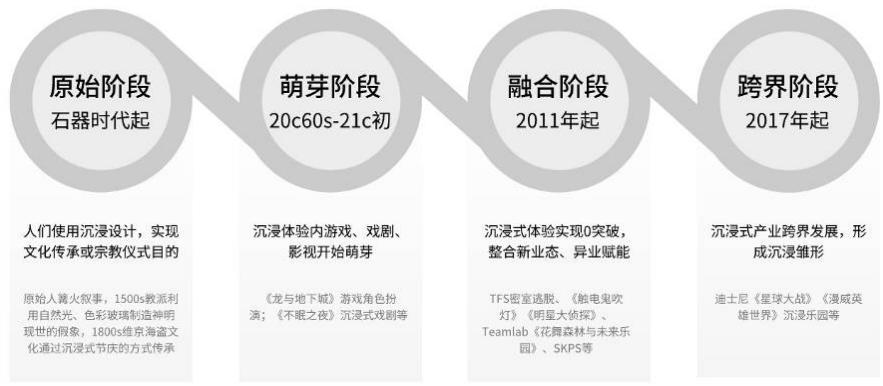  
资料来源：依《幻境-中国沉浸产业发展白皮书》等资料分析整理  
图1-1沉浸式产业发展历程（来源：作者转绘）

沉浸式数字技术深入各领域，尤其在戏剧领域中蓬勃发展，其变革性不容忽视。传统戏剧形式逐渐与沉浸式数字技术相结合，创新出沉浸式戏剧，满足了观者对互动性、参与性、多样性的审美需求。而随着沉浸式戏剧的大量排演，其中内部结构如戏剧空间、数字交互装置的形式也亟需推陈出新。

# 1.1.2数字技术赋能交互装置与沉浸式戏剧的融合

在沉浸式戏剧的语境下，数字交互装置的应用已成为拓展传统舞美设计疆界的关键手段之一，在舞台中展现出前所未有的视觉表达与深度互动潜能，构筑了一个身份多元、虚实交融的“舞台宇宙”。鉴于沉浸式戏剧交互装置对戏剧表现与观演体验的显著提升价值，其应用研究尤为迫切且意义深远。

沉浸式戏剧极具多样包容性，融合了现代涌现出的新材料和新技术，诸如增强现实（AR）、混合现实（MR）、大数据、人工智能（AI）、全息投影、图像识别、传感识别、动态捕捉以及互动新媒体等前沿技术手段，有力地驱动了沉浸式戏剧向数字化深度转型。数字交互装置的应用也在沉浸式戏剧的舞台空间延伸中形成新的探索。在戏剧交互装置构筑的沉浸式复合空间内，戏剧事件的变化具有复杂性，因而往往要求配合精准的动作捕捉系统、高效的信息处理单元以及高保真的数据还原输出设备。面对繁杂多元的技术语言元素，沉浸式戏剧交互装置的构建亟需遵循系统化的设计框架与策略方法。

# 1.1.3符号学对沉浸式戏剧交互装置设计理论关照

数字交互装置虽为沉浸式戏剧带来了更多的可能性，但部分创作者过度依赖技术表象的堆砌，而忽视沉浸式戏剧美学与内涵的问题也逐渐凸显。沉浸式戏剧中数字交互装置的本质遭受挑战，因此，其创作观念需成熟的研究方法。

数字交互装置旨在通过对传统符号形态的创新再造，对语义的不懈探求和表意的持续拓展，深入沉浸式戏剧内部结构，参与戏剧叙事，蕴含、凸显其审美价值，并延伸出其审美符号。沉浸式戏剧、数字交互装置与符号学本身具有契合性，而舞台具有假定性，沉浸式戏剧“舞台”中的一切都是符号，数字交互装置艺术不仅超越了其物质载体的原初属性，更具有深远的象征意指功能。由此，具有符号意义的沉浸式戏剧交互装置，其设计过程尤需相应的理论关照。

以符号学为研究方法论，有助于深入挖掘沉浸式戏剧的数字交互装置设计的内在逻辑与文化内涵，解码沉浸式戏剧交互装置的叙事符号文本、空间观念、观演互动，编码装置的“舞台”本体符号，推动沉浸式戏剧中舞美、装置的创新发展。此外，符号学的理论框架还可以为沉浸式戏剧的设计提供新的思路和方法，帮助创作者更好地构建剧情、塑造角色和营造氛围，进而提升观众的沉浸感体验。

# 1.2国内外研究现状

# 1.2.1符号学研究现状

目前符号学研究主要集中在如语言学、文学、艺术、传播学等多领域，并呈现出跨学科式发展趋势，梳理符号学研究现状及其对沉浸式戏剧交互装置研究的指导意义。

国内研究现状：

关于符号表意的思索，以魏晋王弼为代表的学者，通过对“言”、“象”、“意”三者关系的精辟阐述，“夫象者、出意者也，言者、明象者也²”，强调通过“言”以观“象”，进而探求“意”，构建了多层次意指系统的理论框架。诗人司空图以“象外之象，意也3”点破艺术符号的结构。这些符号学思想为本文引入符号学方法，把握主体分析提供理论支持。

国内符号学研究在20 世纪有所继承与发展，主要体现在符号学基本理论、语言符号学研究、符号应用研究等多方面。1926年赵元任在《符号学大纲》中首次提出“符号学”的中文术语并界定其定义，标志着中国符号学的萌芽。此后，学者们不断挖掘中国本土文化和西方理论，逐步形成了具有中国特色的民族符号学体系。赵毅衡在《中国符号学六十年》中回顾了这一发展历程，从20 世纪前 30年的初步译介，到 80年代作为“文化热”一部分的迅速崛起，直至90 年代以来的学科繁荣与多领域纵深发展4。其《符号学：原理与推演》进一步剖析了符号文本表意、解释、修辞机制，以及符码、元语言等符号文本。王铭玉在《中国符号学的理论依归和学术精神》中强调了中国艺术符号学的四大倾向一一结构主义、形式主义、象征主义、同构表意，并倡导在吸收西方符号学理论精华的基础上，结合中国传统文化特性，构建适应本土情境的符号观。

符号学在戏剧领域中分支形成戏剧符号学。运用符号学理论、视角与基本方法，研究主要集中于戏剧符号系统、剧场交流系统以及文本系统三大基本范畴。国内符号学主要作为一种研究方法应用于戏剧分析及文本解读中。《戏剧符号学导引》作为我国首部戏剧符号学专著，胡妙胜系统介绍了西方符号学家和戏剧符号学理论，详细阐述了戏剧演出的符号，外延、内涵与内向符号三层意义7，为本文戏剧交互装置符号化研究提供思路。《戏剧演出符号学引论》中，胡妙胜结合中国传统戏剧特色，将空间纳入戏剧符号系统的重构，并对空间符码、形体动作交流、类语言等符号系统在戏剧交流中的作用进行了深入论述8。宫宝荣在《戏剧符号学概述》中主张从具体演出的“符码构建过程”出发，构建“导演话语”的符号系统，关注视觉成分的组织结构与演出文本的内在联系。胡妙胜的《充满符号的戏剧空间》则运用符号学方法分析戏剧空间与舞台设计，强调舞台设计创造的实用（组织动作空间）、再现（描绘动作环境）、表现（表现动作情绪与意义）三重功能的符号化戏剧空间，关注其在传达戏剧动作情感与意义方面的价值10，也为本文沉浸式戏剧场域设计构建提供了理论背景依据。胡一伟的《戏剧：演出的符号叙述学》中详细阐述了戏剧演出中的伴随文本、戏剧演出媒介，及作为物到符号媒介的转换过程，以及具有身体性的演出媒介中演出叙述的两大特征界定1。以上研究为本文以符号学角度解读沉浸式戏剧、构建沉浸式戏剧交互装置符号与文本理论提供研究范式与崭新视角。

国外研究现状：

国外符号学研究历史悠久且体系完备，历经四种模式、三个阶段形成涵盖多元学科的知识框架。瑞士语言学家索绪尔（Ferdinand de Saussure）于1916年在《普通语言学教程》中首次提出“符号学”概念。随后历经四种模式：索绪尔的语言学模式、皮尔斯（Charles Sanders Peirce）的逻辑-修辞学模式、卡西尔（Ernst Cassirer）的文化符号论、巴赫金（Bakhtin Michael）的语言中心马克思主义模式。三个阶段：20 世纪上半期为模式的奠定和解释阶段，出现一批最早的推进者；第二阶段为 20 世纪六七十年代，符号学成为人文-社科规模宏大的总方法论，索绪尔符号学发展成60年代结构主义大潮；第三阶段于 70 年代中期到目前仍在展开，皮尔斯的开放模式取代了索绪尔模式，由此结构主义自我突破成为后结构主义。在当代西方美学著作中，罗兰·巴特（Roland Barthes）《符号学美学》率先提出基于“语用”、“语义”、“语形”三要素符号学系统理念，开创性探讨符号学的美学领域应用12。在其《符号学原理》中，巴特从“语言与话语”“能指与所指”“范式与系统”“外延与内涵”四个维度阐述符号学基础知识 13。皮尔斯《皮尔斯：论符号》中阐明了符号学现象学基础、符号三分构造、符号的三分构造、分类体系，以及符号学与其他学科的关联14。克里斯蒂娃（JuliaKristeva）在《符号学：符义分析探索集》中，以动态、对话、潜意识角度阐释“主体”与“互文性”的互动，确立符义分析的方法论15。以上符号学的历史梳理与范畴研究为本研究引入符号学方法提供基本理论背景。

随着符号学步入多模式发展阶段呈现多元化趋势，并应用于戏剧文本、戏剧表演之中。结构主义语言学和形式主义文学批评催生了戏剧符号学萌芽产生于 20 世纪初，兴起于 70年代。20世纪三四十年代，国外最早将符号学引入戏剧创作研究领域，布拉格学派（Prague School）开始将符号学应用于舞台。1931年，奥塔卡·齐奇（OtakarZich）和穆卡罗夫斯基（Jan Mukarovsky）的《戏剧美学》和《试析演员现象的结构》中开辟了符号学研究戏剧方法，基于接受美学、现象学、索绪尔语义符号学“能指”与“所指”，分析戏剧事件并指出戏剧文本中的人物形象与其在表演中的呈现之间的主观意识差异。该学派代表人物维尔特鲁斯基（Jiri Valtrushy）认为“舞台上一切皆是符号”，随后《民间戏剧符号学》（1938年）和《作为记号的服饰》(1940 年)，布鲁萨克的《中国戏剧的符号》（1939 年），洪泽尔（Jindrich Honzl）的《戏剧符号的动态性》（1940年）进一步深化与发展戏剧符号学理论，共同构建早期理论框架。

60 年代起，戏剧符号学在意大利与法国学者的引领下于欧陆地区掀起第二轮研究热潮16，根据对象的宏观划分，聚焦于语言文本符号学与演出文本符号学两大分支的深入探究。柯赞首度将符号学融合戏剧表演，并对戏剧符号系统进行初步编码，1968年《戏剧的符号》中提出涵盖戏剧视听、时空维度的13 种符号系统。六七十年代结构主义语言学、交流理论与叙事学构成欧洲主导的符号学研究路径，80 年代起戏剧符号学成为当代西方戏剧批评的主流思潮，其方法论体系亦随之系统地应用于现代戏剧学研究。鲍加特列也夫（Petr Bogatyrev）指出，布景、服装等“不只是物质东西的符号，而是符号的符号”，更蕴含着外延的所指意义上派生的语义功能或附加义值。凯尔·埃兰（Keir Elam）在《戏剧与戏剧诗的符号学》中详述了以代码、系统和表演为核心的戏剧传播、归纳戏剧世界的建构逻辑以及对戏剧话语总结17。帕特里斯·帕维斯（Patrice Pavis）关注舞台设计如何通过组织舞台空间、布局布景与表演空间及其比例关系，以及调整舞台与观众厅的互动，来构建剧场整体的象征秩序。其1985 年的《舞台语言：戏剧符号学研究》和艾利克·费舍尔-李希特（Erika Fischer-Lichte）的《戏剧符号学》丛书等符号学戏剧研究，为本文在方法论层面对当代沉浸式戏剧交互装置理论体系的构建提供了坚实基础。

罗兰·巴特宣称“作者已死”，强调文本的开放性、无限的象征生成以及“意义的多元流传、扩散、转换与增值18”，为沉浸式戏剧文本的多元性与“去文本化”倾向提供了有力的理论支撑。

符号与文本的研究解读使符号表意展开延续潜力。“价值关系理论”指出符号的意义取决于其所在符号系统的相对位置，维特根斯坦（LudwigJosef JohannWittgenstein）的“语言游戏论”则强调词义即其在语言中的实际使用。据此，符号的意义必须在文本的关联语境中得以确定。符号文本一般由发送者（意图)，形成符号信息（文本)，最终传递至接受者（解释意义）。《皮尔斯：论符号》中，皮尔斯将符号本身三分为“再现体-对象-解释项”，其中再现体三分为质符、单符、型符；对象三分为像似、指示、规约；解释项三分为即刻解释项、动态解释项、终结解释项，三性推进。“多媒介文本与定调媒介”方面，多媒介的协同运用增强了符号表意的清晰度与丰富度，其中某一媒介一定意义上起定调作用，以避免媒介信息间的冲突，导致解释者解读依据的缺失。综上所述，以上理论为本文中当代沉浸式戏剧交互装置找到其符号意义，提供了符号与文本关系、过程、表意等方面的理论支撑与研究依据。

# 1.2.2沉浸式戏剧研究现状

国内研究现状：

作为20世纪90年代出现的新兴戏剧模式，沉浸式戏剧自2015年进入中国，以其强劲的革新态势迅速引发了广泛的学术关注与创作热潮，孕育出一系列新实验、新思想、新形式的沉浸式戏剧。以“沉浸式戏剧”为主题词汇在CNKI检索，截至2024 年4月前共 582篇文献，2019年后相关研究急速增多，其中2023年内文献达192篇，预计 2024 年后有望实现“爆炸性”增长（如图1-2所示)。“沉浸式戏剧”相关研究主要聚焦于沉浸式体验、沉浸式剧场、观演关系等方向。由于沉浸式戏剧在国内发展时间较短，国内相关文献研究仍然具有很大的发展空间。

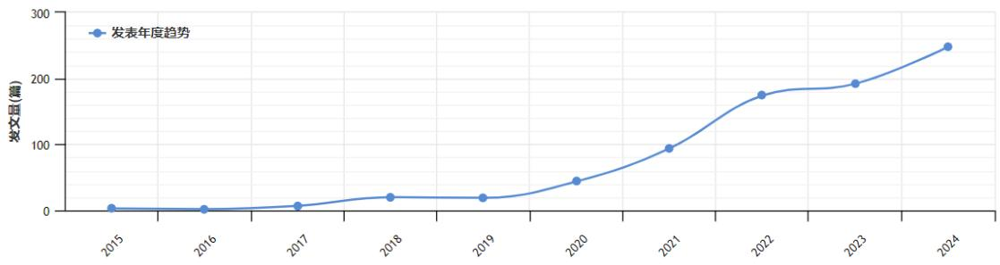  
图1-2“沉浸式戏剧”CNKI检索可视化分析图

沉浸式戏剧在中国的早期探索始于抗日战争年代的街头剧形式，摆脱传统剧场舞台限制，在各街头广场演出。如1931年的《放下你的鞭子》中父女靠街头卖艺维生，父亲在生活压力下忍痛鞭打饿昏的女儿并强迫其继续表演，混在观众中的演员适时呵斥“放下你的鞭子”，带动观众入戏。再如1989 年上海人民艺术剧院的《明日就要出山》等戏剧上演，可见国内沉浸式戏剧的发展亦日趋成熟。

2015 年，孟京辉戏剧工作室推出中国首部原创沉浸式戏剧《死水边的美人鱼》，基于德国贝托尔特·布莱希特（Bertolt Brecht）的戏剧理论创作先锋戏剧与实践戏剧，标志着我国第一次完全意义上的沉浸式戏剧。2016年由英国实验剧团Punchdrunk与上海文广演艺集团 SMGLIVE 联合制作的上海版《不眠之夜》，开启了国内本土沉浸式戏剧的新篇章，其公开售票不足100 小时内售罄1万张预售票。2019 年，被称为“全球现有最大规模的沉浸式戏剧”——孟京辉执导的《成都偷心》是沉浸式戏剧的本土化深度尝试。还如《又见平遥》（2013年）《知音号》（2017年）《再生·缘》（2018 年）《偷心晚宴》（2019 年）《里弄 1992》（2020 年）《梦回·牡丹亭》（2020 年）《疯狂理发店》（2021年）《只有河南·戏剧幻城》（2021年）《大真探赵赶鹅》（2023年）等等沉浸式演出，通过融合地域特色、中国IP 及商业化数字技术等多种手段，采取引入、改编与原创等多元戏剧形式，巩固了沉浸式戏剧中国化的发展道路。

关于沉浸式戏剧空间及舞台设计，胡妙胜在《当代西方舞台设计的革新》中立足于戏剧生存空间、传递精神世界、探索现实世界本质，详述了当代西方舞台设计的写实美、剧本之美、结构之美及外在设计之美19。在《阅读空间：舞台设计美学》中提出戏剧空间是戏剧事件发生的场所20，须从戏剧空间中人的存在方式，即活动的方式和性质中去理解空间，戏剧空间是由动作空间、审美空间、知觉空间、交往空间形成的异质结构整体。韩生、胡佐在《舞台设计概论》里指出舞台设计是由舞台、布景、道具、灯光等成分以及由空间、形状、光色、质感、活动等因素所构成的空间与时间的综合体，戏剧空间的结构确定舞台设计的本质和功能21。胡妙胜《充满符号的戏剧空间》中将符号学应用于舞台美术的意境、虚实、样式等多方面特性之中 22。以上为本研究中沉浸式戏剧中文本分析、空间构成、行动关系的本体结构及设计方法研究提供理论思路。

国外研究现状：

自19 世纪以来，随着现实主义和自然主义戏剧的兴起，如小剧场戏剧运动、戈登·克雷（Edward Gordon Craig）、阿庇亚（Adolphe Appia）、安托南·阿尔托（Antonin Artaud）、贝托尔特·布莱希特等戏剧家们积极探索、革新实验戏剧，在前期探索与后期实践中，西方戏剧家们不断尝试打破传统戏剧中的“第四堵墙”，追求戏剧演出的“真实”。

新时代技术发展与后戏剧剧场思潮影响下，戏剧创作者不断探索新的戏剧样式，发掘出舞台新的可能性。20世纪50年代起，西方先锋戏剧家们相继尝试突破镜框式舞台，推出环境戏剧（Environmental Theatre）、偶发戏剧（Happening）、互动戏剧（Interactive Theatre）等戏剧形式，挑战着传统戏剧的剧场空间、情节结构和观剧行为，如法国托南·阿尔托、俄国梅耶荷德（Meierkholid）等剧坛巨擘奠定了“沉浸体验”雏形。1968年美国戏剧理论家理查·谢克纳（Richard Schechner）在《环境戏剧的六大方针》中首次提出“环境戏剧”概念与其六项原则，对戏剧的“观演关系”进行重新界定与阐释，在美学层面上拓宽了当代戏剧的内涵边界。界定了环境戏剧不再拘泥于舞台，而是所有可被挖掘的空间；戏剧事件不完全依赖剧本，所涉及内容息息相关；观众视线焦点灵活多变，演员不再是唯一核心因素，环境也能成为观众视线的焦点23；所有与观演相关的要素都具有戏剧表现力；剧本不是演出作品的出发点，也不是终点24。

同期，美国后现代舞也逐渐发展出与之相呼应的“环境舞蹈”观念，逐步挣脱传统剧场的束缚，将表演延伸至如自然环境、公共空间等场景之中；德国“舞蹈剧场”实践也日渐成熟，融合生活化媒介、直接与观众对话、运用非典型舞蹈肢体语言等多元手法，模糊了表演的边界。

1999 年德国戏剧理论家汉斯-蒂斯·雷曼（Hans-Thies Lehmann）在《后戏剧剧场》中廓清了20 世纪 70 年代以来西方剧场艺术发展脉络，划分世界戏剧发展史为前戏剧剧场时期、戏剧剧场时期、后戏剧剧场时期，从文本和情节、舞台与空间、时间三方面研究，指出文本已由剧场创作的主导者转变为其中元素、层面、素材，强调剧场艺术诸要素“文本、舞台美术、音响音乐、演员身体等”的独立性及平等关系25。

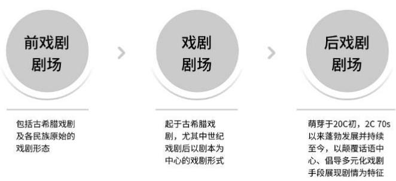  
图1-3西方剧场艺术发展（来源：作者绘制）

沉浸式戏剧延续了环境戏剧中对于传统戏剧形态的挑战，更多地强调“浸入”感，引导观众主动参与发掘和探索戏剧，由此加速了“沉浸式戏剧”的诞生。

沉浸式戏剧的概念起源于英国，英国巴兹·克肖（Baz Kershaw）率先以“沉浸”（immersion）和“沉浸式”（immersive）描述沉浸式类型的演出风格，此后“沉浸式戏剧”更是被广泛用于指代借助布景、开阔场地，允许观众自由移动并深度介入的戏剧演出类型。19 世纪下半叶始尤其是21世纪以来，伴随着数字化手段介入、剧场创作和设计观念的革新，“沉浸式戏剧”“环境戏剧”“实景戏剧”和虚拟现实戏剧等样式层出不穷。2000 年创立英国 Punchdrunk 剧团的《不眠之夜》（Sleep No More）标志着沉浸式戏剧真正地流行。还如英国莎士比亚剧院的《暴风雨》、英国Future Ruins 的《细长电话线上的剧场》《坠落的爱丽丝》《金钱世界》等剧目，Dream Think Speak,Fruitfor the Apocalypse, Third Rail Projects, Speakeasy Dollhouse, Bricolage, We Players 等创作团队不断深入沉浸式戏剧领域。

沉浸式戏剧相关理论实践研究目前主要集中于三方面。一、表演层面，从其基本原理、演员表演技巧和演员自我修养等进行探讨。二是戏剧与叙述研究方面。三、剧场“时空”角度，借鉴彼得·布鲁克（Peter Brook）《空的空间》中“在任何地方选择一个空间，称它为空荡的舞台。只要一个人在他人注视下穿越这个空间，就足以构成一幕戏剧 26”，其戏剧与空间的论述揭示了现代戏剧内在规律，戏剧的生命力存在于剧场的演出中，对沉浸式剧场舞台设计和场域布景具有重要的指导意义。

# 1.2.3戏剧交互装置研究现状

国内研究现状：

CNKI数据库中关于“数字装置艺术”“新媒体装置艺术”“多媒体装置艺术”共计收录 463篇相关文献，涵盖了发展历程、表达形式、交互语言等主要相关研究议题。尽管上述文献数量可观，而其中针对数字交互装置在沉浸式戏剧领域的理论探讨却显得较为匮乏，戏剧交互装置相关的文献主要体现在戏剧中新媒体、影像装置的应用，表明这一技术与艺术融合的前沿领域尚有待深度开掘。

我国的装置艺术兴起于20 世纪80 年代，近年来数字装置增多，但大多陈列于美术馆里，与舞台艺术的结合尚处于起步阶段。20 世纪后期，技术冲击装置产生数字装置艺术新型呈现方式。90 年代以来，数字装置艺术广泛应用于展览与空间设计，所有被放置在空间中且与技术关联的都被称作“数字装置”。进入21世纪，装置艺术理念发生根本性转变，不再单纯依赖现有物质的重构，而是以数字技术激发观者的全方位感官，通过人机交互实现装置艺术与受众的深度对话。

关于装置艺术的历史流变、应用构成及其理论基础，徐淦《装置艺术》一书提供了详实的梳理27。顾丞峰、贺万里《装置艺术》中对装置作为艺术表达方式和创作状况做出详细阐述 28。马晓翔《新媒体装置艺术》中综述了装置艺术的本质与特征、理论渊源，界定了装置艺术的发展与实践范畴，同时提出观念语义与形式语言的新的内涵与外延、属性与意义，归纳并论证观念语义表达与形式语言呈现方式29。曹倩在《实验互动装置艺术》中以实用互动技术，剖析交互作用、实验性特征、互动装置之间界面系统、结构设计、相关者联系等多专业技术知识。以上文献为本文数字交互装置本体构建及创作实践指明方向30。

国内戏剧领域应用的交互装置自 20 世纪 80 年代始不断突破新形式，史铁生曾设想以电影为戏剧舞台背景，以表现意识流的戏剧内容，1984 年黄佐临以幕间电影作为舞台戏剧表现手段，21 世纪起小剧场中开始大胆使用摄像机与同步投影等数字装置，如《欢迎来到真实的沙漠》《活着》《如影随行》《三体》《生命行歌》等戏剧中便已有显现，张艺谋导演《对话寓言 2047》等沉浸式演出中，以传统元素与科技元素碰撞出别样的意境。刘菁菁《与戏剧水乳交融的当代艺术—一装置艺术与舞台设计研究》一文中，以装置艺术入手，探究装置艺术对舞台设计的应用价值，分析二者互融关系，重新审视当代舞台设计31。李栋宁在《数字媒体艺术之美》中提出，应用于戏剧舞台的数字装置艺术，可借数字技术交互性，运用全息影像、动作捕捉、LED 屏等数字技术，通过实时捕捉演员肢体动作、台词和表情语言，生成与表演相符的布景变化，再借布景的动态演绎，配合灯光、音乐等舞台美术手段，营造出戏剧空间情境32。以上文献为本文研究沉浸式戏剧中数字交互装置构建提供系统的理论依据与设计法则。

国外研究现状：

装置艺术的形成可追溯至以马赛·杜尚（MarcelDuchamp）为代表的艺术家群体创作的“现成品艺术”，从 20 世纪初开始以现成品再造为特征，标志着早期装置艺术的初步显现。至20 世纪60 年代，装置艺术经历转型，以激进的新媒体装置形态步入了新世纪的跨学科研究阶段。克莱尔·毕肖普（Claire Bishop）在《Installation Art》和《Participation》中阐述了装置艺术概念框架、类别划分、历史背景及其发展脉络；迈克尔·拉什（Michael Rush）在《New Media in Late20th-century Art》中重点探讨了新媒体艺术中观念的表达方式与存在形态。外国学者对于数字装置的相关理论与实践研究较完善，并催生大批杰出交互装置作品。其中被誉为“互动影像艺术之父”的白南准，凭借对影像媒介运用，创作了一系列实验互动艺术作品。90年代时期交互装置作品以及展览大量出现。近几年不断涌现出如 Teamlab、Moment Factory、Daniel Rozin等新媒体艺术团队、艺术家，创新了当代数字交互装置艺术的实践研究。

回溯至 20 世纪 20 年代贝托尔特·布莱希特和埃尔温·皮斯卡托（ErwinPiscator）等先驱开始尝试将投影映像及电影放映融入戏剧表演，而后捷克舞台设计家约瑟夫·斯沃博达（Josef Svoboda）应用相对成熟的新科技来丰富演出视觉。“利用光和投影代替颜料的布景就是未来”，在20 世纪的预言已成为现实。在沉浸式演出中，数字影像与舞台机械等结合已成为构建演出环境的常用方法，数字装置的运用使戏剧样式焕然一新。

1925 年埃尔文·皮斯卡托（Erwin Piscator）《不顾一切》中影像介入戏剧装置初见雏形，1959 年起斯沃博达将其投影实验用于戏剧舞台，如《他们的日子》《普罗米修斯》《苏珊娜游戏》等。1984年斯沃博达创新“TV戏剧”，实时拍摄并投射演员多角度影像。1985年京特·施耐德-西姆森（Gunter Schneider-Siemssen）推动舞台全息影像，通过氩激光和小全息图，投射在玻璃表面覆盖全息涂层的薄膜上。皮耶里克·索朗（Pierrick Sorin）开创“全息剧场”，一人分饰80个角色。从最初的幻灯机、投影仪、电子显示屏，到后来的全息数字装置等，数字技术的戏剧运用由简到繁、由单一到多元，与戏剧的融合日趋自然，为沉浸式戏剧舞台注入新鲜血液，如色列特拉维夫剧场AR 版《格列夫游记》，还如《阿凡达前传》《仲夏夜之梦》《战马》《尼伯龙根的指环》等等，从最初舞台美术的辅助手段，数字技术逐步深入到沉浸式戏剧结构内部并成为一种新的戏剧语言。以上著作及实践对沉浸式戏剧交互装置的设计形式与设计方法提供更广阔视野。

# 1.3研究目的

本研究从符号学视角出发，通过文献与案例剖析，系统性探究沉浸式戏剧交互装置在剧本解码、符码提炼、元语言编码过程中的符号化类别及特性表现。依托符号对象本体论，以沉浸式戏剧叙事文本为原点，对数字交互装置内部的空间范式及本体构建诸层面的结构关系展开解析。在此基础上，研究将进一步聚焦于以情节还原、情境还原、情感还原为目的的沉浸式戏剧交互装置的符号还原方法。继而，利用所构建的设计方法指导实践创作，完成沉浸式戏剧交互装置设计，传达出剧本的深层意涵，营造高度沉浸、多感官的观演体验。

# 1.4研究意义

# 1.4.1理论意义

数字交互装置在沉浸式戏剧中逐渐显现新观念、新材料的发展特征，沉浸式戏剧空间对多元化艺术的融合重视，为数字交互装置的融入提供了可能，也由此拓展了沉浸式戏剧舞美效果的新形式。沉浸式戏剧交互装置在传统与创新的演绎中愈加显露出其本体和意象的观念性。沉浸式戏剧交互装置借助影像叙述手法增强了舞台表现张力，打破了传统剧场的观演关系，实现了虚拟与现实的时空对话。其虚拟性、互动性、多样性等特点，给单一化、实体化、机械化的沉浸式空间以新的思路与启示。由此，挖掘沉浸式戏剧交互装置的形式特征，对沉浸式戏剧场域中数字交互装置的范畴研究提供些学术观点参考。

数字交互装置作为沉浸式戏剧创作的主流手段之一，给沉浸式场域及舞美创作注入新活力与新思路。传统戏剧强调文本和统一性，而经后现代艺术、装置艺术等形式的介入下，其艺术形式和设计手法不断演变。角色的多感官得以丰富，观众的观演情绪和情感得以引导，使观众能够主动参与戏剧，获得更加真实、沉浸的戏剧体验。在沉浸式戏剧中，数字交互装置有助于传达出戏剧的深层意义，引导观众参与和体验，以及构建角色之间的互动。

同时，本研究将结合实际案例，探究不同数字交互装置设计所带来的沉浸式戏剧效果与符号内涵，在沉浸式戏剧场域中，以数字交互装置为研究对象，明晰文本语境、构建沉浸式戏剧交互装置本体、确定空间范式，对沉浸式戏剧交互装置的体系构建研究贡献绵薄之力。

# 1.4.2 实践意义

以符号文本、符号对象、符号表意为暗线的符号学引入研究，助力沉浸式戏剧交互装置中叙事、本体、场域三合一的创作实践。沉浸式戏剧场域符号化可在布景符号、色彩符号等多方面体现，这也即为舞台的假定性。沉浸式戏剧交互装置所呈现出的能指、所指、意指，与生活中大有不同，“象”与“象外之象”，极具韵味。各种符号系统不同相似的相互作用形成了舞台物质表现手段的多样化。设计师若大多片面借鉴国内外前辈的优秀设计或全凭个人先验感知，容易把握不好设计重点。

因此，设计师以符号学为方法，依据戏剧文本，最终产生沉浸式戏剧舞美审美意象。装置设计师通过对戏剧文本中事物的本质特征进行提炼，解构以符号化要素“互文”的装置符码，抽象形成其象征性、隐喻性符号；同时直面“建构”出戏剧空间，重组构建出新的戏剧交互装置。装置语境规定着其符号形式，并通过符号进而调动观众感知，向观众传达、交流思想与情感。在动作、审美、知觉三重戏剧空间内进行创新设计与表达。提出情节还原、情感还原、情境还原为创作方法论，为沉浸式戏剧交互装置艺术提供理论方法与设计策略，进而为观众带来更沉浸的戏剧体验，为沉浸式戏剧交互装置的创作提供实践指导，推动其发展创新。

# 1.5研究创新点

# 1.5.1学术观点创新

将符号学理论引入沉浸式戏剧交互装置研究中，构建其符号化设计体系，具有观念创新。

本文以符号文本、符号本体与符号表意等符号理论为逻辑，界定了沉浸式戏剧交互装置的符号范畴与符号形式，籍此形成剧本解码、符码提炼、元语言编码的沉浸式戏剧交互装置构建框架，创新了沉浸式戏剧交互装置美学理论，实现理论创新。

# 1.5.2设计方法创新

沉浸式戏剧交互装置的符号理论显现，释出了沉浸式戏剧交互装置的创作方法论。提出了以戏剧文本为原点的数字交互装置本体及空间范式构建方法，创新了沉浸式戏剧交互装置中以情节还原、情感还原、情境还原为核心的设计方法，具有实践创新价值。

# 1.6论文方法与框架

# 1.6.1研究方法

（1）跨学科研究法。以符号学、沉浸式戏剧、戏剧表演、数字交互装置等多学科为研究视角，为本课题研究方向提供学科交叉理论依据。

（2）案例研究法与文献研究法。围绕沉浸式戏剧交互装置的选题和研究重点，在数据库、网络、实地中搜集符号学、沉浸式戏剧和数字交互装置设计的相关文献著作及案例资料，整理出对课题有意义的数据信息，对内及交叉案例文献研究，为本文提供充分的理论与实践支撑。

（3）逻辑推理法与分析归纳法。在综合沉浸式戏剧交互装置的文献资料和相关案例基础上，对文献及著作、设计作品等各类资料进行研读，采用分析、归纳、演绎等方法整理相关资料，归纳出其符号类别与特征，构建沉浸式戏剧交互装置设计方法。并将研究成果应用于沉浸式戏剧《四川好人》交互装置设计作品中，结合问卷调查法，调研受众对于本课题研究的相关体验与需求，并根据调研结果设定与创作设计实践，这也对于论证研究理论与方法有可行性意义，避免纸上谈兵。

# 1.6.2研究框架

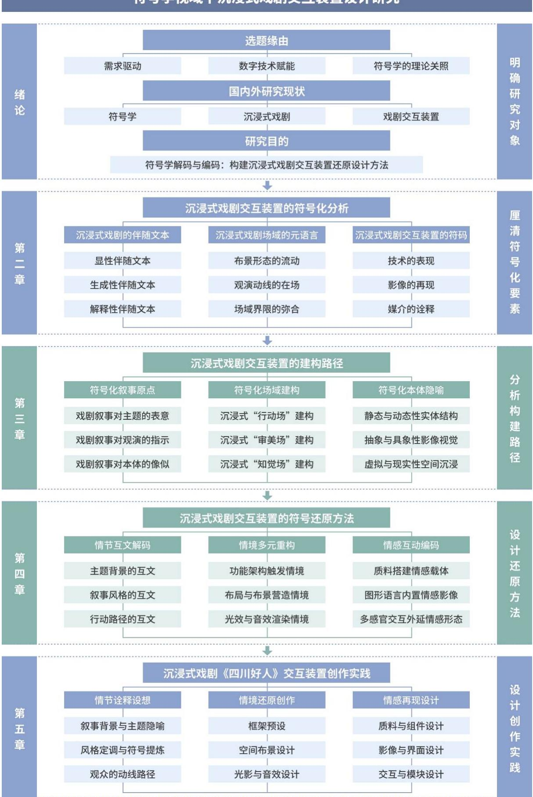  
符号学视域下沉浸式戏剧交互装置设计研究  
图1-4论文框架图（来源：作者绘制）

# 第二章沉浸式戏剧交互装置的符号学释义

近年来数字媒体艺术与戏剧的融合方兴未艾，当代沉浸式戏剧交互装置呈多元化、科技化、革新化等态势，数字交互装置的艺术张力也愈发显著。1917年马塞尔·杜尚的装置《泉》（Fountain），显露出艺术可由物象之形抽象、绽放出符号，揭示了实体对象如何超越其物质形态，升华为富有象征意义的符号表达。戏剧舞台的假定性、戏曲的“一桌二椅”、写意式风格，也无一不体现出沉浸式戏剧舞台中的符号性。皮尔斯的“再现体、对象、解释项”是符号意义显现的过程，而设计师只有先对符号对象、符号解释项进行剖析和预判，方可更妥实地构建沉浸式戏剧交互装置符号。皮尔斯认为“思想必须借助于符号才能得以表达和传播”，据此，作为意识凝集的戏剧交互装置，藉由符号构思、符号预设到符号创作，最终得以落地与“敞开”。本章将从戏剧伴随文本、场域元语言、装置符码三个维度，梳理并深入挖掘沉浸式戏剧交互装置的符号化构成要素，揭示其内在的符号逻辑与表达机制。

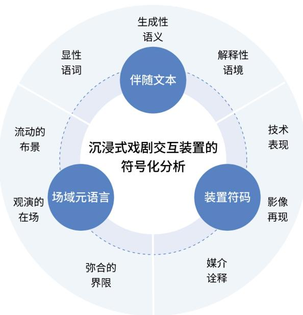  
图2-1沉浸式戏剧交互装置的符号化分析框架（来源：作者绘制)

# 2.1语词、语义、语境：沉浸式戏剧的伴随文本

沉浸式戏剧的剧本，是沉浸式戏剧交互装置的重要伴随文本，也是设计师构建戏剧交互装置的基石与原点。沉浸式交互装置对戏剧文本的摹仿和再现，突显了戏剧的戏剧性，也由此具有区别于一般数字交互装置的独特性。

沉浸式戏剧交互装置的符号文本体系，本质上是文本主体与多元伴随文本的有机融合。参照玛丽·麦克林（Marie Maclean）的理论框架，可将文本划分为第一序列的文本主体与第二序列的附加文本两个层次 33。费斯克进一步指出文本主体水平维度上包含类型、角色、内容等内在构成要素，而在垂直维度上则通过与其他文本间的互文性关联得以丰富拓展 34。在沉浸式戏剧语境中，数字交互装置各类伴随文本及其相关的各文本因素相互交织、共同塑造出完整的装置文本。装置伴随文本不仅能影响沉浸式演出体验的直观效果，更能影响装置深层的情感主题、叙事环节与角色体验。设计师深入剖析戏剧文本中的显性伴随文本、生成性伴随文本、解释性伴随文本，方可在数字交互装置中诱发戏中角色的内心世界等戏剧性意象、具身动作等交互形式（如表2-1 所示)。同时也激发数字交互装置的虚实空间内创作，构建出沉浸式戏剧交互装置空间符号的元语言。

表 2-1语词-语义-语境伴随文本解码  

<table><tr><td></td><td>显性语词文本</td><td>生成性语义文本</td><td>解释性语境文本</td></tr><tr><td>戏剧角色</td><td>表层行为、外在形象</td><td>内心世界、内在性格</td><td>行动路径、叙事节奏</td></tr><tr><td>装置环境</td><td>时间、场所</td><td>情感、氛围</td><td>时代背景、社会文化</td></tr></table>

# 2.1.1语词：装置显性伴随文本

在沉浸式戏剧交互装置的文本中，通过提炼关键“语词”，获知直接的言语表达和显性的内容讯息，进而为演员、导演和装置设计师提供不可或缺的解读和创作基础。

从文本本身内在维度而言，沉浸式戏剧交互装置的显性伴随文本主要涵括为角色对话、舞台指示性或管理性说明文字。戏剧性对白根据其内在属性划分为以内心活动为主的戏剧性对白，叙事性目的对白以及离间性的叙述 35。角色的对白指示了角色与戏剧交互装置间的肢体、路径等直接动作。从装置环境方面来看，戏剧的语词直接交代了装置“舞台”的基础性要求和指示，直接影响着数字交互装置空间建构。设计师通过直视、解码剧本语词文本，可明晰戏剧舞台交互装置所处的时间与场所，角色的表层行为与外在形象。

而沉浸式戏剧交互装置外在文本则涵盖“副文本”与“型文本”。副文本（Para-text）概念由法国热拉尔·热奈特（GerardGenette）在20世纪70年代提出，指围绕、伴随或穿插于正文本（作品主体部分）的所有辅助性言语或非言语元素。副文本作为文本的“框架因素”，如标题、插图、装置容器、影片片头片尾、戏单媒介等显现 36。沉浸式戏剧交互装置的副文本提炼，不再仅仅局限于静态的标题或序言等要素，而是可以扩展到整个戏剧性体验的各个环节。譬如海报、影片内容等可视化材料，提供装置的基本信息与情境设定；入场指南、规则说明等导览说明，辅助角色之间互动设定；沉浸式场域的布景、道具、声光电等引导环境的副文本一一舞美设计，这些元素在沉浸式戏剧交互装置创作者解读其显性文本的过程中扮演着关键角色，共同构建其符号化体验框架。

作为连接文本与文化的主要方式，“型文本”在伴随文本中不可或缺。“型文本”（Archi-text）指文本所从属的集群，如不同文本的同一个创作者、同一个时代、同一个派别等37。而沉浸式戏剧交互装置中的“型文本"，是具有某种典型特征、结构模式或者遵循特定规范形成的文本类型。具体而言，沉浸式戏剧交互装置的型文本内涵可根据不同维度划分。首先，戏剧的体裁方面，可细分为喜剧、悲剧、正剧、音乐剧等多种形式；其次，根据内容题材的不同，装置可划分为反映社会现实的、深植于历史文化的、探索科技与奇幻的，乃至关注自然生态的作品；再者，在呈现形态上有着环境式沉浸、互动式沉浸、跟随式沉浸等多元沉浸体验模式；在创作风格方面，装置作品可展现出表现主义、荒诞主义、象征主义以及现代主义等各种流派的特点；最后，数字交互装置涵盖了如自然交互装置、情感交互装置、场馆交互装置以及舞台交互装置等多种类型38，进一步丰富了沉浸式戏剧的艺术的表现手段和观众的多维感知。

在不同显性伴随文本要素的交织中，创作者须不断挖掘关键显性语词，由此主导着创作意图和预设基础的表意方式，不仅拓宽了叙事文本的维度，而且赋予沉浸式戏剧及交互装置的内涵与潜能，更为观众带来更加真实的沉浸式体验。

# 2.1.2语义：装置生成性伴随文本

语义，是由沉浸式戏剧交互装置表层的语词文本所生成的内在意义。在了解角色戏剧行动的基础上，装置设计师通过解构剧本关键语词，分析其暗含的内部语义文本，进一步理解角色的内在情感，与角色置身的世界感同身受。同时，剧本语义也诠释着角色独白或对话时的数字交互装置的戏剧情感氛围。譬如《哈姆雷特》（Hamlet）剧本中，“生存或毁灭，这是一个值得考虑的问题；默然忍受命运的暴虐的毒箭，或是挺身反抗人世的无涯的苦难，通过斗争把它们扫清，这两种行为，哪一种更高贵？”装置设计师只有经语义文本的解码，方可走进哈姆雷特悲惨命运和复杂思索的内心世界，更能在迟疑抉择、痛苦挣扎的装置戏剧氛围情感中达到共情。

克里斯蒂娃认为文本是一种重新分布语言等级的跨语言装置，作为传达言语引导向各种先前的和同时的讲述，因此文本具有生成性。前文本和同时文本渗透在生成性伴随文本中，赋予了沉浸式戏剧交互装置作品的独特内涵。前文本(Pre-text)是一个文化中先前的文本对此文本生成产生的影响。狭义的前文本包括引文、典故、戏仿、剽窃、暗示等；广义上，包括文本产生之前的全部文化史。因此，前文本是文本生成时受到的全部文化语境的压力，是文本生成之前的所有文化文本组成的网络 39。例如一部沉浸式戏剧交互装置的产生，会受到此先历史事件、民间传说、宗教信仰、社会观念、科学技术、甚至是其他艺术作品等因素的影响和参照，它们在符号文本生成之前已经存在，并对新作品的创作产生影响。“文变染乎世情，兴废系乎时序。”在解构整个戏剧前文本的过程中，设计师必不可少地要对其社会文化与时代背景进行调研，洞悉作品大时代背景下的价值观念、信仰追求、道德规范、民风习俗、历史情况和现实环境等等，这样设计出来的舞台交互装置作品则更加深刻，而不浮于表面。如为沉浸式戏剧《哈姆雷特》构建作品，设计师须了解戏内中世纪丹麦宫廷的历史和社会现实，以及戏外伴随的文艺复兴晚期英国和欧洲社会的真实面貌。基于沉浸式戏剧时代背景与文化，设计师在剖析装置语义文本时，可厘清剧中的主次要情节，开端、发展、高潮、结局叙事线，深悉各个角色的整体行动路径和叙事节奏氛围。

在极具开放性文本的特征下，沉浸式戏剧交互装置呈现时会因演员、观众及其他因素等而动态生成新的文本，如预设演员的即兴表演、观众的临时反应和互动。装置创作者通过对生成性语义的解读，深入沉浸式叙述语义结构、观演交互情感和时空之中，构建共时性符号文本分析的框架。因此，沉浸式戏剧交互装置设计师不仅把握符号前文本的影响要素，更要挖掘沉浸式戏剧文本的内在元素及其之间如何相互关联并形成的意义。

# 2.1.3语境：装置解释性伴随文本

戏剧符号的外延（艺术的再现）和内涵（艺术的表现)，探讨了自身能指的信息，与其多级意指系统。装置符号的意义取决于不同的语境。解释性伴随文本的挖掘助推着沉浸式戏剧交互装置符号意象的萌发、思想情感的延伸。在沉浸式戏剧交互装置的整体语境下，文本接受者会对这一语境文本进行分析评价或注解说明，进而衍生出评论性文本或链文本，从而构成了解释性伴随文本。如涉及对作品本身的主题理念、技术应用、艺术手法等解读和阐释，形成评论、阐述、访谈等反馈，共同构建并丰富了作品的阐释体系，装置设计师则将这些多元化见解整合并再次完善于创作中。对于观众来说，在体验作品的过程中，这些解释性伴随文本成为了揭示作品深层含义的重要向导，帮助他们更加透彻地理解和欣赏作品，以实现最佳的沉浸式体验。由于演员、观众乃至艺术家们的个体差异，他们的先验感知、文化背景、审美标准和认知层次各异，导致对同一戏剧交互装置作品的解读可能展现出“一千个眼中有一千个哈姆雷特”。此外，在装置文本接受者的反馈等二次传播阶段，这些多元解释性文本会产生反哺作用，影响着观众对作品的认知，甚至可以启发创作者进行设计调整和更新迭代，形成动态的符号文本系统。

# 2.2 流动、在场、弥合：沉浸式戏剧场域的元语言

“沉浸”在《现代汉语词典》里释义为浸入水中，常用于比喻处于某种气氛或思想活动中 40。而沉浸式戏剧交互装置的“沉浸”是将观众完全沉浸于创作者设定的戏剧符号系统中。从心理学上看，观这种沉浸式体验被米哈里·契克森米哈赖（MihalyCsikszentmihalyi）称为“心流”（flow），即全身心投入其中，不自觉地过滤掉一切不相关的事物，进入一种沉浸状态 41。其间个体的心境、意志与意识高度契合，是心、意、念的同步与统一42。同时，观众不再单纯作为被动的观赏者，而是主动融入戏剧交互装置文本，与演员、装置及场景等戏剧符号实时互动。

沉浸式戏剧是理查·谢克纳“环境戏剧”的现代性延伸，是一种强调身体在场性与叙事参与性并存的开放型戏剧形态。《东西方戏剧的比较融合》中界定的观演关系，为剧场中演员与观众建立其美学联系，包括两部分：表演场所的建筑形态、表演主体与听众之间的审美联系43。

沉浸式戏剧数字交互装置拓展了体验的维度，重塑了戏剧的表现形态。一方面，它打破了传统剧场中的“第四堵墙”，弥合了“台上-台下”二元对立的静观模式界限，挣脱了以往线性文本叙事和固定视角的束缚，推动着观众从被动接受者转变为在场的参与者，主动探索与互动新的戏剧文本。另一方面，沉浸式戏剧交互装置通过融合数字媒体，将空间内真实场景与由视频、投影、装置组成的虚拟场景相结合，实现了空间互动的多层次元语言构建。

场域，指“在各种位置之间存在的客观关系的一个网络，或一个构型 44。”而沉浸式戏剧交互装置的场域，是数字交互装置、角色互动、舞台布景之间“在场”的关系网 45。本文所指的“角色”，囊括了传统意义上的演员以及在沉浸式戏剧中同样重要的观众，二者共同构成场域内两大类主体身份。角色置于沉浸式戏剧交互场域的虚拟空间中，无论是现实身体还是其数字化分身均有具身在场感。由此，沉浸式场域中，布景形态的流动、场域界限的弥合和观演动线的在场，这些元语言整体构建出“浸没式”开放的观演模式、全方位的审美风格与沉浸式戏剧交互场域创作。

# 2.2.1布景形态的流动

沉浸式戏剧交互装置场域不仅弥补了传统框架式舞台中观演时空的局限，延伸出新的戏剧剧场。场域内的流动空间、道具布景、环境结构，这些布景形态推动角色置身沉浸于戏剧装置作品之中，成为不可分割的元语言要素。杰森·沃伦(JasonWarren)在《创造性世界：如何创作沉浸式戏剧》中根据观众所获观演权利的差异，将沉浸式戏剧划分有探索类、引导类、互动类46。沉浸式场域的叙事空间是流动的，也随着不同类别而展现出各异特点。探索类作品中常有多条叙事线并行，观众可以在剧场内自由游走，可以选择跟随任意一故事线行进，但观众的互动无法影响剧情走向，如《不眠之夜》《青麓幽鸣》等。引导类作品中，观众需在演员引导下步入预先设计的叙事空间，由于会担任特殊身份的角色，观演互动中观众的选择会对故事产生影响，但不会改变剧情结构，如《魅影侦探》《永乐长思》等。而互动类作品结合了前二者类型特点和叙事技巧，场域内布景及角色都须高度灵活性和随机应变能力，观众的行为选择往往会超出创作者事先的预设范围，且能够影响叙事的走向和故事的结局，如《旁观者报告》等。

不同类型的沉浸式作品在其布景形态构建上各有侧重。探索类作品须营造整体布景的深度沉浸感；相比之下，跟随引导式作品的布景设计则需在叙事弧线内展开，除核心叙事场景外，其他空间布景应保持简约，避免分散观众的注意力；而互动类作品的布景不仅 $3 6 0 ^ { \circ }$ 全方位覆盖了观演空间，更注重布景的及时互动和灵活性，旨在打造全方位互动的沉浸式场域。

“沉浸”无疑是区别沉浸式场域与传统戏剧场域的核心特征之一，这种沉浸体验不局限于戏剧叙事的浸入，更涵盖了场域环境布景的全沉浸。通过高度再现戏剧交互装置场域的质感、尺寸、风格等空间结构设计，增添写实化道具细节，结合自然环境光而非刻意的舞台光，以及音效、温度、烟雾、气味的配合，营造出流动的沉浸式场域，在场、还原出符合主题作品的多维时空。沉浸式场域注重对感官的刺激和剧场氛围的营造，若在非传统的剧场空间中，可特定搭建出如历史建筑、仓库、公共场所等环境，力图还原出戏剧叙事的真实场景，让观众和演员“身临其境”事件的“第一现场”。如置身于王潮歌导演的沉浸式实景剧《又见平遥》之中，我们仿佛穿越到清朝末期的平遥古城，90 分钟沉浸式体验平遥人的生活，以现代手法对历史镖局、赵家大院、街市等场景构筑成平遥剧场，运用影像、灯光、声音等多种数字技术手段与角色表演相配合，打造大院、街道、城墙等不同主题场景作品。

如在沉浸式戏剧《不眠之夜》的舞台剧场是由5层楼、90 余个房间构成的整个麦金侬酒店（如图2-2所示)。观众戴上白色鬼魅面具，在6000平方米的展演空间内自由穿梭、迁回奔跑，可以自主决定何时进入或离开某个房间，自行选择追踪主角麦克白的行动轨迹，也可以关注次要角色的故事线索，以此沉浸在这样自由、开放、流动的戏剧场域中，从纷繁的戏剧碎片中窥视故事端倪。

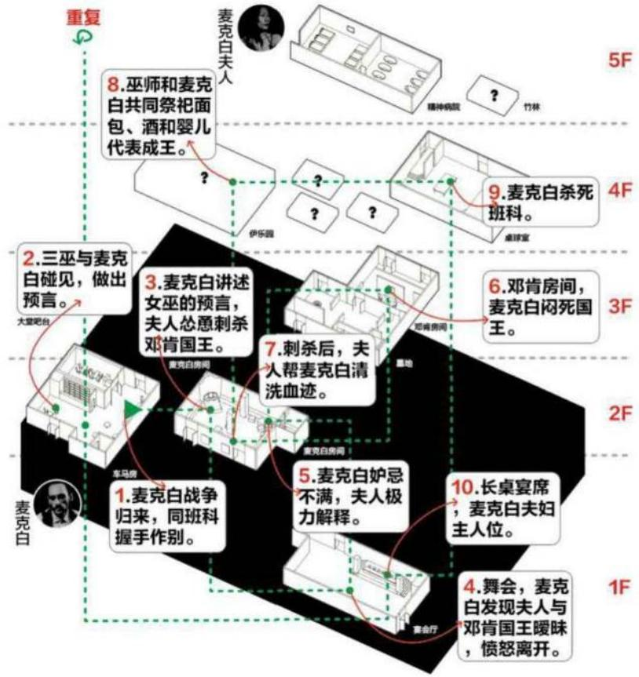  
图 2-2《不眠之夜》剧场内部空间（来源：网络）

# 2.2.2观演动线的在场

耶日·格洛托夫斯基（Jerzy Grotowski）指出“观众与演员是演出不可或缺的两个因素，没有观众与演员活生生的交流关系，戏剧是不可能存在的47”，彼得·布鲁克认为“一人在别人的注视之下走过这个空间，便构成一幕戏剧”，埃瑞克·本特利（EricBentley）在《戏剧的生命》中提出“戏剧表演是A模仿B，而C 在旁观”，揭示出戏剧的核心要素为表演空间与观演群体。可见观演关系是沉浸式戏剧交互装置的场域语言中不可忽视的存在条件。

“在场性”(Anwesenheit)，源于德国哲学概念，海德格尔（MartinHeidegger）指“此在”“存在”，笛卡尔（RenéDescartes）译为“对象的客观性”，“在场”即显现的存在，或存在意义的显现，或歌德（JohannWolfgangvon Goethe）所说的“原现象”，简单来说“在场”就是“面向事物本身”。在沉浸式场域中，在场性体现在，沉浸式戏剧交互装置的现场感，即观众和演员等人物的具身在场，数字媒介下的虚拟角色、虚拟空间等的互动在场。沉浸式戏剧交互装置场域将观众纳入戏剧结构一部分，角色与戏剧装置元语言之间相互参与、凝视、移情，构建出全新的戏剧观演关系及互动方式。

在由演员、观众、交互装置元语言构建的场域中，角色可以是真实的人或物，也可以是由数字交互装置创造出的虚拟“演员”。其通过肢体、动作、语言将戏剧文本中虚构形象与事件生动地预设或即兴表演出来，并实时互动数字交互装置，实现其自身的完全沉浸和最终令他者沉浸的表演，为观众创造出“真实的幻觉”。而演员的第二重身份，则引导着观众互动或前往不同场景，进而推动剧情发展。沉浸式戏剧场域中，道具不再是摆设，数字交互装置也不再是“只能远观”，演员和观众都不再是单单舞台上的表演者与台下观看者，观众可以与演员交谈，与装置、布景相互动，可以翻阅书籍、拆解信函，坐沙发掀帘幕，品茶尝香主动参与或被演员引导互动，将自己的知觉意向结合戏剧，进而获得自己的沉浸式直观感受和审美体验。同时观众也可以选择驻足观看或者继续前行探索，选择走进随意房间或是僻静的角落，随机跟随或仅跟某条叙事线，每种选择都会有不同的际遇。对于群体观众间的关系而言，单个观众积极互动的行为，不仅能带动沉浸度一般或不高的观众，而且无形之中也转化为特殊的演员身份，成为戏剧交互装置结构的一部分。

角色凝视着戏剧本身，参与、在场并逐渐浸入戏剧作品。观众区域与表演区域相渗透，在真实的虚拟布景中实现物理空间上的沉浸；角色介入数字交互装置，“观-演”互动实现其行为的沉浸；最后深入戏剧作品之中，通过移情机制达到情感认知的共同沉浸。“观众一空间一演员”三者共构的新型观演关系，在流动的空间中赋予了观众新的角色身份和演员更大的表演空间，带给观众和演员多感官的丰富体验，实现了从“视知觉”到“感知觉”的转变。

# 2.2.3场域界限的弥合

沉浸式戏剧交互装置元语言消解并弥合了传统戏剧场域的界限，主要分为物理叙事时空和感官体验两方面。物理空间上，打破了传统剧场的固定式舞台和闭塞的空间，扩展为整个剧场甚至是更广阔区域，同时多线叙事之间的场景转变也更加自然流畅。在这种无界感的空间场域中，观众可以自由移动并在多个区域交互，进而获得更真实沉浸的观剧体验。以《又见平遥》为例，王潮歌导演摒弃了传统的主入场口、前厅以及固定的观众席与常规戏台，使观众甫一进入不同入口便能即刻开启主动探索之旅，戏剧焦点由此从演员转移至观众个体。沉浸式戏剧往往采用非线性叙事架构，如通过多线程叙事、随机触发事件等方式，随机触发事件等，延展、压缩、拼贴戏剧的故事时间来重组叙事，观众在不同的时间段内体验到戏剧中不同阶段和情节，可以自主穿梭时间之中，时间的虚实界限被弥合。再观《不眠之夜》在三小时时间内循环演出三次，且楼层分配的随机性赋予了观众介入剧情的不确定性。在同一时空内，多条叙事线索交织并进，颠覆了角色乃至观众对时间线性推进的固有认知，制造出时空错乱的感官效果，使得观众宛如置身一场永无止息的梦境，沉浸于“不眠之夜”之中。

就心理层面的感官体验而言，在沉浸式场域的角色互动中，“第四堵墙”与观演关系“二元对立”的界限也被消弭。观众与演员近距离地交流、互动，并参与到戏剧装置的发展中，由静观转为动态体验，实现了从被动接受者到主动参与者的转向。观众不再是审美主体，沉浸式戏剧交互装置场域内要素也不再是审美客体，主客交融，因此消弭了其审美上主客二元界限。《又见平遥》中，导演将整个剧场划分成了几个相互关联的区域，观众跟随演员或工作人员指引，穿梭于古城大街小巷，在染坊、私塾、包子铺等流动的场景中，与演员、布景等互动，此时观众既是旁观者又是作品的亲历者。

同时，装置设计师对数字媒体技术的综合应用，基由自己知觉意向，解构、摹仿、还原现实经验，并交织于戏剧空间中，虚拟建构现实，也延伸出“真实的虚拟”空间。而沉浸式戏剧交互装置场域充分调动角色的视觉、听觉、嗅觉、味觉、触觉五感。角色结合自己在场感受，完全沉浸在真实与虚拟的物理环境与精神空间之中，实现戏内-戏外知觉意向的虚实界限弥合。

# 2.3表现、再现、诠释：沉浸式戏剧交互装置的符码

早年剧场的幻灯投影作为辅助性布景，直到如今当代数字交互装置艺术的融合可转变成极具能动性的戏剧元素，从传统影像的单独呈现过渡到装置与角色的协作之中。

数字交互装置，是凭借数字感应技术，赋予雕塑和装置艺术信息交互功能的公共艺术，“材料 $^ { + }$ 情感 $^ +$ 场地 $+$ 观众 $^ +$ 数字”地呈现艺术家与观众共同凝结的超时空的思想情感 48。置身于当代艺术的语境和沉浸式戏剧的场域，交互装置因此附有当代数字性、多元综合性、实时互动性等特征，打造出更具有三维、虚拟、交互、动态感的沉浸式戏剧作品。如科幻或历史类戏剧中，数字交互装置视觉特效和虚实转换的显现，或音乐剧或舞剧中，数字装置与演员肢体的互动，以多重数字媒介的拼贴，呈现出科幻与现实并存的多元化舞台空间，而绽放奇幻的舞台效果。斯沃博达对投影与光的应用，大大推动了戏剧中数字装置的发展。从最初的幻灯机、投影仪、LED 电子显示屏，到全息、激光、VR、AR、3D Mapping、无人机等技术的应用，数字交互装置不断迭代与创新。

在符号学中，“符码”是指符号系统中控制能指与所指关系的规则，规定了符号如何将其所代表的意义表达出来。技术服务于艺术表达，基由数字化手段，沉浸式戏剧交互装置设计师和角色共同构建装置实体、影像和交互信息，通过文字、图像、声音等载体，表现或再现符码，营造出沉浸式戏剧交互装置情感。

# 2.3.1戏剧交互装置的技术表现

利用声音、灯光、网络，使用LED屏幕、投影、影像装置、环绕式音响等多种数字交互装置，结合动作捕捉、全息影像、3D技术、增强现实（AR）、虚拟现实（VR）、仿生学、脑电波等数字化技术，创新沉浸式戏剧的观演互动体验。在这种体验中，角色可以通过肢体来操纵虚拟或实体对象、触发事件或改变展示方式，实现现实角色、环境和虚拟信息之间的不断交织互动。

动作捕捉，即将物体的运动转换为数字数据的技术。依据角色演员动作而实时生成的数字交互装置，借传感器、红外LED 灯管发射器摄像头等设备，跟踪、采集演员、观众的骨骼和动作数据，如运动轨迹、姿态角度和速度变化等身体动作，并转换为数据实时传输至感应处理器系统，计算实时渲染可视画面，驱动虚拟角色动作或场景变化，最终显示于屏幕媒介上，形成设计师预设的戏剧效果。如 2016年皇家莎士比亚剧团版的《暴风雨》中，设计师在爱丽的内层服装中固定传感器，采用VFX 和实时动画来绑定、捕捉演员的表情和动作，采集传感追踪数据，编码生成3D虚拟角色Ariel 精灵，角色的运动轨迹可传输到虚拟空间内对应的虚拟身份上，现场演员表演和数字虚拟精灵互为动作。

交互投影，将投影技术和人机交互相结合，实现角色与投影内容之间的实时互动，布景包括基于动作捕捉、触控式交互投影，也可以以光雕投影展现。光雕投影运用 3D Mapping，如建筑投影、汽车投影、实物投影、平面投影，将影像投射到不规则物体表面，通过软件处理贴合物体形状及环境，创造独特的空间维度和运动状态视觉效果。

全息影像，即利用激光干涉和衍射原理呈现三维物体的“真实”3D 影像，使观者从多个角度都看到空中悬浮的逼真影像。上世纪八十年代京特·施耐德-西姆森用激光投射到玻璃覆盖的全息薄膜上，影像因而被呈现于薄膜中，如歌德的《浮士德》中的魔鬼、《霍夫曼的故事》中明显日光下的房间和幽灵等效果。舞台交互作品《数字少林寺》中应用全息影像、裸眼3D，呈现出白、黑、灰、金为主色调的江湖水墨画，与现场武僧们的表演形成时空同步，共同构建出超越现实的侠义美学意境，可视化再现少林寺武和禅理念（如图2-3所示）。

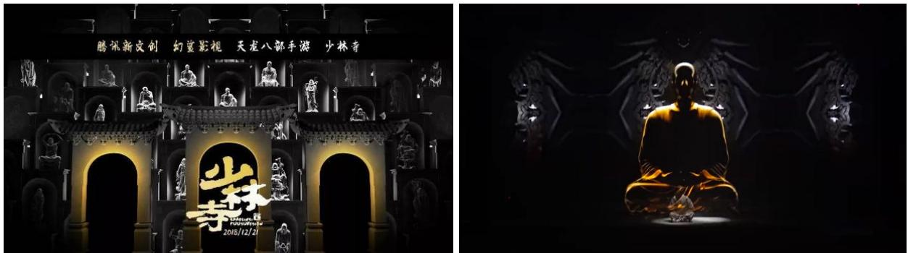  
图 2-3 舞台交互作品《数字少林寺》

增强现实（AR）技术，通过传感技术捕获角色周围真实世界信息，如视频、音频及动作、位置和视角变化等姿态数据，并实时跟踪、计算渲染，最终将数字信息和虚拟元素融合叠加到真实世界。为观众提供沉浸式体验。观众可以通过透明显示器如 AR眼镜、头戴式显示器（HMD）、智能手机屏幕或投影等，进而与真实演员和场域进行互动。如 2019 年 Tongzhou Yu 的沉浸式戏剧作品《Murder on the YokAI Line-FullDocumentary-RCA》使用CGI、AR及 MR 等数字技术实现无演员模式，观众触摸屏幕APP 进行互动，在现实中可以扫描真实物体，移动时也能体验虚拟世界及虚拟角色的叙事演绎，观众沉浸于其超现实、未来主义的剧情并完成线索任务。

通过虚拟现实（VR）技术，计算机模拟生成三维虚拟环境。观众通过佩戴 VR 头显、手持控制器或数据手套等可穿戴设备，互动虚拟场域，再结合立体声音频与交互设备，体验到逼真的虚拟场景与角色，营造出 $3 6 0 ^ { \circ }$ 沉浸式的身临其境。如英国国家剧院的 VR 音乐剧《仙境》中（如图 2-4 所示)，通过佩戴 VR 眼镜，观众便随着女主爱丽丝从手机“进入”到虚拟互联网的奇幻世界，仙境般唯美的特效画面结合霓虹灯灯管等布景、电子音效、声光电等，给予观众强烈的对比感官冲击。

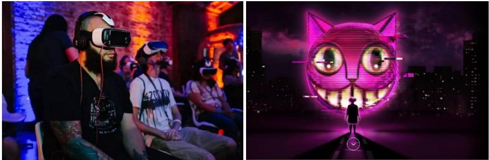  
图2-4 戏剧《仙境》

还有如手势识别、语音交互技术，也大大丰富了沉浸式场域中观众的互动方式。语音交互技术，通过语音输入来理解角色的需求并进行回应，包括语音识别、语音理解、语音合成三方面技术，提取处理角色的语音信号，快速摘要其文本信息，输出声纹的模拟等等。手势识别交互装置可通过识别、捕捉并分析人手部或肢体动作，进而将这些动作转化为可操作的指令。

# 2.3.2戏剧交互装置的影像再现

沉浸式戏剧的影像，是数字交互装置中视觉语言的载体和信息传输的媒介，与是其最为重要的数字化构成部分。通过投影屏幕等显示设备结合动作捕捉和传感器等技术，以高精度、实时生成、内容变化的动态影像与演员、观众产生互动，再现出多维度、高参与性的沉浸式虚拟世界。

沉浸式场域中，无论是单一屏幕、多屏矩阵还是异形结构组合，多元化显示介质都可以再现影像。例如，LED 显示屏可根据演出需求实现开合式、升降式、折叠式等多样化构造，而地面LED 屏常常与空中屏幕拼装再现三维立体的影像空间；同时，具有高透明度特性的冰屏可以实现影像悬浮的奇幻效果；此外，投影技术借助于幕布、纱幕、水幕、雾幕及建筑立面等不同介质表面，投影仪可以正面投射或背投出细腻丰富的影像内容，进一步拓宽了影像再现的可能性。设计师酌情选择最合适的显示介质和影像再现方式，即可为观众带来更具冲击力和深度沉浸感的戏剧体验。

依据不同时间维度上的呈现形态，装置的影像可分为实时及录像放映来再现戏剧文本。实时影像中，角色或环境的捕捉与影像的播放展示保持同步进行。设计师不仅可以设置角色与装置的实时交互，还能将现场多角度摄像机所捕获的演出现场实况，实时投射到银幕或其他显示设备上。如林兆华戏剧展版本的《朱莉小姐》中，6台摄像机对演员表演同步进行多角度摄录，导播式再现在舞台中央的悬空屏幕上，通过内景、外景、人物特写等镜头语言，观众可以同时看到演员的肢体语言、面部神情等影像画面，以此补充身体叙事，弥补了观众观看视角的缺失。还如在多媒体影像戏剧《世界旦夕之间》中（如图 2-5 所示)，李建军导演借助实时影像与绿幕抠像，拓展戏剧时空，再现出三个并存且迥异的场景：假面式演员在绿幕前表演，大屏幕中播放经拍摄合成后的影像，观众沉浸在这“故意虚拟化”科幻戏剧电影之中。

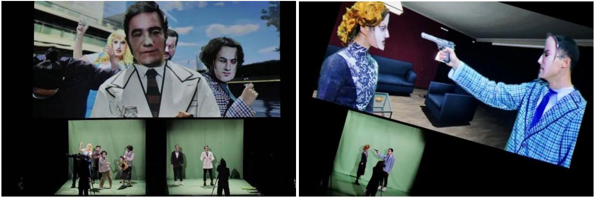  
图 2-5 戏剧《世界旦夕之间》

设计师也可将预先录制好影像内容，以录像方式来再现影像，可以展示出角色的记忆、梦境、历史背景或其他非当前发生的戏剧元素。如 2017年的悬疑探险剧《摸金玦》中，设计师预先设计制作好百余重三维盗墓场景，戏剧现场通过3D Mapping、投影等装置呈现而出，真实地再现了墓穴探险中地上与地下、真实与幻觉交织的惊险世界。

# 2.3.3戏剧交互装置的媒介诠释

沉浸式戏剧交互装置打破了传统戏剧中以模仿和再现为主的固有模式，向意向符号敞开了空间。在元语言构筑的“象外之象”中，设计师预设的表意得以显露。数字交互装置的戏剧价值，不在于还原出多绚丽的影像世界或现实复制品，而是在于一种经过设计师编码、角色传递符码、观众深度解读后的情感共鸣，升华出戏剧性情绪与意义。

设计师将自己的知觉意向和情感内核预设，通过戏剧交互装置这一媒介具象化展现，激发了演员与观众的直观体验。观众与演员的诠释理解，植根于戏剧元语言的内涵以及社会文化语境之中。因而在与数字交互装置互动过程中，参与者会产生“千人千面”式理解与情感。数字交互装置中元语言符码的诠释特性，可分为直接性、动态性及持续性三层维度。其直接诠释性体现在演员和观众对戏剧空间内数字交互装置的直觉与直观感受；动态诠释则表现为角色参与装置，经直观感受进一步形成的动作；或是角色远观数字交互装置、表演动作、戏剧场域，经由直观印象而进一步引发的深层思考。最后，当演出落下“帷幕”，数字交互装置仍将持续影响角色的思想观念与行为模式，这种持久影响力正是其元语言最终解释性的有力体现。当角色参与数字交互装置作品时，原存在于大脑神经网络中的意识反应将其潜意识带入沉浸式场域中，直接体验与感官的冲击促进角色接受到数字交互装置的元语言信息，唤醒并调动其内在的知觉意向，进一步对装置所呈现的符号性意象进行解读，与作品共鸣、触发情感，形成对作品表意的深层诠释，进而对戏剧的本质进行理解。演出结束后，观众对作品形成的最终解释，即为数字交互装置所蕴含的情感和戏剧精神的延续与传承，在观者心中得以绵延不绝。

数字交互装置的诠释是其作为符号生命的延续。“舞台设计的文本是物质的符号媒介的总和，它们只有经过观众的接受，并将他们的经验投射于它们之上时，物质的符号媒介才能被接受者重构为一个有生命的虚构世界 49。”数字交互装置和戏剧文本是固定、有限的，但其生成的表意是无限衍生的，因此这也给数字交互装置带来了蓬勃生命力和延展力。设计师通过预设数字交互装置场域、元语言，深入戏剧内部结构，参与戏剧叙事，延伸出其审美符号，具有审美价值。

# 第三章沉浸式戏剧交互装置中的“叙事场域”建构路径

当前，沉浸式戏剧交互装置在追求极致沉浸体验时，存在部分作品过分借助数字技术以营造环境氛围，一味追求场域感官刺激的现象 50，导致戏剧的文本和叙事元素被淡化，呈现出“弱文本化”的趋势。无论装置在视觉呈现上如何华美新颖，倘若脱离了戏剧叙事的深层解读与有效约束，其纯粹的造型价值便丧失意义，沦为技术炫耀的空壳。在追求新科技与视觉华丽的“炫技”或“炫目”的浪潮中，由此，设计师应将数字交互装置立于沉浸式戏剧的“叙事场域”之中，以符号学方法系统化构建其路径。

谭霈生在《论戏剧性》中提及舞台具有其内在法则，要求动作具有前后连贯性、因果关联性，不同人物与情节线之间需建立内在联系，避免孤立无涉 51”。作为沉浸式场域中质料、情感、角色和数字的有机组合，数字交互装置的数字影像、虚拟现实、机械装置甚至声光电等应用，并非是机械式地被叠加，而应基于符号本质的戏剧性，重构统筹与再设计。所有制作组成部分都叙说它们自己的语言 52。叙事结构、叙事情境、互动节奏、叙事情感会直接影响数字交互装置的设计与形态，由此，设计师须揣度筹划角色在剧场空间中的行动路径与审美意象，预设其与数字交互装置的知觉互动，隐喻出数字交互装置中的叙事文本。因此，设计师捕捉戏剧的叙事核心，对沉浸式戏剧叙事文本进行转译和解构，以此构建出装置的叙事场域与隐喻性本体（如图 3-1所示）。

  
图3-1 沉浸式戏剧交互装置中的“叙事场域”建构路径框架（来源：作者绘制）

叙事场域极具多元性、交互性、沉浸性和动态性特征，是由戏剧文本、设计师、演员、观众、数字媒介构成的开放式系统。设计师将叙事、场域、互动融为一体，创造出演员全身心投入、观众深度参与和感知环境。其多元性在于，叙事场域中不同的戏剧文本、布景道具、数字技术、装置本体等符号化元素相互交织、共同构成整个叙事空间。而叙事场域不仅是沉浸式元语言的舞台，更是角色与戏剧文本之间的桥梁，在这个叙事场域中，观众可以自由探索或者按照预设路线去感知、互动装置整个场域，以此凸显其交互性。同时，叙事场域的沉浸感氛围，使角色置身于真实与虚拟的世界，体验戏剧剧情的发展，沉浸于作品的叙事活动中。动态性体现在，随着戏剧叙事脉络的深入延展，角色们在流动的时间与空间中灵活穿梭互动，而数字交互装置也创造出丰富的感官体验，使得角色体验情感也在连续变化。

# 3.1沉浸式戏剧交互装置的符号化叙事原点

在符号学范畴视域下，作为沉浸式戏剧符号可感知的再现体，数字交互装置是对传统物性的创造，对表意的延伸。戏剧文本作为沉浸式戏剧交互装置符号的指示对象，牵动着数字交互装置主题、观演关系与情感。戏剧叙事揭示了数字交互装置主题的表意，引导和指示着观演状态，挖掘出装置本体内语词、图示、感官的像似意义。设计师通过对符号化戏剧文本进行叙事解码，以此作为构建数字交互装置的坐标原点和基础。

装置设计师通过不断甄别、解读和剖析以对白为主的沉浸式戏剧叙事文本。研析其中戏剧动作、戏剧冲突、戏剧情境等多方面的戏剧性符号叙事，便可知晓到剧中角色对话、情节叙事、戏剧动作、环境氛围、思想情感、文化内涵等，为沉浸式戏剧交互装置的构建筑牢基础。而文本叙事在经由符码、互动、场域的发生过程中，呈现不断变化的形态，也因而拓展了其原本内在的文本框架。

# 3.1.1戏剧叙事对交互装置主题的表意

以隐喻、象征或其他符号化方式的“表意”，沉浸式戏剧叙事直接或间接地呈现出数字交互装置的主题或核心意义。戏剧文本是构成戏剧叙事的核心要素之一，通过其文本创作、文化语境、社会诠释符号文本，在数字交互装置的主题中实现表意的传达。

文本创作方面，设计师挖掘装置的伴随文本一一语词、语义、语境，解构叙事文本的情节结构、情感表达。其中关键性事件、对立与冲突、情感变化等叙事文本为装置设计提供了主题素材。叙事文本的题材也直接影响着装置通过何种互动形式和感官刺激来强化主题的表意。例如，若文本意图关于探讨人与科技的关系，数字交互装置可围绕模拟未来科技环境、智能化主题形式进行设计。

设计师通过解析情节线索与叙事结构，提取出核心主题精神，进而结合自己的知觉意向，确定数字交互装置的主题方向和表达的意义。沉浸式戏剧叙事是多线程、多维度的，观众可以从不同视角、选择主线或者支线情节信息。叙事主题的设定区分了主要主题和次要主题，其相互间具有组合关系。就上海版浸式戏剧《不眠之夜》为例，在保留麦克白的女巫预言、刺杀国王邓肯等《麦克白》的主线叙事语境中，引入了希区柯克《迷魂记》和《蝴蝶梦》中的叙事情节，以及中国《白蛇传》的人物角色和文化典故等前文本，从多层面、多主题展开叙事文本，为文本意义的动态建构展现出极具开放性和可诠释性的可能。

同时，戏剧叙事的文化语境要求数字交互装置根植于其特定的文化土壤。例如，装置可以借鉴传统文化符号、神话传说或当代文化现象，通过交互形式将其转化为可感知的艺术实践，加深观众对戏剧主题在文化层面上的认知和反思。

从社会诠释角度而言，戏剧叙事是社会现象、价值观念的缩影，数字交互装置将这些社会性文本可视化、具象化、互动化，邀请角色参与并思考社会问题。例如，装置可能通过模拟社会现象的流程、机制，使观众在游戏般的互动中对相关社会议题产生新的感知。《成都偷心》以三条主线、十二支线及五十个微故事辅助叙事，源于柏拉图《理想国》的哲学、爱伦坡的文学概念、奇想化建筑的探索灵感，打造出关于爱情和背叛、生活的变异以及智能和人造人三类主题的沉浸式戏剧场域。鱼果设计团队充分注重叙事表意，构建出关于人与人造人的叙事主题以及对未来生活方式的探索，融合了科技与人之间关系并推动形成新的“生命体”及情感影响。

# 3.1.2戏剧叙事对交互装置观演的指示

沉浸式戏剧叙事在数字交互装置的观演互动中发挥着指示和驱动作用。原有叙事通过装置赋予观众或演员特色的角色身份，他们的行动也反过来动态地塑造并驱动着叙事的发展走向，形成一种互为因果、相互影响的叙事反馈机制。设计师将叙事线索转化为交互指令，推动观众跟随戏剧中叙事脉络进行互动；叙事的逻辑也激发观众采取特定行为，如方向、动势、幅度等；进而激发着其心理情感变化。

具体而言，藉由叙事对观演互动的指示性，装置自身交互和多感官呈现，剧情转折关键节点、角色动机或推动情节进展得以被着重揭示。例如，在戏剧叙事的重要环节或预设特定的时间节点，数字交互装置会被巧妙地触发激活，以此引发观众的即时参与和情感共鸣。同时装置可以通过动态传递的信息，揭示那些隐匿于表面之下的一层层叙事线索的面纱，也从而协助角色更全面地把握整个戏剧的叙事脉络。

戏剧叙事同样也引导数字交互装置中具身动作行为。设计师通过梳理叙事场域中规定的行动路径，以及部分特殊叙事环节，设立在特定时刻，以触摸、移动、旋转等动作样式，及具身动作的方向、动势和幅度，来触发数字交互装置，引导观众在空间中行为选择、互动。例如，装置通过影像亮起或者制造出声效，吸引观众朝特定方向移动或以隔空手势交互来模拟叙事情景中的动作，使观众具身沉浸于戏剧情境中。沉浸式体验剧《走进光影》中奇幻的木偶空间内（如图3-2 所示)，观众摆出姿势可生成熊猫、伸手可触摸星空、萤火虫点亮下一段旅途依此，通过身体行动与数字交互装置产生动态耦合，实现从叙事层面到物理层面的联动与深度融合。

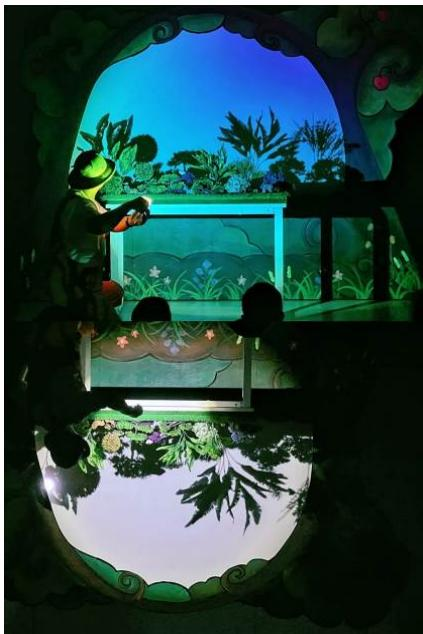  
图3-2沉浸式体验剧《走进光影》

在情感指示层面，戏剧文本中角色的内在情感线索、情绪氛围，都可以为数字交互装置的情感奠定基调。数字交互装置将叙事人物关系与情感起伏冲突等抽象的情感具象化，引导角色互动装置并逐步感知和内化戏剧场域的情感内涵，使其更贴近揣摩角色情感、理解角色动机，形成自我情感投射与情感共鸣，实现了叙事情感的转译与传达。

# 3.1.3戏剧叙事对交互装置本体的像似

符号学中像似性是指符号与它所代表的对象或概念之间存在直观的、物理的或形式上的相似性。数字交互装置与戏剧叙事在内容或情感表达上具有一致的像似性，这种统一性即装置对叙事场域对象的可视化和写实模仿，唤起观众的感知和理解。设计师将抽象的戏剧叙事主题概念转化为数字交互装置的具体感官呈现，装置本体也因为其像似性特征被感知。戏剧叙事对装置本体的像似性主要表现在语词像似、图示像似和感官像似三个部分。

数字交互装置与戏剧叙事的语词像似，通常体现在使用文或声，再现戏剧叙事的关键情节、主题或角色特性。比如数字交互装置可能会播放与剧情紧密相关的影像对话片段、语音提示、文字标签或者语音识别，或以模拟风声效果来模拟森林氛围，或使用拟声词来指引观众进行操作，这些文声元素在语义、音韵等形态上都与叙事内容相呼应，从而能够唤起观众对特定情境的记忆与联想，使他们得以沉浸并紧密关联于戏剧叙事场域之中。尼尔·门多萨（Neil Mendoza）创作的数字交互装置《被踢回的声音》（Robotic Voice ActivatedWord KickingMachine）实现了声音的转译与可视化（如图 3-3所示)，观众对着悬挂的喇叭实体说词，语词被转换成装置文本并发射到虚拟影像之中，若影像中语词文本掉入虚拟喇叭内，则又会变成声音传输到现实世界中。

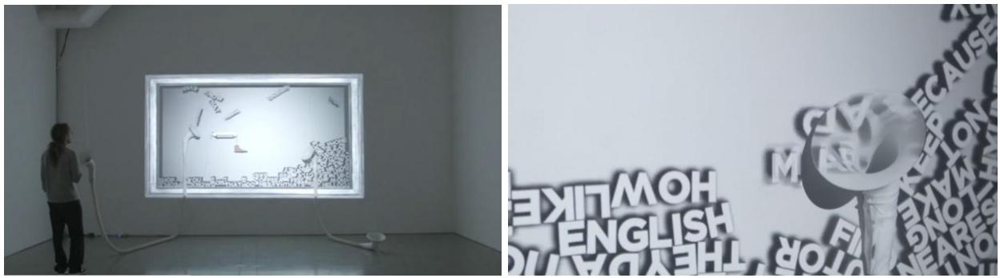  
图3-3语音交互装置《被踢回的声音》

在戏剧叙事与装置视觉元素之间，显现出图示的像似。数字交互装置以符号化图形、图像、色彩、材质等具体视觉形象来映射剧中的人、物、景概念。例如在《成都偷心》叙事场域中（如图 3-4 所示)，以红、蓝、黑三主色基调，在现代科技和工业化风格下，遍布诡异的人造人偶、破碎玩具、冰冷的透明立柱等道具，还如在动态影像装置中展现出超人类虚拟角色，如巨大“逼真”的眼睛视觉元素动态呈现，机械式电视机的头部形象结合演员真实肉体，冲击着观众的视觉，营造出混乱、迷幻氛围。启发着人们对未来主义的思考。

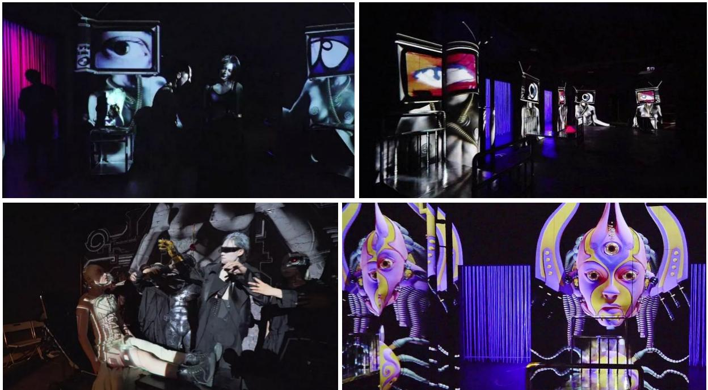  
图3-4 戏剧《成都偷心》

在感官像似层面，除了视觉、听觉，数字交互装置还调动观者以嗅觉、味觉、触觉等五感体验，模拟或再现戏剧的真实环境，从而使观众深入叙事在场，全方位地身临其境。在《成都偷心》戏剧场域中融入穹顶投影设计（如图3-5 所示)，观众可以躺在空间里仰望天空，世界人类文明的演进过程通过数字化的抽象表达尽显眼前，引发观众对人的主体性思考。

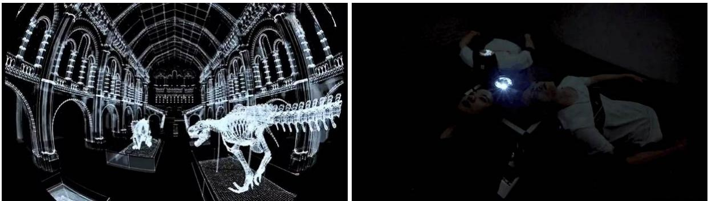  
图3-5 戏剧《成都偷心》

# 3.2沉浸式戏剧交互装置的符号化场域建构

数字交互装置艺术与剧场空间均承载了场域叙事功能，成为戏剧演出不可分割的一部分。沉浸式戏剧交互装置作为戏剧符号的一类再现元素，不能孤立地存在，而应该与装置的整个场域相互配合、共同塑造。若数字交互装置“单刀赴会”地呈现，而未与场域要素相融合，那么就会形成突兀的戏剧空间，无法达到设计师预期的沉浸式效果。

观众作为戏剧事件的亲历者，也是叙事场域的知觉者即审美客体。沉浸式戏剧交互装置的场域可分为三个核心场域—一“行动场”“审美场”和“知觉场”，设计师以此对三者进行符号化深度支解与重组。在角色为中心的“行动场”中，通过角色的动作与交互形成动态的叙事场域；而有关空间设计的“审美场”中，则营造出相应空间形态、材质、光影等视觉符号；以及借由装置辐射开来的“知觉场”中，装置的多维感官刺激，引导观众感知并沉浸到戏剧场域之中。梅洛-庞蒂（Maurice Merleau-Ponty）认为这种以身体为核心的时空关联在场，是“情境空间性”而非“位置空间性”。戏剧叙事与装置空间相辅相成，在三个场域中，装置空间承载着叙事文本，戏剧叙事主导着沉浸式空间的构建，沉浸式场景亦能够营造戏叙事氛围，以上维度共同塑造出具有深刻叙事内涵的沉浸式交互空间。

# 3.2.1交互装置的沉浸式“行动场”建构

“空间是动作在其中展开的空间，时间是动作的延续，空间与时间在动作中达到了综合 53。”在四维时空舞台场域中，数字交互装置动作随时间的推移而影响叙事与环境。角色作为戏剧符号的直接参与者和传播者，是数字交互装置的一部分。因此，在构建数字交互装置时，必须考虑角色的活动动作。若设计师不考虑角色在场的戏剧动作，就无法想象到角色所具身的动作空间，也便无法准确地预设叙事场域。

在上一章中已探讨沉浸式戏剧分为引导类、探索类、互动类三大类别，这也导致会延伸出三种不同的行动空间形态。第一种即演员引领观众至不同场景，通过台词对白、动作的演绎来推动叙事剧情脉络，在此行动场域中，观众行动的区域范围较大，但预设的行动路径会相对固定，观众的行动很大程度上是依附于演员的行动。第二种“行动场”模式中，整个戏剧叙事发生在相邻的几个固定场景，观众可以化身某种角色并自由选择路径，因此相邻区域内往返穿梭的路线更为复杂。第三种空间形态，即观众和演员或剧场其他人员共享一个空间内，这种模式下观众的行动场域是开放和不确定的，观众与演员交织在一起。无论是演员还是观众等角色身份，均作为推动叙事进程、塑造叙事体验的重要主体，在数字交互装置“行动场”中的地位都有着本质的相同。

沉浸式交互装置的“行动场”，是围绕角色的行为动作所构建的动态叙事场域。戏剧符号叙事文本赋予了角色基础的活动框架，规定了其动作位置、空间关系和移动路线等要领，在戏剧文本中，角色的对话、独白、旁白都可指示演员卡司的表情、姿态、身法等动作。表演文本具有类隐性和潜表性特征，即表演文本不仅包括直接呈现给观众的语言和动作，而且包括隐藏在其中的情感、意象、象征等更深层次的意义。设计师基于这些场域中的基础动作符号的规定上，再预设由点至面的和具身动作下形成动态的“行动场”结构。动作空间的结构要素由区域、支点、路径、转换组成54。

装置的区域，不仅仅为实体物理的空间，而是被划分为多个不同主题、特定功能或情境设定的子区域观演叙事空间。这些区域应具有鲜明的叙事功能和视觉标识，每个区域可能代表着戏剧叙事的不同章节或情绪氛围。可依据主次、方位、范围，对数字交互装置的所占区域关系，进行划分，如设置前后、左右、侧区，中心区、主副演区、过渡区等，建立角色在数字交互装置空间中的行动区域。在戏剧体验前观众可通过伴随文本示意图查看大致的表演区和观众互动区等“行动场”。支点，是装置动作的焦点，有关戏剧场域中的关键互动点或核心事件。支点可以一个道具对象，通过设置特定交互点，如触摸屏、实体按钮、虚拟现实手套、感应区等，为观众提供与装置互动的契机。进而，可以设定区域内的角色从某一支点走向另一个支点，以此形成装置场域的调度。例如沉浸式戏剧《幻境·宝来屋》划分出香料皇宫和月光森林两大阵营（如图3-6所示)，观众以任务、调查解密的游戏化主线穿梭于宴会厅、皇家会所、占星台、月光广场等等多重功能性区域中，体验沉浸十大光影空间。

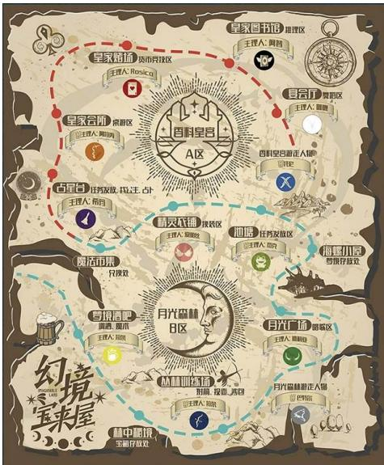  
图3-6 戏剧《幻境·宝来屋》行动场分布

装置叙事场域中，叙事文本规定了演员的行动路径。观众不再像传统剧院那样坐在固定座位上，则根据自己意愿选择在各区域间行进，形成各自的体验路径，由此历经个性化、非线性的叙事体验。因此，设计师须考虑通过导览系统、视觉或演员引导，设计出一条或多条路径，观众能自由选择或按预定的顺序依次体验。最后，在“行动场”中自然展现叙事与叙事、场景与场景之间的过渡转换，如角色行动变换和物理空间换景、装置的影像过渡、声效的衔接设计。有效的转换设计能够让观众顺畅地从一个情境切换到另一个情境，保持故事连贯性和观众沉浸感。

# 3.2.2交互装置的沉浸式“审美场”建构

斯沃博达认为“舞台设计元素是不同质的 55”，沉浸式交互装置的“审美场”，不仅是可供观众和演员行动的场域，还基由数字媒介和设计元素，共同构建的具有知觉观照的符号化审美空间。数字交互装置场域中，设计师藉由自己知觉意向，通过各类装置符号编码再现，重构装置内部的形状、色彩、肌理、声光电元素，在时间、空间、动作、叙事中达成统一，渲染出“审美场”的整体戏剧性审美意象。

首先，装置创作者通过设定“审美场”内部形状来构筑其“骨骼”架构。运用点、线、面、体等基本几何形状，以及复杂的有机形态组合，在二维与三维叙事场域中创造出丰富的审美层次体验。具体而言，以圆、方、三角形作为视觉“点”的载体；对规整的直线、流畅的曲线抑或是水平线、垂直线、斜线的线性元素进行细致考量；以及对于面处理如不同的大小、形状、弯曲程度，为装置场域铺设基础视觉符号语言。

其次，以色彩和肌理填补“审美场”的“血肉”。通过色调、饱和度和明暗对比等色彩变化，传达出象征性主题意向。不同的颜色能够区分着不同的功能区域，还可以影响角色的情绪感知。肌理层面，以特定的静态材质纹理、光影、雾气、水波等动态元素效果增添符号化场域细节。若使观众沉浸于满是岁月印迹的复古客厅中，放置诸如泛黄的信笺、磨损的家具摆设、旧照片投影等泛黄色调布景，便可感知剧中家族历史的厚重或沧桑，此时，装置场域空间本身即为为戏剧叙事的重要载体和情感记忆的可视化表达。再如《成都偷心》场域中刻意设计破碎的沥青、钢筋混凝土、围挡建筑材料等工业废墟风格元素，体现出后现代主义粗犷美学的肌理感。即使在虚拟世界中，通过精细图形渲染亦能模拟出逼真质感，增加观众的“真实”感知。

同时，在声光电媒介中，完成对沉浸式戏剧交互装置“审美场”的装饰性建构，戏剧叙事场域的烘托。背景音乐、环境音效、语音对话、触控反馈音等声音设计，触摸感应、动作捕捉、红外感应等电信号技术，以及动态灯光、幻灯投影和LED 等显示电子媒介及升降旋转台，使得场域审美符号更具动态性，同时作为互动反馈的重要方式，增强了叙事情感表达。

如GeeksArt 团队数字交互装置装置作品《夜光丛林》（OriginalNeuron）中（如图3-7 所示)，仿生真实肌理的树植围绕着以由大量发光纤维白丝为主的流线型设计。整个作品以蓝、紫为主色调，营造出宁静神秘且未来感氛围。观众通过滑动触控面板唤醒植物神经，为主树“蓄能”，在此过程中主树枝干的光纤神经会按照一定节奏“流动”。装置以人与环境的关系为主题，象征着万物是相连的有机生命体，神经单元的植物沿着“思维”的轨迹螺旋式的扭曲攀爬，最终启发着观众对“意识”的深度认知，及生命源头的敬畏。

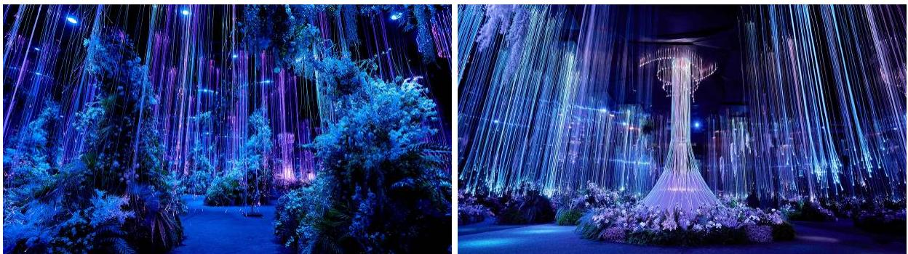  
图3-7数字交互装置《夜光丛林》

# 3.2.3交互装置的沉浸式“知觉场”建构

沉浸式数字交互装置叙事的“知觉场”，是以观众为对象的全方位、多感官的空间场域。观众不仅仅作为旁观者被动接收叙事信息，更是作为“戏中角色”亲历参与戏剧符号的叙事之中，以自身知觉意向互应设计师和装置叙事场域。如沉浸式戏剧《完美犯罪》的法庭中（如图3-8所示)，观众旁听庭辩全程之时，还能作为首席法官团、金牌律师团、明星侦探团或特级陪审团中的一员，对案件进行审理、直至最终破案。当观众置于与叙事交织的“知觉场”内时，其审美体验不仅仅是视觉或听觉的单纯享受，而是跨越多重的感官维度。赵毅衡认为“感知整合，回归整体思维的前印刷时代56”，数字化时代下驱使观众注重作品感知的整体性、直观性和情感共鸣等模式机制。以叙事符号为原点导向，对戏剧文本和现实生活进行本质抽象，充分调动观众五感，即视觉、听觉、触觉、嗅觉、味觉，形成深度沉浸、实时反馈的“知觉场”。

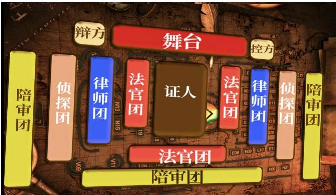  
图3-8 沉浸式戏剧《完美犯罪》角色座次

“知觉场”中创作者通过符号化五感设计，模拟再现生活中熟悉的场景、情境，触发观众个体或集体的共同记忆。同时装置中叙事元素与观众过往既有的经验和情感记忆产生共鸣，从而催生强烈的归属感和情感联结，使观众能够走进戏剧性叙事，实现知觉的初步沉浸。如《弄堂 1992》中满溢上海市花玉兰花清香，增添了上海老街的梦幻；《不眠之夜》中在酒吧休息区品尝鸡尾酒（如图3-9所示)，加速沉浸在舞会的多巴胺中。其次，装置以联觉效应实现观众的多感官激活，将符号化感官元素转化为另一种感官符号，以此丰富、立体化感知体验，实现知觉的深度沉浸。若在有关海洋主题的知觉场域中，可通过预设脚下地板动作来模拟波浪的律动，同步触发水声和海浪波涛的投影，以实现观众触觉、听觉与视觉的沉浸式联通。如 2022年西班牙普拉多博物馆展览的《绘画的本质》（The Essence ofaPainting）中（如图3-10所示），以新形式展出系列油画作品《五感》，将香水注入纺织品布面。观众通过点击屏幕中视觉元素，装置的扩散器即刻释放出相应味道，异香扑鼻，由此观众可感受无花果树、橙花、茉莉花、鸢尾花、蒸馏器皿、猎犬和灵猫等气味，这种嗅觉与视觉的联动予观众更真实、丰富的感官体验。

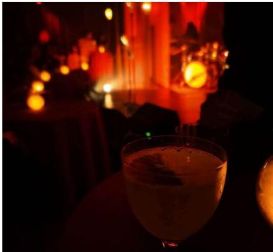  
图3-9《不眠之夜》酒吧场景

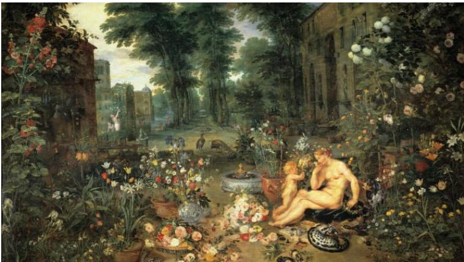  
图3-10交互装置展《绘画的本质》

此外，观众的动作介入也持续性填补了沉浸式戏剧交互装置的“空白”。“知觉场”中装置设计师以开放性叙事结构、等待静置的状态、互动中的模式，预留出观众在互动装置前的“空白”罅隙，随着观众多次的互动体验，其不断完善对戏剧的知觉认知。

# 3.3沉浸式戏剧交互装置的符号化本体隐喻

数字交互装置设计师在重构视觉表现、多感官设计及互动机制的创作中，对戏剧象征或抽象性符号语言进行提炼、转译，从而构建出蕴含多重意义的戏剧交互装置。这些符号化元素以隐喻的符号化方式，传达着装置设计师蕴含的某些深层文化或哲学思辨，引发观众情感共鸣。

从叙事与艺术表达的角度来看，可在实体类、影像类、空间类的沉浸式戏剧交互装置中，探究其独特本体隐喻特质。实体类交互装置中静态与动态结构的凸显、影像类交互装中抽象与具象性影像视觉的交织，以及空间类交互装置中虚拟与现实空间的沉浸，均深刻揭示了戏剧叙事内涵与隐喻。

# 3.3.1静态与动态性实体结构

装置设计师对机械装置、灯光设备、音频设备以及实物质料等进行整合，以动态设计理念，构建出观众可交互的实体类交互装置。静态性装置结构作为内在的主要支撑与基础，为动态结构提供了稳定的架构，而动态性结构则通过其运动变化，为静态结构注入生命力，二者互为，由此呈现出动静平衡。观众在与装置互动的过程中，能够感受到其背后的象征性意义，从而引发对隐喻性主题内容的思考。

沉浸式戏剧交互装置的静态性实体结构，是原本固定的静态载体，包括其基础架构或装饰性符号元素。设计师通过重构装置的材质质料、色彩搭配、外部形状、尺寸规格、固定布局等元素。戏剧叙事性理念、情感或文化内涵借此特定可视化出来。数字交互装置中的动态性实体结构是指随观众的介入而改变或本体自身运行变化的部分，如机械装置、活动组件、电动元件等。这些动态元素通过编程控制、传感器检测或观众的直接操作，得以实现其运动位置、形态或发光、发声等功能变化。

丹尼尔·罗津（DanielRozin）善于在交互装置系列作品《镜子》中运用毛绒球、木瓦、镜子、扇子、垃圾等多种材质排列成矩阵式显示器，“照”出观众自己。2015年，《绒球镜》（Pompom Mirror）由928个人造绒毛球、464个马达系统控制像素绒球的运动（如图3-11所示)，以计算机视觉构建观众的镜面轮廓。黑色与米色绒毛在观众的互动中规律变换，实现“镜子”的变色效果。若没有人面对它时，“镜子”自中心向四周逐渐变成黑色，如同深渊巨口独自进行着吞噬。“镜子”的毛绒材质仿佛是有生命力的拟人生物。罗津将科技赋予温度，现代科技与传统手工材料结合，意指人类在追求科技进步的同时，不忘回归自然与传统工艺的和谐共生。当观众凝视镜子时，隐喻了其自我认知过程的主动性和互动性，深思人类如何在现代科技化社会中重新定义和感知自我。

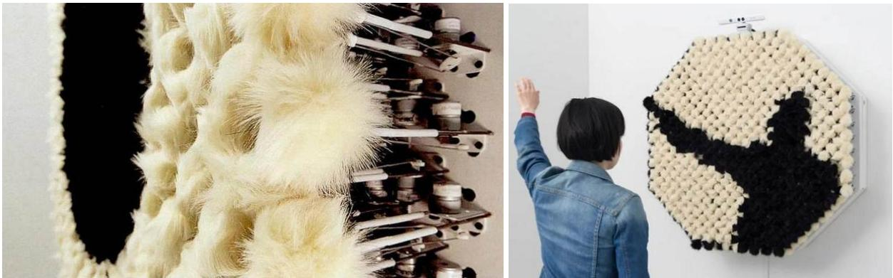  
图3-11交互装置《毛茸镜》

《垃圾镜》（TrashMirror）是利用如金属罐、塑料瓶盖等回收的废弃物，制作而成的交互装置（如图3-12所示)。同样通过传感器和电机系统，实时捕捉并镜面出观众的动作，从而形成一幅由废弃物像素拼接成的动态“肖像”。《垃圾镜》将废弃物材料转化为符号化媒介，被视为“垃圾”的物品通过科技焕发出新生，由此显露出对废弃物的再生潜能和环保议题，同时也对人与环境、科技与自然、以及现实与虚幻的边界提出了新的思考。

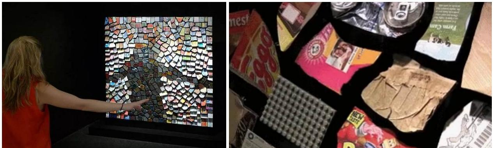  
图3-12交互装置《垃圾镜》

# 3.3.2抽象与具象性影像视觉

影像类交互装置主要以投影、虚拟现实、增强现实等数字影像，动态化展现戏剧叙事的文本符号。观众与抽象或具象的影像画面互动，直接触发着影像内容的实时演变，使得其沉浸于构建的影像蒙太奇空间之中，进而感知、联想来解读作品所传达的隐喻涵义。

在数字交互装置的抽象性影像中，不直接展示事物的具体形态，而是强调非具象、非自然主义的表现手法，抽象处理视觉符号元素。如以构成主义、极简主义、立体主义、热抽象、冷抽象、抽象表现主义风格，简化几何形状、颜色对比等来构建影像视觉画面。具象性影像视觉则表现为，对现实世界的对象真实地再现或高度拟真地模仿，观者能够轻易识别和关联现实世界的物体、人物、场景等内容。借助高清摄影、三维建模、计算机生成图像等技术手段，制作还原出“真实”的影像。例如FactoryFifteen工作室为 2017-2018年国际羊毛标志大奖的全球总决赛创作的舞台交互装置中（如图3-13所示)，每当人经过或是触碰到墙面时，原本蓝色的点点星河中间分裂出不规则且乱序运动的线条，结合对比色彩的冲突，呈现出近似羊毛织物结构的魔幻视觉效果，揭示出平静表象背后的交织之本质。

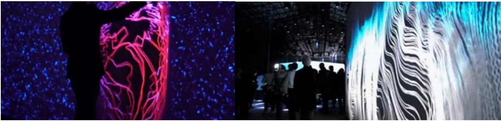  
图3-13 FactoryFifteen舞台交互装置

在 NILLab为车企用户设计的全息交互装置《制·衡》中（如图3-14所示)，观众通过踏板装置“驱动”全息影像，具象化模拟出真实世界中竹筒舀水的动态、光感与质感，以诗意的方式诠释了技术与自然、人力与机械之间的微妙平衡之道。装置中全息影像水元素仿佛源自天地万物而又归于无形，其起源与流向皆难以捉摸，不知从何而来，也不知往何处而去，象征着无界之流与无穷之力，同时也暗示了汽车科技永不停歇的进化历程。而观众每踩上竹质踏板的瞬间，仿佛化身为驾驭自然与科技力量的主宰者，决定着眼前那股虚拟水流的瞬息万变一一从平静流淌到奔腾不息。

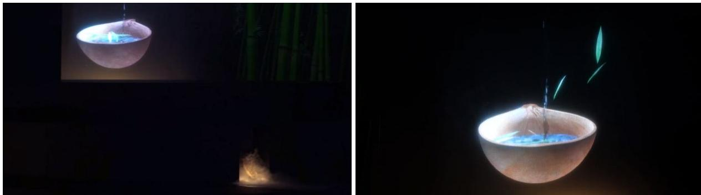  
图3-14 数字交互装置《制·衡》

# 3.3.3虚拟与现实性空间沉浸

空间类数字交互装置在构建出沉浸式的物理场域之际，依托虚拟数字技术，亦实现了实体空间与虚拟世界的交融。以“元叙事”的沉浸方式，引领着观众步入虚拟现实、虚实结合的感官世界。这种交融不仅极大拓展了空间层次，而且让其中的隐喻表达更加鲜活。身体被影像虚拟世界包围，观众与影像空间的界限由此逐渐转向模糊，而其具身体验也由简单直接的光影与身体交织，转变为穿越屏幕界限、虚实交织的沉浸体验。同时通过解读这些富含象征意义的视觉元素，体悟其背后蕴含的哲理与情感信息。

2020年，TeamLab 团队创作了《翻转世界之涂鸦自然，红色名录》（Inverted GlobeGraffiti Nature-RedList）数字交互装置作品（如图3-15 所示）。在装置的数字交互式涂鸦墙中，观众手持数字画笔绘制各种濒危生物，它们随即会生动出现在虚拟影像的“翻转地球”之中。虚实相生，观众同时仿佛也置身于既盎然生机又极度脆弱的虚拟生态系统之中，“触及”真实世界的自然法则，目睹众生物此消彼长。花朵会在人驻足之处繁花似锦，若来回践踏便会凋零殆尽。以“虚”拟“实”，借“虚”拟技术再现出生态系统中“实”际存在的濒危物种，增强了观众对生物多样性和环保的认知和感知。《翻转世界之涂鸦自然，红色名录》将艺术、科技与生态保护理念巧妙融合，通过沉浸式的互动体验，让观众在娱乐中重新审视人与自然的关系，唤醒公众对生态环境和生物多样性的关注，倡导保护濒危物种的重要性。

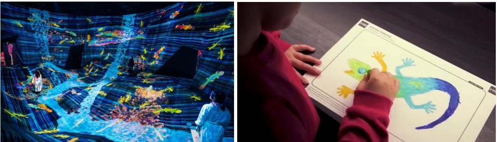  
图3-15数字交互装置《翻转世界之涂鸦自然，红色名录》

# 第四章 沉浸式戏剧交互装置的符号还原方法

在立体主义、后戏剧、实验戏剧等思潮下，部分数字装置创作者在沉浸式戏剧舞美中片面拘泥于数字技术和感官的刺激，亦或受限于商业性而盲目追求“沉浸式”标签，由此，赋予观众深度数字沉浸性体验的同时，出现戏剧叙事语言符号淡化、娱乐游戏化倾向，如全程带着任务的“游戏场”漫游体验等，导致产生了形式大于内容、冲击着戏剧的戏剧性等问题。

《对话·寓言2047》的执行导演指出，“科技也许能束缚人，但你仍能选择像老奶奶那样保留最质朴的东西，泰然自若。”一味地追求数字化炫目与炫技都不可取，技术只是手段，而非目的，若只顾追求装置技术新奇与纯感官盛宴，而缺失戏剧的叙事情感，则适得其反地失去戏剧交互装置艺术自身的独特性。因此，在沉浸式戏剧场域下，构建出数字交互装置的符号还原设计方法尤为重要。沉浸式戏剧本质上依然隶属于戏剧范畴，而在其语境下的数字交互装置也亟待考量其本源，植根于戏剧文本的戏剧性基础之上，确保技术服务于戏剧叙事与情感传达。

沉浸式戏剧交互装置以戏剧文本为摹仿原点，角色亲历的叙事、在场的动作和生成的情感都深受戏剧叙事文本内的指导。由此，设计师在戏剧文本、交互装置、沉浸场域的坐标轴中，运用与之对应的设计方法还原“情节-情境-情感”，实现互文、互动、互成的沉浸式戏剧交互装置（如图 4-1所示)。在沉浸式戏剧场域中，厘清数字交互装置的整体互文要素；继而调动观众的视觉、听觉、触觉、嗅觉、味觉五感，营造出全方位多感官的互动情境；最后，构成数字交互装置的技术特性、艺术表现和互动设计，观众得以在叙事情境中突破物理空间界限，以至激发深层的情感共鸣。这一过程消弭了创作与亲历、空间与身体、文本与观众的界限，整体构建出数字交互装置的交织之美57。

  
图4-1 沉浸式戏剧交互装置的符号还原方法框架（来源：作者绘制)

# 4.1情节还原法：沉浸式戏剧交互装置的互文解码

互文，又称互辞或互见。罗兰·巴特在《文本的理论》和《作者之死》等文章中论述了文本通过象征、象征叙述、文化参照等编码方式，形成“互文的织物”，文本间存在内在的相互指涉关系，每个细节都可以关联到其他文本、文化符号、历史背景或其他文学传统。克里斯蒂娃在《词、对话和小说》中首次提出“互文性”（intertextuality）概念，任何一个文本都不是孤立存在的，而是在一个更大的文本网络中，通过引用、借用、模仿、戏仿、颠覆等方式与其他文本相互关联、相互参照体现出来。

而沉浸式戏剧交互装置的互文，是戏剧叙事与装置内容的互文。即在设计和呈现过程中，数字交互装置非为独立的艺术作品存在，文本的开放性与流动性特征使得其主题背景、叙事风格、角色路径，与戏剧情节文本之间二者互应、紧密相连（如图 4-2所示）。

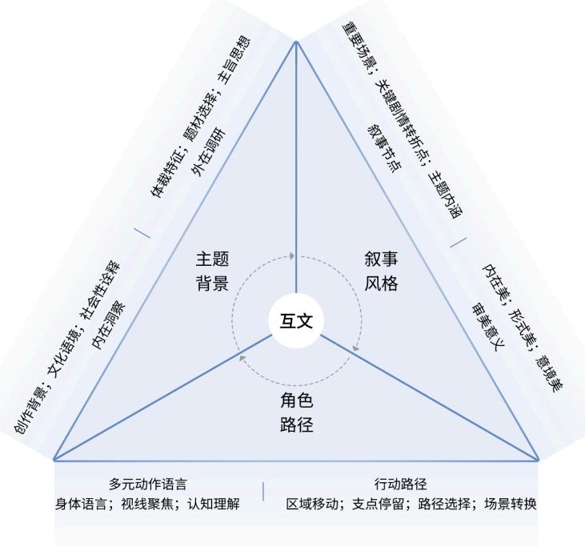  
图 4-2 情节还原方法框架（来源：作者绘制）

# 4.1.1主题背景的互文参照

在前几章节中，本文已对沉浸式戏剧伴随文本的语词、语义、语境和叙事场域的符号化进行了深入分析。戏剧的伴随文本是装置主题背景的参照物，装置的主题文本同样深受戏剧内在主题和外在背景影响，形成一种互为文本、相互影响的复杂关系，还原沉浸式叙事情节。

具体来说，在还原创作的首要阶段，设计师通过对剧本进行初步研读，解码文本情节，调研外在文本的创作背景、文化语境以及社会性诠释，以及洞察出内在的体裁特征、题材选择和主旨思想，以此作为数字交互装置的命题概念来源。进而挖掘出其文化内涵，审视装置如何借用或者重构这些符号化元素，使之与当代社会议题或观众个人经历产生对话，还能在数字媒介中激活并拓展其意义，实现互文性的有效转化与动态生成。同时，观众也可以透过装置的表象结构去洞悉、阐明作品内部各文本元素之间的相互指涉与对话关系。

若为《成都偷心》的剧本进行作品再设计时，主题上而言，针对都市孤独与人际情感主题，设计出系列的互动空间，观众以交互行为激活数字角色的内心独白在文化符号层面，结合川剧脸谱、火锅等成都文化符号，使用 AR 技术搭建互动区域，展示出城市发展与传统冲突、现代压力等社会痛点，以提升观众的体验感知，实现互文解读与深度共鸣。

# 4.1.2叙事风格的互文渗透

设计师通过反复研读规定性沉浸式戏剧文本，提炼出其中关键叙事节点、审美意义描述，并在数字交互装置的叙事结构中加以重构表现。这一过程突显了数字交互装置在叙事结构及戏剧情节的互文渗透关系。

从叙事结构和剧情推进的角度而言，装置揭示了角色深层次的心理状态、推动了剧情的转折发展，乃至是对关键情节场景的直观再现。装置的形式、机能及运行机制都可能作为一种潜在的视觉隐喻，还原出戏剧文本的核心主题、复杂的人物关系以及情感主线。由此，设计师深入剖析戏剧文本，聚焦于沉浸式戏剧中的重要场景、关键剧情转折点、主题内涵以及角色间错综复杂的关系网络，洞悉文本中能指向或可构建多感官体验的关键要素。依据戏剧故事情节，设计师将这些关键要素有效地渗透至数字交互装置的设计方案中，运用包括但不限于空间布局、数字媒体、实体道具、光影艺术等多种手法，将之转化成可感知的叙事媒介。这些媒介与戏剧情节之间建立了隐喻、类比或直接对应的关联性，从而强化了叙事层次与戏剧文本间的互文性。例如，装置内部可能会复刻剧情中的标志场景，观众从不同视角重新解读并介入剧情进展，在互动中不断挖掘和构建新的叙事线索，进而形成与文本的深度互文对话。

在数字交互装置审美风格的设定中，设计师侧重于捕捉审美对象的内在美、形式美、意境美及其艺术价值。根据剧情的历史时代背景、文化特征及主题内涵，设定装置还原出既符合功能性需求，又能在视觉和感知层面上与整部剧目艺术风格和谐统一的审美风格。假若戏剧情节文本展现出富含象征寓意、高度的抽象表达、多层次叙事、对传统形式的革新挑战以及对现代社会矛盾冲突的敏锐揭示等特征，那么设计师可以选择诸如立体主义、几何抽象、构成主义、极简主义等抽象艺术的风格来指导数字交互装置设计，与剧情紧密互文，使其成为深化主题表达和提升观演体验的有效手法。

# 4.1.3观众行动路径的互文映射

沉浸式戏剧的情节文本与数字交互装置建立了紧密的互文关联，映射出装置场域中观众动态、多维的行为参与和互动体验。戏剧剧情规定了观众的一部分身体语言、言语表达、视线聚焦、认知理解等多元动作语言，以及区域移动、支点停留、路径选择和场景转换等行动路径；而另一部分赋予了观众极大自由度，如其在装置场域中随意的行为选择路径与戏剧文本情节。

设计师首要依据戏剧文本内的主线和副线情节，预设观众在装置场域中的行动路径，确保每个节点或每个关键阶段都能够与戏剧情节互应。举例来说，若观众在穿越特定装置区域时，可能会触发与戏剧主人公心境相匹配的音乐与影像，抑或是通过与装置的互动操作，揭示出与剧情息息相关的谜团或任务。

此外，基于沉浸式戏剧的剧情框架，观众的个人选择和互动程度也会对其行动路径产生影响，以至于观众选择的路径呈多样性和个性化双重特性。一方面，设计者从预设的目标出发，提供多种可选择的情节分支与结局选项，观众紧紧跟随其中一条故事线性发展脉络；而另一类，空间内未预设的叙事路径线，观众的感知反应与实际行为完全取决于其自身体验，由此凸显个性化特征。情节文本与装置叙事线互文，既还原了预定的剧情叙事，又尊重与兼容了观众自由意志，实现开放式演绎。

# 4.2情境还原法：沉浸式戏剧交互场域的多元重构

处于沉浸式戏剧的场域中，单凭数字交互装置本身尚不足以架构起一个完备的戏剧时空，其单独的在场展出往往难以产生戏剧张力，由此便会显得“无戏”。反之，当数字交互装置嵌合、融入到舞台布景的整体布局之中，对变幻的光影、音效配置以及其他多元化的域语言进行重构时，彼此便形成有机统一关系，各元素共同塑造出饱满的戏剧情境，达成观众期待中的“有戏”之境。

情境还原，是基于数字交互装置与沉浸式戏剧情节文本的互文创作上，将戏剧特定的情境、场景、氛围模拟或再现出来，在虚拟与现实的交融中实现对戏剧情境的高保真还原，使观众能够如同身临其境般地感知、体验情境的真实与内在意义。这一设计过程不仅仅是设计师对实际生活场景或虚构世界的物理复现，更是观众亲历与审美空间的多元重构，进而构建起一个多层次、多感官的叙事环境。

设计师在实地调研未来演出的剧场内部空间，包括尺寸布局、技术设施设备、建筑风格与装饰等剧场固有结构后，便可以开始创作沉浸式戏剧交互装置的空间，设计装置的功能架构、布局结构与审美布景、场景光效与音效以营造渲染空间的情境（如图4-3所示）。

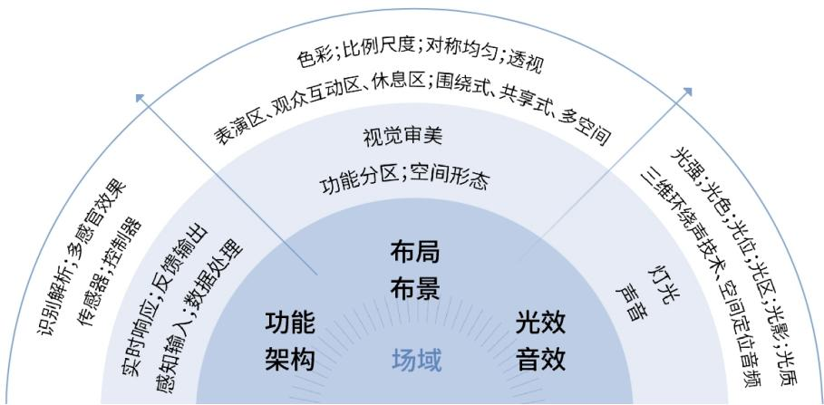  
图4-3情境还原方法框架（来源：作者绘制）

# 4.2.1装置的功能架构触发情境

沉浸式交互装置的功能架构，本质上是基由其内在工作原理形成的多维结构系统，涵盖了感知输入、数据处理、实时响应、反馈输出以及最终同步呈现等多个环节。在与观众的互动中，数字交互装置可以触发一系列预设的剧情、环境变化或其他多感官互动，使得观众从物理操作层面逐步过渡至情境感知的深度，继而构筑出高度个性化和沉浸式的情境体验。

在数字交互装置的感知输入系统中，通过传感器，借助如动作捕捉、红外感应、雷达探测追踪、摄像头、触摸传感、声音识别等技术手段，捕捉追踪观众的动作、位置、声音等互动或环境变化数据；再借助控制器，对传感器采集的原始数据进行处理，将其转化为可识别的指令或信号。其次，在数据处理阶段，数字交互装置对采集到的原始感知数据执行预处理、过滤、解析以及模式识别等一系列算法操作；与此同时，设计师根据此先预设的规则和剧本需求，将特定情境因素与装置功能关联起来，确保系统能实时调整和控制装置场域内视听效果，以进一步影响观众叙事路径的发展走向。最后，装置处理后的结果以可视化、听觉化等形态实时反馈呈现给观众，例如屏幕影像内容的动态变化、语音音频的适时切换、机械装置的灵活运动、触觉震动反馈、灯光氛围的调节、烟雾特效、温度等等多感官要素相互作用。更重要的是，在整个复杂的交互装置体系中，所有要素的运行须精确同步，以确保情境转换的流畅性和一致性，赋予观众以连续、沉浸的戏剧体验。

如 Vincent Houzé的沉浸交互装置《流体结构360》（Fluid Structure 360）作品（如图 4-4 所示)，相较于其前身《流体结构 360》（Fluid Structure），此衍生版本的装置通过集成动作捕捉、红外传感器、投影仪、扬声器等多种设备，将观众的实时动作输入转化为控制流体形态变化的数据指令。设计师运用特效软件流体工具 fluid solver 进行实时处理，模拟出受到外力和物理约束条件下的动态流体形状。在此基础上，《流体结构 360》采用环绕式灯光投影替代LED 屏幕展示方式，将戏剧化的数据可视化，流畅地触发了 $3 6 0 ^ { \circ }$ 全方位、立体且高度逼真的流动液体。从弯曲、变形到溶解、断裂，再重新聚合成新的凝结体，如同海洋中涟漪的扩散与回荡，生动而富有韵律。装置因观众的动作而如影随形，让观众置身于浩瀚的瀑布情境之中。

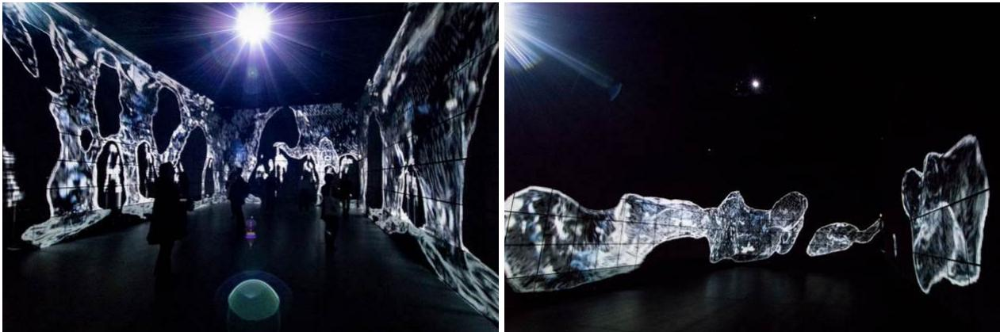  
图4-4沉浸式交互装置《流体结构360》

而除了在沉浸式戏剧交互装置对角色行为识别、处理、响应及反馈的体验流畅性方面，设计师还需考虑不同年龄、不同知觉意向的观众需求，以确保数字交互装置的普适性。

# 4.2.2空间的布局与布景营造情境

在戏剧交互装置的创作框架中，秉持功能性与审美性的双重原则，对空间布局与布景进行设计，以此还原沉浸式戏剧情境。布局设计作为装置空间结构的核心要素，决定了装置空间的功能分区与空间形态。因此，首先明确沉浸式戏剧叙事场域下，各功能区域的属性与定位，如区分表演区、观众互动区、休息区等，并根据剧情脉络和叙事需求，科学地分配空间资源，确保表演区、观众互动区、休息区等功能区域得以充分利用。

本文在第二章及第三章中详细论述了沉浸式戏剧主要的三大类别一一引导类、探索类、互动类，以及各自相对应的三种空间形态，即围绕式空间、共享式空间和多空间。围绕式空间通过区域划分明确表演与观众的空间界限，共享式空间不规定演区和观众区，而多空间则拆解叙事区域，将其分散至两个或以上的独立空间。针对不同的空间形态，多个数字交互装置之间的路径导览设计尤为必要，使得观众能够在详细的导览指引下流畅穿梭于各个区域，也保证了空间流动的连贯性与完整性。

进一步地，基于上一小节初步设立的装置主题风格，细化装置空间的审美布景设计。沉浸式戏布景设计往往在视觉审美层面追求真实感与代入感，观众得以全身心地沉浸于虚构情境之内。以北京曲剧团的沉浸式作品《茶馆》为例（如图 4-5 所示），布景选取传统四合院建筑样式，墙上挂着春联、门神等文化符号，加之古典的中式家具摆设和装潢细节，共同还原了茶馆的古风古貌，营造出浓郁的北京味道。

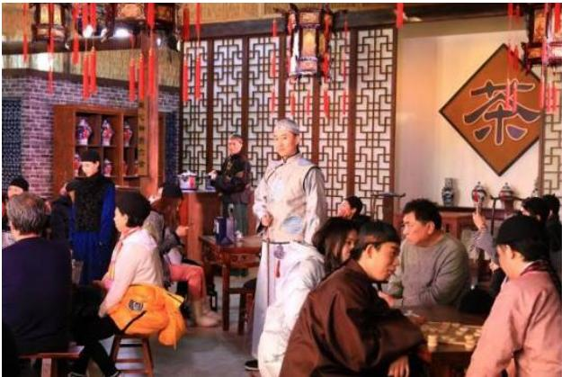  
图4-5沉浸式戏剧《茶馆》

以数字化影像媒介布景，同样可以营造出“真实的”虚拟情境。在MarshmallowLaser Feast为索尼Playstation 所创的作品中（如图 4-6 所示)，通过一镜到底画面，结合数字三维跟踪定位与实时投影映射，人偶演员改变空间的布局，物理空间与虚拟影像无缝转换，虚拟空间中砖墙与地面肌理构成的室内环境，戏剧性地转变为从高空鸟瞰都市大厦的全景视角，打造出随叙事发展而动态变化的投影剧场。

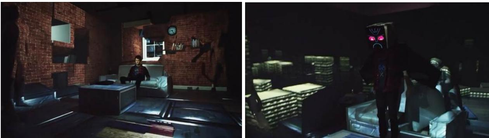  
图4-6索尼投影剧场

沉浸式戏剧交互装置的空间设计中，设计师充分考量空间的色彩、比例尺度、对称均衡等法则，以达到各区域布景的整体视觉效果和谐统一。通过色彩的对比、过渡和重复等手法，能够清晰地区分和界定空间中不同功能的区域，观众对情境氛围的感知也直接受到色彩的冷暖对比、明暗层次和饱和度的影响。如《不眠之夜》中，通过对比金色调的舞厅与黑暗色调走廊的色彩，强化了权力中心区域与阴暗神秘地带的二元对立，同时运用从明亮电梯大厅至绿色调温室的色彩渐变，勾勒出现实与幻境之间的朦胧界限，并在多个场景重复应用红色，烘托了全剧有关暴力、复仇与爱情的核心主题情境。

合理运用比例和尺度有助于还原真实或超现实的空间情境，适当的夸张比例与尺度则会突出或淡化特定的情境元素。对称与均衡，体现在布景结构的轴对称或旋转对称上，带来庄重、稳定且有序感，适用于表现古典美学或秩序化的情境；而视觉重量的均衡分布、元素符号的重复运用，营造出空间的视觉平衡，提升了空间识别度。

此外，通过前景、中景、后景以及透视设计，加深空间的纵深感。采用装置或隔断进行空间分区，模拟物体之间的情境遮挡关系，也可利用镜子或其他反光材质来复制和扩展空间，观众在“移步换景”中即可体验到戏剧情节焦点的转换。若为儿童剧情进行布景设计，设计师可采用亮丽、富有活力、鲜艳的色彩搭配，以及富有儿童趣味性和寓教于乐的视觉元素，非线性、非传统的异形设计如曲线、圆角、多层的立体空间等，以此激发儿童的好奇心和探索心。

最后，在经济性设计前提下，设计师应致力于降低投入成本，提高资源利用率与可持续性。通过优化装置空间布局和合理选择经济耐用、性价比高、环保安全的布景材料，降低制作成本、规避潜在危险性布景。在项目结束后，将部分设计元素、理念应用于其他戏剧版本，实现设计的复用与循环利用。

# 4.2.3场景的光效与音效渲染情境

基由沉浸式戏剧主题内涵、风格特征及情节脉络，通过审美表达与动态转换的设计，场景光效和音效得以渲染出数字交互装置的情境氛围。

通过对传统或现代数字灯光的设计，如光强、光色、光位、光区光影质感、光束运动、光质变化，共同呈现沉浸的光影效果。沉浸式戏剧中，往往运用柔和的自然环境光去还原戏剧情境，如模拟日出黄昏、阴晴变幻等不同光照下的情境特征。并通过调光系统预设定时程序控制光的动态变化，模拟自然界光的自然流转，灯光的强度和色温随时间推移而得以自然过渡。如调节灯光至金黄色调以呈现温暖秋日之景，冷白色光则烘托出银装素裹的冬季，而深蓝光源则能塑造波涛涌动的海洋意境。这些色彩的转变与渐变运用不仅直观反映了时间的流逝、季节的更迭以及场景的转换，更是有力地渲染出氛围与情感。此外，借助半透明材料、窗户、镜子等元素，依据光的折射和反射原理，还原诸如阳光透过枝叶或窗格形成的自然光影效果。而侧逆光、大背光等大幅度的布光手法，勾画出角色与场景的立体轮廓。

在场景中音效方面，采用三维环绕声技术、空间定位音频等系统技术，构建出与实际空间相匹配的立体音场。音效也应与剧情节点、氛围情感变化和场景切换保持同步，通过音调、节奏、音色的变化传达相应的情境。

# 4.3情感还原法：沉浸式戏剧交互装置的互动编码

数字交互装置以符号化设计传达出戏剧叙事的核心主题，诱发观众个体化的心理感知，构建装置与观众之间深层次的情感纽带及情感内涵。戏剧交互装置的情感还原，离不开质料载体的搭建、内置影像的呈现以及外延形态的互动，因此，本节将围绕这三个角度进行装置的互动编码设计，实现从物理操作到情感共鸣的有效转译，从而在观众体验层面上达成对设计师预设情感的高保真还原。

数字交互装置的情感是具有多元性、动态性、个人差异性的。数字交互装置的情感还原，不仅是戏剧叙事情感的还原，也涵盖装置设计师个人情感的还原。设计师融合历史的记忆、当下的感受、未来的期许等多元知觉意向，编织出装置文本，还原出戏剧情感，并以造型设计、色彩材质等载体视觉，以及多感官设计调动观众的神经系统，给予观众情感启发。设计师将自己的情感意象，借由数字交互装置移情于观众，通过预设情感原点、设计情感间距、设定情感方向，对观众在交互装置中的审美路径，定向或逆向地筹划情感方向，以此增加观众的情感层次 58。而观者置身于沉浸式戏剧装置场域之中，亦会调动自身知觉意向，深入解读装置文本的语言、图示（动作）、象征等情感化文本，体会戏剧文本与设计师共构的深层次情感内涵；同时调整自身肢体、表情、语言声音等，进一步使得装置生成新的语言、图示（动作）、象征等情感化文本，由此还原情感体验。

数字交互装置不仅构建起观众的生理感知与物理空间行为的沉浸式感知，还引起其心理情感的感知变化。在自身形体、空间互动及情感投射上，实现全方位的沉浸式体验，大大激发了其情感共鸣与情感反思（如图4-7所示）。

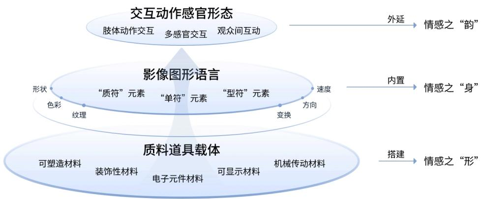  
图4-7情感还原方法框架（来源：作者绘制）

# 4.3.1质料实体与道具搭建情感化载体

作为装置实体的物质基础，其质料载体和道具是可以被真实感知、触摸或操作的实体材料。设计师在众多材料中依据可靠性、灵敏度、耐用性等特征来选择适配度较高的材料，以错置、悬空、分割、集合、叠加等设计手法，重构实体装置之“形”。有传统绘画、雕塑材料、合成材料、导电材料、智能材料之类可塑造的材料，涂料、漆艺、织物、皮革、特殊纹理等表面装饰材料，金属、木材、塑料、玻璃、陶瓷等基础结构材料；亦触摸屏、液晶显示器（LCD）、发光二极管显示器（LED）之类可显示的电子元件材料；还有如投影幕布、全息膜之类可转化显示的材料；如电机、齿轮等机械传动材料等等。不同的戏剧情感需要选择不同的质感和肌理效果，例如在表现紧张、冲突的场景时，可以应用具有强烈对比和锐利质感的纹理，以增强观众的紧张感和沉浸感；而在营造温馨柔和的情境时，则可以以平滑细腻的纹理，达致舒适的感官效果。设计师深入挖掘剧本与情境中蕴含的主题文化象征、情感意义等符号性语言，将其融入质料载体和道具设计中，以此显现沉浸式戏剧的深层主题和情感。

譬如 2022年顺义大剧院版的交互舞剧《南苑秋风》中（如图4-8所示)，通过捕捉角色动作而生成影像，实时投射到全息幕布上，同时结合昏暗舞台灯光以隐藏全息幕布本体，以此裸眼3D影像便瞬间“悬浮”于空中。即使是观众在不同角度观看，也有着虚实难以分的视觉震撼，由此“真实地”塑造了跨越时空界限的情境，进而引发对剧中角色命运、环境变迁以及历史文化内涵的共情与深思。

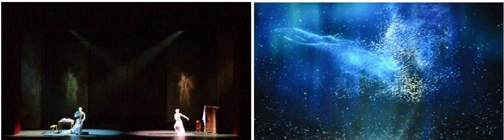  
图4-8 交互舞剧《南苑秋风》

数字交互装置的质料和道具不仅是简单的陈列品，观众可通过操作道具，触发新的戏剧事件或情感。在此过程中，设计师需考虑如何借助质料和道具的实际操作、触发机制或感应技术，激活装置的交互行为，将质料和道具设计为可感知、可操作、可响应的交互媒介。如在 Random Quark 的数字交互装置《情绪救急箱》（The EmotionalEmergency Kit）将观众的情感波动具象可视化（如图 4-9 所示)。装置的情感输入部分由标有快乐、悲伤、勇敢、平静、兴奋、害怕、爱、压力和愤怒的九个门铃组成，观众自行选择情绪，来处理加工其情感。进而互动一个或多个实体道具，如按下打气筒、捏合灭火器、开启电吹风、旋转水龙头等，呈现出被水龙头淹没的悲伤、被打气筒膨胀的快乐、被吹风机吹走的恐惧。观众可继而借助装置虚拟影像中的手部肉体，将幽灵般字体的害怕、冰淇淋融化形状的悲伤、氮气球样式的快乐等单个词语，击碎肢解。

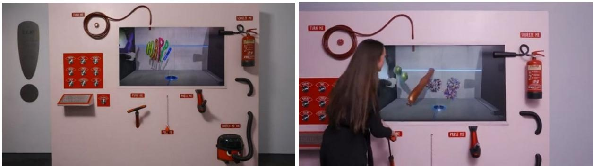  
图4-9 数字交互装置《情绪急救箱》

# 4.3.2图形语言内置情感化影像

设计师通过数字交互装置内置影像的创作，填充装置符号之“身”。内置影像由不同性质的元素符号构建而成，参照皮尔斯对符号再现体的“质符”、“单符”与“型符”理论框架，设计师可通过三种类型的符号元素来内置情感化影像，实现对数字交互装置的影像空间编码。首先，“质符”化影像元素，即隐喻主题与对象元素之间存在着直接相关性的符号，如秋风瑟瑟影像带来的凄凉感，或借助繁忙信号灯的操作体验模拟城市生活的节奏变化，此时成为“城市生活”的具象化符号；其次，“单符”化影像元素，则强调有因果逻辑或时间先后序列关系的符号元素，如暗示暴力发生的血印影像等；再者，装置影像中的“型符”元素，指不具备明显因果链关系的符号，如巨大机械齿轮缓慢转动，隐喻时间的流逝或是社会系统的运作等。设计师由知觉意向创作出线性或非线性的文本叙事，结合抽象或具象的画面风格，融合图形或视频的动静状态表现，构造二维或三维的场景空间，合实景拍摄、动画制作或CG 特效视觉多种视觉手段……

图形语言作为装置影像表达的直观呈现形式，对于构建情感隐喻至关重要。设计师提炼具有象征性的图形元素符号，铺设形状、色彩、纹理以及动态效果，创造出引发观众情感反馈的视觉表达方式。图形的形状上，圆润的形状往往给人带来舒适、和谐的感觉，而尖锐或不规则形状可能引发紧张、冲突或危险的心理联想；线条的流畅性或刚硬程度也会影响观众的情绪感知，柔和的曲线让人感到平静，强烈的直线则容易激发力量感。基于色彩心理学选择情感化色彩搭配，例如表现热情、欢乐或者怀旧的暖色调、表达宁静、悲伤或神秘感的冷色调，利用色彩对比突出强化视觉冲击力。动态影像中的运动速度、方向以及变换过程的设计，都直接影响到观众的情感体验。如剧情高潮时加快画面变化节奏以表达紧张与刺激的情绪张力，低潮段落则适当放缓画面节奏以营造出静谧、深沉的氛围。

如池田亮司的《普朗克宇宙》（ThePlanckUniverse）数字交互装置中（如图4-10所示)，三维粒子图案和黑白线条图形等构成的地面可视化投影随着声音的频率、振幅大小而呈现长短、粗细、快慢等动态变化，同时还能根据观众活动轨迹实时互动。观者“走进"作品之中，仿佛置身于从极度微小至极度宏大的整个普朗克宇宙。

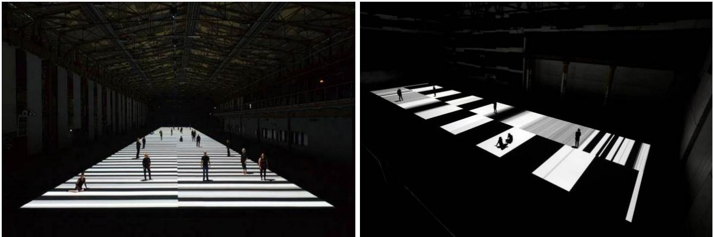  
图 4-10 数字交互装置《普朗克宇宙》

# 4.3.3交互动作与感官外延情感化形态

质料的变形、数字实时生成、图像的转化等都可以和观众产生互动行为，这种互动是数字交互装置的固有形态边界的外延，活化了沉浸式戏剧交互装置，是符号装置之“韵”。情感互动方式种类繁多，主要依托于三个维度，一是观众的肢体动作交互；二是观众多感官层面的交互；三是观众之间的互动。

装置设计师可在界面交互、影像交互、机械交互中，预设观众的肢体交互动作。在界面交互设计中，观众可通过触摸屏、物理按键或其他的智能设备等与直接与界面交互，用户友好型的界面设计能够使观众在情感体验过程中不受无关因素干扰，而保持原生的情绪感知。此外，还有如借动作捕捉生成的影像交互、操纵机械装置或改变装置物理性结构，实现观众与之的互动。

在 Sosolimited工作室的数字交互装置《色彩空间》(Colorspace)中（如图 4-11所示)，当观众穿越布满彩色灯条的大理石墙面时，在手机界面中向对应编码发送信息，装置会即时响应并调整情感化的灯光色彩。还如 PanGenerator 团队的数字交互装置APPARATUM（如图4-12所示)，是一个结合磁带组件和界面模拟的声音生成器，该装置界面将操作指示和音频内容可视化呈现出来，观众通过点击数字界面以调节音调、音量、节奏等不同参数设置，并选择或者切换不同的声音组合的模式，最终输出个性化色彩的音频。

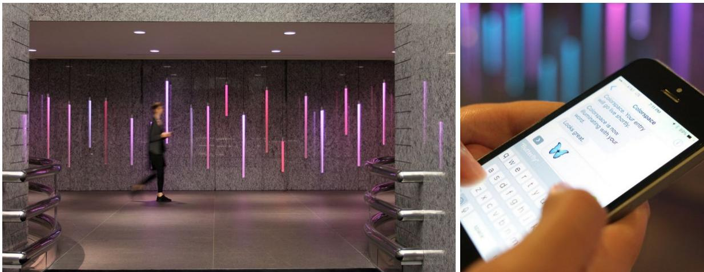

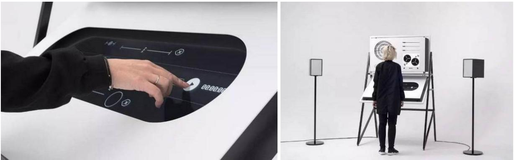  
图4-11数字交互装置《色彩空间》  
图4-12数字交互装置APPARATUM

装置的多感官设计不仅限于视觉和听觉刺激，还涵盖触觉、嗅觉乃至味觉等多种感知维度，以多感官交互方式，促进观众对装置更深层次的情感连接与情感反思。

视觉维度上，通过高分辨率大屏、投影幕布、全息幕布等媒介呈现载体，动态呈现出细腻且富有冲击力的情感化视觉画面。听觉方面，借助环绕立体声系统、定向音频等技术，或使声音能够根据观众的位置和动作而随即变化，以增强听觉真实。触觉互动方面，利用震动反馈、温度调节、压力感应等手段实现物理触觉，使观众能更直接感知到装置的结果反馈，如柔和的触感给予着观众温馨幸福的情感。至于嗅觉维度，则通过扩散特定气味的方式以激活观众的嗅觉记忆与情感联系，比如释放草木芳香以体验放松的幸福，或引入硫磺味、烧焦味、化学药品味等强烈、刺鼻的气味以增加紧张感。在味觉上，亦可以通过提供样本或特制的美食道具让观众品尝。以此，观众在交互过程中激活自身多重感官通道，全方位地感知作品传达的情感，并结合个人知觉意向唤起自己的记忆、触动内在情绪，引起深思或创造新的情感符号。如胡帅的交互装置《联觉器》（如图4-13 所示)，可采集到观众的面部表情，通过搭载人工智能的表情识别算法，输出不同以展现情绪的数值，基于这些情绪数值驱动装置传译，混合不同比例的气味液体，转化散发出对应的如木香、果香等气味。通过人工智能折射下的人类情感体验，隐喻启示着观众对自身情绪的正确认知感知信息化的世界。

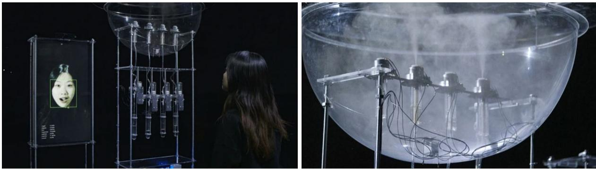  
图4-13数字交互装置《联觉器》

再者，观众与其他观众之间的交流、合作和共享互动，外延拓展了其情感体验。沉浸式戏剧交互装置设计通过允许多个观众同时、共同参与交互装置的互动创作，共同塑造着交互装置的影像、质料实体等形态，且这样多元化包容的设计内容相互碰撞、交融，丰富了作品的情感内涵。而观众间的相互互动影响着对方或其他观众的体验路径或情感反馈，如个体观众添加的一笔颜色、一个图形也都可能触发他人的连锁反应—一灵感、评价、情绪等情感表现，而此基础上，其他观众可在进一步加入互动及回应，形成动态循环的情感互动。设计师可设置对立或合作身份的互动机制，使得观众为完成目标而交流、分享经验。这样的群体化互动模式激活了装置的社交性，观众间建立起共同的情感纽带，进而增强彼此间的情感联结和归属感。总的来说，观众的交互动作不仅对装置产生直接影响，更是情感互创、互感和互应过程的一种延伸，这种流动的情感在观众群体中不断持续传递、扩散着。

如 TeamLab 的数字交互装置《翻转世界，巨大的相连积木的城镇》（Inverted Globe,Giant ConnectingBlock Town）将实体积木与数字投影相结合（如图4-14所示），在模拟地球反转的碗状沉浸式环境内，观众可以通过共同搭建或拆解积木来表达和传递个体观念，当他们放置或移动房屋、车站与大楼等形状的积木时，所触发的映射图像会实时响应并与相邻元素相联，从而动态生成新的道路、行驶的交通工具。随着更多观众的介入，城市的“发展进程”得以加速。此外，装置还设计了危险关卡，如模拟自然灾害情境，虚拟影像中倾盆大雨导致河川上涨并漫溢至街道，这时需要观众共同协作用积木疏导水路引流。装置不仅传达了关于环境与城市发展的情感内涵，而且观众的合作还带来另一番成就感与喜悦感。

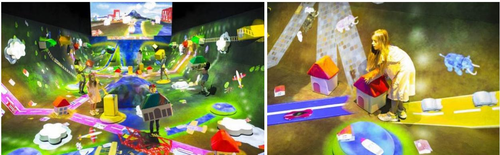  
图 4-14 数字交互装置《翻转世界，巨大的相连积木的城镇》

# 第五章《洞见》一沉浸式戏剧《四川好人》交互装置创作实践

本文对于沉浸式戏剧的符号化、“叙事场域”构建路径进行了深入分析与探究，符号学理论也赋予作品更深层次的意义构建和解读空间。同时，将前章节中所提出的“情节-情境-情感”还原法作为本次创作设计的实践指导方法论。本章节继续聚焦于该方向，以德国贝托尔特·布莱希特的寓意戏剧《四川好人》（DerGute Mensch VonSezuan）为蓝本，重构沉浸式戏剧叙事场域，进行数字交互装置《洞见》的设计，旨在激活观众的认知体验、情感共鸣与哲学思考。

《四川好人》文本设定于架空或虚构的城市—一半欧化的中国四川，此西方戏剧受中国戏曲表演、“神仙下凡”神话、庄子思想等中国传统符号影响，其中探讨着人性、道德哲学和社会问题，蕴含着大量的象征与隐喻符号语言。同时其中布莱希特陌生化“间离效果”促使观众从情感投入最终至理性思考，由此这与本课题研究有着较高的契合度。首先，对《四川好人》剧本进行文本、主题、叙事路径等情节内容的分析，提炼出符号化元素与设计风格；其次，进行相关的问卷设计与调研，分析大众对于戏剧交互装置的需求与偏好，根据调研结果确定装置的方案形态设计；并以空间布景、光影音效搭建装置的沉浸式场域；最后围绕其质料载体与组件、影像界面、交互模块，对《洞见》数字交互装置进行情感化再现设计。

# 5.1《洞见》数字交互装置的情节诠释设想

# 5.1.1叙事背景与主题隐喻

1938 年至1940年期间，布莱希特对剧作《四川好人》进行了深度重构与再创作。彼时，受全球经济大萧条、第二次世界大战等影响，社会矛盾冲突不断加剧，加上因纳粹上台，布莱希特被迫流亡，这些时代背景赋予其对社会现实深刻的洞察和批判性反思。

《四川好人》的故事虚构在一个半欧化的贫穷省城“中国四川”，三位神仙试图在充满贪婪与自私的世界中证明善良的人仍可生存并保持本性，以此为主题展开。他们遇到生活在社会底层的主人公妓女沈黛，只有她尽管身处困境却依然慷慨助人，神仙们因其善良本性赠予她钱财以开设店铺，她借此过上体面生活并无偿救济求助者。然而，其善举并未得到回报，反而招致周围人的贪婪利用，令烟店经营陷入困境。无奈之下，沈黛戴上面具化身为冷酷无情的表兄隋达，采取残酷剥削式管理烟卷厂以求生存。人们感激拥有了工作时又怀念善良的沈黛，最终隋达被人们指控因谋害沈黛、霸占烟店财产而受审。在三神仙假扮的法官面前，隋达现出沈黛的原形，道出无解的困厄：“既要善待别人，又要善待自己，这我办不到。”

《四川好人》的叙事情节借鉴了大量中国传统文化元素，为本次富含中华文化特色的数字交互装置创作奠定基础。作为寓言体裁的戏剧文本，虚构出“四川”这个象征性的概念城市；还采用“神仙下凡”的中国神话故事模式；融入中国古典哲学思想，借用《庄子》中关于“有用之材、受累于世”的哲理；同时，还汲取古代诗词元素；并运用丑角表演、评论性插话、收场诗以及幕间小戏等中国传统戏曲中的特征多元表现。

布莱希特运用矛盾统一法则塑造人物，把人性的善与恶分裂为一人二身一一沈黛与隋达两个角色之间转换，正反同体，将软弱无力的善与虚张声势的恶形成对比，从而揭示出剧中“好人难容于世，坏人却左右逢源”的现象。《四川好人》无疑是对当时社会现实的映射，深入探讨了在严酷社会现实中“好人”如何坚守道德高地或被迫妥协的问题，展现出一种对人性复杂性、理想主义道德观与现实之间张力的批判性思考，也隐喻了道德与生存的困境、人性善与恶的复杂、社会结构与个人命运的影响、行动与结果之间等辩证关系。

# 5.1.2风格定调与符号提炼

通过《四川好人》以往不同版本的舞美设计风格进行桌面调研，洞察其多样化的艺术表达以及对原著主题的独到诠释。1988年在德国国家歌剧院上演的魏玛导演版本中（如图5-1，a所示)，运用坚硬、粗糙材质以展示冷硬派的工业风；2014 年孟京辉导演的澳大利亚马尔特豪斯剧院版（如图5-1，b所示)，摒弃繁复，追求现代与前卫的舞台美学，采用极简的灯带、工业风的脚手架以及机械装置，以简洁而不失力量的设计语言重塑了戏剧空间；2014 年阿里耶导演的以色列盖谢尔剧院版（如图 5-1，c所示)，通过真实的泥地、破败不堪的板车以及具有中国文化象征的图案“龙”与中式印章纹样的细腻呈现，构建出逼真且贫困破旧的戏剧环境，力图还原叙事文本的社会底层生态；2019 年罗伯特·格拉夫导演的维也纳人民剧院版（如图5-1，d左所示）以及2021年李垚指导的西安话剧院版（如图5-1，e所示)，均采用多层楼的转盘式空间设计，以灰阶或中性色彩为基础，结合楼梯的钢铁质地，营造出具有工业时代印记、寒冷而疏离四川一隅。

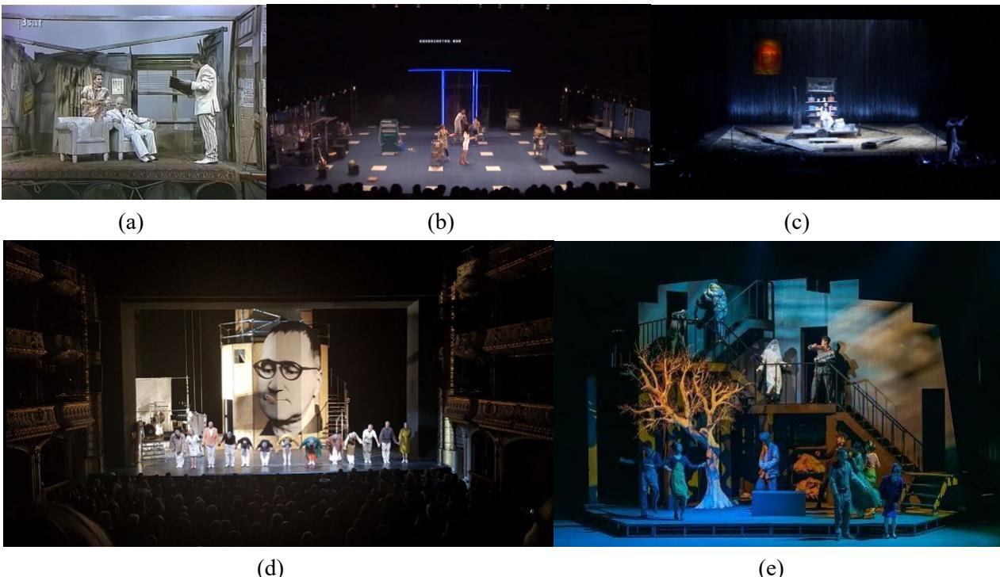  
图 5-1 多版本戏剧《四川好人》

《四川好人》的戏剧文本具有悲喜剧色彩，兼具现实而又荒诞的艺术风格，其对中国传统文化元素的挖掘和运用，为这部德国作品带来新的阐释。鉴于此，在设计与其相关的数字交互装置时，应当借鉴中国传统戏曲舞台美学理念，融合未来主义和后现代设计元素，以传统与现代、东方与西方设计风格为设计基调。采用象征主义手法，凸显布莱希特戏剧中对理想主义道德观与现实矛盾的剖析。

在创作数字交互装置《洞见》的过程中，拟将中国传统元素、意境拟将、营造法式等系统性地融入意象情感与哲学反思。从符号元素的提炼上，设想汲取诸如非物质及物质文化遗产中的视觉元素，酌情借鉴漆器、蜀绣、泸州瓷等纹样，进行截取、简化和创新设计，以彰显巴蜀地域文化特色。而关于对主题隐喻层面的设计考量，通过以下符号化元素运用深化观众对剧中核心议题的理解，如采用天平或秤佗以象征公正与道德判断的尺度，利用面具元素揭示真实自我与伪装行为的边界，以生命之树与荆棘象征生命的繁衍与人生艰辛困苦之间的过程，影像的内外层次暗示着表象与本质的哲学思辨，以此来强化装置对《四川好人》戏剧内涵的视觉表达与情感共鸣。

# 5.1.3观众的动线路径

《四川好人》主要由十场戏及七个过场戏构成，设定由演员引导为主的沉浸式戏剧空间形态。尽管全剧遵循“三一律”原则，即时间、地点和行动统一，主要剧情仍发生于若干固定式空间，如沈黛起初的二楼住所、街道、香烟铺子、城郊的饭馆以及隋达的烟厂等，但在这些单个的空间中，观众与演员在同一空间内共存，同时享有极大自由权互动装置及反馈。而《洞见》装置基于以第二场戏为主要的情节文本进行设计创作，第二场不仅是沈黛第一次转变为隋达角色的关键性情节点，而且从动作空间来看，大部分戏剧事件都发生在香烟铺子。在沈黛的香烟铺子这个地点空间内，隋达与木匠、警察等角色都展开了戏剧冲突与叙事进程。

在故事发展脉络叙事线上，第二场讲述了隋达刚接手店铺并着手解决新店铺面临的诸多问题。先通知店内寄居者不能继续无偿照顾，建议他们应尽快自谋生路。随后，隋达与木匠就店铺内货架的费用进行谈判，最终以极低价格解决争议。其后，面对房东太太提出的高昂租金压力，隋达亦竭力辩护。此外，隋达还与警察交涉，妥善处置店铺内存在的盗窃问题。由此，第二场戏也展现出隋达与沈黛性格截然相反的果断决绝，在此过程中流露出底层人物在严峻社会环境中求生存的挣扎和人性的矛盾冲突。

在观众自由体验方面，观众不受特定区域移动、支点停留、路径范围、视线焦点等因素的限制。作为第二场核心交互场所的香烟店内部，观众的视线则聚焦于货架、装置所在区域。同时观众可以在店内自由漫步、探索如柜台、货架、后房等生活场景。还可以在不同位置旁观戏剧剧情发展，例如围观隋达与木匠关于货架费用的争执，或是在隋达与房东太太争论预付租金的情景中驻足观察。

# 5.2《洞见》沉浸式场域的情境还原创作

# 5.2.1用户调研与框架预设

在开展戏剧交互装置创作的前期阶段，本研究采用了问卷调查的形式，以用户为中心的视角出发，系统性地收集和分析观众对沉浸式戏剧中数字交互装置的实际使用感受、满意度以及具体需求，旨在深入探析公众对该新型艺术形式的接纳程度及其在提升观演体验方面的实际效能。通过问卷调查获得的用户反馈数据，本研究得以有针对性地创作交互装置设计方案。

问卷设计主要涵盖了三部分。首先，基本信息收集板块了解不同性别、年龄层分布的观众群体，对沉浸式戏剧交互装置的接受程度是否存在差异；同时通过统计地域信息以探究地域文化背景对观众体验的潜在影响；并通过分析参与沉浸式戏剧活动的频次，评估受众对于沉浸式戏剧的认知和经验。其次，用户需求与体验评价板块，重点关注观众对于交互装置的互动偏好及其在不同维度的满意度评价；征集装置在实际应用中存在的问题与改进空间；探讨装置对观众沉浸于戏剧情节、情感共鸣与深度思考等方面的影响力，以及装置如何通过强化多感官体验提升戏剧吸引力；此外还设置关于理想化装置特性的问题，以期洞悉观众对未来沉浸式戏剧交互装置的期待需求。最后，在个性化建议与意见模块，问卷鼓励受访者提出自己差异化需求以及对现有装置的改进建议，为沉浸式戏剧交互装置的创新发展提供多元视角。

而在本次的问卷调研过程中，通过多个平台共回收了问卷 202份，去除了一些答题时间过短过长、选项前后矛盾、对象不符合等无效问卷27份，如在第七题“若在观看沉浸式戏剧时，您是否希望与数字交互装置进行互动”中选择“非常愿意”，又在第九题和第十题中选择“不能，会干扰我剧情思考”且“不能，感觉并无显著增益，更倾向于传统的戏剧形式”；或第四题选择“从未参与”但第六题选择“非常精通”，等等情况。最终，获得有效问卷175份，有效率达 $8 6 . 6 3 \%$ 。由此，该问卷结果能作为本章设计实践的研究依据。以下是对于本次的问卷调研结果进行的数据结论分析：

本次回收的问卷中调研对象的男女人数比例较均衡，其中男性占比 $5 0 . 8 6 \%$ ，女性占比 $4 9 . 1 4 \%$ ，男性人数略多于女性（如图5-2所示)，年龄区间在18-24岁和24-34岁的占比为 $3 6 \%$ 和 $4 3 . 4 3 \%$ （如图5-3所示)，所在城市在主要集中于杭州、无锡、上海、广州、南京、长沙、武汉等（如图5-4所示）。

关于沉浸式戏剧体验或其他沉浸式/数字体验活动，一定程度上受到了人们的欢迎和参与，占比 $5 3 . 1 4 \%$ 的大多数人会偶尔参加，占比 $1 9 . 4 3 \%$ 的人经常参与，然而仍有相当一部分人（占比 $2 7 . 4 3 \%$ ）从未参加过此类活动（如图5-5所示）。对于沉浸式（戏剧）体验与传统（戏剧）体验的了解程度， $5 2 . 5 7 \%$ 的人“有些了解”， $2 8 . 5 7 \%$ 的人“不了解”， $1 8 . 8 6 \%$ 的人“非常了解”（如图5-6所示)，由此看出，对于沉浸式（戏剧）体验与传统（戏剧）体验的了解程度普遍较低，只有少部分人非常了解。大部分人对沉浸式戏剧中数字互动装置有一定了解， $2 6 . 2 9 \%$ 和 $2 7 . 4 3 \%$ 的人相当熟悉、中等了解，$2 5 . 7 1 \%$ 的人略有知晓（如图5-7所示)。而在从未参与沉浸式戏剧体验或其他沉浸式/数字体验活动的 48 位对象中，大部分即 $4 1 . 6 7 \%$ 的人愿意互动沉浸式戏剧交互装置。因此，需要进一步引导、吸引更多人参与，提高对沉浸式戏剧体验的认知和了解。

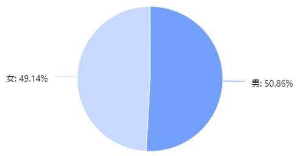

  
图5-2 受众群体的性别分布（作者绘制）

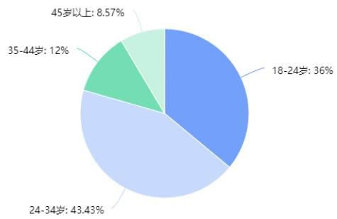  
图5-3 受众群体的年龄分布(作者绘制)

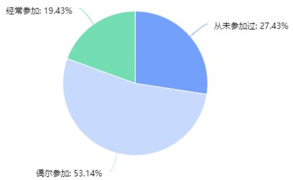  
图5-5参与沉浸式戏剧体验频率

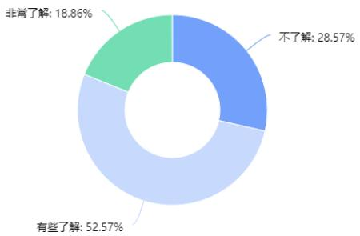  
图5-6沉浸式 (戏剧）体验与传统(戏剧)体验的区别了解程度（作者绘制）

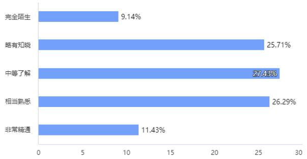  
图5-4 受众群体的城市分布（作者绘制）  
图5-7对沉浸式戏剧中数字互动装置了解程度（作者绘制）

问卷第二部分旨在调研用户需求与体验评价。对于观看沉浸式戏剧时是否希望与数字交互装置进行互动，大部分参与者对与数字交互装置进行互动持开放态度，其中比较愿意和非常愿意的比例较高，分别占比 $2 8 \%$ 与 $1 6 . 5 7 \%$ （如图5-8所示）。 $2 2 . 2 9 \%$ 和$7 . 4 3 \%$ 的人不太倾向与完全不愿意，其普遍因为是装置存在反馈延迟、影像内容单一、互动故事性融合不足、缺失引导（如图 5-9 所示)。在沉浸式戏剧交互装置存在的问题多样，但最为突出的是“互动影像内容单一或重复”和“故事性与互动性融合不足”，分别占比 $5 3 . 7 1 \%$ 和 $4 6 . 8 6 \%$ ，显示出在内容设计和叙事方面存在明显短板。紧随其后是在交互装置技术实现和用户体验方面，存在“反馈延迟、不流畅或不准确”和“操作复杂性”，占比分别为 $44 \%$ 和 $3 6 . 5 7 \%$ 。“缺失体验过程的引导”和“缺乏主题文化或者情感内涵”，占比 $3 6 \%$ 和 $2 6 . 2 9 \%$ ，创新与包容性设计分别为 $2 5 . 1 4 \%$ 和 $1 6 . 5 7 \%$ （如图5-10 所示)。综上所述，沉浸式戏剧在应用交互装置时，需要重点关注内容多样性和故事性、技术性能和用户体验、体验介绍引导和情感文化内涵，以及创新和包容性设计等方面，进一步提升沉浸式戏剧的观众体验。

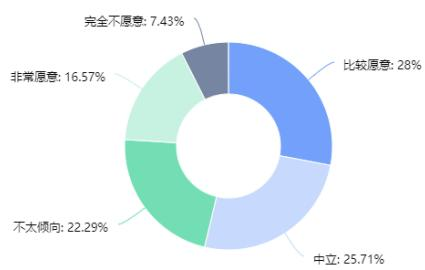

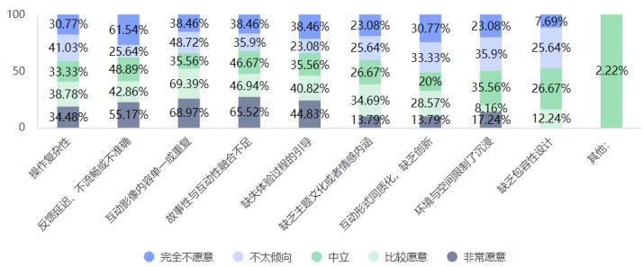  
图5-8受众群体的城市分布（作者绘制）  
图 5-9不太倾向与完全不愿意互动的群体原因

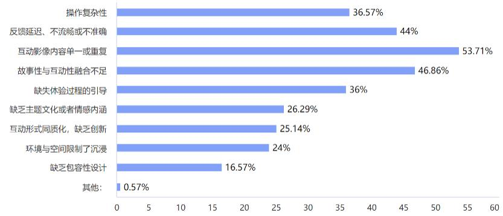  
图5-10 沉浸式戏剧交互装置存在问题（作者绘制）

数字交互装置对于受访者戏剧体验影响存在差异，但对于 $4 2 . 2 9 \%$ 的受访者来说，它确实能够帮助他们更好地沉浸在剧情中， $4 2 . 8 6 \%$ 的受访者认为数字交互装置可以增强他们对戏剧主题的情感共鸣（如图 5-11、图 5-12 所示)。大多数受访者都认为数字交互装置有助于增强戏剧多感官体验的强化、提升戏剧故事的可理解性（如图 5-13）。大多数受访者认为好的沉浸式戏剧交互装置应具备“多感官的沉浸”（ $5 7 . 7 1 \%$ ）、“新颖的设计”（ $5 4 . 8 6 \%$ ）、“与剧情的关联”（ $4 2 . 8 6 \%$ ）和“互动的流畅”（ $52 \%$ ）特征（如图5-14)，依次更看重视觉、听觉、嗅觉、触觉和味觉的交互装置感官体验（如表 5-1)。通过收集观众在沉浸式戏剧中对数字互动装置的认知、期望和情感体验等数据，采用皮尔逊相关系数分析各变量之间关系，探究它们之间的相关程度和方向。研究发现，年龄与是否曾参与沉浸式戏剧体验或其他沉浸式/数字体验活动之间不存在显著相关（r$= - 0 . 0 2$ ， $\mathsf { p } > 0 . 0 5 )$ ，意味着不同年龄段的人在沉浸式活动体验上并没有显著差异。观众对数字互动装置的了解程度与互动期望之间存在显著正相关关系（ $\mathrm { . r } { = } 0 . 3 3$ ， $\mathrm { \ p } { < } 0 . 0 1 \ )$ ，表明对装置了解越多的观众，越希望在沉浸式戏剧中与其互动。数字交互装置能否帮助沉浸在戏剧情节中与数字交互装置能否增强情感体验、共鸣和深度思考之间存在显著正相关 $( \mathbf { r } = 0 . 4 7 , \mathbf { p } < 0 . 0 1 )$ ，表明当数字交互装置能够帮助观众更好地沉浸在戏剧情节中时，它们也更有可能增强观众的情感体验、共鸣和深度思考。这些发现为进一步研究数字交互装置在沉浸式戏剧体验中的作用提供了有价值的见解。

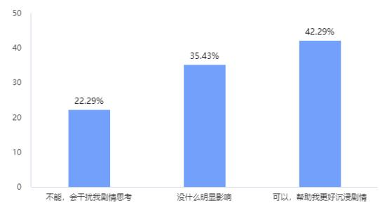  
图5-11 装置能否帮助沉浸戏剧情节 （作者绘制）

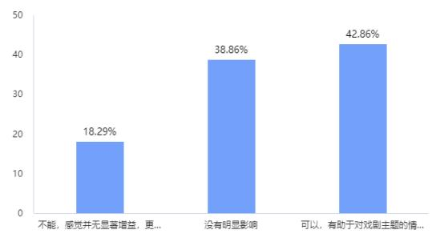  
图5-12 装置能否增强情感体验（作者绘制)

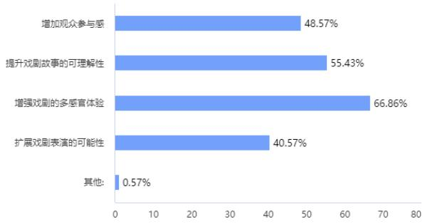  
图5-13装置对于增强戏剧体验作用（作者绘制）

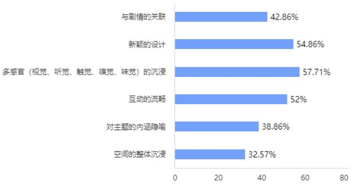  
图5-14好的沉浸式戏剧交互装置具有因素（作者绘制）

表 5-1数字交互装置中感官重要程度排序  

<table><tr><td>选项</td><td>综合得分</td><td>第1位</td><td>第2位</td><td>第3位</td><td>第4位</td><td>第5位</td><td>小计</td></tr><tr><td>视觉效果</td><td>2.99</td><td>60(41.67%)</td><td>18(12.5%)</td><td>31(21.53%)</td><td>24(16.67%)</td><td>11(7.64%)</td><td>144</td></tr><tr><td>听觉效果</td><td>2.79</td><td>22(15.71%)</td><td>59(42.14%)</td><td>34(24.29%)</td><td>15(10.71%)</td><td>10(7.14%)</td><td>140</td></tr><tr><td>嗅觉效果</td><td>2.52</td><td>30(22.39%)</td><td>30(22.39%)</td><td>35(26.12%)</td><td>27(20.15%)</td><td>12(8.96%)</td><td>134</td></tr><tr><td>触觉效果</td><td>2.22</td><td>34(27.2%)</td><td>22(17.6%)</td><td>24(19.2%)</td><td>13(10.4%)</td><td>32(25.6%)</td><td>125</td></tr><tr><td>味觉效果</td><td>2.11</td><td>29(24.17%)</td><td>29(24.17%)</td><td>8(6.67%)</td><td>31(25.83%)</td><td>23(19.17%)</td><td>120</td></tr></table>

问卷结果中， $4 8 . 8 4 \%$ 的受访者将“借助道具可以在空间内自由探索影像装置”排在第1位，综合得分2.3（如表5-2)，参与者对这种体验形式喜好程度最高，由此决定了关于本研究的创作设计实践方向。最后在沉浸式戏剧中数字交互装置的其他建议中，有受访者提出“技术大体应该服务于主题”，对于本研究有一定意义。

因此，本戏剧交互装置将以视觉、听觉、嗅觉为最主要感官融合的互动设计模式，结合整体空间场景的设计布局，不同功能间共同实现观众体验的深度认知与情感哲思升华。本研究通过构建出《洞见》，预设观众手持“光源”并“照向”装置显示设备，最终实现影像视觉、气味嗅觉、听觉的多感官互动。而观众在装置表象中主动探索深层事物的内容，展现出逐步挖掘作品隐喻的表象与本质等情感主题，从而引发观众的情感共鸣与哲学思辨。实际应用中，装置《洞见》的体验状态主要分为三种模式。一，装置处于等待观众介入之前的初始默认模式，在这个阶段中数字交互装置尚未被观众激活，并以其自身的静态或循环播放基础内容，静待观众揭开互动体验的序幕。二，当观众开始介入并与装置发生交互时，装置则进入动态互动模式，在这个模式下，装置实时响应观众主动探索的动作，并通过视觉、听觉、嗅觉、触觉多感官反馈机制创造出个性化的动态场域及叙事体验。三，装置的过渡重置模式，即观众结束体验时，装置仍继续短暂地显示部分观众互动反馈结果，而最后观众离去时则过渡恢复至初始默认模式。

表5-2对沉浸式戏剧交互装置形式偏好  

<table><tr><td>选项</td><td>综合得分</td><td>第1位</td><td>第2位</td><td>第3位</td><td>小计</td></tr><tr><td>借助道具可以在空间内 自由探索影像装置</td><td>2.3</td><td>84(48.84%)</td><td>63(36.63%)</td><td>25(14.53%)</td><td>172</td></tr><tr><td>影像感应肢体动作变动 而变化</td><td>1.85</td><td>44(25.88%)</td><td>66(38.82%)</td><td>60(35.29%)</td><td>170</td></tr><tr><td>在指定的界面中操作来 控制装置</td><td>1.74</td><td>47(27.49%)</td><td>40(23.39%)</td><td>84(49.12%)</td><td>171</td></tr></table>

基于此，本研究预设了《洞见》的三种交互体验方案（如图5-15所示)，最终根据客观实现效果、技术与经济成本以及主观个人能力对方案进行评估。方案一中台柱光雕投影效果的开发技术与硬件设备等成本较大、不定因素多，而方案三中过于单一，且全浮雕台柱细节在昏暗中不易察觉，最终，确定方案二以作为装置的架构。

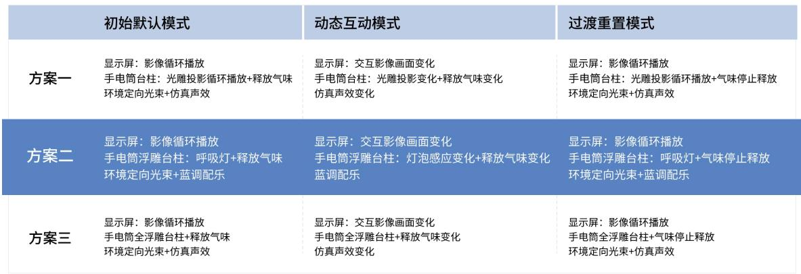  
图5-15 交互装置方案对比评估(来源：作者绘制)

# 5.2.2空间布景设计

基于上文对沉浸式戏剧版本《四川好人》中行动路径的剖析，本研究拟设观众由演员引导为主，形成的流动空间可大致规划为，依次从街道、沈黛的二楼住所，进而随着叙事线延伸至新开的香烟铺子、城市公园、烟店前广场、烟铺子内部、城郊饭馆、烟店后院、隋达烟厂、新装修的烟铺，最后至法庭（如图5-16所示)。依据《四川好人》既定的叙事线索，观众被赋予了自主探索剧场空间的权力，由此，可明晰路径指示和导览标识体系，这对于确保观众流畅穿梭于不同场景，并抵达关键空间或互动节点也至关重要。

  
图5-16 沉浸式戏剧《四川好人》行动路径（来源：作者绘制）

聚焦于《四川好人》第二场的核心叙事事件，沉浸式戏剧交互装置《洞见》发生于其关联地点一一香烟铺子场域之中。结合当时特定历史的时代背景，香烟铺子空间按照1:1比例进行设计，将巴蜀贫困地区的建筑特征内化到设计之中，体现为错落有序的布景之上，以此强化空间的节奏与层次感（如图5-17所示)。为构筑这一具体场域，须全面考量整个剧本中对该地点的详尽描述和规范要求。因而，香烟铺不仅承载着第二场的戏剧冲突，同时也是第一场、第二场及第五场重要叙事段落的发生地。剧中香烟铺内部空间被划分为前后两部分，前屋陈列着货架、柜台、镜子，以及如箱子、瓷瓶罐等各式道具，以这些元素搭建起剧本的基础空间情境。进一步地，深化空间布局与布景设计，力求真实还原出沉浸式戏剧情节环境（如图5-18所示）。

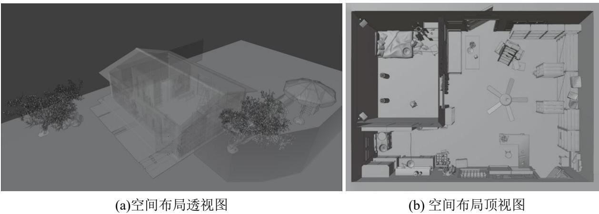  
图5-17装置整体空间布局(来源：作者绘制)

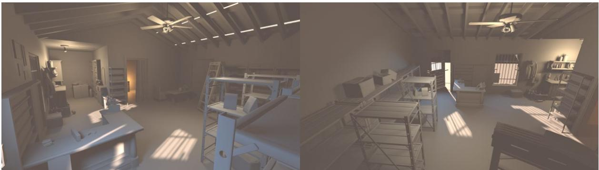  
图5-18 整体室内布局白膜设计(来源：作者绘制)

在香烟铺子空间的色彩方面，借鉴中国传统古典色彩，以暖黄色调为主进行设计。从细节还原而言，柜台附近置放烟酒产品，挂设老式广告海报、烟草插画、各类香烟品牌或老香烟包装设计，以及其他具有年代感的等标志性物品（如图5-19所示）。在质感与肌理方面，为还原复古场景，保留了传统老式家具、展柜、货架。采用表面雕刻纹理装饰的木质材料，墙面、道具等表面均做旧工艺处理，铺设仿古壁纸或是仿磨损灰泥涂层，室内照明设备选择复古吊灯样式，藉此突显岁月的沧桑印记（如图 5-20 所示）。而后屋区域环境中，刻意营造出相对昏暗的氛围，以装置内在光源为视觉焦点，旨在吸引与引导观众沉浸式体验。以此整体构建出与沉浸式戏剧《四川好人》叙事紧密贴合且可感知的情境体验（如图5-21所示）。

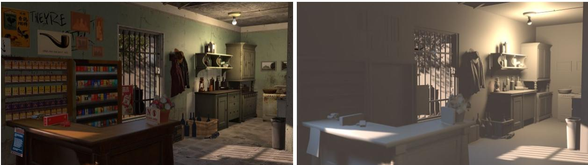  
图5-19 香烟铺子柜台布景(来源：作者绘制)

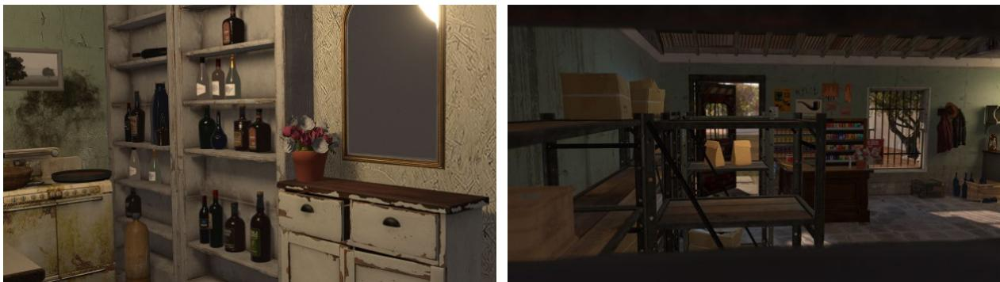

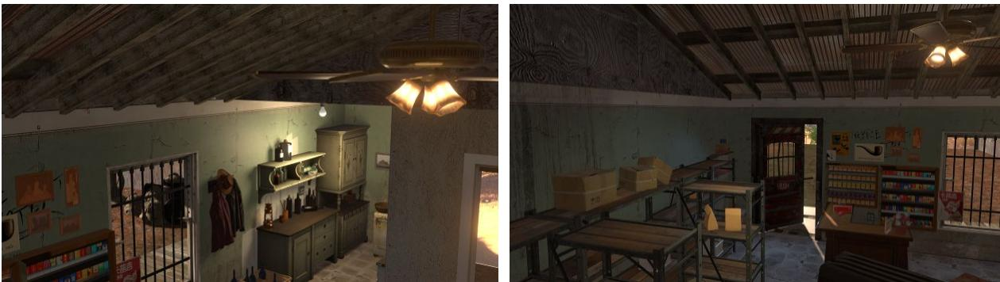  
图5-20前屋布景设计（来源：作者绘制）

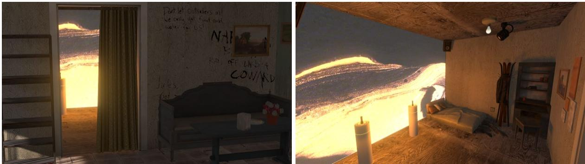  
图5-21内屋布景设计（来源：作者绘制）

# 5.2.3光效与音效设计

在香烟铺子室外灯光设计中，运用自然光源模拟、还原叙事情节所需的天气现象，如昼夜交替、晨昏变化等。而关于室内的光影设计，整体上采用尽量柔和、低调照明、暖色系的灯光，营造出室内空间的复古与朦胧美感。并通过反复试验不同亮度和色温值，以调控光线氛围，在此基础上完成灯具的安装（如图 5-22 所示)。在《洞见》装置环境的音效设计方面，选择经典蓝调音乐这类上世纪复古感歌曲作为背景音轨，这些音乐元素与店铺内复古主题情境互应，进一步增强观者的沉浸体验。

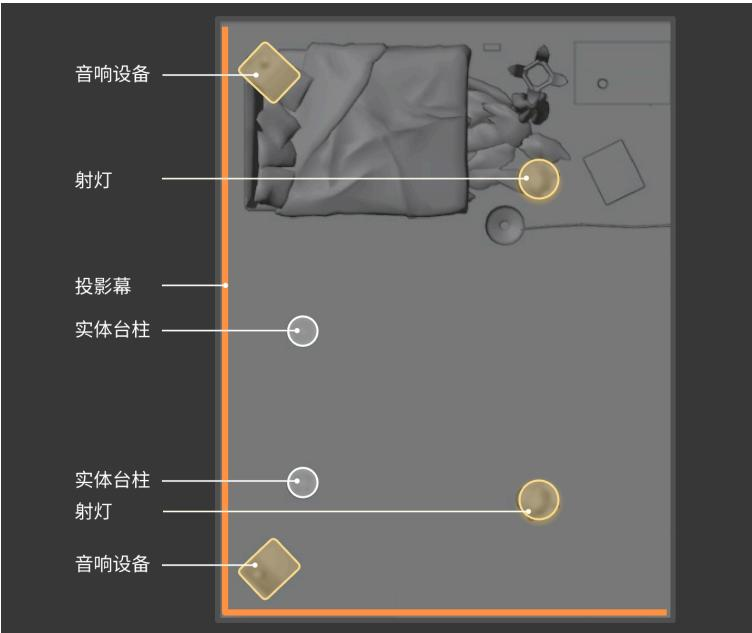  
图5-22灯光及声音设备位置图示（来源：作者绘制)

而当观众未介入参与交互装置时，一束定向环境光照向装置实体，即浮雕台柱，引导并激发观众的兴趣，促使其主动接近、互动介入装置。当观众拿起“手电筒”的瞬间，交互装置被触发，此先的定向环境光束会自动熄灭，同时装置内置影像的变化声效，手电筒的光芒随即“照亮”装置影像屏幕。观众在完成互动体验后，只需还原手电筒并将其归位，此时，光影与音效环境又重新回归至观众介入之前的原始状态，从而形成一次完整且流畅的交互体验闭环。

# 5.3《洞见》数字交互装置的情感再现设计

# 5.3.1交互装置的质料与道具设计

数字交互装置《洞见》蕴含着理想道德与现实生存困境、善与恶的辩证关系等主题，为装置的质料与组件设计提供了主题启示和情感创作的基石。

视觉上，《洞见》由LCD 显示屏、红外手电筒道具以及承载放置手电筒的台柱，这三个关键质料构建而成。在这整个的互动中，手电筒充当了连接观众与装置之间互动桥梁的关键支点，因此，对手电筒置放平台一一台柱的设计考量显得尤为重要。通过选取中性深灰色调的台柱，旨在通过其低调内敛的色彩，衬托出其他屏幕、光源、道具的呈现，使得装置的整个视觉焦点更加突出、对比强烈且层次分明。同时，在台柱的上表面采用立体浮雕纹样设计，通过对中国四川地区的历史文化遗产进行深度调研，包括但不限于四川博物院等史馆、《巴蜀符号集成》文献等资料，参考、提炼出具有巴蜀文化特色的纹饰图案。具体而言，如基于西汉“心思美人”草叶纹铜镜、唐瑞兽鸾鸟花卉纹铜镜、宋如意云纹银经瓶、清卢葵生雕漆人物方盒（如图5-23所示），进行纹样的创新设计，最终由软件 Proceate 草拟、Adobe Illustrator 中进行矢量图形设计，并通过 Blender三维建模（如图 5-24所示)，以3D打印落地呈现。通过对这些历史遗珍的符号元素进行艺术创新，使得浮雕台柱在承载互动功能的同时，也富含了文化底蕴，进一步增强了装置的地域特色与艺术感染力。在最终成品制作的过程中，考虑到台柱内部的技术与功能的整合效用，对灯泡光源与气味扩散模块进行嵌入式设计，浮雕表面部分增加多圆孔结构，以实现内部光源的有效透射与气味均匀扩散、弥漫至整个装置场域，使得台柱成为集视觉、嗅觉于一体的多感官交互载体（如图 5-25所示）。

  
图5-23巴蜀符号部分参考（来源：网络）

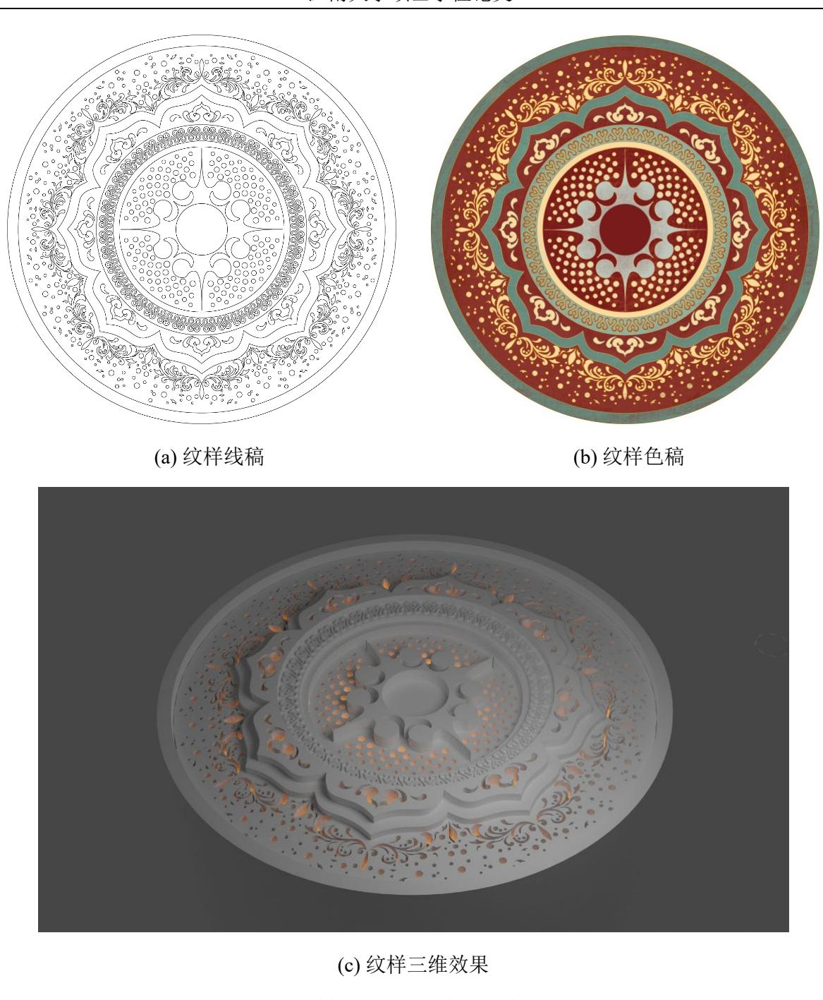

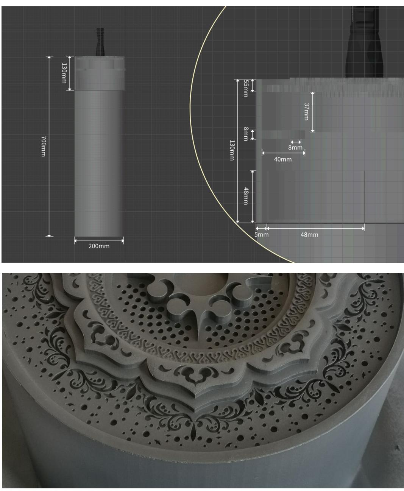  
图5-25 装置实体质料设计（来源：作者绘制）

# 5.3.2交互装置的影像设计

数字交互装置《洞见》通过红外线感技术结合遮罩制作出影像，观众手握光源，以红外手电筒作为探照工具，经表层影像“照亮”装置内层动态画面，由此设计出数字交互装置影像的双层视觉。

影像内容以二维动态插画艺术形式来表现。外层影像以黑、金、灰作为整体配色，寓意着道德的对立两端以及其间复杂多变的过渡区域。同时通过鲜明的亮度对比，如耀眼的金黄与深沉的棕黑，隐喻地映射出善与恶、理想的光芒与现实的暗影之间的冲突与交织。

在视觉影像的整体风格上，采用岩彩板绘与复古肌理的视觉风格，将中式典雅与复古相结合，以红、绿、棕系碰撞色彩效果来填充画面，赋予、增强影像的历史厚重感和文化肌底，以营造出浓郁的怀旧复古的虚拟世界。继而对东方美学进行现代化设计，如以富有粗细变化、柔和流畅的曲线与曲面元素勾勒出现实场景与生活装饰，与台柱影像互应的道教莲花纹样、地域古建筑群、巴蜀文化符号，以及颇具寓意的生命之树等诸多人文景观元素，给画面视觉带来张力。

在影像的叙事设计方面，着重表现出现实生存环境（如图5-26所示)。例如，通过对烟草符号元素的直观“质符”化处理，融入戴着面具遮蔽内心的吸烟者场景，展现烟草种植田地或现代化工厂香烟生产的画面。通过荆棘藤蔓摆动与齿轮元素，再现从烟草播种、收割再到生产的工业化流程。云雾缭绕的仙境跃然眼前，层峦叠嶂的仙山之中，神仙们谈笑自若，仙鹤悠然漫步，而人间烟火处，人们辛勤劳作，展现出和谐互助的美好画卷。在影像的运动节奏方面，适中速度的变化象征烟草产业在社会经济体系中的持续存在及不疾不徐地运行规律。此外，借鉴呼吸灯若隐若现的样式，《洞见》装置影像的色彩以流动式渐变运动，同时辅以烟叶形发光粒子的动态特效，悬浮并缓缓流动于整个画面之上，为整体视觉增添几分诗意，共同构成影像的灵动之境。最终绘出二维平面图像，在Adobe AfterEffects中进行《洞见》动态影像图形制作。

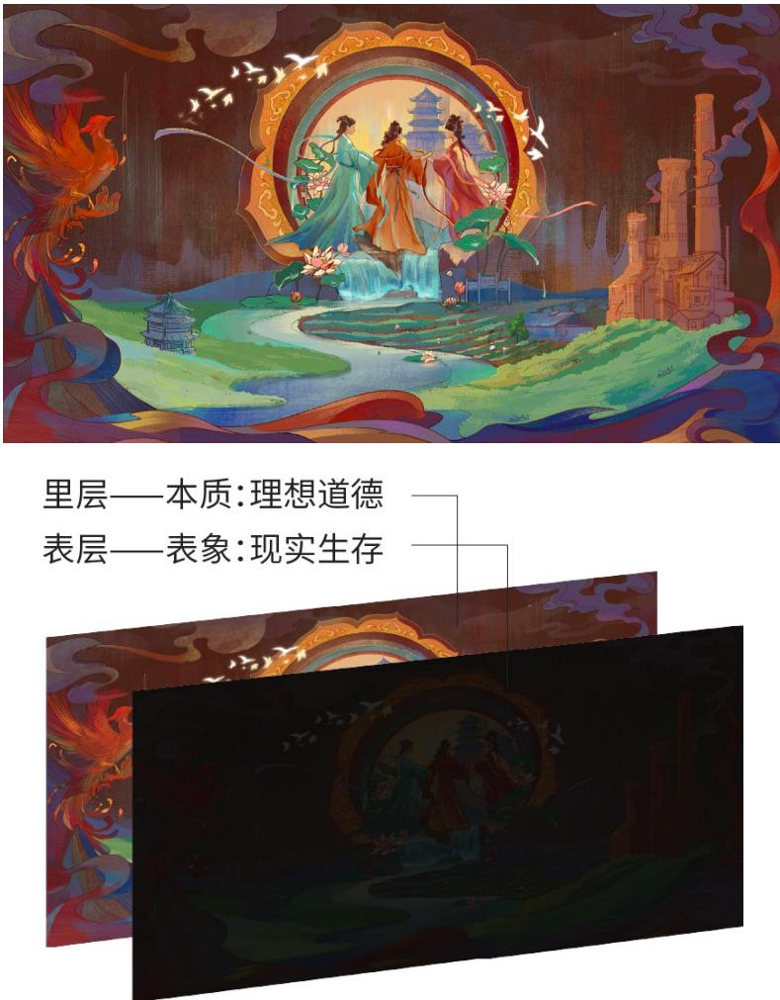  
图5-26 影像视觉（来源：作者绘制）

# 5.3.3交互装置的多感官模块设计

第四章已阐述沉浸式戏剧中，数字交互装置情感形态的互动方式分为三类，即观众与装置的肢体动作交互、观众多感官的互动、观众与观众之间的互动。在数字交互装置《洞见》中，观众与装置的肢体互动，借助“手电筒”手握“光源”，自由探索影像画面；在交互过程中触发台柱的视觉灯泡感应、嗅觉气味扩散、触觉台柱浮雕，以此实现装置多感官的交互；而装置还允许多个观众与数字虚拟影像发生同时交互行为，经由观众共同探索，由此拼凑出《洞见》虚拟影像世界。

基于《洞见》装置外在体验的三阶段流程，依次分别对装置初始默认模式、动态互动模式以及过渡重置模式的交互模块进行具体设计（如图5-27所示)，细化确定装置内在的组件构成，如显示屏幕、红外摄像头、红外手电筒、浮雕台柱、雾化棒、微孔超声波雾化驱动板、MOS 驱动板、Arduino UNO 板、压力感应模块HX711等传感器元件、控制器硬件构成（如图5-28所示）。

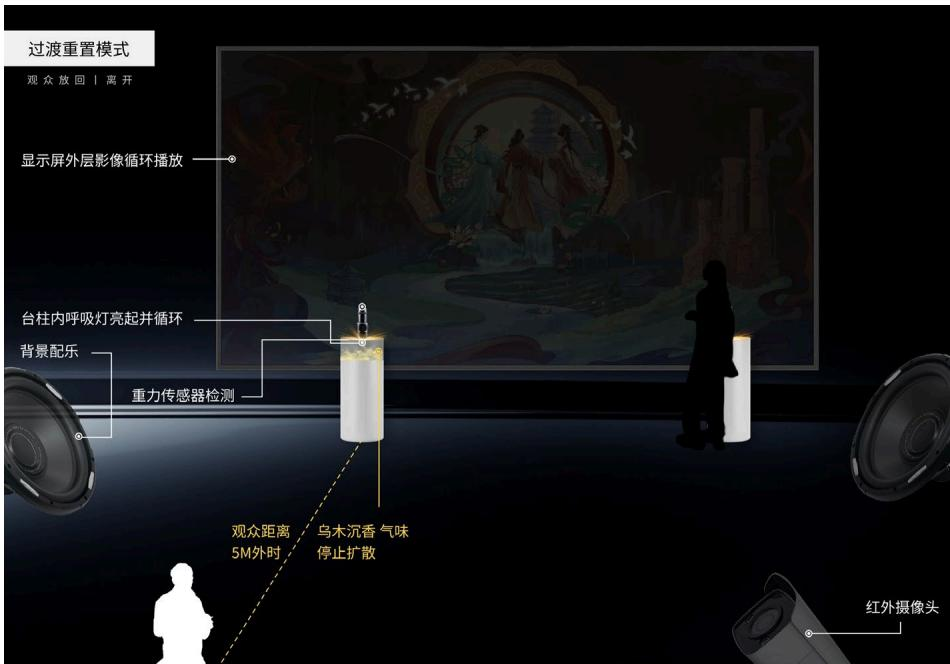  
图5-27观众体验流程图（来源：作者绘制）

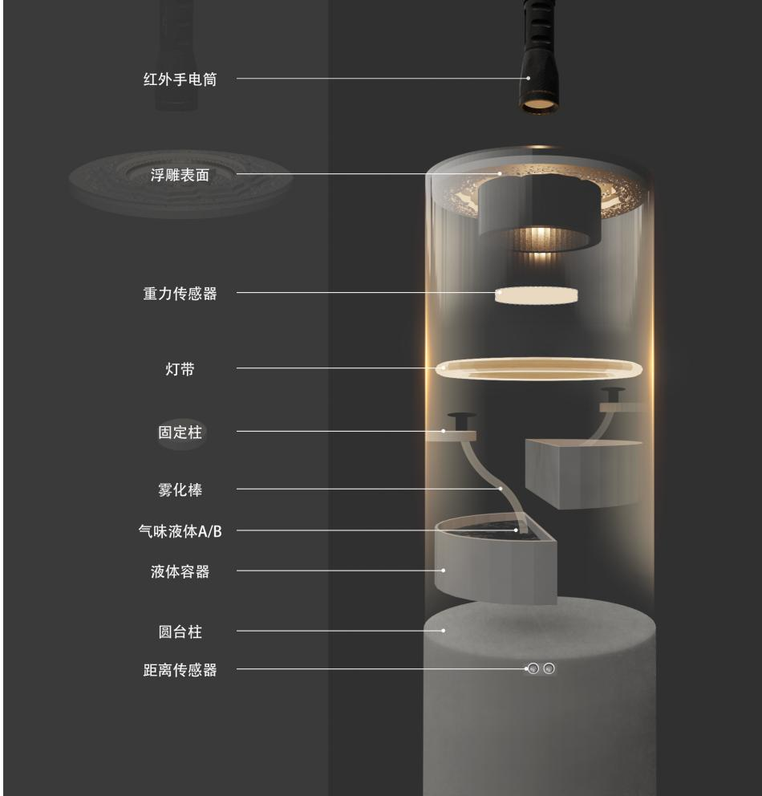  
图5-28 装置实体结构（来源：作者绘制）

在《洞见》的初始默认模式中：显示屏幕中的影像和浮雕台柱内灯泡均以呼吸灯式循环的视觉动态效果呈现；戏剧场域中环境光默认定向照至台柱；听觉上采用影像中蓝调配乐元素；而当观众靠近距离浮雕台柱5米范围之内时，距离传感器检测到，并通过控制器促使雾气模块释放 4s 时长具有辛辣东方香调的烟叶香草气味，烟叶香草以烟草、辛香料为前调，中调融入烟草花、香草和可可果的气息，尾调则以干果和木质香味收尾，构建出层次丰富的嗅觉享受。这种嗅觉设计不仅强化现场多感官沉浸体验，而且有效避免了装置在长时间无人情况下持续散发气味而导致资源成本的浪费。

在《洞见》的动态互动模式中：当观众从浮雕台柱上拿起红外手电筒时，下方装有的重力传感器检测到台面的重量变化，通过控制器驱动台柱内灯泡灭；随即环境光束亦立刻熄灭；同时也促使雾气模块释放具有木质东方香调的乌木沉香气味，该香气混合了沉香、檀香木、巴西红木等成分，与烟叶香草的基调具有统一性，从而确保气味过渡的自然和谐。而在最主要的可视影像方面，观众手持红外手电筒朝向显示设备，通过上下左右地移动位置变化，红外摄像头过滤自然光、仅捕捉手电筒射出的红外光，据此感应区域内光线，实时“照亮”及变化呈现影像。

在《洞见》的过渡重置模式中：观众放回手电筒至浮雕台柱，重力传感器再次检测到台面重力变化，通过控制器促使台柱内灯泡恢复至呼吸灯式的循环动态效果；当观众离开交互装置，即距离台柱超过5米时，体验结束，乌木沉香停止释放；环境光照和显示屏幕影像、配乐均过渡回归至装置初始默认状态，为下一轮体验做好准备。

在硬件集成与多设备协同工作的架构下，《洞见》装置根据接收到的输入参数，通过实时数据识别与处理机制，触发相应的动态内容显示或环境变化，如声音、光源、图形等反馈。同时为确保装置运行的安全性能，通过电路设计与防护措施，预防设备过热、漏电等潜在风险。

遵循设计方案，在《洞见》交互装置的开发流程中，在Arduino端编写程序设计以控制联动不同模块间的硬件设备（如图 5-29所示)，使用 Touch Designer 软件平台来实现视觉效果编排和各部件之间的交互逻辑整合（如图5-30 所示)，将 Arduino UNO 开发板作为核心控制单元，通过模块感应观众与装置间的互动行为，依据预设的逻辑规则和实时的互动数据，进而驱动视觉、嗅觉、听觉的动态输出变化（如图5-31所示）,最后在装置完成模块搭建并进行测试，确保数字交互装置功能准确运行，以实现预期的沉浸式交互体验（如图5-32所示)，并最终实现理念的落地试运行（如图5-33至5-35所示）。

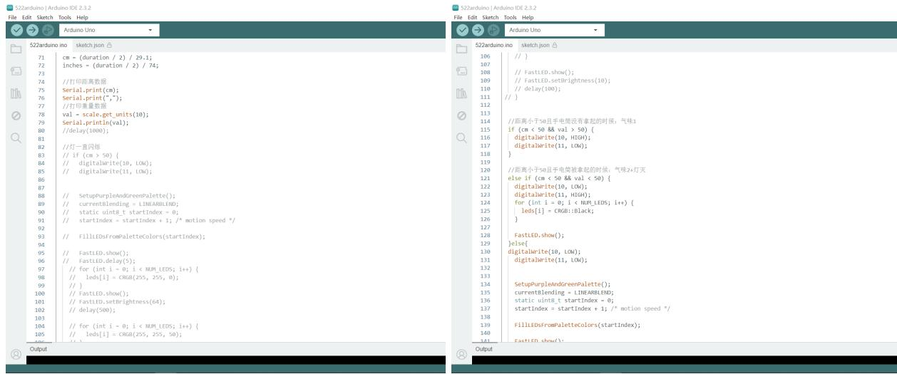

# 江南大学硕士学位论文

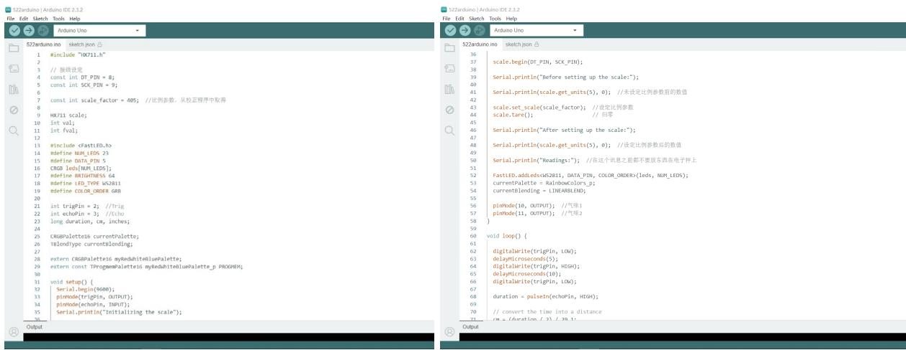  
图5-29部分程序代码编写（来源：作者绘制）

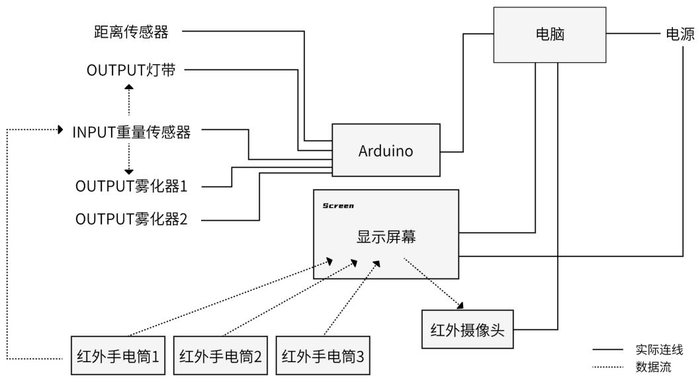  
图5-30装置交互框架（来源：作者绘制）

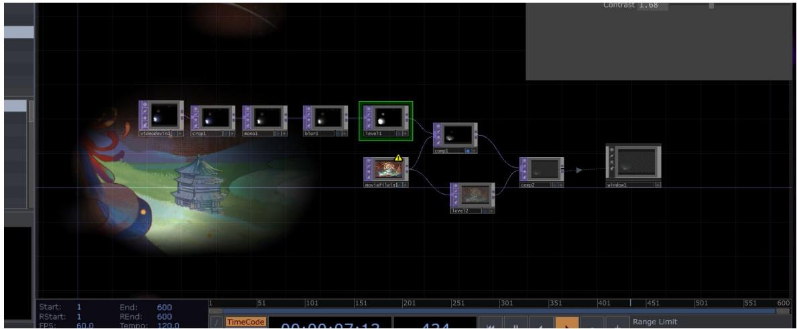  
图5-31TouchDesigner影像设计（来源：作者绘制）

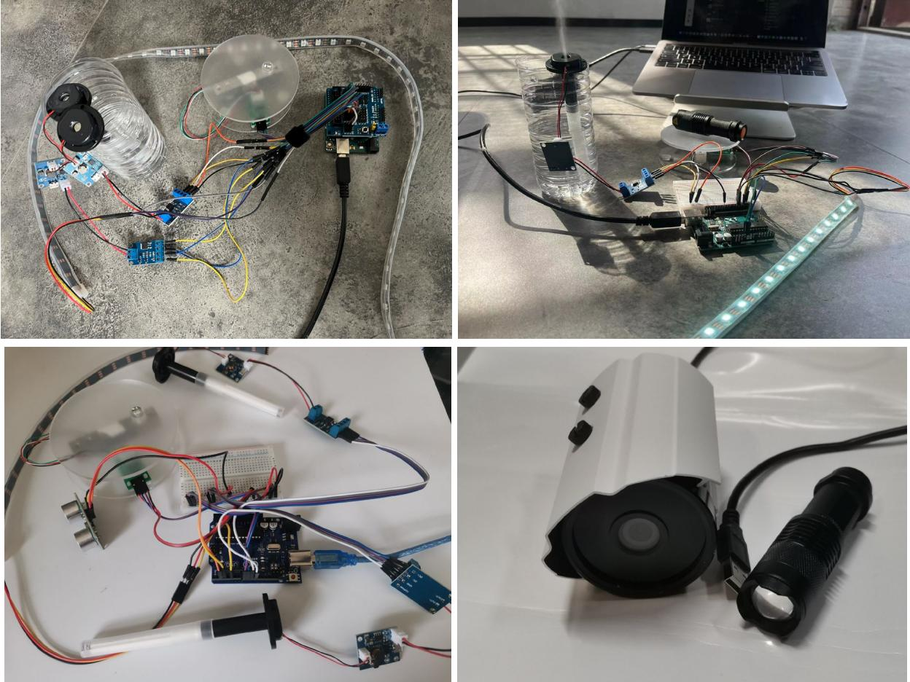  
图5-32 硬件设备实体模块搭建（来源：作者绘制）

  
图5-33《洞见》展示与体验效果（来源：作者绘制）

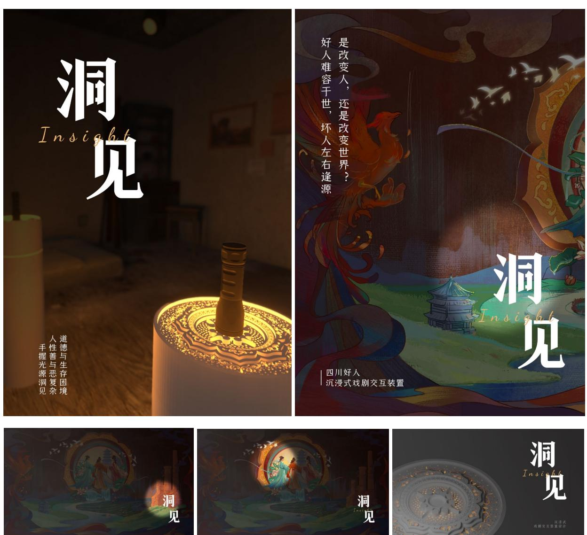  
图 5-34《洞见》引导海报设计（来源：作者绘制）

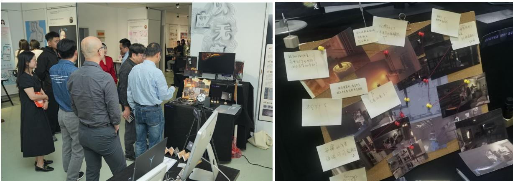  
图5-35《洞见》体验引导与装置留言反馈（来源：作者绘制）

# 第六章结论与展望

# 6.1课题总结

# 6.1.1主要结论

数字交互装置消弭了传统艺术作品和观众之间“看与被看”的二元对立界限，随着角色身体互动装置，弥合了传统舞美布景与角色之间“远观”的罅隙。数字交互装置的融合给沉浸式戏剧注入新的血液，带来更为丰富的多感官体验。且数字交互装置中质料、影像、交互技术等跨界融合，实体布景与虚拟空间灵活转换，增强了沉浸式戏剧的互动与默契，突破了沉浸式戏剧交互场域的时空、材料、观念等限制，外化了沉浸式戏剧交互装置艺术的情感张力。本文系统地梳理了符号学、沉浸式戏剧与戏剧交互装置领域的国内外研究现状，在研究过程中发现目前有关本课题方向的理论研究成果较少，而实践摸索亦处于螺旋式发展中。洞察到目前部分作品存在过度趋向于商业化数字沉浸问题，而使得戏剧叙事符号语用错乱，适得其反地忽视了戏剧交互装置的戏剧性。籍此，本文立足于符号学视角，在“戏剧文本一互动场域一交互装置”的坐标轴中，深入剖析沉浸式戏剧交互装置的符号化构建机制，提出了“情节-情境-情感”三位一体的符号还原方法论，并以此为理论框架指导数字交互装置《洞见》的设计实践。由此，在数字技术与戏剧艺术间找到平衡点，使数字交互装置成为深化沉浸式戏剧表达、丰富观演关系的有效工具，而非仅仅作为技术潮流的附庸。本文的主要研究成果归纳如下：

起首，明晰沉浸式戏剧交互装置中元素的符号化特征。基于符号学理论视域下，归纳出沉浸式戏剧交互装置伴随文本的显性、生成性、解释性三层特性，对场域中动态的布景、观演的在场关系、弥合的场域元语言进行符号化分析，并总结出装置中技术表现、影像再现、媒介应用的符码功能构架。

继而，围绕沉浸式戏剧的“叙事场域”，构建出数字交互装置的设计路径。以戏剧叙事为原点，厘清叙事对装置主题的表意、指示与相似性暗线，建构出符号化场域中的“行动场”“审美场”与“知觉场”，及派生装置内静态与动态、抽象与具象、虚拟与现实的本体隐喻。

随后，在沉浸式戏剧场域中，进一步提出数字交互装置符号化创作的情节还原法、情境还原法与情感还原方法。历经从“互文解码”“多元重构”到“互动编码”三个维度共同构成一个相互关联、交织的符号还原设计体系。通过调研与装置互文的戏剧叙事背景、主题隐喻与揣摩剧情中行动路径，提炼装置符号对象确定风格基调；再基由受众各异的审美感受与体验需求进行研判分析，结合历史的经验、当下的感受、未来的期许等知觉意向，还原出功能架构、空间布景、场景声光符号性意象，触发情境；预设装置的质料与道具、影像图形与多感官交互方式来还原主题的情感，有助于增强观众的情节认知、情境感受和情感共鸣。

最终，基于上述提出的理论框架与设计方法，以沉浸式戏剧《四川好人》为蓝本，创作出数字交互装置《洞见》。在设计前期，以文本叙事的隐喻内涵为切入点，对装置风格的符号元素进行提炼与定调，确保其与戏剧主题精神保持高度契合。进而，以问卷调研深入洞察目标受众对于体验的需求与偏好，据此科学规划出观众的行动路线与交互路径。最后对装置场域、质料载体、影像及多感官互动设计，构建出高度参与性的沉浸式交互体验，以促进观众与戏剧的情节沉浸、情感共情，进而产生对作品的本质哲思。

# 6.1.2 不足之处

符号学视域下的沉浸式戏剧交互装置设计研究，系统探讨了符号对象自身机制，构建了叙事场域路径，并提出三重还原设计策略，尽管取得了一定成果，但受限于研究者的能力边界与现有研究视野的局限性，本研究在广度与深度上尚存有一些待改进之处。

本研究对符号学的基础理论研究、对相关交叉学科的探究还不够深入，对于不同背景下的符号差异在沉浸式戏剧交互装置设计中的影响，也有待开展更深层次的理论与实证研究。其次，数字技术发展趋势下，同期前沿交互技术与新型媒介形式层出不穷，由此当前研究技术的应用探索尚不够全面。再者，在数字交互装置《洞见》的实际呈现与运行过程中，如何确保各环节之间的转换衔接足够流畅，避免因技术故障、操作不当或设计缺陷而导致观众的沉浸体验中断或脱节，以及多感官层面（如嗅觉、听觉等）如何有效屏蔽干扰，这些细节问题同样亟待深入探究与反复验证。

# 6.2课题展望

而鉴于上述研究发现与存在的局限性，未来课题研究可从以下几个方向进行拓展深化。加强跨文化符号学视角的深化研究，对比不同文化语境下沉浸式戏剧交互装置设计的特性与挑战，探索全球化与本土化相结合的设计策略；关注新兴数字技术在沉浸式戏剧领域的前瞻应用，如人工智能、虚拟现实、增强现实等技术与交互装置的深度融合路径，以及其对叙事结构与表达方式的创新影响、对观众感知与情感体验的重塑机制等；开展大规模的课题实践研究，结合不同题材、类型和群体的需求，不断完善和丰富符号还原设计方法的实际应用，以期为沉浸式戏剧产业或戏剧舞美设计提供更为实用且具有前瞻性的理论方法与设计指南；在落地项目设计中通过科学方法、严谨态度以及创新思维，不断实验与测试，以期在实践中逐步完善，实现观众沉浸式体验的最优化。

希冀本课题的理论部分研究与实践应用设计，为沉浸式戏剧中数字交互装置设计领域的理论研究库增添新知，为后续的戏剧交互装置艺术实践者提供一些参考价值与启示。

# 参考文献

$\spadesuit$ 学术期刊

1．任晟姝,徐凤仪.2022年中国戏剧热点现象述评[J].民族艺术研究,2023,36(02):68-75.  
2．赵毅衡.中国符号学六十年[J].四川大学学报(哲学社会科学版),2012,(01):5-13.  
3．潘健华,潘天.慎思“后戏剧”膜拜下的舞台美术革新——兼评 2019布拉格国际舞美展[J].戏剧  
(中央戏剧学院学报),2019,(06):46-53.  
4．王铭玉.中国符号学的理论依归和学术精神[J].天津外国语大学学报,2016,23(01):64-66.  
5．胡妙胜.戏剧符号学导引[J].戏剧艺术,1986,(01):31-47.  
6．宫宝荣.戏剧符号学概述[J].中国戏剧,2008(07):62-64.  
7．冯伟.从符号学到现象学：欧美剧场表演研究基本方法的确立[J].文艺理论研究,2022,42(03):  
128-138.  
8．周泉.浸入式剧场:以《不再入眠》为例[J].戏剧(中央戏剧学院学报),2013,(06):107-116.  
9．刘菁菁.与戏剧水乳交融的当代艺术——装置艺术与舞台设计研究[J].戏剧文学,2015,(11):101-  
106.  
10．胡妙胜.戏剧空间结构——舞台设计的美学[J].戏剧艺术,1988,(04):18-34.  
11.李恺悦,李栋宁.双重性与契合性意向：虚拟现实艺术交互设计的现象学理论转向[J].南京艺术学  
院学报(美术与设计),2022,(03):126-132.  
12.马潇婧.元宇宙剧场或数字新形态：重思数字媒体时代的戏剧创作[J].戏剧文学,2023,(11):4-13.  
13．胡子希.沉浸式戏剧的文本特点研究[J].戏剧文学,2023,(06):95-99.  
14.徐迎庆,图拉.沉浸式叙事视角下的中华文化数字化传承与传播[J].包装工程,2023,44(02): $1 - 8 + 6 8$   
15．施旭升,孟晶.镜像与沉浸：观剧体验的审美社会学分析[J].民族艺术研究,2023,36(06):16-22.  
16．陶瑞,刘宝瑞.沉浸式戏剧及其中国本土化实践探微[J].戏剧文学,2023,(02):110-113.  
17.李锦绣,林泽斐.面向数字人文的沉浸式数字叙事：现状、路径与展望[J].数字图书馆论坛,  
2022,(10): 41-48.  
18．靳琪.环境戏剧的美学建构[J].哲学分析,2022,13(03):125-136+198.  
19.车晓宇.从观众接受视角看沉浸式戏剧在中国的发展[J].戏剧文学,2021,(01):75-83.  
20.王刚.沉浸式演出对传统戏剧的发展作用[J].中国戏剧,2020,(04):59-60.  
21．蔡欣怡,李栋宁.基于皮尔斯符号学的戏剧舞台交互装置设计研究[J].艺术科技,2024,37(5):149-15  
22.孙楷迪,李栋宁.基于行为互动的沉浸式剧场交互设计[J].艺海,2021,(05):89-90.  
23．张佳佳,彭国斌.戏剧符号学下中国式舞台视觉设计的意象化表达[J].四川戏剧,2023,(02):142-145.  
24.Richard Schechne. 6 Axioms for Environmental Theatre[J]. The Drama Review:TDR,1968(3):41-64.  
25.Marie Maclean.Pretexts and Paratexts: The Art of the Peripheral[J]. Nerw Literary History,1991: 273-  
279.  
26.Mihaly Csikszentmihalyi. Play and Intrinsic Rewards [J]. Journal of Humanistic  
Psychology,1975(3):41-63.  
$\spadesuit$ 学术著作  
27.(魏)王弼,(晋)韩康伯注,(唐)孔颖达疏,(唐)陆德明音义.周易注疏[M].北京:中央编译出版社,2013.  
28.马良春,李福田主编.中国文学大辞典[M]:第二卷.天津:天津人民出版社,1991.  
29．赵毅衡.符号学:原理与推演[M].第2版.南京:南京大学出版社,2016.  
30．胡妙胜.戏剧演出符号学引论[M].北京:中国戏剧出版社,1989.

31．胡妙胜.充满符号的戏剧空间[M].北京:知识出版社,1985.

32．胡一伟.戏剧:演出的符号叙述学[M].成都:四川大学出版社,2019.  
33.[法]罗兰·巴特.符号学美学[M].董学文等译.沈阳:辽宁人民出版社,1987.  
34.[法]罗兰·巴特.符号学原理[M].王东亮等译.北京:三联书店出版社,1999.  
35.[美]皮尔斯·皮尔斯:论符号.[M].赵星植译.成都:四川大学出版社,2014.  
36.[法]朱莉娅·克里斯蒂娃.符号学符义分析探索集[M].史忠义等译.上海:复旦大学出版社,2015.  
37.[法]罗兰·巴特.神话学[M].许蔷蔷译.上海:上海人民出版社,1996.  
38.胡妙胜.当代西方舞台设计的革新[M].杭州:中国美术学院出版社,1997.  
39.胡妙胜.阅读空间:舞台设计美学[M].上海:上海文艺出版社,2002.  
40.韩生,胡佐.舞台设计概论[M].北京:文化艺术出版社,2008.  
41.谭霈生.论戏剧性[M].北京:北京大学出版社,1981.  
42.[美]理查德·谢克纳.环境戏剧[M].曹路生译.北京:中国戏剧出版社,2001.  
43.[德]汉斯-蒂斯·雷曼.后戏剧剧场[M].李亦男译.北京:北京大学出版社,2016.  
44.[英]彼得·布鲁克.空的空间.[M].北京:中国戏剧出版社,1998.  
45.徐淦.装置艺术[M].北京：人民美术出版社,2002.  
46.顾丞峰,贺万里.装置艺术[M].长沙:湖南美术出版社,2003.  
47.马晓翔.新媒体装置艺术[M].南京:南京大学出版社,2013.  
48.曹倩.实验互动装置艺术[M].北京:中国建筑工业出版社,2011.  
49.李栋宁.数字媒体艺术之美[M].南京:江苏凤凰美术出版社,2023.  
50.[美]罗伯特·麦基.对白:文字、舞台、银幕的言语行为艺术[M].焦雄屏译.天津人民出版社,2017.  
51.中国社会科学院语言研究所词典编辑室.现代汉语词典[M]:第6版.北京:商务印书馆,2012.  
52.[美]米哈里·契克森米哈赖.生命的心流[M].陈秀娟译.北京:中信出版社,2009.  
53.卢昂.东西方戏剧的比较融合[M].北京:中国戏剧出版社,2012.  
54.[法]布尔迪厄,华康德.反思社会学导引[M].北京:商务印书馆,2015.  
55.[波兰]耶日·格洛托夫斯基.迈向质朴戏剧[M].魏时译.北京:中国戏剧出版社,1984.  
56.Elam, K. The Semiotics of Theatre and Drama [M]. London and New York:Methuen. 1980.  
57. John Fiske. Television Culure: Popular Pleasures and Politics[M]. London; Methuen,1987.  
58. Jason Warren. Creating Worlds: How to Make Immersive Theatre[M]. London: Nick Hern  
Books,2017.154.

学位论文

59.高雅.沉浸式戏剧中数字媒体艺术的表现形式与审美[D]:[硕士学位论文].上海:上海音乐学院,  
2022.

60．杜翊.影像参与：戏剧现场性的跨媒介重构[D]:[硕士学位论文].四川:四川师范大学,2022.

51．刘天博.当代沉浸式剧场的空间研究[D]:[硕士学位论文].北京:中央美术学院,2021.

62．蓝月.新媒体语境下的沉浸式艺术研究[D]:[硕士学位论文].厦门:厦门大学,2020.

63．唐旋.多媒融合下数字媒体装置艺术的互动性研究[D]:[硕士学位论文].青岛:青岛科技大学,202:

4.刘莲.互动装置艺术中的新媒介研究[D]:[硕士学位论文].无锡:江南大学,2012.

65．马凯文.以数字媒体技术营造舞台表演艺术沉浸式体验的应用研究[D]:[硕士学位论文].上海：上海音乐学院,2023.

66．耿玲丽．数字艺术作为叙事主角的剧场性研究[D]:[硕士学位论文].天津:天津美术学院,2022.

67．衣文雅．数字背景下的沉浸式戏剧空间设计研究[D]:[硕士学位论文].沈阳：鲁迅美术学院,2023.

68.孙玉洁．数字媒体艺术沉浸式场景设计研究[D]:[博士学位论文].北京:中国艺术研究院,2021.

$\spadesuit$ 电子文献

69.幻境国际沉浸产业平台:中国沉浸产业政策发布(2022年).[EB/OL].htp:/lluthion.com/industry-institute/policy-release-of-china-immersive-industry/

70.图像叙事与文字叙事——故事画中的图像与文本.[EB/OL].http://www.semiotics.net.cn/index.php/view/index/news/3141

# 附录A：图片来源

第一章

图1-1沉浸式产业发展历程来源：作者转绘  
图1-2“沉浸式戏剧”CNKI检索可视化分析图来源：  
https://kns.cnki.net/kvisual8/article/center?language $=$ CHS&uniplatform=NZKPT  
图1-3西方剧场艺术发展来源：作者绘制  
图1-4论文框架图来源：作者绘制

第二章

图2-1沉浸式戏剧交互装置的符号化分析框架来源：作者绘制

图2-2《不眠之夜》剧场内部空间来源：  
https://www.d-arts.cn/article/article_info/key/MTIwMTI5MzgxNzeDuY1nr3awcw.html  
图2-3舞台交互作品《数字少林寺》来源：https://www.sohu.com/a/301322229_759368  
图 2-4 戏剧《仙境》 来源：htps://www.nationaltheatre.org.uk/about-us/theatre-  
makers/immersive/immersive-storytelling-studio-past-projects/  
图 2-5 戏剧《世界旦夕之间》来源：https://www.sohu.com/a/766931982_99912412

第三章

图 3-1沉浸式戏剧交互装置中的“叙事场域”建构路径框架 来源：作者绘制图3-2沉浸式体验剧《走进光影》来源：https://www.dahepiao.com/yanchupiaowul/etj/20231107429975.html图 3-3 语音交互装置《被踢回的声音》来源：https://www.neilmendoza.com/portfolio/robotic-voiceactivated-word-kicking-machine/

图3-4戏剧《成都偷心》来源： https://www.d-arts.cn/project/project_info/key/MTE5MzE1MDQyMTODuYmsr4Ogcw.html

图3-5戏剧《成都偷心》来源：

https://www.d-arts.cn/project/project_info/key/MTE5MzE1MDQyMTODuYmsr4Ogcw.html图 3-7数字交互装置《夜光丛林》来源：http://geeks-art.com/neuron/图3-8 沉浸式戏剧《完美犯罪》角色座次 来源：htps://www.ypiao.com/t_100352/图3-9《不眠之夜》酒吧场景 来源：https://zhuanlan.zhihu.com/p/272528448图3-10交互装置展《绘画的本质》来源：

https://www.athenaartfoundation.org/take-a-look/the-essence-of-a-painting-an-olfactory-exhibition 图3-11交互装置《毛茸镜》来源：htps://bitforms.art/archives/rozin/pompom-mirror 图3-12 交互装置《垃圾镜》来源：https://www.smoothware.com/danny/newtrashmirror.html 图3-13FactoryFifteen 舞台交互装置来源：htps://www.bilibili.com/video/BV1oW411475g/ 图3-15数字交互装置《翻转世界之涂鸦自然，红色名录》来源： https://www.teamlab.art/zh-hans/w/graffiti_nature_inverted

图4-1沉浸式戏剧交互装置的符号还原方法框架来源：作者绘制  
图4-2情节还原方法框架来源：作者绘制  
图4-3情境还原方法框架来源：作者绘制  
图 4-4 沉浸式交互装置《流体结构 360》来源：htp://www.publicspacedesign.com/article/294  
图4-5 沉浸式戏剧《茶馆》来源：htp://music.china.com.cn/2020-12/02/content_41379612.htm  
图 4-6 索尼投影剧场来源：htps://www.bilibili.com/video/BV1rL411h7SJ/?p $\vDash$ 191  
图4-7情感还原方法框架来源：作者绘制  
图4-8交互舞剧《南苑秋风》来源：  
https://www.d-arts.cn/article/article_info/key/MTIwMTI5MzUzODSDuY1lsJzGcw.html  
图 4-9数字交互装置《情绪急救箱》来源：https://www.randomquark.com/work/eek  
图4-10数字交互装置《普朗克宇宙》来源：  
https://cn.bing.com/search?q=The+Planck+Universe&cvid=d7cf0b25420443089389a59c8ccc520d&aqs=e  
dge..69i57j69i59j0j69i59j0l2.543j0j9&FORM $\varprojlim \varprojlim \varprojlim .$ BESBTB&PC $\scriptstyle \sum$ CNNDDB  
图 4-11数字交互装置《色彩空间》来源：htps://www.sosolimited.com/work/colorspace/  
图 4-12 数字交互装置 APPARATUM来源：https:/zhuanlan.zhihu.com/p/41958093  
图4-13 数字交互装置《联觉器》来源：https://www.shaunhu.com/synesthesiamachine  
图4-14 数字交互装置《翻转世界，巨大的相连积木的城镇》来源：https:/art.team-lab.cn/w/inverted-  
globe/

第五章

图5-1多版本戏剧《四川好人》来源：视频自截  
图5-2受众群体的性别分布来源：作者绘制  
图5-3受众群体的年龄分布 来源：作者绘制  
图5-4受众群体的城市分布来源：作者绘制  
图5-5参与沉浸式戏剧体验频率 来源：作者绘制  
图5-6沉浸式（戏剧）体验与传统（戏剧）体验的区别了解程度来源：作者绘制  
图5-7对沉浸式戏剧中数字互动装置了解程度来源：作者绘制  
图5-8受众群体的城市分布 来源：作者绘制  
图5-9不太倾向与完全不愿意互动的群体原因来源：作者绘制  
图5-10沉浸式戏剧交互装置存在问题 来源：作者绘制  
图5-11装置能否帮助沉浸戏剧情节来源：作者绘制  
图5-12装置能否增强情感体验来源：作者绘制  
图5-13装置对于增强戏剧体验作用来源：作者绘制  
图5-14好的沉浸式戏剧交互装置具有因素 来源：作者绘制  
图5-15交互装置方案对比评估来源：作者绘制  
图5-16沉浸式戏剧《四川好人》行动路径来源：作者绘制  
图5-17装置整体空间布局来源：作者绘制  
图5-18整体室内布局白膜设计来源：作者绘制  
图5-19香烟铺子柜台布景 来源：作者绘制  
图5-20前屋布景设计来源：作者绘制  
图5-21内屋布景设计来源：作者绘制  
图5-22灯光及声音设备位置图示来源：作者绘制  
图5-22 巴蜀符号部分参考 来源：https://www.scmuseum.cn/sccms/node/290  
图5-24纹样创新设计来源：作者绘制  
图5-25装置实体质料设计来源：作者绘制  
图5-26影像视觉来源：作者绘制  
图5-27观众体验流程图来源：作者绘制  
图5-28装置实体结构来源：作者绘制  
图5-29部分程序代码编写来源：作者绘制  
图5-30装置交互框架来源：作者绘制  
图5-31TouchDesigner 影像设计来源：作者绘制  
图5-32硬件设备实体模块搭建来源：作者绘制  
图5-33《洞见》展示与体验效果来源：作者绘制  
图5-34《洞见》引导海报设计来源：作者绘制  
图5-35《洞见》体验引导与装置留言反馈来源：作者绘制

# 附录C：问卷调研

感谢您在百忙之中抽空填写本问卷！旨在了解您对沉浸式戏剧中数字交互装置的体验，以期从用户视角了解真实的观众需求。

问卷采用匿名形式，填写共15题，预计时长约5分钟。请根据您的实际情况认真作答，您的信息会被严格保密，问卷结果将用于学术研究。再次感谢您的参与，祝您工作顺心、生活愉快！

沉浸式戏剧交互装置是在沉浸式戏剧空间内结合数字交互装置艺术的创新形式。观众不再是传统意义上的被动旁观者，而是主动参与到戏剧表演中，通过与装置进行直接的、多感官的互动，获得身临其境的戏剧体验。

第一部分:基本信息

1.您的性别[单选题]\*   
男   
女

2.您的年龄:[单选题]\*

018-24 岁  
024-34岁  
035-44岁  
045岁以上

3.您所在城市名称:[填空题]\*

4.您是否曾参与沉浸式戏剧体验或其他沉浸式/数字体验活动（如数字媒体、光影技术、全景投影等手段艺术展）？[单选题]\*

o从未参加过○偶尔参加0经常参加

5.您了解沉浸式（戏剧）体验与传统（戏剧）体验的区别吗？[单选题]\*

0不了解  
0有些了解  
0非常了解

6.您对沉浸式戏剧中数字互动装置的了解程度:[单选题]\*

0完全陌生 0略有知晓 ○中等了解 0相当熟悉 o非常精通

第二部分：用户需求调研与体验评价

7.若在观看沉浸式戏剧时，您是否希望与数字交互装置进行互动?[单选题]\*

5完全不愿意 0不太倾向 0中立 ○比较愿意 ○非常愿意

8.您认为目前沉浸式戏剧中应用交互装置存在着哪些问题？[多选题]\*

□操作复杂性□反馈延迟、不流畅或不准确□互动影像内容单一或重复□故事性与互动性融合不足□缺失体验过程的引导

□缺乏主题文化或者情感内涵  
□互动形式同质化，缺乏创新  
□环境与空间限制了沉浸  
□缺乏包容性设计  
□其他:

9.数字交互装置的运用能否帮助您沉浸在戏剧情节中?[单选题]\*

o不能，会干扰我剧情思考O没什么明显影响o可以，帮助我更好沉浸剧情

10.您觉得数字交互装置能否增强您的情感体验、共鸣和深度思考？[单选题]\*

o不能，感觉并无显著增益，更倾向于传统的戏剧形式  
O没有明显影响  
o可以，有助于对戏剧主题的情感共鸣

11.您认为数字交互装置对于增强戏剧的体验有何作用?[多选题]\*

□增加观众参与感  
□提升戏剧故事的可理解性□增强戏剧的多感官体验□扩展戏剧表演的可能性□其他:

12.您认为好的沉浸式戏剧交互装置应具有哪些因素？[多选题]\*

□与剧情的关联  
□新颖的设计  
□多感官（视觉、听觉、触觉、嗅觉、味觉）的沉浸  
□互动的流畅  
□对主题的内涵隐喻  
□空间的整体沉浸  
□其他:

13.您更愿意体验以下哪种沉浸式戏剧交互装置?[排序题，请在中括号内依次填入数字]\*

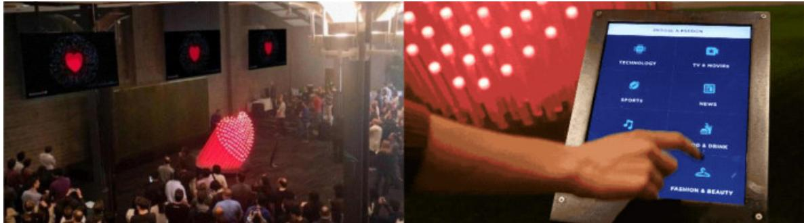

[]在指定的界面中操作来控制装置[]影像感应肢体动作变动而变化

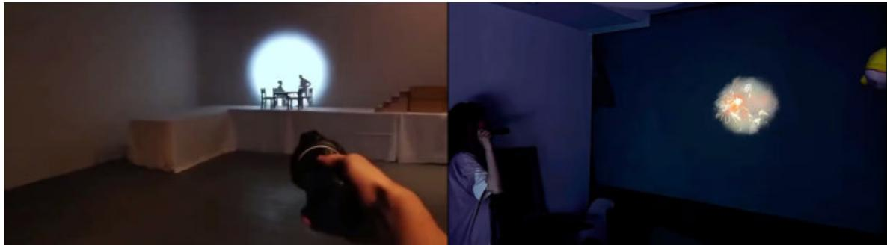  
[]借助道具可以在空间内自由探索影像装置

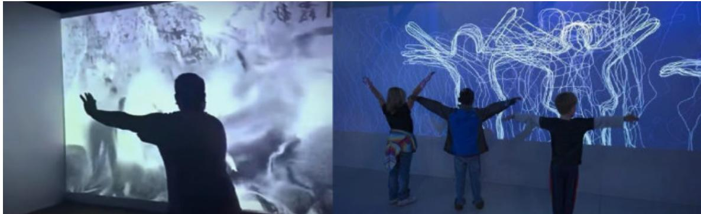

14.沉浸式戏剧中，依次排序您更看重数字交互装置中的哪些感官感受：「排序题，请在中括号内依次填入数字]\*

[]视觉效果[]听觉效果[]嗅觉效果［]味觉效果[]触觉效果

15.您对数字交互装置在沉浸式戏剧中的应用有其他建议或意见吗?[填空题]