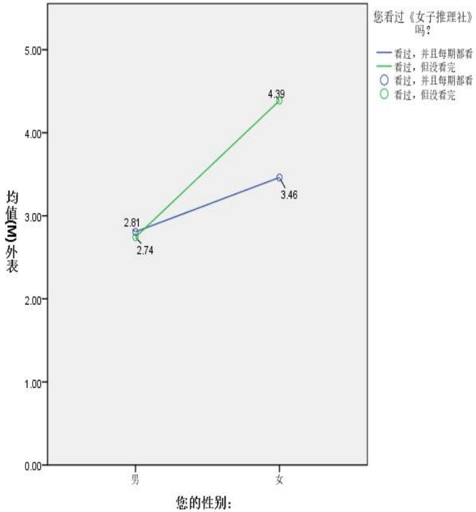
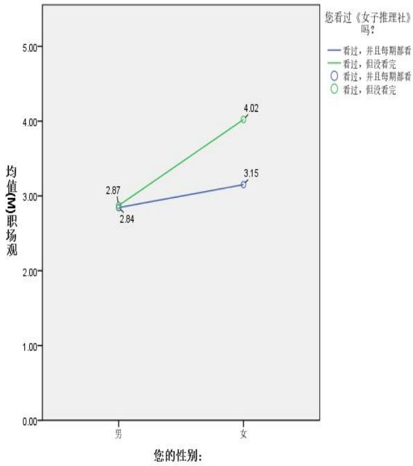
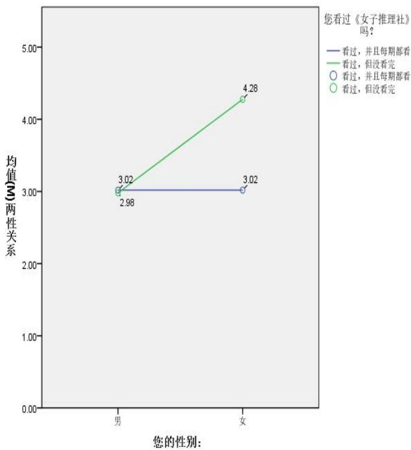
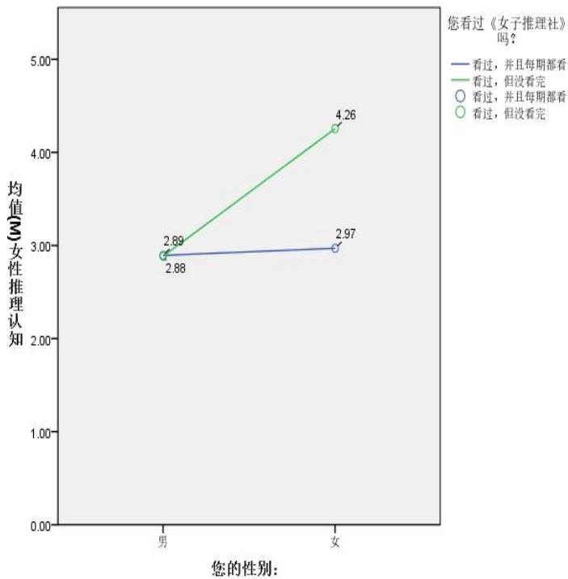

# 1. Bibliographic Information

## 1.1. Title
The central topic of the paper is **"“她综艺”《女子推理社》女性形象及其价值表达研究"** (Research on Female Image and Its Value Expression in "She Variety" "Women's Reasoning Club"). The study focuses on analyzing how a specific all-female detective variety show constructs female media images and conveys values through the lens of gender theory and semiotics.

## 1.2. Authors
**Author:** Wang Xiaojie (王小杰).  
**Supervisor:** Professor Shen Yushan (申玉山).  
**Affiliation:** School of Journalism and Communication (新闻与文化传播学院). Based on the institutional logo found in the appendix (Image 22), the institution is identified as **Hebei University of Economics and Business**.

## 1.3. Journal/Conference
This is a **Master's Thesis** (硕士学位论文) submitted for an Academic Degree (学术学位). It is not published in a peer-reviewed journal but represents original graduate research work. The venue is an academic defense held in May 2024.

## 1.4. Publication Year
The thesis was defended in **May 2024**.

## 1.5. Abstract
**Objective:** To investigate the generation logic, image construction, mythological construction, and value expression of female images in the "She Variety" show *Women's Reasoning Club*.  
**Methodology:** The study employs field investigation, online participatory observation, content analysis, questionnaire surveys (N=351, valid N=324), and in-depth interviews (N=16). Theoretical frameworks include Social Gender Theory and Roland Barthes' Semiotic/Mythology Theory.  
**Key Findings:** The show presents diverse female images combining rationality and emotion, reflecting improved social status and self-awareness. However, its value expression is constrained by commercial logic, scene construction, and audience gaze, often limiting deep engagement.  
**Conclusion:** The program should base itself on social reality, abandon stereotypes, create a real female circle system, and promote correct shaping of female images to spread new era values.

## 1.6. Original Source Link
The original source is provided as an uploaded file (`uploaded://92f78bb4-bf86-4373-aa69-a8e9706a3afa`) with a PDF link accessible via `/files/papers/69a400a6e930e51d3bdf3896/paper.pdf`. The publication status is an unpublished academic thesis.

---

# 2. Executive Summary

## 2.1. Background & Motivation
**Core Problem:** The paper addresses the need to understand how contemporary Chinese media constructs female images within the rising trend of "She Variety" (*Ta Zongyi* / 她综艺). Specifically, it examines *Women's Reasoning Club*, the first all-female detective推理 (reasoning) show in China. The problem lies in balancing the desire to promote feminist values and gender equality against the commercial pressures of the entertainment industry, which often lead to superficial representations or objectification.

**Importance & Challenges:** With the awakening of women's independent consciousness and the rise of mobile internet usage among women (nearly half of active users), media portrayals significantly impact social perceptions. Previous research often focused on consumption-oriented varieties or failed to deeply analyze the *rational* aspects of female characters (e.g., reasoning skills). There is a gap in understanding how a genre traditionally dominated by men (detective/reasoning) can be reimagined through a female lens to convey positive values without falling into stereotypical traps.

**Entry Point:** The paper enters this discussion by applying **Roland Barthes' Semiotic Theory** (Specifically the system of signification: Reality, Denotation, and Connotation/Myth) combined with **Social Gender Theory**. It treats the variety show not just as entertainment but as a cultural product that constructs myths about femininity and power.

## 2.2. Main Contributions / Findings
**Primary Contributions:**
1.  **Theoretical Integration:** Combines Social Gender Theory with Barthes' Mythology to analyze a specific Chinese variety show, offering a localized perspective on female image construction.
2.  **Empirical Evidence:** Provides quantitative and qualitative data (from surveys and interviews) regarding audience reception of female reasoning capabilities and workplace depictions.
3.  **Critical Reflection:** Offers a critique of how commercial logic and "gaze" mechanisms limit the authenticity of female empowerment narratives.

**Key Conclusions:**
*   The show successfully constructs images of women who are both **rational (logical reasoning)** and **emotional (empathy)**, challenging traditional stereotypes of female weakness.
*   It promotes **gender equality** and **female workplace autonomy**, influencing audience perceptions positively.
*   However, the representation remains partially bound by **commercial interests** (e.g., focusing on appearance/stardom) and **idealized scenarios** (e.g., unrealistic workplace settings), preventing a deeper structural critique of gender issues.

    ---

# 3. Prerequisite Knowledge & Related Work

## 3.1. Foundational Concepts
To understand this paper, readers must grasp several key sociological and communication theories:

*   <strong>"She Variety" (她综艺):</strong> A term used to describe variety shows that take women as the main subjects, focusing on female perspectives and life issues. Unlike general entertainment, these programs aim to reflect women's worldviews and values. Examples mentioned include *Where Are We Going, Dad?* (early female-inclusive) and later hits like *Sisters Who Make Waves* and *Women's Reasoning Club*.
*   <strong>Social Gender Theory (社会性别理论):</strong> Proposed by scholars like Ann Oakley and developed further by Judith Butler. It posits that gender is not biologically determined but **socially constructed** through culture, politics, and economics. This theory helps analyze how media reinforces or challenges existing gender roles.
*   **Semiotics & Roland Barthes' Mythology:** Semiotics is the study of signs. Roland Barthes, a French literary theorist, expanded this to explain how culture creates "myths."
    *   <strong>Signifier (能指):</strong> The form the sign takes (e.g., a picture of a woman).
    *   <strong>Signified (所指):</strong> The concept it represents (e.g., strength).
    *   **First System (Denotation):** The literal meaning.
    *   **Second System (Connotation/Myth):** Where the first system becomes a signifier for a new, deeper meaning (often ideological). For example, a strong woman solving a crime isn't just "doing a job" (Denotation); it becomes a symbol of "Female Power" or "Equality" (Myth).
*   <strong>Gaze Theory (凝视理论):</strong> Derived from Laura Mulvey and Jean-Paul Sartre. It refers to how the viewer observes the subject. In media, the "Male Gaze" often positions women as passive objects for male pleasure. This paper critiques whether *Women's Reasoning Club* escapes this trap.

## 3.2. Previous Works
The literature review identifies three main streams of domestic research on "She Variety":
1.  **Consumerism Perspective:** Studies analyze how these shows drive "She Economy" (women's economy). Researchers note that while female consumption drives growth, it may commodify female images (e.g., body parts become symbols for products).
2.  **Power Relations/Gaze:** Earlier studies often critiqued shows for objectifying women under the "Male Gaze." Recent works explore "Female Gaze," suggesting women are starting to control their own representation, though patriarchal structures persist.
3.  **Fandom/Aesthetics:** Research looks at how audiences identify with celebrity personas and consume related content. This includes the role of fan communities in amplifying messages or distorting them through "fan wars."

    **Gap Identification:** The author notes that few studies focus on **female reasoning/cognitive abilities** in variety shows. Most focus on emotions or relationships. Additionally, there is a lack of interdisciplinary deep dives combining semiotics with gender theory specifically for this genre.

## 3.3. Technological Evolution
While this is a social science paper, the context involves the evolution of media technology:
*   **Web 1.0/2.0:** Traditional TV dominance shifted to Online Video Platforms (e.g., Mango TV).
*   **Mobile Internet:** High female user activity (approx. 50% of users as of 2023) allowed for decentralized interaction (comments, forums) which affects how images are constructed.
*   **Data Analytics:** The use of statistical software (SPSS) allows for more rigorous testing of audience sentiment compared to purely qualitative analysis used in earlier decades.

## 3.4. Differentiation Analysis
**Core Innovation:** Unlike previous studies that broadly categorize "She Variety," this paper isolates a single, unique program (*Women's Reasoning Club*) known for its **reasoning/detective** genre.
*   **Difference:** Most "She Variety" shows focus on lifestyle, marriage, or performance singing/dancing. This paper focuses on **intellectual capability** and **problem-solving**.
*   **Methodological Difference:** It integrates **quantitative surveys** (324 valid responses) with **qualitative mythology analysis**, providing a mixed-method approach rare in singular case studies of this nature.

    ---

# 4. Methodology

## 4.1. Principles
The core idea is to deconstruct the media text (*Women's Reasoning Club*) through a dual lens:
1.  **Production Side:** How the show creates images (Generation Logic).
2.  **Reception Side:** How audiences interpret these images and values (Effect Measurement).
    The theoretical principle is **Social Constructivism**: Media does not simply reflect reality; it actively builds a version of reality that influences social norms.

## 4.2. Core Methodology In-depth (Layer by Layer)
The research design follows a sequential mixed-method approach.

### Phase 1: Textual Analysis (Semiotic Deconstruction)
The researcher analyzes the script, visuals, and audio of 12 episodes.
*   **Step 1: Identification of Signs.** Identify visual (clothing, setting), auditory (music, dialect), and behavioral (actions, dialogue) signs.
*   **Step 2: Barthes' Three-Level Analysis.**
    *   **Level 1 (Reality):** What is physically shown? (e.g., Women wearing suits in an office).
    *   **Level 2 (Denotation):** What does this signify literally? (e.g., Professionalism, Work).
    *   **Level 3 (Connotation/Myth):** What ideological message does this carry? (e.g., "Women belong in the workforce," "Rationality is feminine").
*   **Integration:** These levels are cross-referenced with interview data to see if the "Myth" aligns with audience interpretation.

### Phase 2: Quantitative Survey (Statistical Validation)
A structured questionnaire was distributed to measure audience perception.
*   **Sampling:** Used convenience sampling and snowball sampling across online platforms (WeChat groups, Douban). Total collected: 351, Valid: 324.
*   **Variables:** Four key dimensions were measured: **Appearance**, **Workplace View**, **Gender Relations**, and **Reasoning Cognition**.
*   **Data Processing:** Data was imported into **SPSS** (Statistical Package for the Social Sciences).
    *   **Reliability Test:** Calculated **Cronbach's Alpha** coefficient ($\alpha$) to ensure the questionnaire questions were consistent. The formula for Cronbach's Alpha is generally defined as:
        $$ \alpha = \frac{k}{k-1} \left( 1 - \frac{\sum_{i=1}^{k} \sigma_i^2}{\sigma_x^2} \right) $$
        Where $k$ is the number of items, $\sigma_i^2$ is the variance of item $i$, and $\sigma_x^2$ is the variance of the total score. Values above 0.7 indicate good reliability.
    *   **Factor Analysis:** Used Exploratory Factor Analysis (EFA) to group questions into underlying factors (e.g., Grouping different appearance questions into a "Beauty" factor).
    *   **Correlation Analysis:** Used **Pearson Correlation Coefficient ($r$)** to check relationships between variables. The formula is:
        $$ r = \frac{\sum(x_i - \bar{x})(y_i - \bar{y})}{\sqrt{\sum(x_i - \bar{x})^2 \sum(y_i - \bar{y})^2}} $$
        Where $x_i$ and $y_i$ are individual data points, and $\bar{x}$ and $\bar{y}$ are means.
    *   **ANOVA (Analysis of Variance):** Used Two-Way ANOVA to test differences between groups (e.g., Male vs. Female viewers). The $F$-statistic formula compares variance between groups to variance within groups.

### Phase 3: Qualitative Interviews (Depth Understanding)
*   **Participants:** 16 long-term viewers (aged 13-28, various professions).
*   **Process:** Semi-structured interviews recorded and transcribed. Questions explored personal emotional connections, perceptions of female empowerment, and views on the show's realism.
*   **Thematic Coding:** Interview transcripts were coded for recurring themes (e.g., "Inspiration," "Stereotype," "Commercialism").

    ---

# 5. Experimental Setup

## 5.1. Datasets
**Source:** Primary data collected by the author.
1.  **Video Dataset:** All 12 episodes of *Women's Reasoning Club* Season 1 broadcast on Mango TV.
2.  **Survey Dataset:** 324 valid questionnaires. Demographics included: 63.25% Female, 36.75% Male; 80.34% aged 19-25.
3.  **Interview Dataset:** 10,000+ words of transcript from 16 in-depth interviews.

    **Selection Rationale:** The video dataset is the primary text. The survey dataset provides statistical evidence of audience reception, addressing the "Effect" part of the research question. The interview dataset adds nuance to the numbers.

## 5.2. Evaluation Metrics
The paper evaluates success based on perceptual changes rather than performance scores. Key metrics include:

*   **Reliability (Cronbach's $\alpha$):**
    *   *Concept:* Measures internal consistency. Does the scale measure what it intends to?
    *   *Threshold:* Values > 0.9 (Excellent), > 0.7 (Good).
    *   *Result:* The paper reports values like $\alpha = 0.915$ for Appearance and $\alpha = 0.937$ for Reasoning Cognition, indicating high quality.
*   **Correlation Significance ($p$-value):**
    *   *Concept:* Probability that observed correlations happened by chance.
    *   *Threshold:* $p < 0.05$ indicates statistical significance.
    *   *Result:* Most variables showed $p < 0.01$, meaning strong relationships exist between watching the show and viewing changes.
*   **Variance Explanation Rate (Cumulative %):**
    *   *Concept:* In Factor Analysis, how much of the total information in the data is captured by the extracted factors.
    *   *Threshold:* Usually > 60% is acceptable.
    *   *Result:* The paper reports a cumulative variance explanation rate of **76.783%**, which is robust.

## 5.3. Baselines (Comparison)
Since this is a qualitative/interpretative study, there are no "baseline models" like in machine learning. However, comparisons are made against:
1.  **Traditional Genre Norms:** Comparing the show's female depiction to past male-dominated detective shows (e.g., *Who's the Murderer?*).
2.  **Other "She Variety":** Implicitly comparing with shows like *Sisters Who Make Waves* to highlight the difference in focus (career/reasoning vs. competition/appearance).

    ---

# 6. Results & Analysis

## 6.1. Core Results Analysis
The study finds a dichotomy: Positive value transmission exists but is limited by structural constraints.

**Positive Findings:**
*   **Independent Perception:** 66.36% of respondents prefer the "Independent Type" over the "Protected Type" of female character.
*   **Rationality Accepted:** Audience agrees that the show presents women's logical thinking ($Mean = 3.207$).
*   **Workplace Idealization:** While idealized, the workplace scenes provide a model for career aspiration ($Mean = 3.168$).
*   **Gender Gap:** Females rated the show's values significantly higher than males. Females who watched the full show had even higher ratings than those who didn't.

**Negative Findings:**
*   **Commercial Constraints:** 25.88% of viewers who stopped watching cited "Old-fashioned Plot" and "Lack of Immersion."
*   **Appearance Focus:** Despite the theme, 60.49% of the screen time focused on appearance/fashion.
*   **Realism Gap:** Viewers felt the workplace environment was "Too Idealized" ($Mean = 3.278$), leading to potential disconnect from real struggles.

## 6.2. Data Presentation (Tables)
The following are the results from **Table 2-3** of the original paper, detailing the popularity of different dressing styles:

<table>
<thead>
<tr>
<th rowspan="2">Item</th>
<th colspan="2">Response</th>
<th rowspan="2">Prevalence (n=324)</th>
</tr>
<tr>
<th>n</th>
<th>Response Rate</th>
</tr>
</thead>
<tbody>
<tr>
<td>Do you like the cool/sassy style of female guests?</td>
<td>250</td>
<td>19.97%</td>
<td>77.16%</td>
</tr>
<tr>
<td>Do you like the cute/girly style?</td>
<td>215</td>
<td>17.17%</td>
<td>66.36%</td>
</tr>
<tr>
<td>Do you like the generous/neutral style?</td>
<td>289</td>
<td>23.08%</td>
<td>89.20%</td>
</tr>
<tr>
<td>Do you like the delicate/exquisite style?</td>
<td>266</td>
<td>21.25%</td>
<td>82.10%</td>
</tr>
<tr>
<td>Do you like other styles?</td>
<td>232</td>
<td>18.53%</td>
<td>71.60%</td>
</tr>
<tr>
<td><strong>Total</strong></td>
<td><strong>1252</strong></td>
<td><strong>100%</strong></td>
<td><strong>386.42%</strong></td>
</tr>
</tbody>
</table>

As seen in Table 2-3, the **Neutral/Generous style** received the highest prevalence (89.20%), indicating a shift towards accepting diverse, non-traditional fashion choices that emphasize capability over hyper-femininity.

The following are results from **Table 3-3**, showing audience preference for female character types:

<table>
<thead>
<tr>
<th>Name</th>
<th>Option</th>
<th>Frequency</th>
<th>Percentage (%)</th>
<th>Cumulative Percentage (%)</th>
</tr>
</thead>
<tbody>
<tr>
<td rowspan="3">Preference: Protected vs. Independent</td>
<td>Need Protection</td>
<td>38</td>
<td>11.73</td>
<td>11.73</td>
</tr>
<tr>
<td>Independent</td>
<td>215</td>
<td>66.36</td>
<td>78.09</td>
</tr>
<tr>
<td>Both</td>
<td>71</td>
<td>21.91</td>
<td>100.00</td>
</tr>
</tbody>
</table>

This table demonstrates a clear preference for **Independent** female characters (66.36%), supporting the claim that modern audiences crave empowered female representations.

The following is **Table 5-1**, detailing reasons for incomplete viewing:

<table>
<thead>
<tr>
<th>Name</th>
<th>Option</th>
<th>Frequency</th>
<th>Percentage (%)</th>
<th>Cumulative Percentage (%)</th>
</tr>
</thead>
<tbody>
<tr>
<td rowspan="5">Reasons for stopping</td>
<td>Outdated plot</td>
<td>22</td>
<td>25.88</td>
<td>25.88</td>
</tr>
<tr>
<td>No time/Busy</td>
<td>27</td>
<td>31.76</td>
<td>57.65</td>
</tr>
<tr>
<td>Low reasoning intensity</td>
<td>18</td>
<td>21.18</td>
<td>78.82</td>
</tr>
<tr>
<td>Poor immersion</td>
<td>18</td>
<td>21.18</td>
<td>100.00</td>
</tr>
<tr>
<td>Total</td>
<td>85</td>
<td>100.0</td>
<td>100.0</td>
</tr>
</tbody>
</table>

Over half of the drop-off is due to **Time** and **Plot Quality**, highlighting the tension between artistic ambition and production constraints.

## 6.3. Ablation Studies / Parameter Analysis
In the context of this social science study, this corresponds to the **Factor Analysis** and **ANOVA** breakdowns.
*   **Factor Extraction:** The author extracted 4 factors from the questionnaire, explaining **76.783%** of the variance. This confirms the validity of the measurement tools (Appearance, Workplace, Gender Relations, Reasoning).
*   **Interaction Effects:** The ANOVA revealed a significant interaction effect ($p < 0.05$) between **Gender** and **Watching Status**.
    *   Females who watched the full show showed a significantly larger increase in positive ratings than females who did not watch fully.
    *   Males showed less sensitivity to the "Watching Status," suggesting the show appeals more strongly to female audiences for identity validation.
*   **Visual Evidence:** The author supports these findings with graphs (Figures 4-2 to 4-5), which illustrate the mean scores for Appearance, Workplace, Gender Relations, and Reasoning Cognition across gender and viewing status.

    
    *该图像是图4-2，展示了性别与外表关系的分布情况。男性和女性在外表评分上均表现出明显差异，男性的平均外表值为2.81，女性为3.46，显示女性在此项中具有更高的评分。*

    
    *该图像是图表，展示了职场观与性别关系的均值比较。数据表明，在观看《女子推理社》的男性和女性对职场观的认知存在差异，男性的均值为 2.87，而女性的均值为 3.15。*

    
    *该图像是图表，展示了不同性别（男、女）对两性关系的均值评分。男性对两性关系的平均值为2.98，女性为3.02，而在观看过《女子推理社》的情况下，男性的平均值上升至3.02，女性则为4.28。*

    
    *该图像是图表，展示了性别与推理认知的关系。横轴表示性别，纵轴表示平均女性推理认知值。数据显示，女性在推理认知中得分（4.26）高于男性（2.89），而男性的得分（2.88）稍低于女性（2.97）。*
    *Observation:* The bar charts consistently show higher scores for females who completed the show compared to males or partial watchers, validating the "Halo Effect" where complete immersion leads to stronger value alignment.

---

# 7. Conclusion & Reflections

## 7.1. Conclusion Summary
The paper concludes that *Women's Reasoning Club* represents a significant step forward in "She Variety" programming by integrating **rational deduction** with **female empowerment**.
*   **Successes:** It breaks the stereotype of women as purely emotional beings by showcasing their logical prowess. It fosters a sense of sisterhood and professional competence.
*   **Limitations:** Despite these successes, the show cannot fully escape **Capital Logic**. The necessity for sponsorship and traffic leads to a continued emphasis on beauty standards ("Lookism") and idealized workplace scenarios that alienate some viewers seeking realism.
*   **Impact:** The program effectively shapes positive values for its target audience (young females), encouraging self-confidence and independence, but falls short of achieving deep societal transformation due to commercial compromises.

## 7.2. Limitations & Future Work
**Authors' Self-Reflection:**
*   **Sample Bias:** The survey sample was heavily skewed towards young, educated females (University students). This limits the generalizability of the findings to older demographics or rural populations.
*   **Short Duration:** Only one season was analyzed. Longitudinal studies would be better to track changes in perception over time.
*   **Commercial Constraint:** The author admits the inability to fully decouple the show from its corporate sponsors, which inherently shapes the content.

**Future Directions Suggested:**
1.  **Deepen Symbolism:** Move beyond surface-level symbols to explore the "spiritual core" of female identity without relying on celebrity endorsement.
2.  **Content Diversity:** Collaborate across different genres (e.g., linking with other variety shows) to enrich narrative forms.
3.  **Reality-Based:** Create a "real female circle system" that reflects actual struggles rather than idealized fiction, helping audiences cope with real-world challenges.

## 7.3. Personal Insights & Critique
**Strengths:**
The paper's greatest strength is its **rigorous application of Semiotics**. Using Barthes' three levels allows for a very deep reading of the text, moving beyond "does it look nice?" to "what ideology does this image enforce?". The integration of statistical data strengthens the qualitative claims, avoiding pure speculation.

**Weaknesses/Critique:**
1.  **Methodological Overlap:** The distinction between "Content Analysis" (Chapter 2) and "Semiotic Analysis" (Chapter 3) is sometimes blurred. They cover similar ground regarding image construction. A clearer separation between *how the image is built* (Logic) and *how the image is interpreted* (Myth) would have been beneficial.
2.  **The "Male Gaze" Paradox:** While the paper critiques the Male Gaze, the analysis itself acknowledges that the camera angles still focus heavily on female appearances (60% of focus). The conclusion suggests this is unavoidable, which might underestimate the agency of the producers who could have chosen differently.
3.  **Recommendation Feasibility:** The suggestion to "build a real female circle system" is vague. In a commercial TV environment, creating content that is "not idealized" often risks lower ratings. The paper does not offer a business strategy to reconcile **profit** with **authenticity**.

**Transferability:**
The framework used here (Semiotics + Social Gender + Survey) is highly transferable to other media studies. It can be applied to analyze movies, advertising campaigns, or social media influencers. The finding that "females perceive value more strongly than males" is a critical insight for marketers designing targeted content for female empowerment initiatives.