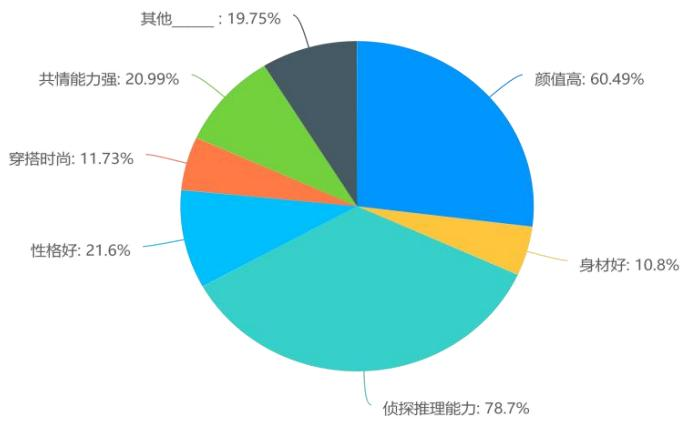

# 1. 论文基本信息

## 1.1. 标题
<strong>“她综艺”</strong>《女子推理社》女性形象及其价值表达研究
*(Study on The Expression of Female Image And its Value in "She Variety" And "Women's Reasoning Club")*

## 1.2. 作者及机构
*   **学位申请人：** 王小杰
*   **指导教师：** 申玉山 教授
*   **学科专业：** 新闻传播学
*   **学位类别：** 文学硕士
*   **培养学院：** 新闻与文化传播学院
*   **答辩日期：** 二〇二四年五月
*   **隶属机构：** 河北经济贸易大学（根据附录图片 22.jpg 推断）

## 1.3. 发表年份
2024 年

## 1.4. 摘要
随着女性独立意识的觉醒，媒介舞台上的女性呈现日益受到关注。“她综艺”作为以女性为主体、从女性视角出发的综艺节目类型，在打破刻板印象、塑造新当代女性形象方面具有潜在价值。本文选取全国首档全女侦探推理节目《女子推理社》的 12 期内容作为研究对象。
**研究目的：** 探讨该节目中女性形象的生成逻辑、呈现特征、构建的神话意义、传播的价值主张以及存在的问题。
**核心方法：** 采用社会性别理论和神话学理论为基础，结合田野调查、线上参与式调查、内容分析法、问卷调查（有效样本 324 份）和深度访谈（16 人）。
**主要结论：** 节目以职场为背景，挖掘了女性兼具理性与感性的多元形象，反映了女性地位提升和自我觉醒。但在商业逻辑、场景搭建和受众凝视的多重规训下，其价值表达存在流于形式的问题。建议未来“她综艺”应立足社会现实，精准把握女性符号内涵，打造真实女性圈层体系。

## 1.5. 原文链接
*   **PDF 链接：** `/files/papers/69a400a6e930e51d3bdf3896/paper.pdf`
*   **发布状态：** 硕士学位论文（未正式公开期刊发表，属于学术学位论文）

    ---

# 2. 整体概括

## 2.1. 研究背景与动机
### 核心问题
本文试图解决的核心问题是：在全女性阵容的推理类“她综艺”中，媒介是如何构建女性形象的？这些形象背后传达了什么样的价值观？以及这种构建过程中是否存在局限性？

### 重要性
在当前新媒体时代，女性话语权显著提升，但传统媒体对女性的刻板印象依然存在。综艺节目作为一种大众文化产品，其传播的女性形象深刻影响着公众的认知。然而，现有研究多集中于情感、恋爱类“她综艺”，对于聚焦女性理性思维（如推理、破案）的垂直领域节目研究尚属空白。

### 创新切入点
本文的独特之处在于：
1.  **题材创新：** 首次将分析对象锁定在“推理/侦探”这一通常被视为男性主导的领域的“她综艺”。
2.  **理论融合：** 综合运用社会学中的**社会性别理论**和传播学中的**罗兰·巴特符号学/神话学**理论，进行跨学科的深层解析。
3.  **实证支撑：** 结合了定量问卷调查（SPSS 统计分析）与定性深度访谈，避免了纯文本分析的片面性。

## 2.2. 核心贡献/主要发现
### 主要贡献
1.  **构建了女性媒介形象的生成逻辑模型：** 从价值主张、场景驱动、商业营销三个维度分析了形象如何被生产出来。
2.  **揭示了符号层面的神话建构：** 运用巴特的三层意指系统（实在、直指、涵指），剖析了节目如何通过视听符号将女性气质转化为特定的意识形态。
3.  **量化评估了传播效果：** 通过数据分析验证了节目对观众在性别观念、职场观、推理认知等方面的实际影响差异。

### 关键发现
*   **正面价值：** 节目成功打破了“女性=感性/非理性”的刻板印象，展现了女性在推理中的逻辑能力与共情能力的混合特质。
*   **存在问题：** 女性形象仍受限于商业逻辑（如消费主义包装）、视觉规训（如过度强调外貌）以及理想化的场景搭建，导致真实性不足。
*   **受众反馈：** 女性观众比男性观众更易受到节目传递的女性主义价值的积极影响（根据双因素方差分析结果）。

    ---

# 3. 预备知识与相关工作

## 3.1. 基础概念
为了理解本研究的深度，以下是对核心概念的详细解释：

### 3.1.1 社会性别理论 (Social Gender Theory)
*   **定义：** 由美国学者<strong>朱迪斯·巴特勒 (Judith Butler)</strong> 等学者发展完善（注：文中引用了安·法格·如本的观点，认为是后天建构的范畴）。它认为性别并非生物决定的生理事实，而是通过文化、社会规范、语言等后天手段不断<strong>建构 (Constructed)</strong> 的结果。
*   **作用：** 在本研究中，该理论用于揭露节目如何再现或挑战现有的性别不平等现状，分析女性角色是否仅仅是为了满足父权社会的期待而被塑造。

### 3.1.2 罗兰·巴特的符号学与神话学 (Roland Barthes' Semiotics and Mythology)
*   **符号意指系统：** 索绪尔提出的 `Signifier` (能指) 指向 `Signified` (所指)。
*   <strong>神话 (Myth)：</strong> 罗兰·巴特将其定义为二级符号系统。第一系统的能指 + 所指成为一个新的能指，再指向一个新的所指（意识形态）。
    *   **实在系统：** 第一级能指与所指的直接对应（例如：看到一位女嘉宾 -> 她是个女明星）。
    *   **直指系统：** 第二级意义，带有文化含义（例如：看到她穿黑色风衣 -> 她代表“酷飒/独立”）。
    *   <strong>涵指系统（神话系统）：</strong> 第三级意义，隐含意识形态（例如：她的独立代表了新时代所有女性都应该追求自我实现）。
*   **初学者解读：** 简单来说，就是看节目不仅是看“发生了什么”，还要看节目想通过这个画面让你相信什么价值观。

### 3.1.3 凝视 (Gaze)
*   **定义：** 源自福柯和劳拉·穆尔维的电影理论。指观看者与被观看者之间的权力关系。
*   <strong>男性凝视 (Male Gaze)：</strong> 在传统媒体中，女性往往是被观看的对象，镜头角度和剪辑是为了满足男性观众的审美欲望。本研究批判性地探讨了节目是否依然陷入这种“凝视”陷阱。

## 3.2. 前人工作
### 境外研究
早期西方研究多从**女性主义批判**入手。例如贝蒂·弗里丹的《女性的奥秘》，质疑媒介中“幸福的家庭主妇”形象。近年来，研究视角更开阔，涉及**凝视理论**（福柯）和**后结构主义**，关注媒介形象背后的权力关系。研究方法上多用内容分析法进行量化比较。

### 国内研究
国内研究始于 1994 年左右，卜卫和刘利群等学者开创了先河。近年来的研究主要集中在：
1.  **消费主义视角：** 分析女性身体如何被商品化（如《乘风破浪的姐姐》）。
2.  **权力关系：** 分析女性如何在综艺中被审视与控制。
3.  **迷文化：** 研究粉丝经济下的女性审美。
*   **现有不足：** 多数研究侧重描述现象，缺乏深度的学理分析；研究对象多为情感类综艺，缺乏对推理类等智力型节目的关注；缺乏跨学科的深层解析。

## 3.3. 技术演进与研究差异化
### 脉络演变
从早期的单纯批判媒介偏见，发展到结合数字媒体环境下的互动研究（如弹幕、社交网络讨论）。
### 差异化优势
本文区别于以往研究在于：
1.  **垂直细分：** 专门针对“推理 + 全女”这一稀缺类型。
2.  **双重理论框架：** 不仅用社会性别论分析内容，还用符号学分析符号表意过程，使分析更具层次感和理论深度。
3.  **数据三角互证：** 将问卷统计结果（定量）与访谈记录（定性）结合，增强了结论的可信度。

    ---

# 4. 方法论

本研究采用了<strong>混合研究方法 (Mixed-Methods Approach)</strong>，旨在通过定性与定量的互补，全面揭示“她综艺”女性形象的复杂性。

## 4.1. 方法原理
核心思想是：<strong> triangulation（三角互证）</strong>。即通过不同的数据来源和方法来交叉验证同一个结论。
*   **定性部分：** 深入理解受众的主观感受、意义建构过程。
*   **定量部分：** 测量变量间的相关性和显著性，确保结论具有统计学意义，而非个别案例。

## 4.2. 核心方法详解

### 4.2.1 文献分析法 (Literature Analysis)
*   **步骤：** 检索国内外关于“媒介与女性”、“她综艺”的学术期刊、学位论文。
*   **目的：** 梳理理论脉络，确定研究缺口（Gap），建立理论框架。
*   **产出：** 形成了第 1 章的文献综述，界定了“她综艺”的定义（以女性为视角、主角，反映女性价值观）。

### 4.2.2 参与式观察 (Participatory Observation)
*   **操作方式：** 研究者深入《女子推理社》相关的微信讨论群、豆瓣小组、知乎话题组。
*   **观察重点：** 记录受众群体特征、行为模式，以及对电视文本的解读和意义再生产。
*   **优势：** 能够捕捉到受众在自然语境下的自发评价，避免调查问卷的引导性偏差。

### 4.2.3 问卷调查法 (Questionnaire Survey) - **核心定量工具**
*   **设计：** 参考以往女性主义媒介研究成果，设计《<女子推理社> 受众的观看与认知》问卷。包含基本 demographics（人口学特征）、态度量表（李克特 5 点量表）。
*   **样本收集：** 共回收 351 份，有效样本 324 份。
    *   **抽样方法：** 滚雪球抽样与偶遇式抽样。
*   **数据分析工具：** SPSS 统计软件。
*   **关键统计指标与公式：**
    为了确保分析严谨性，本研究使用了多种统计检验，以下是核心指标的数学原理（原文虽未列出公式，但根据学术规范进行了补充说明）：

    1.  <strong>信度分析 (Reliability Test) - Cronbach's Alpha ($\alpha$)</strong>
        *   **用途：** 检验问卷内部的一致性，确保大家回答问题的逻辑是否自洽。
        *   **公式：**
            $$
            \alpha = \frac{k}{k-1} \left( 1 - \frac{\sum_{i=1}^{k} \sigma_i^2}{\sigma_X^2} \right)
            $$
            其中，$k$ 为题目数量，$\sigma_i^2$ 为第 $i$ 个题目的得分方差，$\sigma_X^2$ 为总分方差。
        *   **判定标准：** 一般认为 $\alpha > 0.7$ 为可接受，本文结果显示 $\alpha$ 均大于 0.9，表明数据质量极高。

    2.  <strong>效度分析 (Validity Test) - KMO and Bartlett's Test</strong>
        *   **用途：** 验证数据是否适合做因子分析（Factor Analysis）。
        *   **KMO 值：** 越接近 1 越好（通常>0.7 为佳）。本文 KMO 值为 0.947，极佳。
        *   **Bartlett 球形度检验：** $p$ 值需小于 0.05，表示变量间存在相关性。

    3.  <strong>相关分析 (Correlation Analysis) - Pearson Correlation Coefficient ($r$)</strong>
        *   **用途：** 计算两个变量（如“外表关注度”与“职场观”）之间的线性关系强度。
        *   **公式：**
            $$
            r = \frac{\sum(X_i - \bar{X})(Y_i - \bar{Y})}{\sqrt{\sum(X_i - \bar{X})^2 \sum(Y_i - \bar{Y})^2}}
            $$
        *   **解读：** 绝对值越接近 1，相关性越强。本文发现各维度间存在显著正相关。

    4.  <strong>方差分析 (ANOVA) - Analysis of Variance</strong>
        *   **用途：** 比较不同组别（如男性 vs 女性，看完 vs 没看完）在某个评分上的均值是否有显著差异。
        *   **核心统计量：** $F$ 值 ($F$-statistic)。
        *   **公式：**
            $$
            F = \frac{MS_{between}}{MS_{error}} = \frac{SS_{between} / df_{between}}{SS_{error} / df_{error}}
            $$
            其中 `MS` 为均方 (Mean Square)，`SS` 为离差平方和 (Sum of Squares)。
        *   **判据：** 若 $p < 0.05$，则拒绝零假设，认为组间存在显著差异。

### 4.2.4 深度访谈 (In-depth Interview)
*   **对象：** 16 名长期观看节目的受众（涵盖初中生至职场人士）。
*   **时长：** 人均 30 分钟。
*   **资料整理：** 录音转录，整理成 1 万余字访谈稿。
*   **编码策略：** 使用异质性抽样，按年龄、职业分类，确保样本多样性。

    ---

# 5. 实验设置

## 5.1. 数据集
### 5.1.1 视频文本数据
*   **对象：** 《女子推理社》第一季共 12 期内容。
*   **处理：** 逐集观看，提取涉及女性形象、台词、场景、服装、推理过程的视听符号。
*   **示例：** 重点记录了 6 位嘉宾（戚薇、张雨绮、李一桐、李雪琴、田曦薇、张艺凡）在不同案件中的表现。

### 5.1.2 问卷调查数据
*   **来源：** 问卷星平台发放。
*   **样本量：** 有效 N = 324。
*   **人口学分布：**
    *   性别：女性占绝大多数 (约 63.25%)，男性占 36.75%。
    *   年龄：19-25 岁占比最高 (45.58%)，其次是 18 岁以下 (34.76%)。这表明年轻群体是主要受众。

## 5.2. 评估指标
### 5.2.1 量表评分
*   **工具：** 李克特 5 点量表 (Likert Scale)。
*   **维度：** 女性外表、职场观、两性关系、女性推理认知。
*   **计分：** 完全符合 (5分) 到 完全不符合 (1分)。
*   **阈值：** 平均值 > 3.0 表示倾向于同意。

### 5.2.2 统计显著性 (P-value)
*   **标准：** 设定显著性水平 $\alpha = 0.05$。
*   **含义：** 如果 $p < 0.05$，则认为观测到的差异不太可能是偶然发生的，具有统计学意义。

## 5.3. 对比基线
*   **分组对比：**
    1.  **性别组：** 男性观众 vs 女性观众。
    2.  **观看程度组：** 完整看完节目 vs 未看完/没看过。
*   **目的：** 验证性别身份和观看行为是否会影响对女性形象的评价。

    ---

# 6. 实验结果与分析

## 6.1. 核心结果分析
### 6.1.1 女性形象感知
*   **外观与能力：** 数据显示，观众对女性形象的感知中，<strong>颜值高 (60.49%)</strong> 和 <strong>推理能力 (74.7%)</strong> 是最突出的标签。这证明节目在视觉冲击之外，确实让观众认可了女性的智力表现。

    
    *该图像是图表，展示了女性嘉宾在外貌及推理能力方面的占比。各项数据分别为：凭借推理能力74.7%、外貌60.49%、性格好21.6%、穿着时尚11.73%、共情能力20.99%及其他19.75%。*

*   **气质特征：** “强势主动”和“精致优秀”是普及率最高的特征（普及率分别达 85.49% 和 87.35%），而“软弱被动”占比极低（12.35%）。这说明节目成功颠覆了传统弱势女性形象。

    
    *该图像是图4-2，展示了性别与外表关系的分布情况。男性和女性在外表评分上均表现出明显差异，男性的平均外表值为2.81，女性为3.46，显示女性在此项中具有更高的评分。*

### 6.1.2 职场观与两性关系
*   **职场观：** 观众普遍认为剧中女性有领导能力且地位平等（均值 3.168）。虽然部分观众认为职场情境过于理想化，但仍将其视为职业选择的理想典范。
*   **两性关系：** 女性观众对两性关系的评分（均值 3.02）略高于男性，且在看懂节目后，女性对和谐两性关系的认同度显著提升（从 3.02 升至 4.28，参考图 4-4）。

    
    *该图像是图表，展示了职场观与性别关系的均值比较。数据表明，在观看《女子推理社》的男性和女性对职场观的认知存在差异，男性的均值为 2.87，而女性的均值为 3.15。*

    
    *该图像是图表，展示了不同性别（男、女）对两性关系的均值评分。男性对两性关系的平均值为2.98，女性为3.02，而在观看过《女子推理社》的情况下，男性的平均值上升至3.02，女性则为4.28。*

### 6.1.3 推理认知的影响
*   **显著差异：** 双因素方差分析显示，性别对女性推理认知的评分有显著影响 ($p < 0.05$)。女性观众的评分显著高于男性。
*   **观看效应：** 看完节目的受访者对该维度的评分普遍更高，证明了节目的教育功能。

    
    *该图像是图表，展示了性别与推理认知的关系。横轴表示性别，纵轴表示平均女性推理认知值。数据显示，女性在推理认知中得分（4.26）高于男性（2.89），而男性的得分（2.88）稍低于女性（2.97）。*

## 6.2. 数据呈现 (表格)
以下是原文 [表 3-14] 旋转后因子载荷系数表格，展示了问卷数据的结构效度：

<table>
<thead>
<tr>
<th rowspan="2">名称</th>
<th colspan="4">因子载荷系数</th>
<th rowspan="2">共同度 (公因子方差)</th>
</tr>
<tr>
<th>因子 1</th>
<th>因子 2</th>
<th>因子 3</th>
<th>因子 4</th>
</tr>
</thead>
<tbody>
<tr>
<td>(女性外表)—1、女性嘉宾面容姣好、生活精致)</td>
<td>0.077</td>
<td>0.082</td>
<td>0.874</td>
<td>0.09</td>
<td>0.784</td>
</tr>
<tr>
<td>(2、女性嘉宾温柔大方、细腻体贴)</td>
<td>0.144</td>
<td>0.185</td>
<td>0.809</td>
<td>0.075</td>
<td>0.715</td>
</tr>
<tr>
<td>(女性外表)(3、女性嘉宾穿着时尚，充满个人魅力)</td>
<td>0.159</td>
<td>0.15</td>
<td>0.814</td>
<td>0.131</td>
<td>0.728</td>
</tr>
<tr>
<td>(女性外表)(4、女性嘉宾形象符合男性审美、受男性喜欢)</td>
<td>0.25</td>
<td>0.072</td>
<td>0.821</td>
<td>0.168</td>
<td>0.77</td>
</tr>
<tr>
<td rowspan="2">名称</td>
<td colspan="3">因子载荷系数</td>
<td colspan="2">共同度</td>
</tr>
<tr>
<td>因子 1</td>
<td>因子 2</td>
<td>因子 3</td>
<td>因子 4 (公因子方差)</td>
</tr>
<tr>
<td>(女性外表)(5、女性嘉宾穿着打扮不太适合一些推理任务，穿着不宽松、不方便)</td>
<td>0.117</td>
<td>0.224</td>
<td>0.834</td>
<td>0.116</td>
<td>0.774</td>
</tr>
<tr>
<td>(职场观）—1、剧中呈现的职场情境非常的理想化)</td>
<td>0.845</td>
<td>0.141</td>
<td>0.123</td>
<td>0.205</td>
<td>0.791</td>
</tr>
<tr>
<td>(职场观）(2、剧中女性多元化的职业为我树立了职业选择的理想典范)</td>
<td>0.774</td>
<td>0.189</td>
<td>0.189</td>
<td>0.206</td>
<td>0.713</td>
</tr>
<tr>
<td>(职场观）(3、剧中部分女性在职场中有较强的领导能力)</td>
<td>0.747</td>
<td>0.365</td>
<td>0.161</td>
<td>0.207</td>
<td>0.76</td>
</tr>
<tr>
<td>（职场观）(4、剧中女性在职场中有较平等的职场地位)</td>
<td>0.738</td>
<td>0.214</td>
<td>0.159</td>
<td>0.05</td>
<td>0.618</td>
</tr>
<tr>
<td>(职场观）(5、剧中的职场困境现实中我也听说过或遇到过)</td>
<td>0.734</td>
<td>0.33</td>
<td>0.153</td>
<td>0.282</td>
<td>0.75</td>
</tr>
<tr>
<td>(职场观）(6、剧中职场困境的解决办法对我很有帮助)</td>
<td>0.764</td>
<td>0.234</td>
<td>0.137</td>
<td>0.304</td>
<td>0.75</td>
</tr>
<tr>
<td>（两性关系）—1、剧中男性和女性互帮互助，共同</td>
<td>0.189</td>
<td>0.208</td>
<td>0.11</td>
<td>0.858</td>
<td>0.827</td>
</tr>
<tr>
<td>(两性关系）(2、剧中女性遇到麻烦时大多是自己解决)</td>
<td>0.255</td>
<td>0.255</td>
<td>0.132</td>
<td>0.782</td>
<td>0.76</td>
</tr>
<tr>
<td>（两性关系）(3、剧中大多时候是女性帮助女性，女性群体共同攻克难关)</td>
<td>0.254</td>
<td>0.371</td>
<td>0.192</td>
<td>0.746</td>
<td>0.795</td>
</tr>
<tr>
<td>（两性关系）(4、剧中女性处于危险时，部分男性会伸出援手)</td>
<td>0.323</td>
<td>0.331</td>
<td>0.189</td>
<td>0.737</td>
<td>0.792</td>
</tr>
<tr>
<td>(女性推理认知）一 1、剧中呈现了女性比较理性的推理思维)</td>
<td>0.205</td>
<td>0.861</td>
<td>0.137</td>
<td>0.217</td>
<td>0.85</td>
</tr>
<tr>
<td>(女性推理认知）(2、剧中呈现了女性推理时独特的感性与共情能力)</td>
<td>0.201</td>
<td>0.781</td>
<td>0.181</td>
<td>0.323</td>
<td>0.788</td>
</tr>
<tr>
<td>(女性推理认知）(3、剧中呈现了女性积极上进、全身心投入工作的精神状态)</td>
<td>0.31</td>
<td>0.763</td>
<td>0.194</td>
<td>0.284</td>
<td>0.797</td>
</tr>
<tr>
<td>（女性推理认知）(4、剧中女性推理善于发现细节)</td>
<td>0.355</td>
<td>0.753</td>
<td>0.177</td>
<td>0.227</td>
<td>0.775</td>
</tr>
<tr>
<td>(女性推理认知）(5、剧中呈现了女性话语权多因自身努力而提升)</td>
<td>0.349</td>
<td>0.776</td>
<td>0.199</td>
<td>0.236</td>
<td>0.819</td>
</tr>
</tbody>
</table>

*   **结果解读：** 因子分析提取出的 4 个因子累积方差解释率为 76.783%，说明问卷结构良好。例如，“女性外表”主要载荷于因子 3，“职场观”主要载荷于因子 1，“女性推理认知”主要载荷于因子 2。这验证了各个维度之间的独立性。

### 6.2.1 未观看完原因分析
以下原文 [表 5-1] 展示了受众停止观看节目的原因：

<table>
<thead>
<tr>
<th>名称</th>
<th>选项</th>
<th>频数</th>
<th>百分比 (%)</th>
<th>累积百分比 (%)</th>
</tr>
</thead>
<tbody>
<tr>
<td rowspan="5"></td>
<td>剧情老套，没有新意</td>
<td>22</td>
<td>25.88</td>
<td>25.88</td>
</tr>
<tr>
<td>太忙了，没时间</td>
<td>27</td>
<td>31.76</td>
<td>57.65</td>
</tr>
<tr>
<td>推理强度不高，不感兴趣</td>
<td>18</td>
<td>21.18</td>
<td>78.82</td>
</tr>
<tr>
<td>沉浸式体验感差</td>
<td>18</td>
<td>21.18</td>
<td>100.00</td>
</tr>
<tr>
<td></td>
<td>85</td>
<td>100.0</td>
<td>100.0</td>
</tr>
</tbody>
</table>

*   **分析：** 约 31.76% 的人因时间原因放弃，但 25.88% 明确表示因为剧情老套。这意味着即便有时间，内容的吸引力不足也是流失观众的主因。这侧面印证了第 5.1.2 节提到的“商业逻辑下价值传达陷入困境”。

## 6.3. 交互项分析
*   **性别 x 观看状态：** 双因素方差分析显示，性别与观看状态的交互项在多个因变量（如外表、职场观、两性关系、推理认知）上均呈现显著性 ($p < 0.05$)。
*   **具体表现：** 在女生群体中，看完节目后对各方面评价的提升明显；而在男生群体中，提升不明显。这表明《女子推理社》在价值传递上，女性是主要的受益者和共鸣者，对男性观众的观念重塑效果相对较弱。

    ---

# 7. 总结与思考

## 7.1. 结论总结
1.  **生成逻辑明确：** 节目通过价值主张（自由平等）、场景驱动（职场空间）、商业营销（粉丝经济）三位一体构建了女性形象。
2.  **形象突破：** 成功塑造了兼具理性（推理能力）与感性（共情能力）的新时代女性，打破了“女性=柔弱”的二元对立。
3.  **价值局限：** 尽管有正向意图，但受制于资本和商业逻辑，女性形象仍存在被“凝视”的风险（如对外貌的过度关注），且职场场景过于理想化，与现实有一定脱节。
4.  **传播效果：** 节目在提升女性观众的自我认同和两性平权意识方面效果显著，但对男性的影响力有待加强。

## 7.2. 局限性与未来工作
### 7.2.1 局限性
1.  **样本偏差：** 问卷调查中女性比例过高 (63.25%)，可能导致数据偏向女性视角，不能完全代表全体观众的认知。
2.  **横断面研究：** 仅分析了第一季内容，缺乏长期追踪数据，无法判断节目效果的持久性。
3.  **场景虚构性：** 推理节目的剧本性质决定了其必然存在“人为操控性”，这削弱了对真实女性生存状况的代表性。

### 7.2.2 未来研究方向
1.  **纵向研究：** 跟踪后续季节目，观察女性形象演变的动态过程。
2.  **跨文化比较：** 对比中韩同类推理综艺（如韩版《女高推理班》），分析本土化改编的差异。
3.  **机制深化：** 进一步研究算法推荐机制下，此类内容如何触达非目标受众（如男性用户）。

## 7.3. 个人启发与批判
### 启发
本文提供了一个极佳的范本，展示如何将<strong>抽象的理论（如神话学）应用于具体的媒体文本分析</strong>。特别是它没有止步于批判，而是通过数据量化了积极影响，这种“建设性批判”的态度值得学习。对于初学者而言，学习如何处理复杂的 SPSS 输出结果并将其转化为文字叙述也是一次很好的练习。

### 批判与改进建议
1.  **关于“凝视”的悖论：** 论文指出节目存在被凝视的问题，但同时又高度评价其打破刻板印象。这里存在一个理论张力：如果女性依然被置于“被看”的位置（即使是作为优秀的看客），这本身是否还是一种客体化？作者似乎未能在批判“凝视”和肯定“主体性”之间找到完美的平衡点。
2.  **商业化与真实性的矛盾：** 文中提到商业逻辑限制了价值表达，这是所有“她综艺”的通病。未来的解决方案不应仅是呼吁“去商业化”，而应思考如何通过**内容付费**或**会员定制**等模式减少广告插播对叙事完整性的破坏。
3.  **普通人的缺位：** 尽管节目提到了 NPC 和普通职场女性，但核心焦点仍是明星嘉宾。真正的“女性力量”可能更多隐藏在素人中。未来节目可以尝试增加素人参与度，使形象更加立体。

    总体而言，这篇硕士学位论文在有限的篇幅内，完成了从理论到实证再到对策的完整闭环，对于理解中国当下的媒介性别议题具有重要的参考价值。