# 硕士学位论文

（学术学位）

# “她综艺” 《女子推理社》女性形象及其价值表达研究

学位申请人：王小杰

指导教师：申玉山 教授

学科专业：新闻传播学

学位类别：文学硕士

培养学院：新闻与文化传播学院

答辩日期：二〇二四年五月

# “她综艺” 《女子推理社》女性形

# 象及其价值表达研究

Study on The Expression of Female Image And its Value in "She Variety" And "Women's Reasoning Club"

学位申请人：王小杰

指导教师：申玉山教授

学科专业：新闻传播学

学位类别：文学硕士

培养学院：新闻与文化传播学院

答辩日期：二〇二四年五月

# 摘要

随着女性独立意识的觉醒，越来越多的女性在媒介舞台呈现自我。“她综艺”节目将女性作为综艺主体，从女性视角出发，聚焦女性现实生活议题，反映社会中女性的价值观，有助于打破现实社会中人们对于女性原有的刻板印象和狭隘认知，塑造新的当代女性形象，凸显现代社会女性主体意识，传播新时代女性价值力量。本文选取首次在推理侦探领域开创的全女综艺节目《女子推理社》共12期内容作为研究的对象，以社会性别理论和神话学理论为理论基础，以田野调查与线上参与式调查、内容分析法为主要研究方法，试回答以下问题：“她综艺”《女子推理社》女性形象生成逻辑是什么？《女子推理社》节目呈现了什么样的女性形象？构建了怎样的女性形象神话？传播了怎样的价值主张和取向？“她综艺”《女子推理社》价值表达中出现了什么问题？未来应如何发展？

论文第一部分是绪论，分析“她综艺”节目的研究背景和意义、文献综述，提出本文的研究方法、运用的理论和创新点。第二部分分析“她综艺”节目《女子推理社》如何构建女性媒介形象的，通过价值主张、场景驱动和商业营销三个方面分析其背后的生成逻辑，并总结女性媒介形象特点。第三部分以神话学理论为基础，分别从实在系统、直指系统、涵指系统，对“她综艺”《女子推理社》女性媒介形象的心理感知、符号脱敏、内涵意蕴进行探讨。第四部分深入挖掘“她综艺”《女子推理社》节目女性媒介形象的价值表达。第五部分反思“她综艺”《女子推理社》节目女性媒介形象价值表达上的局限，并给出相应的发展建议。

研究发现，《女子推理社》节目以职场为背景，挖掘女性媒介形象的多元呈现方式，突出女性在侦探推理方面兼具的理性与感性特质，反映了女性社会地位的提升以及自我的觉醒，表达了正向的女性价值。但是，“她综艺”节目《女子推理社》中的女性形象受商业逻辑、场景搭建与受众凝视的多重规训，其价值表达只能流于形式难以深层触及。“她综艺”节目需立足社会现实，精准把握女性符号的内涵，摒弃刻板，打造真实女性圈层体系，推动媒介正确塑造女性形象，传播新时代女性价值观。

关键词：“她综艺”；女子推理社；女性媒介形象；社会性别；价值表达

# Abstract

With the awakening of women's independent consciousness, more and more women present themselves on the media stage. "Her Variety Show" takes women as the subject of variety show, focuses on the issues of women's real life from the perspective of women, reflects the values of women in society, helps to break the original stereotype and narrow cognition of women in the real society， shapes a new image of contemporary women, highlights the main consciousness of women in modern society,and spreads the value of women in the new era. This thesis selects a total of 12 episodes of the all-female variety show "Women's Mystery Club",which was created for the first time in the field of detective detective,as the research object. Based on gender theory and mythological theory， field investigation, online participatory investigation and content analysis are the main research methods,and tries to answer the following questions: What is the logic of female image generation of "She Variety" and "Women's Reasoning Club"? What kind of women are portrayed on Girls' Reason? What kind of female image myth is constructed? What value propositions and orientations are propagated? What is the problem in the value expression of "Her Variety" and "Women's Reasoning Club"? How should the future develop?

The first part of the thesis is the introduction, which analyzes the research background and significance of "Her Variety Show"， literature review, and puts forward the research methods, theories and innovations of this thesis. The second part analyzes how to construct the female media image of "Her variety show", analyzes the generation logic behind it through the three aspects of value proposition, scene driving and commercial marketing, and summarizes the characteristics of female media image. The third part, based on the theory of mythology, discusses the psychological perception, symbol desensitization and connotation of the female media image of "She Variety Show" and "Women's Reasoning Club" respectively from the real system, the direct system and the implicative system. The fourth part deeply explores the value expresson of the female media image of "Her variety" and "Women's Reasoning Club" programs. The fifth part reflects on the limitations of the expression of female media image value of "She Variety" and "Women's Reasoning Club", and gives corresponding development suggestions.

It is found that with the background of the workplace， the program of Women's Reasoning Club excavates the multiple presentation ways of female media images, highlights the rational and emotional characteristics of women in detective reasoning,reflects the promotion of women's social status and self-awakening, and expresses positive female values. However, the female image in her variety show Women's Reasoning Club is subject to the multiple disciplines of commercial logic, scene construction and audience's gaze, and its value expression can only be a formality that is difficult to deeply touch. "Her variety Show" should be based on social reality, accurately grasp the connotation of female symbols，abandon stereotypes, create a real female circle system, promote the media to correctly shape female images, and spread female values in the new era.

Key words: "She variety"; Women's reasoning Society; Female media image; Social gender; Value expression

# 目录

1 绪论..

1.1 选题背景.

1.1.1“她综艺"节目蓬勃发展，  
1.1.2 新媒体时代女性话语权提升

1.2 研究意义.

1.2.1 理论意义.   
1.2.2 实践意义.

1.3 文献综述. 4

1.3.1 境外研究. A  
1.3.2国内研究.

1.4 理论依据.

1.4.1 社会性别理论  
1.4.2 符号学理论...

1.5研究方法与研究框架. 13

1.5.1 文献分析法.. .13  
1.5.2参与式观察 .14  
1.5.3 问卷调查. .14

1.6 本文创新点. .17

2“她综艺”《女子推理社》女性媒介形象生成逻辑 .18

2.1 价值主张:追求自由平等的女性意识， 18

2.1.1塑造自我:新时代女性自我意识的展现 ..18  
2.1.2 情感链接:注重平衡感引发大众共鸣 .20

2.2 场景驱动:形塑当代职场女性特质， .21

2.2.1 社交氛围搭建共情场景,凝聚认同展示性格特征. .21  
2.2.2 职场空间搭建视觉冲击场景,打破刻板性别形象 ..24  
2.2.3个体状态搭建沉浸式场景,展现人物混合性别气质... ...27

2.3 商业营销:满足受众心理和生理需求 31

2.3.1 消费狂欢:女性媒介形象的商品化、娱乐化 31

2.3.2 粉丝经济:利用明星效益挖掘"她综艺"市场潜力. ..34

3“她综艺”《女子推理社》女性媒介形象神话主义建构. .37

3.1 实在系统:"她综艺"女性形象的心理感知. .37

3.2 直指系统:"她综艺"女性形象符号脱敏. ..40

3.3 涵指系统:丰富"她综艺"女性形象内涵. .45

3.3.1传递职场中独特的女性气质形象. .46

3.3.2塑造新时代反传统的女性形象 .50  
4“她综艺”《女子推理社》女性媒介形象价值表达分析. .54  
4.1宣扬性别平等理念:打造和谐的社会两性关系.. ..54  
4.2 重塑女性思维能力认知:展现独特逻辑推理能力 ..55  
4.3 关注普通女性职场现实:传递积极向上的价值观 ..57  
4.4 提高女性精神价值:"她"力量助力全人类发展. ..59  
5“她综艺”《女子推理社》女性形象价值表达反思与展望 ..66  
5.1“她综艺”《女子推理社》女性媒介形象价值表达批判. ....66  
5.1.1 难以突破被"凝视"的女性形象价值表达. ...6  
5.1.2 商业逻辑下女性媒介形象价值传达陷入困境 ..67  
5.1.3 场景搭建影响"她综艺"女性形象.. ...69  
5.2 愿景与可能性:"她综艺"女性形象塑造的几个维度 ..70  
5.2.1 深挖女性符号内涵,注重耕耘"她综艺"精神内核 .70  
5.2.2 多元联合,充实内容丰富表达.. .71  
5.2.3 符合社会现实,打造真实女性圈层体系 ..72  
结语... .73  
参考文献.. .78  
附录... .82

# 1绪论

# 1.1 选题背景

# 1.1.1 “她综艺”节目蓬勃发展

女性作为近年来的社会热点话题，媒介呈现的女性形象也越来越备受关注，2006年《但愿人长久》第一个以“她综艺”命名，在北京卫视播出，2012年开始，“她综艺”进入爆发期，题材多元、类型丰富①。2016年起随着网络综艺的壮大，“她综艺”节目出现在了网络平台②。2019年《我家那闺女》播出，“她综艺”话题密集起来，引起社会强烈反响，在全网引发超高热议和话题度。

《女性综艺数据报告》中将“她综艺”定义为：从女性视角出发，以女性为综艺主角，关于女性生活各个方面的话题，并传递社会中女性的世界观、价值观、人生观的综艺节目?。自2016年起，“她综艺”逐渐频繁地出现在公众视线中，引发了广泛的热议和关注，同时其节目形态也在不断丰富多样。具体来说，主要包括以下几种类型的“她综艺”：访谈型节目、女性的真实生活展示节目、主打女性视角的观察型综艺等等。此外，主题方面则聚焦于时装、婚姻与恋爱、明星培养等方面。《女子推理社》是芒果TV 推出的全国首档女子侦探推理节目，该节目邀请戚薇、张雨绮、李一桐、李雪琴、田曦薇、张艺凡6位高智商女性嘉宾，沉浸式融入1:1打造的职场环境中，通过推理 $^ +$ 解谜的形式，侦破六个单元案件 $^ +$ 一个主线案件，单期解谜与长线剧情双维推进，最终解锁案件背后的真相。以职场话题切入、以典型性人物话题展开节目，引起了当代女性的共鸣，代表了当代职场女性的生活写照，反映出当代一些社会现象以及人文关怀，成为“她综艺”中有代表性的推理类综艺。

# 1.1.2新媒体时代女性话语权提升

《新媒介赋权及意义互联网的兴起》中认为：新媒体赋权背景下，互联网空间出现

“去中心化”趋势，媒介成为实现权力的重要渠道。

到 2023 年1月为止，移动互联网的女性用户活跃度已经近乎一半。

# 女性能顶半边天

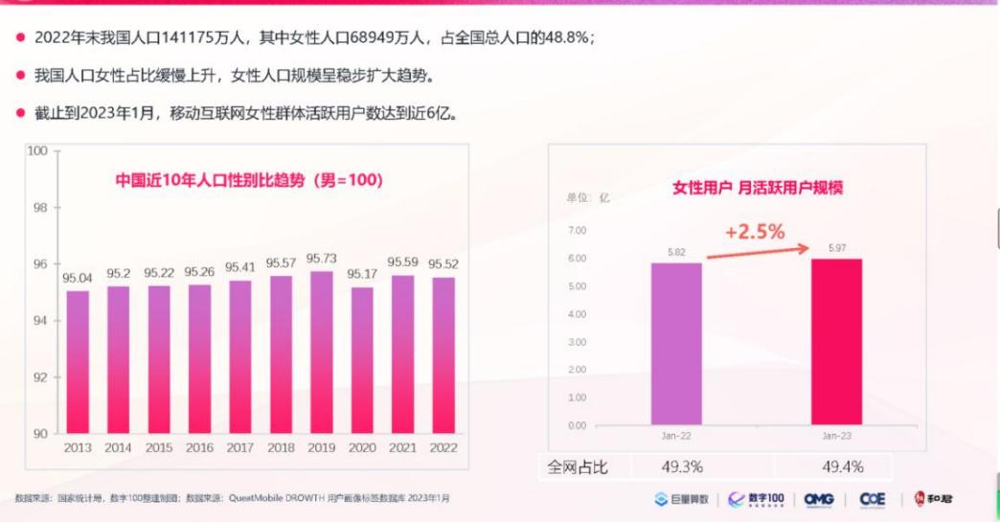  
图1-1女性移动互联网活跃情况

全国约4亿女性消费者消费支出超10万亿人民币，成为世界第三大消费市场，并且女性在决策中的影响力巨大①。

# 女性的消费力惊人。

全国近4亿年龄在20-60岁的女性消费者，每年掌控的消费支出高达10万亿人民币，足以构成世界第三大消费市场；

·女性自身可支配收入逐年增加，与男性逐渐缩小。

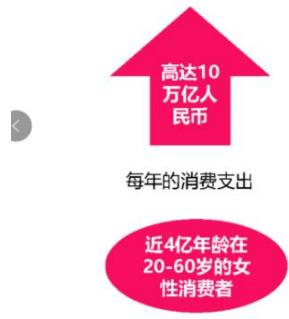  
数据来源：埃森哲数据

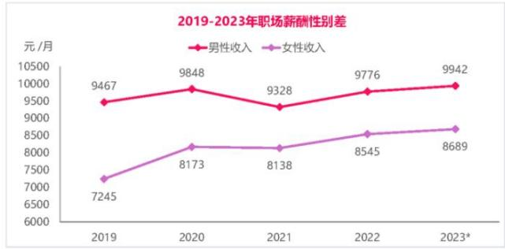  
数据来源：智联招聘，仲量联行研究部，2023年4月，数据统计截止到2023年第一季度

  
图1-2 女性职场薪酬情况

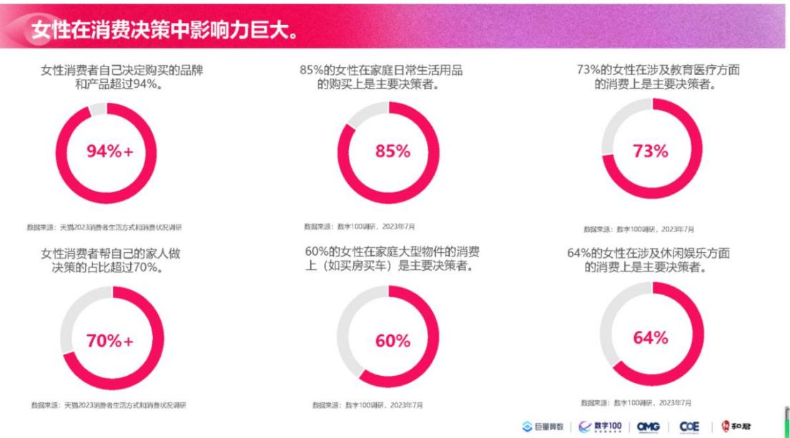  
图1-3 女性在消费决策中的影响力

综上所述，“她综艺”是综艺的其中一种类型，以女性为主要表现对象及受众，同时兼具二次消费潜力与特质，媒介的更新迭代，使更多女性“被看见”，拥有了话语权和发展机会。传统社会赋予她们的刻板化符号被重新审视。因此，女性话语权的提升有着其特殊的时代背景，《女子推理社》节目是我国首档全女侦探推理节目，在芒果 TV和湖南卫视同步更新，“她综艺”的发展为女性话语表达带来新契机。以女性视角切入社会热点话题，利用推理解谜的形式和紧张的氛围来传达女性态度，对受众产生了较大的影响力，丰富了女性在媒介平台和现实社会中的话语表达。

# 1.2 研究意义

# 1.2.1 理论意义

通过深层透视女子推理社媒介形象建构的逻辑，第一，有助于丰富性别与媒介形象的本土化研究。有助于抽象出“她综艺”对女性媒介形象建构的共性规律与问题。第二，综合运用神话学理论，社会性别理论、传播学理论，为本土化的性别与媒介研究提供一些新的视角，进一步丰富女性媒介形象及其价值传播研究。

# 1.2.2 实践意义

一方面，从传播媒介角度出发，在目前中国社会的语境下，它的生成逻辑是否遵照其宗旨，是否以性别平等作为基本观念，不带有刻板偏见的向公众传播“她综艺”女性媒介形象以及最终呈现给公众一个怎样的群体印象是一个值得研究的问题。本文通过对《女子推理社》对女性的生成逻辑及其呈现的媒介形象分析，为恰切的女性形象打造提供思路，推动“她综艺”节目符号实践及其媒介形象呈现的真实性、全面性、客观性。

另一方面，对于普通公众来说，“她综艺”女性的形象主要来自于公众的刻板印象以及“她综艺”节目呈现。本文通过定性与定量的内容分析方法，剖析“她综艺”《女子推理社》女性的群体形象如何展现在综艺平台上，通过对其媒介形象价值传播的分析，有助于为受众建立良好健康的女性价值认知，其不惧困难、勇于挑战的价值传达对受众有积极意义，以女性形象价值传播分析其带来的社会影响，有利于对“她综艺”节目的发展提供参考价值，让社会公众对“她综艺”女性形象的价值传播有更加真实、全面的理解，同时也希望引导“她综艺”女性媒介形象价值表达的良好媒介生态。

# 1.3 文献综述

“媒介与女性”研究以媒介与女性互动关系为主，从欧美发端，到现在广泛传播，经过三次女权运动，女性主义开始向社会各领域渗透，体现了其不断追求的两性平等社会地位。此研究虽从批判视角出发，但目的是希望社会公众及媒介能重新审视过去惯性思维里的“女性”。

# 1.3.1境外研究

“媒介与性别”的研究是“媒介女性形象”研究的开端。20世纪70年代，境外的批判学派开始研究“媒介与性别”。女性研究从跨学科领域开始以新的批判视角和重新审视西方文化传统，并反思人类的思想观念。从此西方文化开始重塑，并且以往媒介中社会性别角色定位及其传统思维习惯也受到了前所未有的挑战，此研究以其批判精神逐

渐成为西方学术主流①。

1.从研究视角来看，多从女性主义批判入手

20 世纪60年代开始，女权运动逐渐聚焦于探讨女性角色与公众媒体的关系，然而此时的研究尚处于初级阶段。20 世纪60至70年代，女性主义运动聚焦于媒介与社会中的女性形象关系讨论，女性主义者认为媒介在传播社会性别偏见观，因此，女性主义研究的重点就是媒介传播中的女性价值及其相关问题，以期颠覆传统的性别成见②。1963年的著作《女性的奥秘》由贝蒂·弗里丹撰写，该书中她针对美国广播及出版物中所描绘的“安逸且满意的家庭主妇”形象提出了疑问和反驳。受制于当时的公共媒体如报纸、电台和电视台的影响，这种被视为典型美国家庭主妇角色的“幸福的家庭主妇”形象深受美国女性喜爱。贝蒂·弗里丹质疑大众媒介塑造的传统家庭妇女形象，并批判其传播女性挫败感等负面情绪?。从20世纪70年代至80年代，社会性别和媒体的研究领域开始逐渐发展壮大。在这段时间里，凡·祖所撰写的《女性主义媒体研究》成为了首部全面介绍女性主义媒体研究的专业书籍。融合人文、社会科学，从批判理论、后结构主义等视角出发，分析了性别刻板印象及女性形象、男性气质等议题。④。近年来，媒介与女性媒介形象的研究视角更加开阔。福柯认为，一个凝视足以让人们变得卑微，成为被人凝视的受监视者。③。约翰·费斯克认为现在媒介塑造的形象大多是为了迎合公众，难以与现实相符。西蒙·波伏娃认为女性形象是具体的，随着社会发展不断变化，塑造者根据自身理解和经历塑造女性形象，传递其隐含的思想价值②。有学者指出，只要受害者和幸存者还继续承受社会羞辱、指责和不信任，女性沉默就会是一个系统性的存在?。

2.从研究方法来看，较多采用内容分析法

在研究方法上，运用媒介文本里性别形象的相关数据进行量化比较，由表及里分析其内涵意义，由“是什么”深入探讨“为什么”，来确定研究的客观准确。

比如《炉床与家庭：媒介中的女性形象》中作者将1952到1974年的数据用可视图的形式呈现给受众，从而反映男性形象的主体地位，这恰好符合传统性别角色偏差的社会研究。

此外，还有部分采用符号学等质性研究方法，深入分析女性形象中的意识形态问题，中国香港、中国台湾先于大陆聚焦媒介与性别研究，在《女性在台湾新闻专业中的角色与展望》和《香港居民对广告中女性形象的评价》中通过量化分析数据，获得结论，明确研究对象的同时，传播了新闻传播学者的实证精神。然而，实证材料被用来做内容分析，也有部分不足，比如自由主义女性主义的电视批评里缺少分析形象的产生原因、准确的形象定义，也缺乏与女性受众的互动②。

境外学者侧重女性形象的塑造，从女性主义的视角展开批判性的研究，运用质化研究，对女性形象中呈现的性别歧视进行系统分析，意图揭示女性现实困境，找到提升女性地位和独立自主意识的解决办法。

# 1.3.2国内研究

国内基于中国发展现状和本国国情，将“媒介与性别”领域的“性别”改成“女性”,聚焦当前女性在媒介与性别领域的相关问题，“媒介与女性”研究应运而生?。国内对于媒介女性形象的讨论开始集中出现于1994至 2010年④。在 2001年，卜卫发表了一部名为《媒介与性别》的作品，这是中国首部全面研究媒体和女性的书籍。这部作品分为三个部分：理论分析、实际操作案例及传媒评价。其主题集中于讨论传播和社会中的男女角色问题及其社会性别意义等话题。

刘利群学者多年来致力于媒介与性别的研究,2004年出版了《社会性别与媒介传播》一书，该书从社会性别视角出发，梳理了国内外媒介与性别研究的状况，阐述了社会性别理论的发展过程，从各个方面探讨了媒介与女性的多重关系?。为我国媒介与性别研究开创了先河。对近些年“媒介与女性”相关研究分析，并结合“她综艺”研究及专家学者观点，本研究总结国内关于“她综艺”的研究内容和方法，以吸取经验教训，找到“她综艺”研究者有价值的研究方向。

国内“媒介与女性形象研究”沿袭女性主义的批判色彩，同时留有基础理论框架与媒介批评的警示性。目前，女性综艺的研究并未形成成熟的研究体系，更多的是从个案分析出发，寻找“她综艺”案例中的女性媒介构建并分析其背后的逻辑。研究的内容聚焦在媒介中女性呈现频率、性别观念的传达，不同研究各有侧重，具体可将“她综艺”研究划分为如下三个方面。

第一，消费主义视角下的“她经济”研究

从消费主义视角分析“她经济”研究的学者并不少见。2000年“她”开始成为社会生活各领域的热词并走向中国市场。2007年《中国语言生活状况报告 (2006)》中开始以“她经济”描述女性消费市场①。“她经济”即女性经济，进入新时代，随着女性地位的提高，女性消费需求也逐渐提高，带动“她综艺”发展。束苇苇在《女性主义视角下明星真人秀节目中女性形象的建构——以‘乘风破浪的姐姐’为例》中通过分析女性节目的建构，认为在该节目中，女明星的身体具有极大的商业价值，这些价值是男权社会和消费社会共同打造出来的，提出为更好建构女性形象，表达女性主体意识，制作人应更多地考虑如何客观地展现一个符合女性主义潮流和新时代趋势的女性形象的建议②。景思梦在《选秀节目中的女性形象建构研究——以‘乘风破浪的姐姐’为例》中认为受众期待的是媒介计划的并不真实的女性形象，是被消费文化裹挟、并受到资本建构的影响③。安晓燕在《创作样态、话语传达与支配力量：浅谈国内“她综艺”的生产》中提出“她综艺”的创作样态是多方力量博弈的结果其中商业逻辑的推动、传统和现代思想潮流的转变、现代传播方式的结合，促进“她综艺”对女性形象的塑造④。丁韬文、康钰伟在《“姐”系综艺的反差叙事、价值表达与市场开发—一以‘乘风破浪的姐姐’为例》中认为‘乘风破浪的姐姐’瞄准大龄女性的消费市场，创新制作形式，打造姐系列 IP，实现价值传播?。殷乐、申哲在《“被看见的她们”：“她综艺”女性叙事探析》中认为，过度商业化和娱乐化地女性形象建构实际上是对女性话语权的禁锢，“她综艺”对于女性力量的传递不应过度娱乐化。

第二，女性凝视下的权力关系研究研究

在前“她综艺”时期，相关研究对象多为网络综艺中被“凝视”的女性。“女性凝视”这一理论源自于伽曼和马什门特所著的《女性凝视》中的一篇文章。该理论认为女性被视为男性的观察目标，并通过这个过程来模拟和社会控制及权力关系的再现。凝视是权力的象征，总是强势者在凝视处于弱势地位的群体①。

约翰·伯格在《观看之道》中从女性凝视和男性凝视视角分析，他认为，女性有着双重凝视，一是内在与自身的观察者，即自我对自我的观察与凝视；二是被观察者，就是男性对她的观察和凝视②。郑坚、陈俊朋在《现象级综艺节目中的“女性成长”叙事研究》中认为，“女性成长”议题的“她综艺”节目实际上是传统父权文化下对女性的控制③。周心怡在《女性主义视角下“她综艺”的叙事特征与发展困境》中认为，女性在综艺里展示自我却又不断被审视，丰富了女性立体化形象，也暴露出更多的社会问题③。李惊雷闫艳艳在《“她综艺”中女性景观的建构与消费》中认为“她综艺”始终有意识地把镜头瞄向女性身体，使其成为景观社会的重要橱窗，节目反映了女性思潮的进步，但仍不可避免受到凝视的规训。尽管女性的注视保持了父权社会的基础秩序，但同时也打破了传统观念，符合现代女性对自我形象的理解。并且通过这种认可机制进一步提升了女性在社会话语中的角色地位。但关于凝视下的女性形象研究中学者也发现了不少节目中仍出现了不少物化女性的问题。

也有部分学者分析女性权力结构中的女性精神力量。赵浩在《样态转型、话语再塑与价值重构——“她综艺”节目中女性群体的现实书写》中认为，“她综艺”也为女性在家庭及情感等方面遇到的困境提供可行性解决方法，让她们获得身心的愉悦与精神的满足，通过媒介平台，传播女性价值@。“女性意识就是女性对于自身作为与男性平等的主体的存在地位和价值的自觉意识。③”女性意识的觉醒使得“她综艺”节目的女性形象成为媒介性别研究不可忽视的维度。“她综艺”讨论度的飙升，帮助我们深入分析其背后的女性社会价值，为女性群体颠覆传统刻板印象、树立积极的女性形象打下基础，提高受众对新时代女性形象的认可度。例如，许多被高度赞誉的“她综艺”就是一个典型的案例，通过设定与女性相关的主题可以引发观众对生活的思考，无论男女都可以从中获得启示，从而审视自身的生活方式及价值观。

第三，狂热迷文化下的女性审美研究

近年来针对狂热迷文化下的女性审美研究呈上升趋势。早期对女性审美的分析是从大众文化角度分析受众需求的。付帅在《女性真人秀综艺节目发展趋势研究》中对节目建构方式、叙事维度进行分析，认为女性真人秀综艺展现的女性审美打造贴近观众的情感诉求，如：消解明星身份、呈现多元化特征并展示了情感共鸣和寄托①。关悦在《我国网络综艺节目中的女性话题与女性形象建构研究——以《青春有你2》为主要研究对象》中认为女性综艺以批量化娱乐生产为噱头，制造焦虑话题，并不能真正解决女性发展面临的困境。传者作为媒介，应承担起其社会文化功能，挖掘女性深层次的价值。③。洪嘉楠在《她综艺的“秀”与“迷”——‘乘风破浪的姐姐’中的互动研究》中通过分析《乘风破浪的姐姐》“秀”的方式和内容、受众“迷”的动机和效果，认为“她综艺”未来发展要摆脱后劲发展不足问题，需摆脱综艺套路，跳出故事框架、坚持差异化创新，拒绝同质化跟风、注重价值观输出，升华节目价值?。张康瑶在《“她综艺”中的女性主义文化解读—一以‘乘风破浪的姐姐’为例》中认为《乘风破浪的姐姐》的女性形象虽进行了重塑但仍深受框架桎梏，并展示出病态的“迷”文化，认为“她综艺”受到狂热的迷文化、消费主义倾向、男性凝视的束缚，应积极引导改进④。关于狂热迷文化下的女性审美研究从受众与媒介塑造的女性形象关系下手，同时研究还细化到了“使用与满足理论”、媒介与受众互动等理论视角。

针对当前女性审美研究中的现象，也有学者提出要从深层次女性意识出发分析女性力量的传播。韦露在《试析女性主义视角下的“女性向”综艺节目一一以‘乘风破浪的姐姐’为例》中认为综艺节目应聚焦于解决现实问题，而不是局限于女性视角。李琳在《融媒体时代对女性价值观念传播的影响一—以综艺节目‘乘风破浪的姐姐’为例》中认为融媒体时代的“她文化”综艺节目话语场，注重塑造独立女性意识，颠覆传统男权社会下的女性形象。通过媒体传播的广泛性，综艺节目能全面展示21世纪女性的价值观和生存环境。这不仅有助于男性重新理解新时代女性的独立形象，同时也能提升女性对自我认同感。赵浩在《样态转型、话语再塑与价值重构——“她综艺”节目中女性群体的现实书写》中认为从女性切身的利益与需求出发，实现女性在职场、情感、生活中的人生价值以及自我认同，如，“她综艺”《妈妈是超人》探讨了社会对于母亲身份的认知女性对于母亲身份的选择等活题，提升女性价值，帮助女性找到自己发挥价值的平台。

上述研究多用定性研究方法，或量化分析辅以质化分析，进一步解读数据中反映的现象。譬如文章《"她综艺"中银发女性媒介形象的建构与解读——以<妈妈，你真好看>》我们以《为了例证》为主题，选择观察并评估电视娱乐节目的《妈妈，你真漂亮》中传递的信息内容的全面、客观且定量的研究方式，从而揭示其塑造老年女性的媒体印象的特点。此外，我们也运用质化的研究手段对各年龄层观众进行了深入访问，收集他们对这个节目构建出的老年女性媒体形象的解读总结，以此来进一步探讨她在建立老年人女性媒体形象方面的价值所在。

现有研究的不足

对当前“她综艺”研究现状分析，指出不足之处，可以为相关研究提供突破的可能。从以上的研究不难发现，少数研究以“她综艺”价值的传播为主题。多数文章只是在文中一笔带过，并没有深入探讨其价值的传播逻辑。以描述性研究为主、学理性偏弱。结论先行的印证性研究为主，思辨性偏弱。研究类型以女性访谈输出观点类、专家学者帮助女性的生活情感事业等单一情感类型为主，研究的消费主义类型以健身、美食、工作等娱乐化为主，研究对象多是有才艺的明星，研究的节目最终以提升女性自我认同感和价值为目的；浅层表面的单学科分析较多，跨学科的深层次解析欠缺。从女性主义及批判角度来谈的也略有几篇，但都侧重表层现象分析。

学界对于女性以理性思考为主的推理类节目探讨尚有欠缺，较少关注现实生活中普通女性的生活，目前文章以女性意识和自身价值方面认知为主，但对于如何破解生活中的难题实现自身价值研究还欠缺；研究视角较局限于女性自身情感事业发展上，而对女性全球人类命运共同体的大格局观研究较少；研究内容偏重探讨女明星的舞蹈表演、音乐等娱乐消遣角色，缺乏对普通女性的关注；对于女性价值的表达分析也不够深入。因此本文将立足“她综艺”女性形象，并分析其表征背后呈现的女性主义价值的表达，侧重女性推理逻辑方面的价值表达分析；探讨的是女性全球人类命运共同体的大局观和大格局；看到普通女性的价值，如职场小透明，可以给更广范围的普通女性群体提供建议和意见，提出女性未来在现实生活中克服困难实现自身价值的意见建议。同时本文将综合运用社会学、传播学的理论知识，跨学科、深层次探讨其理论价值。

# 1.4 理论依据

# 1.4.1 社会性别理论

女性主义的概念有很多，而“社会性别”是其中心概念，1976年由美国学者家格·如本提出他认为性别是通过文化、社会等手段不断建构的后天性范畴，具有可获得性的特征①。作为一种分析范畴和分析工具，从两个角度：一是揭露社会性别不平等现状，二是揭露其背后的结构性与制度性因素②。该理论视两性性别为建构的结果，即是社会文化、政治、经济等因素的影响造成了两性性别的差异。社会性别理论没有把男女放在对立面，而是从社会权力关系出发看待女性与社会性别文化、性别制度和结构的关系。该理论在中国被用到社会学领域，逐渐来分析传播学相关问题。

# 1.4.2 符号学理论

# （一）罗兰巴特的意指系统理论和神话理论

罗兰·巴特在他的著作《神话学》和论文《图像的修辞》中，论述了符号学理论与视觉传播之间的关系。把能指/所指关系拓展到更深层意指作用系统。符号意指系统是基于叶尔姆斯列夫的理论提出的，他将一个意指系统分为“表达平面”(E)和“内容平面”(C)，意指行为相当于两个层面之间的关系(R)：ERC。即表达平面就是能指，内容分析即所指。第一系统的延申即一个 ERC 系统转变为另一系统单一成分。涵指符号学即第一系统成为第二系统的表达平面或能指时，若第一系统成为第二系统的内容平面或所指，则为 ER(ERC)，一切元语言都属此类。③

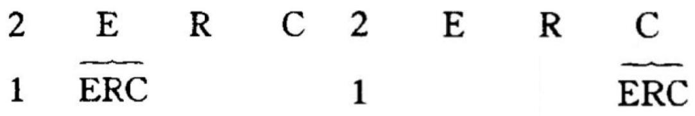  
图1-4涵指  
图1-5元语言

罗兰·巴特认为，以媒介为手段的现代消费社会创造了繁芜丛杂的“神话”来代替现实，它与传统神话一样都是虚构的，对人进行愚弄和欺骗。罗兰·巴特对符号学进一步探索，在《符号学》一书中将元语言本身介入涵指系统，其关系可表示为：

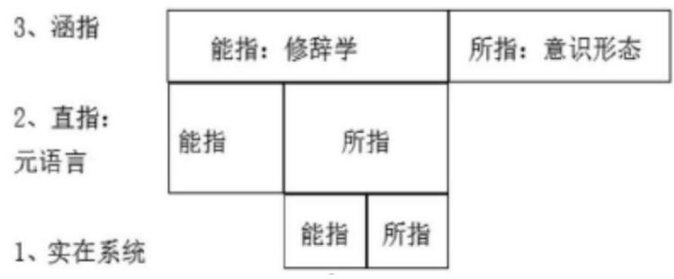  
图1-6罗兰·巴特符号意指系统

罗兰·巴特在《神话学》中认为神话产生于二级符号系统，能指与所指不是同一级关系，能指与所指可以转向一个更大符号系统的构成元素，如图。

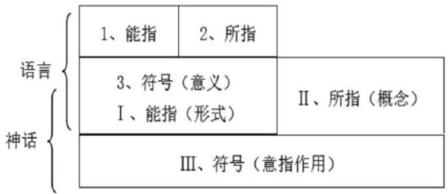  
图1-7符号学神话示意图

# （二）性别符号学理论

性别符号学是研究性别符号及其运作的科学，属于符号学。中外以“性别符号学”为名的专著较少，“性别”符号在前人性别符号系统基础上建立，简·布仁在《性别符号学》中归于社会模式、无意识感情和生物学里，意图找到性别概念深层逻辑关系，达莉亚·M·杰西卡的《政治身体/身体政治：性别符号学》是迄今中外唯一一部以“性别符号学”为名的专著。她视性别和社会分类同等重要，并相信它们之间的联系可以共同创造一种性别符号体系。她的目标是通过这本书来构建一组更有效的理论工具去深入研究这种性别/性符号的系统，并称之为为“性别符号学”，探索从神话、符号象征视角剖析性别。将雌性、雄性；男人、女人；男性、女性放在生物及社会、形而上领域，剖析其在仪式、神话与符号象征三方面的意义，并分别与转喻、隐喻和提喻三种语言工具对应。

尤施卡(Yuska)在《性别符号学》中探讨女性历史和发展现状，分析性别符号学研究。从三个层面：神话、仪式及符号角度展开。揭露其隐含的男性意识形态内容，指出要严谨辨别才能明确以往的意识形态控制模式②。

尤斯卡没有改变反对性别二元论的想法，又使用了很多性别二元方法，导致了这部宏伟的著作陷入了难以协调的冲突。因此，在符号系统中，女性和媒介，通过符号文本的指示意、隐含意及神话，揭示其中的意识形态和权力关系。因此，通过符号学理论分析女性形象，展现其价值表达意义。

# 1.5研究方法与研究框架

# 1.5.1 文献分析法

文献分析法的主要目标是根据研究对象寻找相关信息，然后进行整理和阅读以提炼出个人的见解。这种方法通过深入分析来实现。研究相关的现有文献，从而获取有效信息，是一种节省成本且具有显著成效的方法。本篇论文的研究概述部分运用了文献分析方法，通过参考女性综艺节目等相关资料进行深入探讨，基于此展开了深度思考和研究，

从而完成了这篇论文的研究工作。

# 1.5.2 参与式观察

本文采用观察线上线下受众对于“她综艺”女性形象的解构与价值表达的影响。笔者深入《女子推理社》微信讨论群、豆瓣小组、知乎话题讨论组，观察其受众群体的基本特征和行为模式，以及在线上社区对电视文本的多元解读和意义再生产。

# 1.5.3 问卷调查

数据来源

问卷调查是量化研究方法，有利于量化数据收集。笔者参考以往女性主义媒介研究成果进行问卷设计，结合本文调查对象和内容，设计形成《<女子推理社 $>$ 受众的观看与认知》的调查问卷。

本次调查一共收集数据351人，其中看过“她综艺”节目的受访者有336人，看过《女子推理社》节目的受访者有324人，即回收样本共351份，其中有效样本 324份。基于本研究收集材料为质化数据为主、量化数据为辅这一情况，本研究借助统计软件进行资料管理、统计与分析数据信效度检验。具体步骤如下：

第一步，回收发放的调查问卷，将其问卷调查数据资料导入统计软件中。

第二步，对调查问卷量表维度数据进行描述分析和回归分析

第三步，形成结论。除了调查问卷中所利用到的351个受访者和深度访谈的16个受访者相关资料，还借助于本文所利用的符号学等相关理论，两者交叉分析“她综艺”节目的女性形象及其价值表达意义，进一步得出在新媒体时代“她综艺”节目女性形象及价值表达中出现的问题并提出相应建议。

为了能够检验问卷的可靠性是否达标，即问卷结果是否具有可重复性，问卷结果收集结束后，需要对问卷结果进行信度分析，以证明问卷的可靠性，即任何重要结果必然不是一次性的发现，本质是可重复观测到的。在对调查问卷的324个受访者的量表维度进行克隆巴赫α系数检验问卷的内部一致性信度，使用探索因子分析进行效度分析，得出本次调查的结果信效度极好，问卷结果的可靠性强。

# 1.5.4 深度访谈

作为社会科学领域的一种质性研究手段，深度访谈是通过口头方式收集客观、无偏见的事实信息并进行表述。特别是在面对更复杂问题时，需要掌握各种类型的资料[51]。本研究选择16个长期观看《女子推理社》节目的受众访谈，通过异质性抽样，选取不同年龄段受众进行访谈，以反映受访者差异性。

笔者通过线上和线下的方式，运用滚雪球抽样与偶遇式抽样的方法接触《女子推理社》的受众这一主体角色。根据受访群体的身份分类，初中生7人，大学生3人，研究生3人，职场工作者3人，共计访谈16人。人均访谈时间在30分钟左右，内容包括对“她综艺”《女子推理社》女性形象的认识及其传播的价值。在全程的访谈中，笔者借助笔记与备忘录等工具，收集整理了1万余字的访谈稿。以下是受访者基本信息表。

表1-1 受访者基本信息表  

<table><tr><td>职业</td><td>编号</td><td>年龄</td><td>性别</td><td>城市</td><td>访谈形式</td></tr><tr><td>初二学生</td><td>A1</td><td>14</td><td>女</td><td>杭州</td><td>个人访谈</td></tr><tr><td>初三学生</td><td>A2</td><td>16</td><td>女</td><td>广东</td><td>个人访谈</td></tr><tr><td>初三学生</td><td>A3</td><td>16</td><td>女</td><td>广东广州</td><td>个人访谈</td></tr><tr><td>初一学生</td><td>A4</td><td>13</td><td>女</td><td>西安</td><td>个人访谈</td></tr><tr><td>初一学生</td><td>A5</td><td>13</td><td>女</td><td>廊坊</td><td>个人访谈</td></tr><tr><td>大四学生</td><td>A6</td><td>23</td><td>女</td><td>唐山</td><td>个人访谈</td></tr><tr><td>大二学生</td><td>A7</td><td>22</td><td>男</td><td>保定</td><td>个人访谈</td></tr><tr><td>大一学生</td><td>A10</td><td>21</td><td>女</td><td>石家庄</td><td>个人访谈</td></tr><tr><td>研一学生</td><td>A8</td><td>24</td><td>男</td><td>石家庄</td><td>个人访谈</td></tr><tr><td>研二学生</td><td>A9</td><td>25</td><td>女</td><td>石家庄</td><td>个人访谈</td></tr><tr><td>研三学生</td><td>B1</td><td>26</td><td>男</td><td>河南</td><td>个人访谈</td></tr><tr><td>大学辅导员</td><td>B2</td><td>28</td><td>女</td><td>保定</td><td>个人访谈</td></tr><tr><td>自由职业者</td><td>B3</td><td>28</td><td>男</td><td>北京</td><td>个人访谈</td></tr><tr><td>个体</td><td>B4</td><td>25</td><td>女</td><td>河南</td><td>个人访谈</td></tr><tr><td>国有企业</td><td>B5</td><td>22</td><td>女</td><td>山东</td><td>个人访谈</td></tr><tr><td>事业单位</td><td>B6</td><td>24</td><td>女</td><td>石家庄</td><td>个人访谈</td></tr></table>

# 1.5.5研究框架

本研究的基本思路是分析“她综艺”《女子推理社》节目构建女性媒介形象的生成逻辑是什么？《女子推理社》节目呈现了什么样的女性形象？构建了怎样的女性主义神话？节目通过女性形象表征传达给了受众什么样的价值？“她综艺”节目《女子推理社》价值表达中出现了哪些问题？未来应该如何应对？研究框架如图1-8所示：

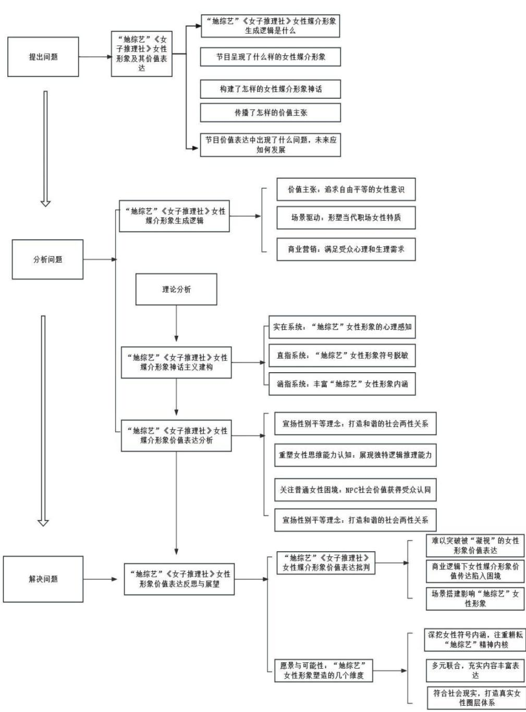  
图1-8研究框架

# 1.6 本文创新点

一、研究视角创新。本文从神话学视角解读女性媒介形象背后深层次的价值意义，并深入现实问题进行探讨，结合场景传播角度，从“她综艺”女性形象的符号建构分析，此前研究者较少将视野聚集于此。

二、侧重“她综艺”的价值表达分析。通过女性嘉宾与NPC互动的女性形象呈现，关注现实中职场普通女性的困境，探讨其带来的社会价值，并运用传播学理论，结合现实情况解读“她综艺”节目的价值表达。

# 2“她综艺”《女子推理社》女性媒介形象生成逻辑

《女子推理社》作为国内首档全女侦探推理综艺节目，其“好好好推理社，遇到困难决不撤”的节目口号和女性面对困难时勇敢的品格较为符合当代女性的追求。“形象由个人对某个个体或群体共同特征的认知形成，其受传播者主观倾向与其传播动机影响。①”《女子推理社》呈现的女性形象为女性在职场的发展提供了更多的可能性，也为现实社会中的女性提供了一个追梦范本。下面以节目中六位女性推理嘉宾作为研究样本，结合笔者调查问卷和深度访谈结果，分析“她综艺”《女子推理社》女性媒介形象的生成逻辑及特征。

# 2.1 价值主张：追求自由平等的女性意识

综艺节目的受众范围广泛，其传播力较大，影响人们思想观念的形成。随着“她综艺”节目以及其他女性题材节目的发展，媒介打破了传统女性角色的单一性，女性意识被呈现到受众面前，女性通过观看节目，受到其自由平等价值观的影响，从而产生心态的变化，并以此来指导生活实践，形成自我与角色之间的认同感，影响女性意识的重建。同时女性意识的提高使受众再次关注女性节目，成为“她综艺”节目《女子推理社》的支持者。

# 2.1.1塑造自我：新时代女性自我意识的展现

女性意识在社会文化影响下开始觉醒，女性自我意识和性别意识不断提高，女性对个人特质的追求加强，提倡性别平权；其次是追求自我认知的需求，倡导妇女参与到社会改革进程中，实现她们真正的价值。无论是从社会活动的视角，或是从“她综艺”《女子推理社》节目的呈现方式观察，都呈现了新时代女性追求自我意识的趋势。

访谈者A9：“国产推理综艺一直只有明侦顶着，其他的也反响平平。其实第一次知道女推的时候，我怕又是一个那种推理平平的综艺，只是因为嘉宾都是我喜欢的，抱着试试看的心态看的。结果看了后，真的狠狠打脸。并没有像明侦把重点放在推理上，而是聚焦在一个个优秀的女性上。真正的让我体会到，女性力量。女性可以在任何职位上闪闪发光。女性不再是谁的附属品，她们可以做自己想做的任何事，我泪点低，几乎就是那种看一个故事哭一个故事的那种，真的短短一季，好多意难平，真的期待下一季的播放，好久没看到你们好的国产推理综艺了，而且还是以女性为主的。”

“她综艺”节目也在传递着更为纯粹的女性情感与女性意识，表达更真实的社会价值，女性开始回归自身寻找原有的自身意义，“她综艺”中女性的特质不仅有女性的独立意识，还有侦探推理中不同于男性的“想象力”。

“‘女性想象力’不再指示一个抽象概念，成为可以影响网络的产物，可以用其进行分析。”①这种“女性想象力”体现了女性独特的魅力。正是新时代塑造的这种自信优秀的女性、大方展示自我的女性等体现女性自我意识的“她综艺”，吸引了受众观看，加大了受众对自由、平等的女性意识的追求。

访谈者A6：“我当时是从豆瓣看到的，因为我对男的不感兴趣，所以我比较喜欢看全女的节目，全女的节目又比较少，看到这个的时候挺感兴趣的就去看了，我希望以后可以多出一些这类节目，把正常的女性形象展现出来。”

访谈者A2：“我当时从抖音视频刷到的田曦薇的一个片段，感受到了女孩子们一起努力完成一件事情的力量，所以我就被吸引了，去看了这个节目。”

当女性的自我认知逐渐增强时，“她综艺”不仅关注女性的内心世界和情绪变化，更主动且有意地将其扩展到整个人类社会，以积极的态度和自发的行动来呼呼和点亮女性群体。因此，从这个角度来看，这种新的“她综艺”节目所承担的社会职责和社会义务要比它对女性身份认同的呈现更为重要。

访谈者A9：“是美娟再也不能和妈妈一起回家，是八音盒女孩生命中最重要的蝴蝶飞走了，是染了粉发要遭受网暴的豆子，是十年以为失去女儿的戴明，是注定不能和大家成为普通同事的尚恋洁，是为了传递真相而牺牲的易玉，是以为自己逃出黑暗却又掉入另一个深渊的刘迎迎，是失去生命中很重要的三个女生的康乐，是做了错事但又心存善念的钱多多，是永远失去妈妈但不知真相的莫宝，是美好却遭遇杀害的程拉拉，虽然有遗憾但正义一定虽迟必到，真相不会永远被埋没，是女孩子们的互相救赎，这就是全女综存在的意义啊。”

# 2.1.2 情感链接：注重平衡感引发大众共鸣

“她综艺”节目通过媒介传递社会意义，《女子推理社》在节目中注重社会现实和社会角色的平衡。一是现实性，通过女性职场场景反映职场女性生存现状，媒介通过筛选女嘉宾实现“她综艺”的价值表达，节目中 NPC的沉浸式表演和真实性呈现成功获得了受众认可；二是平衡性，《女子推理社》节目没有全部选择知名度高的女明星，而是适当加入普通素人，多角度呈现女性媒介形象。从某种程度上来说，抛去明星噱头更有利于其真实价值的表达。

访谈者A10：“女推里每个NPC可能都是现实生活中女性的缩影，我不知道怎么说，但是每看一案都有触动的点，忘不了当时看三连罪的时候具干静和美娟她们俩的对话让我哭的稀里哗啦的，到后边戴明和豆子，以及被PUA的高光，被办公室霸凌的奚芮（另一个姐姐我忘了），以及周更，钱多多和整部综艺的核心人物程拉拉，她们身上的故事值得我们深思、警醒，总之真的好想哭，又看到这些片段，想起那一幕幕。”

访谈者A3：“这类综艺的受众群体不是很多，我比较喜欢这种推理类的节目，芒果做这类型做的还不错，几位成员各有特点，沉浸式表演使得我们共情能力特别强，并且演员都太漂亮了，我一个女生看着都冒爱心，但剧本的连接性不太好，剪辑有待提高，希望下一季还做下去，还是这几个女孩，好好写剧本。”

访谈者A6：“看到易玉死的时候是我第一次哭，特别难受，这么一个苦难了一生的好人就这么死了，我本来还期待易玉最后能在推理社帮助下解开身上的谜团，让坏人得到报应获得一个好结局。”

“她综艺”节目塑造的女性媒介形象对社会有深远的影响力，为了构建更全面、真实的女性媒体形象，我们需要确保其真实性和均衡性，同时以大众的角度来审视这个过程，这样才有可能引发公众的感情共鸣，从而实现传达价值观的目的。

访谈者A6：“希望黑暗中的所有罪恶能像女推一样，有终将光明的那一天，希望社会中所有善良漂亮的女生，可以自信开心的永远做自己。”

访谈者A5：“全女综存在的意义，善良的人应该站在阳光之下，黑暗中也不能丢掉初心。”

媒介传播促进了社会文化的接续发展，同时也促进了女性形象的建构和传承。“她综艺”节目通过多角度展现女性社会现状，传递真实的女性情感，引发受众共鸣，传播女性的社会价值，促进节目内容的升华和女性社会地位的提升。

# 2.2 场景驱动：形塑当代职场女性特质

在所有艺术当中，其实就是在从事着一件事情，即使光影，或者记录光影的文字、线条、图形、色泽和某种物质的质感成为可视的符号。这个符号有一个认知得以获取共识的状态，它就叫作“场景”。人类在获悉符号的过程展开之际，必须首先在场景当中统一价值的认知①。彭兰在《场景：移动时代媒体的新要素》中把场景视为媒体的重要要素。②女性在节目中呈现的场景是职场女性形象，与以往的传统家庭女性形象形成对比，场景符号形成第一层系统中的能指，受众对场景的概念形成所指，场景能指符号指向其概念所指。

这个观点与象征学的语境理论相呼应，后者强调了实际使用的过程中，也就是语境中，才是符号真正含义所在的地方，就像维特根斯坦曾经提到的那样：“词汇的定义在于其在言语交流中的应用”③。人和物都在特定场景下有特定意义，“她综艺”节目作为女性施展才干的重要平台之一，已经不仅仅是一档娱乐节目，而是通过塑造多元女性形象，丰富了人们的精神世界。节目中场景符号的核心作用是塑造人物，《女子推理社》中随着主题不同嘉宾所处场景也不相同，场景符号表达的女性形象意义也有所不同。

在“她综艺”节目《女子推理社》里，有其自己独特的符号表意系统和场景规划。视听符号要素是场景搭建的“血肉”，是“她综艺”节目中真正由人接触和感知的作为文化产物所包含的思想、情感等内容的重要组成部分。视听符号在促进场景流动和交流的同时，使受众对节目中嘉宾的行为和需求有了更好的理解，为下一个场景提供可感知的基础。

# 2.2.1 社交氛围搭建共情场景，凝聚认同展示性格特征

节目中的人物语言作为一种语言符号，承载着不同的人物性格特征，是一种鲜明的人物形象标志，城市化进程加速发展的今天，人们很容易被视频中熟悉的方言打动，唤起乡土情，在现代化职场背景下，当受众看到视频中自信、独立的女性，听到极具共情能力的语言，其情绪被带动，与节目的距离被拉近，不仅如此，这些语言符号还折射出不同的人物性格特征。

表 2-1《女子推理社》中方言对受众的情绪带入影响程度频数分析结果  

<table><tr><td>名称</td><td>选项</td><td>频数</td><td>百分比(%)</td><td>累积百分比(%)</td></tr><tr><td rowspan="3">节目中女性嘉宾对话时方言的使用会让您觉得很亲切吗？</td><td>会</td><td>227</td><td>70.06</td><td>70.06</td></tr><tr><td>一般</td><td>82</td><td>25.31</td><td>95.37</td></tr><tr><td>不会</td><td>15</td><td>4.63</td><td>100.00</td></tr></table>

由上表我们可以看到受访者对于方言问题的回答情况，受访者对于女性嘉宾使用方言表现出亲切感（ $7 0 . 0 6 \%$ ）。节目中，在上班第一天，去1111新媒体公司的公交上，李雪琴和李一桐用东北口音与关大柱交流：“你东北哪儿的啊？”“咱是老乡啊”，接地气的方言为受众展示出真实朴素的女明星形象，体现了“她综艺”朴实的“所指”，通过东北儿化音传递女性幽默风趣的性格。“她综艺”《女子推理社》中女性使用方言符号，增强受众的代入感，密切了与受众的关系，强化了受众对女性的身份认同和地域认同。

另一方面，视频中女性嘉宾的语言符号特征“所指”，展示了她们逻辑感强、做事细心的职场实力派女性“所指”。展示出“她综艺”《女子推理社》节目中女性在职场中的理性思维，突出了女性推理中独特的逻辑能力。当受众一开始找不到节目线索时，女性嘉宾通过语言符号，满足受众好奇心的情感“所指”，比如节目中的后采环节，可以让受众更清楚嘉宾在节目中推理和找线索的思路来源。

但是过于频繁地推理语言符号也给《女子推理社》节目贴上了“硬给线索”、“扰乱推理氛围感”的标签。当方言符号、推理语言符号、推理表演符号等视觉符号与其他视觉符号结合，共同指向了推理类“她综艺”节目《女子推理社》“硬给线索、紧张感不强”的印象，比如第一季中大量的后采，节目中人物形象特征更加突出，但却少了很多沉浸式推理的氛围感。

音乐符号能够传达情感，如同媒体美学专家赫伯特·泽特尔所说：“通过音乐符号，我们可以直观地感受到并表达出各种感情，而非经过我们理性的筛选和处理”。①《女子推理社》中的音乐符号指节目视频中的背景音乐和歌曲、后期剪辑添加的声音等。音乐符号帮助人物情感表达，放大人物的情绪，突出“她综艺”节目《女子推理社》表达的主题，丰富使受众共情的场景。

表 2-2《女子推理社》中背景音乐对受众的情绪代入情况频数分析结果  

<table><tr><td>名称</td><td>选项</td><td>频数</td><td>百分比(%)</td><td>累积百分比(%)</td></tr><tr><td rowspan="3">剧中的背景音乐会影响您对节目剧情的情绪代入吗？</td><td>会</td><td>231</td><td>71.30</td><td>71.30</td></tr><tr><td>一般</td><td>64</td><td>19.75</td><td>91.05</td></tr><tr><td>不会</td><td>29</td><td>8.95</td><td>100.00</td></tr></table>

由上表我们可以看到受访者对于背景音乐问题的回答情况，在受访者对情感代入的影响方面，大多数人表示音乐会影响他们的情感代入，占据了绝大多数（ $7 1 . 3 0 \%$ ）。

语言学家戴里克·库克认为，音乐是人类的情感语言之一，和文字一样有情感价值。③音乐在视频中可以烘托气氛，通过恰切的音乐节奏匹配视频内容，表达情感，提升受众代入感，恰当的配乐更有利于抒发人物内心情感，塑造人物形象。

音乐不可能没有意义，它是解释者(听众)心中激起的各种反应。声音和声音组合可以传达某种意象。@这样，受众在观看节目时会把音乐中的情感与“开心”“难过”等语义符号联系起来，在《女子推理社》中，节目运用节奏感较快的背景音乐来渲染紧张的气氛，这种节奏感快的音乐与嘉宾的高涨情绪组合，形成推理表演场景，女性嘉宾们面对节目中的突发事件能够迎难而上，解决问题，完成推理人物，充分展现“她综艺”《女子推理社》中女性临危不惧的女性形象，同时将这种正向女性形象传达给受众。此外，这些音乐烘托出的紧张氛围，可以让节目叙事呼应推理的紧迫场景，饱含韵律的音乐“能指”感染受众情绪，形成独有的情绪符号“所指”。比如张粉儿在给戚薇、田曦薇和李雪琴试直播产品“不舒服的体验器”时，使用的语言符号很少，仅仅用了轻松有趣的音乐符号完成了对“不舒服的体验器”的体验感表达，配乐的结尾与田曦薇被画了被电起飞的卡通图案画面结合，欢快的音乐与幽默的画面融合，呈现出节目中女性嘉宾的积极心态，搭建了轻松愉悦的社交氛围场景，传递给受众高昂的情绪，凝聚了受众认同，搭建了受众的共情场景。

# 2.2.2职场空间搭建视觉冲击场景，打破刻板性别形象

空间的存在形式是作为一个中介的角色，也就是作为一种方法、工具或是媒体和“过渡物品”，这是在制作和传输音频视频节目时所体现出来的观点。①。场景既是一种空间位置指向，也包括与特定空间相关的特点，“她综艺”节目《女子推理社》中主要是通过职场空间场景的呈现，打造女性形象，传递女性价值，通过搭建职场场景，带给受众视觉冲击，打破刻板性别形象。

在节目中，女性嘉宾穿着潮流的服饰出现在镜头前，并且节目组会刻意保留女嘉宾们在每期出场时的穿搭场景，外在的服饰、妆容作为一种符号，承载了多样化的人物性格，刻画了鲜明的人物性格特征，每位嘉宾的服饰搭配都是对自身形象的一种搭建。在《女子推理社》节目里，女性嘉宾的服装表征、象征义都引发人们对其深层次含义的解读。

在观察样本中，女性嘉宾的穿搭风格可分为酷讽高冷类、可爱萌妹类、大方中性类和其他。

表 2-3《女子推理社》中女性嘉宾穿搭风格类型多选题分析（Q17)  

<table><tr><td rowspan="2">项</td><td colspan="2">响应</td><td rowspan="2">普及率（n=324)</td></tr><tr><td>n</td><td>响应率</td></tr><tr><td>您最喜欢节目中女性嘉宾的穿搭风格是哪些？ (酷讽高冷类)</td><td>250</td><td>19.97%</td><td>77.16%</td></tr><tr><td>您最喜欢节目中女性嘉宾的穿搭风格是哪些？ (可爱萌妹类)</td><td>215</td><td>17.17%</td><td>66.36%</td></tr><tr><td>您最喜欢节目中女性嘉宾的穿搭风格是哪些？ (大方中性类)</td><td>289</td><td>23.08%</td><td>89.20%</td></tr><tr><td>您最喜欢节目中女性嘉宾的穿搭风格是哪些？ (小巧精致类)</td><td>266</td><td>21.25%</td><td>82.10%</td></tr><tr><td>您最喜欢节目中女性嘉宾的穿搭风格是哪些？(其他 ）</td><td>232</td><td>18.53%</td><td>71.60%</td></tr><tr><td>汇总</td><td>1252</td><td>100%</td><td>386.42%</td></tr></table>

由表 2-3可知，受众对于女性嘉宾的多元化的穿搭风格持积极的态度，能包容比较多元的穿搭风格。

第一种高冷酷飒风格以戚薇、张雨绮为代表，戚薇穿着颜色以黑色为主，款式多是黑大衣，戚薇在推理迷综里有着相对丰富的经验，是网友口中"明侦保送出来”、担任《女子推理社》“逻辑大师”的推理侦探。走路带风的戚薇第一期身穿“戚哥”风的黑色长风衣，讽气十足，与她本身的人物性格贴合，加深我们对其个人形象特征的印象。第二种可爱萌妹类以张艺凡、田曦薇为代表，她们穿着以白色、浅色为主，第一集张艺凡梳两个小辫儿，搭配一身可爱卫衣；田曦薇身穿白色连衣裙，齐刘海发型尽显可爱萌妹形象。这类服装符号传递了现代女性穿搭自由的思想，体现了对现代女性开放、包容的态度。

这类服装符号“能指”传递出“她综艺”《女子推理社》中女性风格多元的女性形象和现代女性职场穿搭的“所指”，同时，一定程度上也弱化了女明星“爱打扮”的刻板印象，打破了以往单一的女性穿搭形象。

第三类是大方中性类，以兼具幽默与学识的“北大才女”李雪琴为代表，梳着干练的短发，更喜欢裤装和运动鞋，穿着打扮偏向中性风，李雪琴就是中性风的代表。这些中性风女生受到了很大一部分女性观众的喜爱，她们的独特在一定程度上打破了人们对女性的刻板印象，引领了一代时尚潮流，受到社会进步思想的影响，实力型女性形象的呈现正在成为主流。在涉及案件推理复盘时，节目组会侧重表现女性嘉宾的个人推理能力和性格优势，这从社会分工的角度打破了传统媒介对女性形象的单一建构。这种中性风格的穿搭符号传达了不迎合男性审美的“能指”，展现了“她综艺”《女子推理社》开始向注重演员的实力转变，它让演员这个职业真正回归到艺术与能力本身，不再以单一的标准去评判女性演员，而是让她们有机会通过自身的实力去塑造更加丰富多样、有血有肉的角色，打破了传统社会分工中女性形象建构的刻板印象。女性演员们凭借实力赢得尊重和认可，她们不再被刻板印象所局限，能够大胆地突破自我，展现出自身独特的魅力与才华。

第四类是小巧精致类，以李雨桐为代表，其精致的妆容和穿搭展现了当代女性认真、热爱生活的态度。李雨桐每次出场都仿佛自带光芒，精心描绘的妆容，细致到眼线、腮红，都凸显出她自身形象的重视与雕琢。她的穿搭时尚、个性，无论是简约的套装还是别致的配饰搭配，都展现出她以一种近乎完美的姿态去迎接每一个挑战和时刻。透过她的这些外在表现，我们能深刻感受到当代女性认真热爱生活的态度。她用精致的妆容和穿搭告诉大家，生活中的每一个细节都值得用心对待，都可以成为展现自我、表达热爱的契机。这种对生活充满热情、对自身严格要求的态度，也激励着更多的女性去发现生活中的美好，在看似平凡的日子里绽放出属于自己的绚丽光彩。

语境论将符号的意义归根于它的使用过程，即语境。如维特根斯坦所言，“一个词的意义体现在语言中的使用。①”场景决定着人和物的意义，节目中场景符号的核心作用是塑造人物，《女子推理社》中随着主题不同嘉宾所处场景也有不同，其中职场场景是节目的主要场景，场景符号组合指示女性与职场、职场领导的关系，这种指示不同于传统社会性别观念。在观察样本中，节目主要用不同的场景元素呈现了不同的主题，如图 2-1所示，节目共有12个主题场景，以三班岛的1111新媒体公司大楼场所为主要场景元素。职场场景的出现，首先提示了人物身份属性，其次通过场景符号拍摄凸显和强化职场女性的社会性别角色，《女子推理社》中主要玩家都是女性，凸显了事业型女性的社会性别角色。此外，嘉宾在节目中表现出对职场场景的不认可的反对态度，实质是对职场性别分工仍然不合理的不认可。例如，在第一集中大家对公司加班有很大的怨气，张艺凡、戚薇都认为公司加班时间过长，过于不合理，反映了以往女性在职场上的弱势地位和需要被保护的职场女性形象。在节目中男性做的是公司高管、保安、普通职员的工作，高管压榨女性，保安保护女性，客观展示了女性与男性在职场中的正面形象与反面形象。这样的场景符号“能指”呈现出职场女性形象，不同于传统性别分工中女性做家庭本职工作的性别概念。女性所呈现的职场性别角色也建构了女性勇敢果断的性别形象特征，和谐融洽的职场关系场景和男女平等的职场场景展现了对美好职场生活期盼的“所指”，节目通过多角度呈现女性职场场景符号“能指”传达了女性真实的角色形象，并满足了受众对和谐美好职场生活需求，形成对健康职场生活期盼的情感“所指”。

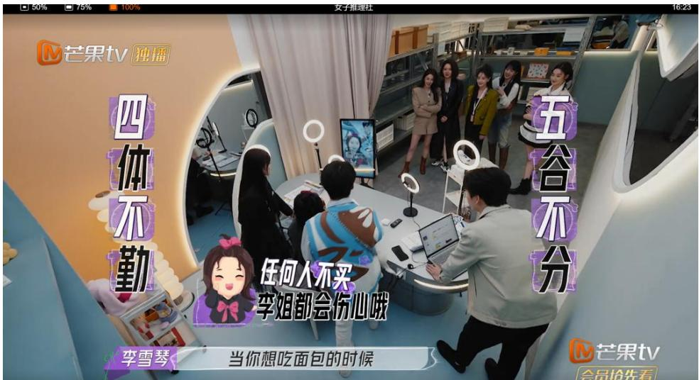  
图 2-1《女子推理社》中女性职场工作场景

场景会给观众带来强烈的视觉冲击，因而《女子推理社》拍摄时选择了有严密机关设置的1111新媒体公司，无人问津的暗室、“恐怖”的废旧医院，用这些带有神秘、恐怖色彩的环境衬托人物形象。例如，废旧医院大楼场景里，《女子推理社》嘉宾进入病房，破旧的床单和被褥、被废弃的医疗器械杂乱地摆放在桌子上、黑暗阴森的医院氛围，这些恐怖、冷清的场景与女性嘉宾温柔的面容与气质形成对比，带来直觉冲击，如图2-1、2-2，这样的职场场景符号“能指”在对比中折射出职场工作环境艰苦、充满困难的“所指”，同时也建构了职场女性外表温柔，内心勇敢、善良，乐观向上的性别形象。在以往以男性为主的侦探推理节目场景中，女性嘉宾多是被保护的对象，而《女子推理社》中的女性呈现了女性独有的气质，比如，勇敢、细心、善解人意、共情感强等特征，这也是对传统性别分工观念的挑战。

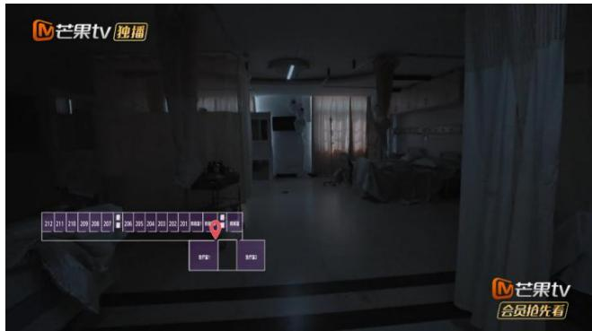  
图2-2废弃的医院大楼病房场景

2.2.3个体状态搭建沉浸式场景，展现人物混合性别气质

不论是在静态或动态情境下，人类的即时状况会和空间元素相互影响，一个人身边的环境信息通常丰富多样，然而每个人都只能选择对自己有吸引力的那一部分加以利用，这些被选中的信息揭示了他们当下行为的关键所在。

节目中好好好推理社的5位女性嘉宾在视频文本中呈现的身体符号，促进文本意义的传播。在新媒体场景中身体的“到场”与音乐、服饰、语言符号组合，促进媒介场景的持续生产、传播。①在“她综艺”《女子推理社》中，女性是表演主体，其塑造的女性形象成为传递信息的方式。女性嘉宾以精致的妆容、姣好的状态出现在镜头前，通过身体动作构建出鲜活、具体的女性形象。

表2-4《女子推理社》中受欢迎的女性形象多选题分析（Q14)  

<table><tr><td rowspan="2">项</td><td colspan="2">响应</td><td rowspan="2">普及率（n=324)</td></tr><tr><td>n</td><td>响应率</td></tr><tr><td>您最喜欢哪位/哪些嘉宾在节目中的表现？ (戚薇)</td><td>278</td><td>28.22%</td><td>85.80%</td></tr><tr><td>您最喜欢哪位/哪些嘉宾在节目中的表现？ (李一桐)</td><td>76</td><td>7.72%</td><td>23.46%</td></tr><tr><td>您最喜欢哪位/哪些嘉宾在节目中的表现？ (田曦薇)</td><td>240</td><td>24.37%</td><td>74.07%</td></tr><tr><td>您最喜欢哪位/哪些嘉宾在节目中的表现? (张雨绮)</td><td>101</td><td>10.25%</td><td>31.17%</td></tr><tr><td>您最喜欢哪位/哪些嘉宾在节目中的表现？ (张艺凡)</td><td>42</td><td>4.26%</td><td>12.96%</td></tr><tr><td>汇总</td><td>985</td><td>100%</td><td>304.01%</td></tr></table>

由表2-4可知，受访者对不同嘉宾的表现和喜好存在显著的差异。其中，戚薇以$2 8 . 2 2 \%$ 的响应率成为最受欢迎的嘉宾，得到观众广泛的喜爱。李雪琴以 $2 5 . 1 8 \%$ 的响应率也备受观众喜欢，田曦薇以 $2 4 . 3 7 \%$ 的响应率也获得了观众的认可。张雨绮、李一桐和张艺凡的响应率相对较低，分别为 $1 0 . 2 5 \%$ 、 $7 . 7 2 \%$ 和 $4 . 2 6 \%$ 。

节目中不一样的女性形象传递出不同的性别特征，因此，受众对于不同的性格特征喜爱程度也有所差别。

在以往的“她综艺”节目中，女性形象多以家庭、婚姻等传统社会性别分工特点为主题，少以女性自身能力为主展开。节目也常常刻画女性家庭为主的刻板性别气质，比如：家庭主妇、单亲妈妈、二婚女性等负面的女性性别气质，在这样的媒介环境下，加深传统女性刻板印象。而《女子推理社》借助女性嘉宾的侦探推理表演，展示了多元的人物身体符号，这些人物符号中流露了积极向上的女性性别气质。对样本中呈现的多元女性形象进行分类，女性形象在综艺中展现的身体符号分为六类。霸气外露型、乖巧可爱型、古灵精怪型、聪明能干型、乐观幽默型和“其他”类型。

表 2-5《女子推理社》呈现的女性角色多选题分析(Q16)  

<table><tr><td rowspan="2">项</td><td colspan="2">响应</td><td rowspan="2">普及率（n=324)</td></tr><tr><td>n</td><td>响应率</td></tr><tr><td>您认为她们呈现的哪种女性角色？(乖巧可爱型)</td><td>102</td><td>12.06%</td><td>31.48%</td></tr><tr><td>您认为她们呈现的哪种女性角色？ (霸气外露型)</td><td>150</td><td>17.73%</td><td>46.30%</td></tr><tr><td>您认为她们呈现的哪种女性角色？ (古灵精怪型)</td><td>135</td><td>15.96%</td><td>41.67%</td></tr><tr><td>您认为她们呈现的哪种女性角色？ (聪明能干型)</td><td>171</td><td>20.21%</td><td>52.78%</td></tr><tr><td>您认为她们呈现的哪种女性角色？ (乐观幽默型)</td><td>174</td><td>20.57%</td><td>53.70%</td></tr><tr><td>您认为她们呈现的哪种女性角色？(其他）</td><td>114</td><td>13.48%</td><td>35.19%</td></tr><tr><td>汇总</td><td>846</td><td>100%</td><td>261.11%</td></tr></table>

如表2-5中，聪明能干型和乐观幽默型的女性形象得到了更多观众认可，分别占据了 $2 0 . 2 1 \%$ 和 $2 0 . 5 7 \%$ 的响应率，普及率分别为 $5 2 . 7 8 \%$ 和 $5 3 . 7 0 \%$ 。这显示出观众欣赏在节目中展现智慧和幽默特质的女性形象。同时，霸气外露型的形象也得到了受众广泛的认可，其响应率为 $1 7 . 7 3 \%$ ，普及率为 $4 6 . 3 0 \%$ 。此外，乖巧可爱型和古灵精怪型女性形象也得到了一部分观众的认可，但并没有占据主导地位。最后，还有 $1 3 . 4 8 \%$ 的观众提到了“其他”类型的女性角色，其普及率为 $3 5 . 1 9 \%$ ，显示出观众对于女性形象的看法有一定的多样性。人物符号“能指”展现女性推理表演，丰富女性形象，传递给受众女性多元混合的人物形象的同时，使两性性别角色突破以往非此即彼的对立框架，是社会多元性别观点的“所指”体现。

父权制长期作为社会的基础机构，渗透在生活的方方面面，女性作为“第二性”被男性主导的社会文化规训着，而纵观中国社会古今对于女性的刻板印象也确实如此，女性感性缺乏理性，逻辑思维相较于男性更差，做事多凭借直觉，“女性与逻辑无关”就是父权制社会对女性的第一层建构。但实际上，女性推理能力并不比男性差，随着女性运动的发展与女性意识的不断提高，开始有女性加入到侦探推理行列当中，虽然此前国内悬疑推理综艺的嘉宾设置大多以男性为主，女性角色为辅。《女子推理社》以全女性阵容展开叙事，提供了更具共情的女性视角，为热爱悬疑推理的“她综艺”观众带来了耳目一新的体验。戚薇在节目中以较强的能力成功竞选成为直播部部长，李一桐、张雨绮在上班第一天自信大方展示才艺，田曦薇在节目中多次共情落泪，建构了外表与精神的“审美”形象，从而展露出幽默乐观、积极向上、意志坚定、拼搏奋进的性别气质。通过构建多元女性形象，像我们传递了推理并非男性的天然禀赋亦是女子独特的优势与魅力，侦探未必只有不断被小说、影视塑造的男性形象，《女子推理社》则重塑身份与性别的连接，一定程度上体现当代女性社会群像缩影，其中现实型职场女性刻画也为观众展现了更加真实、多元的现实女性形象。

节目中女性形象呈现不仅体现在公司和上班找线索的这些场景，在风景美好的郊外也有呈现，随着社会的发展，公司的企业文化也不断发展，111新媒体公司定期举办团建活动，展现了现代女性的新职场生活。团建场景中，春光无限欢乐野营的氛围与现场突发 NPC 钱多多的死亡形成对比，如图2-3，美好团建场景的“能指”体现了职场人对融洽工作氛围和场景的憧憬。好好好推理社成员听闻钱多多出事消息，马上赶去现场查明真相。传统性别分工中是男性带领大家冲在突发事件的前面，而女性处于被保护的地位，节目中女性带遇到突发事件带领大家冲在一线的“能指”，揭示女性种临危不惧、迎难而上精神的“所指”。

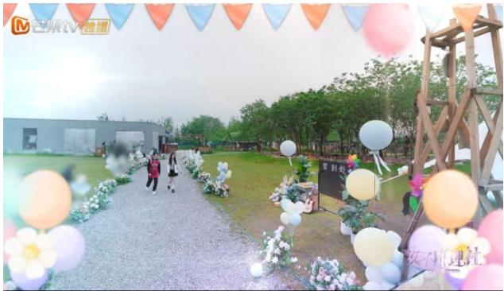  
图2-3团建场景

如表2-6受众对“解救三班岛”、“镜中迷镜”、“再见三班岛”最不感兴趣，对“十年悲歌”、“步步为迎”和“三连罪”的喜爱程度最高，展现出受众对于女性临危不惧、迎难而上的女性精神的喜爱。

# 表 2-6 节目中受众最喜欢的主题场景情况

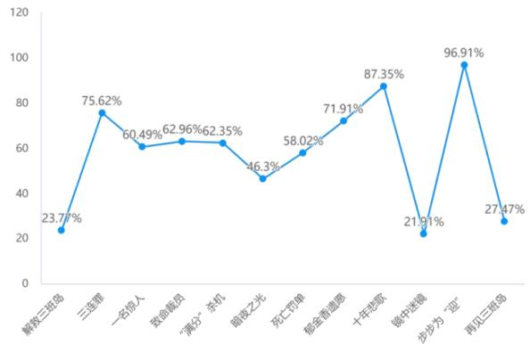

场景符号中不同的场景突出了不同的主题，从而让受众对女性嘉宾多元化的人物形象和性格成为关注的中心话题。比如推理团在监控室看伊美的U型枕上是谁放的桃毛时，通过监控室这个场景中监控的回放，女性嘉宾从最初感觉是伊美因为工作太累而自己放的桃子毛，再到化妆室里询问伊美监控看到这个人是谁了接下来怎么办，最终因为伊美的反应，女子推理社嘉宾认为不是伊美进而又回去监控室重新查看视频，并且通过细节观察到不是伊美本人放的桃子毛，推理团嘉宾又想办法通过头能不能碰到伞穗的方式区分伊美和桂香，推理团嘉宾综合办公室的聊天记录和视频回放验证，最终成功破案，调查出陷害伊美脸过敏的人是桂香。视觉的场景感知让受众身临其境，全身心投入情感的对应心理，受众的沉浸式推理体验可能更容易激发。通过在监控室场景的推理过程可以展现出女性嘉宾推理更加细致、观察地仔细，在直播间场景中，通过货物架上的伞穗想出“能不能碰到伞穗区分伊美和桂香”的办法不仅体现了女性嘉宾在推理时细腻，而且尽显女性智慧。

但“表现了什么，也就必然遮蔽了什么，即符号学意义上的表意必有离场”①。这种精心设计的场景展演实则使大众对真实生活中的自我感知迷失，具有一种“人为操控性、虚构性、欺骗性和盲目性的特征，尤其被用来指代消费文化时代的泛大众文化下各种虚假的视觉表征”②。

# 2.3 商业营销：满足受众心理和生理需求

# 2.3.1 消费狂欢：女性媒介形象的商品化、娱乐化

著作《神话修辞术》认为大众文化的行为模式与神话有许多共同点，如今图像对于主导话语的影响就如同过去神话和史诗的作用一样，向社会的各个阶层传递一致的价值观念。基于此特性，一些女性的形象在商业推销的目标中，其外貌特点与其商品功能密切相关，例如通过强调眼睛的部分来形成视觉焦点等等，以此方式建立自然的象征含义并采用柔和而隐蔽的方法去影响消费者的需求和消费倾向，所以销售者会把产品的性能及其效果用作一种符号代码后广泛地进行传播，进而提高消费者的购买意愿。

“她综艺”节目根据受众的审美诉求来制作和包装女性形象带来的身体商品和衍生商品，比如直观层面形成的霸气外露形象、乖巧可爱形象、古灵精怪形象、聪明能干形象、乐观幽默形象等均是身体商品化的包装，背后则是受众运用点击、观看购买女性嘉宾的身体商品。

《女子推理社》节目的赞助商豪士面包、首席合作伙伴美素佳儿源悦、喜之郎果冻，通过节目中女性嘉宾的使用而提高了这些品牌的知名度，扩大了其潜在消费者群体，比如田曦薇在节目中吃喜之郎果冻并夸赞好吃，弹幕中受众直呼：“看小田吃的好香，我也要买小田同款果冻。”贾静雯作为职场妈妈在节目中对美素佳儿源悦奶粉的推广介绍，使其也受到了很多受众的追捧。

同时，女性嘉宾们节目中的穿搭、使用的物品等也引发粉丝的效仿和追捧，从而带动相关产业的发展，创造更多的商业价值。比如小田的每日多巴胺甜妹儿穿搭，吸引了大量受众和粉丝购买，学习小田的每日甜妹穿搭，比如小红书和公众号推出的小田穿搭及商品品牌、价格，淘宝小田同款近万件的销售量（如图2-4）。

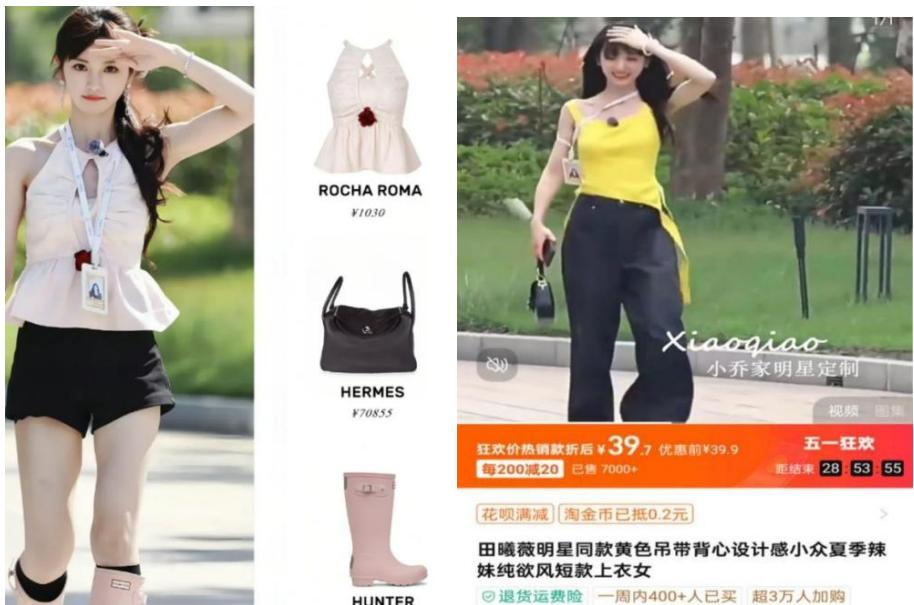  
图2-4小田同款穿搭

而节目制作方也会围绕明星效益进行精心策划和运作，打造各种衍生产品和活动，充分挖掘其潜在价值，实现经济效益和社会效益的双丰收。这种对粉丝经济和明星效益的有效利用，让《女子推理社》成为一档备受瞩目的综艺，为综艺市场的发展提供了有益的借鉴。

“媒介可以是充满乐趣的，这是因为它们在工作远重于休闲的社会背景下为人们提供了一个娱乐的天堂。①”在看过的《女子推理社》的324名受访者中，笔者调查了他们的获取信息的渠道，大多是为了休闲娱乐通过短视频等娱乐化平台获取到的节目信息。

表2-7获取相关信息渠道频数分析结果  

<table><tr><td>名称</td><td>选项</td><td>频数</td><td>百分比(%)</td><td>累积百分比(%)</td></tr><tr><td rowspan="6">您是通过以下哪个渠道了解到《女子推理社》相关信息的？</td><td>芒果TV</td><td>27</td><td>8.33</td><td>8.33</td></tr><tr><td>微博</td><td>74</td><td>22.84</td><td>31.17</td></tr><tr><td>Bilibili</td><td>65</td><td>20.06</td><td>51.23</td></tr><tr><td>抖音、快手等短视频平台</td><td>59</td><td>18.21</td><td>69.44</td></tr><tr><td>知乎、豆瓣、小红书等平</td><td>87</td><td>26.85</td><td>96.30</td></tr><tr><td>台 其他</td><td></td><td>3.70</td><td></td></tr><tr><td colspan="2">合计</td><td>12 324</td><td>100.0</td><td>100.00 100.0</td></tr></table>

结果显示， $8 . 3 3 \%$ 的受访者通过芒果TV了解到该节目；约 $2 2 . 8 4 \%$ 的观众通过微博了解到《女子推理社》；约 $2 0 . 0 6 \%$ 的观众通过Bilibili获取了相关信息；约 $1 8 . 2 1 \%$ 的观众通过抖音、快手等短视频平台了解到该节目；约 $2 6 . 8 5 \%$ 的观众通过知乎、豆瓣、小红书等社交平台获取了相关信息。这些平台通常用于讨论和评论，对于节目的话题讨论和推广也是非常有帮助的。可以看到节目对于受众的前期宣传方面做的比较好。

在娱乐节目里，人物设定往往是为了迎合观众视觉和心理的需求。网络盛宴不仅仅依赖于科技因素，还需要网民们持续地投入注意力。“她综艺”中的多元化的女性角色给观众提供了一个释放情绪的机会。透过这些不同类型的女性角色作为“反射器”，观众可以从中看见自身的映像并产生一定程度的情感共振。在这个“她综艺”的世界里，女性的身份呈现出多种形态：她们可能是坚强独立的工作母亲，也可能是一位温顺体贴的家庭主妇；他们也可以是女儿，或是恋人。每位观看者都能在这档节目中发现一些共同之处，从而获得内心的安抚。所有参与者(包括嘉宾、制作团队及观众)在此类节目中享有同等权利，观众可通过互联网向节目表达他们的看法与感受。这种双向互动的模式，满足了观众对被尊重的心理需求。

# 2.3.2 粉丝经济：利用明星效益挖掘“她综艺”市场潜力

笔者对节目中6名女性推理社成员年龄进行统计发现，戚薇39岁，张雨绮38岁、李一桐33岁、李雪琴28岁、田曦薇 26岁、张艺凡23岁。这就意味着，在节目中展示的年轻女性数量超过了中年女性。

对女性的年龄形象进行深入研究时，我们必须揭示其背后的含义。该节目选择了26岁以上的女性参与者，这与年轻人较低的年龄及缺乏大量粉丝的特点形成对比。这些明星有着丰富的演艺经验、高人气和广泛关注，这是他们“未播先红”的一个重要因素。从总体上看，她们的成名时间相对较久远，拥有了一定数量的粉丝支持。其中，年纪最小的张艺凡在微博上的粉丝量达到了374万人次；而较为年长的戚薇、张雨绮则分别拥有 4815.5万和1321.4万的粉丝；位于中年的李一桐、李雪琴、田曦薇各自拥有的微博粉丝量分别是1660.4万、822.4万、682.6万。虽然他们的粉丝总数并不多，且热度也并非最高，但是六位嘉宾都已经有了相当长时间的表演经历，并且积攒了大量的粉丝，因此他们在节目预告期就获得了高度的热议。通过邀请具有一定人气和粉丝基础的明星，节目在开播前就吸引了大量粉丝的关注。粉丝们会因为自己喜爱的明星参与而对节目充满期待，积极为节目进行宣传和推广，从而迅速扩大了节目影响力和传播范围。

随着互联网技术及社交媒体的发展，粉丝群体逐渐从明星圈层向IP 圈层、网红圈层、品牌圈层等其他圈层进攻，这也促进了电影票、演唱会门票及明星同款和明星周边的热销。粉丝经济形成了一个强大的商业力量，《女子推理社》的粉丝们通过自发组织、生产明星产品文化符号，以共同的符号，如《女子推理社》节目嘉宾为精神领袖，通过社交网络的自我表达和互动交流，粉丝群体参与节目文本的二次生产，为明星产品文化符号带来商业价值。比如该节目有微信粉丝群，粉丝可通过微博超话评论区加入微信群，在群中互相讨论《女子推理社》嘉宾在节目中的表现，对节目中的元文本进行二次生产，赋予其更高的文化和商业价值。这些群体有很强的归属感，他们在微博、抖音等媒体平台进行集体“反黑”、“刷数据”、“当水军”，同时产生一批流量大V，流量的产生也就产生了经济效益。

在“她综艺”节目中，强大的粉丝群体带来的强大的情感需求是粉丝经济的基础，但也出现了一些无论偶像代言的产品质量如何，都有一大批粉丝盲目跟风购买的问题，因此，在强大的粉丝经济下，应合理利用粉丝经济，主流媒体加强对饭圈文化的引导，偶像人物也要提升自己的能力和素质，积极承担社会责任，社会各个主体要加强监督和管理，确保粉丝群体在良性发展中发挥正能量。

笔者对外表、职场观、两性关系、女性推理认知四个维度进行了相关分析如下：

表 2-8外表、职场观、两性关系、女性推理认知Pearson 相关分析  

<table><tr><td></td><td>平均值</td><td>标准差</td><td>外表</td><td>职场观</td><td>两性关系</td><td>女性推理认知</td></tr><tr><td>外表</td><td>3.348</td><td>1.063</td><td>1</td><td></td><td></td><td></td></tr><tr><td>职场观</td><td>3.168</td><td>1.026</td><td>0.410**</td><td>1</td><td></td><td></td></tr><tr><td>两性关系</td><td>3.197</td><td>1.177</td><td>0.390**</td><td>0.604**</td><td>1</td><td></td></tr><tr><td>女性推理认知</td><td>3.127</td><td>1.213</td><td>0.427**</td><td>0.646**</td><td>0.666**</td><td>1</td></tr><tr><td>* p&lt;0.05 ** p&lt;0.01</td><td></td><td></td><td></td><td></td><td></td><td></td></tr></table>

外表和职场观的相关系数值为0.410,p值小于0.05，说明他们的相关系数值等于0,两者具有显著的正相关关系；外表和两性关系的相关系数值为0.390，p值小于0.05，说明他们的相关系数值等于0，两者具有显著的正相关关系；外表和女性推理认知的相关系数值为0.427，p值小于0.05，说明他们的相关系数值等于0，两者具有显著的正相关关系。

职场观和两性关系的相关系数值为0.604，p值小于0.05，说明他们的相关系数值等于0，两者具有显著的正相关关系；职场观和女性推理认知的相关系数值为0.646，p值小于0.05，说明他们的相关系数值等于0，两者具有显著的正相关关系；两性关系和女性推理认知的相关系数值为0.666，p值小于0.05，说明他们的相关系数值等于0，两者具有显著的正相关关系。

相关分析反应，受访者对于外表、职场观、两性关系和女性推理认知四个方面的的评价都是相互联系的，这样的结果可以用关环效应解释，晕轮效应是指在人们的交往过程中，对方某些特别显著的属性和品质可能会掩盖我们对其他属性和特性的准确认知。受访者对节目的喜爱会爱屋及乌，导致对其他方面的程度。

这些明星自带的话题度和流量，也使得节目在社交媒体等平台上引发广泛讨论，不断提升热度。他们在节目中的表现和互动，更是成为粉丝们津津乐道的内容，进一步推动了节目的火爆。因此，演员与其形象气质及流量、资本直接挂钩，与粉丝经济直接相关。

# 3“她综艺”《女子推理社》女性媒介形象神话主义建构

罗兰·巴特的“神话学”符号分析方法和传播学理论融合，带来新的女性形象解读。本节将从罗兰·巴特意指系统出发，对“她综艺”中女性形象的视听符号进行综合分析，探求媒介如何建构女性形象的女性主义神话的，以揭示隐藏于其背后的意识形态。

# 3.1 实在系统：“她综艺”女性形象的心理感知

运用罗兰·巴兰符号意指系统理论对“她综艺”《女子推理社》视频的视听符号进行综合分析后，可以看到社会性别意识贯穿“她综艺”《女子推理社》视频始终。女性媒介形象携带着巨大的性别意识形态，在潜移默化中将观点传入受众脑海中。日内瓦大学教授索绪尔(Ferdinand de Saussure）曾经在讲述普通语言学原理时指出，符号学(Semiotics）的组成多样，它可以被社会心理学所吸纳，也可以被普通心理学所借鉴，是一门专门探索社会生活中存在的符号生命的科学①。

罗兰·巴特意指符号系统中第一级实在系统能指与所指可以简单理解为对“物”的感知引起的基本心理。“她综艺”《女子推理社》视频综合运用上述服饰符号、身体符号的视觉符号和语言符号、配乐符号的听觉符号呈现女性形象。受众在初步观看“她综艺”《女子推理社》女性的视觉形象时，会产生一种原始的心理感知。

  
图3-1 女性嘉宾外貌及推理能力占比

本研究共设定包括性格好、侦探推理能力、身材好、穿搭时尚、颜值高、共情能力强和其他七类女性外貌及性格特征，由图3-1统计可发现女性在各类话题中， $6 0 . 4 9 \%$ 的女性图像以高颜值呈现出女性姣好的外貌特征， $2 1 . 6 \%$ 的女性出镜为性格好， $1 0 . 8 \%$ 和$1 1 . 7 3 \%$ 的女性以身材好和穿搭时尚出镜，并未在样本中发现故意扮丑的女性图像。节目中呈现的是比较多元的女性形象，有好的女性形象，也有坏的女性形象。并没有恶意丑化女性形象，而是相对全面的向大家展示了女性形象。

表 3-1 女性外形相关调查Cronbach 信度分析  

<table><tr><td>名称</td><td>校正项总计相关性 (CITC)</td><td>项已删除的α系数</td><td>Cronbach α系数</td></tr><tr><td>(女性外表)1</td><td>0.8</td><td>0.892</td><td rowspan="4">0.915</td></tr><tr><td>(女性外表)2</td><td>0.755</td><td>0.901</td></tr><tr><td>(女性外表)3</td><td>0.769</td><td>0.898</td></tr><tr><td>(女性外表)4</td><td>0.789</td><td>0.894</td></tr><tr><td>(女性外表)5</td><td>0.8</td><td>0.892</td><td></td></tr></table>

通过 Spss 的信度分析，可知：信度系数值为0.915，大于0.9，表明研究数据信度质量较高。“CITC值”中，分析项的CITC 值都大于0.4，表明分析项间有良好的相关关系，信度水平良好。综上，研究数据信度系数值高于0.9，说明数据信度质量高，可用于进一步分析。

表3-2描述分析  

<table><tr><td>题项</td><td>问题</td><td>均值</td><td>标准差</td><td>结果</td></tr><tr><td>Q24_1</td><td>女性嘉宾面容姣好、生活精致</td><td>3.389</td><td>1.294</td><td>趋于同意</td></tr><tr><td>Q24_2</td><td>女性嘉宾温柔大方、细腻体贴</td><td>3.343</td><td>1.168</td><td>趋于同意</td></tr><tr><td>Q24_3</td><td>女性嘉宾打扮时尚，富有个人魅力</td><td>3.438</td><td>1.177</td><td>趋于同意</td></tr><tr><td>Q24_4</td><td>女性嘉宾形象迎合男性审美、被男性喜欢</td><td>3.16</td><td>1.271</td><td>趋于同意</td></tr><tr><td>Q24_5</td><td>女性嘉宾穿着打扮不太适合一些推理任务， 穿着不宽松、不方便</td><td>3.41</td><td>1.24</td><td>趋于同意</td></tr><tr><td></td><td>女性外表</td><td>3.348</td><td>1.063</td><td>偏高</td></tr></table>

笔者将《女子推理社》女性外表分为五个方面，女性嘉宾容貌姣好、生活较精致；女性嘉宾性格温柔、体贴心细；女性嘉宾打扮时尚，富有个人魅力；女性嘉宾形象迎合男性审美、被男性喜欢；女性嘉宾穿着打扮不太适合一些推理任务，穿着不宽松、不方便。如表3-2中显示，《女子推理社》展现了多元女性形象，但对女性外形的塑造，基本表现为容貌姣好、生活较精致；性格温柔、体贴心细；打扮时尚，富有个人魅力；女性嘉宾形象迎合男性审美、被男性喜欢；穿着不宽松、不方便。对于女性外表多以精致、时尚、符合男性审美呈现，而没有以素颜出镜、宽松舒适着装出镜的女性嘉宾。

服饰符号中女性嘉宾有不同风格的服饰穿搭，例如戚薇和张雨绮在第一集出场时穿着酷讽“大姐”风的服饰，受众视觉感知后产生的是探寻女性穿搭色彩和风格对应人物性格的心理，受众被推理团嘉宾的穿搭所吸引，人们也会根据不同嘉宾的穿搭风格将这种服饰风格与相应的女性嘉宾密切联系起来，身体符号中女性嘉宾不同的“动作”“妆容”“体态”，也会带给受众不同的心理感知，例如，女性嘉宾在节目中以白皙的皮肤、优雅的体态出现在受众面前时，观众会产生一种比较喜悦、舒适的正向心理感知。受众被女性嘉宾姣好的面容和优雅的体态吸引，产生进一步想看下去的想法，而长期不断地接受经过媒介打造的女性形象，加深了受众的心理感受与这种女性形象的联系，形成心理感知。

听觉符号同样也会引起原始心理感知的产生，会引起观众产生声音所指向的心理，体会视频中女性的人物情绪。语言符号中女性嘉宾的音色、音律以及家乡口音，受众感知到声音的所指目标，引发强烈的情绪投入，产生不同的心理感受。例如，在节目里公交车上李雪琴与NPC 对话时李雪琴用东北腔问，“你也是东北那嘎达的？”，以及李雪琴和李一桐东北口音的对话，听觉感知将人与其声音对应起来，发声即可引起人们的好奇心理，吸引人们注意力指向人物，人物与声音密切联系在一起。配乐符号中的音乐韵律、声音音色，听觉感知联动身体的整体感知，受众产生沉浸式投入、情感调动的心理，那么这种音乐的产生可能会习惯性地将受众指向设定的推理氛围中，例如李仁丽过生日的时候大家让她许愿时温馨舒缓的背景音乐让大家身心也放松下来，而新媒体公司大楼突然断网使技术部人员被反锁在屋内的时候，背景音乐又变成急促的音律，推动受众的好奇心感知，吸引受众继续看下去接下来发生什么。

“她综艺”节目《女子推理社》将不同的视觉符号和听觉符号组合在一起，给观众留下了符合心理预期的正向心理感知和对事件发展方向不确定的好奇心理感知。在节目整体氛围下，观众逐渐沉浸其中，产生好奇心理，进一步产生了解“她综艺”《女子推理社》节目女性的欲望。

# 3.2直指系统：“她综艺”女性形象符号脱敏

第二级直指系统中符号携带其意义进行传播，性别形象中两性形象受到社会规范，比如男性是英勇的，而女性是多愁善感的。女性嘉宾视听符号形象的感知对应的诸如兴奋、满足等心理，在直指系统中上升为准确概念，并且颠覆了传统女性形象认知的概念。所指优势符号是明确传达意义的，而能指优势符号是带有文化、艺术的。①《女子推理社》节目通过语言、配乐、身体、服饰、场景符号所体现出的女性特点、女性气质，都可以明确传达相应的概念，作为女性形象符号的所指内容。

服饰符号里，例如，视觉形象上“酷飒”、“时尚”“可爱”“中性”的女性嘉宾在第二级直指系统中传达出现代女性“独立”、“自由”、“开放”、“自信”的概念。这种概念打破了传统性别文化中女性性别形象，颠覆了女性“家庭主妇”、“不自信”、“依赖感强”、“迎合男性审美”的刻板印象。不同穿搭风格的女性嘉宾在《女子推理社》节目中深受观众喜爱，体现了大众的多元审美，女性的美并不仅仅局限于符合男性的审美标准，它更多地体现在她们独特的个性、魅力和自我表达上。

表3-3“需要被保护型”和“独立自主型”女性形象调查频数分析结果  

<table><tr><td>名称</td><td>选项</td><td>频数</td><td>百分比(%)</td><td>累积百分比(%)</td></tr><tr><td rowspan="3">《女子推理社》中的&quot;需要被保护型&quot;和&quot;独立自主型&quot;两种，您更偏爱哪一种?</td><td>需要被保护型</td><td>38</td><td>11.73</td><td>11.73</td></tr><tr><td>独立自主型</td><td>215</td><td>66.36</td><td>78.09</td></tr><tr><td>都喜欢</td><td>71</td><td>21.91</td><td>100.00</td></tr></table>

根据表3-3可知，女性更加偏爱独立自主型的女性角色（ $6 6 . 3 6 \%$ ），说明在受访者眼中，独立的女性形象是他们希望看到的。媒介通过镜像生产真实，转变为符号上的真实，并作用于人们的意识真实。②大众对于节目中女性多元形象的喜爱，反映了其对于

女性形象态度的转变。

现在女性的劳动领域呈现了多样化趋势，《女子推理社》丰富了女性的职业角色，以往“她综艺”展现的女性扮演人生情感导师、家庭主妇的角色，本节目将女性在社会责任上的担当精神展示了出来，让受众看到了女性身份的多样性，她们可以是贤妻良母的家庭角色，也可以是独立上进的职业角色，女性的职业角色不再局限于传统性别分工的“女主内男主外”，在职业领域，女性有着无限可能。作为一档女性推理节目，《女子推理社》中呈现了女性嘉宾推理的各个环节。笔者将节目内容分为嘉宾沉浸式解谜、嘉宾的硬核推理手法、嘉宾对剧情的复盘还原、嘉宾烧脑破解谜题、嘉宾被惊吓的瞬间、嘉宾与NPC 的互动、嘉宾的个人魅力、嘉宾的搞笑片段和其他九个方面调查受众的喜爱情况。

表3-4受众关注节目内容的情况多选题分析 (Q15)  

<table><tr><td rowspan="2">项</td><td colspan="2">响应</td><td rowspan="2">普及率（n=324)</td></tr><tr><td>n</td><td>响应率</td></tr><tr><td>您更喜欢看嘉宾在节目中的哪些内容？ (嘉宾沉浸式解谜)</td><td>284</td><td>21.63%</td><td>87.65%</td></tr><tr><td>您更喜欢看嘉宾在节目中的哪些内容？ (嘉宾的硬核推理手法)</td><td>248</td><td>18.89%</td><td>76.54%</td></tr><tr><td>您更喜欢看嘉宾在节目中的哪些内容? (嘉宾对剧情的复盘还原)</td><td>203</td><td>15.46%</td><td>62.65%</td></tr><tr><td>您更喜欢看嘉宾在节目中的哪些内容？ (嘉宾烧脑破解谜题)</td><td>237</td><td>18.05%</td><td>73.15%</td></tr><tr><td>您更喜欢看嘉宾在节目中的哪些内容？ (嘉宾被惊吓的瞬间)</td><td>206</td><td>15.69%</td><td>63.58%</td></tr><tr><td>您更喜欢看嘉宾在节目中的哪些内容? (嘉宾与NPC 的互动)</td><td>16</td><td>1.22%</td><td>4.94%</td></tr><tr><td>您更喜欢看嘉宾在节目中的哪些内容? (嘉宾的个人魅力)</td><td>106</td><td>8.07%</td><td>32.72%</td></tr><tr><td>您更喜欢看嘉宾在节目中的哪些内容? (嘉宾的搞笑片段)</td><td>4</td><td>0.30%</td><td>1.23%</td></tr><tr><td>您更喜欢看嘉宾在节目中的哪些内容? (其他)</td><td>9</td><td>0.69%</td><td>2.78%</td></tr><tr><td>汇总</td><td>1313</td><td>100%</td><td>405.25%</td></tr></table>

由表3-4可知，受访者对嘉宾在节目中的不同表现内容有不同的偏好。其中，嘉宾的沉浸式解谜在观众中最受欢迎，占据了 $2 1 . 6 3 \%$ 的响应率，显示观众对于嘉宾的智力挑战和解谜能力有浓厚的兴趣。此外，嘉宾的硬核推理手法（ $1 8 . 8 9 \%$ ）以及嘉宾烧脑破解谜题（ $1 8 . 0 5 \%$ ）也备受欢迎，显示出观众对于嘉宾的推理能力和破解挑战感兴趣。另一方面，观众对于嘉宾的个人魅力（ $8 . 0 7 \%$ ）和嘉宾被惊吓的瞬间（ $1 5 . 6 9 \%$ ）也表现出

一定的兴趣，反映了娱乐性元素的吸引力。

在问卷调查中，笔者从五个方面来研究讨论“她综艺”中的工作能力，分别为，剧中呈现了女性比较理性的推理思维；剧中呈现了女性推理时独特的感性与共情能力；剧中呈现了女性积极上进、全身心投入工作的精神状态；剧中女性推理善于发现细节；剧中呈现了女性话语权多因自身努力而提升这四项。

表3-5女性推理认知相关调查Cronbach信度分析  

<table><tr><td>名称</td><td>校正项总计相关性 (CITC)</td><td>项已删除的α系数</td><td>Cronbachα系数</td></tr><tr><td>（女性推理认知）1</td><td>0.86</td><td>0.918</td><td rowspan="4">0.937</td></tr><tr><td>（女性推理认知）2</td><td>0.809</td><td>0.927</td></tr><tr><td>（女性推理认知）3</td><td>0.833</td><td>0.922</td></tr><tr><td>（女性推理认知）4</td><td>0.813</td><td>0.926</td></tr><tr><td>（女性推理认知）5</td><td>0.849</td><td>0.919</td><td></td></tr></table>

由上表可得，研究数据信度系数值高于0.9，说明数据信度质量高，可用于进一步分析。

表3-6节目中女性推理认知描述分析  

<table><tr><td>题项</td><td>问题</td><td>均值</td><td>标准差</td><td>结果</td></tr><tr><td>Q27_1</td><td>剧中呈现了女性比较理性的推理思维</td><td>3.207</td><td>1.486</td><td>趋于同意</td></tr><tr><td>Q27_2</td><td>剧中呈现了女性推理时独特的感性与共情能力</td><td>3.077</td><td>1.294</td><td>趋于同意</td></tr><tr><td>Q27_3</td><td>剧中呈现了女性积极上进、全身心投入工作的</td><td>3.096</td><td>1.349</td><td>趋于同意</td></tr><tr><td>Q27_4</td><td>精神状态 剧中女性推理善于发现细节</td><td>3.151</td><td>1.278</td><td>趋于同意</td></tr><tr><td>Q27_5</td><td>剧中呈现了女性话语权多因自身努力而提升</td><td>3.105</td><td>1.366</td><td>趋于同意</td></tr><tr><td></td><td>女性推理认知</td><td>3.127</td><td>1.213</td><td>偏高</td></tr></table>

表 3-6中调查结果显示受众对于女性工作能力、推理能力、工作和生活态度几乎都是趋于同意态度，认为女性在推理工作中有较积极乐观的态度和独特的推理能力。《女子推理社》视频中充分运用了女性嘉宾的推理侦探能力以表达自我的职业角色特征。通过嘉宾与NPC互动展现女性嘉宾的共情推理能力，通过嘉宾的烧脑破解谜题展现其高智商推理能力。

胡正荣教授在《传统媒体与新兴媒体融合的关键与路径》中谈到，“每个人的角色都是在特定时间、空间、情景、场合和需要中实现的，而围绕个体存在的这一切就是场景”。①实际上符号表意过程不会无限延续下去，符号发出者意图中期盼解释的理想暂止点称为“意图定点”，侦探推理类“她综艺”的目标受众是喜欢侦探推理节目、关注女性时尚的受众，上文的场景符号在新媒体公司的装饰、布局、整体风格等方面，营造出了“神秘”的氛围。场景符号中，通过对不同主题中女性形象的初感知，女性嘉宾的形象在第二层直指系统里也上升为明确传达的概念。节目中在夜晚公司大桥下，女子推理社嘉宾提着小灯在黑夜的场景中前行，互相加油打气，共同鼓励的能指，表达了女子推理社嘉宾“勇敢”、“团结”的女性气质，她们在黑暗的场景里冷静推理，通过墙上老爷爷画的图，逐步分析出程拉拉被埋的前因后果，展现了女性细心、勇敢、冷静的推理形象以及新时代独立、理性与感性并存的女性气质。正是在场景符号的传播下，将女性嘉宾的身体符号、语言符号与音乐符号结合起来呈现，女性嘉宾的形象特点明确起来，其符号意义表达也得以实现。

《女子推理社》中用符号表意的衍义，让人们看到某个符号就想到相关所指。为了让受众更倾向于选择所希望的符号，节目会设计一些意义更加明确、引人注目的指示符号，以便有效地将受众的注意力转移到特定的对象上。女性嘉宾的身体符号展现了明确的性别气质特征，女性嘉宾的动作、神态通过一定的对象展现，比如在道具间里，张艺凡将道具套在头上展现了活泼可爱的女性形象，通过精心塑造和呈现，受众对张艺凡可爱的形象特征和活泼的性格特点产生了更加深刻的印象。语言符号表达了鲜明的性格特征，李雪琴的东北口音成为李雪琴女性形象的标志性符号，从最初在公交车上用东北口音与 NPC 交流的瞬间，李雪琴就以其独特的幽默感和东北方言吸引了受众的注意。而在后续的推理环节中，她时不时冒出的东北味话语更是加深了这种印象，使受众对李雪琴的搞笑东北女学霸形象有了更明确的认知。

音乐符号在节目中扮演着至关重要的角色，它们通过巧妙的渲染与上述符号相结合，不仅丰富了视觉体验，更深入地表达了人物情感，直指人物性格特点。在展现李雪琴等女性角色的推理过程中，节目巧妙地运用了多次快节奏的背景音乐，这些音乐节奏紧凑、旋律激昂，成功地为推理场景营造出了紧张而激烈的氛围。随着音乐的起伏，观众能够感受到女性角色在面对复杂情况时的从容不迫和沉着冷静，这种音乐与画面的完美结合，不仅增强了节目的观赏性，也进一步突出了女性角色在推理过程中的智慧与魅力。通过音乐的渲染，节目成功地塑造了一个个生动的女性形象，她们在紧张刺激的推理过程中展现出了独特的性格特点，这些女性角色不再是传统意义上的弱者，而是智慧、勇敢、沉着的代表。

在新媒体时代，女性议题日益成为社会热点话题。《女子推理社》作为国内首部全女侦探推理综艺，无疑为新时代的女性气质形象描绘出了一幅生动的画卷。节目不仅传递了女性“自信”、“上进”等积极的精神概念，更通过真实的场景和角色塑造，将“她综艺”中的女性媒介形象立体化、多元化，有效地打破了传统刻板印象中对女性的束缚。在未来的“她综艺”发展中，女性媒介形象的塑造应更加紧密结合现实，反映真实能指。这意味着节目制作方需要关注社会各个阶层、不同背景的女性，而不仅仅局限于有知名度的女明星。通过展现这些普通女性的生活、工作、挑战和成长，可以更加真实地反映女性的多元面貌和内在力量。“她综艺”要树立女性符号标杆，这些标杆不仅代表着“自信”、“逻辑思维能力强”等身份属性，更是新时代女性的精神象征。这些符号标杆应该具备强大的感染力和号召力，能够激励更多的女性观众追求自我、实现梦想。通过所指概念的颠覆，进一步影响受众对女性群体的认识，在“她综艺”中，我们可以看到女性不再是被动的、依赖的，而是主动的、独立的。她们在追求梦想、面对挑战时展现出的坚韧和勇气，是对传统女性刻板印象的有力反击，这种颠覆不仅可以增强受众对女性的尊重和认可，促进社会性别观念的进步和发展。

随着新媒体的蓬勃发展，“她综艺”已成为一种独特而有力的文化现象，它在塑造和传播女性形象方面扮演着至关重要的角色。作为这一领域的重要参与者，“她综艺”应该肩负起传递正向女性媒介形象的责任，通过真实反映女性生活、树立女性符号标杆、颠覆传统观念等方式推动社会性别平等和女性发展。

总的来说，在《女子推理社》中的女性媒介形象是新时代新媒介形象，但在“她综艺”节目中也受到资本裹挟、消费主义等影响女性性别形象表达。我们可以更深入地挖掘并展现女性形象的底层逻辑，呈现一个更加全面、立体的女性形象，而尽量少被资本裹挟影响，真正让受众对传统女性刻板形象脱敏，让受众对新时代积极女性形象的能指所指形成概念联想。“她综艺”节目巧妙地传递出逻辑推理的思维方式，这样的场景设置巧妙地将女性与“感情用事”的标签分离，转而聚焦于展现女性的理智和客观判断。这样的内容转变，旨在打破传统大众对女性“靠感觉”的刻板印象，呈现女性更为全面和多元的形象。随着文化的不断演变，越来越多的节目开始积极提出提升女性主体地位的新议题，并努力淡化女性符号的敏感性。在这一过程中，“她综艺”节目作为其中的佼佼者，其象征符号的含义也在不断扩展和深化，从而促使人们对涉及女性性别符号的“敏感”身份产生更为包容和客观的看法，这种转变不仅有助于打破传统的性别刻板印象，也进一步推动了社会对女性地位和角色的重新认识和尊重。

# 3.3 涵指系统：丰富“她综艺”女性形象内涵

涵指系统即神话系统，如下是罗兰·巴特中《神话》的符号模式图。第二级系统中产生神话，神话能指即第一级符号：语言系统。语言系统本身携带意义，成为神话的能指，再指向新的所指意义，进而形成新的意识形态并使之大众化。

神话大众化即受众潜移默化受统治阶级意识形态影响并使之流行，最终成为大众文化。神话的能指与所指的联系使大众看到某个对象就能明确联想其概念，让原本混沌的社会变得有规则有秩序。

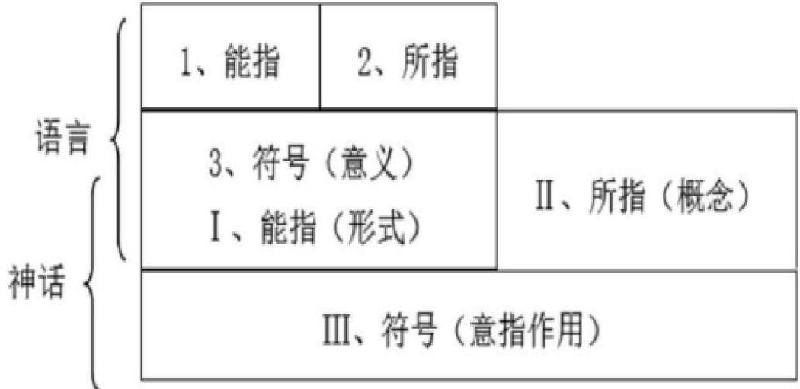  
图3-2符号模式图

# 3.3.1传递职场中独特的女性气质形象

“性别”作为网络中关注的热点，随着女性自我意识不断提升，重写女性关于自我的定义。在语言系统中，“她综艺”女性这一符号所表达的意义是多才多艺的女性群体、传统的以家庭为主的女性群体，主要围绕女性婚姻、感情生活、孩子展开。《女子推理社》所展现的女性符号，精准地传达了推理思维强大的职场女性群体的独特魅力，她们在“她综艺”中呈现的形象符合所指不同概念的女性形象，比如，那些既漂亮又自信的女性、展现卓越领导力的女性，以及既幽默又保持谦虚态度的女性，这些形象共同体现了当代女性的多元魅力和独特价值。在综艺节目中，女性话题丰富到了社会各个方面，任何象征符号必须能指代到具体对象或情景，否则就没有使用价值，一个富有内涵的象征符号必须经过符号使用者实践与某些客体联系，形成广泛认可的惯例①。

笔者通过设定里克特量表，让调查对象根据自己收看的《女子推理社》中的职场情境进行打分，问卷中设置了六个打分项：

表 3-7女性职场相关调查Cronbach信度分析  

<table><tr><td>名称</td><td>校正项总计相关性 (CITC)</td><td>项已删除的α系数</td><td>Cronbachα系数</td></tr><tr><td>（职场观）1</td><td>0.811</td><td>0.902</td><td rowspan="4">0.921</td></tr><tr><td>（职场观）2</td><td>0.765</td><td>0.908</td></tr><tr><td>（职场观）3</td><td>0.804</td><td>0.903</td></tr><tr><td>（职场观）4</td><td>0.669</td><td>0.921</td></tr><tr><td>（职场观）5</td><td>0.802</td><td>0.903</td><td></td></tr><tr><td>（职场观）6</td><td>0.797</td><td>0.904</td><td></td></tr></table>

由上表可知，研究数据信度系数值高于0.9，说明数据信度质量高，可用于进一步分析。

表3-8描述分析  

<table><tr><td>题项</td><td>问题</td><td>均值</td><td>标准差</td><td>结果</td></tr><tr><td>Q25_1</td><td>剧中呈现的职场情境非常的理想化</td><td>3.278</td><td>1.27</td><td>趋于同意</td></tr><tr><td>Q25_2</td><td>剧中女性多元化的职业为我树立了职业选择的理 想典范</td><td>3.213</td><td>1.127</td><td>趋于同意</td></tr><tr><td>Q25_3</td><td>剧中部分女性在职场中有较强的领导能力</td><td>3.111</td><td>1.217</td><td>趋于同意</td></tr><tr><td>Q25_4</td><td>剧中女性在职场中大多处于弱势地位</td><td>3.191</td><td>1.201</td><td>趋于同意</td></tr><tr><td>Q25_5</td><td>剧中的职场困境现实中我也听说过或遇到过</td><td>3.123</td><td>1.21</td><td>趋于同意</td></tr><tr><td>Q25_6</td><td>剧中职场困境的解决办法对我很有帮助</td><td>3.09</td><td>1.242</td><td>趋于同意</td></tr><tr><td></td><td>职场观</td><td>3.168</td><td>1.026</td><td>偏高</td></tr></table>

根据表3-8中的调查结果，可以发现观众对于节目中的职场情境几乎都是持趋于同意的态度，节目中的职场情境过于悬浮，不切实际，但是不少观众却将现实中的职场对标于剧中的职场环境。“她综艺”中的职场情境理想化，为观众创造很多职场模板，不仅会影响观众的职场观，还会影响观众在现实生活中的职场判断选择。在节目中，我们相对顺利地完成了任务，但现实生活往往充满了更多的未知与挑战，当观众回归现实后，很容易因面对这些挑战而产生自我怀疑，迷失自我。

表 3-9 KMO 和 Bartlett 的检验  

<table><tr><td>KMO值</td><td></td><td>0.947</td></tr><tr><td></td><td>近似卡方</td><td>5253.237</td></tr><tr><td>Bartlett 球形度检验</td><td>df</td><td>190</td></tr><tr><td></td><td>p值</td><td>0.000</td></tr></table>

使用探索因子分析进行效度验证，如上表所示，KMO为0.947，本次收集的数据可用于因子分析研究。Bartlett 球形度检验的p值小于0.05，收集的问卷数据可进行因子分析。

《女子推理社》节目以女性群体为主角，通过女性推理表演的形式，深刻表达其创作主旨，旨在服务女性群体，并进一步提升女性在社会中的地位和影响力。沈奕斐在《被建构的女性》中提到，在传统观念中，如果谈到女性，我们往往认为她应是温柔体贴、擅长做家务的，女性应当具有感情、关怀、爱、同情、温柔和服从的特点。①但是随着女性社会地位不断提升，社会对女性的认知有所改变，媒介塑造女性形象时也相应调整，打造出了一系列传递平等性别观念、符合社会潮流的女性形象。

受访者对于《女子推理社》中女性嘉宾的印象，充分展现了女性气质的多样性和丰富性，包括勇敢果断、精致优秀、温柔细腻、团结合作、能力出众、强势主动、面容姣好、独立思考、乐观阳光等。具体的分析情况如下：

表3-10《女子推理社》呈现的女性气质特征多选题分析（(Q21)  

<table><tr><td rowspan="2">项</td><td colspan="2">响应</td><td rowspan="2">普及率(n=324)</td></tr><tr><td>n</td><td>响应率</td></tr><tr><td>在您的印象中，节目主要体现了女性嘉宾什么样的女性气质？ (勇敢果断)</td><td>245</td><td>11.25%</td><td>75.62%</td></tr><tr><td>在您的印象中，节目主要体现了女性嘉宾什么样的女性气质？ (精致优秀)</td><td>283</td><td>12.99%</td><td>87.35%</td></tr><tr><td>在您的印象中，节目主要体现了女性嘉宾什么样的女性气质？ (温柔细腻)</td><td>224</td><td>10.28%</td><td>69.14%</td></tr><tr><td>在您的印象中，节目主要体现了女性嘉宾什么样的女性气质？ (团结合作)</td><td>226</td><td>10.38%</td><td>69.75%</td></tr><tr><td>在您的印象中，节目主要体现了女性嘉宾什么样的女性气质？ (能力出众)</td><td>212</td><td>9.73%</td><td>65.43%</td></tr><tr><td>在您的印象中，节目主要体现了女性嘉宾什么样的女性气质？ (强势主动)</td><td>277</td><td>12.72%</td><td>85.49%</td></tr><tr><td>在您的印象中，节目主要体现了女性嘉宾什么样的女性气质？ (软弱被动)</td><td>40</td><td>1.84%</td><td>12.35%</td></tr><tr><td>在您的印象中，节目主要体现了女性嘉宾什么样的女性气质？ (面容姣好)</td><td>205</td><td>9.41%</td><td>63.27%</td></tr><tr><td>在您的印象中，节目主要体现了女性嘉宾什么样的女性气质？ (独立思考)</td><td>241</td><td>11.07%</td><td>74.38%</td></tr><tr><td>在您的印象中，节目主要体现了女性嘉宾什么样的女性气质？ (乐观阳光)</td><td>214</td><td>9.83%</td><td>66.05%</td></tr><tr><td>在您的印象中，节目主要体现了女性嘉宾什么样的女性气质？(其他）</td><td>11</td><td>0.51%</td><td>3.40%</td></tr><tr><td>汇总</td><td>2178</td><td>100%</td><td>672.22%</td></tr></table>

通过响应率和普及率的分析，我们可以看出受访者最认同的女性气质是“强势主动”,占据了 $1 2 . 7 2 \%$ 的响应率和 $8 5 . 4 9 \%$ 的普及率，这表明观众对于女性嘉宾展现出的坚定、积极的特质给予了高度评价；其次是“精致优秀”，占据了 $1 2 . 9 9 \%$ 的响应率和 $8 7 . 3 5 \%$ 的普及率，显示观众关注女性嘉宾的卓越表现和品味；其他女性气质如“勇敢果断”和“温柔细腻”也获得了相对高的认同。然而，“软弱被动”则在普及率和响应率上较低，仅为 $1 . 8 4 \%$ 和 $1 2 . 3 5 \%$ 。最后，有少数观众提到了“其他”女性气质。

传统父权观念认为女性必须是家庭妇女的角色。①父权社会里男性被赋予积极的主导角色，而女性是其附属品。“她综艺”《女子推理社》节目为女性提供了一个展示自我的舞台，并赋予了她们更多获得经济独立的机会。在节目中，女性嘉宾们自信地迎接新挑战，积极乐观地面对各种困难，她们总是勇敢地冲在前面，展现出与刻板印象中那种扭捏、依赖他人的女性形象截然不同的风采。比如在解救刘迎迎的环节中，李雪琴临危不惧，冷静地破解了锁住刘迎迎的门的密码。同时，张艺凡和张雨绮毫不犹豫地冲在前面，勇敢地为刘迎迎取药。推理社成员们在面临困难时都展现出了极大的勇气和机智，临危不惧，巧妙地解决了问题。而在另一个关键场景中，当推理社成员们获得莫依来系统时，五位女性果断地决定将其初始化，这一行动不仅体现了她们在工作中的主见，更展现了她们主动实施、勇敢果断的气质。这些瞬间都充分证明了女性在社会中的能力和价值，她们是真正的智慧和力量的代表。

在“她综艺”节目中，女性成为了核心焦点，她们颠覆了传统的性别气质形象，向受众传递出一个全新的性别观念：“女性同样拥有理想抱负，她们立志成就大事，也能成为领军人物，干出一番崭新的事业。”这种观念的传播，不仅提升了女性的社会地位，也为社会的进步和发展注入了新的活力。

在社会文化性别观念中，大众往往习惯性地认为男性逻辑感强，而女性则更多地依赖直觉进行判断。然而，《女子推理社》这档节目却成功地打破了这一传统观念，展现了女性在推理破案中的认真专业态度以及强大的推理能力。在具干净杀死简三连的案件中，女性嘉宾们共同回忆并复盘了现场痕迹，通过模拟作案过程，成功揭示了具干净的犯罪手法，并顺利破案。整个过程中，她们展现出了细致入微的观察力、严谨的逻辑思维能力以及出色的团队合作精神。相比之下，节目中男性优越的气质并未得到彰显，反而更加衬托出了女性嘉宾在推理方面的卓越能力。

# 3.3.2塑造新时代反传统的女性形象

在“她综艺”的媒介呈现中，女性形象的意义得到了深刻的延伸和拓展。这些女性形象不仅仅停留在表象层面，更传递了新的社会性别价值观，从而创造了“她综艺”女性形象的神话。

与以往男性霸权为主、女性边缘为辅的性别气质形象截然不同，“她综艺”展现了一系列新颖的女性形象，让受众看到了女性形象的多面性和丰富性，从而打破了他们对女性形象的固有认知。

同时，这些女性形象也挑战了传统性别文化和父权制思想，通过其独特的符号意义颠覆了传统的性别观念。在“她综艺”中，女性形象通过能指的作用突破了传统观念的束缚，形成了新的意义。

她们不仅是美丽的，更是具有领导力和决策能力的；她们可以是温柔体贴的，也可以是坚韧不拔的。这些女性媒介形象丰富了受众的感官体验，在扩大女性形象内涵的同时，也塑造了对传统性别文化规范进行反叛的神话。

表 3-11 两性关系相关调查Cronbach信度分析  

<table><tr><td>名称</td><td>校正项总计相关性 (CITC)</td><td>项已删除的α系数</td><td>Cronbach α系数</td></tr><tr><td>（两性关系）1</td><td>0.797</td><td>0.882</td><td rowspan="4">0.909</td></tr><tr><td>（两性关系）2</td><td>0.77</td><td>0.892</td></tr><tr><td>（两性关系）3</td><td>0.81</td><td>0.878</td></tr><tr><td>（两性关系）4</td><td>0.805</td><td>0.879</td></tr></table>

由上表可得：研究数据信度系数值高于0.9，说明数据信度质量高，可用于进一步分析。

表3-12描述分析  

<table><tr><td>题项</td><td>问题</td><td>均值</td><td>标准差</td><td>结果</td></tr><tr><td>Q26_1</td><td>剧中男性和女性互帮互助，共同进步，是一个和谐 的整体</td><td>3.315</td><td>1.381</td><td>趋于同意</td></tr><tr><td>Q26_2</td><td>剧中女性遇到麻烦时大多是自己解决</td><td>3.185</td><td>1.248</td><td>趋于同意</td></tr><tr><td>Q26_3</td><td>剧中大多时候是女性帮助女性，女性群体共同攻克</td><td>3.13</td><td>1.336</td><td>趋于同意</td></tr><tr><td>Q26_4</td><td>难关 剧中女性处于危险时，部分男性会伸出援手</td><td>3.157</td><td>1.339</td><td>趋于同意</td></tr><tr><td></td><td>两性关系</td><td>3.197</td><td>1.177</td><td>偏高</td></tr></table>

笔者针对“她综艺”对两性关系的影响，通过问卷星进行问卷发放，并回收问卷。回收样本共351份其中有效样本324份，问卷中将女性互帮互助、男性和女性互帮互助、女性遇到困难首先会自己解决、男性会对女性伸出援助之手，都作为了两性关系的参考标准，如图3-12中的调查结果显示，该调查结果整体的平均分是3.197分，这表明长期收看“她综艺”对两性关系有一定程度的影响。

表3-13方差解释率表格  

<table><tr><td colspan="1" rowspan="2">因子编号</td><td colspan="3" rowspan="1">特征根</td><td colspan="3" rowspan="1">旋转前方差解释率</td><td colspan="3" rowspan="1">旋转后方差解释率</td></tr><tr><td colspan="1" rowspan="1">特征根</td><td colspan="1" rowspan="1">方差解释率%</td><td colspan="1" rowspan="1">累积%</td><td colspan="1" rowspan="1">特征根</td><td colspan="1" rowspan="1">方差解释率%</td><td colspan="1" rowspan="1">累积%</td><td colspan="1" rowspan="1">特征根</td><td colspan="1" rowspan="1">方差解释率%</td><td colspan="1" rowspan="1">累积%</td></tr><tr><td colspan="1" rowspan="1">1</td><td colspan="1" rowspan="1">9.945</td><td colspan="1" rowspan="1">49.727</td><td colspan="1" rowspan="1">49.727</td><td colspan="1" rowspan="1">9.945</td><td colspan="1" rowspan="1">49.727</td><td colspan="1" rowspan="1">49.727</td><td colspan="1" rowspan="1">4.362</td><td colspan="1" rowspan="1">21.809</td><td colspan="1" rowspan="1">21.809</td></tr><tr><td colspan="1" rowspan="1">2</td><td colspan="1" rowspan="1">2.571</td><td colspan="1" rowspan="1">12.856</td><td colspan="1" rowspan="1">62.583</td><td colspan="1" rowspan="1">2.571</td><td colspan="1" rowspan="1">12.856</td><td colspan="1" rowspan="1">62.583</td><td colspan="1" rowspan="1">3.976</td><td colspan="1" rowspan="1">19.88</td><td colspan="1" rowspan="1">41.689</td></tr><tr><td colspan="1" rowspan="1">3</td><td colspan="1" rowspan="1">1.614</td><td colspan="1" rowspan="1">8.072</td><td colspan="1" rowspan="1">70.655</td><td colspan="1" rowspan="1">1.614</td><td colspan="1" rowspan="1">8.072</td><td colspan="1" rowspan="1">70.655</td><td colspan="1" rowspan="1">3.858</td><td colspan="1" rowspan="1">19.289</td><td colspan="1" rowspan="1">60.979</td></tr><tr><td colspan="1" rowspan="1">4</td><td colspan="1" rowspan="1">1.225</td><td colspan="1" rowspan="1">6.127</td><td colspan="1" rowspan="1">76.783</td><td colspan="1" rowspan="1">1.225</td><td colspan="1" rowspan="1">6.127</td><td colspan="1" rowspan="1">76.783</td><td colspan="1" rowspan="1">3.161</td><td colspan="1" rowspan="1">15.804</td><td colspan="1" rowspan="1">76.783</td></tr><tr><td colspan="1" rowspan="1">5</td><td colspan="1" rowspan="1">0.507</td><td colspan="1" rowspan="1">2.533</td><td colspan="1" rowspan="1">79.316</td><td colspan="1" rowspan="1">-</td><td colspan="1" rowspan="1"></td><td colspan="1" rowspan="1"></td><td colspan="1" rowspan="1">-</td><td colspan="1" rowspan="1"></td><td colspan="1" rowspan="1">=</td></tr><tr><td colspan="1" rowspan="1">6</td><td colspan="1" rowspan="1">0.425</td><td colspan="1" rowspan="1">2.123</td><td colspan="1" rowspan="1">81.438</td><td colspan="1" rowspan="1">=</td><td colspan="1" rowspan="1"></td><td colspan="1" rowspan="1">=</td><td colspan="1" rowspan="1"></td><td colspan="1" rowspan="1"></td><td colspan="1" rowspan="1"></td></tr><tr><td colspan="1" rowspan="1">7</td><td colspan="1" rowspan="1">0.386</td><td colspan="1" rowspan="1">1.932</td><td colspan="1" rowspan="1">83.37</td><td colspan="1" rowspan="1">-</td><td colspan="1" rowspan="1"></td><td colspan="1" rowspan="1"></td><td colspan="1" rowspan="1">■</td><td colspan="1" rowspan="1"></td><td colspan="1" rowspan="1"></td></tr><tr><td>8</td><td>0.358</td><td>1.791</td><td>85.161</td><td></td><td></td><td></td><td></td><td></td><td></td></tr><tr><td>9</td><td>0.334</td><td>1.669</td><td>86.829</td><td></td><td></td><td></td><td></td><td></td><td></td></tr><tr><td>10</td><td>0.32</td><td>1.6</td><td>88.429</td><td></td><td></td><td></td><td></td><td></td><td></td></tr><tr><td>11</td><td>0.297</td><td>1.487</td><td>89.916</td><td></td><td></td><td></td><td></td><td></td><td></td></tr><tr><td>12</td><td>0.275</td><td>1.375</td><td>91.291</td><td></td><td></td><td></td><td></td><td></td><td></td></tr><tr><td>13</td><td>0.266</td><td>1.33</td><td>92.622</td><td></td><td></td><td></td><td></td><td></td><td></td></tr><tr><td>14</td><td>0.255</td><td>1.276</td><td>93.897</td><td></td><td></td><td></td><td></td><td></td><td></td></tr><tr><td>15</td><td>0.251</td><td>1.253</td><td>95.15</td><td></td><td></td><td></td><td></td><td></td><td></td></tr><tr><td>16</td><td>0.225</td><td>1.124</td><td>96.274</td><td></td><td></td><td></td><td></td><td></td><td></td></tr><tr><td>17</td><td>0.215</td><td>1.075</td><td>97.348</td><td></td><td></td><td></td><td></td><td></td><td></td></tr><tr><td>18</td><td>0.201</td><td>1.003</td><td>98.351</td><td></td><td></td><td></td><td></td><td></td><td></td></tr><tr><td>19</td><td>0.174</td><td>0.87</td><td>99.221</td><td></td><td></td><td></td><td></td><td></td><td></td></tr><tr><td>20</td><td>0.156</td><td>0.779</td><td>100</td><td></td><td></td><td></td><td></td><td></td><td></td></tr></table>

由上表可知，因子分析共提取出的4个因子特征根值大于1（提取标准为固定提取问卷维度数相应个数的因子),这4个因子的旋转后方差解释率分别为 $2 1 . 8 0 9 \% . 1 9 . 8 8 \%$ 、$1 9 . 2 8 9 \%$ 、 $1 5 . 8 0 4 \%$ ，这些因子的旋转后累积方差解释率是 $7 6 . 7 8 3 \%$ 。因子数量与问卷维度数量相同，问卷结构与数据结果有一定契合度。

表3-14旋转后因子载荷系数表格  

<table><tr><td rowspan="2">名称</td><td colspan="4">因子载荷系数</td><td rowspan="2">共同度 (公因子方差)</td></tr><tr><td>因子1</td><td>因子2</td><td>因子3</td><td>因子4</td></tr><tr><td>(女性外表)—1、女性嘉宾面容姣好、生活精致)</td><td>0.077</td><td>0.082</td><td>0.874</td><td>0.09</td><td>0.784</td></tr><tr><td>(2、女性嘉宾温柔大方、细腻体贴)</td><td>0.144</td><td>0.185</td><td>0.809</td><td>0.075</td><td>0.715</td></tr><tr><td>(女性外表)(3、女性嘉宾穿着时尚，充满个人魅力)</td><td>0.159</td><td>0.15</td><td>0.814</td><td>0.131</td><td>0.728</td></tr><tr><td>(女性外表)(4、女性嘉宾形象符合男性审美、受男性喜欢)</td><td>0.25</td><td>0.072</td><td>0.821</td><td>0.168</td><td>0.77</td></tr><tr><td rowspan="2">名称</td><td colspan="3">因子载荷系数</td><td colspan="2">共同度</td></tr><tr><td>因子1</td><td>因子2</td><td>因子3</td><td>因子4 (公因子方差)</td><td colspan="1"></td></tr><tr><td>(女性外表)(5、女性嘉宾穿着打扮不太适合一些推理任务，穿着不宽松、不方便)</td><td>0.117</td><td>0.224</td><td>0.834</td><td>0.116</td><td>0.774</td></tr><tr><td>(职场观）—1、剧中呈现的职场情境非常的理想化)</td><td>0.845</td><td>0.141</td><td>0.123</td><td>0.205</td><td>0.791</td></tr><tr><td>(职场观）(2、剧中女性多元化的职业为我树立了职业选择的理想典范)</td><td>0.774</td><td>0.189</td><td>0.189</td><td>0.206</td><td>0.713</td></tr><tr><td>(职场观）(3、剧中部分女性在职场中有较强的领导能力)</td><td>0.747</td><td>0.365</td><td>0.161</td><td>0.207</td><td>0.76</td></tr><tr><td>（职场观）(4、剧中女性在职场中有较平等的职场地位)</td><td>0.738</td><td>0.214</td><td>0.159</td><td>0.05</td><td>0.618</td></tr><tr><td>(职场观）(5、剧中的职场困境现实中我也听说过或遇到过)</td><td>0.734</td><td>0.33</td><td>0.153</td><td>0.282</td><td>0.75</td></tr><tr><td>(职场观）(6、剧中职场困境的解决办法对我很有帮助)</td><td>0.764</td><td>0.234</td><td>0.137</td><td>0.304</td><td>0.75</td></tr><tr><td>（两性关系）—1、剧中男性和女性互帮互助，共同</td><td>0.189</td><td>0.208</td><td>0.11</td><td>0.858</td><td>0.827</td></tr><tr><td>(两性关系）(2、剧中女性遇到麻烦时大多是自己解决)</td><td>0.255</td><td>0.255</td><td>0.132</td><td>0.782</td><td>0.76</td></tr><tr><td>（两性关系）(3、剧中大多时候是女性帮助女性，女性群体共同攻克难关)</td><td>0.254</td><td>0.371</td><td>0.192</td><td>0.746</td><td>0.795</td></tr><tr><td>（两性关系）(4、剧中女性处于危险时，部分男性会伸出援手)</td><td>0.323</td><td>0.331</td><td>0.189</td><td>0.737</td><td>0.792</td></tr><tr><td>(女性推理认知）一1、剧中呈现了女性比较理性的推理思维)</td><td>0.205</td><td>0.861</td><td>0.137</td><td>0.217</td><td>0.85</td></tr><tr><td>(女性推理认知）(2、剧中呈现了女性推理时独特的感性与共情能力)</td><td>0.201</td><td>0.781</td><td>0.181</td><td>0.323</td><td>0.788</td></tr><tr><td>(女性推理认知）(3、剧中呈现了女性积极上进、全身心投入工作的精神状态)</td><td>0.31</td><td>0.763</td><td>0.194</td><td>0.284</td><td>0.797</td></tr><tr><td>（女性推理认知）(4、剧中女性推理善于发现细节)</td><td>0.355</td><td>0.753</td><td>0.177</td><td>0.227</td><td>0.775</td></tr><tr><td>(女性推理认知）(5、剧中呈现了女性话语权多因自身努力而提升)</td><td>0.349</td><td>0.776</td><td>0.199</td><td>0.236</td><td>0.819</td></tr></table>

旋转方法：最大方差法Varimax。

运用最大方差旋转方法（varimax）对因子分析结果进行旋转，题项和因子间的对应与预先理论预期一致，问卷具有良好的结构效度。

阿尔温·托夫勒在《第三次浪潮》中说，在信息碎片化传播时代，需要一个象征整合碎片信息，避免陷入单一维度，女明星成为连接这两者的媒介。“她综艺”节目精心打造的偶像象征，旨在深度满足受众的情感需求，让受众对推理社的女性嘉宾产生深厚的依恋感和精神依托，进而稳固并深化对她们的崇拜关系。这种现象是女性形象符号和神化机制在传播中的整合效果，意指与所指共同形成“她综艺”女性形象神话机制。

# 4“她综艺”《女子推理社》女性媒介形象价值表达分析

“她综艺”节目是传递女性价值的重要媒介，《女子推理社》节目以独特的侦探推理视角挖掘女性主体意义，成功地在多元性别话语中找到了平衡，促进了社会性别文化的健康发展。

《女子推理社》作为芒果TV全网独播的“她综艺”，其深远影响在于受众的接纳与积极互动。只有真正获得受众的共鸣与参与，才能产生罗兰·巴尔特的“神话”意义。

通过对《女子推理社》这一“她综艺”节目的深入研究，笔者对十六位受众进行了深度访谈，并收集到了324位受众的有效调查问卷。这些反馈帮助我们概括了“她综艺”节目对受众的影响，不仅体现了节目在推动两性和谐发展方面的积极作用，还展示了其重建女性能力认知、关注普通女性困境以及提升女性精神意义的重要价值。

# 4.1 宣扬性别平等理念：打造和谐的社会两性关系

我国传统社会中两性形象塑造存在不均衡情况，这与受众意识息息相关。综艺作为带有传递价值意义功能的媒介，应注重传递正向的两性关系。①当前，“她综艺”研究的焦点主要集中在如何有效消除性别歧视，并致力于重构和谐健康的性别关系。

近年来，女性题材的综艺、电视剧、电影如雨后春笋般涌现，塑造女性形象成为备受瞩目的热门话题，在这些作品中，女性的声音和话语权得到了更多的显现，但我们也注意到，有些节目过于标签化地塑造“完美人设”，导致女性主义的应用显得概念化、片面化。真正的“她综艺”应当宣扬女性主义，而不是打压男性，而是通过展现两性和谐相处的画面，促进两性平等的话语权。《女子推理社》正是这样一个典范，它用智慧和勇气展现了女性的独特魅力，同时也强调了男女之间的平等与尊重。

“女性意识”体现了女性现代身份的转变。②在《女子推理社》中，我们既能看到强大能干的女领导，也能感受到落泪柔软的母爱；有正面英勇的女警察形象，也有因一时糊涂而犯错的女主播。同时，节目也展示了在感情中PUA女性的"渣男"和职场上散播女性黄谣的男领导，但同样不乏在工作中保护女性安全的"守护者”。这种呈现方式兼顾了两性角色的生态平衡，在平权的角度下展现了男性和女性的多面性，从而促进了两性关系的良性循环，并有效传播了女性主义的价值观念。

康奈尔认为“男性气质与女性气质息息相关，只有把他们联系在一起才有意义” $\textcircled{1}$ 。

访谈者A3谈到节目中的男性角色和女性角色时说：“我看到了男女相对平权的社会”为更好的女性社会环境打下基础，促进现实女性状况改变。

访谈者A8：“在节目中我看到了男女互相配合的整体表演，不管男女大家组成了《女子推理社》这个整体，我看到了比较和谐的两性相处方式。”

访谈者B2：“好好好推理社的女性嘉宾们每次在遇到危险或者需要乘车的时候，安全就会出现来为大家保驾护航，我也挺喜欢安全这个角色的。她们是一个整体，只有互相配合好才能完成最终的任务。”

《女子推理社》通过多维度的视角，生动地展现了女性形象，深刻体现了女性意识在平等机会下的崛起，这是基于女性自身的意志和不懈的努力。尽管节目所呈现的内容与现实的复杂性尚有一定差距，但它无疑为观众树立了独立勇敢的女性典范，鼓励人们直面困难，勇敢解决问题。通过这样的方式，《女子推理社》积极引导受众树立正确的两性和职场关系观念，为推动平等两性关系的发展贡献了重要力量。

# 4.2 重塑女性思维能力认知：展现独特逻辑推理能力

女性要实现自我解放，必须拥有独立自主的思想意识，这是塑造独立符号形象的关键。在过往的"她综艺"节目中，女性角色往往数量较少，且多被描绘为需要保护的对象。然而，《女子推理社》却为我们展现了不一样的画面。节目中的六位女性嘉宾，作为好好好推理社的侦探，勇敢地踏入了陌生的环境，并以出色的表现完成了推理任务。她们在工作中不矫情、不畏难，遇到问题时总能齐心协力，勇敢地面对并解决问题。随着节目的发展，女性在交流互动中逐渐弱化了依附于其他社会关系的自我认知，而她们独特的推理能力则愈发凸显。通过笔者对受众的访谈，发现大多数观众都认为《女子推理社》中的女性不仅拥有自己的思考，还展现出了非凡的推理能力，为女性自我解放和独立自主树立了积极的榜样。

访谈者B4：“田曦薇外在甜美柔弱的形象与她遇到事情最先冲在前面，勇敢做坦，是我没有想到的，感觉她呈现的跟我心理预期是有颠覆的。”

访谈者A3：“我看到了女性嘉宾满满活力投入工作的样子，她们每天都青春活力投入工作，是我喜欢的感觉。”

访谈者A4：“我觉得节目让我感觉把现实中正常的女性呈现了出来，不再是以往节目里女性弱不禁风的样子了，而是遇到事情勇敢向前冲的女性，在我心里的女性就应该是这样的，但以往媒介呈现的多是柔弱需要保护的弱女子形象。”

从女性主义视角下看，“她综艺”借助新媒体平台实现了两性平等对话以及自我解放的经济和思想准备，走向越发独立的道路，在中国网络空间，推动了女性主义的发展。

“她综艺”女性这一群体概念与社会生活紧密联系，将“她综艺”女性放在符号学的范畴下，势必牵涉到社会认知的改变与重塑。“她综艺”女性在全女侦探推理节目中展现出的理性与逻辑能力、感性与共情能力，反映在侦探推理工作领域，女性有着不同于男性的独特魅力。

访谈者B2：“节目中女性嘉宾在推理时，预感与验证同时存在，毕竟有预感才能更好的去现实中验证。人是一根会思考的芦苇，也是一根会哭会笑的芦苇。有的时候，理智会引导我们做出最‘合理’的判断，但情感会让我们选择最“合适”的答案。女性嘉宾在推理时并不只是局限于展现人脑的理性与逻辑能力，更展现了女性独特的感性与共情能力。”

访谈者A3：“这个节目深刻体会到了女孩子的共情力是多么优秀的东西，她们心照不宣地放弃向高光确认视频时，特别温暖感人。”

访谈者A2：她们选择不告诉周更大桥下的尸体，选择在莫宝身前挡住倒下的尚部长。她们还会默默关心节目中的每一个NPC，当知道职场小透明是因为被忽视给大家下药的时候，女嘉宾给她温暖和关怀，让她知道她也是大家关注的女孩子，并不是“透明”的存在。女嘉宾共情能力还是高啊，信念也很强。

《女子推理社》的女性嘉宾在面对每一个案件和线索时，都全神贯注、一丝不苟，不放过任何一个细微的细节。她们的眼神中总是闪烁着专注的光芒，仔细地审视着现场的每一个角落，用心去揣摩每一条线索背后可能隐藏的信息。无论是复杂的谜题还是扑朔迷离的情节，都以坚定的决心和执着的态度去深入探究，努力抽丝剥茧。女性嘉宾们认真倾听其他成员的观点和发现，然后积极地参与讨论和分析，凭借着敏锐的洞察力和理性的思维，不断提出合理的假设和推断。这种认真的推理态度，为整个推理过程注入了强大的动力和活力，使得她们在破解谜团的道路上不断前行，展现出女性在推理领域

的卓越能力和独特魅力。

# 4.3 关注普通女性职场现实：传递积极向上的价值观

在罗兰·巴尔特的“神话”层级中，第一层级的明示意，是一种明晰的“机械呈现”文化价值和接收者主观心理的输入产生第二层级的隐示意，也就是“神话”的诞生。①《女子推理社》通过深入挖掘和展现普通女性的现实情况，成功引发了广大受众的共鸣和共情。节目不仅为观众呈现了活力四溢、朝气蓬勃、认真投入的女性形象，更通过她们面对困难时勇敢向前的态度，激发了观众对于职场中积极状态以及现实生活中乐观、勇敢精神的向往。在访谈中，笔者发现大多数观众对节目中女性角色的表现给予了高度评价和赞许，她们赞赏这些女性在面对挑战时展现出的坚韧和勇气，也向往着能够像她们一样在职场中充满活力、认真投入，同时在现实生活中也能保持一种乐观、勇敢的精神状态。通过与受众的互动，《女子推理社》不仅传递了积极向上的价值观，还进一步加深了观众对于女性形象的认同和尊重，这种互动不仅增强了节目的影响力和传播力，也为社会文化的进步和发展注入了新的活力。

受访者A2在谈到女性嘉宾推理表演时说：“团队里田曦薇最瘦小，但意外地最勇敢，探路的时候总是一马当先，还敢追黑衣人”

受访者A4:“小田连在那种突发的紧急状况下都优先想着先照顾别人，每次遇到危险撤退的时候小田总是下意识的做好善后工作，保护好团队不暴露身份。”

受访者B4：“戚薇平常最像大姐姐，有组织能力。每次她们要去逛骗NPC 的时候，她最认真想借口”

受访者B5：“李雪琴超有才，是团队里的头脑担当，但比我想象的胆儿小。”

从《女子推理社》节目的价值角度看，该节目通过深入挖掘和展现普通女性的现实情况，不仅成功引发了广大受众的共鸣和共情，更为社会文化的进步和发展注入了新的活力。《女子推理社》通过其独特的叙事方式和内容呈现，将女性形象从传统的角色束缚中解放出来，重塑了女性在社会中的认同和价值。节目中的女性嘉宾不仅展现了她们在职场上的智慧和勇气，更在面对困境时表现出了女性之间的互助和团结，这种力量打破了传统观念对女性的刻板印象，为女性形象注入了新的内涵。

社会学家欧文·戈夫曼认为：“通过大众媒介的构建，某一种社会群体的身份才能被构建起来。①这表明了媒介与符号之间具有联系，传播媒介会帮助”“她综艺”节目完成符号身份的构建。“身体携带社会文化意义，成为女性思想解放的多价性符号。”③《女子推理社》传递的这些价值表达赢得了观众的认可，与受众产生共情。受众通过节目获得了自我认同和社会认同，这种群体认同不仅加深了节目在观众心目中的影响力，更将女性形象从作品角色转变为独特的文化符号。

“她综艺”节目的内容给受众带来了信息上的积累，多元叙述者之间的沟通所体现的情感满足了受众身份认同和价值建构。③节目中女性与外界双向互动，不断完善对自身的认识来满足社会的期待，最终完成自我认同的建构，在节目中女性嘉宾通过职场上的推理表演，获得受众的喜爱，确认自身女性侦探的身份属性。

节目通过女性嘉宾与NPC 的互动、现实女性处境的挖掘等方式，使观众在精神层面上实现对职场生活中勇敢乐观态度的认同，从而唤起了观众对职场生活的共鸣和记忆。女性在职场中可能会遇到节目中的职场性骚扰、职场小透明被忽视的情况，但女性嘉宾对 NPC 职场境遇的关心和帮助使得女性互帮互助、女性集体的力量在综艺视频传播中得以呈现，打破了以往综艺节目对NPC 女性情感的忽视，接地气的NPC 女性职场困境描述，成功勾起了那些同样在职场中摸爬滚打的观众们的深刻记忆，实现了传受双方情感上的深度共鸣，唤醒了他们心中那段难忘的职场经历以及在职场中得到的帮助与支持。

受访者B5在谈到NPC 时说：“节目中的女性嘉宾还会默默关心节目中的每一个NPC，在《女子推理社》第3集“一鸣惊人”里奚芮呕吐的时候，戚薇姐一直搀扶着她，给她轻轻拍背，最后将大家送上救护车的时候，她还会叮嘱：先扶女孩子上车。”

受访者A6在谈到女性职场时说：“我看到节目中女性在职场上遇到的不公正待遇，想到我和舍友在找工作的时候会遇到歧视女性的现象，用人单位会直接根据性别筛选简历，是女性的话直接不要，是男性的话直接过。”

受访者A8：“之前实习的时候身边女性同事遇到过性骚扰，在一家茶馆发放传单时被老板挑逗，委屈哭了，回来跟我们倾诉。”

在深入揭示现实职场中女性所面临的种种困境的同时，我们借助女性嘉宾的引导，在下班后时段进行了法律知识普及活动。这样的普及让受众更清晰地了解到未来在职场中如何更好地保护自己的权益，避免受到不必要的伤害。

受访者A2：“从《懂法下班后》我能学习到很多新的专业领域的知识，比如法律、社会相关的、职场相关的等等，这些专业知识的实用性还是比较强的，我也会运用到自己的生活中。如果我在职场中遇到不公正待遇，我会寻求合法的方式最大化的保护自己和争取自己的利益。”

受访者A2在谈到女性独特的形象时说：“在节目中你永远都不知道张雨绮下一句会说什么，会很期待她说的话，感觉她不太受节目的框架限制，比较自由发挥。”

女演员在实现自己演艺价值的同时也实现了自己的社会价值，通过在节目中传达积极的女性力量，实现了新媒体社会演员积极文化传播者身份的建构。这种现实意义的实践让演员强化了社会认同感。

《女子推理社》还通过普法环节《懂法下班后》，向观众普及法律知识，提高女性在职场中的自我保护意识。这种知识普及不仅增强了观众的法治观念，更为女性在职场中的平等地位和权益保障提供了有力支持。《女子推理社》通过其独特的节目内容和形式，成功塑造了积极向上的女性形象，传递了女性在职场和生活中应有的态度和价值观。这种价值不仅是对女性自身的一种激励和鼓舞，更是对整个社会的一种启示和反思。通过节目的传播和影响，女性在社会中的认同和价值得到了重新定义和提升，为女性在社会中争取更多权益和机会提供了有力支持。

# 4.4 提高女性精神价值：“她”力量助力全人类发展

《女子推理社》节目通过呈现女性形象，提高女性精神价值，女性在社会中一直扮演着重要的角色，而推理社作为女性综艺平台，为女性提供了一个展示自己智慧和能力的舞台。女嘉宾通过参与推理社的活动，锻炼了自己的逻辑思维、分析能力和解决问题的能力，这不仅有助于提升她们的个人素质，更能增强她们在社会中的竞争力。而且《女子推理社》的活动涉及到很多社会热点问题和现象，女嘉宾可以通过参与讨论和推理，更深入地了解社会、洞察人性，从而培养她们的社会责任感和公民意识，这种社会责任感和公民意识的增强，有助于女性更好地参与社会建设，推动社会的和谐与进步。

此外，女性推理社的存在还有助于打破性别刻板印象，消除性别歧视。在很多人眼中，女性往往被赋予温柔、细腻等特质，而推理、分析等能力则被认为是男性的专利。

然而，女性推理社的存在证明了女性同样具备这些能力，甚至在某些方面比男性更加出色。这种观念的改变有助于推动性别平等和尊重，为女性争取更多的权利和机会。女性推理社的发展也是全人类发展的一部分，女性作为人类社会的一半，她们的进步和发展对整个社会都有着深远的影响，通过提高女性的精神价值，推动女性的全面发展，我们可以共同创造一个更加美好的未来。

涵化理论探讨的是电视构建的媒介现实与受众主观世界和现实社会之间的关系，其内容是电视内容可以“涵化”受众的世界观，①强调媒介传播对受众的潜移默化影响，受众通过观赏综艺节目实现共情，并在视听语言符号和价值观念的引导下自我投射，从而塑造对现实社会和人际关系的认知。笔者通过调查问卷和深度访谈发现，《女子推理社》的受众多元，可以更好的传递节目中的“她”力量，小到演员个人的精神品质，大到节目展现的人类社会主题中的“她”力量。

访谈者A5：“看了节目里女嘉宾的穿搭，会参考她们的穿搭，我平时也会有改进一下自己的穿衣风格，想提高一下自己日常的穿搭水平。田曦薇蛮惊艳，之前没太了解，聪明可爱，胆子好大哈哈哈。”

访谈者A2：“被李雪琴的才华吸引了，把李雪琴的脑子给我就好了。还有！sherlock的创意真的很棒！！”

访谈者A1：“我喜欢张雨绮第一期的那个发型，好看！张雨绮莫名适配，外向性格胆大敢说 $^ +$ 戒备心强反应迅速。”

访谈者A4：“看到节目里戚薇这么有组织能力，还是职场女精英，我也想以后成为一个叱咤职场的优秀女性。”

在面对莫依来要“初始化”还是“转移”的选择时，《女子推理社》的六位女性推理嘉宾不约而同的选择了“初始化”，她们面对事关人类命运的“大选”时毅然决然地选择了人类主宰而非机器掌控我们的命运。正如莫依来所说：“人类因自由意志才成为人，莫依来也非生命的主宰，我们畏惧死亡是因留恋生者的命运，而非要凝视永恒不变天空。”这也是访谈者A6认为节目中印象最深刻的一句话。

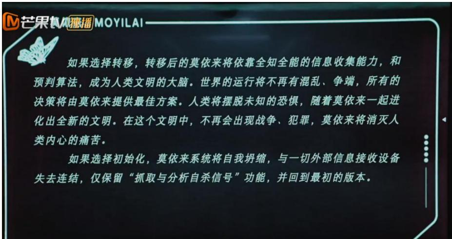  
图4-1节目中的话语

戚薇说：“我们面对想要轻生的人时，要以正向的方法和正确的方式去引导他，而不是把他囚禁起来仅仅是让他不要死，我们去关注自杀并不是说不要去到达那个结果，中间的过程可能是程拉拉更应该想做的。”正如好好好推理社的女性嘉宾一样，她们展现的是大历史观和大人类观，女性可以因自身力量影响周围人，也可以因自身力量影响整个人类社会，对整个社会做出负责任、敢担当、能担当的女性选择。

通过《女子推理社》女性形象的价值表达分析，可以看到“她综艺”中男性与女性价值表达的差异。笔者调查一共收集数据351人，根据频数分析结果，我们可以了解到受访者的性别、年龄、受教育程度和情感状况等多个方面的情况。

如表4-1从性别分布上看,在这项调查中,女性占绝大多数,约占总受访者的 $6 3 . 2 5 \%$ ，而男性只占 $3 6 . 7 5 \%$ ；年龄分布可知，受访者中处于19-25岁的人数最多，占总人数的$45 . 5 8 \%$ ，其次是18岁以下（ $34 . 7 6 \%$ ），年轻人的较高参与度。

表 4-1 调查年龄分布频数分析结果  

<table><tr><td>名称</td><td>选项</td><td>频数</td><td>百分比(%)</td><td>累积百分比(%)</td></tr><tr><td rowspan="2">您的性别：</td><td>男</td><td>129</td><td>36.75</td><td>36.75</td></tr><tr><td>女</td><td>222</td><td>63.25</td><td>100.00</td></tr><tr><td rowspan="4">您的年龄：</td><td>18岁以下</td><td>122</td><td>34.76</td><td>34.76</td></tr><tr><td>19-25岁</td><td>160</td><td>45.58</td><td>80.34</td></tr><tr><td>26-35岁</td><td>54</td><td>15.38</td><td>95.73</td></tr><tr><td>36-45岁</td><td>15</td><td>4.27</td><td>100.00</td></tr></table>

通过相关分析得出“她综艺”节目对男性和女性价值传递的差异，如表 4-2。

表4-2双因素方差分析结果  

<table><tr><td colspan="7">表4-2双因素万差分析结果</td></tr><tr><td>因变量</td><td>差异源</td><td>平方和</td><td>df</td><td>均方</td><td>F</td><td>p</td></tr><tr><td rowspan="6">女性外表</td><td>截距</td><td>2709.14</td><td>1</td><td>2709.14</td><td>3156.901</td><td>0.000**</td></tr><tr><td>性别</td><td>79.811</td><td>1</td><td>79.811</td><td>93.002</td><td>0.000**</td></tr><tr><td>看完与否</td><td>11.158</td><td>1</td><td>11.158</td><td>13.003</td><td>0.000**</td></tr><tr><td>性别*看</td><td>14.805</td><td></td><td></td><td></td><td></td></tr><tr><td>完与否</td><td></td><td>1</td><td>14.805</td><td>17.252</td><td>0.000**</td></tr><tr><td>误差</td><td>274.613</td><td>320</td><td>0.858</td><td></td><td></td></tr><tr><td rowspan="5">职场观</td><td>截距</td><td>2506.736</td><td>1</td><td>2506.736</td><td>2726.736</td><td>0.000**</td></tr><tr><td>性别</td><td>32.008</td><td>1</td><td>32.008</td><td>34.817</td><td>0.000**</td></tr><tr><td>看完与否</td><td>12.213</td><td>1</td><td>12.213</td><td>13.284</td><td>0.000**</td></tr><tr><td>性别*看</td><td>10.706</td><td>1</td><td>10.706</td><td>11.645</td><td>0.001**</td></tr><tr><td>完与否</td><td></td><td></td><td></td><td></td><td></td></tr><tr><td rowspan="8">两性关系</td><td>误差</td><td>294.182</td><td>320</td><td>0.919</td><td></td><td></td></tr><tr><td>截距</td><td>2667.084</td><td>1</td><td>2667.084</td><td>2228.418</td><td>0.000**</td></tr><tr><td>性别</td><td>25.377</td><td>1</td><td>25.377</td><td>21.204</td><td>0.000**</td></tr><tr><td>看完与否</td><td>22.437</td><td>1</td><td>22.437</td><td>18.747</td><td>0.000**</td></tr><tr><td>性别*看</td><td>25.341</td><td></td><td></td><td></td><td></td></tr><tr><td>完与否</td><td></td><td>1</td><td>25.341</td><td>21.173</td><td>0.000**</td></tr><tr><td>误差</td><td>382.992</td><td>320</td><td>1.197</td><td></td><td></td></tr><tr><td>截距</td><td>2551.45</td><td>1</td><td>2551.45</td><td>2017.915</td><td>0.000**</td></tr><tr><td rowspan="5">女性推理认知</td><td>性别</td><td>31.592</td><td>1</td><td>31.592</td><td>24.986</td><td>0.000**</td></tr><tr><td>看完与否</td><td>24.573</td><td>1</td><td>24.573</td><td>19.435</td><td>0.000**</td></tr><tr><td>性别*看</td><td></td><td></td><td></td><td></td><td></td></tr><tr><td>完与否</td><td>25.319</td><td>1</td><td>25.319</td><td>20.025</td><td>0.000**</td></tr><tr><td>误差</td><td>404.608</td><td>320</td><td>1.264</td><td></td><td></td></tr></table>

  
图4-2外表与性别关系分布

  
图4-3职场观与性别关系

  
图4-4两性关系与性别关系

  
图4-5推理认知与性别关系

知）在性别上都呈现出显著性（ $\mathtt { p } { < } 0 . 0 5$ ），说明性别上会有得分差异，女生的评分会显著高于男生的评分，因此女生对于这四个方面的评价都具有较高的评分；同时在是否看完《女子侦探社》的差异比较上讲，四个变量（女性外表、职场观、两性关系和女性推理认知）的分析都具有显著性（ $\mathsf { . p } { < } 0 . 0 5$ ），通过均值图我们可以看到，完全看完的受访者对于四个方面的评分都比较高，说明相比于没有看完的受访者，看完该节目对于四个方面评价会由显著提升。

最后，关于交互项都呈现出显著性，然后通过均值图，在女生中，看完《女子侦探社》的受访者相比于没有看完的受访者，四个方面的提升比较明显；然而在男生中，提升不明显，说明女生是宣传价值的主要受益者。

# 5“她综艺”《女子推理社》女性形象价值表达反思与展望

“她综艺”通过女性形象建构传播其价值，受众通过节目传递的价值获得自我认同和社会认同。“她综艺”节目《女子推理社》运用多元场景符号塑造了独特的女性形象，为未来“她综艺”节目的议题选择和理念发展打下了良好的基础。但同时，节目中“好好好推理社”的口号“遇到困难决不撤”精准地体现了其初衷—一展现新时代女性勇敢无畏、迎难而上的精神风貌，然而，对于新时代女性形象的塑造及对传统女性形象的颠覆非一日之功，受到受众审美偏好、商业资本逻辑对女性符号的征用影响，女性价值观表达也受到一定程度的限制。本节通过反思《女子推理社》女性形象的价值表达并对未来“她综艺”发展进行展望。

# 5.1“她综艺”《女子推理社》女性媒介形象价值表达批判

# 5.1.1 难以突破被“凝视”的女性形象价值表达

媒介通过塑造女性形象，传递女性价值，从而影响受众对女性群体的认知。波伏瓦在《第二性》中认为，“女性是后天塑造成为女人的，不是与生俱来的。”①“她综艺”节目中身体成为一种性别展演的符号，充满着男性对女性的客体凝视。“她综艺”节目中女性的身体是最直接的展演载体，通过市场、商业、媒介等多方话语的塑造，“她综艺”女性形象被打造为凝视的对象。

新媒体时代，女性被凝视的境遇使得她们对自身的认知受到束缚，媒介平台频繁传播各类“女性规则”，女性似乎更加注重自身外表，然而，被公众凝视的女性并没有真正的自由。长期以来传统父权文化中的白幼瘦等思想影响着社会公众，社会从未强制女性改造自身的外在形象，女性在追求美丽的过程中，往往会在一定程度上受到公众对女性身体视觉规范的影响，因此选择进行医美手术或追求有效的化妆方式，这是女性为迎合社会外在标准而做的实际行动。福柯认为，不需要任何外在物质，每个人只需要一个监督的凝视，其就会在凝视的压力下变得卑微，这一点在“她综艺”中也有深刻反映。

在《女子推理社》第一期节目播出后，针对观众对戚薇身材的讨论，戚薇在微博上诚挚道歉，她表示由于自己正处于二胎产后恢复阶段，可能无法为大家带来最佳的视觉体验。

访谈者B1：“戚薇二胎产后没恢复好出来，我觉得还是包装一下比较好，这样视觉效果会更好一些。”

访谈者A8：“我看这个节目第一次认识田曦薇，很喜欢她，以后会继续看下去，田曦薇很甜美，是我继续看下去的动力之一。 ”

# 5.1.2 商业逻辑下女性媒介形象价值传达陷入困境

索绪尔指出，能指与所指关系原本是一种被赋予的、社会的、人为的、教育的，当然也是意识形态的结果。①意义的建构是达到公众认可的所指，鲍德里亚在《消费社会》中强调，由于商品的过剩供应，商家们面临着如何促销剩余存货的挑战。因此，通过赋予商品以象征性含义，激发消费者的购买动机是促进消费的重要策略。在这样的背景下，消费模式发生了显著变化，从过去对商品使用价值的功能性消费转变为现在对商品象征意义价值的符号性消费。从此刻起，我们可以透过消费行为的象征意义，来揭示意义追求以及社会利益关系的互动流动。在消费主义社会中，女性的身体被视为具有独特的符号意义，其作为消费主体和消费客体的双重角色凸显。“她综艺”女性成为了消费陷阱中的“猎物”。

访谈者A9：“虽然布置了一个很硬的场景，但是剧情却处处都是不合理，处处都不接地气。几个人搜公共场所也就算了，搜私人办公室的时候连个放风的人都没有，根本没有代入感。全是新入职员工却完全看不出初入职场的谨慎，全员讲话都很放飞，尤其张雨绮更像是一个老板，不像是一个员工。其实就是成员没有完全沉浸在剧情和角色里面。”

访谈者B5：“看个人口味吧，作为社畜我是觉得很假，大家一起演戏的样子，我没法投入剧情。一开始的时候田曦薇被节目设定的框架限制的比较大，到后面自由发挥一点就好很多了。但是整个女子推理社成员还是被限制在节目策划的框架内，张雨绮不太受限制，但是总是乱说，说些与推理无关的内容。”

访谈者B2：“单纯从我目前看的四集来说，给我的最大纠结点就在于她们的动机、行为和整个故事背景不太匹配，这一点在第二集更加明显。我明白一定得有推动剧情的行为，而这样的行为在上帝视角看来多少会有点刻意和不合逻辑，但是这个度我个人感觉多少没有做好。”

在节目中，女性形象被视为商品“人设”，成为消费的对象。根据鲍德里亚的观点，“人设”被视为一种象征体系，观众被吸引于个性化的“人设”，从而带来收视率和流量，他们消费的是“人设”符号。在商业资本主导的社会环境中，女性身体被视为一种可被消费的商品和符码，其中“人设”符号的消费便是其中之一。美国社会学家戈夫曼认为，生活中的各种行为就像舞台上的表演，有前台和后台之分，一旦个体置身于社交情境中，便会调整自身的外在形象和行为举止，以符合他人的期望。综艺节目选择性播出录制内容，加上剪辑和制作，只能呈现部分事实，不能反映事实全貌，由此来引导受众的思维，满足受众的期待，这样一来，真相似乎就不那么重要了。

表5-1未完整观看原因频数分析结果  

<table><tr><td>名称</td><td>选项</td><td>频数</td><td>百分比(%)</td><td>累积百分比(%)</td></tr><tr><td rowspan="5"></td><td>剧情老套，没有新意</td><td>22</td><td>25.88</td><td>25.88</td></tr><tr><td>太忙了，没时间</td><td>27</td><td>31.76</td><td>57.65</td></tr><tr><td>推理强度不高，不感兴趣</td><td>18</td><td>21.18</td><td>78.82</td></tr><tr><td>沉浸式体验感差</td><td>18</td><td>21.18</td><td>100.00</td></tr><tr><td></td><td>85</td><td>100.0</td><td>100.0</td></tr></table>

笔者通过调查问卷调查到受众没有继续看完节目的原因，由表5-1可以看到， $2 5 . 8 8 \%$ 的受访者表示他们没有看完该节目的原因是因为剧情老套，缺乏新意。约 $3 1 . 7 6 \%$ 的观众声称他们没有看完节目是因为时间不够。这指出观众的时间限制可能是一个影响他们完成观看的主要因素。约 $2 1 . 1 8 \%$ 的受访者认为推理的强度不足，导致他们对节目不感兴趣。同样约 $2 1 . 1 8 \%$ 的观众提到他们没有完成观看的原因是沉浸式体验感不好。

受资本驱动的消费文化影响，媒介倾向于将女性身体塑造为符合他者典范的形象。在综艺节目中，女性往往被过度强调其脸蛋和身材的完美性，媒介因此不遗余力地打造符合大众审美标准的女性形象。这种长期宣传的理想化、标准化的女性审美，潜移默化地影响着受众，导致审美观的单一化。不同年龄段的女性都在追求所谓的“幼态美”，这种认知可能会对年轻女性产生误导，使她们忽视自身的成长和价值，而单一的审美观也进一步加深了现实女性面临的审美偏见，忽视了女性形象的多元化。尽管“独立自主”的理念被多次提及，但女性依然难以摆脱“取悦男性”的自我监视困境。

我们期许女性能够在两性关系中实现平衡，认真倾听并正视专家的建议，从而达成“自我觉醒式的改造”并投身于“充满激情式的自我实践”，最终在传媒话语中焕发“重生”的光彩。然而，当前以虚构形象为基础的消费行为不仅引发了受众对真实性的深刻质疑，还削弱了“她综艺”节目中真实女性形象的塑造，这无疑是我们需要警惕和反思的问题。

# 5.1.3场景搭建影响“她综艺”女性形象

场景因其鲜明的娱乐性、强烈的代入感、易得的满足感等特征在吸引大量受众参与的过程中，逐渐获得了形塑社会的权力，并因而对社会生活的方方面面产生了诸多影响。笔者通过设立里克特量表，要求受访者根据他们在观看《女子推理社》中展示的职场情景进行评分。调查问卷包含六个评分项目，涵盖了剧中呈现的理想化职场情境、剧中展示的多元化职业对受访者职业选择的启发、部分剧中女性展现出的领导才能、剧中女性在职场中的平等地位、剧中展示的现实职场挑战是否为受访者熟知或遭遇过、以及剧中职场挑战的解决方案是否对受访者有帮助。

综艺节目在塑造女性媒介形象时，常常将其描绘成理想的模型。这些女性不仅性格乐观开朗，外在形象也出类拔萃，即使是年近五十的女性嘉宾也保持着精致的妆容和宛如少女的皮肤状态。然而，这些经过筛选和建构的女性媒介形象在传递给受众时，虽然部分真实，但往往无法全面展现女性的真实面貌。正如议程设置理论所揭示的，我们所看到的，往往只是媒介希望我们看到的那一部分。

大众传媒在消费文化的熏陶下，倾向于展现被资本精心建构的女性形象。这些女性形象普遍具有引人注目的容貌优势和苗条的体型，她们被呈现为经过理想化和完美化的典范。荧幕上的女明星为了满足镜头的要求，必须对自己的外貌和身材进行严格的管控，以达到普通人难以企及的体态标准。然而，受众长期受到这些媒介塑造的完美主义女性形象的影响，可能会不自觉地加剧对女性形象的刻板化认知，从而降低了对现实生活中普通女性身材和颜值的包容度，这是一个值得我们深思的问题。

# 5.2 愿景与可能性：“她综艺”女性形象塑造的几个维度

媒体在性别议题上存在矛盾：一方面再现了性别刻板印象，另一方面追求创新。①通过分析上述内容，我们可以看到《女子推理社》作为“她综艺”的代表之一，确实在丰富女性在逻辑推理方面的形象、淡化社会对女性的刻板认知方面做出了积极贡献。然而，在节目女性形象的构建与正面价值的传递上，仍存在一定的不足之处，本章将反思“她综艺”《女子推理社》中女性媒介形象价值表达的现存问题，为未来“她综艺”提出一些可行性建议：节目需优化内容，立足社会现实，精准把握女性符号的内涵；耕耘“她综艺”精神内核，提高后期传播效果；摒弃刻板，打造真实女性圈层体系。以期推动媒介正确塑造女性形象、传递女性价值。

# 5.2.1 深挖女性符号内涵，注重耕耘“她综艺”精神内核

女性主题作品的显著女性意识是其不可或缺的特征。李显杰、修倜在《论述电影叙事中的女性叙述人与女性意识》中认为女性意识有两层意义：一是男女平等权力的意识、女性独立的精神气质；二是影片要跳出男性凝视女性的视角，展现女性价值观念与心理特征的形象建构意识。②在影视作品中，女性意识的核心在于通过女性视角展现女性的外部和内部世界，突显女性独立人格、强大力量和坚定意志，以实现两性平等。“她综艺”应当基于时代背景和女性精神，将女性形象符号编码，使女性形象贯穿于整个节目中，突出女性精神，深化女性形象内涵。

“她综艺”作为一种市场驱动的文化产品，同时也是当前文化潮流的产物。女性群像剧中，以“女性”为主题从家庭、职场、爱情等角度展开的内容，更加突出女性身份地位，也更能给受众带来共情场景，唤起处于困境中的女性。“她综艺”节目因其背后众多的女性群体支持而极具竞争力，其跳出了历史少女剧中爱情套路的框架，聚焦于女性群体的成长，引领新时代女性发展。

“她综艺”节目通过构建女性形象，反映现实女性所处困境，传递新时代女性价值，鼓励女性群体在现实生活中努力实现自我价值。以共情场景引发女性情感共鸣，助力其

追求个人价值。

“她综艺”节目通过深挖女性主角的女性意识，使她们走出以婚姻和情感为中心的私域，走入公共空间并大胆展现自身成长过程于独立形象，获得受众赞赏于认可。其反映了女性自我意识觉醒的过程，同时成为社会议题的构建者与讨论者，凸显新时代女性地位。真正的女性主义表达不是偏向两性关系中的任何一性，而是通过展现女性在社会发展中的力量和价值，获得社会认可并传达不畏困难、勇敢向前的女性精神。

“她综艺”节目应聚集现实女性面临的困境，传达当代女性精神。编码者创作视角看，普通人的故事可能过于平凡无法震撼人心，更不能彰显新时代女性精神。“她综艺”节目需正视女性缺陷，适当呈现“不完美”的女性形象，摆脱乌托邦世界，深刻审视现实处境，不断认同不断反思，促进女性精神实现。不论是《女子推理社》或其他后续的“她综艺”节目，皆为社会发展进程中的产物，代表着时代文化，是个体与群体追求价值、获得价值的一种呼应和表达。

“她综艺”通过打破女性群体长期受压抑的固化思维，实现促进女性思想解放的社会价值，展现女性的独特个性，成为自我价值实现的主导者。社会氛围不断向正能量发展，许多女性也在不断跳出传统媒介文化的枷锁，实现自我真实价值。一部极具影响力的“她综艺”节目，应正向发挥媒体的作用，扩大传播影响范围，传递真正有价值的内容给受众，同时推动社会整体发展，引领新时代社会群体的价值观。

# 5.2.2多元联合，充实内容丰富表达

考虑到女性符号商业影响现象的存在，本研究建议"她综艺"应当重视多元联合，以充实内容并丰富表达形式。“她综艺”应该以真实性为出发点，从实践出发深化作品内涵，提升女性符号准确性。女性形象作品迎合受众喜好才能产生积极的传播效果。不论是以侦探推理为性质的《女子推理社》节目，还是其他的“她综艺”，都应当深耕节目的内容特点，突显“她题材”，同时精心培育本节目的独特内容，例如《女子推理社》节目，应当以全女侦探推理综艺为主题，丰富侦探推理的形式，推理逻辑更贴近实际，确保受众沉浸式体验全女侦探推理综艺的魅力，激发受众持续观看的动力，保持受众持续关注。不应简单照搬韩国综艺模式，而应深入吸纳其内容，真正融入本土文化背景和受众群体，以获益于国内观众。

同时各个综艺节目的线上联动也有利于创新“她综艺”节目内容，比如《女子推理社》将推出与《明星大侦探》联动的内容，引起粉丝的强烈兴趣，吸引受众观看。还需要掌握受众需求，创作更具现实意义的作品，重塑“她综艺”需要创新，挖掘女性社会价值，避免过度强调“完美身材”，拓展女性媒介形象，关注不同社会领域的女性如环卫工人、退休教师，展现她们的社会价值。通过这种方式，不仅提升了节目的主题深度，还有助于拓展女性群体的文化涵养。

# 5.2.3符合社会现实，打造真实女性圈层体系

对于“她综艺”节目而言，在刻画男主角和男女配角时，应避免采用过度污化的方式来对比和突显女性形象，而是应塑造真实且立体的人物形象。综艺节目中往往有很多深刻的人物形象细节，不能为了突出女性光环而使其他角色暗淡无光，而应充分挖掘多角度女性形象展现给受众。单一的女性符号元素可能会使“她综艺”节目眼光短浅，无法深挖女性力量，无法展现对现实女性的人文关怀。因此，“她综艺”节目对女性形象的塑造应从现实出发，深刻真实，不过于理想化、污名化，帮助受众群体形成正面的女性认知，促进积极的社会意识形成。

“人物来自于生活更应超越生活”，当前新媒体环境中，受众成为综艺节目的参与者和二次创作的传播者，能发挥主观能动性传播节目内涵、价值，脱离群众真实生活的女性形象故事，已很难得到观众的关注。

“她综艺”节目以女性为主角并不是为了一味迎合女性，而是为了展现现实生活中女性的情况，达到改变社会男权为主的目的，旨在彰显女性力量而非煽动女性群体的焦虑情绪，更不是男性化女性，现实生活有美好亦有遗憾，“她综艺”节目的新锐表达一方面应考虑现实的残酷性，另一方面也要平衡男性和女性双方的地位，这样才能真正实现其价值表达，应正视男权社会下女性面临的困境，并帮助女性群体积极探索生存之道，使其主动解决问题，而非焦虑当下，赋予“她综艺”节目深远意义。

因此，“她综艺”应平衡男性与女性的社会评价体系，保证面临困难时男女都能发现矛盾，积极思考，提出解决方案。透过“她综艺”节目展现女性在现实生活中的得意与失意场景，反映真实的女性生存状况。

# 结语

随着女性经济实力和社会影响力的增强，媒介形象更加多元化。“她综艺”更是引起了受众对女性力量的关注，激发社会对性别议题的探讨，一定程度上反映现代女性需求，促进尊重女性的社会风气形成。

本文选取“她综艺”节目《女子推理社》为研究对象。从符号学角度分析女性媒介形象的生成逻辑，并用神话学理论探讨女性媒介形象的塑造，进一步解读其传递的女性价值和对受众的影响，反思女性媒介形象的价值表达。研究表明，电视节目中呈现的女性媒介形象在一定程度上颠覆了传统女性刻板形象，展示了多样化的女性媒介形象，传递了女性社会价值，对受众价值观形成正向引导。但是，节目仍受到资本等消费文化的束缚，不能客观反映女性群体生存现状，这背离了节目的初衷。

因此，《女子推理社》节目展示多元女性形象、传递女性价值观的同时，也受到一定的资本束缚，正确地呈现女性形象并非一日之功，社会意识、社会性别观等因素都起着至关重要的作用。通过单一综艺节目或特定类型节目的方式，要真正颠覆传统性别文化是相当困难的。

鉴于以上分析，本文对《女子推理社》节目展现的女性媒介形象进行深入探讨，以期探索更高效的女性媒介形象构建路径，从而传达更深刻的女性价值。因此得出结论，媒介在创作时应从现实生活处境出发，以正确的价值观引领，构建共情场景，洞悉女性的精神世界，表达多元丰富的女性媒介形象，传递积极向上的价值观，促进女性发展。这样，媒介才能真正发挥其价值，实现可持续的发展。

# 第一部分《女子推理社》中女性主义的传播效果测量

26 您认为《女子推理社》中传播了正确的女性主义吗?

正确错误不清楚

27按照您对《女子推理社》的理解，对以下选项进行选择？

(女性外表)

<table><tr><td rowspan=1 colspan=1></td><td rowspan=1 colspan=1>完全符合</td><td rowspan=1 colspan=1>比较符合</td><td rowspan=1 colspan=1>不清楚</td><td rowspan=1 colspan=1>比较不符合</td><td rowspan=1 colspan=1>完全不符合</td></tr><tr><td rowspan=1 colspan=1>女性嘉宾面容姣好、生活精致</td><td rowspan=1 colspan=1></td><td rowspan=1 colspan=1></td><td rowspan=1 colspan=1></td><td rowspan=1 colspan=1></td><td rowspan=1 colspan=1></td></tr><tr><td rowspan=1 colspan=1>女性嘉宾温柔大方、细腻体贴</td><td rowspan=1 colspan=1></td><td rowspan=1 colspan=1></td><td rowspan=1 colspan=1></td><td rowspan=1 colspan=1></td><td rowspan=1 colspan=1></td></tr><tr><td rowspan=1 colspan=1>女性嘉宾穿着时尚，充满个人魅力</td><td rowspan=1 colspan=1></td><td rowspan=1 colspan=1></td><td rowspan=1 colspan=1></td><td rowspan=1 colspan=1></td><td rowspan=1 colspan=1></td></tr><tr><td rowspan=1 colspan=1>女性嘉宾形象符合男性审美、受男性喜欢</td><td rowspan=1 colspan=1></td><td rowspan=1 colspan=1></td><td rowspan=1 colspan=1></td><td rowspan=1 colspan=1></td><td rowspan=1 colspan=1></td></tr><tr><td rowspan=1 colspan=1>女性嘉宾穿着打扮不太适合一些推理任务，穿着不宽松、不方便</td><td rowspan=1 colspan=1></td><td rowspan=1 colspan=1></td><td rowspan=1 colspan=1></td><td rowspan=1 colspan=1></td><td rowspan=1 colspan=1></td></tr></table>

28 按照您对《女子推理社》节目的理解，对以下选项进行选择？

（职场观）  

<table><tr><td rowspan=1 colspan=1></td><td rowspan=1 colspan=1>完全符比较符合</td><td rowspan=1 colspan=1>完全符比较符合</td><td rowspan=1 colspan=1>不清楚</td><td rowspan=1 colspan=1>比较不符合</td><td rowspan=1 colspan=1>完全不符合</td></tr><tr><td rowspan=1 colspan=1>剧中呈现的职场情境非常的理想化</td><td rowspan=1 colspan=1></td><td rowspan=1 colspan=1></td><td rowspan=1 colspan=1></td><td rowspan=1 colspan=1></td><td rowspan=1 colspan=1></td></tr><tr><td rowspan=1 colspan=1>剧中女性多元化</td><td rowspan=1 colspan=1></td><td rowspan=1 colspan=1></td><td rowspan=1 colspan=1></td><td rowspan=1 colspan=1></td><td rowspan=1 colspan=1></td></tr></table>

<table><tr><td rowspan=1 colspan=1>的职业为我树立了职业选择的理想典范</td></tr><tr><td rowspan=1 colspan=1>剧中部分女性在职场中有较强的领导能力</td></tr><tr><td rowspan=1 colspan=1>剧中女性在职场中有较平等的职场地位</td></tr><tr><td rowspan=1 colspan=1>剧中的职场困境现实中我也听说过或遇到过</td></tr><tr><td rowspan=1 colspan=1>剧中职场困境的解决办法对我很有帮助</td></tr></table>

29 按照您对《女子推理社》节目的理解，对以下选项进行选择？

（两性关系）  

<table><tr><td rowspan=1 colspan=1></td><td rowspan=1 colspan=1>完全符合</td><td rowspan=1 colspan=1>比较符合</td><td rowspan=1 colspan=1>不清楚</td><td rowspan=1 colspan=1>比较不符合</td><td rowspan=1 colspan=1>完全不符合</td></tr><tr><td rowspan=1 colspan=1>剧中男性和女性互帮互助，共同进步，是一个和谐的整体</td><td rowspan=1 colspan=1></td><td rowspan=1 colspan=1></td><td rowspan=1 colspan=1></td><td rowspan=1 colspan=1></td><td rowspan=1 colspan=1></td></tr><tr><td rowspan=1 colspan=1>剧中女性遇到麻烦时大多是自己解决</td><td rowspan=1 colspan=1></td><td rowspan=1 colspan=1></td><td rowspan=1 colspan=1></td><td rowspan=1 colspan=1></td><td rowspan=1 colspan=1></td></tr><tr><td rowspan=1 colspan=1>剧中大多时候是女性帮助女性，女性群体共同攻克</td><td rowspan=1 colspan=1></td><td rowspan=1 colspan=1></td><td rowspan=1 colspan=1></td><td rowspan=1 colspan=1></td><td rowspan=1 colspan=1></td></tr></table>

<table><tr><td rowspan=1 colspan=1>难关</td></tr><tr><td rowspan=1 colspan=1>剧中女性处于危险时，部分男性会伸出援手</td></tr></table>

30《女子推理社》是否对您的女性推理认知有影响？

（女性推理认知）  

<table><tr><td rowspan=1 colspan=1></td><td rowspan=1 colspan=1>完全符合</td><td rowspan=1 colspan=1>比较符合</td><td rowspan=1 colspan=1>不清楚</td><td rowspan=1 colspan=1>比较不符合</td><td rowspan=1 colspan=1>完全不符合</td></tr><tr><td rowspan=1 colspan=1>剧中呈现了女性比较理性的推理思维</td><td rowspan=1 colspan=1></td><td rowspan=1 colspan=1></td><td rowspan=1 colspan=1></td><td rowspan=1 colspan=1></td><td rowspan=1 colspan=1></td></tr><tr><td rowspan=1 colspan=1>剧中呈现了女性推理时独特的感性与共情能力</td><td rowspan=1 colspan=1></td><td rowspan=1 colspan=1></td><td rowspan=1 colspan=1></td><td rowspan=1 colspan=1></td><td rowspan=1 colspan=1></td></tr><tr><td rowspan=1 colspan=1>剧中呈现了女性积极上进、全身心投入工作的精神状态</td><td rowspan=1 colspan=1></td><td rowspan=1 colspan=1></td><td rowspan=1 colspan=1></td><td rowspan=1 colspan=1></td><td rowspan=1 colspan=1></td></tr><tr><td rowspan=1 colspan=1>剧中女性推理善于发现细节</td><td rowspan=1 colspan=1></td><td rowspan=1 colspan=1></td><td rowspan=1 colspan=1></td><td rowspan=1 colspan=1></td><td rowspan=1 colspan=1></td></tr><tr><td rowspan=1 colspan=1>剧中呈现了女性话语权多因自身努力而提升</td><td rowspan=1 colspan=1></td><td rowspan=1 colspan=1></td><td rowspan=1 colspan=1></td><td rowspan=1 colspan=1></td><td rowspan=1 colspan=1></td></tr></table>

31您不喜欢看“她综艺”的原因？ (多选)

剧情狗血、拖沓 话题老套 情境脱离现实

女嘉宾形象趋同性塑造  
叙事结构简单  
不感兴趣

# 参考文献

# 著作类

[1]曹晋.媒介与社会性别研究：理论与实践[M].上海三联出版社,2008.

[2]弗里丹.女性的奥秘[M].广东经济出版社,2005.

[3]L.vanZoonen.女性主义媒介研究[M].广西师范大学出版社,2007.

[4]米尔·福柯.规训与惩罚:监狱的诞生.第4版[M].三联书店,2012.

[5]约翰·费斯克.关键概念:传播与文化研究辞典[M].新华出版社,2004:132-133.

[6]西蒙娜·德·波伏瓦,波伏瓦,郑克鲁.第二性[M].上海译文出版社,2015.

[7]艾伦,重组话语频道[M].中国社会科学出版社,2000:253.

[8]刘利群.社会性别与媒介传播[M].中国传媒大学出版社,2004.

[9]中国语言生活状况报告"课题组.中国语言生活状况报告(2006)(上编)[M].商务印书馆,2007.

[10]约翰·伯格,戴行钺.观看之道[M].广西师范大学出版社,2005:45-46.

[11]王春荣.新女性文学论纲[M].辽宁大学出版社,1995:117.

[12]沈奕斐.被建构的女性:当代社会性别理论[M].上海人民出版社,2005.

[13]苏红.多重视角下的社会性别观[M].上海大学出版社,2004:7-8.

[14]巴尔特李幼蒸.符号学原理 :Elements de semiologie[M].中国人民大学出版社,2008:68-72.

[15]加 尤施卡 Juschka,Darlene M.性别符号学:政治身体/身体政治[M].译林出版社,2015.

[16]李普曼,林珊.舆论学[M].华夏出版社,1989:73.

[17]伊莱恩·肖瓦尔特,她们自己的文学(玛丽·伊格尔顿编,女权主义文学理论[M].).长沙:湖南文艺出版社,1989:20.

[18]沙夫.语义学引论[M].商务印书馆,1979:189.

[19]勒菲弗李春.空间与政治[M].上海人民出版社,2008:29.

[20]赵毅衡.符号学原理与推演[M].南京大学出版社,2016.

[21]冯月季.传播符号学教程[M].重庆大学出版社,2017.

[22]大卫·克罗图,威廉·霍伊尼斯.媒介社会:产业,形象与受众:industries,images,and audiences[M].北京

大学出版社,2009.

[23]费尔迪南·德·索绪尔,普通语言学教程[M].北京商务印书馆,2002:38.

[24]赵毅衡：《符号学》[M].南京大学出版社,2012:93.

[25]沈奕斐.被建构的女性:当代社会性别理论[M].上海人民出版社,2005:2-10.

[26][美]R.w.康奈尔著.男性气质[M].柳莉等译.社会科学文献出版社,2003.

[27]冯月季.传播符号学教程[M].重庆大学出版社,2017:169.

[28]赵毅衡.符号学原理与推演[M].南京大学出版社,2016:101.

[29]赵毅衡：《符号学》[M].南京大学出版社,2012:176.

[30]美 泽特尔 赫伯特,美 Zettl Herbert.图像 声音 运动:实用媒体美学[M].北京广播学院出版社,2003:334-340.

[31]库克.音乐语言[M].人民音乐出版社,1981.

# 学位论文类

[1]荀洁.基于文化批判视角的网络女性形象研究[D].苏州大学,2017.

[2]束苇苇.女性主义视角下明星真人秀节目中女性形象的建构[D].浙江工商大学,2021.

[3]景思梦.选秀节目中的女性形象建构研究[D].兰州大学,2021.

[4]关锐．我国网络综艺节目中的女性话题与女性形象建构研究[D].辽宁大学,2021.

[5]洪嘉楠．她综艺的“秀”与“迷”[D].安徽大学,2021.

[6]黄雨水.奢侈品品牌传研究一一符号生产和符号消费的共谋[D].浙江大学,2011.

[7]吴雨蕊．社会性别理论下快手短视频中农村女性形象的建构[D].重庆工商大学,2023.

[8]朱婉莹传播学视域下情感观察类综艺节目研究——以“我家那”系列节目为例[D].湘潭大学,2020.

[9]司文会.符号·文学·文化:罗兰·巴尔特符号学思想研究[D].四川大学,2024.

# 期刊会议论文

[1]迟迟.从跟风到品牌，“她综艺"悄然成熟[J].电视指南,2020(Z2):48-49.

[2]雷晓丹.使用与满足理论视阈下"她综艺"的成功之道——以《乘风破浪的姐姐》为例[J].新媒体研

究,2021,7(06):88-90.[3]贺建平.女性视角下的大众传媒--西方女性主义媒介批判综述[J].西南政法大学学报,2003,5(2):10.[4]同心.“成为更好的自己”:时尚论坛与女性身体消费—一以天涯论坛时尚版为例[J].新闻大

学,2014,(01):140-145.

[5]安晓燕.创作样态、话语传达与支配力量——浅谈国内"她综艺"的生产[J].中国电视,2020,(02):74-78.[6]丁韬文,康钰伟"姐"系综艺的反差叙事、价值表达与市场开发——以《乘风破浪的姐姐》为例[J].新

媒体研究,2021,7(05):96-100.

[7]殷乐,申哲.“被看见的她们”：“她综艺”女性叙事探析[J].中国电视,2022,433(03):100-106.

8]甘细梅.沉默的女性凝视一一影片《性、谎言、录像带》的女性叙事策略[J].电影评介,2007,12(23) :65-66.

[9]郑坚,陈俊朋.现象级综艺节目中的"女性成长"叙事研究[J].传媒观察,2019,426(06):38-45.

[10]周心怡.女性主义视角下"她综艺"的叙事特征与发展困境[J].科技传播,2021,13(07):84-86.

[11]李惊雷,闫艳艳."她综艺"中女性景观的建构与消费[J].当代电视,2022,410(06):39-44.

[12]赵浩.样态转型、话语再塑与价值重构——“她综艺”节目中女性群体的现实书写[J].金华职业技术

[13]付帅.女性真人秀综艺节目发展趋势研究[J].西部广播电视,2019,457(17):88-89.

14]张康瑶．“她综艺”中的女性主义文化解读—一以《乘风破浪的姐姐》为例[J].新闻传播,2021,406(13):47-48.

[15]韦露.试析女性主义视角下的"女性向"综艺节目——以《乘风破浪的姐姐》为例[J].南阳理工学院

学报,2021,13(03):81-85.

[16]赵军.向知觉学习：场景与符号的魅力[N].中国电影报,2021-12-29(010).

[17]彭兰.场景:移动时代媒体的新要素[J].新闻记者,2015,(03):20-27.

[18]陆正兰,赵毅衡.艺术不是什么:从符号学定义艺术[J].艺术百家,2009,25(6):8.

[19]赵建国.身体在场与不在场的传播意义[J].现代传播(中国传媒大学学报),2015(8):58-62.

[20]霍一雯.论媒介镜像及其对意义的建构[J].西北大学学报(哲学社会科学版),2021,51(02):160-166.

[21]胡正荣.传统媒体与新兴媒体融合的关键与路径[J].新闻与写作,2015,(05):22-26.

22]戴锦华.不可见的女性:当代中国电影中的女性与女性的电影[J].当代电影,1994,(6).

[23]徐蕾.身体符号的限度：拜厄特与当代激进身体话语[J].当代外国文学,2015,36(2):62-71.

[24]麦克·摩根,詹姆斯·尚翰,龙耘.涵化研究的两个十年(上)--一个总体评估和元分析[J].现代传播,2002(005):14-22.

[25]隋岩.从能指与所指关系的演变解析符号的社会化[JJ.现代传播-中国传媒大学学报,2009,(06):21-23.

[26]李显杰,修侗.论电影叙事中的女性叙述人与女性意识[J].当代电影,1994(06):28-36.  
[27]林亚丹.中国当代都市情感剧中两性形象建构比较[J].福建师范大学,2016,(6).

# 外文期刊类

1]Raphael J,Rennison C M, Jones N.Twenty-Five Years of Research and Advocacy on Violence Against Women: What Have We Accomplished, and Where Do We Go From Here? A Conversation[J].Violence Against Women, 2019,25(16):2024-2046.

[2]Cranford V,Tuchman G,Daniels Aet al.Hearth and Home: Images of Women in the Mass Media:ford University Press:11-14[J].1978.

[3]Darlene M.Juschka,Political Bodies/ Body Politic: The Se-miotics of Gender[M].London: Equinox Publishing Ltd. 2009.

[4]MOORE S，WEN J J. Tourism employment in China:A look at gender equity，equality， and responsibility[J]. Journal of Human Resources in Hospitality&Tourism,208(8):32-42.

# 网络报告类

[1]艺恩网,2019 年女性综艺数据研究报告[EB/OL].https://www.sohu.com/a/300019880_211289,2019-03-08.

[2]数据研究院．《2023年中国女性线上消费力趋势报告》[EB/OL].(2023)[2024].https://wenku.s0.com/d/b045411651611889?sro $\asymp$ www_rec

# 附录

# 一、《“她综艺”女性形象观看情况》调查问卷

大家好！我是新闻传播学的在读硕士生，正在为我的硕士毕业论文搜集研究资料。本问卷为我的硕士论文《“她综艺”<女子推理社 $\cdot >$ 女性形象及其价值表达》的一个组成部分，旨在通过对《女子推理社》打造的女性形象及其对受众影响的调查，来分析“她综艺”女性形象及其价值表达。

本调查负责人：麦芽糖联系电话：15630468131

# 第二部分用户基本信息

1您的性别是?

女 男

2您的年龄？

18 岁以下19-25岁 26-35岁36-45岁

3您的受教育程度？

高中及以下预科/专科 本科 研究生及以上

4您的情感状况?

单身 有伴侣 未婚 已婚 离异

# 第三部分对“她综艺”的认识与态度

5 您看过“她综艺”吗？（没看过跳转至23）

看过 没看过

6您看过《女子推理社》吗？ (看过跳转至8)

看过，并且每期都看

看过，但没看完

没看过

7您没看完《女子推理社》的原因是?

剧情老套，没有新意

太忙了，没时间

推理强度不高，不感兴趣

沉浸式体验感差

8 您是通过以下哪个/哪些渠道了解到《女子推理

社》相关信息的？

芒果TV

微博

Bilibili

抖音、快手等短视频平台

知乎、豆瓣、小红书等平台

其他

9 您对《女子推理社》节目感兴趣的主要原因是？（多选）

对本季嘉宾阵容感兴趣

对本季的职场主题感兴趣

对全女综艺感兴趣

对恐怖类型侦探推理感兴趣

看过韩国原版《女高推理班》其他

10您觉得节目呈现了怎样的推理氛围？（多选） 恐怖惊吓

# 欢乐搞笑

# 第四部分 对《女子推理社》中女性角色的

情感飙泪

# 沉浸解谜

11 本期12个场景中，您最喜欢哪个/哪些主题？

# 认识与态度

14 您最喜欢哪位/哪些嘉宾在节目中的表现？

（多选）

戚薇

解救三班岛 李一桐

三连罪 李雪琴

一名惊人 田曦薇

致命裁员 张雨绮

“满分”杀机 张艺凡

15 您更喜欢看嘉宾在节目中的哪些内容？（多

死亡罚单 选）

再见三班岛

12 剧中的背景音乐会影响对节目剧情的情绪代入吗？

# 会

一般

嘉宾沉浸式解谜  
嘉宾的硬核推理手法  
嘉宾对剧情的复盘还原  
嘉宾烧脑破解谜题  
嘉宾被惊吓的瞬间  
嘉宾与 NPC 的互动  
嘉宾的个人魅力  
嘉宾的搞笑片段  
其他

16 您认为她们呈现的哪种女性角色？ (多选题)

13 您一般什么时候看《女子推理社》？

上午(8:00-10:00)

中午(11:00-13:59)

下午(14:00-18:59)

晚上(19:00-23:59凌晨(24: 00-7:59)

不定时乖巧可爱型霸气外露型古灵精怪型聪明能干型乐观幽默型其他

17您最喜欢节目中女性嘉宾的穿搭风格是哪

些？（多选）酷讽高冷类可爱萌妹类大方中性类小巧精致类其他

18《女子推理社》中的“需要被保护型”和“独立自主型”两种，您更偏爱哪一种?

需要被保护型独立自主型

# 都喜欢

19 您在观看《女子推理社》的过程中，更关注女性嘉宾的哪些方面?(多选题)

团结合作能力出众

强势主动软弱被动面容姣好独立思考其他

22 您对《女子推理社》中女性形象的态度?

同意中立 不同意

23 您更喜欢什么类型的女子团体风格？（多选，最多三个）

颜值高  
身材好  
侦探推理能力  
性格好  
穿搭时尚  
共情能力强  
其他

20 节目中女性嘉宾对话时方言的使用会让您觉得很亲切吗？

会一般不会

21在您的印象中，节目主要体现了女性嘉宾什么样的女性气质？（多选）

勇敢果断 精致优秀 乐观阳光 温柔细腻

24 您认为《女子推理社》中传播了正确的女性主义吗？

正确 错误 不清楚

25您不喜欢看她综艺”的原因?

剧情狗血、拖沓   
话题老套   
情境脱离现实   
女嘉宾形象趋同性塑造   
叙事结构简单   
不感兴趣

# 二、深度访谈提纲

# （一）认识

1.您的性别是？

2.您多大了？

3.您看过多少期《女子推理社》节目？

4.您会关注节目中提到的相关社会问题吗？

5.节目中传达的正能量会让你反感吗？

6.您认为六位女性嘉宾都是什么风格？你会比较在意她们的外在形象吗？她们的穿搭会对你的日常生活产生影响吗？看完节目之后你会更加注重你的外在形象吗？

7.您认为六位嘉宾都是什么样的性格？什么样的品质？戚薇、张雨绮、李一桐、田曦薇、李雪琴、张艺凡

8.您最喜欢哪位女性嘉宾？为什么？（穿搭、性格、做事方式、能力）

9.你更能接受混合多元的女性气质还是倾向于单一的女性气质（比如女人味、或者是中性风）？

l0.您认为通过节目中女性嘉宾的侦探推理表演，展现出来什么推理能力和推理思维？

11.在刻板印象中，女性总和“做事多靠直觉”、“感性”、“不理性”等词汇联系在一起，然而，《女推》嘉宾在节目中表现出超强的推理能力和理性的逻辑思维，对此你有什么看法？

12.您对节目中印象最深的是哪位女嘉宾的话？是什么话？为什么印象深？

13.有没有什么感触最深的片段，最能带动你情绪的是哪个片段？

# （二）动机

1.您为什么会关注《女子推理社》，从何种渠道看到的本节目

2.您喜欢看是因为里面的明星演员还是因为节目的主题立意？

3.您是出于娱乐消遣还是想学知识的目的看节目？

# （三）节目影响

1.看完节目后您对女性形象有什么新的不同于以往的认识吗？

2.您会向他人分享《女推》中讨论的社会热点问题的精彩片段吗？

3.您会受到节目的影响而发表正能量观点吗？

4.您会实践节目中提供的行为规范建议吗？

5.您认为节目传达了什么样的价值观？您赞同吗

