# 1. 论文基本信息

## 1.1. 论文标题
本论文的核心主题是研究中国首档推理类真人秀节目《明星大侦探》（后更名为《大侦探》）的叙事策略。题目为《系列推理类真人秀节目《明星大侦探》的叙事策略研究》。该研究旨在通过叙事学理论，深入剖析这档长寿综艺如何通过独特的叙事手段保持吸引力、构建意义并影响受众。

## 1.2. 作者及机构
*   **学位申请人姓名：** 董倩 (Dong Qian)
*   **培养单位：** 湖南大学 新闻与传播学院
*   **导师信息：** 苏美妮副教授、鲍新文高级记者
*   **学科专业：** 新闻与传播
*   **研究方向：** 新闻传播实务
*   **提交日期：** 2023年3月30日
*   **答辩日期：** 2023年5月12日

    作者董倩拥有长沙理工大学的本科学位，是一名具备新闻传播学背景的硕士研究生。其研究依托于湖南大学的学术平台，属于中国高校的新闻与传播领域硕士学位论文。

## 1.3. 发表年份
*   **提交年份：** 2023 年
*   **答辩年份：** 2023 年

## 1.4. 摘要概述
本文以系列推理类真人秀《明星大侦探》为研究对象，应用叙事学理论对其七季节目文本进行分析。研究发现该节目在继承经典综艺叙事元素的基础上，形成了三大独有的叙事策略：首先是互文性叙事，包括狭义的元素重复（环节、演员）和广义的社会文化指涉；其次是悬念叙事，涵盖主线生成、空间铺设及视听表达；最后是游戏化叙事，涉及情节、角色和场景的游戏设计。论文最后总结了该节目对同类节目的启示，如垂直创新、内容深耕及价值引领等。

## 1.5. 原文链接及状态
*   **原文链接：** uploaded://0943b8f9-fb46-4369-b36d-cf96c4bc8416
*   **PDF 链接：** /files/papers/69a401f794ecec188cfd08da/paper.pdf
*   **发布状态：** 已完成的硕士学位论文（未标注正式期刊发表），可作为学术参考。

# 2. 整体概括

## 2.1. 研究背景与动机

### 2.1.1. 核心问题
本研究试图解决的核心问题是：在中国综艺节目竞争激烈、同质化严重的背景下，《明星大侦探》为何能连续播出七季并保持高热度？其成功背后的叙事逻辑是什么？

### 2.1.2. 行业痛点与研究缺口
*   **行业现状：** 国内真人秀节目虽然发展迅速，但普遍存在内容低级、设定缺乏亮点、价值观感染力不足等问题。
*   **学术空白：** 当时学界对于“推理类真人秀”这一新兴类型的系统性研究成果较为匮乏。现有的研究多集中在内容制作、营销传播或单一视角的叙事分析，缺乏对节目叙事策略全面、系统的梳理。
*   **研究动机：** 鉴于《明星大侦探》在流量与口碑上的双丰收（七年热度不减），研究者希望通过深度剖析其叙事策略，揭示其保持独特性与创新性的原因，并为同类型节目的创作提供实践指导。

## 2.2. 核心贡献与主要发现

### 2.2.1. 理论贡献
*   **拓展研究领域：** 将推理类真人秀纳入综艺真人秀的研究范畴，丰富了电视叙事学的研究对象。
*   **构建分析框架：** 综合运用经典叙事学与后经典叙事学理论，建立了一个针对推理综艺的三维分析框架（互文性、悬念、游戏化）。

### 2.2.2. 实践结论
*   **三大叙事策略：** 论文确认了该节目的核心成功因素在于“互文性叙事”、“悬念叙事”和“游戏化叙事”的有机结合。
*   **IP 生态建设：** 指出通过跨媒介协作叙事（如衍生剧、线下馆）构建了庞大的“明侦宇宙”，增强了用户粘性。
*   **价值导向：** 强调了节目在娱乐外壳下承担的社会责任，如通过案件探讨社会议题（校园霸凌、养老问题等），实现了寓教于乐。

# 3. 预备知识与相关工作

## 3.1. 基础概念解析

为了理解本论文，读者需要掌握以下关键术语的定义。由于这是一篇人文社科论文，许多概念并非技术代码，而是文学与传播学理论。

### 3.1.1. 推理类真人秀 (Reasoning Reality Show)
*   **定义：** 结合了推理元素与真人秀形式的节目。玩家根据游戏规则，通过搜集线索完成对人物关系和事件进展的分析，为达到预设目标展开竞争。本质是“纪实”与“综艺”的融合，包含一定的虚构性（剧本设定）和真实性（玩家真实反应）。
*   **核心特征：** 悬疑风格、逻辑推理、角色扮演、竞技机制。

### 3.1.2. 叙事学 (Narratology)
*   **定义：** 研究叙事作品结构和功能的学科。它起源于古代，但在 20 世纪 70 年代随着结构主义语言学的发展而体系化。
*   **经典叙事学：** 强调文本的结构分析（时间、语式、语态）。
*   **后经典叙事学：** 关注读者/受众、意识形态和社会历史背景对文本的影响。
*   **本论文应用：** 将《明星大侦探》视为一个叙事文本，分析其故事是如何被讲述的。

### 3.1.3. 互文性 (Intertextuality)
*   **定义：** 由法国学者克里斯蒂娃提出。指任何一个文本都不是孤立的，它都是对其他文本的吸收和转化。简单来说，就是“文中文”，即一部作品与另一部作品之间的对话、引用、参照关系。
*   **分类：**
    *   **狭义互文性：** 指文本内部的自我指涉（如节目中重复使用相同的环节、演员）。
    *   **广义互文性：** 指文本与社会、历史、其他媒介作品的关联（如致敬经典电影、反映社会热点）。

### 3.1.4. 悬念 (Suspense)
*   **定义：** 创作者利用观众对未来事件的不确定性产生的兴奋、好奇等心理因素，进行悬而未决的处理手法。它是推动剧情发展的动力。

### 3.1.5. 游戏化 (Gamification)
*   **定义：** 在非游戏情境中使用游戏元素和游戏设计技术。在节目中体现为将任务设为关卡、引入积分徽章、虚拟角色扮演等机制。

## 3.2. 前人工作回顾

作者在绪论中梳理了相关领域的现有研究，主要分为以下几类：

### 3.2.1. 叙事学理论研究
*   **早期发展：** 20 世纪 80 年代起，中国学界开始关注叙事学理论，胡亚敏、杨义等学者建立了具有中国特色的叙事理论体系。
*   **电视叙事学：** 尹鸿、谢耘耕等学者将叙事学应用于电视研究，提出了关于人物塑造、悬念营造和冲突演进的理论框架。

### 3.2.2. 《明星大侦探》个案研究
*   **内容生产：** 邹欣、廖明隽等分析了节目的模式、体验氛围及戏剧张力。
*   **营销传播：** 牛玥、曹秋敏等运用 5W 传播模式分析其脱颖而出原因。
*   **社会价值：** 史炎荣、卜彦芳等探讨了节目的价值引导作用和社会责任感。

## 3.3. 差异化分析
与前人研究相比，本文的创新点在于**系统性和全面性**。以往研究往往只针对叙事的某一方面（如仅看悬念设置或仅看营销），而本文基于完整的叙事学框架，从互文性、悬念、游戏化三个维度进行了全面解构，填补了该题材系统性研究的空白。

# 4. 方法论

## 4.1. 方法原理

本研究采用定性研究为主的方法，不依赖复杂的数学模型，而是侧重于文本的深度解读和理论阐释。其核心思想是通过拆解节目的构成要素，还原其叙事运作的内在逻辑。

## 4.2. 具体研究方法详解

### 4.2.1. 个案研究法 (Case Study)
*   **操作步骤：** 选取《明星大侦探》作为唯一的典型案例进行深入剖析。
*   **样本选择：** 选取已播出完结的 1-7 季共 80 多期正片作为核心样本，兼顾衍生节目及周边产品。
*   **目的：** 通过宏观视角把握整体风格，结合微观视角选取典型情节（如 S7E09《绿洲之上》）进行论证，以达到“以点带面”的效果。

### 4.2.2. 比较研究法 (Comparative Study)
*   **纵向对比：** 将系列节目不同季度的文本进行对比，观察节目的迭代与创新。
*   **横向对比：** 隐含地将本节目与其他真人秀或引进原版《犯罪现场》进行对比，分析本土化改造的策略。

### 4.2.3. 文本研究法 (Textual Analysis)
*   **操作流程：**
    1.  收集节目视频文本及相关资料。
    2.  归纳整理叙事元素（如镜头语言、台词、环节流程）。
    3.  挖掘深层含义，识别叙事策略的运用及其影响。

## 4.3. 核心理论框架的应用

论文没有使用数学公式，而是运用了三个主要的理论框架来支撑其叙事分析。这是方法论部分的关键。

### 4.3.1. 互文性理论的应用 (巴特/克里斯蒂娃)
作者将互文性理论操作化为两个维度：
*   <strong>自我指涉 (Self-reference)：</strong> 用于分析节目内部如何重复使用元素（如固定环节、复活角色）。
*   **社会历史对话：** 用于分析节目如何与社会议题、经典文学作品进行对话。

### 4.3.2. 格雷马斯矩阵 (Greimas' Semiotic Square)
*   **原理：** 这是一个符号学模型，用于分析人物关系的矛盾和对立。
*   **应用：** 作者用此图式来分析《明星大侦探》中的角色关系，如图 3.1 所示。
    $$
    \begin{matrix}
    S1 (\text{侦探}) & --- & \text{对立} & --- & S2 (\text{凶手}) \\

    | \updownarrow \text{矛盾} & & & & | \updownarrow \text{矛盾} \\

    S1' (\text{嫌疑人}) & --- & \text{互补} & --- & S2' (\text{助手})
    \end{matrix}
    $$
    *(注：此处原文使用的是文字描述关系，我将其转化为图示以便理解)*
    *   <strong>S1 与 S2 (反向对照)：</strong> 侦探与凶手，代表善与恶的对立。
    *   <strong>S1 与 S1' (矛盾)：</strong> 侦探与嫌疑人，既有信任又有怀疑。
    *   <strong>S1 与 S2' (互补)：</strong> 侦探与助理，共同构成正义一方。

### 4.3.3. 布莱希特“间离效果” (Alienation Effect)
*   **原理：** 德国戏剧家布莱希特提出的理论，主张让演员与角色保持距离，使观众跳出情感共鸣，进行批判性思考。
*   **应用：** 用于分析玩家的表演。嘉宾既是角色又是自己，这种双重身份让观众既沉浸又抽离，从而更好地理解案件背后的法律或道德议题。

# 5. 实验设置

由于本文属于人文社会科学领域，不存在传统意义上的“实验环境”，而是“数据收集与样本分析设置”。

## 5.1. 数据集 (样本库)

### 5.1.1. 核心样本
*   **名称：** 《明星大侦探》系列节目（1-7 季）。
*   **规模：** 共计约 80 多期正片。
*   **时间跨度：** 2016 年至 2023 年。
*   **样本代表性：** 覆盖了节目的起步、发展和成熟阶段，且均为已完结的高人气案件，能够全面反映节目的演变趋势。

### 5.1.2. 辅助样本
*   **衍生内容：** 包括衍生综艺《名侦探学院》、互动剧《头号嫌疑人》、《目标人物》以及线下实景推理馆 M-CITY 的体验记录。
*   **数据来源：** 芒果 TV 官方播放平台及豆瓣、微博等社交媒体的反馈数据。

## 5.2. 评估指标

本文主要通过定性和定量结合的指标来评估节目的效果和影响力。

### 5.2.1. 收视与评分数据
*   **概念定义：** 衡量节目受欢迎程度和市场表现的基础指标。
*   **数据展示：** 以下是原文表 1.1 各季在芒果 TV 的收视率及豆瓣评分：

    <table>
    <thead>
    <tr>
    <th>节目名称及季别</th>
    <th>收视率 (播放量)</th>
    <th>豆瓣评分</th>
    </tr>
    </thead>
    <tbody>
    <tr>
    <td>《明星大侦探》第一季</td>
    <td>23.2 亿</td>
    <td>9.4</td>
    </tr>
    <tr>
    <td>《明星大侦探》第二季</td>
    <td>28.1 亿</td>
    <td>9.0</td>
    </tr>
    <tr>
    <td>《明星大侦探》第三季</td>
    <td>39.6 亿</td>
    <td>9.1</td>
    </tr>
    <tr>
    <td>《明星大侦探》第四季</td>
    <td>26.9 亿</td>
    <td>8.6</td>
    </tr>
    <tr>
    <td>《明星大侦探》第五季</td>
    <td>42.5 亿</td>
    <td>8.3</td>
    </tr>
    <tr>
    <td>《明星大侦探》第六季</td>
    <td>37.5 亿</td>
    <td>8.7</td>
    </tr>
    <tr>
    <td>《大侦探 7》（第七季更名)</td>
    <td>45 亿</td>
    <td>7.7</td>
    </tr>
    </tbody>
    </table>

*   **指标解释：**
    *   <strong>播放量 (Rating/Views)：</strong> 反映用户规模和实际观看行为。数据显示播放量总体呈上升趋势。
    *   <strong>豆瓣评分 (Score)：</strong> 反映核心观众群的质量评价。均分维持在 8.7 分左右，说明口碑稳定。

### 5.2.2. 互动与传播指标
*   **概念定义：** 衡量观众参与度和社群活跃度的指标。
*   **数据来源：** 微博超话讨论量、知乎话题数、弹幕评论密度。
*   **分析方式：** 定性分析这些互动是否促进了二次传播和剧情深度的挖掘。

## 5.3. 基线分析
本研究不仅分析《明星大侦探》，也隐含地对比了：
1.  **同类竞品：** 市场上其他缺乏创新的普通真人秀。
2.  **原版节目：** 韩国 JTBC 的《犯罪现场》。
3.  **自身演变：** 第一集与第七季的对比。

# 6. 实验结果与分析

本章详细解读论文的第三、四、五章，即论文的核心发现。

## 6.1. 互文性叙事策略分析

### 6.1.1. 狭义互文性：内部自我指涉
节目通过“自我借鉴”建立了稳定的品牌认知。
*   **环节设置的重复：** 无论哪一期，节目基本遵循固定的 10 个环节流程（如表 2.1 所示）。这种重复降低了观众的认知门槛，培养了收视习惯。

    以下是原文 Table 2.1 的环节统计表，展示了固定的流程逻辑：

    | 排序 | 环节 | 简介 |
    | :--- | :--- | :--- |
    | 1 | 玩家不在场证明自述 | 玩家进行简要自我介绍，交代案发前后时间线 |
    | 2 | 第一轮现场搜证 | 所有玩家分为两组，对现场展开搜证；在 10 分钟之内拍摄 10 张证据照片 |
    | 3 | 第一次集中推理 | 侦探对人物关进行初步梳理；每名玩家轮流展示所获证据；证据指向的玩家进行自白或辩解；各玩家展开讨论 |
    | 4 | 侦探单独投票 | 侦探结合第一次推理结果，进行非公开投票 |
    | 5 | 第二轮现场搜证 | 侦探对玩家依次搜身，玩家再次进入现场进行集体搜证 |
    | 6 | 侦探对嫌疑人进行单独审问 | 侦探进入审问室，对玩家进行一对一审问，以获得更多有用线索 |
    | 7 | 第二次集中推理 | 玩家展开第二次集中式推理，并对相关结果进行总结 |
    | 8 | 第三轮深度搜证 | 玩家单独在现场展开搜证，此阶段所获证据彼此不可共享 |
    | 9 | 玩家逐一进行非公开投票 | 每位玩家简要说明怀疑对象及原因后投出非公开的一票 |
    | 10 | 公布游戏结果 | 进行投票结果的公布，揭示"真凶” |

*   **固定演员的再创造：** 节目构建了“明侦宇宙”。例如，虚拟男团“NZND”串联起了多个案件。
    下图（原文 Figure 2）展示了“NZND”相关人物的关系网，显示了人物在不同案件间的流动：

    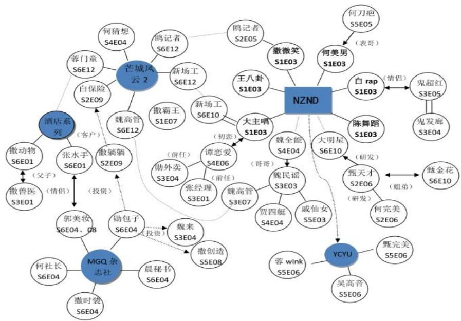
    *该图像是图2.1，展示了真人秀节目《明星大侦探》中“NZND”相关人物的关系图。该图通过节点和连线清晰地呈现了各人物间的互动关系，帮助观众理解剧情发展及人物之间的关联。*

*   **故事情节延续：** 不同案件之间存在前传续作关系。例如，“玫瑰酒店”系列中，霄云酒店是玫瑰酒店的前身。
    下图（原文 Figure 2.2）展示了两个酒店的时间线联系：

    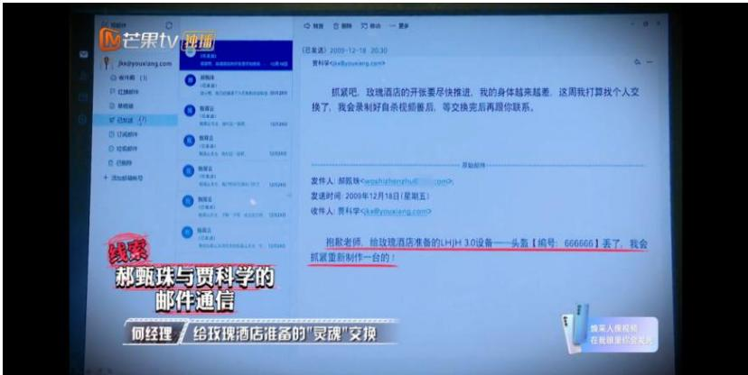
    *该图像是一个邮件交流界面，展示了与科学相关的邮件通信内容。邮件中涉及个人信息和通信细节，显示2020年12月的相关讨论。此图描绘了科学研究与社交互动的联结。*

### 6.1.2. 广义互文性：外部文化指涉
*   **社会议题连接：** 节目不局限于破案，还聚焦现实问题。例如 S7E06《机智的老年生活》探讨安乐死合法性，S7E01《魔法学院之毕业悸》探讨校园霸凌。
*   **经典改编：** 大量借鉴阿加莎·克里斯蒂、东野圭吾的小说及知名电影（如《泰坦尼克号》《唐人街探案》）。
*   **跨媒介协作：** 节目不仅仅是电视节目，还延伸到了网络剧、有声书、线下馆等形式。
    以下是原文 Table 2.2 的跨媒介叙事作品网络，展示了 IP 的多元化扩展：

    <table>
    <thead>
    <tr>
    <th>类别时间</th>
    <th>主节目</th>
    <th>季度间衍生叙事</th>
    <th>衍生节目</th>
    <th>平行故事</th>
    <th>外围故事</th>
    </tr>
    </thead>
    <tbody>
    <tr>
    <td>2016</td>
    <td>《明星大侦探》第一季</td>
    <td></td>
    <td></td>
    <td></td>
    <td></td>
    </tr>
    <tr>
    <td>2017</td>
    <td>《明星大侦探》第二季、第三季</td>
    <td></td>
    <td>《名侦探俱乐部》</td>
    <td></td>
    <td></td>
    </tr>
    <tr>
    <td>2018</td>
    <td>《明星大侦探》第四季</td>
    <td></td>
    <td>《名侦探俱乐部》第二季、第四季</td>
    <td>《我是大侦探》</td>
    <td>《片场谜案》</td>
    </tr>
    <tr>
    <td>2019</td>
    <td rowspan=2>《明星大侦探》第五季</td>
    <td>《NZND 破冰演唱会》</td>
    <td>《名侦探俱乐部》第五季</td>
    <td>《名侦探学院》第一季</td>
    <td>《头号嫌疑人》</td>
    </tr>
    <tr>
    <td>2020</td>
    <td>《名侦探俱乐部》第六季</td>
    <td>《名侦探学院》第二季、第三季</td>
    <td></td>
    <td></td>
    </tr>
    <tr>
    <td>2021</td>
    <td rowspan=2>《明星大侦探》第六季</td>
    <td>《NZND 顶牛演唱会》</td>
    <td></td>
    <td>《名侦探学院》第四季</td>
    <td>《目标人物》</td>
    </tr>
    <tr>
    <td>悬疑有声剧</td>
    <td>M-city 实景推理馆</td>
    <td></td>
    <td></td>
    </tr>
    <tr>
    <td>2022</td>
    <td>《大侦探》第七季</td>
    <td>《侦心侦意新春演唱会》</td>
    <td></td>
    <td>《名侦探学院》第五季</td>
    <td>Mstory 互动阅读平台</td>
    </tr>
    </tbody>
    </table>

## 6.2. 悬念叙事策略分析

### 6.2.1. 悬念的生成与解套
*   **多层叙事结构：** 采用“回环式套层结构”（外叙述、内叙述、潜叙述）。
    *   **外叙述：** 全知视角铺陈规则和环境。
    *   **内叙述：** 玩家碎片化自述，呈现不同版本的真相。
    *   **潜叙述：** 玩家逻辑拼凑真相。
*   <strong>“罗生门”</strong>视角： 不同角色讲述同一事件的不同侧面，制造信息差。
*   <strong>“剥笋式”</strong>解套： 通过三轮搜证，从表层信息（人物关系）到作案手法再到核心证据，层层递进。
*   **格雷马斯矩阵图示：** 下图（原文 Figure 3.1）展示了侦探与凶手等角色的对立统一关系，这是悬念生成的逻辑基础：

    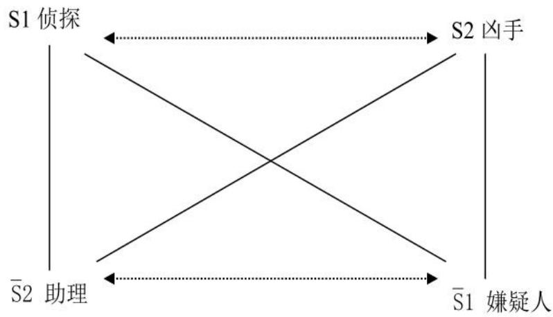
    *该图像是一个示意图，展示了格雷马斯的矩阵格局，图中用 S1 和 S2 表示不同角色之间的互动关系，其中 S1 代表侦探与嫌疑人，S2 代表助理与凶手。图中通过箭头和虚线展示了其关系和转化。*

### 6.2.2. 空间与视听表达
*   **独幕剧空间：** 限制叙事空间（如酒店、列车），增加封闭感，迫使玩家互动。
    下图（原文 Figure 3.2）展示了“独幕剧”式的叙事空间布局：

    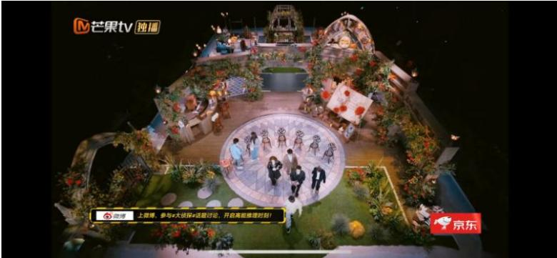
    *该图像是图表《明星大侦探》中“独幕剧”式的叙事空间，展示了节目的舞台设计。舞台中央有一个圆形区域，周围布置了丰富的自然景观元素与座位，营造出一种独特的互动氛围，适合推理类节目中的角色表现与情节发展。*

*   **视听语言强化：**
    *   **视觉：** 慢推镜头展示表情变化（图 3.3）、特写镜头呈现线索（图 3.5）。
        下图（原文 Figure 3.3）通过镜头语言外化选手心理状态：

        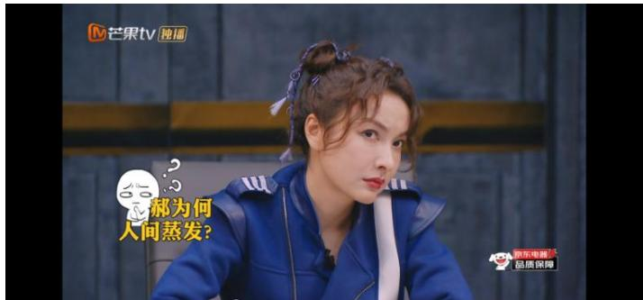
        *该图像是插图，展示了一名玩家在节目中的表情变化。图中玩家穿着蓝色外套，神情疑惑，旁边配有文字‘为何人间蒸发？’*

        下图（原文 Figure 3.5）通过特写镜头强调关键线索的重要性：

        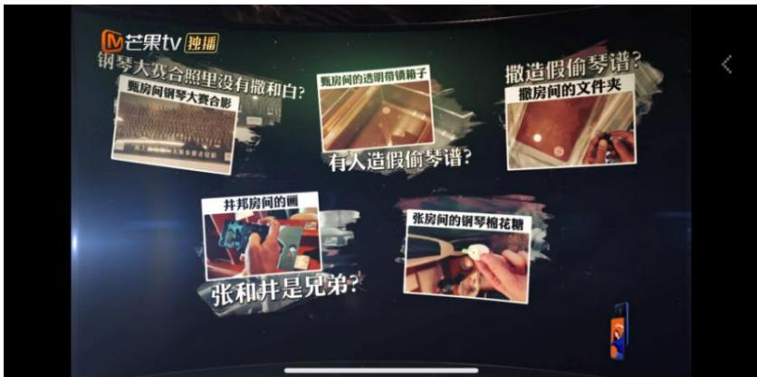
        *该图像是插图，展示了《明星大侦探》中多个特写镜头，围绕不同线索的信息进行叙述。图中包含了有关假冒线索的提示和提问，以引发观众的推理兴趣。*

    *   **听觉：** 恐怖童谣暗含死亡信息（图 3.4）。
        下图（原文 Figure 3.4）展示了音频叙事如何传递隐藏信息：

        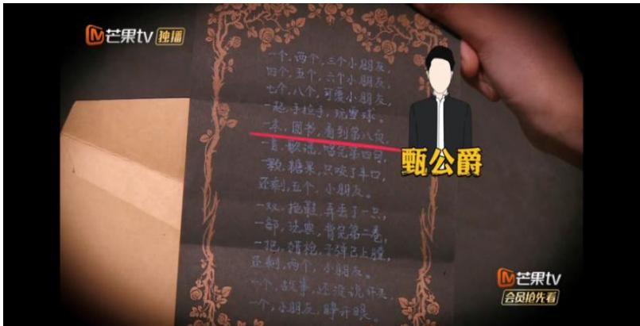
        *该图像是插图，展示了一封暗含死亡信息的恐怖童谣。信纸上写满了模糊的文字，并附有一位穿着黑色西装的男性轮廓，暗示着“被害者”与迷雾浓重的叙事氛围的关联。*

## 6.3. 游戏化叙事策略分析

### 6.3.1. 情节与角色
*   **游戏式结构：** 将环节比作游戏关卡，鼓励玩家“闯关升级”。
*   **去中心化角色：** 每位玩家都有平等戏份，无绝对主角。下表（原文 Table 4.1）列举了常驻嘉宾何炅在不同案件中截然不同的角色设定，证明了角色的多样性：

    <table>
    <thead>
    <tr>
    <th>演员</th>
    <th>期数</th>
    <th>角色</th>
    <th>造型</th>
    <th>年龄</th>
    <th>性别</th>
    <th>职业</th>
    <th>身份</th>
    </tr>
    </thead>
    <tbody>
    <tr>
    <td rowspan=12>何炅</td>
    <td>S7E01</td>
    <td>何侦探</td>
    <td>H</td>
    <td>未知</td>
    <td>男</td>
    <td>无</td>
    <td>魔法学院学生</td>
    </tr>
    <tr>
    <td>S7E02</td>
    <td>何药药</td>
    <td></td>
    <td>40</td>
    <td>男</td>
    <td>医药研究员</td>
    <td>公寓租户</td>
    </tr>
    <tr>
    <td>S7E03</td>
    <td>何八斗</td>
    <td></td>
    <td>23</td>
    <td>男</td>
    <td>翰林院供奉</td>
    <td>南国第一才子</td>
    </tr>
    <tr>
    <td>S7E04</td>
    <td>何一杯</td>
    <td></td>
    <td>24</td>
    <td>男</td>
    <td>郝下火凉茶继承人</td>
    <td>凉茶二代</td>
    </tr>
    <tr>
    <td>S7E05</td>
    <td>何研究</td>
    <td></td>
    <td>18</td>
    <td>男</td>
    <td>K 集团高级研究员</td>
    <td>K 集团员工</td>
    </tr>
    <tr>
    <td>S7E06</td>
    <td>何美男</td>
    <td></td>
    <td>63</td>
    <td>男</td>
    <td>NZND 成员</td>
    <td>疗养院老人</td>
    </tr>
    <tr>
    <td>S7E07</td>
    <td>何三好</td>
    <td>A</td>
    <td>24</td>
    <td>男</td>
    <td>自由写手</td>
    <td>未知</td>
    </tr>
    <tr>
    <td>S7E08</td>
    <td>何风□</td>
    <td></td>
    <td>50</td>
    <td>男</td>
    <td>临时工</td>
    <td>商场流浪汉</td>
    </tr>
    <tr>
    <td>S7E09</td>
    <td>何好气</td>
    <td></td>
    <td>32</td>
    <td>男</td>
    <td>加气员</td>
    <td>甄氏集团员工</td>
    </tr>
    <tr>
    <td>S7E10</td>
    <td>何侦探</td>
    <td>H</td>
    <td>未知</td>
    <td>未知</td>
    <td>未知</td>
    <td>地堡机器人</td>
    </tr>
    <tr>
    <td>S7E11</td>
    <td>何德划</td>
    <td></td>
    <td>31</td>
    <td>男</td>
    <td>医生</td>
    <td>甄漂亮整形医院院长</td>
    </tr>
    </tbody>
    </table>

*   **演员与角色的间离：** 演员保持清醒的自我意识，既入戏又出戏，引导观众批判性思考。

### 6.3.2. 场景与空间
*   <strong>魔圈 (Magic Circle)：</strong> 划定游戏空间与现实空间的边界。
    下图（原文 Figure 4.1）展示了“魔圈”概念：

    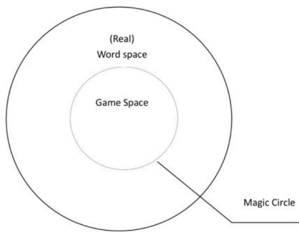
    *该图像是示意图，显示了《明星大侦探》中的“魔圈”概念，用于区分游戏空间与现实空间。在中心的游戏空间与外圈的现实空间之间，魔圈起到了隔离和定义两者关系的作用。*

*   **实景搭建：** 追求沉浸式体验，从平面布景升级为沙盒式实景（图 4.2）。
    下图（原文 Figure 4.2）展示了节目的“沙盒式”场景设置：

    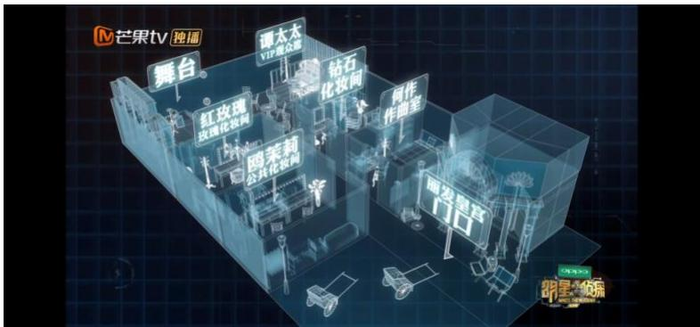
    *该图像是一幅示意图，展示了《明星大侦探》节目中的“沙盒式”场景设置。图中各个功能区域如舞台、摄影区和化妆间等均通过透明效果呈现，直观展示了节目的布景布局。*

    下图（原文 Figure 4.3）展示了具体的实景“玫瑰酒店”：

    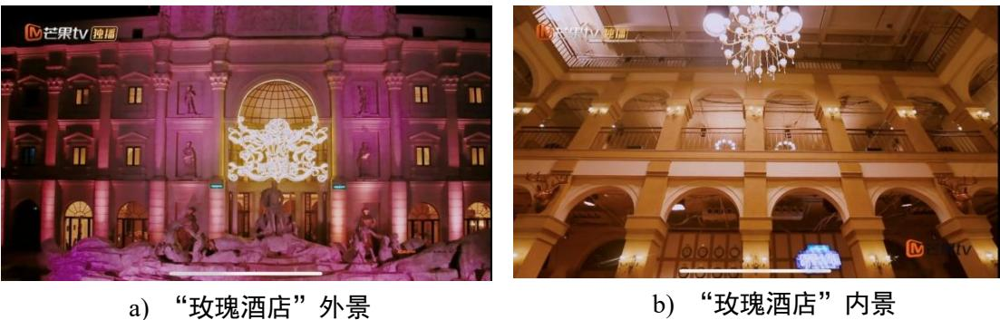
    *该图像是图4.3的插图，展示了玫瑰酒店的外景和内景。外观被华丽的灯光装饰，显得壮观而吸引人；而内景布局典雅，展现出酒店的奢华与细致。*

*   **虚实相生：** 物理空间映射精神世界（图 4.4）。
    下图（原文 Figure 4.4）展示了叙事空间如何投射角色的精神世界：

    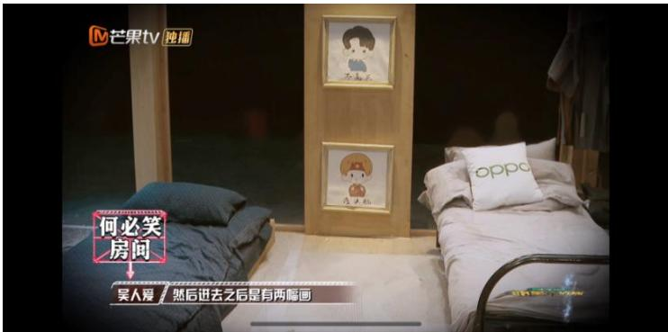
    *该图像是插图，展示了真人秀节目《明星大侦探》中角色的精神空间，画面呈现了床位和装饰墙上的人物插画。这一场景通过对空间的描绘，反映了角色内心世界的复杂性和细腻情感。*

## 6.4. 结果的有效性分析
通过上述策略的结合，《明星大侦探》成功解决了“推理难懂”与“娱乐性强”之间的矛盾。
*   **有效性验证：** 收视率的稳步上升（见 5.2.1 节表 1.1）和豆瓣评分的稳定（8.7 分以上）证明了叙事策略的市场接受度。
*   **可持续性：** 跨媒介 IP 的开发（如《名侦探学院》的成功独立）证明了该叙事模式具有极强的延展生命力。

# 7. 总结与思考

## 7.1. 结论总结
本论文通过对《明星大侦探》的全面考察，得出以下核心结论：
1.  **互文性是维系老粉与新粉的关键：** 通过狭义的自我指涉建立品牌记忆，通过广义的社会指涉吸引大众关注。
2.  **悬念是驱动叙事的核心引擎：** 多层结构、罗生门视角和视听语言的配合，确保了每期的智力挑战性和可看性。
3.  **游戏化是融入现代媒介生态的手段：** 实景搭建、去中心化设计和互动机制，让节目符合互联网用户的消费习惯。
4.  **价值引领是节目长青的基石：** 坚持法治精神和社会责任感，使其超越了单纯的娱乐产品。

## 7.2. 局限性与未来工作
作者在论文末尾坦诚指出了本研究的局限性：
1.  **反思不足：** 侧重于优势分析，缺失对节目不足之处（如后期剪辑争议、剧本逻辑漏洞）的反思。
2.  **主观性：** 对未来发展方向的建议存在一定主观色彩，缺乏业务层面和技术可行性的详细考量。

    未来可能的研究方向包括：
*   **量化分析：** 结合大数据技术，更精确地测量观众的情感波动与叙事节奏的关系。
*   **负面案例研究：** 对比失败的同类型节目，找出叙事策略失效的原因。
*   **技术融合：** 探索 VR/AR 技术在推理类节目中的应用前景。

## 7.3. 个人启发与批判
### 7.3.1. 启发性
*   **IP 运营思维：** 传统的电视节目往往是孤立的，而《明星大侦探》展示了如何将一档节目转化为一个巨大的“故事宇宙”（Universe），这对于当前的内容创作者极具参考价值。
*   **寓教于乐的平衡：** 证明了严肃的社会议题完全可以通过娱乐化的包装进行传播，关键在于如何选择切入点（如从家庭暴力切入普法）。

### 7.3.2. 潜在问题与改进
*   **剧本疲劳风险：** 随着季数增加，高度固定的流程（如 10 个环节）可能导致观众产生审美疲劳。未来的创新可能需要打破这些固定环节的限制。
*   **过度娱乐化隐忧：** 虽然强调“正能量”，但有时为了综艺效果，过于夸张的表演可能会稀释案件的严肃性，需要在“玩梗”和“案情”之间寻找更精准的平衡点。