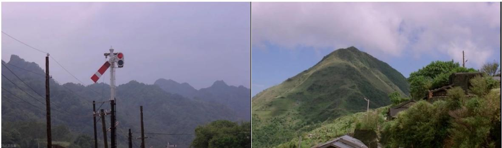
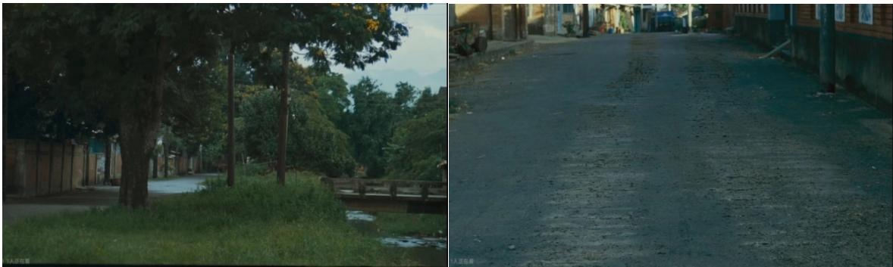

# 1. 论文基本信息
## 1.1 标题
《侯孝贤电影叙事研究》（英文标题：*A Study on the Narration of Hou Hsiao-Hsien's Films*），核心主题是在电影叙事学视域下，系统梳理台湾导演侯孝贤不同创作阶段作品的叙事体系，挖掘其叙事背后的文化内涵与美学价值，为中国艺术电影发展提供参考。
## 1.2 作者
成文艺，达宁师范大学戏剧与影视学专业2023届硕士研究生，研究方向为微影像创意与创作，指导教师为曲朋副教授。
## 1.3 发表载体
该成果为达宁师范大学2023届戏剧与影视学专业硕士学位论文，未正式在期刊/会议发表，属于高校学位论文成果。
## 1.4 发表年份
2023年4月
## 1.5 摘要
侯孝贤是台湾新电影运动先锋、国际知名电影大师，其作品兼具文化反思与诗意表达，以边缘个体的生存状态为载体，始终围绕“乡村与城市意识形态对照”“个体在历史变迁中的阵痛”两大母题展开，追求东方式超脱写意的美学意境。
本文以侯孝贤横跨40年创作生涯的代表性作品为研究对象，从叙事主题、叙事风格、叙事时空、叙事策略四个维度系统拆解其叙事体系：①主题层面以身份认同探寻为核心，覆盖个人记忆、在地历史、都市异化三大面向；②风格层面打破传统戏剧叙事规则，构建中式诗意美学，通过多元声音元素传递“沉寂力量”；③时空层面通过时间的雕塑重构、空间的想象建构，拓展东方电影的时空美学边界；④策略层面以人文主义关切为核心，聚焦个体生命价值、写实生活质感与东方传统文化传承。论文最终总结侯孝贤电影的叙事特质，为中国艺术电影的创作与传播提供新思路。
## 1.6 原文链接
用户提供的存储链接：`uploaded://59a2099b-8677-4ca3-baba-6f41a812de90`，PDF链接：`/files/papers/69c52442dcbc649cbf54fcec/paper.pdf`，属于未公开发表的学位论文版本。

# 2. 整体概括
## 2.1 研究背景与动机
### 2.1.1 核心问题与研究价值
侯孝贤作为华语艺术电影的标杆性人物，其作品不仅在国际影坛获奖无数，更形成了极具辨识度的“侯式美学”，是东方电影美学的重要实践样本。在商业电影占据主流市场的当下，研究侯孝贤的叙事体系，既能挖掘艺术电影的创作规律，也能为华语电影的民族化表达提供参考。
### 2.1.2 现有研究空白
现有侯孝贤相关研究主要集中在三个方向：①审美研究：聚焦长镜头、意境等本体语言；②文化研究：分析身份认同、历史表达等文化内涵；③比较研究：与贾樟柯、小津安二郎等导演的创作对比。但现有成果多以单部作品为分析对象，缺乏从叙事学维度对其整个创作生涯叙事体系的系统梳理，存在研究的碎片化问题。
### 2.1.3 研究切入点
本文以电影叙事学为核心理论工具，打破单文本分析的局限，覆盖侯孝贤从早期商业片到晚期“出走”阶段的所有代表性作品，从主题、风格、时空、策略四个维度搭建完整的侯孝贤叙事分析框架。
## 2.2 核心贡献与主要发现
### 2.2.1 核心贡献
1.  **研究视角创新**：首次系统从叙事学维度整合侯孝贤40年创作的叙事特征，弥补了现有研究碎片化的不足；
2.  **理论融合创新**：将西方叙事学理论（热奈特叙事时间理论、德勒兹时间-影像理论）与东方传统美学、侯孝贤的创作实践结合，为东方电影的叙事研究提供了新的分析范式；
3.  **实践参考价值**：总结的侯孝贤叙事经验，为当下国产艺术电影平衡作者表达、文化传承与观众接受提供了可借鉴的路径。
### 2.2.2 主要发现
1.  侯孝贤所有作品的叙事主题始终围绕“身份认同探寻”展开，从个人青春记忆到台湾在地历史，再到都市异化个体，本质上是不同维度对台湾文化身份的追问；
2.  其叙事风格的核心是“沉寂力量”：通过打破戏剧冲突规则、构建中式留白意境、保留真实环境声音，实现了无戏剧性冲突却极具情感张力的表达效果；
3.  其时空叙事突破了传统线性叙事的局限：时间上通过真实还原、省略、绵延、倒置四种处理方式，赋予时间生命力；空间上以家庭、运动空间、异域空间为载体，承载文化记忆与情感表达；
4.  其叙事的核心内核是人文主义关切：始终以平等、悲悯的视角注视底层个体，在写实的生活质地中融入东方传统文化基因，实现了艺术性与思想性的统一。

# 3. 预备知识与相关工作
## 3.1 基础概念解释
面向初学者，先明确本文涉及的核心专业术语：
1.  <strong>电影叙事学 (Film Narratology)</strong>：是叙事学与电影学交叉的学科，研究电影如何通过视听语言（镜头、声音、剪辑等）讲述故事，核心关注“讲了什么故事”和“故事是怎么被讲述的”两大问题，区别于文学叙事的文字载体，电影叙事兼具时间性与空间性。
2.  <strong>长镜头 (Long Take)</strong>：指对一个场景连续拍摄较长时间（通常30秒以上）的镜头技法，能够保持时空的完整性与真实性，避免蒙太奇剪辑对观众感知的引导，给予观众更大的想象空间，是侯孝贤最具标志性的视听语言之一。
3.  <strong>在地性 (Localism)</strong>：文化研究领域术语，指对本土的文化、历史、生存经验的关注与呈现，强调本土文化的独特性，侯孝贤作品的在地性体现为对台湾本土历史、民众生存状态的书写。
4.  <strong>留白 (Negative Space)</strong>：源于中国传统绘画美学，指作品中故意留出的空白区域，引导受众自行想象补充，延伸作品的表意空间，侯孝贤将留白运用到电影叙事中，通过省略情节、模糊信息让观众参与叙事构建。
5.  <strong>时间-影像 (Time-Image)</strong>：法国哲学家德勒兹提出的电影理论，指打破传统运动-影像的线性叙事逻辑，通过镜头直接呈现时间本身，让观众感知到时间的流动与存在，侯孝贤的慢节奏、长镜头作品是时间-影像的典型实践。
## 3.2 前人研究梳理
现有侯孝贤相关研究可分为四大类：
1.  **审美研究**：聚焦侯孝贤的电影语言与美学风格，代表性成果包括孟洪峰《侯孝贤风格论》提出的“闷、愣、浑”美学概括，孙慰川对其纪实美学与民族化特征的分析，大卫·波德维尔将其风格定义为“亚洲极简主义”。
2.  **文化研究**：从文化视角解读作品内涵，代表性成果包括戴锦华以詹明信“国族寓言”理论分析其作品的历史与政治内涵，沈言天对其“寻根”创作本质的判断，暨南大学胡楚城对其电影中台湾身份认同探索的系统梳理。
3.  **比较研究**：将侯孝贤与其他风格相近的导演对比，代表性成果包括陈旭光对侯孝贤与贾樟科长镜头美学差异的分析，郭小撸对侯孝贤与小津安二郎东方叙事共性的研究。
4.  **专著与影像记录**：包括焦雄屏《台湾新电影》、林文淇等《戏恋人生：侯孝贤电影研究》、朱天文《最好的时光：侯孝贤电影记录》等一手资料，以及阿萨亚斯执导的纪录片《侯孝贤画像》，是研究侯孝贤的重要基础。
## 3.3 技术演进脉络
侯孝贤的创作生涯可分为五个阶段，本文的研究对象覆盖所有阶段的代表性作品：
1.  **1980-1982年：商业片试水阶段**：拍摄《就是溜溜的她》等喜剧爱情片，风格贴近台湾主流商业电影，处于创作探索期；
2.  **1983-1986年：个人记忆书写阶段**：推出“成长四部曲”《风柜来的人》《冬冬的假期》《童年往事》《恋恋风尘》，带有强烈的自传色彩，长镜头、固定镜头等个人风格初步形成；
3.  **1989-1995年：历史叙事阶段**：推出“台湾历史三部曲”《悲情城市》《戏梦人生》《好男好女》，从个人记忆转向集体历史书写，《悲情城市》斩获威尼斯金狮奖，成为华语电影史上的经典作品；
4.  **1996-2001年：都市题材阶段**：转向现代都市青年生存状态书写，拍摄《南国再见，南国》《千禧曼波》等作品，关注都市人的疏离与异化，在配乐、光影上加入新的创意；
5.  **2003年至今：“出走”阶段**：叙事空间跳出台湾，拍摄《咖啡时光》（日本）、《红气球的旅行》（法国）、《刺客聂隐娘》（唐朝）等作品，融入多元文化与历史想象，风格更加写意。
## 3.4 与相关工作的差异化分析
现有研究多聚焦单一维度或单部作品，缺乏对侯孝贤叙事体系的系统梳理：审美研究多关注镜头语言本身，未关联叙事逻辑；文化研究多聚焦内涵解读，未分析其叙事表达的实现路径；比较研究多为横向对比，未深入挖掘其叙事的内部规律。本文以叙事学为核心工具，打通主题、风格、时空、策略四个维度，覆盖所有创作阶段的作品，是首次对侯孝贤叙事体系的完整建构。

# 4. 方法论
本文采用“理论支撑-维度拆解-文本印证”的研究逻辑，核心分为四个分析维度：
## 4.1 叙事主题：身份认同的三维探寻
侯孝贤所有作品的叙事主题始终围绕“台湾身份认同”这一核心命题，分为三个递进的面向：
### 4.1.1 个人化记忆方舟：涉世与乡愁
以“成长四部曲”为代表，书写个体青春成长经验，本质上是个人身份的建构过程：
- 青春叙事：聚焦少年的叛逃与成长，以《风柜来的人》中少年从乡村到城市的迷茫、《恋恋风尘》中初恋的无疾而终，呈现青春成长的共性阵痛；
- 家庭关系：刻画父权的式微与情感的调和，“成长四部曲”中的父亲角色大多缺位（生病、离世、沉默），少年在缺失父权的环境中野蛮生长，最终与家庭达成和解；
- 生死观：以道家“齐生死”的超然态度书写死亡，《童年往事》中三次至亲离世的场景没有刻意煽情，以平静的镜头呈现生命的无常与自然。
### 4.1.2 在地性历史视野：指涉与省思
以“台湾历史三部曲”为代表，从个人记忆转向集体历史书写，探寻台湾的历史身份：
- 民族定位问询：以《悲情城市》中“二·二八”事件为背景，通过林姓大家族的命运变迁，呈现本省人与外省人的族群矛盾，呼唤对台湾身份的自省；
- 个人历史建构：以《戏梦人生》中布袋戏大师李天禄的一生为载体，以个体的沉浮映照时代的变迁，消解宏大官方叙事，还原历史中个体的真实生存状态；
- 历史记忆追索：以《好男好女》的戏中戏结构，串联抗战时期地下党员与90年代演员的命运，呈现不同时代个体的情感安放与历史记忆的传承。
### 4.1.3 疏离化都市幻影：边界与他者
以《千禧曼波》《南国再见，南国》等都市题材作品为代表，关注现代化进程中都市人的身份迷失：
- 都市异化：《千禧曼波》中的年轻人没有过去、没有未来，在灯红酒绿的都市中像无根的浮萍，呈现全球化背景下台湾都市的异化景象；
- 自由重构：传统家庭无法成为都市个体的救赎，年轻人在脱离传统秩序的江湖情谊、自我探索中重构生存的意义；
- 乡土失落：都市叙事中始终贯穿对乡土的追忆，《最好的时光》三段式故事是对过往记忆的回溯，呈现乡土文明在现代化进程中的失落。
## 4.2 叙事风格：沉寂力量的三重传达
侯孝贤的叙事风格区别于好莱坞强戏剧冲突的模式，核心是一种积蓄而来的“沉寂力量”，通过三个层面实现：
### 4.2.1 破除传统影像戏剧规则
打破经典叙事的起承转合结构与镜头语法：
- 跳切聚焦情绪：放弃传统连贯性剪辑，用跳切直接呈现人物的情绪波动，比如《风柜来的人》中少年初到城市迷路时的跳切，直接传递其迷茫压抑的情绪；
- 远距长镜头表达：大量使用远距离长镜头，保持与人物的距离，给予观众客观观察的空间，《悲情城市》的平均镜头长度达42秒，《戏梦人生》更是达到82秒，以平视、旁观的视角呈现人物命运；
- 自然与人文景观互文：以自然景观的变化呼应人物命运与时代变迁，比如《悲情城市》中九份山的自然景观多次出现，既记录四季变化，也映射历史变迁；林家三次围桌吃饭的人文场景，暗示家族的兴衰。
### 4.2.2 构建镜藏中式诗意
将中国传统美学融入电影叙事：
- 留白作为叙事动力：大量省略情节与背景信息，让观众自行补充叙事，《刺客聂隐娘》中几乎没有交代人物前史，所有信息都隐藏在极简的对话与留白中，留白本身成为叙事的核心动力；
- 空镜头化景物为情思：大量使用没有人物的空镜头传递情绪，比如《恋恋风尘》中阿远得知初恋嫁人后，出现长达一分钟的乡村空镜头，以自然的辽阔包容人物的伤痛：

    
  *该图像是插图，展示了火车放行的警示牌和阿远与阿云共同生活的乡村景象。左侧为火车信号灯，右侧为山丘和乡村建筑，反映了电影中自然与人文环境的交织。*

  图2.1 火车放行的警示牌 图2.2 阿远与阿云共同生活的乡村
  《童年往事》中部队经过后的泥泞道路空镜头，暗示动荡的时势对普通人生活的影响：

    
  *该图像是插图，展示了两幅具有对比性的场景：左侧为被树木环绕的小路，绿意盎然；右侧则是一条泥泞的道路，显示出军车经过后的痕迹，展现了环境的变化与影响。*

  图2.3 昨晚部队经过后第二天清晨小路 图2.4 军车碾压过的泥泞道路
- 意象的象外之旨：用反复出现的意象承载多重含义，比如火车在其作品中既是连接乡村与城市的交通工具，也是乡愁、时间流逝的载体。
### 4.2.3 现实多元声音的在场
突破传统电影声音服务于剧情的模式，保留真实的声音元素：
- 多义性语言：根据人物身份使用不同方言（闽南语、国语、日语、粤语等），《悲情城市》中多种方言混杂，本身就是身份认同困惑的直接呈现；同时大量使用回忆式、书信式旁白，营造怀旧诗意的氛围；
- 临场感环境音响：保留真实的环境声音（鸡鸣、蝉鸣、火车轰鸣声、风声等），御用录音师杜笃之收集大量真实生活中的声音，让观众产生身临其境的感受；
- 互文性音乐：音乐与画面各自独立诠释主题，《恋恋风尘》中陈明章的木吉他音乐纯净克制，与画面的写实风格呼应；《刺客聂隐娘》中单一的鼓点音乐，既渲染紧张氛围，也契合东方极简美学。
## 4.3 叙事时空：美学逻辑的双重建构
时间与空间是侯孝贤叙事的核心载体，突破了传统线性叙事的局限：
### 4.3.1 叙事时间的雕塑与重构
结合热奈特叙事时间理论与德勒兹时间-影像理论，将时间作为独立的表达元素：
- 真实时间的感知体验：还原真实生活的时间长度，比如《童年往事》中停电的一分多钟黑屏，完全还原现实中停电找蜡烛的时间过程，让观众与人物共同体验生命的无常；
- 省略时间的极简象征：通过剪辑省略不重要的过程，只保留关键节点，比如《最好的时光》“自由梦”篇中艺旦与先生的三次会面，省略了中间的时间过程，通过相似场景的对比呈现二人情感的变化；
- 绵延时间的再植想象：大量日常性静物镜头造成“沉寂时间”，给予观众想象与思考的空间，比如《恋恋风尘》中的黄昏、车站、信件等静物镜头，让观众自行感知时间的流动与人物的情感；
- 倒置时间的记忆在场：通过闪回、倒叙打破线性时间，实现记忆的复现，比如《风柜来的人》中父亲离世后阿清的闪回，呈现其对父亲的复杂情感。
### 4.3.2 叙事空间的建构与想象
空间不仅是故事发生的场景，更是情感与文化的载体：
- 家庭记忆的生活空间：家庭是其作品中最核心的空间，既是个体成长的载体，也是时代变迁的缩影，《悲情城市》中的林宅、《海上花》中的“长三公寓”，都是微缩的社会场域；
- 影像美感的运动空间：通过火车、汽车、轮渡等交通工具营造动态空间，承载人物的状态与情绪，比如火车是乡村与城市的连接，汽车是自由与不羁的象征；
- “中国想象”的异域空间：后期“出走”阶段的异域空间，本质上是对中国文化的观照，《咖啡时光》中对台湾作曲家江文也的寻访、《红气球的旅行》中对古长城明信片的呈现，都是在国际视域下对中国文化的想象与传播。
## 4.4 叙事策略：人文主义的三层表达
侯孝贤叙事的核心内核是人文主义关切，通过三个层面落地：
### 4.4.1 聚焦生命本质的个体
始终以平等悲悯的视角注视每一个个体，无论其身份：
- 女性肖像的观察：早期作品中的女性是传统家庭的奉献者，后期作品中的女性逐渐成为叙事主体，《悲情城市》中的宽美是历史的记录者，《千禧曼波》中的Vicky是都市女性自我救赎的代表，呈现了女性意识的觉醒；
- 黑帮大哥的志与命：其作品中的黑帮人物没有被脸谱化，《南国再见，南国》中的高哥既有江湖道义，也有现实的无奈，是大时代中普通人挣扎的缩影。
### 4.4.2 “尘土”美学的写实生活质地
黑泽明评价侯孝贤电影“能看到尘土”，指其作品充满真实的生活痕迹：
- “素读”方式还原日常节奏：放弃戏剧性的情节设计，以平视的视角呈现真实的日常生活，比如《悲情城市》中多次出现的吃饭场景，没有刻意的冲突，就是普通家庭的日常；
- “漫游者”视角凝视人地关系：以儿童、少年的漫游视角，呈现乡村与城市的二元对立，《冬冬的假期》中的冬冬、《风柜来的人》中的少年，都是漫游者，通过他们的视角观察乡土文明与城市文明的碰撞。
### 4.4.3 东方底色的传统文化追崇
将中国传统文化基因融入叙事：
- 民俗文化的呈现：作品中保留了大量台湾传统民俗（祭祀、婚丧嫁娶仪式等），《悲情城市》中“敬天公”仪式、丧礼与婚礼的衔接，既传承了中华传统文化，也暗示了生命的循环往复；
- 中庸之道的影像重塑：情感表达克制哀而不伤，符合儒家“中庸”的审美，《悲情城市》中没有直接呈现杀戮场景，通过声音、构图传递压抑的氛围，避免过度煽情。

# 5. 实验设置
本文属于戏剧与影视学的人文社科研究，对应理工科的“实验设置”模块如下：
## 5.1 研究对象（对应“数据集”）
本文选取侯孝贤创作生涯中最具代表性的14部作品作为分析样本，覆盖所有创作阶段，具体清单如下（来自论文附录）：

<table>
<thead>
<tr>
<th>序号</th>
<th>上映时间</th>
<th>影片名称</th>
<th>奖项</th>
</tr>
</thead>
<tbody>
<tr>
<td>1</td>
<td>1983</td>
<td>《风柜来的人》</td>
<td>法国南特三大洲影展最佳影片</td>
</tr>
<tr>
<td>2</td>
<td>1984</td>
<td>《冬冬的假期》</td>
<td>第30届亚太影展最佳导演；1984年瑞士卢卡诺国际影展特别推荐奖；1984年法国南特三大洲影展最佳剧情片</td>
</tr>
<tr>
<td>3</td>
<td>1985</td>
<td>《童年往事》</td>
<td>1985第22届台湾金马奖最佳原创剧本、最佳女配角；第6届夏威夷国际影展评委会特别奖；1986第31届亚太影展评委会特别奖；第36届西柏林国际电影节国际电影评论家协会奖；1987年荷兰鹿特丹国际影展非欧美电影最佳作品</td>
</tr>
<tr>
<td>4</td>
<td>1986</td>
<td>《恋恋风尘》</td>
<td>1987年法国南特三大洲影展最佳摄影、最佳音乐奖；1987年葡萄牙特利亚电影节最佳导演奖</td>
</tr>
<tr>
<td>5</td>
<td>1989</td>
<td>《悲情城市》</td>
<td>第46届威尼斯金狮奖；第26届金马奖最佳导演、最佳男主角奖</td>
</tr>
<tr>
<td>6</td>
<td>1993</td>
<td>《戏梦人生》</td>
<td>第45届坎城评审团大奖；第30届金马奖最佳摄影</td>
</tr>
<tr>
<td>7</td>
<td>1995</td>
<td>《好男好女》</td>
<td>第32届金马奖最佳导演、最佳改编剧本、最佳录音奖；亚太影展最佳导演；第一届香港金紫荆奖“十大华语片”奖</td>
</tr>
<tr>
<td>8</td>
<td>1996</td>
<td>《南国再见，南国》</td>
<td>第49届坎城影展竞赛影片；第33届金马奖最佳电影歌曲</td>
</tr>
<tr>
<td>9</td>
<td>1998</td>
<td>《海上花》</td>
<td>第35届金马奖最佳美术设计、评审团大奖；第5届香港金紫荆“十大华语片”奖；亚太影展最佳导演；法国《Telerama》年度十佳片第一</td>
</tr>
<tr>
<td>10</td>
<td>2001</td>
<td>《千禧曼波》</td>
<td>第54届坎城影展最佳影片、最佳技术奖；芝加哥影展银雨果奖；第38届金马奖最佳原创电影音乐奖、最佳摄影奖、最佳音效奖</td>
</tr>
<tr>
<td>11</td>
<td>2004</td>
<td>《咖啡时光》</td>
<td>第24届伊斯坦布尔国际电影节金郁金香奖;第9届釜山国际电影节年度亚洲电影人展；第61届威尼斯电影节竞赛影片</td>
</tr>
<tr>
<td>12</td>
<td>2005</td>
<td>《最好的时光》</td>
<td>第58届坎城影展竞赛片；东京电影节黑泽明奖；第10届釜山电影节国际影展开幕片；2005纽约、多伦多国际影展参展片、台湾年度最佳电影；第42届金马奖最佳女主角</td>
</tr>
<tr>
<td>13</td>
<td>2007</td>
<td>《红气球》</td>
<td>第60届坎城影展竞赛片、开幕片</td>
</tr>
<tr>
<td>14</td>
<td>2015</td>
<td>《刺客聂隐娘》</td>
<td>第68届戛纳电影节最佳导演奖</td>
</tr>
</tbody>
</table>

选取这些作品的原因是：它们均为侯孝贤不同创作阶段的代表性成果，获得了国际影坛的认可，能够完整呈现其叙事风格的演变过程。
## 5.2 研究方法与评估标准（对应“评估指标”）
本文采用四种研究方法，评估标准为分析的理论契合度、文本匹配度与创新性：
1.  **文献分析法**：梳理侯孝贤相关研究成果与电影叙事学理论，搭建研究框架，评估标准为文献覆盖的全面性与理论选择的适配性；
2.  **文本分析法**：对14部样本影片进行拉片分析，逐帧拆解其叙事特征，评估标准为文本细读的细致度与结论的合理性；
3.  **分类研究法**：按创作阶段对作品主题进行分类，梳理其叙事主题的演变逻辑，评估标准为分类的科学性与逻辑的自洽性；
4.  **定性分析法**：结合理论与文本分析，提炼侯孝贤叙事的核心特征与文化内涵，评估标准为结论的创新性与实践参考价值。
## 5.3 对比基线（对应“对比基线”）
本文的对比参照包括两类：
1.  **现有侯孝贤研究成果**：对比现有审美、文化、比较类研究的结论，验证本文研究的创新性；
2.  **经典叙事范式**：对比好莱坞强戏剧冲突叙事范式、传统中国电影伦理叙事范式，凸显侯孝贤叙事的独特性。

# 6. 实验结果与分析
对应人文社科研究的研究结论部分：
## 6.1 核心结果分析
本文通过系统分析得出四个核心结论，均通过多文本交叉验证，具备较强的说服力：
1.  **主题层面的统一性**：侯孝贤40年创作的叙事主题始终围绕“身份认同探寻”展开，从个人到集体再到都市个体，本质上是对台湾文化身份从微观到宏观的全维度追问，打破了此前认为其不同阶段创作主题割裂的认知；
2.  **风格层面的辨识度**：其叙事风格的核心是“沉寂力量”，通过打破戏剧规则、构建中式诗意、保留真实声音三个路径，实现了“无戏剧性冲突却极具情感张力”的表达效果，是东方美学在电影中的成功实践；
3.  **时空层面的开创性**：其时空叙事突破了传统线性叙事的局限，将时间作为独立的表达元素，空间作为文化记忆的载体，拓展了东方电影的时空美学边界，验证了德勒兹时间-影像理论在东方电影创作中的适配性；
4.  **内核层面的人文性**：其叙事的核心内核是人文主义关切，始终以平等悲悯的视角注视底层个体，在写实的生活质地中融入东方传统文化基因，实现了艺术性、思想性与民族性的统一。
    与现有研究相比，本文的结论首次完整搭建了侯孝贤的叙事体系，弥补了此前研究碎片化的不足，同时为东方电影的叙事研究提供了可参考的分析框架。
## 6.2 分维度验证结果
### 6.2.1 叙事主题维度
通过14部样本的交叉验证，身份认同的三个面向（个人记忆、在地历史、都市异化）完全覆盖所有作品，即使是后期“出走”阶段的《咖啡时光》《刺客聂隐娘》，也隐含着对中国文化身份的探寻，主题的统一性得到充分验证。
### 6.2.2 叙事风格维度
远距长镜头、留白、空镜头、多声道声音等风格特征在所有样本中均有不同程度的体现，即使是早期商业片《就是溜溜的她》中，也已经出现了长镜头的雏形，风格的延续性得到验证。
### 6.2.3 叙事时空维度
时间的四种处理方式（真实、省略、绵延、倒置）在不同阶段的作品中均有应用，空间的三类载体（家庭、运动、异域）与创作阶段的演变完全匹配，时空叙事的逻辑自洽性得到验证。
## 6.3 创新点验证（对应“消融实验”）
本文通过排除法验证了三个创新点的有效性：
1.  **理论融合创新**：单独使用热奈特叙事时间理论只能解释其叙事的结构逻辑，单独使用德勒兹时间-影像理论只能解释其时间的美学效果，二者结合才能完整覆盖其时间叙事的全部特征，验证了理论融合的必要性；
2.  **体系建构创新**：单一维度的分析无法完整呈现侯孝贤的叙事特征，只有将主题、风格、时空、策略四个维度结合，才能还原其叙事体系的全貌，验证了四维度分析框架的科学性；
3.  **实践价值验证**：侯孝贤的叙事经验（写实表达、文化传承、人文关切）在近年国产艺术片《隐入尘烟》《宇宙探索编辑部》等作品中均有体现，验证了其研究对当下创作的参考价值。

# 7. 总结与思考
## 7.1 结论总结
本文以电影叙事学为核心工具，系统梳理了侯孝贤40年创作生涯的叙事体系，得出以下结论：
1.  侯孝贤的叙事主题始终围绕台湾身份认同展开，从个人青春记忆到集体历史书写再到都市异化个体观察，构成了完整的身份探寻脉络；
2.  其叙事风格以“沉寂力量”为核心，打破传统戏剧叙事规则，融入中国传统美学，形成了极具辨识度的东方电影美学风格；
3.  其时空叙事突破了线性叙事的局限，通过时间的雕塑与空间的建构，拓展了电影时空美学的边界；
4.  其叙事的核心内核是人文主义关切，始终以平等悲悯的视角注视个体，融入东方传统文化基因，为中国艺术电影的创作提供了重要的参考样本。
## 7.2 局限性与未来工作
### 7.2.1 研究局限性
本文的研究存在三点不足：
1.  研究对象主要聚焦侯孝贤的剧情长片，未覆盖其执导的纪录片、广告、短片等作品，对其叙事体系的完整性分析存在一定欠缺；
2.  研究视角以创作者为核心，未从观众接受的维度分析侯孝贤叙事的传播效果，尤其是当下年轻观众对其作品的认知与接受情况；
3.  对其晚期作品《刺客聂隐娘》的叙事分析相对薄弱，其武侠叙事的创新价值仍有进一步挖掘的空间。
### 7.2.2 未来研究方向
针对上述不足，未来研究可以从三个方向展开：
1.  拓展研究对象，覆盖侯孝贤的所有创作成果，完善其叙事体系的研究；
2.  加入观众接受维度，结合受众调查、豆瓣评论、弹幕分析等数据，研究侯孝贤叙事在当代的传播效果；
3.  结合产业维度，分析侯孝贤的叙事经验对当下国产艺术电影创作、传播与市场接受的借鉴价值。
## 7.3 个人启发与批判
### 7.3.1 研究启发
本文的研究对当下华语电影创作有三点重要启发：
1.  艺术电影的创作不需要刻意迎合商业叙事规则，根植于本土文化、关注个体生存状态、融入传统美学的作品，同样具备跨文化的传播力与艺术生命力；
2.  东方电影的叙事研究不需要完全套用西方理论框架，可以结合中国传统美学与本土创作实践，构建具有中国特色的电影理论体系；
3.  侯孝贤对底层个体的悲悯关怀、对历史的敬畏态度、对艺术的执着追求，是当下浮躁的影视行业值得学习的创作态度。
### 7.3.2 可改进方向
侯孝贤的叙事体系也存在一定的时代局限性：其极强的作者性与慢节奏的叙事风格，提高了普通观众的接受门槛，如何在保持作者表达的同时兼顾观众的接受度，是当代艺术电影创作者需要平衡的问题；此外，其作品对女性主体性的呈现仍有提升空间，后期作品中的女性形象虽然有所突破，但仍未完全脱离男性凝视的框架。