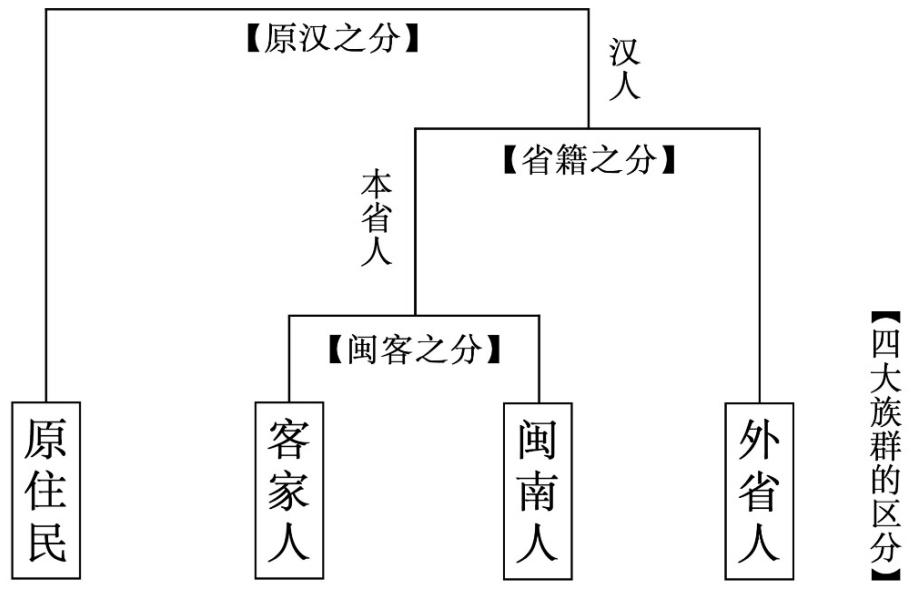

# 華東师範大学

East China Normal University

硕士学位论文

MASTER DISSERTATION

论文题目：历史、大众记忆与身份认同—台湾新电影（1982-1987）中的“外省人”书写

院系： 传播学院专业： 戏剧与影视学研究方向： 影视艺术理论指导教师： 聂欣如 教授学位申请人： 莫佳妮

# East China Normal University

# Title: History, Public Memory and Identity: "outsider" Writings in Taiwan New Cinema (1982-1987)

Department: School of Communication Major: Drama and Film Study

Research direction: _Film and Art Theory

Supervisor: Prof. Nie Xinru Candidate: Mo Jiani

# 戏剧与影视学博/硕士 $\surd$ 学位论文答辩委员会成员名单

<table><tr><td rowspan=1 colspan=1>姓名</td><td rowspan=1 colspan=1>职称</td><td rowspan=1 colspan=1>单位</td><td rowspan=1 colspan=1>备注</td></tr><tr><td rowspan=1 colspan=1>徐坤</td><td rowspan=1 colspan=1>副教授</td><td rowspan=1 colspan=1>华东师范大学</td><td rowspan=1 colspan=1>主席</td></tr><tr><td rowspan=1 colspan=1>周文姬</td><td rowspan=1 colspan=1>副教授</td><td rowspan=1 colspan=1>华东师范大学</td><td rowspan=1 colspan=1></td></tr><tr><td rowspan=1 colspan=1>鞠薇</td><td rowspan=1 colspan=1>副教授</td><td rowspan=1 colspan=1>华东师范大学</td><td rowspan=1 colspan=1></td></tr><tr><td rowspan=1 colspan=1></td><td rowspan=1 colspan=1></td><td rowspan=1 colspan=1></td><td rowspan=1 colspan=1></td></tr><tr><td rowspan=1 colspan=1></td><td rowspan=1 colspan=1></td><td rowspan=1 colspan=1></td><td rowspan=1 colspan=1></td></tr><tr><td rowspan=1 colspan=1></td><td rowspan=1 colspan=1></td><td rowspan=1 colspan=1></td><td rowspan=1 colspan=1></td></tr><tr><td rowspan=1 colspan=1></td><td rowspan=1 colspan=1></td><td rowspan=1 colspan=1></td><td rowspan=1 colspan=1></td></tr></table>

# 摘要

在台湾的特殊历史脉络下，“外省人”一词，被赋予了特殊的涵义。根据法国学者高格孚的说法，外省人指的是从1945年10 月到1955年2月的渡海迁台者。然而，所谓族群其实是被人们的族群想象界定出来的产物。长期以来，社会大众对于外省人的认知存在着诸多偏见。事实上，外省人散布于社会各个阶层，本就是多元化的人口，随着社会历史的变迁，全球化文化的冲击，代际的交替，外省人的身份认同亦随之变化。

本文聚焦于台湾新电影（1982-1987）“外省人”影片，这一时期正处于解严前夕，省籍矛盾逐渐浮现于公共领域的讨论之中，电影中外省人形象随之初露锋芒。台湾新电影中对于“外省人”形象的呈现与建构，一改以往传统影片中的刻板印象。循着社会历史、大众记忆和身份认同，通过梳理13部台湾新电影外省人影片，笔者将外省人人物形象分为三类，即自我封闭的外省父辈、自我放逐的外省子辈和芸芸众生一一外省人其他形象。多样化的外省人形象指向不同的身份认同，父辈倾向于落叶归根，子辈则是落地生根的代表。结合历史背景、自传回忆录、纪录片等史料，通过进一步比较分析，发现新电影较为真实地反映了外省群体的生活经历和生存状态。最后一章从空间维度切入，探讨外省人形象的象征性，各异的空间隐喻指向不同的身份认同倾向，揭示影片背后所蕴藏的丰富内涵。

关键词：台湾新电影，外省人，历史语境，身份认同

# Abstract

In the context of Taiwan's special history, the term "waishengren" was given a special meaning. According to the French scholar Corcuff, the "waishengren" refer to those who moved to Taiwan from October 1945 to February 1955. However, the socalled ethnic group is actually a product defined by people's ethnic imagination. For a long time, there have been many prejudices in the perception of the inhabitants by the public. In fact, the people of other provinces are scattered across all levels of society, and they are originally a diverse population. With the change of social history, the impact of global culture, and the intergenerational change, the identity of the people of other provinces has also changed.

This article focuses on the Taiwanese new film (1982-1987) " waishengren" film. This period is on the eve of the lifting of strictness. Provincial conflicts gradually emerged in the discussion in the public domain. The presentation and construction of the image of "outsiders" in Taiwan's new films have changed the stereotypes of the traditional films in the past. Based on social history, public memory and identity, by sorting out 13 new Taiwanese films of other provinces, the author divides the characters of "waishengren" into three categories, namely, self-enclosed parents of " waishengren", self-exiled children of " waishengren" and al living beings—— Other images of " waishengren". The diversified image of " waishengren" points to different identities. Parents tend to fall back to the roots, while children are the representatives of rooting. Combined with historical background, autobiographical memoirs, documentaries and other historical materials, through further comparative analysis, it was found that the new film more realistically reflects the life experience and survival status of other provinces. The last chapter cuts in from the spatial dimension to explore the symbolism of the image of " waishengren". Different spatial metaphors point to different trends of identity, revealing the rich connotation behind the film.

Keywords: Taiwan new movie； Waishengren； Public Memory； Identity

# 目录

摘要.

Abstract... 2

# 绪论.

第一节研究现状综述..

一、台湾新电影的研究  
二、关于外省人的研究  
三、涉及到外省人的影视研究 3

第二节研究目标.第三节研究意义，

# 第一章台湾新电影概述

# 第一节 台湾新电影的艺术特征 .10

一、文学电影 10  
二、自传体影片. 11

# 第二节 台湾新电影与“外省人” .11

一、“外省人”电影发展概况 12  
二、外省第二代主导的新电影运动概况 13

# 第三节 台湾“外省人”概述. .15

一、台湾四大族群 15二、“外省人”的缘起三、“外省人”的身份认同！ 19

# 第二章自我封闭：外省父辈. .21

# 第一节 封闭的外省长辈. 21

一、语言屏障 .21  
二、失语之人. .22  
三、自我禁 .23

# 第二节 退伍老兵的人生百态. 24

一、落魄老兵 .24   
二、婚姻不易 .26

# 第三节绵延不绝的思乡愁绪. 27

第四节 父辈的身份认同—落叶归根.. .28

# 第三章自我放逐：外省子辈. .30

第一节 躁动反叛的帮派分子. .30

第二节 迷失都市的青春少女.. .31

第三节 子辈的身份认同—落地生根. .32

一、多重语言 .33  
二、全球化文化. .34

# 第四章 芸芸众生：外省人其他形象 .36

第一节 其他父辈外省人形象.. .36

一、温柔慈爱的眷村爸爸 .36  
二、暴力疏离的外省父亲 .37  
三、传统母亲与无能父亲 .38

第二节 泼辣善良的上海舞女. .38

第三节无能为力的外省警察 .39

# 第五章外省人的象征性空间.. ..41

第一节 眷村空间， .42

一、眷村社区空间， .42  
二、封闭的家空间 .43

第二节 都市空间. .44

第三节校园空间.. ..46

结语..

参考文献. 51

后记. 57

附录.. .58

# 绪论

# 第一节研究现状综述

本篇论文是针对台湾新电影时期，“外省人”在电影中的书写展开研究和讨论，既要掌握台湾新电影运动的研究，也要梳理外省人的历史由来与相关定义。因此，以下将从台湾新电影、“外省人”和外省人的影视研究三方面进行研究现状综述。

# 一、台湾新电影的研究

论及台湾新电影，咸以1982 年陶德辰、杨德昌、柯一正、张毅执导的四段集锦式故事片《光阴的故事》作为开端。侯孝贤、杨德昌、吴念真、柯一正、张毅、小野等人在内的五十四位台湾艺文圈人士联名签署《台湾电影宣言》,于 1987年1月 24 日以大幅版面刊登于《中国时报》，台湾新电影作为一种集体创新运动，至此落下了帷幕。虽然台湾新电影运动只持续了短短6年，但新电影运动给台湾电影带来了深远的变革，使台湾电影的面貌焕然一新，一改原先台湾电影的创作观念，进一步发展了电影语言、电影美学，还培养出了一批台湾电影编导界的中流砥柱。

小野曾说新电影的发生是偶然的，新电影的界线是后来的人界定的。既然是台湾电影新浪潮，台湾地区的学者自然是最先开始对其展开研究的，资料也定是一手且最为详尽的，在新电影运动结束的第二年，知名影评人焦雄屏于1988 年出版了《台湾新电影》一书，从工业形势变化、创作者、内容形式题材，以及跟进与反思四个方面全面概述了台湾新电影运动的前因后果。1993 年出版的陈儒修《台湾新电影的历史文化经验》则更加侧重从历史文化的层面。专门以台湾新电影为写作对象的书籍目前出版的只有上述两本，除此之外，另外一些书籍则是从创作群体出发，例如 2018 年台湾电影中心出版的《台湾新电影推手一明骥》，新电影时期明骥时任中影公司的总经理，促使中影成为台湾新电影诞生的摇篮。他非常开明地把青年作家小野、吴念真招聘到中影公司委以重任，实施全新的电影制片政策，大胆启用新人导演。除此之外，以新电影时期的代表性导演侯孝贤、杨德昌作为研究对象的书籍不在少数，比如《杨德昌电影研究》《杨德昌》，此类书籍大都是把新电影时期作为导演创作生涯的一个重要阶段。

在论文、期刊方面，关于台湾新电影的研究十分丰富，研究内容大都从上述提及到的焦雄屏《台湾新电影》一书中的四个方面入手，有学者将研究内容概括为新电影主题题材研究、新电影艺术表现手法研究、台湾新电影创作群体研究、台湾新电影价值影响研究四个方面。在这些文章中，有关“外省人”的内容在新电影主题题材方面或多或少会被提及，但都是匆匆一笔带过，并没有对电影中“外省人”的书写展开具体的探讨。

虽然有关台湾新电影的研究成果颇为丰富，以侯孝贤和杨德昌两位大师作为研究对象的相关文章数不胜数。但台湾新电影的研究中有关外省人的部分并不算多，且都是片段化地提及，并不是研究的核心论题。在电影视角下的外省人研究就更为罕见了，虽然有不少研究眷村题材的论文和期刊，但这类研究主要还是着眼于外省人的居住地一一眷村，而没有更好地关注外省人本身及其"精神世界”。更进一步地明确在台湾新电影的背景下，研究影片中“外省人”书写的文章目前还未找到，因此本文试图填补这一空缺。

# 二、关于外省人的研究

无论大陆还是台湾，涉及外省人（本文提到的外省人专指台湾历史脉络涵义下的“外省人"）的研究都有不少，但大都以期刊或论文的方式呈现，罕见专门以外省人为主题的专著研究，唯一一本完全以台湾外省人作为研究主题的专著来自于法国学者高格孚。2004年，台湾发行了该书的中文译本《风和日暖一台湾外省人与国家认同的转变》。高格孚曾在台湾生活五年，并且主动接触、采访了不少外省人，作者身为外国人的身份，能够在较为客观的立场去探讨外省人身份认同问题。书中对“外省人”做出了某种概念史的梳理，探讨“外省人”这个词在不同时期中所指向的不同意义，并对外省人的认同困境、认同焦虑进行考察。

期刊和论文部分对于外省人的研究，横跨了城乡建筑、社会科学、文学、影视学等领域。文学研究方面对于外省人的探讨，主要涉及外省籍作家以及外省作家的文学作品，还有其文学作品改编的电影等（与影视相关的部分都将在下一小标题讨论)。杨佳娴《论战后台湾外省小说家作品中的“台北/人"》和肖奇的《1949年后台湾外省籍作家小说中的“台北人”研究》，关注1949 年后台湾外省小说家群体写作中有关"台北人"部分的研究。除了对外省小说家作为一个整体研究外，还有以个别作家为专门研究对象的部分，其中有关白先勇的研究最丰富，如苑婷《白先勇小说中的外省人意识—一以<台北人>为例》、林桶法《从<台北人>到<父亲与民国>看白先勇的离散情怀》等。朱家姐妹（朱天文、朱天心）、骆以军等外省籍作家也常被作为研究对象，本土作家文学作品中有意识地瓦解本省人与外省人的界限，如陈光兴《陈映真的第三世界：瓦解“本/外省人”、“台湾/中国人”“美国人”“欧洲人”》。同时也有不少研究以身份认同做为切入点的研究，如吴孟琳《流放者的认同研究—一以聂华苓、于梨华、白先勇、刘大任、张系国为研究对象》、蔡晓玲《"中国大陆移民”或“台湾外省人”—一从文学伦理学批评看骆以军小说中的身份认同》和蔡振念《论朱天心族群身份认同的转折》等。

离开文学视角，单刀直入从身份认同、身份认同展开研究讨论，如梁东玲的《尺度转换下台湾外省人的社会记忆与身份认同研究》和童一宁《外省第三代的国家认同》等。

电影从来不是孤立的存在，它与政治体制紧密交缠，且政府积极介入向来是台湾制片历史的一大特色。因此如果想要对台湾电影中的外省人书写有一个较为全面的把握，梳理台湾社会、历史、文化层面的“外省人”研究是必不可少的一环。

# 三、涉及到外省人的影视研究

如上述所言，直接以外省人作为研究主题的专著相当稀少，尤其是电影视角下的外省人研究，目前还未发现有相关著作。但在各种以台湾电影为研究主题的著作中，涉及到电影中外省人的部分亦有不少。

2018 年由周斌、厉震林主编的《新世纪以来台湾电影的新变化》一书中，收录了三篇与外省人相关的文章《怀乡主题与台湾新电影的文化情怀》《台湾电影中中国身份认同的建构与再现——以李行的<两相好>为例》《台湾女性导演电影中的原乡情结和情感认同》，这三篇主要是涉及怀乡主题、身份认同、原乡情结和情感认同，这些都是“外省人”研究中经常会涉足的方向。《万仁“超级三部曲”中的城与人》、《王童电影女性形象分析》、《李行电影及其比较研究》和《台湾电影对身份认同的观照及其变迁脉络》四篇文章，收录在 2017年由周斌、厉震林主编的《台湾电影：历史、产业与美学》一书中。这四篇文章虽涉及到了“外省人”，但都仅止于一笔带过。

外省人的居住地—一眷村—一台湾历史脉络下特有的居住群落，成为了诸多外省第二代作家笔下的故事场域，同时备受电影创作者青睐，搬上了大小荧幕，成为不少电影故事发生的背景地。眷村题材的影视作品是台湾独特的文化现象，于丽娜的《影像中的眷村：一个时代的记忆一 -台湾“眷村电影”的轨迹与特质》一文，从“眷村”电影的发展脉络、两代人的历史书写、历史表达：从缺席到在场三个方面出发，肯定了“眷村电影”是一次试图从个人记忆出发，建构集体记忆的尝试，代表台湾历史的一个缩影。邱海修《台湾眷村题材影视作品研究》（2017)对眷村题材的影视作品做了较为完整的梳理，从发展历程、视听美学、文化意义三个维度出发，分析、比较不同作品之间的差异，期以确定眷村题材影视作品的价值所在。眷村电影大都关注父辈历史的重建、个体成长经验的书写，逐渐发展成一场自觉的文化寻根之旅，“眷村文化”早已超越了眷村空间，成为台湾文化的一部分。

综上所述，有关台湾新电影的研究成果颇为丰富，尤以侯孝贤和杨德昌的研究数量最为庞大。完全以外省人作为研究对象的研究虽然有，但数量并不多，出版的著作只有法国学者高格孚的《风和日暖一台湾外省人与国家认同的转变》，不过在文学领域，有关台湾外省籍作家的研究非常之多，主要是从作家及其作品切入，大都集中在白先勇的作品研究。在电影视角下，将外省人作为研究对象的论文、期刊比较罕见，但有不少以眷村主题为研究对象的论文和期刊，但这类研究主要还是着眼于外省人的居住地一一眷村—一衍生出来的一系列眷村影视剧，

而不是专注于外省人本身。

# 第二节研究目标

1949 年以来，台湾与祖国大陆长期分离，一度处于敌视状态，两岸缺乏沟通交流，直至互联网发达的当代社会，两岸依旧隔阂，对于外省人49之后在台湾的经历，大陆人知之甚少，台湾的年轻一代也极少有人回望过去。新电影时期的电影中对“外省人”进行了真实、诚恳的书写，如果两岸有更多人，尤其是年轻人了解新电影时期电影中外省人的书写，了解 49 年后外省人的经历，对于两岸加深彼此理解，消除隔阂，定有不少益处。

本文在全球化文化空间内，循着台湾历史、文化的脉络，将目光投向台湾新电影时期，关注电影中的外省人书写，探讨在新电影的影片中呈现出了什么样的外省人形象，在空间维度探讨外省人形象是如何被构建的及其象征意义为何，并籍此进一步讨论影片中外省人身份认同的想象同时，结合历史背景、自传书写、纪录片和回忆录，将电影中的外省人形象和现实中的外省人形象相比较，探究不同导演在不同影片甚至是同一影片中，塑造了不同的外省人形象的原因为何。希望通过外省人形象的梳理，对“外省人”这一概念有更为深入的理解。

# 第三节研究意义

目前的台湾社会，普遍认为由“四大族群”构成，分别为“原住民”、“闽南人/福佬人”“客家人”“外省人”。不过，我们必须意识到“族群（ethnicity）”并不是原生性的，而是族群团体的族群想象所建构而成的。在台湾的特殊历史脉络下，“外省人”被赋予了特殊的涵义。根据法国学者高格孚的说法，“外省人”指的是“从1945年10月至1955年2月的渡海迁台者，这个称呼在当时带着些许官方色彩”¹。长期以来，社会大众对于“外省人”的认知存在着很多不同的偏见，比如认为外省人是一个单一文化的族群，怀有一致的身份认同，在政治、经济、社会各方面享有特权。事实上，外省人散布于社会各个阶级，退伍老兵、性工作者、贩夫走卒、庙堂大夫…这些外省籍社会边缘人同样是历史的受害者。我们应该正视这一点，这群来自不同省份的“外省人”本就是多元化的人口，他们之间本身就存在差异性，随着政治、历史、社会的变迁，个人生活经验的不同，代际之间的差异性亦越来越明显。

本尼迪克特·安德森（Benedict Anderson）在《想象的共同体》中提及：“资本主义、印刷科技与人类语言宿命的多样性这三者的重合，使得一个新形式的想象的共同体成为可能”。 $^ { 2 } 2 0$ 世纪下半叶，电影与电视已成为主流沟通的模式，具有召唤和支撑“想象共同体”（imaginedcommunities）的强大力量。台湾电影界关于外省人形象的书写起始于国民党偏安于台湾之后，随着社会政治历史的发展，外省人的荧幕形象也不断变化着。除了大环境的制约之外，不同导演，甚至同一导演的不同创作阶段，都会对电影中外省人的形象塑造产生影响。

初期威权政体下，台湾电影不得不完全服务于政治，比如剧情片《永不分离》（1951）把台湾本省及外省人之间的歧见，归在中共地下工作者在工厂发动工潮的结果。60-70年代，随着“健康写实”电影路线的提出，台湾电影的创作风气得以改变，如李行导演的《两相好》（1961）、《街头巷尾》（1963）和宗由导演的《宜室宜家》（1962）展现了本省人与外省人比邻而居，邻里之间打打闹闹、和谐相处的银屏形象。不过出于“战斗文艺”的限制，这一时期的电影呈现出健康积极，讴歌好人好事，教化社会的面貌。荧幕上的愿景是美好的，但1947年的二二八事件之后，本省人与外省人之间的嫌隙越发明显，这些矛盾在意识形态的作用下尚处于遮蔽状态。

台湾新电影运动的兴起正值台湾解严前夕，社会氛围动荡不安，各种社会运动、社会议题如火如茶地进行着。“1980 年代中期之后，随着台湾政治民主化与本土化的转型，过去潜藏在台面下的省籍矛盾、情结或冲突，逐渐浮现到公共领域的讨论中。”台湾新电影的工作者大都是外省第二代，从新电影的两位大师侯孝贤、杨德昌，到编剧小野、朱天文，录音杜笃之，演员“国光帮”…儿时成长于眷村，从小浸泡在父辈的故事中，亦经历了台湾的白色恐怖时期，他们对于外省人的书写热情不遗余力地展现在了台湾新电影的创作之中。这批电影人立足人文视角，一反以往的“逃避主义”，追求“写实主义”，有些导演直接在影片中大胆探究外省人问题，大部分导演则是从某一类外省人，比如退伍老兵，作为影片的主人公进行叙述。新电影的作品中呈现出了具有纪实性的“真实生活”（台湾乡土与都市空间)，然而，影片中的“真实”并不等同于现实中的真实，镜头中呈现的都是经过精心挑选的画面，导演的个人政治取向和情感倾向难以避免地投射在电影作品之中。正如约翰·伯格在《观看之道》中所说的那样，“影像记录了制作者的具体观点”4。台湾新电影中关于“外省人”的书写，亦打上了电影制作者—一导演的个人印记。

因此，本文试图以台湾新电影中的外省人作为研究文本，分析影片中外省人形象的建构，进一步与历史背景、回忆录等史料研究进行比较分析。进而通过空间关系解读影像外省人的象征意味，借此进一步探寻“外省人”的身份认同及其背后的深层隐喻，思索社会历史、大众记忆、身份认同、影像再现与写实主义之间的关系。台湾新电影时期影片中“外省人”呈现出何种人物形象，影片里所构建的外省人形象如何体现身份认同，不同的影片之间或者同一影片之中身份认同想象的差异性，差异性背后所隐藏的导演的情感倾向，这些都是本文想要剖析和阐述的问题。

目前，学术界对于台湾电影中“外省人”的研究大都是片段化解读，以触及外省人某一方面问题进行研究的，比如探讨台湾新电影导演杨德昌的《牯岭街少年杀人事件》时，所涉及的“本省”与“外省”的冲突。迄今还没有集中讨论台湾新电影（1982-1987）中外省人形象及其身份认同想象的研究。因此，本文将目光聚焦于省籍矛盾渐渐浮出水面的80 年代，尝试讨论台湾新电影时期影片中的外省人形象、省籍冲突、身份认同想象等问题，试图进一步认识“外省人”的“精神世界”。

诚如侯孝贤导演在2007年的讲座所言，关注老兵和内地新娘等议题的电影，其实是从台湾的角度切入，期许推进两岸彼此理解。自1949 年之后，台湾与祖国大陆长期分离，一度处于敌对状态，两岸缺乏沟通交流，直至互联网发达的当代社会，两岸依旧隔阂，关于外省人在台湾的生存状态，大陆人知之甚少，台湾的年轻一代亦云里雾里。所有人都讨论着现在与将来，却极少有人回望过去。本文将“外省人”视作一个尚未消失的历史脉络，聚焦于台湾新电影中的外省人书写，探索影片中此脉络下的个体如何看待自己与社会中身处其他脉络的个体，正是促进彼此了解、消除隔阂的方式之一。

# 第一章 台湾新电影概述

新电影是迄今为止，台湾影史最关键的转折节点，为日薄西山的电影产业注入新鲜活力。“新电影”这个名词，始见于80年代初的报刊杂志，随后逐渐在影评人与年轻观众间蔚然成风。“一般的认定，是平均年龄在三十岁上下的导演，开始得到机会，并互相支持扶携，拍出在形式及内容上与当时主流电影较不同的作品，形成某种‘改革’的印象，并在影评人及一般观众中受到重视，渐与较老的工业生产、叙事体系分家。”论及台湾新电影，咸以1982 年陶德辰、杨德昌、柯一正、张毅执导的四段集锦式故事片《光阴的故事》作为开端。“台湾新电影作为一种集体的艺术创新运动，在1987年以54位台湾电影工作者联名发表《台湾电影宣言》的形式宣告结束。”新电影运动仅存在短短数年，但在此期间诞生了走向国际的电影大师和经典作品，新电影精神更是影响了一批又一批的年轻电影人。

一直以来，台湾艺文界对外省人的生存状态与身份认同危机报以关注，尤其是电影界，更是成为了探讨这一主题的先驱。70年代末80 年代初，国际政治舞台风云变幻，台湾当局在国际上连连遭遇重挫，内部民众的不满情绪亦日益高涨，陷入内外交困的境地。因此，台湾当局启动政治体制民主化进程，进入1987 年，台湾终于解除 1949 年起施行的长期“戒严”，走向了“解严”。台湾新电影时期恰好处于台湾族群想象萌芽至解严前夕，根据学者王甫昌的研究，“台湾目前的族群想象，最先约在1980年代初期才开始萌芽”7，这意味着借由研究新电影中的“外省人”书写，可以进一步探讨外省人族群想象、省籍关系、身份认同是如何通过导演的电影语言呈现于银幕之上。不过由于新电影时期还未解严，影片的外省人书写还是有所克制，虽不如解严之后的《香蕉天堂》（1989）《牯岭街少年杀人事件》（1991）等更具有批判现现实主义美学精神的一批力作振聋发聘，但亦打上了特殊的时代烙印。新电影处于政治上即将解严又尚未解严、开放又未完全民主的尴尬时间点，冒着电影审查的种种压力，竭尽全力在影片中为底层小人物发出呐喊，正是因为新电影外省人书写的铺垫，才会有解严之后批判力度更大的佳作问世。

# 第一节 台湾新电影的艺术特征

# 一、文学电影

侯孝贤曾在纪录片里直言黄春明和其他乡土作家的小说，对新电影导演影响至深。因为这是他们这批年轻电影工作者的成长阶段、学生时代的主流、在学期间阅读的作品。“黄春明故事里的世界，正是我们成长的世界，那是一个我们所有人都非常熟悉的世界。更重要的是,那是一个在电影里尚未被呈现、被表达的世界。一旦有机会把这个世界搬上大荧幕，我们就迫不及待想去做。”台湾新电影浪潮的这批年轻电影人，成长于乡土文学盛行的年代，深受乡土文学作家的启发。新电影开始之初，三段式集锦电影《儿子的大玩偶》（1983)，将乡土作家黄春明的三部短篇故事搬上大银幕，票房大获成功，使黄春明为代表的乡土作家，一时之间炙手可热。除了乡土文学以外，60 年代的重要小说家白先勇，以及李昂、廖辉英、朱天文等文坛才女也备受新电影导演青睐。

台湾文学与电影世界的关系相当密切，除了因为新电影工作者对乡土小说、白先勇等作品和作家有相当多认同感之外，还和新电影工作者们年纪尚轻，生活经验有限，缺乏优质的原创编剧有关。其次，当时台湾文坛有影响力的作家相继尝试进入电影届，成为重要的电影幕后工作人员，例如新电影的两位重要推动者-小野和吴念真，都是颇有名气的作家，朱天文、黄春明也担任过不少新电影的编剧工作。

此外，新电影期间，很多影片都是根据一些知名小说作品改编而成。例如，陈坤厚《小毕的故事》（1983)改编自朱天文1983 年创作的小说。王童导演的《看海的日子》（1983）改编自黄春明的小说，另一部电影《阳春老爸》（1985）取材于于光中的舞台剧《阳光季节》，表达了外省第一代背井离乡、家破人亡的悲惨命运。《金大班的最后一夜》（1984）则是改编自白先勇的短篇小说。张毅《我这样过了一生》（1985)，改编自1980 萧颯《霞飞之家》。万仁的《惜别海岸》（1980）改编自萧讽《小页》。

# 二、自传体影片

不同于上一代导演，台湾新电影导演摒弃以商业利益为目标的逃避主义，也不再沉迷与琼瑶式浪漫爱情的幻想，而是将目光聚焦于日常生活的细微处。不过由于这批导演创作者年纪尚轻，因此常常从自己的成长经历和生活感受中寻找创作的灵感。自传体电影是台湾新电影非常重要的形式之一，我们可以把大量自传的引用视为新电影初期的一个反射动作。“在遗产面临危险和文化系谱必须重新检验或书写的状况下，自传往往是一种创造新身分的新形式。”9自传是一种自我揭露的形式，所以不管旁白来自个体或群体，咸用第一人称叙述。为了与现在达成协议，历史和记忆都得受到检察，这就是为何这些自传电影大多都以现在式来陈述，比如《小毕的故事》是朱天文的第一个剧本，标题中“故事”二字已经含有强烈的自传倾向。

“在定义国家时，官方历史和大众记忆之间的拉扯，永远是斗争的核心。”1自传体影片呈现多元繁杂的大众记忆，试图以此慢慢瓦解官方历史的权威性，这是以往银幕上从未描述过的个人经验，填补被官方历史删除的记忆空白。《童年往事》是侯孝贤一家人在台生活的经验，男主阿孝便是导演自己的化身。《冬冬的假期》则是编剧朱天文自己的童年生活，以她的悬壶济世名医外公的生活经历作为素材，加以文学化改编。《阳春老爸》的编剧于光中，不但自编自写自家故事，甚至自己扮演自己。

# 第二节台湾新电影与“外省人”

众所周知，电影是绝佳的造梦机器，但这并不意味着电影能够任意无中生有。因此，台湾电影有关“外省人”的刻画，自然是“外省人”群体出现之后，才逐渐浮于电影银幕上。因此，台湾电影中关于外省人形象的书写，起始于国民党偏安于台湾以后。随着社会政治历史的发展，外省人的荧幕形象也不断变化着。除了不同时期历史大环境的制约之外，不同导演之间的省籍差异、成长经历，甚至同一导演的不同创作阶段，都会对电影中外省人的形象塑造产生深远的影响。

# 一、“外省人”电影发展概况

# 1．50年代的外省人电影

初期威权政体下，台湾电影不得不完全服务于政治，作为政府宣传政治思想的喉舌，制作大量反共电影，比如剧情片《永不分离》（1951）“把台湾本省及外省人之间的歧见，归在中共地下工作者在工厂发动工潮的结果”11。这些影片粗制滥造，遭遇市场冷落，在观众间不受欢迎。从香港进口的国语片此时蔚为主流，广受追捧，成为台湾外省新住民重要的生活娱乐。

2．“健康写实”时期的外省人电影

进入60 年代，随着“健康写实”电影路线的提出，台湾电影的创作风气得以改变，如李行导演的《两相好》（1961）、《街头巷尾》（1963）和宗由导演的《宜室宜家》（1962）展现了本省人与外省人比邻而居，邻里之间打打闹闹、和谐相处的景象。不过出于“战斗文艺”的限制，这一时期的电影只在银幕上呈现出健康积极，讴歌好人好事，教化社会的面貌。任何影片中，本省人与外省人总能跨越重重矛盾，冰释前嫌，迎来和乐融融的大结局。《两相好》里的陈先生在临近结尾时说道：“其实外省本省不都一样吗,就是说话听不大懂，咱们都是中国人。”1950 年至1970 年之间，本省人和外省人之间确实存在不少差异和隔阂，不过省籍矛盾并没有进一步的冲突恶化。但荧幕上的美好愿景是美化后的“现实”，而不是普遍历史现实。自从1947 年的二二八事件之后，本省人与外省人之间结下了矛盾的种子，不过在意识形态的作用下，电影里只呈现和乐融融的一面，从不展现矛盾，本外省隔阂在该时期的影片中长期处于遮蔽状态。

3.台湾新电影时期的外省人电影

台湾电影进入70年代，迫于岛内外形势的发展愈发严峻，“国民党当局对电影的管制逐渐放松，并采取了一些振兴电影事业、推动电影创作发展的措施。”$^ { 1 2 } 8 0$ 年代初期，负笈美国的青年编导杨德昌、柯一正、万仁、曾壮祥、小野等从海外归来，出身自大制片厂的侯孝贤与陈坤厚亦从机构的僵化束缚中脱身而出，他们志同道合，秉持着同样的电影理念，密集地合作拍片。这群年轻的电影人大都是外省第二代，从新电影的两位旗手侯孝贤、杨德昌，到编剧小野、朱天文，录音杜笃之，演员“国光帮”，甚至还有很多工作人员，儿时成长于眷村，从小浸泡在父辈的故事中，亦经历了台湾的白色恐怖时期，他们对于外省人的书写热情不遗余力地展现在了台湾新电影的创作之中。相较于之前电影为政治服务，“台湾新电影摆脱1970 年代商业电影的草率和制式化风格，转往重视细节、理智的取向发展，新电影导演把视野带回台湾的土地，回到每天的真实生活，环绕我们身边的人与事”13。

台湾新电影运动的兴起正值台湾解严前夕，社会氛围动荡不安，各种社会运动、社会议题如火如荼地进行着。进入1980 年代中期，随着台湾政治体制的民主化改革、本土化的转型，以往处于遮蔽状态的省籍歧见、省籍冲突，逐渐进入大众视眼，常见于公共领域的讨论之中。新电影导演立足人文视角，一反以往的“逃避主义”，追求“写实主义”，敢于启用非职业演员，在影片中呈现出具有纪实性的“真实生活”（台湾乡土与都市空间)。然而影片中的“真实”并不等同于现实中的真实，镜头中呈现的都是经过精心挑选的画面，导演的个人政治取向和情感倾向难以避免地投射在电影作品之中。台湾新电影中关于“外省人"的书写,亦打上了导演的个人印记。

# 二、外省第二代主导的新电影运动概况

毋庸置疑，侯孝贤与杨德昌绝对是台湾新电影运动中最杰出的电影作者，某种程度上，两人几乎是台湾新电影的同义词。追根溯源，两位电影大师出生于同一年（1947)，祖籍都是广东梅县。王童、万仁、张毅、李佑宁、虞戡平…这些都是在新电影时期鼎鼎大名的导演，创作出大量优秀电影作品，他们和侯孝贤、杨德昌一样，同属于外省第二代。眷村子弟小野留学归国后，应明骥之邀进入“中影”制片企划部，自此从文学界跨足电影圈，推动了台湾新电影的诞生。侯孝贤导演长期合作的御用编剧朱天文，是著名外省作家朱西宁的女儿。

除了导演和编剧之外，大银幕前的演员，如《小毕的故事》里的钮承泽、廣宗华，《风柜来的人》中的张世，他们都是毕业自国光艺校的年轻演员，这群学生演员被媒体亲切地称为“国光帮”,并且他们大都是在眷村长大的外省第二代。还有不少幕后的工作人员，如录音大师杜笃之，摄影师李屏宾、电影制片人张华坤也同样都是外省二代。

纵观台湾新电影的创作发展，外省电影工作者的数量竟如此庞大，甚至可以说这批出生于1940 年代晚期和1950 年代间的台生第一代（外省第二代)，在 80年代台湾电影界，从中影内部掀起了一场改变台湾电影的狂风暴雨。

台湾新电影时期的众多电影工作者，都是成长于眷村的外省第二代。眷村子弟心中涌动着强烈的追根溯源冲动，心怀疑问和同情，忠实地记述自己或身边人的生活经验与人生经历，一时涌现出大量有关外省人的优质影片。

<table><tr><td colspan="1" rowspan="1">年份</td><td colspan="1" rowspan="1">导演</td><td colspan="1" rowspan="1">电影名称</td></tr><tr><td colspan="1" rowspan="1">1983</td><td colspan="1" rowspan="1">陈坤厚</td><td colspan="1" rowspan="1">《小毕的故事》</td></tr><tr><td colspan="1" rowspan="1">1983</td><td colspan="1" rowspan="1">虞戡平</td><td colspan="1" rowspan="1">《搭错车》</td></tr><tr><td colspan="1" rowspan="1">1983</td><td colspan="1" rowspan="1">万仁</td><td colspan="1" rowspan="1">《儿子的大玩偶》(第三个短片《苹果的滋味》）</td></tr><tr><td colspan="1" rowspan="1">1983</td><td colspan="1" rowspan="1">王童</td><td colspan="1" rowspan="1">《看海的日子》</td></tr><tr><td colspan="1" rowspan="1">1984</td><td colspan="1" rowspan="1">李佑宁</td><td colspan="1" rowspan="1">《老莫的第二个春天》</td></tr><tr><td colspan="1" rowspan="1">1984</td><td colspan="1" rowspan="1">白景瑞</td><td colspan="1" rowspan="1">《金大班的最后一夜》</td></tr><tr><td colspan="1" rowspan="1">1985</td><td colspan="1" rowspan="1">侯孝贤</td><td colspan="1" rowspan="1">《童年往事》</td></tr><tr><td colspan="1" rowspan="1">1985</td><td colspan="1" rowspan="1">张毅</td><td colspan="1" rowspan="1">《我这样过了一生》</td></tr><tr><td colspan="1" rowspan="1">1985</td><td colspan="1" rowspan="1">万仁</td><td colspan="1" rowspan="1">《超级市民》</td></tr><tr><td colspan="1" rowspan="1">1985</td><td colspan="1" rowspan="1">虞戡平</td><td colspan="1" rowspan="1">*《台北神话》</td></tr><tr><td colspan="1" rowspan="1">1985</td><td colspan="1" rowspan="1">王童</td><td colspan="1" rowspan="1">*《阳春老爸》</td></tr><tr><td colspan="1" rowspan="1">1985</td><td colspan="1" rowspan="1">李佑宁</td><td colspan="1" rowspan="1">《竹篱笆外的春天》</td></tr><tr><td colspan="1" rowspan="1">1987</td><td colspan="1" rowspan="1">万仁</td><td colspan="1" rowspan="1">《惜别海岸》</td></tr><tr><td colspan="1" rowspan="1">1987</td><td colspan="1" rowspan="1">虞戡平</td><td colspan="1" rowspan="1">*《孽子》</td></tr><tr><td colspan="1" rowspan="1">1987</td><td colspan="1" rowspan="1">侯孝贤</td><td colspan="1" rowspan="1">《尼罗河女儿》</td></tr></table>

\*未找到片源的影片

# 台湾新电影时期外省人电影一览

如上表所示，台湾新电影时期，共有十五部影片涉及“外省人”书写。需要注意，未找到片源的影片《台北神话》《阳春老爸》《孽子》，没有纳入本文的讨论。除此之外，《搭错车》、《老莫的第二个春天》、《金大班的最后一夜》、《童年往事》、《我这样过了一生》、《竹篱笆外的春天》、《惜别海岸》和《尼罗河女儿》八部影片主人公都是外省人；余下的四部影片《小毕的故事》《苹果的滋味》《看海的日子》《超级市民》，涉及到外省人书写，但影片主人公并非外省人。

# 第三节台湾“外省人”概述

# 一、台湾四大族群

所谓族群（ethnicity)，安东尼·D·史密斯给族群的定义为：“与领土有关，拥有名称的人类共同体，拥有共同的神话和祖先，共享记忆并有某种或更多的共享文化，且至少在精英中有某种程度的团结。”台湾学者王甫昌则综合一般研究者对族群所下的定义，认为族群可以简单叙述为：“一群因为拥有共同的来源，或者是共同的祖先、共同的文化或语言，而自认为、或者是被其他的人认为，构成一个独特社群的一群人。”15

从上述学者对于族群的定义中，我们不难发现一个共通性，这些族群的定义中隐含了两个不同的重要方面。一是从客观的角度出发,如强调族群的共同文化、共同祖先、共同来源、血缘、生理特征等，这些因素都是显而易见的，并与其他族群之间有明显的差异。另一方面则是从主观的角度出发，如族群自认为是一个独特团体，不同于其他社群，并且这种族群意识得到社会中其他人的认可。正如史密斯所强调的那样，“族群并不是因为有一些本质性的特质(如血缘关系或语言文化特质)，所以才存在。族群团体其实是被人们的族群想像所界定出来。”1综上所述，族群绝不是原生性的，实际上是一种人群分类的想像方式，或者说是一套分类人群的意识形态机制。

今天的台湾社会，普遍认同由“四大族群”组成，分别为“闽南人/福佬人”“客家人”“外省人”、“原住民”。

  
图1.台湾四大族群在人群分类上的组成"

四大族群的区分，其实不是长久以来存在的，并且没有明确清楚的客观分类基础。实际上，直到1990 年代，政治人物出于政治目的的需要，融合了台湾历史上各个不同时期出现的三种不同的相对性的族群分类方式，构建了四大族群的族群想象。

第一种相对性的区分是“原住民”与“汉人”的区分；第二种是汉人中的“本省人”与“外省人”的区分；第三种区分是本省人之中“闽南人”与“客家人”的区分。如图1所示，一个人可能拥有多重的族群身份，并且个人仍然可以有不止一个的族群认同，比如一个闽南人，同时也兼具本省人及汉人的双重身份。“四大族群”概念的出现，事实上是政治力量互相较量、妥协，以及在民众间互动的社会建构结果。

# 二、“外省人”的缘起

“外省人”一词，在日常语境中，一般理解为“外来人（outsider)”，是相对于“本地人”而言的，泛指来自其他省份或地区的非“本地人”。然而在台湾的特殊历史脉络下，“外省人”一词逐渐被赋予了特殊的涵义。根据法国学者高格孚的说法，“外省人”指的是“从1945年10月到1955年2月的渡海迁台者，这个称呼在当时带着些许官方色彩”8。高格孚推断，“外省人”最早应该是由陈仪政府开始使用的半官方词汇，早在一开始，外省人一词就被官方赋予了某种政治内涵（意识形态)。本外省人的族群意识并不是一蹴而就的，光复初期的台湾社会，虽然本省人、外省人之间有着明显的差异，但当时台湾民众的“中国人”意识是溢于言表的，与外省人的差异主要在于不熟悉国语或不了解祖国文化。

# 1.1945-1949 年之间

1945 年8月15日，日本天皇宣布无条件投降，继1985年清朝政府签订《马关条约》割让台湾给日本，过去了整整五十年，台湾终于重回祖国怀抱。蒋介石任命陈仪为台湾的“受降”和“接收”主官，同时任命其为台湾行政长官兼警备总司令，带着两个师团赴台接收，这是第一批从大陆来台的“外省人”。

根据王甫昌的说法，日据时期，台湾人称自己为“本岛人”、日本人为“内地人”。直到二战结束，“本省人”的说法才不胫而走，成为台湾人的习惯用语。在这样的社会语境下，1945 年之后的渡海迁台者，即中国其他省份迁入台湾省的这些民众，自然而然被称为“外省人”，此时的“外省人”称谓并没有“不平等认知”的成分，强烈的意识形态差异还未形成。

随后，1945至1949 年之间，还有一群零零散散赴台的外省人。当时中国的大众文化(包括日本殖民者)与国民政府的论述，将台湾建构成一个物产丰饶，具有热带风情、异国情调与现代化的世外桃源，激起了民众对光复后台湾的美好幻想和猎奇心理。王童在1989 年的《香蕉天堂》中将台湾描述为富饶的香蕉天堂，“香蕉神话”的种子从此在男主门门心中生根。因此，当时不少人以旅游、经商或为政府工作而欣然前往台湾，这些人大都抱着进行一次“有返乡打算的国境之内的旅行”的念头，而不是永久地定居台湾。另一方面，1947年国共内战全面爆发，有些民众选择暂时迁居台湾，借此远离战争纷扰，心中打算战争平息后再返回大陆，比如侯孝贤导演一家。

# 2.二二八事件

台湾1947年的“二二八”事件发生前后，“工人失业，城市居民破产，大量走私，米粮外溢，粮食恐慌，物价飞涨，民众挣扎在贫困线上”19。2月27日，台北市内一名贩卖私烟的寡妇，遭到开展取缔工作的公卖局职员殴打，导致与民众发生冲突，冲突过程中，有一位民众中弹身亡。这是二二八事件的导火线。第二天 28日，愤怒的民众冲击行政长官公署殴打行政人员，政府进行了武力弹压，造成了流血事件，从而引起全台民众暴动。大批民众对国民党政府失去信心，一些偏激的民众，甚至在街头只要发现外省人就一顿暴打，说明本省人的不满渐渐变成对外省人的族群性反感，由此外省人的（弱势）族群意识，才逐渐被确立。而在本省人的意识中，外省人等同于军队、统治者、特权阶层，本省人是相对的弱势群体—一被统治者、一般民众。

# 3.1949年之后

真正构成今日台湾外省族群“主力”的移民潮，发生在1949一1951年之间，迁徙人数占总人数的九成。当时国民党政权因内战失利，撤退来台。除了大批跟着国民党一起撤退的军队、政府官员，还包括社经资源较丰富的商人、知识分子，部分学生、百姓。1949 来台的具体人数至今众说纷绘，难以定论，根据学者们的推估，“大致有百万名的中国大陆各省军民来台”20。1949 年5月 20日，“国民党发布“戒严令”，全省进入封闭状态，限制出入境，实施军事管制，封锁大陆相关消息，从此海峡两岸长期处于隔绝状态，无论是基于何种原因的来台者，在国民党实施全岛“戒严”后，外省人一时之间无法返回大陆，直到 80年代后期才陆续开放探亲。从此，这批赴台者不再只是“外来人”，而是变成了离散在孤岛他乡的外省人、“流亡者”，返乡之日遥遥无期。

# 三、“外省人”的身份认同

台湾历史一路走来，先是400多年前的闽、客移民，中间又历经西班牙、荷兰的殖民占领，1985 年又被清政府割让给日本，直到1945 年才得以回归祖国。台湾复杂的历史背景，使族群认同、身份认同问题一直困扰着民众。所谓身份认同，是指“个人对自己所属的群体特征所持的认可和接纳的态度”21，研究华裔流散现象的学者王赓武指出“在战后的中国世界，自1949 年中华人民共和国成立以来，无论是在国内还是在国外，对于流散者的历史和生活，实际上存在着两种相互竞争的范式，即‘落叶归根’和‘落地生根’。”22两者不是对立排斥的关系，而是一个移动的、连续的、同时存在的过程。台湾外省人指的是1949 年前后渡海迁徙来台的大陆各省人士，符合王赓武流散研究中的时间限定。1949 年之后，台湾与祖国大陆分离，两岸长期处于隔绝状态。这些异乡人不可避免地“无家可归”，沦为“亚细亚的孤儿”一一某种意义上的流散者、流亡者。结合王赓武的理论，外省人的身份认同可归纳为两类，分别是落叶归根和落地生根。

记忆是身份认同的另一大要件，私领域的记忆构成回忆录或自传，公领域的记忆则成为历史。哈布瓦赫指出，集体记忆不是一个既定的概念，而是一个社会建构的概念，3并且"每一个集体记忆，都需要得到在时空被界定的群体的支持。”2但凡处于社会秩序之下，社会参与者拥有一个共同记忆，一旦成员内部对于过去的社会记忆产生分歧，那么成员之间便失去共享经验的可能。不同的代际之间拥有不同的社会记忆，因此这种情形在代际交流之间最为显著，外省人的长辈与子辈拥有不同的社会记忆经验，身份认同的倾向自然也不尽相同。正如保罗·康纳顿所言，“一代人的记忆不可挽回地锁闭在他们这一代人的身心之中”25。老一代根深蒂固的乡愁，中年一代的抑郁与绝望，下一代的亲炙台湾土地。台湾新电影多自传影片，电影中往往私领域与公领域记忆相互交织，有学者指出，电影等传播媒介“可以通过塑造记忆进而决定人的身份认同”26，故而厘清台湾新电影中外省人的身份认同，才能深入探究“外省人”这一概念的含义所在。

# 第二章自我封闭：外省父辈

大规模人口迁徙，在泱泱大国的历史载册中，自然数不胜数。每一次的大迁徙，改变了无数当事人的命运，甚至连整个民族的命运也随之改变。台湾新电影中再现的父辈，即 1949 年大迁徙的当事人，他们是跟随国民党撤退台湾的外省第一代。奔波于烽火连天的战争年代，浮生乱世、妻离子散、家破人亡，每个人都是被历史潮流所裹挟的浮萍。这群背负沉重时代记忆的渡海迁台者，自从退守至海上一隅一一台湾，回归故国的强烈意愿始终萦绕在他们心头，经历漫长的等待之后转化为一种渴望，渴望又在无止境的等待之后转变成了一种延绵不绝的失落。老媒体人王健壮自述从小便听他父亲反复哼唱“我好比笼中鸟,有翅难展…”,这种坐困围城的悲凉心境，深深印刻在老一辈的心中。

# 第一节 封闭的外省长辈

# 一、语言屏障

早在中华民国建立之初，便以北京话作为国语，当时台湾早已是日本殖民地，岛上的居民未能同大陆居民一起，经历此一语言的转变，因此完全不熟悉国语。另一方面，日本在台实行日语体制化。根据殖民政府的官方统计，1940 年左右，台湾已经有七成左右的民众，可以毫无障碍地使用日语交流沟通。至此，日语成为继地方性语言之外，民众之间沟通的另一条语言渠道。

语言文化上的差异，导致本省人与外省人日常生活中无法进行正常沟通交流，基本上处于鸡同鸭讲的状态,更何谈彼此理解。不止本外省之间的存在语言差异，外省人内部同样如此，涵盖了三十五个不同省份的语言文化差异。对于很多老一辈的外省人来说尤甚，她们大都一生只会一种方言（比如上海话、杭州话等)。虽然政府大力推行国语，但老一辈们学习能力日益退化，自然不能同年轻人相提并论。对于“国语”学习，老一辈外省人显然是力不从心的，“年纪愈大的就愈严重地被隔离在本省人社会之外”27。《童年往事》中阿孝的奶奶就是现实中老一辈沟通状况的真实写照。祖母已经80 岁了，掌握一门新的语言显然是不可能之事。影片中，祖母试图带着阿孝回大陆祭祖，在“返乡”途中，停留在一家本省人经营的刨冰店，祖母问老板娘距离梅江桥还有多远。可惜不暗客家话的店中老人和老板娘都不得要领，一遍遍彼此确认着“你听懂了吗”，最后还是没能跨越语言的障碍，只能露出略带尴尬的笑容，疑惑不解的摇头示意。

# 二、失语之人

失语原本为医学用词，上个世纪末，国内对失语的研究，不再局限于医学，衍生出了文学、艺术、经济等新领域。新电影中的失语者，并非只是简单的身体功能的丧失，涉及到了政治意识形态、文化等多种因素。失语者蕴含着沉默的力量。《搭错车》里的退伍老兵哑叔，并非天生哑巴，因为作战受伤而失声。哑叔被整个动荡流离的时代抛弃，他曾经拥有挚爱的父母、家园、亲人，而转眼之间，除了思念什么都不复存在。哑叔的失声，使得他没法像《老莫的第二个春天》与《惜别海岸》里的退伍老兵那样，向自己的妻子或是女儿，喋喋不休那些往昔岁月。哑叔显然是这个战乱时代的受害者，但他仿佛被这个时代扼住了喉咙，无法发声。战乱使得他背井离乡来到台湾，还夺去了他言说的权利。但假使哑叔没有失声，他的言语又能被多少人听到呢？失声的情节设定，仿佛试图追问银幕前的观众，你在意哑叔言说些什么吗？你真的了解这群退伍老兵吗？你对外省人的真实生活又知道多少？这不是哑叔一个人的失声，而是一个群体的失声。他们位于社会底层，属于别压迫者，无论如何呐喊，他们的诉求总是被忽视。

《童年往事》里的阿孝母亲，一开始是自我封闭的失语者。影片中母亲与阿孝的日常沟通之中，即使阿孝说着国语，母亲也能毫无障碍得与其沟通。可见，母亲并不是学不会国语，只是内心抵触罢了。她日复一日执着于家乡方言，日日言语，反复编造一场重返家园的美梦。后来，母亲生病，不得不割去舌头，变为了真正丧失语言能力的失语者。前后的失语相互对照，原先的母亲，虽然不是一个外向的人，但也总爱在子女面前絮絮叨叨地提起前尘往事，讲述她和父亲在大陆的生活、他们的亲朋好友、还有那个早逝的孩子阿琴。自从母亲生病失语后，这些前尘往事似乎也被封印了起来。塑造失去言语能力的哑叔和阿孝母亲这样的外省人形象，意味着对过去记忆的淡忘掩盖。在镜头背后的导演，认为随着时间的推移，过去的记忆渐渐褪去，新一代外省人的身份认同逐渐指向落地生根。

# 三、自我禁锢

自我封闭的外省长辈，在历史现实中俯首皆是，《台湾老兵口述历史》中便有一位这样的父亲。根据女儿陈心怡的描述，她父亲退休后，虽然一家人住在同一屋檐下，可父亲依然孤僻、封闭，仿佛不是生活在同一空间。日复一日，他独自上市场买菜，自己煮饭炒菜。在同一间厨房，父母各忙各的，形同陌路。没有人与父亲说话，他说话最多的，是对家里的一只小鸟自言自语。这样的父亲使女儿感到挫败与难过。《童年往事》临近尾声，长女整理遗物，才偶然发现父亲生前日日书写的竟是自传。原来，父亲不是不愿与孩子们亲近，他是担心自己的肺炎会传染给孩子。长女泣不成声，一直压在她心头冷漠的父亲形象，终于开始变得有血有肉。

《童年往事》以侯孝贤导演的旁白作为开场：“这部电影，是我童年的一些记忆，尤其是对父亲的印象…”，伴随着主角阿孝的成长，娓娓道来寻常外省家庭在台生活经验。通过日常生活经验的反复描绘，一对自我禁锢的父辈形象跃然纸上。父辈们的日子过的相当封闭，部分是因与台湾本土生活格格不入，部分则出于自我禁锢，自己不愿主动融入这片土地。在凤山，祖孙三辈人生活在同一处空间- 一座日式房屋，随着剧情的展开，父辈与子辈们渐渐开始了不同的生活轨迹和体验。父辈们出场的绝大部分时间都局限于家中，日式房屋内摆放的全是简易廉价的藤制家具，这是父母不打算在台湾长久居住的象征。

阿孝父亲是个寡言少语、身患哮喘的久病之人，时不时秉笔而书，几乎不曾踏出房屋一步，老是坐在书桌前，最后甚至就在书桌前的藤椅上，结束了这漂泊的一生。一直以来，父亲只把台湾作为暂居之地，打算在此呆个三、四年，便返回故乡。这也就解释了为什么购置廉价家具和如此封闭的交际，一旦返回大陆的时机来到，不必花太多精力理会这些家具、处理人际关系，随时都能动身离开。他一生都未能在台湾这片土地上落地生根。

上文已经提及在影片后期，母亲由于生病最终变成失语者。然而影片前期健康的母亲，同样生活在自我封闭的世界，大多数时候留在家中处理日常琐事。她的身影总是在在厨房内忙碌、照料孩子、坐在缝纫机前缝缝补补、看顾体弱多病的丈夫几乎断绝了所有的社交往来。有关母亲的镜头，似乎都定格在她持续不断、近乎偏执地在孩子耳边念叨大陆的生活点滴一一回忆她与父亲早年的新婚生活、他们的友朋往来，不过最常提及的还是留在大陆的儿子。

# 第二节 退伍老兵的人生百态

在中国近代史上，台湾退伍老兵，形成一个有别于本省人和外省人的特殊群体。根据数据统计，“直到1970年为止，总计约有20万6000人退役”28，退伍老兵的人数相当庞大。退伍老兵亦被称为“荣民”，但他们大都又穷又落魄，实则是台湾真正的贫民。国民党军队的晋升制度十分注重派系与学历，大部分的老兵都没有受过教育，甚至有些是十二、三岁时被“抓兵”来的台湾。因此，大多数的老兵直到退伍，都还只是个普通士兵。

退伍老兵是台湾新电影中最常出现的人物形象，往往都被刻画成社会底层人物。《老莫的第二个春天》里的老莫和若松，《惜别海岸》小蕙的父亲，《尼罗河女儿》晓阳的父亲和《搭错车》里的哑叔无论在哪部作品里，退伍老兵的晚景生活都不免有些凄凉惨淡，不过这也真实再现了大部分退伍老兵的窘迫境遇。

# 一、落魄老兵

迁台后，国民党政权不得不进行军队的重组，在重组的过程中，官兵退役制度逐渐确立，这群在台湾没有任何经济基础的外省老兵，退役之后的生活大都较为落魄。一方面，退伍金待遇极低，另一方面老兵自身的年龄、语言、体力、知识能力的欠缺，许多人退伍后只能从事普通体力劳动，沦落到社会的底层。《老莫的第二个春天》《惜别海岸》《超级市民》三部新电影作品，都十分关注退伍老兵的生存状况，落魄老兵的形象深入人心。

李佑宁成长于眷村，他执导的《老莫的第二个春天》关怀退伍老兵的际遇，并抱有深刻的同情与理解，成功塑造了一个典型的退伍老兵形象一一老莫。老莫是一个老兵，撤退来台后，被迫与大陆的妻儿隔海分离，后来收到好友来信，才得知儿子虎儿已经战死，随后妻子伤心过度跟着撒手人寰。老莫的战友若松退伍后，用一笔退伍金，娶到了年轻漂亮的山地女郎玛娜。一心想着传宗接代的老莫，效仿好友的做法，迎娶山地女孩玉梅。婚后，由于年龄、文化的差异，再加上送货工金树的出现，两人之间滋生了不少矛盾与误解。最终老莫的善良、诚恳打动了玉梅，贏得了爱情，还即将收获一个呱呱坠地的小生命。影片初始，老莫来到好友若松家，若松婚礼前昔，两人闲聊的话题中提及了退伍后的工作问题。老莫说起曾经的炊事班班长，如今跑船做伙夫，一个月能拿万把块，若松羨慕不已，随后感叹可惜他和老莫都干不了。那时的国民党老兵的际遇都很类似，若不能考取军校，只能当一辈子大头兵，等到退伍的时候，没有一技之长，回到社会上只能干些体力活。果不其然，退伍后的老莫干起了搬运的体力活。影片中老莫的这一工作，完全符合现实中没有一技之长的退伍老兵的落魄处境，《台湾老兵口述历史》一书中记载了不少退伍后从事艰苦体力劳动的老兵。比如老兵李银生曾替报馆送报纸，连级干部退伍的刘志表，也在退伍初期干过装卸的体力活。另一部影片《搭错车》描述一位聋哑老兵收养了一个被遗弃的女婴,含辛茹苦抚养长大，最终女儿成为歌星，却忽略了父亲。哑叔的一生过得十分艰辛，年轻的时候因为战争而失声，退伍之后，只能以捡破烂为生。

万仁执导的《惜别海岸》描绘了一位晚景生活更为凄惨的退伍老兵。影片取材自萧飒小说《小叶》，描述都市边缘人物不可自主的命运，阿程和应召女郎小蕙相爱，阴差阳错，被迫开始逃亡之旅。主人公小蕙的父亲老叶，四年前被好友背叛，骗走全部退伍金，自那之后整个人都变了，逐渐神智不清，还患上老年痴呆症，小蕙母亲不堪忍受，将他送到安养院便独自离家出走。同样出自万仁之手的《超级市民》中塑造了另一位落魄老兵的外省人形象。主人公阿翔进城寻找失联的妹妹，透过阿翔寻找的经历，带出了隔壁邻居一 -退伍老兵的家庭悲剧。退伍后在殡仪馆吹唢呐为生，家中的两个孩子尚年幼，工资显然捉襟见肘。退伍金又被人骗了去，逼不得已，只得靠卖血换钱。最终，妻子不堪忍受这样的生活，带着两个孩子一起自杀，走向了彻底的悲剧。

# 二、婚姻不易

老兵群体的落魄，使得多数老兵的婚姻生活也很难幸福。大龄退伍老兵多半是婚姻市场的弱势者，很难寻觅另一半，因此有些老兵选择鰥寡孤独一生。早期台湾本省人对退伍老兵心怀不少刻板印象，常常会听到诸如此类的话“那时候的外省男人，要么娶寡妇，要么就娶山地女孩，再不然就娶身体残障，或是智障的。一个条件好的台湾女人，为什么要嫁外省人？”，因此大都不愿意让女儿嫁给老兵。

老夫少妻组合的老莫和玉梅在影片《老莫的第二个春天》中战胜重重误会和考验，迎来了相爱、相知、相守的幸福结局。然而，若松和玛娜的副线，可能才是现实中不少失败婚姻的典型代表。如电影中所呈现的那样，大龄退伍老兵想成家的迫切愿望，催生了中介买卖婚姻，片中老莫便是通过中介的介绍，才与山地族女孩玉梅相识。但人家女孩子也有自己的想法，还有的是被爸爸妈妈卖了，并非自愿出嫁。这种为了金钱而结婚，毫无感情的婚姻结合催生了很多不幸的故事。影片中的另一个山地女孩—一玛娜，显然只是为了钱才嫁给老兵若松。不过，有时候本省父母出于阻挠的目的，故意刁难，也会定下高额聘礼。《惘惘不归：老兵自述：我在台湾 40 年》记录了一段备受阻挠的婚姻。主人公何知春，1948 年从上海去台湾，时年17岁。后来，军校毕业后被派到金门驻守，遇见18 岁的未来妻子，那一年，何知春已经 41岁了。两人年龄、背景的巨大差异，遭到了女方家庭的断然拒绝。最后，女方父亲提出60 两黄金的聘礼要求，希望他可以知难而退。万幸的是，这段备受刁难的感情，以幸福结局收尾，这在当时大陆去台的老兵当中都是比较少见的。

《老莫的第二个春天》中老夫少妻的组合，是不少退伍老兵的婚姻模式。撤退来台，大陆有家室被迫妻离子散，没有成家的也被“一年准备，两年反攻，三年扫荡，五年成功”的口号迷惑，幻想着可能过不了多久就能回到大陆。再加上军队禁婚令的政策限制，大部分士兵直到退伍才开始着手终身大事。但这样的婚姻，存在较多的不稳定因素，惨淡收场的例子比比皆是。老莫和玉梅的完美结局过于理想主义，而若松和玛娜的悲剧又有些过于极端，许多现实中老夫少妻的本外省通婚，常以妥协开始，止于决裂与伤痛。

# 第三节 绵延不绝的思乡愁绪

思乡愁绪在外省长辈里表现得尤为突出，祖国大陆是他们成长的地方，自从1949 年之后，亲人、朋友，甚至妻儿，从此隔海相望。《童年往事》中三代同堂的阿孝一家，相较于其他支离破碎的外省家庭来说，已是相当幸运。直到母亲开始叨叨絮絮回忆往昔，观众才得知原来这看似完整的家庭，其实还有一个留在大陆的儿子。这种无奈的分离悲痛，是整个动乱年代小小缩影，于秀撰写的《惘韬不归：老兵自述:我在台湾 40 年》中，就有一个施存成夫妇寻子的故事。1949 年，在国民党的船上做大副的施存成，接到撤往台湾的通知，当时刚满60 天的儿子正在出疹子，不能见风，禁不起长途奔波。思量再三，夫妻二人最后决定暂时将儿子托付给奶妈，等几个月后再来接孩子。当两人上船，看到军官太太们拖儿带女的场景，猛然意识到刚刚的一别，可能将变成永别。夫妻二人在台湾安家，陆续生下三个女儿，直到开放探亲回到大陆，已是40 年后的事情。《童年往事》中，父母相继离世，未能等到返乡探亲的那一天。祖母携阿孝的返乡尝试，平淡中充斥着外省人浓烈的思乡愁绪，令人不禁泪目。家乡故里在年迈的祖母想象里挥之不去，老人迫切的归乡之情溢于言表。祖母日日在外游走，重复同样的行为，要阿孝陪她返回广东老家祭祖一一这是祖母谆谆告诫男孩身世来源的方式。阿孝考上省立附中，回家报喜，祖母用客家话说道：“阿孝啊，祖母带你回大陆好吗，好啦，沿着大路走，没过多久，过了河坝，就到了梅江桥，再走几步路啊，就到了湾下了。”阿孝反问：“回大陆做什么呀。”祖母道：“你真笨，阿婆带你回祠堂拜祖先啊。”电影的叙述者阿孝在结尾说道，一直到今天，我还会常常想起，祖母那条回大陆的路。

《惜别海岸》里小蕙看望安养院的父亲，老年痴呆的他，还不忘时时嘱咐女儿，将来光复大陆，凭着战士授田证，可以分到产量两千市斤的田。不断追问女儿，让她猜猜看自己要选哪块地？小蕙一脸的不耐烦，但还是说出了答案：老家后面的那块山坡地。随即，父亲又再次陷入回忆，诉说起自己离开老家时，母亲送他到那块山坡地的往事，他从未忘记过母亲离别时的叮嘱。末了，转头问小蕙是否愿意和他一起打回老家。父亲的朋友告诉小蕙，他老是认错人，把老张的孙子认成大陆上的儿子，把厨房的李嫂认成老母亲，整天大哭大叫，一下子要回老家，一下子要拿授田证去换土地，大伙都拿他没办法。影片中小蕙和阿程有两场提到父亲的对话，从侧面表现老叶的绵延乡愁。小蕙向阿程回忆道：小时候，我爸爸也常带我到海边来玩，每次我爸都抱着我，指着大海说飞过大海的那边就是老家！小蕙，要不要跟爸爸回老家。临近结尾时，小蕙说道爸爸离开大陆老家四十年，落叶归根一直是他的愿望。从小到大，父亲时不时在小蕙面前提起大陆故乡的往事，直至老年痴呆，这份乡愁也丝毫没有消减几分。

《老莫的第二个春天》开场，主人公老莫常常看着泛黄的相片，里头温柔的妻子抱着孩子微笑着，两人离别时的对话响彻耳畔。新婚妻子玉梅做小生意赚了些钱，她问老莫如果我们赚大钱，你最想要什么东西？他回答道：我啊，一个儿子，姓莫，籍贯山东。老莫的回答里充斥了浓浓的乡愁，并且他绝不允许这份乡愁轻易消散，因此他需要一个祖籍山东的儿子，一同承载这延绵不绝的故里牵盼。影片的结尾，老莫与怀孕的妻子分享自己山东老家的单纯理想,“将来反攻以后，咋们一块儿回老家”，他戴上眼镜，小心翼翼取出压箱底的中国大地图，认真地计算着从台北到山东老家的车票船票等等，老兵的中国情结完整地跃上了电影银幕。

# 第四节 父辈的身份认同- -落叶归根

王赓武将落叶归根的海外华人描述为落叶，“最终必须、甚至不可避免地回到中国土壤的根部。”2这种定义将落叶归根者，描述为怀有一种不可抗拒的强烈渴望，希望有朝一日回到中国，在那里安享晚年。台湾外省人，尤其是外省第一代，在国民党政府“反攻大陆”的口号下，始终抱着一种“过客心态”，在心理上认为迟早都会重返家园。

外省人的长辈往往都是落叶归根者，大陆故乡是他们成长的地方，父母、妻子、儿女、旧日亲朋好友都在梦中的故里，而不在台湾，“原来，没有亲人死去的土地，是无法叫作家乡的”3。老一辈在大陆留有太多回忆，太多故人，太多物是人非的遭遇，他们日日沉浸于前尘往事，不愿正视现实生活，直至逝世，依旧心心念念落叶归根于祖国大陆的故乡。再加上国民党"反攻大陆"宣传的渗透，让外省产生暂居台湾的过客心理，始终对重返大陆抱有美好幻想。《童年往事》父母与祖母执着的日复一日使用客家话沟通,不断地向子辈们讲述祖国大陆的往昔回忆、亲朋好友。家中“暂时性”的廉价藤制家具，父亲伏案记录的日记，祖母日日在外游荡寻找的返乡之路，无一不指向坚定的中国认同。《老莫的第二个春天》中的主人公老莫看似拥有完美结局，却依旧念念不忘准备将来随时重返大陆，影片尾声，他小心翼翼拿出收藏在箱底的中国地图，心中始终惦念着有朝一日定是要回去山东老家。《惜别海岸》小蕙的父亲- 一个患了老年痴呆的老人，总把周围的人认错成大陆的亲人，早已泛黄的授田证是他的宝贝。《竹篱笆外的春天》里女主人公爱华的父亲常会念叨生几个孩子可以一起回老家种地，感叹老家的地可大了。可惜，这些数十年如一日期盼落叶归根的人，几乎都永远留在了“异乡”。

“落叶归根者”通常选择逃避现实，交往的群体局限愈拥有同样流亡经历的同类，日日沉浸在回忆中，而不愿和台湾这片土地上的人或者事物，有任何进一步的交流与连结。于他们而言，真实的世界，并非台湾家中门窗外的那个喧闹世间，而是存在回忆里、梦境里的海市蜃楼，即海峡对岸的中国大陆。

# 第三章自我放逐：外省子辈

眷村环境的压抑与封闭，父母日复一日的争吵，使眷村子弟们心灵上背负了父母时代的挫败，现实中又无所作为，往往带着强烈的逃离眷村的意念。他们也许在朋友同伙中找到温暖，或者一不小心便误入歧途进入帮派，还有一种则是奋力找寻未来，而成为某个领域的顶尖人物。外省第二代的故事往往以青春成长题材呈现，伴随着迷茫、焦虑、躁动，这些情绪一方面源于青春期本身的特质，另一方面则是由于外省子辈们成长环境的特殊性和继承自父辈的历史悲剧。

# 第一节 躁动反叛的帮派分子

台湾新电影中出现的所谓帮派，并不是组织化且具规模的庞大事业，从事的业务范围不过时打架斗殴、收保护费等,不成规模，且成员之间大都是朋友关系。西装笔挺、冷酷果断的冷峻形象，是《教父》《美国往事》等西方电影中最为常见的帮派分子的人物外形特征。台湾新电影中的帮派分子则完全迥异于此，取而代之的是粗旷随性的草莽形象：平头、宽松花衬衫或汗衫、夹脚拖鞋或平底帆布鞋、宽版休闲裤，再加上嚼吐槟榔、闲散晃荡的举止，《童年往事》中后半段青春期阿孝的装扮便是如此，呈现出一种眷村味的乡野霸气。不过阿孝更多是青春期的反叛心理，而不是真正意义上的恶。影片中有一幕，原本阿孝气势汹汹找叶太太讨要会钱，可是一进屋，看着家徒四壁的叶太太家，什么话也没说，转身离去。回家后，阿孝告诉哥哥阿忠，叶太太家比我们家还破，那个会钱还是算了。由此看出，阿孝的本质是善良的，加入帮派一方面源于青春期的躁动，另一方面也是对威权社会的反抗。

侯孝贤在影片《尼罗河女儿》中，首次聚焦台北现代都会生活，以女主人公晓阳的旁观视角，凝视二哥晓阳与他的死党为代表的帮派分子，奋力一搏有过短暂辉煌，却又必然衰亡的命运，展演出人事兴衰的命定悲剧。晓阳的哥哥晓方是一个扒手，在晓阳国三时就曾偷给她一台刚出品的Walkman。他通过抢夺他人财物，累积自己的创业基金，与阿三等朋党合伙开了一家星期五餐厅。死党阿三与黑道大哥的女人明明有染，屡劝不听，在淡水被枪击身亡。餐厅因阿三的枪击事件被查封之后，晓方提出余下的存款赌博，输光了积蓄后只能重操旧业，最终同样避免不了死亡的悲剧。晓方小时候，父亲曾用手铐，铐住他的双脚，期以达到管教的效果。然而，父亲的家庭体罚，只会激起更多的反叛心理。父亲长年在中部工作，唯一可以管束二哥的大哥，因为一场车祸离世。父兄角色的阙如一直是侯孝贤前期电影中常见的设计，阿孝长年沉默的父亲，也是一种无形的缺席，“儿子只有透过‘弑父’才能成为独立自主的男人”。亮轩在《飘零一家—一从大陆到台湾的父子残局》中，回忆了成长过程中经历的校园暴力和家庭体罚。外省第二代曾面对一个充满暴力的世界，从小经历的便是打骂教育。那个时代没有人会否定体罚，甚至父母还会拜托老师，如果孩子不听话，一定要用力地打。在暴力压抑的时代成长起来，青春期加入帮派，以寻求一种力量或认同，是不少眷村男孩的必经历程。

# 第二节 迷失都市的青春少女

1980 年代的台湾，经济蓬勃发展，物质的诱惑，未来的虚无，冲击着青少年还未定型的价值观。“台北是个后现代超空间- 一个欧美日诸国大众文化正面交锋、彼此竞争，终与本土传统意识形态融成一体的地方。”困在这个令人困惑的文化拼盘中的，是《尼罗河女儿》青春年少的电影女主角林晓阳。少女晓阳还是个学生，晚上念夜校，可无论是晓阳自己，还是周围的同学，看起来都不是传统意义上的好学生。晓阳留着一头蓬松的卷发，偶尔带夸张的耳饰，穿着时髦，会和朋友一起吸烟，经常出入哥哥晓方的星期五餐厅，大家一起去迪斯科跳舞。这群年轻人喝着可口可乐、观赏美国电视节目、阅读日本漫画《尼罗河的女儿》。同时，晓阳还在肯德基打工，肯德基餐厅的装潢、制服、产品包装与美国大同小异，但店里头却播放日本流行音乐。种种这些，全都是美日资本入侵，沉积在日常生活中的符号。晓阳似乎是一个不快乐的女孩，只有和一大帮朋友在一起时才能大声欢笑，随着有人入伍、阿三和哥哥的离世，朋友们逐渐走散在人海。还是花季少女的晓阳，似乎丧失了快乐的能力。无论是在开篇固定镜头里缓慢的阐述，还是贯穿全片的旁白，或是偶尔的愣神发呆，都透露出淡淡的无奈和忧愁。

从戒严到解严，父辈的未知、惶恐与不安对子辈产生了深刻的影响，对于眷村子弟来说，眷村封闭空间环境的压抑，加之处高压父权的阴影，逐渐演变为子辈渴望逃离眷村的强烈冲动，或是通过学习改变命运，或是借助婚姻去往别处，甚至选择以混帮派的方式发泄不满。然而，眷村早已深刻写进了他们的血液，终其一生，都无法真正逃离，只能不断地追问。《竹篱笆外的春天》出自李佑宁导演之手，讲述两个性格迥异的眷村女孩，爱华和李琳的青春成长故事。影片精准捕捉到外省二代的身份认同焦虑，爱华和李琳,还有何刚，三人一同成长于眷村，两个女孩都爱上了眷村男孩何刚。后来，李琳因何刚突然去世而悲痛欲绝，逃离眷村来到台北都市打拼。若干年后，爱华再次见到的李琳，早已大变样，彼时在接待美国大兵的酒吧工作，脸上浓妆艳抹，光彩照人。但是李琳并不快乐，她常常借着工作为由，灌醉自己。美国人麦克问爱华，为什么李琳变成了这样，爱华说可能是环境的原因。“有些眷村里好看的女孩子到酒吧上班，有嫁给美国大兵的，还听说有嫁给黑人的。”3可见，电影中的李琳与历史现实中眷村少女的经历有不少重合之处。眷村与都市拥抱截然不同的价值观念，初到台北的爱华告诉李琳，自己无法融入眷村外面的世界，总觉得与都市环境格格不入。身份认同的焦虑与自觉，迫使李琳果断拒绝美国大兵的求爱，毅然留在台湾这片土地。李琳认为只有在台湾，麦克是美国人，她是中国人。一旦到了美国，美国人那种不自觉的优越感，李琳恐怕自己连中国人都做得不完整。李琳的此番自白，正是弥漫在眷村第二代心头的身份认同的焦虑，李琳没办法忘记过去，过去总是绕不过她成长的眷村，她爱的男孩是眷村人，她的挚友也是眷村女孩，这种对身份的敏感和自觉正式外省人在台湾现实社会中身份焦虑的反映。

# 第三节 子辈的身份认同- 一落地生根

王赓武将落地生根描述为播种在外国土壤中的种子，无论他们移居到哪里，都会生根发芽。落地生根者往往成为外国的永久定居者，转变成这片成长土地上不可分割的一部分。张旭东认为身份认同问题“来自活生生的具体的生活世界的体验，来自我们此生的具体有限的时间性，同时也来自我们所负载的历史经验和文化记忆。”4外省人父辈和外省人子辈拥有不一样的生活体验、历史经验和文化记忆，因此不可避免地在身份认同上存在着差异甚至是断裂。法国学者高格孚在研究外省人的著作中指出“1960 年代出生的新一代外省人，表现出的与上一代之间越来越明显的差异性，正是他们的身份认同多元化的开端”35。

身份认同问题是十分复杂的，朱天文曾在《想我眷村的兄弟们》中诉说自己身份认同的迷茫，“原来，那时让她大为不解的空气中无时不在浮动的焦躁、不安，并非出于青春期无法压抑的骚动的泛滥，而仅仅只是连他们自己都不能解释的无法落地生根的危机迫促之感吧。”另一位外省作家骆以军，也曾在书写笔记中谈到外省人的最终命运：“我已经生了小孩，他们不再是外省，也不可能是外省第三代。这个记号到我们这一代止，那些被定格凝住小说里的逃亡，也到我这里为止。”37

# 一、多重语言

台湾新电影的突破之一，便是开始在影片中使用地方方言(闽南语、客家话、上海话)。在新电影的作品中，担任多重语言身份的往往是外省第二代，他们总能如鱼得水地穿梭于不同语言世界,这一代基本上都掌握三门语言：闽南语、国语、地方方言。三门语言对应这代人成长的三个阶段、三个不同的场域、三个意识形态世界。童年时期，他们大部分时间在家中度过，家庭是私密的场域，来自大陆各省的父母亲、长辈的方言习惯，自然而然成为了他们最先接触、模仿的语言。前文提到过老一辈学习国语的困难程度，因此，在某种程度上，这群外省第二代不得不在家中用各省方言和长辈们沟通。当他们稍大一些，结交同村的本省人小伙伴，整日一起在村里游荡、四处玩耍。这一过程中，为了融入这群朋友，渐渐习得闽南语一一这是他们和朋友之间日常交流的语言。与此同时，政府大力推行国语，学校的授课势必以官方语言—一国语进行。因此，在学校里，必须又一次转换语言，无论课堂学习，还是学校课业，或者同老师、同学之间交流，都需要使用国语。甚至可以这么理解，掌握国语是在社会里立足的基础，是衡量一个人是否有文化、有教养的国民素质的尺度。随着文化程度的加深，无论是学习，还是工作，势必更常使用标准语言一一国语,推行标准语言的意义此刻尽显无疑。

《童年往事》中的阿孝，是穿梭在多重语言世界里的典型代表。在家中，用客家话同家人交谈，尤其是祖母；在村口和同村小伙伴游荡时，便转换为闽南语沟通；在学习上课，自然而然则用起了国语。家姐来学校处理阿孝的处分事件，和校长的沟通全程使用的也是国语。因此，“国语代表一个人的成熟，象征个人融入台湾社会秩序”38，即一种落叶生根的身份认同倾向。

# 二、全球化文化

80 年代的台湾社会处在全球化文化的情境下，“所谓的‘全球化’尽管顶着‘全球’这样的宏大叙事，但说得简单一点，其实还是西方大国霸权和经济消费主义的委婉表达，是西方意识形态和价值观念的主导。”正如张旭东所言，全球化时代的普遍主义是一种“抽象的、割裂的、个人主义原子式的反本质、反文化的思维。”4这些全球文化提供什么样的记忆、神话和象征，塑造何种价值观和认同呢？《尼罗河女儿》里晓阳和她的朋友，身处于繁华都会生活之中，周身充斥着狂热的消费主义、无处不在的美国快餐连锁店、流行的日本漫画…在人类流动性日益频繁的时代，就连家庭都不再是稳定的意义、认同的核心。晓阳周遭有许多破碎的家庭，阿三的母亲则住在千里之外的日本，晓阳父亲常年在台中工作，即使想管教叛逆的儿子也力不从心，父亲的不在场象征着父权的衰微，外省父辈们将蒋介石奉为外省人的大家长，而外省子辈们再也找不到可以任意依赖的“父亲”。渐渐地，人们不再是直接面对面交流往来，而是透过现代科技网络、电话沟通，人与人之间的关系愈发疏离冷漠，影片中晓阳便是通过电话得知哥哥的死讯。这种全球化文化，是经济因素在潜意识层面上造成的影响，“它虽然作为形象出现，却可以改变一个人的生活和政治态度。”4电影中的少女晓阳时常露出茫然的神色，在全球化文化的冲击中，外省子辈没有稳固的家庭，没有可以依赖的大家长，剩下的只有对于未来的惶恐，不自觉间陷入身份认同的迷茫。

安东尼·D·史密斯指出随着“大型集团、巨型跨国公司和大众传播日新月异深入世界各地，相伴而生的大众消费文化也正在快速向前推进，人类迁徙模式的改变和多样化。”42迁徙模式的多样化，同样也是影响身份认同的因素之一。《上校的儿子—一外省人，你要去哪儿》作者杨雨庭的大儿子曾在美国长大，因此大学毕业之后便一心想要去美国发展，那里充斥着他的童年回忆。而15 岁的小儿子则一心向往大陆，希望可以回到爷爷的家乡定居下来，坚定地回答“爸，我们以后搬到大陆去住好不好？”作者认为孩子身份认同的形成，一方面源于父母日常的言传身教，另一方面可能源于媒体对于族群对立的激烈渲染，耳濡目染之下形成身份认同。

在台湾与全球文化相遇、交织的脉络下，在台湾通过他者建构自我的过程中，台湾文化愈发混杂多元。台湾文化与跨国的全球化文化相互碰撞，反映当代台湾文化场域存有想象、建构本土化台湾的欲望。代际交替，时代迁移，伴随着全球化文化的影响，外省人子辈的身份认同在落地生根的同时，愈发趋于多元化。

# 第四章 芸芸众生：外省人其他形象

# 第一节 其他父辈外省人形象

# 一、温柔慈爱的眷村爸爸

1950 年代，省籍之间的通婚大都属于“外省退役军人、士兵娶了属于经济弱势阶层的本省女性以及原住民族女性的形式。”这也意味着退伍老兵大都老来得子，“励志新村的爸爸几乎都是慈父，疼爱妻子，宠爱儿女，打骂与管教的黑脸反而由母亲扮演。”44《眷村记忆》里记录了此类老来得子、温柔慈爱的眷村父亲形象。

陈坤厚执导的《小毕的故事》成功刻画了一个外省慈父的形象，故事地点发生于眷村，小毕是个非婚生的孩子，小毕的母亲为了给他一个名份，嫁给外省人老毕。老毕在大陆曾有过妻儿，外省夫与台湾母亲通婚的例子，在当时并不少见，外省公职人员与本地年轻弃妇将就的婚姻关系是台湾战后移民历史的典型。45虽然毕爸爸和小毕没有真正的血缘关系，但老毕面对小毕时，总是温柔的慈父形象。影片对于毕爸爸的着墨其实并不多，以中远景的冷静镜位和长镜头的凝视，从为数不多的小毕与毕爸爸相处的场景中，勾勒出老毕眷村慈父的形象。小毕妈妈老毕新婚初期，书房中便出现了老毕耐心教导小毕誉写自己新名字的温馨桥段。当小毕练习之时，毕爸爸也在一旁练习毛笔字，书法是中国传统文化的象征，影片多次出现毕爸爸在书房练习毛笔字的场景，指向毕爸爸落叶归根的身份认同倾向。平常送便当的任务都由毕妈妈负责，但毕爸爸如果空闲，也会送便当、送衣服给小毕。毕爸爸看到小毕扯着嗓子练习，会嘱咐毕妈妈为小毕准备好胖大海润喉，保护嗓子。这些生活中的琐碎细节，透露出毕爸爸对小毕的关心。不过，毕爸爸的严厉可能也有出于并非血缘关系的顾虑，透过全知视角的女孩旁白，我们得知毕伯伯与小毕之间总是让人感觉过分的生疏与客气，也许因为不是亲生的，毕伯伯从来不太严厉，哪怕小毕犯错，也是说情多过于惩罚。

此外，影片中的眷村生活与小说中稍有差异。电影借由自传体列，朱天文揭露了眷村内青春期的暴力及继之而来的处罚与规训。这种色调较为黑暗的外省社群图像，与朱天文小说原文中，友善又祥和的眷村生活距离较远。

# 二、暴力疏离的外省父亲

除了温柔慈爱的眷村父亲，新电影中还有暴力疏离的外省父亲。《尼罗河女儿》中，通过女儿晓阳在影片开场时的旁白，试图通过暴力手段，以教育儿子的铁面父亲形象，虽还未出场，却已然留在观众心中。直到影片三分之一处，这位常年在中部工作的父亲，才终于在家中现身。严肃的神情仿佛雕刻在父亲脸上，父子之间的交谈充斥着冷漠与疏离。父亲的一句“听说你开了间餐厅”，明明是关心，一开口又变成了责难。足以窥见，这对父子平日里的沟通情况必定相当糟糕，关于彼此的近况都不甚了解。晓方随意的回答触怒了父亲，立即提高音调，怒气冲冲道“你以为我是干什么的？我人不在台北，你干什么我都知道”，中国传统大家长式的发言脱口而出。随即，哥哥晓方的定格镜头中，父亲的身影猝不及防地出现，试图用暴力手段来解决问题。连阿公都忍不住劝说女婿，儿子已经长大成人，不应再用如此粗暴的教育方式。影片的末尾，哥哥因偷窃意外过世，父亲前去认领尸体，第一反应还是要冲上去打他，这种爱的方式着实过于偏激。古话说棍棒之下出孝子，晓方父亲用他自认为正确的方式改造孩子。然而，粗暴教育成为亲子关系中的巨大鸿沟，这种单方面的自以为是的爱，只会让彼此都遍体鳞伤。一直以来强硬的父亲,收到大陆辗转寄来的信件，信上说母亲已经过世，那是晓方记忆中父亲唯一一次落泪，原来父亲心中始终牵挂着回不去的家乡。

现实中暴力疏离的外省父亲确实存在，给子女心中留下抹不去的心理阴影。亮轩在《飘零一家—一从大陆到台湾的父子残局》一书中，直言他们家就像一座疯人院。最早的挨打记忆可以追溯到六岁，在牙牙学语的年纪里，他从女佣处学得一句脏话，便被父亲用鞋拔子狠狠抽了一下后背。从此之后，挨打的记忆多到数不清。父亲的床底下随时放着一根藤条，还曾在半夜突然袭击，不是形式上的惩罚，而是真正的暴力相加。作者坦言，以后许多年，夜晚只要听到父亲的脚步声，就心情紧张、高度戒备，以至于无法入眠。不过如此极端的暴力父亲毕竟还是少数。

# 三、传统母亲与无能父亲

台湾新电影时期银幕上呈现的家庭关系，很多都处于支离破碎的状态，家庭中不是父亲缺席，就是母亲不在场。张毅执导的《我这样过了一生》回归古典戏剧模式，展现底层劳工外省家庭的生存状态。影片聚焦于桂美艰辛奋斗的人生轨迹，她原先在大陆定过婚，后来跟随表姐一家逃难来台，嫁给了同是外省人的侯永年。侯永年好赌，脾气火爆，又缺乏能力，还带着三个孩子。从此，桂美开始了吃苦耐劳的一生，一边照料家中的孩子，一边还要兼顾工作、创业开店，完美展现了贤妻良母式的中华传统女性形象，正如导演张毅自己所言，桂美代表一种完美的丰富形象，非男人的威权可以压抑，这是一个最佳的“子宫形象”。桂美的一生都在隐忍，先是为了摆脱寄人篱下的生活嫁给自己不爱的人，然后远赴日本做女佣,还原谅了不忠出轨的丈夫,片中桂美曾有这样一段旁白"丈夫有女人，比赌钱还教人寒心，可是你也只有两种选择，离开他或者原谅他”，一番挣扎之后，桂美还是回到了这个家中，因为这个家离不开这位女主人。李立群饰演的侯永年与桂美相互对照，桂美越是勤劳能干，越是突显侯永年的懦弱无能。他不仅是个失败的丈夫，同时还是一个不合格的父亲。当大女儿怀孕被人抛弃时，作为父亲的侯永年除了求助桂美，就只会暴力相向殴打女儿。

# 第二节 泼辣善良的上海舞女

白景瑞执导的《金大班的最后一夜》，改编自白先勇的同名短篇小说，讲述金兆丽一一台北夜巴黎舞厅的大班，二十年舞女生涯的最后一夜。影片用金大班的回忆与现实相交叉的故事结构，诙谐地展现了金大班的善良，以及泼辣性格下隐藏的内心沧桑。电影开场，童经理埋怨金大班带着一众小姐在外面吃喝，迟迟不回舞厅耽误生意。金大班不动声色，继续往梳妆间走去，在门口突然转身、停顿，然后气势十足地一步步走到童经理面前，有理有据地理论，“我的薪水你们只算到昨天，我来是人情，不来是本份”“舞厅的规矩还用得着你来教我！”，把童经理说得无法反驳。金大班有一句口头禅“娘个东采”，虽然有些粗俗，但将金大班爽朗的性格展现无余。

外表靓丽、性格泼辣好强的金大班，其实内心深处藏着无奈的伤痛。那时金大班还在上海，她曾对世家公子月如动心，但最后仍旧抵抗不过命运和舞女身份的限制，悲剧收场。金大班眼看在自己精心调教的舞女朱凤身上，相似的悲剧又要再度上演，嘴硬心软的她先是尽情数落了一番朱凤。随后，把手上的一只一克拉的大钻戒掷给朱凤。金大班让朱凤离开夜巴黎，安心养胎，生下孩子。结尾处，一个神似月如的年轻男子引起了金大班的注意。年轻男子羞涩地说不会跳舞，金大班拉着他进了舞池，又想起和月如有关的种种上海往事，露出悲伤的神色。这一霎那，金大班的形象再次鲜活生动起来，她会骂人，也会尽力救人，回忆起往昔，也会黯然神伤，但在历经各种痛苦与别离之后，懂得笑看人生。时光荏苒，金大班早已不再年轻，昔日姐妹纷纷成家，日子过得也算安稳，因此她亦决心在台湾找个靠谱的人，踏踏实实过日子。此时，从前的恩客陈董事长从新加坡返台，打算从此留台定居，成个家找个伴，一起安享晚年。陈董花了80万（台币）在阳明山买了栋房子，打算过户到金大班名下。两人一起看新房，陈董在屋内开心地比划着，“这里放沙发，已经定了你最喜爱的枣红色，到时候可以一起看电视，墙壁上要挂副张大千的画”。金大班看着眼前这个开心的像个孩子的男人，触景生情，感慨道：“我总算有个落脚的地方了！”虽然过往种种总在不经意间涌上金大班的心头，但她决心不再沉湎于回忆。经历颠沛流离后，她明白回忆永远也不能变成现实，因此选择承认现状，展望未来，落地生根。

# 第三节 无能为力的外省警察

台湾人口研究中心在1967年的调查显示，“在外省男性的职业领域中，最大的就是‘保安服务业’（军事、警察、消防），占 $3 1 . 5 \%$ 。”46不过在新电影中，退伍老兵的出现频次最高，有关外省警察的影片只有《儿子的大玩偶》。该片处理的是新殖民议题，改编自黄春明描写台湾地方生活的故事。作为三个片段之一的《苹果的滋味》由万仁执导，绘声绘色地刻画了1960 年代台湾对美国军事、经济援助的高度依赖。影片呈现了一个略显荒诞的故事，贫困的陈阿发一家因一场车祸而意外致富。片中有几乎完全不懂国语的江太太和不谚闽南语的外省警察。当警察陪同美国军官来到受害者家，出现了十分混乱的一幕，警察无法直接以台语与受害者家属沟通，顿时陷入英语、国语、闽南语混杂的鸡同鸭讲般的困境。面对这样的状况，警察显得无能为力。

极具讽刺的是，江阿发家属抵达医院时，美国军方特地安排了一位深谱中文的美国教会护士，她的闽南语说得居然比外省警察还流利。美国军官亲自来到医院探望，不依靠大使馆派来的警察作为沟通桥梁，转而求助修女，拜托修女护士转达自己的歉意和赔偿方案。《苹果的滋味》片中几乎完全不懂国语的江太太，不暗闽南语的外省警察，呈现的是一种导演经过戏剧化处理的极端状态。

现实中真的有完全不暗闽南语的外省人吗？其实也是有的，杨雨亭在自传性随笔《上校的儿子—一外省人，你要去哪儿》，回忆起早期居住的眷村—一坐落于台北的雨后新村，眷村住户的家长大都供职于同一个单位，自然而然眷村的子辈大都也就读于同样的学校，一起学习、玩耍、成长，“所以我们这群特殊的军人子弟们在小学毕业前不但不会说一句地道的闽南话，根本连一个本地人都没有真实地接触过。”7但随着外省子辈们长大成人，离开眷村，来到竹篱笆外更为广阔的天地，日常交往更多本省籍贯的同学，自然而然会掌握一些闽南话。因此，影片中已经工作的外省警察，完全不谱闽南语的状态，应该是导演有意为之的安排，目的是突显省籍歧见。

# 第五章 外省人的象征性空间

罗兰·巴特(Roland Barthes)的神话研究，在符号学鼻祖索绪尔能指、所指概念的基础上，进一步扩展到视觉文化研究领域，提出“神话是一种交流体系，它是一种信息”48，包括照片、电影、戏剧表演、广告等都是神话言说方式的载体。“罗兰·巴特所说的意指的神话，也就是我们所说的象征”49。神话将概念自然化，把历史转变为自然，因此象征性往往被遮蔽在日常琐碎的镜语组合的深层部位。

空间是构成电影的基本要素，“空间问题是无法回避的，人们要谈论叙事就不可忽视它”50，影片中的故事和人物必须依托空间才能存在。对电影导演而言，电影空间相当于他们想象世界的表达窗口，所有关于问题的思索、人生的体悟都将在此呈现。必须注意的是，“空间从来就不是空洞的，它往往蕴含着某种意义”51，即电影中的空间与个人记忆、身份认同密切相关。空间是社会生活和历史经验的产物，它为意识形态所穿透、编织，是种种文化现象、政治现象和社会现象的化身。列斐伏尔提出三种空间性,分别概括为:“空间实践”(spatial practice)，即感知的空间；“空间的再现”(representations of space)，即构想的空间；“再现的空间”(representational space)，即实际的空间（直接生活的空间）。再现的空间是被支配的、屈服的空间，但也是想像企图改造和挪用的空间。这些生活的再现空间，平等地连结真实和想像，因此是产生“对抗空间”(counterspace)的领域，是抵抗主导秩序的空间，其源自臣属、边陲或边缘化的定位。新电影导演在拍摄时，关照外省人在不同空间中的处境，同一空间之下，不同代际的外省人亦会展现不同的面貌，以此形塑外省人形象。以开放的视角，审视电影空间的多样性和多层次，揭示空间的象征隐喻和身份认同。

新电影运动期间，正值台湾社会日益都市化、商业化、工业化的阶段，随着现代化的发展，人们开始怀旧，怀念起五六十年代的家族的群体感与在地的生活方式。在这样历史背景下，台湾新电影中最常出现便是眷村空间,眷村较为封闭，家庭结构传统且稳固，长期居住于眷村的外省第一代往往有较为稳定的身份认同。而眷村成长起来的少年少女，羽翼还未丰满，便急不可待地飞往都市，于是，都市空间也常出现于新电影中。通过眷村与都市两种截然不同的社会空间环境，塑造不同的外省人形象，同时借由眷村到都市的空间变迁，见证外省第二代身份认同的迷茫与挣扎。

# 第一节 眷村空间

# 一、眷村社区空间

人文地理学认为，“空间反映和建构各种社会类别，比如性别、种族和阶级等。”52眷村是台湾特殊历史脉络下的产物，杂糅了来自大陆不同省份的文化和生活习惯，承载了外省人半个世纪的回忆。1949 年国民党政府搬迁来台后，以“反共大陆”的思维作为施政主轴，军眷的安顿政策亦不例外。在“一年准备、两年反攻、三年部署、四年扫荡、五年成功”的口号之下，国军及其军眷将随时离开台湾、进军大陆。因此，军眷村的设置便因陋就简、因地制宜，形成“克难式”、“临时性”的居住环境。眷村在台湾社会里早已成为外省人的代名词，眷村作为影片故事发展的空间背景，不可避免被赋予某种象征意义。

新电影中的眷村空间，大都与周边的一般社区隔离，是一个较为封闭的环境。眷村住民虽然来自天南地北,但共享相似的大陆记忆，又同处于较为封闭的空间，内部的一体性受到强化。电影中的眷村大都呈现出温馨的大家庭形象，邻里之间相处和睦，互帮互助，家庭成员之间的关系较为稳固，象征着一种中华民族传统家庭美德的延续，在这样的环境中，父辈们更容易形成一种稳定的身份认同。《老莫的第二个春天》、《小毕的故事》、《童年往事》皆是在眷村中发生的故事。《搭错车》、《竹篱笆外的春天》、《我这样过了一生》三部影片的前半部分基本上都是以眷村为空间展开，不同于都市人的疏离，乡村生活的人际关系更为亲密，尤其是外省长辈们共享类似的大陆记忆，更易形成一致的身份认同。艰辛的居住环境，丝毫没有影响孩子们在乡下度过一段快乐无忧的岁月，这种伊甸园般的画面常见于新电影导演的眷村童年时光。例如侯孝贤的作品《童年往事》，回忆的便是他在台湾高雄凤山乡村度过的童年岁月。相比起都市空间丰富多彩的娱乐活动、精致的舶来玩具，乡村孩童的快乐更为简单、纯粹,朋友之间的交流互动十分频繁，常聚集于村口玩弹珠、陀螺，一起捡废电线换钱以享美食因阿孝常年在村里疯玩，以至于祖母不得不亲自出门唤他回家，阿孝的外号“阿哈”（客家话阿孝的意思）由此而来。电影中有不少展现天伦之乐的片段，比如祖母携阿孝返乡，虽然无功而返，但沿途采摘的芭乐为祖孙二人增添不少乐趣，这是只有在乡村才能体会到的自然之乐，四季变化，丰收采摘，是都市生活里无法体会的生活趣味。在影片《搭错车》里，邻里之间的淳朴情谊也被展现得淋漓尽致，除夕夜当晚，邻居阿满一家热情邀约哑叔和阿美一起共餐，享用年夜饭，平日里也会帮着照料阿美。《竹篱笆外的春天》中也有表现邻里相处和谐的片段，李琳常常去好友爱华家共进晚餐。

# 二、封闭的家空间

《童年往事》所呈现的空间中，家庭和家之外的空间一直是两个长期没有接触的空间环境，相对家之外的空间来说，家空间是一个较为封闭的空间。片中这样的空间安排正好呼应阿孝家长辈三人极度自我封闭的状态。作为家空间与家之外空间通道的何家大门,迟迟没有镜头透露方位和全貌，直至阿孝父亲过世之际，观众才首次看到何家大门。影片中，但凡阿孝父母出现的场景，几乎全部集中于家中。父亲从未在家庭之外的场合露面，母亲不是在庭院里，就是在屋内，片首为了惩罚偷钱的阿孝，母亲出现的最远处也不过是家门口的大树边。反观现实，如此单调的空间并不合乎常理，显而易见，侯孝贤导演故意省略了父母可能出现的其他场域，比如父亲的工作地点、母亲看病的医院和路途中的经历。影片将父母的活动场域尽可能局限在家中，家庭内部所用的语言，不是家乡话就是官方语言，家人日常交谈的话题总是围着往昔大陆的回忆打转。

封闭的家空间一方面展现出一种压抑的生存状态，长年累月的禁锢感；另一方面长辈们日复一日地使用家乡方言，在这封闭的空间与遥远的故土联结，活在自己虚幻的世界之内，象征着上一辈渴望叶落归根的身份认同倾向，在封闭的空间中整日沉湎于思乡之苦。此外，外省长辈的封闭家空间，恰好与以阿孝为代表的外省子辈拥有多样化的活动场域形成强烈反差，进一步揭示子辈与父辈已是截然不同的两个世代，身份认同的差异问题也随之而来。影片伴随着主角阿孝的成长，父辈们的离世接踵而来生，生死永隔的时刻也都发生在家中。父亲突然离世于一个断电的夜晚，全家呼天抢地；母亲的病逝期然而止，早已知晓病情的众人早已不再惊愕，更多的是一份静静的悲戚；祖母是这个外省家庭中最后一位逝世的长辈，全然长眠于无声之中，不肖子孙们迟迟未能发现祖母的离世，直到尸身有了腐烂的迹象。长期生活在封闭家空间内的长辈接连过世，上一辈坚定的落叶归根的身份认同，也随之消散，子辈们各自离家，身份认同逐渐指向落地生根。

# 第二节都市空间

从1980 年代开始，台湾的经济奇迹一直为世人所公认，与香港、新加坡、韩国并称为“亚洲四小龙”。但和所有地区的现代化一样，看似繁华的台北都市景观之下，隐藏着诸多问题，暴力、焦虑、压力、迷茫，成为现代社会的副产品。新电影中《尼罗河女儿》、《竹篱笆外的春天》和《搭错车》三部影片，展现了五光十色的现代都市空间，这些光怪陆离的台北景观究竟意味着什么？

1987年的《尼罗河女儿》虽然票房惨淡，也不受学术界的好评，但这是侯孝贤第一次将镜头对准台北都市。借由台北的边缘少女，道出复杂的社会问题，也为当时台北具象性的地景留下记录。影片直接将主角的成长背景，设定在现代台北的都市现实，刻画 80 年代台北少女的初长成，同时为台北面貌、转变中的家庭与社会生活留下珍贵的影像记录。透过忧伤的凝视视眼面对城市的变迁，透过摄影机以固定镜头收纳人物生活里无法挽回的改变。侯孝贤面向都市空间的镜头，不像一般都市电影那般快速切换画面的快节奏，而是延续一贯的写实主义风格，包含定镜长拍、固定镜位、空镜头、中远景与多层次的深度空间，但拍摄的却是当代台北的五光十色。电影以女主角晓阳为视点中心，随者二哥(高捷饰)与他的死党阿三，呈现台北灯红酒绿的夜生活与多元、混杂的异质文化和异国情调。晓方和朋友合伙开的 Pink House(星期五餐厅)总是弥漫着洋烟与爵士音乐；灯光眩丽的 Kiss 迪斯科舞厅，客人们正跳着当时最流行的美式排舞；阿三与情妇明明见面的地点是犁田西餐厅。透过具体都市场景空间的拼贴，展现了1980 年代中期的台北都市生活。这些都市娱乐场所，结合了休闲和消费，通常是风格化、符号化的空间，象征着全球化下美国、日本等国的资本、文化入侵，冲击着外省子辈们的身份认同。

美国速食连锁企业(肯德基、麦当劳)——最典型的美国大众文化符号—一在台北迅速拓展。快餐连锁店不只改变了饮食习惯，甚至还侵蚀掉一项重要传统的根基:家庭共餐。晓阳上班的肯德基，标志的不只是美国资本的入侵，而且是美式生活的日常化。肯德基餐厅的装潢、制服、产品包装与美国大同小异，但店里头却播放日本流行音乐。这群年轻人身处前所未有的文化大拼盘之中，喝着可口可乐、观赏美国电视节目、阅读日本漫画《尼罗河女儿》，但在学校里必须学习中国古典哲学，一切都是如此的矛盾，也难怪他们会陷入身份认同的困惑。年轻一代显然花费了更多时间在酒吧、舞厅等外来娱乐场所，家庭共餐的次数明显减少，家庭成员之间的联结也远不如眷村社区。通过建构充满异国情调的娱乐场所空间，象征着原先眷村社区中稳固的家庭模式逐渐解体，取而代之的是各种原子化的生活方式，然而这些场所里总是闪烁着五光十色的霓虹灯，一切又都是如此的虚幻，象征着都市生活的脆弱，人与人之间的冷漠隔离，以及越来越不稳定的身份认同。

1980 年代的台湾，早已是美日冷战经济体的一环，美、日、台组成了资本主义的三角贸易易联盟。哥哥的死党阿三曾经随情人移居美国，最后郁郁不得志地回到台湾；在卷入黑道仇杀之际，阿三计划投靠长住日本的母亲。尽管国际情势在1980 年代已经有许多变化，但阿三与美、日的连结指涉了台湾与美、日的国际关系与历史渊源。这些美日流行文化铭刻、沉积在生活中的符号，是一种殖民地文化的象征。日本作为曾经的殖民政权，从日常居住的日式房屋、穿着的木屐，到无处不在的日本流行文化元素，比如女主看的日本漫画《尼罗河女儿》，殖民地文化以不同的形式恒久地存在于台湾社会的方方面面。“所谓‘日本情结’，背景有源自于战前日本殖民统治的同化政策，也有战后日本经济起飞与新兴文化产业兴起的因素。”5台北都市里无处不在的美、日流行文化元素，在一定程度上消解了台湾的本土性，外省子辈的身份认同焦虑正是源于此。

1965 年，美军插手越战，台湾瞬间成了美军的后勤基地，设置了多处供美军补给和度假的美军招待所，“据估计，70 年代初来台的美军就高达二十万人”54。美国驻军来台期间，为台湾带来色情、毒品、性病及混血儿等社会问题。《竹篱笆外的春天》直接安排了一个美国大兵的角色麦克，他原是李琳已故男友的上级。后来麦克爱上了李琳，希望李琳可以同他一起回美国定居。在麦克的眼中，李琳是软弱无力的、需要保护的弱者女性形象，东方主义认为西方将东方塑造成被噤声的女性：柔弱的东方因为需要保护，而强化了西方的存在意义。影片尾声，李琳拒绝麦克的求婚，选择独自留在台湾，象征着台湾和台湾民众拒绝沦为西方的愧儡，内心渴望摆脱美援依赖，表明了本土身份的认同。

# 第三节校园空间

1940 年代，学校教授标准国语的同时，也可采取以方言（福佬话、客家话）为媒介的方式，但自从1954年以后，排斥方言的倾向愈发明显，不再以方言作为媒介，教学一律采取国语直接教授。1956年开始推行“说国语运动”，在校园禁止使用方言，还定有处罚规定。新电影《童年往事》《竹篱笆外的春天》《小毕的故事》三部影片里，均有表现课堂教学的片段，老师们授课时所使用的语言，清一色是标准国语。

《童年往事》的中段，学校正在考试，班级里一片肃静。此时教室门外，老师正在训诫一位刚刚作弊被抓的学生。教室里阿孝把一切都看在眼里，一边拒绝身边好友的作弊帮助，一边又吊儿郎当装出一副正在作弊的架势。这副姿势果然引来了老师的注意，老师不动声色地靠近，抓起阿孝的手让他快放开，乖乖拿出作弊的纸条，打开一看竟什么也没有。此时，阿孝事不关己地用方言说道没啦，恶作剧成功的小得意显露无疑。“说国语运动”的处罚规定，一度使同学之间告密成风，同时学校的里仿佛无处不在的“教官”（由军事部门派遣的军事训练、生活辅导官）担任控制学生的责任。种种压抑之下，阿孝的这句方言，象征着外省二代对于现状的不满，一腔的痛苦无处发泄，只得以最幼稚的恶作剧来戏谑权威。《竹篱笆的春天》里，钟楚红饰演的李琳在考试过程中作弊，被老师逮了个正着；小毕在《小毕的故事》中也是个在校园里招惹是非不断的淘气包，毕爸爸不得不几次三番来学校替小毕求情。身处压抑校园空间的主人公，似乎都并不安分，作弊、顶撞老师大概是他们所能实施的仅有的反抗。

学校统一教材和语言，官方记忆试图垄断人民记忆，防止个人记忆的流传。解严之前，台湾教科书的内容对二二八事件完全没有记载，以至于1988 年依据《联合报》的民调数字显示，“全台湾 887名受访者当中，知道曾发生过二二八事件的人甚至只有 $1 5 \%$ ”55。虽然二二八事件作为一种禁忌，不得在公共场合提及，但国民政府“反攻大陆”的口号，即使在校园里，也深入人心。金门海战期间，《童年往事》里有一位学生们在课间大喊我们要“反攻大陆”啦，大家叫喊着“骗人骗人”，大喊的同学立马搬出权威：“是老师们说的！”不过这一话题很快被一笔带过，孩子们开始新一轮的课间玩闹。政治议题进入小学生的课间打闹，隐喻身处一个政治高压的年代，所有人都紧绷着一根弦，生怕出点什么纰漏陷入政治漩涡。孩子们或是通过长辈（父母、老师)，或通过收音机等设备，总能接触到各种政治议题。不过，相比阿孝父亲深夜聆听飞机轰隆声的绝望背影，子辈们显然没有父辈那般深沉的乡愁，嬉笑打闹间一语道破返乡无望的真相。

新电影时期的校园空间，不再是单纯的学习场域，作为国民党国家机器的一部分，成为了国民政府同化政策的实施场域之一。校园空间某种程度上象征着威权和压制，外省二代们的叛逆，比如组建帮派、考试作弊等行为，便是对这种威权时代的反抗。《尼罗河女儿》中吴念真饰演的夜校教师，颠覆上述三部影片中严苛死板的教师形象，不再是威权的象征，导演赋予这个角色反叛的权利。他在国文课上批评现代社会，只有“笨”与“乖”的顺民才能生存。随后遭到学生告密，仍在课堂上自我解嘲说“抹黑”(黑道)、“抹黄”(色情)、“抹红” (共匪)都已经不流行，现在流行的是“绿色”(党外)。电影中言论自由的审查、白色恐怖的影射，以及老师在黑板上开玩笑地写着“枪毙”两个大字，象征台湾社会正处于政治上即将解严又尚未解严、开放又未完全民主的尴尬时间点。

# 结语

台湾外省族群的构成，大致上可以分为三个层级，“第一个是过去的统治阶层与其培植的一群精英（这个精英群的承续与培育在80 年代末、90 年代初便已完全断层)；第二个是中产阶层，包括多数的外省第一、二代；第三个是没落的底层与老兵阶层”56。在大众的刻板印象里，提及外省人，一概而论地认为他们在政治上占尽优势，各方面都享有特权。实际上，大部分的外省人皆是《童年往事》里阿孝一家那样的中产阶层，在白色恐怖时期他们同样受到政治迫害，据记载，白色恐怖时期“被捕的政治犯中，有 $40 \%$ 是外省人，而当时外省人只占台湾人口的 $1 5 \%$ ”57。纵观本文第二、三、四章归纳的外省人形象，大都是中产阶层和以退伍老兵为主的没落底层，独独缺少了精英阶层的身影。

直到后新电影时期，杨德昌在《牯岭街少年杀人事件》 (1991)塑造了小马，一个将军的儿子。虽然新电影追求写实风格，相较于“健康写实主义”电影，延续发展了“写实”美学，但仍存在局限性。“实际上，要到后新电影时代，随着台湾政治和文化环境进一步走向宽松，新电影当初所追求的写实主义和批判现实主义美学精神才真正得到比较充分的贯彻”58，如《悲情城市》（1989)、《香蕉天堂》(1989)、《牯岭街少年杀人事件》 (1991)等更具有写实主义美学精神、充分展现各阶层外省人的一批力作才诞生。追溯原因，一方面与当时的历史环境息息相关，新电影时期台湾还未解严，新闻局电影处的审查还未完全放宽，发生过轰动一时的《儿子的大玩偶》“削苹果事件”《我这样过了一生》“停拍事件”等等。新电影导演迫于政治压力，未能触碰到特权阶层。另一方面，新电影与商业制作之间的拉锯可能是另一个原因。自传色彩、省略叙事、缺乏明星都是新电影的主要特征，这显然与商业逻辑背道而驰。比如万仁在《惜别海岸》中，希望维持社会议题，同时又加入一些当时大众喜爱的枪战元素。结果，这部电影在口碑和票房上双双失利。即使是侯孝贤，也难以摆脱这样的困境，1987年的《尼罗河女儿》企图兼顾艺术与商业，最后也以失败告终。

本文在全球化文化空间内，循着台湾历史、文化的脉络，聚焦台湾新电影时期，关注电影中的外省人书写，深入分析台湾新电影外省人影片。通过和《大江大海》、《巨流河》、《上校的儿子— -外省人，你要去哪儿》《台湾，请听我说》《台湾老兵口述历史》等回忆录、自传体做比较，发现新电影中呈现的大部分外省人形象皆符合历史现实。不过《苹果的滋味》中几乎完全不懂国语的江太太，不谱闽南语的外省警察，呈现的是导演经过戏剧化处理的极端形象。

台湾新电影大胆呈现一直以来被官方记忆刻意遗忘的世界，为那些社会边缘人物外省人书写“大众记忆”，通过自传体电影，拼贴回忆，借此抵抗“记忆治理”。值得注意的是，“写实主义”并不代表现实世界中真实的历史，不同的导演依据自身经验截取截然不同的“真实”。笔者还发现，外省籍导演热衷于将“追根溯源”的强烈渴望，注入到影像创作之中，通过呈现“众声喧哗”的语言世界，借助空间变迁，捕捉城市与乡村（眷村）之间的微妙状态，呈现丰富多样的外省族群地景。新电影中的外省人形象指向两种不同的身份认同想象—一落叶归根和落地生根，不同的记忆、成长经验、代际，都会影响身份认同的形象。因此，同一部影片中极有可能呈现出多元化的身份认同。

此外，由于部分影片资料的缺失，本文对于台湾新电影外省人影片的研究还有许多值得完善和深入挖掘的地方。出于篇幅限制，只能截取一个时间段内的外省人电影加以论述，这样的研究方式，难免会有以偏概全的缺陷。希望在未来可以纵观整个台湾电影史，进一步深入探索和研究“外省人”的电影世界。

# 参考文献

# 专著：

[1] (法)弗朗索瓦·若斯特， (加)安德烈·戈德罗.什么是电影叙事学[M].刘云舟译.北京:商务印书馆，2005 年版.

[2](法)高格孚.风和日暖一台湾外省人与国家认同的转变[M].台北：允晨丛刊,2004年版.

[3](法)亨利·列斐伏尔.空间的生产[M].布莱克威尔 1991 年版.

[4](法)莫里斯·哈布瓦赫.论集体记忆[M].上海：上海人民出版社，2002 年版.

[5](美)爱德华·W·萨义德.东方学[M].王宇根 译，三联书店，2007年版.

[6](美)爱德华·索亚.第三空间：去往洛杉矶和其他真实与想象地方的旅程[M].陆杨译，上海：上海教育出版社，2005年版

[7](美)保罗·康纳顿.社会如何记忆[M].纳日碧力弋 译，上海：上海人民出版社，2000 年版.

[8](美)本尼迪克特·安德森.想象的共同体：民族主义的起源于散布[M].吴叡人译，上海：上海世纪出版集团，2011年版.

[9](美)叶蓁.想望台湾:文化想象中的小说、电影和国家[M]．黄宛瑜 译,台北：书林出版有限公司，2011年版.

[10](美)约翰·安德森.杨德昌[M].侯弋飚 译，上海：上海复旦大学出版社，2017年版.

[11](日)若林正丈.战后台湾政治史：中华民国台湾化的历程[M].李承机等 译，台北：台大出版中心，2014年版.

[12](英)安东尼·D·史密斯.民族认同[M].王娟 译，译林出版社，2018 年版.

[13](英)安东尼·D·史密斯.民族主义——理论、意识形态、历史[M].叶江译,上海：上海人民出版社，2011年版.

[14](英)雷蒙·威廉斯．乡村与城市[M]．韩子满、刘戈、徐珊珊译，商务印书馆，2013年版.

[15](英)约翰·伯格.观看之道[M].戴行钺 译.桂林:广西师范出版社，2005 年版.

[16]陈翠莲.重构二二八[M].台北：卫城出版社，2017年版.

[17]陈飞宝.台湾电影史话[M].北京：中国电影，2008 年版.

[18]陈孔立.台湾历史纲要[M].北京：九州出版社，2008年版.

[19]陈儒修.台湾新电影的历史文化经验[M].台北：万象图书股份有限公司，1993年版.

[20]古继堂编著.台湾的电影与明星[M].成都：四川文艺出版社，1989 年版.

[21]侯孝贤.恋恋风尘：侯孝贤谈电影[M].北京：新星出版社，2018 年版.

[22]焦雄屏.时代显影——中西电影论述[M].台北：远流出版公司，1998 年版.

[23]焦雄屏.台湾新电影[M].台北：时报，1988 年版.

[24]连横.台湾通史[M].上海：商务印书馆，2010 年版.

[25]聂欣如.电影的语言[M].上海：复旦大学出版社，2012 年版.

[26]秦风.岁月台湾：1900 年以来的台湾大事记[M].桂林：广西师范大学出版社，2015 年版.

[27]宋子文编著.台湾电影三十年[M].上海：复旦大学出版社，2006 年版.

[28]孙慰川.当代台湾电影[M].北京：中国广播电视出版社，2008 年版.

[29]童一宁，陈炜智.台湾新电影推手一明骥[M].台北：台湾电影中心，2018 年版.

[30]王昀燕.再见杨德昌：台湾电影人访谈纪事[M].商务印书馆，2014年版.  
[31]萧阿勤.重构台湾[M].台北：聊经出版事业股份有限公司，2012 年版.[32]叶月瑜，戴乐为.台湾电影百年漂流：杨德昌、侯孝贤、李安、蔡明亮[M].  
台北：书林出版有限公司，2016 年版.

[33]张旭东.全球化时代的文化认同：西方普遍主义话语的历史批判[M].北京：北京大学出版社，2005年版.

[34]周斌，厉震林主编.台湾电影：历史、产业与美学[M].北京：中国电影出版社，2017年版.

[35]周斌，厉震林主编.新世纪以来台湾电影的新变化[M].北京：中国电影出版社，2018年版.

# 回忆录

[1]陈忠明.无悔[M].台北：台北人间出版社，2014年版

[2]亮轩.飘零一家：从大陆到台湾的父子残局[M].桂林：广西师范大学出版社，2012年版

[3]齐邦媛.巨流河[M].北京：生活·读书·新知三联书店，2017年版

[4]王鼎钧.文学江湖：回忆录四部曲之四[M].北京：生活·读书·新知三联书店，2019年版

[5]吴锦勋.台湾，请听我说[M].北京：华夏出版社，2014年版

[6]杨雨亭.上校的儿子—一外省人，你要去哪儿[M].北京：中国文史出版社,2014年版

[7]于秀.惘韬不归：老兵自述:我在台湾 40 年[M].北京：中国友谊出版社，2012年版

[8]张耀升.眷村记忆[M].北京：中国文史出版社，2014 年版

[9]赵川.台湾老兵口述历史[M].桂林:广西师范大学出版社，2013 年版

# 文学作品

[1]白先勇.白先勇文集4第六只手指[M].花城出版社，2009 年版.  
[2]白先勇.孽子[M].广西师范大学出版社，2010 年版.  
[3]白先勇.台北人[M].广西师范大学出版社，2010 年版.  
[4]黄春明.儿子的大玩偶[M].北京：时事出版社，1996 年版.  
[5]萧讽.霞飞之家[M].北京：中国文联出版公司，1987年版.  
[6]朱天文.画眉记[M].花城出版社，2005 年版.

# 学位论文

[1]蔡敏秀.台湾移工电影中的家、城市和第三空间：以《我俩没有明天》、《娘惹滋味》和《台北星期天》为例[D].国立清华大学,2012.

[2]龚瑶.新千年台湾电影中的身份认同研究[D].浙江大学,2012.

[3]梁东玲.尺度转换下台湾外省人的社会记忆与身份认同研究[D].福建师范大学,2017.

[4]齐钢.文化视阈中的台湾青春成长电影（1982-2012）[D].上海大学,2016.

[5]邱海修.台湾眷村题材影视作品研究[D].南京师范大学,2017.

[6]童一宁.外省第三代的国家认同[D].国立台湾大学,2005.

[7]王雁.论台湾电影的国族认同观之变迁[D].上海大学,2011.

[8]吴孟琳.流放者的认同研究—一以聂华苓、于梨华、白先勇、刘大任、张系国为研究对象[D].国立清华大学,2008.

[9]肖奇.1949 年后台湾外省籍作家小说中的“台北人"研究[D].南京大学,2013.[10]杨佳娴.论战后台湾外省小说家作品中的“台北/人”[D].国立台湾大学,2003.

[11]苑婷.白先勇小说中的外省人意识——以《台北人》为例[D].新疆师范大学,2010.

[12]朱钰颖.台湾新电影中的女性形象构建研究[D].兰州大学,2018.

# 期刊论文

[1]Shadoian， Jack， Dreams and Dead Ends: The American Gangster Film [J].Oxford: Oxford University Press， 2003,P8.

[2]Shao-Hung Teng.Papa,Can You Hear Me Sing? Reinventing Intermedial Urban Space in Early 1980s Taiwan[J].Concentric: Literary and Cultural Studies 2017,11. 57-86.

[3]蔡晓玲．“祖国大陆移民”或“台湾外省人”——从文学伦理学批评骆以军小说中的身份认同[J].哲学与文化,2015,04,61-72.

[4]蔡振念.论朱天心族群身份/认同的转折[J].成大中文学报,2009,07.179-203.[5]陈光兴.陈映真的第三世界：瓦解"本、外省人”“台湾、中国人”“美国人”：欧洲人”[J].台湾社会学季刊,2017,8.135-159.

[6]陈儒修.电影《孽子》的意义［J]．《台湾文学学报》,2009,6.125-138.

[7]李洋.福柯与电影的记忆治理[J].文艺理论研究,2015,第 35卷,第6 期. $5 2 -$   
60.

[8]廖朝阳.观看、认同、模拟：从《香蕉天堂》看电影机器[J].中外文学,1994,23 (6）.135-159.

[9]林泉忠.哈日、亲日、恋日？——“边陲东亚”的“日本情结”[J].思想，2010.  
第14 期.139-159.

[10]邵毓娟.破碎的历史：从《红柿子》看怀旧电影的辩证图像［J].中外文学,2003,31（11） 95-116.

[11]吴明．侯孝贤华语电影的文化突围［J].东南学术,2013,2.226-230.

[12]吴勇毅.香蕉·猪公·国：「返乡」电影中的外省人国家认同［J].中外文学,1993,22（1）32-44.

[13]萧阿勤.高格孚，《风和日暖——台湾外省人与国家认同的转变》［J].台湾社会学刊,2004,12.239-247

[14]谢世宗.悲惨世界中的喜剧视镜：试论王童的台湾三部曲［J].清华学报,2011,6.375-402.

[15]于丽娜.影像中的眷村:一个时代的记忆一一台湾“眷村电影”的轨迹与特质[J].当代电影,2012,6.131-136.

[16]赵庆华.乡愁的起点，离散的情怀「眷村文学」在台湾［J]．PAR 表演艺术杂志,2008,12.16.

[17]周斌.台湾新电影运动的反思与启示[J].上海大学学报,2016,9.32-46.

纪录片

奥利维耶·阿萨亚斯《侯孝贤画像》（1997）

吴胜威/洪慧真《1949 大迁徙》（2004）

王伟忠《伟忠妈妈的眷村》（2007）

# 后记

2020 注定成为我人生中的特殊时刻，短短几月内，经历了几番前所未有的暴风洗礼。论文的写作是一个漫长的过程，对于自己的愚钝和惰性深感自责，在此万分感谢我的导师聂欣如教授。从一开始的论文选题就悉心指导，到开题报告、正文写作，聂老师的建议虽然看似严格，但我知道，严格才是真正对我们真正负责的体现。感谢聂老师的这份严格，让我在论文瓶颈期忆起自己撰写论文的初衷，逐渐厘清了繁乱的思路。聂老师的《电影的语言》，让我对象征有个一个系统的理解，才有了论文的第五章。再次感谢聂老师！

感谢吴明老师推荐纪录片《1949 大迁徙》，为我寻找外省人回忆录和自传打开了新思路，天堂电影院《牯岭街少年杀人事件》的映后交流，让我对外省人的阶层有了新的理解。

感谢华师大传播学院的吕新雨、钱春莲、沈嘉熠、陈红梅、刘强、杜志华、吴畅畅、何平华、王婷等诸位老师，在三年的求学时光里，带来风趣又专业的课程，使我受益良多。还要感谢徐佩珺老师，不厌其烦地解答有关学习和生活的诸多问题。

感谢我的同学们，杭燕、旭颖、思明、丹阳、珊珊感谢我的朋友阿星、良琰，感谢帮助过我的网友们,如若不是她们的慷慨相助，愿意承载我的负能量，这篇论文是绝对无法完成的。

最后，感谢我的家人。我的奶奶，她在这个冬天永远地离开了我们。全球疫情形势严峻，每天新闻里闪过各种统计数据，但我知道这真的不只是数字而已，鲜活的生活原来如此的坚韧而脆弱。

刘慈欣在三体里说宇宙是个空荡荡的大宫殿，人类是这宫殿中唯一的一只小蚂蚁。渺小如我，希望在接下来的岁月里，珍惜身边人，每天和自己斗争，向死而生。

# 附录

# 台湾新电影时期外省人电影总览

<table><tr><td rowspan=1 colspan=1>年份</td><td rowspan=1 colspan=1>导演</td><td rowspan=1 colspan=1>电影名称</td></tr><tr><td rowspan=1 colspan=1>1983</td><td rowspan=1 colspan=1>陈坤厚</td><td rowspan=1 colspan=1>《小毕的故事》</td></tr><tr><td rowspan=1 colspan=1>1983</td><td rowspan=1 colspan=1>虞戡平</td><td rowspan=1 colspan=1>《搭错车》</td></tr><tr><td rowspan=1 colspan=1>1983</td><td rowspan=1 colspan=1>万仁</td><td rowspan=1 colspan=1>《儿子的大玩偶》（第三个短片《苹果的滋味》）</td></tr><tr><td rowspan=1 colspan=1>1983</td><td rowspan=1 colspan=1>王童</td><td rowspan=1 colspan=1>《看海的日子》</td></tr><tr><td rowspan=1 colspan=1>1984</td><td rowspan=1 colspan=1>李佑宁</td><td rowspan=1 colspan=1>《老莫的第二个春天》</td></tr><tr><td rowspan=1 colspan=1>1984</td><td rowspan=1 colspan=1>白景瑞</td><td rowspan=1 colspan=1>《金大班的最后一夜》</td></tr><tr><td rowspan=1 colspan=1>1985</td><td rowspan=1 colspan=1>侯孝贤</td><td rowspan=1 colspan=1>《童年往事》</td></tr><tr><td rowspan=1 colspan=1>1985</td><td rowspan=1 colspan=1>张毅</td><td rowspan=1 colspan=1>《我这样过了一生》</td></tr><tr><td rowspan=1 colspan=1>1985</td><td rowspan=1 colspan=1>万仁</td><td rowspan=1 colspan=1>《超级市民》</td></tr><tr><td rowspan=1 colspan=1>1985</td><td rowspan=1 colspan=1>虞戡平</td><td rowspan=1 colspan=1>《台北神话》</td></tr><tr><td rowspan=1 colspan=1>1985</td><td rowspan=1 colspan=1>王童</td><td rowspan=1 colspan=1>《阳春老爸》</td></tr><tr><td rowspan=1 colspan=1>1985</td><td rowspan=1 colspan=1>李佑宁</td><td rowspan=1 colspan=1>《竹篱笆外的春天》</td></tr><tr><td rowspan=1 colspan=1>1987</td><td rowspan=1 colspan=1>万仁</td><td rowspan=1 colspan=1>《惜别海岸》</td></tr><tr><td rowspan=1 colspan=1>1987</td><td rowspan=1 colspan=1>虞戡平</td><td rowspan=1 colspan=1>《孽子》</td></tr><tr><td rowspan=1 colspan=1>1987</td><td rowspan=1 colspan=1>侯孝贤</td><td rowspan=1 colspan=1>《尼罗河女儿》</td></tr></table>