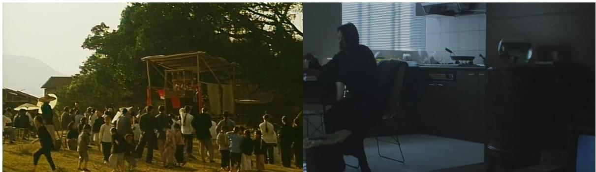
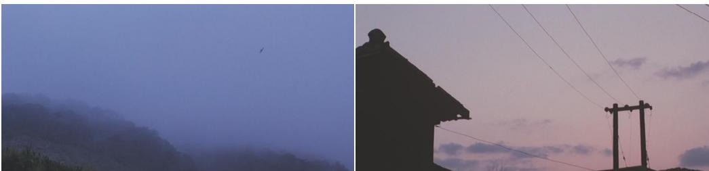
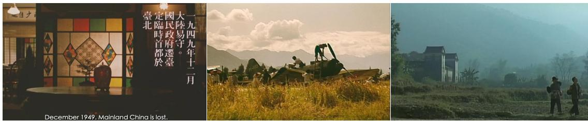
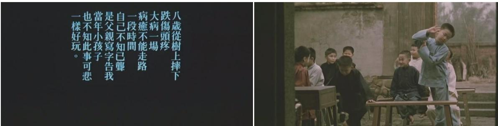
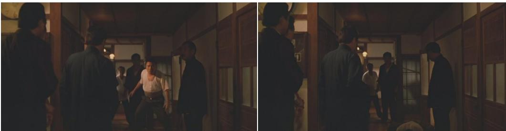

# 1. 论文基本信息
## 1.1 标题
**中文标题：** 历史视角下侯孝贤悲情三部曲的时空叙事研究
**英文标题：** A Study on the Temporal and Spatial Narrative of Hou Hsiao-Hsien's Tragic Trilogy from a Historical Perspective
核心主题：以时空叙事为切入点，将侯孝贤《悲情城市》《戏梦人生》《好男好女》组成的“悲情三部曲”作为整体研究对象，结合台湾近代历史背景，分析其独特的时空处理方式、叙事特征，挖掘背后的历史观念、美学精神与创作价值。
## 1.2 作者
孙凌月，中国传媒大学戏剧影视学院戏剧与影视学专业硕士研究生，研究方向为电影创作研究，指导教师为陈清洋。
## 1.3 发表期刊/会议
本论文为中国传媒大学2024届硕士学位论文，未正式在期刊/会议发表，属于学位论文类研究成果。中国传媒大学戏剧与影视学学科为国家重点学科，在华语影视研究领域具有顶尖学术影响力。
## 1.4 发表年份
2024年（论文参考文献检索截止时间为2023年10月，答辩完成时间为2024年）
## 1.5 摘要
作为世界级电影大师、台湾新电影运动旗手，侯孝贤的电影深刻透视了台湾社会、政治、历史的变化。由《悲情城市》《戏梦人生》《好男好女》组成的悲情三部曲是侯孝贤创作序列中极为重要的作品，与台湾地区自甲午战争以来的百年历史紧密交织，表现了记忆与真相、官方叙述与被遮蔽的真实历史之间复杂的关系，展现了侯孝贤决绝与超然并存的历史态度与生命观。
悲情三部曲在讲述台湾百年历史时，并不拘泥于严格的时间顺序与事理逻辑叙事，影片中的时间如梦与回忆一般具有无法衡量的特质，空间则成为指认时间、意义生产的重要标志及场所。本文以侯孝贤在悲情三部曲中的时空叙事方式为切入点，探索侯孝贤在解严时代追述台湾历史时流露出的历史观念与美学精神，最终得出研究结论：重现历史的本质是对过去实在的虚构化，电影虽不可复现历史，但可作为历史的渐近线而警醒世人。
## 1.6 原文链接
- 上传文件链接：uploaded://9bcf5d53-0e30-4c23-bc14-43b49b2fe33d
- PDF链接：/files/papers/69c52449f25d470fe6d395ed/paper.pdf
  发布状态：未正式公开发表的硕士学位论文。
---
# 2. 整体概括
## 2.1 研究背景与动机
### 2.1.1 核心问题
论文试图解决三个核心问题：
1.  侯孝贤在悲情三部曲中采用了哪些独特的时空叙事策略，来呈现1895年到20世纪中后期台湾近百年的历史？
2.  这些时空叙事策略背后体现了侯孝贤怎样的历史观、生命观与美学追求？
3.  作为历史题材影片，悲情三部曲如何平衡历史真实性与艺术虚构性的关系，对当下华语历史题材电影创作有哪些借鉴意义？
### 2.1.2 研究必要性与现有研究空白
- **领域重要性：** 侯孝贤是华语电影史上最重要的导演之一，悲情三部曲是他创作生涯的里程碑，其中《悲情城市》是第一部获得欧洲三大电影节最高奖的台湾电影，首次正面触碰台湾解严前的历史禁忌（二二八事件、白色恐怖），具有重要的文化与历史意义。
- **现有研究空白：** 此前对侯孝贤的研究多集中在单部影片分析、美学风格研究、文化身份研究三个方向，仅有的3篇以悲情三部曲为整体的研究未从时空叙事角度切入，也未挖掘时空处理与侯孝贤历史观之间的关联；同时过往研究多忽略三部影片在叙事、时空观念上的连贯性与整体性，未形成系统的分析框架。
### 2.1.3 创新切入点
论文突破传统的文本分析或文化研究路径，以**时空叙事**为核心切入点，融合叙事学理论、台湾近代史研究、文化研究方法，将三部曲作为不可分割的整体，提炼出侯孝贤独有的“凝结”时空观，系统分析时间、空间叙事的特征，最终关联到其平民史观与写实主义美学精神。
## 2.2 核心贡献/主要发现
1.  **理论贡献：** 首次将侯孝贤的时空观概括为“凝结”，即时间空间化、空间时间化的双向融合，以心理情绪为核心实现时空聚合，填补了侯孝贤时空叙事研究的空白。
2.  **文本分析贡献：** 系统拆解了三部曲的时间叙事特征（交织的时序、事断意连的时距处理、记忆作为时间绵延的表征）与空间叙事特征（具有表义功能的历史空间、悬置的空间符号处理、多重空间叙事层的构建）。
3.  **文化研究贡献：** 挖掘出时空叙事背后的历史意识：侯孝贤以平民史观反叛官方话语权，以“人性小庙”为核心尊重个体生命价值，提出“电影是历史的渐近线”的核心观点，即历史无法被完全复现，但电影可以通过艺术创作无限贴近历史真实，唤醒集体记忆、对抗遗忘。
4.  **实践价值：** 总结的时空叙事策略、历史题材创作理念，为当下华语历史题材电影平衡历史真实性与艺术虚构性、避免宏大叙事空洞化提供了可借鉴的路径。
    ---
# 3. 预备知识与相关工作
本部分为初学者梳理理解本文所需的基础概念、领域背景与前人研究脉络。
## 3.1 基础概念
### 3.1.1 核心影视与叙事学术语
1.  <strong>叙事学（Narratology）：</strong> 20世纪60年代在结构主义思潮影响下诞生的学科，研究叙事作品的结构、规律与叙事方式，传统叙事学偏重时间维度，20世纪后期出现“空间转向”，开始重视空间在叙事中的作用。
2.  <strong>时空叙事（Temporal and Spatial Narrative）：</strong> 指创作者通过对时间、空间元素的选择、重组、加工来完成叙事、表达意义的创作方式，是电影叙事的核心载体——电影的本质是通过光影在二维银幕上构建包含时间流动与空间广延的叙事世界。
3.  <strong>时间叙事相关概念（来自热拉尔·热奈特《叙事话语》）：</strong>
    - <strong>时序（Temporal Order）：</strong> 故事事件在叙事中的排列顺序，分为顺时序（按照事件发生的先后顺序叙事）、逆时序（打乱顺序，包含闪回、闪前、交错）、非时序（事件完全不按时间逻辑排列，按心理、情绪等逻辑组合）。
    - <strong>时距（Temporal Duration）：</strong> 被叙述故事的真实发生时长与叙事时长的比值关系，核心处理方式包括省略（跳过部分事件）、延长（放大某一事件的呈现时长）、概要（快速交代一段事件）、场景（叙事时长与真实发生时长基本一致，如长镜头）。
4.  <strong>空间叙事相关概念（来自亨利·列斐伏尔《空间的生产》三元空间辩证法）：</strong>
    - **空间实践/感知的空间：** 人们可以通过身体感官直接感知的物质空间，如日常居住的房屋、街道。
    - **空间表象/构想的空间：** 被知识、意识形态、权力形塑的概念化空间，如官方话语构建的“历史空间”。
    - **表征性空间/亲历的空间：** 融入了个体情感、记忆、体验的象征性空间，承载着集体记忆与意义表达。
5.  <strong>长镜头（Long Take）：</strong> 指一段连续拍摄、时长较长（通常30秒以上）的镜头，侯孝贤标志性的固定机位长镜头具有客观、疏离、保留空间完整性的特点，区别于好莱坞快速剪辑的叙事方式。
### 3.1.2 历史与文化背景术语
1.  <strong>台湾新电影运动（Taiwan New Cinema）：</strong> 20世纪80年代兴起的台湾电影革新运动，侯孝贤、杨德昌是核心代表人物，作品以写实主义风格关注台湾社会现实、历史变迁与本土身份，打破了此前台湾商业片的创作模式。
2.  <strong>悲情三部曲（Tragic Trilogy）：</strong> 侯孝贤1989-1995年拍摄的三部聚焦台湾近代历史的影片，按历史时间线排序为：
    - 《戏梦人生》（1993）：以布袋戏大师李天禄的生平为原型，对应1895年《马关条约》割台到1945年日本战败的日据时期。
    - 《悲情城市》（1989）：以林家四兄弟的命运为线索，对应1945年台湾光复到1949年国民党迁台的时期，核心事件为二二八事件。
    - 《好男好女》（1995）：采用戏中戏结构，对应1940年代白色恐怖时期到1990年代的当代台湾。
3.  **二二八事件：** 1947年2月28日发生在台湾的民众抗议事件，随后被国民党当局武力镇压，造成大量台湾民众死亡、失踪，是台湾近代史上最重要的历史创伤事件，在1987年解严前属于官方禁止讨论的历史禁忌。
4.  **台湾解严：** 1987年7月15日台湾当局宣布解除持续38年的戒严令，结束了白色恐怖时期，言论、出版、创作自由得到放宽，侯孝贤的悲情三部曲正是解严后首次正面触碰历史禁忌的影视作品。
## 3.2 前人工作
### 3.2.1 侯孝贤及悲情三部曲研究现状
截止2023年10月，知网可检索到侯孝贤相关文献966篇，主要分为四类：
1.  **美学研究：** 聚焦侯孝贤的镜头语言、东方美学风格，如孟洪峰以“闷、愣、浑”三字概括其影片风格，饶曙光等学者分析其长镜头、诗意化的美学特征。
2.  **文本细读：** 对单部影片的叙事、人物、场景进行分析，如针对《悲情城市》的叙事结构、《戏梦人生》的口述历史形式的研究。
3.  **作者性研究：** 将侯孝贤与杨德昌、小津安二郎、贾樟柯等导演进行对比，分析其创作的个人风格与作者属性。
4.  **文化研究：** 从历史、身份认同角度分析其作品的文化内涵，如焦雄屏对《悲情城市》中台湾本土意识、身份焦虑的研究，孙慰川对其写实主义精神的分析。
    但以悲情三部曲为整体的研究仅3篇，且均未从时空叙事角度系统分析其历史表达的逻辑。
### 3.2.2 时空叙事研究现状
1.  **时间叙事研究：** 传统叙事学以时间研究为核心，德勒兹在《时间-影像》中提出电影可以创造独立于物理时间的心理时间，国内游飞教授提出电影时间叙事的八种基本走向，王海洲教授梳理了中国传统文化下独有的感知化时间观。
2.  **空间叙事研究：** 1933年约瑟夫·弗兰克《现代文学中的空间形式》开启了空间叙事研究的先河，列斐伏尔的空间生产理论、福柯的权力空间理论推动了叙事学的空间转向，国内李显杰、龙迪勇等学者建立了电影空间叙事的研究框架。
## 3.3 技术演进
1.  **叙事学的发展脉络：** 经典叙事学（偏重时间、文本内部结构）→后经典叙事学（融合文化研究、跨学科视角，关注空间与语境）→电影叙事学（结合影视媒介特性，研究时空的视听表达）。
2.  **华语历史题材电影的创作脉络：** 从早期的宏大革命历史叙事（以官方话语为核心）→改革开放后的人性叙事（关注个体在历史中的命运）→新世纪后的多元叙事，侯孝贤的悲情三部曲是华语历史题材电影中“平民史观”的开创者，打破了官方历史叙事的单一性。
## 3.4 差异化分析
与现有研究相比，本文的核心创新与区别在于：
1.  **研究对象的完整性：** 首次将悲情三部曲作为不可分割的整体进行研究，挖掘三部影片在时空观念、历史表达上的连贯性，突破了过往单部分析的局限性。
2.  **研究视角的创新性：** 以时空叙事为核心切入点，将形式分析（时空处理的叙事技巧）与文化分析（背后的历史观、美学精神）深度结合，避免了过往研究要么只谈形式、要么只谈文化的割裂问题。
3.  **理论提炼的原创性：** 提炼出侯孝贤独有的“凝结”时空观，系统梳理了其时间、空间叙事的特征，提出“电影是历史的渐近线”的核心观点，填补了相关研究的空白。
    ---
# 4. 方法论
本论文采用人文社科的质性研究方法，核心是将叙事学理论与文本细读、文化研究相结合，逐层拆解悲情三部曲的时空叙事逻辑。
## 4.1 方法原理
核心思想是：电影的时空不是客观的物理时空，而是创作者经过选择、加工的“叙事时空”，时空处理方式直接承载着创作者的观念表达。侯孝贤在悲情三部曲中通过独特的时空叙事策略，重构了被官方话语遮蔽的台湾平民历史，其时空处理方式与他的历史观、生命观是完全同构的。
研究的底层逻辑是：通过分析文本层面的时空处理技巧→提炼核心时空观→挖掘背后的历史意识与美学精神→总结创作价值与借鉴意义。
## 4.2 核心方法详解
### 4.2.1 基础研究方法
1.  **文献分析法：**
    - 梳理侯孝贤相关的研究文献、创作访谈、编剧笔记（如朱天文的拍片笔记），把握过往研究的脉络与空白，理解侯孝贤的创作初衷。
    - 梳理叙事学（尤其是时间、空间叙事）的相关理论，搭建分析框架。
    - 梳理台湾近代史资料，包括日据时期、二二八事件、白色恐怖的相关史料，理解影片的历史语境。
2.  <strong>文本细读法（拉片分析）：</strong>
    - 对悲情三部曲三部影片进行逐段拉片，分析每一个镜头的景别、时长、运动、声音，每一段的剪辑逻辑、时空转换方式，从视听语言层面拆解时空叙事的具体技巧。
    - 分析叙事结构、叙事者设置、人物命运与历史事件的关联，把握时空叙事的整体逻辑。
3.  **跨学科研究法：**
    - 融合哲学（柏格森的绵延理论、胡塞尔的悬置理论）、社会学（列斐伏尔的空间生产理论）、历史学（台湾近代史研究）、文化研究（集体记忆、身份认同理论）的相关理论，从多维度解读时空叙事背后的深层意义。
### 4.2.2 分析框架搭建
论文围绕“凝结”的核心时空观，从三个层面搭建分析框架：
1.  **时空观的提炼：** 将侯孝贤的时空观概括为“凝结”，包含两层含义：
    - 时间空间化：将绵延流动的时间定格为一个个可感知的空间瞬间，用空间承载记忆与历史。
    - 空间时间化：赋予静态的空间以时间的厚重感，让空间成为历史的载体。
      这一时空观来源于侯孝贤的个人生命体验：童年时躲在芒果树上偷芒果的专注时刻，感知到时间变慢、空间无限延伸的“凝结”状态，与德勒兹提出的“纯视听情境”（人物行动的因果逻辑被打破，情景直接呈现本身的意义）异曲同工。
2.  **时间叙事分析维度：** 采用热奈特的时间叙事理论，从三个角度分析：
    - **时序处理：** 分析三部曲不同的时序特征：《悲情城市》《戏梦人生》采用逆时序（大量闪回，随人物记忆调整时间顺序），《好男好女》采用非时序（三重时空完全按情绪逻辑交叉，打破时间的线性逻辑），实现记忆的倒错与生命的对位。
    - **时距处理：** 提炼“事断意连”的核心特征，即大量使用省略手法，故意切断时间的线性逻辑与事件的因果链条，用连绵的时间意象（如空镜、戏曲、歌谣）填补时间断裂的缝隙，引导观众感受时间的流动。
    - **时间的表征：** 分析记忆在时间叙事中的核心作用，认为记忆是时间绵延的最佳表现形式，影片通过唤醒个体与集体记忆，实现对官方遗忘叙事的反叛，用讲述对抗遗忘。
3.  **空间叙事分析维度：** 采用列斐伏尔的三元空间辩证法，从三个角度分析：
    - **空间的本质认知：** 提出空间不是被动的容器，而是具有生产性的“动词”，是承载记忆、生产意义的历史空间，通过镜头、声音的表义作用构建立体的叙事空间。
    - **记忆空间的构建：** 提出“悬置”的空间符号处理方式，即不对空间符号做明确的隐喻引导，将意义的解读权交给观众，客观呈现空间本身的状态，构建充满集体记忆的空间符号域。
    - **多重空间叙事层的构建：** 从空间缩放的角度，将叙事空间分为三层：最底层的**日常空间/边缘空间**（平民的生活空间，是历史的承受者）、中层的**社会空间**（权力、交易的场所，是历史暴力的发出者）、高层的**自然空间**（以天地、山海为代表的非人视角，象征天命与历史的威压），三层空间相互渗透，构建从个体到家族再到国族的叙事结构。
4.  **时空聚合与历史意识分析维度：**
    - 分析“心理情绪时空组合”的核心聚合方式：时空转换不遵循事理逻辑，完全以人物的心理、情绪为依据，实现此地与彼时的重叠、历史与当下的连通。
    - 挖掘时空叙事背后的历史意识：决绝与超然并存的历史态度，以平民史观反叛官方话语权，建立供奉人性的“人性小庙”，最终提出“电影是历史的渐近线”的核心结论。
      ---
# 5. 实验设置
本部分对应人文社科研究的“研究对象、分析维度与对比基准”。
## 5.1 数据集
本研究的核心“数据集”包括两类：
### 5.1.1 核心研究对象：悲情三部曲影片文本
1.  <strong>《悲情城市》（1989）：</strong> 片长157分钟，以台湾宜兰林姓家族四兄弟的命运为线索，覆盖1945年日本投降台湾光复到1949年国民党迁台的历史时期，核心事件为二二八事件，获第46届威尼斯国际电影节金狮奖，是第一部获得欧洲三大电影节最高奖的台湾电影。
2.  <strong>《戏梦人生》（1993）：</strong> 片长142分钟，以台湾布袋戏大师李天禄的生平为原型，采用半纪录片半剧情片的形式，李天禄本人出镜口述生平，覆盖1895年《马关条约》割台到1945年日本战败的日据时期，获第46届戛纳国际电影节评审团大奖。
3.  <strong>《好男好女》（1995）：</strong> 片长108分钟，采用戏中戏的套层结构，包含三重时空：1990年代的当代台北、1980年代梁静与男友阿威的回忆、1940年代白色恐怖时期蒋碧玉夫妇的历史，改编自蓝博洲报告文学《幌马车之歌》，原型为真实历史人物钟浩东、蒋碧玉。
### 5.1.2 辅助研究资料
包括台湾近代史史料、侯孝贤访谈录、编剧朱天文的创作笔记、台湾文化界对悲情三部曲的评论、相关学术文献等，总规模超过100万字。
## 5.2 评估指标
本研究的分析评估维度分为三类：
1.  **叙事学维度：** 评估时空叙事技巧的有效性，包括时序处理的创新性、时距处理的表达效果、空间构建的表义能力。
    以时距处理的评估为例，核心是看省略手法是否实现了“事断意连”的效果，即事件的因果链条被切断后，是否能通过情绪、意象的连贯让观众感知到历史的厚重感。
2.  **历史学维度：** 评估历史表达的深度，包括对被遮蔽历史的呈现程度、历史事件与个体命运的结合程度、对官方叙事的反叛性、平民史观的体现程度。
3.  **美学维度：** 评估美学风格的统一性与创新性，包括“凝结”时空观的体现程度、写实主义美学的实现效果、东方美学的表达深度。
## 5.3 对比基线
本研究的对比基线包括两类：
1.  **现有研究基线：** 与过往针对单部悲情三部曲的研究、针对侯孝贤其他作品的时空叙事研究进行对比，验证本研究的创新性。
2.  **创作实践基线：** 与同时期其他华语历史题材电影（如张艺谋《活着》、杨德昌《牯岭街少年杀人事件》）的叙事方式、历史表达进行对比，突出侯孝贤时空叙事的独特性。
    ---
# 6. 实验结果与分析
本部分对应论文的核心研究发现，逐层拆解时空叙事的特征与背后的历史意识。
## 6.1 核心结果分析
### 6.1.1 时间叙事特征：交织与断裂
1.  **交织的时序：记忆的倒错与生命的对位**
    - 逆时序：《悲情城市》《戏梦人生》大量使用闪回，时序排列不遵循事理逻辑，而是遵循人物的心理与记忆逻辑。例如《悲情城市》中静子向宽美赠送旧物的段落，用7个镜头4次时间跳跃，从当下的赠物场景闪回到过去静子与宽荣兄妹的相处时光，完全以人物的思念情绪为时序排列的依据，让观众感受到记忆的绵延。
    - 非时序：《好男好女》采用三重时空完全交叉的非时序叙事，1990年代的梁静、1980年代的梁静与阿威、1940年代的蒋碧玉三个时空的转换完全不需要过渡，核心是实现梁静与蒋碧玉两个女性跨越时间的生命对位——两人都经历了爱人死于时代动荡的命运，情感的共通性成为时序排列的唯一逻辑。
2.  **事断意连：时间轴的断裂与时间意象的连绵**
    - 时距处理上大量使用省略手法，故意切断事件的因果链条，例如《戏梦人生》中大眼仔被生母带走的段落，仅用一个长镜头呈现事件的结果，完全省略前因后果，符合老年人回忆往事时离散、碎片化的特点。事件的断裂反而留下了大量的意义空白，让观众自行填补。
    - 断裂的时间缝隙由连绵的时间意象填补，例如《悲情城市》中的山海空镜、《戏梦人生》中的布袋戏演出、《好男好女》中青年男女在山野间唱歌的远景，这些时间意象成为观众进入历史时空的入口，让观众在凝视中感受到时间的“凝结”状态。
3.  **时间的表征：记忆是绵延的最佳表现形式**
    - 侯孝贤将个人记忆与集体记忆深度融合，例如《悲情城市》中林家的悲剧不仅是一个家族的记忆，更是台湾全体民众对二二八事件的集体创伤记忆，通过唤醒集体记忆实现对官方遗忘叙事的反叛，用讲述对抗遗忘。
    - 区别于官方历史叙事的宏大、线性特征，悲情三部曲的时间是碎片化的、个人化的，符合柏格森提出的“生命时间”的本质——时间不是可度量的物理刻度，而是与个体的体验、记忆融为一体的绵延流动的存在。
### 6.1.2 空间叙事特征：悬置与缩放
1.  **空间认知：具有表义功能的历史空间**
    - 空间不是被动的容器，而是具有生产性的“动词”，承载着社会关系、权力结构与集体记忆。例如《悲情城市》中的酒馆、茶室等社会空间，既是人物活动的场所，也象征着不同权力群体的博弈。
    - 构建“历史的永无岛”式的表征性空间：侯孝贤明确表现出历史无法被完全复现的态度，例如《戏梦人生》中李天禄口述的内容与剧情画面并不完全对应，凸显出记忆的主观性，说明影片构建的历史空间是艺术性的想象空间，而非完全真实的历史复现。
    - 通过镜头与声音构建立体空间：大量使用固定机位长镜头、全景、中景，极少使用特写，保留空间的完整性，留给观众想象的空间；多语言（闽南语、日语、国语、上海话）的使用，直接表现出台湾近代史上不同权力群体的冲突，丰富了空间的表义层次。
      下图（原文图3.1）展示了《戏梦人生》中民间布袋戏演出的公共空间与日常家庭空间的对比，体现出民间艺术与平民生活的紧密关联：

      
      *该图像是插图，左侧展示了一个热闹的户外活动场景，有许多人围观，右侧则是一个昏暗的室内厨房环境，似乎有一个人在坐着，形成鲜明的对比。*

2.  **悬置的能指：记忆空间符号域的建构**
    - 侯孝贤采用“悬置”的空间符号处理方式，即不对空间符号做明确的价值判断，不使用直白的隐喻引导观众的解读，而是客观呈现空间本身的状态。例如《戏梦人生》中美军空袭的段落，完全熄灭人工光源，仅用月光与晃动的衣服表现场景，不刻意渲染恐惧情绪，将观众的感受悬置，让观众自行体会人物的状态。
    - 这种悬置的态度源于胡塞尔的现象学理论，即搁置所有先入为主的判断，让事物本身呈现其意义，与侯孝贤超然的生命观完全一致。
3.  **空间的缩放：多重空间叙事层的构建**
    - 以身体为空间感知的核心：演员的表演不是刻意的“演戏”，而是呈现自然的生命状态，例如《好男好女》中梁静在夜店唱《金包银》的段落，完全以演员的情绪变化为核心调度空间，身体的感受成为空间划分的依据——热闹的酒桌是男人们的社会空间，舞台上独自唱歌的梁静处于被隔绝的边缘空间。
    - 三层空间叙事层的缩放：
        1.  **日常空间/边缘空间：** 是平民生活的场所，也是历史创伤的直接承受者，例如《悲情城市》中林家的内室、《戏梦人生》中李天禄的家，历史的动荡最终都会落到日常空间的细微变化中。
        2.  **社会空间：** 是权力、交易、冲突的场所，例如酒馆、茶室、监狱，是历史暴力的发出者，《悲情城市》中文雄就是在酒馆这个社会空间中被上海帮枪杀。
        3.  **自然空间：** 以山海、天空、旷野为代表，是去主体化的非人视角，象征着天命与历史的威压，例如《悲情城市》中文雄死后的下一个镜头就是大雾弥漫的山野中盘旋的孤鸟，以自然的冷峻凸显出个体命运的渺小。
            下图（原文图3.2）展示了自然空间的特征：左侧的浓雾山景对应历史的未知与威压，右侧的夕阳与电线对应广播中的权力声音穿透日常空间：

            
            *该图像是插图，展示了两幅不同的风景场景。左侧为浓雾弥漫的山景，模糊的轮廓渲染出一种神秘的氛围；右侧则是傍晚时分，夕阳余晖下的建筑和电线，呈现出柔和的色调与宁静的乡村生活。*

### 6.1.3 时空聚合与历史意识：生命的凝结
1.  **时空聚合特征：心理情绪时空组合**
    - 时空转换完全以人物的心理、情绪为依据，不需要逻辑过渡，例如《悲情城市》中宽美看到静子的旧物，自然闪回到过去的相处时光，情绪的连贯性取代了事理的连贯性。
    - 实现“此地与彼时的重叠”：侯孝贤在故事发生的实地拍摄，用当下的“此地”空间承载过去的“彼时”时间，让历史与当下在空间中融合，个体记忆与集体记忆在空间中交汇。
2.  <strong>“凝结”</strong>的时空观：空山无人，水流花开
    “凝结”的时空观对应宋代禅宗的第二重境界“空山无人，水流花开”，即创作者从叙事中抽离，以客观、超然的视角注视着历史中的人与事，不做明确的价值判断，让历史本身呈现其意义。例如《悲情城市》的结尾，林家破散后空无一人的厅堂，昏黄的灯光闪烁，没有旁白、没有刻意的煽情，却让观众感受到历史的厚重与苍凉。
    下图（原文图4.1）展示了三部曲结尾的时空特征，分别对应林家空荡的厅堂、李天禄在战后的乡间、好男好女在山野间前行的场景：

    
    *该图像是插图，展示了侯孝贤悲情三部曲中的三个场景。左侧是一个装饰有多彩玻璃的室内环境，晕染着历史的氛围，中央为对历史事件的文字描述，右侧则是宁静荒野下的人物剪影，表现出人物与环境的互动。整体传递出关于时空的深刻叙事。*

    下图（原文图4.2）对应《悲情城市》中文清回忆儿时失聪经历的段落，以无悲无喜的镜头呈现童年往事，体现出“凝结”的时空感：

    
    *该图像是图表，左侧为文字内容，描述了一个关于八岁孩子从树上摔下的悲惨事件，以及由此引发的思考，如父母对孩子成长的关注与可悲的现实。右侧则是孩子们在一个简陋环境中玩耍的场景，体现了社会环境对儿童成长的影响。*

3.  **历史意识：决绝与超然并存的平民史观**
    - 决绝的反叛态度：侯孝贤坚决反叛官方的历史叙事，首次正面触碰二二八事件、白色恐怖等历史禁忌，展现被官方遮蔽的平民创伤记忆，反对文化强权对历史的粉饰。
    - 超然的生命观：受沈从文的影响，侯孝贤以“冷眼看生死”的超然态度对待历史中的苦难，不刻意煽情，而是客观呈现个体在历史中的命运，建立供奉人性的“人性小庙”——即使是最渺小的平民，也有其生命的尊严与价值。
      下图（原文图4.3）对应《悲情城市》中文雄与上海帮冲突的段落，展现出平民个体与权力体系对抗的悲剧性：

      
      *该图像是插图，展示了一组人物在室内狭窄走廊中的情景。几位角色围绕中间的主角站立，气氛紧张，可能暗示着即将发生冲突。两幅图像并列显示，能够观察到不同角度的互动，表现了影片中人物关系的复杂性。*

4.  **核心结论：电影是历史的渐近线**
    历史的本质是“对过去实在的虚构化”，真正的历史已经永远逝去，无法被完全复现，但电影可以通过艺术创作无限贴近历史的真实，成为“历史的渐近线”——它不需要完全符合历史的细节，却可以唤醒集体记忆、反思历史教训，警醒世人不要重蹈覆辙。
## 6.2 单部影片的对照分析（类消融实验）
论文分别对三部影片的叙事结构、叙事者设置进行对照分析，验证时空处理与表达效果的对应关系：

| 影片名称 | 叙事结构 | 叙事者设置 | 时空特征 | 表达效果 |
| --- | --- | --- | --- | --- |
| 《悲情城市》 | 散点性叙事 | 多视角叙事（有我之境） | 逆时序为主，三重空间清晰 | 厚重的历史感与悲情氛围 |
| 《戏梦人生》 | 片断性叙事 | 单一叙事者（李天禄口述，无情之境） | 逆时序，空间悬置 | 苍茫的生命感与世事无常的慨叹 |
| 《好男好女》 | 套层叙事 | 双重视角（梁静为蒋碧玉代言） | 非时序，三重时空交叉 | 历史与现实的断裂感与两代人的命运对照 |

## 6.3 元素作用分析（类参数分析）
论文对不同时空元素的作用进行了逐一分析：
1.  **镜头元素：** 固定机位长镜头保留了时空的完整性，营造了客观、疏离的观看视角；极少使用特写，避免引导观众的情绪，符合“悬置”的处理原则。
2.  **声音元素：** 多语言的使用直接表现了台湾复杂的历史背景；布袋戏、民谣等声音元素成为时间意象，填补了时间断裂的缝隙；广播的声音对应自然空间的权力威压，成为历史大事件的叙事媒介。
3.  **符号元素：** 日常物品（和服、木剑、照片等）成为记忆的载体，触发时空转换，实现个人记忆与集体记忆的连接。
    ---
# 7. 总结与思考
## 7.1 结论总结
本论文以侯孝贤悲情三部曲的时空叙事为研究对象，结合历史视角与叙事学理论，得出以下核心结论：
1.  侯孝贤在悲情三部曲中形成了独有的“凝结”时空观，即时间空间化、空间时间化的双向融合，以心理情绪为核心实现时空聚合，创造出如梦似幻、无法衡量时间流逝的叙事效果。
2.  时间叙事上采用交织的时序与“事断意连”的时距处理，以记忆为核心表征，打破线性历史叙事的束缚，实现用讲述对抗遗忘的目的。
3.  空间叙事上将空间视为具有生产性的“动词”，采用“悬置”的符号处理方式构建记忆空间符号域，通过日常空间、社会空间、自然空间三层叙事层的缩放，实现从个体命运到国族历史的叙事跨越。
4.  时空叙事背后是侯孝贤决绝与超然并存的历史态度：以平民史观反叛官方话语权，尊重个体生命的尊严与价值，建立“人性小庙”；提出“电影是历史的渐近线”的核心观点，即历史无法被完全复现，但电影可以通过艺术创作无限贴近历史真实，唤醒集体记忆。
5.  悲情三部曲的时空叙事策略与历史表达理念，为当下华语历史题材电影平衡历史真实性与艺术虚构性、避免宏大叙事空洞化提供了重要的借鉴。
## 7.2 局限性与未来工作
### 7.2.1 论文存在的局限性
1.  对国际学界关于侯孝贤的研究（如日本、欧美学者的相关研究）参考不足，研究视角主要集中在华语学界的框架内。
2.  对三部影片的横向对比分析不够深入，尤其是三部影片时空处理的演变逻辑与侯孝贤创作心态变化的关联可以进一步挖掘。
3.  对悲情三部曲在当下的传播效果、对当代台湾社会集体记忆的影响缺乏实证研究。
### 7.2.2 未来研究方向
1.  可以进一步拓展研究范围，将侯孝贤其他作品（如《童年往事》《恋恋风尘》《刺客聂隐娘》）的时空叙事与悲情三部曲进行对比，梳理侯孝贤时空观的演变脉络。
2.  可以与其他华语导演的历史题材作品（如杨德昌、贾樟柯、王小帅等）进行对比研究，提炼华语历史题材电影的叙事特征与美学传统。
3.  可以结合当下的创作实践，研究悲情三部曲的创作理念对当代华语历史题材电影、主旋律电影的借鉴价值，探索如何在官方话语与平民表达之间找到平衡。
## 7.3 个人启发与批判
### 7.3.1 研究启发
1.  **研究方法的启发：** 本论文将形式分析与文化研究深度结合的研究路径非常值得借鉴，避免了影视研究中要么只谈技术、要么空谈文化的割裂问题，任何形式技巧的分析最终都要落到创作者的观念表达与文化意义上。
2.  **创作理念的启发：** 悲情三部曲的平民史观对当下的历史题材创作具有重要的借鉴意义：历史不是宏大的数字与事件，而是一个个具体的人的命运，好的历史题材作品应该从个体的生命体验出发，让观众感受到历史的温度，而不是空洞的口号与说教。
3.  **历史态度的启发：** 侯孝贤“电影是历史的渐近线”的观点打破了“历史题材必须完全符合史实”的刻板认知，历史题材创作的核心不是还原细节的真实，而是传递历史的精神本质，唤醒观众对历史的反思，避免重蹈覆辙。
### 7.3.2 潜在问题与可改进之处
1.  **历史态度的复杂性：** 论文对侯孝贤历史观的分析可以更深入，比如其对台湾身份认同的表达存在复杂性：一方面强调台湾与大陆的历史联结，另一方面也突出了台湾本土的历史创伤，这种复杂性在论文中没有充分展开。
2.  <strong>“悬置”</strong>的客观性问题： 侯孝贤的“悬置”处理并不是完全客观中立的，其叙事中仍然隐含着对平民的同情、对权力的批判，论文对这种隐含的倾向性分析可以更明确。
3.  **现实意义的拓展：** 论文可以进一步结合当下华语电影的创作困境，比如主旋律电影如何借鉴这种平民视角，如何平衡主流价值表达与艺术创作的关系，让历史题材作品更有生命力。