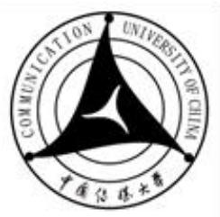

# 中国信媒大学

硕士学位论文

中文论文题目：历史视角下侯孝贤悲情三部曲的时空叙事研究

英文论文题目:A Study on the Temporal and Spatial Narrative of Hou Hsiao-Hsien's Tragic Trilogy from a Historical Perspective

申请人姓名： 孙凌月

指导教师: 陈清洋

专业名称: 戏剧与影视学

研究方向： 电影创作研究

所在学院： 戏剧影视学院

# 历史视角下侯孝贤悲情三部曲的时空叙事研究

# 摘要

作为世界级电影大师、台湾新电影运动旗手，侯孝贤的电影深刻地透视了台湾社会、政治、历史的变化，由《悲情城市》、《戏梦人生》、《好男好女》组成的悲情三部曲作为侯孝贤电影序列中极为重要的三部作品，与台湾地区自甲午战争以来的百年历史紧密交织，表现了记忆与真相、官方叙述与被遮蔽的真实历史之间深刻复杂的关系，展现了侯孝贤决绝与超然并存的历史态度与生命观。悲情三部曲在讲述台湾过去的百年历史时，并不拘泥于严格的时间顺序与事理逻辑进行叙事，影片中的时间如梦与回忆一般具有无法衡量的特质，而空间则成为指认时间、意义生产的重要标志及场所，本文以侯孝贤在悲情三部曲中的时空叙事方式为切入点，探索侯孝贤在解严时代追述台湾历史时流露出的历史观念与美学精神，最后得出本文的研究意义：重现历史的本质是对过去实在的虚构化，电影虽不可复现历史，但可作为历史的渐近线而警醒世人。

本文共分为绪论和主体两个部分。绪论部分为研究对象及意义、国内外研究现状与研究方法三个部分。主体部分由四章组成。第一章对悲情三部曲的历史背景、叙事结构进行必要的介绍与分析，并将侯孝贤独特的时空观念以“凝结”一词概括。第二章从时序与时距人手，论述了悲情三部曲各不相同的时序处理方式与其“事断意连”的时间叙事特征，并在此基础上分析过去与现在、个体回忆与集体记忆之间的关系。第三章在对叙事空间的性质与重要性进行辨析后，分析了悲情三部曲记忆空间符号域与多重空间叙事层的构建手段。第四章则在论述悲情三部曲心理情绪时空组合的时空聚合方式、“凝结”的时空叙事特征后，着眼于侯孝贤在时空叙事背后表现出的对人性的重视、对官方话语权的反叛及其所坚持的宝贵的平民史观与写实主义美学精神，提出悲情三部曲是侯孝贤“寻父求根”之作的看法，同时探究虚构历史与重现历史之间的关系，以期对侯孝贤这三部聚焦台湾历史的影片加深认识，对以后我国历史题材电影的创作提供相关借鉴。

关键词：侯孝贤；悲情三部曲；时间叙事；空间叙事；历史

# A STUDY ON THE TEMPORAL AND SPATIAL NARRATIVE OF HOU HSIAO-HSIEN'S TRAGIC TRILOGYFROM A HISTORICAL PERSPECTIVE

# ABSTRACT

As a world-class film master and a pioneer of Taiwan's new film movement, Hou Hsiao-Hsien's films deeply reflect the changes in Taiwan's society, politics, and history. The tragic trilogy composed of "The City of Sorrow", "A Dream of Life", and "Good Men and Good Women" is one of Hou Hsiao-Hsien's most important film sequences，closely intertwined with the century long history of Taiwan since the First Sino Japanese War, depicting memories and truth The profound and complex relationship between official narratives and the obscured real history showcases Hou Hsiao-Hsien's historical attitude and outlook on life, which coexists with decisiveness and transcendence. When telling the history of Taiwan over the past century, the Tragic Trilogy is not limited to strict chronological order and logical reasoning. The time in the film has immeasurable characteristics like dreams and memories, and space becomes an important symbol of identifying time. This article takes Hou Hsiao-Hsien's spatiotemporal narrative style in the Tragic Trilogy as the starting point, Explore the historical concepts and aesthetic spirit that Hou Hsiao-Hsien revealed when recounting Taiwan's history during the lifting of martial law.

This article is divided into two parts: introduction and main body. The introduction part consists of three parts: research object and significance, domestic and foreign research status and research methods.The main body consists of four chapters.The first chapter provides a necessary introduction and analysis of the historical background and narrative structure of the tragic trilogy,and summarizes Hou Hsiao-Hsien's unique concept of time and space with the word "condensation". Chapter 2 discusses the different temporal processing methods of the tragic trilogy and its temporal narrative characteristics of "disconnection of events and meanings"， starting from temporal and temporal distance. Based on this, it analyzes the relationship between the past and present, individual memory, and collective memory. After analyzing the nature and importance of narrative space, Chapter 3 analyzes the construction methods of the symbolic domain of memory space and multiple spatial narrative layers in the tragic trilogy. Chapter Four, after discussing the spatiotemporal aggregation of psychological emotions in the Tragic Trilogy, focuses on Hou Hsiao-Hsien's emphasis on human nature, rebellion against official discourse power,and his precious views on civilian history and realism aesthetic spirit that he adheres to behind the narrative of time and space. It puts forward the view that the Tragic Trilogy is Hou Hsiao-Hsien's work of "seeking roots from his father", in order to deepen our understanding of Hou Hsiao-Hsien's three films that focus on Taiwanese history, Provide relevant references for the creation of historical themed films in China in the future.

KEYWORDS: Hou Hsiao-Hsien； Trilogy of Trilogy； Time narrative； Spatial narrative;History

# 目录

绪论...  
第一节 研究对象及意义 .1  
第二节 国内外研究现状. ..2  
一、侯孝贤及悲情三部曲的国内外研究成果 ..2  
二、时空叙事的国内外研究现状. ..5  
第三节 研究方法. ..7  
第一章 悲情三部曲与时空叙事.. ...9  
第一节 悲情三部曲的背景介绍. ...9  
一、悲情三部曲的历史背景. ...9  
二、悲情三部曲的讲史策略 ..11  
第二节 悲情三部曲的叙事结构与叙事者设置 ..13  
一、大同大异的叙事方式 .13  
二、从个人命运到历史变迁:悲情三部曲的叙事结构 ...14  
三、从有情到无情:悲情三部曲的叙事者设置 ..16  
第三节 时空叙事与"凝结”. ...18  
一、叙事空间:记忆的容器. ..19  
二、叙事时间:风干的泪滴.. ...20  
三、侯孝贤的时空观:凝结 ..20  
第二章 交织与断裂:悲情三部曲的时间叙事 ..22  
第一节 交织的时序:记忆的倒错与生命的对位 ..22  
一、逆时序:蜿蜒倒错的历史与记忆 ..23  
二、非时序:跨越时间的人生对位 ...24  
第二节 事断意连:时间轴的断裂与时间意象的连绵 ..26  
一、时距的处理:省略手法与离散片段.. ...26  
二、历史时空的入口:时间意象 ..28  
第三节 时间的表征:记忆是绵延的最佳表现形式 ...29  
一、时间与记忆:用讲述对抗遗忘 ..29  
二、记忆时间与现实时间:时间是真实生活的依据 ...31  
第三章 悬置与缩放:悲情三部曲的空间叙事 ..32  
第一节 空间认知:具有表义功能的历史空间 ..32  
一、作为动词的空间. ..32  
二、历史的永无岛:表征性历史空间 ..35  
三、立体空间的形成:声音与镜头的表义作用 ..36  
第二节 悬置的能指:记忆空间符号域的建构 ..39

一、作为符号域的记忆空间. .39二、空间符号的处理手段:悬置. .39第三节 空间的缩放:多重空间叙事层的构建 .42一、历史空间的主体性感知:空间中的身体 ..42二、距离的缩放:日常空间、社会空间与自然空间 ..44

三、悲情三部曲的多重空间叙事层. ..46  
第四章 悲情三部曲的时空叙事特征与历史意识探询 .50

第一节 生命的凝结:悲情三部曲时空叙事特征分析 .50

一、此地与彼时的重叠:历史时空的整合与同一 .50  
二、时空聚合:心理情绪时空组合 .51  
三、凝结:空山无人,水流花开. .53

第二节 难言的悲怆:不和解的历史态度与超然的生命观.. .56一、决绝与超然的并存:太阳强烈,水波温柔 .56二、“人性小庙"的建立与对文化强权的反叛. .57第三节 历史重现的本质:电影是历史的渐近线 .60一、侯孝贤的角色:"无父之子"的寻父情结 ..60二、历史重现的方式:对过去实在的虚构化 .63吉语. .66参考文献.. ..68

# 绪论

# 第一节研究对象及意义

作为"台湾新电影双子"之一，世界性的电影大师，侯孝贤导演的电影独树一帜的东方美学思想对华语乃至东亚电影圈都产生过意义深远的影响。而悲情三部曲（又称台湾三部曲)的诞生则是侯孝贤导演在艺术创作上走人新阶段的里程碑,也正是这三部电影，让侯孝贤开始真正享誉国际，成为大师。在这三部电影中，《悲情城市》获得了威尼斯电影节金狮奖，成为第一部在欧洲三大电影节获奖的台湾电影；《戏梦人生》则在戛纳电影节拿下了评审团大奖。

侯孝贤导演的作品在美学风格、叙事策略、视听语言上都有着连贯而鲜明的个人特色，本文在侯孝贤导演的影片序列中锁定悲情三部曲为研究对象，原因如下：其一，本文研究的论题拟为探究侯孝贤导演对于台湾19 世纪末至20世纪中后期这近百年历史的呈现方式，分析其讲述历史时所采用的时空叙事策略以及由此生成的时空叙事特性，从而分析影片中导演暗藏的历史观念，而在侯孝贤创作的影片中，明确地只以台湾历史为讲述对象的电影只此三部。其二，“悲情三部曲"的叙事主题、所表现出的历史观念与时空观念一脉相承，构成了一个不断深化的、连续的、不可分割的整体，因此可以从作品序列中将其单独拿出作为研究对象。

而本文选择将时空叙事作为研究切入点的原因如下：首先，侯孝贤采取的独特的叙事方式本身为悲情三部曲带来了饱满的力量与厚重的史诗感，在悲情三部曲中，充满了侯孝贤式的极其节制的固定机位与全景镜头，场景与段落之间的连接也并没有使用炫目的剪辑手法来刻意挤压出历史与生活之外的其他意义，当商业电影中常用的手法与技巧被摒弃，叙事与故事内容本身的重要意义被凸显，从而成为悲情三部曲力量感的主要源泉。

而时间与空间在这三部讲述历史的影片的叙事中几乎占据着主角的位置。将时间重新安排，使之成为电影中客观呈现的"主观化"的时间，是电影叙事的基础。电影中的时间一定会被创作者进行有意或无意的改造，这赋予了时间叙事以无穷的意味。侯孝贤在悲情三部曲中作为历史的讲述者，也必定会在历史长河的无限可能性里选取他所感兴趣的时间；而空间叙事顾名思义，即为从叙事学角度上进行电影空间研究。近年来，中国电影学派倡导讲述中国故事，而场景空间的设置便是其中重要一环，在电影重构空间秩序、实现空间需求的过程中，独特的东方地域韵味便得以展现。空间这一元素在侯孝贤电影中所承载的重要美学作用、叙事作用有着巨大的研究空间，侯孝贤善于将自己的历史观、人生观隐藏于静默的空间之中待人发掘。在台湾三部曲之中，空间既是故事的，又是知识性的，通过美术的种种精心设计，它有着承载叙事功能、文化功能的工具性作用。

综上，本文研究的主要切入点拟为探究侯孝贤如何使用时空叙事，来"既客观又主观"地呈现台湾百年历史。纵览国内外对于侯孝贤导演的研究成果，虽然总体来看较为丰富，但单独以悲情三部曲作为研究对象，认识到悲情三部曲作为一个整体研究对象的研究价值的文献在数量上还是比较稀缺，本文具有一定补足侯孝贤研究空白之处的意义。此外，这三部电影的文本内涵极其丰富，从空间叙事学的角度来说，从中可以挖掘出丰富的象征空间、意蕴空间，与空间叙事学的研究方向具有高度契合性；而在时间叙事方面，悲情三部曲以历史为主角，用叙事来凝固与保存逝去的时间，同样有着深厚的研究价值。因此，学习侯孝贤台湾三部曲中时空叙事的方法，挖掘其中时空之间的关系与组合方式，对完善发展电影时空本体观念将有所助益。

# 第二节国内外研究现状

笔者通过对CNKI知网及万方数据库等文献资料库的检索与查找，将有关文献资料整理为如下两类：

# 一、侯孝贤及悲情三部曲的国内外研究成果

截止2023年10月，在中国知网上以"侯孝贤"为主题关键词进行检索，结果显示可检索出国内外相关文献966篇，主要分为学术期刊论文、硕博士学位论文以及涉及相关主题的专著三大类。

从研究角度进行简要区分，有关侯孝贤电影的研究主要可归类为如下四个部分：一，美学研究，主要是对侯孝贤电影语言的研究，探讨其独具特色的影像风格、艺术特质及镜头语言使用习惯；二，对侯孝贤电影文本的细读，对故事叙事层面的研究，包括叙事特征总结与人物形象构建研究；三，对于侯孝贤导演作者性的研究，学者一般会使用比较研究的方法，将侯孝贤与杨德昌、小津安二郎、贾樟柯乃至金基德等与他具有某种共性的导演并置进行对比分析；四，文化研究，即从文化批评与文学阐释角度，分析侯孝贤电影中以历史语境重塑、乡土情结溯源、台湾身份认同为代表的文化、历史与民族性问题。

在审美研究层面，学者们通过对侯孝贤电影语言的细致分析总结出了侯孝贤电影远观静照的美学风格。其中，孟洪峰的《侯孝贤风格论》在深入分析侯孝贤电影的东方式意境后，以"闷”、“愣”、“浑"三字概括了侯孝贤导演的影片风格，较有特色。饶曙光主编的《电影从非电影来：侯孝贤电影研究》中收录了许多学者对侯孝贤导演的研究，此书共分为四个主要部分：传承与变革、形式与意义，历史与意象以及接受与主动，在这四方面角度与主题之下系统梳理了台湾新电影运动的人文脉理，论述了侯孝贤导演作品中的本土意识、叙事风格，此外，还分析了侯孝贤电影中的诗意化长镜头表达、东方审美等，对本文写作较有帮助。王睿的论文《平静与深思：侯孝贤导演风格解读》则将侯孝贤的电影语言与叙事主题结合，解释了侯导以静为动的人文情怀。对于侯孝贤电影具体文本的细读，以及对侯孝贤电影叙事特质的分析，代表文章有黄钟军的《重论台湾新电影：文本、形式与影响》、吴慧颖的《侯孝贤电影中"餐戏"的场景设计研究》等。

侯孝贤电影文化研究涵盖的论题较多，在《电影从非电影来：侯孝贤电影研究》中同样也对侯孝贤电影的台湾叙事母题、侯孝贤电影中的历史与政治因素进行了剖析。侯孝贤台湾三部曲中所体现的台湾身份、文化构建、历史演变问题同样也有许多学者进行研究，如孙慰川的《秉持写实主义精神、谋求美与真的统一— -读侯孝贤的"悲情三部曲”》，焦雄屏的《寻找台湾的身份:台湾新电影的本土意识和侯孝贤的<悲情城市 $>$ 》等，郑洞天、施湘飞的《<悲情城市 $>$ 的电影形态》等，关于悲情三部曲中单部作品分析的文献将在后文进行细说。

此外，一些带有杂谈与传记性质的专著也值得重视，此类专著的作者大多为与侯孝贤导演有过切身交往的文化界学者、影评人。在台湾电影学界，代表专著有焦雄屏的《侯孝贤：台湾新电影的代表人物》、张靓蓓的《凝望·时代：穿越"悲情城市"二十年》等。

而在欧美国家，詹姆斯·乌登的《无人是孤岛：侯孝贤的电影世界》影响力较大，此本专著将侯孝贤的创作研究与台湾电影的地域性研究相结合，不仅对侯孝贤的作者历程进行了梳理，同样研究了在宏观历史框架下影响侯孝贤电影创作的文化乃至工业、社会因素，白睿文的访谈录式专著《煮海时光》则是侯孝贤电影研究文献中最为详尽的一本,触及了除《刺客聂隐娘》制作完成版之外的每一部侯孝贤作品。

而将研究对象聚焦于侯孝贤台湾三部曲的研究文献则较少，在中国知网可以搜索到三篇，分别为：郑向阳的《侯孝贤电影中知识分子精神的呈现——以"悲情三部曲"为例》、黄明波的《闽台社会的同质殊相发展初探——基于侯孝贤"悲情三部曲"的影视文化视角》、孙慰川的《秉持写实主义精神、谋求美与真的统一— -读侯孝贤的"悲情三部曲”》,在这三篇文献之中，最有参考价值的当属最后一篇，分析了侯孝贤台湾三部曲的批判现实主义美学精神与其反叛性。

而将悲情三部曲中其中一部单独作为研究对象的论文则相对较多，其中以《悲情城市》为甚。通过万方数据库以及CNKI知网数据库进行检索，以《悲情城市》关键词的文献共有46篇。其中，何菲的《<悲情城市>与台湾的身份焦虑》分析了《悲情城市》背后所折射出的台湾作为一座孤岛在历史与政治环境裹挟之下试图寻找自身身份的悖谬性。前文中提过的焦雄屏与季尔廉的《寻找台湾的身份：台湾新电影的本土意识和侯孝贤的 $<$ 悲情城市>》则不仅在长镜头、剧作结构、声音设计等技术方面分析了《悲情城市》电影本体的艺术价值，更是分析了《悲情城市》多重叙事结构体背后有关中国/日本/台湾的意象，作为一名台湾电影学者，焦雄屏说明《悲情城市》之所以如此重要，是因为其所讲述的这段历史——从1945 年至1949 年,对台湾来说是一段由日本政治/文化统治转型到国民党统治的重要转型时期，侯孝贤对这段时间长河的追溯，直追台湾四十年来政治神话结构之症结，最后更是给出了《悲情城市》是侯孝贤最完整的‘台湾史'的评价。此外，在曾仕祥、蒋勋、焦雄屏等人在第二届中时晚报电影奖的对谈稿件《<悲情城市>：在历史苦难铁砧上锤炼民族魂》中，蒋勋认为《悲情城市》第一次以台湾为中心呈现了中国人生存的美学，而焦雄屏则将此片评价为台湾新电影发展的重要成果，其叙事观点的复杂性、对历史禁忌的突破程度，都使其在台湾乃至中国电影史上具有划时代的意义。而郑洞天的《<悲情城市 $>$ 的电影形态》则提出《悲情城市》“取片段"的剪辑手法、心理情绪性时空组合则为它带来的现代性的叙事意味。

而单独以《戏梦人生》或《好男好女》为研究对象的文献与会议的数量则较《悲情城市》有所不及。关于《戏梦人生》的研究，其中较为有参考性的文献有黄亚利的《<戏梦人生 $>$ 中的个体书写与时空镜像》，该文以个体/历史，虚/实，纪实/诗意、过去/现在四组关系分析了《戏梦人生》的历史时空转化机制，认为个体书写是历史书写的一种叙述范式。刘凤的《聚焦侯孝贤与<戏梦人生 $>$ 的民族性则》将重点放在了台湾百姓传统民俗、观念的分析上。而关于《好男好女》的研究文献数量上则更少，其中，较有参考价值的有刘凤的《<好男好女 $\gg$ ：时代的差异性与同一性》，该文对影片中双重时空、时代的相似与不同之处进行了对比分析，通过对两代人不同时空境遇下的行为、思想、境遇进行比照，分析出了两个时代在本质上的同一性。

# 二、时空叙事的国内外研究现状

20 世纪60 年代，在结构主义思潮的影响下，叙事学作为一门学科在法国诞生。“叙事学"的概念由法国结构主义符号学家托多罗夫正式提出。叙事在时间上具有绵延性,在空间上具有广延性。完整的叙事学研究既包括时间维度，也包括空间维度，一般来说,无论是经典叙事学，还是后经典叙事学，都较为偏重时间维度。

时间同时具备着物理性、心理性和超验性的特质，电影中的时间绝不仅仅是物理意义上的定量符号，而更多是一种由叙事者与受众双方主体体感而生发出的感知。吉尔·得勒兹在经典电影理论的基础上将电影研究与精神、时间相连接，将时间、运动与影响的关系提升到了哲学高度的层面。其代表著作《时间-影像》与《运动-影像》对电影中的时空概念划定了范畴，他将柏格森生命哲学的概念借鉴到影像理论中，提出了“位置属于空间范畴，而变化的整体属于时间范畴。如果把运动-影像比作镜头，人们可以称画框是对准客体镜头的第一面，而把剪辑成为对准整体的另一面。"由此产生第一个观点：剪辑本身构成整体，因此，我们有了时间的影像。

值得一提的是，德勒兹认为小津安二郎是"纯视听情境"的发明者，而侯孝贤在影像处理方式上与小津安二郎颇有相同之处。在国内，有关电影与时间之间的关系研究的专著有徐辉的《有生命的影像》，认为电影其实在本质上揭示了宇宙中的时间韵味；周冬莹的《影像与时间》中对德勒兹提出的多个核心概念，如纯视听情境、晶体-影像等进行了解读。

大部分学者往往会将时间叙事作为一个工具，用以分析具体电影或文学文本，此类型论文在知网上较多，如邱一然的《克里斯托弗·诺兰电影时间畸变叙事研究》围绕着诺兰电影中叙事时空的构建和时空叙事的功能展开论述。此外，值得一提的是中国传媒大学游飞教授在《电影的时间叙事研究》中将"电影的时间叙事"定义为"把时间以及对时间的操控作为电影叙事和表达的主要手段”，并深入分析了消解线性、颠覆向度、物理时间的缩放、心里时间的畸变、超验时间的折叠、多线时间的复合、写实时间的复原、戏剧时间的时限等几个电影时间叙事的基本走向。而北京电影学院王海洲教授则在《"逝者如斯夫"：中国电影的时间叙事观》中梳理了中国传统文化衍生而来的东方文化体系下独有的时间观，它以感知为标准的时间尺度构建了独特的民族美学风格，这一观点与焦雄屏在《寻找台湾的身份：台湾新电影的本土意识和侯孝贤的 $<$ 悲情城市>》中对《悲情城市》“由气氛统摄构筑时空叙事节奏"的评价有异曲同工之妙。

而在空间叙事方面，随着叙事学研究条件的逐渐成熟与各种问题的凸显，国内外学者对叙事学中空间问题的研究逐渐深人。自从1933年约瑟夫·弗兰克的《现代文学中的空间形式》发表以来，空间问题逐渐受到叙事学理论批评的重视，在20世纪后期开始,叙事学出现了由时间到空间的转向，空间叙事学也由此建立。

在叙事学理论空间转向前期，约瑟夫·弗兰克于1945 年发表了《现代文学中的空间形式》一文，该文章被认为是空间叙事理论的滥觞之作。此文明确指出了文学作品中的空间形式问题，从语言的空间形式、故事的物理空间及读者的心理空间三个层面分析了现代主义文学的空间形式。弗莱的《批评的剖析》讨论了叙事空间的转换对主题表达的作用。巴赫金的《小说中的时间和空间体形式》提出了"时空体"的概念，认为时空体是时间在空间中物质化的首要方式。巴什拉的《空间诗学》主要研究空间意象的现象学感知，深入讨论了空间的原型意象。梅洛-庞蒂的《知觉现象学》讨论了主体对于空间的感知与主体身体意识的关系，认为时空的概念取决于主体在世界中的意图。

20 世纪后期，西方批评理论的空间转向促进了叙事理论的空间转向，后现代空间概念改变了现代人的时空观。亨利·列斐伏尔的《空间的生产》提出了"空间生产"和"社会空间"的概念，他认为空间是社会产品，指出空间是由人类活动生产出来的，是一种动态的、开放的、具有冲突性和矛盾性的动态进程。福柯的权力空间理论同样对空间叙事学有着巨大的影响力，代表作有《规训与惩罚》、《论其他空间》等，他认为人类的生活已经进入了一个空间时代，不再只生活在单一空间中。西摩·查特曼的《故事与话语》中对空间问题也有专门的论述，他给时空维度进行了定义，认为故事事件维度是时间，而故事存在物的维度是空间。米克·巴尔的《叙事学》也对空间的表征、内涵、功能、与其他因素之间的关系进行了论述。

而在电影的空间叙事理论方面，1933年，鲁道夫·爱因汉姆在《电影作为艺术》中,从格式塔心理学出发，详细论证了电影的感知方式，在"部分幻觉"理论中，他通过解释二维照相平面如何诠释三维立体世界，阐述了观影体验中空间感的重要作用。此后，马赛尔·马尔丹在《电影语言》中，提出了再现空间和构成空间的概念，强调了蒙太奇在空间中的重要作用。贝拉·巴拉兹在《电影美学》中提出了电影与戏剧相比的三点独到之处，分别为景别的区分、镜头的切分和镜头的变化，体现出了空间在电影中独特的呈现方式。此外，大卫·波德维尔在《电影艺术：形式与风格》中讨论了荧幕空间与荧幕外空间所给出的信息对于叙事的作用，他提出：电影的透视空间划分依据镜头空间、剪辑空间和声音空间三种因素，而每种空间里包含着银幕空间和画外空间两种形式。他的另一篇文章《电影叙事：剧情片中的叙述活动》也讨论了叙事电影中叙述者与接受者、时间与空间、视点与结构之间的种种关系问题。

空间叙事学在上世纪80年代被引人国内，最初在文学、建筑学领域展开研究。而在电影空间叙事领域，李显杰的《电影叙事学：理论和实例》是一本出现得较早、影响力也较大的专著，他认为电影的空间叙事学就是要讨论叙事空间与叙事的关系，阐释不同的空间层次在叙事中的不同功能。龙迪勇的《空间叙事学》也较为重要，他认为电影需要在空间中才能获得新的阐释维度。

在学术期刊论文方面，李显杰在他的《论电影叙事中的画格空间与叙事性》中，明确提出空间性是电影叙事中不可忽视的叙事序列，空间展示对电影的个性风格的形成有着标志性的作用。中国电影学派的空间叙事研究近年来比较受到重视，代表文章有《中国电影学派的空间叙事研究》、《隐喻中国的路径——当代艺术电影"中国空间"叙事研究》等，主要内容为探究空间在表现中国电影学派的叙事创新理念中所起到的作用。

# 第三节研究方法

本文的研究将围绕着历史视角、侯孝贤悲情三部曲创作研究及时间叙事、空间叙事等关键词展开。在时间叙事方面，本文将主要用到法国批评家热拉尔·热耐特等人有关时序、时距的时间叙事理论，在空间研究方面，本文将用到亨利·列斐伏尔等人的三元空间辩证法对电影空间进行再认识，最后将时间与空间相结合进行研究，以侯孝贤独有的时空观“凝结”为切入点分析悲情三部曲的时空叙事特征。而要研究悲情三部曲，则不可避免地需要透过历史视角对本文进行剖析，因此，文化研究与跨学科研究方法将被运用至本文研究中，笔者将结合台湾历史文献资料、侯孝贤导演拍片分场笔记、分镜头剧本、台湾文化人士谈论侯孝贤的相关书籍等资料，分析当时历史语境、体会侯孝贤导演、朱天文、吴念真等编剧在拍摄、撰写剧本时对历史及剧中情节、人物的态度，此外,笔者将查找过去20年来对华语电影乃至两岸社会为历史三部曲所撰写的评论，推断总结这三部电影中时空叙事的特点，以及形成此特点的历史背景，以及导演隐藏在时空叙事背后的历史意识与态度。

而在研究的全过程中，在文献分析法与文本分析法的基础上进行文本细读必不可少。笔者根据搜集到的论文期刊、硕博士论文、专著资料进行文献梳理，梳理侯孝贤导演作品研究脉络，总结前人对侯孝贤导演研究所得出的结论，对空间叙事、时间叙事、台湾近代历史的基本研究情况进行了解，将侯孝贤导演研究与电影叙事学研究两者进行结合，运用所学到的空间叙事学理论分析总结出侯孝贤导演的台湾三部曲在运用空间进行叙事方面的独到之处。观看侯孝贤导演所指导的19部影片，对于其创作风格有一个整体上的把握，其中重点观看本文所研究的《悲情城市》、《戏梦人生》与《好男好女》,进行拉片分析，通过深入的文本分析，从叙事和视听两方面入手，研究侯孝贤导演在电影文本中所体现的多线并行叙事的方法。

# 第一章 悲情三部曲与时空叙事

侯孝贤共拍过20部电影，但以台湾历史为主角的影片唯有《悲情城市》、《戏梦人生》、《好男好女》三部，笔者将其从侯孝贤的电影序列中抽出，作为一个整体进行研究，目的是探究侯孝贤导演如何用时间和空间作为叙事元素，追述曾被遮蔽的记忆与历史，为台湾上世纪80、90 年代的社会以及其自身所关注的"台湾少年成长困境"这一电影母题寻根，从而研究悲情三部曲所重现的历史与历史真实之间的关系。在进行悲情三部曲文本的具体时空叙事研究之前，首先应该了解这三部电影所讲述的故事背后的时代背景、情节与史实之间的对应关系，这是解读悲情三部曲的前提。随后，本章从叙事结构及叙事者设置两方面入手，挖掘悲情三部曲叙事策略的发展与转变。最后，本章将在第三节聚焦时空叙事，电影的时空语言是叩开悲情三部曲背后厚重的历史之门的一把钥匙，在分别对时间叙事与空间叙事的作用与本质进行概述后，本章将对侯孝贤导演的时空观进行探析，将"凝结"二字提炼为侯孝贤时空观的概括，为后文在侯孝贤导演时空观基础上进行的时空叙事研究打下基础。

# 第一节 悲情三部曲的背景介绍

# 一、悲情三部曲的历史背景

台湾三部曲讲述了以《马关条约》签订为时间上限，20 世纪中后期为时间下限的台湾大半个世纪的历史沉浮。按照台湾三部曲故事中的时间顺序排列，《戏梦人生》应为第一部，它用李天禄的自述将故事从1895年《马关条约》签订讲到了1945 年日本战败。接下来的《悲情城市》则以抗战胜利，1945年8月台湾光复，国民政府进入台湾开场,以二二八事件为叙事背景，讲到了1949年12月国民政府战败迁台。最后的《好男好女》在承接上文、表现20 世纪八九十年代台湾都市社会的同时，也以戏中戏的方式将时空回溯到20世纪40年代，对前两部影片中的历史事件进行了补充。台湾近代历史深长复杂，在此笔者将选取重要的节点性事件及与"悲情三部曲"剧情相关部分、对情节推进有影响的部分的历史情况进行介绍。

自明朝万历二十九年荷兰人侵占台湾以来，自1601年至1949 年，台湾的政权便频繁更迭，共经历了荷兰、明朝、清朝、日本及国民党五种截然不同的政权的统治，政治文化环境复杂。而其中对台湾的发展影响最大的，当属悲情三部曲所聚焦的日本殖民统治和国民党的威权统治，下文将以日本投降为时间分割节点，将悲情三部曲所涉及的台湾历史分两部分进行讲述。

1895 年至1945年的台湾历史，是一段殖民屈辱与工业化、现代化发展并存的时期。尽管是出于殖民私利，但日本人的确在客观上将台湾从一个边缘而未开化的小岛建设成了高度发展的殖民地。在成为殖民地初期，台湾各族人民进行了近百场悲壮的抗日战役，而后日本进行了惨绝人寰的"三光扫荡"大屠杀，后期，随着世界战争形式的变化，台湾这座岛屿的战略重要性逐渐凸显出来，日本逐渐开展了一系列殖民地社会治理。在经济发展和现代化发展问题上，台湾成为了一个较发达的农业基地，医疗条件有所改善，推行带有奴化色彩的基础教育，电力、自来水、铁路交通等也得到发展。在身份认同问题上，在被日本殖民以前，台湾人分成鹤佬人和客家人，种族关系紧张而混乱，而日本人到来后推行的"原型民族主义"反而在一定程度上使台湾本省的各族人民之间的民族摩擦被削弱—毕竟此时他们有一个共同的身份：非日本国民。在文化上，日本人实行严格的同化政策，禁止台湾方言、中国报纸、中国本土艺术形式，如《戏梦人生》中的布袋戏这一传统艺术形式便受到了日本人的打压。在《戏梦人生》之中，日本殖民带来的上述问题均有着或多或少的暗示与表达。

1945 年至1949 年的台湾历史，对台湾的未来有决定性的影响²，台湾在战后所形成的扭曲的政治环境、经济环境与这四年都有极大的关系。在政治及法律问题上，台湾行政长官陈仪制定了一套以集权化为主要特点的管理制度——这是导致后续各种问题的根本原因所在，法律制度遭到破坏，当时的台湾国民政府官僚主义严重，贪墨横行，效率低下，以至于台湾的社会的安全性非常差，这也是《悲情城市》中多个帮派经常械斗、大哥文雄死于上海帮之手的背景。而在身份意识上，国民党的政策给本省人和外省人之间制造了一道日益加深的隔阂，国民党在政治的制定上，将台湾人定位在了社会最底层。

在经济上，私人企业不被允许存在，经济剥削严重，而严重的经济剥削导致台湾通货膨胀，这对于严重依靠国际贸易维持经济的台湾的打击是极大的，于是有不少当地人开始走私，由此引发了二二八事件。

1947年2月27日晚，一个寡妇因卖私烟而被专卖局稽查员暴打，而其中一个围观者被一个稽查员开枪打死，由此引发民愤。2月28日，国民党军队扫射聚集在行政长官公署门前抗议的市民。3月8日,国民党二十一军登陆基隆港镇压民变,当局发起名为"绥靖"行动，实为恐怖活动的大规模暴力镇压，成千上万的台湾人被捕或"失踪"。同样在1947年，戒严法颁布，人民的言论、出版、集会自由被剥夺，“不少人睡到半夜便突然失踪4”，这样的白色恐怖让人民生活在恐慌之中。直到1987年7月15日，台湾宣布解除戒严，结束了长达38年的戒严时代。

# 二、悲情三部曲的讲史策略

# （一）历史材料与历史想象

作为历史题材影片，悲情三部曲讲的既是故事，也是历史，因此便产生了一种矛盾：作为故事，它应该是虚构的、富有主观色彩的，但作为历史，它应该是客观严谨、不被容许偏离真实历史发展方向的。将历史作为审美对象不仅仅带来愉悦，而且也是一个思考的过程，它的本质是在人们创造的历史中审视人类社会的本质。因此，在将主体的主观经验感受嵌入到历史之中进行叙事时，每个以历史为蓝本的作者都不可避免地要面对关于历史材料与历史想象的关系问题。

通常意义上所说的历史材料，所指的是在人类社会历史发展过程中所遗留下来的某些客观的历史痕迹，如典籍、文件、实物、口碑等，它们能够帮助后人无限贴近历史的原真面目，从而认识历史、解释和重构历史，这些接近或直接在历史发生中所产生的史料属于历史遗留物，是遗存形态历史，它们是客观形态历史存在过的证据。

很明显，时空距离是一道横亘在古今之间永远无法跨越的鸿沟，即使悲情三部曲致力于真实地还原台湾历史中的场景与事件，但其仍然无可避免地带有创作者的主观性因素，带有大量编剧、导演对历史的想象过程与取舍判断，甚至对历史事件带有主观或非主观原因导致的歪曲、篡改、隐蔽、夸大，永远无法真正地还原乃至贴近真实发生过的历史事件本体，甚至与之大相径庭。但这并不妨碍侯孝贤在悲情三部曲中对其所认可的历史秩序的构建，因为一部优秀的历史电影所追求的应该是历史材料与历史想象、艺术虚构之间的平衡与融合。在历史电影中，“当下"成为了一种潜在文本，创作者不断调整其呈现历史时空、表现历史事件的角度及力度，其目的正是为了用历史更好地折射现在。5因此，对于历史的时空呈现是一种历史真实性与影片虚构性之间的碰撞，正如怀特所说：“历史本质上是事实的虚构化和过去实在的虚构化。"这也正是本文研究的意义所在。

因此，悲情三部曲的时空呈现与其主题、侯孝贤本人的社会历史观点之间的关系呈现为一种客观与主观、实与虚的关系：历史材料、客观历史的存在要求悲情三部曲的时空呈现、叙事内容必须具备一定"实"的依据，并接受受众基于史料与史实基础上进行解读与评判；而作为一部历史电影，它用现代主体意识去关照历史，传达出在创作者在当下，即 20世纪90年代，对历史内在的本质的理解，这在某种程度上容纳甚至鼓励了“虚”的存在。

虚与实、客观与主观、史料与想象之间，应该存在着由创作者，也就是侯孝贤导演所亲手构建的一个平衡点。在悲情三部曲中，侯孝贤导演通过时空呈现，所营构的应该是一种自洽的历史秩序，并在这种历史秩序中实现叙事的一致性与融贯性。综上，侯孝贤导演借助自己的历史想象，对已有的客观历史材料进行加工，从而表达主题的讲史方式，与历史需要被客观呈现的要求并不冲突。

# （二）贯穿于历史中的剧情设置

分析悲情三部曲，不从时代入手而只局限于电影文本是不可行的。在悲情三部曲之中，导演将镜头更深地推向了宏观的社会历史结构，通过对一个个时代中的小人物的故事的讲述，让观众同情其"身世浮沉雨打萍"的命运，让历史进人电影文本之中。在这三部电影之中，均设置了贯穿于宏大社会历史结构中的角色人生轨迹，让观众在关心人物命运的同时，悄然缩短了历史的距离感，缝合了历史与现在的时间距离。

在悲情三部曲之中，侯孝贤及以朱天文为代表的编剧，在叙事上最为成功的一点，就是把握住了影片所在的时空背景，并将历史背景转化为了驱动角色命运转换的情节。比如，在《悲情城市》的最后，文清与宽美带着他们刚出世不久的孩子，拍摄了一张名垂影史的全家福，电影中的一张家庭照片何以有着如此沉重的历史价值？因为就在拍完这张全家福的下一场戏中，梁朝伟饰演的文清面临着国民党士兵的上门逮捕，从此生死未知。至此，林家所有兄弟全部在1945 年到1949 年这短短的四年中抵达了其死、疯、失踪、被逮捕的结局，而林家在多方政治势力欺压下家破人亡的结局，最终便以这一张全家福作结，家之不幸与时代之不幸在此达到了融合与统一。《戏梦人生》摘取了李天禄老人一生中最重要的几个事件段落进行讲述，其中最绮丽的部分无疑是李天禄与青楼女子丽珠的一段情，在李天禄对这段情的讲述中，几乎只字未提当时台湾的殖民背景与时代变迁对两人的影响，两人的分离甚至没有一个镜头，而仅仅在李天禄老人的讲述中一笔带过。电影以布袋戏作为事件段落的分隔线，在一场日本殖民色彩浓厚的布袋戏过场后，丽珠在影片中消失不见，二人的故事就此戛然而止。李天禄没有交代丽珠的去向,对两人的分开只解释为自己有妻有子，与丽珠只能是露水情缘，紧接着便说起了自己为了安置家人、保证家人与自身安全而加入日本组织的新宣传剧团的经过，看似无情，实则表现了乱世之中聚散无常的无奈。而在《好男好女》里，蒋碧玉在影片中的全部人生轨迹都笼罩着历史的阴影，她在片中的身份，便是"政治受难人”，通过戏中戏的呈现方式，蒋碧玉一生的不幸都与政治挂钩：随丈夫远赴大陆参加抗战、将刚出生的儿子送人、回台办《光明报》、丈夫因言论不当罪被国民党当局枪毙，沉默的蒋碧玉一生命运的转折都来自于历史的重压，而她自己的心境则被忽略，最终成为了历史烟尘中一个面貌模糊的身影。

# 第二节 悲情三部曲的叙事结构与叙事者设置

# 一、大同大异的叙事方式

将《悲情城市》、《戏梦人生》、《好男好女》这三部电影进行对比，其所呈现的历史阶段连续但无明显交叉，叙事方式则"大同大异”。所谓大同，即是三部电影的叙事主题高度一致、一脉相承，且在这三部电影中，历史的呈现都像梦境一样展开，叙事顺序不以时间为标准，而以影片内部秩序与逻辑的连续性为准则进行叙事。作为侯孝贤电影序列中较有代表性的三部作品，悲情三部曲以侯孝贤一贯常用的方式进行叙事，这种方式可概括为：重视段落事件的积累，而非采取简单的直线叙事，而在看似不相关联的诸多段落并置之下，逐渐积累出复杂而意义庞杂的故事。

侯孝贤创造了一种电影叙事的全新观念，区别于好莱坞电影讲故事单一、清晰的特点，侯孝贤的影片情节显得过于寡淡。欧美评论家认为侯孝贤发明了一种特殊的叙事方式：看似平平淡淡，但是"电影"发生了，观众要将影片看到结尾，才恍然明白故事在说什么。同时，很多人指出侯孝贤的电影语言、叙事结构有着浓重的诗化倾向，所指的便是其影片具有诗一样高度精炼、意象庞杂、象征性强的特征，而这种诗化的语言赋予了侯孝贤影片以解读的多义性、叙事的复杂性。以上叙事及语言特性，悲情三部曲均具备。

而所谓大异，则指的是三部影片采取了三种完全不同的讲述方式：或以家庭为单位,以家族兴衰映照历史沉浮，或采用口述历史的伪纪录片形式，或三重时空交叉进行叙事，下文将对三部电影各自的叙事结构与叙事者设置进行一一分析。

# 二、从个人命运到历史变迁：悲情三部曲的叙事结构

侯孝贤并不是叙事理论的信奉者，其自述在电影拍摄中"看着对，感觉顺就行，其实无所谓是否要有一个严格的观点。"因此，悲情三部曲的叙事结构的产生是创作者自发性与自觉性的结合，侯孝贤导演在剪辑时，也认为事件的来龙去脉犹如一条长河，既然不能件件说清楚，不如根据感觉"抽刀断水”，抽取事件最富有魅力的一段。因此,三部电影由于其自身风貌各不相同，也相应地形成了不同的叙事结构与时空流程。悲情三部曲既可以解读为第三世界的国族寓言，同时也是一份平民的史书，就是因为其内部有着纠结的情感结构，这与它将个人命运与历史变迁紧密结合的叙事结构无法分开。

# （一）《悲情城市》：散点性叙事结构

《悲情城市》的叙事基本遵循渐进式的线性顺序，遵循时间的自然持续和与情节发展基本相对应的空间转换，形成了一种不严格的散点性叙事结构。对于《悲情城市》而言，顺序的时间叙事其实是一种选择，如此才能表现出如同浩劫一般的历史事件在穿插于琐碎的家庭生活中的同时给渺小的历史当事人带来的巨大伤害。影片以日本天皇宣布投降——台湾进入国民党统治时期为始，历时四年，其中，以"二二八事件"作为影片分界线。“二二八事件"为影片情绪高潮，却并非中心事件，实际上，影片并无一处情节可以称之为中心事件，其事件连缀带有散片缀合的诗意风格，它讲故事的方式并非通过因果意义上的情节环扣进行呈现，而是以一种深沉宏阔的情绪基调贯穿了整部影片。

历史犹如一条接连不断的长河，而叙事者不可能将所有事件的起承转合一一讲述,因此改编与截取是一种必然。在《悲情城市》中有多条叙事线索，以林家为中心，林家的兄弟都有自己的故事线：老大文雄有自己的妻与子，还与上海帮、当局都有交涉，老二去南洋当兵一去不回，老三文良曾经在上海因汉奸罪而被虐待，患上了精神病，老四文清自小变成聋哑人，与爱国青年交往，最终被捕，只留下妻子宽美独自带着儿子生活。在《悲情城市》的讲述中，每一条线上的故事也都犹如散落的点，侯孝贤并没有表现出多么偏爱哪一个点的故事，而是让他们或明或暗地散落：文雄、文清的故事在明，讲述得比较清晰细致，文龙、文良的故事则讲述得比较隐晦，在文良之疯背后的故事还需要观众自己深思与解读，由此构成了《悲情城市》中的众生相。

# （二）《戏梦人生》：片断性叙事结构

三部影片中，时间最早的《戏梦人生》则完全采用口述历史的方式呈现，呈现出半纪录片、半剧情片的样式。《戏梦人生》以时间向度为主，事件段落之间松散的连缀,关系毫不紧密，形成了一种片断性的叙事结构。无论是李天禄老人的语言讲述，还是影片中偶尔呈现出的剧情，因果性都极其微弱，电影叙事中常见的因果秩序被瓦解，体现出了一种世事无常、漂泊不定的感觉，也符合一个老人对过去人生回望的特点：散漫、无序，事件的因果性因记忆的模糊而被任意地分割。

《戏梦人生》遵循着"轻情节，重情境"的叙事策略，形散而神聚，笔断而意连，以李天禄老人的口述时间线为基准，一个事件接着一个事件发生，形成一种缀合式团块结构的风貌。值得一提的是，在影片之中，老人的讲述与影片所呈现的画面常常并不统一，产生一种比较独特的声画效果，这是由于侯孝贤在拍摄《戏梦人生》时采取了一种较为有趣的创作手法：先根据李天禄老人的传记写出剧本，拍摄一段戏之后，再由李天禄本人说一遍。而李天禄所说的常常与剧本所拍的并不一致。最后，影片将采访李天禄所拍摄的纪录片与由剧本所拍成的故事片并置，形成了两个文本之间的呼应。

# (三）《好男好女》：套层叙事结构

而好男好女则采用了套层叙事结构，也就是所谓"戏中戏"的结构模式，戏里的蒋碧玉与戏外的梁静的人生轨迹形成了微妙的连结与对照。在悲情三部曲之中，《好男好女》给人的感觉不同于前两部，具体感觉就是史诗感被削弱，其叙事风格更靠近侯孝贤之后的作品如《最好的时光》、《千禧曼波》，美国电影学者詹姆斯·乌登认为这是因为：

《悲情城市》和《戏梦人生》的电影叙事尽管高度片段化，但它们的片断性都呈现一种隐而不彰的特点，相反，《好男好女》在炫耀它的片断性。

《好男好女》采用了三重时空交叉叙事的方式，影片由三个时空构成：第一个时空是1990 年的台北，呈现出繁华颓靡、灯红酒绿的风貌；第二个时空是1980 年代的台北,此时空着重讲述的是梁静与死去的前男友的回忆；而历史发生的空间则存在于戏中戏之中，影片中，梁静借演戏之名化身为蒋碧玉，将故事引到它的真正主场：1940、1950年的台湾与大陆，三个时空转换之间几乎不需要任何凭借，而勾连三个时空的便是影片穿针引线的人物梁静，形成一种梦幻式的复调结构。真实存在过的历史人物蒋碧玉的生活以及由她所带出来的历史，被框定在以一个虚拟人物—梁静为中心的当代叙事之中。

《好男好女》的套层结构带来的一个有趣的叙事模式的设置是，蒋碧玉作为历史的主角，一直处于一种被观看的状态，而影片戏中戏里蒋碧玉的扮演者梁静则作为讲述者的功能而存在。直到影片的最后，当蒋碧玉的故事画上句号，作为蒋碧玉故事发声者的梁静才迎来属于自己故事的开始，走出了《好男好女》中的套层结构，而她在千禧年后的命运又将会是如何，新一代的都市男女登上历史的舞台，会用自己的生命体验写出怎样的历史，侯孝贤也无法给出答案，因此，《好男好女》的结局指向未来，呈现出开放的展望之姿。

# 三、从有情到无情：悲情三部曲的叙事者设置

叙事者对于故事的呈现是一种不可或缺的要素，只是有显隐的区别，从好莱坞经典电影语义上讲，“没有叙事人，故事似乎在自行讲述"是一种极为普遍的现象。但在悲情三部曲之中，侯孝贤在每部电影里都赋予了一个或多个角色以"发声"的使命，当这些叙述人或以故事外之人（如梁静），或故事亲历者（如李天禄、宽美）的身份或客观地陈述往事，或抒情地表述自己的感受时，他们其实是"隐含作者"声音的发出者，侯孝贤借这些叙述风格各异的叙事者之口，或隐或显、或有意、或无意识地地表达了其自身在创作过程中对某段历史的感受。但在这三部电影中，叙事者的身份、表述风格各有不同,由此造成了影片在情绪基调上的差异。

# （一）《悲情城市》：有我之境

《悲情城市》之中暗藏了多个“我”，以多重声的形式诉说着时代，其中不乏多视角中对不同人群的深层关照，如在"日本败退台湾"这一事件中，代表着台湾本地居民的宽美、代表着因战争流亡上海终反故土的归乡者文良、代表着曾作为殖民者而存在而今因战争失败而被遣返本土的静子兄妹，都有着相应经历与情绪的表现。在《悲情城市》中,多重视点下均有叙事者讲述着自己的故事，从而表现出了台湾/大陆、中国台湾/日本等地历史纠葛的复杂性。

《悲情城市》的镜头追随着文清- —一个口不能言、耳不能闻的聋哑人而动，但并不以文清的情绪感受作为影片串联的线索，相反，文清在更多时刻反而是静默的——他只能以书写便笺的形式交代关键信息，叙事而不表情。文清在悲情城市中有着多重的作用，首先，从影片内部叙事结构而言，他是由张大春、吴念真等文人所扮演的知识分子们的朋友，自己的身份也很可能为地下共产党员，而同时他又是林家幼子，目睹了自己所在的小家族的兴衰，因此，他是历史宏大叙事与家庭日常叙事的连接处，文清进可引发出历史视角下的社会空间，退可引导观众回到林家这一具体而微的家庭空间，他是历史的亲历者、承受者，但他却是一个哑巴—无法发声的人，因此，作为无声者的他介入历史、见证历史，在影片中，文清无论是在饭局上，还是在照相馆里、家里，很多时候都作为一个需要照顾别人需求的观察者的身份存在，他观察着这座悲情城市中的每个小人物，却无法说出自己的心声。而被观察的宽美、静子、宽荣、文雄等角色反而有其心声袒露，其中，宽美担任了声音的主要叙事者，在此，宽美的叙述以日记为主要形式,配合磅礴的音乐，使影片的叙述带有了一种抒情性，烘托了其"悲情"的情绪基调。

侯孝贤的叙事一贯有着较为疏离的特点，台湾学者蒋勋先生曾经提出，《悲情城市》的视点不落在任何一个角色身上，甚至也并没有落在导演身上，因此其镜头语言的讲述并不掺杂人间的爱恨,驱使情节发生的主要动力只有天意。但笔者对此观点持不同看法,在《悲情城市》多重事件并行的叙事中，其实在每个情节段落里，都以一位人物的命运为落脚点进行叙事，并在镜头、剪辑、配乐等方面以该中心人物的情绪、命运为出发点与落脚点进行设置。因此，看似叙事最为客观的《悲情城市》，实为一种"有我之境”,其实只从片名中"悲情"这一形容词来看，已经带有了叙事者主观的感情基调。

# （二）《戏梦人生》：人到此处已无情

而《戏梦人生》则由多视点转换为单一视点，整个影片只有一个"我”—李天禄老人，全部故事皆自他口中而出，影片纯采用口述历史的方式推进，单一叙述者的讲述成为情节发展的唯一动力。但值得注意的是，李天禄老人在影片中无论是谈及母亲、奶奶的去世，还是自己与露水情人在家国动荡中的分离，乃至自己在抗战即将胜利时所遭遇的家破人亡的经历，都始终没有过多的情绪波动，他的语调、与之相对应的画面皆呈现出冷静的时过境迁之态，最后体现出了名一种"天地不仁，以万物为刍狗"的客观与苍茫。相比之以悲情奠定情感底色的偏正短语“悲情城市”，突出了李天禄老人这一讲述者的《戏梦人生》从电影名字上看，反而单纯由"戏"梦"人生"三个名词组成，令人产生一种"人到此处已无情"的感觉。

# (三）《好男好女》：生命的对照与代言

及至《好男好女》，不同于《悲情城市》的"有情”，亦不同于《戏梦人生》的"无情”，其真正主角蒋碧玉的情感皆由另一个女子梁静所承载与表明。蒋碧玉作为影片真正的主角，台词甚少，甚至戏份也少于梁静，而梁静作为电影中戏里戏外蒋碧玉的化身,才是影片真正的叙事者——她的情感不仅代表着自己，更为蒋碧玉代言。《好男好女》采用了戏中戏结构，伊能静饰演梁静，而梁静在戏中饰演蒋碧玉，巧妙的是，两个不同时代的女子虽然身份不同、性格迥异，但在情感遭遇、所遭逢的变故角度来看极为相似。蒋碧玉和梁静都追随着爱人生活，钟浩东因政治原因被枪决，阿威则因黑帮火并被枪杀,两个不同时代的女子面对如此变故，历史的距离使蒋碧玉连哭泣的影像亦是黑白而模糊的远景，而观众可以看到的，唯有在现代灯火扑朔的歌舞厅中哭泣着唱着《金包银》，诉说着两代"好男好女"心声的梁静。

# 第三节 时空叙事与“凝结'

侯孝贤说：“我的电影更多的是苍凉，这是时间和空间在里面的原因1。"叙事，顾名思义，就是通过一定艺术手段对一系列事件的先后顺序进行排列组合，由此达到叙述的目的，而事件本身就包含着时间与空间的双重属性，“事"属于时间范畴，代表某种情节曾经发生的事实，而"件"则是一种空间范畴的存在。电影叙事就是安排一系列事件在电影空间中的位置和电影时间中的次序11，因此，时间叙事和空间叙事在电影中均有着重要的地位，时间与空间都是影片叙事的核心要素。（补后文中使用的时间叙事和空间叙事的理论)

# 一、叙事空间：记忆的容器

“空间叙事"是一个动词性的词组，从字面上来理解空间叙事，便是将空间作为一种元素与手段，通过利用空间、选择空间、表现空间、重组空间、为空间造型来进行叙事。而空间在被用来叙事的同时，也反过来对故事中的人物、情节、风格等起到一定影响。本杰明在《机械复制时代的艺术作品》中说：“电影摄影师提供的形象是一个分解或许多部分的形象，这是被分解的诸多部分按照一个新的原则重新组合在一起，因此电影对现实的表现，在现代人看来就是无与伦比地富有意义的表现12。”由此可见，电影空间并不等于空间的原本形态，电影中空间的呈现均为导演、摄影师、美术师的艺术创作，它经过了拆解、选择和重构，来达到一定艺术目的。

电影表达之所以区分于文学表达等其他艺术表达形式，其中一个很重要的原因便是电影中的能指与所指之间的关系不同于语言的编码原则，作为"现实的渐近线”，电影只需要人们动用其在日常生活中积累的感知经验就可以理解。电影的镜头的视觉性特征赋予了电影空间"在场"的功能，对于悲情三部曲这三步以历史为主角的电影而言，只有通过电影空间的直接在场，才能给予不在场的时间一种出场的通道，空间成为了存在的基础，表明时间曾经真正存在。因此可以说，影片能指的图像特点甚至可以赋予空间某种优于时间的形式13。

空间的存在将不在场者显现了出来，因此空间有着解蔽的作用，空间使电影的时间叙事有了落点。对于悲情三部曲而言，无论是真实还是虚构的历史时间，其必然发生在历史空间里，历史叙事得以跨越时间界限而修饰过去、重新认识过去，便需要塑造一个历史空间，而这个被人为构建出来的历史空间，便成为了一种景观化的存在，它是一个承载了各种历史事件、集体记忆的容器。

# 二、叙事时间：风干的泪滴

“逝者如斯夫，不舍昼夜。”如果说人造的历史叙事空间是一件记忆的容器，那么不可人造、早已流逝的历史时间便可以比作一颗风干的泪滴，这滴泪曾经流下，但其本身早已毫无踪迹，即使在被构建的再现空间中重演一模一样的历史也毫无意义。因此，历史叙事中对于时间的构建方式，便只能是通过对叙事时间的操控，来激发观众对于真实历史时间的想象，产生一种"如置其中"的错觉。幸运的是，电影的时空特质赋予了其超越时间本身具有的方向性的可能，影像的运动不必受到自然空间的限制，给了电影自由创制时间的可能14。

时间是电影叙事的内核所在，对于悲情三部曲这样三部讲历史的影片来说，时间更是天然地成为其叙事隐藏着的主角。巴赞说：“摄影是给时间涂上香料，使时间免于自身的腐朽15。"此时，制服时间、与时间抗衡成为了人们对于电影的寄望，但在悲情三部曲之中，时间作为一种如命运一般无形的定局而存在，就像《戏梦人生》的第一场戏李天禄老人便提出"算命先生说我命硬"的说法，为全片定章，也为后来的种种传奇而带有迷信色彩的情节铺垫，由此带出其颇富传奇色彩的一生一样，命运与既定的结局始终在重点等待着悲情三部曲中的每一个角色，与时间对抗的败局已定，那么侯孝贤在悲情三部曲中能做的便只是通过叙事，在事过境迁后对时间进行叩问与追述。

其实，真正能够使时间得以保存、使时间重新流动的方式是叙事，古罗马神学家奥古斯丁说：“没有过去的事物，就没有过去的时间，如果什么也不存在，则没有现在的时间16。"因此，“事"是时间、历史存在过的证明，而"叙"则能够让时间与历史重新获得生命。

# 三、侯孝贤的时空观：凝结

时间和空间表示的都是事物间的位置关系，只是其角度不同，时间描述动作或时间发生的先后次序，而空间描述物体的位形。影像的出现，让人们得以令只有在纸页、古物中才得以窥见的历史重现。借助影像，人们有了再度把握时间、塑造置于某个过去的时间中的空间的可能，已逝的时间与空间变成了一种在感官上接近原真的存在，而不仅仅是某些仪式化场景的想象。侯孝贤曾经这样阐述过他观念中电影与时空的关系：“电影其实就是某种情感时间与空间的凝结，所谓凝结，是扩张、放大的意思。”

在此，时空的"凝结"有着两重含义：其一为时间空间化，绵延的时间被广延的空间所定格，时间被凝结成一个个历史中的瞬间；其二为空间时间化，广延的空间被绵延的时间分为永无止境的过去、现在和未来，也被分为无数个连续的"当下”。

侯孝贤曾说：“你要通过你的眼睛才能交出这个片子l7。”他认为电影就是一个观察世界、看事物的方法。侯孝贤属于经验派的导演，他说他在拍片之初通常是"知其然而不知其所以然”，很多关于电影的体悟是在创作过程中才慢慢理解的，这与他选择电影的时空呈现方式有很大的关系。侯孝贤曾在《恋恋风尘：侯孝贤谈侯孝贤》中讲过一个关于他电影中时空观念最初形成的由来的故事，他童年的时候爬到芒果树上偷吃芒果,因为吃得非常专注，所以那一刻他感受到了树在摇，听到风声、蝉声，在那一刻，他感到周围是凝结的。“凝结”一词曾被侯孝贤引用多次，几乎可以概括他时空呈现的特质，那一刻，作为矢量的时间被无限慢放，而广延的空间无限延伸。

侯孝贤所提出的"凝结”，与德勒兹的"纯视听情境"有异曲同工之处。在德勒兹所界定的纯视听情境之中，运动-影像断裂，人物行动的因果关系和逻辑体系被打破，完整的故事情节被片段化的日常空间取代，物品与环境获得某种自主的物质真实性，因而有了自身价值，情景不直接在动作中延伸。纯视听影像呈现出事物本来的面貌，蕴含着事物暖昧多义的内涵。在侯孝贤的电影中，符合上述条件的长镜头下的情景屡见不鲜：宽美安静地写日记、李天禄老人在讲述自己祖母克死诸多亲人这等传奇故事时，镜头只给到木屋前女人安静地洗衣做饭的远景。

有人将侯孝贤导演对待历史的态度形容为"超然”，笔者部分同意，但认为此处的"超然"其实更是一种悲悯，“凝结"的时空观带来的是一种对逝去的时空不舍却不可靠近的痛楚，正如侯孝贤所说，时间和空间给予了他的影片以苍凉，悲情三部曲正是最好的例证。从时间角度来看，悲情三部曲在时间长度上事涉百年，他对这一段特殊的时间以一种举重若轻的态度进行描摹；而从空间角度，《戏梦人生》重构和反思了台湾本土的历史；大陆这个并未出场的在场，在《悲情城市》中是对主角家族命运，也是整片剧情发展影响力最强，乃至具有决定性的一股力量；及至《好男好女》则彻底将大陆也纳入进其叙事视角，将台湾的历史于大陆的历史视作一个不可分割的整体进行讲述，显示出了侯孝贤宏阔的历史空间视野。因此，悲情三部曲多重辩证的复杂历史叙事方式赋予了其从时空叙事角度切入研究的可能性。

# 第二章 交织与断裂：悲情三部曲的时间叙事

侯孝贤说：“我相信，在我的电影中，一个人会失去时间感，如在梦中一样，无法衡量时间的流逝。”其实这种感觉便是上文中所说的“凝结”，身处梦境中的人往往无法分辨今夕是何年。悲情三部曲明明讲述的是时间，但却通过其交织缠绕的时序、断裂而碎片化的时间线与连绵的时间意象让观众忘却时间的存在、失去衡量时间的刻度,沉浸在由绵延的记忆所唤起的历史景象之中，历史如同梦境一般展开，过去与现在的距离在此弥合。本章将分别以时序、时距与记忆作为切入点，对悲情三部曲的叙事时间与时间叙事方式展开论述。

# 第一节 交织的时序：记忆的倒错与生命的对位

时序意为事件或时间段在影片的故事讲述中的组合方式、排列与接续的顺序，麦茨在电影符号学中将电影时间划分为能指时间与所指时间，能指时间为影片中叙述故事的时间，而所指时间则为被叙述故事的时间。在电影中，时间具有可操控性，电影作者可以通过对于时间的扭曲、压缩、膨胀等方式处理时间、排列时间，达到令其满意的艺术效果，这或许是一些艺术电影令人感到时序模糊的原因之一。侯孝贤导演在剪辑上一贯主张不附炎于一定之规，较为自由生动，因此在悲情三部曲之中，事件在时间的长河中随着时机自然地发生呈现，时序的倒错多处可见，时间在看似混乱无序的表象下遵循着记忆、心理时间等轴线漫延，历史的长河呈现出蜿蜒之态，枝蔓从生。

著名导演郑洞天在评价《悲情城市》时说：“《悲情城市》讲的是历史，而文章做在人生、人情，这与它的心理情绪性时空流程有关。"其实这个评价对于《戏梦人生》和《好男好女》同样成立。对于这三部电影来说，真正的历史时间过于漫长，而如何处理被讲述事情的时间与叙事时间之间的关系对于创作者表达其态度与思想倾向有着重要的作用。在电影叙事时间的处理中，对时序花样百出的运用是导演们在使故事变得有意义或有趣时必做的功课，而在悲情三部曲中，每部电影其时序都有着与自身气韵相符合的运用方式，总体来说，它们在时序的安排上都遵循着历史和记忆的主轴，或根据角色的心理时间而排列、或跳跃着推动时间前进。

# 一、逆时序：蜿蜒倒错的历史与记忆

学者胡亚敏根据法国文学批评家热拉尔·热奈特的时间叙事理论，将时序问题分成了逆时序与非时序两部分18。逆时序主要包括闪前、闪回和交错三种形式，它将时间的顺序前后颠倒，将传统线性叙事模式进行打乱，但观众仍然可以通过种种线索重建出一个由想象填补的完整的故事，将过去、现在与未来有机融合19。《悲情城市》和《戏梦人生》在叙事结构上基本遵循以时间为主轴的线性叙事，但在主轴的基础上生发出了许多分枝，在讲述故事的时候有许多片段都以逆时序模式进行讲述，让叙事时间像生命时间一般随着无意识的回忆而绵延，下面将根据这两部电影的文本进行具体的分析。

不同于《好男好女》两段人生的串联的结构所造成的叙事者与历史主角的分离，在这两部电影中，时序的倒错多是由于叙事者因某物或某事触发了自己对于过去事件的感受，由此生发出一段回忆，影片进入闪回。此时，属于过去的一段时间被横插进现在,当前的感受与涌现在脑海的记忆相结合，过去的时间由此被找回。

《戏梦人生》半剧情、半纪录片的口述历史的呈现方式让时间调度的话语权更多被讲述者李天禄老人所掌控着，老人用并不系统的一系列回忆构成了这个故事，让人产生一种在记忆的深井中寻找、打捞流逝的时间之感。在《戏梦人生》中，李天禄老人的讲述便常常围绕着一个主题进行生发，由此穿插出他一生中尚有记忆的事情，李天禄老人选择的主题有自己名字的由来、父亲入赘的故事、母亲的死、命硬的祖母克死一系列亲人的故事、与丽珠的情缘、加人抗美英演剧队等等，老人讲起往事时的状态颇自然随心,每个故事之间或有关联，或直接转换话题。譬如命硬、克死不少亲人的祖母的故事其实与主线剧情关联性不强，便是由其母亲之死顺便提及，又逐渐变为一个重要的事件段落的。

而《悲情城市》有颇多倒叙与闪回之处，具体呈现方式为叙事者先以一个结果作为回忆的引子，再反过来用或直接交代、或穿越时空呈现过去情境的方式去探知造成结果的原因。前者如文良的疯、文清的聋，都是先知结果再交代造成现状的原因的，而后者则会使用倒叙的方式对往事进行披露，其中多处用到闪回，用闪回的方式进行倒叙。在《悲情城市》中，用感受、情绪与回忆串联其闪回片段的情节有多处，这会带来一种稍显突兀的感觉，但也使叙事更为精炼，让观众体会到角色人物的内心。如静子和其兄长与宽荣、宽美兄妹的往事的片段，文清在动乱后回到林家与宽美笔谈，为宽美讲述自己几日前在宽荣藏身的山村所看到的景象与宽荣现在的处境、斗争的决心的片段等，在此以前者为例进行细述。

这段戏共用了七个镜头，进行了四次时间上的跳跃。第一个镜头为全景，医院门口,静子捧着尚被遮盖住、不知何物的东西来找宽美，背景便是曾经只会讲日语的医护人员学习国语的声音，为这场戏的情绪及历史背景提供了铺垫。第二个镜头为中全景，宽美房间，宽美与静子对坐，静子拿出了之后回溯记忆的支点——种种物件，包括其兄长写过的诗、用过的木剑、她自己心爱的一套和服，赠予宽荣、宽美兄妹，由此引发出三段感情——宽荣与静子兄长的挚友之情、宽美与静子的姐妹之情与宽荣与静子之间没有明说，但即将用镜头语言表现出的男女之情。第三个镜头，时空转换，近景，小学教室中,静子唱着日本民谣《红蜻蜓》，宽荣静立窗边神情含笑，表现出和谐的回忆氛围。第四个镜头，全景，静子家客厅，静子在安静地插花。第五个镜头，中景，宽荣看着静子兄长写下了镜头二中的诗句，插入的字幕交代了诗的内容：我永远记得你，尽管飞扬的去吧，我随后就来，大家都一样。第六个镜头，中景，时间回到现在，已是静子赠物当日的晚上，宽荣、宽美、文清静静地看着那首诗，宽荣讲述其中的含义。

时间从静子赠物之时转换到曾经静子与宽荣的相处，再进一步追忆到宽荣与静子兄妹更久远时期的会面，最后跳回到宽荣接到赠物之时。这五个镜头时序排列所依据的并非事理逻辑，而是离人思绪的漫延。但至于究竟是谁的思绪，答案不得而知，这可能是静子脑海中对宽荣和兄长的怀念而产生的画面，也未尝不能是宽荣打开旧物那一刻睹物思人产生的情思，片中的时间虽然跳跃，却因心理时空的连贯而产生一种置于回忆之中的顺滑与连续的感觉。

# 二、非时序：跨越时间的人生对位

相比于逆时序，非时序则是一种更加跳脱、自由的叙事形式。在逆时序中，时间发展的事理逻辑还仅仅是被打断、插叙，而在非时序中，时间的发展则更加跳跃，不受事件之间的先后顺序的连结所限，多是用创作者自己制定的时空规则来进行事件的组合排列。《好男好女》便更倾向于非时序的时间叙事，在《好男好女》中，侯孝贤分割出了三个时间模块，分别是属于蒋碧玉的历史时间、属于梁静的阿威死前回忆时间，以及梁静的现在及未来时间，这三个时间模块之间并没有具体的时间线索用来连接，如果说有,也只能是"梁静是蒋碧玉的扮演者"这个戏中戏的结构设置，但随着影片讲述的深入，戏与现实的转换越来越直接，过去与现在的切换不必再借用戏中戏这一说辞，而梁碧玉也逐渐摆脱了戏中人的身份，成为了电影真正的主角。而戏中人蒋碧玉的人生经历与梁静的人生经历显示出的种种恰合，也造成了一种跨越时间的人生对位，给观众以一种时空错置感。

《好男好女》借梁静之身扮演蒋碧玉、化作蒋碧玉，实际在两段人生、两个女性生命的交融中实现了现在和过去的碰撞，不理解侯孝贤叙事时间的底层逻辑，《好男好女》混乱的时序就会令观众如置身与一座由身份错乱、时间混乱搭建而成的迷宫之中。若要理清《好男好女》中的身份与时间，可以从戏中戏的开始，梁静化身蒋碧玉的过程着手分析。

随着片名"好男好女"的字样渐隐，影片首先展现的是梁静的现在时态，场景为梁静家里的客厅，随着镜头缓缓摇到沉睡的梁静身上，传真机的声音响起——这是另一段时空对她的召唤，梁静的独白也将故事开场便拉到了三年前的时间：“三年前的今天，阿威死了....."此时的梁静沉浸在阿威去世的记忆中不可自拔。于是在下一个镜头，时间切换到了三年前梁静与阿威的缠绵，第二个时间模块出现。两人一番缠绵之后，没有任何预兆地，镜头切换，梁静换上了一套40年代女性的装扮，随着照相机的声音，才让人意识到梁静去到了片场，她是在扮演一名40年代的女子，演员这一职业的特性赋予了时间以暖昧性，此时梁静的身份开始向蒋碧玉过渡。拍照后的下一个场景是一个话剧的舞台，根据场景的戏剧性此时观众尚可明确此时这名女子的身份尚是梁静，她在沉静地听着一名男子讲述者自己抗日决心。而在话剧结束之后，下一个场景的镜头突然由彩色转为黑白，此时，时间已完全穿越到了40年代，梁静不见踪影，蒋碧玉这一历史主角登场，向父亲表明要随丈夫钟浩东——刚才话剧中的男子赴大陆参加抗日医疗队的决定。

在《好男好女》开篇这五场戏之中，片中的三个时间模块已全部被涉及到，由伊能静扮演的女子的双重身份也已经全部在其身上得以体现，在这双重时间中，蒋碧玉与梁静的人生产生一种镜像的对位。影片由梁静真实生活其中的时间为始，逐渐引入虚构的讲述着历史人物虚构经历的戏剧时间，在真实与虚构之间不断混淆、模糊其界限，将观众逐渐带进了另一段时间，而最终以蒋碧玉的历史时间为落幅，此时电影中时序是由侯孝贤自己所搭建的。

# 第二节事断意连：时间轴的断裂与时间意象的连绵

# 一、时距的处理：省略手法与离散片段

时距是热奈特经典叙事学研究中的另一个研究被讲述的时间与讲述时间之间关系的概念，指的是影片中故事真实发生时所经历的市场与叙事时间长度的关系，电影可以对时间进行省略、延长，从而调节其叙事节奏，进行表义。时距的研究通常与剪辑相结合，侯孝贤独特的剪辑方式被称之为"气韵剪接法”，编剧朱天文曾用"取片段”一词概括侯孝贤在编剧、剪辑时处理事件的方式，她说：“事件来龙去脉像一条长河，不能件件从头说起，则抽刀断水，取一瓢饮20。"这其实就是侯孝贤在操纵电影时间进行叙事的方式之一。

有人认为侯孝贤导演的影片较为沉闷冗长，的确，对于观众来说，看侯孝贤电影所经历的心理时长和那些好莱坞戏剧结构式充满因果逻辑链条的电影比起来明显漫长得多，或许其原因可以从导演的叙事方式中找到：侯孝贤导演一贯善于在叙事、剪辑时进行精简与省略，也就是说，电影中的事件表述经常是断裂的、不清晰、不完整的。叙事多用省略的习惯导致电影中的被叙述时间呈现断裂的面貌，但意蕴在被呈现的破碎时间与时间轴断裂的缝隙中产生。

在悲情三部曲之中，经常以一个镜头组成一个完整的时空、叙述完一个完整的事件,全片统计下来，平均两个镜头就会转换一次时空，而被选择出来表现的这部分事件的镜头，就是这场戏最为关键的"戏眼”。侯孝贤在选择一个完整的、具有前因后果的事件中被表现的片段时，通常不从正常起承转合的叙事逻辑出发，而是将时间前后错置，根据事件本身的魅力进行取舍并重新组合，这就导致时间的一元性在此遭到破坏，故事时间在被切断的点上呈现出断裂之态。

这种省略既是在叙事上对前后因果不太明白的交代、对事件中间过程的省略，也或许是在镜头语言中多视点多角度的散射，而被叙情节由时间线的断裂而带来的不知前因只知后果的特点给观众造成的疑惑和心理冲突，与影片悠长辽远的令人舒适的镜头画面形成碰撞，赋予影片以美感与残酷质感，使观众在侯孝贤导演的影片之中感到岁月悠长。省略即是一种隐藏，如果说呈现在银幕上的事件现状只是整个事件中的四分，那么剩下六分的事件与意味只能在观影的同时面对画面中已经呈现的结果进行思索。

如在《戏梦人生》中大眼仔被生母阿春索要回身边，带去厦门一节的处理便是如此，这场戏是由一个中全景、视点固定的长镜头拍完的，这场戏的上一场戏同样也是由一个长镜头完成的一出布袋戏剧目的呈现，而下个镜头衔接的便是阿公之死，整个镜头内部的时间流程为：画面起幅，一个幽暗狭小的室内空间中，阿公一人盘腿垂头侧身面对观众，点火抽烟斗，随后在家人的引介下，阿春进入室内，坐在阿公对面，当其要带大眼仔回厦门的要求提出时，观众才明确了她的身份—大眼仔的生母，而大眼仔在影片此前亦只是一个毫不起眼的身影，此时，她们才成为这场戏的主角。随着阿公与阿春对话的深入，关于这场戏的前因才逐渐浮出水面：大眼仔遭到继母用小刀威胁虐待、阿春与李天禄死去的母亲是好姐妹、大眼仔从小被阿公当作李天禄的媳妇带大，等等。随后，这场戏的矛盾中心大眼仔从后景出场，与阿公做最后的诀别，这场戏就此结束，大眼仔和其生母阿春从此再也没有在后续情节中出现。这可能只是李天禄老人关于童年玩伴的一段小插曲式的回忆，而影片对时间的运用与老人回忆过去的方式有着异曲同工之处,呈现出离散性的特点。我们在倾听老人在回忆过去的讲话时，常常会听到一个个并不知其身份的故人，但老人并无意交代其身份，更不会详细地交代所述时间的前因后果，而《戏梦人生》中的很多日常片段，也如老人叙事一般割裂时间，将像闲话往事一般的离散片段在影片的时间主轴上突兀地插入、破碎地呈现。

侯孝贤无论是在交代主线情节还是插入情节时，用的都多是离散片段。故事仿佛带有生活中的惯性，自然地流露，由此造成了电影与生活极高的相似度。或许正是因为这些看似无关的生活片段的插入，才扩展了影片的格局，侯孝贤导演叙事的基点永远还是对人的理解、偏爱、判断、感觉，最重要的是在叙事之时抓住人性底层的部分，而其他的都不过是形式的变化。²1通过上述片段，我们可以找到侯孝贤导演在设置省略时惯用的一种方法：淡化时间的因果关系，有时是只叙述故事的开始与结果而忽略过程中的因果链条，有时则是直接给出时间的结果，而这个结果并不能成为下一个事件的缘由。此外的省略方法还有先果后因甚至有因无果，如上述《戏梦人生》中大眼仔因被后母虐待而导致生母上门讨公道，最终被带回厦门，此片段是有因无果或者果已在先的例证。

# 二、历史时空的入口：时间意象

历史事件的书写必然涉及到时间的省略与膨胀，也就是时距的问题，对时间呈现面貌的选择其实涉及到创作者内心潜在的历史观与人生观，在其历史观与人生观的基础上，创作者制定了其关于历史叙事的蒙太奇规则，对事件进行筛选和剔除。在侯孝贤的省略手法之下，断裂的时间链条与逻辑链条之间形成的裂隙与空白便由连绵的意象进行填补。

其实侯孝贤电影的叙事断裂，但意象连绵，因此有人形容看侯孝贤电影的感受为"像云块的散布，一块一块往前叠走，行去，不知不觉，电影就结束了22。"侯孝贤善于在意象的连缀与铺陈中不动声色地叙事。因此，在观看悲情三部曲的过程中，故事与诸多表现着历史时空的意象参杂溶解、难舍难分，观众不必试图分辨其中哪些是故事、哪些是叙事之外的表义之象，实际上，那些以中全景为主、长且不动的镜头下所呈现的种种意象，才是悲情三部曲历史时空的入口。

时间意象指向的是一种融入了主体意识的时间性，正如上文所述，历史时间是一滴已然风干的眼泪，唯有通过种种时间意象，才能隐约探寻其留下的一道若隐若现的泪痕。正如侯孝贤"凝结"的时间观所表达的，悲情三部曲中的山河空镜、布袋戏呈现是一种时间意象的放置，它给了观众进人历史时空的缝隙，在观众凝视着这些空远的景象时，一种"无聊"的情绪状态便得以被唤醒，此时，主体才从忙碌中得以脱身，找到进入体验历史时空的入口，体验到少年侯孝贤躲在芒果树上从上往下俯视时突然生发出的苍凉旷远的心境，当人在心游物外的时刻感受到这一种纯粹状态的时间时，才能够理解"凝结"真正的含义。在悲情三部曲中，都有着一种似乎作为过场戏出现，与主线剧情不发生直接联系，但对影片表义、时间辨识极为重要的片段，如《悲情城市》中海绕山横的空镜,《戏梦人生》中的布袋戏呈现。

而在《好男好女》中，有一个重要的带有时代印记的画面，便是在电影开场的大远景中，从田野、山川、小路、长桥上边走边歌唱的男男女女们，画中人可能是钟浩东、蒋碧玉，也可能只是当时台湾40 年代的早已在历史中抹去了姓名的青年们，但这一意象是当时青年群体整体面貌的象征。从这一图景可以想象，当时的钟浩东、蒋碧玉一行人从台湾远赴大陆参加抗战，民族与自身的前路皆不明朗，而他们就在浩荡的山川间唱着"当悲哀的昨天将要死去，欢笑的明天已向我们走来，而人们说，你们不应该哭泣，我们为什么不歌唱"的曲调，凭着仅有的方向线索在烟雾缭绕的山野中昂扬又坚定地前行，这一画面被朱天文形容成"走在日月山川里"23，这样的意象与半个世纪后梁静所在的颓靡幽暗的都市景观意象对比，体现出了30年代男女的精神风貌，它们是《好男好女》重要的时间意象，奠定了如片名"好男好女"所述的对这一时代命运颠沛的爱国青年带着叹惋的赞许、肯定的情感基调。

# 第三节时间的表征：记忆是绵延的最佳表现形式

# 一、时间与记忆：用讲述对抗遗忘

侯孝贤说在一次采访中说：“生命中许多吉光片羽，无从名之，难以归类，也构成不了什么重要意义。但他们就是在我心中萦绕不去。这些东西在那里太久了，变成像是我欠的，必须偿还，于是我只有把它们拍出来。我称它们是，最好的时光。”很多人把这段话当作电影《最好的时光》的注脚，但细看悲情三部曲，纵使其拍的是主角在种种历史苦难之下辗转求生的困境，但纵观片中林文清、李天禄、蒋碧玉在片中的生命状态,其实每部影片都记录了主角一生中"最好的时光"：林文清和宽美的爱情、和家人友人的团聚时刻，李天禄和丽珠的情缘、在戏班中众人拉着胡琴齐唱的场景，蒋碧玉对钟浩东不离不弃的相守和追随，虽然这些"最好的时光"短暂而终将走向破碎，但这些都是他们生命中弥足珍贵的记忆，这些记忆于他们，借用张爱玲在《金锁记》中的一个比喻便是“将来是要装在水晶瓶里双手捧着看的”。而随着时间的流逝，具体的记忆消逝，“最好的时光"便会化成如侯孝贤所述的一种难以名状的感受，一种无名的回忆，在这种萦绕心头的感受之中，实现了此时此刻与过去的时光的交融。

这种无名的感受也像是一种被抛却在记忆之外的回忆，它是一种无意识回忆，需要与某种与记忆中的事件相关的形象才能被唤起，只有将这种难以名状的感觉与重新涌起的记忆结合，时间才能真正被找回。悲情三部曲试图找回的是已经被官方禁止书写了40年的历史，试图唤醒的是关于群体对于过去历史的无意识回忆。

悲情三部曲所讲述的故事与时间，其实已经并非个人的往事，它已经越出了私人的范畴成为台湾这个小岛上多人的记忆，否则，林家一家的不幸不足以用"悲情城市"为之命名，正是由于这种集体记忆的关系，个人的悲情其实已经是一个时代的悲剧，同理,侯孝贤借蒋碧玉、钟浩东的故事致敬的是一个时代的好男好女。集体记忆是一种在一个群体里由人们所共享、传承以及一起构建的人或物，这就代表着集体记忆可以被人为创造，群体对于历史的记忆也可以被官方所操控。比如，20世纪70年代的法国思想家米歇尔·福柯将战后西欧主流文化策略总结为"历史与人民的记忆”，用以批评西欧战后历史叙事是以历史之名遮蔽、压抑人民记忆的策略，它的作用之一是消解人们对于现实与历史的批评质询24，换句话说，这种策略下历史的书写反而会塑造一种虚假的集体记忆,致使观众对于曾经给无数个体带来创伤记忆的真正历史的遗忘。从这个角度来看，悲情三部曲做到了用讲述来对抗遗忘、对抗试图使人民遗忘创伤的官方记忆，在这三部曲之中，以《悲情城市》为代表，其实做到了对将要被忘却的历史创伤的捡拾，对集体记忆的重塑。

于是侯孝贤格外重视在悲情三部曲中所呈现的日常时刻，许多本应有着传奇色彩的片段在悲情三部曲中被化作了看似平淡，实则暗潮汹涌的日常时间。比如在《悲情城市》之中，侯孝贤并没有正面拍摄二二八事件的场景，而是用红猴之死、在群山间几名大夫检查红猴的尸体、知识分子在茶桌上边吃粽子边发牢骚式的清谈拉开了二二八事件的大幕，而在《戏梦人生》中，侯孝贤表现日军空袭台湾的方式则是拍摄一家人吃着饭时警报突然来袭，随即镜头长久地停留在一家人在停电的家中寂静地等待空袭过去的画面之上，每个人面对空袭时麻木、恐慌的状态都在这长久的沉静中得以表现，镜头下的一家人在面对随时可能夺走他们生命的炸弹时没有人展现出多余的情绪与动作，在生死莫测的时刻，生命的庄严与荒凉同时得以体现，这既是极其带有戏剧张力的时刻，也是在日军侵华时代一家人最日常不过的一次晚饭。其实时间本身并没有任何意义，它本身是一种虚无的存在，是一种人为设定的概念，只有将时间与记忆相连接，才让其有了带有感情色彩的味道。而记忆中的时间总是某个瞬间的蔓延，那些在悲情三部曲的长镜头中所呈现出的看似冗长的日常时间，才是人间那些曾经发生过的或悲或喜的时刻唯一的存在证明，侯孝贤追述曾经发生的时间，其本质是唤醒曾经那些关于过去的记忆，以讲述来对抗不可避免的遗忘。

# 二、记忆时间与现实时间：时间是真实生活的依据

柏格森在《物质与记忆》中写道：“记忆是绵延的最佳表现形式。"在柏格森的生命哲学体系中，绵延所表现的是时间的流动性本质。首先要解决的第一个问题是，时间的定义是什么。我们生活中可以用时刻来显示的时间，被柏格森划分为度量时间，它是科学意义上的、空间化的时间，但真正的时间，是不可被分割的、没有任何杂质的，它被柏格森称之为"生命时间”。生命时间就像一条不断生成的河流，“黄河之水天上来，奔流到海不复回。”这句诗的前句说明了时间源源不断的流动性，而后者说明了它的不可逆性，绵延意味着过去之水消融在未来只水之中，过去被现在所充满，过去消融于现在之中，表现了时间流动性与不可逆性的本质。

而在悲情三部曲的时间叙事中，“记忆"是它最重要的凭借，从某种意义上来说，记忆就是生命的本质和时间唯一的留存，是过去残留于现在唯一可以抓住的东西，而人类的身体就是记忆的保留和繁衍这种集体过程所进行的地方。

在《戏梦人生》中，片中所讲的各种具有传奇性的故事唯一真实存在过的凭借只有李天禄老人的记忆，在电影的呈现中，有许多次老人口中所讲的故事于片中呈现的画面不对称的时刻，比如老人在将自己孝顺的母亲发愿将寿命分给外祖母、最终病死的故事时，所对应的影片画面中丝毫不见其母亲的身影，只有一个人迹稀疏的市集的画面，似乎这也是老人回忆中的一个画面，但影片表达的真实性并未被削弱，因为老人所讲述的故事与故事中所讲述的年代一个简单的生活图景在李天禄老人语气笃定的讲述中实现了某种对位，此时的故事与彼时的场景实现了融合与贴近。当过去时间中真实的彼时彼刻已经因为已经逝去而注定缺席之时，记忆便是过去的时间存在的证明，如果说悲情三部曲的主角是历史或时间，那么记忆便是找到这一主角唯一的凭借。

# 第三章 悬置与缩放：悲情三部曲的空间叙事

空间并不是一种无意识的叙事的原材料，它作为故事发生的场所，既是不在场的时间的代言，也具有多重的象征意义。本章引入了列斐伏尔关于空间生产的“三位一体辩证法”空间理论，从语言学角度来看，三元空间的路径为"空间实践—空间表象-表征性空间”，而本章第二节中所谓的空间符号、符号域，所属的是空间表象与表征性空间的范畴，在谈完空间的象征性作用之后，笔者将回到日常空间中谈及在当时历史条件下、历史空间中人物的具身感受问题和受众在观影过程中的空间感受问题，由此，在本章第三节中将谈到空间感知的相关问题，也就是空间实践的范畴，正如上文所言，日常生活中对空间的感知基础为身体，因此"空间认知中的身体"将成为本章第三节的切入点。本章首节将辨析空间的含义，在第二节中将讨论在悲情三部曲中记忆空间的构建方式，并提出“悬置”这一空间符号的处理手段，剖析“悬置”与侯孝贤时空观乃至生命观之间的关系，最后，分析悲情三部曲之中的日常空间、社会空间、自然空间分别代表的意义，从而得出在悲情三部曲中构建了多重空间叙事层的结论。

# 第一节 空间认知：具有表义功能的历史空间

# 一、作为动词的空间

# （一）空间：记忆化成的容器

时间的本质是绵延，那么空间本质即为广延，一种物体的物理性质无论怎样变化,都无法不占据空间。广延和运动是物质首要的两种属性，我们不可设想一个不可广延或不可运动的物体，运动对应着时间，二广延对应着空间，因此，时与空不可须臾分离,但在重视时间、轻视空间的传统叙事理论之中，与时间相比，空间往往是被轻视的存在。

与列斐伏尔提出的作为生产关系的带有动词性质的空间相对比，首先应该提到亚里士多德对作为名词的空间所下的定义，他在《形而上学》中写道：“包围者的静止的最直接的界面——这就是空间。"25在此，空间是作为一个容器的存在，它是静止的，以适应处于其中的事物的形态而存在。此外，从叙事的角度来看，早在公元前三百多年，亚里士多德便提出了"悲剧情节应有头有尾并有长度”，此处的长度便指的是时间的延续过程。从此，时间在叙事中便确立了它的本体地位，被认为是发展的、意蕴无穷的。放置在历史故事的叙述中，时间更是绝对性的主角，反观空间，则被仅仅认为是社会历史发展过程中一个平台的提供者、一个如戏台一般静候着"你方唱罢我登场"的静止的舞台、一个仅作承载功能的被动的容器。因此，以经典好莱坞电影为代表的经典电影叙事模式基本为线性叙事，也可被称之为历时性叙事，在这样的叙事模式中，空间被认为是以依附于时间、并最终指向时间的方式而完成其在叙事中的功能，无论是小说还是电影，都渐渐形成了一种"通过时间消灭空间"的风向，直到1974年，法国哲学家亨利·列斐伏尔出版了《空间的生产》一书，传统叙事理念中对于空间的错误认知才得以被扭转。

在《空间的生产》中，列斐伏尔提出了空间所蕴含的叠加着社会、历史的多重属性，空间既是历史与社会等等因素作用下的产物，同时也是生产者，空间具备辩证、发展的特性。在悲情三部曲之中，侯孝贤赋予了空间以历史亲历者的身份，或者说，空间本身就是历史的产物，它有自己的历史，空间的生成同样经历了逐步产生与发展的过程。列斐伏尔说：“空间作为一种产物，并不是指某种特定关系的产品——某事物或某物体——而是一束关系。26"换言之，空间是一种生产关系。物质第一性认为，物质是一种有形的存在，具有抽象性的空间并非一种具有固定性质的物品，而是一种生产关系的具像化。

因此,在列斐伏尔的空间生产理论之中，空间并非是一个具有实体指代对象的名词,而是一个关系化与生产过程化的动词27。在悲情三部曲的叙事中，历史时间被浓缩在空间之中，由地域、景观和社会历史文化因素构成的历史空间同样绝不只是一只黑格尔口中的黑匣子，而是无论在当时还是在现在都具有生产作用的"记忆化成的容器”。

# (二）辩证的三元空间：空间实践、空间表象与表征性空间

空间既然是辩证的，那么应该如何以辩证的方式看待空间及其性质呢？列斐伏尔同样给出了答案。列斐伏尔融合了马克思的"实践”、黑格尔的"概念"与尼采的"诗性”，为了回答空间生产何以可能的问题，提出了其具有代表性的空间生产"三位一体辩证法"28，也就是其独树一帜的三元辩证法，三元结构有着双重路线，语言学的路线为"空间实践空间表象——表征性空间”，而现象学路线则为"感知的空间——构想的空间——亲历的空间”，两种路径之间有对应关系。

“空间实践"对应着"感知的空间”，它关联着物质形态的空间和空间中的物质生产过程，因此有着马克思实践论的烙印。空间实践通向真切的日常空间与生活经验，在鲜活的日常生活空间中，人们通过身体感官与空间建立联系，通过眼耳鼻舌身意进行空间感知，通过种种实践实现物质的再生产，因此，空间实践"既表现为人类活动、行为和经验的中介，也是它们的结果。"29"空间表象"对应着"构想的空间”，在我们对空间的感知之中，不可避免地会受到知识、规训与意识形态的影响，使我们对空间产生概念化的认识，我们所认知的空间其实是一种被知识论重新形塑后的经验。在种种知识与观念的注入后，日常空间也能变为一种特定的空间形象，一个颇富戏剧性的舞台，因此，空间表象是空间知识论的场域，它受黑格尔的影响更为深刻。最后，“表征性空间"对应着"亲历的空间”，这是一种象征性的空间，充斥着由空间体验过后行亨的空间想象与空间情感，表征性空间不同于散乱的日常实践空间之处，在于它有一个鲜明的情感内核，在一个在表征性空间之中，空间中的具体物体，如一桌一椅，都可以是具有象征意义的空间符号，由此构建出一个符号域。正如列斐伏尔在《空间的生产》中所说的：“表征性空间是有生命力的，它会说话。"30

值得说明的是，列斐伏尔从现象学的角度将空间分为了感知的空间、构想的空间与亲历的空间，这个理论框架放置在电影叙事学研究中同样适用。在悲情三部曲中的空间,同样是多义性的，感知的空间既对应着影片中角色对其所身处的日常生活的真切体验,也对应着影片观众从侯孝贤所使用的视听语言与美术造型中所获得的感知体验，包括观影时所产生的直接的感官和情感体验，如对影片中的角色命运所产生的同情、悲悯等感情。在此之上，侯孝贤在悲情三部曲中所构建的空间绝不仅仅是一家一户生活其中的日常空间，同时也是承载着意识形态观念的社会、历史文化空间，侯孝贤、朱天文、吴念真、李天禄等等创作者在空间中注人了其对于历史、社会、政治等等的认识，这涉及到了知识论的领域，知识论的引人使空间变得概念化，于是空间意识形态产生，这就对应着所谓的"构想的空间”。在种种历史观的基础上，空间被形塑、重构，经由种种美术处理才成为电影中所呈现的叙事空间，因此，悲情三部曲中的叙事空间同样也是一种象征性的空间，在这种象征性空间之中饱含着创作者的情感体验与表态需求，即使是无法通过人工处理的自然风光也概莫能外，由此，“亲历的空间"由于情感的注入而成为了某种程度上的永无岛、乌托邦，从本质上来说，它是一种象征性的空间。在下文中的第二节将着重分析悲情三部曲中的表征性空间与空间表象，第三节将着重分析历史空间中的主体感受与不同叙事层对人物活动的影响，它们应属于空间实践。

# 二、历史的永无岛：表征性历史空间

悲情三部曲中的历史空间既是影像中被呈现出由客观实在的物体构成的空间，同时由是被加工过后的表义空间。承接上文所述，在悲情三部曲片中所对应的历史时期，即1895 年到20 世纪中期，这一时期的"空间实践"是台湾当权者的更替与政权不断地变迁、社会关系的重组。而"空间表象"为社会面貌不断翻覆，在不同的历史阶段中城乡社会不同的混乱面貌，以及战争年代的社会图景等等，由影片中种种含有象征意义的叙事场所进行表现，如《好男好女》中蒋碧玉与钟浩东在大陆被关押的低矮牢房、《悲情城市》中文清被缉捕后所处的阴暗的监狱、大哥文雄受枪击而死的酒楼、《戏梦人生》中李天禄老人讲述母亲去世一节时画面中荒凉少人的街市景象等。而"表征性空间"则为影片中所呈现的每一幅具有隐喻功能的空间图景。在悲情三部曲中，影片中的种种空间，都是由台湾历史与从历史中形成的台湾人民的集体记忆在被侯孝贤、朱天文等创作者进行个体化编码之后所形成的。三元空间辩证法不同于黑格尔辩证法之处，在于三元空间之间的关系并不是一种层层递进或"扬弃"的关系，空间实践、空间表象与表征性空间之间虽然有演进关系，但他们是同时存在的，一处空间中同时包含着这三种维度，每一处空间既是感知的空间，同时也是构想的空间、亲历的空间，三元空间辩证法中的每一个环节都是与其他两个环节处于平等地位的"他者”。

侯孝贤在悲情三部曲中所构筑的空间是一处处具有意义生产功能的历史空间，但侯孝贤所要表现的史观与真实历史之间必然存在罅隙，承接上文在时间叙事中所述的观点,时间本身自然绵延，并不产生意义，导演将自己的历史观、生命观附着于空间构建之上,因此，导演在悲情三部曲中所构筑的空间是独立于真正历史空间之外的一所虚拟之处,尽管侯孝贤在创造悲情三部曲的戏内空间之时注重现实生活的逻辑，甚至以长镜头的方式将戏剧发生的时间与真实事件发生的时间相等同，但无论怎样，戏剧空间并不能等同于真正的历史空间，所以，悲情三部曲中所承载意义的空间乃是一处“历史的永无岛”。

对比悲情三部曲这三部影片，可以看到侯孝贤对于真实与虚拟的关系的认识的深化.最早成片的《悲情城市》中，林先生这一角色影射的就是《好男好女》的主角钟浩东,而在《好男好女》中则直接使用了钟浩东、蒋碧玉等人的真实姓名。与《好男好女》一样，《戏梦人生》同样模糊了现实与虚构之间的关系，在电影中，以现实身份出现的李天禄甚至会和扮演当时情境的演员们出现在同一电影空间之中，打破了虚构剧情片的观影体验，生活真实与影像再造之间的界限由此而模糊不清。在《戏梦人生》中，李天禄老人以其真实身份出场，并录制了全部旁白，讲述自己前半生真实的遭遇，有趣的是,“真实”这一概念的可疑性在《戏梦人生》的成片过程中被展露了出来，影片的制作过程是这样的：电影剧本先是根据李天禄老人的传记来写，并且在现场拍摄一段戏后，再采访李天禄，由他本人在镜头前再次口述关于这段戏当时的回忆，而微妙的是因为李天禄老人完全是根据记忆在镜头前现场发挥，有时他所述的内容会与剧本拍摄的内容出入甚多，两种再造历史的内容放在一起，形成了一种耐人寻味的对照。由此可见，即使是当事人现身说法，在不同的时间之下同样的历史依然能够被演绎成无数种不同的故事,故事里的人：丽珠、当时的李天禄、阿公、大眼，已经被一去不回的时间永远留在了与现在相隔的彼岸空间之中，真实的故事只有当时的他们才知道来龙去脉究竟如何，那一段已经永远无法被真正复述的时光正如《彼得·潘》中主人公想象出的岛屿家园永无岛,此岸的人们只能依靠想象来补充当时历史的全貌。

# 三、立体空间的形成：声音与镜头的表义作用

正是由于这种"悬置"式的空间符号处理方式，悲情三部曲对其观众提出了一定要求：在观看悲情三部曲的过程中，观众必须自己寻找有效的符号信息，自行构筑其意义，这种叙事方式很大程度上挖掘了电影表现形式上的潜力——讯息不再是直接地给出，而是通过视听语言的呈现造成观众的联想，令观众自行发掘影片中包括声音、镜头、景别的隐喻作用、自行想象画框内外的空间结构与画框之外的空间延伸。接下来笔者将就悲情三部曲中的视听语言运用进行分析，在声音方面，将对影片中包括方言、配乐等方面的声音进行分析，包括声音的转场、连结、暗喻作用，以及方言在影片中发挥的作用与片中歌谣的政治寓意等等。

侯孝贤在悲情三部曲中较多使用了远景、全景、中景，极少用到特写镜头，在电影画框之外，留给了观众无限想象的空间。侯孝贤擅用长镜头，长镜头的内容往往是极为丰富的，摄影师李屏宾曾说：“长镜头很难拍，其实不在于你怎么拍，而是在内容，如果内容不好看，光是长没有用。"诚然，长镜头中若没有饱满的情绪与文本张力作职场，便会流域冗长沉闷31。有人或许觉得侯孝贤的长镜头很闷，但其实镜头内里元素极为丰富，否则长镜头就会变得长而空。在悲情三部曲中，许多重头戏段落也是由长镜头完成的，且镜头内容极其丰富多元，一个画面之中往往有着两个以上的画面焦点，画面焦点也会随着情节发展转换而反映出深层的意义，极具冲突感，在文雄被上海帮杀死的一场戏中，演员的走位与镜头的视角有着完美的衔接，气势汹汹的文雄从景深里呼啸而来，一路势不可挡，打倒数人，远看似乎高大而强壮，上海帮三人则背对镜头，画面左侧上海帮的冷眼旁观之态与文雄的拼杀之态形成了强烈的对比，而后上海帮老大开枪，一声枪响之后文雄顿时以一种前扑的屈辱姿态倒地，场面霎时安静下来，镜头却并没有结束，而是在众人面面相、上海帮老大缓缓收枪的动作后结尾，此前文雄之闹与上海帮之静的画面对比更加凸显了文雄可怜的处境，更突出了林氏家族乃至整个台湾本省人群体可怜的处境：文雄作为林家的顶梁柱，以这样的死态扑倒在外省势力的枪口之下，杀人者甚至不需要付出任何代价。

在镜头运动方面，《好男好女》是三部曲里比较特殊的一部，在有关梁静的现代戏部分，侯孝贤一改前两部电影中的经典固定机位景框静观长镜头，运用了机位和景别都更加自由变换的场面调度。比如在梁静出场的一场戏中，从表现屋内陈设为起幅的横摇镜头逐渐带到沙发上的梁静，又随着梁静的移动从中景变为全景，摄影机接下来甚至仿佛有了自主意识一般离开梁静，开始拍摄起了地上电视机中正在播放的小津安二郎的电影《晚春》，这样一个长镜头沉浸式地展现出了梁静的精神状态和生活环境。

在悲情三部曲中，声音以方言、歌谣、地方戏曲、古典音乐甚至诗歌等多种方式被使用，在表义、暗喻、转场上都起到了重要的作用。首先在方言方面，《悲情城市》中使用了闽南语、日语、国语、上海话，《戏梦人生》主要为闽南语和日语，《好男好女》则使用了闽南语、日语、粤语和国语，方言的运用明为语言上分歧的展现，其实表现了各族群之间权力互相倾轧的不可调和性，表现了外在力量对台湾本省人命运沉浮的左右，彰显了悲情三部曲复杂的政治背景，在《悲情城市》中的大哥文雄曾发出过这样的感叹：“法律是他们在设的，随在他们翻起翻落。咱们本岛人最可怜，一下甚么日本人，一下甚么中国人。众人吃，众人骑，就没人疼。”而作为林家最后的顶梁柱的文雄最终死于上海帮之手，这样的结局似乎也照应了文雄对本岛人被不同的权力机构压迫的无奈叹慨。

悲情三部曲中对于地方戏曲的使用也是比较多的，尤其以《戏梦人生》为最，但有趣的是，侯孝贤突出表现的并非戏曲的艺术价值，而是地方戏曲，如李天禄所唱、演的布袋戏与地方民众生活之间密切连结的关系，布袋戏本身并不需要华丽的戏台与复杂的行头，《戏梦人生》中的布袋戏常常表演于村落乡间，几根木桩构成了简易的戏台放置在树荫之下，稀稀拉拉的观众逐渐由少聚多，这表现了布袋戏的这一民间艺术就像观看它的平民一样质朴而简陋，伴随着人群逐渐聚集的田间空地的画面的始终是布袋戏中唢呐、锣鼓点的声音，此时，布袋戏已经与一个族群的命运史融为一体。此外，戏曲的内容也预告了接下来电影段落即将演绎的内容，可谓实现了戏与李天禄老人人生阶段的对应，无论于其"戏梦人生"的名字。比如在李天禄与丽珠即将相遇之前的一场布袋戏，内容便是两个实为盗贼的船夫载两个青春美貌的女子过河，下一场戏中李天禄便讲到了如何在剧场中因为香烟而注意到丽珠与其姐妹，进而跟踪她们并请她们吃宵夜，最终发展出一段情缘的故事。在《悲情城市》中值得一提的则是在台湾唱起的上海小曲外江戏,在上海帮与国民政府合力陷害林家后，上海帮听的便是一出外江戏，表现了台湾本省人话语权之弱。

  
图3.1

# 第二节 悬置的能指：记忆空间符号域的建构

# 一、作为符号域的记忆空间

在本节中，所着重分析的是表征性空间，其本质也是一种象征性空间，也就是潜藏着叙事者表达欲求的空间。侯孝贤从《童年往事》到《尼罗河女儿》，再到悲情三部曲的拍摄，是一个追索记忆的过程，在这个过程中，他实现了从个体的成长记忆到群体历史记忆的升级。正如台湾电影人陈国富所言：“侯孝贤所拍的这些死亡，这些记忆，由于有了一层时代变动的背景，已然超越了个人无关紧要的乡愁。"32所以，悲情三部曲追溯的是一段集体记忆与文化记忆。根据法国历史学家哈布瓦赫所言，集体记忆不是个体记忆的简单加总，而是将个体置于特定的如家庭、阶级等集体框架之中所重建起来的关于过去的意象，这个被重构的意象就是由成员共享的集体记忆，在集体记忆空间中，充斥着一系列带有符号特征的物件与仪式，包括服饰、摆设、空间规则等等。因此，悲情三部曲重构集体记忆之场的方式，便是通过具象空间的在荧幕中的展现，用一砖一瓦的具体器物、镜头下演员的具身形象与表演行为，构成一个能唤起台湾群众集体回忆的符号空间，通过媒介符号的记忆指示功能，帮助受众进行回忆并重新进行自身的历史定位、构建自己的历史身份，由此来书写台湾早已逝去的百年历史，并使历史服务于创作者自身的历史态度与创作想象。

作为悲情三部曲创作者的侯孝贤、朱天文、吴念真等人都没有真正经历过片中所述的年代，即使经历过，经过了艺术加工呈现在影片中的叙事空间仍然是一个想象空间，任何被注人了知识论概念的空间，如文化空间、权力空间、记忆空间等，从其本质来说都是一种想象空间，而这个想象空间在本质上是一种个体在被充分社会化后在脑海中基于真实生活空间所构想出的空间认知模型。由此观之，悲情三部曲所塑造的记忆空间,其实是一个由种种记忆符号所构成的"符号域”，这个符号域功能的实现依赖着在这个集体记忆空间中的个体的编码、解码、阐释与传播。33

# 二、空间符号的处理手段：悬置

影像符号不同于自然语言系统中符号之处，在于它是一种短路符号，其能指与所指一般是同构的。在索绪尔结构主义语言学中，语言符号包括两方面：一个是构成语言表达方面的能指，它一般通过视觉、听觉等方式而被感知；另一个是语言内容方面的所指,即符号中以能指为中介所表达出来的语义内容。自然语言系统中的能指与所指之间的联系可以是任意的、约定俗成的、毫无理据的，但电影影像中的能指与所指却是有理据的,所指与能指几乎一致。但无论是电影还是语言，创作者在表达之后会有一种无力的发现：能指能够抵达的永远只是能指，而所指其实并不存在，或只是一片海市蜃楼。正如戴锦华所说：“你追求某种事物的意义，最后你发现，你是用一些语言来代替另外一些语言。我们都说，能指到达的是能指，我们以为能指到达的是所指。"这便是能指的困境，能指指向何处，能够抵达何处？哪里都无法抵达。悲情三部曲的历史态度是"不妥协”，也就是反对官方盖棺定论的历史书写，官方书写是给历史定论，那么悲情三部曲作为民间的书写就永远要为历史留一串省略号，留待后人书写与解读，通过种种电影拍摄事件,融合了自己的生命观，侯孝贤找到了他在为草民立书，唤醒集体记忆空间时对种种空间符号的独特处理方式：悬置。

“悬置”一词，最早由古希腊怀疑派哲学家所使用，指中止判断或悬置判断。悬置是一种中立化，它将对象所有预先设定的存在加上括号，存而不论，既不肯定，也不否定,不作判断。这是一种"不以物喜，不以己悲"的态度，悬置需要摒弃任何符号先存的意义与判断，对任何事不先人为主，不进行或否定，任存在并发生发展。胡塞尔在《观念》里说：“我们必须将一切先入为主、习以为常的认识态度悬置起来，将整个为我们而存在的自然世界加上括号。"34这是一种不带任何态度的"无我之境”，但悬置并不是彻底的无我，而是既追求事物中有我的思考，也有事物本身的呈现，达到一种道家所说的"物我合一”，这与侯孝贤一贯对待历史、对待生命的视角不谋而合，正如侯孝贤所说：“生命本来不就是这样的吗？苍凉只是我们的感觉，对生命来说，这是理所当然的。”

在这样的生命观的指引下，悲情三部曲中的种种符号能指也呈现出一种悬置之态,侯孝贤从没有在悲情三部曲中使用过明显的隐喻等手法表现其观点，前苏联著名导演爱森斯坦在电影《罢工》中表达其"被欺压的工人犹如待宰的羔羊"的态度的方式是，将屠宰场宰牛的镜头连接在军警镇压工人的镜头之后，类似这种直白的比喻与表态方式在侯孝贤的电影序列里几乎从未出现过。

“悬置"是侯孝贤历史态度与生命体悟的体现，以大景别、长镜头、固定镜头闻名的侯孝贤在选择镜头语言的时候，其中心的意旨就是表现出一种对这个世界自然发生发展规律的尊重，他将镜头尽量摆在一个客观的位置，在他的镜头中，无论是剧中的角色,还是作为电影中世界的"创世者"的导演——他本人，都只是世界的一个过客，每一个人的悲喜乃至生死，都不会对这个世界如常地运行有任何扰动，古往今来，莫不如是。台湾影人焦雄屏说《悲情城市》将"历史、回忆、戏剧性、真实性混为一谈，虚实之间呈现一种新的观影体验。"35这种既虚且实便是一种悬置。

《戏梦人生》通过半纪录片、半剧情片的形式，表达了侯孝贤人生、历史不过一场戏或一场梦的体悟，影片中说布袋戏开演前必有扮仙戏，暗示影片本身也其实是一出扮演历史的戏。《戏梦人生》中空间的呈现状态，很多时候都是烟雾缭绕，低照度的，大多数观众看《戏梦人生》后都会表示：画面太过昏暗以至于看不清具体的场景，比如在影片即将结尾处，战争即将结束时，美国对台频频空袭，一场表现空袭的戏是这样呈现的：夜晚，一家人正围在桌前吃饭，此时室内场景是明亮的，毫无征兆地，所有光源全部熄灭，空袭警报声响起，接下来在这个场景中便完全没有用到人工打光，观众看不清任何室内的布景、陈设，也看不到坐在屋中静等着空袭过去的每个人的面容，一切隐没在黑暗之中，唯有几缕月光从窗柅外照入，让观众看得清一件不停摇晃着的被晾在绳上的衣服，夜晚呈现出其幽暗的本来面目，人们在面对空袭时究竟是怎样的心情，是平静抑或恐惧，在影片中则被悬置。影片中每一个空间都是如此自然地呈现，你可以说它有意义，也可以说它无意义，它只是存在在那里，余者交由观者感受与评论。

《好男好女》则表现了一种历史无法真正被下论断的困境，《好男好女》表面讲的是都市女子梁静混乱无序的生活，实际讲述了抗战期间蒋碧玉、钟浩东夫妇先是在抗战时期前往大陆志愿参加抗日战争，而后钟浩东因为思想左倾，在1949 年以叛徒身份被处决，而蒋碧玉成为了政治清洗的幸存者的故事，通过钟、蒋的政治热量被国民党统治斩断的故事，影片表现了当时无数台湾知识分子被国民党统治迫害的厄运。影片通过梁静与蒋碧玉两代人之间的裂罅表明了历史与现实两重空间的断裂，表明了现实与历史不可真正连结的观念，历史无法被完整的再现，我们看到的每一段历史，都是某种程度上的改编，“历史是任人打扮的小姑娘。”而如何面对这种困境，唯有存而不论：将历史空间以其应该有的形象呈现，而意义留待他人评说。

# 第三节空间的缩放：多重空间叙事层的构建

# 一、历史空间的主体性感知：空间中的身体

空间得以呈现、被感知的前提是有了身体的存在，身体是人类最珍贵的三维财富，本节从空间主体性感知出发，从三元空间辩证法的空间实践方面进行分析，探讨悲情三部曲中"感知的空间"如何被构建。

认识自己的就是认识世界，尼采在《苏鲁支语录》里写道：“我完完全全就是身体，灵魂不过是我身体上某物的称呼。"这是典型的身心一元论的观点。从这个角度来说，“身体"共包含着三重含义：第一，身体就是人类实实在在的肉身，但正是因为有了这具肉身，才有了人类对于世界的种种感受与认知，身体是人类接触与感知世界、感知空间的媒介，是一种"传感器”；第二，身体也包含着人类的意识，意识是人脑的产物，因此,身体能够生产、存储着人类的种种思想意识、情感体验，在这个层面上，身体还是一种“存储器”；第三，身体也意味着置身其中的环境，身体与环境之间是相互连通、相互影响的，人们按照自己的身体为尺度创造了人类社会中的房屋、街道等一切事物，这个世界都是被"身体化"了的，而空间又反回来会给予人以影响，阴暗幽闭的牢房会让人恐惧、温馨光明的家庭空间会使人感到温暖。在悲情三部曲中，片中的主角作为历史与命运的承受者与被影响者，最直接给予他们影响与压迫的就是他们所在的空间。

侯孝贤在拍摄电影时一贯淡化人为的戏剧性冲突，追求一种人物与事件内在的张力，而他的长镜头更是对人物有了一种静默观察的意味。相传日本导演是枝裕和在拍完其处女座《幻之光》后在威尼斯电影节遇到了他崇拜已久的侯孝贤后向其请教，却被侯孝贤反问"为什么要在开拍之前画分镜”，因为侯孝贤的拍片习惯是，在现场根据演员的状态与环境的情况现场布置机位，以确保能够捕捉到演员最好的状态，使戏对味。在侯孝贤的影片里，演员表演的既是剧中的角色，也是自身的状态，角色和演员自身的双重身体被纳入到影片的历史空间情境之中，影片捕捉到的是角色自然的表情与动作，才能达到侯孝贤所追求的"演员与角色同一化"的效果。

日本导演滨口龙介在谈到演员表演的时候曾说：“有一些演员并不是特别美，也不是演技高超，但却散发着如此魅力，而能有幸能够将此呈现出来，是极其动人的体验。

无比确信的是，任何人都会有绽放‘存在的魅力'的瞬间。"36无独有偶，侯孝贤重视的也并非演员的演技，而是一种状态，因此，他宁可让不会说闽南语的梁朝伟在《悲情城市》里演一个哑巴、《戏梦人生》里的李天禄不需要再扮演任何人，只需要坐在椅子、石头上自然地讲述。侯孝贤在提到伊能静演《好男好女》时的状态时曾说，拍摄数天后伊能静越演越顺，他却并不觉得这种"顺"是一种好事，朱天文也曾说过，她在写《好男好女》的剧本时，侯孝贤曾嘱咐她盯紧伊能静的状态，朱天文说他们当时甚至觉得身上有种使命感，“再不拍伊能静，她就老了”。《悲情城市》的女主角，宽美的扮演者辛树芬，据说侯孝贤正是在天桥上偶遇了她，被其气质吸引，跟了她很久后递上名片邀请其成为自已影片的女主角。辛树芬在电影中扮演的女性角色也有着较为固定的特征：沉静、内敛、含蓄、自苦，在《悲情城市》中，侯孝贤对辛树芬的使用也将角色与演员的双重身体性充分发挥了出来，让她以"作为角色的自己"的面貌呈现与影片之中。

《好男好女》在交代阿威之死前有一段重头戏，便是梁静醉酒后在夜店唱《金包银》,这场戏里空间的变化与情节的推进几乎完全根据梁静在喝酒情绪激动、逐渐失控后的感觉变化、情绪释放展开的，这体现了置于空间中的角色的身体感官变化对空间及叙事的作用。在这场戏中，伊能静被感觉左右的身体表现让观众走进了梁静这个人物的内心，体会到了梁静藏在心里的绝望、自卑、自弃。这场戏开始于一处社会空间——夜店，某包厢中，一左一右两人背向而坐，左边的男人活跃、高大，在积极地喝酒划拳，右侧的梁静佝偻着背的姿态更使其显得弱小而孤独，观众可以立即体会到梁静那分"热闹是他们的，我什么也没有"的心情，梁静的这种感觉将统摄整场戏——因为她正在思念阿威,尽管置身于酒桌空间之中，但她仍是一个边缘人物，她的思念情绪令她对眼前一切事物视而不见，她的身体正在被"思念"这种感觉所左右，身体的其他感官都变得与空间中其他热闹的人和事无关，梁静现在的状态是一种"沦陷”。在这种迷醉状态的驱使下，梁静推开包厢的门，镜头跟随它开到了更加开阔的夜店大厅散座的空间，梁静在五光十色的夜店里穿行，落座在了沙发之上继续喝酒，此时的前景中，占据绝大画幅的是两个身着西装的男人热火朝天地聊着生意，梁静全然不关心，此时，在一个画面之中，已经被分割成了两个空间：聊生意的社会空间与梁静独自处于其中的边缘空间，这样两重空间的划分以梁静的感官感受为界限——此时醉酒的梁静的情绪世界只有她的思念。而后在几个"大人物"觥筹交错的酒桌上，仔细看的话会发现梁静其实也在，她处于一个极为边缘的位置，从没有参与酒桌空间中人物的碰杯，只是自顾自地一杯接一杯喝酒，直到手持镜头将跟跪起身的她独自放置在了画幅之内，接下来的情景将全部为梁静孤苦内心的显像呈现。

在梁静唱《金包银》的画面中，同样也有着社会空间和边缘空间的双重呈现，镜头透过一层玻璃拍摄梁静，在玻璃上能看到夜店里男人谈生意的映像，但此时梁静的唱歌场所——舞台，已经成为绝对的主角。此处，舞台这一空间对梁静来说是至关重要的,梁静是一名演员，她扮演蒋碧玉、通往蒋碧玉内心世界时所处的空间就是戏剧舞台，而她作为她自己希望抒发情绪时，所要凭借的空间仍然是舞台。在此，有着缤纷灯光的舞台空间已经与梁静的具身感觉互相渗透，她在舞台上边大幅度地摆动身体、甩头，边唱出的《金包银》，“别人的生命，是框金又包银，我的性命不值钱。别人若开嘴，是金言玉语，我若是乱讲话，马上就出事情。"句句都是她的心声。由于一道玻璃墙的阻隔,她终于拥有了自己独处的空间，梁静独自在舞台上，用全部力气与身体动作用力地唱出她内心的苦涩，但却无法传达给任何人——从玻璃中映出的画面可以看到，酒桌空间中的男人没有人在理会她的歇斯底里，由此体现出梁静，乃至一代社会边缘人深深的无力感，尽管她哭泣着竭尽全力大声呼喊，但她将永远处于被隔绝的边缘空间中。

# 二、距离的缩放：日常空间、社会空间与自然空间

悲情三部曲中不同叙事层中的空间受社会与历史的影响程度是不同的，微观的日常空间往往是历史变动的承受者，悲情三部曲以一种平民史观讲草民的历史，日常空间就是其叙事最重要的支点，在悲情三部曲中的日常空间其实也是边缘空间，或者可以叫做生活空间、平民空间。如宽美就是在养育孩子的小内室中得知了哥哥等有志之士遇难的消息，而她能做的只有忍住悲痛，继续为孩子喂米糊，蒋碧玉也是在乡下人家这种日常空间之中被迫将自己的亲生孩子送给他人抚养。日常空间不断地被毁坏而后重建的过程，体现了历史车轮之下的寻常百姓生生不息的韧性，而这种毁灭性的力量往往由社会空间所发出。社会空间包括种种象征着权力或政治的场所，包括大人物谈事的酒桌、茶桌，以及监狱、夜店等社会性场所，如《悲情城市》中黑帮大哥谈生意、谈判时所在的酒桌、文清被捕时身处的监狱、《好男好女》中阿威受到枪击的夜店，《戏梦人生》中众多乡贤长辈谈话的厅堂等等。

而以远山流云、乡间泥路等场景为代表的自然空间，有一种"天地不仁，以万物为刍狗”之态，它受到历史的冲击最小，同时也不发出任何评价与声音，自然空间给人的观感有一种侯孝贤看《从文自传》后所说的"他写自己的乡镇，自己的家，那种悲伤完全是阳光底下的感觉，没有波动，好像是俯视的眼睛在看着这个世界"的感觉，自然空间就是那双"俯视的眼睛”。但仔细观察悲情三部曲会发现，自然空间尽管是一种去主体化的非人称视角，但其实是一种更高级的权力空间，在《悲情城市》中作为林家话事人的大哥文雄被上海帮枪杀，扑地而死后，下一个镜头就是大雾弥漫的山河旷野之中一只失路的孤鸟在天空盘旋。此外在《悲情城市》之中，可以观察到很多处自然远景之中,远处是象征着家国的山海，近处是一户户人家的房顶，在山河之间经常出现高高地架在空中的电线，通过这一根根电线，天皇投降的诏书传遍千家万户，开启了台湾由国民政府统治的时代，而陈仪宣布戒严令的声音，同样也是搭配以自然空间画面：粉蓝色的天空下，长长的电线占据了画面的大部分构图，通向不可知的画外空间。

  
图3.2

自然空间之中隐匿着一种大人物、大事件乃至历史、天命的威压，而处于中层的社会空间中的人物有一定小权力与影响力，他们既是暴力的施者，也是受者。而处于最底层的日常空间，或者说边缘空间中的人，便彻底成为了历史威压的承受者、边缘群体。三种空间构成了三重空间叙事层级，它们之间相互影响，相互渗透，实现了由个体到家族，由家族到国族的空间叙事结构。

日常空间、社会空间、自然空间之间的关系，其实是一种包含关系，社会空间是一种被权力符号神圣化了的日常空间，在同一幅画面中，社会空间与边缘空间可以同时存在，甚至自然空间与日常空间也可以同时存在。前者如《好男好女》中身处夜店的梁静虽身在酒桌，却从没能插进男人们的谈话中，事实上男人们所谈的事情她根本听不懂,无独有偶，蒋碧玉也几乎从没有对丈夫钟浩东所做的决定发表过带有个人见解的评论，她所做的只是跟随。《悲情城市》中多次出现的由吴念真、张大春等人饰演的几位知识分子在酒桌、茶桌上对政治局势高谈阔论的场面，而在这张酒桌上，宽美、文清虽然也在场，却完全无法融入他们的讨论，与他们激昂的情绪共情，从上文的身体情绪感知划分空间的方式来说，两人与酒桌上其他知识分子便处于两个空间。宽美作为一个女子，本身对男人们的话题可能并不感兴趣，而文清作为一个聋哑人，根本听不到声音也无法开口，影片经常出现的一幕是，酒桌上其他人其乐融融谈话时，宽美和文清两人私下用另一种媒介—手写，来互相传递消息，由此，在同一张酒桌上，便划分出了两种空间：高谈阔论的知识分子构成的社会空间与宽美、文清独处其中的边缘空间。

# 三、悲情三部曲的多重空间叙事层

# （一）《悲情城市》：三重叙事层中不同的叙事媒介

《悲情城市》的空间关系较为复杂，故事线也较多，简单梳理一下，即有以林家大哥文雄为中心发展开的与上海帮纠缠的故事线、以三哥文良为中心展开的并不在影片中占主要篇幅的对林家二子、三子岛外经历的追述与以老四文清为中心展开的仁人志士对国民政府的反抗。但对《悲情城市》诸多叙事空间进行细分，可以在上文中提到的边缘空间、社会空间与自然空间三类叙事空间的基础上进一步深挖，发展出《悲情城市》特有的三个平行的空间叙事层，在每个空间叙事层中都有不同的叙事媒介：第一是广播叙事层，这对应的是象征的大人物最高权力的自然空间，可以观察到，在《悲情城市》中诸多影响了全省人民命运的重大消息，都是通过广播这一媒介传递过来的；第二是酒桌叙事层，这对应的是手握一定权力的代表着各方权力的各方人物们所在的社会空间，而酒桌则是他们交际的代表场所，此外，他们也会选择在赌场、茶桌进行谈判与交易；第三是默片、信件叙事层，这个叙事层便独属于作为主角、也作为社会边缘人物的文清与宽美了，在片中，文清作为聋哑人无法言说，他传达消息的媒介便是手写，形成了《悲情城市》中比较独特的默片效果，事实上，侯孝贤对文清写下的文字也进行过细致的处理，包括每次呈现于默片之上的字数、断句，都有着诗歌一般的韵律。广播、酒桌与默片实际上是三种叙事的媒介，也是三类叙事空间中具有代表性的物件，三个空间叙事层从高到低，从中心到边缘，相互参杂，互相影响。

在《悲情城市》中，广播叙事层涉及到的都是大事件、大人物，影片开场广播中天皇投降的声音回荡、穿透了八斗子的女人生孩子的边缘空间、文雄烧香的家庭空间与自然空间，在广播声渐息后，由神思者创作的一咏三叹般的音乐随即响起，后来广播中又播了当时台湾省省长陈仪的讲话。而酒桌是一种代指，也包括赌桌、茶桌、饭桌，这是影片中稍微有点话语权的人交代信息的场所，酒桌空间中的信息把广播叙事层的大事具体化。而最边缘的就是文良边缘空间中默片形式的交流，以及宽美朗读信件的画外音，他们也是这个片中最边缘的人物，他们之间的交流构成了片中最边缘的叙事层。在这样的三重空间叙事结构下，《悲情城市》建立了一种话语权阶梯，大人物高到不露真身,化身为自然空间的历史压迫感，自然空间把大人物、历史给抽象化的呈现，他们才是命运的真正操纵者，历史犹如天命。

# （二）《戏梦人生》：以边缘空间消解官方叙事

而《戏梦人生》则以日常空间吞噬了历史空间，以边缘空间消解了官方叙事。从表面来看，很多观众在初看完《戏梦人生》之时，会觉得《戏梦人生》不如《悲情城市》一般叙述历史与时代中的大变故，仿佛其便如其名字一样单纯记录了一位以演剧为生的老艺术家颠沛传奇的一生，整部电影有一种脱离于大历史的个人历史叙事之感，就连影片结尾处李天禄小儿子之死，也是因为感染疟疾，而非因战争之过，究其原因可能有如下两点:

第一，是《戏梦人生》所采取的以平民为主角的半纪录片、半剧情片的方式，使李天禄老人个人的人生观主导了影片的面貌。李天禄作为一个需要在乱世中某得生存的草民，其实并没有那么多时间去思考家国、历史如何如何，由此，影片才得以真正展现出一种"台湾历史中庶民生活平凡的面貌"37。正如前文中分析的一般，布袋戏的历史也是一出平民的历史，由此，李天禄老人由开始为生计唱布袋戏、后又因时局封箱的人生经历才有了成为集体记忆的可能。

第二，便是戏梦人生以边缘空间来消解了官方叙事，使李天禄老人的私人回忆空间占据了叙事空间的绝大部分，影片中不乏大事件的发生，比如李天禄被迫封箱不再唱布袋戏的原因便是日本政府禁止中国地方传统色彩浓厚的传统戏剧的演出，往大了说，这是日本对台湾的一种文化殖民，但侯孝贤却完全没有将此点夸大的意思，而把注意力的焦点都引到了李天禄的个人日常空间叙述话语之中。

# （三）《好男好女》：断裂的历史与现实空间

《好男好女》的时空叙事在悲情三部曲中其实是最为复杂的，它通过三段时空则展现了断裂的历史空间与现实空间，也道出了历史与现实之间的巨大鸿沟、历史与现实空间永远不可能弥合的真相，在《好男好女》的最后，使历史空间与现实空间最终连结起来的不是时间，而是两代人共通的情感。

《好男好女》以一种戏中戏后设风格，设置了两对对立的空间：历史空间与现在空间、舞台空间与现实空间。其中，历史空间与舞台空间结合，表现了以蒋碧玉、钟浩东夫妇为代表的抗战时期的台湾青年男女们回祖国参加抗日的往事，以及他们回台湾后创办报纸、在白色恐怖时期遭到迫害的经历，他们的历史遭遇呈现出悲怆、凄凉之感。而现在空间与现实空间中则围绕着都市男女梁静和其男友阿威的生离死别的故事阐述，梁静的情史显示出一种颓废迷离的感觉。历史空间与现实空间两相对比，呈现出一种巨大的历史断裂感，影片中九十年代的台湾与五十年代的台湾仿佛完全是两种不同的世界,五十年代的历史空间一切都是灰白色，而梁静所处的现实空间则光幻迷离，现实与历史空间中人的状态也大相径庭：钟浩东与蒋碧玉在艰苦的年代中高唱着"我们为什么不歌唱”，斗志昂扬；梁静则在夜店里喝得烂醉、在狭小的出租屋里与男友调情。由此，历史空间呈现出一种令人不可接近的距离感，这也与前文中侯孝贤"悬置"的历史态度相对应：历史永远无法真正被接近、被讲述，更无法成为现实空间中的一部分，历史空间与现实空间存在着巨大的断裂。

其实，在《好男好女》中，梁静与蒋碧玉的人生轨迹是具有高度对照性的，梁静是台湾九十年代的蒋碧玉，作为她们伴侣的阿威与钟浩东都在时代动荡中罹难，朱天文在《好男好女：侯孝贤拍片笔记、分场、分镜剧本》中写道：“梁静混淆了她与蒋碧玉,而阿威的死似乎替代了钟浩东。她分不清是半世纪前年轻男女为革命奋斗的理想世界呢？还是半世纪后当下的现实？"其实在朱天文和侯孝贤最初对影片的想象中，梁静最终应该是一种"入戏"的状态，在她投入于扮演蒋碧玉这个角色的时候，她通过种种排练、阅读历史记载，以想象投入蒋碧玉的世界，最终彻底进入了戏中戏，由此，影片的现实与历史时空彻底交织在了一起，合二为一。在《好男好女》中，梁静唯一一次表示自己有些入戏之感的段落是她的一段旁白：“排戏排了快一个月，电影不知道会拖到什么时候才开拍，，我感觉自己都快变成蒋碧玉了。”但每一次梁静讲述历史空间中蒋碧玉的故事时，语气都带着一种疏离，而影片中展现了历史与现实空间也有一种格格不入的断裂之感。因此，侯孝贤所预设的"历史与现实交织"的效果在影片中最终没有达到，历史有自己的脾性，梁静最终只是以见证者而非亲历者的身份演出了历史空间中的蒋碧玉,而在现实空间中，唱着《金包银》的女子永远是梁静自己。

# 第四章 悲情三部曲的时空叙事特征与历史意识探询

无论是个人还是群体，都需要依靠其对于自身过去的认知，形成身份认同。侯孝贤在悲情三部曲中的历史叙事将角色经历、个人思索与台湾社会演进相互交织，透露出一种在重写台湾历史、探索台湾身份的过程中对大陆与台湾的血缘关系、历史沿革的客观态度，佐证了台湾人心中始终确认自己是中华民族的一员的历史事实。侯孝贤在悲情三部曲中以此地表现彼时，以心理情绪时空组合的方式实现了历史时空的整合，侯孝贤运用时间与空间表现历史的方式，始终保持着从容超然的个人特色，这不仅有着沈从文等文学家对他的影响，也表现了他自身对生命感受的内省与体悟。在悲情三部曲中，侯孝贤表现出一种反对电影将历史编织得梦幻美丽而对观众“骗与瞒”的历史态度，悲情三部曲着力以关注个体命运为出发点，展现了历史酷烈的本来面目，体现了侯孝贤决绝的反抗精神与写实主义精神，也体现出一种超然冷静面对人世沧桑的生命哲学和重视人性、理解人性的人道主义精神与平民视角。在这样的历史观与生命观的指引下，悲情三部曲中的人物时刻体现着其作为“人”的自尊与庄严，侯孝贤讲述着小人物与大历史的关系，但他的人物从未成为某种价值观的传声筒，使人作为人本身而存在。同样也是在这种历史观的指引下，悲情三部曲并没有过分强调其政治站位，而是让电影如其所是地作为历史的“渐近线”，让观众在虚构与真实之间自行思考历史对当下带来的影响与当下社会存在的种种问题。

# 第一节 生命的凝结：悲情三部曲时空叙事特征分析

# 一、此地与彼时的重叠：历史时空的整合与同一

侯孝贤能够在拍摄历史的同时保持一种高度的原创性和独特性，这与他独特的将宏观历史与微观日常巧妙融合的时空叙事方式与其对电影与真实生活的关系的认识有关，本章着重探讨以上两点。本文题目中有两个关键词，分别是“历史视角”和“时空叙事”,悲情三部曲无疑带有浓重的史诗意味，但其实侯孝贤通过时空叙事呈现出的是一幕幕关于家庭、个人生活中看似冗长的日常，历史的宏大性与传奇性与日常的细微和平凡本身是一对看似相对的概念，但侯孝贤拍悲情三部曲这样的历史宏大叙事时，落脚点却全在一个个小人物的日常之上，他用一种极具真实感的时间与空间营造出了一个日常情境,但同时也通过这样的时间和空间完成了宏大的历史叙事。

悲情三部曲的叙事顺序同台湾地区自甲午战争以来的历史紧密交织，侯孝贤将历史想象与制造回忆作为回溯历史的媒介与手段，贯穿于悲情三部曲之中，最终达到的效果便是：在这三部影片之中，台湾的百年历史化成了角色个体的记忆碎片，微观的个人、家族回忆与宏观历史互文交织，时间上事涉百年，空间上贯连了台湾与大陆。此与彼是一种时间，时间的绵延性注定了它的缺席，能够在场的唯有空间。侯孝贤拍悲情三部曲的地方，就是悲情三部曲的故事真正发生过的地方，侯孝贤的身份正是悲情三部曲主角们的子一辈，因此，侯孝贤是以一种"此地"的立场与视角在拍摄历史时间中发生的故事。

如今，记忆史成为了历史研究的热门话题，记忆如同一间存储碎片图像的仓库、也像是一座迷城、一幅VR图像，进入记忆的迷城，如同诗句“夜深忽梦少年事”所述的场景一样，经由在头脑中构筑的空间而回到过去的时间。《悲情城市》散点性叙事结构与其叙事节奏表现出了回忆的无序性，空间场景以回忆为线索、以人物地心理情绪为依据而跳跃转换；《戏梦人生》作为一名布袋戏老艺人的人生回忆录，被侯孝贤描述为“像仙境一样梦幻”，因为时间的远逝，彼时的空间也被赋予了梦幻的滤镜；而《好男好女》则通过梁静整日醉醺醺的人物状态，让观众有种在意识的朦胧中感受过去的回忆之感。空间与时间须臾不可分割，侯孝贤在悲情三部曲中对于时空的运用将个人的记忆与群族的历史之间的界限模糊化，将个人时空与历史时空进行了碎片化的整合。悲情三部曲中设计的拍摄场景其实都是对历史某种程度上的拟态还原，因此空间是一种在场的“此地”,而一去不回头的时间永远无法被再现，那是一种“彼时”，悲情三部曲用“此地”表现“彼时”，因此记忆时空化作了一片片碎片，成为了连接过去与当下的线缕。

# 二、时空聚合：心理情绪时空组合

# （一）“抽刀断水”式时空表现方式

时间与空间本身就是不可分割的整体，在电影中往往通过空间表现时间，因为电影时空的可操纵性，时间和空间由此产生了一种互相搭配的关系，蒙太奇便是通过剪辑来表现有意涵的时空。因此，要研究悲情三部曲的时空关系，可以从侯孝贤独有的剪辑理念人手。据朱天文所述，悲情三部曲剪辑与叙事的依据是事件本身存在的魅力，而非为了情节的环扣与起承转合的完整，朱天文说：“我看出侯孝贤编剧时的一招，取片段。事件来龙去脉犹如一条长河，既然不能件件从头说起，则抽刀断水，取一瓢饮。"因此，本片的时空顺序结构在叙事中经常因心理情绪的穿插而被打破。侯孝贤也曾经表示过,他在选取事件中要被展现的片段时，往往不太局限于时间顺序与事理逻辑上的起承转合，而是凭感觉，判断事件本身存在的魅力，以此作为选择的依据。台湾著名学者焦雄屏在评价《悲情城市》的剪辑手法时说：“某些剪辑的飞跃理念，更赋予此片如诗般的节奏，格律和浓缩意象。"38

在悲情三部曲中多次出现毫无征兆的闪回，时间安排充满了跳跃性，《悲情城市》中在经常以文清写下的字幕卡为引，插叙过去发生事件的画面，比如文清讲述自己小时候还没有变成聋哑人时的故事,插人了他儿时沉迷野台子弟戏、私塾先生带着小孩读《枫桥夜泊》时的片段。二二八事件发生后，文清为宽美讲述自己去乡间的山上探望准备斗争到底的宽荣的见闻，也使用了闪回。《戏梦人生》的时空安排则以李天禄老人讲述时的思绪为线索，李天禄老人想到什么、讲什么，影片就匹配上与之相当的画面，有时所配的画面与讲述的故事不完全贴合，会形成一种在对应中又略有不同的时空关系，仿佛记忆与历史之间的落差，颇为耐人寻味。《好男好女》的时空安排则最为跳跃，在《好男好女》之中，既有梁静与蒋碧玉双重人生之间时空跳转，也有梁静自己现在与过去时空的跳跃，而时空的切换往往随势而行，并无征兆，在《好男好女》中，唯一表现了梁静与蒋碧玉双重时空的连接性的只有梁静的一句旁白：“排戏排了快一个月，电影不知道会拖到什么时候才开拍，我感觉自己都快变成蒋碧玉了。”

# (二）心理情绪时空组合

导演郑洞天在他的拉片学习笔记中写道：“如果说《悲情城市》由于总体的时空顺序结构带来了历史感，那么给它带来现代叙事意味的是分体的心理情绪性时空组合。”所谓心理情绪性时空组合，便是以人物的思绪以及心理情绪作为时空组合的依据与剪辑时所遵循的法则，以彰显历史时空本身的魅力。在此，感觉成为了他组合时空最佳的凭借，曾经有人认为《好男好女》中梁静与蒋碧玉的时空完全的割裂的，建议侯孝贤不如将它分割成两部电影，但如果真如此做的话，《好男好女》这部电影将丧失它的灵魂，因为梁静与蒋碧玉时空的关系不在于事理逻辑上的关联，而是心理情绪上的碰撞，直到《好男好女》快至结尾的部分，当一世隐忍的蒋碧玉在祭奠在白色恐怖总受难的亡夫钟浩东时，嚎陶大哭出来的时候，她所在的历史时空才与梁静的现实时空完成了情绪上的对接与弥合，两代"好男好女"才最终实现了情绪上的共鸣。

时间与空间的聚合构成了悲情三部曲的世界，侯孝贤拒绝将任何事物横亘在他与世界之间，正如沈从文所说：“我的智慧是从生活上直接得来的，却不需从一本好书一句好话上学来。"这也侧面印证了侯孝贤对于墨守成规的电影技法的抛弃，选择以自己与人物心理情绪作为时空组合的出发点，这展现出了"真实"对他的重要性，侯孝贤有一套“再植"真实论，“再植"是指创造出一个与"真正的真实、实质上的真实"等同的影像世界,而这种真实基于创作者的感官，时间与空间只有被感官确切地感受后，才是真实的。

比如，《悲情城市》在24分钟处，以五分钟左右的时间、两次闪回，便讲完了一对台湾日据时代来台居住的兄妹的故事：静子来到医院寻宽美，带来了一把木剑、一首诗以及一件和服，木剑与诗皆为静子已逝兄长旧物，静子摆脱宽美将这两样旧物转交其兄宽荣，而和服赠与宽美，由此引出了两对好友的关系。下一幕，镜头便穿越时空回到日据时代，画面中，静子弹琴教台湾儿童日本民谣《红蜻蜓》，道出了日本曾对台湾进行的教育殖民统治，接着，伴随着《红蜻蜓》的歌声，画面转为静子在一旁插花，而宽荣与静子兄长正共同跪坐于一小桌前，静子兄长正写下前文中提及的诗，影片用默片间幕的方式展示了兄长写下的诗句，至此，静子兄妹的故事结束。如此跳跃的剪辑，所依据的完全是人物由睹物而生发出的情绪与思绪，前五个镜头随着静子对宽荣的思念而动，因为是静子美好的爱情回忆，因此镜头中的过去空间打光明亮柔和，甚至有些过曝,以此表现少女缝绻的思念与对往昔时光的怀恋，而后时间转接到宽荣与宽美、文清在现实时空中看着静子之兄留下的遗物时，画面又变得阴暗沉重，照应了人物内心的情感色彩。联系到日本曾经也作为历史施暴者、台湾殖民者的身份，侯孝贤将宽荣、宽美与这样一对日本兄妹的感情拍摄得如此美丽而充满遗憾，可见侯孝贤对台湾历史态度之复杂。

# 三、凝结：空山无人，水流花开

在侯孝贤早期电影《冬冬的假期》中，有这样一段情节：一个“女疯子”的到来让小孩们纷纷作鸟兽散，冬冬在仓皇间跟其他孩子一起躲到了树上，他爬的最高，在树上时他的思绪突然间不知不觉从“躲避疯子”这一现实情境抽离开，开始专注地以一种俯视的视角看树下一切的事物,这一刻他看到了麦田被风吹过的样子，听到老唱片的声音,突然获得了这样一种体验：他无时无刻不处于世界之中，但同时又作为一个旁观者，超然于周遭的一切环境之外。这种体验其实也是侯孝贤导演自身的体验，他儿时在树上偷芒果时，由于害怕被发现，因此躲得极其专注，就在他专注于吃芒果的时刻，感受到了风摇动树木的感觉、夏日里的蝉声，种种微小的事物因为这种单纯与专注在他此刻的感官世界中无限放大，仿佛电影里的慢动作，侯孝贤导演后来将这种感受称之为“凝结”，由此形成了他独特的时空观念。

凝结在物理学上的本意为气体变成液体，或液体变成固体，而化用在形容影像世界的时空中，便如同将绵延的时间变为感受、记忆乃至生命、历史的结晶。凝结不仅仅是时空观念，更是一种生命体悟，这是一种身在时间的缝隙之间不期而至产生的一种油然而生的“我明明在这个世界之中，但世界与我无关”的莫名伤感，因此侯孝贤始终认为苍凉理所当然地应该成为人生乃至历史的底色，他在悲情三部曲中构建的影像世界由此而显得安静且苍茫。悲情三部曲故事内容、所涉时代各有不容，却都讲述着主角人生中的一段段变迁，映射着当时一整个时代的历史，主角的命运与历史的烟尘融为一体，与宋代禅宗修行三境界颇有相似之处。

宋代将修行分为三重境界，第一境界是“落叶满空山，何处寻行迹”，在此，可以看到当尘埃落定时，悲情三部曲最后一个镜头分别如下：在《悲情城市》的结尾，林家一家家破人亡，唯剩下已疯的文良痴痴傻傻地吃饭，饭席散去后厅堂之中空无一人，唯有一盏昏黄的灯忽明忽暗，不停闪烁。而《戏梦人生》的结尾则是抗战终于胜利，乡间稻田旁，朗朗晴天下，一群乡民拆解着日军留下的军用飞机—那是曾经掷下过炸弹,令无数人丧生的武器，乡民对李天禄老人说：你认为我们应该将钱往何处使？用来看你表演的钱来自于碎金属，你知道，我们的神会给我们答案，这就是我们叫你表演的原因。抗战结束后，曾经的军用飞机被拆解成废品，而卖掉的钱被乡民们用来看戏，这在冥冥中体现着一代又一代的人过日子的信念与方式——无论经过了怎样的战乱与离丧，他们始终相信着人世间的庄严与希望。《好男好女》的最后一幕则与其开场一般，在烟尘缭绕的草路上，一群群“好男好女”高歌着“我们为什么不歌唱”从容走向未知的远方。三部电影的故事中都充满了国破家亡的离恨、人生飘摇的无奈，但两个小时的影片在结束那一刻依然选择将这些生死之事暂且看淡，历史的轨迹从来不是清晰的，每一代人在回望来处时所看到的似乎都是模糊的来路与拨不开的浓雾，可谓是“落叶满空山，何处寻行迹。”

  
图4.1

但凝结是一种超越了个人情绪的生命观，因此在追寻台湾人身份之问与来时行迹的悲情三部曲中，侯孝贤更多体现了一种“生命本来就该如此苍凉”的应然，这更多契合了禅宗的另两层境界，即为第二境界“空山无人，水流花开”与第三境界“万古长空，一朝风月。”而其中“空山无人”与侯孝贤导演凝结的时空观念最为恰合，其所讲的正是那种将“我”从世界中剥离出来，眼见“水流花开”而不心动，明白世间一切浩劫皆有其自然规律，人生渺茫如微尘，在“万古”中只取“一朝”，达到了一种无人之境。因此，作为具有史诗意味的影片，悲情三部曲并没有拍摄如《1942》等影片中所呈现的大批难民流离失所的场景，在这三部电影中，观众看到的并非关于历史大事件的正面表现，而更多看到的是这些历史大事件对于每个人人物命运巨大的影响，在悲情三部曲中,历史宏大叙事虽正面缺席，但无时无刻不在场，它犹如自然空间所代表的天命一般以无所不在、无孔不入的方式，影响着芸芸众生。

凝结的时空观影响了侯孝贤在悲情三部曲中镜头语言的使用，即使是以人物经历为叙事中心的《戏梦人生》，影片中所展现的时间也从不是属于个人的主观时间，而是归于历史洪流之中的客观时间，在悲情三部曲中，作为主角的“我”依然也只是历史沧海中的一粒微尘、时间中的一位过客，整个世界从来不只是“我”，任何一位角色无论多大的心情激荡，乃至生死大事，都不会对这个世界有任何扰动，而在这种时空观念之下所塑造出来的角色，对过去事、未来事也没有过强的执着心，他们以生命践行着侯孝贤所推崇的这种“无人之境”。如在《悲情城市》之中，二二八事件刚刚发生之时，宽荣等知识分子在茶桌上讨论着台湾当前令人忧虑的种种问题，如走私盛行、失业、米粮供应缺乏等，文清与宽美却在一旁的边缘空间中通过笔谈的形式交流，文清讲述了自己儿时失聪的经过，他写道：八岁从树上摔下，跌伤头疼，大病一场。病后不能走路，一段时间，自己不知已聋，是父亲写字告我，当年小孩子，也不知此时可悲，一样好玩。值得一提的是，即使描述这样一段对于文清而言巨大的变故时，侯孝贤在对字幕的排版上依然使用了诗一般的断句与格式，将这段陈年旧事渲染得悠长而淡泊。随后时间便转入文清儿时在私塾中的场景，镜头静静凝望着两个小孩在私塾中学戏子身段时的情景，犹如一段对往事出神的回想，又如宽美听罢此事后对文清当年旧事的想象，在长镜头中,这段留存于脑海的时间仿佛静止一般不带有感情色彩，观众知道往后的事件便是文清残疾，但在悲剧发生前的时光却被侯孝贤以一种无悲无喜的情绪展现，犹如他在芒果树上俯视周遭时体悟到的那种“我在世界之中，但又在世间万事之外”的苍茫之感。那一段在文清尚未耳聋时在私塾游戏，观看子弟戏、扮演戏子的时光，被凝结在记忆之中，最终化成一段悠长而苍茫的生命感受。

  
图4.2

# 第二节 难言的悲怆：不和解的历史态度与超然的生命观

# 一、决绝与超然的并存：太阳强烈，水波温柔

悲情三部曲中暗藏的历史态度其实有一种矛盾性：一方面，侯孝贤的长镜头以一种不动的、“天意"般的眼光注视着历史空间中发生的一切，让历史以自身的面貌显现，由此生发出一种超然之感；另一方面，在这种超然之外，侯孝贤又不自觉地对在历史的车轮下不得不一步步走向毁灭的人们有一种难以自抑的悲悯之情。正是因为超然，所以在侯孝贤的笔下，悲情三部曲里每一个渺小的世人都是那个时代下的"好男好女”，正是因为对一代又一代"好男好女"们的同情，决定了侯孝贤不与官方话语和解、不原谅施暴者的历史态度，在悲情三部曲中，他不惜一次次将"好男好女"们走向毁灭的酷烈场景展现出来，以此来表达心中无言的悲痛与哀戚，侯孝贤在悲情三部曲所表现出的决然与超然并存的历史态度，正如海子的一句诗：“太阳强烈，水波温柔。”他以烈阳般酷烈的坚决态度表现历史的暴力与残酷，又以超然的温柔眼光注视着他镜头下辗转求生却不丧其志的一代代"好男好女”。

在分析侯孝贤对待生命的超然态度时，有必要提及沈从文对他的影响，学者詹姆斯·乌登认为，沈从文对于侯孝贤在拍电影路上的启示性作用几乎是一种导航员般的存在，自从侯孝贤拍出《风柜来的人》后，他就从没有丢失过"沈式世界观”，而要探询侯孝贤超然的生命观形成的原因，也要从这种世界观里找寻。所谓的"沈式世界观”，是一种克制、含蓄地看待世界万事万物的方法，沈从文写过：“这世界上或有想在沙基或水面上建造崇楼杰阁的人，那可不是我。我只想造希腊小庙。"39而在这希腊小庙之中，沈从文想供奉的是人性，由此，足以见得沈从文对宏大叙事的摒弃与对每一个真切的人的关注，生长在湘西的沈从文见过太多生活在城市里的人一辈子无缘得见的故事，因此,对于沈从文来说，天底下再离谱的事都不过是司空见惯的寻常事，所谓"太阳底下无新事"。许子东说他"凡写乡村，都很美好；凡写城市，都很糟糕。"40侯孝贤拍城市虽然并不糟糕，但在摹写乡村生活与关注人性这一点上，却有着与沈从文有着一脉相承的风格。在侯孝贤的镜头下，所有新鲜事也都不过是曾经发生过的事的重复，一切都在阳光下、天意中如常地运行，侯孝贤拍历史，即使震撼如二二八这样的大事件、悲惨如李天禄小儿子在抗战胜利时感染疟疾而死、蒋碧玉因钟浩东之死而泣不成声，都保持着情绪上的克制，因为侯孝贤明白，这些都是人世间、历史中在每户人家都可能发生过的惨剧，由此使人产生出一种"太阳底下说旧事"的感觉。在《好男好女》中，梁静几乎用了整场电影的时间在思念死去的阿威，可见阿威之死对于梁静影响之巨大，但关于阿威之死那场戏，侯孝贤却拍的简洁、干净、利索，只用了一个闪回便交代了阿威在夜店中被枪杀的瞬间，连是谁开的枪都没有明确交代，在悲情三部曲的舒缓的叙事节奏、克制的镜头语言中，无不体现着一种"冷眼看生死"的生命态度，表现了侯孝贤在面对人世沧桑时超然、从容、沉静的处世哲学。

# 二、“人性小庙”的建立与对文化强权的反叛

悲情三部曲通过人来将历史，其实讲的是人与历史之间的关系，但由于侯孝贤对于人性的尊敬，他电影中的角色从来不是某种展现历史图景的工具，更不是某种历史价值观或政治立场的传声筒，在侯孝贤的电影中，人始终作为一种有尊严的存在被对待，甚至区别于同样讲述历史的由张艺谋拍摄的《活着》，悲情城市中的人物尽管在时代的缝隙中艰难求生，但他们的所作所为却传达出了一种不仅仅“为活着而活着”的生命态度,人世间的尊严与庄重在这些小人物的眼里甚至有时重于其生命，而这份尊严具体体现为以《悲情城市》中的宽荣、《好男好女》中的钟浩东等人为代表的知识分子的信念，以及以文雄、文良，李天禄、阿威等人为代表的草莽之人的义气与对自身尊严的维护。这份小人物的尊严在影片中脆弱而又与生俱来，往往在关键时刻以一种悲壮的玉石俱焚的形式爆发，如《戏梦人生》中李天禄虽为家人生计加人了日本人的美英击灭队，但却愤而暴起殴打醉酒在大路上小便的日本上级，《悲情城市》中文雄也正是在怒发冲冠，不顾后果砍杀曾多次侮辱其家族的上海帮时反被其枪杀，在表现文雄之死的长镜头中，他先以一种万夫不可挡的浩大声势挥舞着刀出现至画面的中心，而上海帮老大一声干脆的枪响之后，他便在众人的目光中颓然倒地，此时，作为加害者的上海帮众人面无表情，而文雄如同一只力竭而死的困兽，他与之抢夺尊严的是来自当时政府与体制的压迫，他这场尊严的抢夺之战以生命为代价，然而毫无胜算。这种卑微的尊严与巨大的体制之间玉石俱焚的对抗，体现出小人物被困于天命之下的绝望，这正是悲情三部曲的悲情之所在，这种对维护生命尊严的无望与坚持让悲情三部曲有了一种难言的悲怆。侯孝贤在他的电影中所保留的这份人性的尊严，使他的电影成了一个人性尊严的庇护所，犹如沈从文所说的“人性小庙”，也正是因为看到了人性的珍贵，才使他对反人性的文化强权予以坚决的抵抗。

  
图4.3

沈从文说他在湘西的乡间，“看了些平常人没见过的蠢事，听了些平常人不听过的喊声，且嗅了些平常人不嗅过的气味。”而他自小的这些经历，使他后来到了城市之后,对于城市里的人那种在狭窄庸懦的生活里产生的做人的善恶怀念，统统没有什么兴味,因此在他的作品里，宁愿舍弃辉煌的亭台楼阁，背弃严肃的文学话语，建立起一个描摹人性的希腊小庙。这段话中对人性的崇尚，对乡村经历的珍视与对进入城市后不能与城市里对于人的种种桎梏相适应的表达，都与侯孝贤所拍的《风柜来的人》颇有相似之处。

而正是由于珍视每一个个体的生命经验，侯孝贤对真实的"人性"的显现有着与沈从文一样的执着，这也为侯孝贤为什么在悲情三部曲中体现出了浓厚的反对官方话语权的意识做出了解释，由此，他在电影中才会以"悬置"的方式让时空展现出其应有的面貌,他不生硬地用隐喻等手法创造意义，他只是看，官方话语致力于改造世界、统治世界,而侯孝贤的目光只用来看世界、感受世界，大景别、长镜头的本质其实是一种对自己再植出的影响世界的"不打扰”。41郭沫若曾经写过一篇名为《斥反动文艺》的文章批评沈从文，在文中说：“特别是沈从文，他一直是有意识地作为反动派而活着。"42这句话中其余的政治含义暂且不谈，沈从文自己也曾强调过他的文章丝毫不为改造国民性思想而作，而只是为了不厌其烦地展现他看世界的感受。

侯孝贤的态度与他一样，他们始终反对官方话语，只呈现真实看到的世界，表现真实的人性，悲情三部曲将人性放在了创作的基础位置，它不仅实现了对台湾1895 年至20 世纪末的历史的重述，也实现了对从20世纪40到90年代以来台湾由官方当局所掌控的文化强权的反叛。《悲情城市》作为解严之后第一部正面表现二二八的影片，即使放在当今来看，都是极为勇敢、具有一定风险的，直到今天，台湾表现二二八事件的故事片都不过《天马茶房》等少数几部。而《戏梦人生》则更是一种颇具实验意识的电影，它的实验性既来自于影片半纪录片、半故事片的形式，也是由于影片的内容与历史口述者身份的特殊性——一般口述历史的讲述者往往不是著名的政客、历史人物，就是重大事件的目击者，但李天禄只是一位唱布袋戏的民间老艺人，侯孝贤不要求他讲述抗日战争、甲午战争这样的大事件，他口述的只是他人生再平常不过的起起落落的经过，由是构成了整个影片。而《好男好女》对官方话语的批判性在悲情三部曲中则是最尖锐、最显而易见的，在影片的历史时空之中，直接表现了在抗日战争到白色恐怖期间，国民党官方对于台湾爱国青年的迫害。

由此，侯孝贤的电影实现了对官方所提供的价值观的祛魅，他理解并尊重每个人在他们人生中的选择，选择没有对错之分，《戏梦人生》中，李天禄老人为了保护家人、获得收人加人了作为殖民者的日本人组织的英美击灭推进队，侯孝贤也将这段场景一并表现，不在镜头中加入任何评价，因为这就是当时历史时空下的人为了生存会做出的真实选择，此外，有人认为这也可以归因于仇日恨匪的思想在台湾老一辈人的心目中影响不大，不论怎样，侯孝贤都没有对李天禄老人的选择表示出明显的评判。也正因这种对个体与人性的尊重态度，侯孝贤才会成为第一位将纪录片镜头对准一个平凡老艺人的导演，以口述历史的方式，以一个草民的人生经历为全部情节的依据，拍摄出《戏梦人生》。在拍摄《戏梦人生》之时，侯孝贤曾与朱天文根据李天禄的回忆录写过一套剧本，并且完成了拍摄，但等到拍摄李天禄老人的讲述时，李天禄老人的讲述又与脚本有着多处不相吻合之处，侯孝贤干脆将两者并置，由此形成了时空对位的关系，他不在纪录片中强行楔入自己的态度，而是尊重李天禄老人的回忆，更尊重他回忆自己人生的语气与方式,正如沈从文所言：“看待世界的角度还有那么多，视野还有那么广。"因此，侯孝贤宁愿在时空的背后隐藏自己的态度，让天意、天眼看着在历史长河中忙忙碌碌的人们，他标志性的长镜头便是一种视野的绵延与放大。

# 第三节历史重现的本质：电影是历史的渐近线

# 一、侯孝贤的角色：“无父之子”的寻父情结

要充分理解悲情三部曲中的寻父情结，就要结合侯孝贤在拍摄悲情三部曲之前的影片去看。在侯孝贤手执导筒初期，他的电影很多都将镜头对准其个人经历，侯孝贤说：“随着自己阅历的逐渐积累，就开始去理解别人，而正是这种理解他人的能力使你眼界开阔，并开始思考历史事件。"而他对于历史事件思考的结果与体悟，导致他开始从历史深处问询现在台湾种种身份认同问题的根源所在，侯孝贤正是通过悲情三部曲，将他此前一贯拍摄的主题"无父少年的成长故事"与台湾的百年悲情史连结在了一起，探讨了历史与现实断裂的原因。正如侯孝贤所说：“我拍摄《悲情城市》并非要揭旧疮疤，而是我认为，如果我们要明白自己从何处来和往何处去，必须面对自己和自己的历史。"43纵观侯孝贤的从影生涯，不管在哪一阶段，无论是拍历史、拍乡土，抑或拍都市，他所追求的其实一直都是"面对自己和自己的历史”。

# （一）侯孝贤电影母题的深化

侯孝贤导演的创作生涯大致可以分为四个阶段，分别为：初入影坛的都市商业片阶段，代表作为《就是溜溜的她》；随后，侯孝贤开始向文艺片过渡，拍摄出了以《恋恋风尘》、《童年往事》为代表的讲述个体成长经历的带有强烈传记色彩的电影，影片美学基调逐渐形成；第三阶段，侯孝贤将目光由"个体成长"投向了“历史回望”，以历史为真正的主角，拍摄出了本文所研究的对象——悲情三部曲，无论是《悲情城市》、《戏梦人生》还是《好男好女》，影片中萦绕不散的都是一种台湾作为一座孤悬海外的小岛在经历了无数历史创伤后所形成的悲情意识；此后第四阶段，侯孝贤再次将拍摄主体移回到都市生活，或赴海外进行拍摄，但未再触碰过如台湾三部曲这样带有反思性与史诗意味的巨作。

悲情三部曲的核心叙事主题是反思台湾近代以来的历史，“在历史讲述中追溯台湾社会问题症结及其变化根源"这一叙事主题在侯孝贤电影序列中的出现，从来不是突兀、没有来由的，这要从更早的侯孝贤"私人记忆四部曲"说起。在侯孝贤导演的电影序列之中，大部分人以《风柜来的人》作为其突破创作瓶颈的分界线。据其在《侯孝贤谈电影》中所叙，他正是在看完朱天文所赠的《从文自传》后发现了"从上往下看"的观点，而将这种"不以物喜，不以已悲"的世界观带入到了电影中44，拍出了最能代表侯氏风格的"私人记忆四部曲”：《风柜来的人》、《冬冬的假期》、《童年往事》与《恋恋风尘》，而这四部以"乡土变迁与少年成长"及其个人经验为母题的影片中，均带有着台湾时代变化的踪迹，少年的成长与台湾的经济发展、城乡关系息息相关，在各位主角的成长经历中，台湾乡土生活的变迁像一只无形的大手，影响着这些或多或少带有侯孝贤自己的影子的少年们未来的发展，最具代表性的当为《童年往事》。

《童年往事》是侯孝贤从自己个人经历出发，探索大陆移民融入台湾社会的心灵史,是他导演风格成熟的里程碑式作品，也是他开始书写悲情三部曲、思索台湾历史问题的起点。在《童年往事》中，侯孝贤个人回忆的背后透露出了台湾/大陆这四十年来解不开的政治结，移民以来的三代，政治、经济、教育的改变，上一代与下一代的交替，使得“童年往事"不只是侯孝贤一人的私人回忆，而是扩张为台湾本省人与外省人共同的回忆。侯孝贤在拍完童年往事后，拍摄了一部在他导演生涯里具有过渡性质的电影《尼罗河女儿》，为悲情三部曲的创作积攒了经验，而后解严时期一到，侯孝贤便开始了《悲情城市》的拍摄。在悲情三部曲中，他将"见证并记录台湾时代发展"这一电影母题表达超越了自身的生命体验，从更深的层次，即历史维度来追溯台湾乡土社会变化的根源所在。因此，“反思台湾历史"这一悲情三部曲的叙事主题，其实是他此前所关注的"乡土变迁与少年成长"这一叙事母题的深化和延续。

# （二）寻父求根：悲情三部曲在侯孝贤影片序列中的位置

在侯孝贤此前的电影里，父亲这一形象往往是孱弱的、缺失的，如《风柜来的人》中阿清曾经健壮的父亲逐渐变得痴傻、《童年往事》中父亲终其一生在书桌前沉默地静坐，最终也在书桌前猝然死去，给家庭带来巨大打击，在这些电影里，侯孝贤写下了一群"无父之子”，说他们"无父”，并不是指他们的父亲真正不存在，而是指他们的父辈几乎在电影中都没有自己的声音发出，他们的身影最终也在历史的烟尘中湮灭，成为他们子一辈青年人生中永远的缺口，那么这些"无父之子"的父辈为何消失不见？因为他们的命运与声音被湮没在了历史的烟尘之中，台湾戒严法颁布的四十年来，在白色恐怖阴影的笼罩下，他们的父辈一直生活在不被允许书写的历史之下。而悲情三部曲试图将此前电影中父辈形象的缺失找回，流露出一种潜意识里的寻父情结，从年龄上来看，《悲情城市》中的文清、《戏梦人生》中的李天禄、《好男好女》中的蒋碧玉与钟浩东，正是侯孝贤等一批台湾新浪潮电影导演的父辈，他们的历史遭遇与历史观、人生观、生命观，对侯孝贤这一代青少年有着重要的形塑作用45。解严时期一到，侯孝贤就着手用悲情三部曲试图拨开历史的烟尘，寻找少年们消失的父辈的身影，或者说，侯孝贤开始试图寻找他此前影片的少年主角们成长困境的深层历史原因所在，而这些答案需要在他们的父辈，也就是"悲情三部曲"的主角们的故事中探寻。

所以，悲情三部曲才具有如此重要的意义，在对抗官方记忆、书写平民历史的同时,它自己也成为了历史。如果将侯孝贤的整个作品序列比作一棵树，那么“悲情三部曲”无疑是这颗树的根部。将侯孝贤所拍摄的与台湾社会直接相关的影片串联起来看，其影片中的时间上至甲午战争战败的1845 年，下至千禧年后，对台湾的社会景观变迁有着超越了150年的记录，而无论是其青春片中的少年成长困境，还是都市片中的男女情感纠葛，都带有着或多或少的历史印记。如果说在其他影片中所反映的台湾社会问题是由于台湾历史、地缘政治问题的复杂性所造成的果，那么“悲情三部曲"所追溯的台湾近代百年历史就是造成这些历史遗留问题的因。

综上，“悲情三部曲"的创作对于侯孝贤来说，是一种艺术家自发性地为其电影母题寻根求因的过程，侯孝贤站在一种相对中性的立场上，表现了乡土文化、中国文化、台湾历史在几代台湾人身上复杂的影响，其实这体现了一种对自身身份的追寻与不断地确认，其实侯孝贤本身是一个在台湾长大的外省人，他出生于我国广东省梅州市，小时候跟着家里来到了台湾，因此，侯孝贤本身的命运也与他电影中身如飘萍的人物形成了某种对照。正如侯孝贤所说：“关于记忆和台湾历史的影片，我想捕捉这些时期，因为它们从根本上塑造了我们现在所认识的台湾。"46

# 二、历史重现的方式：对过去实在的虚构化

对过去实在的虚构化是指，虚构的故事无以复现出真正的历史场景，以电影的方式进行历史重现其本质上是通过虚构的历史故事，借用历史中的年代背景，折射出作者对当下这一时代的看法。《悲情城市》拍摄于刚刚解严之时，更可以体现出其政治意义。侯孝贤说：“我们通常是模仿现实，再造现实。”在悲情三部曲中叙事视角的运用证明了这一点。侯孝贤在悲情三部曲中使用的静观视角让观众产生一种历史在如其所是展现其原真面貌的感受，而旁观视角则透露出侯孝贤在悲情三部曲中所扮演的另一角色-他并不是创造这个历史空间的神明，他同样也并非无所不知，这种旁观视角表明侯孝贤同样也无法真正地对他镜头下的历史、人物有着完全洞彻的理解与掌握，他同样也只是在自己所处的视角内讲述一段有局限性的、虚构的故事，但这种非全知的旁观视角恰恰体现了侯孝贤面对历史时的谦卑与谨慎，也体现出了他对人物个体命运的尊重与对人性的敬畏。静观视角与旁观视角有一种冲突，静观视角的发出者往往是天命，类似于悲情三部曲中的自然空间，它是洞彻一切的，带有俯视的意味，世间任何事物都逃不过天命的左右；而旁观视角则视域相对较为狭窄，它的发出者往往是个人，看悲情三部曲之时,观众仿佛成为了当时历史背景下的一个“旁人”，观看着林家或者李天禄老人的命运,而到了《好男好女》之中，这个“旁人”有了具象的化身，便是又伊能静饰演的梁静,她通过化身为蒋碧玉的方式如同照镜子一般看着由自己扮演的蒋碧玉的一生，当梁静看着蒋碧玉的种种不幸，同时自身也遭受着当下社会带来的种种磨难时，观人亦等同于观己。

因此，旁观视角让时间倒退，让历史仿佛变成“此时此刻”，带给观众一种置身其中的错觉，使观众误以为历史时间等同于真实时间，而历史重现等同与历史真实，但侯孝贤导演同时又以其清醒的静观视角提醒着即将要在影院中沉浸于历史时间里的观众：影片所呈现并非真实的历史，而是创作者对于历史的一种感受，欢愉与苦难不可被人所控制，因此无论是作为创作者的导演，还是作为欣赏者的观众，对待影片中所呈现的故事，都要保持一种克制的感情。虚构的是借历史之名呈现出的一场场苦难与欢欣并存的故事，真实的是历史周期的规律与轨迹，以及讲述者与观赏者借悲情三部曲中的故事折射出的对曾经历史中真正的政治受难者的怀缅、敬重、悲叹、慨然等复杂的依依之情。

悲情三部曲中的集体记忆，其实是由个体的展现而被激活的，或者说，侯孝贤的平民史观与他对人性、真实性的执着态度是一脉相承的。悲情三部曲是一种通过描写个体而完成的"集体自传体记忆”，桑塔格说：“根本不存在集体记忆这回事，所有的记忆都是个人的。"47从此话出发，悲情三部曲以平民为基点的叙事视点的选择便可以解释，尽管历史与文化的记忆是一种群体的记忆，但它归根结底只能通过个人的行动和表达进行表现。

安德烈·巴赞说：“历史是现实的渐近线。"侯孝贤则用悲情三部曲证明了电影也可以是历史的渐近线。说它是"渐近线”，是因为真正的历史早已隐入尘烟，不可靠近，侯孝贤在悲情三部曲中体现了这样一种对历史的怀疑观念：历史是会被粉饰的，即使不是出于主观意愿，仅仅由于视角的不同，同样一段历史都会呈现出不同的面貌。在《悲情城市》中有两处镜头，都是作为摄影师的文清在修饰一张照片的底片，这或许是在说明：我们看到的历史也是可以被认为修饰、篡改的。而《好男好女》的电影名中有两个"好”字，这是侯孝贤在他所在的时代语境下对于蒋碧玉、钟浩东等爱国青年的肯定，但同时,在蒋碧玉刚刚出场时，他也拍摄了蒋碧玉与其父亲的一段对话，父亲以一种大家长的姿态谆谆教诲蒋碧玉不要让家里人蒙羞。所谓好坏，要看在什么时代。现在看来，蒋碧玉为了跟随爱人而为革命奔走，是一种大仁大义、家国情怀，值得赞颂；可当时的社会环境中，可能是一种大不忠、大不孝。而这种"不忠不孝"的观点之所以会被抹去，还是因为时过境迁的原因，所有人都在以此时此刻为原点、为标准看历史，世人喜欢把历史正看，喜欢从自己的主观视角看历史，对于蒋碧玉来说，无论她当初背井离乡参加抗战是出于家国情怀还是只是为了跟随丈夫，无论她的动机多么得卑微，写成了历史即成了一种伟大，侯孝贤从没有真正描述过蒋碧玉来大陆参加抗战真正的目的，也没有描写过蒋碧玉与钟浩东的感情究竟有多么动人，即使是一种平淡的感情，都变成了千古传颂的悲歌，这便是历史的分量与文字的倾向性。

悲情三部曲以电影作为历史的渐近线，在影片中用蒋碧玉、钟浩东、李天禄、林文清等一个个或真实或虚构的人物为着眼点表现历史，将历史大事件穿插在他们的命运中，侯孝贤在“安排”他电影中人物命运时不惜以最惨烈的生死离别加诸在人物身上，但在表现这些人物时却始终宽荣平和、温柔敦厚，在此，他重视人性、珍视人性的平民主义史观与坚决、不妥协的写实主义美学精神得到了完美的结合。他反思台湾的历史、一针见血地批判台湾社会的现实，其实源自于他深切的忧患意识。“为什么我的眼里常含泪水，因为我对这土地爱得深沉。”

# 结语

戒严时代甫一结束，《悲情城市》降临台湾，在《悲情城市》之中，侯孝贤以二二八事件切入台湾由日据时代至国民党时代的多重转型，更借以折射300 年间台湾复杂的政权更迭。接下来《戏梦人生》、《好男好女》应运而出，在悲情三部曲中，目之所及,汉字、樱花、群山、动乱；耳之所闻，日语、沪语、闽南语、布袋戏、《红蜻蜓》、《松花江上》，诸般繁复的历史信息，复杂的视听文本，变幻的时空线索，被侯孝贤从容凝结于或一个家庭、或一段人生、或一组带有对照色彩的人物关系之中，镜头之沉着、叙事之清简、配乐之磅礴，一起酝酿着沉重的台湾百年的历史与身份之问。

在《悲情城市》的一张宣传海报上，印有这样一句话：“身为台湾人，一生必看的电影。”当年《悲情城市》在宣传之时，也有人曾说，这部电影讲了一个“在此之前,一个你听不到，也不能讨论的故事。”由此足可以见得这部电影的重要性：作为后戒严时代第一部直面二二八事件、揭开民族性历史疮疤的电影，《悲情城市》乃至悲情三部曲的出现与问世本身就是一个重要的文化事件。《悲情城市》的意义自不必多言，《戏梦人生》则是台湾以半剧情片半纪录片的形式口述历史的始作俑者，且讲述的只是一位布袋戏民间艺人的一生，而非重大社会历史事件，《好男好女》部分改编自蓝博洲的小说《幌马车之歌》，直接在电影中使用了蒋碧玉、钟浩东的原名，体现着侯孝贤写实主义美学精神的深化。

悲情三部曲无疑是三部极为复杂的电影，在这三部影片之中，能看到侯孝贤对人间万象的体会、中国传统文化中“冷眼看生死”的生命哲学与上世纪末中国台湾电影人直面历史真相的勇气与使命感。在悲情三部曲之中，呈现了台湾作为“亚细亚孤儿”漂泊的经历，关于这段历史，它的关键词有战争、流亡、殖民主义、白色恐怖等等，侯孝贤选择将这些宏大的历史背景融入到一个个小人物的个体命运之中，这些民族的创伤在悲情三部曲之中，成为了这些小人物命运中的碎片，与时间长河中曾发生过的真正的历史相互呼应、互文交织。侯孝贤惯于用一种时过境迁的事后语气进行叙事，因此，在悲情三部曲之中，时间如无序的回忆一般断续而模糊，空间作为展现回忆的场所，成为了时间的代言人，侯孝贤在时间与空间的运用上表现出了一种对历史的敬畏：从《悲情城市》中历史场景空间的再现，到《戏梦人生》将李天禄老人的讲述与表演场景的分离，再到《好男好女》中通过直接展现蒋碧玉被扮演、电影被制作的过程来直接展现电影的虚构性，侯孝贤表现出了这样一种态度：他拍摄悲情三部曲的意义在于自我反省，而历史本身永远不可能被还原。

侯孝贤认为历史是可以被粉饰的，历史本质上是对过去实在的虚构化，但他反对当权者以强权掩盖历史，控制话语权，因为他尊重人性，在侯孝贤电影中的人物身上都有一种脆弱的尊严，这种卑微的尊严与天命、体制之间的对抗正是悲情三部曲的悲情之所在。也正是因为他对人的尊重，悲情三部曲虽拍的是人与历史的关系，但他电影中的人物有着独立存在的意义，而非某种价值观甚至政治站位的传声筒。侯孝贤敬重他影片历史空间中的好男好女，他原谅一切人，却又执着于表现小人物那一点微不足道却重要的坚守，同时坦然接受一切酷烈的事情发生，他在呈现历史惨剧时表现出了一种冷静的态度，因为他知道“太阳底下无新事”，历史的发展就是会导致这一幕幕惨剧的发生。但侯孝贤在逐步放弃再现历史的同时，也表现出了一种对历史现实与写实主义美学观念的执着探询与坚守，在悲情三部曲中，他将镜头对准了台湾历史中最黑暗、血腥、不可知的过去，目的就是为了还现在的人们对于社会、历史一种清醒的认识，历史永远不可被完全复现，但对历史的反思与认知可以帮助当下的人们在面对未来社会中的施暴者时有勇气予以坚决的抵抗。侯孝贤用悲情三部曲的出世说明了电影不止具有娱乐性，同时它也是帮助当前社会探索历史真相、打破文化强权的一个重要媒介。当下历史片的创作者亦可从侯孝贤悲情三部曲的叙事手段、表现历史态度的方式中获得启发。

# 参考文献

# 著作类

[1](美)詹姆斯·乌登.无人是孤岛[M].黄文杰译,上海:复旦大学出版社,2014.  
[2] 戴锦华.昨日之岛[M].北京:北京大学出版社,2015.  
[3](德)瓦尔特·本杰明.机械复制时代的艺术作品[M].王才勇译,北京:中国城市出版社,2002.  
[4](法)弗朗索瓦·若斯特.什么是电影叙事学[M].北京:商务印书馆,2005.  
[5](法)安德烈·巴赞.电影是什么[M].崔君衍译,北京:商务印书馆,2017.  
[6](古罗马)奥古斯丁.忏悔录[M].北京:商务印书馆,2015.  
[7]侯孝贤.侯孝贤谈电影[M].新星出版社:201805.  
[8]胡亚敏.叙事学[M].武汉:华中师范大学出版社,2004.  
[9]朱天文.红气球的旅行[M].山东:山东画报出版社,2009.  
[10](古希腊)亚里士多德.形而上学[M].吴寿鹏译,北京:商务印书馆,1997.  
[11](法)亨利·列斐伏尔.空间的生产[M].刘怀玉译,北京:商务印书馆,2022.  
[12](法)亨利·列斐伏尔.日常生活批判[M].叶其茂.倪晓晖译,北京:社会科学文献出版社,2017.  
[13](美)爱德华·W.苏贾：《第三空间—去往洛杉矶和其他真实和想象地方的旅程》，陆扬等译，上海教育出版社2015.  
[14](德)埃德蒙德·胡塞尔.现象学的观念[M].倪梁康译,北京:人民出版社,2007.  
[15]沈从文.沈从文全集[M].山西:北岳文艺出版社,2002.  
[16] 许子东.许子东现代文学课[M].上海:上海三联书店,2018.  
[17](德)阿莱达·阿斯曼.回忆空间:文化记忆的形式和变迁[M].潘璐译,北京:北京大学出版社,2016.  
[18] 许倬云.台湾四百年[M].浙江:浙江人民出版社,2016-12.

# 硕博士论文

[1]付娜．奥尔加·托卡尔丘克作品的时空叙事研究[D].上海师范大学,2023.  
[2] 黄德泉．电影的空间叙事研究——以张艺谋导演的作品为例[D].北京电影学院,2005.  
[3]王紫儒．中国大陆地区上海怀旧题材电影时空叙事研究[D].扬州大学,2023.  
[4]龙迪勇．空间叙事学[D].上海师范大学,2009.  
[5] 张武进.空间视阈下的电影空间[D].华中师范大学,2009.  
[6]韩洋．贾樟柯电影空间叙事研究[D].山东师范大学,2018.  
[7] 崔冬梅．侯孝贤电影空间叙事研究[D].苏州大学,2016.  
[8] 宋楚唯．王小帅电影的空间叙事研究[D].南昌大学,2018.  
[9] 叶桐．日据初期（1895 年-1912 年）台湾本土小说中的历史书写[D].浙江大学,2023.  
[10] 刘凌斌．台湾“二二八”事件的历史记忆研究 $( 1 9 4 7 \sim 2 0 1 7 )$ [D].福建师范大学,2023.  
[11]胡楚城.论侯孝贤电影中关于台湾身份认同的探索[D].暨南大学,2006.

# 期刊类

[1]侯军“无"中相遇释影像：小津安二郎之"哀"和海德格尔之"畏"[J].当代电影,2023(04):107-114.  
[2]李蕊.新黑色电影的摄影造型与空间想象[J].当代电影,2023(06):171-176.  
[3] 金贵荣,袁嘉良.新技术背景下电影空间的溯源与流变[J].当代电影,2023(06):151-157.  
[4]丁艳华.虚拟技术与电影空间知觉符号研究[J].当代电影,2023(06):164-170.  
[5]杨荣誉,黄泽源.近年来中国电影传统空间意识的创作表达与实践路径[J].当代电影,2023(07):150-156.  
[6] 张彩虹.江南文化"记忆之场"重构与杭州电影再生产[J].当代电影,2023(08):120-125.  
[7]原文泰,汝中雨.“超长镜头"的间性认知与美学潜能[J].当代电影,2023(08):126-134.  
[8]谢辛.暮年"困境"：美国老年电影中的"时间"表达[J].当代电影,2023(09):49-55.  
[9] 张晋辉.整体性：电影中的声音构造[J].当代电影,2023(11):50-55.[10]石小溪.表层/深层结构的双重演绎——20 世纪80年代结构主义叙事学路径下的中国电影文化批评[J].当代电影,2023(12):149-156.  
[11]史秀秀.电影意象的时间性——当代中国艺术电影中的时间意象[J].当代电  
影,2023(12):133-139.  
[12] 梁君健.论当代国产电影中的历史审美——以《长安三万里》《封神第一部：朝歌风云》为例[J].当代电影,2023(12):30-36.  
[13] 张琪,倪学礼.身体·关系·时间：相米慎二电影的影像感知与意义生成——兼论电影语言的"大地性"[J].当代电影,2023(12):157-165.  
[14] 焦雄屏,季尔廉.寻找台湾的身份:台湾新电影的本土意识和侯孝贤的《悲情城市》[J]北京电影学院学报,1990,(02):13-27+287-289.  
[15] 高信疆,蒋勋,张昌彦等.《悲情城市》:在历史苦难铁砧上锤炼民族魂——1990:第二届"中时晚报电影奖"七评审纵横论"悲情"[J].北京电影学院学报,1990(02):8-12.  
[16]焦勇勤.试论电影的空间叙事[J].当代电影,2009(01):113-115.  
[17]龙迪勇.寻找失去的时间——试论叙事的本质[J].江西社会科学,2000(09):48-53.[18]游飞.电影叙事结构:线性与逻辑[J].北京电影学院学报,2010(02):75-81.  
[19]戴锦华.本文的策略:电影叙事研究[J].电影艺术,1994(01):58-63.  
[20] 戴锦华.历史·记忆与再现的政治[J].文化研究,2013(01):3-14.  
[21] 海阔,罗钥.电影叙事空间文化研究范式[J].北京电影学院学报,2011(02):67-72.[22]龙迪勇.历史叙事的空间基础[J].思想战线,2009,35(05):64-73.  
[23] 成伯清.时间、叙事与想象——将历史维度带回社会学[J].江海学  
刊,2015(05):100-106.  
[24]张耕华.试论历史叙事中的想象问题[J].史学理论研究,2005(04):105-111+162.[25] 林黎胜,倪震.中国电影的叙事时间研究[J].北京电影学院学报,1996(01):55-107.[26] 陈旭光.中国新主流电影的"空间生产"与文化消费[J].北京电影学院学  
报,2021(04):4-13.  
[27] 李明,林洁.论电影的复调叙事结构[J].北京电影学院学报,2008(02):81-85.  
[28] 陈凯歌.《黄土地》导演阐述[J].北京电影学院学报,1985(01):110-115.  
[29]姜宝龙.专访侯孝贤：电影是一种乡愁[J].北京电影学院学报,2007(06):56-60.[30]毛凌滢.多重空间的构建——论《红字》的空间叙事艺术[J].江西社会科  
学,2009(05):44-49.  
[31]孙琳．场域—出场意义的形塑、传播与解码[D].苏州大学,2012.  
[32] 李春敏.论列斐伏尔的三元辩证法及其阐释困境——兼论空间辩证法的辨识与建构[J].山东社会科学,2023(09):36-44.DOI:10.14112/j.cnki.37-1053/c.2023.09.017.  
[33]李沐.空间认知的身体转向[J].新美术,2020,41(07):110-114.  
[34]廖海红,张莉.《移动迷宫》陌生化空间叙事论[J].电影文学,2016(10):151-153.[35] 焦垚楠.认知神经科学视域下的高帧率电影研究——兼论"怀疑的悬置"机制[J].当代电影,2023(08):135-142.  
[36] 郑向阳.侯孝贤电影中知识分子精神的呈现——以"悲情三部曲"为例[J].电影评介,2015(02):71-72.DO1:10.16583/j.cnki.52-1014/j.2015.02.005.  
[37] 宋石男.亚细亚孤儿如何开出繁荣之花——许倬云《台湾四百年》读后[J].中国经济报告,2013(07):125-127.  
[38] 陈孔立.台湾社会的历史记忆与群体认同[J].台湾研究集刊,2011(05):1-10.  
[39]陈孔立.台湾历史的集体记忆与民众的复杂心态[J].台湾研究集刊,2003,(03):1-8.[40] 倪震.侯孝贤电影的亚洲意义[J].当代电影,2006,(05):57-62.  
[41] 温秀华.且行且吟—侯孝贤电影中的乡愁印象[J].东南传播,2007(10):98-99.[42]陈孔立.试论台湾历史的特殊性[J].台湾研究集刊,1986(02):1-10.  
[43]王欣,王大鹏.记忆空间:一个符号域[J].符号与传  
媒,2023,(02):175-190.DOI:10.13760/b.cnki.sam.202302014.  
[44]侯军.目光的意象：现象学视域中的电影意象生成[J].当代电影,2021(03):159-165.[45]阿部嘉昭,黄也,王飞.滨口龙介：身体感觉论[J].当代电影,2020(06):107-112.[46]孙慰川,覃嫦.海外人士论侯孝贤[J].当代电影,2006(05):75-78.  
[47]储双月.近年来中国电影书写历史创伤研究[J].内蒙古艺术学院学  
报,2019,16(03):74-79.  
[48]张希.叙事符号·时间呈现·空间构想——2016年华语电影启示录[J].当代电  
影,2017(03):120-124.  
[49] 翟业军.退后，远一点，再远一点！—从沈从文的"天眼"到侯孝贤的长镜头[J].文学评论,2020(02):89-96.[50]李·埃利克森,董晗.为生活在现今做准备——侯孝贤访谈[J].世界电  
影,2005,(01):122-135.  
[51]徐青.台湾"二·二八事件"历史钩沉与反思[J].世界知识,2017,(06):60-63.  
[52]吴其谚.台湾电影在没落中的意义[J].电影艺术,1991,(01):92-93.  
[53] Hentyle Y .To Free Speech from Free Speech:Marxism, Mediation, and DisabilityAesthetics in Hou Hsiao-Hsien's A City of Sadness[J].Journal of Literary Cultural DisabilityStudies,2021,15(2):169-185.  
[53] Kuan-Hsing C ,Wei T ,Lee K .Political participation in 2004: an interview with HouHsiao-Hsien[J].Inter-Asia Cultural Studies,2008,9(2):324-335.  
[55] Hsiao-Hsien H,Liu P .Cinema and history: critical reflections[J].Inter-Asia CulturalStudies,2008,9(2):173-183.  
[56] Yang-su K .The Representation of History and Narrative Strategy in Hou Hsiao-Hsien'sA City of Sadness[J].The Journal of Modern Chinese Literature,2005,(35):177-197.