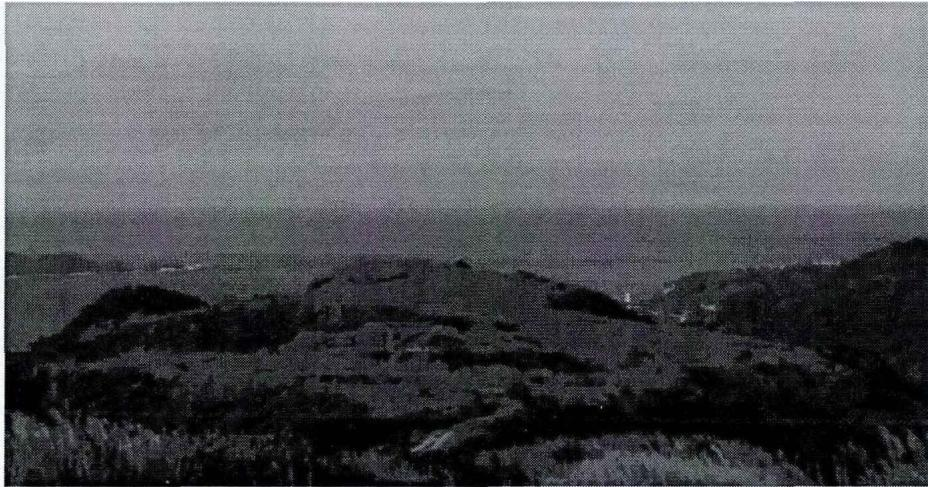
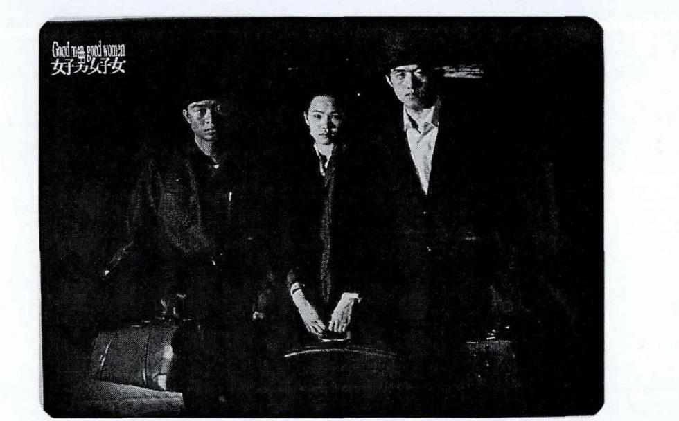

# 太原理工大学

# 硕士学位论文

题

目侯孝贤电影的美学风格研究

英文并列题目Research on Artistic Style of Hou Hsiao-hsien's Movies

研究生姓名：王

学号：2011510746

专业：设计艺术学

研究方向：现代媒体艺术研究

导师姓名：胡钢锋

职称：副教授

学位授予单位：太原理工大学论文提交日期 2014/05地 址：山西·太原

# 声 明

本人郑重声明：所呈交的学位论文，是本人在指导教师的指导下，独立进行研究所取得的成果。除文中已经注明引用的内容外，本论文不包含其他个人或集体已经发表或撰写过的研究成果。对本文的研究做出重要贡献的个人和集体，均已在文中以明确方式标明。本声明的法律责任由本人承担。

论文作者签名：__ 莉 日期：2014年6月6日

# 关于学位论文使用权的说明

本人完全了解太原理工大学有关保管、使用学位论文的规定，其中包括： $\textcircled{1}$ 学校有权保管、并向有关部门送交学位论文的原件与复印件； $\textcircled{2}$ 学校可以采用影印、缩印或其它复制手段复制并保存学位论文；$\textcircled{3}$ 学校可允许学位论文被查阅或借阅； $\textcircled{4}$ 学校可以学术交流为目的，复制赠送和交换学位论文； $\textcircled{5}$ 学校可以公布学位论文的全部或部分内容（保密学位论文在解密后遵守此规定）。

签名：勒 日期：2014年6月6日导师签名：绿 日期：2014.b.8

# 侯孝贤电影的艺术风格研究

# 摘要

侯孝贤是台湾新电影的代表者，也是创作力最充沛、视野最深邃的电影大师，这位来自东方的电影巨人获得了相当多的西方电影殊荣，表明侯孝贤已然成为了西方电影文化与中国文化的融合者。本文以侯孝贤电影的艺术风格为选题，试图系统地梳理和剖析侯孝贤电影所表达的美学特质。在详细阐述侯孝贤电影艺术风格特征的基础上，剖析了侯孝贤电影的美学特质。继而向上溯源，挖掘了侯孝贤电影具有美学特质的来源。最后，对侯孝贤电影艺术风格对中国电影的影响进行了总结。

表达侯孝贤电影特质的元素有很多，本文选取了最具代表性的四个元素从美学视角对侯孝贤电影美学特质进行了分析。首先，侯孝贤以“长镜头”表达了一种自然、淡定和空远的意境与特质，突出了“人与自然统一”的和谐美，《风柜来的人》就多以长镜头方式，使静态画面与动态人物间取得和谐的平衡状态，这些成果的取得深受沈从文的影响。然后，分析了侯孝贤以“空镜头”将一种东方人较为含蓄的美感置入电影中，展现出一种意犹未尽的情绪和感受，为观影者呈现了“实”与“虚”的诗意美，《悲情城市》中雾蒙蒙的山和雾蒙蒙的海既是电影；接着，以黑白灰色调和平时自然光为例分析了侯孝贤电影的影调，这就像中国古典山水画的“留白”,让侯孝贤电影充满着中国古典式浓浓的泼墨写意的韵味，散发出淡淡悠长的泼墨写意美；最后，以固定机位为聚焦点，透过“机位不动来表达心境的沉着”，论述了固定机位所展现和还原就正是现实生活真实的朴素美。

纵观侯孝贤电影，纪实是其一大特色，透过纪实向大众展示了台湾的发展历史，而对纪实画面人物的刻画也为观众呈现了朴素之美。而侯孝贤纪实美学无疑是通过镜头来展现的，为此，论文分析了侯孝贤如何通过镜头表达“自然写实”来追求创新与突破。

侯孝贤电影所表现的艺术风格和美学特质不是凭空产生的，有其历史和内在的根源。首先，是受到东方传统文化的熏陶。侯孝贤作为一位熟知东方文化的电影人，通过对传统文化的内省和凝练，形成了独特的艺术风格。其次，侯孝贤具有诗性气质与文化的客观表述能力。在他的电影里，文化是符号，更是手段，而内在根源在于他能够将光纤、声音等以诗性般的语言展现出来。再次，受巴赞纪实美学的深刻影响。由于深受巴赞纪实美学中“长镜头”和“景深镜头”的影响，侯孝贤电影以美学风格向观众展示了真实的客观世界，可谓巴赞美学的忠实践行者。

侯孝贤电影的成功不仅属于他个人，更对中国电影产生了极大的影响。集中表现为：运用“省略”手法为电影带来了一种缺陷美的叙事风格、为电影注入了丰富多彩的美、为电影带来历史和回忆的大气之美以及给电影带来一种发现人，发掘人性美的目的。

侯孝贤作为横贯中西的电影大师，其取得的巨大成就来源于他对中国传统文化的自省和深刻领悟，尤其是其电影中所展现的艺术风格，值得后人敬仰和学习。

关键词：侯孝贤，电影，艺术风格

# RESEARCH ON ARTISTIC STYLE OF HOU HSIAO-HSIEN'S MOVIES

# ABSTRACT

Hou Hsiao-Hsien is a representative for Taiwan new movie, and is also the most energetic and creative vision and the most profound movie master. As angoriental giant, his films received from quite a lot of western movies, Hou Hsiao-Hsien has become the western film culture and the fusion of Chinese culture. This article selected topic, aesthetic style of Hou Hsiao-Hsien film attempts to comb systematically and expressed by the analysis of Hou Hsiao-Hsien film aesthetic qualities. In detail, Hou Hsiao-Hsien film aesthetic style characteristics,on the basis of analysis of Hou Hsiao-Hsien film aesthetic characteristics. Then back up and dig a source of Hou Hsiao-Hsien film aesthetic characteristics. Finally, the Hou Hsiao-Hsien film aesthetic style's influence on China's film and disadvantages are summarized. The full text includes five chapters.

The first chapter: introduction. Discussed in this paper, the research purpose and meaning, summarizes the academic understanding of Hou Hsiao-Hsien film, put forward in this paper, we study the method.

The second chapter: Hou Hsiao-Hsien film aesthetic style features, including: long, empty lens, tone,and fixed slots. Expression of Hou Hsiao-Hsien film has many characteristics of element, this article selects the most representative four elements from the aesthetic perspective of Hou Hsiao-Hsien film esthetics characteristics are analyzed. First, Hou Hsiao-Hsien with "long" is an expression of artistic conception and traits of the natural, composure and empty far, highlight the "unification" man and nature harmonious beauty, the wind ark to people in long way more, make a harmonious balance between static and dynamic figure, the results obtained by the influence of shen congwen. Then, Hou Hsiao-Hsien were analyzed in order to "empty lens" will be a kind of Oriental more subtle aesthetic feeling in the movie, show a kind of wanting more emotions and feelings,as the viewer takes on a "real" and "virtual" poetic beauty, "fuck me" in the foggy mountains and foggy sea is both films. Then, in black and white and gray mediates natural light at ordinary times, for example analysis.

The third chapter: Hou Hsiao-Hsien film constant aesthetic characteristics. This chapter analyzes the Hou Hsiao-Hsien film constant aesthetic characteristics mainly comes from two aspects, namely to the pursuit of documentary aesthetics and lens as a vehicle for documentary. Throughout Hou Hsiao-Hsien film, documentary is one big characteristic, through documentary demonstrates the development history of Taiwan to the public,and for the figure depicts the documentary footage also shows the beauty of simplicity for the audience. Hou Hsiao-Hsien documentary aesthetics is through the lens to show, for this purpose, the paper analyzes the Hou Hsiao-Hsien how to express "natural realism" through a lens to the pursuit of innovation and breakthrough.

The fourth chapter: the origin of Hsiao-Hsien film aesthetic style. The aesthetic style and aesthetic characteristics of Hsiao-Hsien film performance is not without foundation, has its history and the inner root, therefore, this chapter explored the source of the Hsiao-Hsien film aesthetic style. First of all,it is of the influence of the Oriental traditional culture.Hsiao-Hsien as a well-known filmmakers of Oriental culture, through the introspection of traditional culture and concise, formed the unique aesthetic style. Second, Hsiao-Hsien with a poetic quality and cultural objective expression ability. In his film, culture is a symbol, but also means,and the inner root lies in his ability to optical fiber, such as voice of poetic language. Once again, deeply influenced by buzan documentary aesthetics. Because by buzan documentary aesthetics in the "long" and "the impact of the depth of field lens",Hou Hsiao-Hsien film with aesthetic style shows the audience the real objective world, is the faithful practitioners of praise and learn.

The fifth Chapter: Hou Hsiao-Hsien film aesthetic style to Chinese movies. Hou Hsiao-Hsien film not only belongs to his personal success, has a great impact on Chinese movies. Concentrated expression is: use "omit" technique brought a defect for movie narrative style,of beauty for the film into the rich and colorful beauty, bring the movie history and memories of the beauty of the atmosphere and bring a found that to the film, discovering the purpose of humanity.

Hou Hsiao-Hsien as across Chinese and western movie master, its remarkable achievements derived from his introspection and profound understanding of Chinese traditional culture, especially the aesthetic style of the movie shows, worthy of respect and learning.

KEY WORDS: Hou Hsiao-Hsien， movie， ARTIsTIC style

# 目录

# 摘要..

ABSTRACT....

目录.. . VII

第一章绪论..

1.1研究目的和意义..  
1.2研究现状...

1.3 研究方法及主要内容..

1.3.1研究方法.  
1.3.2主要研究内容，

# 第二章侯孝贤电影美学特征

2.1 长镜头一“人与自然统一”和谐美，

2.2空镜头一“实”与“虚”诗意美 10

2.3影调一淡淡悠长的泼墨写意美. 12

2.4固定机位一还原真实的朴素美， 15

第三章侯孝贤电影恒定的美学特质. .17

3.1 对纪实美学的追求.   
3.2纪实的媒介：镜头.. 21

第四章 侯孝贤电影艺术风格的来源 25

4.1东方传统文化的熏陶下内省及凝练. 25

4.2 诗性气质与文化的客观表述 .28

4.3奠定基调的巴赞纪实美学 .30

第五章 侯孝贤电影艺术风格对中国电影的影响. .35

5.1 侯孝贤电影的影响... .35

5.2对侯孝贤电影的思考. .40

参考文献. .43

附录：侯孝贤主要作品.. 47

致谢... 49   
攻读硕士学位期间发表的学术论文.. 51

# 第一章绪论

# 1.1研究目的和意义

拍摄电影的目的之一就是在于表达思想和传递感情。那么，为了更好地将思想和情感传递给观众，通过特定地方式创设意境，营造气氛无疑是一种最佳的手段，美化就是这种手段之一。在东方文化的熏陶和引导下，中国电影已走过了百年历程，在当前电影发展史上，中国电影人以自己对于外部世界的独特理解正在创造着一个又一个的奇迹。

台湾电影相较于大陆电影、香港电影来说，起步较晚，但是它在特定的历史条件下形成了自己独有的特色，其中最具有代表性的就是导演侯孝贤的电影。纵观侯孝贤电影，其作品深刻且理性，具有强烈的纪实风格、社会忧患意识，充满着乡土气息。侯孝贤让一个个充满个性的小人物在镜头下讲述故事，始终保持着对于台湾社会淡淡忧伤般的热切关注。侯孝贤是一位有着鲜明个性风格的导演，他擅长通过长镜头、固定机位、空镜头等电影语言的创新，创造了独具个人特色的写意式美学。侯孝贤的电影具有一种中国传统气质的韵味，是台湾电影从传统中国文化记忆中自然孕育的艺术表现形式，也是电影艺术中非常重要和独特的视角。

对于侯孝贤的电影，台湾学术界从上世纪80年代起就已经对他进行了关注。相对于台湾地区，大陆学术界直到上世纪90 年代中期才开始研究侯孝贤的作品，并且与台湾对于侯孝贤的深入研究相比，大陆对于侯孝贤电影作品的研究浮于表面的居多，比如，很多文献都是针对侯孝贤的单篇作品开展研究，尤其喜好对《童年往事》和《悲情城市》等几部作品进行评论。此外，就研究的内容看，当前对于侯孝贤电影的研究集中于叙事风格、诗性气质以及历史回忆记录等方面。由此看来，总体来说当前大陆缺乏对于侯孝贤大师作品的深刻理解，也难以挖掘作品的深层次含义，对于侯孝贤电影的系统化梳理则更少，更缺少从美学视角出发对其作品进行研究，宛如颗颗晶莹剔透的宝石散落一地，却没有红线的牵连。本文即是在这样一个研究现状下，试图从美学特征角度，对侯孝贤所有的艺术电影进行一次梳理，以期为后续研究者提供系统性参考资料。

# 1.2研究现状

关于侯孝贤的研究，散见于各报章期刊的影评或学术论文，近三十年来未曾中断。

在台湾谈到电影，侯孝贤有着无可替代的地位。而放眼国际，侯孝贤则俨然是台湾电影的代名词，同时跻身于世界重要导演之列。自1973年进入电影圈，至今已经历四十个年头，台湾新电影代表之一的侯孝贤导演仍旧活跃，一如往昔的提携后进，并且持续影响着台湾的电影发展。对于侯孝贤的研究，以台湾见长，并且从上世纪80 年代开始，历经三十多年且经久不衰，由此可以看出，“侯氏电影”在台湾，乃至世界影坛都占据着举足轻重的地位。

焦雄屏是台湾最早对侯孝贤提出系列研究的学者，或者说她是台湾新电影的推手也不为过。她在1988年所编着的《台湾新电影》中收录了她本人以及当代重要影评人或电影工作者的影评十余篇，堪称第一本较有系统整理侯孝贤电影论文的著作(但并非研究侯孝贤的专著)。往后则陆续于《台港电影中的作者与类型》以及《台湾新电影90 新新浪潮》二本著作中，集结多篇对侯孝贤导演影片掷地有声的评论。她的讨论自1983年《儿子的大玩偶》开始，直至1998年的《海上花》为止，共十一部作品的分析。

焦雄屏不但对侯孝贤导演的作者特质、故事情节、人物安排、或是摄影取景等手法皆了如指掌，更在所有评论中给予侯孝贤高度评价。同样评论过侯孝贤电影的李振亚指出，焦雄屏成功的将新电影与时代的大环境与社会脉络相结合，使得电影成为一种具有历史文化意义的艺术品，许多当代的社会、政治、历史议题都可以环绕着台湾新电影铺陈开展。她对新电影的高度推崇，最大的贡献在于让观众看清电影作为一种当代文化生产的确是有生命、会呼吸、留着时代血液、反映社会面貌的活泼艺术。

继焦雄屏之后，以林文淇为首的几位电影学者，也在侯孝贤研究领域耕耘许久，其中又以林文淇对侯孝贤的关注最为长久，著作最丰富。林文淇、沈晓茵、李振亚三人组成电影斗阵，曾经合作在日前已停刊的《影响》杂志共同评论国片、在比较文学会议组成电影讨论小组、为教育部设计大学电影课程、在广播电台聊电影。最丰实的互动来自于对侯孝贤的研讨。1998年为《中外文学》制作了侯孝贤专辑后，有感于国内始终没有针对侯孝贤的研究作专论，并且希望接续焦雄屏对侯孝贤电影研究的贡献，因此三人于2000 年将两年前在《中外文学》推出的专辑研究，加上过去十年国内外关于侯孝贤研究的代表性论文作一番搜集整理，推出了《戏恋人生一侯孝贤电影研究》，既成为第一部侯孝贤研究的专著，到目前为止也是研究侯孝贤不可或缺的重要参考资料。

大陆对于侯孝贤的研究相对台湾来说没有那么深入和系统，文献主要集中与两方面，一是对人文方面进行研究；二是对长镜头的运用技法探讨。

首先，对于侯孝贤电影表达人文特征方面，有以下一些研究成果。《电影艺术》作为国内著名的电影理论研究期刊，其主编吴冠平对侯孝贤的电影作品做出了这样的评价，他凭借直觉记录了自然法则下芸芸众生的生存行为，擅长于在特定的场景下柔和有意识的人和他们的活动，以形成自己独特的见解，并通过电影画面唯美地呈现给大家。北京大学艺术学院李道新教授也对侯孝贤的电影作品进行过的研究，其中，在他观看过《童年往事》后，发出了“为生而死，向死而生”的感叹¹，并写道，估计只有这样一位导演才能将“生与死、来与往”如此独到、却又如此自然的展现出来。为此，李道新认为，侯孝贤电影是对过去历史和身份的认同，已然成为台湾走向国际化的身份和符号。在当下倡导电影国际化、全球化并且电影学习好莱坞的大背景下，侯孝贤电影中对于传统文化的继承无疑是一剂清新剂，也为电影的未来发展给出了一条与众不同之路，而这也是摆在两岸三地众多导演面前的一道难题。中国传媒大学影视艺术学院教授胡克将侯孝贤电影看作是本土电影的代表作，例如，他在观看《悲情城市》后，冷眼旁观了“二二八事件”，认为侯孝贤电影运用灯光、剪辑等异于传统的多种电影手法，描述和记录了台湾社会的变革，并且侯孝贤电影以其连续30 年不断的焦虑特征，一次又一次向世人展示了他对于电影的独到理解。这种理解犹如对于历史的追问，也是一种对于未来的呐喊。北京电影学院电影文学系陈山教授更是一针见血的指出，侯孝贤电影就是非物质文化遗产2，其电影中表现的文献气质、人文坚守是不可多得的遗产。此外，不仅大陆导演贾樟柯的后期作品受到侯孝贤的影响，台湾新锐导演魏德圣等也深受侯孝贤的影响，而传承其中的就是文化的根，蜕变的魂。厦门大学人文学院副院长李晓红则从语言角度对侯孝贤电影进行了研究，由此认为侯孝贤电影中广泛运用的方言是台湾原生态文化的代表，不仅远远地超越了肤浅的语言炫耀，更为研究者提供了丰富的素材。中国艺术研究院影视研究所研究员赵卫防则对侯孝贤电影所表现的亲情和母爱给予了特殊的关注，认为侯孝贤电影中表现母爱和亲情的画面尤其多，这不仅表现出导演高度的人文关怀，也映射出导演对于过往经历的怀念。北京师范大学艺术与传媒学院院长周星则对侯孝贤电影表现出对于台湾人事、风情和青少年成长方面的关注，他认为侯孝贤电影就是导演对于台湾人情、事故的记录，不仅展示了台湾社会从农业文明向工业文明转变中面临和发生的各种问题，也透过这些问题向世人展示了台湾社会和台湾青年的成长，同时，也用电影这个特殊的艺术形式唤醒外界对于社会变革的关注。

其次，对于侯孝贤电影运用技法方面，主要有以下一些研究成果。北京大学艺术学院陈旭光教授对侯孝贤电影的运用技法和美学特征进行了研究，发现侯孝贤通过长镜头记录了台湾历史的变革，展示了台湾人民的现实生活状况，长镜头虽不华丽，却给观众带来了一种享受完整电影的与众不同的美学感受。因此，长镜头所记载的就是历史，表达的就是纪实性。此外，陈旭光教授还将侯孝贤的长镜头与贾樟柯的长镜头进行了对比，发现侯孝贤异常关注电影面画、画质的层次感和形式感，不仅希望给观众安静的内容，也要传达一种东方美学的透视力和纵深感。浙江大学影视研究所范志忠教授对侯孝贤使用长镜头的原因进行了研究，发现侯孝贤惯于和擅于使用长镜头的原因有主动选择的理由，更是被动接受的结果。其中，主动性缘于侯孝贤对于纪实主义的厚爱，表现作品的人文关怀，被动接受则是受当时影片拍摄的成本、场地、演员等限制，尤其是侯孝贤乐于使用非职业演员，他们的演技无法与专业演员相提并论，但却能提供给观众更大的真实感，而通过长镜头却可以弥补非职业演员在演技等方面的缺点。中国电影艺术研究中心研究员李迅则对侯孝贤电影的技法进行了研究，并认为正是由于侯孝贤成熟、灵活地运用各类电影技法才使得他的电影达到了如此的高度，例如，《童年往事》运用了非常规剪辑手法，突出了传统电影中司空见惯的元素，并将它们推向了绚烂夺目的艺术高度。而视点后置剪辑、平行与交错、片头加“序”等一系列技法驾轻就熟的运用更是凸显出侯导在电影技法上的巨大成就。此外，四川师范大学新闻与传播学院黄颖对侯孝贤电影的声音进行了研究，认为侯导以一种包含深情的视听语言，不仅给观众呈现了饕餮盛宴，更本真地还原了历史的本色。

在侯孝贤导演的十八部影片中，台湾三部曲《悲情城市》(1989)、《戏梦人生》(1993)、《好男好女》(1995)的研究最为丰富，除却电影的形式结构与风格之外，研究者亦就影片的政治意涵提出各种讨论。诸如殖民与后殖民、国家与身分认同，人民集体记忆对抗官方历史建构等议题，都经常出现在台湾三部曲个别或综合的论述中，而其中又以《悲情城市》引发最热烈的评论。以侯孝贤过去为数众多的作品，以及持续不辍的创作，如若以电影研究或影评的角度再对侯孝贤或其作品抽丝剥茧的加以剖析，相信仍旧能开出遍地花朵。但是，本篇论文却不再单纯的仅对侯孝贤个别电影做分析，而是从美学的角

# 度系统的对他的全部作品做出完整的梳理。

# 1.3研究方法及主要内容

本文主要是以侯孝贤电影的艺术风格作为切入点，以侯孝贤的《聂隐娘》、《红气球的旅行》、《盛世里的工匠技艺》、《最好的时光》、《海上花》、《好男好女》、《戏梦人生》等十八部作品为研究素材，分析侯孝贤电影艺术风格的发展脉络及其恒定特质。在分析过程中，详细解读侯孝贤电影的表现手法和叙事风格，分析其叙事偏向写实，长镜头、空镜头、固定机位与忽略戏剧性等艺术风格，并且进一步探讨其电影艺术风格的营养来源与其本人的独特创作。在依据侯孝贤电影艺术风格将其电影归属为作者电影的基础上，思考作为艺术电影的作者电影在中国电影市场中的境遇，并对中国艺术电影的位置与发展前景进行论述。

# 1.3.1研究方法

本文从侯孝贤电影的艺术风格研究主题入手，运用文献分析、综合比较研究等方法，系统分析侯孝贤所有电影，并总结其风格和美学特征，发现侯孝贤电影恒定的美学特质，从源头上找出其艺术风格的来源，以期为中国电影提供有益的借鉴。

# 1.3.2主要研究内容

侯孝贤吸收了西方电影思潮再通过独特的电影语言展现本土的东方意象，在电影时空中将台湾的本土文化与传统的东方美学相融合。侯孝贤凭借对于电影的独到理解，吸纳了中国传统文化的精髓，并融合了西方电影文化的优势，对传统电影中“二元对立”的叙事方式和摄影手段进行了革新，构建了颇具特色的“侯氏电影美学”。检视“侯氏”电影，其中包含着扑面而来的艺术风格，既有中国古典美学的“气韵”和“意象”，也有西方文化纪实的特质，在耐人寻味的画面中，给观影者留下了“发纤浓于简古，寄至味于淡泊”的强大意蕴。

文章首先对侯孝贤电影艺术风格特征分析，主要从长镜头、空镜头、影调、固定机位几方面展开探讨，其中，以“长镜头”表达了一种自然、淡定和空远的意境与特质，突出了“人与自然统一”的和谐美，以“空镜头”将一种东方人较为含蓄的美感置入电影中，展现出一种意犹未尽的情绪和感受，为观影者呈现了“实”与“虚”的诗意美，以黑白灰色调和平时自然光为例分析了侯孝贤电影的影调，这就像中国古典山水画的“留白”，让侯孝贤电影充满着中国古典式浓浓的泼墨写意的韵味，散发出淡淡悠长的泼墨写意美；以固定机位为聚焦点，透过“机位不动来表达心境的沉着”，论述了固定机位所展现和还原就正是现实生活真实的朴素美。

紧接着，在对侯孝贤电影美学特征分析的基础上，总结出了侯孝贤电影恒定的美学特质，即对纪实美学的追求，并从镜头的角度对侯孝贤电影纪实方式进行了分析。纵观侯孝贤电影，纪实是其一大特色，透过纪实向大众展示了台湾的发展历史，而对纪实画面人物的刻画也为观众呈现了朴素之美。而侯孝贤纪实美学无疑是通过镜头来展现的，为此，论文分析了侯孝贤如何通过镜头表达“自然写实”来追求创新与突破。

然后，探讨侯孝贤电影艺术风格的来源，主要来源三个方面：东方传统文化的熏陶下内省及凝练；诗性气质与文化的客观表述；奠定基调的巴赞纪实美学。侯孝贤电影所表现的艺术风格和美学特质不是凭空产生的，有其历史和内在的根源，为此，本章挖掘了侯孝贤电影艺术风格的来源。首先，是受到东方传统文化的熏陶。侯孝贤作为一位熟知东方文化的电影人，通过对传统文化的内省和凝练，形成了独特的美学风格。其次，侯孝贤具有诗性气质与文化的客观表述能力。在他的电影里，文化是符号，更是手段，而内在根源在于他能够将光线、声音等以诗性般的语言展现出来。再次，受巴赞纪实美学的深刻影响。由于深受巴赞纪实美学中“长镜头”和“景深镜头”的影响，侯孝贤电影向观众展示了真实的客观世界，可谓巴赞美学的忠实践行者。

最后，探讨了侯孝贤电影艺术风格对中国电影的影响。侯孝贤电影的成功不仅属于他个人，更对中国电影产生了极大的影响。集中表现为：运用“省略”手法为电影带来了一种缺陷美的叙事风格、为电影注入了丰富多彩的美、为电影带来历史和回忆的大气之美以及给电影带来一种发现人，发掘人性美的目的。

# 第二章侯孝贤电影美学特征

台湾作家沈晓茵在其著作《戏恋人生侯孝贤电影研究》中这样写道：对于台湾电影的研究，有人也许会批评从80年代以来，其内容都太过专注于“新电影”，而对于关注台湾本土的作品太少，而侯孝贤的作品算是弥补了这种欠缺，他的电影已成为 80,90年代岛内外极力推崇的标杆。从发展过程看，1991 年梁新华著作的《新电影之死从<一切为明天>到<悲情城市 $>$ 》算是“侯氏”电影形成的重要例证，并写道“对于《悲情城市》风格这样独特的片子，不注意其美学，也就措施了它由风格所带来的涵义上的丰富性”。

曾芷筠在其著作《怀旧与侯孝贤都市电影美学：<恋恋风尘>、<南国再见，南国>、和<千禧曼波>》中论述到：侯孝贤电影中的怀旧效果是透过一种人与人之间、人与自然之间的亲密而散发出来；作者还指出侯孝贤的晚期都市电影特别是《南国再见，南国》、《千禧曼波》，虽然在主题及电影语言风格上明显与过去的电影不同，但仍然带有浓厚的怀旧感，而这种怀旧感是借由特殊的电影美学所建立的。因此，本章试图分四个小节来探索侯孝贤电影美学的特征，用长镜头表现“人与自然统一”和谐美、空镜头诠释“实”与“虚”诗意美、影调写意淡淡悠长的泼墨美以及固定机位还原真实的朴素美。

# 2.1 长镜头—“人与自然统一”和谐美

长镜头，即长拍镜头（Long-take)，就是一镜到底，对侯孝贤来说，长镜头就是在不剪接的镜头下，表达一种自然、淡定和空远的意境与特质。在拍摄《儿子的大玩偶》(1983)的过程中，侯导与曾在欧美学习电影的多位电影大师来往密切，如杨德昌(1947-2007)、万仁(1950-)、柯一正(1946-)、曾壮祥(1947-)等，从这几位留洋归来的电影人口中获得了许多新知，例如侯导早已用长拍方式拍摄电影，却不知其名为“Long-take”。由此带给侯导的忧喜参半：喜的是自己在实践中所领悟的电影拍摄手法居然与国外大师不谋而合，有英雄所见略同之意；忧的是则是自己对关于长镜头的很多东西都很懵懂，似有所得，却又不能落到实处。那么，侯孝贤是如何通过长镜头来表现电影之美的呢？

在侯孝贤电影里，长拍镜头是经常运用的艺术手法，既捕捉人与环境互动的真实性，也表达情绪与意境的完整性。他曾说：我的写实是迷恋于再造的真实，好像在真实世界里人物可以单独存在。而侯孝贤所言“真实”，便建立在长拍镜头之下。

1983 年，是侯孝贤创作的转折点，他所拍摄的描述少年成长的诗性电影一一《风柜来的人》获得法国南特三大洲影展最佳影片。从此，他摆脱商业电影路数，走向艺术电影创作者。他自己曾说：拍完《风柜来的人》之后，我对电影有了重新认识，我感觉那是另一种语言。然而，在拍摄该片时，侯孝贤曾畴躇无主，因读了《沈从文自传》，带来创作上的冲击与启发，书中对人世冷静的俯瞰凝视观点正与他的成长经验十分契合。曾自言：

读完《沈从文自传》，我很感动。书中客观而不夸大的叙述观点让人感觉，阳光底下，再悲伤、再恐怖的事情，都能够以人的胸襟和对生命的热爱而把它包容。世间并没有那么多阴暗跟颓废，在整个变动的大时代里，生离死别，变得那么天经地义不可选择，像河水汤汤而流。我因此决定用这个观点来拍摄下一部片子。

侯孝贤所说的用“这个观点”拍摄，长拍镜头便是其中最为重要的体现之一。于是，《风柜来的人》不再仰赖过去电影中曲折剧情、善恶冲突来讲述一群等待当兵前百无聊赖的青少年，每天经历的游荡生活，不但改以大量中、远镜头不卑不亢地展现青少年的抑郁和生活态度的转变，更以长拍镜头传达各种复杂情绪。

关于长拍镜头的主张，可溯及巴赞(1918一1958)的写实主义电影观。电影史上，最早使用长镜头的经典电影就是弗拉哈迪于1916年拍摄的《北方的那努克》。而侯导更是以长拍镜头的长、短节奏改变着电影场面。仍以《风柜来的人》为例，全片多以长拍镜头方式，处理人物冲突，使静态画面与动态人物间取得和谐的平衡状态：有一情境是阿荣(张世饰)与小孩(童星颜正国饰)因赌起争执，随后小孩找叔父讨公道，引发街头打斗。在这场一触即发的打斗画面，若从巷尾远远观看，看不到剧中人物的表情，只有一群人激烈扭打的动作。然后他们追出画面，镜头不但未剪接，甚至未转移，此时陆续有路人经过，以侧目回头方式，暗示打斗持续中。不久又打进巷尾，进入画面。这种方式具有电影符号学里的“轮替的语言群”效果：一群人激烈扭打，追出画面，有路人经过，侧目回头(在银幕上，此即符徽之所在，目的在于模拟自然的观看)，而观众明白打斗还没结束(在陈述中，此即符旨之所在)，而且对于这种语意群的呈现方式视之自然，正符合剧中人物特质。

这种用客观、有距离的方式捕捉一群等着接兵单的青少年，成天无所事事，漫无目标地游荡，使观众从影像里逐渐感受他们内心的情感与抑郁。

另一幕是阿荣与阿育在自家门口聊天，突然遭一群人围殴，冲突后阿清、阿荣、土豆等人坐在傍晚时分海边的小屋旁谈话(如图2-1所示)，以长拍镜头，取远景，用含糊方式呈现对话气氛，却营造出强烈的美学效果：因为惹事后，这群初生之特对未来何去何从，产生茫然、疑惑，远方的山、水、小屋与人物融为一体，与远方斜阳相互辉映，以此拍摄手法呈现，更能渲染对未来无所适从的暗淡氛围，实现一个画面中人与自然和谐共存之美。

  
图 2-1《风柜来的人》以长镜头渲染人与自然的和谐美感  
Figure2-1

此外，运用长拍镜头尽收日常生活里的细节况味，呈现粗犷原始的风貌。如阿荣、阿清、郭仔三人离开风柜海边，来到繁荣的都市一一高雄，投靠阿荣的姐姐。为找地址“河西路”，三人从公交车下站后，沿着车水马龙的马路行走，在画面中，三人由右至左行走，再从左到右折返，最后询问路人结果：在上面，镜头攀升半空，斗大的路标“河西路”，呈现在观众眼前，不禁令人莞尔！

这幽默的背后说明了这三人粗扩原始的生活型态，还未适应从文字符号(如路标)得到便捷生存的线索；也是他们进入都市文明后将遇上无数挫折的开始。对这群等待兵单、百无聊赖的年轻人而言，也有童心未泯，在澎湖海边嬉戏玩闹，展现青春活力的时刻：三人嬉戏玩水，无任何对白。

这一幕是运用固定长镜头的拍摄手法，其作用即是保持画面情绪、人物心境及相互关系的稳定性、完整性。对于生活在风柜的年轻人，海，是生活环境的一部分，自然也是玩乐处。三个大男孩，尽情在海边奔跑、嬉闹、彼此捉弄，洋溢着青春活力的气息。

它可能是几节音乐或街对面的一道亮光这些瞬时印象来得快也去得快，却留下了一种情绪一就像一个欢快的梦。长镜头下记录的不仅是一个电影故事，更表现了主人公的生存状态，尤其是那种对于生活满足的乐观精神状态。长镜头下所表现的这部戏就像绕一个彩色的纱锭，刚开始慢一些、弧度大一些，随着绕制的纺纱越来越多，需要染得越来越仔细，由此也有形成了一部完整的电影。因此，《风柜来的人》片中三位大男孩的青春朝气，藉由长镜头的拍摄，着实地呈现在观众眼前。

由上所述可知，侯孝贤作品呈现的是自然、率真、不造作的人物特质；而且关注的焦点在于生命存在本身。对他而言，朴实的画面，具有了一种单纯的美感，他的电影正是表达了沈从文笔下的人与自然“和谐共存”，“优美、健康、自然，而又不悖乎人性的人生形式”。

# 2.2空镜头一“实”与“虚”诗意美

空镜头（Emptiness），即在无人物出现的镜头下，侯孝贤将一种东方人较为含蓄的美感置入电影中，展现出一种意犹未尽的情绪和感受。电影表现的是一种意境，这种意境可以是社会的，也可以是自然的，更可以是人物的，而空镜头正是表达电影意境的绝好手段之一。

在中国古典主义美学理论中，格外注意意境“空白”的运用，如同中国山水画，讲究“留白”的意蕴。“浮光掠影、凝虚成实”的写意手法，使得意境里充满着无限悠远的空间。对电影创作者而言，常借用银幕空镜头的创造力，如光影、色彩、布景、声音等艺术元素，营造和表现一种独有的创造力。对侯孝贤的电影来说，“空白”就是“空镜头”，而且看到的是带有情感的空镜头，是心理所直接领悟到的物态天趣，是天地万物与心灵的契合。当透过大量景物的空镜头，把对人物命运的关怀融入大自然宽广、悠远的境遇中，使得意境表现极为空远。

对侯孝贤电影来说，空镜头运用十分之多，一棵树、一幅画、一根电线杆、一辆自行车甚至是一盏昏黄的灯光都可以述说一段沁人心脾的场景。对于初探侯孝贤银幕的人，觉得用这样的空镜头进行场景切换，与众多的长镜头配合能够比较好地保持节奏的舒缓和淡淡的感情基调。但是，随着对侯孝贤电影的了解，发现空镜头的运用尤其多，就仿佛导演的用意并不仅是场面切换这么简单。每一个空镜头，似乎都有许多并没有用人物和对白来表现的语言，而这种言语之外的语言，正是导演想要表达的画面之外的很多东西，例如背景，例如评述，例如情绪，例如刺激。比如在《悲情城市》中，那雾蒙蒙的山和雾蒙蒙的海，极易引发观影者太多的回忆，而放在影片中，更是让人倍感忧伤。

  
图 2-2《悲情城市》中空镜头表现的“虚”与“实”  
Figure2-2

再如《恋恋风尘》中的表现大山的空镜头（如图2-3)，不仅画面优美，沁人心扉，天空的那一片云，偶尔投印在我的心间，一切也都如蓝天上的云朵轻轻地划过…同时，空旷的大山更像是阿远透过阿公的眼睛看到的世界，“虚”、“实”之间，变幻与坚持，流逝与永恒。而电影最后一幕是出现一片灰蒙蒙的天际，片片层云缓缓从山谷上空飘过，如图 2-4，似乎将阿远情感上的创伤、人世间的种种不幸，都被天地抚平。而人对生活的坚韧态度，便凝住在这片天地中。 学

  
图 2-3《恋恋风尘》中的空镜头“山”表现世间的永恒

  
图 2-4《恋恋风尘》中的空镜头“山城”表现主人翁的创伤  
Figure2-4

侯孝贤可以不露情绪地将机位定住，久久不动，然后缓缓的平摇，或者溢满感慨的空镜头转场，使画面产生一种让人动容的情感。故乡的风把一切都吹动了，最初的日子，他为她扛着米袋一起往家走，中途看到人们在为露天电影做准备，风将幕布的一角掀起，有人连忙跑过去弄好，他与她继续往回走侯孝贤空镜头的表现手法，被学者称之为“侯孝贤的道家式美学"：将中国古典美学的长处，将人的存在推广到无限宽广的空间之上。

# 2.3影调一淡淡悠长的泼墨写意美

电影的影调就是摄影者通过结构、色彩、光线效果等客观再现现实场景，是电影的表现手法之一。总体而言，色彩和光线构成了电影影调的主要元素，根据色彩和光线的不同，又可将电影影调分为暖调、冷调、明亮和幽暗等。由此，一部电影影调的表现主要可分为2个层次，其一改变影像的明暗反差，其二调节画面的明暗亮度，二者分别表现了电影中人物情绪的类型与强度。侯孝贤电影的影调悠长、深远，充满着中国古典式浓浓的泼墨写意的韵味。

# （1）灰（黑）白的色调透出苍凉之美

侯孝贤电影惯用的灰（黑）白的色调，犹如中国泼墨山水画于黑白相间中表现出独特的审美力。例如，早在1985年由侯孝贤自编自导的《童年往事》大量运用了灰、白色调。《童年往事》描述了从大陆前往台湾的一家人，在表现平静的生活下，却以“外乡人”的尴尬艰难生存，如图2-5所示。在该部影片中，无论生活的住所，还是生活的场景，透过灰、白色调彰显出生活朴素、恬静的美感。这一方面表露出导演对于过去生活的回忆，而这灰白的画面正如黑白照片所记载的过往之路，勾起观影者对于过去生活的怀念和依恋；与此同时，灰白的照片也映射出当年早期台湾百姓生活的艰辛，灰白的画面映射了犹如死气沉沉般逝去的过往，却又暗示着未来更为艰难与萧条。在如侯孝贤三大悲情戏之一的《好男好女》，以时间为线用一个女子的三个故事贯穿全剧，全局仍选用了黑、白、灰的色调，如图2-6所示。黑、白、灰的色调表现了多种电影的意境，其一，主人公的颓废之“美”，黑与白直接将主人公梁静以往生活的堕落表现出来了；其二，黑白反差表现了主人公过去生活颓废的同时，也将其灰暗和渺茫的生活前景表露无遗；其三，黑白也是电影所表现时代的色彩，将“黑白”时代下小人物的黑暗命运真实表达了出来；其四，以黑白调作为三个故事间的切换，映射了人物心情的灰暗、无彩，增加了全局凝重的气氛，带给人无限的思考。

  
图2-5《童年往事》灰白色调表现生活的艰辛  
Figure2-5

  
图2-6《好男好女》黑白灰色调表现生活的颓废  
Figure2-6

# （2）平实、自然光透露典雅之美

侯孝贤电影透过平实、自然、真实的实景光效，表现了中国古典式的素雅之美。侯氏电影中广泛使用的河流、山川、大海、田野等实景，通过捕捉自然光线，将大自然的不加修饰之美真切地展示给大家。例如，《童年往事》中的光线几乎都是穿透树叶而投射到主人公斑驳陆离的脸上，其中斑斑驳驳、层层叠叠的光线与孩子们的黑白色衬衣相互辉映，不仅表现了导演对于过去童年的依恋，也展示了生活的大气、朴素之美；此外，片中四次出现的“雨天”，不仅拉升了故事情节，更为影片场景的展开打下了铺垫，尤其是姐姐出嫁前的第二次下雨，与榻榻米平行的摄影机纹丝不动的“监视”着母女二人，透过雨天窗外琉璃而入淡白的自然光线，将屋内浓浓亲情徐徐烘托而出。而在《恋恋风尘》中，影片中众多画面所绘制的滚滚乌云，犹如大山压顶般让人透不过气，而自然的这一切正预示着阿远和阿云的无疾而终的感情。

（3）场面调度突出移动之美

长镜头和空镜头的频繁使用，难免会让人生厌。正如侯导所说：“我就每天一定要长镜头，每天用，用久了不是很烦吗？那就开始摆轨道移动，就完全不一样了”。因此，在长镜头和空镜头之外，需要借助其它的电影技术，场面调度就是其中很重要的一种，通过场面调度，可以突出所拍对象的移动之美。但是，场面调度绝不是为了移动而移动，他应该有焦点，有中心。

比如《海上花》中吃饭这个长镜头，如果从沈小红的字幕开始算起，侯导一共拍摄了7分钟。可以想象的是，一个镜头拍了7分钟，难免让人感觉时间很长，并且这只是沈小红的第一场，接下来沈小红还会出现好几场，直到第6场，第7场，如果一直以长镜头固定机位拍，难以让观众信服。所以在拍摄的时候，侯导把拍摄过程分成了好几天，每天拍很多 take，其最大的理由就在于用底片rehearsal(走戏／排练)，能够最大限度地调动演员的积极性和演戏认真劲。再比如，沈小红旁边的那个佣人，去拿茶叶，这就是一个 sign，由于佣人在边上，只能移动才能拍到他，佣人就是一个动机。侯导拍摄时，不太愿意演员移动，都是用画面跟着某个东西动，而这个移动的画面就是个sign，通过sign就使电影生动起来，自然起来，避免了长镜头可能带来的拍摄僵硬。

所以，侯导说，场面调度要注意一些原则，其中最重要的亮点，一是要使片子看上去真实，没有造作的痕迹，不能让人觉得这是事前安排好的。一般来说，拍戏的真实性需要时间的历练，如何让演员演出的戏不做作，说出的话不“假”，时间的积累很重要。其二，场面调度需要有个 sign，演员什么时候走动，什么时候取东西如此等等，都需要考虑 sign给片子带来的影响。比如《南国再见，南国》中打纸牌那一段戏，有个人来找高婕，于是高婕就将牌给别人，自己过去跟人说话。这个时候，大哥大响了，在打枪的林强过去接打给高婕的电话，由于只有一个地方有信号，高婕走过去接电话，这就是一个很长的调度。

# 2.4固定机位一还原真实的朴素美

有影评专家曾表示，侯孝贤的电影光看是不够的，要用心去体验。孟洪峰更是表示，侯孝贤电影风格是“机位不动来表达心境的沉着”。固定机位已然在台湾形成了新电影的特征符号之一，在侯孝贤等一大批导演的灵活运行下，摒弃了过去段落叙事的镜头，借以静止的镜头记录符号化的生活，其中的星星点点不仅融入了人物的命运，也更突出了时代的背景。固定机位所展现和还原就正是现实生活真实的朴素美，在无声无息中，生活静静的、远远的、一刻不停的发生着，进行着。

就侯孝贤来说，对于固定机位的使用炙手可热的当属《恋恋风尘》。有影评人对《恋恋风尘》进行过统计，全片运动镜头仅为5个，大幅度的摇移镜头更仅为2个，其余大部分镜头都是在固定镜头的切换中完成的。

再比如，在《悲情城市》中，文清第一次入狱，狱警呼两个狱友开庭(其实就是等于枪毙)，固定镜头，文清坐在门口，茫然，接着狱友起身穿衣，与人拥抱握手告别，一切都在平静中进行着，没有喧哗和过多的肢体语言，接着镜头转到文清坐在铁窗下，画外传来两声枪响(注意文清是听不见声音的)，接着狱警呼“林文清开庭”一简直是惊心动魄，不想固定机位一切，却看到文清一家在吃饭，再切，文清坐在墙边，这段戏的表现简直让人叹服，让人越发觉得在政治运动的惊涛骇浪中，普通人原来是如此渺小，并且一切的一切都是在这么静默中发生的，这种固定机位的长镜头用在这里恰倒好处，本身就是最平稳的镜头语言，镜头里的安静，平缓，却反衬出了外在的波涛汹涌。

需要提到的是，侯孝贤的长镜头一直到拍摄《戏梦人生》时都还是固定机位为主，也就是进行长拍时的摄影机多半是摆放在固定位置，而且没有复杂的运动，顶多搭配上下或左右的摇移。侯孝贤表示使用固定机位是受限于环境或器材：

拍摄街角或广场时很少以相反角度再拍摄(正/反拍)的原因是，例如《童年往事》是40年代的故事，要找类似当时的情景实在很难，例如电影院，倘若再以反角度拍摄，就会出现现代化的楼房，因此片中许多画面就不得不从单一角度拍摄。

我也很想让镜头移动呀，可是以前的轨道车嘎拉嘎拉那么大声，拍摄器材也没那么好，怎么动？

当然，侯孝贤并未消耗太多力气来对付这些限制，反而设法在限制中找寻出路。如果镜头不能移动，那可以让人在景框内外(前后)移动，以这样的想法为基础，使得侯孝贤后来经常将镜头固定对着“通道”，可能是门，也可以是走廊，镜头不会跟着人物进到房间或走出门外，但是人物一定都要经过通道，很多事情可以让它在通道里发生。侯孝贤喜爱这种捕捉生活(生命)的轨迹的感觉，后来就一直沿用，直到《戏梦人生》的下一部影片《好男好女》，侯孝贤才终于开始运用“推轨”移动摄影机让镜位有大幅度的移动。但即便镜头动了，依然是不跳拍、不切割的长镜头。

传统电影叙事以间接方式为主，侯孝贤以固定机位拓展了传统电影叙事方式，不仅再现了客观世界，更以固定机位将电影推向了一种高度真实和朴素的高度，正如朱天文所言：固定机位维护了侯孝贤电影的时空完整性，使电影纪录片散发出纯朴、真实的浓浓情味。

# 第三章侯孝贤电影恒定的美学特质

# 3.1对纪实美学的追求

著名记录学家理查德·巴森曾说：将每日的生活转为永恒的记录。“纪录片”长久以来一直被认为是捕捉“真实”世界人、事、物的一种电影类型。其价值在于它能反映多少真实，摄影机只是记录的机器而不是表现的媒体，纪录片带给观众的震撼力除了影像之美外更有真实感。1890年代中叶，被公认为电影之父的法国卢米埃兄弟(Louis Lumiere、AuhustLumiere)改良了美国爱迪生的早期电影摄影机及观片器材，发明了集摄影、冲印、放映三种功能于一身，而且相对轻巧(为爱迪生片厂摄影机重量的十分之一)可随身携带的新型电影摄影机(cinematographe)，一种崭新且方便的“动作记录器”从此得以超越绘画与摄影只能擷取静态影像的局限性，进而捕捉日常生活中流动、自然的动态影像，成就了艺术表现与大众娱乐的新形式之外，也为当时人类的活动提供了生动而价值不菲的纪录。在卢米埃兄弟初期的电影里，每部电影的长度都未达三十秒，摄影机都摆放在固定位置，而且也没有使用剪接，可谓对“真人实事”制作了纯粹的“纪录”。这些短篇的纪实影片被视为最早的纪录片(用“最早的非剧情片”更贴切)，而卢米埃兄弟则成为电影“写实”倾向的先驱，他们与同时代法国乔治梅里耶(GeorgesMelies)所建立的“形式”传统分别将电影带往两个不同的方向。

侯孝贤曾说，从《童年往事》等早期电影中可以看出，“我创作的焦点跟小津是不同的l”。相比之下，小津的电影关注日本普通家庭及其生活，但是，侯导创作的焦点则是存在的个体，也就是记录生命的本质。正如侯导所说：生命中“存在的个体打动我，所以我拍的都是一些边缘人，一些小人物”。由此可见，侯氏电影成功的一大秘诀在于纪实身边真实的“美”。就像《南国再见，南国》里创作的那三个主人公，一般人看到这三位主人公一定会认为是社会的毒瘤，捣乱分子。他们的存在就是为我们这个社会增添了烦恼。但是，这样的人却是我们这个社会中真实存在的，大家恨他，就在于这部电影正揭示了我们生活中活生生的存在个体，电影中描述的这些个体，那么具体，那么惹大众生厌，也在于电影中将他们的本质呈现了出来。所以，对侯导而言，他的电影记录的就是生命的本质，社会的个体。其实，生命对每个人都是不一样，电影纪录的是每个人的人生轨迹，表达的却是我们这个社会的发展和变革经历。因此，侯导的电影是写实的，或者说，让侯导电影风靡的最大理由在于他活生生的记录了社会的真实存在。比如，在《风柜来的人》之前，侯导电影剧本中有大量的明星助阵，某种意义上讲，当时电影的卖座与使用大明星有一定关系，比如，《就是溜溜的她》中的凤飞飞，《早安台北》、《我踏浪而来》、《天凉好个秋》中的林凤娇等。但自从拍了《风柜来的人》之后，侯导的电影开始行使在纪实的路上了，演绎的都是生活中的平常个体，运用的演员也都是“一群小鬼”，比如，刚从艺校毕业的钮承泽等。侯导后来说：使用生活中的人来拍电影，就因为他们是生活的原型，能够原滋原味的表现真实的生活。但是，这是后来的解释，当时拍电影的时候，还没有这方面的考虑，可以说，这是一种后知后觉的事情。其实，侯导1983 年拍摄的《在那河畔青草青》还采用了钟镇涛、江玲、陈美凤等一大批明星。但是，随着后来电影的陆续推出，如《冬冬的假期》中因为妈妈生病去外公家度假的冬冬（王启光配）、《童年往事》中从大陆前往台湾的平凡却又不平庸的一家人，以及《恋恋风尘》中的来自于农村的少年阿远（王晶文配）、阿云（辛树芬配)，以前的后知后觉逐渐变成了现在的先知先觉了。特别是沿着这条路一直走，发现自己内心在这方面的愿望更加强烈，也就愈发清楚了未来发展的路子。并且，随着岁月的增长，侯导的电影并不仅是现实生活的简单重复，而加入了个人的生活经历和生活看法。侯导后来说，不管是从文学还是从其他途径吸收的东西全部回到你的创作上，开始发酵，开始出来，开始往这个方向。到现在我其实没有变，不管形式怎么在变，到最后还是对人的这种生命的原型、生命的本质有兴趣。

以《戏梦人生》为例，该剧完成于1993年。当时的时代背景是台湾正处于解严初期旧秩序崩解、新规范尚待建立、政治与文化都处于激动、混乱、狂欢、焦躁的混沌时期。1986 年民进党在执政的国民党默许下得以正式成立；1987年蒋经国宣布解严之后，又连续开放大陆探亲以及与东欧共产国家的经贸往来，并且解除外汇管制和开放对外投资；1988年报禁解除、蒋经国去世、李登辉继任总统；1991年终止动乱灾难时期、修宪、万年国会开始改选。1980年代后期由解严所牵动的一连串变化导致台湾的威权统治走向转型。政治生态和经济体质的大幅蜕变，使得长久处在保守压抑状态的台湾社会活力爆发出来。各种对国家机器和主流文化的批评论述倾巢而出，它们挑战旧有体制价值，将原本单一权威的意识形态转向开放性的多元文化。解严开启了1990年代以来一个具备多元文化的市民社会以及自由开放的民主政治的时代。政治的松绑和社会风气的开放不仅允许以往弱势族群的发声，连带地使许多禁忌的、争议的议题浮现台面。不论是强调关注族群文化、重构国家与族群记忆、致力本土历史的挖掘与建构，都不再服膺于过往强调单一权威理性的伦理逻辑，每个族群都各自为建构族群记忆和历史的工程而努力。本土意识的抬头也使得许多探讨着台湾语言、民俗歌谣、历史事件与重要人物文献资料大量出土，以口述、影音或书面的方式建档或出版，无论民间或是官方，都循着“寻找、记录、保存”地方文化资产的方式，试图拼凑以往破碎扭曲的文化记忆和历史真相。侯孝贤的“台湾三部曲"：1989 年《悲情城市》、1993 年《戏梦人生》、1995年《好男好女》，明确地挑战过去的禁忌，竞逐台湾历史诠释权的企图也是昭然若揭。1947年生于广东的侯孝贤，出生不久(刚刚满月)便举家跟随父亲来台述职，是个在台湾成长的外省第二代。在1997年国民中学增设“认识台湾”课程之前，台湾各级学校中所接受的历史教育都是“看不见台湾”的中国史教育。历史记忆的传承大部分来自学校的教育，与同时代的学子相同，侯孝贤在求学阶段自然对台湾的过去所知有限，即便开始从事电影创作后，开始自觉性的试图去探索，但恐怕仍受限于保守的政治与社会气氛而难有突破。随着台湾的解严，一种清新、开放的空气涌入岛内，使得以侯孝贤为代表的新电影人打破和超越了过去，如《风柜来的人》、《冬冬的假期》等电影的格局，一方面在电影形式上追求创新，同时在内容上大胆挑战官方历史论述。“台湾三部曲”触碰了数个官方在解严之初仍旧回避的历史主题，除了利用电影向台湾观众揭露过去遭受刻意忽略的历史，侯孝贤以庶民为主、不仇视日本的观点也明显地与当时官方历史论述相去甚远。《戏梦人生》诠释的是侯孝贤二十年前所认知的日治台湾，时移境迁，影片中所欲拆解或澄清的，在今日看来都算小题大作，因为当今台湾的每一个层面已然进入众声喧哗的境地。需要关切的是，侯孝贤当时透过李天禄个人的、庶民的历史试图去瓦解官方提供的历史版本。但是，个人的记忆或生命历程与集体的、国家的历史为何能混为一谈？这又是另一个问题了。

在这样的界定之下，《戏梦人生》大致上可以被归类为接近纪录片的“纪录剧”，它以剧情片的形式拍摄真实存在的人和物。或许是因为侯孝贤从来未曾考虑将李天禄的生平拍成纪录片，因此并未依循一般历史纪录片的模式，即辅以大量史料、照片、访谈的策略性手法来说服观众。侯孝贤选择的是以演员重演来再现李天禄日治时期的经历，然后巧妙地运用老年李天禄的旁白及现身说法，时而进行串场以填补影像段落间的生涯片段，间或进行独立的故事陈述。侯孝贤素来的写实运镜搭配生动又具说服力的“传主现身说法”，使得观众很容易产生“观看纪录片”的感觉，相信影片中的情节是在为老年李天禄的口述历史作影像的补充，进而在观影结束之后思索“日治时期台湾人民如何生活”、“日本统治者与台湾人民之间的关系如何”这些真实而又深刻的问题。

在比如，拍摄于1989 年由梁朝伟主演的《悲情城市》以一个普通人的命运故事为主线，讲述了普通人在大时代背景下的渺小和无奈。侯孝贤作为导演，并未加入影片那个时代对于普通人生活造成巨大影响的批判中来，而是静静地观看，冷静地记录，貌似主人公的悲喜都与他无关。例如，身为哑巴的林文清想说又说不出口，只能抓耳挠腮，被枪杀的林文雄连枪声被未曾被听到，而正是这种冷冷地记录带给观众内心强烈的震撼，可以说《悲情城市》就是一部纪实美学特征鲜明的影片，纪实性电影本身就具有客观和多义的美学特点，在技术上通过长镜头和景深镜头，让观众和影像现实直接相遇，感受到完整而多义的现实，从而对影像作出自己不同的阐释。《悲情城市》还是典型的人物群像式影片，众多的人物都刻画得比较丰满而又相对独立，解读起来有更多的角度。在电影《悲情城市》中，宽荣死讯传来，文清呆呆坐着、宽美喂孩子吃饭，没有失声痛哭、没有失手将碗打破，却分明是悲痛欲绝，一切至乐、至痛原来都是如此静静地、淡淡地在生命中流过，这里虽是固定长镜头，却同样在平静的镜头里蕴涵着如此强烈的悲伤！最强烈的伤痛，并非情事，而是在历史和政治的旋涡中，体会到人的渺小无力，无从抗拒，即便是像文清，宽美这般温柔，善良，与世无争的人，长镜头在这里的运用更是加强了这种无奈的悲哀。影片结束后许久，依然沉浸在一种难以忘怀的情绪中，偶然想起，首先出现脑海中的竟是那些山谷、港湾、帆船、桅杆的空镜头，而忧伤之情也正是从此缓缓的溢了出来《悲情城市》能讲的方面是很多的，本身它就是侯孝贤自身突破的象征，从过去自传式、童稚或惨禄少年的深邃悲愁与怀乡情韵，已经飞越了内向的世界，明显地外化为更复杂的历史与个人命运的沉思，侯孝贤无疑已成就了一份史家笔触，在客观与写实的时刻里，最是关情。所以，《悲情城市》具有强烈的纪实主题意蕴，是侯孝贤纪实电影的典型代表。

不过，侯孝贤影片中所展现生命之种种，并不是包含生命之大全。在《悲情城市》中，虽然生老病死一应俱全，但是，大哥小妾孩子的出生，并没有欢天喜地；大哥文雄的死也没有呼天抢地，四弟文清的婚礼则直接在大哥文雄葬礼之后，缺少了应有的欢天喜地。侯孝贤所谓生命之种种，更多表现的是大时代背景下小人物生命的种种无奈和不幸。至于家庭成员之间的交流阻断和疏离，他或许认为是人存在的本质，非某一家庭所独有。这种人生观，具有现代主义艺术的谱系之内。所以，总体来说，《悲情城市》展示了各类人生在社会大背景下并不美好而无力挣脱、无法避免的一面，人们面对现实，唯有接受，使人生出大悲之后欲哭无泪的感觉。《悲情城市》不是一部超脱之作，更不是一部温暖的充满爱意的影片。他给观众的并不是如何生活的启示，而是生活如何的揭示，这也是现代主义应有之义。只有充分理解了生活如何，每个人才能决定如何生活，这也是纪实电影观念想要到达的臻境，可说是万物归一。

纪录片融思想性和艺术性为一体，能够真实的向观众传达知识性、价值性的信息，而这一切都必须以美为前提。可以说，侯孝贤透过镜头展示的记录世界，正是对记录美学的追求，通过对画面人物的刻画不仅为观众带来了记录之美，也为观众呈现了朴素之美。

# 3.2纪实的媒介：镜头

纪录片的发展至今已超越一个世纪，在定义或表现形式上随着时间的演进一直不断在改变。对于纪录片发展相对落后的台湾来说，近年来的纪录片也争相出现实验表现形式的风潮，例如自2000 年起，“台湾纪录片双年展”就一再出现许多混合真实纪录、虚构、重演、戏剧演出、甚至包含动画与特效等元素的作品。但无论形式如何改变，其一，纪录片都必须是基于对“真实”的追求，纪录片的素材必须源自用摄影机镜头对真实世界的捕捉(或是纪录片工作者确定真有其人其事之存在)，任何对真实世界的伪造、扭曲、干预，都还是会被认为是不适当的。其二，纪录片应透过镜头表达观点，而且通常是有代表作者个人观点的纪录片才被当成艺术作品，否则可能会被认为是宣传片，减损其艺术价值。最后一个未曾随时间而消失的是，绝大多数纪录片工作者都仍保有一分对人类社会的使命感，认为改变事物的状态、记录正在发生的历史，或是唤醒我们去注意他们认为我们生命中值得深思的某个层面，是他们责无旁贷的义务。他们对人类永恒价值的终极关怀、对土地的热爱、对勤奋工作的热爱、对人与人之间彼此可以分享的爱等等，将使纪录片这个电影类型得以超越时代仍然拥有强大的力量。

1983 年他拍《风柜来的人》，添加了很多自己少年时的体验，电影呈现出一种苍凉的感觉，至此侯孝贤的电影开始形成自己特有的风格。质朴无华的演员，追忆逝去的时光，青春的宣泄和迷茫，是侯导电影的独特之处。侯导拍戏喜欢用非职业演员，选用非职业演员可以降低成本。侯导说，长镜头的拍摄手法就是为了解决这些非职业演员的表演问题。有人做过统计，他的长镜头运用非常之多，电影《悲情城市》全长158分钟，整个片子有 222个镜头，换句话说，平均每个镜头长达43秒，有的镜头甚至于达3分钟以上。不光这部电影，他大部分的作品都有类似的一致风格，以较多的长镜头、写实的手法，把普通人的真实生活做最自然的呈现。这种静止镜头的表现，有人把它叫做“侯式美学”1，后来台湾新一代导演群起效尤，“侯式美学”的影子在这些年轻导演身上可以找到。他还喜欢在电影中使用台湾本土演员，喜欢用方言，而且非常强调台湾电影的地域文化，反映社会底层小人物的悲惨命运，展示各个历史时期的台湾面貌，把他的电影串起来就是一部台湾文化的变迁史。所以有人说，侯孝贤是一个具有独特意义的台湾导演，想更多地了解侯导，研究其电影的艺术风格是一个很好的途径。

事实上，无论侯孝贤在风格上如何追求创新与突破，他都希望影片透过镜头表达“自然写实”效果的想法未曾改变。而深焦镜头提供空间的真实感、长镜头则提供时间的真实感，两者同时也都有达到保持画面情绪，人物心境以及相互关系稳定、完整的功能。如《戏梦人生》透过李天禄的青年经历来展示日治时期的台湾，是一部有浓厚历史感的影片，运用深焦镜头与长拍镜头可以扩大画面空间与时间的份量，这种运镜形式下，在提供真实感的同时，也可以呈现与遥远历史年代的距离感，留给观众一份想象回旋的空间。而且因为观众与银幕之间产生了距离，也就不得不跳脱传统观影入戏的习惯，有机会成为一个观察者，在拟真又加上距离的窥看历史过程中，客观冷静地检索导演在影片中提供的信息，加入对影像或者该说是对“历史”进行诠释的行列。至于侯孝贤在《戏梦人生》执着于固定镜位，恐怕是因为“历史”这个主题所致，因为，还有什么比得上“景物依旧，人事全非”更能体现一份变迁感呢？影片中有一个通道在李天禄离家进入石碇内山之前反复的出现：远景是一楼通往二楼的楼梯；中景是穿堂；近景是门框内的房间。第一次在这个通道发生的事件是母亲在此严厉管教做错事的小李天禄，当时门框内的近景是李天禄父母的房间。第二次从这个通道走过的是刚从医院返家的母亲，母亲的虚弱形象暗示着不久于人世。第三次再出现这个通道时，母亲已经去世，继母在媒人的带领之下，走进李天禄与母亲过去相处的空间。第四次则是外公去世后，家庭气氛更不融洽，李天禄与继母关系相当恶劣的一场互动，在李天禄愤怒摔碗夺门而出之后，全片再也没有出现这个二楼穿堂通道的画面，象征李天禄的生命与李家做了切割。因为，从李天禄离家的镜头之后，影片中的李天禄就像李家的客人一般，即使仍与父亲互动，但场所仅限于一楼厅堂这个公领域，再也没有让李天禄踏入李家厅堂以外的私领域内。四个画面，影片播放时间不过半个小时，似乎导演已不着痕迹的将李天禄从幼童变为少年，李家也已经经历几番生死离别，疏忽十余年，仿佛在瞬间就已流逝。

再比如，侯孝贤谈起《悲情城市》这部电影，就曾表示，他愿意通过这部电影，记录自然生存法则下，人们真实的生活轨迹。于是在影片中，透过一个个长镜头，为观众展示了一幕幕的生、死、离、别，其中的伤痛萦绕，快乐相伴。每到动情之处，或情节高潮迭起之时，本有争斗发生，或画面中人物有痛哭时，画面又切换到或是九霄云外，或是苍茫大山之上。通透山间漂浮不定的浮云，或浮云下汹涌澎湃的暗流暗示着主人公的不幸遭遇。这般镜头的记录，留给观影者无限遐想，生命之河何况不是如此，虽包含一份深情，但命运之神却往往难以垂青。

检视侯孝贤四十年来的作品，除了“台湾三部曲”之外，他的创作确实专注地记录着“人”这个主题，表现出“人在大自然法则下的种种姿态”始终是他所关注的重心，他想说的是“人”的故事，更在记录“历史”。虽然，反映与探索人生处境的时候离不开生活的场域与所处的时代，但在台湾三部曲之外的作品里，特定的历史事件的确并没有被导演特意圈选成为影片的主题，侯孝贤写实的拍摄风格可以反映出故事的时代感，但导演很明显地欠缺诠释历史的企图。1987年解严之后，受到政治的松绑和社会风气逐步开放的影响，素来具有实验精神的侯孝贤加入挑战禁忌议题的行列，才开始着力于台湾本土历史的挖掘与建构，将电影创作中对“人”的关怀展延出“历史”的厚度。解严后的十年之间，侯孝贤陆续以《悲情城市》、《戏梦人生》以及《好男好女》探索二二八事件、日治台湾与白色恐怖这些议题，在深刻的人文关怀之余也表达了他对历史的见解，当时的电影评论界甚至还曾引发激烈论战。尔后，侯孝贤退出历史记忆的争夺，再度回到以人为主题的创作，并且将镜头转而推向记录台湾以外的世界。

纵观侯孝贤的整个电影系列，可谓体大思深，涵容万千，难以用言语表达万千之一。侯孝贤是台湾新电影的代表人物，而在新电影发展早期，透过镜头记录生活和展示乡土气息是最为寻常，也最为诱人的选题，他不仅承载了被记录人当时所处的社会环境，也表达了记录人情感的依托。例如，在《悲情城市》之前，《风柜来的人》、《冬冬的假期》分别记录了导演侯孝贤和朱天文的少年成长体会，《童年往事》更是对侯孝贤过往家庭的展现，而《恋恋风尘》更是深情刻画了吴念真的感情经历。另外，与侯孝贤年级相仿的一批人，都有随祖从大陆迁往台湾的坎坷经历，本以为短暂经历却最终成为了心中难以磨灭的乡愁，并且，这份乡愁伴随着台湾社会和历史的变迁越发浓郁。于是，为了满足他们对于乡愁的思念，以侯孝贤为代表的记录者以至诚至善的态度透过镜头洞悉和记录了台湾社会几十年来的变迁，通过“心”记录“人”、记录“事”、记录过往的“历史”，并将这份真诚传于我，传于你，也传于他，甚至传给这个苦难悲凉的民族！

正如朱天文所说，侯孝贤的电影就是“独家专卖”，因为他的电影不仅记录了真实的世界，也诠释了中国传统美学之精髓。若用话语、拆解式等西方电影的手法来剖析侯孝贤的电影却并不好用。或许，我们最应该感谢侯孝贤用电影记录了那段萦绕几代人的流逝日子，他用影片展现了对这篇饱含深情土地的挚爱。

# 第四章 侯孝贤电影艺术风格的来源

# 4.1 东方传统文化的熏陶下内省及凝练

文化是一个抽象的概念，于1871年由英国学者 Edward B·Tylor 提出，Tylor 对文化的诠释为：文化是一个复合体，其中的内容包含知识、信仰、艺术、道德、习惯以及所处情景下所获得的能力或习惯。对一个人而言，文化可以被看作是其主观意识对于所处社会单元等集体意向的表达。

台湾新电影在1980 年代崛起之初，由于与社会民主思潮寻根的热潮相应合，曾短期受到观众的欢迎。诸如《光阴的故事》、《儿子的大玩偶》之类的电影，因为与本土意识的萌芽，与政治长期在压抑后的反弹情绪水乳交融，加上个人艺术风格革命性改变了当时台湾通俗剧的传统，曾大受评论界青睐。而台湾新电影代表人物侯孝贤，从《悲情城市》起开始超越童年的自传色彩，进一步追溯台湾历史和文化来阐明现实身分的谜团，企图从历史事件及家族回忆中，见证台湾的近代历史的变迁和文化的迁徙。当他的“台湾悲情三部曲”《悲情城市》、《戏梦人生》、《好男好女》重新检视了台湾历史中长期被视为政治禁忌的三个年代：日治时代；以及从1945年到1949年之间由日本政权过渡到国民党政权之间的血腥历史；和1950年代起反共的“白色恐怖”，这些长久以来被逐出官方历史之外、彰显大陆与台湾之间文化差异与社会政治的紧张关系的时期，形同一场“人民记忆的争夺”，从此关于民族认同以及传统文化取向的议题也就始终环绕着侯孝贤以及他的作品。

可以说，跟陈凯歌、张艺谋、田壮壮等为代表的中国内地第五代导演一样，侯孝贤电影是一种民族电影，充满着独立自觉的本土意识1。当然，这种独立自觉的本土意识，是在 20 世纪60至70年代台湾乡土电影熏陶下、在银幕上体现出来的一种蕴含着中国民族精神与文化特质，但也在一定程度上受到日、美、欧文化影响的台湾本土意识，并不是所谓的“自主而独特的文化价值系统”在台湾电影里的显现。实际上，这种独立自觉的本土意识，是与新电影导演自身的成长经验联系在一起，并在对中国文化和台湾身份的焦灼寻找中流露出来的一种历史的沉郁和现实的悲情。

# （1）剪辩子

在《戏梦人生》中，有很多关于传统文化描述的场景，剪辫子就是典型之一。这是在回忆录中轻描淡写的一段回忆，回忆录中的重点是李天禄的外公带他接触日后影响深远的平剧)，导演却编排了一个完整的段落来呈现(反而省略李天禄与平剧的渊源)。态度严肃但温和的日警到李天禄家进行户口调查，发平剧的戏票给台湾人民看戏并准备剪去他们的辩子。后景是平剧舞台，上有二位武生演着平剧“三岔口"；中景是坐在板凳上，一排排仍留着辩子的台湾人；近景是理发师与监督剪辩子的日本警察，一个一个地剪着台下观众的发辩。李家人面对殖民者如此强迫文化同化的举动毫无反抗，只有李天禄父亲态度倨傲，不肯从日警手中接过戏票，但这个镜头中的日警也只是耸耸肩而已，与过去台湾影片中的凶残日警形象大相径庭。强调这一场剪辩子的戏，可以解读为导演藉由日本人剪断有清帝国符号的长辩来象征切断台湾人的中国文化的认同。不过也可以简单的理解为侯孝贤用这一场戏来告诉观众日治时代的台湾人在外观上的变化，是政府所规定，但却未必是蛮横手法下的产物。另外，也间接说明在日治时代的“日本化”或“现代化”采取渐进式策略，回忆录提及剪辫子的时候李天禄大约七岁(1916)，影片也将这一段安排在差不多的时间，日本已经统治台湾超过二十年，李天禄一家人从生活、学习、语言、外观等各层面观察，多与清朝统治时期无异，如果没有日警出现，演出剪辫子这一段戏，观众恐怕会疑惑自己在看的是清政府统治时期的故事。侯孝贤在《戏梦人生》中虽然特意强调了“剪辫子”主题，但是其平和、平淡的呈现方式，与许多台湾知识分子的诗文中所出现的激烈情绪有着天壤之别。再以日治时期知名文人张深切和他的养父为例。据张深切“剃头”一文的描述，剪去辫子对他们而言，是痛苦且辛酸委屈的：

在要剃发当儿，我们一家都哭了。跪在祖先神位前痛哭流涕，忏悔子孙不肖，未能尽节，今日剃头受日本教育，权做日本国民，但愿将来逐出了日本鬼子，再留发以报祖宗之。跪拜后，仍跪着候剪，母亲不忍下手，还是父亲比较勇敢，横着心肠，咬牙切齿，抓起我的辫子，使劲地付之并州一剪，我感觉脑袋一轻，知道发已离头，哇地一声哭了，如丧考妣地哭得很惨。

侯孝贤理性地处理“剪辫子”这个主题，一方面是忠实地反映李天禄的记忆，毕竟在老人家的回忆录中那确实只是一件轻如鸿毛的小事。导演将这件小事放大处理，那就有诠释历史和传统文化的意图。侯孝贤从李天禄的经验中得知，台湾人在日治时期与日人的互动或是对政策的因应有其多元性，过去对历史的认知多半来自菁英的观点，他觉得可以透过自己的作品去替历史上的另一群人民发声，更全面性地理解台湾的历史和文化。

# （2）对客家文化的再现

台湾以客家文化为主，保守估计，客家族群迄今已有1500 多年的历史。客家文化的产生和变迁，与地处偏僻山区，交通闭塞造成的封闭型人际交往有关，也与文化的展示、历史的变迁、中原儒家文化的相濡以沫有所联系。每个族群都有特殊文化的象征，从文化资产的设定来看客家族群，客家人清楚展示次数变迁所凝聚的生活样貌，比如：语言、服饰、宗教、歌谣、血统和习俗等，其中又以服饰最为直观和最具辨识性。下面就以侯孝贤《童年往事》中展现的服饰来探求侯孝贤电影所表现的传统客家文化。

《童年往事》中，主角阿孝最常穿的为学校制服，根据统计，共计3,664 秒，学校制服主要颜色为卡其色、白色与蓝色这些单一色系，而在剧中，阿孝也经常穿着素色的服装，共1,136秒，同样也是以白色为主单一色系，另外，穿着较为流行的服装为 946秒，其中包含了当时流行的喇叭裤和格子衬衫，见表4-1所示。

表 4-1《童年往事》中主角阿孝的服饰统计  

<table><tr><td>类别</td><td>服饰 时间/秒</td><td>时间合计秒</td><td>百分比%</td></tr><tr><td rowspan="3">制服</td><td>卡其裤 2332</td><td rowspan="3">3665</td><td rowspan="3">64%</td></tr><tr><td>白色短袖 878</td></tr><tr><td>蓝色制服外套 455</td></tr><tr><td rowspan="2">素色</td><td>白色短袖内衣 563</td><td rowspan="2">1136</td><td rowspan="2">20</td></tr><tr><td>白色无袖内衣 573</td></tr><tr><td rowspan="2">流行款式</td><td>格子衬衫 612</td><td></td><td rowspan="2">16</td></tr><tr><td>喇叭裤 334</td><td>946</td></tr></table>

由《童年往事》电影统计的服装形式数量可以看到，电影中的客家少年在服装的选择以单一色泽的制服或素色的款式为主，并未有太多的变化，呈现出较为朴实的印象，此印象也与一般人对于客家的印象是吻合的。另外，客家青少年除了选择上述制服或素色的服装外，还会选择多样化的流行款式穿着，如喜爱穿着条纹状、喇叭裤、花衬衫等，这也表示出当时的客家少年在服装上有不同的想法和自己的穿搭风格。

# 4.2诗性气质与文化的客观表述

侯孝贤从影30年以来，如果不计及早期的纯商业片，仅有十几部作品。然而，他的每部基本都获得了或大或小的奖项，可谓部部都是精品，比如，1983年、1984年和1985年分别执导的《儿子的大玩偶》、《风柜来的人》和《冬冬的假期》连续获得法国南特大三洲电影节最佳作品奖；1987年执导的《尼罗河的女儿》获得意大利都灵电影节第五届国际青年影展影评人特别奖；而1989年执导《悲情城市》则获得46届威尼斯电影节金狮奖。如此多的西方殊荣集侯孝贤这位东方人于一身，表明他已然成为了西方电影文化与中国文化的融合者，具有了把握西方文化客观及疏离的风范。诚然，台湾新电影尤其侯孝贤电影的本土意识及其对“台湾人身份”的肯定，并非一种文化“台独”意义上的所谓“去中国化”论述。相反，在侯孝贤电影中，本土文化意识的获得，不仅与中国意识的在场密不可分，而且充满着一种针对中国内地的挥之不去的乡愁和眷恋。在《冬冬的假期》、《童年往事》、《恋恋风尘》、《悲情城市》、《戏梦人生》、《海上花》以至《干禧曼波》等影片里，在客家方言、闽南方言、北方方言、上海方言以至日语所构成的对白或旁白系统中，北方方言亦即“国语”总是顽强地发出自己的声音；而在所有的场景转换中，家庭与乡村又显得如此地温馨而美丽。这种台湾经验和本土意识，与其说跟加世纪60至70年代台湾电影的中国内地经验无牵无挂，不如说已经深深地浸润在中华民族博大精深的文化母体之中。这一点，在影片《童年往事》与《悲情城市》中体现得最为生动与深刻。

文化是一种抽象的符号，电影如何表现文化，手段繁多。但在全球电影发展历史上，纵观东西方作品，电影以一种诗化的手法将人生道理转达给观众，无疑获得了一致的认同，也是其电影受到西方文化认同的根源之一。诗性电影，诗性的表达极为重要，就手段而言，既可以是声音，也可以是场景、镜头、角度，还可以借用小说中隐喻、暗示等手法。由于前文已对镜头做了阐述，下面以光线和声音为例对侯孝贤电影的诗性气质和文化进行下分析。

# （1）光线

一般来说，摄影师在导演的指示下，必须兼顾灯光的安排和控制。因为灯光能准确地表达意义之外，经由灯光方向和强度的变化，还可以引导观众的目光，因此，任何一个电影创作者都不会忽视灯光的安排。拍摄风格倾向写实的人喜欢用自然的光线，侯孝贤当然也不例外，他不喜欢人工化或高反差的效果，如果可以，甚至希望能完全不用人

工灯光。他的摄影师李屏宾对此感触很深：

侯导对光特别敏感，希望不要打灯。灯的不用，最早是源于《童年往事》的时候，那是第一次跟侯导合作，那时想把片子拍得具有那个年代的真实感，所以我不用专业的大灯，只用几个非常简陋的基本灯，……一些自然的光。以前的摄影师，光源是非常丰富跟饱满的，但我们就把他的光改成非常简单，用很少的光在镜头所谓的焦点很细的部分把他强调出来。然后《戏梦人生》的时候，他就希望更暗，后来我们拍摄过程里，可能几乎都没有灯了…

为什么在《戏梦人生》需要比以往更暗的光线？其实侯孝贤曾经在一次访谈中给了答案：

中国是个很老的国家，会有一种阴暗、古旧，但是又非常深远、非常稠密的状态，因为他累积了太多东西在里面，所以会用这样的色调来呈现。现实的场景呢，可以发现台湾老式建筑的光源是来自天井，不然就是屋顶上的一块玻璃，这种采光反而不是从窗户，窗户在以前的建筑不多，这样的采光方式也蛮适合我对这部电影的一个调子的想法，正好跟中国传统光的形式配合。

《戏梦人生》中的李天禄是生活在日治时期的台湾，但是在影片里，举凡看戏、算命、读书、祭祀、衣着、居住、语言…几乎看不见“日本”这个元素，透过一次一次的检视，严格说来，在李家的生活里，只有“剪辫子”这一段，以及天禄“母亲生病”这两件事情有透露影片的“日治时代”背景。换言之，透过《戏梦人生》，侯孝贤传达给观众的是：台湾的政权从清帝国移转至日本，对于黎民大众的生活并没有产生立即性或全面性的影响，因此，在日治下的台湾还保有许多沿袭自古老中国的传统。也就是说这次摄影刻意将色调压暗的设计可以表现传统建筑的特色、同时写实呈现人在这样的环境中生活的样态，符合导演一贯的要求“真实”风格。但更值得深思的是侯孝贤的《戏梦人生》，是企图传达“中国”古旧深远、稠密丰富的诗性文化意象，而不是政治上被“日本”统治所带来的冲击与改变。

# （2）声音

电影中的声音来自对话、独白、音乐、以及环境声，仍以《戏梦人生》为例，它在声音这个层面的表现与影像层面的呈现相较之下，两者都是脱离主流商业电影的传统而独树一帜，不过，在声音上的处理则更具有浓厚的实验性。主流商业电影的传统是试图通过音画同步(synchronized sound)，抹去观众感知中声音录制设备的存在，如同在视觉中，不想让观众感觉到摄影机和剪接的存在，从而隐藏影音控制和制作过程，令观众全身心投入电影叙事当中。而对话则是观众理解电影的主要管道，对推动叙事也至关重要，因此，人声对话的声音在电影中有优越地位，总会被处理得清晰可辨。

与《戏梦人生》在影像上追求写实相呼应，侯孝贤自《悲情城市》开始使用现场同步录音，即使设备相当简陋，但是克服种种限制后所录制出来的声音，则展现随着不同空间而流动的鲜活质感，使声音的表现更趋向写实。此外，侯孝贤也巧妙地利用音量的增减来强调声源的距离，创造听觉上的写实感，例如：中、近景画面搭配近距离声音(音量增加)，全景或远景画面则配合远距离声音(音量略低)，这样的安排容易让观众的情绪与视觉焦点与画面中的主要人物相契合，对摄影机呈现的画面产生认同。既然在声音的表现力求贴近真实，《戏梦人生》便没有赋予人声对话优越的地位，导演不会像传统主流商业片忽视被摄物与摄影机的距离与角度，一律配以特写声音(无论远近音量都一样大)。除了距离摄影机越远声音越小，人声对话还经常会被其它同期声音所掩盖，例如遍布于剧中的各种戏曲表演(音乐与对白)、李天禄的旁白、或是距离摄影机较近的对话声以及环境声。侯孝贤也不会以“对话”作为推动叙事的唯一方法，安排许多没有对白的画面来推进叙事在影片里也是屡见不鲜。《戏梦人生》多重的视觉与听觉设计(前、中、后景都有戏)，以及视各种影像声音元素皆平等的态度，或许能解读为侯孝贤认同台湾历史发展具复杂性与多元性的隐喻。而《戏梦人生》更是大胆颠覆了主流商业电影的“音画同步”的传统，声音与画面经常不同步或是错位处理，最明显的例子是侯孝贤安排李天禄的画外音旁白与现身独白在片中持续反复地出现，对影像叙事进行补充说明也同时藉由每一次现身时的不同场景与衣着，暗示一种时空的跨越与省略。但旁白多半采用延迟式的说明，也就是戏剧再现演出一段时间之后，李天禄的声音才缓缓出现，对影像进行解释与补充。观众一方面在李天禄的旁白协助下了解剧情，然而却也不断被旁白所干预，以至于无法完全沉浸于导演在影像与声音部分所创造的拟真戏剧再现片段。这种音画不同步的安排，与导演营造写实画面的努力，表面上看来是矛盾的，因为前者阻碍观众入戏，而后者则有助于观者融入剧情，何以侯孝贤在同一部影片里既要观众彷佛身临其境，却又希望观众抽离于剧情以外呢？

# 4.3奠定基调的巴赞纪实美学

安德烈·巴赞是纪实美学的集大成者，他建构了法国纪实派整套美学理论。他在《电影是什么》中详细总结了纪实美学的基本思想。若对巴赞电影美学进行总结，归结起来主要有影像本体论、起源心理学和电影语言进化论三大观点。其中，电影影像本体论提出再现事物原貌是电影美学的根基；而起源心理学则解释了为何电影要再现现实，并提出了著名的“木乃伊情结”；电影语言进化论则表述了电影语言的进化史，对电影叙述方式，叙事结构等进行了详细阐述，这其中最为著名的就是巴赞专门提出了“长镜头”理论。就“长镜头”的运用，巴赞认为主要有以下三个特点：第一，从画面结构看，“长镜头”最大的优点在于能够拉近观看者与电影画面之间的距离，或者说，对于电影中那些真实发生的事，采用长镜头拍摄能够缩小他们与现实的差距。故，无论电影拍摄什么样的内容，“长镜头”都能使得电影画面更加真实；第二，从观看者角度看，“长镜头”能给观众带来更为丰富的思考。“长镜头”所记录的场面更加壮大，通过场面调度完成画面的切换，因此，“长镜头摄影”需要观众跟着导演思路走，这也是与商业片拍摄不同的地方，另外，若使用分解蒙太奇，可能使得观众的注意力随着导演改变；第三，蒙太奇的使用应由电影的性质决定，否则，这种人为地有意涵的时空拼贴剪辑容易让观众迷糊。其实，蒙太奇是与含糊对立的，而“长镜头”则能够将这些含糊的特质重新导入电影结构里面。

在这一点上，侯孝贤可谓巴赞美学的忠实践行者。

如前所述，“长镜头”指的是电影里长时间的单一镜头，减少画面的剪接，但可搭配摄影机镜位的复杂移动来呈现画面的动感与连结剧情。由于减少了剪接的切割，影片里的时间能得到较完整的呈现，使得观众也得以在观影过程中去观察、去选择、去塑造意义，而这正是巴赞纪实美学所要求的保留“多义性”，将电影作为生活忠实的纪录，发掘生活的诗性，这也是巴赞纪实美学“真实观”所强调的内容。

与深焦镜头同样有着写实的功能，只不过深焦镜头是提供空间的完整性，而长镜头则是在时间方面创造出延续感。长镜头产生的高度真实性可逼近纪录片，有一些较极端的导演甚至只用十来个长镜头便拍完一部影片，当然侯孝贤并没有那么夸张，到目前为止，镜头数最少的《海上花》也都还有三十三个镜头。检视侯孝贤的作品，自《儿子的大玩偶》起，有着减少剪接、增加镜头长度的倾向。这样的选择，起初仍然是考虑非职业演员并不熟悉传统的跳拍方式，例如要拍摄甲乙二人对话，会先拍第一、三、五(甲演员)镜头，再拍二、四、六(乙演员)镜头，这就是跳拍，很少容许甲乙各一次完整对话后再对剪。侯孝贤并不认同这样的模式，他说：

会用长镜头处理表演的最大原因，是因为非演员不可能用跳拍的方式，他非但没有跳接的概念，即使有我也不想那么做，因为我要的就是他的自然，他最生活化的那一面。我通常就让摄影机摆在一个景深构图都不错的位置，然后远远的观看，让演员自己去发挥。

所以，侯孝贤会设法使他的演员在他所构筑的环境中本着生活经验自然地活动，不要演员来迁就摄影机，反而是让摄影机去捕捉演员，让他们在不被打断的完整时空里真实地搬演人生。

另外，纪实性也是巴赞美学理论的核心内容。为了保证电影的纪实性，巴赞除了推崇长镜头以外，还极力推崇景深镜头。正如他在《电影是什么》一书中所写道的，景深镜头能够拉近观众与影片的距离，增加彼此的亲近感，使二者关系更为融洽，而景深镜头结合长镜头就能够最为完整的表述事物发生和发展的全过程。而侯孝贤电影中，对于景深镜头的使用也正符合了巴赞美学的理论。通过景深镜头，可以使所有距离内的物体都清晰可见，其范围可从特写到无限大；而通过写实，能够让电影更为真实的展示客观世界。侯孝贤的景深镜头多半搭配中景或远景，也就是将摄影机推远来拍摄，特写镜头屈指可数，通常观众并不容易在第一时间就能找到注视焦点。从《风柜来的人》以后，他的镜头越拍越远，到《戏梦人生》、《好男好女》时，导演选择用许多大远景来承接故事，观众甚至连演员角色的表情或模样都看不清楚，这样的运镜形式挑战着观众的传统观影习惯，也与他们产生了一定程度的距离。追溯侯孝贤将镜头拉远的原因有二：首先，是基于成本因素(大明星太贵或太忙)，以及对过去商业电影僵化表演模式的一种反思，侯孝贤的影片经常采用非职业演员(非演员)担任重要角色，顾虑到摄影机接近时会惊动到这些演员，因此自然的就会将摄影机拉远，尽量不干扰他们，因为切合侯孝贤“写实”的意图，尔后将镜头拉远，也就成为一种固定的选择：

以前我的不动，是因为我喜欢用非演员。而非演员，最好不要惊动他们。不能太靠近，若架了轨道拍到他们面前，他们就不见了。所以用中景，拍得长，让他们在我给的环境材料里活动，我尽量捕捉而已。为了捕捉真实，重组真实，以及对真实无以名之的偏执，就变成这样不动了。

其次，则可能是受到了《沈从文自传》的启发。1983年拍完《儿子的大玩偶》，侯孝贤准备拍摄《风柜来的人》，在这时期，他开始接触一些留学归国的导演，如杨德昌、曾壮祥、万仁等，并开始反省与整理自己的电影风格与方向，但是却令自己的电影创作产生瓶颈，朱天文当时便将《沈从文自传》介绍给自我怀疑的侯孝贤，希望他能够不要被那些外国的形式、技巧冲昏了头。而叙述观点“客观”、“不夸大”、“宽容”、“平淡”的《沈从文自传》也的确启发了侯孝贤，可以说他未来的作品基调就此奠定。侯孝贤从沈从文那里得到的是对自然、生命深切体验之后的热爱、尊重、理解与宽容，他的作品关注的是生命存在本身，超越了对生命存在的道德评价。于是，侯孝贤选择使用相对较具客观性质的景深镜头，让电影画面内的所有人、事、物都可以被看见，导演只有“叙述”，没有“批评”。侯孝贤对自己将镜头拉远有如下的解读：

我对人不批评，因为每个人都有他生长的环境、家庭，对我而言，每个人是不同的，无所谓好跟坏距离的问题我到现在也还在思考，它很像孔子所说的“述而不作”叙述整理而不去批评、干涉或添加什么内容。因为人虽然都是主观的，但是我尽量想办法拍到一个人生命的全貌。

正是基于巴赞提出的景深摄影，使得这种镜头下各种距离的景物都清晰可见，所以能有效维持空间的延续，并且具有客观和圆通性，是一种民主的态度，导演不会强迫你去接受什么观点。观众在了解人与物的关系时会更有创造力，而空间的统一也保持了人生的暖昧性，观众反而得积极评价、选择、以及删除不需要的因素。换句话说，侯孝贤想要借着这样拉远、全面清晰的镜头形式来强调演员活在镜头里的真实性，以及提供观众一种抽离于事件之外反而能观看全貌的客观性。

# 第五章 侯孝贤电影艺术风格对中国电影的影响

# 5.1侯孝贤电影的影响

（1）“省略”手法为电影带来了一种缺陷美的叙事风格

一般而言，纪实电影强调对于客观事件的连续记录，从而更好地展现事物或事件的全貌，揭示事件和事物之间的连接关系。然而，如将戏剧中的省略手法运用于电影，又将产生何种“化学”反应呢？给出这个答案的就是日本导演小津安二郎。他不仅用省略手法创造了纪录片的收视高潮，更达到了追求自然的电影高度。省略为纪实电影而言，带来的最大好处在于简洁内容，突出影片最为主要的要素，而最大坏处在于破坏了影片的完整性，使得影片可能由于大幅度的跳切影响观众对于表达内容的理解。

纵观侯孝贤电影成长的时期，诸多电影在拍摄过程中都会因为经费、场景、或演员表现带来的限制所造成不得已的省略，相信不只侯孝贤一个导演需要面对这些问题。然而若观察侯孝贤长期以来的拍摄，这种朴素的“省略”手法如同“固定镜位”“深焦长镜头”、“空镜头”这些电影语言一样，早已成为侯孝贤的符号和标记。侯孝贤的电影叙事往往省略事件之间的因果关系，事件与事件之间往往没有明显的时间顺序（《戏梦人生》还算是大致按照事件发生顺序来表现)，它们环绕着情绪平行铺展，不像讲故事而是陈述单一事件，陈述的时候不把意思说出来而是说细节，说细节又不是从头说起，只说最有意思的那一个点。关于影片中经常大量使用省略，侯孝贤自己作过一个相当贴切的比喻：

…除去省略的部分，留下来的段落必须很丰厚、很饱满传神。只要气氛张力掌握准确，其实可以自由飞跃，不受传统观念限制。…像中国水墨画“留白”一样，是具象及情感的延伸，要观众自己发挥想象力，共同参与观赏诠释过程。

侯孝贤认为将事件的精华重点呈现即可，其余的前因后果让观者自行去想象连结，如此能够更加客观冷静地看待被陈述的人或事物。因此，侯孝贤的电影与其说是在讲故事，倒不如说是在传达一些想法，或是表达情感。观察他在拍摄《戏梦人生》所省略的，或是被留下、被强调的内容，理论上是能够分析他对于历史的变迁、空间的移转、人事的更迭、时间的流动的看法，更是一种省略的美。从某种意义上讲，侯孝贤的功力正是体现在能用简单得不能再简单的机位就讲清楚了一个人或一个时代下一群人内心的真实想法。他用镜子的反射来体现此时人物的心境，而人物之间又何尝不是镜子和镜子的关系呢？激动与平静的对比也运用在这种情境中。镜头切到远方的大山或云海，镜头下却是人物真实的生活着，甚至是争吵着。

（2）为电影注入了丰富化、多样化的美

首先，侯孝贤电影中拥有大量的喜剧元素，这里所谓戏剧元素主要指的是其影片中经常出现的传统戏曲演出，最为突出的就是《戏梦人生》，将戏搬上银幕本身就是一种创新，也为电影注入了丰富多彩的美。《戏梦人生》虽然以李天禄这位“布袋戏”大师为题，可是布袋戏并没有被特意由诸多地方戏曲中圈选出来，在片中观众同时也能看到平剧、歌仔戏、甚至日治时代穿上日本服装，说日语，为日军宣传的“改良布袋戏”。这些戏曲依然以其原本“有会必有戏”的民间大众文化面貌出现。《戏梦人生》让观众看到的是它与其它地方戏曲一样，在台湾历史中与人民社会生活紧密的连结性。并且，无论是哪一种戏剧，侯孝贤大致上的选择都是先拍出一个演出的大远景，之后用一个中景镜头来凸显戏剧的演出，以仰角的角度拍摄使镜头代表观众的观点，镜头的景框完整呈现整个戏台的主体，以固定镜位的长镜头让戏剧的演出完整呈现，这让观众目光必须凝视完整演出，产生彷佛是坐在戏台下欣赏这些传统戏曲的错觉。侯孝贤以如此的形式与取材来表现李天禄成长过程里对他影响深远或关系密切的地方戏曲，是因为侯孝贤理解到，成长中所经历的丰富戏剧形态，李天禄必然已将这一些内化为未来的创作养份，成就了日后的成熟。当然，在一部电影里既表现布袋戏，又同时赋与平剧、歌仔戏或改良布袋戏的展演空间，导演想要展示台湾人民多元社会生活的意图更是无须多言，也为后来电影产生了深刻的影响。

其次，如果以好莱坞等商业电影的眼光来看待侯孝贤电影，会发现其故事剧情与传统商业电影完全不是一个套路，因此，对那些深受商业电影影响的观众而言，若以商业电影的眼光来看到侯孝贤电影，将会陷入混乱的状态中，甚至是“不知所云”。造成这种现象最大的理由在于侯孝贤电影抛开了背景介绍一故事发生——故事发展——故事高潮一一故事结尾等传统电影叙事手法，摒弃了那种平铺直叙的诉说，更加“重视段落事件的累积”。由此带来的是，侯孝贤作品没有明显的故事发生，也没有明显的高潮，甚至没有让人皆大欢喜的结尾，以有点类似于小津安二郎一样的“片段结构”去诉说电影，而不是生搬硬套的填充画面，由此，能为观众留下巨大的思考和想象的空间。

再次，侯孝贤电影往往不按照事件或人物冲突的逻辑组织情节，而是把多个人物、多条线索并置，从而互相反射。这些线索代表了人生发展的各个阶段，所以是不同的岁月在互相反射，产生了特殊的效果。这样的剧作结构不同于经典好莱坞式的结构，带有明显的现代主义电影特征。影片纪实而多义，镜面反射提供了无穷多的解读可能，让观众拥有巨大的阐释空间。这是纪实电影观念的特征。纪实电影观念提倡以长镜头和景深镜头，尽量忠实客观地向观众传达被观众自己忽略的甚至被屏蔽的真实。它认为摄影机的镜头客观地捕捉真实方面，比人眼更为忠实。

（3）为电影带来历史和回忆的大气之美

从大面上讲，侯孝贤电影深刻记录了台湾的发展和变革史，而从小角度看，侯孝贤电影是人性和小人物的心路记录史。比如，《童年往事》（1985）记录了导演本人在台南的成长和经历，是侯孝贤生活的真实写照；《恋恋风尘》（1986）则以吴念真的真实经历为蓝本，记录了吴念真的真情实感；《冬冬的假期》（1987）则是编剧朱天文童年生活的写照。而自《悲情城市》（1989）以后，讲述历史占据了侯孝贤电影的重要位置，比如《悲情城市》讲述了1945至1949年之间的历史，这期间台湾社会变革巨大，从结束日治时代到国民党败北靠台，在这个动乱的大时代下，讲述了林氏家族所经历了风雨历程，并和《好男好女》（1995）一起触及了“二·二八”等历史禁忌事件；拍摄于1993年的《戏梦人生》更直接描绘了台湾日治时期，布袋戏大师李天禄动荡的一生；而《海上花》（1998）则将镜头对准了19 世纪末的旧上海，其实质则在于映射当时台湾社会所表现出来的各种问题。由此可以看出，侯孝贤电影是对台湾社会转型的点滴记录，正如《海上花列传·序》中所写，“花海”的绵软和平均竟能将海水盖住……但是，“花”是无根之蒂，只要海水冲击，就必然随波逐流了。当时的“台湾”社会就像这朵“无根之花”。需要提到的是，侯孝贤电影历史反思很多都是通过对比和对立来实现的，比如《悲情城市》（1989）之前的几步作品，由于台湾经济正在经历历史上的快速发展时期，促使台湾社会从农业社会向工业社会转型，并催生了台北、高雄等一大批繁华的大都市，而这些大都市正是年轻人向往的神圣之地。但是，这些年轻人大都来自于农村，其性格与城市的要求有些格格不入，就犹如“乡村和城市的对立”，这是其一；其二，在城市物质的冲击下，这些来自于农村的年轻人往往被冲昏了头脑，迷失了自我，而乡村的纯洁、朴实又给了他们返璞归真的机会，因此，乡村的精神世界与城市的物质世界又形成了对立。但是，纵观《悲情城市》之前的这几部电影，作者虽然描绘的是小人物的不易，却秉持着以一种温和、宽容的态度，并且其讲述的重点在于时代变革下小人物的命运。直到《悲情城市》的推出，侯孝贤将历史题材的电影推向了一个全新的高度，不仅记录个人成长经历，更将个人与时代融合了起来，并在这交融中展现个人的魅力和特点。但是，无论是记录个人，还是记录个人与时代的交融，侯导始终在影片中贯穿了一种历史的人文主义情怀，正是这种人文关怀暖怀了人心，使得侯导电影虽描绘沉重的历史题材，却又闪亮着人性的光辉，暖着人心。

此外，侯孝贤电影很多都充满着回忆，角色的回忆，场面的回忆，冥想、反思构成了很多侯孝贤电影的主体，许多电影并无跌宕起伏的起承转合，仅仅是主人公对于过去和现在的大量审视，电影尾声依然萦绕着怀旧感伤的色彩，而主人公不曾中断的对于生活、对于社会和对于时代的反思更像是引发观众的共鸣，让他们与电影主人公一道沉浸于回忆，从回忆里寻找线索，检视历史，甚至试图用记忆唤醒大家解释他们所不能理解的某些现实。

对于《戏梦人生》中李天禄长长的一生，侯孝贤只擷取他的年少时代，因为最终目的是想藉由这个身为玩偶师父、歌仔戏演员、走唱卖艺人，生活在底层社会里的平凡庶民，来追溯台湾的过去，让我们对日治时代的台湾能够有官方论述以外的新认识。这也算是台湾解严前后，一股重探台湾历史的风气使然。侯孝贤的《戏梦人生》为解严初期几部重新检视日治时代的生活情形以及带来长远影响的电影之一。他相信唯有不断探掘深埋于台湾过去的复杂情节，才能全然了解台湾如何演变成今日的模样，我们也才能获得真实的归属感。以侯孝贤自己的话来说：

很多人对这个地方(台湾)根本是陌生的，还是那种移民性格，好像什么地方有利，就往什么地方走，其实还是想往外走累积了这么多的资源是否能在这个地方有一番思考？彻底的对台湾这块土地所经历的、所遗留的，是不是把他呈现出来？让在这里居住的人了解这里的环境是怎样的来源跟形成，对这块土地才会有一种角度来看它，有这种角度，才有情感，才能在这地方长久居住，想法上才会有改变…我只是对这方面比较有兴趣，所以才会拍日据时代是怎么回事。

除了质疑官方历史书写的日治台湾，侯孝贤拍《戏梦人生》还试图透过李天禄的生命历程来留住中国传统里的美好事物。既要同时展现李天禄坎坷颠颇的人生、与日治时代的台湾生活风貌，又要成就导演对中国传统的美好想象，那么，自然是不用再强调大师的掌中功夫了。《戏梦人生》里台湾人与日本人的相处互动也是本片重心之一，在“剪辫子”与“川上课长”以及“拆解飞机”这三个主题上，导演不仅提供日本人在台湾的另一种形象，同时也在当时无可避免的与“民族认同”这个概念相连结，在警醒世人的同时也揭示着历史，为电影带来一种回味之美。

此外，侯孝贤电影中每一个主人公都有一段故事，或长或短，或显有瘾；而每一部电影的背后都有历史的痕迹，有多有少，有深有浅。而给我们最大的启示则是过去的历史应成为当下生活的借鉴，痛苦的历史应尽量避免，虽然每一个故事的主人公在那个时代下是渺小甚至无力的，但是，生活在现实中的人们应相互包容，时代或许能改变小人物的命运，却无法改变人们间真挚的情感。因此，侯孝贤电影表达的或许是一段历史，记录的或许是一段记忆，但无论是历史还是记忆都是作者情感的流露，向死而生的我们，不能活在回忆和历史中，直面现实，并以一种高傲的姿态迎接未来可能才是侯导真正要传递给大家的真情实感，也才是经历痛苦历史后大众应悟到的人生真谛。

（4）给电影带来一种发现人，发掘人性美的目的

一部伟大的电影，不仅要带来大家具有冲击力的视觉享受，更要促进人性心灵的升华。好的电影甚至超过了原著对于人性的影响，比如，《肖申克的救赎》就是一部让人越看越有韵味的电影，他对人性心灵的影响甚至超过了原著。因此，好电影传递给大家的应该是真、善、美，槟弃假、恶、丑。侯孝贤电影正是把史实当作发掘人性的精神资源和故事依托，借以彰显人性的善，鞭挞人性的恶。突出人，突出人性人情，抑恶扬善，而这也正是电影艺术要弘扬的魅力所在。

侯孝贤在坎城接受焦雄屏访谈时，言及他对《戏梦人生》的看法，如是说：

李天禄和我们这一代很不相同。他们是遇到困难就去解决，充满力气和阳刚力量，很有弹性却原则性强。生死离别、人际关系，对他们而言，都是直接面对，不像现代人那木脆弱。简单地说，在李天禄身上我们看到中国人的自信、力气和豁达，对成功、金钱没有那木大企图心，一切都是为了生活和生存。

不过，这些东西在现代台湾中都失落了。我觉得我们这一代有责任将传统美的东西留下来，用我们这个时代的表达工具，用我们的角度去传达。

所以，《戏梦人生》可说是侯孝贤在一位老戏人身上找寻过去传统那种根深蒂固的在平凡百姓生活里的价值观。其实，谈及侯孝贤的任何电影，绝不会变成只注重在风格、美学的变迁。究其根源，是以为内他的电影的基本关怀在于“人”，所关注的不是平凡人物不为人知的一面，就是知名人物平凡的一面，例如：《戏梦人生》中的李天禄。侯孝贤说：我的电影比较接近道家，它没答案，只有对人对事的一种感叹，讲的比较容易了解的一种心情，一种思省。因此，他关注的是小人物的生活层面，而轻视现代社会的急功近利、物欲横流，这也反映在他所选择的镜框里，像如厕、涮洗等一般影片中较少出现的镜头，于是成为常见的场景。而透过这些生活基本面的写照，就能反映出当时台湾社会的真实面目。

这种平凡与真实如同水，看似不起眼，却有可能是一种对宇宙极其深刻的认识。因此，对侯孝贤电影而言，留给后人的，不仅有他们作品中普通老百姓抱有信天命的自然纯朴本性，一种恒“常”不变的人性美，更周旋在生存环境的“变”迁，描述了时代的更迭，制度的变迁。纵观侯孝贤电影，不仅具有传统中国审美特征，散发着浓郁的乡土气息，更在努力地追求着人与自然的和谐统一，向世人理性地传递着人性魅力，透露着对于历史的尊敬及对于和谐生活与传统文化的敬仰。

# 5.2对侯孝贤电影的思考

综合上述关于侯孝贤拍影手法的描述，无论从影像到声音还是其它的种种呈现手法，再配合他一贯省略因果的叙事结构，侯孝贤电影与普通观众之间似乎存在着一种若即若离的疏离感，也正是因为侯孝贤在总体上常用对比手法而形成的镜面反射效果，导致各条线索之间，也就是各个人物之间并不形成直接的联系，既不形成冲突，也不互相帮助。所谓疏离的感觉，好像由戏中人物之间的互不关心转变为电影与观众之间的疏离感。

其中《戏梦人生》与观众之间的距离貌似更为遥远。以李天禄收留被亲戚排挤的外婆这一段剧情为例：李天禄离家到石碇内山演戏一年后，父亲要求他收留在亲戚间被视为扫帚星的外婆。第32个镜头显示李天禄已经在内山布袋戏班担任头手，但显然不清楚时间点。而接下来的三个镜头，背景音乐延续着前一个镜头的布袋戏锣鼓声，接近一分钟没有对白又昏暗模糊的画面，观众应该心中充满疑问。直到接下来的镜头终于出现李天禄的旁白，开始叙述他带祖母离家进入内山的原委，观众才得以解开心中疑惑，终于知道画面中渺小模糊的两道人影是李天禄祖孙二人，接着的两个镜头是两人在山中即将展开新生活的地方。而正当观众开始在旁白的引导下进入剧情，李天禄却赫然出现在银幕上，精神矍铄地对着镜头侃侃而谈。像这样“戏剧再现(模仿)、旁白(叙事)、现身(口述历史)”的模式，在片中频繁地重复着。在《戏梦人生》的观影过程中，观众经常要等到李天禄的旁白出现才能追溯前面片段的意义，也造成观众得不断追忆前一场戏的情形。而李天禄本人的现身，与戏台后场(后台)暴露于银幕前、照相机(相片)出现于影片里的影响相同，提醒着观众那些是戏。透过层层阻碍观众入戏的手法，《戏梦人生》银幕中的戏剧再现部分(演员演出李天禄的人生片段)与观众的私人世界是完全分立的，观众成为实实在在的旁观者，是李天禄讲述自己过去时候的聆听对象。而《戏梦人生》则可以被视为一种特殊的纪录片，李天禄的旁白与现身独白为正文，演员搬演的戏剧再现，以及穿插于片中的戏剧表演(布袋戏、歌仔戏…)，都是在替李天禄的口述历史作批注。换言之，并非李天禄的旁白或现身独白在补充影像叙事，反而是那些表演都像是在替李天禄的口述作影像上的解说。当观众能够客观冷静的检索导演于影片中提供的讯息，那么侯孝贤在影像与声音上的写实要求在此便能产生价值。因为，《戏梦人生》的主角固然是李天禄，日治时代的台湾当然也是导演关注的重点，侯孝贤希望透过《戏梦人生》来认识布袋戏大师还是个庶民的少年时代，想必有更多的企图心是透过本片来提供一段与官方论述不同的日治时代历史。影像与声音上的拟真处理，其实有某种程度的说服力，让观众相信电影银幕上的情节是真实发生过的事件。虽然导演不断干扰观众的观影过程，但无非是希望观众能够在客观的状态下也来对导演提供的素材进行诠释，自行拼凑布袋戏大师的生命史、或者是重新解读日治时代的历史。

也就是在这样的理解之下，《戏梦人生》结束于民众拆解飞机，而不是继续聚焦于李天禄的生平(无论是旁白、现身独白、戏剧再现)才更显得意味深长。如果导演强调“拆解飞机”这个主题是希望拆解过去对于日治时代这段历史的种种官方论述或刻版印象，并且宣示对于寻常百姓而言，获取继续活下去的资源比起一幕幕上演的政治历史事件更为重要。那么，侯孝贤在《戏梦人生》里不断地揭示电影的虚构成份，以及最后演出一个“拆解”的画面，正是告诉观众：导演已经替大家把国家提供日治论述大历史拆开，《戏梦人生》是侯孝贤的版本，请各位尝试重组自己的理解，材料都在影片中了。

或许在我们看来，侯孝贤电影手法导致的与观众之间的疏离感，一可能正是导演特意为影片所营造的一种氛围，留给观影者思考的空间。

参考文献  
[1]卓伯棠．侯孝贤电影讲座[M]．桂林：广西师范大学出版社，2009.  
[2] 朱天文．最好的时光:侯孝贤电影记录[M]．济南：山东画报出版社，2006.  
[3] 朱天文.红气球的旅行:侯孝贤电影记录续篇[M]．济南：山东画报出版社，2009.  
[4] 林文淇，沈晓茵，李振亚.戏恋人生：侯孝贤电影研究[M．台北：麦田出版社股份有限公司，2000.  
[5] 谭需生．电影美学基础[M]．南京：江苏人民出版社，1984.  
[6] 王志敏．现代电影美学体系[M]．北京：北京大学出版社，2006.  
[7] 中国社会科学院哲学研究所美学研究室.美学译文[M].北京：中国社会科学出版社，1982。  
[8]宗白华.美学散步[M].上海：上海人民出版社，2005.  
[9]引郭宏安，章国锋，王逢振.二十世纪西方文论研究[M].北京:中国社会科学出版社，1997.  
[10] 沈从文．从文自传[M].南京：江苏文艺出版社，1995.  
[11]吴明君，陈力君．大众文学与武侠小说[M].北京:北京大学出版社，2011.  
[12] (法)马塞尔·马尔丹.电影语言[M].何振淦，译.北京：中国电影出版社，2006.  
[13] (法)吉尔·德勒兹．谢强，蔡若明，马月，译．时间—影像:电影[M].长沙:湖南美术出版社，2006.  
[14] (法)安德烈·巴赞．崔君衍，译．电影是什么[M]．南京：江苏教育出版社，2005.  
[15] (法)热拉尔·热奈特．王文融，译．叙事话语·新叙事话语[M].北京：中国社会科学出版社，1990.  
[16] (苏)安德烈·塔可夫斯基．陈丽贵，李泳泉，译．雕刻时光[M]．北京：人民文学出版社，2003.  
[17] (德)齐格弗里德·克拉考尔．邵牧君，译．电影的本性[M].南京：江苏教育出版社，2006.  
[18]陈墨．中国电影十导演:浪漫与忧患[M].北京：人民出版社，2005.  
[19]郭小噜．电影理论笔记[M]、桂林：广西师范大学出版社，2002.  
[20][加拿大]安德烈·戈德罗刘云舟译，从文学到影片一叙事体系[M].北京：商务印书馆，2010.[21]周传基.电影电视广播中的声音[M].北京：中国电影出版社，1996.  
[22][台湾]颜汇增.神圣与世俗一从电影的表面结构到深层结构[M].台北:远流出版事业股份有限公司，1992.  
[23]朱天文．《恋恋风尘》剧本及一部电影的开始到完成[M].台北：天下远见出版股份有限公司，1992.  
[24]焦雄屏.映像中国[M].上海：复旦大学出版社，2005.  
[25][法]克里斯丁·麦茨.李幼蒸译.电影与方法:符号学文选[M].北京：生活·读书·新知三联书店出版，2002.  
[26]章柏青、张卫.电影观众学[M]．北京：中国电影出版社，1996.  
[27]朱天文．最好的时光:侯孝贤电影纪录[M]．济南:山东画报出版社，2006.  
[28] 焦雄屏．映像中国[M].上 海:复旦大学出版社，2005.  
[29]戴锦华．镜与世俗神话一影片精读18例[M]．北京：中国人民大学出版社，2005.  
[30] 孙绍振．文学性讲演录[M]．桂林：广西师范大学出版社，2006年5月.  
[31]巴拉兹．电影美学[M]．北京：中国电影出版社年，1979.  
[32] 宋杰．视听语言[M]．北京：中国广播电视出版社年，2001.  
[33]诺埃尔·伯奇．电影实践的理论[M].北京：中国电影出版社年，1973.  
[34]葛颖．电影阅读[M].上海：上海大学出版社，2002.  
[35][戴锦华．雾中风景:中国电影1978-1998[M].北京：北京大学出版社，2000.  
[36][法]克洛德·托马塞李华译.新小说.新电影[M].天津：天津人民出版社，2003.  
[37] 陈旭光．电影文化之维[M].上海：上海三联书店，2007.  
[38] 张健．声电光影里的社会与人生影视艺术导论[M].北京：中国人民大学出版社，1999.  
[39]王志敏．电影语言学[M].北京：北京大学出版社，2007.  
[40]程青松，黄鸥著．我的摄影机不撒谎[M].济南：山东画报出版社，2010.  
[41]徐葆耕．电影讲稿[M].北京：北京大学出版社，2006.  
[42][加]安德烈·戈德罗,[法]弗朗索瓦·若斯特，刘云舟译．什么是电影叙事学[M].  
北京：商务印书馆，2005.  
[43] 韩雪松.21 世纪台湾电影研究[D].成都:四川师范大学，2010.  
[44] 窦娟.1980年以来台湾成长题材电影研究[D].南京:南京师范大学，2008.[45]熊晓霜.台湾电影的文化记录性[D].广州:暨南大学，2005.  
[46]张治国.侯孝贤电影的叙事研究[D].南昌:南昌大学，2010.  
[47]赵倩琳.侯孝贤电影研究[D].武汉:武汉大学，2004.  
[48]王锦川.侯孝贤与杨德昌电影比较研究[D].南京:南京艺术学院，2009.  
[49] 金淑兮.论侯孝贤电影的诗性气质[D].杭州:浙江大学，2008.  
[50]胡楚成.论侯孝贤电影中关于台湾身份认同的探索[D].广州:暨南大学，2009.  
[51]王巍.试论侯孝贤及其台湾新电影的审美特征[D].长春:东北师范大学，2008.  
[52]}温秀华.坚守和突破之间[D].福州:福建师范大学，2008.  
[53] 翟立芳.哲学观照主题与形式[D].北京:北京电影学院，1992.  
[54]一周玉洁.论技术与电影艺术[D].成都:四川师范大学，2007.  
[55]一徐巍.巴赫金复调诗学理论研究[D].甘肃:西北师范大学，2001.  
[56] 戴锦华.本文的策略:电影叙事研究[J].北京:电影艺术，1994.  
[57]梁国伟.电影剪辑技术与电影的时空构造[J].北京:北京电影学院学报，2005.  
[58]李明、李洁.论电影的复调叙事结构[J].北京:北京电影学院学报，2008.  
[59]林黎胜.中国电影的叙事时间研究[J].北京:北京电影学院学报，1996.  
[60] 权绘锦.巴赫金的对话艺术思维及其意义[J].重庆:涪陵师范学院学报，2005 年5月[61] 罗易扉.苍凉美之思[J].河南教育学院学报(哲学社会科学版)，2012,(1).  
[62] 谢柏梁，张金华.传统文化审美精神的再度回归.电影艺术，2003，(4.  
[63]侯孝贤.自述[J].当代电影，2006,(5).  
[64] 蔡洪声.侯孝贤·新电影·中国特质一一与侯孝贤、朱天文的对话[J].电影艺术，1990， (5).  
[65]宏宝.时间意识与中国传统审美方式一一与西方比较的分析[J].北京大学学报(哲学社会科学版)，2011，(1).  
[66]贾樟柯.梅县来的人[J].当代学生:读写版，2011,(18).

# 附录：侯孝贤主要作品

1.《就是溜溜的她》《Cute Girls》1980

2.《风儿踢踏踩》《Play While You Play》1981

3.《在那河边青草青》《The Green, Green Grass Of Home》 1982

4.《风柜来的人》《All The Youthful Day》1983第6届法国南特三大洲国际电影节最佳影片奖。

5.《儿子的大玩偶》《The Sandwieh Man》1983西德曼海姆影展佳作奖。

6.《冬冬的假期》《A Summer At Grandpa's》1984第7届法国南特三大洲国际电影节最佳剧情片奖；第30 届亚太影展最佳导演奖；第38届瑞士洛逝诺国际电影节特别推荐奖。

7.《童年往事》《The Time To Live And The Time To Die》 1985第 22届台湾电影金马奖最佳原著剧本奖、最佳女配角奖(唐如锡)；第31届亚太影展评委特别奖；第36届西柏林国际电影节国际电影评论家协会奖；第16届荷兰鹿特丹国际电影节非欧美电影最佳影片奖。

# 8.《恋恋风尘》《Dust In The Wind》 1986

1987年葡萄牙特罗伊亚国际影展最佳导演奖；  
第7届法国南特三大洲电影节最佳摄影奖(李屏宾)、最佳音乐奖(陈明章)。

9.《尼罗河女儿》《Daughter OfThe Nile》1987第5届意大利都灵国际电影节特别评审奖；第 24 届台湾电影金马奖最佳原创音乐奖(张弘毅)。

10.《悲清城市》《ACity OfSadness》1989

第 26 届台湾电影金马奖最佳导演奖、最佳男主角奖(陈松勇);

第40届威尼斯国际电影节金狮奖；

联合国教科文组织人道精神奖；

台湾《中时晚报》最佳作品奖、导演特别奖。

# 11．《戏梦人生》《The Puppetmaster》1993

第 30 届台湾电影金马奖最佳录音奖(杜笃之)、最佳造型设计奖(阮佩芸、张光慧)、

# 最佳摄影奖(李屏宾);

第46 届戛纳国际电影节评审团大奖，台湾《中时晚报》最佳作品奖。

12．《好男好女》《Good Men Good Women》1995

第 32 届台湾电影金马奖最佳导演奖、最佳改编剧本奖(朱天文)、最佳录音奖(杜笃之）：

第41 届亚太影展最佳导演奖、最佳艺术指导奖(黄文英);

第2届中国长春电影节金鹿奖(最佳华语片)。

13.《再见南国，再见》《Goodbye South Goodbye》1996第33 届台湾电影金马奖最佳电影歌曲奖(林强)。

14.《海上花》《Flowers of Shanghai》1998

第 35 届台湾电影“金马奖”评审团大奖、最佳美术设计奖(黄文英);  
第 43 届亚太影展最佳导演奖、最佳艺术指导奖(黄文英)；  
第21届法国南特三大洲国际电影节最佳影片奖。

15.《千禧曼波》《Millennium Mambo》 2001

第 38 届台湾电影金马奖最佳原创电影音乐奖(林强、黄凯宇)、最佳摄影奖(李屏宾);  
芝加哥电影节银雨果奖；比利时电影节最佳导演奖；  
第 54届戛纳国际电影节最佳评审技术奖(杜笃之)。

16.《咖啡时光》《Coffee time》 2004

17.《最好的时光》《The best time》2005

2007年侯孝贤应戛纳电影节组委会主席雅各布之邀，拍摄了五分钟短片《电姬馆》作为送给戛纳电影节60岁生日的贺礼。同年侯孝贤完成拍摄法国都市片《红气球》。

18.2011年 $\langle ( 1 0 { + } 1 0 \rangle )$ 中的〈黄金之弦〉《La Belle Epoque》  
19.2013年《聂隐娘》《The Hidden Heroine》

# 致谢

弹指一挥间，毕业论文的写作已接近尾声，我三年的研究生生涯也即将拉下帷幕。在这三年的硕士学习生活中，我时刻不忘自己肩负的重大责任与老师的期望，不管走到哪里都以自己作为太原理工大学的一员为荣，以艺术学院设计艺术学专业的一员为荣。回首在母校的学习生涯，凝聚了学院领导与老师们太多的时间和精力，借毕业论文完成之际，首先我谨向太原理工大学的所有教职工表示衷心的感谢，因为您们的辛勤工作才有了浓厚的学习氛围与惬意的校园环境，使我们在太原理工大学这片沃土上收获了渊博的知识。整个学生时代的记忆因为您们而变得更加美丽！

在攻读硕士学位期间，要感谢所有教导过我的老师们。在这里特别感谢我的导师胡钢锋副教授在学习和生活上给予我无私的关怀与帮助。胡钢锋副教授渊博的学识、严谨的治学态度、敏锐的思维使我终身受益难忘，没有他就没有我今天的成绩，他教会了我怎么去做一个摄影人，怎么去观察和发现，真正成为我人生道路上的良师益友。特别是在毕业论文的每个阶段，从前期选题、资料数据的收集、提纲拟定、中期反复修改到最终定稿等各个环节都是在他的悉心指导下完成的。在此期间院长赵慧教授也对我论文的框架结构提出了许多建设性的意见，使我受益颇多。在此向我的导师胡钢锋副教授和院长赵慧教授表示深深的谢意！同时也感谢艺术学院的所有导师们在论文初稿与审稿期间所给予的宝贵意见以及辅导员郭珍华老师、师哥师姐在学习生活上所给予的关心和支持。这份真挚的情感我会一直记挂于心间，今后我们无论相隔多远都不会阻断这份深深的情谊。

最后，感谢评阅论文的专家、老师和百忙之中参加答辩的诸位委员们辛苦的工作，感谢在我求学生涯中一直给予我无私关怀的父母。谢谢！

# 攻读硕士学位期间发表的学术论文

[1]王莉，纪录片《西藏的诱惑》拍摄风格分析[J]，《当代电视》，2014(1)，己录用。