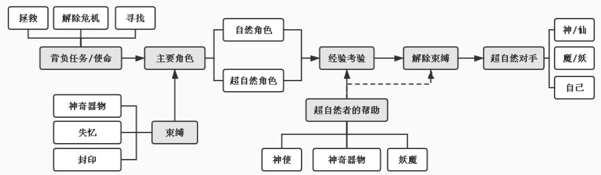
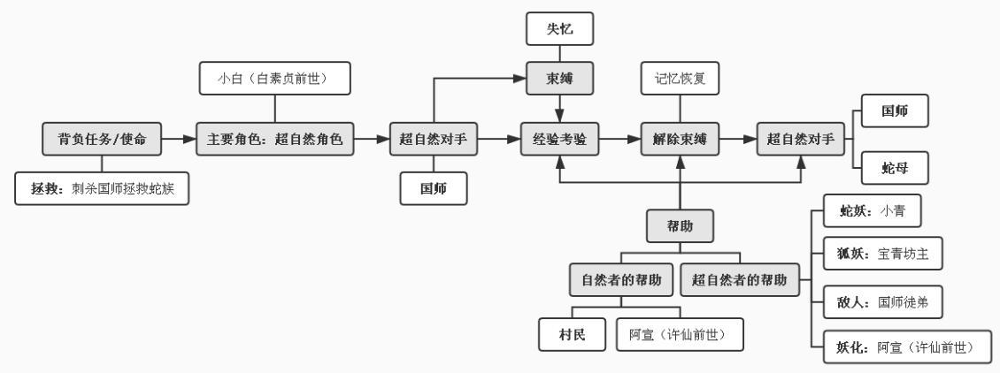
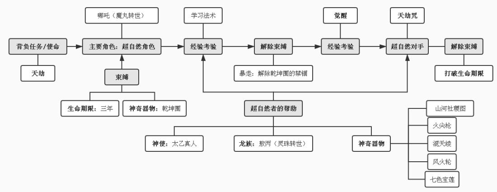

密级：学号：402034718104

# 南昌大学硕士研究生

# 学位论文

# 新世纪以来神话题材的国产动画电影研究Research on Domestic Animation Films with Myth Theme since theNew Century

# 曹媛

培养单位（院、系）：新闻传播学院指导教师姓名、职称：许爱珠 教授申请学位的学科门类：艺术学学科专业名称：广播电视艺术学论文答辩日期：2021年5月29日

答辩委员会主席： 周俊杰评阅人：校级盲审

# 摘要

本文从神话题材国产动画电影的创作出发，对现存国产动画电影的主要作品进行梳理，探讨二十世纪以来我国神话题材对国产动画电影的阶段性影响，分别以故事创新与影像叙事创新两大方面作为切入点，结合相关的文艺学理论对新世纪以来神话题材的国产动画电影进行剖析。以部分经典并具有一定代表性的作品为例，在经典人物角色的重新塑造、神话价值观的现代化、跨媒介影像破壁等多个方面进行具体探究，试概括出国产神话题材动画电影在创作上的母题排列规律，总结摸索在我国动画电影的摄制过程中，神话题材的合理运用以及改编方面的创新可取之处，同时发现在神话题材的创新继承方面所面临的困境与难题，为今后我国神话题材动画电影的创作提供借鉴。

关键词：神话题材；国产动画；时代融合；创新

# Abstract

This article starts from the creation of domestic animated films with mythological themes. According to the main works of existing domestic animated films,discussing the phased impact of Chinese mythological themes on domestic animated films since the 2Oth century, based on the two aspects of story innovation and image narrative innovation, this paper analyzes the domestic animation films with mythological themes since the new century by combining the relevant literature and art theories. Taking some classic and representative works for example, in the reconstruction of classic roles， the modernization of mythological values， the breaking of cross-media images and other aspects of specific research， tries to generalize the rules of the arrangement of motifs in the creation of domestic mythological animated films, summing up and exploring the advantages of rational use and innovative adaptation of mythological themes in the shooting process of Chinese animated films，and at the same time discovering the difficulties and problems facing the innovation inheritance of mythological themes. It provides reference for the future creation of Chinese mythology-themed animated films.

Key words: Myth theme; Domestic animation; Integration of times; innovation

# 目录

# 绪论.

1 选题背景及依据

2 研究对象及研究问题

2.1研究对象  
2.2 国内外研究综述  
2.3研究意义

3研究方法. 11第1章神话题材对国产动画电影的历时性影响， 13

1.120世纪30-40年代国产动画电影的崛起 13  
1.2 20 世纪50-60年代国产动画的成熟. 14  
1.320世纪80年代以来国产动画的再崛起 16  
第2章新世纪以来神话题材国产动画电影的故事创新 .20

# 2.1 神话故事中的母题再现 .20

2.1.1 母题类型. ..20  
2.1.2 传统文化延续 .26

2.2 人物的前世今生 .28

2.2.1人物性格特征的复合重叠设定 .28  
2.2.2人物角色的现代化转型 29  
2.2.3人物角色的类型分析， .31

2.3 传统情节的现代演绎 ..33

2.3.1价值观体系的现代融合 .33

2.3.2 传统情节的现代合理化， .35

3章 新世纪以来神话题材国产动画电影的影像叙事创新 .38

3.1跨媒介视阈下中国神话故事的影像化破壁 38

3.1.1 统一的故事内核. .38  
3.1.2多层媒介的拼图式立体重构 ..40

3.1.3 影像叙事中的次元文化转码 ..41

3.2 影像叙事创新中传统美学与现代艺术的审美融合 .42

3.2.1经典文学形象的时代新衣 .42

3.2.2 动画叙事下的现代山水画 .44  
第4章神话题材的国产动画电影发展前瞻 47

4.1国产动画电影的突破与发展 .47

4.1.1中国神话矩阵的系列化开发 .47  
4.1.2传统民族风格的深化挖掘 ..48

4.2创新继承面临的困境与问题 .50

结语 .54

致谢. .55

参考文献. .56

# 绪论

# 1选题背景及依据

根据中国电影市场上近几年出现的“爆款”国产动画电影，不难发现以中国神话故事为题材的文学、动漫、影视等领域迎来了多平台跨媒介的转码融合。其中“中国神话题材”不再单一的停留在表面的开发与挖掘，跟随行业的不断发展，国产动画电影作品在创作时对神话题材的开发，也开始从浅层次的形象符号向为更深层次的审美体系进行转变升级。

2019年11月22日，广电总局发布 2019年“中国经典民间故事动漫创作”的扶持通知。“按照中办、国办《关于实施中华优秀传统文化传承发展工程的意见》中‘实施中国经典民间故事动漫创作工程’的要求，广电总局积极贯彻落实有关工作部署，在2018年组织开展‘中国经典民间故事动漫创作工程（网络动画片）’的基础上，2019年继续进行‘中国经典民间故事动漫创作工程（网络动画片）’扶持项目征集工作。”①

中国神话故事作为经典民间故事的重要分支之一，大部分故事被中国观众所熟知且具有一定群众基础，故事中特有的奇幻性和假想性相比其他类别的经典民间故事而言，与动画系统的创作有着天然的共通性。据目前统计的票房情况来看，《西游记之大圣归来》中不忘初心自我救赎的孙悟空获得9.55亿的票房，《白蛇：缘起》里为爱斗敌不再懦弱的许仙获得4.48亿的票房，《哪吒之魔童降世》提出我命由我不由天的哪吒获得 50.36亿。传统中国神话故事的二次建构在这三部作品中均获成功，由此可以让中国神话故事的开发创作试成为“中国经典民间故事动漫创作工程”的切入点。将传统的神话题材进行现代文化转码，挖掘适应当下社会背景的故事内核，根据社会发展、思想观念的更迭所导致社会文化背景的变化进行现代化融合，进一步做到时代契合，还能达到更易被当代观众接受和喜爱的效果。不仅做到旧闻新讲，还能在继承我国民族文化的同时将神话题材进行二次创新弘扬新时代民族文化精神。

就目前上映的国产动画电影作品来看，不乏像《小门神》这类虽题材新颖，但对神话故事开发不够、挖掘不深的影视作品。中国经典神话故事生产年代久远、种类繁多、内容博杂，导致一些以传统民间神话故事为题材的影视作品难以被部分当代观众理解和接受。如何系统挖掘中国神话故事，推动中华优秀传统文化创造性转化成为了当下国产动画电影创作的首要问题，其中如何将经典神话故事进行现代化有机融合成为了问题的关键。

# 2研究对象及研究问题

# 2.1研究对象

本文以二十世纪为时间节点，将以中国神话故事作为题材进行改编引用并完成摄制的国产动画电影作为本文的研究对象，探究“神话题材”与“动画电影”二者在故事形式与艺术内涵上如何进行有机融合的完整转变体系。

# 1.神话题材的概念界定

袁珂先生提出广义的神话的概念，曾在发表的文章中提出：“神话、传说、历史、仙话、怪异、带有童话意味的民间传说、来源自佛经的神话人物和神话故事、关于节日、法术、宝物、风习和地方风物等的神话传说、少数民族的神话传说”①九个类别均属于我国神话故事范畴。

狭义的神话则是以茅盾先生为代表专指“各民族在上古时代（或原始时代）的生活和思想的产物”②，强调了神话故事中的原始性，区别于传说中多为皇帝、英雄类的主人公，狭义神话中的主人公多为原始人类对自然认知的反映，并表示神话不包含传说。

本文在研究中所涉及的“神话题材”是指国产动画电影作品中被借鉴引用的神话故事，对神话故事的概念界定则是基于袁珂先生的广义神话理论，特指已经具有一定留存时间和流传度的经典神话故事。

# 2.动画电影的概念界定

动画电影在目前是指以动画制作的电影，但在二十世纪 50 至60 年代我国的动画电影已经开始初步迈向成熟，题材样式也开始变得多样并形成了具有较强民族风格的中国学派，动画电影也不再局限绘画制作的单一表现形式，开始衍生出以艺术性和探索性作为主要目的折纸片、木偶片、剪纸片等种类的动画

作品。

这类美术作品的产生也为我国动画电影的发展做出了卓出的贡献，作为民族风格木偶片的代表，《神笔》（1955）向神话故事汲取营养，在艺术审美与故事形式上都具有我国鲜明的民族风格，并斩获5项国际电影节大奖。我国第一部剪纸片《猪八戒吃西瓜》（1958）则融合了我国民间皮影戏和传统剪纸手艺的艺术特点，将传统民族文化与动画作品相结合为我国美术电影增添了新的艺术样式。于1959年拍摄的《小蝌蚪找妈妈》以中国水墨画的独有技法作为作品角色和环境空间的表现手法，运用动画作品的拍摄技法将其绘制的画面进行连续放映，从而形成影像动画。众多动画类型的探索与创新使得中国动画享誉国际动画界，所以在本文的研究过程中国产动画电影包括且不局限绘画制作的动画作品。

# 2.2国内外研究综述

据《2019 年中国动漫行业报告》显示，“在90后、00 后这些互联网原住民成为漫文化“新势力”的背景下，动漫行业遇到了前所未有的‘红利期’，目前市场已达千亿规模，由此可见我国动漫产业市场需求十分庞大。”①作品数量虽然呈乐观较好态势，但是随之而来的缺乏故事技巧、绘制粗糙及作品同质化严重等诸多问题也开始制约国产动画电影的发展。但在国产影视动画的作品创作中，以动画电影摄制为首由于其较高的制作成本，仅靠单一的作品呈现往往不易收回制作成本，近年来爆火的国产动画电影的题材选取也间接证明借用泛娱乐领域的成熟故事文本，可以保证作品故事框架完整性的同时更快吸引其原本故有的故事受众，票房的保证和提升以及我国大量可选取的神话故事库，使得中国经典神话题材成为了目前国产动画电影创作的首选之一。

# 1．神话题材对动画电影创作方面的影响研究

日本动画导演、编剧作家宫崎骏在采访中曾表示其动画电影作品《龙猫》的创作灵感及其整个故事和氛围“源于童年时听大人讲的传说故事”和“儿时对大人话语的记忆”②。迪士尼公司创始人沃尔特迪斯尼也曾表示在其动画作品的创造就是把“令人心动的传说、动人的神话故事变成栩栩如生的表演”。这意味着神话故事从形式和内容两个方面，都为动画电影的创作提供了一个以现实世界为基准、独立于科技文明进程之外的思维幻世。

尼采在《悲剧的诞生》一书中写到，“每一种文化只要它失去了神话，则同时它也将失去自然而健康的创造力，只有一种环抱神话的眼界才能统一其文化。”①民族文化对其全民族的创作方向和价值判断起到绝对性的主导作用，因此文化接受群体也受其影响构造了相应完整的集体记忆与相应的信仰体系。经典神话故事作为造势时代人民的思想产物，一定在作品中融入了相应的思想价值，经过历代流传编改，其中保留着的正是民族文化的核心。中国作为千年古国在这方面有着得天独厚的优势，相应的文献记述悠久厚重。1980 年代，由国家多部委发起了规模最大的有关各地民间神话故事的田野调查，并对相关资料搜集进行了相应的整理工作，根据地域分类编纂的《中国民间故事集成》中收录的故事资料高达数十万条，这说明具有本民族风格的神话故事完全可以为国产动画电影的创作提供数不尽的创作题材。

在万鸣口述、万国魂执笔的《我与孙悟空》书中写到“美术片走民族化道路是关系到我国美术电影艺术是否能跻身于世界美术电影之林的大问题。”②而民族化道路是以民族文化为路基，以传统民族艺术表达为石板，一石一板稳扎稳打铺出来的。作为民族思想结晶的民间神话故事，是我国传统民族文化非常利于传播的载体之一，流传度高、受众面广，是国产动画电影与中国传统民族文化有机融合中一个很好的选择。学者王箫音表示“国产动画可作为中国传统神话最适合的文化表现途径，在中国传统文化里蕴藏着国产动画最适合的原创情境和故事情节。”③十月文化总裁刘伟对此曾表示“经典且知名的文学作品和观众熟悉的形象是作为市场敲门砖可取类型。” $^ { \textregistered } 2 0 1 5$ 年，十月文化用原创出品的三维动画电影《西游记之大圣归来》的成功证明了自己的观点，并取得了10 亿的票房优秀成绩使之成为现象级作品，并获得第30届中国电影金鸡奖的最佳美术片奖和第16 届中国电影华表奖的优秀故事片奖。神话故事中的民族文化对国产动画电影的影响是印刻在画面中的，借动画之口讲述我国神话故事，神话题材不仅对动画电影在创作方面产生影响，二者还可以相互作用实现与中国现代文化的心理对接。

网络游戏《梦幻西游》的主策划林云枫提出：“《西游记》最大的价值不在于现成的地图、武器、法宝......而是它提供了一个宏大复杂的世界观。”①在作品《哪吒之魔童降世》中可以看出导演也在试图打造完整的封神演义世界观，利用封神演义里的世界逻辑，结合新时代社会背景，对经典神话故事进行旧事新讲，不但契合现在年轻人的文化心理需要，还给予青少年儿童正确的道德品格指引。

# 2．神话故事题材的国产动画电影研究

# （1）神话故事题材中的母题应用研究

中外学者在研究中发现民间文学叙事中具有一些特定的结构元素，这些结构元素会在不同的故事中重复出现，通过不同的序列组合生成数量丰富的故事样态。丹·本·阿莫斯提出“母题不是分解个别故事的整体所得，而是通过对比各种故事，从中发现重复部分所得。只要民间故事中有重复部分，那么这个重复的部分就是一个母题。”②所以这些特定且具有重复性的结构元素就是民间文学中的故事母题。丁乃通在1978年出版的《中国民间故事类型索引》中沿用了汤普森的AT分类法，以中国文革前的 580 余种民间文学的资料作为依据，将7300 多个民间故事归纳为38个大类别，并将38个大类再次分成843个故事母题类型与次类型。这也意味着民间文学中的神话故事数量庞大的同时可以经历跨时代传播保留下来，每个时代都有相应的解读方式，学者张燕菊在《传统民间故事影视传播中的母题寻唤》一文中表示“母题在长期的文化变迁中沉积下来，成为一个民族的文化密码，在不同的时代演变为不同的形态呈现出来。”③不同的形态对应不同的解读方式，也有相应不同的应用方式。

近年来爆火的《大圣归来》、《白蛇》、《哪吒》等神话故事题材的国产动画电影，可以看到经典人物形象以及故事情节都有部分现代化调整，正如美国著名编剧约翰.贝尔顿所总结的“原始秩序——秩序打乱一—试图重建遭遇挫折——秩序恢复”④，为迎合时代特色进行部分现代化优化，更易于观众群体理解和接受。学者王婷在《母题研究视域下的日本动画电影》一文中表示：“母题是一个重要概念，这些母题性元素或者成为电影叙事的基本框架结构，或者成为构成叙事、推动情节向前发展的重要动力。”③神话故事中的母题在当代国产动画电影中的应用，使其成为了国产动画电影的基本框架结构，母题的出现不是简单的重复，而是通过符合当下价值观的表现形式，对神话题材中的母题在应用的过程中进行新的序列组合，进而表达作者对现当下社会现状以及对人类本质的思考，为作品的故事情节赋予当下的社会现实意义，让作品承载更多的当代意蕴。

# （2）神话故事题材与传统美学的关系研究

追溯到中国传统的诗歌与绘画艺术中不难发现，这些传统的艺术门类均有一套属于自己的审美体和表意原则，在创作和理论方面也都已经形成了一套完善的体系。“虚实”、“写意”、“意境”等传统美学概念和策略技法如何完美地与具动画艺术结合起来，以及在动画特有的视觉传达方式中表现中国人恒久的审美习惯，无疑成为了我国动画电影创作者的一大挑战。国产动画电影在二十世纪50 到60 年代的发展中，逐步形成了以我国传统美学风格为主被国际动画界著称的“中国学派”。中国动画电影在本土的传统文化艺术中不断提取美学素材进行有机融合，令世界为之耳目一新，这也使得当时国产动画的电影风格有别于其他国家动画电影的关键所在。

我国传统绘画艺术中强调虚实意象之间的变换，在表现山水风景、人物身姿、花鸟动态的审美客体时并不追求单纯的景物临摹。学者华夏在文章《"妙在似与不似之间"一谈中国画如何克服"如实描写"的倾向》中表示“在中国古老的绘画艺术中，是强调挖掘出客体的本质特征，换言之是对客体的一种经过主观意向改造后的重建。”①对此观点，学者许春荣曾在文章中提出“国产动画中的传统美学首先体现在'似与不似的艺术思维。”②这表明国产动画电影在运用传统美学体系时抓住了核心艺术思维并通过现代的动画电影制作技术将其呈现出来。这种传统艺术的审美也体现在国产动画电影对神话故事的改编与二次建构中。在“从中国传统艺术中的书法、绘画、戏曲、工艺美术等传统艺术中吸取营养成分，才能世界动画舞台上独树一帜。”这说明国产动画电影在运用神话题材的同时，也可以向我国传统美学的审美体系靠拢，发挥我国神话故事独有的艺术优势从中吸收借鉴进而形成我国特有的神话动画电影风格。

（3）神话故事题材对角色的现代探索

在中国神话故事的现代探索中，除了相应树立完整的故事文本世界，好故事需要好演员，角色塑造的转码开发也很重要。在国产动画电影中神话故事形象塑造分析方面，魏源良在文章《浅析<哪吒之魔童降世>的角色性格设计》中按照《哪吒：魔童降世》作品里每个角色出现的时长以及影片故事主线角色人物关系，将片中角色划分成三类：“整个故事矛盾纠缠的主线的主要角色，跟主角相关的配角以及衬托主要角色表演数量较多的平民角色。”①并根据每类角色的性格设定进行相应的分析研究，认为将“复合重叠的性格设定”的方法运用可以到第二种角色身上。例如哪吒父母的性格塑造在展现他们本身主体性格的时候，也会更侧重表达父母对子女的爱，使得这两个角色拥有“总兵”和“女将军”身份的同时，还是伟大的父亲和母亲。但是笔者认为采用复合重叠性格设定方法的并不专指第二类角色塑造，结合目前票房不错的中国神话题材国产动画电影作品来看，除功能性角色外，大部分角色类型的性格设定都存在这方面的倾向。

学者巫滨在《反叛与救赎：<哪吒：魔童降世>角色构建策略分析》中结合镜像理论表示“动画电影编剧对传统神话故事的创新性改编是行业难题，二元角色配置为主角的自我镜像演化构建了框架，角色设计价值取向的创新定位。”②学者陈茂涛也在《影视动画中角色二元对立的叙事模式研究》文章中表示“二元对立虽然是是动画电影使用频率最高、发展最为成熟的叙事方式，但是通过二元对立的方法可以使人物之间的矛盾冲突更加明晰，影片的结构更加立体、叙事更加丰满。”哪吒作为经典神话角色，在影片《哪吒：魔童降世》中通过重塑脸谱化形象的现代化尝试，不仅使角色塑造更贴合时代特色，也可以促进神话故事的有机现代融合，成功地为我国动画电影在创新性改编方面提供了非常值得借鉴的研究样本。对于这种性格的重新设定，学者王箫音将其称为“忘形而得神”，这些改编的神话故事角色与观众认知中的常规经典形象大为不同甚至背道而驰，构成了角色形象与内在的矛盾冲突张力，使观众对经典神话故事有了跳脱出脸谱化俗套的新颖感受，是一种值得借鉴与尝试的方法。

角色的言行也是角色性格表现的途径之一。学者陈晓宇则从巴赫金提出的民间狂欢文化的角度出发，表示“各种类型的粗言俚语由于具有朴实的生活特色，拉近了中国神话故事与观众之间的距离”①。更偏向现代化的口语设置会降低神话故事因诞生年代背景的不同所产生的时代差异，更易使观众带入情节，对神话故事在国产动画电影中的现代化转码是有帮助的。但是也应注意引用的尺度以及方式方法，以免变成单纯的低俗趣味。

对于作品核心价值观的创新改编也是神话故事题材在现代探索上的一个重要方向。以国产动画作品《哪吒》为例，学者杭哲慧在论文中表示“除开欲扬先抑，打破偏见的角色形象创新，作品核心价值观的创新改编编也是它取得成功的一大炸点。”③作品中在处理哪吒父子的关系时，由于社会环境对于忠孝观念发生的变化，区别于封建时代倡导的慈母严父、以及长辈对晚辈享有的绝对操控权，对神话故事中原有的部分桥段结合现代社会主义价值观进行适当的删减与修改，使得神话故事更贴合当下的社会环境，也更易被观众所理解接受。

# 2．神话故事题材的国产动画电影创新尝试研究

外国学者 Sue Short 在 Introduction: Fairy Tale Films, Old Tales with a NewSpin 中表明“动画电影在随着时代变化持续的用不同的形式讲述相同的故事，是应当特别重视当代叙述表达的。”由于影视动画本身具有具象化的性质，在动画电影与神话故事有机融合的创作过程中，便要注意原故事从口头、书本再到影视动画的多层跨媒介延伸。“跨媒介叙事”这一概念是由21世纪美国传播学者詹金斯在《新媒体与旧媒体的冲突地带》中提出的，他表示“跨媒介叙事最理想的形式，就是每一种媒体出色地各司其职，各尽其责一一只有这样，一个故事才能够以电影作为开头，进而通过电视、小说以及连环漫画展开进一步的详述。”①这表明跨媒介叙事的本质是围绕既定的大背景，不局限任何媒介，只要相互之间完成对应语言系统的转码建构就可以完成跨媒介的转化，在这期间还可以利用每种媒介本身的特点与优势对原本故事挖进行掘并展开详述。

虽然中国神话故事是否符合传统意义上的IP概念还有待商榷，但根据这类题材动画电影作品本身的特性以及目前市场来看，神话故事题材国产动画电影可以尝试借鉴IP 的跨媒介叙事策略，打造神话故事题材自己的系列作品。《互联网时代国产动画电影的“ $\operatorname { I P } + { } ^ { \prime \prime }$ 之路》一文中提出“在这样一种互联网 $^ +$ 娱乐的背景下，电影产业已经进入了新生的共通融合的IP时代。电影发行已经不能不考虑互联网的作用，运用IP的力量可以直接打通产业的上下游。”①神话题材的国产动画电影应当尝试开发系列化作品。优质的故事文本应该作为一个起点，需要一个又一个具备相同世界观的故事文本共同持续开发，从而达到形成完整神话故事宇宙的概念。神话故事题材的系列化开发也有助于对观众形成品牌印象，通过经历多领域的共生转码去挖掘故事文本真正的价值与能量。中国神话故事在这方面也有着天然的文本优势，像《西游记》、《封神演义》等经典神话故事本身都具备完整的故事宇宙观，相较于其他民间传说而言更利于系列化开发。

学者冯月季、李菁在文章中表示，“传统文化IP 是打造国家文化符号的基础”，目前国产动画电影在传统文化IP的开发过程中，不仅面临自身的困境，也“面临着‘走出去’的困境”，“应该以文化自觉建构中国传统文化IP 的价值内涵。”这也是目前国产动画电影面对中国神话故事创新性表达所面临的问题。就像学者所言，在中国神话故事的挖掘过程中，应当以民族文化的自觉意识作为理论基础，在传承内在的传统文化的同时，取其精华更新传统文化价值观，使之与现代价值更为贴合。

学者康澄在文章中表示“文化的‘记忆程序’不像动物性记忆根植于基因遗传，而是依靠一套复杂的、等级化的符号系统来实现。”③这说明文化记忆是抽象化与符号化的早期历史记忆，而这种“历史记忆”的载体正是我们追溯文化记忆的关键，文化像是一个庞大而且完整的符号系统。如果中国神话故事题材的国产动画电影能够成功系统化开发，那意味着国产动画电影将打造出中国独有的神话故事宇宙，具象化衍生成拥有价值内涵且具有一定影响力的国家文化符号。

神话题材的国产动画电影的摄制，使得其本身的神话故事与动画所对应的大众文化和二次元亚文化圈开始发生碰撞和交融。学者顾杨丽表示，在故事文本开发转码的过程中应当重视国产动画电影受众中的二次元文化。①如她所说，经典故事文本大部分都具一定的粉丝基础和庞大的粉丝受众，在故事文本开发的各不同阶段中仍在扩张累积粉丝，“孙悟空”这一经典角色正是由于每个年代的再次开发创作，使得该角色的粉丝量不断上涨并覆盖各个年龄段，形成了自己的年龄矩阵。考虑到神话故事背后所代表的受众体验和粉丝情感，只有考虑情感方面的共鸣，才能让作品具有更强的“圈粉”能力。

在动画制作技术方面，制作技术的不断创新与尝试也是推动神话题材的国产动画电影不断发展强大的重要一环。神话故事在历代更迭中，先后经历了口头、书面、影像再到影视等方面的转码建构。而新世纪以来所需相应的动画技术的创新突破必不可少。其中《大圣归来》和《哪吒：魔童降世》两部国产动画电影对我国动画制作技术带来不小的影响。学者陈晨、李丹表示“《大圣归来》解决了国产三维动画从无到有的问题，而《哪吒》则在这一基础上进一步升级，推动行业逐渐形成工业体系。”①国产动画电影经过近年来制作技术的升级以及拓展应用，我国的动画技术也在不断地发展升级，二维动动画相较三维动画丰富的表现形式而言，图像无法向Z 轴空间扩展，在写实画面的呈现上还会受到镜头、拍摄空间、调度等因素的限制，画面流畅度因为人工绘制分帧的水平工地而受到约束，相对投入的时间成本、人工成本较大，导致三维动画目前已经成为行业主流。

# 2.3研究意义

20 世纪90年代后，中国动画产业开始反思并做出新的调整，2019年11月，国家广播电视总局也发布关于开展 2019年"中国经典民间故事动漫创作工程（网络动画片）”扶持项目征集活动的通知。在阅读大量相关论著等文献资料、观看大量国内外优秀动画电影作品之后发现，现有的文献资料中“国产动画电影”、“中国神话故事”、“创新性表达”三个部分各自的研究成果较多，但针对国产动画电影对中国神话故事的创新性表达的完整研究体系相对较少，现存文献资料的研究角度大都为国产动画电影与中国传统文化有机融合、国产动画电影中神话故事形象塑造分析以及国产动画电影结合当下社会价值体系方面三个方面，缺少中国神话故事题材创新性表达的针对性研究。在文献资料中举例的作品大多以国产动画电影作品《西游记：大圣回来》、《大鱼海棠》和《哪吒：魔童降世》为例，文献资料缺乏多样性。

中国传统文化资源丰富，是中国动画片的宝藏。中国动画需要从本民族文化传统汲取素材与灵感，同时将民族文化传统与高新科技、时代精神和国际化元素有机融合，才能走出动画发展的新路径。但是目前上市的国产动画电影作品中，神话题材选取的重复率居高不下，这说明在二者在当下进行有机结合的尝试时，所运用的神话故事题材并不能与我国的经典民间故事所蕴含的资源优势相匹配，关于神话故事在动画电影上跨媒介叙事的系统性转码途径也相对薄弱。

本文旨在从文本和叙事两个层面，从继承与创新的角度出发，探讨新世纪以来国产动画电影对中国神话故事的创新性表达，结合当下国产动画电影的成功案例，梳理分析中国神话故事在动画转码过程中有效的现代诠释途径，并指出二者有机融合的现存不足与面临的突破和挑战，尝试对这方面的研究进行补充，为引导国产动画电影创作者投身中国经典民间故事主题网络动画片创作，推动中华优秀传统文化创造性转化、创新性发展做贡献。

民族文化包括物质文化的同时也包括精神文化，作为被历代创作并流传下来的神话故事便具有相应传统及多元一体的民族文化根基。坚持民族特色的创新才是真正能够推动我国动画发展的基本因素。而当下主打“合家欢”概念的国产动画电影受众群体面积较广，其中不乏青少年儿童，如果能够合理围绕社会主义核心价值观对中国神话故事进行现代化融合创作，讲好中国故事，传播主流价值观，便能借此媒介对当代观众的道德品格给予正确引导。弘扬中华优秀传统文化的同时，国产动画电影作品的成功“破圈”也会进一步树立国人的文化自信，增强民族自信心。

# 3研究方法

本文面对不同形式的文献资料运用不同的方法进行针对性统计分析。主要使用以下三种研究方法：

1、文献分析：通过对相关资料库的系统检索，认真查阅与本项研究相关的文献资料，对其进行分类梳理，进而对文献的统计研究形成对相关事实的科学认识。了解目前相关的研究现状，借鉴学习有价值的研究成果，在此基础上提出并进一步深度挖掘本文所研究的主要问题，形成自己独立的基本观点和研究思路，进而展开专题研究，完成论文撰写。

2、案例研究法：指通过详细调查一个或数个个案材料的收集、记录，来了解个例本身所属的整类个体的情况。在同种类事物中选取具有代表性的案例进行重点针对研究，以便借此说明整体情况。本文选择以动画电影《西游记之大圣归来》、《白蛇：缘起》、《哪吒之魔童降世》三部作品作为代表案例进行重点研究分析。

3、比较分析：赏析大量国内优秀动画电影，从具有代表性的影视作品文本中进行对比分析，按照中国现有的国产动画电影作品根据其票房以及多方平台评分、播放量为基准，按是否结合中国经典神话故事进行分类，从中选取同题材的作品案例根据票房、评分等方面的优劣进行同文本区别对比，从而使研究更为全面，试图分析国产动画电影与经典神话故事两者现代融合的有利途径以及应当有效规避哪些问题途径，方便本文研究更为深入。

# 第1章神话题材对国产动画电影的历时性影响

# 1.120世纪30-40年代国产动画电影的崛起

由于二十世纪三十年代抗日战争全面爆发，我国还处在一个动荡的时期，抗战题材的标语、海报在我国随处可见，相较文字而言，视觉上更为直观的画报、动画成为了强有力的宣传工具之一，这个时期的国产动画更多是作用于教育宣传。

据万籁鸣回忆“我们拍摄了反映受压榨的劳苦人民的生活和激发中国人民抵御日本侵略的 20余部短片。”①根据现考证留存的作品来看，在拍摄以反战、抗日为整体主题的20 余部动画短片中，题材选取大致分为以《同胞速醒》（1931）、《血钱》（1934）等短片为代表的现实生活题材和根据古希腊《伊索寓言》进行再创造的故事改编两大类，其中根据其改编的《鼠与蛙》（1934）、《龟兔赛跑》（1934）等反应劳苦大众生活现状的黑白动画短片，凭借寓言本身的深刻以及诙谐幽默、生动活泼的表现形式，在当时受到了观众的热烈好评。这些短片的创作也为后来国产动画技术和理论方面积累了一定的经验。

我国动画制作在经过前期不断的探寻与摸索中，中国第一部有声动画《骆驼献舞》于1935 年由万氏兄弟②导演摄制完成。该动画改编自《伊索寓言》中《猴子与骆驼》的故事，并在明星影业公司的帮助下攻克了声画融合等技术难题，完成了我国动画发展史从无声到有声的重大转折。在结束此片的摄制后，万氏兄弟曾于1936 年发表的《谈谈卡通片》的一文中表示，“动画片应该是‘寓教于乐’的，并强调必须发展具有民族风格的中国动画。”③通过观看学习当时美国、德国等国的动画作品，万氏兄弟越发发现动画片作为一种文化载体，承载本民族文化、体现本民族风格的重要性，题材选取也不再局限于《伊索寓言》中的故事，受迪士尼动画《白雪公主》的启发，将创作目光投向我国蕴含丰富民族文化特色的神话题材上，并于1941年导演拍摄了世界第四部长篇动画电影《铁扇公主》。

《铁扇公主》作为我国第一部动画长片的同时，也是我国第一部对神话故事进行改编的神话题材动画。时局动荡的社会背景使得该片极具反抗精神，三位徒弟三借芭蕉扇最终团结共同打败牛魔王的情节改编，将神话故事作为载体做到“一语双关”，借神话之口暗讽敌军丑恶嘴脸的同时积极地号召民众团结抗日。除去当时制作技术的突破，作品的价值观表达结合了当时的社会背景，其中具有中国民族风格的角色设定以及经典神话故事赋予的完整叙事框架，使得这部具有浓郁中国民族特色的动画的出现，让我国在全球的动画电影界有了一席之地，其丰富的艺术内涵在亚洲也是首屈一指，成为了我国动画电影崛起的高光时刻。具有时代意义的同时，也是国产动画电影在中国神话题材选取方面逐步摆脱临摹学习他国作品的开始，国产动画电影的民族化道路开始逐渐清晰，而此时神话题材对我国动画电影的影响也开始初露锋芒。

# 1.2 20世纪50-60年代国产动画的成熟

相较二十世纪30 至 40 年代而言，神话题材对国产动画电影的影响不再单纯停留在故事文本的形式提供，而是开始将神话题材作为试点，借神话题材中强烈的民族文化风格尝试探索新生的国产动画电影种类，融合其他传统艺术形式创造出属于中国的民族风格动画。

在前期摸索并掌握动画影片的制作技术与制作流程后，创作动画电影的主力军东北电影制片厂的美术组迁至上海，并于1957年正式成立上海美术电影制片厂，在党中央所提出的“百花齐放、百家争鸣”的文艺方针下，中国动画开始全面发展，在原有动画长片制作的经验基础上，尝试动画作品的新探索，衍生出融合了我国民族文化元素的动画片新品种，进入了历史上第一个创作高潮时期，“中国学派”的称谓也在这个时候应运而生。以上海美影厂为代表“在成立后的八年内，摄制影片105 部，其中动画片40 部、木偶片37部，剪纸片16 部、折纸片3部、木偶纪录片9部。”①使得我国动画作品的艺术水平有了新的高度。

在多种衍生的动画种类中不难发现，当动画创作者尝试创新或重要创作节点时，神话题材通常会作为一个很好的着手点，利用本身的文本优势为动画作品的创作提供经典的故事文本、完整的叙事框架、稳定的故事受众以及丰富的民族文化内涵。例如民族风格木偶动画片的代表作《神笔》（1955），第一部剪纸动画片《猪八戒吃西瓜》（1957），剪纸动画片的国庆十周年献礼片《渔童》（1959），我国第一部彩色动画长片《大闹天宫》（1964）等均从我国神话故事中选材进行改编，其展现的作品成就也是有目共睹。

木偶动画片《神笔》改编自神话故事《神笔马良》，通过劳动人民巧用神笔智斗恶官府，表现了人民需要惩恶扬善的社会意愿。以故事中的经典人物形象作参考装扮木偶并对其进行拍摄，将我国传统的木偶片与具有民族文化特色的绘画风格相结合，实现了立体实物与平面绘画的有机融合，进而形成了独具一格的神话木偶片，该部作品凭借我国特有的神话民族风格先后五次在国际电影节的评选中获奖。

受捷克剪纸动画作品《好兵帅克》的启发，上海美影厂决定尝试制作属于中国的“剪纸片”。区别于传统的皮影戏，剪纸片在制作工艺上较为简单，绘制风格也相对广泛，《猪八戒吃西瓜》便是我国在剪纸动画上的初步尝试。作为我国第一部剪纸动画，该影片选取了神话《西游记》中的故事片段进行改编，在对孙悟空、猪八戒的角色绘制方面结合了传统皮影戏的艺术风格与现代绘画艺术风格，根据原著的描述保留角色特性的同时夸大角色本身的幽默元素，利用剪纸本身的操作流畅性加强了画面的动作性。原著本身的故事情节为该作品的尝试提供了一个实践的平台，充分发挥剪纸的优势将改编后的故事演绎得更加诙谐生动，使得影片整体更具观赏性。这部剪纸动画在实践方面的初次尝试，让观众看到剪纸动画自身具有的优势与魅力，为中国的动画电影增添了一种新的艺术形式，在后期实践创作的动画剪纸片中，也根据本片摄制过程中积累的经验衍生了绢制画像风格、水墨拉毛风格等不同种类的艺术风格。

此时神话题材对于我国动画电影的影响已经开始从“试点”向“跳板”转变，神话题材更像一个稳定的创作跳板，使动画电影可以借其跳得更高。1964年，经过近半个世纪的筹划准备“历时4年，原画绘制15万4千多张，全长3140米，片长117分钟”①的中国第一部彩色动画电影《大闹天宫》摄制完成。选用我国经典神话故事《西游记》的前七回，根据原著情节将影片大致设置分为“龙宫借宝”、“天庭为官”、“不满被贬”、“大闹天宫”、“回山称王”五个部分，形成了一个完整的故事结构。在对神话故事的影视化叙事中结合我国传统民族艺术元素，对神话原著中的故事情节、角色造型以及舞美背景造型进行美学设计，对神话故事起到了烘云托月的作用。将原著神话中光怪陆离的宇宙观，极具中国民族色彩的神话世界充分展示了出来，在发挥神话题材本身独有的优势外，拔高了作品的整体艺术价值。这部作品的诞生标志着我国动画电影制作的成熟，其创造的艺术内涵与文化价值是中国动画电影至今难以逾越的巅峰之作。

# 1.320世纪80年代以来国产动画的再崛起

1978 年，在党顺利召开十一届三中全会之后，中国的动画产业迎来了动画创作的第二春。据不完全统计，二十世纪八十年代初的前十年全国生产的动画作品已超过 200 部。相较二十世纪五十年代的动画创作而言，这个时期的中国动画电影无论在制作技术还是在视听语言等方面都突破了固有的表现形式，开始挖掘儿童文学、爱情、科幻等新的动画题材。同时这个时期的动画作品更加注重对青幼年的引导教育，儿童与青少年成为了动画片的主要受众，与现实世界截然不同的神话故事成为了这一时期的主要动画题材。

于 1983 年摄制完成的《天书奇谭》根据神魔小说《平妖传》中的部分章节改编而成，该部作品在民族风格上突破了以往单一的美术设计，在神话题材呈现的方面，上个时期的动画作品多为神话故事与单个民族文化艺术结合的探索实践，如剪纸片、木偶片等，在这部作品中则是选择了以动画为基调，在人物造型设计与场景造型设计上选取我国多个民族传统艺术的元素进行有机融合，借鉴国画绘画风格打造以线为主色为辅的的山水场景设计，结合民间泥塑、剪纸、戏曲等元素对“蛋生”、“狐女”、“狐母”等人物进行鲜明的造型设计。在故事情节改编方面也与以往不同，相对神话故事的直接动画影视化，《天书奇谭》保留部分原作内容的同时，将原著中作为配角的小男孩改写为作品的主要人物，消解了越王形象中荒淫昏庸的角色特点，相应地为打造更适合儿童观看的人物形象，将其改写塑造成性格顽劣的“小皇帝”。其次弱化原剧本情节不分明的缺点，巧妙地对故事进行原创改编加入了影射现实的蝗灾情节梳理逻辑框架贴合当下社会背景，使得作品的最终呈现极具民族特色的同时诙谐有趣，观赏度极佳。

根据神话故事《西游记》中“三打白骨精”的故事桥段纪进行改编，最终长达 90 分钟的《金猴降妖》于1985 年拍摄完成。在延续了《大闹天宫》中人物形造型设计的同时，《金猴降妖》的摄制在角色塑造方面突破了固有的平面表达，对故事主要人物的角色特征进行适当的夸大，强化人物特点，其次更加注重对中心人物的个性塑造，开始尝试对中心人物的“人性”进行着重刻画，描绘其心理变化。例如相较《大闹天宫》中的孙悟空，本部影片中的大圣不仅有三打白骨精时的嫉恶如仇，还会展现被师傅误会赶走时，叩拜师恩的情深义重，使得这一经典形象不再停留于平面的“斗战胜佛”，通过深化角色的心理使得孙悟空的角色情感变得丰富，性格开始多元化，角色变得立体。

以这两部作品为代表，20 世纪80 到90 年代末的动画作品由于主要受众的原因，广泛地从神话故事中选取题材。更加注重运用神话故事本身的民族色彩侧面体现动画作品的美术观赏性，强调动画美术片的概念，将具有民族风格的绘画艺术动画化成为了具有民族风格的动画艺术，这时动画作品的电影思维则退居其次。自《天书奇谭》对原著成功的大胆改编后，神话题材对我国动画电影的影响开始跳出“跳板”的定位，从早期提供神话故事本体转变为提供神话故事的创作思维，在创作中对民族风格的追求也开始从早期的外在形式向作品内在思维形式发生转变，开始尝试创作以《葫芦兄弟》（1987）为代表的“现代神话”题材。但也是在这个时期，大量的国外动画作品开始进入中国市场，不同文化观念的碰撞以及外资企业的加入，使得国外众多动画品的倾销对我国动画的市场化起到了催化作用。

由于市场经济的快速发展，动画作品的创作开始出现观念上的偏差，面对市场利润创作观念逐渐远离了艺术创作的初衷，开始走向商业化的道路。1993 年以后中国动画市场开放，国家虽取消了政府收购但也不再限制产量。数字技术的逐渐成熟使得动画制作的成本大大降低，动画作品的电影制作技术也开始突飞猛进，实现了动画系列片向动画电影的发展，开始抢占中国电影市场，神话题材不再是当下认为能体现民族风格的唯一选择，各类题材的动画电影争相问世，然而国产动画作品的创作数量虽然倍数增长，但作品的质量开始直线下滑。

在进入21世纪后，随着2005年“重述神话”项目的发起，使得“重述神话”这一概念再次进入大众视野，“将各种神话体系和神话人物有机组合在一起是个艰巨却又有趣的事情，上古的神话体系虽然凌乱，却也给作者留下了无数挥洒的空间。”①这个时期国产动画电影对神话题材的运用开始缩减原著中的故事比例，延续 80 至90 年代对神话故事的改编思路，在神话故事提供的框架下结合现代性的主题进行叙事改编，并尝试跳脱传统意义上经典角色的形象塑造，甚至跳脱神话中指定的故事背景，更注重创作者们根据自己的思考，结合自身的创作风格对神话加以现代化重构。这也是近年来国产神话动画电影中大受好评的《西游记之大圣归来》（2015）、《白蛇：缘起》（2019）、《哪吒之魔童降世》（2019）等优秀作品存在的共同特点。

<table><tr><td rowspan=1 colspan=1>年份</td><td rowspan=1 colspan=1>动画作品总数</td><td rowspan=1 colspan=1>神话题材作品总数</td><td rowspan=1 colspan=1>占比</td></tr><tr><td rowspan=1 colspan=1>20 世纪30-40年代</td><td rowspan=1 colspan=1>26</td><td rowspan=1 colspan=1>1</td><td rowspan=1 colspan=1>3.8%</td></tr><tr><td rowspan=1 colspan=1>20 世纪50-60年代</td><td rowspan=1 colspan=1>117</td><td rowspan=1 colspan=1>6</td><td rowspan=1 colspan=1>5%</td></tr><tr><td rowspan=1 colspan=1>20世纪80-90年代</td><td rowspan=1 colspan=1>490</td><td rowspan=1 colspan=1>32</td><td rowspan=1 colspan=1>6.5%</td></tr><tr><td rowspan=1 colspan=1>21世纪00-10年代</td><td rowspan=1 colspan=1>2261</td><td rowspan=1 colspan=1>130</td><td rowspan=1 colspan=1>5.7%</td></tr></table>

表1 20 世纪30年代-21世纪10年代的动画作品对比表①

纵观20 世纪以来神话题材对国产动画电影的历时性影响，30 至40 年代时神话题材多以提供经典故事文本，使国产动画作品不再以选取国外文学题材为主，开辟了我国民族风格动画的发展之路，据不完全统计在此期间共创作 26 部动画作品，其中神话题材的国产动画占比为 $2 . 7 \%$ 。在 50至60 年代期间，在神话题材的选取应用上，在对故事文本创新改编的基础上结合多种民族传统文化元素，对探寻民族动画新的艺术形式进行试点实践并取得了一定的成功，后期则将神话题材做为创作跳板，借助其完整的叙事框架以及独有的民族元素包容性，使得我国民族风格动画在国际动画界跳出新高度，在这期间所创作的 117部国产动画作品中 $5 \%$ 为神话题材，相较上个时期增长了 $8 5 . 1 9 \%$ 。

以二十世纪九十年代为节点，在二十世纪八九十年代期间，由于社会背景变化国产动画电影的摄制数量直线上升，其中神话题材对动画作品的影响开始从试点跳板向元素素材的方向转变，这时的国产动画电影受神话题材的故事思维的影响，开始减少原作中的故事比例，突破固有的表达形式，尝试进行创作“现代神话”，这时期一共创作 490 部动画作品，其中神话题材的作品有32 部，占比达到 $6 . 5 \%$ 。在进入千禧年后由于社会背景发生变化，国产动画电影的创作更为自由，数字技术与动画技术发展迅速且日渐成熟，制作产业体系逐渐完善，加之国外市场带来的创作压力，国产动画电影的创作种类开始呈树冠状多元融合，作品的数量呈井喷态势上涨。作品创作的中心开始从民族风格的艺术体现向作者的个人思考转移，尝试选择更贴合自己思维表达的艺术方式进行辅助呈现，固使得国产动画电影与神话题材创作陷入僵局。21世纪初至10年代共累计生产的 2261部动画电影中，神话题材作品仅占 $5 . 7 \%$ ，相较上个阶段下降了$1 2 . 3 1 \%$ 。

从1935 年我国一部动画长片《铁扇公主》第一次取材神话故事开始，我国的神话题材动画作品在前三个阶段的作品占比分别为 $2 . 7 \%$ 、 $5 \%$ 、 $6 . 5 \%$ 依次呈上升趋势，证明神话题材对我国的动画电影创作有着深远且不可磨灭的影响，虽然在进入千禧年后有所下降，占比为 $5 . 7 \%$ ，但是仍不可否认我国动画的创作正是受经典神话题材故事思维的影响而不断发展，近年来陆续出现含有神话元素的“现代神话”题材的动画作品，而“重述神话”概念的提出也表明如何将神话题材与现代动画电影创作进行有机融合，是当下国产神话题材动画电影需要面临的主要问题。

# 第2章新世纪以来神话题材国产动画电影的故事创新

# 2.1神话故事中的母题再现

# 2.1.1母题类型

汤普森曾在《世界民间故事分类学》一书中将绝大多数的母题分为三类：“其一是一个故事中的角色一一众神，或非凡的动物，或巫婆、妖魔、神仙之类的精灵；要么甚至是传统的人物角色，如像受人怜爱的最年幼的孩子，或残忍的后母。第二类母题涉及情节的某种背景—一魔术器物，不寻常的习俗，奇特的信仰，如此等等。第三类母题是那些单一的事件—一它们囊括了绝大多数母题。”①我国神话题材中的神话故事符合汤普森提出的复合故事概念，通常为含括了多个母题类型的复杂文本，包括了人物角色、情节或背景以及单一的事件三种类型。俄罗斯学者李福清也在书中提出，母题是在故事的叙述中“具有动机功能而反复出现的特殊行为、实物、情况等等”②。所以母题不单是故事中最小的单位，同时在故事中也具有具体动机指向、推动故事发展等功能。

# 一、母题类型分类

以 21 世纪以来改编自经典神话故事并具有代表性的五部国产动画电影为例，以汤普森提出的母题类别定义为基础，将作品中高频度出现、有规律可循的功能性母题分为七个类别，并在下文的相关叙述中分别根据相应的英文概念用代码替代：

（一）背负任务/使命，定义：贯穿全片的任务或使命（take mission）代码：M

通常作用于主要人物角色，使其背负任务/使命并贯穿全片，促进故事情节发展，包括：拯救任务/使命（《白蛇：缘起》、《姜子牙》）、解除危机（《小门神》、《西游记之大圣归来》）、背负罪责（《哪吒之魔童降世》）等。

这个功能性母题大部分会跟随故事的主要人物角色一同出现，或者伴随主要人物角色的故事线发展、情节展开出现。例如在《白蛇：缘起》中小白背负了刺杀国师拯救蛇族的任务；《姜子牙》中姜子牙因为坚守自己心中信念，背负拯救天下苍生的使命才放走的狐妖；《小门神》中作为门神的神荼和郁垒为了解除神界的经济危机决定去人间走一遭；《哪吒之魔童降世》中哪吒作为魔丸转世出生便背负罪责面临三年后天劫咒的惩罚；《西游记之大圣归来》中大圣在江流儿的帮助下解除封印触发护送江流儿回城、解除山妖危机的任务。

（二）主要人物，定义：故事文本中的主要人物角色（maincharacter）代码：C

主要人物在文本中是其他功能母题围绕的中心，不特指人类，也可以是动物、植物等生物，但是“必须具有人的意志，能够为了欲望产生行动”①，可以分为自然者（不具备神力或魔力的凡间生物）和超自然者两类。在神话故事中多以超自然人物为主。

1．孙悟空：由开天辟地以来的仙石孕育而生。（《西游记之大圣归来》）

2．郁垒：汉族民间信奉的门神。（《小门神》）

3．小白：一条修炼成人形的白蛇。（《白蛇：缘起》）

4．哪吒：混元珠转世。（《哪吒之魔童降世》）

5．姜子牙：静虚宫弟子。（《姜子牙》）

# （三）束缚，定义：对故事中主要人物的束缚（bound）代码：B

束缚母题是作用于主要人物，多为伴随主要人物与背负任务/使命母题同时出现，或根据在后期情节的发展中展现，对其能力或肉体进行压制达到束缚作用。在神话故事中束缚母题呈现的样式大致分为三类：

1.神奇器物：在神话故事中作为束缚母题中出现次数较多的样式，《西游记之大圣归来》中通过符咒对孙悟空的肉体行动进行束缚，通过法印对孙悟空的法力进行压制；《哪吒之魔童降世》中哪吒脖子上的乾坤圈等。

2.力量压制：区别于神奇器物的物理形态束缚，指由神话故事中神、佛等上层阶级的绝对力量对主要人物角色的法力进行封印或废除，《姜子牙》中天尊对姜子牙神力的废除。

3.失忆：《白蛇：缘起》中小白在刺杀国师的任务中失忆。

（四）经验考验，定义：对主要人物进行经验考验（experience in test）代码：Et

经验考验在神话故事中对于主要人物的身心成长是不可或缺的一环。在故事中具体体现为：

1.下凡修行：《姜子牙》

2.降妖除魔：《西游记之大圣归来》、《白蛇：缘起》、《哪吒之魔童降世》

3.学习法术：《白蛇：缘起》、《哪吒之魔童降世》

4.寻找力量：《西游记之大圣归来》、《小门神》、《白蛇：缘起》

5.解救苍生：《西游记之大圣归来》、《小门神》、《哪吒之魔童降世》、《姜子牙》

6.驱逐流放：《西游记之大圣归来》、《姜子牙》（五）超自然的帮助者，定义：对主要人物进行帮助的超自然人物（supernaturalhelpers）代码：Sh

超自然的帮助者对主要人物起到帮助的功能，有助其通过难关或增长力量，通常伴随经验考验和解除束缚的母题出现。除去超自然角色的主动帮助，还有一种情况是主要人物的敌人被动成为帮助者，变相为主要人物提供关键帮助，例如在《白蛇：缘起》中小白在与国师徒弟的打斗中意外吸取徒弟的法力导致功力大增。另外超自然的帮助者不特指人类形态的角色，还泛指具有神奇力量的角色或器物，通常表现如下：

1.神奇的器物（法器）：

（1）金箍棒（《西游记之大圣归来》）  
（2）年画、玉环、树叶（《小门神》）  
（3）发钗、蛇鳞（《白蛇：缘起》）  
（4）乾坤圈、火尖枪、混天绫、风火轮、七彩宝莲、山河社稷图（《哪吒之魔童降世》）  
（5）打神鞭（《姜子牙》）

2.非凡的同伴：

（1）敖丙（《哪吒之魔童降世》）  
（2）神茶（《小门神》）  
（3）小青、妖化阿宣（《白蛇：缘起》）  
（4）申公豹（《姜子牙》）

3.三界能力者：

（1）土地公（《西游记之大圣归来》、《小门神》）  
（2）小仙童（《小门神》）  
（3）宝青坊主（《白蛇：缘起》）  
（4）太乙真人（《哪吒之魔童降世》）

4.神奇的动物：

（1）小白龙（《西游记之大圣归来》）

# （2）四不像（《姜子牙》）

（六）解除束缚，定义：解除对主要人物的束缚（free frombondage）代码：B'

对主要人物的束缚消除，通常出现在经验考验的母题前中后期，为面临最终的超自然对手做准备，或在母题超自然对手的后面出现。是主要人物的能力获得提升或完成经验考验的必然结果，主要分为主要人物的自行解除和在超自然帮助者的帮助下获得解除两种方式。

（七）超自然对手，定义：超自然敌人（supernaturalenemy）代码：Se

超自然对手同超自然帮助者的所指范围相同，泛指与主要人物对立，对其进行阻挠、杀害等意愿并具有超自然能力的人物。通常出现在经验考验中为主要人物增加困难考验，或出现在故事线的尾部作为最终对手。

# 1.妖魔恶兽

（1）山妖、山妖王混沌（《西游记之大圣归来》）  
（2）蛇妖、蛇母（《白蛇：缘起》）  
（3）年兽（《小门神》）  
（4）海夜叉（《哪吒之魔童降世》）  
（5）九尾狐妖（《姜子牙》）

2.天界神仙

（1）花仙（《小门神》）  
（2）天尊（《姜子牙》）  
（3）元始天尊：天劫咒（《哪吒之魔童降世》）  
（4）夜游神（《小门神》）

3.魔化角色

（1）化成郁垒形象的年兽（《小门神》）（2）修炼邪术的国师（《白蛇：缘起》）

# 二、类型母题的序列关系

美国学者斯蒂.汤普森在文章中提出“一个母题是一个故事中的最小的、能够持续在传统中的成分。”①每个故事都是由不同的单个母题或者多个母题排列组合而成，即使在不同的故事中重复出现，也会因为不同母题之间的多种排列方式而丰富故事样态，被视为“民间文学的文化密码”。

按照经典神话故事中出现频率较高、有迹可循的功能性母题的排列位置，可以总结为公式：M-C-B-Et-Sh-B'-Se 如下图所示的母题序列：

  
图1中国神话故事的通用母题序列图

以中国神话故事中的三界（神、人、魔）社会等级为背景，每一个母题还可进行再次划分，例如超自然人物可以分为：神、被贬的神、魔化的神、魔，转世的神、转世的魔等，超自然的相助者也可以进一步划分为：神、法器、神使、神兽等。通过对相同的母题类型进行不同的排列组合，可以生成不同的神话故事，《女娲补天》、《女娲造人》、《后羿射日》、等神话故事，在丰富神话样态的同时，满足人们对超自然世界的想象与对未知自然世界的好奇和敬畏。

神话题材的国产动画电影在当代遵循通用的母题排列关系时，对母题的排列顺序进行创新的合理性调整显得尤为重要，本文以近年来具有代表性的三部动画电影作品为例。

1．《西游记之大圣归来》（2015）改编自经典神话故事《西游记》

与中国经典神话故事《西游记》不同，影片将故事发生的时间背景进行挪动，将解救孙悟空的超自然相助者定位成儿时的唐僧，由于不是发生在唐僧西天取经的故事框架下，为此孙悟空背负的使命发生变化，由护送唐僧西天取经转变为打败超自然对手一妖王混沌，让世间恢复太平，对孙悟空的经验考验也从驯化魔性一心向善转变为对自我的救赎。这部影片的母题排列关系如图所示：

解除危机：还世间太平 孙悟空 解除冰封 撕掉符咒 重拾法力：打破法印Y背负任务、使命 + 主要角色：超自然角色 + 解除束缚 经验考验 解除束缚 超自然对手+ A封印：冰封在五行山下 超自然者的帮助 找回初心 超自然者的帮助 妖王：混沌人符咒：看守人背后的符咒 束缚 （唐江前世） （唐江前世） 法器：金箍棒法印：手腕上佛祖的法印

# 图2电影《西游记之大圣归来》的母题排列关系图

根据神话故事的母题通用排列关系作对比可以看出，在本部影片中将主要人物进行三重束缚设置，通过主要人物角色被相同的超自然相助者多次帮助解开重重束缚后，加深二者的羁绊促进故事情节的进一步发展。虽然将解除束缚母题重复排列，但因排列位置放置的不同，母题所指向的动机功能也不同，前者是对主要人物角色的肉体解除束缚，后者则是对主要人物思想上的束缚解除，完成从内到外的完全摆脱。而三重束缚也影射着当下社会对人们的多重束缚，从孙悟空的身上看到同样被生活中多重压力束缚住的自己，都渴望有一位现实中的江流儿和金箍棒帮助自己逃脱牢笼，更能从作品中得到情感共鸣。

2．《白蛇：缘起》（2019）本部影片根据民间传说《白蛇传》进行改编

在基本的故事框架上进行补充创新，和《大圣归来》相同的地方是本部影片也将发生的故事时间向前挪动，移至许仙和白素贞相识的前世，对《白蛇传》中许仙与白素贞的因果情缘做出补充。本部影片的母题排列关系如下图所示：

  
图3电影《白蛇：缘起》的母题排列关系图

通过母题排列顺序可以看出，这部影片中更侧重主要人物在经验考验中成长与历练的过程，将相同的超自然对手进行重复放置增加对其的历练难度，突出在经验考验中的所得，对于出手相助的超自然者们除了正面的积极帮忙促进情节发展外，作品中主要人物与敌人打斗最后吸取敌人的修为成果成为了其再次对抗超自然对手的关键。剧中小白与小青双蛇共斗国师徒弟后，小白误食其修为越过千年修行化身蛟，为与国师太阴真人的决战奠定了法力基础。其次添加的妖化母题使阿宣从身为人类的自然者提供帮助转变成作为狗妖的超自然者提供帮助，新增的母题在秉持原著中人妖殊途的概念的同时增加戏剧化，巩固了小白与阿宣之间的感情线加深了二者的情缘。

3．《哪吒之魔童降世》（2019）取材自我国明代神魔小说《封神演义》

区别于原著中李靖之子哪吒杀死龙王三太子大闹龙宫后自刎偿罪，该部影片有较大的改动创新。

  
图4 电影《哪吒之魔童降世》的母题排列关系图

如图4所示，与通用的母题排列关系相比，该部作品设置了双重经验考验。第一次的设置是为了督促哪吒学习法术塑造正确的三观，第二次的经验考验则是在得知自己真实身世后对其的思维考验，在法术与自身思想上进行双重历练为后续抵抗天雷逆天改命做准备。弱化哪吒极端的人物性格，对暴力血腥情节进行删减优化，将原本故事中哪吒与龙族影射的主要阶级矛盾，转向哪吒与天命的主要矛盾，折射出人对命运的现代思考，母题的排列顺序也随之发生改变。在母题排列中可以发现，在经历第一次经验考验后掌握法术技能的主要人物自行解除束缚并进入暴走模式，此时母题的动机指向表明前者的经验考验还不足以让主要人物进行有效的自我控制，推动故事发展进入第二重经验考验完成最终的自我救赎。

总体来看，神话题材的动画电影作为复含了多种母题类型的复合故事，各类母题的有机排列顺序或者会成为电影故事的基本叙事框架结构，通过对通用母题排列顺序的合理化创新调整，在保持经典神话故事原有故事韵味的同时还能结合当下社会时代的现实性，将整体故事结构赋予了一定的社会现实意义，使得神话故事中的母题不再是简单的重复出现。

# 2.1.2传统文化延续

作为故事中最基本的组成单位，在民间文学中无论作品产生年代的早晚都能从中看到母题的身影，母题是一种可以跨越历史朝代的持续性存在。如《地藏经》中的《大目连变文》，元杂剧中的《沉香太子劈华山》再至明嘉靖年间中《二郎宝卷》的二郎神桃山救母等作品都能找到“救母”的母题。区别于故事主题，母题作为个体本身无褒贬性可言，是做为中性更为客观的具象化体现，主题从故事的情节编排中诞生，故事情节由多条母题链 $\textcircled{1}$ 组成，母题链则是通过系列母题的排列位置组合而成，时代背景不同导致故事文本发生改变，母题被文化意义所赋予的具象也随之发生改变，这也是母题可以通过民族的历史文化变迁作为一种载体流传下来的原因。

歌德曾在著作中提出母题是“人类过去不断重复，今后还会继续重复的精神现象。”②而这种精神现象会在不同的故事中以不同的排列和组合反复出现，其中重复频率较高的母题在历经文化的历练后会从中提炼出中独属于该民族的文化意义，“一个民族的叙事母题都是该民族情感模式的想象性外化”③，母题“救母”通过历代多部作品的重复使用后使其不再是单一的客观形态，而是与中国倡导的孝道连接起来。在重复的过程中部分母题拥有了较高的受众认知度以及获得了一定的文化认同感，因此在文化的历史传承中获得了较为顽强的继承性，利于传统民族文化的传播延续。在神话故事中“神器的宝物”也是高频度重复的母题之一，相较于国外《阿拉丁》中的飞毯，古希腊神话中冥王的隐身头盔，中国《西游记》中刻有龙腾浮雕的如意金箍棒，《封神演义》中拥有八十四道符印的打神鞭，以我国古代冷兵器为原型的火尖枪等皆具有我国独有的民族文化色彩。

在神话题材的国产动画电影中，也能看到通过母题对我国民族文化的延续，《白蛇：缘起》中太阴真君的三清铃、符咒等，都是将我国道教元素进行艺术加工，作品中的关键法器玉钗是我国古代妇女佩戴的传统发饰，材质选取了最具中国代表的万宝之首玉石，处处流露着对传统文化的融合与艺术处理。而《哪吒之魔童降世》中区别于原著新增的七彩宝莲，虽引用了佛教莲花的元素，但其“指纹解锁”等现代功能的加入使得“神器的宝物”平衡了古代与现代的衔接感。在母题所承载的古代文化融入当下时代特色。这些在母题上的元素设置不仅能帮助观众在观赏影片时感受传统文化的魅力，还能通过这些细节捕捉更深地理解故事情节中蕴含的文化意义，创作者研究母题背后所承载的文化内涵，能够更好的对故事中的元素进行解析发展，将传统文化进行继承延续，进而创作出具有文化根基且符合当代审美价值的作品。

# 2.2 人物的前世今生

# 2.2.1人物性格特征的复合重叠设定

神话题材的国产动画电影在母题创新方面，除了调整添减母题的排列顺序外，对于其包含的母题类型的创新也尤为重要。作为母题类型之一的角色，作品中人物角色的设定成为决定该部作品质量高低的关键之一。与以往国产神话动画作品中对经典人物角色性格塑造的不同，当代神话题材的国产电影勇于打破对经典神话人物的性格限制，将作品中同一人物角色进行多重身份定位，这种身份重叠可以使得人物脱离单一平面的性格设计，同时还能对经典神话形象祛神化挖掘人性的一面，结合当下的社会文化背景赋予人物角色多重立体的性格设定，这种创新设定随着我国社会的发展变迁变得越发明显。

同样取材自神话《西游记》以孙悟空作为主要人物的国产动画影片，以《大闹天宫》（1964）、《金猴降妖》（1985）以及《西游记之大圣归来》（2015）三部作品为例，《大闹天宫》中的孙悟空形象为更贴近原著中猴性与神性共存的特点，选择以更接近“心事当拿云”的少年形象将二者进行中和，此时的孙悟空形象虽初具人化但通过故事情节中可以看出，人物设定更多侧重从具有神威的少年形象逐渐成长变成齐天大圣的打造，忽略了孙悟空本身作为猴王的身份定位，所以人物性格设定上也是单一从神化的齐天大圣角度出发，突出少年形象的孙悟空贪玩好奇、勇敢机智的性格特征。

根据原著中“三打白骨精”的经典桥段进行改编的《金猴降妖》开始尝试挖掘经典神话形象中人化的一面，作者将作品总体构思的中心环节放在刻画孙悟空的“人性”，在三打白骨精的矛盾冲突中，孙悟空身上不仅体现出身为齐天大圣时机智勇敢、杀伐果断的神威，在被唐僧因误会赶走时的叩谢师恩，师傅临危时不计前嫌地前去营救，更是凸显出他作为唐僧徒弟的人物设定时情深义重的性格特征，将孙悟空这一人物角色身上神性与人性很好的刻画出来，相较于《大闹天宫》中的齐天大圣，人物的性格特征更为多元，设定也更立体。

在影片《西游记之大圣归来》中，对其的性格设定在上一阶段的基础上结合时代背景融入了现代思维。但是区别于前两部作品，孙悟空的人物设定由少年气的齐天大圣变成了带有颓废气息的“凡人”，影片中的“颓态”融入了当时社会青年人的常态，影射当下空有本领却无心施展的年轻人。齐天大圣的人物设定虽在，但在作品中已是过去式，而对孙悟空猴性到人性的转变则是通过在陪同江流儿（唐僧前世）一起返回家乡寻找师傅的路途中慢慢培养建立的，人物身份也从原著中护送师傅西天取经的徒弟，转换成护送江流儿返程的守护者，对待自己齐天大圣的身份认知也是在对人性刻画后开始觉醒，人物角色多重身份设定的微妙重叠使得影片对孙悟空的性格特征刻画得更为细腻。

通过对人物角色身份的多重设定刻画人物角色所具有复合重叠的性格特征，不仅可以打破观众的传统思维定式对经典形象的性格限制，还将故事做到陌生化增添新鲜感，将单一的故事情节走向变成多重发展渠道且同步进行的故事，让故事整体更具有戏剧张力。

# 2.2.2人物角色的现代化转型

在对人物性格特征进行复合重叠的设定外，通过对近几年来大火的国产神话题材动画电影总结来看，对神话题材改编创新的成功可取之处还有对其的现代化转型。环境决定思维，思维决定创作，神话题材诞生的年代使得作品中的人物身上都具有当时相应年代的社会缩影，现在大环境已经发生变化，古时的封建糟粕也应当被时代过滤掉，神话题材在进行现代创新改编时面临着人物现代化的发展转型。以影片《哪吒之魔童降世》中对人物现代化的尝试为例，探讨故事中的经典人物角色在融入时代元素进行现代化转型的过程中，如何做到既保留形象特征又能被大众接受，这是创作者进行故事创新时应当思考的问题。

# 一、人物角色的现代化身份定位

以经典神话故事《封神演义》中哪吒及其父母的人物身份为例，在原著中李靖作为父亲对待骨肉毫无舐犊之心，哪吒作为儿子虽勇担罪责但性格极端叛逆不肯认父，父子关系僵硬不可调和，李靖的原配殷夫人由于古代封建社会中男权的绝对地位，作为女性人物位低言轻只在原著中因生产诞子和哪吒割肉还母的情节需要出现过两回，作为母亲对哪吒的情感并没有过多的描述。

相较于原著商、周以及阐、截、佛三教的宗派政治乱斗的社会背景，于1979年摄制完成的国产神话动画影片《哪吒闹海》的创作大环境相对稳定，对待人物角色的身份设定也更加贴合人性，作品中选择弱化哪吒与父母的关系矛盾，当四大龙王以降水灾于陈塘关相要挟，威逼李靖惩治孽子时，对李靖的身份定位进行了调整，平衡人物角色中陈塘关总兵与父亲的双重身份定位，杀死哪吒是李靖面对陈塘关百姓生命安危时舍小家顾大家的不得已，而不是原著中当哪吒闯祸招来仇家纠葛时的父子相残。虽为人父但更是陈塘关百姓的“父母官”，当李靖决定杀死哪吒时，人物的身份定位也不再单是转世的灵珠，使哪吒遵循人类孩子的定位本能唤了一声“爹爹”，增添了对孩童身份的描写柔和了原著中极端的人物性格，但是对殷夫人的人物处理依旧选择弱化。

在影片《哪吒之魔童降世》中，通过对原作结合现代家庭特色的改编为三者关系找到了更好的平衡点。由于现在社会环境较为和谐稳定，不受战乱动荡的困扰，哪吒与父母的关系跳脱神话发生的时代背景，更贴合当今社会的家庭关系。在该部作品中哪吒的人物设定为了中和原著中顽劣极端的性格，将灵珠转世的人物定位转换成魔丸转世，保留《哪吒闹海》中侧重孩子身份的同时为哪吒加入了现代“熊孩子”的性格特征，削弱哪吒在故事情节中犯下祸事的严重与血腥程度，使得这种人物身份的现代化创新设定为哪吒爱闯祸的传统设定有了更合理的现代解释。李靖在影片中的人物角色定位则延承了《哪吒闹海》中的形象，增加了多重身份设定中父亲身份的比重，塑造的是不善言辞行动代替语言的当下典型父亲形象，原著中的父子相残，在这里得到改善和消解，在得知哪吒被陈塘关的百姓误会时，会尝试借哪吒生宴的机会向百姓解释解决问题，与《哪吒闹海》中选择大爱的陈塘关总兵相比，这部影片中的李靖会选择对阻止哪吒暴走避免无辜伤亡的敖丙拆穿其妖族的身份，即使敖丙有恩于陈塘关百姓，但是父亲身份对自己骨肉的“自私”使得李靖先为人父，后为总兵。相较于亲自手刃哪吒，李靖选择用替身符代哪吒抵挡天劫。

# 二、性别人物角色的现代转变

女性人物在《哪吒之魔童降世》的作品改编中非常值得一提，相较于原著《封神榜》中殷夫人的辅助性出现，本部作品中的殷夫人不再作为单一的功能性人物，从哪吒出生到最后一起面临天劫咒贯穿全片，对该人物有了具象的人物描述以及清晰的人物身份设定，这与当今女性在社会地位的提升密不可分。另外可以从殷夫人的身份设定上看到当下社会中事业女性的缩影，不像传统古代妇女结婚后在家相夫教子，殷夫人在哪吒出世后选择继续坚持自己的“降妖事业”，可以当街坐地哭喊，没有古代对女子的社会束缚。作为母亲，在哪吒出生后面临被杀危险时选择拼死保护，由于日常忙于降妖忽略孩子也会积极正面解决问题，争取时间陪伴孩子成长，面对孩子的自我怀疑也会悉心教导做出正确的价值引导，影射了当今社会女性事业家庭双兼顾的生存现状，作为妻子，在怀孕期间丈夫时刻看护左右以及夫妻间的日常打闹也能看出当下男女平等的社会现状。该部作品中对传统女性人物的现代化创新是值得借鉴学习的。

对人物的身份定位进行现代化创新融入，不仅为神话人物注入新的时代活力，体现社会时代的发展进步，还可以运用现代转型将传统神话故事中不合理或区别于现代的价值观进行合理化解释，修补故事情节上的不足，将人物形象塑造的更为立体。

# 2.2.3人物角色的类型分析

在我国大部分神话故事是发生在以天、地、人三界的深化社会背景，而三界涉及到佛、仙、人、妖、魔、鬼等众生，根据众生在神话世界中的社会地位，可以大致分为佛、仙为代表的上层天界，肉胎凡人的中层人界以及妖、魔为代表的下层地界构成三界的神话类型社会等级。

神话故事中的人物所在的社会等级决定在故事情节中会被分配的相应功能，普罗普在文章中指出“角色的功能充当了故事的稳定不变因素，它们不依赖于由谁来完成以及怎样完成。它们构成了故事的基本组成成分” $\textcircled{1}$ 结合各人物等级在故事情节中的身份定位，以《西游记之大圣归来》、《小门神》、《白蛇：缘起》、《哪吒之魔童降世》以及《姜子牙》5部国产的神话题材动画电影为例，对影片中的人物进行类型分析大致可以分为七类：上层权威代表者、故事中心人物、关键帮助者、陪伴帮助者、功能性群体、对手以及对手的助手，这七种人物构成各自的七个行动圈，随着故事情节发展相互发生交叉点推动情节发展。

第2章 新世纪以来神话题材国产动画电影的故事创新  

<table><tr><td rowspan=1 colspan=1></td><td rowspan=1 colspan=1>《西游记之大圣归来》</td><td rowspan=1 colspan=1>《小门神》</td><td rowspan=1 colspan=1>《白蛇：缘起》</td><td rowspan=1 colspan=1>《哪吒之魔童降世》</td><td rowspan=1 colspan=1>《姜子牙》</td></tr><tr><td rowspan=1 colspan=1>上层权威代表</td><td rowspan=1 colspan=1>如来佛</td><td rowspan=1 colspan=1>高层新神</td><td rowspan=1 colspan=1></td><td rowspan=1 colspan=1>元始天尊</td><td rowspan=1 colspan=1>元始天尊十二金尊</td></tr><tr><td rowspan=1 colspan=1>故事中心人物</td><td rowspan=1 colspan=1>孙悟空</td><td rowspan=1 colspan=1>郁垒</td><td rowspan=1 colspan=1>小白</td><td rowspan=1 colspan=1>哪吒</td><td rowspan=1 colspan=1>姜子牙</td></tr><tr><td rowspan=1 colspan=1>关键帮助者</td><td rowspan=1 colspan=1>土地公</td><td rowspan=1 colspan=1>土地公小仙童</td><td rowspan=1 colspan=1>宝青坊主</td><td rowspan=1 colspan=1>太乙真人的坐骑</td><td rowspan=1 colspan=1>小九</td></tr><tr><td rowspan=1 colspan=1>陪伴帮助者</td><td rowspan=1 colspan=1>江流儿</td><td rowspan=1 colspan=1>神茶</td><td rowspan=1 colspan=1>阿宣小青</td><td rowspan=1 colspan=1>太乙真人</td><td rowspan=1 colspan=1>申公豹四不像</td></tr><tr><td rowspan=1 colspan=1>对手的助手</td><td rowspan=1 colspan=1>山妖</td><td rowspan=1 colspan=1>花仙夜游神</td><td rowspan=1 colspan=1>常盘</td><td rowspan=1 colspan=1>申公豹</td><td rowspan=1 colspan=1>/</td></tr><tr><td rowspan=1 colspan=1>对手</td><td rowspan=1 colspan=1>山妖王混沌</td><td rowspan=1 colspan=1>年兽</td><td rowspan=1 colspan=1>国师蛇母</td><td rowspan=1 colspan=1>天雷咒</td><td rowspan=1 colspan=1>九尾妖狐元始天尊</td></tr><tr><td rowspan=1 colspan=1>功能性群体</td><td rowspan=1 colspan=1>村民</td><td rowspan=1 colspan=1>人间百姓</td><td rowspan=1 colspan=1>村民</td><td rowspan=1 colspan=1>村民</td><td rowspan=1 colspan=1>清虚宫众弟子</td></tr></table>

上层的权威人物角色通常是指天界中的上神，代表了神话故事世界中的绝对权力，负责统治并维持三界的平衡，在神话故事中起着震慑、下达命令或任务的作用，可以根据故事需要选择出现。《小门神》中的神界根据神仙们受人间的供奉程度重新排位，形成高层新神并对以土地公、门神为代表的“上古旧神”进行管理，下达培训转岗的命令。在《哪吒之魔童降世》与《姜子牙》中的权威代表虽然都是元始天尊，但是功能作用不一样，分别为设下天劫咒下达“销毁魔丸”的任务和将姜子牙驱逐神界流放北海的震慑作用。

故事中心人物，是故事文本中必然出现的人物角色，区别于故事线特指中心故事线的主要人物，通常贯穿全片并起着凸显故事主旨的作用。在我国神话故事中，中心人物通常为超自然人物，天界被贬的神仙或是由属于天界的神奇物件转生人界历劫，并且天生神力，例如《西游记之大圣归来》和《哪吒之魔童降世》分别为仙石与混元珠。如果选取中层人界的人物作为中心人物也会由情节发展最后转变为具有神力或魔化的超自然者，《姜子牙》中的姜太公为静虚宫的弟子最后获得神力斩断天梯。选取下层地界的人物作为中心人物，则会将人物去妖化通过修炼正术突出对上层天界的向往，如《白蛇：缘起》的小白。

关键帮助者通常为超自然人物，是在故事中对故事中心人物进行任务指引或者帮助，起到关键性作用。《小门神》中土地公给郁垒的关键性神奇树叶指引郁垒前往关押年兽的三重封印，《哪吒之魔童降世》中哪吒暴走被制服后伤心离去，太乙真人的坐骑（后幻化为风火轮）关键时刻向哪吒还原事情真相，成为哪吒完成身心转变的关键。

陪伴帮助者区别于关键帮助者，更注重帮助者对中心人物的陪伴，在陪伴过程中对中心人物持续性提供帮助或者协助，包含但不局限于关键帮助者，也不特指超自然人物。《西游记之大圣归来》中江流儿对孙悟空的帮助就是持续性且具有陪伴的，先后帮助他解除封印、撕下符咒，甚至最后的牺牲使得孙悟空打破法印重获神力变回真正的齐天大圣。

对手的助手通常为对手的随从、手下或者同伴，与对手一同站在故事中心人物相反的立场，代表对立阶级，协助对手（敌人）对中心人物进行干扰、阻挠、刺杀等行为，是辅助人物角色之一。

对手则特指在超自然对手中故事的中心人物需要面临的最终对手，相较于经验考验母题中遇到的对手，最终对手往往力量上都会更加强大，在能力上具有一定程度的不可抗性。如《白蛇：缘起》中修炼至阴之术的国师与万蛇之母，《哪吒之魔童降世》中不可躲避一定会下降的天雷等。另外部分神话故事中涉及到的对手会因情节需要扰乱三界的平衡，为祸人界，试图超越甚至消灭上层天界。

功能性群体在故事中多以村民群体的形式出现，通过群体对故事的中心人物的态度以及故事前后态度的转变，起到映衬、影射的辅助性作用。例如《哪吒之魔童降世》中通过村民对哪吒的反映，侧面表现了哪吒作为“熊孩子”顽劣的性格，暗示平日里哪吒经常偷跑出来对村民进行恶作剧。补充故事剧情的同时丰富故事世界，通过功能性群体的众生相演绎出相应神话世界的普世观影射现实。

# 2.3传统情节的现代演绎

# 2.3.1价值观体系的现代融合

马克思曾在《〈政治经济学批判〉导言》中表示：神话是“通过人的幻想，用一种不自觉的艺术方式加工过的自然和社会形式本身”。①随着创作者生长的环境发生改变，社会环境的不同导致价值观也会跟随时代的变化进行更迭，作品中所融入的价值观念也在不断变化。

# 一、传统神话故事中的价值观念

中国古代的创世神话就是通过古人对自然的幻想对未知的自然进行艺术加工的成品。以《盘古开天》为代表的经典上古创世神话，无论是在《三五历纪》中“天地浑沌如鸡子，盘古生其中。万八千岁，天地开辟，阳清为天，阴浊为地。盘古在其中，一日九变，神于天，圣于地。”的卵生说，还是南朝萧梁时期任昉撰写的《述异记》中身体化为天地各物的盘古，都体现了我国一元的创世价值观。这个时期的神话把世界的起源归结为一，用一元价值观强调自然统一的整体。

在后续年代的神话故创作中则开始将一元价值观向多元方向发展，西汉时期的《淮南子》在文中写道“古未有天地之时，唯象无形，窈窈冥冥，有二神混生，经天营地，于是乃别为阴阳，离为八极”表示混沌中孕育阴阳二神，皆为非人格化的神灵，阴阳二神相互影响形成万物。

此外神话故事中的价值观中强调同源性，无论“三皇五帝”、先秦时期神话还是中后期衍生的神话故事都具有同源性，与西方神话中神创造自然界的二元对立不同，我国神话故事中的万物均为神话中的自然界创作。这个观念在改编的《白蛇：缘起》中也被提到，将自然界与万物具象化，影射为蛇母与蛇族，在作品中蛇母帮助并陪同蛇族同胞共同修炼法术时的台词也反复强调“同宗同源”。

# 二、现代价值观念的融合

当下由于社会科技的发展，人们关于宇宙的起源、对自然界的探索已经得到科学的证明，所以现代改编的神话故事不再将重点放在神话的创世，而是选择完善神话世界的社会体系，保留神话故事中的神灵性。

在进行神话故事的现代改编中，现代价值观念的融入也是神话题材国产动画电影对神话故事创新的表达形式。从人物母题入手，将现代价值观念融入人物的身份定位，通过人物的行为设定触发相应的故事情节，这意味着原故事中的母题链中的母题发生改变，相关联的其他母题位置因发生挪动或增减而被进行解构重组，母题排列顺序重新规划故事的情节脉络，最终由情节母题传达作品的现代价值观念。突出神话故事主题的同时融入现代性的价值思考，不仅能对故事中因时代差异导致的价值观差异进行修改完善并进行现代合理化处理，还能在融入新思想的同时挖掘并弘扬我国传统文化中的价值观念。

在作品《哪吒之魔童降世》中，区别于原著中父子矛盾的不可调节，作品中改变母题原有的排列顺序，通过李靖用替身符替哪吒挡天劫、面对被杀殷夫人的极力阻拦等情节设置舒缓了家庭关系之间的矛盾。与原著中因无人看管约束导致玩耍时连闯祸事的哪吒不同，影片中太乙真人充当导师的身份，在教哪吒操控法术时告诫哪吒不要殃及无辜的生命，对孩子进行了正确的价值引导。哪吒在幼童时期想要融入同村的小朋友，同龄人却因为自己家长的告诫对其疏远孤立，并对哪吒产生了霸凌行为。哪吒后期在村民的有色看待中成长逐渐出现“熊孩子”的反叛报复性言行。而这些情节设置影射了当下存在的诸多社会问题，使得观众作为影片的旁观者客观参与了哪吒的成长，通过反映的社会现象引起反思，进而表达了作品想要传达的现代价值观念。

对经典神话故事的母题除了调整排列顺序外，还可以对故事母题根据改编内容进行适当的增减。通过降低观众对经典神话故事的熟悉程度，使得神话故事获得一定程度上的“陌生化”处理，更容易打破观众对经典神话故事的传统认知，使得现代观念为融入故事中转译成直观形象时不显得突兀，观众接受度会更高。

在初代关于白蛇的故事源自唐代禅宗典故，和后期收录在小说总集《太平广记》中的《李黄》、《李琯》两个版本的主题类似，把娇美的女性形象进行妖魔化转译成白蛇告诫世人莫要贪恋美色，强调“红颜祸水”的价值观念。在宋朝话本的《西湖三塔记》中主要人物关系发生改变，公子的人物定位从被吃转变成降服妖怪，强调“惩恶扬善”的价值观念。

到了明代由冯梦龙纂辑的白话短篇小说集《警示通言》中，第二十八卷《白娘子永镇雷峰塔》为白蛇的故事初步定型，故事中的人物关系再次发生改变，在本版故事中弱化白蛇的妖性并塑造成性格率真敢于追求爱情的人物定位，传达的价值观再次随着朝代变迁融合对应的现代观念。“清代戏曲家方成培的改编作品《雷峰塔传奇》奠定了现代版《白蛇传》的基础，具备了我们所熟悉的《白蛇传》中的所有情节。”①保留《白娘子永镇雷峰塔》中的爱情元素，打破初代白蛇噬人的妖魔形象，着重讲述白蛇与许仙的爱情故事，倡导无阶级种族的自由恋爱观。在国产动画电影《白蛇：缘起》延续了这种爱情的价值观念并选择通过打破许仙的经典形象进行刻画，为追求自由爱情愿将肉体凡胎与自己的宠物犬做交换化为狗妖，相比传统白蛇故事中女性人物单方面对爱情的自由选择，动画电影版的《白蛇传》则融入恋爱面前男女平等的现代价值观念。

# 2.3.2传统情节的现代合理化

由于时代不同价值观念不同，导致故事的情节呈现也具有时代的差异性，旧社会的封建思想与落后文化应当在时代的更迭中随着价值观的更新被优化或是剔除，“新的开始、复兴总是以对过去进行回溯的形式出现。它们意欲如何开辟将来，就会如何制造、重构和发现过去。”①将故事的传统情节进行现代合理化，不仅可以优化故事逻辑，还可以使作品更贴合现代审美，传达作品主题。

以明代古典神魔小说《封神演义》为例，又名《商周列国全传》作品是以历史观念以及政治观念作为故事思想框架的支撑，成为我国当代神话动画电影的重要的题材来源之一。其中于1979 年摄制完成的《哪吒闹海》根据原著12-14回的情节，在面对作品剧本的改编动机时，编剧王树忱曾著文阐释“确立全剧的纲，该保留的保留，该去掉的去掉，该发挥的发挥，把它‘提纯净化’。”②这也是在面对《封神演义》这类内容庞杂、掺杂宏大思想的神话小说将其改编动画化时必不可少的选择。在作品中王树忱对哪吒的经典形象做了大幅度的变动，在原著中时哪吒仗着自己有法宝无缘寻事滋事引发斗争，在影片里改写事因龙王抓童男童女并率先动手伤人，哪吒为了救下小孩不得已动手打伤夜叉引发一系列斗争，将故事矛盾点从哪吒无端惹事转变成龙王率先滋事。相比原著中出手抽龙筋打死小白龙，影片中变成敖丙前来挑战哪吒为救回小妹被迫不得已打死了敖丙。面对自己妻子三年零六个月辛苦怀胎诞下的孩子，李靖作为父亲的态度也进行了现代合理化改编，从原著中对自己儿子的愤恨追杀改写为面对陈塘关百姓生命被威胁时不得不杀的情节安排，从哪吒的无故伤人引来祸事殃及家人通过现代化的影视语言对原著中不合理的传统故事情节进行符合现代价值观的二次改编，将哪吒与龙族之间的矛盾从敖丙无故被打死龙王为儿伸冤转变为先有龙族作恶在先哪吒为民除害在后的因果报应。面对故事中哪吒因四海龙王告上天庭后选择剔骨还父剔肉还母后自戕、射杀碧云童子、火烧行宫等血腥暴力的情节，在《哪吒闹海》中选择将其净化删除并根据现代价值观转化为更为合理的故事走向。

时隔 40 年后，在 2019 年出品的《哪吒之魔童降世》中，对原著《封神演义》中传统情节的现代合理化也随着社会语境的改变、动画制作技术的提高而发生变化，不单在剧情设置与人物设计方面进行改编，区别于二维的平面美术设计，还通过三维动画的制作技术将将原著中故事情节的整体影视效果呈现更向神魔小说的风格靠近，在情节设置中更注重对人物的人性刻画，弱化哪吒与龙族的恩怨，将原著中哪吒与龙族的矛盾设置转化为哪吒与命运的较量。与《哪吒闹海》中情节设置的不同，本部作品中没有添加抹黑龙族的桥段，相反将龙族设置为天庭的受害者。也不选择刻意描画哪吒的英雄形象，为贴合哪吒顽劣的人物性格，将原著中的灵珠子改为由正反两种力量形成的混元珠，哪吒阴差阳错成为了魔丸的转世，为此才会有魔丸力量解封在陈塘关暴走无故伤人的故事情节。龙族要水淹陈塘关的经典片段改编为敖丙因李靖故意拆穿其身份为了龙族使命不得不冰埋陈塘关，哪吒本身与龙族并无直接恩怨。在《哪吒闹海》中龙王抓童男童女的桥段也在这里演化为海夜叉个人意愿抓走女童。与前两版最为不同的是，李靖为了救自己的儿子愿用替身符代替哪吒承受天雷，相较于原著中无缘由不可调节的父子矛盾，体现李靖人性的情节改编更符合现代社会中的家庭观念。

“文学经典是开放的资源，不仅属于过去，也属于现在。”①国产动画电影在取材于神话故事时，应是以“现代意识”为基点的现代合理化，无论是从母题排序、人物角色的重新塑造还是传统情节的现代合理化改写，都是通过故事创新的方式打破不同社会文化相互交融时的时代壁垒。这样不仅可以通过影视语言用现代化的口吻讲述经典神话故事，还会更贴合现代观众审美，更能理解故事中的含义。

# 第3章新世纪以来神话题材国产动画电影的影像叙事创新

# 3.1跨媒介视阈下中国神话故事的影像化破壁

# 3.1.1统一的故事内核

随着全媒体时代的到来，当下的媒介形态由于媒介载体的不同，开始呈现出多样化的态势。伊契尔.索勒.普尔于1983 年在《自由的科技》一书中表示：“电子科技的高速发展已经开始逐步打破各个传播媒介之间的壁垒”，中国神话完成从故事初诞生的口语媒介向书面媒介转码的同时，也随着动画作品的题材引用与制作技术的不断发展打破了书面媒介与影视媒介的壁垒，并通过动画数字技术的产业升级完成了国产神话动画电影从二维平面动画向三维立体动画的影视维度破壁。“各种媒介呈现出一种多功能一体化的趋势”①，使得相同的信息可以在不同的媒介渠道中进行生产、储存和传播。媒介融合时代的到来，为中国神话故事提供良好传播渠道的同时，完成了从口头语言、文本记录到影视化等各个媒介之间的破壁转码，也呈现出多层次媒介之间跨媒介叙事与故事本体之间共通共生的特点。

# 一、神话故事在跨媒介叙事建构的平行空间

米歇尔.德.塞托对文本世界的“空间”在《日常生活实践:实践的艺术》中表示：“当所有必需的条件聚集起来时，叙述甚至具有配分功能和操演力量。它成了空间的建立者。反过来讲，叙述消失(或者其陈述事物的能力减弱)之处，便同时存在着空间的丢失。”②在神话故事的文本世界中，故事叙事不仅是一种具有修辞性的符号组合艺术，还是一种具有生产性的空间建构行为。

它会建构起一个独属于故事文本的空间世界，亨利.詹金斯也对此表示：“跨媒体叙事是一种创造世界的艺术”。我国神话故事根据故事文本塑造出独有的中国神话世界，在通过跨媒体叙事中，除在文本初诞生的第一媒介口头交流外，还在其余媒体平台“跨媒介”衍生出子世界，在维持原文本创造的世界观不变之余，子世界相互之间衔接得当且前后保持一致，便构成了以原文本为核心在流传于不同媒介载体转码时创造的平行空间。

影片《西游记之大圣归来》中将故事发生的时间向前推移，在以我国经典长篇神魔小说《西游记》的文本作为创作核心时，保留原著的核心神话元素，通过影视媒介将神话故事文本进行跨越书本媒介的影视化转码，衍生出归属于原著的独立子世界，构建《西游记》在动画电影中的平行时空。在跨越的媒介平台中，也可以根据媒介技术体系的不同转码建构不同样式的平行时空。在影视转码的过程中，由于动画电影的制作技术类别，还会存在平面 2D与立体 3D的差别转换。同以孙悟空作为故事的中心人物角色进行改编转码的《大闹天宫》与《西游记之大圣归来》便是分别存在于2D动画与3D动画层面的平行世界。

# 二、神话故事中核心母题元素的建构保留

“跨媒体叙事是一次整合多种媒介来创造故事世界的叙事实践”①。由原文本所衍生的故事平行空间，之所以能够在多媒介传播平台存在并再次衍生，是叙事形态顺应其他媒介平台的语言系统进行转换的结果。麦克卢汉在其代表作《理解媒介一论人的延伸》曾发表过观点，媒介好比是我们身体和神经系统的延伸，它构成了一个相互作用的世界，而每个世界的特征都是由人体系统之间的相互作用决定的，“使我们卷入一整套相互纠缠的、整齐划一的现象之中”③。而国产动画电影对神话题材的改编，不仅将神话故事顺应动画电影的语言系统进行转换，还会选择在转换过程中保留改编原故事文本中核心的母题元素，以确保平行空间中世界观念的统一。

根据经典神话故事《西游记》进行改编摄制的影视作品中，无论是黑白动画《铁扇公主》、动画系列片《西游记》还是动画电影《大闹天宫》、《金猴降妖》等作品的多次改编创作，都是根据原创媒介小说的主故事世界进行无差异转码建构或二次重构的。均为以“东胜神洲、西牛贺洲、南赡部洲和北俱芦洲四大部洲”为故事背景，以“孙悟空”为故事主要人物展开神话世界，让被建构起的子世界可以分别在文学空间、影视空间、图像等空间进行展开。在其他二改创作的神话题材动画电影中也有类似的情况，除了类似《白蛇：缘起》中“白素贞”、“小青”和“许仙”的人物保留，《哪吒之魔童降世》也保留了《封神演义》中“哪吒”与“龙族”的矛盾冲突，“哪吒”身世等经典母题情节。

柯林斯指出：“在跨媒介的文本生产中，不同文本的生产需要建立一个共同语境，这个语境的作用是将先后创作的文本串联在一起，实现画内音的和谐。”①在同一个故事世界即共同语境下，通过媒介延展，保留原文本中经典人物角色、情节桥段等核心母题元素可以保证故事世界内核的统一，在此基础上将母体适度调整排列又可以使故事世界具有多样性，使得衍生出的子世界与原故事文本形成网状的平行空间。由此可见，原故事中的核心元素正是故事世界通过跨媒介叙事完成影像化破壁，形成相应平行空间得以共生的根本。

# 3.1.2多层媒介的拼图式立体重构

根据原故事文本在跨媒介建构中进行延续扩展改编时，会因媒介的不同而被分隔成不同的子世界，“每一种媒介都承载了符合自身媒介性质的故事文本”③。中国神话故事在多媒介转码的过程中会出现部分叙事延展扩充等情况，在近年来口碑较好的国产神话动画电影作品中，像根据《雷峰塔传奇》进行真人影视化改编的电视剧《新白娘子传奇》就是基本保持了原著作品中的故事走向，而受电视剧影响根据“白蛇”故事进行3D改编的影视作品《白蛇：缘起》就是在叙事方面的延展，将故事发生的时间线前移至上一世，通过小白（白蛇）与阿宣（许仙）在前世中的故事发展，解释了在下一世中白蛇面对许仙的缘从何起。同样《西游记之大圣归来》也将时间线前移，在孙悟空与江流儿（唐僧）的故事发展线中，猪八戒与小白龙也相继因缘际会，不仅对孙悟空与唐僧之间的故事作了叙事补充，还对师徒间的缘分羁绊进行叙事延展。《哪吒之魔童降世》中则是通过对灵珠能量、殷夫人的人物塑造等多处情节填补，着重对原著故事进行叙事扩充。

这样便可形成“跨媒介叙事共建知识拼图”，每个根据故事原文通过不同媒介衍生出的子世界都有自己潜在的变化方向，在建构的过程中通过增减情节、事件等，对叙事元素进行扩展或补充故事内容的做法，使延展出的子世界与原故事世界艺术基因能保持不变的同时，可以进一步达到提高神话故事世界的整体性、完善世界叙事逻辑结构，丰富神话世界多样性的效果，进而形成一种拼图式的立体重构。

# 3.1.3影像叙事中的次元文化转码

神话故事在进行影像化破壁时，需要经历文字向图画、多维动画、影视化的多层次语言系统转码，而书面与动画影视又存在将文字描述具象成图画设计的“次元”破壁，新世纪以来ACGN?文化逐渐走进中国大陆的主流文化场域，这部分以青年群体为主的市场受众数量也逐年攀升，成为不容忽视的受众群体之一。在将神话故事进行现代动画影视化创新改编的过程中，在巩固原著党粉丝基础的同时，还应吸引新的受众群体。为迎合ACGN的文化语境，“挖掘文本、漫画、动画与影视作品之间多媒介载体交叠的受众群体，进行跨次元的文化转码”②，这对于中国神话故事的动画影视化改编的作品创作显得尤为重要。

在多层语言系统的转码过程中，作为动画影视作品带给观众的第一视觉冲击的动画角色形象塑造是最容易使原著粉丝产生意见分歧的地方，需要平衡书面人物角色的文字描写在影像层面转换的统一，满足原著党对故事角色的画面想象。中国神话故事作为民族文化的一种载体，其中所包含的文化底蕴在转码过程中是不容忽视的。ACGN 作为一个在语言体系、逻辑结构与价值取向等方面都具有相对独立的文化领域，在二者进行破壁转码的过程中，适合通过书面媒介形式进行表现的画面如果在跨次元挪用到二次元动漫的影视作品时没有把握好呈现形式，可能会面临“橘生淮南淮北”的尴尬处境。

在动画电影《西游记之大圣归来》则很好地将神话故事与 ACGN 现代审美结合起来，通过三维动画的效果呈现很好地展现了孙悟空在力量解封后化身为大圣的变身过程，身着烈焰铠甲的逐步拼接、火焰战袍的具象等战斗状态的变换，通过当代的3D渲染技术与早期孙悟空的身着战袍相比增添了特有的现代热血感。除此之外，在作品中为还原故事原著中孙悟空作为齐天大圣的神威，在最终与妖王混沌的打斗场景中，涉及到火焰、爆炸、碎石、灰尘等多种特效氛围的制作，制作团队为接近神话故事中所描写的打斗氛围采用了分级制作的方法,将在作品中需要运用的特效的数量按照复杂程度将影视镜头分为ABC三级，这样可有效控制制作进度，使工作量合理分配的同时，能够给予重点需要表现的镜头更充足的制作周期和工作精力。“《大圣归来》中石头融化的特效镜头为A级镜头，先后改进了30多个版本，片中最后15分钟‘终极BOSS战’共有 380 多个镜头，其中A级镜头有150多个。”①。使得在最终画面呈现上具有强烈的视觉冲击力，完成神话故事从书面到画面的次元破壁的同时，也将故事情节引入剧情的高潮。

在用动画影视化的系统语言讲述中国神话故事时，《西游记之大圣归来》的作者选择抓住影像叙事与神话故事的重叠点，统一故事世界的内核，并利用ACGN 的现代动画审美与原著党的兴趣圈层交会点进行影视转码的合理呈现，通过数字技术手段展现还原故事中的神话世界，从而使中国神话故事跨媒介完成影像化破壁，打造专属于原著《西游记》在3D动画电影中的平行子世界，这也是后续国产神话故事题材的动画电影在制作中应当学习借鉴的。

# 3.2影像叙事创新中传统美学与现代艺术的审美融合

# 3.2.1经典文学形象的时代新衣

神话题材的国产动画电影在影像叙事创新时不仅要注意处理神话故事向影视作品破壁转码时的方式方法，保留神话故事原有韵味的同时注入新时代风格，还应在神话故事的影视化呈现上延承故事中自带的民族文化与传统艺术审美，“文化熟知化是文学经典生成的必经途径” $\textcircled{2}$ ，在对人物角色不断创新塑造的过程中不仅勾勒经典人物角色造型的轮廓，也是加深对经典人物角色的确认。人物角色造型的风格设计作为带给观众的第一视觉印象，在设计上基于经典形象的重新建构是实现经典人物角色的现代化转型创新的关键。

# 1.孙悟空的“颓化”艺术造型

在影片《西游记之大圣归来》中的孙悟空整体风格与原著中泼辣、神勇的大圣形象不同，该部作品基于原著对其猴面人身的描述，从服饰着装到人物的样貌体态都在刻画落魄、颓废的失意者形象。服装造型上融入了现代服饰元素，在孙悟空的常服设计上，保留《大闹天宫》中经典形象的黄色交领着装并将豹裙改为同色上衣的下摆，将修身长袖修改成较为宽松的半臂，下身穿着则参考了1999 年由方润南导演的 52 集系列动画《西游记》中的蓝色长裤，整体常服设计选择了黄蓝配色，视觉上保留孙悟空经典印象元素的同时融入了现代时装的休闲性。在孙悟空的战袍设计上，保留了头戴雉翎武冠，身着铠甲的经典服设，并对铠甲的元素样式做了部分现代化的调整，将原本仙桃样式的图案进行替代，强调铠甲的金属材质，添加了红色战袍突显孙悟空神威。

孙悟空的面部特征相较前几部版本，弱化了面部的猴性特点趋向现代人类的五官。在进行面部艺术设计时，引用戏曲中孙悟空的脸谱元素，将脸部红色的倒仙桃部分从全脸范围缩减至眉眼，保留人物角色勇敢、正义的本色。使人物角色的造型风格不仅有原著孙悟空灵动野性的一面，还有现代人物角色的人性特点。

# 2.哪吒的“魔化”艺术造型

哪吒在《哪吒之魔童降世》中的人物造型设计颠覆了观众对经典形象的认知，影片中的哪吒根据原著中孩提的人物设定，延承了《哪吒闹海》（1979）中经典的齐刘海总角发型，在身着红肚兜赤脚的基础上受时代影响添加了束脚裤，随着哪吒的成长将肚兜换置成了同色对襟马甲，并在马甲上添加了荷叶的图案，与最后护住哪吒元神的七彩宝莲相呼应。与原著中充满灵气清秀的孩童所不同，为贴合影片中魔丸转世的人物设定对哪吒孩童初期的面部设计进行改动，侧重灵珠中魔性的刻画，为其增添了鲨鱼牙、黑眼圈、猪鼻、雀斑等面部特征，将传统意义上灵童的风格进行黑化设计，在其魔化力量得到解封时，孩提向青年的体态转变不仅符合ACGN中“反差感”的审美设定，也使该人物角色极具视觉冲击。

# 3.白蛇的“纯化”艺术造型

在白蛇的历代人物形象中，相较其他影视作品而言92年电视剧版《新白娘子传奇》中的白素贞给人的印象最为深刻，而《白蛇：缘起》中小白（白蛇）的造型风格则是降低原著蛇精角色中的妖气并将其净化，中和了《新白娘子传奇》中白素贞的仙气凸显白蛇身上的人性。以妙龄少女的姿态结合白蛇经典的素衣装扮，与白素贞不同的是小白的发型设计更贴合闺中女子的发束，造型纯朴无过多发饰装扮，使得在整体人物角色造型上更贴合人类的普通女子，打造纯洁充满世人气息的白蛇造型设计。青蛇的人物形象则更偏向现代化的侠女装扮，延用历届作品中以绿色为主的服饰区别于影视作品中天真俏皮的青蛇形象，小青保留了原著中蛇妖的野性，配合烟熏妆容与带有现代元素的发式，身着铠甲行衣塑造了一个英气果敢、行为独立女性形象。

在保持神话故事中经典人物角色的造型特点时，可以将其服饰造型特征通过颜色、元素选取等手段进行印象处理，结合当下时代元素融入角色的样貌、体态设定，使经典人物角色能保留原有韵味的同时将人物角色陌生化增加新鲜感，而动画影视的制作技术中，CG技术的引用不仅极大地促进了以三维动画为首的动画影视发展，光学捕捉系统的引进，还能通过三维运动捕捉准确地记录佩戴者发出的动作信息，将动作图像、姿势完整保存为可再生的数据库，使得经典人物角色的造型服设可以得到很好地保存，并通过现代佩戴者的运动信息呈现出来，塑造具有现代化风格的人物角色造型。

# 3.2.2动画叙事下的现代山水画

计算机技术以及信息技术随着网络的普及和便捷程度的提高而迅速发展，其中部分新兴的科技技术正在逐步被动画领域吸收，成为现代动画作品后期制作技术的基础和关键，不仅可以为经典神话形象披上时代的新衣，从中国的传统民间艺术中汲取元素结合影视语言体系的破壁转码也是神话题材的国产动画电影在影像叙事的创新选择。在动画电影的影像叙事大致分为"视”与"听"两大部分。画面的视觉冲击以及配乐等听觉上的传达，皆可融入我国的民族文化元素，通过视觉和听觉两大部分的传统艺术元素的融入，打造具有传统艺术审美的现代山水。

# 一、背景造型与美学意境

在动画电影中背景造型的设计在作品视觉效果的最终呈现上是不容忽视的，“动画既然从属‘文化艺术’，就必然承载意识形态、思想观念的传播任务”①，神话题材的动画电影中承载神话故事所包含的民族文化，需通过符合我国传统艺术审美的表现方式进行呈现，形成统一的作品基调，避免撕裂化表达。

动画作品《大闹天宫》中的美学设计在国产动画电影史上有着举足轻重的地位，这部作品区别于我国早期民族动画，不再选择吸收借鉴单一的传统艺术形式进行融合，而是选择从多种传统艺术形式中汲取重点艺术元素进行多元融合。例如在《大闹天宫》中天庭瑶池内外景的造型设计上,在山水、祥云水纹波动等方面不仅借鉴了明代画家陈洪授的山水绘画风格，结合了戏曲造型的装饰性，还在天庭建筑、装饰物等方面从寺庙壁画、纸雕、道馆建筑等中国民族文化中汲取艺术元素，运用西方对称、三点等构图技巧，结合绘画透视树立单线平涂动画中的空间感，使得作品最终呈现充满了“境能夺人”的艺术魅力。

“在动画中出场的现实空间原本就有自身在现实当中的符号和功能，比如道路、商店街等。”①在《哪吒之魔童降世》、《姜子牙》等当代神话动画作品中，由于动画电影平面作品与3D作品的语言系统不同，在背景造型设计方面三维动画发挥了自己立体构图的优势，在此基础上加深了背景造型的空间感。

在《哪吒之魔童降世》中太乙真人利用法宝《山河社稷图》带领哪吒修习本领，《山河社稷图》作为原著《封神演义》中女娲的法宝，没有明确指明画面的具体内容，于是在本部影片中作者选择借鉴北宋王希孟绘制的绢本设色画《千里江山图》，从作品中汲取了青绿山水的国画写意绘制手法，运用石青、石绿等色彩对山水进行艺术加工，融入哪吒故事中的荷花元素，用荷叶托举山峰形成独立的岛屿再用国画特有的散点透视法形成最终一叶一岛充满中国神话色彩的画面布局。哪吒进入宝器中学习历练后，画中场景的空间感加深，利用影视化语言镜头景别景深的变化，营造到画中别有洞天的震撼感，山峰荷叶的整体造型以及烟雾流水的设计使得画面充满了道教审美。《姜子牙》虽同改编自神话小说《封神演义》，但是在作品大场景设计上的色彩运用更倾向饱和度较低的统一色调，打造“一桌二椅”传统国画所倡导的审美意境。例如当姜子牙被流放北海垂钓时的场景，整体的色彩运用选择以天空湖面的蓝色为主体色，桥体的灰色为辅助色，以桥面积雪与姜子牙本身的白色为画面点缀色突出画面重点，整体采用对分式构图将天空大面积留白，渲染姜太公垂钓的整体氛围。

# 二、民族配乐与现代音乐的完美融合

“配乐从最初的纯民族音乐元素逐渐发展到多元艺术综合应用，中国动画音乐在探索中不断进行着革新与改变。”②在二十世纪八十年代时，国产动画电影《张飞审瓜》中尝试以中国的传统京剧为基调无论是人物造型还是作品配乐都选择了戏曲元素。1981年出品的动画短片《三个和尚》跳出单一的音乐材料，选择融合多种民族音乐元素，作品中采用大量的传统民族乐器来表达人物性格，例如用板胡形容小和尚、用坠胡比喻高个和尚、胖和尚则是用管子来表达，利用乐器不同的音色和使用传统民族乐器时演奏的节奏和力度变化，表现剧中人物的情绪转变和内心世界，营造出充分的喜剧效果的同时控制故事情节的节奏。

随着现代社会与动画影视数字技术的迅速发展，动画电影中的音乐也呈现出越来越多的艺术形式，逐步尝试现代流行音乐与传统民族音乐元素的融合，跳脱单一的音乐元素选取，音乐材料的选择开始多元化发展。在《西游记之大圣归来》中，伴随着婴儿时期的江流儿随江漂下来的啼哭，曲调低凉悠长的管弦乐开始响起，配合周围的自然山水，便能结合故事前情勾勒出江流儿一家遇难的凄惨以及江流儿劫后余生的幸运。在长安城里皮影戏讲述孙大圣的桥段时，巧妙的插入了秦腔元素，随着西安老秦腔艺人的演绎，即使较为空白的画布上只有孙大圣的皮影，也可以通过秦腔激昂的音调以及节奏鲜明的音乐特点使观众联想到孙大圣在空中腾云驾雾的矫健身影，随后曲调轻快的民乐转换，江流儿登场，配合画面镜头的移动拉伸描绘出长安城在未被山妖袭击情况下的祥和喜乐。在作品《白蛇：缘起》中，故事中白蛇修炼不得突破随后故事伴随音乐转场，此时的音乐便选择中西乐器合奏的形式，将古琴、大提琴、笛等乐器进行组合，结合自然界的风声音效营造出山谷的空灵感。

作品中的音乐不仅可以为渲染故事情节、塑造人物形象、烘托内心戏分等方面起到良好的辅助作用，“音乐给画面以气氛，并使画面仿佛具有第三度空间感”①更是能通过传统民族音乐元素与现代音乐元素的融入配合经典人物形象跨媒介破壁转码，从视听勾勒出国产神话题材动画电影在影像叙事里的现代山水。神话动画作品中对艺术形式的兼容并蓄，使其在现代发展中延承传统民族艺术的同时，借鉴融合现代以及西方艺术形式进行创新发展，将影像叙事的现代创新与中国传统民族艺术进行审美捆绑，形成了一种时代意义上的“中国风”。

# 第4章 神话题材的国产动画电影发展前瞻

自1941年第一部国产神话动画作品《铁扇公主》的摄制完成，神话题材的动画电影已经在我国经历了八十年的发展历程，有过顶峰时期的繁荣，也进入过低落的创作瓶颈期。在二十一世纪后随着社会文化与动画制作技术的高速发展，2015年《西游记之大圣归来》的出品再次见证了中国神话动画电影进入互联网融媒体时代的创新升级，相继出现的《白蛇：缘起》、《哪吒之魔童降世》很好地接过孙悟空的接力棒，无论是故事文本的动画转码，还是影视化叙事均有创新性的尝试与突破，力图打造中国的“神话宇宙”，但是在创作形式、题材取材等方面仍面临着创新与继承的困境与问题。

# 4.1国产动画电影的突破与发展

# 4.1.1中国神话矩阵的系列化开发

目前中国神话动画电影市场面临着低水平重复取材的问题，进入21世纪后这种现象更为明显，神话故事作为经典民间文学本身受众面和流传度都较为广泛，对熟知的神话题材进行重复选取，并通过相似的动画制作技术进行呈现容易激发受众审美积累起厌旧厌同的心态，应当开发新的神话故事题材进行动画创新改编，挖掘新的经典神话形象避免观众产生“审美疲劳”的同时，将中国的神话故事进行系列开发，打造专属中国的神话宇宙。

茱莉亚.克莉斯蒂娃曾提出：“任何作品的文本都像许多文本的镶嵌品那样构成的，任何文本都是其他文本的吸收和转化。”①这种互文性叙事在我国民间神话故事文学中很早就出现了，《宝莲灯》又名《劈山救母》，讲述的是圣母凡人成婚生下沉香后，其兄长盗走宝莲灯并将其压在华山之下。其子沉香于十五年后习得武艺劈山救母使宝莲灯重放光彩。早在宋元时期便开始出现《沉香太子劈华山》为首的系列元杂剧，虽然二郎神的神话传说于唐代便开始流传，此时沉香劈山救母与二郎神还属于两个独立的神话故事，经过后期的文学改编才将二者结合在同一故事体系之下，成为我们现代较为熟知的“沉香救母”的版本。在原著神话小说《西游记》与《封神演义》中，同样各自为独立的神话故事，但是利用叙事的互文性使得二者之间拥有共同的故事人物，进而衍生出新的故事走向。出书较早的《西游记》中与孙悟空打斗的哪吒，出现在了《封神演义》的故事中，而《封神演义》中的昊天大帝也正是《西游记》中的玉皇大帝，利用故事中的共同人物角色打造属于民间文学的神话体系。

“现代性规划的时空叙事（时间优先于空间）及其总体化特征为文学艺术的创造性书写以及我们对社会生活、文化和文学艺术的理解提供了新的空间视野。”①神话题材的动画电影在创新改编的过程中，也可以尝试抓住神话故事魔幻、虚构等共同特点，利用相似的叙事结构，利用互文性叙事改编进行风格统一的系列化影视转码，使神话题材的动画电影作品之间无论是从文本内容还是影视呈现等方面整体形成一个宏大的“神话世界圈”，每部作品成为独立故事单元的同时集体打造动画电影影视空间中专属中国的神话矩阵。在动画作品《哪吒之魔童降世》中可以看到作品的初步尝试，在片尾彩蛋中为动画电影《姜子牙》做了宣传，同时还制作了哪吒去姜子牙家里过年的联动短片，使得本来由两位导演各自摄制的神话题材的动画作品有了影视空间上的互动，并因为同属于神话小说《封神演义》的故事背景下，让这两部电影运用共通联动性打造现代的动画封神世界，而在《姜子牙》的片尾彩蛋又有暗示着对新的经典神话形象“雷震子”的创新挖掘，进一步在影视荧幕上扩大动画电影的封神宇宙，扩充中国影视动画中的神话体系。

# 4.1.2传统民族风格的深化挖掘

神话题材的动画电影作为传统与现代的融合体，在未来的发展与突破中，不仅要开发新的神话题材打造中国神话矩阵，还应重视国产神话动画电影中传统民族风格的深化挖掘。“创作出具有鲜明民族特点和个性的优秀作品，要对博大精深的中华文化有深刻的理解，更要有高度的文化自信。”③在强调打造文化软实力的国际竞争格局下，每一个民族的文化振兴之路都势必从各自的传统文化中神话挖掘，形成自己特有的民族风格并从中汲取文化元素将其打造优质的国家文化符号。传统民族风格的深化挖掘不仅能为我国文化动画电影产业的开发提供源动力，还能作为影视作品的文化根基提高我国民族文化认同感，在国际动画市场中增强国家文化软实力。

一、坚定文化自信，善用民族文化元素

从我国近年来上线的动画作品来看，神话题材的动画剧本开始逐步提高自身承载的民族文化精神，自然融合民族文化元素的现象逐渐乐观并逐步摆脱早期生搬硬套的创作现象。也可以尝试与传统民间艺术形式相结合，像早期的水墨动画、剪纸动画、木偶动画等，随着三维动画的制作技术不断完善，与传统民间艺术形式结合的动画电影作品却越少出现在的荧屏上，《寻梦环游记》中亡灵节的墨西哥剪纸艺术便是结合剪纸艺术与三维动画技术贯穿了作品始末，而中国也有剪纸艺术，可以向国外优秀的动画电影学习借鉴善用民族文化元素创作出属于中国的“剪纸动画”，尝试国产神话动画电影新形式。

我国少数民族的神话故事题材相较于经典神话故事也很丰富，例如蒙古族的《马头琴的故事》，布依族《月亮神话》、《老虎与青蛙》的传说等等都可以进行现代化的动画影视改编。早期的国产神话动画电影中取材于少数民族神话故事的动画作品也是我国神话动画作品中的重要组成部分，1978年完成的《两只孔雀》、1981年出品的《龙牙星》、1985年的《海力布》等都是从我国少数民族文化的角度出发。而进入新世纪以来，动画电影院线中有关少数民族神话题材的作品也越来越少，我们坚定文化自信的同时，也应当对相关的神话题材进行现代化创新尝试对其动画影视转码，展现我国民族文化的丰富与多样性。

# 二、借鉴IP产业，打造中国文化符号

在已经是互联网 $^ +$ 娱乐的社会大环境中，神话题材的动画电影产业也开始进入了共通融合的IP时代，国产神话动画电影的创作环境也要开始考虑如何运用互联网的力量将“民族风格”的中国动画发挥到最大化。神话故事中耳熟能详的经典故事以及经典人物角色形象可以借鉴学习网络IP 的生产营销策略，打造中国的“神话IP”，并运用IP的力量打通产业上下游的同时打通国内外市场。

腾讯集团副总裁、腾讯影业首席执行官程武曾在UP2018 腾讯新文创生态的大会上发表“要从泛娱乐升级为新文创”①的观点，这也与当下神话题材动画电影所面临的的发展态势相吻合，应当顺应时代潮流，在新时代发展的当下通过构建类似“IP”概念的核心文化进行动画影视化生产。“文化的‘记忆程序’不像动物性记忆根植于基因遗传，而是依靠一套复杂的、等级化的符号系统来实现。”③从传统的神话故事和其中经典的人物形象中提取关键元素形成“文化符号”，如由黄蓝配色、金箍棒、虎皮裙形成的齐天大圣形象，打造出更多具有广泛影响力的中国文化符号。同时优质的国家文化符号不仅能够为中国“神话$\mathrm { I P } ^ { \prime \prime }$ 开拓更宽广的生存领域和开发深度，还有利于我国传统民族文化的弘扬与继承。在文化强国的战略背景下，提高我国文化软实力，扩大中华文化在国际上的传播。

# 4.2创新继承面临的困境与问题

我国作为文化古国拥有着千年的文明历史，其中我国多元的民族文化也诞生了无数影响性深远、流传度广泛的经典神话故事。动画作为一种包容性较强的艺术形式，其“幻想性创作”的特点与神话故事的故事特点不谋而合，动画电影作为影视媒介可以成为神话故事中蕴含传统文化的载体，依靠其传播媒介的身份民对族文化进行传播继承；民族文化作为一个国家的群居人口随着历史的沉淀和发展本民族特征的物质和精神财富的总和，其代表思想结晶的神话故事也可以为动画剧本提供创作的灵感和大量的题材选取，同时可以赋予动画电影一定的文化内涵与精神价值，二者相互协助并相互影响形成一定的正向联系。

自1941年我国第一部动画长片《铁扇公主》的出品，神话题材的国产动画至今在我国发展了近80 年，期间既有繁荣也有低谷。近年来随着《西游记之大圣归来》、《白蛇：缘起》、《哪吒之魔童降世》、《姜子牙》等由神话故事改编的优秀国产动画电影相继出现，给我国现代国产动画产业打了一针有效的强心剂。但是就我国目前神话题材动画电影整体的发展情况来看，仍存在创新继承方面所面临的困境与问题。

# 一、题材选取低水平重复

我国神话故事有创世神话、英雄神话、战争神话等多种类型，故事数量庞大，然而被选取在动画电影中的神话题材却始终重复，以神话小说《西游记》为例，故事中的情节及其故事元素在国产动画电影中“翻拍”频率较高，其中经典角色的孙悟空更是成为了各大神话故事改编动画中的热门人物。

第4章神话题材的国产动画电影发展前瞻  
图61940年-2020年改编自《西游记》的国产动画电影  

<table><tr><td rowspan=1 colspan=1></td><td rowspan=1 colspan=1>年份</td><td rowspan=1 colspan=1>作品名称</td><td rowspan=1 colspan=4>年份</td><td rowspan=1 colspan=1>作品名称</td><td rowspan=1 colspan=4>年份</td><td rowspan=1 colspan=1>作品名称</td></tr><tr><td rowspan=15 colspan=1>《西游记》</td><td rowspan=1 colspan=1>1941年</td><td rowspan=1 colspan=1>《铁扇公主》</td><td rowspan=1 colspan=4>2005年</td><td rowspan=1 colspan=1>《红孩儿大话火焰山》</td><td rowspan=1 colspan=4></td><td rowspan=1 colspan=1>《小悟空》</td></tr><tr><td rowspan=1 colspan=1>1958年</td><td rowspan=1 colspan=1>《猪八戒吃西瓜》</td><td rowspan=1 colspan=4>2007年</td><td rowspan=1 colspan=1>《悟空大战二郎神》</td><td rowspan=1 colspan=2>2018年</td><td rowspan=1 colspan=1>年</td><td></td><td rowspan=1 colspan=1>《大闹西游》</td></tr><tr><td rowspan=3 colspan=1>1958年</td><td rowspan=3 colspan=1>《火焰山》</td><td rowspan=3 colspan=4>2009年</td><td rowspan=3 colspan=1>《美猴王》</td><td rowspan=3 colspan=2></td><td></td><td></td><td></td></tr><tr><td rowspan=2 colspan=3></td><td></td></tr><tr><td rowspan=1 colspan=1>《Hey！猴王》</td></tr><tr><td rowspan=1 colspan=1>1964年</td><td rowspan=1 colspan=1>《大闹天宫》</td><td rowspan=1 colspan=4></td><td rowspan=1 colspan=1>《西游新传》</td><td rowspan=1 colspan=4>2019年</td><td rowspan=1 colspan=1></td><td rowspan=1 colspan=1>《悟空奇遇记》</td></tr><tr><td rowspan=1 colspan=1>1972年</td><td rowspan=1 colspan=1>《新西游记》</td><td rowspan=1 colspan=4>2010年</td><td rowspan=1 colspan=1>《开心西游记》</td><td rowspan=1 colspan=4>2019年</td><td rowspan=1 colspan=1>《猴儿戏》</td></tr><tr><td rowspan=1 colspan=1>1980年</td><td rowspan=1 colspan=1>《丁丁战猴王》</td><td rowspan=1 colspan=4></td><td rowspan=1 colspan=1>《大闹天宫3D》</td><td rowspan=1 colspan=4></td><td rowspan=1 colspan=1>《孙悟空之噬天魔猴》</td></tr><tr><td rowspan=1 colspan=1>1981年</td><td rowspan=1 colspan=1>《人参果》</td><td rowspan=1 colspan=4>2012年</td><td rowspan=1 colspan=1>《金箍棒传奇》</td><td rowspan=1 colspan=1></td><td></td><td></td><td rowspan=1 colspan=1></td><td rowspan=1 colspan=1>《悟空传》</td></tr><tr><td rowspan=1 colspan=1>1983年</td><td rowspan=1 colspan=1>《小八戒》</td><td rowspan=1 colspan=4></td><td rowspan=1 colspan=1>《美猴王》</td><td rowspan=1 colspan=1>20</td><td></td><td></td><td rowspan=1 colspan=1></td><td rowspan=1 colspan=1>《西游记之再世妖王》</td></tr><tr><td rowspan=1 colspan=1>1985年</td><td rowspan=1 colspan=1>《金猴降妖》</td><td rowspan=1 colspan=4>2013年</td><td rowspan=1 colspan=1>《火焰山历险记》</td><td rowspan=1 colspan=4></td><td rowspan=1 colspan=1>《我不是大圣》</td></tr><tr><td rowspan=1 colspan=1>1987年</td><td rowspan=1 colspan=1>《小悟空》</td><td rowspan=1 colspan=4></td><td rowspan=1 colspan=1>《西游记之大圣归来》</td><td rowspan=1 colspan=4></td><td rowspan=1 colspan=1></td></tr><tr><td rowspan=1 colspan=1>1989年</td><td rowspan=1 colspan=1>《西游记—三件宝贝》</td><td rowspan=1 colspan=1></td><td></td><td></td><td rowspan=1 colspan=1></td><td rowspan=1 colspan=1>《金箍棒传奇2：沙僧的逆袭》</td><td rowspan=1 colspan=4></td><td rowspan=1 colspan=1></td></tr><tr><td rowspan=1 colspan=1>1995年</td><td rowspan=1 colspan=1>《西游漫记》</td><td rowspan=1 colspan=1>20</td><td></td><td rowspan=1 colspan=2>年</td><td rowspan=1 colspan=1>《西游超级粉》</td><td rowspan=1 colspan=4></td><td rowspan=1 colspan=1></td></tr><tr><td rowspan=1 colspan=1>1999年</td><td rowspan=1 colspan=1>《西游记》</td><td rowspan=1 colspan=4></td><td rowspan=1 colspan=1>《西游新传2大电影-——真心话大冒险》</td><td rowspan=1 colspan=4></td><td rowspan=1 colspan=1></td></tr></table>

如图所示，据不完全统计1940 年到2020 年期间共有35部与神话故事《西游记》相关的国产动画作品，相当于在动画发展的80年期间平均每两年出品一部。可能创作者考虑剧本创作需要具有一定文学底蕴和叙事能力，认定从经典名著中选取所需要的桥段加以改编就可以保证剧本框架不存在大的疏漏，使作品具有文学色彩的同时，宣传弘扬中国的经典名著，无疑是一举两得。但是题材选取的低水平重复，忽视神话故事本身承载的文化价值使得这种做法变得毫无意义。

进入21世纪后这种情况愈演愈烈甚至出现一年内出品多部相关题材动画作品的现象，其中从作品的名字上可以看出，21世纪后22 部出品的《西游记》元素的动画作品中有13部以孙悟空为故事中心，对《西游记》的题材选择也逐步从故事整体向以孙悟空为个人中心人物转移，《大闹天宫》、《金猴降妖》、《西游记之大圣归来》三部成功的神话作品均以孙悟空为故事中心人物进行改编二创的，其带来艺术影响以及市场效益也是肉眼可见，这使得“孙悟空”这一人物形象仿佛成为提高动画电影票房的“财富密码”，自2015年出现现象级作品《西游记之大圣归来》后，这种情况更为明显。随着社会时代的发展变迁，经典文学形象的重新塑造是具有时代意义的，但是也应避免同一经典人物角色的过度重塑，盲目跟风，应创新开发新的神话题材，避免低水平重复取材。

# 二、元素的突兀融合

目前的神话动画电影并没有做到真正的表里合一，大部分为披着神话故事外套的现代故事，动画电影作为神话故事的载体，作品中涉及的传统文化应当选择适合的民族艺术形式进行呈现，而不是单一的套取形式利用神话故事改编作为作品噱头，可以从我国传统民族艺术中提取借鉴艺术元素结合到故事情节、人物造型设定或是作品配乐中，这样不仅贴合故事情节、渲染故事气氛，还能使作品中的艺术形式多元化，将我国传统民族文化的魅力在潜移默化地传播。

在《西游记之大圣归来》中在讲述孙大圣的故事中将皮影戏与秦腔进行结合，在《白蛇：缘起》中许宣与小白逃出镇妖塔的情节设定中无论是人物道具还是法阵等场景设计都融入了我国道教元素，而在动画电影《姜子牙》中则融合得更为自然，作品中姜子牙使用过的咒语，如“五帝司迎，精怪亡形，急急如律令”等内容均改编自《太上三洞神咒》中辟邪的金光神咒，姜子牙在前往归墟途中的场景设计也融入了代表昆仑纹的金色纹路等均在潜移默化中让观众感受到了道家文化。但是在以中国的神话故事为原型进行作品改编二次加工时，也要注重元素的选取搭配，例如影片《白蛇：缘起》是故事背景是发生在晚唐年间，影片中修炼邪术的蛇母作为故事反派之一，虽然人物定位是中国中国蛇妖，但人物造型却过于西式化，人物发饰及其服装造型与希腊神话中的美杜莎神似，使得人物角色与故事整体有撕裂感。在《新神榜：哪吒重生》中，故事背景后移至哪吒闹海三千年后充满科技感的时代，但是做为转生在故事中将具有神话故事中经典形象的元神释放出来时，现代元素与传统文化元素并没有很好融合，更像塞朋克版封神演义。

在可以实现共享语言符号、文化资源的当下，我国的神话故事题材在影视化转码改编的关系网中已经逐步形成一种多方位的流动融合，但是对元素进行选取时应当抓准故事定位，平衡经典神话故事与现代性元素，避免出现时代断裂感。

# 三、内容中的放诞粗俗

巴赫金曾在文章中指出“民间狂欢节的第二种文化形式是喜剧式的语言作品，如运用倒装、戏仿、滑稽模仿、羞辱、亵渎、喜剧式的加冕或废黜。”①在根据神话改编的动画电影中，作者会通过这种“狂欢化的语言”的表达形式增加作品的诙谐性，将民间意识具象化通过喜剧式的言行具体呈现出来，达到活跃观影气氛、让观众捧腹大笑的效果。

《哪吒之魔童降世》中说着一口流利“川普”的太乙真人，通过方言式普通话特有的韵调逃脱规范性的普通话增加语言的滑稽感。《西游记之大圣归来》中孙悟空对江流儿称“小屁孩”，面对江流儿“如来佛祖真的是全身闪金光吗？”的询问，“是屎黄色”等粗言俚语的回答不仅是对佛祖威严性的调侃，随性自由的台词，低级趣味的言语冒犯也能使用抵抗规范性言语的方式为观众带来躲避式快感，是不同于官方主流文化的民间审美意趣。除此之外在诸多影视作品中还能看到关于男童出恭或男性人物角色登东的相关台词与情节设置，多半为凸显孩童的天真烂漫或是表示人物角色的放荡不羁，但是同样表达手法在作品中多次出现未免略显粗俗，在影视作品中适当的选取插入这种狂欢化叙事可以使作品充满民间的生命力和原始气息，同时还可以增加影片的幽默成分，但是过度的引用甚至多次出现放诞粗俗的角色行为，在面对国内合家欢概念的受众群体时，显然是不合时宜的。

# 结语

新世纪以来，神话题材的国产动画电影在面对结合传统民族文化元素进性故事创新时，应当抓住其作为文化载体的传承与创新的本质精神，再根据民族文化元素在现代化改编方面寻找创新改编的转码系统。

掌握神话故事本身与动画电影的外在关联与内在联系，辩证地看待二者的相互作用。神话故事在为动画电影创作提供带有民族文化元素的故事题材的同时，也为动画电影作品本身提供了相应的民族内涵与精神价值；动画电影既是民族文化的载体，又应当主动担负起对民族文化的传承与传播的责任。对神话题材进行选取的同时，从民族传统艺术中吸收汲取营养，灵活运用传统艺术形式，再结合当今时代特色进行现代化影视转码改编，进而创作新时代国产动画。

在对神话题材的动画进行现代创新性改编时，应当抓住神话故事中的核心元素融入现代价值观念，找准人物角色的身份定位，将神话故事中不符合现代审美的地方进行合理优化，梳理传统神话故事中的故事逻辑并对情节桥段现代合理化，要坚持走中国特色社会主义文化发展道路的宗旨，在创新继承中国民族文化的同时，保留神话题材中的民族文化精髓，融入时代特色。

在对神话题材国产动画电影进行影像叙事创新时，应当遵循跨媒介转码的语言体系和转码规律，神话故事在拟定空间中的“逻辑”与“幻想”看似是两个相对矛盾的存在，但是动画电影的艺术表现形式的特殊性使得二者可以合理并存在动画电影构建的指定影视幻想空间中。同理看似老套陈旧的“传统”神话故事也可以在影像叙事的“创新”改编中获得新的诠释，让更多的人们可以通过动画作品中的民族文化元素看到具有丰富内涵和精神价值的民族文化。这样神话题材的国产动画电影不仅更符合当今观众的审美口味，还为神话故事的现代化融合探寻一条新的表现形式。

从传承经典走向经典创新，在动画剧本创作中合理地运用民族文化元素，发挥民族文化优势，树立专属我国的民族文化动画品牌意识，将会为我国动画产业提供一个更好的创作平台和产业发展环境。

# 致谢

2014年6月，我便已与南昌大学相遇，没想到转眼间已经在母校学习度过了珍贵且难忘的七年青春。感谢新闻与传播学院让我结识到了诸位恩师与各位良友，带我领略了高处的风光。

在论文完成之际，感谢导师许爱珠教授对我的悉心指导，在撰写论文的过程中，帮助我调整论文框架逻辑、为我的论文写作提供了很大的帮助。感谢我本科结识的熊焰老师，曾经您作为我的辅导员就时常督促我的学习，现如今我们是更要好的朋友，帮我分担生活困惑，为我提供了良好的学习环境。感谢我研究生的室友以及朋友们，关键时刻帮我出谋划策，使我得到了许多宝贵的建议。感谢我的同学们日常生活中对我工作的配合与理解，在撰写过程中也得到许多同学校友的支持和帮助，在此一并致以诚挚的谢意。

# 参考文献

[1］唐瑞峰.广电总局发布征集活动，推动中国经典民间故事动漫创作；中共中央、国务院印发《纲要》：对广播电视、影视作品提出要求[J].电视指南,2019(23):6-7.  
[2]袁珂.从狭义的神话到广义的神话——《中国神话传说词典》序(节选)[J].社会科学战线,1982(04):256-260.  
[3]茅盾.茅盾评论文集（下）[M].人民文学出版社,1978.  
[4]Mob研究院.2019 年动漫行业研究报告[R],2019.08.15.  
[5]尼采.悲剧的诞生[M].李长俊译.湖南人民出版社,2012年版.  
[6]万籁鸣口述、万国魂执笔.我与孙悟空[M].北岳文艺出版社,1986.  
[7]王箫音.解读《哪吒之魔童降世》议国产动画对传统文化的重构和变革[J].传播力研究,2019,3(30) :60-61.  
[8]陈晨,李丹.49亿《哪吒》与3亿《罗小黑战记》，国产动画电影“破圈”进行时[J].影视制作,2019,25(10):16-25.  
[9]姜中介,陈识,庄栅.游戏照进现实[J].21世纪商业评论,2014(13):18.  
[10]吕微.母题：他者的言说方式一一《神话何为》的自我批评[J].民间文化论坛,2007(01):1-8.  
[11] 张燕菊,许河.传统民间故事影视传播中的母题寻唤[J].新闻界,2016(06):20-23.  
[12][美]约翰·贝尔顿.美国电影美国文化[M].上海:世界出版集团上海人民出版社，2010.  
[13]王婷.母题研究视域下的日本动画电影[J].当代电影,2019(04):164-167.  
[14]华夏．“妙在似与不似之间”一一谈中国画如何克服“如实描写”的倾向［J].美术,1959(03):10-12.  
[15]许春荣.国产动画电影的传统美学风格与现代性[J].电影文学,2015(23):53-55.  
[16]王箫音.解读《哪吒之魔童降世》议国产动画对传统文化的重构和变革[J].传播力研究,2019,3(30) :60-61.  
[17]魏源良.浅析《哪吒之魔童降世》的角色性格设计[J].艺术科技,2019,32(12):85-86.  
[18]巫滨.反叛与救赎：《哪吒:魔童降世》角色构建策略分析[J].河南科技大学学报(社会科学版)，2019,37(05):54-57.  
[19]陈茂涛.影视动画中角色二元对立的叙事模式研究[J].戏剧之家,2018(14):96-97.  
[20]陈晓宇．《哪吒之魔童降世》的快感生产与大众文化迷[J].视听,2020(01):107-109.  
[21]杭哲慧.国漫崛起背后传统文化的现代薪火——以《哪吒之魔童降世》为例[J].大众文艺,2020(01) :192-193.  
[22] Short S. Fairy Tale and Film[M]. London: Palgrave Macmillan, 2015.  
[23][美]亨利·詹金斯.融合文化:新媒体和旧媒体的冲突地带[M].杜永明译.商务印书馆,2019.  
[24］顾杨丽.互联网时代国产动画电影的“ $\mathrm { I P ^ { + } }$ ”之路[J].当代电影,2018(05):162-166.  
[25]冯月季,李菁.打造国家文化符号:文化自觉视域下中国传统文化IP 的价值建构[J].中国编辑,2019(09):33-37.  
[26]康澄.文化记忆的符号学阐释[J].国外文学,2018(04):11-18+153.  
[27]孙立军.中国动画史[M].北京:商务印书馆,2018.  
[28]丽端.神殇.赤地[M].南京:江苏文艺出版社,2013.  
[29][美]斯蒂·汤普森.世界民间故事分类学[M].郑海等译.上海:上海文艺出版社,1991.  
[30][俄]李福清.神话与鬼话—一台湾原住民神话故事比较研究[M].北京:社会科学文献出版社,2001.  
[31][法]皮诶尔·让.法国影视教材:剧作技巧[M].高虹译.中国电影出版社,2005.  
[32][美]韦斯坦因.刘象愚译.比较文学与文学理论[M].辽宁：辽宁人民出版社,1987.  
[33]武龄仁.情感模式、叙事母题与世界性观照[J].电影艺术,2004(03):63-65.  
[34]［俄]弗拉基米尔·雅可夫列维奇·普罗普.故事形态学[M].贾放译.北京:中华书局,2006.  
[35]董欣荃,王莹.从中希神话看中西价值观的差异[J].牡丹,2015(16):96-97.  
[36]姚睿,曾正一.民间传说的嬗变与动画传播：“白蛇”故事的多意性转译[J].中国新闻传播研究,2020(02):226-235.  
[37][德]扬·阿曼斯.文化记忆：早期高级文化中的文字、回忆和政治身份[M].金寿福,黄晓晨译.北京:北京大学出版社,2015.  
[38]李优雅,刘灵芝,晏梦媛.互文性视域下中国经典文学形象的动漫改编[J].文学教育（下),2020(01) :30-31.  
[39］[美]伊契尔·索勒·普尔.自由的科技[M].1983.  
[40][法]米歇尔·德·塞托.日常生活实践1实践的艺术[M].方琳琳,黄春柳译.南京:南京大学出版社,2015.  
[41][加]马歇尔·麦克卢汉.理解媒介——论人的延伸[M].何道宽译.南京译林出版社,2011.  
[42]从吴刚.当代电影类型与电影语言探索新动向论文集[C].中国传媒大学,2018:11.  
[43]张晶,李晓彩.文本构型与故事时空:网络文学IP 剧的“跨媒介”衍生叙事[J].现代传播(中国传媒大学学报),2019,41(05):78-84.  
[44］周清平.互联网 $^ +$ 时代的现代影像艺术[M].新华出版社,2017.  
[45]徐智鹏.中国漫画改编电影的跨媒介叙事策略与文化认同研究[J].当代电影,2019(07) :122-126.  
[46]李玉平.互文性文学理论研究的新视野[M].北京:商务印书馆,2014.  
[47]刘娴,周进,曹小卉.中国动画的“价值观”传达探索[J].当代动画,2018(01):33-37.  
[48]朱巧倩.第三空间视域下的动画理论研究[J].当代动画,2019(01):52-57.  
[49]徐巧慧.从中国动画音乐的发展看中国动画音乐的民族化[J].东南大学学报(哲学社会科学版),2014,16(06):80-84+143.  
[50][美]约翰·费斯克.理解大众文化[M].王晓珏,宋伟杰译.北京:中央编译出版社,2001.  
[51][法]雅克·奥蒙,米歇尔·马利.当代电影分析[M].吴珮慈译.南京:江苏教育出版社,2005.  
[52]孟浩．大卫·哈维“时空矩阵”文艺思想研究[D].广西师范大学,2018.  
[53]习近平.在中国文联十大、中国作协九大开幕式上的讲话[N].人民日报,2016-12-01(002).  
[54]赵莹．《哪吒之魔童降世》在娱乐泛化背景下的文化价值解读[J].新闻研究导刊,2019,10(20) :13-15.  
[55]咸晓萱.国产IP改编动画电影审美研究[D].中国矿业大学,2020.  
[56]刘煜,张红军.遍在与重构：“跨媒体叙事”及其空间建构逻辑[J].新闻与传播研究,2019,26(09) :26-37+126-127.