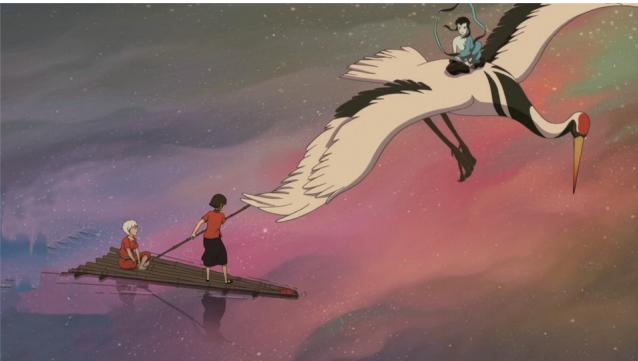
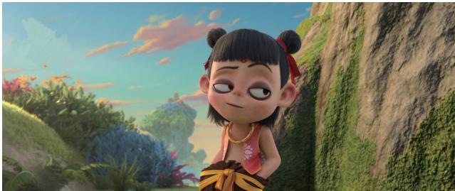

# 国产动画电影运用中国传统文化元素的当下取径

-对近年来国产动画电影的一个考察The Current Path of Using Chinese Traditional Cultural Elements in DomesticAnimation Films

文 苏文健 黄玉丁/Text/Su Wenjian Huang Yuding提要：2015年以来国产动画电影的发展较之以往有了质的飞跃，而对中国传统文化的创造性转化乃是其成功的重要因素之一。近年来国产动画电影运用中国传统文化元素的当下取径主要体现在：取材于传统文学、化用传统音乐、借势传统符号和重塑传统文化精神。这些方法取径促进了国产动画电影艺术文化的守正创新，一是再造传统：留其神而变其形，二是紧贴生活：时代精神的影像化表达。国产动画电影对传统文化元素的创新性转化发展，赋予传统文化以时代的新精神，传播优秀传统文化和增强文化自信，为国产动画电影的发展注入强大的中华民族特色和中国艺术精神。中国传统优秀文化与动画电影的有效融合，可以助推电影文化产业新业态的生成发展，意义重大。

关键词：国产动画电影 传统文化元素 当下取径 守正创新 电影产业

在国产动画电影沉寂了多年之后，2015年《西游记之大圣归来》(下文简称《大圣归来》横空出世，被视为“打响了国产动画影片‘归来’的号角”。《大圣归来》被《人民日报》认为是中国动画电影十年来少有的现象级作品，它的票房迅速打破《功夫熊猫2》保持了四年之久的动画电影票房纪录。影片在“戛纳"创下中国动画电影海外最高销售纪录，并在 2015年第 18届上海国际电影节上，成为传媒大奖设立12年来首部入围的动画电影。2016年上映的《大鱼海棠》，以精致、充满浓郁中国风的画面惊艳观众。该片首日票房达 7460万元，打破了国产动画电影首日票房的纪录。2019年1月11日上映的《白蛇：缘起》是中国少有的在“二次元、成人向”的观影受众定位下取得成功的电影，促进了动画电影从“低幼”到"全年龄”的转型升级，开拓了动画电影的新市场。2019年7月 26日上映的《哪吒之魔童降世》仅用5天，其票房就打破了《大圣归来》9.56亿元的票房纪录，最终以破 50亿元的票房拿下中国动画电影票房之冠，位居中国影史票房第二，是名副其实的现象级电影。这几部成功的国产动画电影，都有一个共同点：艺术、科技跨界融合背景下对传统文化元素的创造性转化。

传统文化是文明演化而汇集成的一种反映民族特质和风貌的文化，是民族历史上各种思想文化、观念形态的总

体表现。余英时在《论传统》一文中认为，传统是文化累积的结果，具有累积性与连续性等特征，“传统本身虽然是由客观的历史所构成，选择传统却不能不是主观的事”，而"真正有生命的传统，绝不会黏着于某一固定的古旧形式，而必然会化为贯穿古今统一历史的文化精神”。(1）传统文化元素大致上可以划分为两种形式：(1)物质形式：如民间工艺、衣冠服饰、器物、古代建筑、民族乐器等；(2)非物质形式：思想文化、传统节日、民间艺术、习俗等。中国文化博大精深、源远流长，五千年的文化积淀是国产动画电影创作的资源宝库。毋庸置疑，中国优秀的传统文化是我们国产动画电影的生命力所在，但在产业化、文化科技融合的背景下，国产动画电影如何化用中国传统文化而做到守正创新，的确是一个亟需解决的问题。

近年来,学界关于中国动画电影对传统文化的重构、传播与价值认同等问题多有探讨，(2值得重视。同时，也出现了对具体某部电影运用传统文化元素的相关分析的成果。（3）这些研究从影视动画作品的题材选择、角色造型、场景设计、音乐特效等方面，集中对传统文化元素的运用进行多重探析，为我们考察近年来国产动画电影对传统文化在形式和内容上的创新提供了较好的基础。本文拟以前述四部国产动画电影为中心，聚焦于服饰设计、场景设计、民族音乐的运用、民族精神的表现等层面，整体深入考察其对传统文化元素化用的方法取径，揭示国产动画电影融合发展、守正创新的特色及意义，冀为新时代语境下国产动画电影的文化融合创新之路提供一种可能性向度。

# 一、国产动画电影对中国传统文化元素的现代化用

动画电影是科技的产物，随着制作技术而发展，动画的形式也发生了翻天覆地的变化，从二维到3D，视听效果的异变带来新的审美快感。但是动画的内在本质和意蕴依然是由它所讲述的故事内容及其孕育的思想主旨所决定的。(4)动画电影的内容和思想意蕴才是其艺术性的根本。在此意义上，博大精深的传统文化本身已具有经过历史沉淀与时间检验的艺术性，动画电影对传统文化元素的创造性转化，在内容的建构方面有着得天独厚的优势。

# (一)取材于传统文学

中国传统文学不仅数量浩繁，且成就突出。传统文学是影视创作的丰富素材库，中国的动画从产生之初，就从传统文学中汲取了丰富的"营养”。如《大闹天宫》《猪八戒吃西瓜》《铁扇公主》《金猴降妖》,取材自《西游记》；《济公斗蟋蟀》取材自清代的神魔小说《济公全传》；《天书奇谭》取材自明代的神魔小说《平妖传》等等。神话、诗歌、戏曲、散文、小说都可以是影视作品的素材，通过改编使其成为一种新的艺术形态。动画大国美国，其动画史也可以说是一部动画文学经典改编史。作为世界动画顶尖水平代表的迪斯尼动画，其产出的动画电影改编比例非常之高，并且改编题材取自于世界各国的文化经典。改编文学经典为动画的创作提供了一条捷径，改编文学经典无异于站在巨人的肩上追求动画创作的艺术性。

从传统文学中选取题材，改编经典文学，在现代的国产动画电影的创作中仍然具有强劲的生命力。近年来票房口碑俱佳的几部国产动画电影，都以传统文学为素材,通过改编将故事搬上大银幕。《大圣归来》取材自《西游记》，影片讲述了大闹天宫后被压在五行山下五百年的孙悟空，被小和尚江流儿(儿时的唐僧)误打误撞地解除封印后，在彼此陪伴的冒险之旅中找回初心，完成自我救赎的故事。《大鱼海棠》以《庄子·逍遥游》《山海经》为素材，讲述了少女椿为报恩而努力复活人类男孩"鲲”的灵魂，在本是天神的湫的帮助下与命运斗争的故事。《白蛇：缘起》则取材自中国四大民间传说之一的"白蛇传”，讲述了五百年前白素贞与许仙的前身阿宣之间一段刻骨铭心的爱情故事。《哪吒之魔童降世》改编自中国神话故事，讲述了哪吒虽"生而为魔”，却"逆天而行斗到底”的抗争命运的成长故事。

经过时间检验而得以流传至今的传统文学，其故事性、艺术性等的影响无可置疑。动画电影从传统文学中取材，既有利于作品本身艺术性的加持，也更能引发观众对电影的兴趣，获取更多的票房流量。动画电影从传统文学中取材，将之以一种娱乐形式呈现出来，实则是对传统文学本身的一种再传播与再创造过程。对传统文学阅读的缺失是现今社会存在的不可忽视的现象。因此,传统文学以一种更容易接受的青春视觉形式出现，引起人们对原著的兴趣，对传统文学的宣扬与传播具有重要作用。

# (二)化用传统音乐

电影配乐是一种具有极强的综合性的艺术形式。自电影这门艺术诞生以来，音乐就以独特的身份融入电影制作中，占据重要地位，并且成就了电影音乐这一特有名词。电影配乐不仅可以作为渲染电影基调感情的手段，还可以作为促进电影剧情发展的"推手”。（5）中国传统音乐是指中国人运用本民族固有方法、采取本民族固有形式创造的、具有本民族固有形态特征的音乐，不仅包括在历史上产生、流传至今的古代作品，还包括当代作品。我国的传统音乐历史悠久，积淀深厚，为电影配乐提供了富有民族个性的丰富资源。

《大圣归来》根据每个角色的不同性格创作了不同的人物出场配乐。如孙悟空出场时的画外音采用了说评书的方式，增加了大圣的传奇色彩，让观众有一种听故事的感觉。孙悟空大闹天宫时的配乐是根据我国名曲《小刀会序曲》改编的,琐呐、琵琶和二胡等民族乐器的合奏，营造出磅礴的气势，与孙悟空大闹天宫激烈的打斗场景非常契合。还有大圣与混沌在悬空寺大战的时候，混沌哼唱的一段"五行山有庙宇兮，于江畔，而飞檐。借童男童女之精华，求仙药，而历险”，此曲名为《祭天化颜歌》，是由中国专业京剧演员吟唱而来。这种京剧效果的融入既有利于渲染故事情节、推动故事发展，还能起到突出人物性格特征的作用。(6

《白蛇：缘起》也大量引入古筝、古琴、琵琶等传统乐器。借助中国传统乐器营造了与场景设计相得益彰的审美情境，使得影片的叙事和情感空间有了向审美精神空间延展、开掘的可能，给人留下无限的艺术遐想，提高了动画电影本身的美学含量和民族特色。（7)

《大鱼海棠》除了在配乐中融入古典音乐，还让一些中国传统乐器作为道具出现在电影中。鲲吹奏的鸣嘟乐器，历史可追溯自两千七百多年前的春秋战国时期。呜嘟音色浑厚穿透，尤擅表现幽远飘逸、古朴的意境，是我国迄今为止唯一能演奏和音的土类乐器。灵婆给椿的召唤铃铛是陶响球。陶响球是一种重要原始乐器，也是最早的声音玩具。目前出土的陶响球都是陶质的球形，中间是空的，里面装有弹子或沙粒，摇动时哗哗作响。

声音是电影中一种重要的艺术表现形式，电影音乐在促进剧情发展、烘托氛围、表现人物内心等方面有着重要作用。“独具风格的真正的有声片不会仅仅满足于让观众听到人物的对白(这在过去只能看到)，它也不会仅止于利用声音来表现事件。声音将不仅是画面的必然产物，它将成为主题，成为动作的源泉和成因。”（8）将传统音乐融入到动画电影的创作中，不仅对动画电影内容上的提升有着重要作用，对动画电影形成独特的民族风格也有着非凡的意义。

  
图1.《大鱼海棠》剧照

# (三)借势传统符号

中国传统视觉符号系统，是历代文人、艺匠、劳动人民在对实践经验的总结中，运用各种视觉资源，或采集记录、或夸张变形、或想象描摹、或拼贴组合，渐趋形成的关于内容、形象、色彩、构图的具体规范与习惯。(9)我国传统视觉符号在经年积累中拥有繁多的数量，如人物类有女娲、太上老君、玉皇大帝、孙悟空、土地公等；植物类有梅、兰、竹、菊、松柏、莲花、牡丹等；器用类有筷子、瓷器、茶叶、文房四宝、肚兜等。这些视觉符号都带有浓厚的民族色彩，一旦出现，人们便会快速地与“中国”“传统”联系在一起。因此，传统符号的运用是最能直接展示民族风格的形式。

# 1.服饰设计与角色造型

《大圣归来》《白蛇：缘起》《哪吒之魔童降世》中的主人公都是国民所熟知的。《大鱼海棠》在角色上的选取则较为新鲜，影片中有一百多个人物，大多出自《山海经》《搜神记》《列仙传》《诗经》等。如鲲的原型来源于《庄子·逍遥游》中"北冥有鱼，其名为鲲，鲲之大,不知其几千里也”。灵婆、鼠婆、喇嘛鸟、白泽、句芒、螺祖、后上的形象，则是以《山海经》和《搜神记》等古籍中的记载进行设计。

这些电影的服饰设计展现了传统服饰的特色，使得角色形象的塑造更具亲和力。如《大圣归来》中傻丫头穿的肚兜及《哪吒之魔童降世》中小哪吒穿的肚兜。肚兜是中国传统服饰中护胸腹的贴身内衣，肚兜的面上常有图案，有印花、有绣花，绣花肚兜较为常见。刺绣的主题纹样多是中国民间传说或民俗，如喜鹊登梅、刘海戏金蟾、鸳鸯戏水、莲花以及其他花卉草虫，大多是吉祥幸福、趋吉避凶的主题。小哪吒的肚兜上有莲花图案,莲花既是肚兜绣花的常见图案，莲花又与大家所熟知的哪吒莲花化身重生的故事联系在一起，这不得不说是创作团队的小巧思。傻丫头肚兜上的花草图案则是常见的民间儿童肚兜样式，这与傻丫头是一个普普通通的民间小丫头的身份地位相符合。传统服饰创新运用，有助于生动形象的塑造，并给观众营造独特的审美体验。

# 2.场景设计与叙事情节

动画场景，指的是影视动画角色活动与表演的场合与环境，包括生活场所、室内陈设、自然环境、社会背景等等。比较有特色的是《大鱼海棠》参考福建土楼设计的建筑场景。福建土楼起源于唐朝陈元光开漳时的兵营、城堡和山寨建筑，成熟于明末、清代和民国时期。福建土楼现存圆楼、八角楼、纱帽楼等三十多种式样，与北京四合院、陕西窑洞、广西"栏杆式”、云南"一颗印”,并称汉族五大传统样式住宅，2008年被正式列入《世界遗产名录》。同时，土楼也是传统宗法社会的代表性建筑,表现了客家人互利共生、相互依赖的生活方式。椿生活于此，暗喻椿其实生活在一个秩序严谨且相对封闭的环境里，为故事情节发展做了铺垫。《大圣归来》中也出现了众人围观看皮影戏的场景。皮影戏是中国民间古老的传统艺术，是一种以兽皮或纸板做成的人物剪影以表演故事的民间戏剧。片中皮影戏场景对故事情节的推动具有重要作用。

# 3.色彩运用与审美意蕴

色彩既是传统视觉符号的核心成分之一，也是动画艺术的主体构成要素；既体现了中国文化里美学追求与哲学思辨之潜移默化的影响，也会决定当下中国人对于视觉艺术的观看效果和把握尺度。色彩不仅有视觉效果，也会在一定程度上给观影者起到暗示作用。五行色彩(青黄赤白黑)是中国传统色彩的代表，蕴藏着厚重的民族底蕴，几部作品在色彩的运用上都体现了五行色彩的审美意蕴。

《大圣归来》中的反派妖王混沌和《白蛇：缘起》中的反派国师，二者在形象设计上都以黑色调为主，辅以白色面庞，反派冷血、恶毒的形象就被轻易地勾勒出来了。反派形象在色彩运用上的一致，恰恰表明了大众对于色彩象征意义的集体文化心理和高度认同感。而《大鱼海棠》全片以红色调为主。红色是特别有中国韵味的颜色，在中国传统中，红色象征喜庆、吉利。《大鱼海棠》对红色的运用，成功地营造了古朴而神秘的中国式氛围。

动画艺术所具有的兼容性、综合性，为传统视觉符号以更迅捷高效的形式传播提供了捷径。当然，动画电影对传统视觉符号的运用不能只是简单地堆砌与拼凑，传统视觉符号不仅仅能够展现视觉艺术的审美，它所包含的文化内涵也应寻求恰当的表述形式，在达到视觉效果的同时，传达更深层次的文化意蕴。传统视觉符号的运用是民族风格塑造中必不可少的一环，它对表现中国传统文化有着不可替代的作用。诸如在《大圣归来》中出现的皮影戏、《大鱼海棠》中出现的莲花灯、《白蛇：缘起》中的奇门遁甲等，都是现代生活中少见的民俗艺术。通过动画电影的展现，能够让年轻人去认识这些中国传统的民俗活动，让这些中国传统的艺术以一种新的形式得到传承创新。

# (四)重塑传统文化精神

中国文化的基本精神就是推动和指导几千年中国文化发展的世界观和人生观。中国传统文化以儒家、道家、佛家为主，儒家的思想文化又是中国千年来的思想主流。近年来的国产动画电影对传统文化精神的呈现也以儒、道、佛三家为主。

# 1.儒家：知其不可而为之

《大圣归来》中的小和尚江流儿一往无前去救傻丫头，带有小孩子无知无畏的天真与赤子之心。然而对法力被封印的大圣来说，当江流儿要他去救傻丫头时，他知道现在的自己做不到，他清楚地知道自己无法与混沌对战，这也是他拒绝江流儿的原因。但当大圣内心经过一番斗争之后，法力封印未除的他毅然前去救孩子们时，又让我们感受到了他的勇气，这也正是儒家“知其不可而为之”精神的体现。比起法力高强的英雄救人，失去法力的大圣拼命一搏的姿态更让人动容。《哪吒之魔童降世》中的哪吒，本应是灵珠却成为魔丸，面对天劫，哪吒选择了逆天改命，与命运做斗争，全片的高潮便是他对抗天劫，“若命运不公，就和它斗到底”，这震撼人心的呐喊也正体现了“知其不可而为之”的积极乐观的心态。

# 2.道家：道法自然，顺应本心

《大鱼海棠》的灵感来源于《逍遥游》，主题设计融合了道家文化，展现了道家的文化基调。《庄子·逍遥游》展现的是一种挣脱一切束缚，忘却自我的超然境界，强调人应该顺应内心的变化做出选择，寻求一种超越现实的精神自由，以实现独立的生命价值，达到人生的最高境界——逍遥游。(10)《大鱼海棠》的整个故事围绕着椿、鲲、湫三者之间的互救，讲述了他们之间的爱情与守护。主人公椿和湫代表了一种具有自由意志的人，影片中他们与严苛的秩序对抗，在自我的选择中得到了灵魂的自由，这正体现了道家文化中的精神自由和实现自我价值的思想。

3.佛家：因果轮回

《白蛇：缘起》以一支碧玉珠钗串连起了许宣、小白之间的轮回之爱。影片大胆创新，开拓了许仙和白娘子的前世故事，也正是化用了佛家因果轮回的概念。珠钗里封存着的记忆，唤醒了小白关于前世与许宣相爱的回忆，也便有了影片结尾小白因爱寻找前世的许宣，与现世的许仙在断桥相会的场面。除了佛家因果轮回思想的化用，《白蛇：缘起》也在多处体现了禅宗的意境。如主题曲中的"何须问，浮生情，只是浮生此梦中”，改编自唐代高僧鸟窠禅大师回答诗人白居易问询的禅诗：“来时无迹去无踪，去与来时事一同，何须更问浮生事，只此浮生是梦中。”

简言之，传统文化精神的注入使动画电影的精神内核得以升华，但前述四种途径已然成为近年来国产动画电影化用中国传统文化的重要取径。传统文化精神的时代化、青春化之影像表达，成为国产动画电影民族化、现代化的重要内驱力，其重要价值与现实意义不言而喻。

# 二、国产动画电影运用中国传统

# 文化元素的守正创新

近年来的国产动画电影对传统文化元素的运用令人耳目一新，无论是内容上还是形式上，对传统文化元素的运用较之以往有了更丰富的形式。不再满足于简单地将传统文化元素按其本来样貌完成动画化表述，而是在电影产业、科技语境下努力守正创新，完成对传统文化元素的化用，拓进了动画电影运用中国产业文化元素的融合创新之路。

# $( - )$ 再造传统：留其神而变其形

纵观近年来国产动画电影对传统文化元素的运用，极其明显的特征就是对传统的再造重构。对传统的再造重构是大胆的创新，也是时代语境下对动画电影的必然要求。“中国学派”时期的国产动画作品，对传统文化元素的运用几乎是达到了登峰造极的地步，但该时期的作品基本是在遵循传统的前提下进行创作，所谓的遵循传统即是将“传统”动画化。如经典之作《大闹天宫》,遵循原著的故事情节，不变的人物角色与人物关系等，可以说是将书面故事转化成了动画故事，进行了一场将文字故事动画化的转译。然而近年来的国产动画电影，即便是取材于大家耳熟能详的传统文学题材，最后呈现的效果仍让人耳目一新。究其实，近年的国产动画电影摆脱了简单地将“传统文化”动画化的转译路线，而是大胆重构传统，发展传统，留其神而变其形。

一是叙事模式的创新。近年来的中国动画电影逐渐呈现出一种游戏化叙事的倾向。《哪吒之魔童降世》就有明显的游戏场景制作效果，这种游戏艺术形式和电影的联动效果，带给观众焕然一新的观影体验。哪吒和敖丙两派师徒在"江山社稷图”里打斗的叙事段落，创作者安排了李靖等人在场外手持"江山社稷图”紧张观战的情形，接下来的反打镜头是个二维画面，“江山社稷图”变成了一张即时战略游戏地图，还配以街机电子游戏声音，体现了影游融合的某种当代电影表征。（11）哪吒的成长叙事也符合闯关游戏思维。从"魔丸哪吒”到"孩童哪吒”再到"六臂哪吒”，创作者按照一种游戏线性故事思维，每个阶段对应不同的关卡，闯关后就升级。

《大圣归来》则借鉴了好莱坞的电影语言，以序幕一建立一对抗一解决一尾声的好莱坞模式结构组织影片的故事内容。设置了孙悟空被困五行山，山妖入侵家园等情节，为英雄的崛起做铺垫。江流儿偶然解救了孙悟空，建立了两人的关系。傻丫头被劫，江流儿希望孙悟空救傻丫头而孙悟空自知无能拒绝了江流儿的请求，两人产生矛盾，分道扬镳。之后孙悟空醒悟，骑着小白龙来救大家。在误以为江流儿死后，孙悟空被刺激而冲破封印，威风凛凛、法力无边的大圣回归，最终打败反派。曾经的英雄在遭遇磨难后丧失信心，然后在某个关键人物的帮助下最终重新找到自我，这是经典的好莱坞叙事模式。

二是人物塑造的创新。近年来的国产动画电影，不再遵循传统文学中的原型形象，而是进行了颠覆式创新。《哪吒之魔童降世》中的哪吒，顶着黑眼圈、塌鼻子、豆豆牙，穿着潮流的哈伦裤和红马甲。人物形象设计上还致敬了《灌篮高手》中的樱木花道，让哪吒双手插进腰带之中，走起路来耸肩驼背，完全是一个不正经的调皮孩童形象。而哪吒的师父太乙真人，也打破了以往为人师表、仙风道骨的形象。创作者通过变形和拉伸等夸张的艺术处理方法，塑造了一个更具滑稽、充满戏谑感的形象。(12)影片中的太乙真人嗜酒贪睡、心宽体胖，操着一口流利的"川普”，骑着一头飞猪。片中严厉的李靖成为慈父，殷夫人成为女侠，敖丙太子成为白衣秀士。人物形象与性格都颠覆了人们原来对哪吒故事的记忆。

《大圣归来》中的孙悟空，传统的"桃形脸”变成了“马脸”。孙悟空被塑造成了一个失意的人。困于五行山下五百年，偶然被江流儿拯救重获自由，然而手上的封印并未解除，能力受到限制，连应付几只山妖都力不从心。这与小说中大家所熟知的那个威风凛凛、法力超强的齐天大圣相去甚远。影片中的孙悟空，是一个落魄的英雄，是一个处于人生低谷、迷失自我的丧气式人物。江流儿的原型是唐僧，除了与唐僧一样都是一个心地善良的和尚以外，江流儿以一个充满童真童趣的光头小和尚形象出现在银幕上，萌态十足。

三是延伸式的创新。《大圣归来》和《哪吒之魔童降世》都是在传统文学题材的基础上改编，重要的故事情节仍未脱离原著。《白蛇：缘起》与《大鱼海棠》则是在原著的基础上进行的延伸式创新，创造出全新的世界观,两者存在重要的互文性。此前"白蛇传”的改编基本上是演绎原来的故事，内容创新无从谈起。《白蛇：缘起》则打破了“新瓶装旧酒”式的改编，对原作"前世我们便定情”的因缘际遇展开书写，大胆想象虚构经典中的空白部分，拓展和演绎了白素贞和许仙之间的爱情故事。影片以白蛇修仙遇阻和"断桥相会”为今生，讲述了许仙和白素贞二人前世从相遇、相识、相爱到相离的爱情故事。《大鱼海棠》则是以庄子的《逍遥游》等古籍为素材，构建了一个全新的充满神秘色彩的东方世界。

实际上，对传统的传承并非是一成不变的继承与再现。“传统并不只是我们继承得来的一宗现成之物，而是我们自己把它生产出来的，因为我们理解着传统的进展并且参与在传统的进展当中，从而也就靠我们自己进一步规定了传统。”（13）近年来，国产动画电影对传统文化的重构表达，恰恰体现了在创新中的传承，这才是富有生命力的。当然，近年国产动画电影对传统的重构在根本上并没有改变传统文化的精神特质。我们看到了新的孙悟空形象，但依旧能够感受到齐天大圣那拼搏、反叛的精神；我们看到了一个潮流的哪吒，也依旧能够感受到他无畏而勇敢的抗争精神。那些唯美的、写意的画面依旧展示了中国传统式的含蓄、内敛的审美风格。

# (二)紧贴生活：时代精神的影像化表达

纵观近年来的几部国产动画电影，除了对传统文化的汲取与继承，更重要的是契合了当代的时代精神与观众的审美心理的影像化表达。影像化符号的生产与再生产，是消费社会、视觉时代和科技发展背景下现代社会思想观念、日常生活方式的重要表征。

其一，科技元素的融入。《哪吒之魔童降世》中，太乙真人在打开混元珠时用到了密码解锁和指纹认证。这类现代科技元素出现在古代背景的电影中让人眼前一亮，增加了喜剧效果。在江山社稷图中的打斗，配上了街机电子音乐，富有现代感的电子音乐与古色古香的画面没有丝毫违和感，与激烈的打斗相应和，营造出了一种游戏感，渲染了紧张的氛围。《白蛇：缘起》的导演赵霁在采访中说过：“音乐方面我们也花了很多的心思，虽然是古风，但我们加了很多电子的音乐元素，在很多段落铺了纯电子的音乐，节奏更有动感与活力。”（14）现代电子音乐的融入让电影的配乐更丰富、多元化，从而起到推动电影剧情和营造氛围的效果。动画电影在运用传统文化元素的同时，大胆创新，做好传统文化元素与现代科技元素的融合运用，从而达到出乎意料的呈现效果。

  
图2.《哪吒之魔童降世》剧照

其二，青春化的影像语言。不管是孙悟空还是哪吒,在传统神话故事中都富于叛逆和抗争精神，抗争的是“神权”“专制权”。但在消费市场、网络社会的背景下，讲述抗争“神权”“专制权”的故事，很难引起年轻观众的共鸣。在继承和保留人物叛逆气质、抗争精神的前提下，置入现代社会的价值观和情感体验，并以青春化的影像表述，成为当下动画电影发展的重要方式。《哪吒之魔童降世》中，哪吒自出生起就被视为不祥之物，并只拥有三年寿命，面对不可压制的魔性和无法改变的天劫，哪吒经历艰难的抗争历程和心魔对抗，喊出了“我命由我不由天”的口号，在抗争中实现了对自我生命价值的认识。《大圣归来》中的孙悟空，法力被封印磨去了他的威风，在江流儿的激励下，他由一只失意落魄的丧气猴子变回了威风凛凛的大圣，完成了个人的蜕变和成长。

“成长和救赎”主题电影所蕴含的正能量迎合了深陷丧文化语境的青年亚文化的救赎诉求。“丧文化是当代青年亚文化的一种典型，与网络新媒体技术联系紧密，在消费主义盛行和社会压力日益加重的背景下，依托于社交媒体和网络发展所兴起与流行的一种，与主流社会正能量价值观和行为模式有着共通之处，但其符号和意涵处处透着丧气和无望的青年人自嘲与自我安慰的青年亚文化。”(15）《大圣归来》《哪吒之魔童降世》这类以“成长和救赎”为主题的正能量电影得以火爆的重要原因也在于主人公青春反叛和责任担当的励志象征。《哪吒之魔童降世》上映后，“我命由我不由天”在微博上被高频率引用，也印证了电影带给观众的能量，这与大环境中希望通过个人的努力改变命运的观念有着相同的精神特质。

正如《哪吒之魔童降世》的导演饺子所说：“故事是一个外壳，里面的精神内核需要随着时代不断变化。每个时代的文化都应该符合当代精神。”时代性、科技性、青春化是动画电影发展必不可缺的要素，只有满足当下观众的审美精神需求的电影作品，才能触动观众的心弦和获取更多的流量票房。而科技文化与传统文化的跨界融合创新，既能够营造新奇的效果，又能消解传统文化与观众之间的距离，让观众更好地接受传统文化，达到互利双赢，推陈出新。

# 三、国产动画电影运用传统文化元素的当代启示

众所周知，传统文化具有累积性、连续性与变化性特征。“因为传统是文化的积累，而文化则是日新月异的，造成文化的种种条件，无论是自然的或人文的，都是变数，因此文化本身当然也就不能不是变数了。文化既然是变动性的，哪里会有不变的传统呢？”（16）以传统文化为创作素材，将会成为国产动画电影建立民族化自觉和本土化认同的一种选择。国产动画电影对传统文化元素的运用也将让传统文化通过电影这一媒介得以传播，在传统文化的传承中起到重要作用。国产动画电影对传统文化的运用，能够赋予传统文化以时代精神，激活传统文化的现代活力。

一是文化、科技跨界融合，传统文化创新发展。中国传统文化元素具有民族化的特点，运用传统文化元素打造动画电影的民族化风格进行创新是一条行之有效的途径。美、日两大世界商业动漫大国在动漫的创作中,不限于利用本国的文化资源，而是以世界性的眼光，通过改编他国文化资源再进行重新生产，以此宣传本国的审美意识和价值观念。如梦工厂出品的《功夫熊猫》系列电影，影片中满满的中国元素，但没有人会认为这是一部中国化的电影。可见，传统文化的发展根本在于适应时代发展精神的表述创新。

动画电影是科技的产物，传统文化、艺术创作与科技的跨界融合，可以有效催生电影文化产业新业态。动画技术仍处于不断发展的状态中，科学技术的发展促使动画在呈现方式、制作方式等方面不断革新。从平面手绘到立体拍摄，再到虚拟生成，动画制作技术的提高为创作者提供了更广阔的创作空间。中国传统文化中那些瑰丽的、天马行空的想象，真人电影无法演绎的画面，可以在动画及虚拟技术支持下让想象落地，转化为视觉画面。因此，动画对传统文化元素的运用有着天然的优势。动画电影作为文艺作品，它的成功应当与当下审美风尚、精神需求和科技创新密切相关。

从近年来国产动画电影可以看出，传统文化与科技的跨界融合能够碰撞出奇妙的火花。“现代”与“传统”的融合制造的奇观化效果，符合当下社会人们的审美需求。现代性的融入能为民族化的表达开辟新的形式，消解观众与传统的距离，让传统文化更易于被接受，被吸收。

二是弘扬传统文化，增强文化自信。电影作为大众最主要的娱乐形式之一，拥有庞大的观众群，可以拓展传统文化受众面。“传统文化所蕴含的思维方式、价值观念、行为准则，一方面具有强烈的历史性、遗传性；另一方面又具有鲜活的现实性、变异性，它无时无刻不在影响着今天的中国人，为我们开创新文化提供历史的根据和现实的基础。”(17）传统文化借助电影这一现代科技媒介，在内容与形式上更容易得到观众的认识、赏识、接受。因此，动画电影中传统文化元素的运用，可以传播弘扬中国传统优秀文化，增强文化自信。

当前国产动画电影对传统文化元素的运用还仅是开发了传统文化的冰山一角，丰富且独特的传统文化资源还有待动画创作者未来更深入的挖掘。许多如今已经比较少见的民俗艺术可以通过动画电影得到展现，甚至随着动画制作技术的发展，能够通过动画技术再现那些

我国已经失传的传统技艺等。对内，国产动画电影应该自觉承担起传播、弘扬优秀传统文化的责任。对外，在经济全球化背景下，动画电影作为大众精神消费，其商业属性也是与生俱来的。国产动画电影的对外出口，不仅是市场消费行为，更是一种文化输出。以动画电影为技术载体传播优秀传统文化，既有益于提升国民对传统文化的认同感、自豪感，增强文化自信；也有助于提升中国在国际上的文化软实力。因此，创作者在运用传统文化元素时，应以优秀传统文化为核心，积极利用现代科技手段，形成文化科技的跨界融合，更好地激活、创新和传播中国优秀传统文化，使其成为文化产业发展中的新动能，进而推动经济、文化和社会的发展。

# 结语

中国传统文化是影视创作的宝贵素材，其丰富多元的内容更为动画电影的创作提供了无限的可能性。国产动画电影对传统文化元素的运用是我国动画电影形成民族风格的重要路径。从早期电影对传统文化元素的自觉运用，到如今注入科技元素跨界融合背景下动画电影对传统文化元素的创新化用，都表明国产动画电影的发展与本民族传统优秀文化资源的密切关系。毋庸置疑，国产动画电影的未来发展，还需要结合时代精神、审美理念和科技创新完成对传统文化元素的创造性化用。但是在文化科技融合的背景下，如何做到形式与内容等方面真正的守正创新、大众喜闻乐见，仍然是国产动画电影人需要认真对待的。