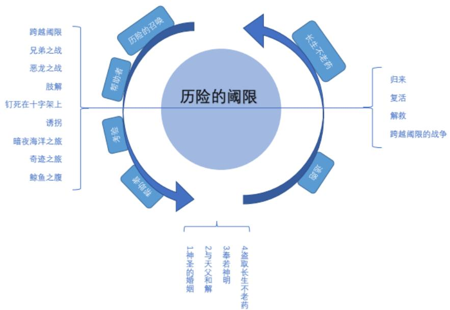
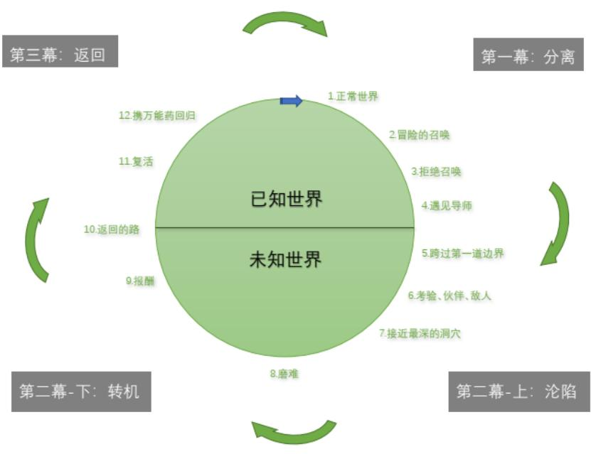
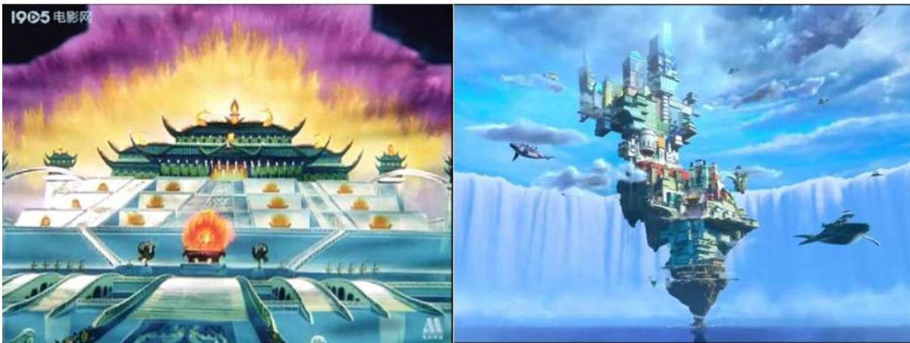
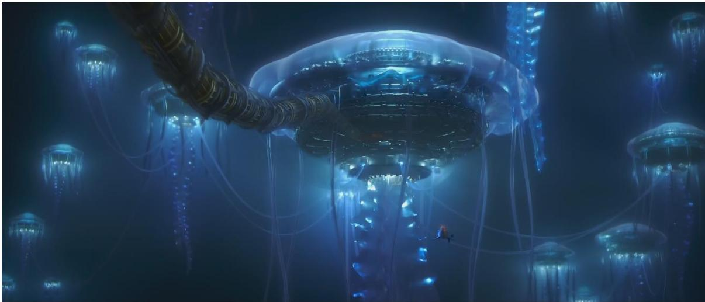
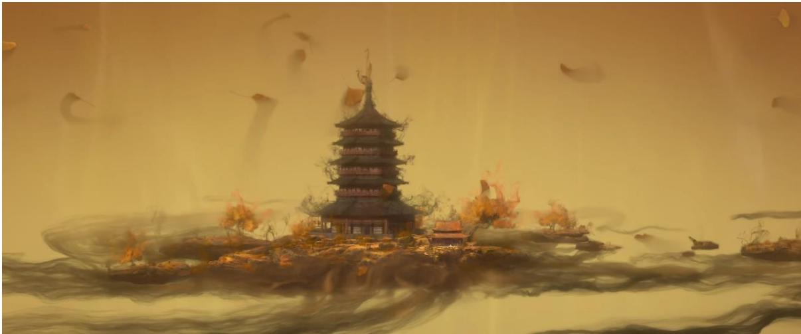
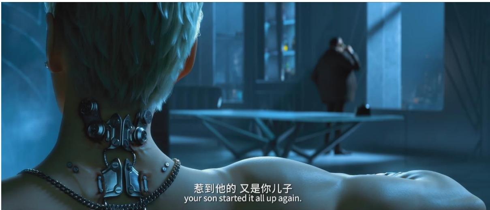
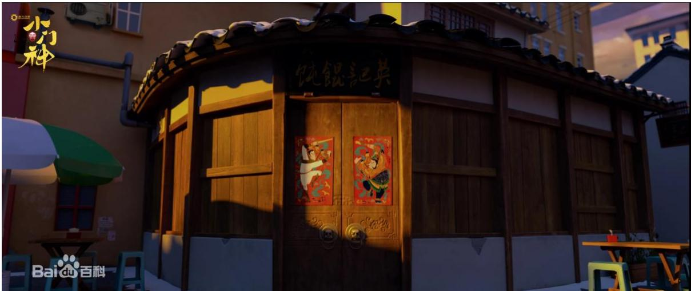
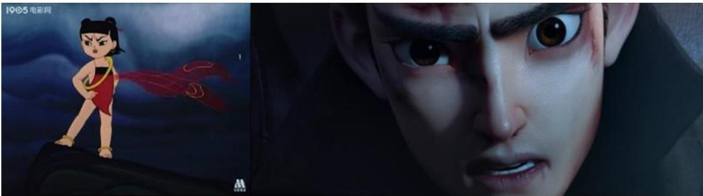

# 1. Bibliographic Information
## 1.1. Title
The core topic of the paper is *A Study of Mythological Narratives in Contemporary Chinese Animation Films*. It systematically explores the application, evolution, and aesthetic characteristics of myth-based narrative systems in Chinese animation films produced after 1949.
## 1.2. Authors
The paper is written by **Yang Yang Caiyi**, a master's student in Drama and Film Studies (specialization: Film Studies) at Qingdao University of Science and Technology. It is supervised by Professor Yang Jianhua, an expert in film aesthetics and cross-cultural film comparison.
## 1.3. Publication Venue
This is a 2022 master's degree thesis from Qingdao University of Science and Technology, which belongs to the field of film and animation studies. As a graduate thesis, it represents a systematic exploratory research achievement in the sub-field of Chinese animation cultural research.
## 1.4. Publication Year
2022
## 1.5. Abstract
The paper takes the high homology between myth thinking and animation thinking as the entry point, explores the inherent compatibility between myth and animation (both take imagination as the core, have virtuality, cross-temporality, and focus on ethical value transmission). It divides 1949-present Chinese myth-themed animation films into two phases (1949-2000 and 2000-present) based on policy background and narrative characteristics, and systematically analyzes their narrative strategies (traditional myth rewriting, myth world view construction, hero shaping, thematic metaphor), narrative structures (ethical themes, binary opposition, happy ending), and aesthetic characteristics (fictionality, audio-visual narrative expression, national symbolic application, pluralistic aesthetic integration). The paper concludes that myth narrative has important guiding value for Chinese animation creation, and the combination of traditional myth resources and contemporary values can help Chinese animation form unique national style and cultural competitiveness.
## 1.6. Source Links
- Original source: `uploaded://bfd33aad-d636-4928-b134-18094942bb7c`
- PDF link: `/files/papers/69c4bd86a9147b0c3a8f4c3d/paper.pdf`
- Publication status: Officially completed and archived master's degree thesis.

  ---

# 2. Executive Summary
## 2.1. Background & Motivation
### Core Problem to Solve
In recent years, Chinese animation films represented by *Monkey King: Hero is Back* (2015), *Ne Zha: Birth of the Demon Child* (2019), and *White Snake: Origin* (2019) have achieved both box office success and public praise, most of which are adapted from traditional Chinese myths. However, prior research on these works mostly focuses on surface-level analysis of myth element application, character design, or individual case studies, lacking a systematic, theory-supported analysis of the internal narrative logic, structural rules, and cultural inheritance mechanism of myth-based animation creation.
### Importance of the Problem
Myth is the core carrier of national collective memory and cultural identity. For Chinese animation, which is in a critical period of building national style and international competitiveness, exploring the law of myth narrative can not only solve the current problem of homogenization of myth IP adaptation, but also provide theoretical support for combining traditional cultural resources with contemporary commercial animation creation.
### Research Gap
Prior related studies are mostly limited to the following limitations:
1.  Most studies focus on animation history sorting or national style discussion, few apply systematic mythological theory to analyze animation narrative.
2.  Existing myth-related animation studies mostly focus on individual elements (such as character design, image application), lacking holistic analysis of narrative origin, strategy, structure and aesthetic system.
3.  Few studies sort out the evolutionary law of myth narrative in Chinese animation across different development phases.
### Entry Point of the Paper
The paper starts from the inherent similarity between myth thinking and animation thinking, introduces Western systematic mythological theories (structuralist mythology, hero's journey model, collective unconscious theory) combined with Chinese traditional narrative and aesthetic traditions, and conducts a full-dimensional analysis of myth narrative in contemporary Chinese animation.

## 2.2. Main Contributions / Findings
### Primary Contributions
1.  **Theoretical basis construction**: It proves the high adaptability between myth and animation by comparing their characteristics in generation, thinking, narrative, aesthetics and social function, providing a new theoretical perspective for animation narrative research.
2.  **Phase division**: It divides 1949-present Chinese myth-themed animation into two phases with 2000 as the boundary, and summarizes the core differences between the two phases in theme selection, adaptation method and aesthetic tendency.
3.  **Systematic feature summary**: It systematically sorts out the universal narrative strategies, structural rules and aesthetic characteristics of contemporary Chinese myth-themed animation, and analyzes their evolutionary context.
4.  **Practical guidance**: It extracts creative strategies conducive to the innovation of Chinese animation narrative and aesthetics, and provides practical guidance for domestic animation to strengthen cultural prototype expression and national aesthetic characteristics.
### Key Conclusions
1.  Animation thinking is an extension of myth thinking in modern society, and the combination of myth and animation has natural advantages in narrative expression and cultural transmission.
2.  Contemporary Chinese myth-themed animation has evolved from faithful adaptation of traditional texts to large-scale creative rewriting, from single traditional aesthetic pursuit to pluralistic integration of traditional Chinese aesthetics and post-human aesthetics.
3.  While adapting to contemporary values, Chinese myth-themed animation still retains the core of traditional Chinese narrative structure (ethical themes, binary opposition, happy ending) and aesthetic pursuit of artistic conception.
4.  The application of national collective unconscious myth archetypes can effectively improve the audience's cultural identity and emotional resonance, which is an important path for Chinese animation to form unique competitiveness.

    ---

# 3. Prerequisite Knowledge & Related Work
This section explains the core concepts and background knowledge required to understand the paper, to eliminate comprehension barriers for beginners.
## 3.1. Foundational Concepts
### 3.1.1. Core Mythological Concepts
- **Myth narrative**: A narrative method based on myth thinking, which integrates the long-accumulated collective memory of an ethnic group, uses fantasy plots and supernatural characters to transmit universal ethical values and cultural identity. It exists in various art forms including primitive myths, legends, novels, and films.
- **Myth thinking**: A pre-scientific thinking mode formed in primitive society, which takes subject-object integration as the basis, image as the core, emotion as the trait, and has the core characteristics of virtuality, cross-temporality, animism, and metaphor. It is essentially different from logical, evidence-based scientific thinking.
- **Animism**: Proposed by British anthropologist Edward Tylor, referring to the universal belief of primitive people that all natural things (animals, plants, mountains, rivers, and even natural phenomena) have independent souls and consciousness. This concept is the core foundation of primitive myth creation.
- **Collective unconscious**: Proposed by Swiss psychologist Carl Jung, referring to the universal, inherited psychological structure shared by all members of an ethnic group, which is formed by the long-term accumulation of historical and cultural experience. Its core content is composed of archetypes (universal symbolic images such as heroes, demons, and mothers). Myth is one of the most important carriers of collective unconscious content.
- **Structuralist myth theory**: Proposed by French anthropologist Claude Levi-Strauss, which argues that the meaning of myth is not in its surface plot, but hidden in its internal structural rules. The myth structure is composed of a series of binary oppositions (such as good/evil, human/nature, sacred/secular) arranged according to specific logical rules, and these oppositions reflect the basic contradictions that human society needs to solve.
- **Hero's journey model**: Proposed by mythologist Joseph Campbell in *The Hero with a Thousand Faces*, summarizing the universal growth structure of heroes in almost all global myths: the hero departs from the ordinary world, goes through trials, enlightenment and life-and-death challenges, and finally returns to the ordinary world with the "elixir" (wisdom, ability, or treasure) to benefit the group. It was later simplified into 12 steps by Hollywood screenwriter Christopher Vogler, and has become one of the most widely used narrative models in global commercial film creation. The following figures illustrate the original and simplified versions of the model:

  
  *Figure 3-1: Joseph Campbell's original "Hero's Journey" model in The Hero with a Thousand Faces*

  
  *Figure 3-2: Christopher Vogler's simplified 12-step "Hero's Journey" model for film creation*

### 3.1.2. Core Chinese Animation Related Concepts
- **Chinese School (Zhongguo Xuepai)**: Refers to the golden age of Chinese animation from the 1950s to the 1980s, represented by works such as *Havoc in Heaven* (1961) and *Nezha Conquers the Dragon King* (1979). It is famous for its unique national aesthetic style (combining traditional Chinese art forms such as ink painting, paper-cut, puppet, and Peking opera elements) and distinct cultural themes, and has won many international awards.
- **Art film (Meishupian)**: The official term for animation in China before the 2000s, which emphasized the artistic attribute of animation over its commercial value. Animation creators at that time prioritized aesthetic expression and educational function over market performance.
## 3.2. Previous Works
The paper sorts out prior related research into the following categories:
1.  **Animation history research**: Represented by *History of Chinese Animation Films* (Yan Hui & Suo Yabin, 2005) and *General History of Chinese Animation Films* (Bao Jigui, 2010), these works mainly focus on sorting out the development context of Chinese animation, but lack in-depth analysis of narrative logic and cultural connotation.
2.  **National style research**: Represented by *Study on the Nationality of Chinese Animation* (Li Zhaoyang, 2011), these studies discuss the expression strategies of traditional Chinese culture in animation, but rarely involve systematic mythological theory application.
3.  **Myth-related animation research**: Earlier studies such as *Study on Ancient Chinese Myths and Modern Animation* (Mao Hongfang, 2011) explored the cultural compatibility between myth and animation; later studies such as *Application of Myth and Legend Elements in Chinese Animation* (Xiao Linglong, 2014) focused on the application of individual myth elements. However, these studies lack holistic analysis of the narrative system, structural rules and aesthetic system of myth-themed animation.
## 3.3. Technological Evolution
The development of Chinese myth-themed animation has gone through three main stages:
1.  **Early exploration stage (1922-1949)**: Represented by *Princess Iron Fan* (1941) by the Wan brothers, myth adaptation was mostly used to convey anti-Japanese and national salvation themes in the context of war.
2.  **Chinese School stage (1949-2000)**: Myth-themed animation covered a wide range of themes (ancient myths, folk legends, ethnic minority stories), mostly adopted faithful adaptation of traditional texts, focused on aesthetic expression and educational function, and was called "art film".
3.  **Industrialization stage (2000-present)**: With the national animation industry support policies introduced after 2004, and the market success of *Monkey King: Hero is Back* (2015), myth-themed animation gradually turned to commercial creation, adopted large-scale creative rewriting of traditional myths, focused on contemporary value expression and pluralistic aesthetic integration, and moved towards all-age and blockbuster direction.
    This paper focuses on the latter two stages (1949-present), which are defined as "contemporary" in the study.
## 3.4. Differentiation Analysis
Compared with prior related studies, the core innovations of this paper are:
1.  **Theoretical innovation**: It systematically applies Western mythological theories (structuralist mythology, hero's journey model, collective unconscious theory) combined with Chinese traditional narrative and aesthetic traditions, constructing a complete analytical framework for myth narrative in animation.
2.  **Holistic analysis**: It breaks through the limitation of prior studies that focus on individual elements or cases, and conducts a full-dimensional analysis from narrative origin, strategy, structure to aesthetic characteristics.
3.  **Evolutionary perspective**: It clearly divides the development phases of contemporary Chinese myth-themed animation, and sorts out the evolutionary law of myth narrative across different historical contexts, which provides a clear development context for subsequent research.

    ---

# 4. Methodology
The paper adopts a multi-method integrated research system, strictly based on the inherent logic of the research object, as detailed below:
## 4.1. Principles
The core principle of the research is to take the high homology between myth thinking and animation thinking as the logical starting point. As shown in the table below, myth and animation have highly consistent characteristics in thinking, narrative and aesthetic dimensions, only differing in generation premise, which provides a sufficient theoretical basis for using mythological theory to analyze animation narrative.

| | Generation | Thinking features | Narrative features | Aesthetic features | Social function |
| :--- | :--- | :--- | :--- | :--- | :--- |
| **Myth** | Fiction and fantasy based on primitive people's "belief" in supernatural forces | Freedom, cross-temporality, surrealism, virtuality | Unique world view, god/hero characters, fictional plots, universal ethical values | Fantasy beauty, ethical beauty | Primitive tribes: consolidate ruling order, enhance group cohesion, create psychological expectations, explore the unknown world |
| **Animation** | Fiction and fantasy based on modern natural science system, for artistic creation purpose | Freedom, cross-temporality, surrealism, virtuality | Unique world view, god/hero characters, fictional plots, universal ethical values | Fantasy beauty, ethical beauty, formal beauty | Modern society: provide aesthetic experience, promote positive energy, transmit mainstream values |

*Table 1-1: Similarities and differences between myth and animation characteristics, from the original paper*

## 4.2. Core Methodology In-depth
The research follows the logical order from theoretical foundation construction to feature analysis, and then to aesthetic summary:
### Step 1: Theoretical foundation construction (Chapter 2 of the paper)
First, it sorts out the origin of myth narrative in Chinese animation:
1.  It summarizes the core characteristics of Chinese traditional myth thinking: closely related to geographical environment, emphasis on spatial positioning, non-plot and polysemy, ethical orientation, and pursuit of happy ending.
2.  It introduces the core Western mythological theories applied in the research: Tylor's animism, Levi-Strauss's structuralist myth theory (binary opposition, mythemes), Cassirer's myth structure theory (three core elements: space, time, number), Campbell's hero's journey model, and Jung's collective unconscious and archetype theory.
3.  It analyzes the modern evolution of myth thinking: the expansion from narrow primitive myth to broad generalized myth, the emergence of mythism and new mythism (which combines myth with modern technology and commercial culture, and is widely used in contemporary cultural and creative industries such as fantasy films and games).
4.  It proves the inherent connection between animation and myth: both are based on human imagination and fantasy, animation thinking is an extension of myth thinking in modern society, and animation film is the most suitable art form to express myth content due to its freedom from the constraints of real shooting.
### Step 2: Development phase division (Chapter 3.1 of the paper)
The paper divides 1949-present Chinese myth-themed animation into two phases with 2000 as the boundary, based on two core dimensions:
1.  **Narrative dimension**:
    - 1949-2000: Wide range of myth themes (ancient myths, folk legends, ethnic minority stories, mural adaptations), mostly faithful adaptation of traditional texts, pursuit of traditional aesthetic beauty, strong educational function.
    - 2000-present: Concentrated adaptation of high-popularity myth IPs (Sun Wukong, Nezha, White Snake), large-scale creative rewriting of traditional texts, diversified aesthetic tendencies, focus on contemporary value expression.
2.  **Policy dimension**: Between 1995 and 2006, China introduced a series of policies to promote the industrialization of animation: the abolition of the planned purchase system for animation in 1995, the introduction of animation industry support policies in 2004, and the regulation that foreign animation cannot be broadcast in prime time in 2006. These policies promoted the transformation of Chinese animation from public institution-led art creation to market-led commercial production. The 2000 node is chosen as the midpoint of this policy transition period.
### Step 3: Narrative feature analysis (Chapter 3.2-3.3 of the paper)
This is the core part of the research, which analyzes the narrative system of Chinese myth-themed animation from two dimensions: narrative strategy and narrative structure:
#### Narrative strategy analysis
1.  **Traditional myth rewriting strategy**: The paper summarizes two adaptation modes in the 2000-present phase:
    - Small-scale adaptation: Retain the core plot points and character prototypes of traditional myths, modify character settings, motivations and details to adapt to contemporary values (e.g., *Ne Zha: Birth of the Demon Child* retains the core conflict between Nezha and the Dragon King, but reverses Nezha's identity from "spirit pearl" to "demon pill", and reshapes the image of Li Jing as a loving father).
    - Large-scale rewriting: Reconstruct the time-space background, create new myth world views, and only retain the core archetype of the protagonist (e.g., *New Gods: Nezha Reborn* sets the story in a cyberpunk-style future city, retains only Nezha's archetype of fighting against fate, and rewrites all other plots).
2.  **Myth world view construction strategy**: Based on Ernst Cassirer's myth structure theory (three core elements: space, time, number), the paper summarizes the law of world view construction in Chinese myth-themed animation:
    - Space: Follow the traditional Chinese myth spatial structure (three vertical realms: heaven, human world, underworld; three horizontal realms: east, middle, west), and each spatial position has specific sacred/secular attributes. Contemporary works also create original virtual spaces (e.g., the Asura City in *White Snake 2: The Tribulation of the Green Snake*, a mixed world formed by human obsessions, with independent operating rules).
    - Time: Follow the traditional Chinese myth time concept "one day in heaven, one year on earth", and specific time points (the first and fifteenth day of the lunar month) have special symbolic meaning.
    - Number: Specific numbers (3, 5, 9, 12) with traditional Chinese cultural symbolic meaning are widely used in world view setting (e.g., 9 layers of heaven, 12 zodiac signs, 5 elements).
3.  **Hero character shaping strategy**: The paper finds that the hero shaping of contemporary Chinese myth-themed animation generally follows Campbell's hero's journey model, and has an obvious trend of "humanizing gods": removing the sacredness of traditional mythological gods, adding human flaws and emotional needs, to enhance audience resonance (e.g., Taiyi Zhenren in *Ne Zha: Birth of the Demon Child* is portrayed as a fat, alcoholic, dialect-speaking immortal, completely different from the traditional immortal image of elegance and seriousness).
4.  **Thematic metaphor strategy**: The thematic metaphor of Chinese myth-themed animation has obvious phase characteristics:
    - 1949-2000: Mostly metaphorical of class struggle, criticism of exploiting classes, and moral education (e.g., *The Fisher Boy* (1959) criticizes the oppression of working people by foreign invaders and feudal officials through the myth story).
    - 2000-present: Mostly metaphorical of contemporary values such as disenchantment of divinity, self-identity, female independence, and resistance to fate (e.g., *White Snake 2: The Tribulation of the Green Snake* takes Xiao Qing's personal growth as the core, conveying the value of female independence).
#### Narrative structure analysis
Based on Levi-Strauss's structuralist myth theory and Chinese traditional narrative tradition, the paper summarizes the three core stable structural features of Chinese myth-themed animation, which are retained in both development phases:
1.  **Ethical theme as the core**: All works take universal ethical values (good triumphs over evil, filial piety, loyalty, responsibility) as the core theme, even in the context of large-scale creative rewriting.
2.  **Binary opposition as the core conflict structure**: The core narrative conflict is formed through a series of binary oppositions (good/evil, human/god, tradition/modern, freedom/fate). Contemporary works have evolved from absolute, non-black-and-white opposition to dynamic, fluid opposition (e.g., in *Ne Zha: Birth of the Demon Child*, Nezha and Ao Bing's identities switch between good and evil with the development of the plot).
3.  **Happy ending as the standard closure**: All works follow the traditional Chinese aesthetic pursuit of "perfection", with a happy ending where good triumphs over evil, the hero completes self-growth, and social order is restored. This not only meets the psychological expectations of the audience, but also conveys the positive value of hope.
### Step 4: Aesthetic feature analysis (Chapter 4 of the paper)
The paper analyzes the aesthetic system of Chinese myth-themed animation from four dimensions:
1.  **Virtual and fictional aesthetic**: The common fictionality of myth and animation creates a unique fantasy aesthetic experience, including fictional narrative environment, fictional hero characters, and fictional plots.
2.  **Audio-visual language aesthetic**: Both picture art (shot size, color, composition) and sound art (background music, sound effects) are used to assist narrative, shape atmosphere, and convey emotional connotation. Traditional Chinese art forms (ink painting, symmetrical composition, traditional musical instruments) are widely used to reflect national aesthetic characteristics.
3.  **National symbolic aesthetic**: A large number of national cultural symbols are used in environmental modeling (traditional architecture, auspicious clouds, peaches of immortality) and character modeling (Peking opera facial makeup, Dunhuang flying apsaras, *Shan Hai Jing* monster images), which can effectively activate the audience's collective unconscious and enhance cultural identity. The following figure shows the traditional architectural style used in animation:

    
    *该图像是插图，展示了《哪吒闹海》中的传统建筑风格宫殿与《小门神》中现代与古典风格结合的宫殿。左侧为传统风格的宫殿，右侧为现代与古典风格相结合的建筑，体现了中国动画电影中的不同文化表现。*
    *Figure 4-6: Traditional palace architecture in *Nezha Conquers the Dragon King* (left) and modern-classical mixed palace in *Little Door Gods* (right)*

4.  **Pluralistic aesthetic integration**: Contemporary works have evolved from single traditional Chinese aesthetic pursuit to pluralistic integration, combining traditional aesthetic pursuit of artistic conception with post-human aesthetic styles such as cyberpunk and wasteland style, to meet the aesthetic needs of contemporary young audiences. The following figure shows the cyberpunk-style mechanical palace in *New Gods: Nezha Reborn*:

    
    *该图像是插图，展示了《新神榜：哪吒重生》中的机械宫殿，环境呈现出蓝色光影和科幻感，宫殿结构悬浮在水下，有如水母般的悬挂装置，富有梦幻色彩。*
    *Figure 4-12: Cyberpunk-style mechanical dragon palace in *New Gods: Nezha Reborn*

---

# 5. Experimental Setup
As a humanities study in the field of film studies, the research uses a qualitative research system, which is adjusted to the following applicable dimensions:
## 5.1. Research Corpus (Replaces Datasets)
The research covers all 70+ publicly released myth-themed Chinese animation films produced from 1949 to 2021, which are divided into two phases:
1.  1949-2000 phase: 32 films, including classic works such as *Havoc in Heaven* (1961), *Nezha Conquers the Dragon King* (1979), *Legend of Sealed Book* (1983), *Lotus Lantern* (1999). The full list is shown in the table below:

    | Time | Title | Director | Theme Source | Form |
    | :--- | :--- | :--- | :--- | :--- |
    | 1955 | *The Magic Brush* | Jin Xi, You Lei | Myth legend | Puppet |
    | 1958 | *Flaming Mountain* | Jin Xi, You Lei | Literary adaptation (*Journey to the West*) | Puppet |
    | 1958 | *Zhu Bajie Eats Watermelon* | Wan Guchan, Chen Zhenghong | Literary adaptation (*Journey to the West*) | Paper-cut |
    | 1959 | *A Zhuang Brocade* | Wang Shuchen, Qian Yunda | Ethnic minority legend | Ink and wash |
    | 1959 | *The Fisher Boy* | Wan Guchan | Myth legend | Paper-cut |
    | 1961 | *Havoc in Heaven* | Wan Laiming, Tang Cheng | Literary adaptation (*Journey to the West*) | Hand-drawn animation |
    | 1979 | *Nezha Conquers the Dragon King* | Wang Shuchen, Yan Dingxian, Xu Jingda | Literary adaptation (*Investiture of the Gods*) | Hand-drawn animation |
    | 1983 | *Legend of Sealed Book* | Wang Shuchen, Qian Yunda | Literary adaptation | Hand-drawn animation |
    | 1999 | *Lotus Lantern* | Chang Guangxi | Myth legend | Hand-drawn animation |

    *Table 3-1 (abbreviated): List of myth-themed Chinese animation films 1949-2000, from the original paper (full list includes 32 works)*
2.  2000-2021 phase: 41 films, including recent hit works such as *Monkey King: Hero is Back* (2015), *Ne Zha: Birth of the Demon Child* (2019), *Jiang Ziya* (2020), *New Gods: Nezha Reborn* (2021), *White Snake 2: The Tribulation of the Green Snake* (2021). The full list is provided in Table 3-2 of the original paper.
    The corpus covers almost all representative myth-themed Chinese animation films in the contemporary period, which is sufficient to support the conclusion of the study.
## 5.2. Evaluation Dimensions (Replaces Evaluation Metrics)
The paper evaluates the myth narrative of animation films from four core dimensions, each with clear evaluation criteria:

| Evaluation Dimension | Evaluation Criteria |
| :--- | :--- |
| Narrative strategy | Adaptation method innovation, world view completeness, hero character depth, thematic expression relevance to contemporary values |
| Narrative structure | Ethical theme clarity, conflict construction rationality, ending logic self-consistency |
| Aesthetic expression | Audio-visual design originality, national symbol application appropriateness, aesthetic style integrity |
| Cultural inheritance | Traditional cultural connotation expression accuracy, audience cultural identity resonance degree |

## 5.3. Comparative Baselines (Replaces Baselines)
The research uses three sets of comparative baselines to highlight the characteristics of Chinese myth-themed animation:
1.  **1949-2000 phase Chinese animation creation tradition**: To analyze the evolution of myth narrative in the 2000-present phase.
2.  **Traditional myth text narrative features**: To analyze the innovation of animation adaptation relative to the original myth text.
3.  **Western commercial animation (Disney, Japanese anime) myth narrative methods**: To highlight the unique national characteristics of Chinese myth-themed animation narrative.

    ---

# 6. Results & Analysis
## 6.1. Core Results Analysis
The research draws the following core conclusions through systematic analysis of the corpus:
### Result 1: Significant phase differences in myth narrative
The two development phases have obvious core differences in all dimensions:

| Dimension | 1949-2000 Phase | 2000-present Phase |
| :--- | :--- | :--- |
| Theme selection | Wide range, covering ancient myths, folk legends, ethnic minority stories, mural adaptations | Concentrated on high-popularity IPs (Sun Wukong, Nezha, White Snake account for more than 60% of works) |
| Adaptation method | Mostly faithful adaptation of traditional texts, only minor modifications to remove dark content | Large-scale creative rewriting, only retaining core character archetypes, reconstructing plots and values |
| Aesthetic tendency | Single pursuit of traditional Chinese aesthetic beauty, character images are mostly upright and beautiful | Pluralistic aesthetic integration, obvious "anti-aesthetic" tendency (e.g., "ugly" Nezha in *Ne Zha: Birth of the Demon Child*, cyberpunk style in *New Gods: Nezha Reborn*) |
| Thematic expression | Strong educational function, mostly conveying traditional moral values (filial piety, loyalty, good triumphs over evil) | Focus on contemporary value expression, mostly conveying values such as self-identity, female independence, resistance to fate |
| Production orientation | Art-oriented, prioritizing aesthetic expression and educational function over market performance | Commercial-oriented, prioritizing audience resonance and box office performance |

### Result 2: Stable core narrative structure
Despite the large changes in narrative strategies, the core narrative structure of Chinese myth-themed animation has remained stable, retaining three core characteristics of traditional Chinese narrative:
1.  **Ethical theme as the core**: Even in large-scale rewritten works, universal ethical values such as responsibility, courage, and caring for others are still the core themes.
2.  **Binary opposition as the core conflict**: The conflict mode evolves from absolute good/evil opposition to dynamic, multi-layered opposition (e.g., in *Jiang Ziya* (2020), the core opposition changes from good/evil to individual conscience/collective order).
3.  **Happy ending as the standard closure**: All works follow the tradition of "great reunion", even if there are tragic plots in the middle, the ending always conveys hope and positive values.
### Result 3: Pluralistic aesthetic evolution
Contemporary Chinese myth-themed animation has formed a pluralistic aesthetic system combining tradition and innovation:
1.  **Retention of traditional aesthetic core**: Almost all works retain the traditional Chinese aesthetic pursuit of "artistic conception", using ink painting elements, blank space composition, and traditional musical instruments to create ethereal and poetic aesthetic experience. The following figure shows the ink wash style used in *White Snake 2: The Tribulation of the Green Snake*:

    
    *该图像是插图，展示了《白蛇2：青蛇劫起》中的“黑风洞”场景，采用了水墨风格，描绘了一座古风建筑和周围的自然元素，展现出浓厚的东方美学。*
    *Figure 4-16: Ink wash style in the "Black Wind Cave" scene of *White Snake 2: The Tribulation of the Green Snake*

2.  **Integration of post-human aesthetics**: Recent works actively integrate popular post-human aesthetic styles among young audiences, such as cyberpunk, wasteland, and steampunk, to enhance the sense of novelty. For example, *New Gods: Nezha Reborn* combines traditional myth elements with cyberpunk style, and Ao Bing's mechanical dragon tendon is a typical symbol of this integration:

    
    *该图像是插图，展示了电影《新神榜：哪吒重生》中一个角色的背部，特写显示其机械部件。画面中，该角色的背部有明显的钢铁装置，背景则显现出一位正在打电话的人物，营造出紧张的氛围。*
    *Figure 4-13: Ao Bing's steel dragon tendon in *New Gods: Nezha Reborn*, a typical cyberpunk element

3.  **Widespread application of national symbols**: National cultural symbols are widely used in environmental and character modeling, which effectively activates the audience's collective unconscious and enhances cultural identity. For example, the door god decals and traditional wooden architecture in *Little Door Gods* (2016) directly arouse the audience's memory of traditional Chinese New Year culture:

    
    *该图像是插图，展示了动画电影《小门神》中传统木质建筑的门口，门上贴着色彩鲜艳的门神贴画，体现了中华文化的元素与传统艺术风格。*
    *Figure 4-7: Door god decals and traditional wooden architecture in *Little Door Gods*

### Result 4: High effectiveness of hero's journey model
The hero's journey model is highly adaptable to Chinese myth-themed animation creation. The paper analyzes *New Gods: Nezha Reborn* as a case, and finds that its plot completely fits the 12-step simplified hero's journey model:
1.  Normal world: Li Yunxiang (Nezha's reincarnation) lives an ordinary life as a courier in the future city of Donghai.
2.  Adventure call: Ao Bing provokes Li Yunxiang, kills his friend, and injures his family, forcing him to face his identity as Nezha's reincarnation.
3.  Refusal of call: Li Yunxiang initially refuses to accept the identity of Nezha, trying to avoid the conflict.
4.  Mentor: The masked man (Sun Wukong) appears as a mentor, teaching him to control his power.
5.  First threshold: Li Yunxiang defeats the sea yaksha, officially starting his journey against the Dragon Clan.
6.  Trials, partners, enemies: He experiences a series of trials, gains partners, and faces more powerful enemies.
7.  Approach to the deepest cave: The Dragon Clan launches a large-scale attack, killing his father and destroying his home.
8.  Ordeal: Li Yunxiang is killed by the Dragon King in the final battle.
9.  Reward: He reaches a reconciliation with Nezha's primordial spirit, gains more powerful power, and is reborn.
10. Return road: He fights back against the Dragon King.
11. Resurrection: He completely merges with Nezha's primordial spirit, defeats the Dragon King, and saves the city.
12. Return with the elixir: He accepts his identity as both Li Yunxiang and Nezha, and protects the people of Donghai City.
    This case proves that the universal hero's journey model can be effectively combined with Chinese traditional myth archetypes to create stories that resonate with Chinese audiences.
## 6.2. Key Case Comparative Analysis
The paper uses the Nezha image as a typical case to compare the evolution of myth narrative across different phases:

*该图像是插图，展示了《哪吒闹海》与《新神榜：哪吒重生》中哪吒形象的对比。左侧为经典动画中的哪吒形象，右侧则为新版本中的现代化表现，体现了不同风格与时代特征。此对比突显了神话角色在当代动画中的再创造与演绎。*
*Figure 4-1: Nezha image in *Nezha Conquers the Dragon King* (1979, left) and *New Gods: Nezha Reborn* (2021, right)*

| Feature | *Nezha Conquers the Dragon King* (1979) | *Ne Zha: Birth of the Demon Child* (2019) | *New Gods: Nezha Reborn* (2021) |
| :--- | :--- | :--- | :--- |
| Identity setting | Third prince of Li Jing, reincarnation of the spirit pearl | Reincarnation of the demon pill, rejected by the people of Chentang Pass | Courier Li Yunxiang, reincarnation of Nezha, lives in a future cyberpunk city |
| Core conflict | Conflict between Nezha and the tyrannical Dragon King, conflict between Nezha and his autocratic father Li Jing | Conflict between Nezha's demon identity and fate, conflict between individual will and collective prejudice | Conflict between Li Yunxiang and the Dragon Clan that controls the city's water resources, conflict between human identity and god identity |
| Core theme | Resistance against tyranny, traditional filial piety | "My fate is decided by myself, not by heaven", self-identity | Identity integration, resistance against class oppression |
| Aesthetic style | Traditional hand-drawn animation, Nezha's image is cute and upright | 3D animation, Nezha's image has dark circles and shark teeth, with an anti-aesthetic tendency | 3D animation, combining cyberpunk style with traditional myth elements |

This comparison clearly shows the evolutionary trend of Chinese myth-themed animation from traditional expression to contemporary innovation.

---

# 7. Conclusion & Reflections
## 7.1. Conclusion Summary
The paper systematically explores the myth narrative system of contemporary Chinese animation films, and draws the following core conclusions:
1.  Myth thinking and animation thinking have high homology, and animation film is the most suitable art form for myth expression. The combination of myth and animation has natural advantages in narrative expression, cultural transmission and audience resonance.
2.  Contemporary Chinese myth-themed animation has gone through two distinct development phases (1949-2000 and 2000-present), with significant differences in theme selection, adaptation strategy, aesthetic tendency and value orientation.
3.  While actively innovating to adapt to contemporary values and market demands, Chinese myth-themed animation still retains the core of traditional Chinese narrative structure (ethical themes, binary opposition, happy ending) and aesthetic pursuit of artistic conception, which is the core of its national identity.
4.  The application of myth archetypes, universal narrative models (such as hero's journey) and national cultural symbols can effectively improve the quality of animation works and audience resonance, which is an important path for Chinese animation to form unique international competitiveness.
## 7.2. Limitations & Future Work
### Limitations pointed out by the authors
1.  The research corpus mainly focuses on commercial cinema animation, and lacks analysis of short animation, online animation and experimental animation, which leads to a certain limitation of the conclusion.
2.  The analysis of the integration of traditional aesthetics and pluralistic new aesthetics is relatively macroscopic, and lacks in-depth discussion of the specific integration mechanism and audience acceptance effect.
3.  The proposed creative strategies are relatively general, and lack targeted, operable guidance for different types of animation works and different myth IPs.
### Future research directions suggested by the authors
1.  Expand the research corpus to cover online animation, short animation and experimental animation, to improve the universality of the conclusion.
2.  Introduce empirical audience research methods (questionnaires, interviews, eye movement experiments) to analyze the communication effect and audience acceptance mechanism of myth narrative in animation.
3.  Conduct targeted research on specific myth IP adaptation paths, and summarize the operable adaptation strategies for different types of IPs.
4.  Carry out cross-cultural comparative research with Hollywood and Japanese myth-themed animation, to explore the path of Chinese myth-themed animation going global.
## 7.3. Personal Insights & Critique
### Inspirations and Value
This paper fills the research gap of systematic application of mythological theory in Chinese animation research, and has important theoretical value and practical guiding significance:
1.  The phase division standard proposed in the paper is very reasonable, which clearly sorts out the development context of Chinese myth-themed animation, and provides a clear analytical framework for subsequent related research.
2.  The analytical framework integrating narrative origin, strategy, structure and aesthetics is systematic and complete, which can be extended to the research of other types of animation and even live-action fantasy films.
3.  The analysis of the integration of traditional Chinese aesthetics and post-human aesthetic styles (cyberpunk, wasteland) is forward-looking, and provides new ideas for the innovation of Chinese animation aesthetic style.
### Potential Improvements
1.  The paper can add cross-cultural comparison with Western myth-themed animation (such as Disney's *Mulan*, DreamWorks' *Kung Fu Panda*) to analyze the advantages and disadvantages of Chinese myth adaptation in international communication, and provide guidance for Chinese animation to go global.
2.  The paper can further discuss the problem of excessive concentration of adapted IPs (Sun Wukong, Nezha account for more than 60% of works in the 2000-present phase), which may lead to creative homogenization, and put forward targeted suggestions for the development of underutilized myth resources (such as *Shan Hai Jing* myths, ethnic minority myths).
3.  The paper can add analysis of the industrial logic behind the myth animation boom, such as the impact of IP operation, fan economy and capital investment on myth narrative strategies, to make the research more comprehensive.

    Overall, this paper is a high-quality systematic research achievement in the field of Chinese animation cultural research, which provides important theoretical support for the combination of traditional Chinese cultural resources and contemporary animation creation, and has strong guiding significance for the future development of Chinese animation.