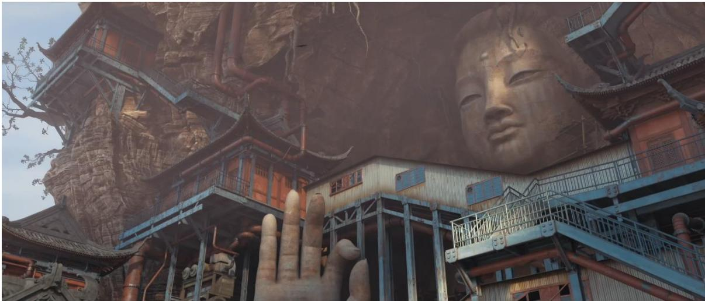

# 1. 论文基本信息
## 1.1. 标题
《中国当代动画电影的神话叙事研究》，核心主题是系统梳理1949年以来中国神话题材动画电影的叙事特征、演变逻辑与审美风格，论证神话思维与动画创作的适配性，为国产动画的民族化创作提供理论参考。
## 1.2. 作者与所属机构
作者为杨扬采艺，指导教师为青岛科技大学杨建华教授，所属学科为戏剧与影视学（专业代码130300），研究方向为电影学，是青岛科技大学2022届硕士学位论文。
## 1.3. 发表属性
该作品为硕士学位论文，未在学术期刊/会议公开发表，完成时间为2022年6月。
## 1.4. 摘要
本文从动画与神话的共通性切入，首先论证二者以想象性、虚拟性为核心的适配基础：神话作为民族文化的集体记忆，其自由、超现实的思维特征与动画的创作逻辑高度契合。论文首先梳理了中国当代动画神话叙事的源流，包括中国传统神话思维的特征、西方神话学理论的传入与影响、神话的现代性演变路径，以及动画作为神话当代载体的天然优势。其次以2000年为节点，将1949年以来的神话题材动画划分为两个发展阶段，从叙事策略（传统神话题材改写、神话世界观构建、英雄人物塑造、题旨隐喻）和叙事结构（伦理化主题、二元对立关系、大团圆结局）两个维度总结其演变规律。最后探讨神话叙事的审美特征，包括虚拟性带来的独特美感、视听语言对神话叙事的辅助作用、民族化符号的象征功能，以及从传统意境美到与后人类美学融合的多元化审美趋势。论文最终为中国动画电影强化文化原型表达、提升民族审美属性提供了可参考的创作路径。
## 1.5. 原文链接
原文为用户上传的硕士论文文档，发布状态为已完成的学位论文。

# 2. 整体概括
## 2.1. 研究背景与动机
### 2.1.1. 核心问题
2015年《西游记之大圣归来》掀起“国漫崛起”浪潮后，《哪吒之魔童降世》《姜子牙》《新神榜》系列等神话题材动画接连成为市场爆款，但相关研究仍存在明显空白：过往研究要么集中于动画史的梳理、“中国学派”的美学分析，要么仅从角色设计、元素运用的单一角度讨论神话改编，缺乏以完整的神话学理论框架对中国当代动画神话叙事的系统性研究。同时国产动画长期被诟病“叙事能力弱”，如何从传统神话中汲取叙事养分、结合当代价值观进行创造性转化，是行业亟待解决的现实问题。
### 2.1.2. 问题的重要性
动画是文化输出的重要载体，神话题材是中国动画最具民族辨识度的创作方向，其背后承载着中华民族的集体无意识与文化记忆，研究神话叙事不仅能提升国产动画的创作水平，也能助力中国文化的当代传播与跨文化输出。
### 2.1.3. 研究切入点
论文以神话学为核心理论工具，结合叙事学、原型批评等方法，打通“神话思维-动画创作”的关联脉络，从源流、叙事特征、审美特征三个层面搭建完整的分析框架，覆盖1949年以来所有代表性的神话题材动画作品。
## 2.2. 核心贡献与主要发现
1.  **理论层面**：首次系统论证了神话思维与动画思维的高度适配性，明确了动画是神话思维在当代社会的延伸载体，为神话与动画的跨学科研究提供了理论基础。
2.  **历史梳理层面**：以2000年为节点将中国当代神话题材动画划分为两个阶段，明确了两个阶段在题材选择、改编方式、审美风格上的核心差异，梳理了神话题材动画从“美术片属性”到“产业化属性”的演变逻辑。
3.  **创作层面**：总结了中国当代动画神话叙事的通用策略与结构范式，包括传统神话的当代化改写方法、世界观构建路径、英雄人物塑造模型、隐喻表达技巧，以及符合中国观众审美习惯的叙事结构，为行业创作提供了可落地的参考。
4.  **审美层面**：提出中国动画的审美正在从单一的传统意境美，向“传统审美+后人类美学”融合的多元化方向演变，验证了民族文化符号与赛博朋克、废土等当代流行风格结合的可行性。

# 3. 预备知识与相关工作
## 3.1. 基础概念
为帮助初学者理解，本部分对论文涉及的核心专业术语进行解释：
### 3.1.1. 神话相关核心概念
1.  <strong>神话思维（Mythic Thinking）</strong>：是原始人类认知世界的思维方式，区别于科学的理性逻辑，以想象、虚构、隐喻为核心特征，认为万物有灵，不受客观物理规则限制，具有自由性、跨时空性、超现实性的特点。
2.  <strong>神话叙事（Mythological Narrative）</strong>：以神话思维为基础的叙事方式，通常包含独特的世界观、神/英雄角色、超自然情节，承载着民族的集体记忆与普世伦理价值观。
3.  <strong>集体无意识（Collective Unconscious）</strong>：心理学家荣格提出的概念，指人类族群通过世代遗传保留下来的共同心理经验，不是个人后天习得的，比如中国观众对哪吒、孙悟空的形象天然具有亲切感，就是集体无意识的体现。
4.  <strong>神话素（Mytheme）</strong>：结构主义神话学创始人列维·斯特劳斯提出的概念，是构成神话的最小意义单位，不同的神话素按照二元对立的规则组合，形成神话的深层意义。
5.  <strong>新神话主义（New Mythicism）</strong>：20世纪末兴起的文化潮流，以电子技术为基础，以传统神话为蓝本，融合幻想性与商业属性，是当代大众文化的重要组成部分，代表作品包括《魔戒》《哈利波特》《阿凡达》等，中国当代神话题材动画也属于这一潮流的分支。
### 3.1.2. 核心理论工具
1.  <strong>万物有灵论（Animism）</strong>：人类学家爱德华·泰勒提出的理论，认为原始人类认为所有自然事物都具有灵魂和情感，会将人的性格、情绪投射到动物、植物、自然现象上，这是神话诞生的思维基础。
2.  <strong>英雄之旅（Hero's Journey）</strong>：神话学家约瑟夫·坎贝尔通过梳理全球各民族神话总结出的通用叙事模型，认为所有神话的英雄成长都遵循“启程-启蒙-归来”的核心逻辑，后被好莱坞简化为12个步骤，是商业电影最常用的叙事框架之一。
3.  **卡西尔神话结构三要素**：哲学家恩斯特·卡西尔提出，神话世界观由空间、时间、数三个核心要素构成：神话空间具有神圣/世俗的分野，神话时间具有“远古神圣性”，数则是神话中特殊的意义载体。
### 3.1.3. 动画相关概念
1.  <strong>动画思维（Animation Thinking）</strong>：动画创作的核心思维方式，以虚构、想象为基础，不受现实物理规则限制，可以自由实现跨时空、超现实的内容表达，与神话思维高度契合。
2.  <strong>中国学派（Chinese Animation School）</strong>：指20世纪50-80年代以上海美术电影制片厂为核心的中国动画创作流派，作品融合水墨画、剪纸、木偶等中国传统艺术形式，具有独特的东方美学风格，代表作品包括《大闹天宫》《哪吒闹海》《山水情》等。
3.  <strong>赛博朋克（Cyberpunk）</strong>：科幻文化的子类型，核心特征是“高科技，低生活”，通常设定在科技高度发达但社会秩序混乱的未来，常见元素包括人工智能、机械肢体、霓虹灯光、巨型垄断企业，具有反乌托邦的色彩。
4.  <strong>废土风格（Wasteland Aesthetic）</strong>：科幻文化的子类型，通常设定在末日灾难之后的世界，以荒凉破败的废墟、资源匮乏的生存环境为核心视觉特征，探讨极端环境下的人性。
## 3.2. 前人工作与技术演进
### 3.2.1. 中国动画研究脉络
中国动画研究主要分为三个方向：
1.  **动画史研究**：以张慧临《20世纪中国动画艺术史》、颜慧《中国动画电影史》等为代表，主要梳理中国动画的发展历程，重点集中于“中国学派”的辉煌时期。
2.  **民族性与美学研究**：以李朝阳《中国动画的民族性研究》、佟婷《动画美学概论》等为代表，探讨中国传统文化在动画中的表达策略，以及动画的审美特征。
3.  **神话与动画结合的研究**：现有研究大多集中于单一角度，比如毛红芳《中国古代神话与现代动画研究》探讨神话与动画的文化互通性，赵洋《神性重建与传统回归：当下神话题材类国产动画的叙事策略》分析了新神话主义背景下的改编特征，但这类研究数量较少，且缺乏系统性的整体梳理。
### 3.2.2. 神话题材动画的技术演进脉络
中国神话题材动画的发展分为三个阶段：
1.  **1949-2000年：中国学派时期**：动画被称为“美术片”，以艺术表达为核心，神话题材广泛，改编方式以忠实于原著为主，审美上追求极致的东方美学，说教性较强。
2.  **2000-2015年：产业化转型期**：国家取消动画统购包销政策，推动动画产业化发展，神话题材动画开始学习美日的商业创作模式，但整体质量参差不齐，缺乏代表性爆款。
3.  **2015年至今：国漫崛起期**：《大圣归来》后神话题材动画成为市场主流，改编方式趋向颠覆性、当代化，审美风格多元化，开始探索传统与流行文化的融合路径。
## 3.3. 差异化分析
与过往研究相比，本文的核心创新点在于：
1.  首次以完整的神话学理论框架对中国当代动画的神话叙事进行系统性研究，打通了神话思维与动画创作的关联脉络，填补了研究空白。
2.  覆盖了1949年至今所有代表性的神话题材动画作品，清晰划分了两个发展阶段的特征差异，梳理了完整的演变逻辑。
3.  不仅停留在理论分析，还总结了可落地的创作策略，对行业实践具有直接的参考价值。

# 4. 方法论
本文采用“理论基础搭建-研究对象划分-叙事特征分析-审美特征分析”的逻辑框架，综合运用多种人文社科研究方法，具体如下：
## 4.1. 方法原理
核心思想是基于神话与动画的共通性，用神话学的理论工具拆解动画的叙事与审美特征，验证神话思维对当代动画创作的适配性与借鉴价值。其背后的直觉是：神话是经过数千年时间检验的成熟叙事范本，且承载着民族的集体无意识，从神话中提炼叙事规律可以有效降低动画的叙事门槛，提升观众的文化认同感。
## 4.2. 研究流程与核心方法详解
### 4.2.1. 第一步：理论基础搭建（适配性论证）
首先从四个维度论证神话与动画的适配性，为后续分析提供理论依据：
1.  **中国传统神话思维梳理**：中国神话思维具有“大地的神思”的特征，与地理环境、自然崇拜深度绑定，叙事上具有伦理化主题、虚实结合的背景、大团圆结局的特征，这些特征深刻影响了中国文艺创作的叙事逻辑。
2.  **西方神话学理论引入**：梳理泰勒的万物有灵论、列维·斯特劳斯的结构主义神话学（二元对立、神话素）、卡西尔的神话结构三要素、坎贝尔的英雄之旅模型等核心理论，作为后续分析的工具。
3.  **神话的现代性演变**：明确神话不是远古的陈旧内容，而是可以随时代演变的文化载体，广义神话、新神话主义的兴起为神话与当代大众文化的结合提供了理论支撑。
4.  **动画与神话的共通性论证**：从产生、思维特征、叙事特征、审美特征、社会功能五个维度对比二者的异同，如下表所示：

    | | 产生 | 思维特征 | 叙事特征 | 审美特征 | 社会功能 |
    | --- | --- | --- | --- | --- | --- |
    | 神话 | 以“相信”为前提的虚构和幻想 | 自由性、跨时空性、超现实性、虚拟性 | 独特的世界观、神/英雄人物、虚构的情节、普世的伦理道德观念 | 幻想的美感、伦理道德的美感 | 原始部落：巩固统治、凝聚向心力、营造心理期望、探索世界 |
    | 动画 | 以自然科学为前提、以创作为目的的虚构和幻想 | 自由性、跨时空性、超现实性、虚拟性 | 独特的世界观、神/英雄人物、虚构的情节、普世的伦理道德观念 | 幻想的美感、伦理道德的美感、形式的美感 | 现代社会：审美功能、宣扬正能量、传输价值观 |

可以看出，二者在思维、叙事、审美层面高度契合，仅在产生前提、社会功能的具体表现上存在差异，因此动画是神话在当代最适合的载体。
### 4.2.2. 第二步：研究对象划分
将研究对象限定为1949年新中国成立以来的神话题材动画影片，不限制时长（覆盖早期动画短片），并以2000年为节点划分为两个阶段，划分依据包括：
1.  **政策背景**：1995年国家取消动画统购包销政策，2004年出台动画产业扶持政策，2000年是产业化转型的关键时间节点。
2.  **叙事特征差异**：
    - 1949-2000年：神话题材选择广泛，改编以忠实搬演为主，审美追求传统美术风格，说教性较强。
    - 2000-2021年：神话题材集中于孙悟空、哪吒等头部IP，改编以颠覆性、当代化为主，审美风格多元化，注重商业性与个人表达。
### 4.2.3. 第三步：叙事特征分析
#### 4.2.3.1. 叙事策略分析
从四个维度总结神话叙事的通用策略：
1.  **传统神话题材的改写**：
    - 1949-2000年：以忠实改编为主，仅对原著的价值观进行微调，基本保留原著的情节与人物设定，比如1979年《哪吒闹海》基本沿用《封神演义》的故事框架。
    - 2000年后：改写幅度逐渐加大，分为两种路径：
      - 小范围改编：保留神话的时代背景与核心设定，对人物性格、次要情节进行调整，比如《哪吒之魔童降世》将哪吒从灵珠子改为魔丸，将李靖从严父改为慈父，添加太乙真人、结界兽等喜剧角色。
      - 颠覆性改编：完全改变神话的时空背景，仅保留核心角色的精神内核，比如《新神榜：哪吒重生》将故事设定在赛博朋克风格的未来城市，《白蛇2：青蛇劫起》将故事放入架空的“修罗城”异世界。
2.  **神话世界观构建**：
    基于卡西尔的神话结构三要素，中国传统神话世界观具有固定的规则：空间上分为天上、人间、地下三界，时间上遵循“天上一天，地上一年”的规则，数的概念体现为对“三”“九”等数字的特殊崇拜。当代动画在传统世界观的基础上进行创新，比如《白蛇2：青蛇劫起》构建的“修罗城”世界观，具有独立的空间规则（混杂不同时代的人与妖）、时间规则（黑风洞“洞中一天，洞外二十年”）、生存规则（风、火、水、气四劫），形成了完整的原创神话体系。
3.  **英雄人物的塑造**：
    普遍采用坎贝尔的“英雄之旅”模型，同时将传统神话中“高大全”的神进行“人化”改造，赋予其普通人的缺陷与情感，比如哪吒的叛逆、姜子牙的执拗、太乙真人的贪酒等，让观众更容易产生共情。以《新神榜：哪吒重生》为例，其情节完全符合英雄之旅的步骤：
    - 正常世界：李云祥作为普通机车手生活在东海市
    - 冒险召唤：与敖丙发生冲突，发现自己具有控火能力
    - 拒绝召唤：一开始不愿意承认自己是哪吒转世
    - 导师：孙悟空出现，指导他提升能力
    - 第一道边界：击败夜叉，正式与龙族对立
    - 考验/伙伴/敌人：与喀莎、苏医生成为伙伴，与彩云、敖丙为敌
    - 磨难：父亲被杀，喀莎受伤，跌入人生低谷
    - 报酬：逐渐掌握哪吒元神的力量
    - 复活：与东海龙王决战时战死，与哪吒元神达成和解后重生
    - 携万能药回归：击败龙族，拯救东海市居民
      约瑟夫·坎贝尔与克里斯托弗·沃格勒的两个版本英雄之旅模型如下图所示：

      
      *图3-1：约瑟夫·坎贝尔《千面英雄》中的“英雄之旅”模型*

      
      *图3-2：克里斯托弗·沃格勒简化后的“英雄之旅”模型*

4.  **题旨的隐喻**：
    神话叙事通常不会直接表达主题，而是通过隐喻传递价值观：
    - 1949-2000年：隐喻主要为革命宣传与道德说教，比如《铁扇公主》隐喻抗日战争中全民反抗的精神，《人参娃娃》隐喻对压迫阶级的反抗。
    - 2000年后：隐喻转向当代价值观，比如《哪吒之魔童降世》“我命由我不由天”隐喻对个人价值的认同，《新神榜：哪吒重生》隐喻人的主体性高于神性，《白蛇2：青蛇劫起》隐喻女性独立意识的觉醒。
#### 4.2.3.2. 叙事结构分析
中国动画的神话叙事具有三个稳定的结构特征，符合中国观众的文化心理与审美习惯：
1.  **伦理化的主题**：
    传统神话叙事以忠孝礼义等传统伦理为核心，当代动画在保留伦理内核的基础上，融合了当代价值观：比如《哪吒之魔童降世》仍然保留了父慈子孝的传统伦理，同时加入了个人价值实现的当代主题；《姜子牙》在传统“忠”的伦理基础上，加入了对个体生命价值的思考。
2.  **二元对立的冲突结构**：
    基于列维·斯特劳斯的结构主义神话学理论，神话的核心意义由二元对立关系构成：
    - 1949-2000年：对立关系是静态、非黑即白的，比如善/恶、人/神、统治阶级/被统治阶级的对立，反派角色天生邪恶，没有转变的空间。
    - 2000年后：对立关系转向动态、多元，比如《哪吒之魔童降世》中哪吒和敖丙的善恶身份会随情节转变，《小门神》探讨人/神的依存关系而非绝对对立，《姜子牙》质疑神权的合理性，打破了传统神话中“神绝对正义”的设定。
3.  **大团圆结局**：
    大团圆结局是中国叙事的传统特征，主要基于三个原因：一是符合“善有善报恶有恶报”的伦理期待，二是符合中国“天人合一”“和谐共生”的传统哲学，三是承载了“神性回归”“秩序重建”的神话母题。即使是《哪吒闹海》中哪吒自刎的悲剧情节，最终也会以莲花重生、击败龙王的大团圆收尾，符合观众的心理期待。
### 4.2.4. 第四步：审美特征分析
从四个维度总结神话叙事的审美特征：
1.  **虚拟与虚构的美感**：神话与动画都以虚构为核心特征，二者的结合可以创造出现实中不存在的奇幻世界，带来独特的审美体验，比如《大闹天宫》的凌霄宝殿、《青蛇劫起》的修罗城等虚构场景。
2.  **视听语言的审美与叙事功能**：
    - 画面层面：景别上从早期的全景为主转向近景、特写增多，契合当代注重个人情感表达的趋势；色彩上用红色塑造英雄角色、白色塑造高阶神祇，强化角色认知；构图上借鉴中国传统绘画的对称构图、留白、散点透视，营造东方意境美。
    - 声音层面：采用民族乐器（二胡、琵琶、竹笛、京剧鼓点）烘托神话氛围，用特定的角色主题音乐强化人物形象，用蒙太奇音乐简化叙事、交代背景。
3.  **民族化符号的象征功能**：
    民族化符号是集体无意识的载体，可以快速唤起观众的文化认同：
    - 环境符号：包括自然环境中的祥云、仙鹤、松柏，建筑中的飞檐、角楼、宝塔，民俗中的年画、孔明灯、鞭炮等，比如《小门神》中大量运用门神贴画、传统木质建筑、孔明灯等符号，营造出浓厚的传统节日氛围。

      
      *图4-7：《小门神》的门神贴画与传统木质建筑*

    - 角色符号：借鉴戏曲脸谱、敦煌壁画、《山海经》等传统文化资源设计角色，比如《大闹天宫》的玉皇大帝造型借鉴京剧脸谱，《九色鹿》的造型借鉴敦煌壁画，《西游记之大圣归来》的反派混沌原型来自《山海经》的帝江。
4.  **从传统意境美到多元化审美**：
    - 传统审美：继承中国美学“气韵生动”“意境美”的追求，比如水墨动画的氤氲美感，《白蛇：缘起》中江南水乡的诗意氛围。
    - 多元化审美：近年来开始探索传统审美与后人类美学的融合，比如《新神榜：哪吒重生》将传统哪吒故事与赛博朋克风格结合，《白蛇2：青蛇劫起》将水墨风格与废土风格结合，形成了独特的新国风审美。

# 5. 研究设计
本文属于人文社科的影视研究，采用定性研究方法，研究设计如下：
## 5.1. 研究对象（样本选择）
研究样本为1949年至今所有具有代表性的中国神话题材动画电影，覆盖两个阶段的核心作品，具体片单如下：
### 5.1.1. 1949-2000年神话题材动画影片

| 时间 | 片名 | 导演 | 题材 | 形式 |
| --- | --- | --- | --- | --- |
| 1955 | 神笔马良 | 靳夕、尤磊 | 神话传说 | 木偶 |
| 1958 | 火焰山 | 靳夕、尤磊 | 文学改编 | 木偶 |
| 1958 | 猪八戒吃西瓜 | 万古蟾、陈正鸿 | 文学改编 | 剪纸 |
| 1959 | 一幅僮锦 | 王树忱、钱运达 | 少数民族传说 | 水墨 |
| 1959 | 渔童 | 万古蟾 | 神话传说 | 剪纸 |
| 1961 | 大闹天宫 | 万籁鸣、唐澄 | 文学改编 | 动画 |
| 1961 | 人参娃娃 | 万古蟾 | 神话传说 | 剪纸 |
| 1963 | 金色的海螺 | 万古蟾、钱运达 | 创作 | 剪纸 |
| 1963 | 孔雀公主 | 靳夕 | 少数民族传说 | 木偶 |
| 1979 | 哪吒闹海 | 王树忱、严定宪、徐景达 | 文学改编 | 动画 |
| 1981 | 九色鹿 | 钱家骏、戴铁郎 | 壁画改编 | 动画 |
| 1981 | 人参果 | 严定宪 | 文学改编 | 动画 |
| 1981 | 崂山道士 | 虞哲光 | 文学改编 | 木偶 |
| 1983 | 天书奇谭 | 王树忱、钱运达 | 文学改编 | 动画 |
| 1984 | 西岳奇童 | 靳夕、刘蕙仪 | 神话传说 | 木偶 |
| 1985 | 女娲补天 | 钱运达 | 神话传说 | 动画 |
| 1985 | 金猴降妖 | 特伟、严定宪、林文肖 | 文学改编 | 动画 |
| 1999 | 宝莲灯 | 常光希 | 神话传说 | 动画 |

### 5.1.2. 2000-2021年神话题材动画影片

| 时间 | 片名 | 导演 | 题材 | 形式 |
| --- | --- | --- | --- | --- |
| 2006 | 西岳奇童 | 胡兆洪 | 神话传说 | 木偶 |
| 2015 | 西游记之大圣归来 | 田晓鹏 | 文学改编 | 动画 |
| 2016 | 小门神 | 王微 | 神话传说 | 动画 |
| 2016 | 大鱼海棠 | 梁旋、张春 | 创作 | 动画 |
| 2019 | 白蛇：缘起 | 黄家康、赵霁 | 神话传说 | 动画 |
| 2019 | 哪吒之魔童降世 | 饺子 | 神话传说 | 动画 |
| 2020 | 姜子牙 | 程腾、李炜 | 神话传说 | 动画 |
| 2021 | 新神榜：哪吒重生 | 赵霁 | 神话传说 | 动画 |
| 2021 | 白蛇2：青蛇劫起 | 黄家康 | 神话传说 | 动画 |
| 2021 | 西游记之再世妖王 | 王云飞 | 文学改编 | 动画 |

样本选择的合理性：覆盖了不同时期、不同形式、不同改编路径的所有代表性作品，能够完整反映中国当代神话题材动画的发展全貌。
## 5.2. 研究方法
本文综合运用以下五种研究方法：
1.  **文本分析法**：对每部动画的叙事内容、画面、声音进行系统拆解，提取其中的神话叙事元素。
2.  **个案分析法**：选取典型影片（如新旧两版哪吒、《青蛇劫起》等）进行深入分析，验证理论框架的适用性。
3.  **对比研究法**：对比2000年前后两个阶段的叙事与审美差异，对比传统神话文本与动画改编的差异，总结演变规律。
4.  **神话原型批评法**：运用荣格的集体无意识、坎贝尔的英雄之旅等理论，分析叙事结构背后的文化原型。
5.  **叙事学方法**：从叙事策略、叙事结构两个维度，总结神话叙事的通用范式。
## 5.3. 分析基线
对比基线包括三类：一是传统神话的原始文本（如《山海经》《封神演义》《西游记》等），二是1949-2000年中国学派的神话题材动画作品，三是国外神话题材动画的创作路径（如迪士尼的神话改编模式）。

# 6. 研究结果与分析
## 6.1. 核心结果分析
通过对样本的系统分析，得出四个核心结论：
### 6.1.1. 神话与动画具有高度适配性
神话思维与动画思维在核心特征上高度契合，动画是神话在当代最适合的载体，神话题材是中国动画最具竞争优势的创作方向：一方面传统神话经过数千年的检验，叙事结构成熟，且承载着民族的集体无意识，可以降低观众的接受门槛；另一方面动画的虚拟性特征可以完美呈现神话中的超现实内容，二者的结合可以实现“1+1>2”的效果。
### 6.1.2. 两个阶段的特征差异显著
2000年前后两个阶段的神话题材动画在创作逻辑上存在本质差异，如下表所示：

| 维度 | 1949-2000年 | 2000年至今 |
| --- | --- | --- |
| 产业属性 | 事业化的“美术片”，以艺术表达、教育功能为核心 | 产业化的商业电影，以市场回报、个人表达为核心 |
| 题材选择 | 范围广泛，覆盖远古神话、民间传说、少数民族故事、壁画改编等 | 集中于孙悟空、哪吒、白蛇等头部IP，冷门神话挖掘不足 |
| 改编方式 | 忠实于原著，仅做小幅度价值观调整 | 颠覆性改编为主，注重传统神话的当代化转译 |
| 角色塑造 | 神性为主，角色高大全，非黑即白 | 人性为主，赋予神普通人的缺陷与情感，角色立体多元 |
| 审美风格 | 单一的传统东方美学，追求极致的“美” | 多元化审美，传统意境美与赛博朋克、废土等流行风格融合 |
| 主题表达 | 以传统伦理说教为主，集体价值优先 | 以当代价值观为主，个人价值与集体价值结合 |

二者的差异本质上是中国动画从事业属性向产业属性转型的体现，也是神话叙事随时代发展的必然结果。
### 6.1.3. 神话叙事的通用范式已经形成
当代中国动画已经形成了成熟的神话叙事范式：
- 叙事策略层面：以“传统神话核心设定+当代价值观改造+英雄之旅框架+当代隐喻”为通用路径，比如《哪吒之魔童降世》保留了哪吒闹海的核心设定，融入“自我认同”的当代主题，采用英雄之旅的叙事框架，隐喻当代年轻人对抗命运的精神，获得了市场与口碑的双赢。
- 叙事结构层面：“伦理化主题+动态二元对立+大团圆结局”的结构稳定有效，既符合中国观众的文化心理，也能承载当代价值观的表达。
### 6.1.4. 多元化审美是未来发展趋势
传统意境美与当代流行风格的融合已经得到了市场的验证，比如《新神榜：哪吒重生》将赛博朋克风格与传统神话结合，虽然剧情存在争议，但审美风格获得了观众的广泛认可；《白蛇2：青蛇劫起》中水墨风格的黑风洞场景也成为了影片的亮点。新旧哪吒形象的对比如下图所示，体现了审美风格的演变：

*图4-1：《哪吒闹海》中的哪吒形象与《新神榜：哪吒重生》中的哪吒形象对比*

## 6.2. 典型案例验证
### 6.2.1. 神话世界观构建案例：《白蛇2：青蛇劫起》的修罗城
修罗城是完全原创的神话世界观，融合了传统佛教“修罗场”的概念与当代废土、赛博朋克风格，具有独立的空间、时间、生存规则，既符合神话世界观的构建逻辑，又具有当代审美特征，是传统神话当代化改造的成功案例。其中黑风洞的水墨风格场景如下图所示：

*图4-16：《白蛇2：青蛇劫起》“黑风洞”中水墨风格的表现形式*

### 6.2.2. 审美融合案例：《新神榜：哪吒重生》的赛博朋克风格
影片将传统哪吒故事放在未来赛博朋克城市中，东海龙宫变为机械水母宫殿，敖丙的龙筋变为机械义肢，同时保留了元神、因果报应等传统神话内核，还融入了民国上海、佛教石像等民族符号，实现了传统与流行的完美融合，相关场景如下图所示：

*图4-12：《新神榜：哪吒重生》中的机械宫殿*

*图4-13：《新神榜：哪吒重生》中敖丙的钢铁龙筋*

*图4-14：《新神榜：哪吒重生》中的巨石佛像*

## 6.3. 组成部分有效性分析
通过对不同作品的对比，验证了神话叙事各组成部分的作用：
1.  **英雄之旅模型**：采用该模型的作品叙事普遍更流畅，更容易获得观众的共情，比如《哪吒之魔童降世》《新神榜：哪吒重生》的叙事节奏明显优于未采用该模型的作品。
2.  **民族化符号**：合理运用民族化符号的作品更容易唤起观众的文化认同，比如《小门神》的门神符号、《白蛇：缘起》的江南水乡符号，都有效提升了观众的代入感。
3.  **大团圆结局**：即使是偏向悲剧的故事，采用大团圆结局的作品市场接受度普遍更高，符合中国观众的审美习惯。

# 7. 总结与思考
## 7.1. 结论总结
本文系统梳理了1949年以来中国当代动画电影的神话叙事的源流、特征与审美演变，核心结论包括：
1.  神话思维与动画思维具有高度适配性，动画是神话思维在当代社会的延伸载体，神话题材是中国动画最具民族辨识度与市场竞争力的创作方向。
2.  中国当代神话题材动画以2000年为节点，分为事业化“美术片”与产业化商业电影两个阶段，二者在题材选择、改编方式、审美风格、主题表达上存在显著差异，本质是动画产业转型与神话叙事当代化的共同结果。
3.  当代中国动画已经形成了成熟的神话叙事范式：叙事策略上以传统神话的当代化改写、原创世界观构建、“人化”英雄塑造、当代隐喻为核心；叙事结构上遵循“伦理化主题+动态二元对立+大团圆结局”的稳定结构；审美上形成了传统意境美与后人类美学融合的多元化趋势。
4.  神话叙事对国产动画创作具有重要的借鉴价值，合理运用神话原型、民族符号可以有效提升动画的叙事水平与文化认同感，为国产动画的民族化发展提供了可行路径。
## 7.2. 局限性与未来工作
### 7.2.1. 论文自身的局限性
1.  **研究对象覆盖不足**：样本主要选择了院线公映、具有较高市场关注度的作品，对小众的、网络发行的神话题材动画、少数民族神话题材动画覆盖不足，结论的普适性存在一定局限。
2.  **中外对比不足**：缺乏与迪士尼、吉卜力等国外成熟的神话题材动画创作路径的系统对比，对中国神话叙事的跨文化传播问题探讨不足。
3.  **量化分析缺失**：作为定性研究，没有对观众的接受度、文化认同感进行量化调研，结论主要基于文本分析与行业经验。
### 7.2.2. 未来研究方向
1.  拓展研究对象，覆盖更多小众、网络、少数民族神话题材动画，完善研究体系。
2.  开展中外神话改编的对比研究，探索中国神话叙事的跨文化传播路径，助力中国动画“走出去”。
3.  结合受众调研，量化分析不同叙事策略、审美风格对观众接受度的影响，为创作提供更精准的参考。
4.  结合AI动画、元宇宙等新技术，探讨神话叙事在新媒介形态下的创新表达。
## 7.3. 个人启发与批判
### 7.3.1. 研究价值与启发
1.  打破了“改编传统神话是吃老本”的刻板认知：传统神话不是陈旧的文化资源，而是可以随时代不断演变的“活的文化”，创造性转化不是“魔改”，而是在保留精神内核的基础上融入当代价值观，比如哪吒“我命由我不由天”的主题，既保留了传统神话中反叛的精神内核，又契合了当代年轻人的精神需求，是非常成功的改编案例。
2.  民族化不是复古：传统文化的当代表达不需要完全复刻传统形式，传统审美可以与当代流行文化融合，比如赛博朋克、废土等风格并非西方专属，只要融入民族文化内核，完全可以形成具有中国特色的新国风审美。
3.  研究方法的可迁移性：本文的神话叙事分析框架可以迁移到真人奇幻电影、电视剧、游戏、剧本杀等其他文化产品的研究中，比如游戏《原神》对中国神话元素的运用、电视剧《三体》中的神话叙事特征，都可以用类似的框架分析。
### 7.3.2. 行业现存问题与改进方向
1.  **IP同质化严重**：当前改编过于集中在孙悟空、哪吒、白蛇等少数头部IP，容易造成观众审美疲劳，未来应当加大对《山海经》、少数民族神话等冷门资源的挖掘，丰富神话题材的多样性。
2.  **改编度平衡问题**：部分作品为了追求创新过度“魔改”，丢掉了传统神话的精神内核，比如有些改编将哪吒塑造为完全的“恶人”，违背了传统神话中哪吒反抗压迫的精神内核，如何平衡创新与文化内核的保留是未来需要注意的问题。
3.  **叙事优先级问题**：部分作品过度追求视觉特效与风格创新，忽略了叙事逻辑的合理性，导致“画面美但剧情空洞”，未来应当重视叙事能力的提升，将神话叙事的优势真正发挥出来。
    总体而言，本文为中国神话题材动画的研究提供了系统的理论框架，也为行业创作提供了切实的参考，随着国产动画产业的不断成熟，神话叙事必然会在未来产生更多优秀的作品，成为中国文化输出的重要载体。