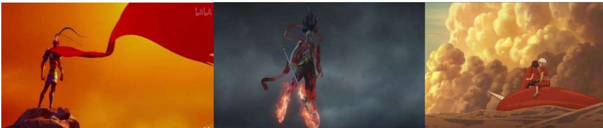
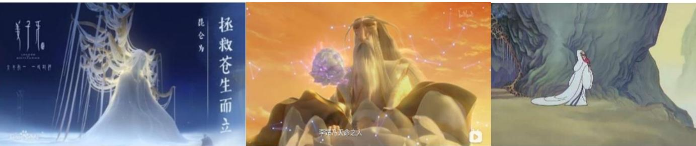
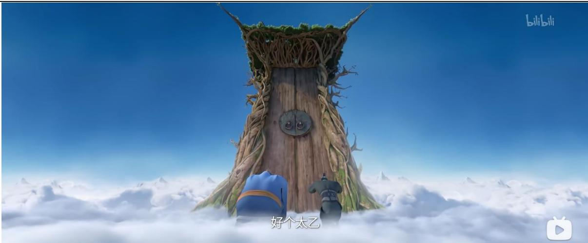
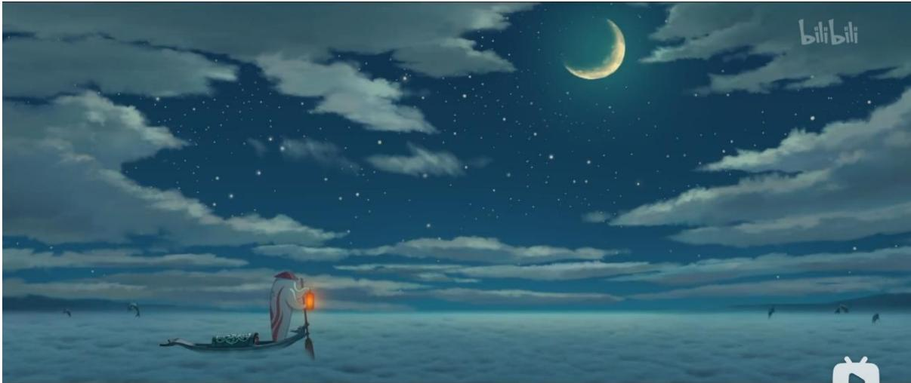
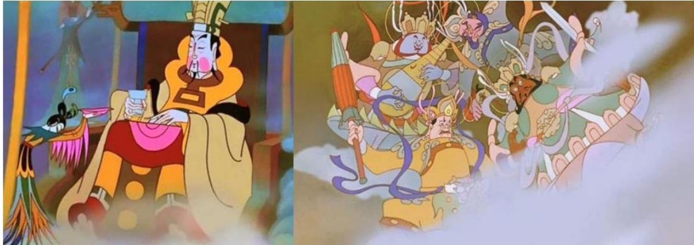
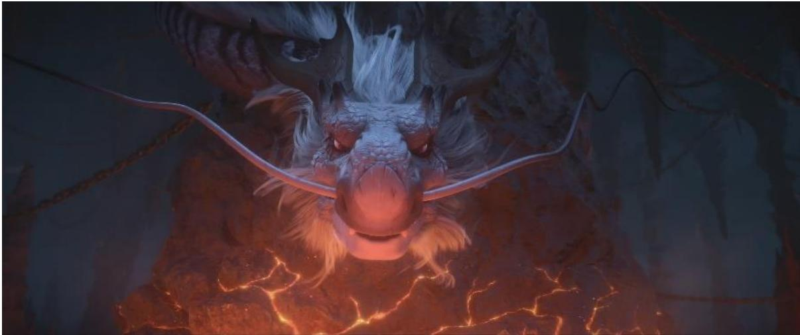
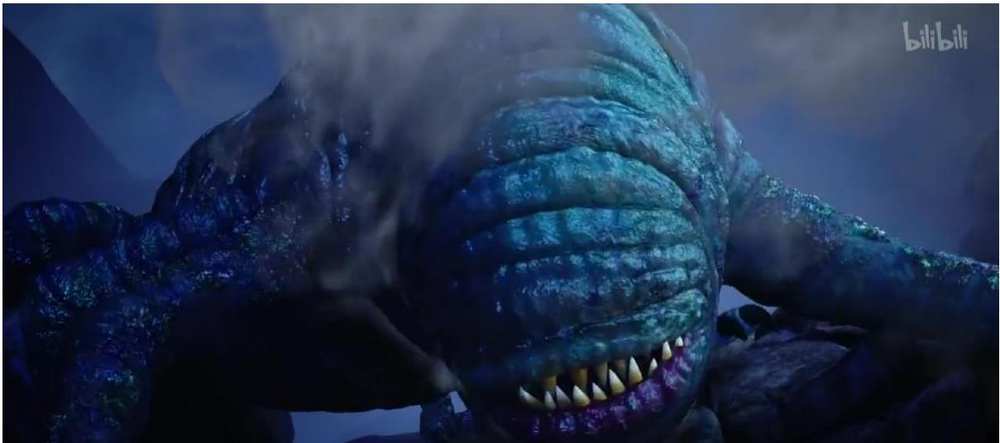
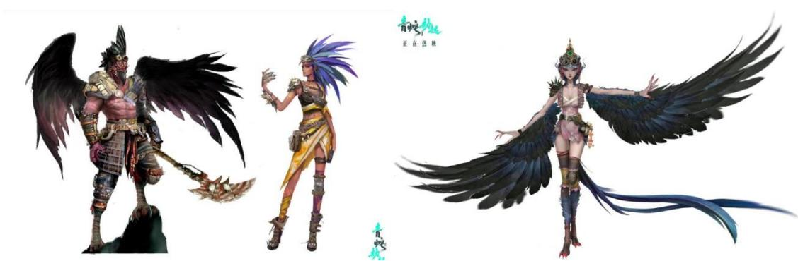
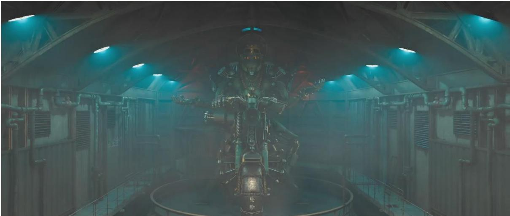

# 硕士学位论文

MASTER DEGREE THESIS中国当代动画电影的神话叙事研究

作者 杨扬采艺指导教师 杨建华教授学科专业 戏剧与影视学专业代码 130300研究方向 电影学

# 中国当代动画电影的神话叙事研究

2022年6月5日学位论文完成日期：

指导教师签字：答辩委员会成员签字：

3中W中

# 中国当代动画电影的神话叙事研究

# 摘要

世界各民族都有自己的神话。神话随民族发展时至今日，不仅作为民族的文化宝库、精神之源，也为其创造了情感与价值力量。中国神话发展至今，借助不同的文化和艺术形式展现，以其自由性和虚拟性的特征，构建了无数个动人心魄的奇幻故事。

动画电影作为当下最有表现力的艺术形式之一，兼具了摄影、美术、音乐、建筑、舞蹈、文学、电影等众多艺术门类的优势，以人的想象与幻想为依托，创造不受制于客观物理世界的视听影像艺术。本研究聚焦于动画电影，是因为其作为动画艺术的最高表现形式，不仅聚集了动画行业最优秀的人才与技术，还聚集了动画产业链投入与产出的核心价值，具有跨文化性的传播力与影响力。

本研究从动画与神话的关联性入手，探寻它们相似的叙事路径：以想象与幻想作为出发点、以自由性和虚拟性的特征作为叙事与审美的桥梁，使以往只存在于想象中的一切跨时空的、超自然的奇幻故事，以视听结合的形式“真实”地得以呈现。本文正是以此为基础，尝试对当代中国动画电影中的神话叙事内涵与形式特征进行浅要的分析与研究。

首先，确定动画电影以神话思维进行叙事的前提和合理性，阐述了神话思维与动画思维的相似之处。其次，意图从动画电影神话叙事的方法进行讨论，试图挖掘出当代中国动画电影在叙事层面对传统神话题材、神话世界观以及英雄人物的塑造规律和发展趋势。再次，从神话学的角度入手，同时结合中国文化的叙事传统，伦理化的叙事主题、二元对立的关系构成和大团圆结局构成了中国动画电影神话叙事的基本结构。最后，探讨了当代中国动画电影的美学特征，以中国美学对意境美一以贯之的追求为内核，电影语言的表意作用、民族符号的象征功能、虚拟与虚构带来的叙事美感，以及在新时代背景下产生的审美风格交融的新倾向，都是当代神话题材在中国动画电影中的审美特征。

本文力图在对中国当代动画电影的梳理与论述中，分析神话叙事的创作特点和审美流变，尝试对中国动画电影创作中强化文化原型和民族审美性方面做出一点探索。

关键词：中国动画 动画电影 神话 神话叙事 神话思维

# A STUDY OF MYTHOLOGICAL NARRATIVES

# IN CONTEMPORARY CHINESE ANIMATION FILMS

# ABSTRACT

All peoples of the world have their own myths. Myths have developed with the nation to this day, not only as a cultural treasure and spiritual source of the nation, but also as a source of creating emotional and value power for it. Chinese mythology has been developed and presented through different cultural and artistic forms, and with its freedom and virtual character, it has built countless moving and fantastical stories.

As one of the most expressive art forms nowadays, animation film combines the advantages of many art disciplines such as photography, art, music,architecture, dance, literature, and film, and is based on human imagination and fantasy to create an audio-visual art that is not constrained by the objective physical world. This study focuses on animation film because, as the highest expression of animation art, it not only gathers the most outstanding talents and technologies in the animation industry, but also gathers the core values of the input and output of the animation industry chain, and has cross-cultural communication power and influence.Starting from the correlation between animation and mythology, this study explores their similar narrative paths: taking imagination and fantasy as the starting point, using the characteristics of freedom and virtuality as the bridge between narrative and aesthetics, so that all the supernatural fantasy stories that used to exist only in the imagination can be presented "real" in the form of audio-visual combination. Based on this paper, we try to make a shallow analysis and research on the connotation and form of mythological narratives in contemporary Chinese animation films.

First of all, the premise and rationality of mythological narrative in animation films are determined, and the similarities between mythological thinking and animation thinking are explained. Secondly, we intend to discuss the methods of mythological narratives in animation films, and try to find out the rules and development trends of contemporary Chinese animation films in shaping traditional mythological themes，mythological worldviews and heroic characters at the narrative level. Again, starting from the perspective of mythology and combining with the narrative tradition of Chinese culture, the ethical narrative theme,the composition of dichotomous relationships and the happy ending constitute the basic structure of mythological narratives in Chinese animated films. Finally， the aesthetic characteristics of contemporary Chinese animation films are discussed. Taking the consistent pursuit ofcontextual beautyin Chinese aesthetics as the core, the ideational role offilm language, the symbolic function of national symbols, the narrative beauty brought by virtual and fictional, and the new tendency of intermingling aesthetic styles arising in the context of the new era are the aesthetic characteristics of contemporary mythological themes in Chinese animated films.

This paper seeks to analyze the creative characteristics and aesthetic flow of mythological narratives in the combing and exposition of contemporary Chinese animated films, and tries to make a little exploration on the strengthening of cultural archetypes and national aesthetics in the creation of Chinese animation films.

KEY WORDS: Chinese animation animation film mythology mythic narrative mythic thinking

# 目 录

# 1 绪论..

1.1研究现状综述．..  
1.2 选题的目的、意义和研究方法  
1.2.1选题的目的及意义！ 4  
1.2.2 研究方法... 6  
1.3概念界定... 7

# 2 中国当代动画电影的神话叙事源流.... 9

2.1中国传统神话思维. 9  
2.2西方神话学的传入与影响..  
2.3传统神话思维的演变与现代性 13  
2.4动画电影中的神话叙事溯源 16  
本章小结... 19

# 3 中国当代动画电影的神话叙事特征.... .20

3.1中国当代神话题材动画电影综述与其发展阶段的简要划分 20  
3.1.1 1949-2000 年间的神话题材动画电影， 21  
3.1.2 2000-2021年间的神话题材动画电影 23  
3.2 叙事策略．.. 26  
3.2.1传统神话题材的改写 26  
3.2.2神话世界观的构建 28  
3.2.3英雄人物的塑造 32  
3.2.4题旨的隐喻 36  
3.3叙事结构.. 38  
3.3.1伦理化的主题 38  
3.3.2二元对立 40  
3.3.3大团圆结局 42  
本章小结... 44

# 4 中国当代动画电影神话叙事的审美特征.... 45

4.1虚拟与虚构.. 45  
4.1.1神话的虚构性， 45  
4.1.2动画电影的虚构性 46  
4.1.3动画电影中神话叙事的虚构性呈现 47  
4.2视听语言与神话叙事 48  
4.2.1画面艺术形式． 48

# 目录

4.2.2声音艺术形式…. 53  
4.3 民族化符号与象征意味 55  
4.3.1环境造型中的民族化符号 55  
4.3.2角色造型中的民族化符号 58  
4.4从中国式审美到多元化审美 62  
4.4.1追求意境美的中国式审美风格 62  
4.4.2后人类美学与多元化审美表达 64  
本章小结.... 69  
结语.. 72  
参考文献．... .. 75  
致谢... .. 83  
攻读学位期间发表的学术论文目录... .. 85  
独创性声明..... .86  
关于论文使用授权的说明.... .. 86

# 1绪论

# 1.1研究现状综述

建国以来，国内对于中国动画电影的研究一直较为活跃，但多为对“中国学派”这辉煌一代的研究。后来，“中国学派”式微，中国动画陷入瓶颈期，学术界的研究则逐渐转入对中国动画困境问题的分析，探讨如何学习动画强国美国和日本的发展模式，重新找到适合中国动画电影的发展道路。近几年来，国产动画佳作不断，随着几部“爆款”动画电影的成功上映，国内学界又掀起了对中国动画电影的研究热潮。

从学术著作上看，对中国动画电影的研究多集中在动画史方面。较早对于中国动画的研究，主要集中在动画史的梳理和研究上：张慧临的《20世纪中国动画艺术史》(2002)、徐婧的《中国动画黄金 80 年》 (2005)等就属于这一类作品。本文在写作中参考了颜慧和索亚斌合编的《中国动画电影史》(2005)，该著作就中国动画电影的起步、发展和在各个时期的状况以及外来动画对国产动画的冲击等作了详细的论述；鲍济贵主编的《中国动画电影通史》 (2010)主要以时间为纲介绍了中国动画各个历史时期的发展；时间较近的孙立军的《中国动画史研究》 (2011)，也是以梳理中国动画电影的历史和发展历程为主的著作。而在最近几年以中国动画为研究主体的著作当中，研究方向越来越从动画电影史到现象、策略方向倾斜：李朝阳的《中国动画的民族性研究》 (2011)从探讨中国传统文化在动画影视剧中的表达策略问题入手，以当下中国动画的尴尬局面逐步分析探索，结合个例，提出了针对目前中国动画窘境的解决策略；佟婷的《动画美学概论》（2015）从美学的角度分析了动画电影的审美特征、审美元素、审美表现形式、审美价值等方面，对本文的研究和写作提供了较大帮助；陆方的《动画电影符号学》（2017）通过对优秀动画作品进行了动画要素和表现形式方面的分析，揭示了动画电影外显与内在的关联，厘清了动画作品在创作与表达中的意义与内涵；刘斌的《中国动画成人化现象研究》(2018)则从现象出发，以研究影像背后的产业为主要内容，针对以成人为主要受众的动画及产业进行了整体论述。

此外，国内以中国动画电影为研究对象的博士论文数量不多，且大多数是对中国动画发展史整体性的梳理和分析。2006年，华东师范大学肖路的博士论文《国产动画电影的传统美学风格及其文化探源》，从动画电影的传统美学特征入手，探讨了其生发的艺术和文化土壤，从而阐明了中国动画电影的艺术风格，以及美学风格的演进。2012年3月，上海师范大学林清的博士论文《论中国动画电影》，借助儿童文学、中国传统戏曲和电影叙事学理论，分析了中国动画电影讲故事的艺术及其成因。同年 10 月，浙江大学邵杨的《国产动画的文化传统重构》则围绕当代中国动画产业化发展和艺术风格形成过程中创意贫瘠、内涵空洞、主体性缺失、理论储备空白等诸多问题，解读国产动画固有的弊病和亟待解决的困境，进而评估动画对于本土文化输出和本土文化再生的意义与价值。2013年，复旦大学王灵丽的《中美动画电影叙事比较研究》从动画电影的母题、结构、角色、技术等方面对比了中美两国在动画电影叙事方面的差异。2017年武汉理工大学的耿帅在论文《媒介融合时代的中国动画受众心理转化研究》中，从作为影像接受者的受众的心理层面入手，探索在媒介融合的背景下，中国动画发展过程中以受众需求为主的转变。

硕士论文中对当代中国动画电影的研究较为丰富，且研究方向广泛：耿婷婷的《动画艺术的原型意味研究》（2010）以原型理论为工具探讨中国动画电影，而原型理论正是从集体无意识的角度出发的，集体无意识是经过长远的历史文化积淀形成的特定民族记忆，而这样源远流长的远古记忆正与神话学息息相关；毛红芳的《中国古代神话与现代动画研究》（2011）通过深入挖掘神话与动画在文化精神上的互通性，试图探索出二者在艺术表现上的契合性；赵冰心的《从文化视角论中国当代动画的发展困境》（2013）力图从文化的视角反思中国当代动画的核心竞争力之所在，探讨中国当代动画所面临的困境及解决对策；李沚沭的《对当代中国动画民族化现象的分析与研究》（2016）探究中国动画电影民族化陷入的误区和突破的可能；梁婉露的《2004 年以来国产神话题材电视动画剧研究》（2016）虽然以电视动画剧为研究对象，但是在不同的叙事主体中，神话对动画叙事的影响是共通可借鉴的；程萌的《基于单一神话原型理论的奇幻动画电影研究》（2016）以神话学的视角，用约瑟夫·坎贝尔在《千面英雄》中提到的英雄的冒险叙事模式原型及“单一神话”原型理论对六部奇幻动画电影分析现代奇幻动画电影中英雄冒险的叙事结构及电影中青少年英雄的心理成长历程。此外，具体来看，在相关主题的硕士论文中，对动画电影和神话叙事的相关研究则基本集中在对角色设计和对神话元素运用的讨论：肖凌龙的《神话传说元素在中国动画中的应用研究》（2014）根据前人在动画电影中对神话元素的应用进行了梳理和分析，探讨了其特征与不足；董良的《中国动画电影中神话角色的民族性研究》（2018)，则从角色塑造的角度入手探讨神话角色的民族性在动画电影中是如何体现的。另外还存在大量对动画电影中的世界观构建以及对动画电影塑造的英雄形象以及神话类角色的分析，这类研究中有些虽未提到神话学相关的理论，但是从其研究对象和分析过程看，在对动画文本的探索中已经具有了一定的神话思维。

期刊论文中对神话与动画的研究较为普遍常见：首先是见于总体的研究，沈晴在《电影文学》上发表的《中国动画电影的神话思维探索》（2008）一文，文章从电影主题的角度，对中国动画电影中所采用的神话思维进行考察和分析，并通过对日本和美国动画电影的横向比较和进一步的文化阐释来总结国产动画电影在主题方面的特色和不足；张隽隽的《电影与神话》（2013）以较为宏观的视角，从媒介与社会谈起，讨论电影的神话思维、神话形象与神话功能；牛春舟发表的《新神话主义背景下的中国动画创作特征分析》（2016）简要并系统的梳理了神话对当代动画创作产生影响后形成的特征；赵洋的《神性重建与传统回归：当下神话题材类国产动画的叙事策略》（2018）从叙事层面入手，回溯传统，剖析了新神话主义背景下动画叙事的特征，为本文的研究提供了较大的借鉴和参考意义；刘林茹的《神话与现实：中国动画电影的现代化改编》（2020）则从近些年具有较高热度的“国漫”改编入手，以同为哪吒IP 的《哪吒闹海》与《哪吒之魔童降世》为对象进行了神话改编层面的等维比较。期刊论文中，除了与硕士论文相同的对英雄形象的大量分析，还存在一些对个例的研究分析，如刘晓琳的《电影<包宝宝>的神话叙事传统》（2019）、张晶晶的《<哪吒之魔童降世>:东方神话原型的重塑策略》（2019）以及刁颖的《从<白蛇·缘起>谈中国动画电影神话传奇叙事中的悲情演绎》（2019）等等,都对本选题产生了正向的引导和学习方向。

通过对前人研究成果的整理可知，目前国内对当代中国动画电影的研究和著作较多，但是多以整体性、顺时性的梳理为主；以神话学和神话思维的视角研究当代动画电影这一学术领域虽有一定成果，但是数量相对单薄，角度较为单一，在这类研究中，大多是从以神话改编以及神话英雄形象的塑造等为研究主题，因此，以神话学和神话思维的视角研究当代动画电影这一学术领域仍然亟待开拓。本选题将在国内既有研究成果的基础上，借助神话学和神话思维理论解读中国当代动画电影神话叙事的艺术特色及思想内蕴，为中国动画电影的研究开掘学术新话语。

# 1.2选题的目的、意义和研究方法

# 1.2.1选题的目的及意义

随着全球数字化和网络化的快速普及，数字科技与互联网对动画电影的表现形式和传播方式带来了革命性的巨变。动画电影成为主要的数字化娱乐消费方式之一，成为跨国家、跨文化、跨民族的重要文化内容载体。动画电影作为综合艺术和文化娱乐媒介，极大地影响着全球青少年和家庭的娱乐内容与审美习惯，更在无形之中传播着文化价值观念，同时也为相关国家、产业带来巨大的商业价值。

自 1922 年第一部动画广告《舒振东华文打字机》问世以来，中国动画已经走过了近百年的历程，其间既经历了享誉世界的“中国学派”带来的辉煌期，也有面对市场转型和国际冲击的瓶颈期。总的说来，21世纪之前的中国动画电影界人才济济，动画作品形式多样，创作出了一批诸如《大闹天宫》《哪吒闹海》《天书奇谭》等优秀动画作品。进入新世纪之后，随着新技术的出现和观众审美观念的改变，中国动画电影的发展也随之步入了一个新的阶段：动画电影开始走上影院大屏幕，逐渐脱离了传统动画片低龄化和教育功能化的限制，开始向全龄化、大片化转型。近年上映的《西游记之大圣归来》《哪吒之魔童降世》等影片对文学名著和神话传说进行改编，赋予了传统神话故事新的时代内涵，收获了票房和口碑的双赢。本选题正是看到了当代中国动画电影作品基于时代风貌对传统文本进行改编的共通之处，因此力图在神话思维的视角下梳理和探索当代中国动画电影的艺术特色和精神内蕴(

狭义的神话起源于远古时期的部落，不论是用于祭祀还是巫术，其出发点都在于满足一种心理需求，通过营造神或英雄人物的形象为民众带来希望，从而最终达到满足部族领导者的统治需要。在当今社会，神话的概念不仅包括狭义上的原始神话，也包括由原始神话变迁而来的与现代社会和大众文化息息相关的广义神话，在不同的历史条件下，神话发生着转变，现代意义上的神话范围广泛，涵盖着文学、宗教、艺术等各个文化领域。

马克思曾经说过：“任何神话都是用想象和借助想象以征服自然力，支配自然力，把自然力加以形象化，是已经通过人民的幻想用一种不自觉的艺术方式加工过的自然和社会形式本身。”①神话对中国文学艺术的创作影响深远，而动画对于这些带有强烈神话色彩的文学作品的改编，使得动画自身也带有神话思维。神话思维是相较于科学思维的一种“野性的思维”，因而思维的自由本性在神话中得到了更为充足的体现，同时，由于动画电影较真人电影具有更自由、更广泛的艺术审美表现形式，从而使得动画电影与神话结合的更为紧密，因此，对当代中国动画电影的神话叙事的研究是有其现实意义的。而纵观中国动画电影的发展历程，可以发现其中大部分作品都是以传统神话故事为基础进行改编，或以神话为题材制作而成的，尤其是近些年获得高票房和高关注度的动画电影，都是基于传统神话故事结合新时代特征改编而来。从叙事特征上说，由于动画电影和神话思维都依赖于丰富而浪漫的想象力，都具有跨时空性、超自然性、虚拟性和自由性等特点，并且都要依靠塑造主要英雄人物或神的形象来引导叙事，因此可以说动画思维是神话思维的一种延伸，动画是神话思维在当下社会的具体体现。本选题借神话思维来探究动画思维的最高表现形式—一动画电影，在对动画思维与神话思维的对位研究中探析当代中国动画电影的神话叙事特征。

Table 1-1: Similarities and differences in the characteristics of myth and animation   

<table><tr><td rowspan=1 colspan=1></td><td rowspan=1 colspan=1>产生</td><td rowspan=1 colspan=1>思维特征</td><td rowspan=1 colspan=1>叙事特征</td><td rowspan=1 colspan=1>审美特征</td><td rowspan=1 colspan=1>社会功能</td></tr><tr><td rowspan=1 colspan=1>神话</td><td rowspan=1 colspan=1>以“相信”为前提的虚构和幻想</td><td rowspan=1 colspan=1>自由性跨时空性超现实性虚拟性</td><td rowspan=1 colspan=1>独特的世界观神/英雄人物虚构的情节普世的伦理道德观念</td><td rowspan=1 colspan=1>幻想的美感伦理道德的美感</td><td rowspan=1 colspan=1>原始部落：巩固统治、凝聚向心力、营造心理期望、探索世界</td></tr><tr><td rowspan=1 colspan=1>动画</td><td rowspan=1 colspan=1>以自然科学为前提、以创作为目的的虚构和幻想</td><td rowspan=1 colspan=1>自由性跨时空性超现实性虚拟性</td><td rowspan=1 colspan=1>独特的世界观神/英雄人物虚构的情节普世的伦理道德观念</td><td rowspan=1 colspan=1>幻想的美感伦理道德的美感形式的美感</td><td rowspan=1 colspan=1>现代社会：审美功能、宣扬正能量、传输价值观</td></tr></table>

表1-1：神话与动画的特征异同

通过对神话和动画从产生到特征再到社会功能的分析和研究，笔者对二者之间的异同性进行了归纳和梳理，得出了以上表格中的内容。首先，从产生途径和凭据来说，动画和神话都产生于人类的主观想象、虚构、幻想，但是从本源性上来说二者又是截然不同的—一神话是基于原始社会时人类对自然的未知而产生的一种出于“相信”的“真实的”虚构和幻想，而动画则是在当代社会中基于人类对自然科学体系整体的认知，以创作为目的产生的虚构和幻想。其次，在思维特征上和叙事特征上，二者又有着极为相似的特点：它们都有着自由的、跨时空的、超现实的和虚拟的思维特点，并且在叙事上都具有独特的世界观，常以对神祇或英雄人物的塑造引领叙事，有着虚构的情节和对普世性的伦理道德观的宣扬。在审美特征上，二者也较为相似，都具有幻想的美感和伦理道德的美感，但是动画作为新时代科学技术的产物，较之神话则更具有一种形式上的美感。最后，在社会功能上来说，因二者存在的时空背景和社会环境的不同，因此在功能上也有所不同：对于产生于远古时代的神话来说，在当时的社会背景下，其主要具有巩固当权者的统治、凝聚族群的向心力、营造符合群众的心理期望以及对世界的探索性的功能；而对于现代社会的产物动画来说，它的功能主要包括审美功能、宣扬正能量、传输价值观等。二者的社会功能虽然因时空和社会的不同而有着具体性的差异，但是从根本上来说，它们的主要功能都是凝聚社会中的正能量和向心力、宣扬和推广正向价值观。

基于此，本选题试图根据克洛德·列维-斯特劳斯、恩斯特·卡西尔、约瑟夫·坎贝尔等人的神话学和神话思维相关理论和观点，从中国当代动画电影的神话叙事源流、神话叙事的策略和结构以及神话叙事的美学特征等方面着手，探析中国当代动画电影的神话叙事性，分析并提取神话原型中的叙事结构与思维表现，厘清神话与动画在幻想、想象、假定、审美及创意思维方面的关联，提取有益于我国动画电影叙事与美学创新的创作策略，对我国动画电影具有重要的现实意义。

# 1.2.2研究方法

国内对于中国动画电影的研究成果已经比较丰富，使本选题可以在前人的研究基础上探析新研究的可能性。动画电影对神话学和神话思维具有天然的适用性和传承性，从神话叙事和神话思维的角度研究当代中国动画电影的叙事特征和创新具有一定现实意义。本文将从神话学和神话思维的角度入手，根据相关的理论方法，试图从中国当代动画电影的神话叙事源流、神话叙事的策略与结构以及神话叙事的表意功能及美学特征等方面，以整体梳理和研究为主，辅以个例分析，达到探析当代中国动画电影中的神话叙事、解读当代中国动画电影的艺术特色及思想内蕴的目的。本选题将主要运用神话学和神话思维的相关理论为理论工具，如爱德华·泰勒的“万物有灵”论、列维-斯特劳斯的神话素和二元对立结构观点、约瑟夫·坎贝尔的“英雄之旅”模型以及恩斯特·卡西尔的时间观、空间观与数的观点等，对中国当代动画电影中的神话叙事特征进行初步的梳理。

在具体的分析中，根据研究对象特点，本课题将主要运用文本分析的方法，在对中国动画电影进行分析的同时，剥离出动画电影中的神话叙事元素，总结出神话叙事对当代中国动画电影创作的影响。同时，本研究还采用个案分析研究的方法辅助文本分析，根据论文研究的具体需求，有针对性地选择个别典型性的动画电影进行分析与比较，试图探讨中国当代动画电影中神话思维对叙事承担了哪些作用，进行整体的分析、探究与总结。对比研究法也是本科题的研究方法之一，对此方法的运用主要依据第三章中对当代中国动画电影发展阶段的划分，以此为基础在后续的研究中，将前后两个阶段的发展状况和特征进行对比分析，意图探究出当代中国动画电影神话叙事的发展流变。

此外，具体的来说，因本文的研究主题为动画电影的神话叙事研究，同时又以神话学作为本文的理论工具，试图在对神话叙事的具体分析中提取神话原型中的叙事结构与思维表现，用于讨论动画与神话在内部结构和外部形式上的共通性，因此，叙事学的方法和神话原型的研究方法也属于本文的研究方法范畴。

# 1.3概念界定

本文将研究对象确定为“中国当代动画电影”，“当代”应该是对一个具有划时代意义的时间转折点后的刻画，基于这种理解，对于中国来说，当下这个时代是社会主义初级阶段时代，而社会主义时代的转折点以1949年新中国成立、新民主主义时代的到来为标志。因此，本研究对研究对象的时间界限是指 1949 年至今的这个时代。而对于研究主体“动画电影”来说，虽然有观点认为，历史较久、片长较短（少于45分钟）的动画短片不能算作动画电影之列，但基于对研究对象时间界限的把控，本研究意图以较为整体的视角探究当代中国动画电影的神话叙事特点，其中不免涉及一些时代性的转变；并且，在动画发展之初，受制于当时的技术手段，无法支持长时间动画影片的制作，而自 1922 年第一部动画广告《舒振东华文打字机》问世以来的近百年时间里，科学技术发展速度飞快，随着时间的推移，动画电影的时长以及对其的定义自然一直在发生着相应的变化，因此，本文中对动画电影的时长不作限制，只针对1949 年后神话题材的动画影片进行讨论。

神话学作为一门西方学科，已有百年左右的历史，西方较为著名的神话学家，如克劳德-列维·斯特劳斯、恩斯特·卡西尔、列维·布留尔、乔治·弗雷泽、爱德华·泰勒等，各自分数不同的学派，也各自具有其独特的神话学观点；自上世纪神话学传入中国、影响到一些中国学子对神话学进行探索以来，国内对神话学颇有研究的大家，如鲁迅、茅盾、谢六逸、袁珂、叶舒宪等，也对神话学各有见解。可以想见，各位神话学家对于神话概念的定义必然各有不同。无论是哪个派别、无论是哪国的神话、无论是广义还是狭义的神话，可以肯定的是，神话产生于人类的幻想，同时，神话是一种叙事，神话是人类出于对于自然界的未知和畏惧，产生的一种因无法解释而依托于非自然力量和幻想的一种信仰。由于神话学本身作为一门独立的学科已然很纷繁复杂，因此本文只关注神话叙事这一个范畴。

要辨析神话叙事的概念，首先要从叙事说起。罗兰·巴特认为：“对人类来说，似乎任何材料都适宜于叙事：叙事承载物可以是口头或书面的有音节语言、是固定的或活动的画面、是手势，以及所有这些材料的有机混合；叙事遍布于神话、传说、寓言、民间故事、小说、史诗、历史、悲剧、正剧、喜剧、哑剧、绘画（请想一想卡帕齐奥的《圣于絮尔》那幅画）、彩绘玻璃窗、电影、连环画、社会杂闻、绘画。而且，以这些几乎无限的形式出现的叙事遍布于一切时代、一切地方、一切社会。”①上述情况对于神话来说也是同样适用的——神话叙事也存在于以上艺术形式和传播方式中。在这层意义上看，“神话叙事是指神话介入人类历史与生活演进的方式，它既是人类在生存历史中形成的经验记忆的强化，同时也以语言表达的形式形成了多元的主题阐释，它是一个具有多样意涵的概念，呈现效果亦涵盖了多种表达方式。”②简单来说，神话叙事就是以神话的思维为基础的叙述方式。

总的来说，为了缩小研究范围，本研究将以1949 年新中国成立之后的动画影片为研究对象，探讨其在神话思维影响下的叙事结构、叙事方式、叙事特征以及审美风格与动画电影之间深层文脉的关联度，探析动画电影对神话原型的传承、再认识与再创新的现实意义。

# 2 中国当代动画电影的神话叙事源流

在对本文的研究主体进行探究以前，首先在本章探讨使用神话学研究动画电影的理论基础和二者适配性的先决条件。因此本章拟从中国传统神话思维、西方神话学传入的影响、神话的现代性以及神话与动画特征的相通性四个角度入手进行探究。

# 2.1中国传统神话思维

茅盾认为，中国神话是“中华民族的原始信仰与生活状况的反映。”①作为中国文化的宝库，神话在中国发展的历史深远。“古代的神话，处在随时代而变迁的社会结构之中，有的其主题与作为其中心的神没有流传到后世，形式上消亡了；有的改变了表面上的意向，衍生为传说或故事。”随着时间的流逝，有些产生于远古时期的神话已经在口口相传中流于形式上的消散，更多的则是被改写成符合所处时代价值观的文本得以流传。由于古人生存环境和能力的限制，使其对自然社会的认识有一定局限性，面对无法用他们有限的认识解决的问题，非自然力量似乎是最好的解释。所以，对于古人来说，神话不是文化艺术的形式，而是切实影响他们生存状况、左右他们人生的信仰和真实。由此，神话在当时也似等于历史。久而久之，无论是出于祭司对原始部落统治权的掌控还是普通人对无法解释的自然之神的敬畏之心，神话被记录下来，然后逐渐成为一种约定俗成的行为准则：有些代表着禁忌，有些则包含了人类的某种美好幻想。而神话之所以能在曾被自然科学的火焰焚烧后又重获生机，是因为经过反复改写与再流传，使神话可以保留其内容之物，而以当下时代的价值观念为新的土壤，从而获得新的生命力，继续行使其文化继承与语言表述的功能。在这样的过程中，无论是出于口头表达的传说，还是已经过改编被记载于书面的传奇，经典的神话叙事结构最终得以保留。

神话对中国文学艺术的创作影响深远，而对于中国当代动画电影来说，这些带有强烈神话色彩的文学作品，正是其内容最主要也最重要的来源。纵观中国当代动画电影的全貌，不难发现，原创性的故事相对较少，改编一一尤其是神话改编，成为了最热门、也最省力就可以讨好观众心理的捷径。中国神话传统久远，素材丰富，但是在这样丰富的素材宝库中，可供改编的IP 实际上却很集中，数量不多。在这样的背景下，孙悟空和哪吒似乎成为了神话题材动画的“流量密码”。因此，创作中包含孙悟空形象的《西游记》及相关续作《续西游记》《西游补》《后西游记》《南游记》等明代小说，以及记录哪吒形象的《封神演义》《三教搜神大全》等文本，都是中国当代动画电影中神话叙事最典型的文本源流。除此之外，记录了古代民间传说中神奇怪异故事的小说集《搜神传》、记叙了大量志怪传说的《聊斋志异》、根据民间传说以及市井流传的话本整理编成的长篇神魔小说《平妖传》、搜集了儒释道三教圣贤及其事迹的《三教源流搜神大全》以及记载了反映中华民族原始信仰及生活状况的古籍《山海经》、《楚辞》、《淮南子》等，都成为当代中国动画电影改编创作的灵感宝库。可以想见，虽然流传至今的神话文本早已经并非其原始面貌，但还是得益于文学作品对神话的记载，才使这些表达原始人类信仰的故事得以传颂至当代。

在世界范围内，各国、各地区、各民族的神话总因共同的人类发展历程而有着相似的思维逻辑，但是也因自然环境的不同，使神话在出现伊始就存在思维方式上的相异。诚然，中国神话思维也具有学界公认的“是原始人类以主客浑融为基础、以形象（或象）为核心、以情感为特质、以集体性和整体性为表征的原型心理的体现或反映”①等普适于世界各地神话思维的共同特征，但在此之外，中国神话思维自发生始，就透露出一种“大地的神思”，这样的神话思维特征“是与华夏初民居住于山川阻隔、内陆外海的土地上所形成的地缘文化心理相联系的。”③

以中国最早也是最经典的一部神话古籍《山海经》为例，它记载了山海之内所见的奇人异兽、鬼怪精灵，充分显示了古人在大地之上万物有灵信仰中的幻想与奇思。《山海经》内凡记叙某种妖或神、怪，必先记录其所生何处，山川如何排列，河流如何走向，地理环境几何，然后再描述妖兽精怪的长相、习性等。可见，无论是对地理条件的注重，还是对类似兽首人身生灵的描绘，都与大地或曰自然紧密地联系着。这就可以理解中国古代神话常出现的类似盘古开天辟地、夸父逐日、女娲补天、大禹治水等创世神话，是远古先民怀揣着对山川海洋的好奇与对无情自然的畏惧，幻想存在神或人神作为英雄，为他们平定山海，带领他们探索自然的规律：“从中国上古神话可以看出：自然以其丰富形象进入了先民的视野并和他们发生了广泛而深入的联系。”③而受制于神话与地理区域紧密联系之限，也使得中华大地之上，以山川或河流为界的地区与地区之间，产生了大小参差相似相异的神话物象，“在这种神话与神话的多方域聚合和历史的代代层积中，使中国神话形成了迥异于西方史诗神话的非情节性和多义性的基本特征。”①

“原始人民以自己的生活状况，宇宙观，伦理思想，宗教思想，等等，作为骨架，而以丰富的想象为衣，就创造了他们的神话和传说。”[②中国的传统神话就自有一套基于中华文化基础的独特的叙事方法。在中国神话的叙事传统中，有以下几个较为显著的特征：首先，中国神话喜欢以真实的时空、朝代、社会为背景，虽其中人物可能存在对真实历史人物及其事迹的假想和杜撰，甚至也会凭空塑造出一些人仙神妖魔等形象，但是总体上还是以真实的历史朝代作为故事发生的背景；其次，基于几千年来的道德传统和民族精神的传承，中国神话往往以伦理性的主题为主，常见的有善恶对立和礼、义、忠、孝等传统伦理道德观；再次，一些自古流传的神话虽然背景清晰，情节简单，但是对主要人物形象的塑造却少有非黑即白的;最后，虽然中国有些神话带有一部分悲剧色彩，但是受到中国人对完整、圆满的情结追求影响，总体来说，大部分神话总是以大团圆结局作为完整叙事结构的句点。

总的来说，神话思维作为一种于人类文明早期产生的对外在事物感知而来的产物，“是一种形象的思维方式，它以隐喻、象征为主要特征，呈现出整体、灵活的主要形态，强调感知对象的混融状态，具有开放的动态特征”[③]。神话从古人的心理感知出发，通过口口相传的传说，随着时间的推移，又经时代的改写，逐渐被演绎成各具地域特色与时代价值观的传奇和小说。在这样的流传中，中国神话思维逐渐显现出其叙事特征，由文学进而影响到基于文学创作的影视艺术。

# 2.2西方神话学的传入与影响

虽然神话是世界范围内各民族共有的文化现象，但是将神话学统领成一门独立的学科还是起始于西方神话学家的研究。同样地，在对神话的研究过程中，产生了几种不同的理论和假说，使各种观点逐渐形成不同的神话学派别。比较有名的当属英国人类学派和结构主义神话学。

爱德华·泰勒提出了著名的观点“万物有灵论”。他认为：“万物有灵论构成了人类最低阶段的部族的特点，它从此不断地上升，在传播过程中发生深刻的变化，但自始至终保持一种完整的连续性，进入于高度的现代文化之中。事实上，万物有灵论既构成了蒙昧人的哲学基础，同样也构成了文明民族的哲学基础。”①受到爱德华·泰勒的影响，詹姆斯·乔治·弗雷泽运用历史比较法，对世界各地的神话传说进行了梳理和比较，并进行了深入的分析，形成了一套神话体系，于1890 年发表其神话学著作《金枝》一书。在本书中，作者通过搜集、罗列大量的世界各地的原始神话，总结出了神话文本和神话思维中共通的一些规律和准则。比如，万物有灵论就是所有神话中都认同的观点，原始人认为所有生物都有灵性或说灵魂，通过“顺势巫术”或“接触巫术”，能使人类和其他生灵获得灵魂深处的感应，通过对这种普遍规律和思维的总结，作者把神话的逻辑所在置于人类的心理活动中。

法国神话学家克劳德·列维-斯特劳斯当属结构主义神话学的代表人物，他于1962 年出版《野性的思维》一书，在这本书中，列维-斯特劳斯阐述了其对于原始思维的观点，他认为处在无文字社会的原始人的思维与现代人掌握的自然科学的思维一样，是具有逻辑规则的。列维-斯特劳斯的观点是，结构依附于意义，结构是对意义的直接表达。②他认为神话叙事之所以能体现意义，是因为其背后有一套严密的结构，“具体地说来，神话结构是由一系列的二元对立（或者加上一个处于对立二元之间的中介项）按照某种规则组合而成的。它不是静止不动的纯粹形式，而是不断有新的二元对立加入进来、整合进来的一个系统。”③

恩斯特·卡西尔的神话学观点中，最重要的在于对神话结构提出了时间、空间和数三个元素。他认为神话空间是结构性的，“不论分割到什么程度，我们在每一部分中都可发现整体的形式、结构。…整个空间世界以及整个宇宙，……不论是大是小，它都是同一的。”④即在神话中，无论是整体空间，还是组成它的部分空间，都是完整的，“同构”的。对于时间，卡西尔认为那是使“神”神化的重要条件，只有借助神的历史，才能使其成为独立的存在，神话的本质“神圣”才得以建立；如同神话空间中某个方位具有特定的意义，神话时间的某个阶段也可以被划分为神圣的或邪恶的。他认为神话的时间是个别的、绝对的，而不同于连续的、相对的科学的时间。神话结构中第三个因素是“数”，卡西尔认为，在神话中，数是作为一种独立实体和独立力量而出现的，“在神话思维中，数是作为一种‘直接实在和‘当下应验’的东西，也是作为‘具有自身属性和力量的神话客体’，始终是作为一种原始的‘实体’，从而把其本质和力量分给每一个隶属于它的事物。‘在神话思维中却是宗教意义的载体。'”①

如果说以上几位神话学家的观点和理论或多或少的在思维上或结构上影响了现代影视的创作的话，那么约瑟夫·坎贝尔的“英雄之旅”模型无疑是对影视叙事创作模式影响最大的神话学理论。坎贝尔在《千面英雄》中对各国神话中英雄人物或神的成长历程进行了梳理，并整合出一个具有神话普适性的“英雄之旅”模型，概括了大部分神话人物的典型事迹的同时也几乎等于概括出了神话叙事的整体策略。坎贝尔认为，“神话中英雄历险之旅的标准道路是成长仪式准则的放大，即启程一一启蒙—一归来。这可以被命名为单一神话的核心单元。”②在这个核心单元的引领下，坎贝尔总结出了英雄成长路程的十七个步骤：跨越阈限、兄弟之战、恶龙之战、肢解、钉死在十字架上、诱拐、暗夜海洋之旅、奇迹之旅、鲸鱼之腹、神圣的婚姻、与天父和解、奉若神明、盗取长生不老药、归来、复活、解救、跨越阈限的抗争。③后来经过好莱坞导演克里斯托弗·沃格勒将其精简至十二个步骤：正常世界、冒险召唤、拒绝召唤、导师、第一道边界、考验-伙伴-敌人、接近最深的洞穴、磨难、报酬（宝剑）、返回的路、复活、携万能药回归。近些年来大获成功的电影《狮子王》《指环王》《黑客帝国》《蜘蛛侠》等，几乎都是按照这样的模型，以塑造英雄为核心进行整体叙事。而这些大片的成功无疑是证明了“英雄之旅”模型的成功之处：因为它能最有效地讲述一个故事。而讲述故事的能力恰恰是近年来中国动画电影最常被诟病之处。

自鲁迅、茅盾等学者对西方神话学观点的引进，可以说，神话学自思维至结构至叙事都对中国文艺创作者在文本叙事层面提供了借鉴。近些年来，中国动画电影市场热度持续不减，除了中华文化自身丰富的神话资源为核心之外，对叙事的重新把握中也不可否认借鉴了国外优秀影视作品的叙事模式，而这些从神话中总结归纳出的神话结构和叙事方法，在今天的影视叙事中，仍然能发挥出熠熠光彩。

# 2.3传统神话思维的演变与现代性

科学技术日新月异的变革，带动了经济和社会的飞速发展。在前文中对神话进行概述时提到过，神话会随着时代的需要，在传播过程中进行一些符合所处时代价值观的改写。随着社会的变迁，神话的概念已经从狭义的远古神话故事发展向了广义的与大众文化息息相关的含义，涉及宗教、民谣、人类学、社会学、心理分析与美学等众多领域—一在现代社会中，神话思维并没有消失，而是变得更符合现代文化观念。因此在神话学的研究领域内，也产生了新时代背景下的讨论。

相较于传统的“狭义神话”，“现代神话”是相对来说更广泛适用于当今较为杂糅的文化背景下的神话观念。“‘现代神话’这一概念最早由美国学者戴维·利明和埃德温·贝尔德提出，意指现代社会生产方式所产生的社会文化语境中的‘神话’。两位学者提出了‘科技神话’、‘国家神话’等‘现代神话’范畴，认为‘科学’与‘国家主义’在改造社会方面发挥了宗教图腾般的‘神话’力量…利明和贝尔德指出，‘现代神话’是‘科技与宗教结合’的产物。”①从弗雷泽《金枝》中探寻的神话的起源中可见得，最初的神话与宗教是没有明确的分别的，然而无论是分化后的神话还是宗教，它们对于原始初民的意义都是信仰式的。现代人类在经过自然科学的普及之后自然将原始神话只看作故事或者蒙昧，然而他们对于当下类似“科技”“国家”等范畴时，又会抱有一种新信仰，认为其对社会的力量也如原始人眼里神秘的自然力量一般，强大又使人惧畏，这也就不难理解所谓“‘现代神话’是‘科技与宗教结合’的产物”一说了。

神话学的研究对象越来越从传统的、单一的原始神话这一狭义神话概念，逐渐扩展到、或者说挪用到更多文化领域的广义神话。我国的神话学家袁珂就曾提出相对于狭义神话概念的“广义神话”。他认为：“神话不仅产生于古代，即便在当代，也随时有产生新神话的可能”②因此，在对神话研究中，他将神话定义的范围扩大，认为中国的神话包括以下九个方面的内容：主要的部分，自然是神话（狭义)。其次的部分，是传说。第三部分，是历史。第四部分，是仙话。第五部分，是怪异。第六部分，是一些带有童话意味的民间传说。第七部分，是来源自佛经的神话人物和神话故事。第八部分，是关于节日、法术、宝物、风习和地方风物等的神话传说。第九部分，是少数民族的神话传说。这样对神话范围的划分明显具有中国神话和思维的特征，同时也对广义神话包含的内容进行了厘清。

谈到神话对文艺创作的影响，则不得不提到“神话主义”与“新神话主义”,二者均为神话对文学艺术作品的影响形成的现象，此类现象的出现象征着神话不再被当代人类认为是愚昧的原始时代的产物，而开始重新重视神话作为对生活的反映物在当下社会的功用意义。“对‘神话主义’一词较早予以认真学术研究和限定的，是前苏联神话学家叶·莫·梅列金斯基。在《神话的诗学》一书中，他集中分析了20 世纪文学中的‘神话主义’，将作家汲取神话传统而创作文学作品的现象，称之为‘神话主义’，认为‘它既是一种艺术手法，又是为这一手法所系的世界感知。’①梅列金斯基认为，“神话主义”是现代主义的一种现象，它实际是以新面貌来实现对原始神话的周而复始。在“神话主义”文学创作中，神话思维有时会影响着作品的叙事结构或意象的营造，但是由于作者受到现代科学理性的影响，所以其作品中仍然明显充满现实生活的逻辑基础，体现着现代科学理性。“这种安排决不仅是创作论层面的结构运思，它同时体现出作者赋予作品的某种内在意蕴与深层涵义：‘神话主义’文学最终要表达的，往往不是对远古趣味的追味与把玩，而是旨在将神话思维从现实性（遵从现代科学理性）的主叙述层中突显出来，刻意制造现代科学理性与神话思维间强烈的反差效果，旨在‘自觉地注重反映现实和认识效果‘，以引起人们对现实生活的深沉反思。这种内省维度恰是‘神话主义’文学的现代主义特质的体现方式。”②

相较于“神话主义”，“新神话主义”在学术界和世界文化范围内都有着更大的影响，二者的概念都于 20 世纪中后期左右被提出，而由于后者概念对技术的侧重，使其顺应 21 世纪的新媒体文化背景，在全球范围内掀起了一股浪潮。我国学者谢迪男对“新神话主义”的定义是：“以技术发展（主要指电脑技术）为基础，以幻想为特征，以传统幻想作品为摹本，以商业利益和精神消费为最终目的，是多媒体共生的产物，也是大众文化的一个组成部分”。③神话学家叶舒宪认为“新神话主义”是指 20 世纪末以来，借助于电子技术和虚拟现实的推波助澜，而在世界文坛和艺坛出现的、大规模的神话一魔幻复兴潮流。④“新神话主义”在全球范围内的热潮，主要可见于奇幻小说《魔戒》《哈利·波特》以及魔幻类电影《与狼共舞》《指环王》《阿凡达》等等文化产品一一在这层意义上，“新神话主义”在文化创意产业和文化产品领域内的成功，印证了其对商业利益和精神消费的目的。“新神话主义”这一概念的兴起引发了新世纪对民间信仰传统和文化的寻根之旅，在价值观上反思文明社会，批判资本主义和现代性。

从定义和适用范围来看，似乎“神话主义”与“新神话主义”并无本质上的区别，它们都是在古老神话中汲取养分而后投之于新时代文艺背景下的创作理论。但是对于本文来说，直接与科学技术和商业利益、精神消费相关的“新神话主义”显然更适用于对动画电影这一主题的研究。

# 2.4动画电影中的神话叙事溯源

在远古神话中，常常有这样的情节：人是由神创造的。在中国神话中，神明女娲抟黄土捏泥人，一口仙气将其吹活，人类才得以诞生；而“希伯来神话突出讲述了上帝耶和华如何用泥土（尘土）造出亚当；巴比伦神话则宣称，神造人类的目的就是要人侍奉神，使神灵们从谋食的劳作中解放出来苏美尔的造人神话突出表达了这样的神人关系：人是天神所造的，人的生命和命运完全掌握在神的手中。”①但是，随着自然科学和人类社会的发展，人们早已从愚昧中挣脱出来，认识到神话是人的神话—一正如荣格指出的：神话是想象的产物，人的“心理活动包括了产生神话的全部想象。”②因此，从现实的角度来说，神话具有高度的虚构性与想象性特征。

原始人类在创造神话的过程中产生的神话思维，在后世文学艺术的创作与表现中是极具浪漫性的。远古时代的人类，出于对茫茫宇宙的未知，从自身原始的思维方式出发对自然界进行了初步的判断，产生了万物有灵的思想和对超自然力量的幻想与崇拜。怀揣着对世界的恐惧和敬畏，原始人将自然界中具有生命现象的其他生物“人格化”，将自身的情感和情绪投射到它们身上。“这种‘生物的人格化’，来自于人类创造性思维中‘推己及人’的部分，来自于主体情绪对外在事物的映像、投射和‘本质力量的对象化’，恰好构成了动画思维系统和语言系统的核心。”③于是，这就形成了神话与动画相辅相成的先决条件。

原始神话生发于人的内心，依靠情感的外放和“以己度人”式的猜想，形成窥探世界规律的手段；神话故事在流传后世的过程中，仍旧依托于人的主观创造，通过幻想活动逐渐完满自身的叙事。可以说，神话世界是人类幻想中的虚拟世界，其中的万物有灵、跨时空叙事、超自然力量等有悖于自然科学和客观规律的独特规则，都只是人类美好幻想的产物。神话的表现形式随着时代的变迁不断在新的领域进行尝试：口口相传是神话传播最原始的土壤，但这样的方式存在太大的不确定性，会随着传播过程不断将原始文本改写；文字书面的记述方式，为神话的受众预留了足够的想象空间，但最灵动的幻想被最方正的笔画所记录，未免失去了神话原本的鲜活性；电影作为声音与画面兼备的艺术形式，在表现手法上占据一定优势，但是即使有后期剪辑和特效的加持，真人电影仍然受到现实条件的约束，无法将幻想中完整的神话世界搬上荧幕；动画电影一方面兼收了电影本身声画结合的技术条件，另一方面又能以不受客观条件限制的创作方式承接一切浪漫主义的幻想，因此，动画电影无疑是最适合表现神话的艺术形式。

动画电影是具有虚构性特征的艺术形式。动画电影的创作过程中存在着有别于真人电影的创作思维，即动画思维。电影诞生之初，由其记录本性出发，法国的卢米埃尔兄弟拍摄了一系列基于还原现实的短片；本是魔术师的梅里埃通过停机再拍的手法为电影注入戏剧叙事从电影艺术诞生的出发点来看，电影首先是记录现实的工具，后期才借鉴戏剧艺术的表现方式进行最初的叙事探索。如果说真人电影的创作理论和思维就是对现实的还原、改写和搬演的话，那么动画电影中的动画思维就是对神话思维的延伸和继承。对于动画电影来说，自诞生伊始，无论是布莱克顿还是温莎·迈克凯、派特·苏利文、弗莱舍兄弟、华特·迪斯尼等，他们的动画电影创作都是从想象和幻想出发，在摸索中逐步构建出动画电影独特的叙事环境、结构和方法的。以迪斯尼为例，其第一部彩色动画片《花与树》就是动画电影蕴含神话思维的一个典型案例，影片中所有的花草树木都被赋予了生命和灵魂，具体以赋予它们人类的五官、表情、肢体、形态以及情感的形式得以体现，这样的出发点就与原始神话中的万物有灵论不谋而合。动画电影的题材大部分以寓言、神话、传说、童话等为主，这些文本自身就带有对原始神话思维的沿袭；同时，动画电影的最大受众群仍然以儿童和青年、少年阶段的观众为主，因此，神话中无拘无束的幻想成为更易引起观众共鸣的语言。可以看出，思维的自由性和幻想的浪漫性、叙事的跨时空性和角色的拟人性（虚拟性)，都成为动画电影中动画思维的独特之处，也使其在现代科学技术的帮助下与原始神话中的神话思维逐渐相交、相成。

对动画电影来说，基于传统神话故事改编的叙事比起完全自主创作具有更大的优势：一来，可以用经过千百年时间检验的成熟文本直接解决电影最核心的叙事问题，二来，基于民族基因的“集体无意识”，可以更容易、更大程度地获得观众的心理归属感和心理认同。“集体无意识”是瑞士心理学家卡尔·古斯塔夫·荣格在其著作《原型与集体无意识》中提出的概念。他认为“个人无意识有赖于更深的一个层次，这个层次既非源自个人经验，也非个人后天习得，而是与生俱来的……这部分无意识并非是个人的，而是普世性的；不同于个人心理的是，其内容与行为模式在所有地方与所有个体身上大体相同。换言之，它在所有人身上别无二致，并因此构成具有超个人性的共同心理基础，普遍存在于我们大家身上。”①这就是荣格对集体无意识的理解。而“集体无意识的内容基本上是由原型构成”②，同时，“原型的另一种众所周知的表达方式是神话与童话”③，因此可以说，神话或说神话思维，是一个民族的人们与生俱来的共同心理基础和经验沿袭。

“动画电影作为故事传播的一种载体，它自觉地继承了神话传说、民间故事、童话以及文学名著等传统文艺的叙事基因，并把如何讲好故事视为首要任务和成功的秘诀之一。”④从世界范围内的动画电影发展史来看，不论是当今的动画电影强国美国、日本，还是在电影市场化的背景下奋起直追的中国，动画电影在发展的初期都是以各自文化中最具有代表性的成熟故事作为脚本的，这些故事包括神话，也包括童话、寓言、传说等—一虽然流传的文本形式各不相同，但是这些文本中往往都具有天马行空的想象力，也就是说，这些叙事中都带有神话思维的基因。

中国动画电影一直有着乐于与神话结合的传统，在中国动画发展最繁荣的“中国动画学派”时期，就涌现出了一大批诸如《大闹天宫》《天书奇谭》《金色的海螺》《一幅僮锦》《哪吒闹海》等等神话题材的影片，它们都是中国动画电影史上的经典作品。随着电影的市场化和产业化发展、观众的自主选择以及国外优秀动画电影作品的冲击，“中国学派”那样较为古板的创作方式逐渐被时代淘汰，在这期间虽也有作品问世，但是其质量和数量都无法与之前相较。2004年，党和政府开始扶持动画产业，发布了《关于发展我国影视动画产业的若干意见》，以其为标志，政府陆续制定、出台了一系列围绕着大力促进影视动画产业健康发展的相关扶持意见及政策。之后的十年中，中国动画电影一直在吸收美、日的动画制作经验和理念，虽然缺少较为典型的作品，但是也为后来中国动画电影的又一次“爆发”打下了基础。直到 2015 年暑期档上映的《西游记之大圣归来》在宣发条件不充分的情况下仍然靠其优良的品质赢得了大批观众的口碑，一举拿下了9.56 亿票房成绩，成为了当年现象级的“黑马”一一正是《西游记大圣归来》的成功，使“国漫崛起”这一现象成为了大势所趋。近六年来，优秀的国产动画电影的数量呈井喷式增长，《小门神》《哪吒之魔童降世》《大鱼海棠》《大护法》《姜子牙》《罗小黑战记》《白蛇·缘起》《新神榜：哪吒重生》《白蛇 2：青蛇劫起》等一大批院线动画电影接连上映，并且都有着不俗的票房成绩和讨论度，可以说使中国动画电影进入了一个新的繁荣发展时期，在国内已经形成了一批稳定的受众。

中国动画电影正在全面的向影院化、大片化、成人化转型，然而在短短几年内扎堆出现的几十部动画电影当中，得到亮眼的票房成绩和较高观众认可度的作品几乎都是带有神话色彩的：要么是对传统神话文本的改编，要么是对具有超能力的主人公或梦幻题材的影像书写。虽然这样的情况引发了一部分观众对“中国动画电影是否只有改编经典神话的能力”的质疑，但是同时也为动画思维和神话思维的相辅相成、相得益彰提供了有力的佐证，这也不失为是中国动画电影作为一个“后来者”独特的发展路径之一。

# 本章小结

本章从源流性入手，试图为后续的分析和研究论证神话与动画的先行适配性。

中国文化和叙事传统中的神话思维是显而易见的，这首先就体现在一些文学古籍中的叙述和记载。以《山海经》为例，其作为一部包含了多种学科领域的上古世界文化大观，内容多是对于奇珍异兽、奇山异水、奇闻异事的记录。《山海经》对后世文学和影像创作的影响不只在于对其中某些原型的改编运用，更在于其中蕴含的神话性的思维。这些具有中国文化特色的神话思维，直至今日，仍旧深藏于民族的集体无意识中，为艺术创作提供者不竭的养料。

但是对于一门系统的学科来说，西方对神话学的研究更早、更完备，使其以西学东渐的形式传入中国，对中国神话学界的研究产生了巨大的影响。本文意图以神话学为研究工具，首先就需要对西方神话学的系统和理论有所了解。其中，泰勒的“万物有灵”论、斯特劳斯的神话素与二元对立、卡西尔的神话结构三要素以及坎贝尔的“英雄之旅”模型，对本文的研究起到了最为重要的研究意义。

广义的神话不止包括远古神话，或者说，神话在现代社会产生了时代性的新变。因此在对古代神话及其思维特征有了一定的梳理之后，就需要对“现代神话”概念和领域有所了解。神话并未在历史的翻滚中消亡，而是以其独特的生存路径和瑰丽的幻想特征继续影响着现代的文艺创作。

因此，通过对中国神话思维、西方神话学以及神话的现代性三方面的探究和思考，暂且可以认定神话和动画在生发上的共同特征，或者说，动画的创作本身就有一部分基因遗传自文学、遗传自神话，而这一部分正是动画的叙事层面。因此，本章就为后续的研究主体作为一个理论基础的引入，为其论证神话与动画的先行性适配基因。

# 3 中国当代动画电影的神话叙事特征

作为本研究的主体部分，第三章将分别对当代中国动画电影的神话叙事策略和神话叙事结构进行分析。在开始分析之前，首先根据时代背景和叙事特征将1949年至今的动画电影发展以 2000 年为节点划分为两个阶段。在后续对叙事策略和叙事结构的分析中将以这样的划分为基础，在整体分析之后进行两个时间阶段的对比论述。

# 3.1中国当代神话题材动画电影综述与其发展阶段的简要划分

前文中提到，中国动画电影自出现伊始，就与传统神话有着密切的联系。1922年我国第一部动画广告片《舒振东华文打字机》问世后，1923年就有神话题材的动画影片《大闹天宫》①出现；1949 年之前，我国的动画作品多是处于抗战背景下，创作者对民族危难时刻发出的救亡图存的呼声，但也出现了万氏兄弟在1941 年创作的经典神话改编影片《铁扇公主》（虽然这部影片也是以神话故事的形式来鼓舞广大人民的抗争斗志)。可以说早期的中国动画电影不论是按时间顺序分析，还是在特殊历史时期下的创作，都有神话题材的作品出现。由此可以见得，对神话传统的继承和运动是在中国动画发展初期就根植于动画创作者的思维与情感之中的。

本文的研究对象为1949 年之后的中国动画电影，在本节粗略地按照时间划分，以1949-2000 年和2000-2021年为两个阶段进行简要的梳理和分析。这样划分的缘由如下：

（1）从本文的研究主题入手，将中国当代神话题材动画电影的发展历程划分为这样两个阶段具有从神话叙事层面出发的原因。笔者认为，两个阶段的动画作品对神话题材的选取范围、神话元素的运用方式和神话形象审美这三个方面的改变。1949-2000 年的第一个阶段，我国动画电影中对神话题材的选取范围较广，从远古神话到民间传说、从壁画改编到少数民族异闻都包含在内，但是对神话元素和题材的运用方式以传统的小幅度改编和搬演为主，在审美风格上则倾向以美为第一追求的“美术片”形式；而 2000-2021年的动画电影中，对神话素材的运用范围比较集中，以《西游记》和《封神榜》等比较易于改编的神话IP 为主，但是在改编的程度上则有所颠覆，往往对神话素材进行着强度大、深度广的改变方式，在审美风格上则有着发散化和多元化的倾向，不再以传统审美的单一风格为主。

（2）这样的划分基于一定的时代因素和政策背景：1995年，国家取消了动画片计划经济指标，即取消了对美术片的统购包销，国产动画开始从事业化向产业化过渡①，2004年，国家广电总局出台了《关于发展我国影视动画产业的若干意见》，对动画创作提供了补贴和优惠政策，2006年政府又规定各电视台在黄金档不得播出境外动画片这些政策集中出现在 1995-2006 这十年之内，而在这十年中，神话题材的动画电影数量不多，基于笔者的不完全统计②，仅有1999 年的《宝莲灯》和2006年的《西岳奇童》两部；又因为《宝莲灯》的创作方式虽然已经在对西方“大片”模式的主要特点“明星效应”和高强度宣发进行模仿和学习，但是对神话的运用和体现方式仍然遵循传统改编的方法，而 2006 年的《西岳奇童》则是 1984 年《西岳奇童》的下半集，因此笔者将其二者划归至时间节点前的第一阶段，最终粗略地以既是世纪之交、也是十年中点的2000 年作为划分节点。

# 3.1.11949-2000 年间的神话题材动画电影

1949 年到 2000 年之间，中国动画电影的发展是一个大起大落的过程。在中国动画学派的全盛时期，作为代表人物的“万氏兄弟”、特伟、钱家骏、王树忱、戴铁郎、严定宪等导演创作出了大批画面极其精美并且具有中国美学特征的动画片，在当时被称为“美术片”，可见“美”是当时动画创作的首要条件，并且美的形式还各有不同。当时的动画电影创作当中，表现形式相当丰富，例如：在传统的绘画类影片的范畴里，以水墨形式的动画最为人称道；除此之外，木偶、剪纸、折纸等手法，更是借鉴了民间的传统艺术；甚至还有陶瓷材质的动画电影出现。在这些表现形式中，影片的主要角色通常都圆润、白净、漂亮，背景也极尽东方审美的韵味，体现了当时动画作品对美的追求。

这个时期的动画影片不光是形式上，题材上也呈现出多样化的特点，其中，神话题材的影片数量较多：

<table><tr><td rowspan=1 colspan=1>时间</td><td rowspan=1 colspan=1>片名</td><td rowspan=1 colspan=1>导演</td><td rowspan=1 colspan=1>题材</td><td rowspan=1 colspan=1>形式</td></tr><tr><td rowspan=1 colspan=1>1955</td><td rowspan=1 colspan=1>神笔马良</td><td rowspan=1 colspan=1>靳夕、尤磊</td><td rowspan=1 colspan=1>神话传说</td><td rowspan=1 colspan=1>木偶</td></tr><tr><td rowspan=1 colspan=1>1958</td><td rowspan=1 colspan=1>火焰山</td><td rowspan=1 colspan=1>靳夕、尤磊</td><td rowspan=1 colspan=1>文学改编</td><td rowspan=1 colspan=1>木偶</td></tr><tr><td rowspan=1 colspan=1>1958</td><td rowspan=1 colspan=1>猪八戒吃西瓜</td><td rowspan=1 colspan=1>万古蟾、陈正鸿</td><td rowspan=1 colspan=1>文学改编</td><td rowspan=1 colspan=1>剪纸</td></tr></table>

中国当代动画电影的神话叙事研究  

<table><tr><td rowspan=1 colspan=1>1958</td><td rowspan=1 colspan=1>真假神仙</td><td rowspan=1 colspan=1></td><td rowspan=1 colspan=1></td><td rowspan=1 colspan=1></td></tr><tr><td rowspan=1 colspan=1>1959</td><td rowspan=1 colspan=1>一幅僮锦</td><td rowspan=1 colspan=1>王树忱、钱运达</td><td rowspan=1 colspan=1>少数民族传说</td><td rowspan=1 colspan=1>水墨</td></tr><tr><td rowspan=1 colspan=1>1959</td><td rowspan=1 colspan=1>渔童</td><td rowspan=1 colspan=1>万古蟾</td><td rowspan=1 colspan=1>神话传说</td><td rowspan=1 colspan=1>剪纸</td></tr><tr><td rowspan=1 colspan=1>1961</td><td rowspan=1 colspan=1>大闹天宫</td><td rowspan=1 colspan=1>万籁鸣、唐澄</td><td rowspan=1 colspan=1>文学改编</td><td rowspan=1 colspan=1>动画</td></tr><tr><td rowspan=1 colspan=1>1961</td><td rowspan=1 colspan=1>人参娃娃</td><td rowspan=1 colspan=1>万古蟾</td><td rowspan=1 colspan=1>神话传说</td><td rowspan=1 colspan=1>剪纸</td></tr><tr><td rowspan=1 colspan=1>1963</td><td rowspan=1 colspan=1>金色的海螺</td><td rowspan=1 colspan=1>万古蟾、钱运达</td><td rowspan=1 colspan=1>创作</td><td rowspan=1 colspan=1>剪纸</td></tr><tr><td rowspan=1 colspan=1>1963</td><td rowspan=1 colspan=1>孔雀公主</td><td rowspan=1 colspan=1>靳夕</td><td rowspan=1 colspan=1>少数民族传说</td><td rowspan=1 colspan=1>木偶</td></tr><tr><td rowspan=1 colspan=1>1979</td><td rowspan=1 colspan=1>哪吒闹海</td><td rowspan=1 colspan=1>王树忱、严定宪、徐景达</td><td rowspan=1 colspan=1>文学改编</td><td rowspan=1 colspan=1>动画</td></tr><tr><td rowspan=1 colspan=1>1981</td><td rowspan=1 colspan=1>九色鹿</td><td rowspan=1 colspan=1>钱家骏、戴铁郎</td><td rowspan=1 colspan=1>壁画改编</td><td rowspan=1 colspan=1>动画</td></tr><tr><td rowspan=1 colspan=1>1981</td><td rowspan=1 colspan=1>人参果</td><td rowspan=1 colspan=1>严定宪</td><td rowspan=1 colspan=1>文学改编</td><td rowspan=1 colspan=1>动画</td></tr><tr><td rowspan=1 colspan=1>1981</td><td rowspan=1 colspan=1>崂山道士</td><td rowspan=1 colspan=1>虞哲光</td><td rowspan=1 colspan=1>文学改编</td><td rowspan=1 colspan=1>木偶</td></tr><tr><td rowspan=1 colspan=1>1983</td><td rowspan=1 colspan=1>天书奇谭</td><td rowspan=1 colspan=1>王树忱、钱运达</td><td rowspan=1 colspan=1>文学改编</td><td rowspan=1 colspan=1>动画</td></tr><tr><td rowspan=1 colspan=1>1983</td><td rowspan=1 colspan=1>小八戒</td><td rowspan=1 colspan=1>金雪林</td><td rowspan=1 colspan=1>文学改编</td><td rowspan=1 colspan=1>剪纸</td></tr><tr><td rowspan=1 colspan=1>1984</td><td rowspan=1 colspan=1>西岳奇童</td><td rowspan=1 colspan=1>靳夕、刘蕙仪</td><td rowspan=1 colspan=1>神话传说</td><td rowspan=1 colspan=1>木偶</td></tr><tr><td rowspan=1 colspan=1>1984</td><td rowspan=1 colspan=1>除夕的故事</td><td rowspan=1 colspan=1>钱家驿</td><td rowspan=1 colspan=1>神话传说</td><td rowspan=1 colspan=1>剪纸</td></tr><tr><td rowspan=1 colspan=1>1985</td><td rowspan=1 colspan=1>女娲补天</td><td rowspan=1 colspan=1>钱运达</td><td rowspan=1 colspan=1>神话传说</td><td rowspan=1 colspan=1>动画</td></tr><tr><td rowspan=1 colspan=1>1985</td><td rowspan=1 colspan=1>金猴降妖</td><td rowspan=1 colspan=1>特伟、严定宪、林文肖</td><td rowspan=1 colspan=1>文学改编</td><td rowspan=1 colspan=1>动画</td></tr><tr><td rowspan=1 colspan=1>1985</td><td rowspan=1 colspan=1>八仙过海</td><td rowspan=1 colspan=1></td><td rowspan=1 colspan=1>神话传说</td><td rowspan=1 colspan=1>动画</td></tr><tr><td rowspan=1 colspan=1>1986</td><td rowspan=1 colspan=1>姜子牙下山</td><td rowspan=1 colspan=1></td><td rowspan=1 colspan=1>神话传说</td><td rowspan=1 colspan=1>动画</td></tr><tr><td rowspan=1 colspan=1>1987</td><td rowspan=1 colspan=1>地藏菩萨与斗笠</td><td rowspan=1 colspan=1>李耕、张小安</td><td rowspan=1 colspan=1>神话传说</td><td rowspan=1 colspan=1>动画</td></tr><tr><td rowspan=1 colspan=1>1987</td><td rowspan=1 colspan=1>小悟空</td><td rowspan=1 colspan=1></td><td rowspan=1 colspan=1>文学改编</td><td rowspan=1 colspan=1>动画</td></tr><tr><td rowspan=1 colspan=1>1987</td><td rowspan=1 colspan=1>泼水节的传说</td><td rowspan=1 colspan=1>段炼</td><td rowspan=1 colspan=1>神话传说</td><td rowspan=1 colspan=1>动画</td></tr><tr><td rowspan=1 colspan=1>1988</td><td rowspan=1 colspan=1>八仙与跳蚤</td><td rowspan=1 colspan=1>詹同</td><td rowspan=1 colspan=1>神话传说</td><td rowspan=1 colspan=1>剪纸</td></tr><tr><td rowspan=1 colspan=1>1988</td><td rowspan=1 colspan=1>邦锦美朵</td><td rowspan=1 colspan=1>钱家骏、马幸、周克勤</td><td rowspan=1 colspan=1>少数民族传说</td><td rowspan=1 colspan=1>剪纸</td></tr><tr><td rowspan=1 colspan=1>1989</td><td rowspan=1 colspan=1>马头琴的传说</td><td rowspan=1 colspan=1>张小安</td><td rowspan=1 colspan=1>少数民族传说</td><td rowspan=1 colspan=1>动画</td></tr><tr><td rowspan=1 colspan=1>1989</td><td rowspan=1 colspan=1>西游记三件宝贝</td><td rowspan=1 colspan=1></td><td rowspan=1 colspan=1>文学改编</td><td rowspan=1 colspan=1>动画</td></tr><tr><td rowspan=1 colspan=1>1999</td><td rowspan=1 colspan=1>宝莲灯</td><td rowspan=1 colspan=1>常光希</td><td rowspan=1 colspan=1>神话传说</td><td rowspan=1 colspan=1>动画</td></tr></table>

表3-1：1949-2000 年神话题材中国动画影片①

Table 3-1: Chinese animation films with mythological themes from 1949-2000

在这个时间阶段内的神话题材动画电影，与其他题材的电影一样，大多有着体现时代特征的浓厚说教意味，或是通过建立极其鲜明的对立阶级关系，来形成善恶对立的叙事结构的特点。这些神话题材的动画影片，有些是根据古代小说文本改编而来的作品，例如《大闹天宫》《哪吒闹海》《崂山道士》等；还有一些是根据民间传说创作而来的，比如《渔童》《人参娃娃》《孔雀公主》等；还有少数是根据壁画的形象和神话故事改编出的影片，此类代表性的作品有《女娲补天》《九色鹿》等。这一阶段内的神话改编动画影片虽然在对题材的处理上可能有些许的固化，但是对神话的选题却是十分广泛的。正如上文中提到的，叙事主体既有小说话本中的神话故事，也有壁画内容和少数民族族群中的传说，这样的情况相比于第二阶段一窝蜂地对“孙悟空”和“哪吒”两大神话人物进行再度创编，在整个国产动画电影的维度上看要更丰富的多。

在对神话素材的运用上，这个时期的国产动画电影有着一个共同特点，即对传统神话文本的直接性改编形成了电影的叙事主体。对于这类动画电影来说，对神话题材的改编方式很大程度是将其呈现方式从口口相传、小说文本直接搬演至电影荧幕，使其转变成了声画一体的动画电影，也就是说，这一时期的神话改编动画电影更倾向于向观众呈现原汁原味的神话故事；同时在意义传达和价值观的输出上辅以说教性或讽刺性的意味，以一种既传统又完整的方式继承了传统神话的叙事习惯。以 1979 年严定宪、王树忱、徐景达导演的经典动画电影《哪吒闹海》为例，这部影片可以说是中国动画电影的艺术高峰之一，新浪网等媒体对这部影片的评价为“成功地摆脱了原著《封神榜》的黑暗色彩，塑造了一个如梦似幻的美丽童话世界。”①可以看出，《哪吒闹海》虽然对原著有所改编，但是只是在价值观、情感等角度改换了文本的“色彩”，故事梗概仍然是对《三教搜神大全》《封神榜》等文本的沿用。同理，同时期的其他神话动画电影也大多如此。笔者认为，这种现象一方面是作为一种较新的艺术形式对传统文化和传统美学的追求；一方面是在当时的思想环境背景下对创新的力度仍旧较为谨慎；另一方面是在一定程度上受到当时动画电影被赋予的说教功能的影响一一因为说教意义大部分基于传统伦理道德，所以叙事要整体基于原著。

总之，要与新世纪后的神话题材动画电影展开对比的话，对神话题材的广泛挖掘、对美的追求以及对神话原著的忠实，是这个时期动画艺术创作的三个主要特点。

# 3.1.2 2000-2021年间的神话题材动画电影

步入新世纪以来，国家开始重视对动画领域产业性、创新性的培养，为后续国产动画电影再创辉煌提供了基础条件，虽然 2000-2010 年这十年间优秀的国产动画电影屈指可数，但这毕竟是一个开端，更多的人才涌入动画行业，国产动画的新风气、新趋向正在形成。

<table><tr><td rowspan=1 colspan=1>时间</td><td rowspan=1 colspan=1>片名</td><td rowspan=1 colspan=1>导演</td><td rowspan=1 colspan=1>题材</td><td rowspan=1 colspan=1>形式</td></tr></table>

中国当代动画电影的神话叙事研究  
Table 3-2: 2000-2021 Chinese animation films with mythological themes   

<table><tr><td rowspan=1 colspan=1>2006</td><td rowspan=1 colspan=1>西岳奇童</td><td rowspan=1 colspan=1>胡兆洪</td><td rowspan=1 colspan=1>神话传说</td><td rowspan=1 colspan=1>木偶</td></tr><tr><td rowspan=1 colspan=1>2007</td><td rowspan=1 colspan=1>悟空大战二郎神</td><td rowspan=1 colspan=1>梁汉森、徐鹏海</td><td rowspan=1 colspan=1>文学改编</td><td rowspan=1 colspan=1>动画</td></tr><tr><td rowspan=1 colspan=1>2007</td><td rowspan=1 colspan=1>神弓传奇</td><td rowspan=1 colspan=1>王根发</td><td rowspan=1 colspan=1>文学改编</td><td rowspan=1 colspan=1>动画</td></tr><tr><td rowspan=1 colspan=1>2009</td><td rowspan=1 colspan=1>齐天大圣前传</td><td rowspan=1 colspan=1>梁汉森</td><td rowspan=1 colspan=1>文学改编</td><td rowspan=1 colspan=1>动画</td></tr><tr><td rowspan=1 colspan=1>2010</td><td rowspan=1 colspan=1>西域传奇</td><td rowspan=1 colspan=1>余乐</td><td rowspan=1 colspan=1>创作</td><td rowspan=1 colspan=1>动画</td></tr><tr><td rowspan=1 colspan=1>2010</td><td rowspan=1 colspan=1>西游新传</td><td rowspan=1 colspan=1>邢如飞、于跃洋</td><td rowspan=1 colspan=1>文学改编</td><td rowspan=1 colspan=1>动画</td></tr><tr><td rowspan=1 colspan=1>2011</td><td rowspan=1 colspan=1>魁拔之十万火急</td><td rowspan=1 colspan=1>王川</td><td rowspan=1 colspan=1>创作</td><td rowspan=1 colspan=1>动画</td></tr><tr><td rowspan=1 colspan=1>2012</td><td rowspan=1 colspan=1>大闹天宫（3D）</td><td rowspan=1 colspan=1>速达、陈志宏</td><td rowspan=1 colspan=1>文学改编</td><td rowspan=1 colspan=1>动画</td></tr><tr><td rowspan=1 colspan=1>2012</td><td rowspan=1 colspan=1>金箍棒传奇</td><td rowspan=1 colspan=1>哈磊</td><td rowspan=1 colspan=1>文学改编</td><td rowspan=1 colspan=1>动画</td></tr><tr><td rowspan=1 colspan=1>2013</td><td rowspan=1 colspan=1>火焰山历险记</td><td rowspan=1 colspan=1>肖淮海</td><td rowspan=1 colspan=1>文学改编</td><td rowspan=1 colspan=1>动画</td></tr><tr><td rowspan=1 colspan=1>2013</td><td rowspan=1 colspan=1>魁拔之大战元泱界</td><td rowspan=1 colspan=1>王川</td><td rowspan=1 colspan=1>创作</td><td rowspan=1 colspan=1>动画</td></tr><tr><td rowspan=1 colspan=1>2014</td><td rowspan=1 colspan=1>神笔马良</td><td rowspan=1 colspan=1>钟智行</td><td rowspan=1 colspan=1>神话传说</td><td rowspan=1 colspan=1>动画</td></tr><tr><td rowspan=1 colspan=1>2014</td><td rowspan=1 colspan=1>西湖传奇</td><td rowspan=1 colspan=1>杨广福</td><td rowspan=1 colspan=1>神话传说</td><td rowspan=1 colspan=1>动画</td></tr><tr><td rowspan=1 colspan=1>2014</td><td rowspan=1 colspan=1>魁拔Ⅲ战神崛起</td><td rowspan=1 colspan=1>王川、张钢、周洁</td><td rowspan=1 colspan=1>创作</td><td rowspan=1 colspan=1>动画</td></tr><tr><td rowspan=1 colspan=1>2014</td><td rowspan=1 colspan=1>秦时明月之龙腾万里</td><td rowspan=1 colspan=1>沈乐平</td><td rowspan=1 colspan=1>创作</td><td rowspan=1 colspan=1>动画</td></tr><tr><td rowspan=1 colspan=1>2015</td><td rowspan=1 colspan=1>金箍棒传奇2：沙僧的逆袭</td><td rowspan=1 colspan=1>哈磊</td><td rowspan=1 colspan=1>文学改编</td><td rowspan=1 colspan=1>动画</td></tr><tr><td rowspan=1 colspan=1>2015</td><td rowspan=1 colspan=1>西游记之大圣归来</td><td rowspan=1 colspan=1>田晓鹏</td><td rowspan=1 colspan=1>文学改编</td><td rowspan=1 colspan=1>动画</td></tr><tr><td rowspan=1 colspan=1>2015</td><td rowspan=1 colspan=1>天眼传奇</td><td rowspan=1 colspan=1>蔡志忠、蔡明钦</td><td rowspan=1 colspan=1>文学改编</td><td rowspan=1 colspan=1>动画</td></tr><tr><td rowspan=1 colspan=1>2016</td><td rowspan=1 colspan=1>小门神</td><td rowspan=1 colspan=1>王微</td><td rowspan=1 colspan=1>神话传说</td><td rowspan=1 colspan=1>动画</td></tr><tr><td rowspan=1 colspan=1>2016</td><td rowspan=1 colspan=1>大鱼海棠</td><td rowspan=1 colspan=1>梁旋、张春</td><td rowspan=1 colspan=1>创作</td><td rowspan=1 colspan=1>动画</td></tr><tr><td rowspan=1 colspan=1>2016</td><td rowspan=1 colspan=1>年兽大作战</td><td rowspan=1 colspan=1>张扬</td><td rowspan=1 colspan=1>神话传说</td><td rowspan=1 colspan=1>动画</td></tr><tr><td rowspan=1 colspan=1>2017</td><td rowspan=1 colspan=1>牧野传奇</td><td rowspan=1 colspan=1>谢宝锐</td><td rowspan=1 colspan=1>文学改编</td><td rowspan=1 colspan=1>动画</td></tr><tr><td rowspan=1 colspan=1>2018</td><td rowspan=1 colspan=1>小悟空</td><td rowspan=1 colspan=1>叶伟青、王以立</td><td rowspan=1 colspan=1>文学改编</td><td rowspan=1 colspan=1>动画</td></tr><tr><td rowspan=1 colspan=1>2018</td><td rowspan=1 colspan=1>风语咒</td><td rowspan=1 colspan=1>刘阔</td><td rowspan=1 colspan=1>神话传说</td><td rowspan=1 colspan=1>动画</td></tr><tr><td rowspan=1 colspan=1>2018</td><td rowspan=1 colspan=1>禹神传之寻找神力</td><td rowspan=1 colspan=1>李金保</td><td rowspan=1 colspan=1>神话传说</td><td rowspan=1 colspan=1>动画</td></tr><tr><td rowspan=1 colspan=1>2018</td><td rowspan=1 colspan=1>大闹西游</td><td rowspan=1 colspan=1>马系海</td><td rowspan=1 colspan=1>文学改编</td><td rowspan=1 colspan=1>动画</td></tr><tr><td rowspan=1 colspan=1>2019</td><td rowspan=1 colspan=1>白蛇：缘起</td><td rowspan=1 colspan=1>黄家康、赵霁</td><td rowspan=1 colspan=1>神话传说</td><td rowspan=1 colspan=1>动画</td></tr><tr><td rowspan=1 colspan=1>2019</td><td rowspan=1 colspan=1>悟空奇遇记</td><td rowspan=1 colspan=1>殷玉麒</td><td rowspan=1 colspan=1>文学改编</td><td rowspan=1 colspan=1>动画</td></tr><tr><td rowspan=1 colspan=1>2019</td><td rowspan=1 colspan=1>哪吒之魔童降世</td><td rowspan=1 colspan=1>饺子</td><td rowspan=1 colspan=1>神话传说</td><td rowspan=1 colspan=1>动画</td></tr><tr><td rowspan=1 colspan=1>2020</td><td rowspan=1 colspan=1>新愚公移山</td><td rowspan=1 colspan=1>陈志宏</td><td rowspan=1 colspan=1>神话传说</td><td rowspan=1 colspan=1>动画</td></tr><tr><td rowspan=1 colspan=1>2020</td><td rowspan=1 colspan=1>姜子牙</td><td rowspan=1 colspan=1>程腾、李炜</td><td rowspan=1 colspan=1>神话传说</td><td rowspan=1 colspan=1>动画</td></tr><tr><td rowspan=1 colspan=1>2020</td><td rowspan=1 colspan=1>龙神之子</td><td rowspan=1 colspan=1>费瑞华</td><td rowspan=1 colspan=1>神话传说</td><td rowspan=1 colspan=1>动画</td></tr><tr><td rowspan=1 colspan=1>2021</td><td rowspan=1 colspan=1>新神榜：哪吒重生</td><td rowspan=1 colspan=1>赵霁</td><td rowspan=1 colspan=1>神话传说</td><td rowspan=1 colspan=1>动画</td></tr><tr><td rowspan=1 colspan=1>2021</td><td rowspan=1 colspan=1>白蛇2：青蛇劫起</td><td rowspan=1 colspan=1>黄家康</td><td rowspan=1 colspan=1>神话传说</td><td rowspan=1 colspan=1>动画</td></tr><tr><td rowspan=1 colspan=1>2021</td><td rowspan=1 colspan=1>西游记之再世妖王</td><td rowspan=1 colspan=1>王云飞</td><td rowspan=1 colspan=1>文学改编</td><td rowspan=1 colspan=1>动画</td></tr><tr><td rowspan=1 colspan=1>2021</td><td rowspan=1 colspan=1>济公之降龙降世</td><td rowspan=1 colspan=1>刘志江、乔或</td><td rowspan=1 colspan=1>神话传说</td><td rowspan=1 colspan=1>动画</td></tr></table>

表3-2：2000-2021年神话题材中国动画影片①

2000年以来，国产动画电影无论是整体的还是神话题材的，在数量上都有较大幅度的提升；从质量上来说，也不乏票房“大爆”的现象级优秀作品。尤其是自2015年《西游记之大圣归来》成为当年的票房“黑马”之后，国产动画电影逐渐在国内电影市场占得独立的一角，成为其最值得关注的组成部分之一。但是也有观众注意到，近年来票房成绩较好的动画电影，几乎全部是以神话改编为题材的，其中尤以对“孙悟空”和“哪吒”这两大“神话IP”的改编为甚，于是这也招致了一些对“国漫是否只会改编哪吒和孙悟空”的质疑声。虽然这样的取材倾向确实显得有些过于集中，但是笔者认为，基于前文已经论述过的：神话思维与动画思维的相通性、国产动画创作的神话改编传统、新时代的创作营销环境以及当代动画创作者站在“中国学派”巨人的肩膀上以致于思路稍显拘谨这几点原因，这样暂性时的趋向实在无可厚非。而且在这些基础上，近二十年来，中国神话题材动画电影已经较之前有了本质上的改变，即对神话的应用方式已经产生了很大的变化。

纵观新世纪以来的神话动画电影，无论票房成绩成败，大部分影片都着眼于对神话题材的当代化改编—一它们往往对神话文本进行大刀阔斧的改造，只保留其背景设定，呈现出新颖的神话故事，为观众创造出既熟悉又陌生的观影体验，使其产生了新鲜感与归属感的双重心理。为了与上文《哪吒闹海》一例对应，在此以同样是讲述“哪吒”故事的《哪吒之魔童降世》来举例：同样是以封神为背景，以东海龙族和陈塘关李府为出身，创作者大胆地将原著中哪吒原本“灵珠子”的设定进行彻底翻转，使其成为“魔丸”，这就将原著的叙事高潮—一哪吒自刎—一从根源上进行了改写；同时影片又将哪吒与敖丙从原著中的死对头变成挚友，还将李靖由狂躁的“暴君”改写成以命换命的慈父、将殷夫人由大门不出的妇人改写成驰骋沙场的豪杰可以说，这一版哪吒故事的改编，整体上将原本“哪吒闹海”故事的本源、动机、情节一一打破。这样的新型改编既是在神话的基础上进行创作一一继承了传统神话世界观（包括时间观和空间观）、叙事背景以及基本角色，又与 2000 年之前的神话动画电影相比有着较大的创新一—从根源上颠覆了叙事动机，形成了一个新的神话故事。

另一方面来说，与上世纪“美术片”形成鲜明对比的是，2000年之后的神话题材动画电影也不再一味地追求极致的艺术品式的“美”，而是反其道而行之，开启了神话角色形象的“审丑”之路。2015年带领“国漫崛起”的《西游记之大圣归来》中的孙悟空形象，就被某些观众戏称为“马脸大圣”，也是“最丑一版孙悟空”；同样被冠上“最丑”头衔的，还有《哪吒之魔童降世》中的哪吒，黑眼圈、鲨鱼齿、双手插兜，都在诉说着他作为哪吒形象的与众不同；《小门神》中的神荼和郁垒也一改年画上的高大威猛形象，转而以一胖一瘦的形象形成对比，产生了一定的喜剧效果。在传统的艺术作品中，往往将主要角色的形象设定的格外端正、好看，即使偶尔有一些相当具有特点的主角，也几乎不会被称为“最丑”；而在新一轮的国产动画热潮中，虽然不是每个主角都被“丑化”，但是仍然很明显的是，国产神话题材主要角色的“审丑”倾向正在形成，这一点就与上世纪美术片对“美”的追求形成了巨大的反差。

综上所述，笔者在对 1949 年新中国成立以来的神话题材动画电影进行回望时，梳理出了对神话题材的挖掘范围、对神话素材的运用方式以及对神话角色塑造时的审美趋向这三个较为明显的不同点，并且以此为依据，将当代中国神话题材的动画电影划分为1949-2000 年和 2000-2021年这两个阶段。通过本节简要的梳理，后文将在此基础上对动画电影的神话叙事这一主题进行进一步的论述。

# 3.2叙事策略

在本节中，对当代中国动画电影神话叙事的策略的讨论主要聚焦于传统神话的改写方式、神话世界观的构建、对英雄人物的塑造以及题旨中暗含的隐喻性这四个角度，主要借助神话学中卡西尔对神话结构的见解和坎贝尔的“英雄之旅”模型对动画电影进行叙事策略维度上的探析。

# 3.2.1传统神话题材的改写

在上一节中，针对两个时间阶段内国产动画电影对神话素材运用方式的不同已经有过论述，因此在本节中主要以对新时代背景下国产动画电影创作中对神话的改编方式的讨论为主。

2000年之前的神话改编动画电影，在对神话素材的运用上，大多数以对传统神话文本的直接搬演和小幅度改编形成动画电影的叙事主体，更倾向于向观众呈现原汁原味的神话故事；同时继承了传统神话对伦理道德观的注重，以带有较强说教意味的形式，传达叙事背后的主旨。这一类对神话的传统式的改编，在画面形式和表达上极尽精美，因对神话文本的直接搬演，所以戏剧冲突和叙事节奏都比较成熟，总体来说在叙事上相对完整。

“神话类型从忠实于原著到全新创编，是在新千年后网络改编的大环境下逐渐形成的。”①近年来，动画电影对于神话的改编幅度越来越大，在电影市场化的背景下，面对可供改写和具有改写意义的神话 IP过于集中这个问题，动画电影创作者们似乎都将目光瞄向了同一个方向一一神话的当代化。虽然这已经是当前市场几乎命定的创作主题，但是不同影视公司对改编的幅度和方向也各有不同。由于国产动画复兴的时间较短，目前风格化比较明显的创作团队不多，而追光动画算是当下在神话动画这条路上作品最丰富、风格最统一的公司之一，他们大胆地向着全面改写传统神话这个路径探索着。下面以追光动画出品的几部神话题材动画电影为例，剖析当代动画电影对神话题材改写的两种方式。

《小门神》和《白蛇：缘起》与当下其他国产神话动画电影，如《哪吒之魔童降世》《姜子牙》等，采取了同样的小范围改编策略：影片要么保留了原始神话发生的时代、空间和主要人物，要么是单纯地以现代化的视角去窥视原本神秘的世界。这种神话改写方式常常是通过（1）添加萌宠类的治愈型角色，用于丰富主人公的精神世界，或承担温情/搞笑/悲情的情感输出作用。《小门神》中夜游神身边的几个小仙子、《白蛇：缘起》中阿宣的宠物狗肚兜、《哪吒之魔童降世》的结界兽、《姜子牙》中的四不相等等，都是这样的辅助性角色。这种设定在美国和日本的商业动画中比较常见，而在我国，2000年以前类似的角色只有《宝莲灯》中的小猴子比较典型。2000年后我国动画电影中这种萌宠式治愈型角色的大量出现也是对美、日动画电影手段的一种借鉴。（2）对主要人物的颠覆性改编。这类改编比较常见的有：作为魔丸的哪吒、本质是被妖狐绑架的普通小女孩的苏妲己、为爱化妖的许宣等等。这些设定和形象，与传统神话中的角色原型有着天壤之别，虽然故事剧情还是基本按照原著的走向，但是由于这些主要人物的改变，故事似乎只有几个特定的情节点还被固定着，之间的原委和走向已经随着人物的变化产生变形。

所以，对于《小门神》来说，门神神茶和郁垒虽然在现代的天庭和凡间都发生了不同往日的情节，但是原著梗概“神荼郁垒在度朔山的大桃树下看守门户，保人界平安”和“守岁驱邪”都作为影片叙事的核心得以保留；《白蛇：缘起》则是保留了“白素贞是白蛇妖”和“白素贞与许宣（仙）的人与妖跨物种相爱”两个核心，但是对两个主要人物各自的身份和动机进行了改写和创新。

而上映时间稍近的《新神榜：哪吒重生》和《白蛇2：青蛇劫起》则是对传统神话进行了更加大刀阔斧的改编。（1）最直观的是，两部影片都以非常前卫的“朋克”风格作为主基调，而不是继续沿用原本神话的时空背景。这样的风格很好地与人物的性格进行了适配，产生了非常新奇和谐的戏剧效果。以《新神榜：哪吒重生》为例，主人公李云祥作为哪吒转世，最喜爱和擅长的是机车，同时，他宿命的敌人敖丙还被其父亲东海龙王装上了“钢铁龙筋”一一机车，自《阿基拉》起，就成为了“赛博朋克”的一个符号；钢铁“龙筋”代表的机械肢体，则更是作为“赛博格”的必备条件。再加上影片中呈现的赛博朋克电影一贯的末日废土景象，统一了电影的整体风格。（2）两部影片都完全改变了神话原著的时空，架空出了一个新的神话世界：《新神榜：哪吒重生》是模糊了故事发生的背景，把人的转世这一在东方比较普遍的神话观念扩展到神的界限，用元神的视角探讨人神关系；《白蛇2：青蛇劫起》则是直接创造了一个由执念化成的“异世界”，时间和空间、人和异族全都混沌着杂糅其中。可以看出，这两个故事不论是时间、地点还是情节、人物，都是在神话原著的基础上进行的延伸创作，可以说除了主人公还是哪吒/青蛇外，其余都与原著相行甚远。

近年来，“当代化”成了国产神话题材动画电影共同的竞争思路和创作方向，其频次之高，使当下的国产动画市场几乎成了“当代化”思路下的“命题作文”。在这样的背景下，追光动画把握时机，一连推出了几部同类型较高质量的作品。但是在收获夸赞的同时，也遭受到了很多质疑。2021年贺岁档的《新神榜：哪吒重生》上映之后有很多人说“这根本不是哪吒”；暑期档的《白蛇2：青蛇劫起》上映之后又有人提出疑问：国产神话题材“漫改”的边界到底在哪里？很多观众认为这样的改编是披着哪吒/青蛇外壳的“伪神话”，认为主角根本就不是哪吒/青蛇，称这样的神话动画电影为“魔改”。然而笔者认为，神话题材下的多元素混搭叙事将是中国动画电影未来一段时间内的趋势一一在一个信息如此多元化的时代，将一个原汁原味的传统神话故事再搬上大荧幕，还会有多少接受度？一一只有在充满挑战的创作中才能收获改编的趣味。

# 3.2.2神话世界观的构建

不同于根据现实世界和客观规律产生的自然科学思维，神话思维更自由、更感性，列维·布留尔认为神话思维的特征是：“不是以它们的自然性和科学性去解释，而是以一种与主体密切相关的感受去体验，并幻化出一种超自然和人性的神，然后通过想象神的具体活动将自己的解释表达出来。”①但是，根据列维·斯特劳斯在《野性的思维》中提出的观点，他认为处在无文字社会的原始人的思维与现代人掌握的自然科学的思维一样，是具有逻辑规则的。①对于神话叙事来说，这一点就体现在神话范围内特有的规律，即神话的世界观。

# 3.2.2.1 神话世界的规律

在对神话空间的讨论中，以恩斯特·卡西尔的神话结构三要素最为完整和典型，他认为，神话世界是有结构的，组成这个结构的三个结构形式是空间、时间和数。在此本节以卡西尔对神话结构的观点出发，探讨中国神话传统中的结构特征和动画电影叙事中的神话结构构建。

（1）空间。卡西尔认为，“神话世界观形成一种空间结构”②，并且这种空间结构与客观的空间结构是相似的。在卡西尔的观点中，“神话空间中的每一位置和每一方向,实际上都被赋予某种特征—一而这特征总是可以追溯到基本的神话特征，即神圣与世俗之间的分野。”③这种某个空间点对应着某种特殊意义的意识，就对应了前文中提到的中国神话之“大地的神思”，说明这在我国神话中是很常见的。卡西尔也在书中提到：“在中国人的思想中，我们也遇到这样的观念：所有质的差别和对立都具有某种空间‘对应物’，形式不同但却演化得极为精妙和准确。”

例如，在中国的传统观念中，是有一套亘古而来的规矩的，诸如，同在一张桌上，位置和位置之间也会有尊卑之分，如“右高左低”就是中国文化传统中显示位置尊卑的规定，以右为最尊，左面则为最卑；又如房屋内的布局，家具的摆放方向，都有特定的要求。再说神话里，盘古开天辟地之后，他的双眼化作日月、头发化作树木、躯干化作山川、血液化作河流身体的每个位置都有各自的对应；又如，在我国的神话概念中，天上有天庭，分东南西北四个天门，下界有海洋，也分东南西北四个龙王，而他们的位分、排列，都按照以南为尊、以北为卑，显示其排位高低，并且在神界各司其职，一一对应。这些都体现了我国自古以来的神话世界观中的空间观念。

（2）时间。时间观念是神话世界观中相比于空间更重要的观念，因为，若没有时间的概念，神话也难以产生：“‘mythos(神话)’一词所体现的不是空间观而是纯粹的时间观；它表示借以看待世界整体的一个独特的时间‘侧面’只有对这些形象赋予发生、形成和随时间成长的生命时，才出现真正的神话。”④也就是说，只有时间久远到足以让人们去幻想人类有清晰的意识之前可能发生的、也许在当下看来是不可思议的事情，才能使“神祇”的存在听起来是可能的。“时间之首要性取决于这个事实：它是神性概念充分发展的条件之一。神只是由他的历史构成；只有借助他的历史，神才被从无数非人格的自然力量中选择出来,并作为独立的存在凌驾于那些力量之上。……神话存在的一切神圣性，归根结底源于本源的神圣性。神圣性并不直接依附于既成物的内容，而是依附于它产生的过程，不依附于它的性质和属性，而是依附于它过去的创始。”①神话的存在，很大程度上是由于人们对“神的存在”的确信。而神之所以成为神、被人们相信是神，正是由于时间的长度赋予了他们神圣性。

在中国古代的神话当中，有一个时间观念是非常为人所熟知的，即“天上一天，地上一年”。有趣的是，在我国大量的影视、文学作品中，即使是在各自不同“规则”的叙事背景下，关于时间的这个观念都是基本统一的。另外，与空间观念相同的是，时间直观也是具体的、定性的。比如，在中国人的观念中，农历每个月的初一和十五都是具有特殊意义的时间点，我们国家的传统节日或少数民族的特定风俗也往往都约定在这两个日子，这就体现了我国神话思维中时间观念的意义。

（3）数。卡西尔认为，数的概念产生于个体的直观，并且具有明显的情感整体性。“数是作为一种‘直接实在’和‘当下应验’的东西,也是作为‘具有自身属性和力量的神话客体’，始终是作为一种原始的‘实体’，从而把其本质和力量分给每一个隶属于它的事物。”卡西尔指出，空间直观、时间直观、人身直观构成了数意义，其基础则是由于前文中提到的时间意识和空间意识。他提到：“神话空间感与神话时间感不可分割的结合在一起，两者一起构成神话数观念的起点。”③

在原始世界中，人类认识事物的方法和规律通常是一种类似“推己及人”和“移情”的心理活动，是依靠人类自身感情的对外投射和心理的直观把握来构成原始人对世界的最初认识，就如人类学派的爱德华·泰勒提出的著名观点“万物有灵论”，他认为这种对外界所有事物的拟人化就是原始人最重要的思维方式。因此，卡西尔也认为，这种人身直观是数意义发展的重要方面。

在某种意义上说，“数意识是人类自我意识或主体意识的一个表征。”④在近几年的我国神话题材的动画电影中，这一点越来越多的见于对神性以及人与神关系的探讨，这也体现了人在神话世界观念中对于自我地位和主体身份的诉求和探索。

# 3.2.2.2我国神话动画电影的世界观

中国神话是有一套约定俗成的世界观的，它蕴藏在民族的集体无意识中，不需要刻意约定，而是所有华夏子孙都默认的隐藏规则。这样的世界观设定传承自我国的上古神话：“天地被开辟后的世界空间结构有水平三界和垂直三界。水平结构上分为西、中、东三界，垂直结构上则分为天上神界、地上人界和地下鬼界这三界”①；神具有超自然力量，且其力量有强弱之分；神界与人界的时间是不同等的，“天上一天，地上一年“的时间观奠定了神的神圣性；在不同的空间界限内存在各自的神祇；世间万物都是有灵魂有生命的等等。后世的神话小说及民间传说，几乎都是默认在这样的基础上进行创作的。但是对于动画电影来说，中国作为一个高语境国家，文化环境原本就相对复杂；而我国一般神话动画电影的开篇建制部分，都不交代或交代不清这样的叙事背景。于是在神话类动画电影的创作中，这样作为隐藏条件的内容，在一定程度上限制了此类影片的传播度。

对于国内观众来说，伴随着“国漫”崛起带来的影响力，越来越多的观众形成了对动画电影的消费习惯，而在观众对一部动画电影作出评价时，影片所构建的世界观的好坏越来越在观众对影片的评价中占据重要的地位。“随着动画表意潜能、抒情潜能、思考潜能获得前所未有的肯定、发现与运用，几乎所有成功的动画，都开始追求一个更加复杂、更有史诗情怀、更富于充足的延伸性和包容力的庞大世界观，并以之为舞台和框架，植入故事逻辑和价值取向的深化。”因此，国产动画电影在对世界观的塑造上越来越倾向于展示其宏大与复杂的特征。

《白蛇 2：青蛇劫起》是近几年来塑造新的神话世界观的最鲜明的例子。影片将故事发生的背景模糊化，架空出一个含混的、杂糅的时空一一修罗城。修罗城是一个由世间执念化成的不分年代、不分物种的混杂世界，现代人、古代人和以往只见于传说中的妖兽，拿着枪支弹药穿梭于林立的高楼大厦之间，风格的多元混搭无异于开门见山地告知观众：这已不是大众熟知的青蛇白蛇的故事了。除了时空背景的架空，这个“异世界”还有着独特的“游戏规则”——四劫。修罗城中天然的具有风、火、水、气这颇为中国风元素的四劫，每到劫起之时，即使是仇家之间也顾不得火拼，而要避开长着双翅的幽灵傀儡攻击，以免也化为没有灵魂的存在。

这部电影将故事设定于修罗城中发生，这个空间虽名为“城”，但实际只是灵魂的暂存之地。在影片的设定中，出现在修罗城中的人，实际上已经在现实世界中死去，只是因为有未了的心愿所以抱有极强的执念，才未入轮回，来到这里。因此，相对于现实世界，修罗城只是一个“虚拟”空间。小青最终得以逃出修罗城，是因为在修罗城中的又一个“虚拟”空间—一黑风洞中，打败了法海，即其心魔，才能顺利返回到上层现实空间。影片为了黑风洞和修罗城这两层空间，以浓重的水墨风格二维动画与三维动画进行区分，在黑风洞中，除了孤独矗立着的金山寺外，只有铺天盖地的金色，营造出一种“象外之象，境外之境”的美感。黑风洞中的时间规则“洞外只一天，洞外二十年”，大有神话中“天上一天，地上一年”的意味；小青次次进入黑风洞与法海斗法，次次以失败告终，每次在洞中被法海击败回到修罗城空间时，小青身体受到的伤害都会复原，类似于游戏中的“升级打怪”过程。因此，黑风洞是影片设置的第二层虚拟空间。虚拟空间并非置于被动的下层，而是与上层空间互相影响。在黑风洞中小青的胜利，影响着修罗城空间发生变化：出现了能逃离此地的如果桥；在修罗城空间的成功逃离，影响着现实世界：小青回到现实空间，复原了小白的法器。可见，黑风洞反作用于修罗城，修罗城又反作用于现实空间，三层空间互为虚拟又相互作用，虚实相生，环环相扣。

这样的世界观构架已经有别于在传统神话故事框架下的改编，而是借助自由性、超自然性等动画思维与神话思维的共通之处，以天马行空的想象和大刀阔斧的改动去实现对传统神话题材的时代化的新用。但是与此同时，影片世界观的设定也并没有完全抛弃传统的神话观念，仍然具有特定的时间意识和空间意识。总体来说，脱胎于传统神话的《白蛇2：青蛇劫起》，在经过大手笔的改写之后呈现了一个新的奇幻故事，而这个新故事也具有神话的特性，可以说是“运用神话来制造一种新的‘神话感'，是在一个新的领域内，用新的艺术语言和新的创作思维，促成了历史和神话的良性裂变。”①《白蛇 2：青蛇劫起》在面对世界观这个叙事背景的创造时，向观众展现了一个具有独立规则的“异世界”，这样的世界观构架虽不算宏大，但已经较为完整，使之除了影像效果之外，具有更多维度、更深层次、更整体性的大片质感，而这样的世界观构建方式，已经开始在我国动画电影的世界观构建方面形成了新的创作倾向。

# 3.2.3英雄人物的塑造

远古神话中的神的形象是由人们基于民族的精神寄托和集体的心理需求主观创造出来的。当时的英雄或神祇在被创造时体现着时代性的需求特征：或是为了强调掌权者的权力，巩固其统治；或是以神的名义安抚群众，满足其心理上的归属感。但那时神的形象都是神圣的、崇高的、不可接近的，正如小南一郎在《中国的神话传说与古小说》一书中提到的：“古代人的心性，在神的存在与人之间，设置了对于彼岸的人绝对不可逾越的巨大距离。相对于这一点，新时代的精神史的发展则探讨了人就在现世与神接近、同化的可能性。”①现代世界对神的需要已经逐渐降低甚至消解，但是科幻电影、奇幻电影甚至灾难电影中也常见被人为塑造出的英雄，在这里，其作用通常在于以个人代表群体，达到凝聚社会向心力的目的。

将这一点放到我国的神话题材动画电影中来看也是有迹可循的。“许多情节化、视觉化的电影，其情节的运转与视觉魅力的获得很大程度上也是得利于人物性格的推动。”②在我国早期的动画电影中，受到封建社会带来的阶级观念的影响，动画创作者常常将天界和人界鲜明的割裂，天界之上的神祇通常是带有教条意味的刚直不阿的形象，通过对这些神的形象塑造，刻画出了天界冷酷无情的氛围，从而与人间产生疏离感。于是，从观众最易带入的主人公的视角来看，神的角色就因其不可接近的崇高性而带有反派色彩。回首 2000 年之前我国的神话题材动画电影，《大闹天宫》中的天兵天将、《宝莲灯》中的二郎神、《天书奇谭》中的天庭以及《哪吒闹海》中的天庭，无不是被当作反面角色来塑造的。

而受到现代人的鬼神观和审美需求发生改变的影响，当代中国动画电影中对神的形象的塑造也在变化。近年来的成功动画电影作品无一不是将神“人化”的范例，神变成了有缺陷、有温度的神：《哪吒之魔童降世》中的哪吒不再是佛经中记载的嗔目怒视四方的神，而是渴望关爱又调皮捣蛋的小孩儿，太乙真人也不再是仙风道骨、不苟言笑的仙，而是满口方言酗酒为乐的胖子；《姜子牙》中的天尊不再有万人之上的威严，而是会犯错误、会被惩罚的“中层领导”，姜子牙也只不过是个执拗的、有强迫症的“工具人”。观众在神的形象中看到了其与人的相似之处，引发共鸣，从而在情感上更易被动画电影所感染。

以上是对动画创作中神祇形象的整体转变进行的简要分析，而谈到对叙事中主要角色（通常是神或英雄）的塑造，则不得不提到约瑟夫·坎贝尔的“英雄之旅”模型。作为对影视叙事创作模式影响最大的神话学理论，“英雄之旅”模型被称赞为“能够最有效的讲述一个故事”的工具。坎贝尔通过梳理大量神话人物的典型事迹概括出了神话叙事的整体策略，他将神话叙事的过程总结为一个神话的核心单元，即启程—一启蒙—一归来。在这个核心单元的引领下，坎贝尔总结出了英雄成长路程的十七个步骤：跨越阈限、兄弟之战、恶龙之战、肢解、钉死在十字架上、诱拐、暗夜海洋之旅、奇迹之旅、鲸鱼之腹、神圣的婚姻、与天父和解、奉若神明、盗取长生不老药、归来、复活、解救、跨越阈限的抗争。坎贝尔认为，神话叙事的过程就是英雄人物的成长历程的放大，因此，围绕主人公的成长经历来讲述故事自然会是有效的叙事方式。但由于坎贝尔“英雄之旅”模型放置于时长有限的电影艺术形式中会稍显繁琐，于是好莱坞导演克里斯托弗·沃格勒将其精简至十二个步骤：正常世界、冒险召唤、拒绝召唤、导师、第一道边界、考验-伙伴-敌人、接近最深的洞穴、磨难、报酬（宝剑）、返回的路、复活、携万能药回归。

  
图3-1：约瑟夫·坎贝尔《千面英雄》中的“英雄之旅”模型①  
Figure 3-1: The "Hero's Journey" model in Joseph Campbel's "Hero with a Thousand Faces

  
图3-2：克里斯托弗·沃格勒简化后的“英雄之旅”模型①  
Figure 3-2: Christopher Vogler's simplified "Hero's Journey" model

在此，以《新神榜：哪吒重生》为例，简要的分析一下国产神话动画电影与“英雄之旅”模型的适配程度。影片开头，主人公李云祥惊险地赢得机车赛，被面具人即孙悟空拦住，想要与其结识，但李云祥拒绝了他，此为历险召唤后拒绝召唤;敖丙的挑衅使李云祥不得不踏上冒险之旅，面对敌人的追杀他意识到自己实力的不足，面具人孙悟空再次出现，成为其冒险途中的导师；击败夜叉是李云祥跨过第一道阈限的表现，代表其正式踏上与龙族为仇的道路，而喀莎的受伤和父亲的死亡使其“跌落鲸鱼之腹”，影片叙事也在此落入一个低潮；与苏医生的相知相爱是模型中神圣的婚姻，而所谓的“盗取长生不老药”则意味着李云祥与元神的交涉有所进展；最终，李云祥在面对真正的敌人东海龙王时战死而又重生，成功拯救了陈塘关的苍生，并且与他的元神哪吒达成了和解，这即是英雄旅程中英雄的归来与复活。

由上述分析可以见得，“英雄之旅”模型被称为最有效的叙事工具是有其必然性的，模型在塑造人物的同时也完成了叙事的主体部分，并简洁高效的在叙事中构建了戏剧冲突。中国动画电影在叙事部分常被诟病，但近年来的影片的叙事在神话改编中借鉴了“英雄之旅”模型，目前看来已然收到了成效。

# 3.2.4题旨的隐喻

卡西尔在对神话思维的特征进行探析时，明确指出神话思维是一种隐喻性的思维，“由于神话思维的直接性，缺乏一种以普遍规律为前提的因果式理解，对个别的、偶然的事态作想象的、夸张的、变形的阐释，具有一种‘宇宙的灵化与精神内蕴的物化相结合’的特征，因此神话思维具有隐喻性的特征。”①动画电影因其幻想性和虚构性特征，在叙事表达方面往往不是追求仿照现实生活的真实性，而是意图在以形写意的基础上，达到以虚构的故事反映现实生活、明确影片题中之义的目的，因此动画电影也是一种隐喻性的艺术形式。神话与动画的结合，使得隐喻成为叙事中的必然手段。此外，在中国的叙事传统中，含蓄性的表达不仅是基于文化特征的独特方式，也是塑造言外之意意境的主要手段。因此，对于中国动画电影神话叙事层面的隐喻性特征，也就成为了叙事策略中不可或缺的意义部分。

本节将根据不同时代背景造就的不同文化与价值取向，来探析中国当代动画电影神话叙事背后的隐喻性题旨的时代性流变特征。

# 3.2.4.121世纪之前

早期的中国动画电影注重“主题先行”的创作纲领，使其叙事背后半隐着较为明确的呼呼性与说教性，因此这一时期动画电影的隐喻性往往伴随着意识形态的宣传与道德教育的启蒙。

（1）基于特殊历史时期的隐喻

《铁扇公主》是较为典型的明显体现出其主题隐喻性的动画影片。因其创作时期正值抗日战争，影片以传统神话著作《西游记》中过火焰山段落为改编蓝本，通过以孙悟空为首的师徒四人与牛魔王和铁扇公主的斗智斗勇且最终取得胜利的叙事情节，隐喻了中国群众对抗日战争的反抗精神的伟大和必将取得战争胜利的决心。影片中，孙悟空号召人民大众一同反抗牛魔王，实际是对日军侵华战争的暴虐行为的讽刺。日本动画大师手冢治虫在观看了《铁扇公主》后，也对此观点进行了认证：“…一看就能清楚地知道这是一个体现了反抗精神的作品，粗暴地蹂中国的日本军遭到了中国人民齐心协力的痛击，这部影片的意图是一清二楚的。”《渔童》《人参娃娃》也以类似的手法，抨击了资本主义、官僚主义等对人民进行压迫的特权阶级。

# （2）说教类影片的隐喻

早期的带有神话思维的动画电影中，为了实现对儿童的启蒙和教育，大多具有说教性意味。如《乌鸦为什么是黑的》，以神话的思维模式为基础，将乌鸦毛色乌黑这一客观现实以童话般的口吻和画风进行了神话式的编写，暗示了乌鸦作为一个逃避劳动的懒惰者形象，讽刺了脱离集体、不思进取、懒惰倦怠的下场。类似的还有《黄金梦》对贪婪者的讽刺、《雕龙记》对地主阶级的批判等。

# 3.2.4.2 21世纪之后

近期的中国动画电影在神话题材的适用性上已经产生了较大的转变，在对适合改编的神话IP 进行筛选之后，顺应新的时代潮流和价值取向，对神话文本进行了新的改写，其叙事背后也隐喻着新时代下的文化内涵。

# （1）神性的祛魅与人性的重建

脱离了封建旧观念的社会，动画创作者们在对神的认识和态度上发生了转变。这样的转变首先体现在：神的形象不再像从前一样被塑造的“光、大、全”，而是变成了有弱点的存在。《哪吒之魔童降世》中的太乙真人是个爱喝酒会误事的胖子，《小门神》的郁垒是个头脑发热的青年，《姜子牙》则更是以通篇对神权的追问和思考构成叙事主旨。

更明显的是《新神榜：哪吒重生》就人与神的身份同异性进行的探讨。也许在外人看来，作为哪吒的转世是一件与众不同、脱胎于凡人身份的事情，但是对于李云祥来说，他却首先认同自己作为人的身份。在数次与哪吒元神的直接对话中，体现了人和神作为可以平等对话的双方，而非神的子民或附属品；而当最终决战来临前，李云祥对哪吒提问：“你是我吗小子？”更是揭示了人优于神而存在的主体地位。影片的最后，李云祥半自传半对话的对孙悟空说，“我是哪吒”，看似是对神祇身份的认同，实则更是以神的名义做出的对个人主体性的确认。

在神话中，人类由神创造而来，而在现实中，神是人艺术创作的产物。神性的消解和人性地位的重建，是这一时期动画电影神话叙事背后的文化隐喻内容之一。

# （2）自我价值的认同

对自我价值的认同是当下动画电影中热门的主旨话题。《哪吒之魔童降世》就以此为主旨对传统神话文本进行了改写。“是魔是仙我自己说了才算”，影片以哪吒对天命安排的抵抗，暗喻了现实社会中对命运的不屈服和勇于挣脱现实枷锁的个人精神价值。《西游记之大圣归来》以神性的回归作为最终结局，但影片对孙悟空形象“丧”的特点的把握，暗含的前提是其抗拒天命、拒不认错，这就体现了孙悟空对其大闹天宫行为的合理性的认同，即对天庭秩序的反抗和对自我的肯定。

在这个主题下，近年来的动画电影主旨中还暗含了对女性价值的肯定。《大鱼海棠》以女性角色椿作为主人公，虽然因其对神界规律的反叛而引发了种种灾难，但是也因此明晰了影片刻画出的为了自己心中坚定的信念独立地作出选择并且为之负责的女性角色。同理，《白蛇2：青蛇劫起》也是如此，影片没有续写前作的爱恨情缘，而是以小青的视角作为第一视角，以营救姐姐作为叙事动机，通过最终掀翻金山寺达成对法海的复仇，暗喻了当下社会女性对于男权社会中男性主导地位的不满与挑战，同时也是对女性独立地位的价值认同。

动画电影在本体上来说有别于真人电影的记录性，而是出发于虚构和幻想，这样的形式有利于借助虚构性为遮挡，来传达影像背后真实的题意。而中国动画又继承了中国传统叙事中塑造“言外之意”的方法，因此当代中国动画电影中常见在画面背后对题旨的隐喻意味。

# 3.3叙事结构

古老的神话也并非漫无边界的幻想，而是有着其自身的逻辑和结构。在本节中，从中国神话的叙事传统和文化观念出发，主要借助了列维·斯特劳斯对神话的二元对立结构的研究，从而对当代中国动画电影的神话叙事结构进行伦理化主题、二元对立结构和大团圆结局这三个方面进行分别探析。

# 3.3.1伦理化的主题

中国式的伦理道德不仅体现在千百年来的文学作品中，也深植于人们的内心。而出于对带有强烈伦理道德色彩的神话文学的直接改编，使得中国动画电影在叙事上也形成了一种伦理化模式。①早期的中国神话题材动画影片，大多直接以正反派人物之间的善恶对立构成戏剧冲突，形成叙事过程，主题上也多以礼、义、忠、孝等传统道德观体现。2000年之前的中国神话动画电影中，这样的现象是较为普遍的：《哪吒闹海》中，除了哪吒作为正面人物和龙王、敖丙作为反面人物的戏剧冲突之外，还以哪吒与李靖的冲突探讨了儒家文化传统中对父子纲常伦理；《天书奇谭》中，作为正义一方的袁公虽然因泄露天机遭到了天庭的惩罚，并且为了保护蛋生和天书而牺牲，但是他的行为是为百姓带来福祉，并最终战胜了为祸人间的狐妖，这也体现了“善恶终有报”的道德理念；《宝莲灯》虽然还是以沉香的善和二郎神的恶作为最主要的对立冲突，但是故事的出发点是由于沉香对三圣母的孝心，这也是传统神话中常见的母题之一。通过梳理可以看出，在较早期的神话题材动画电影的创作中，伦理性的主题是十分重要且外显的，通常作为影片的主旨贯穿其中，这样较为直白的对传统伦理道德观念的宣扬时常还会伴有一定的说教性，会使观众产生千篇一律的观感，因此虽然中国动画学派时期的美术片艺术创作水平极高，但叙事上的循规蹈矩也是导致其逐渐走向没落的原因之一。

近些年来的创作趋势中，伦理化的主题已经不再明显和重要，随着神话的现代化改编，最重要的改动就在于用神话传达新时代的价值观。神话题材的当代化是近年来动画电影创作的趋势，“这些被改造过的神话故事，已经与现代社会的新型社会关系紧密相连，它们的身份也已经被明确地重新改写。”这些影片的叙事主题更加符合现代人的价值取向，更注重个人价值、个人感受、个人情感：《西游记之大圣归来》讲述了一个旷世英雄的自我放逐与被救赎回归的故事；《白蛇·缘起》和《大鱼海棠》则在人物的成长中关照个人情感，不计代价，为爱付出；《哪吒之魔童降世》的主题清晰，立意于对个人价值的肯定，认为命非天定；《新神榜：哪吒重生》则意在阐明个人英雄对身份的自我定义与自我认同。可以看出，这些影片的核心主旨虽然在新时代背景下产生了新变，但是，在这些影片中仍然可以找到传统伦理观念：《哪吒之魔童降世》的父慈子孝、《新神榜：哪吒重生》的善恶对立、《西游记之大圣归来》的忠实仁义等等。神话题材中之所以如此看中对传统伦理道德观念的传承，除了其作为神话本身的文化内核所以在改编中也得以流传这一原因以外，还因为这些伦理道德价值观看似传统，实际上却是最普世、最能打动观众、最能使之产生认同感的情感内核。

另一方面，这也体现了神话最初的作用在现代社会发展的演变。传统神话中原本就体现着一定的伦理道德观念。虽然在世界各地和各民族中的原始神话都因地理环境和族群性的不同而存在差异，但是出于人性中的向好、向善的共同理念，神话对普世性的伦理道德的宣扬是相似的，主要体现在对善、孝、仁、忠、义等美好品质的追求和发扬。弗雷泽在《金枝》中记载了大量远古人类的神话及相关的习俗和行为：在原始社会中，与神“沟通”的能力是原始人获得权力和地位的关键，因此那些所谓的神职人员即便不是部落的首领，也会是地位仅次于首领的祭司。他们在部落中负责对神的旨意进行领会与传达，他们中的有些人是因为掌握了某些自然规律而得以宣称自己是神的化身或神的代言人，另有一些则是为权力与地位将自己的指令“神化”。可以看出，在原始社会，神话的重要作用之一就是通过对蒙昧的群众的精神或意志的掌控从而达到巩固部落统治的目的。从这一点出发，首先，我们就不难理解为何早期的神话改编动画电影都或多或少的带有一些说教的意味了；其次，对于现代社会来说，神话虽然已经不再像远古社会那样具有政治意味的作用，但是也可以通过对美好品德的宣扬在一定程度上凝聚社会的向心力，为社会发展带来一些正向的能量。

# 3.3.2二元对立

“神话结构是由一系列的二元对立（或者加上一个处于对立二元之间的中介项）按照某种规则组合而成的。”①列维·斯特劳斯在对神话结构的拆解中，提出神话中最基础的构成元素是“神话素”，这些神话素按照神话的二元对立的结构组合起来，神话的意义就隐藏于其中。也就是说，神话的产生遵循原始人“野性”的思维方式，在叙事之下有着严密的规则和富有逻辑的结构。按照斯特劳斯的观点，在神话的背后存在着一套完整的结构，这种结构往往决定着神话故事即叙事中的情节与其代表的意义之间的关联性，使某些情节表现出特定的意义。

而对于动画电影来说，二元对立的结构模式也是常见的叙事手段，主要包括人物阵营的对立、界与界之间的阶级对立以及观念或关系的对立来构成叙事矛盾和叙事冲突。通过对这些二元对立关系的设置和界定，使其底层的暗含的意义得以外延，这就与斯特劳斯对神话结构中二元对立的结构意义的辨析有着异曲同工之妙。

2000 年之前的国产动画电影中，最常见的对立关系往往是人物阵营的善/恶对立，而且这时候的这种对立往往是非黑即白、没有原因的。比如上海美影厂的经典影片《天书奇谭》中，三个狐妖化为人形在人间作恶，一出场就自然而然地承担起反派角色的作用，但是影片的叙事中既没有交代他们为何成为反面角色一一好像他们天生就是恶人，也没有阐明狐妖作恶的动机—一好像仅仅是为了作恶而以欺压百姓为乐。又如《宝莲灯》中的二郎神，他在影片中成为反派角色的动机是为了追捕触犯了天条的三圣母，但是在对沉香的追杀中他不断使出毒计，意图将沉香置于死地，就显得有些过于刻板了。以上两个例子也体现了我国神话改编动画电影中的传统之一，即妖的化身和天神这两类角色，通常都会由于其动物本性以及教条式的刚直不阿被塑造成反面形象。之所以存在这样的创作规律，是因为在角色呈现善/恶对立关系的背后，还存在着深层次的诸如“妖界/人界”、“天上/人间”这样的等级结构。类似的二元对立关系在 21 世纪之前的神话动画电影中较为常见，这样的神话叙事结构，除了继承了神话本身的叙事规则之外，还受到了创作的时代因素的影响、中国传统戏剧结构的影响以及中国人对封建社会的传统观念的外放。这些创作习惯就导致了角色的脸谱化和扁平化，使善/恶对立关系成为了纯粹的叙事“工具”,为了造成情节而制造对立。

新世纪以来的神话题材动画电影中，善/恶对立仍然是叙事结构中最主要也是最重要的一部分，《新神榜：哪吒重生》中的李云祥与龙族、《白蛇：缘起》中的蛇妖与捕蛇人及捕蛇人背后的国师等关系，都是较为鲜明的对立关系。但是《哪吒之魔童降世》在对善/恶问题的讨论上则更具多面性。哪吒在原始神话文本《封神演义》《西游记》《三教搜神大全》中均是作为战斗力高强的神祇形象出现，因此在对哪吒题材神话的改编中，哪吒一角多以“灵珠子”来刻画其天生不凡的神性，作为天庭的一员，代表正义的一方；在封神大战中，龙王之子敖丙虽最终也得以封神，但是该人物最初出场是对陈塘关百姓欺压，在与哪吒的打斗中败于哪吒并被他抽掉龙筋，因此在影视化改编中通常作为反面角色呈现。而在《哪吒之魔童降世》的叙事创作中一改从前的故事背景，将“灵珠”和“魔丸”进行了调换：在陈塘关“为非作歹”的是主角哪吒，拯救他人的则是敖丙。但是随着情节的推动，他们似乎最终回到了“正途”：哪吒感念父母的关爱与恩情，从“无恶不作”的魔丸，变成了“自己的命自己扛”的富有担当的正义角色；敖丙则受制于家族的压力和申公豹的游说，试图水淹自己曾经拼命保卫的陈塘关，从而成为反派角色。可以看到，在这部影片中，同样存在善/恶的对立，但是这种对立是动态的：哪吒恶时，敖丙为善；哪吒渐渐向善，敖丙也转变为恶。与之相似的还有《白蛇2：青蛇劫起》，影片中塑造出的小青、小白、法海、司马、牛头怪等角色都没有绝对的善恶之分，以最突出的角色对立小青与法海来说，二者虽然为仇敌，却并非以善恶二分为彼此阵营的划分节点；司马、牛头怪的善与恶，也是随着情节的推进而发生着动态转化的。因此，通过这些影片搭建的对立关系可见近年来的创作趋向：神话动画电影中善与恶的概念不再是非黑即白的，而是用叙事交代了角色成长的心路历程，使人物形象饱满的同时，也丰富了叙事的层次。

除了最常见的善/恶对立，从神话主体性出发，近年来的神话动画电影还热衷于探讨人/神关系的对立。2016 年的动画电影《小门神》以上古神话中的英雄神茶、郁垒两位门神作为主要人物，将视线聚焦在现代社会的神界和人界，以“人类是否还需要神”为切入点，把人类生活中的社会现象“下岗危机”安置于神界，产生了诙谐幽默效果的同时，又探讨了传统文化的生存现状等深层问题。《小门神》在探讨神与人的关系时，较理性的把观点落在了神是出于人的心理需求产生的意象。在影片一开始，就人间不再需要神仙而导致神仙下岗热潮展开了一场讨论，土地爷道出核心：“离开了人间，哪儿还有神界啊？”于是其暗示郁垒打开封印放出年兽。

在面临最后一道封印的时候，看守封印的老者的一番话使郁垒陷入了彷徨：“神仙要不从人变来，要不就从人的心里长出来。人知道神仙的事，比神仙们自己还清楚。”这就揭示了影片人大于神的人神观。

与《小门神》相同的是，《新神榜：哪吒重生》也旨在探讨人与神的关系，但与之不同的是，前者是从群体与群体之间的矛盾冲突入手构成叙事主题，后者则是从个体的视角出发，以小见大。《新神榜：哪吒重生》塑造了一个“不是哪吒的哪吒”，意图探讨李云祥/哪吒，即个人/神祇之间的主体性问题。虽然主人公李云祥是神的转世，最终也是依靠哪吒元神的帮助才得以战胜龙族，但是通过李云祥数次直接与哪吒元神的对话可以得知，在这部影片中，神与人是割裂的，哪吒不是影片的主角，李云祥才是。神的力量固然强大，但是在前期的挑战中，面对水母怪、彩云、海夜叉以及敖丙，李云祥并未得到哪吒元神的帮助，完全凭借自身的力量取得胜利；只有在面对最强大的对手东海龙王时，哪吒才以自己的神力帮助李云祥击败了敖广并拯救了东海市的居民。可见，李云祥是一个人性与神性共存的存在，热血、好斗、证明自己的意义是他人性的一面；对天下苍生的大爱和对世人的拯救则是其神性的体现。

动画电影在对神话的改编中，继承和延续其叙事特征的同时，不可避免地吸收了神话中的对立结构和意义关联，在叙事中设置了多种二元对立关系。这样的叙事结构不仅构成了其叙事中的矛盾和冲突，也为其暗含的意义提供了外显的可能。因此，以斯特劳斯对神话结构和规律的见解去观照动画电影的创作规律也就具有了意义。

# 3.3.3大团圆结局

大团圆式的圆满结局无论是在原始神话传说中还是改编后的现代动画作品中都是较为常见的，原因大致有以下三点：

（1）以大团圆结局构成叙事结构的闭环，与前文中提到的隐藏在神话叙事之下的伦理道德观念有关。神话作为一种世界范围内人类共有的文化渊源，往往会传达一些普世性的伦理道德观和价值观，例如，对“真、善、美”的追求是全人类的共同心理期待。在这样的背景下，善恶对立作为最常见的叙事题材，影响着观众的情感体验，“善有善报，恶有恶报”的结局是观众喜闻乐见的，这样的设置能够满足观众伦理道德价值观习惯下的心理期盼，使主人公更能获得观众的共情。

《天书奇谭》中的善恶对立是十分鲜明极致的：袁公为了拯救苍生，不惜牺牲自己，将天书偷偷传入人间，蛋生受其嘱托，为百姓造福；三个狐妖为祸人间，一开始是骗取钱财，后来则意图偷盗天书，是不折不扣的反面人物。他们之间的善恶对立，微观上说是出于对天书的争夺，宏观上说则是为了天下黎民的存亡。狐妖生来为恶，最终被袁公压死在云梦山下，算是自尝恶果；蛋生继承袁公的衣钵，刻苦钻研学习天书，为民除害，造福于民，影片虽未交代蛋生的结局，但可以见得其命运走向是向好的。以此片为例，可以窥见大部分神话动画电影的伦理性对大团圆结局的影响。

（2）完满的大团圆结局是符合“天人合一”“和谐共生”的中国传统哲学观念的①。从结构上来说，虽然有时悲剧的结尾也给人以悲壮美的审美体验，但是结构上的闭环更符合中国观众的“尽善尽美”的观念习惯；从审美偏好来说，中国观众对人物的戏剧化结局也倾向于团圆、和谐的心理追求；从戏曲传统中汲取的叙事特征来说，“中国戏曲中的悲剧往往以大团圆结局，受到了中国传统文化，特别是求善的文化心理的影响，具有强大的道德感染力，是主体欣赏心态得以平衡的需要，也顺应了大众文化的娱乐性要求。”②

1979年的《哪吒闹海》是一部经典的悲情叙事动画电影，哪吒为民除害，杀死了为祸人间的夜叉和敖丙，却引来四海龙王的联手绞杀，父亲李靖怕被连累也要送哪吒赴死，哪吒一袭青衫，在狂风暴雨、遮天蔽日的黑暗中怒指龙王，说要“一人做事一人当”，转头又“割肉还父、剔骨还母”，实在是悲痛至极。哪吒作为正面角色，却遭受不公，被迫自刎；敖丙虽死，但东海龙王才是反派人物之首，面对这样好人赴死、坏人当道的局面，虽然在艺术处理的手段下使得画面极具悲壮之美，但是受到伦理道德观的影响，大部分观众仍然将情感走向依托于主人公的命运归宿。然而哪吒虽身死但神魂未灭，由莲花中重生，大闹龙宫，杀死龙王，报仇雪恨，为民除害一一作为正面角色的主人公不仅迎来了重生，还获得了更强大的能力和神祇身份，使其从悲剧命运中挣脱出来，收获了较之前更为圆满的人生，这就迎合了观众对正面角色苦尽甘来、尽善尽美的心理期待，使情节走向和情感体验共同走向高潮。

（3）在神话的语境下，大团圆结局也体现了动画电影在不同题目下隐含的“神性的回归”主题：“在这些电影的结局中，一开始被抛弃的神又都重新恢复了往日的荣光，新的信仰秩序被建立，神性也得以重建。”③近年来的神话题材动画电影中，英雄/神祇的重构与复位、传统的重拾、情感的重聚等题材，多方位地共同巩固了“回归”这一总主题的明确。

《新神榜：哪吒重生》是近些年动画电影中“英雄回归”的典型案例。对于李云祥来说，虽然影片一再强调他作为主人公却并非哪吒本人/神，但是承担了作为哪吒转世要面对的危险和作为李云祥本人要扛起的责任，他一步一步向世人证明也向自己证明了他的能力，这一点在影片结尾李云祥的台词“我是哪吒”中直接点明；而对于哪吒来说，三千年来，由于他的缺位，使得东海龙族再次作恶人间，他有过太多懦弱的转世，只有李云祥证明了自己的能力，并且最终是以“哪吒”的身份解救了危难中的居民，这就毫无疑问的代表了神的复位与回归。

由此看来，当代中国动画电影在叙事中对大团圆结局的设置，同时满足了传统、结构和意义上的多重需求，已然成为了动画叙事传统中的一环。

# 本章小结

第三章是本文的主体内容，通过对具体的案例进行拆分和解析，以逐步递进的关系对当代中国动画电影的神话叙事特征进行了论述。

中国动画电影的叙事在很大程度上继承了文学的叙事策略，而文学的叙事也在相当的程度上受到了神话的影响。动画电影叙事策略中对神话的延伸较为显著，首先就体现在传统神话的改写。成功的改编动画总是具有当下的时代特征，因此虽然继承了神话叙事策略中对世界观的构建、对英雄人物的塑造和对题旨的隐喻性把握，也总是各自在创作中不断推陈出新，以不断更新的潮流和观念在动画表达中重构神话的传统叙事。

在外部更新的同时，内部结构在一定程度上仍然继承了传统。神话中的对立关系和关联内涵在结构上得以保持，稳定发挥其叙事功能的同时，在新语境下的叙事也并未抛弃观众的传统观念和心理偏好，多方位地巩固着对回归和完满的追求。同时，神话中的普世性价值观也同样得到持续性沿用，人类情感中对真善美的追寻和需求成为永恒。

本章作为研究的主体部分，承接了前一章确定的神话与动画的共通性和适用性的基础，对中国当代动画电影的神话叙事特征和叙事策略进行了具体的分析，同时也为下一章审美特征的讨论进行了铺垫。

# 4 中国当代动画电影神话叙事的审美特征

动画电影中的审美主要来自形式层面，包括画面、声音及整体的审美风格。但在动画电影的神话叙事中，这些元素不仅能带来审美体验，也能在叙事层面起到一定的辅助作用。

本章在对中国动画电影神话叙事的审美特征的研究中，主要以恩斯特·卡西尔和列维·斯特劳斯的神话思维观点、荣格的神话-原型理论、爱德华·泰勒的万物有灵论等神话学范畴的理论方法与思维范式，在对中国动画电影形式表达的拆分与剖析中，探究中国当代动画电影的审美表现特征及审美特征呈现的原因与内涵。

# 4.1虚拟与虚构

在本文的第二章中，已经对于神话和动画共通的虚构性特征进行了简要的论述，本节主要是分别对二者的虚构性特征进行分析，从而对动画电影中神话的虚构性带来的美感和叙事功能进行论述。

# 4.1.1神话的虚构性

神话产生于远古时代人类的幻想，“没有幻想，就不会有对神的信仰和崇拜，更不会有神话。”①高尔基在《苏联的文学》里讨论到神话和文学的关系时，曾经这样明确指出：“神话是一种虚构。虚构就是从既定的现实总体中抽出它的意义而且用神话体现出来，这样我们就有了现实主义。但是，如果从既定的现实中所抽出的意义上面再加上依据假想的逻辑加以推想所愿望的、可能的东西，这样来补充形象，那么我们就有了浪漫主义，这种浪漫主义是神话的基础，而且它是极其有益的”$\textcircled{2}$

神话的虚构性是不言而喻的，但是神话并不意味着全无界限的幻想，列维·斯特劳斯在对神话思维进行论述时，就认为这在当下看来的所谓“野性的思维”，实际上是存在其自身的规律的，只是这种规律不同于现代社会的自然科学规律，而是以神话思维为基础的具有神话性真实的“事实”与规律。对于原始人来说，这样的规律不是为了任何其他需要，只是他们理解和相信的“真实”，正如卡西尔在《人论》中提到的：“在神话想象中，总是暗含有一种相信的活动。没有对它的对象的实在性的相信，神话就会失去它的根基。”①即神话的产生就依赖于原始人在对自然的未知的基础上生发出的对自然现象解释的“相信”。

就如泰勒提出的“万物有灵论”，指的是原始人通过推己及人的心理活动，认定自然界中的万物也都具有各自的生命和灵魂。这样的想法毫无疑问是生发于原始人的幻想，是一种虚构。但是，这样的虚构并非全无道理，因为在对自然规律并不熟悉的前提下，原始人只能通过猜想去试图了解所谓的“山神”“雨神”“风神”等的习性，也许偶然几次或多次能使这样的猜想碰巧与自然现象重叠，这就使他们误以为触碰到了与神灵沟通的界限、自己获得了某种通神的能力。虽然这样的思维方式对于当下社会来说是原始的、野性的、不理智的，但是对于当时的人们来说，这毕竟也是一种来自神灵的“回应”，这自然就使原始人产生了对神话“相信”的根基。

“神话通过幻想，对自然和社会文化中许多令人迷惑不解的事象提出解答，这些解释也许从今天的实证科学角度看是没有道理甚至荒谬的，但是它们对于原始人却具有重大的心理意义：解答原始人类对自然和生活的许多困惑，让好奇心得到满足；帮助原始人类在心理上去适应一个异己的敌对的世界。”②在原始人认定的“真实”之外，其又对尚未了解和认知的部分加以了想象性的补足，因其对神灵等非自然力量的崇拜，致使这样的幻想和想象中会因其思维的逻辑性产生超越自然力量的叙事性补充。

# 4.1.2动画电影的虚构性

随着电影技术和特效的飞跃式发展，近些年来的动画电影似乎都在向着重塑“真实性”贴近，尤其是对动画人物的形象塑造，包括人的相貌、身材、生活习惯、甚至是皮肤纹理等方面，越来越倾向于对现实中人的形象的仿照式创作，力求逼真。然而，“像动画理论家埃柯说的那样，‘完全的真实意味着完全的伪造’，非真实以真实的面貌出现，这似乎是实拍的原则，但动画是完全‘假定’的媒介形态，它不使用真实的摄影机去记录现实，而是艺术地创造和记录它自己，动画本身就是‘非现实’者‘超现实’的存在。”③

动画电影本身就是具有虚构性特征的艺术形式。“动画艺术中最为显著的特征之一就是假定性，这是动画电影与其他电影种类相区别的重要特征。这一特征决定了动画电影不是对客观世界的真实摹写，而是要运用夸张、变形的手法来加以表现，影片所表现的通常是一个想象世界。”①前文中提到，神话与动画的共同之处在于二者都是人类幻想的产物，并且叙事的主要内容都是超现实的故事。基于他们的共通点，对动画电影本身而言，结合了神话思维的浪漫幻想和动画思维自身的叙事自由特性，使虚拟和虚构成为了神话类动画电影当中一种独特的审美特征。

# 4.1.3 动画电影中神话叙事的虚构性呈现

虽然在对虚构性的意义上，神话与动画是不同的一一神话的虚构性在于原始人真的相信那些虚构出的超自然力量和“万物有灵”就是“现实”，而动画的虚构性是基于自然科学体系的单纯创作性的幻想，是还虚构于虚构的纯粹艺术创作——但是，这并不妨碍二者在此共通性上进行创作的审美呈现。

# （1）虚构的叙事环境

受到当代现实社会普及的自然科学和发达的科学技术的制约，动画电影想要讲述好神话故事，其叙事时空背景通常是虚构的：要么在没有具体时间的“很久以前”，要么根据原始文本的时代进行改编，要么是在当下人类无法预知的遥远未来。动画电影叙事中，对时空背景的虚构，首先有利于构建有违科学规律的充满奇特色彩的叙事世界观，这就对影片叙事进行了基本的前提铺垫；其次，有利于动画电影这种艺术形式独特的想象力呈现，无论是凌霄之上的天宫，还是隐匿于人间的世外桃源，抑或跨越时空的幻想空间，甚至是完全凭空构造的异世界，只要创作者可以幻想的到，叙事环境就没有边界。

# （2）虚构或半虚构的英雄人物

神话中的英雄并非都有原型，动画电影中的主人公更是可以依据创作者的需要被虚构成幻想中的模样。原始神话中的英雄尚可以在千百年间的流传中不断被改造、神化，动画电影中的英雄、神祇甚至普通人、动物都可以具备不受限制的能力，达到新时代下被“神化”的目的，更不用说对原始神话中人与动物结合而成的怪物或是妖兽形象的具象化和再度改编了。

# （3）虚构的情节

对传统神话文本进行了改编的动画电影中，其情节常常会根据时代和创作的需要进行新的虚构性的改写，而原创的神话题材的动画电影在情节创作上则更具自由

性。在动画电影的整体叙事来说，只要架构了合理的世界观，并且在叙事逻辑上可以自圆其说，其他任何情节上的天马行空，都可以在动画电影中被接受，这就为观众提供了无可替代的审美体验。

总的来说，虽然动画和神话在虚构性这个特征的出发点上存在着本质的不同，但是其中仍然存在一定的共通性，二者的结合就在动画电影的神话叙事与形式中提供了独特的审美体验。

# 4.2视听语言与神话叙事

视听语言作为电影的主要构成部分，在其中既承担审美的责任，也分担叙事的功能。在以神话为题材和叙事主体的当代中国动画电影中，视听语言的形式表达也是从神话思维出发的，对神话的虚拟性特征和对本民族传统文化符号的把握是其中最主要的呈现。本节从画面和声音两方面分别探讨其在神话叙事中起到的叙事作用和审美意义。

# 4.2.1画面艺术形式

电影首先作为用来观赏的艺术形式，画面内容承担了大部分叙事的责任和功能。除去画面中的字幕或角色的演绎，电影的画面本身就包含着很多信息，在中国神话动画电影中，这些因素也在叙事中起到一定的作用。

# （1）景别

“景别是影视创作中的基本元素；是画面空间的表达形式；是导演和摄像师对观众视觉心理的限定；是画面造型的重要手段；是形成画面节奏变化的方式。”①在电影叙事中，不同的景别有不同的作用，较大的景别如大远景、远景、大全景，通常起到交代环境和事件发生背景的作用；较近一些的景别如全景、中景、中近景常用来交代人物关系；最近的近景、特写则更突出表达情绪的强烈程度。

在中国神话动画电影的发展历程中，景别的使用存在着一个特点：越来越近。21世纪之前的神话动画电影中，镜头的景别多以全景和中景、中近景为主；而新世纪以来的同类型影片中，虽然仍以中景、近景镜头为主，但是近景和特写镜头的数量明显增多。这样的现象是不难理解的：在中国的影戏传统中，人是环境中的人，因此对环境的刻画是重要且必要的，对于神话题材的影片来说更是如此，因为只有将环境塑造出与人世间不同的仙界风格，才能使观众对影片想要探讨的神界关系更加信服；同时，由于中国影戏的外向性叙事传统，“中国电影创造了一套独特的外向化镜语系统，比较倾向于隐性的‘言外之意’。这种独特意义在影像的表现就是全景、远景等大景别比较多，重在突出人物与外在环境、社会的关系、矛盾冲突”。①而根据本文第三章中对于新世纪以来的中国动画电影的叙事主题中阐述过的现象，近年来的中国神话动画电影中越来越从对神性的尊崇转向至注重对人的主体性和个人内心感受的表达，因此，作为叙事效果最使人惊叹的特写镜头数量的大幅提升，也就不足为怪了。

  
图 4-1：《哪吒闹海》中的哪吒形象②与《新神榜：哪吒重生》中的哪吒形象③Figure 4-1: Nezha's image in "Prince Nezha's Triumph Against Dragon King" andNezha's image in "New Gods: Nezha Reborn”

（2）色彩

“动画色彩作为视觉造型元素，最根本的目的就是塑造人物形象和再现故事情境，达到推动故事情节发展、生动叙述故事内容的目的，最终影响观影者的内心活动。”④色彩作为电影语言中的重要元素之一，常通过对人物造型的塑造和环境背景的渲染推动叙事发展。

同一色彩在不同的文化语境中往往代表不同的含义，即同一色彩在不同的民族文化中具有不同的象征意义。在中国传统文化中，正红色是庄严、壮烈、正义、热血等精神品质的象征，因此在影视作品的创作中，常用正红色来表征人物的英雄品格。在我国神话动画电影中，在对较为典型的英雄人物如孙悟空、哪吒等进行塑造时，红色是最常用的颜色，用以体现其作为叙事主体的热血好斗和重情重义，有着强烈的情感外放作用。又如，白色常给人以纯净、圣洁、空灵、高贵的印象，因此在对具有较高阶位的神祇形象进行塑造时，白色就为之带来一种凌霄之上仙风道骨的气质，以体现角色的高深莫测和空灵之美。色彩的运用通过对主要角色的塑造来体现其性格特点，推动叙事。

  
图4-2：人物设计主色调为红色的《西游记之大圣归来》①《哪吒之魔童降世》②与《大鱼海棠》③

Figure 4-2: The main color of character design is red in "Monkey King: Hero Is Back", "Nezha: Birth

of the Demon Child" and "Big Fish & Begonia"

  
图4-3：《姜子牙》中的天尊④、《哪吒之魔童降世》中的天尊③以及《天书奇谭》中的袁公以白色为人物主要设计元素

Figure 4-3: The Heavenly Father in "Legend of Deification",the Heavenly Father in "Nezha: Birth of the Demon Child" and Yuan Gong in "The Legend of Sealed Book" use white as the main design element for their characters

色彩在动画电影创作中，还起到渲染叙事背景的作用。以《宝莲灯》开头交代三圣母因私自与凡人相爱触犯天条从而被二郎神惩罚这一段整体叙事的背景铺垫为例，在这段时长仅有一分钟的叙事段落中，没有一句台词和对白，仅通过画面的演绎和背景音乐的节奏变换交代情节，在画面内容中，除了角色的动作和神态承担叙事的主体部分之外，背景色彩也通过变化对叙事起到了辅助作用：一开始，背景中色彩的主基调是白色和金色，体现出三圣母与爱人相见时快乐的情绪，白色体现了其作为神仙的高洁，金色则寓意二者之间的感情像阳光一样为其带来温暖和愉悦；1分 42秒处，随着背景音乐的转变，画面色调也陡然转变成深蓝色，二郎神的出场为这对热恋中的情侣带来噩耗，忧郁、阴沉的深蓝色调中同样裹挟着象征二郎神神性的白色，而当画面转换到三圣母时，则又随宝莲灯的问世呈现出金色的背景色彩，体现出情节点中的命运抵抗意味。在这个小短段落中，色彩的使用不仅渲染了环境，也将人物的内心情绪放大，利于观众的共情，对叙事的助推作用体现的淋漓尽致。

# （3）构图

“动画片的画面构图就是在固定比例的银幕画框中，通过对画面造型因素角色、背景、镜头运动方式的共同调度而形成的最终呈现于银幕上的画面视觉形式，旨在准确、鲜明地表达内容和创作者的主观意图，并建立具有视觉美感的画面形式。”①构图除了为电影打造美观的视觉效果，在叙事层面，也能通过画面造型的组合，承担交代人物关系和构建叙事背景的功能。

中国动画电影在形式表达上多以传统中国画为借鉴。中国传统图画的构图“制造奇险多重的冲突，在凸现主体鲜明气势的同时，使主辅相映的素材有机关联、发挥作用，以达到各画材相互制约与平衡、彰显主题思想”③，力图追求平衡之美。这样的功效对于动画电影来说也是同样适用的，因此，在中国画中常见的构图手法，如对称构图、不对称构图、留白、散点透视等，都常见于中国动画电影。

  
中国当代动画电影的神话叙事研究  
图4-4：《哪吒之魔童降世》的对称构图①

  
Figure 4-4: The symmetrical composition of "Nezha: Birth of the Demon Child"   
图4-5：：《大鱼海棠》的留白构图②  
Figure 4-5: The white space of "Big Fish & Begonia"

$\textcircled{1}$ 壁画中常见的对称构图，在神话动画电影中，常用于对建筑造型的构建，对称的建筑和镜头，更凸显出其威严和肃穆，自然产生出一种压迫感，这样的镜头多出现于对神话中神界或宫殿的刻画。 $\textcircled{2}$ 不对称构图的叙事功能体现在对人物关系的暗示上，展现人物之间力量的悬殊时，通常会以正反面人物所在画幅的大小和位置的不同，从而将叙事中的矛盾和冲突外放于画面中，达到辅助叙事的功效。 $\textcircled{3}$ 留白是中国画中独特的审美境界，是追求平衡之美的直观表达，对于动画电影来说，画面内容密与疏的合理布置，利于将叙事焦点集中于一处，又给观众留以遐想的空间，形成画外之意的延伸叙事效果。 $\textcircled{4}$ 散点透视是有别于西方绘画焦点透视传统的一种没有视角限制的全景式构图方式，以其东方特色影响着动画电影的审美体验，散点透视利于对整体环境的交代，符合中国影戏观念里对环境中的人的刻画传统，在动画电影中起到打造和完善叙事背景的作用。

# 4.2.2声音艺术形式

电影作为声画结合的艺术形式，虽以画面为最重要的叙事手段，但声音的配合是必不可少的。除去声音的讲述和对白的叙事功能，声音本身也在电影中承担一定的叙事作用。在神话题材的动画电影当中，声音参与叙事大多是起到交代叙事背景和烘托氛围的作用，在叙事方面承担的作用虽然不在主体地位，但是其效果是不容小觑的。

# （1）简化叙事的作用

由于电影的商品属性，一部影片的体量往往有限，一般来说院线电影的时长通常被控制在两个小时左右，这就在一定程度上也限制了叙事的体量，要求对情节有所取舍，不重要的情节往往被一笔带过。在这样的情况下，一段适宜的背景音乐辅以画面的蒙太奇就承担了叙事的功能：既能交代清楚内容，又使剧作节奏张弛有度。以《新神榜：哪吒重生》为例，影片讲述了作为哪吒转世的李云祥从凡人到被认定为神祇哪吒的成长历程，为了达成李云祥复仇和拯救苍生的最终目的，孙悟空对其的战斗力提升提供了指导和帮助。在影片的叙事中，李云祥不断精进的过程被简化，以大量的镜头快速切换并辅以一段激昂的背景音乐，这些画面囊括了李云祥练习打斗、制造铠甲、学习控火等内容，而这段背景音乐在官方发布的电影原声专辑中，直接被命名为《哪吒升级蒙太奇》，将李云祥获得进步的过程简明扼要地叙事化。

# （2）交代叙事背景的功能

交代背景的作用是相对隐秘的却非常好理解的，这主要体现在一些极具特色的文化背景的动画电影中：比如早期的一些以少数民族神话为题材的动画创作中，就会使用相应的民族乐器创作背景音乐，《孔雀公主》《一幅僮锦》等都是带有浓郁少数民族特色表达的影片；另外，有特定文化背景的动画电影也会在音乐风格上有所适配，《九色鹿》作为对敦煌壁画《鹿王本生》的改编，音乐与影像也是十分契合的。在近些年的动画电影中，这类声音的作用也体现在为影片的建制部分进行叙事铺垫，如影片《白蛇：缘起》开头处，白蛇冒险刺杀国师而受到重伤并致其失忆的叙事段落中，背景音乐中对笛、箫等民族乐器音色的使用，体现了白蛇当下迷茫无助的心境，同时也为后续叙事的开展起到了铺垫作用。在这里，“声音充当着影像表达和叙事发展的‘黏合剂'，帮助电影阐述了背景，声音‘缝合’了电影开篇中影像表达‘迷茫’、‘困惑’的叙事主题，也弥补了在单纯剧情叙事下，影像无法

‘言说’的画外之意”。①（3）对叙事氛围的渲染

对氛围的烘托可以说是声音在电影叙事中的主要作用。神话类动画电影多涉及神祇、仙界等概念，“根据不同民族的不同需要，英雄会以各种形式登上历史舞台”②，中国人心目中的神自然也是中国式的英雄，因此二胡、琵琶、竹笛等民族乐器甚至京剧鼓点的音色在动画电影中打造叙事场景的背景音乐中十分常见，用以塑造符合中国观众心目中幻想的神祇形象，烘托出民族但又神圣的仙界氛围。此外，对于某些重要的情节点，特殊的声音也是对观众的一个“提示”，这样的声音往往简短但鼓点沉重，并且先行于画面，暗示观众提高注意力来关注接下来的内容。

在对主人公英雄形象进行塑造时，其出场往往都伴随着一段特定的旋律，用以彰显其重要性，这一点《哪吒之魔童降世》是一个很好的例子：哪吒几次重要的出场时都伴有一段影片音乐的主旋律，有时以唢呐、锣鼓等音色的有源声（片中的乐师队）形式出现（00:12:07-00:12:23），有时以歌唱演员的和声形式出现（1:11:22-1:11:42），有时则是通过融合音乐的无源声形式呈现（ $1 { : } 4 3 { : } 0 1 ^ { - }$ 1:43:17)，这段旋律简短、明快，是创作者对哪吒这一主要人物设置的专属旋律，作为对角色塑造的一部分，使观众对哪吒的人物性格及其叙事主体地位产生了大致的判断，产生观影期待。同时，上述三段音乐的不同形式和相应的变奏，也体现了影片不同阶段的主要叙事情绪和节奏：第一段音乐出现时的情节点为“魔丸降世”,这段音乐为主人公的出场营造出了紧张的气氛，暗示着叙事的正式开始；第二段音乐处的情节点为“魔丸弑父”，人声合唱使原本并不复杂的简短旋律平添了邪恶诡异的气氛，影片到达叙事高潮，这也是传统神话文本中哪吒本体的复归；第三段音乐位于影片的最后一幕，情节点为“魔丸重生”，身死魂未散的哪吒在宝莲中重获新生并且获得了百姓的尊敬，该段音乐较之前两段更明快激昂，以各种音色的融合，将影片主旨中的责任和希望的价值观再度升华。

总体来说，不论是从画面形式还是从声音形式上来说，动画电影语言对于影片中神话场景、神话人物、神话意境的塑造都起到了不可小觑的重要意义。而对形式上的把握，无疑是对动画电影神话叙事强有力的助推。

# 4.3民族化符号与象征意味

弗雷泽在《金枝》中写到：“原始人按照自己的形象创造了自己的神。”①在神话流传的漫长过程中，无论是文字的描述、图像的刻画，抑或影像的传达，对神以及与神相关的一切想象自然都是极具民族化特点的。

而在荣格提出的神话-原型理论中，他认为“所有神话世界的意象均产生于无意识原型所具有的结构能力，原型是深层无意识的存在状态神话世界是原型投射后所呈现出来的世界幻象。这种观念使神话成了无意识原型的周而复始的象征或隐喻式表达。”神话作为民族共同的集体无意识中的内容，要将其从头脑中的幻想搬演至大屏幕上，以具体的形态展现给观众，就要使塑造的一切形象都符合观众对于神话世界的想象，这就少不了民族化符号的参与。法国符号学家罗兰·巴特认为：“所有符号体系都是价值观体系，神话的需求者接受的是事件背后的涵义”③在中华文化中，有一些特殊的符号，动画电影将这些符号从文字转码至意象，常通过这些符号完成对环境的刻画和对人物的塑造，暗示其背后独特的文化意义。

# 4.3.1环境造型中的民族化符号

动画电影中环境造型的塑造很大程度上影响着影片的整体风格，它不仅要为叙事提供合理性，更要在一定程度上对叙事起到铺垫和推动的作用，因此在动画电影中对环境和场景塑造的重要性是不言而喻的。

神话题材的动画电影要使观众信服影片叙述的奇幻故事，就要对场景造型进行精巧的设计，使其看起来确切具有神话的质感。“在神话中，符号的语境和历史都被限制和遏制，仅仅只有一些语境和历史特征有表意功能。”④因此，动画电影在对神话传说和文本转码至动画的过程中，需要借助那些既满足神话的限制，又符合民族集体无意识的特殊文化符号。

# （1）自然环境中的民族化意味

在前文中讨论到，中国动画电影继承了传统绘画对“意境美”的追求，在动画电影的场景塑造中，营造“意境美”的各类民族化的元素首先体现在对描绘自然环

境的把握中。

在对自然环境的塑造方面，中国文化中常见的有层峦叠嶂的山峰、碧波荡漾的湖泊以及缥缈的云雾，其中，因为云雾对营造诗情画意的氛围、山高水长的意境和云雾缭绕的仙境占据着举足轻重的地位，因此祥云或云雾也就成为了此类影片中营造“意境美”常见的符号。此外，在古代诗歌中常见的如明月、松柏、梅花、仙鹤等中国意象，也都作为中国文化的民族性符号，在动画电影中渲染出浓浓的民族化意味。而对民族风格的把握，就在很大程度上从文化心理角度契合了中国人对神话仙境的审美幻想。

（2）建筑环境的民族风格

神话题材的动画影片中，大多以古代为叙事背景中的时空设定，因此建筑造型也大多是符合一定时代古色古香的历史建筑特色，常见的古代建筑元素有飞檐、角楼、轩窗、寺庙、宝塔等。而在一些现代背景的神话电影中，要么保留了部分传统建筑，要么以徽派建筑的马头墙为审美符号，又或者保有苏州庭院式的代表性拱门。影片通过这些古风建筑的历史性，渲染出既古朴又有现代感的神话审美环境。

  
图 4-6：《哪吒闹海》中的传统建筑风格宫殿①与《小门神》中现代与古典风格结合的宫殿② Figure 4-6: The traditional architectural style palace in "Prince Nezha's Triumph Against Dragon King" and the modern and classical style palace in "Little Door Gods"

在神话动画电影中，对环境中宫殿的造型塑造是重中之重。大多数影片选择仿照历朝历代宫殿建筑的造型风格，用封建时代至高无上的皇权来比拟更加遥不可及的天宫，同时也意在保持威严的神秘性。也有部分影片在对宫殿造型的刻画上融入了新时代的特征，进行了多种建筑风格的融合表现，旨在顺应影片的时代性主题，为叙事起到了很好的辅助作用。如《哪吒闹海》中的龙宫仍然尊崇传统建筑的审美风格，而《小门神》中的天宫则被塑造成传统宫殿建筑与现代摩登大厦两种审美风格并立的新式宫殿。

（3）社会环境的民族特色

中国作为一个历史悠久、地形广阔、人口众多的国家，民俗文化自然也独具特色。包括节日、风俗、民族在内的很多民俗特色，在世界范围内就成为了中华民族的特有符号，而动画电影作为当下最具艺术表现力的文化传播途径之一，对民俗文化和民族特色的把握也体现着中华民族的文化内涵。

以影片《小门神》为例，其中处处可见传统文化符号：故事围绕在主人公生活的老馄饨店周围发生，馄饨店的招牌“百年老汤”是在中国饮食方面一个特色并且传统的概念；馄饨店作为唯一一家还贴有门神年画的房屋，是高楼林立的现代化背景中为数不多的具有雕花窗户、飞檐、木门的传统建筑；小主角雨儿与妈妈一同放飞孔明灯，孔明灯作为古时候人们向上天许愿、祈求好运的独特物件，也是中国传统文化中一个特有的符号；土地爷被辞去神职之后，落寞的走在一条狭长的街道中，这条街道悠长逼仄、碧瓦红墙，使观众自然而然地将神界天宫与故宫的造型联想到一起，以故宫长街作为独特的文化符号，帮助观众完善头脑中对神界宫殿造型的塑造。影片的叙事围绕“年”这个传统节日展开，因此除了上述的代表中华文化的民族符号之外，影片中出现的诸如年画、锦鲤、鞭炮、年糕等，甚至门神本身，都是中华文化中“年”的象征物。影片通过对众多民族符号的把握，构建出传统与现代、人界与神界的对立关系。

  
图4-7：《小门神》的门神贴画与传统木质建筑①

Figure 4-7: The door god decals and traditional wooden building of "Litte Door Gods"

# 4.3.2角色造型中的民族化符号

“神话动画角色的设定没有特定的标准，因而在设计时有较大的创作空间，视觉符号的运用也就相对具有了较大的自主性，在不脱离神话文化的大背景下依附于大众的时代审美而进行构建。”②人物作为叙事的要素之一，在影片中占据着举足轻重的地位，因此对角色形象的设计既要满足视觉审美的要求，也要符合叙事时空和文化背景。

# （1）人物类角色

神话动画电影中的人物角色包含普通人类和人化的神祇角色。在对这类角色进行塑造时，最基本的原则通常是仿照普通人的样貌作为角色设计美学的基础。从本源上来说，神话来自于人的主观创造，因此不同民族的人对于神的幻想形象都是仿照自己民族的外貌特征进行想象的。因此，在我国神话动画电影作品中对神的形象的塑造也往往是依照中国人的外貌特征进行刻画，并辅以一些民族集体无意识中的特殊文化符号。

戏曲作为我国独特的艺术形式，在对动画影片的造型塑造上提供了很大的借鉴意义。例如，《大闹天宫》塑造的“玉皇大帝”角色，其面容底色为白色，这在京剧传统中代表着人物性格的阴险狡诈，而“他的服饰造型元素源于古代帝王。他的通天冠、方心曲领、革带、蔽膝都可以在《历代帝王图》等古代帝王画像中找到原

型元素。”①

  
图4-8：《大闹天宫》玉皇大帝和四大天王的造型设计来自中国戏剧②  
Figure 4-8: "The Monkey King": The Jade Emperor andthe Four Heavenly Kings of styling design from Chinese drama

壁画元素在动画人物造型的塑造中也十分常见。敦煌壁画以其绘画风格的飘逸、生动著称，原本就改编自敦煌壁画的《九色鹿》自不必说。其他描绘神界宫廷的影片中，凡是涉及到对仙女这一角色的刻画，大多都借鉴了敦煌壁画中的“飞天”造型。飞天虽然原本是由印度佛教传来的外来概念，但是敦煌飞天却是融合了中国文化特点的形象，“它是不长翅膀不生羽毛、没有圆光、借助云而不依靠云，主要凭借飘逸的衣裙、飞舞的彩带而凌空翱翔的飞天”③。国产神话动画电影借其形象特点描绘想象中的仙女形象，以此烘托神界的飘然与神秘。

# （2）异族类角色

神话题材的影片通常会涉及到一些奇异化的非人类角色，在对这些角色进行塑造时，有些是以远古时代的图腾中动物的形态作为角色形象的象征，另一些则是参照了神话古籍中对这些妖魅鬼怪形象的描述，少见纯粹的凭空想象。

“所谓‘图腾’，就是原始时期的个人或者集体将某种外物，特别是动物、植物或非生物或者其形象视为亲属、祖先或保护神，认为这些符号中隐藏有神秘的超自然力，决定着个人和集体的兴衰荣辱，并加以崇拜。”④龙作为一种不存在于客观现实的生物，却一直占据着中华文化符号中的重要地位，就是因为龙的形象是上古神话中炎帝图腾的传说。至今，龙仍然被认作华夏民族的图腾符号。因此，动画电影常以龙的形象来象征神话中的神秘力量与至上权力。除了龙以外，虎、鹤、鱼、龟等图腾形象也常在动画电影中起到相应的表征作用，这也与远古人类对图腾造型的选择与期许有着异曲同工之妙。

  
图4-9：《哪吒之魔童降世》威严神秘的“龙王”形象①  
Figure 4-9: The majestic and mysterious image of the "Dragon King" in "Nezha: Birth of the

Demon Child"

《山海经》作为一部包含了多种学科领域的上古世界文化大观，也记录了很多神话传说与奇珍异兽，且因其对奇异之象都有外貌、习性等记载，因此多被动画电影借鉴，用于对妖、怪形象的塑造。《西游记之大圣归来》塑造的反派原型为《山海经·西山经》中所载的帝江：“有神焉，其状如黄囊，赤如丹火，六足四翼，浑敦无面目，是识歌舞，实惟帝江也。”②影片中帝江被激怒现出原形后的形象，就按照书中所载的“六足四翼，浑敦无面目”设计成了看不清面目的巨大虫怪。《白蛇2：青蛇劫起》中，罗刹帮中的罗刹形象则是根据古印度颂诗《梨俱吠陀》的记载设计而成，据说“男罗刹为黑身、朱发、绿眼，女罗刹则如绝美妇人，富有魅人之力，专食人之血肉”③。而影片中的三位女罗刹正是各自拥有美貌的皮相，男罗刹则相貌丑陋可怖。

  
图4-10：《西游记之大圣归来》六足、无目的“混沌”①

  
Figure 4-10: "Return of the Great Sage of the West" six-legged, aimless "Hundun"   
图4-11：《白蛇2：青蛇劫起》中的罗刹形象②  
Figure 4-11: The image of Rakshasa in "Green Snake"

在动画电影中，叙事层面上对人物和环境的塑造虽然占据主体地位，但是仍然不够全面，因此，就需要形式上对其进行额外的补足。中国动画电影借助民族化的符号，分别从形象特征和人文特征方面对人物和环境的塑造补充了象征意味，在对叙事的完善方面起到了事半功倍的效果，使得中国动画电影在整体性和民族性意义上得到了提升。

# 4.4从中国式审美到多元化审美

在对中国动画电影的创作过程中，在形式表现上，创作者们有一个不约而同、一以贯之的习惯—一对传统美学风格的把握。但是，随着世界范围内文化交流的日渐紧密，中国动画电影在表现形式和审美风格上，开始形成从单一的传统东方审美到多种审美融合共生的倾向。

# 4.4.1追求意境美的中国式审美风格

中国美学有其独特的审美风格。宗白华先生在其著作《美学散步》中对中国传统艺术中的审美特征进行了总结，包括中国画的“气韵生动”之美，建筑艺术的“虚实节奏的飞动之美”，戏曲艺术“以动带静”的动态之美，和诗歌艺术的“情景交融之美”①。中国动画电影作为包含了多种艺术门类特征的艺术，对以上几点中国式的审美风格都极尽追求，并且在人物和环境的塑造中各有体现。

“中国传统美学强调了主客统一的‘整体的造型意识’，认为万事万物都是一个和谐统一的整体，都遵循同一个本质规律，线、色、图形、形式的意境、气韵生动、氤氩都是致力于‘以整体为美’‘境生于象外’的艺术境界，将天、地、人、艺术、道德看作一个生气勃勃的有机整体，与天地精神合为一体，把人的情感赋予物的形式，‘借物抒情’‘以形写意’‘形神兼备’‘气韵生动’的造型审美意识。”③中国动画电影吸取了中国美学和传统绘画的精神内蕴，追求神似大于形似的创作纲领，在创作中以画面内容为一个整体，力图通过有形的画面内容延伸出无形的神韵和意境之美。

对于这样的美学追求，水墨动画的出现无疑是形式上的最优解。《牧童》《鹿铃》《山水情》等影片作为水墨动画的代表作，虽然并未涉及神话题材，叙事也较为简单，但是水墨的氤氩造成的独特画面层次感和意境氛围感，营造出了不是仙界胜似仙界的飘然境界，为中国动画电影的美学风格开辟了新的范式。非水墨的动画电影在叙事表达上则更胜一筹，将动画电影的画面内容看做一个有机整体，在这个整体内，通过对环境、建筑、人物等形象造型的设计和对色彩、构图等形式技巧的运用，通力营造出画面内部的和谐与气韵，以达到对中国美学风格的审美追求。

经典动画电影《大闹天宫》，改编自中国四大名著之一《西游记》，原本就是一个极具浪漫主义色彩的文学作品，经过动画形式的再创作，更是将其艺术性推上一个高峰。影片中孙悟空到东海龙王处借兵器一段，画面背景以深浅不一的蓝色构成海洋底部的整体背景，虽然海洋背景及其中的海洋生物在画面中都是静止的，但是颜色的自然渲染和过渡为此处的环境增添了一丝流动性，辅以京剧配乐似的背景音，营造出海底世界繁荣祥和的氛围，形成“气韵生动”的境界感；结束了龙宫的段落，一片橙红色的云雾作为转场遮罩，以轻盈的质地四散开来，背景音乐悄然转换，打击乐器的鼓点营造出庄严肃穆的氛围，此时出场的每个人物脚下都围绕着一团白雾，背景中到处是祥云与仙鹤等祥瑞意象，俨然是将叙事地点转移到了九天之上的凌霄宝殿；再跟随镜头回到花果山，满眼是层峦叠嶂的青山，飞流直下的水帘，枝头挂满瓜果，猴子猴孙们叽叽喳喳的看孙悟空演示金箍棒，背景音乐也变得柔和轻快，毫不费力地将一片人间仙境世外桃源的氛围跃然纸上。

通过上述几段对影片中不同场景的描述可以看出，1961年上映的《大闹天宫》代表的 21 世纪之前的中国神话动画电影对意境的追求，主要是通过叙事场景的塑造来达成，其中，场景的主色调、民族化的象征符号、对神界环境的想象性构建、次要角色的设置、细节的把控以及对背景音乐和特效的辅助，都是对意境的把握中不可或缺的条件与途径。影片营造出的意境使整个动画作品在继承了中国美学风格的基础上，完美塑造出了观众心目中如梦似幻的神话世界，因而《大闹天宫》也被《世界报》评价为：“不但具有一般美国迪斯尼作品的美感，而造型艺术又是迪斯尼式的美术片所做不到的，即它完美地表达了中国的传统艺术风格。”①

虽然创作风格受到社会、文化、市场等多方面因素的影响产生了非常多的变化，但是上映时间较近的中国神话动画电影同样将对意境的追求作为创作宗旨之一。让人印象深刻的是 2016 年上映的《白蛇·缘起》，影片改编自民间传说《白蛇传》，但电影将故事聚焦于白蛇与许仙的前世尘缘。影片伊始，同样借助水墨的氤氩渲染环境，主人公小白如同一滴水滴落至大海中一样，从原本墨绿色的树林背景中倏的一下跌落至纯白的虚拟空间中，代表爱情的粉色花瓣渐次飘零，她几番挣扎却始终无法触及，影片通过这样几个无声的镜头就暗示出小白悲剧的命运走向，在如此有限的景物中渲染出“得之于象外”的无穷意蕴；小白与许宣一同乘船的段落中，溶洞中灯光与湖光交相呼应，在石壁上投落斑驳光影，随着船只的缓缓前行，地势豁然开朗，微弱的风吹动小白的发丝和素色衣衫，水波荡漾，清风徐来，远处的群山薄雾缭绕，宛若人间仙境，二人之间的眼波流转，伴着“何须问，浮生情，原知浮生是梦中”的吟唱，如花美眷、似水流年的淡淡哀伤也暂时消隐在此情此景中；影片的最后，我们熟知的民间传说中的白素贞和许仙的重逢片段被再次搬演至大屏幕，叙事场景由山川河流转至江南水乡，亭台楼榭、碧水青山，远处的乌篷船与近处的莲花彼此交错，爱人重聚，背景音乐则借用 1992 年电视剧《新白娘子传奇》的主题曲《渡情》，影片用致敬经典的方式为故事写下圆满的结局。

《白蛇·缘起》这部影片中，在江南旖旎柔婉的环境下，以小白和许宣的爱情为线索，以不时飘来的花瓣为象征，情景交融之间，营造出二人之间情感的宝贵和真挚。通过画面内容的意境打造从而抒发人物情感，这也是国产动画电影在新语境下对传统美学追求的新路径。

# 4.4.2后人类美学与多元化审美表达

从早期“中国学派”的没落与消解可以看出，在消费市场的冲击下，新的文化潮流已经形成，一味地继承和发扬传统美学风格是行不通的，这样的路径下虽然为动画电影保持了美感，但是缺少活力和竞争力。于是，在国家政策支持的背景下，动画电影新的审美风格正在形成趋势：将中国美学风格与后人类美学风格结合，形成复合型审美的新风向。

“后人类美学”是“后人类主义”中一个新兴的概念，始于对人工智能背景下人类自身存在问题的思考。“后人类主义废弃了将人类当作定向点(orientationpoint)的理论前设，代之以对多元智能体互动的言说。”①后人类美学以交互性法则为特征被定位为“一种涵括了人类，机械，自然存在的交互美学”②。在新技术、新科技使环境、社会和人类生活方式产生巨大改变的背景下，人的焦虑与“异化”带来对传统美学的叛逆与反抗，“赛博朋克”“末日”“废土”“暴力美学”等新兴文化潮流和趋向成为当下青年一代的追求，在动画电影中也不例外。

从新中国成立到改革开放时期形成的“中国学派”是时代的产物和标志，今天看来更具有是“雾里看花”式的审美性，很难复制。同时，在全球化消费市场快节奏的冲击下，新的文化形式、叙事模式与审美浪潮不断推陈出新，继承和发扬传统审美思想需要新的美学形式。新世纪以来，在国家不断推出新政策支持和消费市场需求的双重推动下，中国动画电影的多元化审美风格正在形成，在传承了传统美学精神基因的基础上，吸收新文化浪潮下的审美特征，形成了一种另类的动画电影审

美风格。

# 4.4.2.1“赛博朋克”与传统审美风格

“赛博朋克”的概念最早来自科幻小说，“赛博”意为互联网的、计算机的，“朋克”则由最初的朋克摇滚乐引申出了一种反体制的、反传统的亚文化意味，因此，“赛博朋克”意指一种计算机科技与反传统朋克思潮的结合。赛博朋克电影是科幻电影类型下的一个子类型，其故事多发生在科技高度发达的未来，“high tech,lowlife（高科技，低生活)”是这一类影片最显著的影像特征：人类社会看似顺应秩序实则混乱躁动，有限的资源、庞大的人口数量以及愈加破败的环境，都与处于统治地位的巨型科技垄断公司形成强烈的对比，产生了一种悲观的反乌托邦色彩。

2021年上映的动画电影《新神榜：哪吒重生》由于其故事时空背景的先进性、炫酷的视觉特效以及机械肢体等设定，被影迷戏称为“赛博朋克哪吒”。在电影中，主人公李云祥作为哪吒转世，喜爱机车并且以机车伴随其冒险之旅始终，机车自《阿基拉》起就成为“赛博朋克”风格的一个符号，常被后来的动画电影借鉴。同时，他宿命的敌人敖丙还被其父亲东海龙王装上了“钢铁龙筋”，在叙事背景上来说，电影继承了经典神话《哪吒闹海》的情节前提，敖丙是被哪吒抽出龙筋而死，而钢铁“龙筋”则作为机械肢体的符号，象征着敖丙“赛博格”的身份。除了机车和机械肢体，影片对龙宫、孙悟空等传统民族文化的符号也做了“赛博朋克”风格的融合处理—一龙宫不再是传统建筑风格的金光闪闪的宫殿，而是被机械外壳包裹住的巨大水母；孙悟空不再具有戏剧造型特点的红脸，而是头戴可以手动操控情绪的机械面具。这些“高科技”的表征，是作为“赛博朋克”风格电影在设定上的前提。

  
图4-12：《新神榜：哪吒重生》中的机械宫殿①

  
Figure 4-12: The mechanical palace in "New Gods: Nezha Reborn"   
图4-13：《新神榜：哪吒重生》中敖丙的钢铁龙筋②  
Figure 4-13: Ao Bing's steel dragon tendons in "New Gods: Nezha Reborn"

从形式上来说，通常的“赛博朋克”电影中，会在西方的叙事环境里，植入大量的东方（通常是中国的）文化符号，用以象征后人类时代文化的杂糅现象。这一点在《新神榜：哪吒重生》中也有体现：影片的时空背景设定在后人类时代，影片开头机车赛的场地和孙悟空的住所，都是后现代典型的破败工厂风格，但李云祥等普通居民生存的地区却是民国时期上海的建筑风格，喀莎的工作地点万乐坊是旧上海歌舞厅“百乐门”的写照，主角团等人的居所则是类似上海老弄堂似的破败巷道。此外，佛教虽然是印度传来的宗教信仰，但是巨大的佛像总会让人联想到诸如莫高窟或乐山大佛等中国的奇观古迹，影片中就在医院场景处设置了一尊巨大石佛，佛像以其波澜不惊的神情观照着世间百态，营造出一种慈悲淡然的禅意境界。

  
图4-14：《新神榜：哪吒重生》中的巨石佛像①

  
Figure 4-14: The monolithic Buddha statue in "New Gods: Nezha Reborn"   
图4-15：《新神榜：哪吒重生》中的机械“斗战胜佛”像②  
Figure 4-15: The "Defeating Buddha" statue in "New Gods: Nezha Reborn"

总体来说，《新神榜：哪吒重生》在形式上采用近些年较为新颖的“赛博朋克”

风格，这符合当今主流观众群体追求新奇的心理，给其带来了更具趣味性的观影体验；同时，又以中国传统文化中的元神等意象构建叙事；影片中体现民族风格的文化符号如旗袍、传统风格的亭台楼阁、京剧、八卦图等，以及画面风格营造出的意境，都体现了传统的东方审美风格。因此，可以说该片是神话、中国美学以及后人类审美“赛博朋克”风格第一次融合一处的大胆尝试。

# 4.4.2.2“末日”“废土”风格与传统审美风格

科幻电影分支众多，其中也包括“废土”电影和“末日”电影。“虽然电影描述的都是人类末日，但是前者是末日后的世界，后者是末日正在发生的世界，且后者的末日多为突发性的灾难事件，而并非逐渐累积式的。”①二者虽在概念上有所出入，但是美学风格上却较为相似，二者都是以表现灾难下或灾难后，荒凉无边的环境中人类的生存状况为主要聚焦点。

《白蛇2：青蛇劫起》严格来说在定义上不算“废土”电影，但是影片将叙事的时空背景模糊化，构建了一个具有独特规则的“异世界”修罗城。修罗城是一个由世间执念化成的不分年代、不分物种的混杂世界，现代人、古代人和以往只见于传说中的妖兽，拿着枪支弹药穿梭于林立的高楼大厦和废弃的街头巷尾之间。在修罗城中的生物众多，但资源紧缺，于是在纷争中形成各方势力，为了有限的资源展开争斗。那些随时随处会突然倒塌的楼房，散发着空无一人带来的诡异气氛，就如同世界末日之后仅存的人类遗迹。影片的叙事在这样的影像风格中展开，所以虽然电影的设定并非真正的后末日时代，但是却有着同样的以破败萧瑟为美的“废土”风格特征。

同样地，该片严格说来也不属于“末日”电影的概念范畴。但是，影片在修罗城人、妖混杂的基础上，又设置了类似人世间自然灾害的风、火、水、气四劫作为特殊的“游戏”规则。每当劫起之时，修罗城中的生物不仅要躲避相应的“气象”灾害，还面临着被变成傀儡的危险，变成傀儡的生物即丧失了原本的个人意志，与死亡无异，所以劫起时的城中百态也如同科幻电影中灾难下的人类图景。而将修罗城中所有生物变成傀儡，正是法海意图消灭修罗城的手段和途径，于是在这个层面上可以说，影片具有了被归类至“末日”电影的意义。

《白蛇2：青蛇劫起》同样注重传统中国美学对意境的追求。影片中，在修罗城里还有一层虚拟空间，名为黑风洞。在这个空间中，小青无数次的尝试与她的死敌法海决斗，直到打败他才能获得从修罗城中逃出生天的资格。在黑风洞中，画面风格陡然变换：无天无日，只有银杏叶的金黄色为背景，人物、建筑、树木等一切意象都以水墨风格呈现，其周围都飘散着墨色晕染的氤氲；小青与法海斗法时，分别以青色巨蟒和金色凤凰的元神形象出现，二者之间的纠缠争斗与背景色彩的变换交相呼应，带来惊心动魄的审美体验。

  
图4-16：《白蛇2：青蛇劫起》“黑风洞”中水墨风格的表现形式①

Figure 4-16: The expression of ink and wash style in the "Black Wind Cave" of " Green Snake"

“残破的废墟与荒漠和充满变异的灵魅自然是‘后末日’景观呈现的两大分野”②，《白蛇 2：青蛇劫起》在另一种语境中完美呈现了这两点，同时又体现着对东方美学的追求，体现了奇妙的融合美感。

可以看出，无论是“赛博朋克”的审美风格还是“末日”“废土”的审美倾向，这些以往只存在于科幻电影中的形式风格，在近年来的中国动画电影中都已不再陌生；同时，中国动画电影仍在坚持对中国文化传统中“意境”“意象”和“气韵生动”的审美内涵的追求，对另类审美风格的追求与探索和将之与传统审美风格结合的多元化审美倾向，共同形成了近年来中国神话题材动画电影的审美新趋势、新主流。

# 本章小结

审美特征是对形式艺术的讨论中不可避免的话题。

中国当代动画电影具有独特的美感，一方面来自于对传统艺术形式，诸如绘画、建筑、音乐、诗歌等审美特征的借鉴，另一方面则来自于对神话主题本身的审美意味的继承。

动画画面中的审美形式多体现了对传统绘画风格的继承，通过对景别、构图、色彩的形式把握，重现了传统绘画中的风格特征，同时也对叙事形成了辅助和推动作用。声音形式中则以传统民族乐器为主，对叙事起到了渲染背景、烘托氛围、简化叙事等助推作用，也与画面形式相结合，共同为动画电影的叙事带来形式上的美感。

神话存在于民族的集体无意识中，因此，对神话从文本到形式的转印和再创作，少不了对民族化符号的运用。民族化符号根植于民族的共同记忆中，其象征意义对于动画电影的叙事功能起到事半功倍的效果。同时，民族化符号浓缩了民族传统文化中的美学特征，因此也独具审美体验。

神话与动画共同生发于人类的主观创造，都具有虚构性的特点，虽然其前提和目的在根本上相差甚远，但是对于审美的呈现这一点来说，二者的结合是相得益彰的一一它们以虚构性出发，在动画电影中营造出了神秘、虚幻的神话世界。

随着社会的高速发展，越来越多的文化潮流正在兴起，多元化的审美倾向也由此而生，中国动画电影也开始向着新文化概念下的审美风格发起探索。但是这也并不意味着对传统审美风格的遗弃，反而形成了创新与传统的审美风格碰撞，独具别样的新奇审美体验。

上世纪五十年代开始，“中国学派”一度成为了中国动画电影的代名词，以其极具崇高性和唯美性的审美风格蜚声世界，让世界认识到了中国动画电影的神秘性和独特魅力。当时的动画电影以其对“美”的极致追求，被称作“美术片”，体现的是一种纯粹的美感，而这样的风格在一定程度上说却是一种泡沫式的不真实的美感，因其对审美外在形式的追求而一定程度上忽略了叙事的重要性，将动画作品打造成了脱离尘俗的带有神圣性的艺术品。而二十一世纪以来，中国动画电影在审美风格上则呈现出了逐渐世俗化和多元化的特征，吸纳了大众文化中受众较广的审美风格，并与传统美学风格进行了相互结合的尝试，取得了一定的成果。这样的转变使中国动画电影不再作为只可远观的精美艺术品，而是开始成为具有商品属性的世俗化和流行化的大众艺术。

虽然形式上发生了改变，但是中国动画电影对民族优秀文化基因的传承是坚定的：中国文化传统中对和谐、中庸的追求，中国审美传统中对意境、气韵的追求，中国叙事传统中对伦理道德的追求当代中国动画电影对这些传统的继承和发扬，正是基于对文化核心的传承和对文化价值的传播而形成的新的文化趋向。而这样的传承在一定程度上就源自对神话原型的运用，正是这些动画电影中对中国传统神话原型的借用和改编，才使得这些神话叙事深处的民族思维和文化内涵得以在新的时代背景下得以流传，使其中蕴含的传统价值观通过传播力度更大的动画电影的形式得到继承和发扬，甚至使中国动画电影在几度沉寂之后再次迎接世界的目光。

# 结语

“神话、记忆、价值观、象征等是民族自我意识的核心民族如果想拥有未来，就需要神话，需要过去。”①中国神话作为中华民族精神和文化的起源，是我们取之不竭的宝库，也是我们民族的共同信仰。五千年来，神话带给我们的不仅是绮丽的传说和梦幻的想象，它不断与新的时代融合，为我们创造了宝贵的精神财富与坚定的文化自信。

动画电影作为造梦的艺术形式，不仅兼收了音乐、美术、建筑、文学等艺术门类的精髓，又以电影本身声光电的表现优势，呈现了无数个幻想中的奇妙世界。当动画遇上神话，它们以自由性和虚构性作为互通的桥梁，使以往只存在于想象中的一切跨时空的、超自然的、虚拟的奇幻故事，“真实”地得以呈现。也正是基于此，本文意图探析动画与神话在思维和叙事上的异同性、二者是否可以互相适配、神话的理论是否可以在动画形式中体现，以及在叙事方面动画对神话的继承性这些围绕着神话与动画亲缘性的问题。

具体来说，本文第二章从上述二者的共通点入手，首先对动画电影以神话思维进行叙事的前提和合理性的探索进行了引入：中国传统神话中蕴含着中国文化和叙事中最传统的神话思维；西方将神话学正式发展为一门学科并对其进行了系统的研究与探索，为中国神话学的发展提供了借鉴和影响；传统神话思维随着社会的发展和自然科学体系的完备逐渐向新的方向延伸；在以上三节的基础上，第四节从神话与动画共同的虚构性和幻想性特征入手，探析动画电影自诞生之日起与神话的不解之缘。

第三章作为本研究的主体内容，在第二章确定了神话与动画的共通性和适配性的基础上，具体地对当代中国动画电影中神话叙事的方法和结构进行了论述。在第一节中，我将论文题目中“当代”限定的1949 至今的时间范围以 2000 年为节点进行了基础的划分，划分的依据有两点：首先，在叙事层面：（1）动画作品对神话题材的选取范围不同；（2）神话元素的运用方式不同；（3）神话形象审美发生了改变。其次，在政策背景层面，1995 年至 2006 年间，国家发布了一系列政策法规，使动画电影开始向市场化方向发展。以此为依据，在后续对神话叙事的研究中，主要通过对两个阶段不同特征的对比来进行论述。

第三章第二节对动画电影的神话叙事策略进行探析，我认为当代动画电影的叙事途径主要包括以下几点：（1）对传统神话题材的改写方式在 2000 年这个节点前后发生了巨大的变化（2）建立宏大复杂的神话世界观，在这一小节中主要依据卡西尔的神话结构观对中国神话和中国动画创造的神话观进行了比对和探析（3）塑造英雄人物使其带领叙事来完成影片整体的叙事功能，对英雄人物的塑造与叙事的关系方面的研究，自然不可不提坎贝尔创建的“英雄之旅”模型（4）隐喻性的题旨对创作者在作品之外的社会性意图的揭示，寓情于景地表达话外之意一直是我国叙事传统中的特征之一。

通过上一节中对叙事方法的探究，在第三章第三节中我主要是从神话学的视角对神话题材的国产动画电影的叙事结构进行了相应的探索。我对中国动画电影神话叙事的结构主要从以下几点进行了论述：（1）首先，伦理化的叙事主题是贯穿性的剧作结构，其传统来自神话传说本身的伦理性主题，也来自中国人民的传统文化观念（2）动画电影中存在一系列二元对立的人物阵营和矛盾冲突，斯特劳斯提出神话的结构就体现在一系列二元对立的关系按照某种规律组成，而中国的叙事传统中也同样依靠对立的关系来构成矛盾冲突（3）大团圆结局的设置符合中国观众审美心理，在上述两小节的基础上来说，不仅体现了中国人传统观念中对完满的追求，也满足了对二元对立中“善恶有报”的追求，还暗示了神话叙事下的回归主题。

本研究的第四章主要从以下几个方面探讨了当代中国动画电影神话叙事的美学特征：（1）在本文第一章中已经基于神话与动画的共同特征论述过其互适性的前提，本小节则在第一章的基础上，对于二者显著的虚构性特征，探析中国动画电影中基于神话的思维方式对神话运用产生的独特美感。（2）从动画电影基础的视听语言入手，分别从画面和声音艺术形式中神话思维的体现来探索其对神话叙事的辅助功能和审美特征。（3）神话存在于民族共同的集体无意识中，因此在动画电影中常通过特定的民族化符号来体现相应的象征意味，本节从环境的构建和人物形象的塑造入手进行探析。（4）中国动画在形式表达上继承了传统绘画的审美风格，一贯对意境美有着格外的追求，但随着时代精神的变迁和市场暗含的要求，近年来的中国动画电影逐渐形成与后现代审美风格相融合的审美新倾向。

总体来说，本研究以中国当代动画电影的神话叙事为主体，以神话学为研究工具，遵循从源流到策略再到结构最后到审美的研究逻辑次序，从神话思维和动画思维这两条贯穿性线索入手，对中国动画电影的叙事层面进行了探析和研究。

在本文对神话学和中国动画电影进行的对位研究中，通过对中国当代动画电影中的思维模式、叙事策略和叙事结构的探析，梳理出了动画电影对神话原型中的思维与结构的借鉴和沿袭，厘清了神话与动画基于幻想和虚构的基础在叙事层面构成的意义关联；又通过对动画电影审美特征和表意功能的讨论，阐明了神话对动画在审美和创意思维层面的借鉴意义。最终得出了神话与动画的高度适配性，以及神话思维和神话叙事策略对中国动画电影叙事具有极大的助益作用的结论。

神话以其思维的自由性、假定性和超现实性为动画艺术带来了创作上的不竭灵感和表现上的绮丽形式。通过对神话这个自古以来生发于人类内心又作用于人类情感的特殊文化传承，动画思维延伸了神话思维中的特征与意义，并以中华民族精神为文化内涵、以当下时代精神为附加价值，使中国当代动画电影在艺术特色上起到了审美教育功能，在精神内蕴上起到了弘扬正确价值观、凝聚核心正能量的社会功能。本文旨在通过对神话中的思维模式、叙事特征和审美特征的研究论述，提取有益于我国动画电影叙事与美学创新的创作策略，对中国动画电影的发展提供可参考的路径。

当前，中国动画电影正处于第三个蓬勃发展的上升期，神话作为文化与精神上的双重指引，自然在其中起到重要作用。但是，时代精神和时代追求一直在变换，只有在把握传统文化内核的基础上求新求变，才能使中国动画电影永葆活力。

# 参考文献

# 图书专著：

[1][德]卡尔·马克思.政治经济学批判导言[A].马克思恩格斯全集[M].北京:人民出版社,2000.  
[2][日]小南一郎.中国的神话传说与古小说[M]孙昌武译,北京:中华书局,2006.  
[3][英]爱德华·泰勒,原始文化[M].连树声译,上海:上海文艺出版社.1992.  
[4][德]恩斯特·卡西尔.神话思维[M].黄龙保译.北京:中国社会科学出版社,1992.  
[5][美]约瑟夫·坎贝尔,千面英雄[M],黄珏苹译.浙江:浙江人民出版社,2016.  
[6][瑞]卡尔·古斯塔夫·荣格.原型与集体无意识[M].徐德林译.北京:国际文化出版公司.2011[7]沈义贞,影视批评学导论[M].北京:中国电影出版社,2004.  
[8]赵前,从琳玮.动画影片视听语言[M].重庆:重庆大学出版社.2007.  
[9][英]詹·乔·弗雷泽.徐育新,汪培基,张泽石译.金枝[M].北京:中国民间文艺出版社,1987.  
[10]陆方.动画电影符号学[M].北京:科学出版社.2017.  
[11]方韬(注).山海经[M]北京:中华书局出版社.2011.  
[12][苏]马克西姆·高尔基.苏联的文艺[M].曹葆华译.上海:上海文艺出版社.1959.  
[13][德]恩斯特·卡西尔.人论[M].甘阳译.上海:上海译文出版社.1985.  
[14]杨利慧.神话与神话学[M].北京:北京师范大学出版社,2009.  
[15]佟婷.动画美学概论[M].北京:中国电影出版社.2015.  
[16]杨建华.中韩电影海报设计美学比较研究[M].北京:人民出版社.2022.  
[17]张惠临.二十世纪动画艺术史[M].西安:陕西人民美术出版社.2002.  
[18][法]列维·布留尔.原始思维[M].丁由译.北京:商务印书馆,1981.  
[19][法]列维·斯特劳斯.野性的思维[M].李幼蒸译.北京:商务印书馆,1987.  
[20][法]罗兰·巴特.神话:大众文化诠释[M].许蔷蔷,许绮玲译.上海:上海人民出版社,1999.  
[21]茅盾.中国神话研究初探[M].上海:上海古籍出版社,2006.  
[22]颜慧,索亚斌.中国动画电影史[M].北京:中国电影出版社,2005.  
[23]鲍济贵.中国动画电影通史[M].北京:中国连环画出版社,2010.  
[24][美]阿兰·邓迪斯.朝戈金等译.西方神话学读本[M].桂林:广西师范大学出版社,2006.  
[25] 陈建宪.神话解读——母题分析方法探索[M].武汉:湖北教育出版社,1997.  
[26]戴锦华.电影理论与批评[M].北京:北京大学出版社,2007.  
[27]邓启耀.中国神话的思维结构[M].重庆:重庆出版社,1992.  
[28]叶舒宪.结构主义神话学[M].西安:陕西师范大学出版社,2011.[29]聂欣如.动画概论[M].上海:复旦大学出版社,2009.  
[30]刘守华.中国民间故事类型研究[M].武汉:华中师范大学出版社,2006.  
[31]肖路.国产动画电影传统美学特征及其文化探源[M].上海:上海人民出版社,2008.  
[32]李朝阳.中国动画的民族性研究--基于传统文化表达的视角[M].北京:中国传媒大学出版社,2011.  
[33]朱剑.中国动画艺术研究[M].南京:东南大学出版社,2012.  
[34][美]大卫·波德维尔,克里斯汀·汤普森.电影艺术:形式与风格[M].曾伟祯译.北京:世界图书出版公司,2008.  
[35][美]丁乃通.中国民间故事类型索引[M].郑建威等译.武汉:华中师范大学出版社,2008.  
[36][法]安德烈·巴赞.电影是什么[M].北京:中国电影出版社,1981.  
[37][匈]伊芙特·皮洛.世俗神话——电影的野性思维[M].崔君衍译.北京:中国电影出版社,1991.

# 学位论文：

[1] 蔡萍.中国上古神话思维与审美意识发生[D].陕西师范大学,2002.  
[2] 邵杨.国产动画的文化传统重构[D].浙江大学,2012.  
[3] 林清.论中国动画电影[D].上海师范大学,2012.  
[4] 邵小芹.2004年以来国产动画电影的类型化研究[D].西南大学,2019.  
[5] 唐希希.基于中国神话元素的现代动画世界观设定研究[D].四川师范大学,2015.  
[6] 余雅师.动画色彩语言的表意功能研究[D].湖南师范大学,2015.  
[7] 陈璐.基于视觉符号的国产动画电影神话类角色塑造研究[D].陕西科技大学,2020.  
[8] 刘又嘉.动画中的中国传统视觉元素探究[D].湖北美术学院,2018.  
[9]肖路.国产动画电影的传统美学风格及其文化探源[D].华东师范大学,2006.  
[10]姚雨菲.生态批评视域下西方科幻电影中的“后末日”景观研究[D].上海戏剧学院,2020.  
[11]彭嫣红.新世纪国产动画电影叙事研究[D].湖南师范大学,2020.  
[12] 范梦露.新世纪中国奇幻电影的神话思维研究[D].江苏师范大学,2018.  
[13]黄琼霈.国产动画电影研究[D].南宁师范大学,2019.  
[14]邓慧芹.当代中国动画中民间美学的精神再续研究[D].西安理工大学,2020.  
[15]彭嫣红.新世纪国产动画电影叙事研究.[D].湖南师范大学,2020.  
[16]张琪.中国传统经典故事的动画电影改编研究.[D].浙江传媒学院,2020.  
[17]李铃弈.中国动画电影民族性的研究.[D].江西师范大学,2019.  
[18]肖凌龙.神话传说元素在中国动画中的应用研究.[D].沈阳师范大学,2014.[I9]重艮.中国动画电影中神话用巴的氏族性研究.[DJ.江办师范大字,2018.  
[20] 程茜.梦幻与想象的本土显影—一当代中国动画电影探究.[D].南昌大学,2011.  
[21]李曦.中国神话传说题材动画电影的美术风格研究[D].吉林艺术学院,2019.  
[22]侯坤晨.漫威电影“超级英雄”的神话叙事研究[D].西安建筑科技大学,2018.  
[23]刘徐莹.新世纪中美电影神话思维的发展与比较研究[D].吉林师范大学,2018.  
[24]顿伟.论中国奇幻电影中的神话再造[D].南京师范大学,2018.  
[25]刘梦然.神话的延续与重建[D].中国海洋大学,2015.  
[26]黄澎.西方魔幻电影和中国神话电影的比较研究[D].重庆大学,2014.  
[27]赵雪.卡西尔论神话思维的情感基质[D].华东师范大学,2013.  
[28]高双.灾难电影的神话思维研究[D].青海师范大学,2011.  
[29]吴晓东.神话思维范式与科学思维范式研究[D].南昌大学,2010.  
[30] 韩福龙.科幻电影中的神话叙事研究[D].青海师范大学,2010.  
[31]蔡雯雯.卡西尔语言与神话理论研究[D].贵州大学,2007.  
[32]汤頔颖.从“魔幻电影”看当代“新神话主义”现象[D].华东师范大学,2007.  
[33]于丹丹.“原始一神话思维”初探[D].东北师范大学,2003.  
[34]毛红芳.中国古代神话与现代动画研究[D].华东师范大学,2011.  
[35]耿婷婷.动画艺术的原型意味研究[D].山东师范大学,2010.  
[36] 程萌.基于单一神话原型理论的奇幻动画电影研究[D].长江大学,2016.  
[37]王文化.基于中国传统图像叙事方式的动画创作研究[D].沈阳航空航天大学,2019.  
[38] 熊倪.基于中国神话玄幻意境的动画创新研究[D].沈阳航空航天大学,2019.  
[39]盛元一.真实与虚构的融合：试论动画展现真实性的理据及得失[D].华东师范大学,2018.  
[40]刘徐莹.新世纪中美电影神话思维的发展与比较研究[D].吉林师范大学,2018.  
[41]陈瑞欣.电影语言表意功能的研究[D].云南师范大学,2015.  
[42]吴限.比较视野下的中国动画电影发展研究[D].中国艺术研究院,2015.  
[43]高肠.探析中国动画的故事符号与造型符号[D].中国海洋大学,2014.  
[44]路畅.中国动画符号系统的传播研究[D].南京师范大学,2014.  
[45]王灵丽.中美动画电影叙事比较研究[D].复旦大学,2013.  
[46] 程雯慧.动画的影像叙事研究[D].武汉理工大学,2011.  
[47]郑翠丽.论中国水墨动画片的审美意韵与文化内涵[D].陕西师范大学,2010.  
[48]耿婷婷.动画艺术的原型意味研究[D].山东师范大学,2010.  
[49]康静.动画的符号学特征和传播特性[D].中国传媒大学,2009.  
[50]朱兰.动画电影色彩的视觉审美特征与表意功能研究[D].昆明理工大学,2009.[51] 曹亚丽.动画影像理论研究[D].武汉理工大学,2007.  
[52]黄苏瑾.中国动画剧作的民族化研究[D].南京师范大学,2007.

# 期刊论文：

[1]马硕,张栋.神话思维的叙事转化机制探究[J].中央民族大学学报(哲学社会科学版),2020,47(02):169-176.  
[2]茅盾.中国神话研究[J].小说月报,1925,1(16):3.  
[3]王怀义.百年来中国神话美学研究的基本问题[J].文艺理论研究,2012,32(05):29-34.  
[4] 杨义．《山海经》的神话思维[J].中山大学学报(社会科学版),2003(03):1-10+122.  
[5] 茅盾.楚辞与中国文化[J].文学周报,1928(6):211.  
[6] 王超文.结构与神话思维——读《神话的结构》[J].西北民族研究,2014(04):141-143.  
[7] 陈连山.列维-斯特劳斯的神话思维理论浅说[J].长江大学学报(社科版),2015,38(12):1-5.  
[8] 何林军.卡西尔论神话思维[J].湘南学院学报,2004(03):37-43.  
[9]洪永稳.维科的神话理论对卡西尔神话哲学的启示[J].铜陵学院学报,2013,12(04):77-79.  
[10] 张碧.现代神话:从神话主义到新神话主义[J].求索,2010(05):177-179.  
[11]谢迪男.当"新神话主义"成为潮流[N].中国图书商报,2004.10.8.  
[12]袁珂.从狭义的神话到广义的神话[J].社会科学战线,1982.4(259).  
[13]杨利慧.“神话主义”的再阐释:前因与后果[J].长江大学学报(社科版),2015,38(05):1-6+12.  
[14]叶舒宪.神话的意蕴与神话学的方法[J].淮阴师范学院学报(哲学社会科学版),2002(02):219-229.  
[15]胡苏晓.集体无意识-原型-神话母题-容格的分析心理学与神话原型批评[J].文学评论,1989(01):133-140.  
[16]刁颖.新千年动画大片的类型演变及发展趋势[J].当代电影,2017(02):154-157.  
[17]高一农.神话思维的基本特征[J].晋阳学刊,2000(06):45-51.  
[18]沈晴.中国动画电影的神话思维探索[J].电影文学,2008(24):14-15.  
[19]刁颖.从_白蛇_缘起_谈中国动画电影神话传奇叙事中的悲情演绎[J].电影文学,2019(10):118-122.  
[20] 朱志荣.论中国美学的悲剧意识[J].文艺理论研究,2013,33(05):169-178.  
[21]赵洋.神性重建与传统回归:当下神话题材类国产动画的叙事策略[J].当代动画,2018(02):29-32.

参考文献[22]孙振虎,张悦.影像创作中景别的单独表意与组合叙事[J].新闻与写作,2020(07):109-112.[23]张燕.由“影戏”看中国电影传统[J].电影文学,2000(12):55-57.[24]张赤.中国画构图平衡美的生命内涵及建构法则[J].艺术教育,2021(06):155-158.[25]刘臻.当我们在谈论声音时，我们在谈论什么—一兼论近年国产动画电影的声音设计[J].四川戏剧,2021(06):27-30.[26]曲春景.神话思维与艺术[J].文艺研究,1993(04):130-138.[27]苟波.中国古代神话中黄帝的形象和图腾演变[J].宗教学研究,2017(02):248-253.[28]叶舒宪.幻想引领人类—一从神话信仰到科学崇拜[J].上海交通大学学报(哲学社会科学版),2020,28(06):59-64.[29]蔡洞峰.中国艺术的生命精神——宗白华对中国美学与艺术的新阐释[J]).贵州大学学报(艺术版),2019,33(04):37-42.[30]王晓华.人工智能与后人类美学[J].首都师范大学学报(社会科学版),2020(03):85-93.[31]张翔.“废土电影”的影调审美与精神旨趣[J].电影评介,2019(17):32-35.[32]郭慧敏.论中国古代神话思维的诗性智慧[J].戏剧之家,2019(08):209-210.[33]虞吉,张钰.新世纪国产奇幻大片的神话叙事呈现[J].电影艺术,2017(04):21-26.[34]张霞云.神话思维与艺术思维[J].安徽师范大学学报(人文社会科学版),2010,38(06):699-703.[35]彭兆荣.神话叙事中的“历史真实”一—人类学神话理论述评[J].民族研究,2003(05):83-92+110.[36] 江晨.中国动画中的神话运用[J].美与时代(上),2005(08):96-97.[37]牛春舟.新神话主义背景下的中国动画创作特征分析[J].戏剧之家,2016(24):149.[38] 沈琦,陈婧.女性主义视角下的动画电影隐喻符号解读——以《白蛇 2：青蛇劫起》为例[J].视听,2022(02):95-97.[39]张晶晶,冯曦.当代电子音景中的民族话语建构——以中国奇幻电影配乐为例[J].内蒙古艺术学院学报,2021,18(04):100-104.[40]徐小棠.复杂与隐喻的神话——20 世纪 80年代上海美术电影制片厂动画电影的神话叙事[J].当代动画,2021(04):55-62.[41]下祥彬.中国动画电影数字角色的类型隐喻与文化思辨[J].电影文学,2021(13):94-98.[42]张明浩,满胜宠,郭培振.论中国动画电影对“神话”IP的现代化改编[J].电影文学,2021(10):44-49.[43]叶凯.中国神话叙事作品改编的跨界迁变与逻辑递进[J].电影新作,2021(01):64-73.[44]王瑜.卡西尔神话思维探析[J].湖南科技大学学报(社会科学版),2021,24(01):119-125.

[45]刘迅.电影符号学视域下“十七年”中国动画电影的民族化叙事表达[J].电影文学,2020(18):127-131.

[46]潘玉鸽.中国传统画的构图原则对动画电影分镜头构图的影响研究[J].数字通信世界,2020(09):256-257.

[47] 刘林茹.神话与现实:中国动画电影的现代性改编——《哪吒闹海》《哪吒之魔童降世》等维

比较[J].电影评介,2020(11):73-76.

[48]杜晓杰,张靖池.“疏野”之境与国产动画古典美学的意境呈现——以《山水情》《白蛇:缘起》

为例[J].四川戏剧,2020(04):73-76+84.

[49]褚芯梅.探索中国神话在动画作品中时代性改编的可持续发展之路—一以哪吒的两次成功

“转型”为例[J].艺术评鉴,2020(02):127-129.

[50]杨木生,施茜.由《哪吒之魔童降世》观照神话原型的影像重构[J].电影评介,2019(18):106- 109.

[51] 曹冬栋．《白蛇:缘起》的审美意境与文化蕴涵[J].电影文学,2019(11):117-120.

[52] 付瑶.迪士尼动画电影叙事：题旨的隐喻与戏剧冲突[J].电影评介,2019(09):106-108.

[53]张洪友.好莱坞科幻电影的神话学论纲—一约瑟夫·坎贝尔“现代神话观”及其文化意义[J].电影文学,2018(22):43-47.

[54]王彦娜.符号学视角下中国动画电影叙事的隐喻性[J].电影文学,2018(11):118-120.

[55]王莉.基于艺术融合视角下的动画电影语言的“色彩叙事”[J].大众文艺,2017(22):172.

[56] 张明宝.中国神话元素在现代动画世界观设定中的应用[J].当代电视,2017(02):102-103.

[57]叶金辉,殷俊.浅析《大闹天宫》中角色造型设计的传统元素运用[J].艺术科技,2017,30(01):133.

[58] 牛春舟.新神话主义背景下的中国动画创作特征分析[J].戏剧之家,2016(24):147.

[59]冯锐,戴园园.当代中国动画电影艺术的审美表现[J].扬州大学学报(人文社会科学版),2016,20(06):89-95.

[60] 孟庆波.探究中国动画故事的符号构建与应用[J].大众文艺,2016(21):196.

[61]李骥.当代中国动画电影美学发展流变[J].电影文学,2016(21):104-106.

[62]何军达,马志辉.浅析传统文化的诗性逻辑在中国动画电影中的文化隐喻[J].当代电影,2016(10):198-200.

[63]裴晏.视觉·启蒙与建构一一戏曲动画的视觉隐喻与叙事外延的建构分析[J].戏曲艺术,2016,37(03):136-140.

[64] 康婉华,周永兴.中国神话题材动画电影文化取向及审美特征[J].电影评介,2016(05):95-97.

[65]陈峰.“中国学派”动画色彩运用中的视觉隐喻现象及启示[J].当代电影,2015(07):158-161.

[66]李明,肖霄.中国神话故事改编与动画意境研究[J].吉林广播电视大学学报,2015(01):66-67.  
[67]吴斯佳.中国基因的美国蜕变——论《功夫熊猫》系列动画电影的中国文化隐喻[J].当代电影,2013(05):195-198.  
[68]侯小锋,周莉.视觉符号本土化的中国动画电影意象审美[J].新闻界,2011(04):103-105.  
[69]米高峰,刁天明.戏剧、影视与动画表演的真实性与虚拟性思辨[J].电影评介,2011(06):24-$2 5 + 2 7$   
[70] 李锡鑫.程式化的人物,非程式化的震撼——谈结构主义叙事在神话电影中的力量[J].电影文学,2008(07):23.  
[71]高雁.试论影像的神话叙事模式[J].电影评介,2006(24):11-12.  
[72]佟婷.论动画艺术的审美价值[J].现代传播,2005(05):71-73.  
[73]张冬梅.中国远古神话:根植于现实的幻想[J].长春工程学院学报(社会科学版),2003(01):22-25.

# 外文文献:

[1]L. Smith, The Ethnic Origins of Nations, Oxfod,1986, p.214   
[2] b a p τ P.Mn $\boldsymbol { \Phi }$ O JIo Γ n n. M.,2000.C.96.   
[3] Tang Hai,Gong Xiaobin. A Study of the Inherited Relations between Classical Mythology and the Making of Chinese Animation Films[J]. Advances in Applied Sociology,2021,11(09).   
[4] Ting Li. Study on the Development of Chinese Animated Films in the New Era[C]//.第五届艺术 研究国际会议：研究、经验、教育论文集.,2021:163-167.   
[5]Research on the Narrative Space Creation of Current Chinese Animation Movies[J]. International Journal of Education and Management,2020,5(2).   
[6]Hai Tang. The Development of Animation Movies in China: Analyses of the Monkey King $:$ Hero Is Back and Nezha : I Am the Destiny[J]. Art and Design Review,2020,08(02).   
[7]Guo-Hao Dou. Analysis on the Traditional Cultural Elements of the Chinese Animated Film Big Fish & Begonia[J]．]:Journal of the Korea Entertainment Industry Association,2019,13(7).   
[8] Xiuqiong Xie. Study on Aesthetic Expresson and Value Reconstruction of Folk Custom Resources in Chinese Animated Films Taking“ Litte Door Gods ”and“ Mr. Nian ” as an Example[C]/.Proceedings of 3rd International Conference on Culture,Education and Economic Development of Modern Society (ICCESE 2019) （Advances in Social Science, Education and HumanitiesResearch,VOL.310 ） .Proceedingsof3rd International Conferenceon Culture,2019:441-444.   
[9]Gang Li,Jiamei Yang,Pengcheng Li. Research on the Overlapping Effect of Artistic Creation of Chinese Animated Films and Chinese Traditional Cultures—-Take the Legend of Sealed Book as anExample[C]//.Proceedingsof20197thICASSInternationalConferenceon Management,Businessand Technology Education(ICMBT 2019)(Advances in Education Research,VOL.125).Proceedingsof20197thICASSInternationalConferenceon Management,2019:239-244.   
[10] Research on the Narrative Space Creation of Current Chinese Animation Movies[J]. International Journal of Education and Management,2020,5(2).   
[11] Research on the Narrative Space Creation of Current Chinese Animation Movies[J]. International Journal of Education and Management,2020,5(2).

# 电子文献：

[1] 改革开放三十年经典电影：《哪吒闹海》(1979)[EB/OL]http://ent.sina.com.cn/m/2008-12-09/ba2287608.shtml  
[2] 百度百科：飞天（敦煌壁画）[EB/OL]htps:/baike.baidu.com/item/%E9% A3%9E%E5% A4%A9/3878653?fromtitle=%E6%95%A6%E7%85%8C%E9%A3%9E%E5%A4%A9&fr0mid=694621  
[3]百度百科：罗刹（佛教中的恶鬼之名）[EB/OL]https://aike.baidu.com/item/%E7%BD%97%E5%88%B9/15276?fi $\underline { { \underline { { \mathbf { \Pi } } } } }$ aladdin

# 致谢

受到席卷全球的新冠肺炎疫情的影响，我研究生的三年时光似乎碌碌无为地一晃而过。再提到“考研”一词时，虽然时空上已经让我感知到遥远，但当时每一天的心境都随时可以让当下的我感同身受。所以在为研究生生涯正式画上句号之前，首先我要感谢当初在空荡的教室里日复一日咬牙坚持的自己。

海滨城市的海景和海风总能让人疏阔自己紧绷的情绪，来到青岛的这三年，我总是在被海洋治愈。青岛科技大学是我的第一志愿，三年前我如愿来到这里参加复试，如今，当时的每一个问题、每一份善意都让我感到历历如新。感谢传媒学院三年来提供的所有知识、精神、物质等支持。

三年来我最感谢的人无疑是我的导师杨建华教授。杨老师带给我的帮助绝不止学业上的指导，更多的是在每天的接触中耳濡目染、言传身教的为人处世之道。杨老师如慈父一般，三年如一日地尽最大可能为我提供指导和帮助：探讨学术时，老师为我购买了大量与我研究课题相关的书籍著作；科研实践中，老师为我提供了研究生阶段罕有的课题和实习机会；生活交流中，老师关心我的心理状态和未来发展动向，为我提供了尽可能的支持。三年里，即使老师忙碌到分身乏术，每周一次的师门组会也总是按时举行，谈论学术之余，组会的气氛总是愉悦的，实在让我受益匪浅。除了学术交流，老师还乐于与我们分享其他有益于我们的知识，老师对审美的独道见解指引着我们也向美向善，闲暇时老师还会教授我们茶道的知识…对我来说，这三年在老师门下的学习生活，使我得到了极多的进益。再次由衷地感谢杨老师。

感谢三年来每一位老师对我的帮助和照顾。感谢赵坤老师和乔洁琼老师对我的论文提供的指导和建议，感谢刘耀辉老师在课题组时对我的指点和帮助。三年来我得到的所有知识和收获，离不开传媒学院所有教授过我的老师的辛勤与慷慨。

感谢我的家人。感谢我的父亲母亲给我的所有支持、包容与爱。感谢其他家人们对我一人在外的关照和关心。家人给我的无条件的爱永远是我的坚实后盾，永远是我划破恐惧迷雾的勇气之剑。

感谢于子涵，从相识的第一天起就致力于让我重拾已经阔别很久的勇气和信心，感谢你三年来代替家人在异乡给我带来了无比的安全感，感谢你带给我的欢乐，也感谢你承接我痛苦时候的眼泪。感谢你在学术上也努力为我提供帮助，在你自己的专业领域里尽可能的为我的研究方向提供帮助，并时时与我探讨。更要感谢你在生活上对我的照顾，尤其在论文创作期，让我没有后顾之忧的沉浸在学习和研究中。

感谢我的朋友雅文、祉璠和嘉榕在我每一次情绪起伏的时候陪伴着我，三年里我所有的快乐、沮丧、气愤、失落都有你们的见证，很开心研究生阶段收获了与你们的友谊。希望我也同样为你们做到了一些什么。

感谢师门的师兄师姐、师弟师妹三年中的友爱相处，每一次和大家一起组会、一起活动，都让我有种踏实的归属感。感谢和大家共度的所有美好又充实的时光。

短短三年，对我来说却是目前最宝贵、最新奇、最充实的一段人生经历。再次感谢每一位给我带来帮助的老师、家人和朋友。祝愿大家人生好运，平安顺遂。

# 攻读学位期间发表的学术论文目录

[1]杨建华，杨扬采艺.浅析韩国导演李沧东电影中的女性角色［J].现代视听,2020(12) :62-65.

[2]杨扬采艺．从《恐怖分子》浅谈杨德昌的电影空间观念［J].最小

说,2021(2) :133-134.

[3]杨扬采艺.浅析中国动画电影中女性形象的转变［J].戏剧之家,2022(04):150-$1 5 1 + 1 5 4$