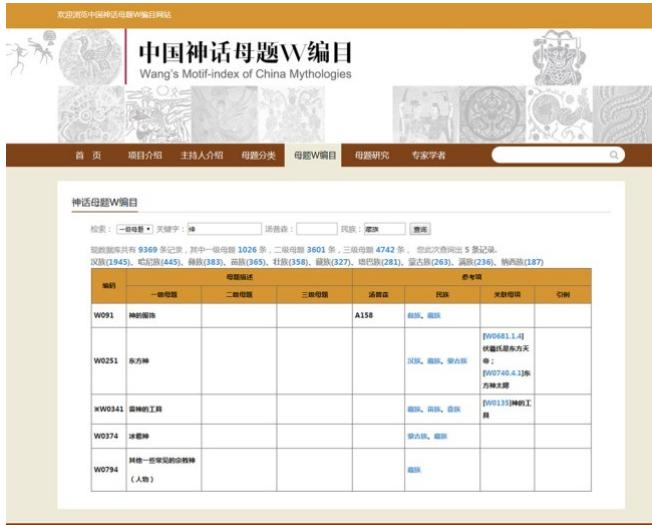

# 构建中国神话数据库的主题索引

设计、实施与潜在应用 郭翠萧，王贤照，巴莫曲布默 中国社会科学院民族文学研究所，北京，中国 guocx@cass.org.cn，wangxzh@cass.org.cn，silver@cass.org.cn 李刚 北京中研科技有限公司，北京，中国 ligang@zhongyan.org 摘要—神话是一种口头和无形的文化遗产，承载着丰富的历史和文化信息。中国56个不同民族有着众多神话，内容多样且以多种形式流传。本文将重点介绍一个名为“王氏中国神话题材索引数据库”的神话题材索引数据库的设计、实施和应用。数据库中存储了33,469个神话题材，这些题材提取自12,600个来自不同民族的神话，并分为十个类别。本文将详细介绍题材提取和数据库构建的过程，同时展示数据库提供的界面和检索机制。该主题数据库可通过开放获取在线访问，不仅适用于神话研究者，也适用于神话爱好者。 关键词—神话，题材，索引，数据库，中国民族

# I. 引言

神话是人类早期的一种重要艺术形式，也是一种口头和非物质文化遗产，承载着丰富的历史和文化信息。“主题”是构成神话的基本单元，主题在不同时间段、地区和文化的神话中反复出现。例如，洪水神话主题在全球范围内的许多文化中广泛存在。主题在传承过程中可以独立存在，也可以与史诗、传奇、民间故事和民谣等其他流行叙事体裁相结合或表现出来。“主题”因其代表性和普遍性而受到学者的青睐，并已成为一个方便的工具，甚至被视为神话及其他相关学科的“最佳分析单元”[1]。中国的56个民族拥有众多神话，这些神话内容丰富，并以多种形式流传。历史上，汉民族的文学备受关注，而少数民族神话的收集和研究则相对较少。其中大多数民族没有发展出自己的书写语言，神话只能以口头传承的方式流传。即使是有书写语言的民族，他们的神话往往仍以口头的方式传递。这种口头神话被称为“活着的神话”。它们的传承是一个不稳定的过程，因此显得极为珍贵。

对中国各民族神话进行全面整理、归档和保存的重要工作，是为了展现这些神话的传承全景，推动神话学科的建立与民族文化的重新审视。为此，中国社会科学院民族文学研究所的高级研究员王先肇博士，近30年来广泛阅读各民族神话，深入少数民族地区收集活生生的神话，并对数据进行分段和统计分析。他将国际主流民间文学研究中的主题法应用于12,600个神话中，构建了十个神话主题组，每个组下设三个子组，共分类出33,469个神话主题和编码。他使用图表展示了主题组与子组之间的全面和逻辑关系，所有这些内容均在他的著作《王氏目录：中国神话中的主题》（Wmotif）中列出。该书是一本参考书，也是第一本包含中国各民族神话主题的神话学书籍，涵盖一些古老的民族群体。自该书出版以来，隶属于中国社会科学院的中国民族文化语言研究中心设立了“王氏中国神话主题索引数字档案项目”的数字化文献工作组，以进一步推动民俗学、民间文学和民族文学研究及相关平行学科，促进专业学术讨论和对话，并传播学术成果。王先肇博士担任该团队负责人，助理研究员郭翠霄负责数据库和网站需求研究、程序设计、定制元数据标准、数据录入及相关工作，资深研究员巴莫·曲布默博士担任学术顾问。在北京中研科技有限公司的技术支持下，该研究小组于2014年3月启动了“王氏中国神话主题索引数据库”（WMCMDB）项目。到8月份，研究小组完成了设计方案并开始输入测试数据，改进功能并调整网页结构。到2014年11月，数据库正式上线。WMCMDB通过主题索引系统性地整理了大量神话文本，允许多维搜索，并通过互联网开放访问，方便研究人员使用。该数据库能够系统显示各民族神话的共性与个性特征，探讨这些神话的传播与变迁，促进中国神话的宏观研究与比较分析，并推动与其他世界神话的对话与交流。学者们认为，借助这一索引系统，“在现代信息技术时代构建一个神话数据库的主题索引……就中国神话主题研究而言，是一场技术革命。” WMCMDB并不限于神话研究者，也向神话爱好者开放，可用于神话、主题及文学研究，以及人类学、宗教研究、民俗学和传播学等领域，为研究人员提供寻找模式和进行深入研究与分析的手段。

# II. 设计原则与特征

Wmotif 和 WMCMDB 的创建遵循以下设计原则，并具有以下相应的特征：

# A. 职业素养

由神话学家和数据库专家创建的 WMCMDB 包含可靠的数据源，为专业研究人员提供高质量的数据，同时也作为一个专业的学术交流平台。

# B. 系统性

神话主题索引本质上是一个基于十个指定主题组的编码系统，旨在根据形式或内容对这些主题组进行分类。

# C. 互操作性

WMCMDB中的所有主题都与Stith Thompson的民间文学主题索引进行比较[4]，该索引被视为国际标准。如果一个主题出现在汤普森的索引中，则将汤普森主题代码添加到相应主题的参考列中。这使得研究人员能够进行比较数据的使用，并促进与其他使用汤普森主题索引的主题索引系统之间的链接和共享。

# D. 可用性

WMCMDB及其网站在设计时充分考虑了目标用户，注重用户体验，并提供多种浏览和检索方式，以便用户能尽快找到所需信息。

# E. 可扩展性

主题索引系统和元数据系统可以扩展，未来留有更多主题和更细化的元数据元素的空间。WMCMDB对用户开放，用户可以根据自己的经验和判断在适当的地方添加新的主题，从而丰富中国神话主题的数量，并创建更合理的主题结构。

# III. 数据来源与构建过程

WMCMDB的数据来源于Wmotif一书，而Wmotif中索引的主题来源于四个渠道：(1) 相关的国内外出版物；(2) 尚未发表但具有权威性的出版物；(3) 学术期刊；(4) 通过个人实地调研收集的材料。

启动神话主题索引研究。王先照博士的目标是通过计算机和在线检索系统向大量用户提供来自中国各民族的广泛神话主题，同时实现这些用户之间的互动对话。因此，研究神话主题的过程与数据库的构建进行了整合。整个过程大致可以分为以下几个相互交织的阶段：（1）收集与神话或神话相关的文本；（2）将神话文本转化为电子文本；（3）从大量神话中提取核心或基本主题；（4）使用统计学、微积分、拓扑学等方法预测主题的顺序，开发各种主题组和子组，不断调整不同组之间的平衡；（5）在建立一定数量的主题来源后，翻译斯蒂斯·汤普森的《民间文学主题索引》六卷，逐一比较每个主题，寻找遗漏部分，调整或修正主题组和主题描述；（6）使用Excel工作表在每个组内创建主题的自然顺序，进一步修订和调整顺序，对每个主题子组进行跨类别调整，并删除重复的主题代码；（7）改善主题组的布局和描述，提高主题组的标准化程度以及主题的科学呈现；（8）定制WMCMDB的元数据元素，修改第（6）步中概述的Excel工作表，使其符合这些元数据元素，并转化为标准化形式以导入数据库；（9）开发数据库和网站，从Excel工作表中输入数据并上线。第（3）步对WMCMDB的构建尤为重要。在从神话文本中提取主题时，保留主题的“上下文”信息是很重要的，包括神话主题源名称、叙述者、叙述者的民族、收集者、翻译者、创作日期、流通区域、语言、出版物名称、出版社、出版日期、主题出现的页码等。这些信息在提供价值判断和验证主题的生命力方面至关重要，使主题变为结构化数据，并为数据库提供基本的元数据。

# IV. 技术架构

WMCMDB及网站内容管理系统由北京中研科技有限公司提供。技术结构的框架如下：系统基于$\mathrm { B } / \mathrm { S }$架构（$\mathrm { B } / \mathrm { S } =$ 浏览器/服务器）；服务器操作系统：Debian Linux 6.0.10；Web服务器应用：Apache/2.2.16 (Debian) mod_fastcgi/2.4.6；编程语言：PHP 5.3.3；数据库：MySQL 5.1.73-1+deb6u1；用户界面结构：$\mathrm { H T M L } + \mathrm { C S S } +$ Javascript $^ +$ PHP。

# V. 此阶段的结果

# A. WMCMDB 和网站已搭建完成，数据正在逐步录入中

WMCMDB将图案分为十个组别。总共有33,469个图案，这些图案被划分为三级。图案数量的具体统计信息见表I：表I. WMCMDB中十个组别和三级图案的统计信息

<table><tr><td rowspan=1 colspan=3>Group of Motifs</td><td rowspan=1 colspan=4>Quantity of Motifs</td></tr><tr><td rowspan=1 colspan=1>Code</td><td rowspan=1 colspan=1>Name</td><td rowspan=1 colspan=1>CodingRange</td><td rowspan=1 colspan=1>Motifsat thefirstlevel</td><td rowspan=1 colspan=1>Motifsat thesecondlevel</td><td rowspan=1 colspan=1>Motifsat thethirdlevel</td><td rowspan=1 colspan=1>Total</td></tr><tr><td rowspan=1 colspan=1>W0</td><td rowspan=1 colspan=1>God andgod-likefigures</td><td rowspan=1 colspan=1>W0-W999</td><td rowspan=1 colspan=1>566</td><td rowspan=1 colspan=1>1989</td><td rowspan=1 colspan=1>2142</td><td rowspan=1 colspan=1>4687</td></tr><tr><td rowspan=1 colspan=1>W1</td><td rowspan=1 colspan=1>World andNaturalObjects</td><td rowspan=1 colspan=1>W1000-W1999</td><td rowspan=1 colspan=1>398</td><td rowspan=1 colspan=1>1603</td><td rowspan=1 colspan=1>2606</td><td rowspan=1 colspan=1>4607</td></tr><tr><td rowspan=1 colspan=1>W2</td><td rowspan=1 colspan=1>Human andMan-Kind</td><td rowspan=1 colspan=1>W2000-W2999</td><td rowspan=1 colspan=1>421</td><td rowspan=1 colspan=1>1488</td><td rowspan=1 colspan=1>1448</td><td rowspan=1 colspan=1>3357</td></tr><tr><td rowspan=1 colspan=1>W3</td><td rowspan=1 colspan=1>Animals andPlants</td><td rowspan=1 colspan=1>W3000-W3999</td><td rowspan=1 colspan=1>510</td><td rowspan=1 colspan=1>1180</td><td rowspan=1 colspan=1>2281</td><td rowspan=1 colspan=1>4681</td></tr><tr><td rowspan=1 colspan=1>W4</td><td rowspan=1 colspan=1>NaturalPhenomenaand NaturalOrder</td><td rowspan=1 colspan=1>W4000-W4999</td><td rowspan=1 colspan=1>290</td><td rowspan=1 colspan=1>1010</td><td rowspan=1 colspan=1>1179</td><td rowspan=1 colspan=1>2479</td></tr><tr><td rowspan=1 colspan=1>W5</td><td rowspan=1 colspan=1>SocialOrganizationand SocialOrder</td><td rowspan=1 colspan=1>W5000-W5999</td><td rowspan=1 colspan=1>244</td><td rowspan=1 colspan=1>877</td><td rowspan=1 colspan=1>1111</td><td rowspan=1 colspan=1>2232</td></tr><tr><td rowspan=1 colspan=1>W6</td><td rowspan=1 colspan=1>Tangibleculture andIntangibleculture</td><td rowspan=1 colspan=1>W6000-W6999</td><td rowspan=1 colspan=1>443</td><td rowspan=1 colspan=1>1484</td><td rowspan=1 colspan=1>1439</td><td rowspan=1 colspan=1>3366</td></tr><tr><td rowspan=1 colspan=1>W7</td><td rowspan=1 colspan=1>Marriage andSex</td><td rowspan=1 colspan=1>W7000-W7999</td><td rowspan=1 colspan=1>347</td><td rowspan=1 colspan=1>956</td><td rowspan=1 colspan=1>1008</td><td rowspan=1 colspan=1>2311</td></tr><tr><td rowspan=1 colspan=1>W8</td><td rowspan=1 colspan=1>Disaster andWar</td><td rowspan=1 colspan=1>W8000-W8999</td><td rowspan=1 colspan=1>376</td><td rowspan=1 colspan=1>1143</td><td rowspan=1 colspan=1>1136</td><td rowspan=1 colspan=1>2655</td></tr><tr><td rowspan=1 colspan=1>W9</td><td rowspan=1 colspan=1>Other Motifs</td><td rowspan=1 colspan=1>W9000-W9999</td><td rowspan=1 colspan=1>403</td><td rowspan=1 colspan=1>1393</td><td rowspan=1 colspan=1>1298</td><td rowspan=1 colspan=1>3094</td></tr><tr><td rowspan=1 colspan=1>Total</td><td rowspan=1 colspan=1></td><td rowspan=1 colspan=1></td><td rowspan=1 colspan=1>3998</td><td rowspan=1 colspan=1>13823</td><td rowspan=1 colspan=1>15648</td><td rowspan=1 colspan=1>33469</td></tr></table>

WMCMDB 的开发现已完成，数据正在逐步上传和更新，目前已有近 10,000 个图案。专业的 WMCMDB 网站也已开发并可访问： http://myth.ethnicliterature.org/

# B. 实现多种模式检索方法

WMCMDB 模式显示在 “模式图” 中，其中包含代码、模式描述和参考文献。参考文献包括汤普森模式代码、该模式来源于的神话的民族起源、相关模式及示例等。用户可以通过多种方式浏览或搜索模式，包括：1) 按照模式组和子组进行搜索。2) 从 “模式图” 中按顺序直接查找模式。这种方法允许用户查看所有模式在三个层级上的信息，以及模式索引的自然结构。3) 通过相关模式进行搜索。模式代码表包含相关模式。通过点击相关模式，可以展开其叙事元素或结构，以提供多维的理解。4) 使用关键字搜索找到精确的模式。可以定义模式层级并使用包含模式代码的关键字搜索来找到模式。搜索也可以使用汤普森代码或按民族进行。为了进行更精确的搜索，还可以添加关键字。例如，要在第一层级找到与“神灵”相关的所有藏族神话模式，可以填写图 1 所示的关键字，从而获取以下结果：

  
Fig. 1. Defining Motif level and adding key word to search for a motif

该网页向用户展示了当前数据库中的图案总数、各个层级中的图案数量、拥有最多神话的十个少数民族及其对应的图案总数。这些数字可以点击，点击后将显示相应的结果。在图案编码表的参考部分，点击民族名称也可以快速检索该民族的所有神话图案。

# 六、潜在典型应用

主题索引的本质在于其在神话研究中的实际应用。除了提供对神话中相关主题的准确搜索外，它还有许多其他应用。

# A. 在特定神话比较中神话主题索引的应用。

在神话研究中，使用题材索引的最直接方式是对来自不同族群或不同地区的同类文本进行定量测量与比较。从每个文本中提取并整理题材，有助于全面分析某一题材的数量和变化，从而发现共通模式与差异。

# B. 神话母题指标在神话结构分析中的应用。

许多情节可以组合成不同的神话叙事类型，这被称为“神话叙事结构模型”，对于一般分析具有重要意义。从理论上讲，借助这些模型，可以对任何神话进行定量和定性分析或比较研究。该模型将神话分为以下几种组合：(1) 链式叙事结构模型；(2) 分歧叙事结构模型；(3) 嵌套叙事结构模型；(4) 并行叙事结构模型；(5) 复合叙事结构模型；(6) 其他形式的叙事结构模型。

# C. 神话主题索引在神话类型综合模式分析中的应用。

主题的提取和展示看似是随机的，但实际上这是神话叙事文学结构类型的体现。WMCMDB 中主题的设置和排列不仅将提供主题排列的一般规则，还将决定由不同主题组合产生的主题组。

# VII. 未来计划

到2015年底，项目团队将完成所有33,469个神话题材条目的录入，这些条目将会在互联网上可用。项目团队计划利用WMCMDB添加神话文本、图片、音频和视频，以及神话研究的书籍和文章，从而建立一个“中国神话数据库”。将题材代码嵌入这些神话文本、图片、音频和视频材料，并通过WMCMDB进行链接，将所有这些数据连接起来，使得互动多媒体检索成为可能，自动生成广泛的研究信息，创造独特的数据，最终为数字时代的神话比较研究提供便利的渠道。研究人员可以以题材索引为基础，构建具有个性特征的新神话研究数据库。

# VIII. 总结与经验分享

在撰写学术参考书的第一阶段，应为数据库的构建做好准备。与书籍同时构建数据库将有助于查找重复条目和错误，加快工作进度并减少错误。理想情况下，这本书应直接制作成一个在线数据库，并开放给公众访问。人文学科和社会科学的研究人员应具备一定的计算机技术技能，或至少对此有一定意识，并与数据库专业人士合作。因为神话主题具有活力，能够在各种文化及文化产品中在时间和空间上反复出现。因此，神话主题索引数据库应当是可自由扩展的，并允许根据项目团队的理念进行发展。

# REFERENCES

[1] J.-X. Chen, Mythology: Exploration of Motif Analysis Methods, Wuhan: Hubei Education Press, 1997, pp. 34-35   
[2] X.-Z. Wang, Wang's Catalogue: Motif in China's Mythology, Beijing: China Social Science Press, 2013.   
[3] S.-H. Hou, "Wang Xianzhao's Mythological Motifs Research and Humanities," Chinese Social Sciences Today, Nov.24, 2014 (B01).   
[4] Stith Thompson, Motif-index of Folk-literature: A Classification of Narrative Elements in Folktales, Ballads, Myths, Fables, Mediaeval, Romances, Exempla, Fabliaux, Jest-books, and Local Legends (Vol. 1-6). Bloomington: Indiana University Press, 1989.   
[5] X.-Z. Wang, "On the Implementation and Application of Motif-index in Mythology Research: Taking Wang's Catalogue: Motif in China's Mythology as Example," Journal of Guizhou Minzu University, No.1, 2015, pp. 66-72   
[6] X.-Z. Wang, The Need to Accelerate the Database Construction of Mythologies in China," China Culture Daily, Aug. 23, 2011.