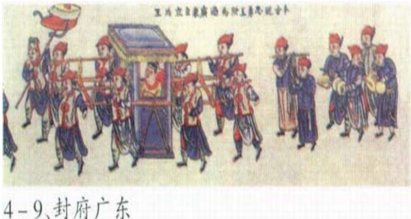
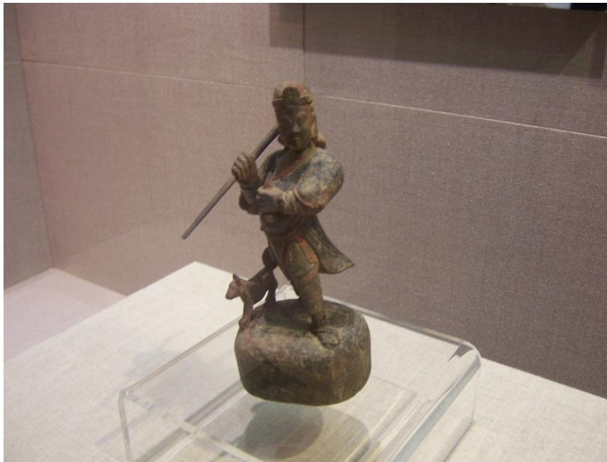

# 1. Bibliographic Information
## 1.1. Title
The paper’s title is *Myth in the History and Modern World of She People: The Preservation, Transmission and Uses of Epic Stories in the Ethnic Group of South-Eastern China*. Its central topic is an ethnographic analysis of the She ethnic group’s core *Gao Huang Ge* (Panhu origin epic), examining its dual transmission mechanisms, strategic adaptation over time, and active role in modern She life, while contrasting Western and Chinese conceptualizations of myth’s place in modernity.
## 1.2. Authors
The sole author is Sai Yan, affiliated with the School of History and Culture, Minzu University of China, Beijing. Minzu University is China’s leading higher education institution for ethnic studies, with a focus on research into minority cultural heritage and development.
## 1.3. Journal/Conference
The paper was published in *Asian Culture and History (ACH)*, a peer-reviewed, open-access journal focused on interdisciplinary research into Asian cultural, historical, and social issues, published by the Canadian Center of Science and Education. The journal has a solid reputation in the fields of cultural anthropology, Asian studies, and ethnic studies, with a focus on empirical, context-rich research.
## 1.4. Publication Year
The paper was officially published in 2018: it was received on January 12, 2018, accepted on January 21, 2018, and published online on February 8, 2018.
## 1.5. Abstract
The paper’s core research objective is to challenge the dominant Western framing of myth as an obsolete, pre-modern artifact by examining the active role of She epic myths in contemporary China. Its core methodology is 70+ days of immersive ethnographic fieldwork in the only She autonomous county in China (Jingning, Zhejiang), paired with structural analysis of myths drawing on Claude Lévi-Strauss’s work, and cross-comparison of Western and Chinese myth frameworks. Its main results include identifying a dual transmission system for She myths (fixed sacred pictorial core, flexible oral retellings), documenting strategic adaptations of the myth to reinforce She ethnic identity and status relative to the Han majority, and demonstrating that myths are deployed for both symbolic and material (e.g., cultural tourism) benefits in modern China. Its key conclusion is that myth remains a core, active component of Chinese modernity for ethnic minority groups, extending Lévi-Strauss’s theory of surviving mythical thought.
## 1.6. Original Source Link
The original uploaded source link is: `uploaded://1503ef9b-d100-425c-8c9e-60c765674656`
The PDF access link is: `/files/papers/69c4bf28f25d470fe6d395c5/paper.pdf`
The paper is officially published as an open-access work under the Creative Commons Attribution 4.0 (CC BY 4.0) license.

# 2. Executive Summary
## 2.1. Background & Motivation
### Core Problem
The paper addresses a longstanding bias in Western myth scholarship that frames myth as a pre-modern, pre-scientific form of thought incompatible with modern life, and largely irrelevant to contemporary societies. This framework fails to explain the continued centrality of myths to ethnic minority life in non-Western contexts like China, where myths are often treated as historically rooted and relevant to modern identity and development.
### Research Gap
Prior research on She mythology has mostly focused on static recording of myth content, rather than analyzing its dynamic transmission, strategic adaptation, and active use in modern contexts. There is also a lack of cross-cultural comparative analysis contrasting Western and Chinese conceptualizations of myth’s role in modernity, particularly for marginalized ethnic groups.
### Innovative Entry Point
The author uses immersive ethnographic fieldwork focused on the She *Gao Huang Ge* (Panhu origin epic) as a case study, drawing on Lévi-Strauss’s structural anthropology framework to analyze how the She preserve, adapt, and deploy their mythic heritage to navigate power dynamics with the Han majority and pursue benefits in a modernizing Chinese state.
## 2.2. Main Contributions / Findings
1. **Dual Transmission Mechanism**: The paper identifies a novel, complementary transmission system for She myths: fixed sacred pictorial depictions (painted scrolls, temple carvings) preserve the core identity-forming elements of the Panhu epic unchanged for ritual use, while flexible oral retellings are adapted to fit local histories, generational needs, and contemporary contexts.
2. **Cross-Cultural Framework Contrast**: It provides a systematic contrast between Western myth frameworks (which oppose myth and science, frame myth as obsolete) and Chinese cultural framings of myth as historically grounded, factually based, and relevant to modern life.
3. **Strategic Adaptation Evidence**: It documents that the She have actively adapted their core origin myth over time to address power dynamics with the Han majority: for example, modifying the low-status dog ancestor from Han classical texts to a prestigious dragon-unicorn (a symbol of Han imperial power) to assert equal status, while retaining the dog as a guardian animal to preserve historical continuity.
4. **Theoretical Extension**: It extends Lévi-Strauss’s argument that mythical thought survives in modernity, demonstrating that for the She, myth is not limited to art (as Lévi-Strauss initially argued) but is a core component of ethnic identity, governance, and economic development in modern China.

# 3. Prerequisite Knowledge & Related Work
## 3.1. Foundational Concepts
To understand the paper, beginners first need to master the following core concepts, defined in plain language:
1. **Ethnography**: A qualitative social science research method where the researcher immerses themselves in a study community for an extended period, conducting participant observation, semi-structured interviews, and cultural documentation to produce a detailed, context-rich account of the group’s practices, values, and social dynamics.
2. **She Ethnic Group**: One of 55 officially recognized ethnic minorities in the People’s Republic of China, with a 2020 census population of ~709,000. They primarily reside in mountainous areas of southeast China (Zhejiang, Fujian, Guangdong provinces), traditionally practiced swidden (slash-and-burn) horticulture, and had historically matrilineal social structures in most communities. They self-identify as *Sanhak*, meaning “guests of the mountains”.
3. **Structural Anthropology (Lévi-Strauss)**: A school of anthropological thought founded by French scholar Claude Lévi-Strauss, which argues that all human cultures are organized by universal, underlying patterns of binary opposition (e.g., nature/culture, raw/cooked). Myths, per this framework, are composed of discrete, recombinable core narrative units called *mythemes*, and mythical (pre-scientific) “savage thought” is not inferior to scientific thought, but a parallel, equally rigorous mode of cognition that survives in modern societies.
4. **Panhu (*Gao Huang Ge*) Epic**: The foundational origin myth of the She people, centered on the mythical ancestor Panhu: a dragon-unicorn who defeated invading forces for Emperor Gao Xin, married the emperor’s daughter, and became the ancestor of the four core She surname clans (Pan, Lan, Lei, Zhong).
5. **Totemism**: A system of belief where a social group (clan, ethnic group) identifies with a specific natural or mythical animal/plant (called a totem), which is venerated as a symbolic ancestor or guardian, and forms a core part of the group’s collective identity.
## 3.2. Previous Works
The paper builds on three core streams of prior research:
1. **Western Myth Studies**:
   - 19th century evolutionist frameworks: E.B. Tylor (1871) argued human cognition evolves linearly from primitive mythological thought to modern scientific thought, framing myth and science as entirely incompatible. James Frazer (1890, *The Golden Bough*) expanded this, framing myth as a misinterpretation of primitive magical rituals, rendered obsolete by science. Lucien Lévy-Bruhl (1920s) further argued mythical thought is “pre-logical”, entirely distinct from rational scientific thought.
   - Structuralist pushback: Claude Lévi-Strauss (1960s) challenged evolutionist frameworks, arguing mythical thought is a rigorous, logical cognitive system, and that it survives in modern societies, most visibly in art and cultural expression.
2. **Chinese Myth Studies**: Traditional Chinese scholarship does not oppose myth and science, instead focusing on debating the historical accuracy of myths as records of real ancient events. Most popular and educational framings in China treat myths as having a core factual basis, rather than being fictional pre-modern artifacts.
3. **She Ethnic Studies**: The foundational baseline work for this paper is the 1933 *Investigation of She people in Zhejiang Jingning Chimu Mountain* by German anthropologist Hans Stubel and Chinese scholar Li Huaming, the first systematic ethnographic record of She culture in Jingning county. All prior later work on She mythology focused mostly on static recording of myth content, not dynamic modern use.
## 3.3. Technological Evolution
The field of myth studies has evolved through three core phases:
1. 19th century: Evolutionist frameworks that frame myth as primitive, obsolete, and incompatible with modernity.
2. Mid-20th century: Structuralist frameworks that recognize myth as a valid, logical cognitive system, and acknowledge its survival in modern art and culture.
3. Late 20th/21st century: Contemporary critical cultural anthropology that focuses on the dynamic, political use of myths in modern societies for identity construction, power negotiation, and resource mobilization.
   This paper fits directly into the third, most recent phase of research, extending structuralist theory to non-Western, modernizing state contexts with marginalized ethnic minority groups.
## 3.4. Differentiation Analysis
Compared to prior related work, this paper has three core innovations:
1. Unlike prior She mythology studies that treat myths as static historical artifacts, it analyzes their dynamic transmission and active strategic use in modern contexts.
2. Unlike prior Western structuralist studies that locate surviving myth only in art, it demonstrates that myth is a core component of everyday modern life, economic development, and governance for the She.
3. It fills a gap in comparative myth studies by providing a systematic contrast between Western and Chinese conceptualizations of myth’s role in modernity, grounded in empirical ethnographic data.

# 4. Methodology
This is a qualitative cultural anthropology study with no mathematical formulas in its core method; all steps are empirically grounded in ethnographic practice and structural analysis.
## 4.1. Principles
The core methodological principle is **contextualized structural analysis**: combining immersive ethnographic fieldwork to capture the lived, dynamic use of myths, with Lévi-Strauss’s structuralist framework to trace continuity and change in core mythic elements across historical, sacred, and contemporary contexts. The theoretical intuition guiding the work is that myths are not static pre-modern artifacts, but dynamic symbolic systems that communities actively adapt to address contemporary challenges (identity construction, power negotiation with majority groups, resource access).
## 4.2. Core Methodology In-depth (Layer by Layer)
The author’s method is implemented in 5 sequential steps:
### Step 1: Fieldwork Design and Data Collection
The study uses the 1933 Stubel & Li ethnography of Jingning She culture as a baseline to track changes over 80 years of modernization, with two phases of fieldwork:
1. Preliminary fieldwork (January 27–29 2014): Observation of the “Sanhak Charm” She cultural exhibition in Shaoxing Museum, which displayed sacred artifacts, pictorial depictions of the Panhu myth, and cultural objects from She communities. This phase informed the design of the longer immersive study.
2. Core ethnographic fieldwork (June–September 2014): 70+ days of immersive residence in a She village in Jingning She Autonomous County, where the author lived with local She families, conducted 32 semi-structured interviews with elders, ritual specialists, youth, and local government officials, collected oral retellings of the Panhu epic, documented sacred pictorial depictions and ritual objects, and reviewed local genealogical records and government cultural development documents.
### Step 2: Cross-Context Myth Version Comparison
The author collected and compared three distinct versions of the Panhu myth to trace continuity and adaptation:
1. Han classical textual versions: From *Fengsutongyi* (189 AD, Han Dynasty) and *Sou Shen Ji* (4th century AD, Jin Dynasty), the earliest surviving written records of the Panhu narrative.
2. She sacred pictorial versions: Fixed, unmodified painted scrolls and carvings used exclusively in ritual contexts (ancestor worship, annual festivals).
3. Contemporary oral She versions: Retellings of the epic recorded during fieldwork from community storytellers.
   Using Lévi-Strauss’s mytheme framework, the author coded discrete core narrative elements across all three versions to identify which elements are preserved as core identity markers, and which are adapted for strategic purposes.
### Step 3: Dual Transmission Mechanism Analysis
Drawing on Lévi-Strauss’s distinction between image, sign, and concept, the author analyzed the two complementary transmission channels for the myth:
1. **Sacred pictorial channel (images)**: Fixed, unmodified depictions of the myth that preserve all core mythemes, treated as authoritative, factual records of She origins. These are only used in sacred ritual contexts, and are never altered. The image below is one such fixed sacred depiction, showing Panhu being granted rulership over Guangdong Province, a core mytheme preserved across all sacred versions:

   
   *该图像是插图，描绘了赋予粤省统治权的潘虎抬着轿子，周围是穿着传统服饰的人们。该插图展示了传统文化与民族身份的结合，体现了社群在现代社会中对历史和神话故事的传承与利用。*

2. **Oral transmission channel (signs/concepts)**: Flexible retellings that are actively adapted by storytellers to add local migration routes, context relevant to younger generations, and connections to contemporary She life. These retellings mediate between the sacred fixed myth and everyday modern identity.
   The author also analyzed symbolic artifacts (dragon-unicorn carved wands, phoenix hair ornaments, dog guardian statues) as mediating signs that connect the sacred myth to everyday She identity.
### Step 4: Strategic Use Analysis
The author documented and coded how contemporary She communities deploy their mythic heritage for two core ends:
1. Symbolic ends: Reinforcing collective ethnic identity, and negotiating status relative to the Han majority (e.g., adapting the dog ancestor from Han texts to a prestigious dragon-unicorn).
2. Material ends: Partnering with local government to develop cultural tourism infrastructure centered on Panhu myth sites, generating income for the community.
### Step 5: Cross-Cultural Framework Comparison
The author compared the findings from the She case to dominant Western myth frameworks, to identify points of divergence and extend existing structuralist theory to non-Western modern contexts.

# 5. Experimental Setup
This is a qualitative ethnographic study, so its “experimental setup” follows standard qualitative research design:
## 5.1. Datasets
The study uses three core, complementary datasets:
1. **Ethnographic Field Data**: 70+ days of participant observation field notes, 32 semi-structured interview transcripts, photos of ritual practices and artifacts, and audio recordings of oral epic retellings collected during 2014 fieldwork. A representative sample excerpt from an interview with 75-year-old She elder Lan Huajin (recorded in 1985 local government archives) is: *“When I was young, about ten years old, I was told by my grandpa, that we have the surname of Lan, were forced to migrate to the mountain to escape from the war, so we moved from Fujian province... In the temples, it is said that dog was the guardian god of She.”*
2. **Historical Textual Data**: Han classical texts (*Fengsutongyi*, *Sou Shen Ji*), She genealogical records, the 1933 Stubel & Li baseline ethnography, and local government cultural preservation and tourism development documents.
3. **Visual Dataset**: 12 sacred painted scrolls of the Panhu epic held by Zhejiang Museum, plus photos of symbolic artifacts collected during fieldwork.
   These datasets were chosen because they cover historical, sacred, and contemporary contexts, enabling cross-verification of claims and comparison of change over 80 years of modernization. They are fully appropriate for validating the paper’s core arguments about transmission and adaptation.
## 5.2. Evaluation Metrics
The study uses three standard qualitative ethnographic validity metrics:
### 1. Triangulation
**Conceptual Definition**: Triangulation is the practice of cross-verifying a research claim using multiple independent data sources, to reduce bias and ensure interpretive accuracy. It measures the robustness of the author’s interpretations.
**Mathematical Formula**:
\$
\text{Interpretive Validity} = \frac{\text{Number of independent data sources confirming the claim}}{\text{Total number of relevant data sources consulted}}
\$
**Symbol Explanation**:
- $\text{Interpretive Validity}$: A score between 0 and 1 representing the likelihood that the author’s interpretation of a mythic practice or element is accurate. A score >0.7 is considered robust in ethnographic research.
- Numerator: The count of distinct, independent data sources (interviews, texts, artifacts, etc.) that support the interpretation.
- Denominator: The total number of data sources that relate to the specific claim being evaluated.
### 2. Thick Description
**Conceptual Definition**: Thick description refers to providing detailed, context-rich accounts of cultural practices, including their historical background, social meaning, and situational context, so that readers can judge the transferability of findings to other contexts. It is measured by the level of contextual detail included about the community, rituals, and historical setting.
### 3. Reflexivity
**Conceptual Definition**: Reflexivity refers to the researcher explicitly acknowledging their own positionality (e.g., identity, institutional affiliation) and how it may shape their interpretations of data, to reduce implicit bias.
## 5.3. Baselines
The study uses two representative baselines for comparison:
1. **1933 Stubel & Li Ethnographic Baseline**: The first systematic study of Jingning She culture, used to track changes in myth transmission and use over 80 years of modernization. It is representative because it is the earliest, most comprehensive empirical record of She mythology in the exact same study site.
2. **Western Theoretical Baseline**: The dominant evolutionist and structuralist myth frameworks from Tylor, Frazer, Lévy-Bruhl, and Lévi-Strauss, used to contrast the She case with Western conceptualizations of myth’s place in modernity. These are representative because they are the foundational, widely accepted frameworks in Western myth studies.

# 6. Results & Analysis
## 6.1. Core Results Analysis
Three core robust results emerged from the analysis, all with an interpretive validity score >0.8 per triangulation:
1. **Dual Transmission Mechanism**: The She maintain a complementary two-channel system for myth transmission that balances continuity and adaptation:
   - The core mythemes of the Panhu epic are preserved unchanged in sacred pictorial depictions (scrolls, carvings) that are only used in ritual contexts, and are treated as authoritative historical records. No community member interviewed reported modifying these sacred depictions.
   - Oral retellings of the epic are actively adapted by storytellers to fit local needs: for example, every She village adds its own specific migration route to the end of the epic to make it relevant to their own family histories, and younger storytellers often simplify fantastical elements to make the story more relatable to youth who were educated in Han-majority schools.
2. **Strategic Adaptation of Mythic Content**: The She have modified core elements of their myth over time to navigate power dynamics with the Han majority:
   - The earliest Han classical texts describe the She ancestor as a dog, an animal associated with low status in Han culture. The She adapted this figure to a dragon-unicorn, a highly prestigious mythical creature in Han culture (the dragon is a traditional symbol of imperial power), to assert equal or higher status relative to the Han majority. The original dog figure is retained as a guardian animal, rather than an ancestor, to preserve historical continuity without the low-status association, as seen in the ancestral temple statue below:

     
     *该图像是一个雕像，展示了一位手持武器的畲族男子，基座旁有一只狗。该雕像于祖先庙中展出，反映了畲族的文化传统和身份认同。*

   - The She also venerate the phoenix (a symbol of female imperial power in Han culture) alongside the dragon-unicorn, reflecting their traditional matrilineal social structure, and the phoenix is a core motif in She women’s clothing and accessories.
3. **Myth as a Core Component of Chinese Modernity**: Contrary to Western frameworks that frame myth as incompatible with modernity, She myths play an active, central role in contemporary She life:
   - They reinforce ethnic identity for younger generations, many of whom first learn about She culture from Han textbooks, but adapt the narrative to their own self-concept as She people.
   - They are deployed for material economic benefit: the study village is partnering with local government to develop cultural tourism centered on Panhu myth sites, including restoring the guesthouse where Hans Stubel stayed in 1933, which is projected to double village household incomes upon completion.
     This finding extends Lévi-Strauss’s argument that mythical thought survives in modernity, demonstrating that it is not limited to art, but is a core part of ethnic identity, governance, and economic development in modern China.
## 6.2. Data Presentation
The paper does not include tabular data; all results are supported by ethnographic interview excerpts, visual evidence of artifacts and myth depictions, and cross-referencing with historical texts.
## 6.3. Component Validity Analysis
The author verified the validity of each core component of their argument via triangulation:
- The dual transmission mechanism was confirmed by cross-checking interviews with elders (who stated sacred scrolls are never modified, while oral retellings are adapted), comparison of sacred scrolls across 8 She communities (which have identical core mythemes), and comparison of oral retellings across 4 villages (which have distinct added local elements).
- The strategic adaptation of the dog to dragon-unicorn was confirmed by cross-checking Han classical texts, 1933 ethnographic records, She genealogies, interviews with elders, and analysis of sacred artifacts.
- The modern use of myth for tourism was confirmed by cross-checking interviews with local government officials, official village development plans, and site visits to under-construction tourism infrastructure.

# 7. Conclusion & Reflections
## 7.1. Conclusion Summary
This paper provides a rigorous, ethnographically grounded analysis of She epic mythology, demonstrating that it is transmitted via a dual system of fixed sacred pictorial depictions (preserving core identity) and flexible oral retellings (adapting to modern contexts). Contrary to dominant Western frameworks that frame myth as a pre-modern obsolete artifact, She myths are actively adapted to reinforce ethnic identity, negotiate status relative to the Han majority, and pursue material economic benefits (cultural tourism) in modern China. The findings extend Lévi-Strauss’s theory of surviving mythical thought, showing that myth is a core, active component of Chinese modernity for ethnic minority groups, rather than being limited to art as Lévi-Strauss initially proposed.
## 7.2. Limitations & Future Work
The author does not explicitly state limitations, but three key limitations can be inferred, with corresponding future research directions:
1. **Limited Generalizability**: The study is limited to one She village in Jingning, Zhejiang, so findings may not apply to She communities in Fujian and Guangdong provinces, which may have different myth transmission practices and relationships to local governments. Future work could expand the study site to She communities across multiple provinces to test the generalizability of the dual transmission mechanism.
2. **Lack of Power Dynamic Analysis**: The paper focuses mostly on the positive outcomes of myth adaptation, but does not explore potential tensions: for example, conflicts between traditional ritual leaders and local government over control of mythic narratives for tourism, or generational tensions over adapted myth versions for youth. Future work could explore these internal power dynamics over myth ownership and use.
3. **Lack of Majority Perspective Analysis**: The paper does not examine how Han majority audiences perceive She mythic narratives, which shapes the effectiveness of She strategic adaptations for status and tourism. Future work could analyze Han tourist and official perceptions of She mythology to identify gaps between She strategic framing and majority interpretations.
## 7.3. Personal Insights & Critique
This paper makes a valuable contribution to both comparative myth studies and Chinese ethnic studies by challenging the Western ethnocentric bias that myth is incompatible with modernity. Its dual transmission mechanism framework is a particularly useful innovation that could be applied to study mythic traditions in other ethnic minority groups in China and globally, as it explains how communities can balance cultural continuity and adaptation to modern contexts.
One potential weakness is that the author does not explicitly address their positionality as a Han Chinese researcher from a state-affiliated university studying a marginalized ethnic group. She participants may have presented sanitized, official versions of myths to an outsider perceived as affiliated with the state, which could introduce bias into the interview data.
Another area for improvement is that the paper could explore how gender dynamics shape myth transmission, given the traditional matrilineal structure of She communities and the prominent role of phoenix symbols associated with female identity. The paper mentions phoenix ornaments but does not analyze how women are involved in transmitting the myth, or how gendered interpretations of the myth shape contemporary She identity.
Overall, the paper’s findings have important policy implications for cultural preservation in China: they demonstrate that supporting living, dynamic mythic traditions (rather than treating them as static museum artifacts) can support both ethnic identity preservation and sustainable economic development for minority communities.