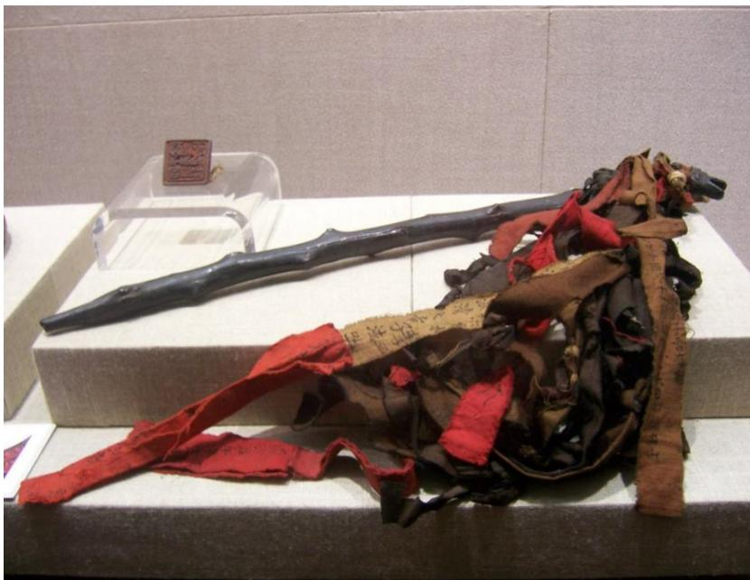
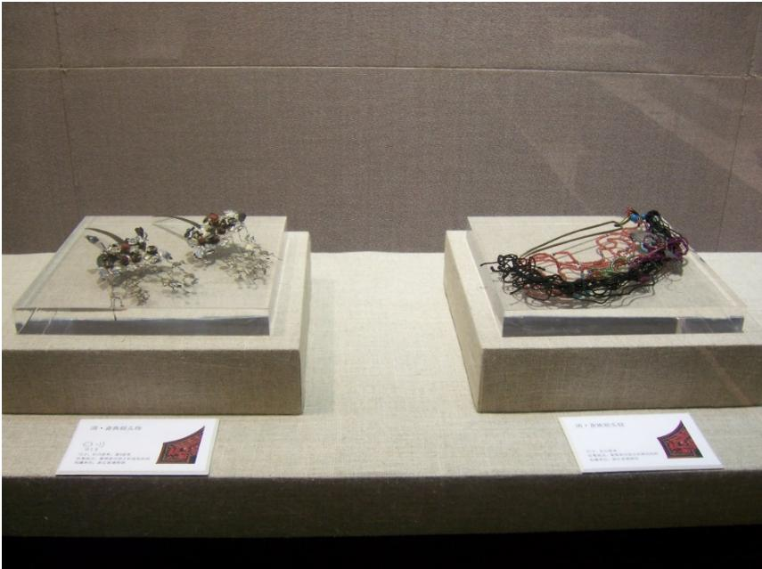
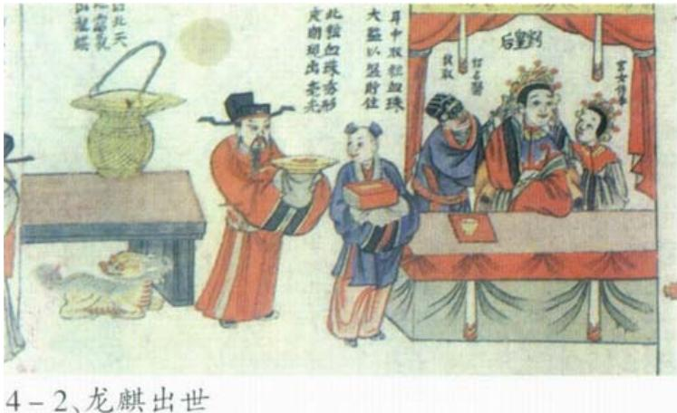
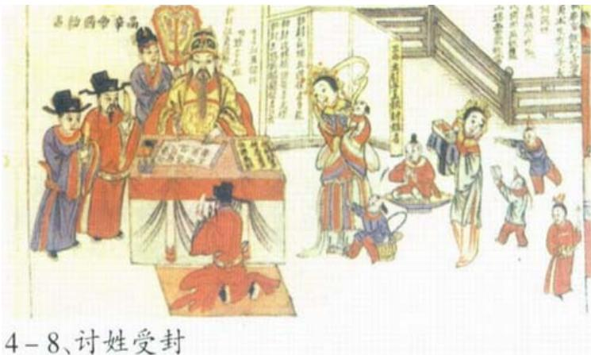

# 1. 论文基本信息
## 1.1. 标题
论文标题为《Myth in the History and Modern World of She People: The Preservation, Transmission and Uses of Epic Stories in the Ethnic Group of South-Eastern China》，中文译名为《畲族历史与现代世界中的神话：中国东南少数民族史诗的保存、传播与使用》。核心主题是研究中国东南畲族的核心史诗《高皇歌》的传播机制、历史演变，以及其在现代社会的活态价值。
## 1.2. 作者
作者为赛燕（Sai Yan），隶属于中央民族大学（Minzu University of China）历史文化学院，研究方向为少数民族文化、神话学。
## 1.3. 发表期刊/会议
本文发表于《Asian Culture and History》（《亚洲文化与历史》），该刊是加拿大科学与教育中心出版的同行评议开源期刊，专注于亚洲文化、历史、人类学领域研究，在亚洲民族研究领域属于中等影响力的学术刊物。
## 1.4. 发表年份
本文正式发表于2018年，首次在线发布时间为2018年2月8日。
## 1.5. 摘要
本文采用民族志研究方法，记录了中国畲族的史诗传统，发现其采用双重传播机制：神话的核心内容通过神圣场景中的图像固定保存，而灵活的口头叙事则让故事适配现代畲族的日常生活。论文对比了西方学界将神话视为与现代社会无关的前现代遗存的观点，和中国语境下将神话视为具有事实基础、与当代生活相关的普遍认知，揭示了畲族如何利用神话遗产强化族群身份、在汉族主导的现代化进程中争取物质利益，并结合列维-施特劳斯的理论提出：神话是中国现代性的重要组成部分。
## 1.6. 原文链接
原文官方来源：http://dx.doi.org/10.5539/ach.v10n1p76 ，PDF链接：/files/papers/69c4bf28f25d470fe6d395c5/paper.pdf，属于正式发表的开源学术文章。

# 2. 整体概括
## 2.1. 研究背景与动机
### 2.1.1. 核心问题
本文试图解决两个核心问题：① 西方学界长期存在的「神话-现代二元对立」预设是否适用于中国语境？② 少数民族神话如何在当代社会实现传承，并且发挥怎样的实际功能？
### 2.1.2. 研究必要性与空白
西方神话研究从泰勒、弗雷泽的进化论范式到列维-布留尔的原始思维理论，普遍将神话视为前现代的、落后的文化遗存，认为其会被现代科学取代；即使是承认神话思维逻辑的列维-施特劳斯，也认为神话在现代社会仅存在于艺术领域。而中国本土的神话研究长期偏向汉族神话的历史考据或文学分析，对少数民族神话的活态传承、当代使用的研究存在明显空白，也很少对西方理论的适配性进行反思。
### 2.1.3. 研究切入点
本文以中国东南畲族的核心史诗《高皇歌》为研究对象，结合70多天的田野调查和历史文献对比，用结构主义神话学框架分析畲族神话的传播机制和当代功能，反思西方理论的局限。
## 2.2. 核心贡献/主要发现
1.  **揭示双重传播机制**：畲族神话采用「固定-灵活」的二元传播模式：神圣图像（族谱插图、祭祀法器、宗祠雕像）固定神话核心叙事，保证族群身份的一致性；口头叙事则可以灵活改编细节，适配不同时代、不同地域的需求。
2.  **总结创造性改编路径**：畲族对神话的改编分为三个层面：内容上将汉文献中低贱的「狗」始祖形象改为高贵的「龙麒麟」，加入本地迁徙路线；图像上保留龙麒麟、凤凰、守护犬三类核心符号；叙事上从汉族记载的第三人称他者视角改为第一人称本族群视角，强化身份认同。
3.  **修正西方理论局限**：本文发现神话在当代中国不仅是文化符号，还可以转化为文旅资源等实际物质利益，是中国现代性的有机组成部分，修正了列维-施特劳斯认为神话仅存在于现代艺术领域的观点，打破了西方的「神话-现代对立」预设。

# 3. 预备知识与相关工作
## 3.1. 基础概念
理解本文需要掌握以下核心概念：
1.  <strong>民族志（Ethnography）</strong>：人类学的核心研究方法，指研究者长期进入研究对象的生活场景，通过参与观察、深度访谈、记录仪式等方式收集第一手资料，从研究对象的视角理解其文化逻辑的研究方法。
2.  <strong>结构主义神话学（Structural Mythology）</strong>：法国人类学家列维-施特劳斯提出的神话研究理论，认为神话表面是零散的叙事，本质由固定的基本构成单位「神话素」组成，不同版本的神话都是神话素的重新组合，核心功能是解决社会面临的文化矛盾。
3.  <strong>野性思维（La Pensée Sauvage）</strong>：列维-施特劳斯提出的概念，指神话代表的原始思维与现代科学思维是两种平行的、具有同等逻辑的思维方式，不存在高低之分：科学思维用抽象概念认识世界，野性思维用具体的事物分类、象征来认识世界。
4.  <strong>畲族（She Ethnic Group）</strong>：中国官方认定的55个少数民族之一，自称「山哈」（意为山里的客人），主要分布在浙江南部、福建西部、广东北部的山区，总人口约70万，盘瓠（本文音译为潘虎）神话是其族群身份的核心标识。
5.  <strong>《高皇歌》（Gao Huang Ge）</strong>：畲族的核心史诗，以歌唱、图像结合的方式讲述始祖盘瓠的生平、族群起源和迁徙历史，是畲族祭祀仪式中的核心内容。
## 3.2. 前人工作
### 3.2.1. 西方神话研究脉络
- 进化论范式：以泰勒（E. B. Tylor）、弗雷泽（James G. Frazer）为代表，认为人类思维从「神话-宗教-科学」线性进化，神话是前科学阶段的落后遗存，最终会被科学取代。
- 二元对立范式：列维-布留尔提出原始思维具有「互渗律」，与现代科学思维完全对立，无法兼容。
- 结构主义范式：列维-施特劳斯打破了进化论的线性认知，认为野性思维（神话思维）具有自身的逻辑，与科学思维平行，但他认为在现代社会，野性思维仅存在于艺术领域，没有实际的社会功能。
### 3.2.2. 中国神话研究脉络
中国没有西方的「神话-科学对立」传统，神话研究长期与历史考据绑定，核心是考证神话的历史真实性；后续研究多偏向汉族神话的文学分析，对少数民族神话的活态传承、当代功能的研究较少。
### 3.2.3. 畲族相关研究
1932年德国学者史图博（Hans Stubel）在浙江景宁畲族自治县完成了最早的系统畲族调查，出版《浙江景宁敕木山畲民调查记》，记录了20世纪30年代畲族的神话、习俗，为本文提供了历史对比基线。后续畲族研究多聚焦于历史、习俗记录，很少关注神话的当代活用。
## 3.3. 研究脉络
西方神话研究从「神话是落后遗存」的进化论认知，发展到承认神话思维的内在逻辑，但始终没有摆脱「神话与现代对立」的预设；中国神话研究从汉族中心的历史考据，逐渐转向关注少数民族文化，但缺乏对活态当代实践的田野研究。本文的研究处于这两个脉络的交叉点，试图用本土田野资料反思西方理论的局限。
## 3.4. 差异化分析
与既有研究相比，本文的核心创新点在于：
1.  打破了西方「神话-现代对立」的预设，证明神话可以成为现代社会的有机组成部分，甚至可以产生实际的物质价值。
2.  首次系统揭示了畲族神话的双重传播机制，解释了少数民族神话如何在保持身份标识性的同时适配不同时代的需求。
3.  跳出了神话研究的历史考据、文学分析框架，关注神话作为活态文化资源的实际功能。

# 4. 方法论
本文属于人文人类学研究，采用「民族志田野调查+结构主义文本分析」的混合研究方法。
## 4.1. 方法原理
本文的核心理论直觉是：神话不是固定不变的古代遗存，而是活的文化资源；其传播过程中「不变的核心」和「可变的表层」的组合，是少数民族在主体民族主导的社会中建构自身身份的核心机制。研究以列维-施特劳斯的结构主义神话学为分析框架，结合田野资料和历史文献，拆解神话演变的逻辑。
## 4.2. 核心方法详解
### 4.2.1. 田野调查阶段
1.  <strong>预调查（2014年1月）</strong>：在浙江绍兴博物馆的「山哈魅力」畲族文化展开展3天调查，接触畲族神话图像、祭祀法器等文物，确定核心田野点为浙江景宁畲族自治县（中国唯一的畲族自治县，也是1932年史图博的调查地点，具备历史对比的基础）。
2.  <strong>主田野调查（2014年6-9月）</strong>：在景宁的畲族村落居住70多天，参与观察畲族的祭祀仪式、日常文化活动，对20余位访谈对象（包括畲族老人、村干部、当地文化工作者）进行深度访谈，收集口头史诗叙事、族谱、家传神话图像等一手资料。
### 4.2.2. 文献对比阶段
将田野收集的神话版本与三类基线资料对比：① 汉代《风俗通义》、晋代《搜神记》等汉文献中的盘瓠记载；② 清代以来畲族自身编撰的族谱、史诗文本；③ 1932年史图博记录的景宁畲族神话版本，梳理近两千年间畲族神话的演变脉络。
### 4.2.3. 结构主义分析阶段
用列维-施特劳斯的神话分析框架，从三个层面拆解神话的演变逻辑：
1.  内容层面：识别不变的核心神话素（盘瓠立功、娶公主、获四姓、迁徙、成为始祖）和可变的表层内容（始祖形象、迁徙路线细节）。
2.  图像层面：分析神圣图像的固定核心符号，以及符号背后的身份建构逻辑。
3.  叙事层面：对比不同叙事主体（汉族学者、畲族民众）的叙事视角差异，以及视角差异带来的意义变化。

# 5. 田野与资料设置
本文属于人类学定性研究，无理工科的实验设计，本章节对应原框架的实验设置要求，介绍研究的场域、资料来源、分析维度和对比基线。
## 5.1. 研究场域与资料来源
### 5.1.1. 研究场域
核心研究场域为浙江景宁畲族自治县，是中国唯一的畲族自治县，畲族人口占比超过10%，保留了相对完整的畲族神话传承、祭祀仪式体系，且有1932年史图博的调查资料作为历史基线，能够观察近80年的神话演变。
### 5.1.2. 资料来源
本文的资料分为三类：
1.  一手田野资料：70多天的参与观察笔记、20余位访谈对象的录音转录稿、祭祀仪式记录、当地畲族族谱、家传神话图像。其中具有代表性的是1985年景宁75岁畲族老人蓝华金的口述资料，清晰区分了畲族的始祖符号和守护动物符号。
2.  历史文献资料：汉文献《风俗通义》《搜神记》中的盘瓠记载、清代畲族族谱、1932年史图博的《浙江景宁敕木山畲民调查记》。
3.  文物资料：浙江省博物馆、丽水博物馆收藏的畲族神话插图、龙麒麟法杖、凤凰头饰、宗祠雕像等。
## 5.2. 分析维度
本文从三个维度评估神话的传承和功能：
1.  **核心叙事稳定性**：对比不同版本、不同时期的神话内容，统计核心情节的保留比例，衡量神话作为族群身份标识的一致性。
2.  **改编合理性**：分析神话改编内容与畲族身份建构需求的匹配度，衡量神话对不同时代的适配性。
3.  **当代使用价值**：从符号价值（族群身份认同）和物质价值（文旅开发、政策支持）两个层面，衡量神话的活态功能。
## 5.3. 对比基线
本文设置三类对比基线：
1.  理论基线：西方学界的「神话-现代二元对立」理论、列维-施特劳斯关于神话在现代社会仅存在于艺术领域的判断。
2.  文本基线：汉文献中的盘瓠神话版本。
3.  历史基线：1932年史图博记录的景宁畲族神话版本。

# 6. 研究结果与分析
## 6.1. 核心结果分析
### 6.1.1. 双重传播机制验证
研究发现畲族神话的传播严格遵循「核心固定、表层灵活」的二元机制：
- 核心固定：神话的核心情节和符号通过神圣载体（族谱插图、祭祀法器、宗祠雕像）固定，不允许随意修改，保证了不同地域、不同时代的畲族对族群身份的认知一致。例如所有版本的神话都保留了「盘瓠击败入侵者、娶公主、获得盘、蓝、雷、钟四姓、成为畲族始祖」的核心情节。
- 表层灵活：口头叙事的细节可以根据时代、地域的需求灵活调整，例如不同村落的口头叙事会加入本村的迁徙路线，当代的口头叙事会加入符合年轻人价值观的内容，提升神话的接受度。
### 6.1.2. 创造性改编的三个层面
畲族对神话的改编始终围绕「在汉族主导的社会中提升族群地位、建构独特身份」的核心目标，分为三个层面：
1.  **内容改编**：汉文献《风俗通义》《搜神记》中将盘瓠记载为「五色狗」，而狗在汉族文化中是低贱的世俗动物；畲族将始祖形象改为「龙麒麟」，龙和麒麟都是汉族文化中代表高贵、祥瑞的神兽，既适配了汉族主导的文化语境，又提升了始祖的地位，同时在史诗结尾加入本地的迁徙路线，增强神话的在地性。
2.  **图像改编**：保留三类核心符号作为身份标识：龙麒麟（始祖象征）、凤凰（对应畲族传统母系社会的女性身份）、狗（族群守护神，而非始祖），三类符号固定出现在祭祀法器、服饰、宗祠雕像中，不会随意修改。
    下图（原文Figure 13）是畲族祭祀用的龙麒麟雕刻法杖，是固定的核心神圣符号：

    
    *该图像是一个雕刻的法杖，其上以龙与独角兽的形象装饰，法杖旁边还放置有饰有彩色布条的物件，展示了传统文化的元素。*

    下图（原文Figure 14）是畲族女性的凤凰主题头饰，对应畲族的母系文化传统：

    
    *该图像是展示了女性饰品的插图，其中包含两种风格的凤凰主题饰品。这些饰品显示了瑶族文化的艺术特色，摘自于关于她族女性传统服饰的研究中。*

    下图（原文Figure 15）是畲族宗祠中的守护犬雕像，狗是畲族的守护神而非始祖，纠正了汉文献的误读：

    
    *该图像是一个雕像，展示了一位手持武器的畲族男子，基座旁有一只狗。该雕像于祖先庙中展出，反映了畲族的文化传统和身份认同。*

3.  **叙事改编**：汉文献的盘瓠记载采用第三人称他者视角，将畲族神话视为外族的奇闻异事；而畲族的口头叙事采用第一人称「我们的祖先」的视角，加入情感表达，强化族群的身份认同。
### 6.1.3. 神话的当代活态价值
研究发现神话在当代畲族社会不仅是身份符号，还可以转化为实际的物质利益：景宁当地政府和畲族村落合作，开发以盘瓠神话为核心的文旅项目，复建史图博旧居作为文化景点，带动当地村民增收，说明神话不是前现代的遗存，而是中国现代性的有机组成部分，修正了列维-施特劳斯认为神话仅存在于现代艺术领域的判断。
## 6.2. 神话核心情节的图像呈现
畲族的神话核心情节通过族谱插图固定，以下是核心情节的图像示例：
下图（原文Figure 4）描绘了始祖盘瓠诞生的核心情节：皇后耳中取出的血球化为龙麒麟：

*该图像是插图，描绘了皇后因耳痛而呼唤医生，医生提取出一颗血珠，血珠瞬间变为名为潘虎的龙 unicorn。画面展现了 She 族神话中的重要元素，强调了其文化传承与现代意义。*

下图（原文Figure 8）描绘了高辛帝为盘瓠的四个孩子授予盘、蓝、雷、钟四姓的情节，四姓是畲族的核心姓氏标识：

*该图像是插图，描绘了帝王高辛授予潘虎四个孩子姓氏的场景。画面中有多个角色，包括帝王和接受姓氏的宝宝等，体现了传统神话与族群身份的传承。*

## 6.3. 演变机制的结构主义解释
用列维-施特劳斯的结构主义神话学框架分析，畲族神话的演变符合「神话素固定、表层可变」的规律：核心神话素（立功、娶亲、赐姓、迁徙）保持不变，保证了神话的身份标识功能；表层的形象、叙事视角、细节内容灵活调整，解决了「在汉族主导的社会中建构自身独特身份」的核心文化矛盾，这种改编是理性的、符合畲族群体利益的。

# 7. 总结与思考
## 7.1. 结论总结
本文通过70多天的田野调查和多维度的文献对比，得出三个核心结论：
1.  畲族神话采用双重传播机制：神圣载体固定核心叙事保证族群身份的一致性，口头叙事灵活调整适配当代需求，解释了少数民族神话如何实现长期传承。
2.  畲族对神话的创造性改编（内容、图像、叙事三个层面）是在汉族主导的社会中建构族群身份的重要策略，体现了少数民族文化传承的主动性。
3.  神话在当代中国不仅是文化符号，还可以转化为物质利益，是中国现代性的有机组成部分，打破了西方学界「神话与现代对立」的预设，修正了列维-施特劳斯关于神话在现代社会功能的判断。
## 7.2. 局限性与未来工作
作者指出本文的局限性：
1.  田野调查仅覆盖了浙江景宁的畲族群体，而畲族还广泛分布在福建、广东等地，不同地区的神话传播、使用可能存在差异，未来需要开展跨区域的对比研究。
2.  本文主要关注神话的正向功能，没有讨论神话传承中的内部张力，例如部分年轻畲族人对神话的接受度较低、文旅开发中政府、企业、村民的利益冲突等问题。
    未来的研究方向包括：跨区域畲族神话对比研究、少数民族神话商业化与文化本真性的平衡研究、神话在民族工作中的应用研究等。
## 7.3. 个人启发与批判
### 7.3.1. 启发
1.  打破了对神话的刻板认知：神话不是过时的封建迷信，而是活的文化资源，在现代社会依然可以发挥身份认同、经济发展等多重功能，这种研究视角对理解中国多民族社会的文化活力具有重要意义。
2.  反思了西方理论的适配性：西方的「神话-现代对立」预设无法解释中国的文化实践，中国的文化语境中神话始终与历史、当代生活紧密结合，学术研究需要立足本土实践，不能盲目套用西方理论。
3.  少数民族的文化传承不是被动的「博物馆式保存」，而是主动的创造性转化，畲族对神话的改编为其他少数民族的文化传承提供了可参考的路径。
### 7.3.2. 潜在改进空间
1.  本文对「中国现代性」的论证相对薄弱，仅用文旅开发的个案支撑，未来可以结合更多少数民族的神话活用案例，系统阐释神话在中国现代性中的位置。
2.  没有讨论神话过度商业化的风险：如果为了迎合游客随意修改神话的核心内容，可能破坏文化的本真性，反而消解了神话的身份认同功能，这一问题需要进一步研究。
3.  可以进一步分析不同群体对神话的认知差异：比如老人、年轻人、政府、文旅从业者对神话的理解和诉求有何不同，这种差异如何影响神话的传承和使用。