# 社会历史与现代世界中佤族的神话：东南中国民族史诗故事的保存、传承与使用

赛燕1 1 中国民族大学 历史与文化学院，北京，中国 通讯作者：赛燕，中国民族大学 历史与文化学院，北京，中国。电子邮件：yansai96@hotmail.com 收稿日期：2018年1月12日 doi:10.5539/ach.v10n1p76 接收日期：2018年1月21日 在线发表日期：2018年2月8日 URL： http://dx.doi.org/10.5539/ach.v10n1p76

# 摘要

故事的类型主要是以视觉表现方式保存故事核心的传统方法，在以神话的共同理解为基础的主要神圣世界中，这些神话在中国被视为与当代生活密切相关的事实。该研究展示了在现代化的中国国家背景下，如何通过深度挖掘神话遗产来追求工业和政治利益。汉族在数量和政治上占主导地位，并引用克劳德·列维-斯特劳斯的研究，表明神话仍然是中国现代性的重要组成部分。关键字：中国，史诗，现代性，神话，佤族

# 1. 引言

尽管众多学者对神话的意义进行了讨论（例如Cruz & Frijhoff, 2009），但对该术语的明确定义仍存在较大分歧。神话的起源和含义在全球人文学科和社会科学领域引发了激烈的辩论。本文将首先考虑西方在神话方面的学术研究，显示从泰勒到列维–斯特劳斯，西方理论家普遍将神话与科学对立，认为神话主要存在于前现代社会，而科学则与现代社会相关。随后，本文将注意到现代中国对神话的不同态度，并介绍我的田野调查，重点关注来自中国东南部的畲族的神话。通过对畲族神话历史发展的书面记载、史诗重述和图像表现的考察，本文将论证畲族在历史中创造性地塑造和重塑了他们的神话。在这一背景下，我们看到泰勒设想的现代化环境中，这两种思维模式的共存与互动，神话在畲族身份和福祉中仍然具有中心相关性。我将建议这一生存方式证明了列维–斯特劳斯所说的，神话以其独特的方式在现代世界中继续生存，并与社会科学相辅相成。

# 2. 西方思想中的神话

神话通常被视为一种叙事，通常呈现自然或社会现象的流行观念（Fowler & Fowler, 1995）。从词源学的角度来看，英语单词“myth”的起源可以追溯到希腊词 $\mu \mathrm { \acute { o } \theta }$ 0ç.（mythos）。Vernant（1979）指出，这个词最初并不专指叙述性语言，因此可以包括叙事故事、共同的谬论及其他叙述元素。根据Vernant的观点（同上），我们所知的大多数希腊叙事是口头传承下来的，因此没有原始故事的明确文本，叙事的情节和神话的含义往往是不确定的。

在公元前八世纪到四世纪之间，古代时期见证了城邦（polis）的兴起，戏剧（以悲剧的形式在酒神节上演）和书面诗歌的发展，这些作品出现于传统口述文化之后。这些历史神话的重新演绎在权力斗争的胜利者的手中改变了，使得不同领域之间有了明显的区分（Vernant, 1979）。在这些传播的世纪中，叙事故事最终以书面形式记录下来，如《荷马颂歌》，《赫西俄德的神谱》，《工程与日子》等诗歌、戏剧、表演、历史和哲学作品。正是通过书面文学，这种类型的论述才能传递给后代。然而，当这些文学作者将叙事故事转化为书面语言时，神话不再传达最初叙述者所持有的观点，而是接受了作者的思想。例如，威尔科克（Willcock）建议荷马在《伊利亚特》中创造了一些细节（Willcock 197），而赫西俄德的两部书籍则包含了关于神话的不同版本，当这一作品最终以书面形式固化时，神话的内容可能已经从最初的口述传统中发生了变化。我们从希腊人那里继承的神话概念由于其起源和历史而属于一种独特的西方视角，其中神话的意义有其特殊性。直到19世纪，首批关于神话的科学理论才开始出现（Segal, 2004）。大多数人认为神话与科学是对立的。例如，E.B. 泰勒（E. B. Tylor）主张人类思想经历多个阶段，逐渐从神话思想演变为科学思想。因此，神话与科学是不可兼容的。

人类学家詹姆斯·G·弗雷泽与泰勒持相似观点，解释神话是原始社会的一部分（塞加尔，2004年）。弗雷泽认为，神话是对魔法仪式的误解，而这些仪式本身是建立在对自然法则的错误理解之上的（塞加尔，2004年）。法国哲学家和“臆想人类学家”吕西安·列维-布留尔认为科学和神话之间存在更广泛的分歧。像泰勒和弗雷泽一样，他将神话与宗教联系在一起，并认为宗教是原始的。他们之间的区别在于，泰勒和弗雷泽将宗教和科学归入哲学之下，而列维-布留尔则认为哲学是思想与世界的神秘认同中解放出来的思考（塞加尔，2004年，26页）。法国人类学家克劳德·列维-斯特劳斯似乎同意他的前辈们的观点，认为神话是原始思维的典范（塞加尔，2004年），但不同于列维-布留尔，他并没有将其完全视为与科学思维对立，而不同于泰勒（1899年）和弗雷泽（1890年），他也没有认为神话思维完全被科学所取代。相反，列维-斯特劳斯声称，他所称之为“原始思维”的内容只能在艺术的世界中被看到。

# 3. 中国思想中的神话

在中国，没有像西方那样将神话与科学思想对立起来的传统。相反，神话更多是与历史相联系，核心问题是神话叙述作为中国古代实际事件描述的历史可靠性（Zhong, 1990, 581-586）。中国有许多著名的神话，从“想填海的精卫鸟”和“愚公移山”的古老故事，到清朝末期的《西游记》和《水浒传》等故事。尽管这些著名的故事源自主要的汉族群体，但其他民族居民也有自己的神话，而一个地方的人们往往无法讲述另一个地方的故事。其中一些故事与世界其他地区的神话和传说有着共同点。值得注意的是，在中国的教育体系中，神话作为文化元素被纳入教育，赋予其历史意义。例如，在云南的田野调查和我在北京的学习期间，我发现与我讨论神话兴趣的人中，虽然很少有人认为精卫鸟是真实存在的，但他们对这一神话的可信性没有任何怀疑。因此，在这样的广泛背景下，我对中国东南部的畲族神话进行了田野调查。

# 4. 女性神话传统

畲族是被中华人民共和国正式认可的少数民族之一，尽管他们的历史可以追溯到几个世纪以前。最早的家谱册记录了畲族在唐朝（公元7世纪）时就开始反抗压迫者（浙江省民族事务委员会）。畲族的名字与他们的园艺生产方式密切相关。畲族自称为“山客”，意思是“居住在山中的人”。这种对山的依赖与艾伦（Ellen）和米尔顿（Milton，1996年）的观点一致，后者认为不同的社会以自身的形象理解自然，有时表现出友好，有时则带有敌意，但很少表现得漠不关心。根据他们自己的说法，畲族被迫迁移到山区，以逃避其他部落的歧视，并通过地理隔离来保护自己。如今，他们主要居住在中国东南部的山区，主要包括浙江省南部、福建省西部和广东省北部。（见下方地图。）

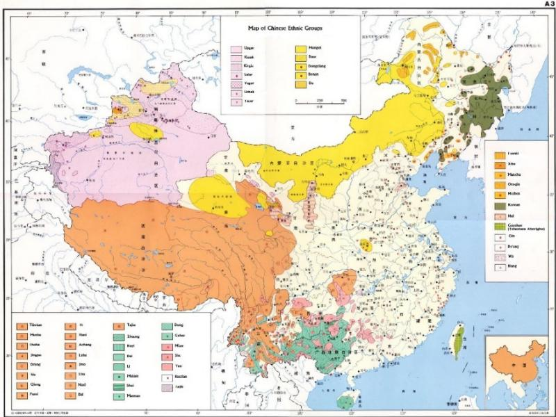  
Map 1. Ethnic groups within China (Hao, 2002, A3)

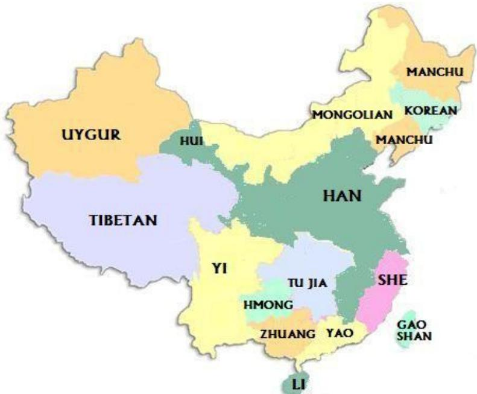  
Map 2. Simplified map of ethnic group distribution in China (Author, after Hao, 2002)

在1929年夏季，一位名叫汉斯·斯图贝尔的德国教授与他的学生李华明一起前往浙江省景宁县，这是一个居住着畲族的县。后来他们出版了一本名为《浙江景宁赤目山畲族调查》（1933）的书，记录了该县的畲族家族、姓氏、人口和文化。以斯图贝尔和华明的研究为基础，我于同一地区进行了两次实地考察。第一次是在2014年1月27日至29日举行的主题为“畲族魅力”的临时展览，展览在浙江绍兴博物馆进行，为期三天。展出品主要来自浙江省博物馆和丽水市博物馆，展览的主要目的是提升对畲族文化的关注，浙江省政府也正式致力于保护畲族文化遗产。此次展览首次展现了畲族及其文化，并促使我决定访问唯一的畲族自治县景宁（丽水）。第二次也是主要的实地考察发生在2014年6月至9月，在畲族自治县的一个小山谷中，我与畲族人共同生活了70多天。在此期间，我收集并研究了神话，以证明畲族人如何在当代社会中保存、传承和运用他们的故事。畲族人将这些故事视为极其重要的文化遗产，故事的叙述与视觉表现相结合，创造出独特的图像风格。故事叙述者以各种方式对这些叙事进行了创造性的改编。接下来将更详细地考察畲族人如何将这种叙述用于《高皇歌》或《高皇歌》。该歌曲描述了畲族祖先的起源。

这个神话始于神皇高欣的时代，他的妻子耳朵剧痛。皇帝召来了医生，发现女王的耳朵里有一个带血的球体。医生拔出了这个球体，迅速变成了一只龙头独角兽，名为蹇虎。多年以后，侵略者攻击了王国，克服了所有的抵抗。高欣皇帝承诺，只要能保护家园不受敌人侵害的人，就可以娶公主。蹇虎接受了这个挑战，并击败了入侵者。归来后，蹇虎娶了皇帝的女儿，并成为了他的继承者。蹇虎和公主育有四个孩子，皇帝为他们起了不同的姓氏。随着他们的父亲成为其他城镇的统治者，他们在不同地方定居，形成了现今这些省份的畲族群体的祖先。蹇虎被任命为广东省的统治者，随后最终去向道士学习。以下一组现存于浙江博物馆的图片描绘了这个神话的情节。

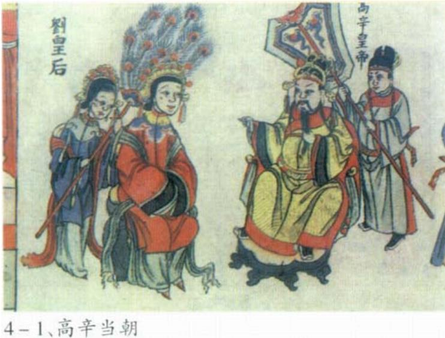  
Figure 1. The Emperor Gao Xin had a queen who was called Liu

  
Figure . The Queen suffered pain in her ear. Doctors were called and extracte a bloody ball. The blood ball started to grow, and in a sudden flash, turned into a dragon-unicorn, named Panhu

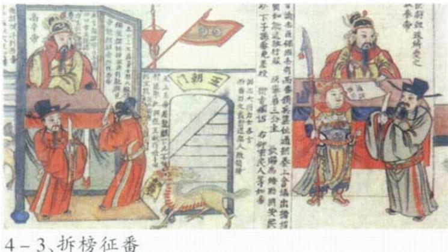  
Figure 3.When invaders entered the kingdom, nobody dared to resist, but the dragon-unicorn promised to defend the kingdom against its enemies

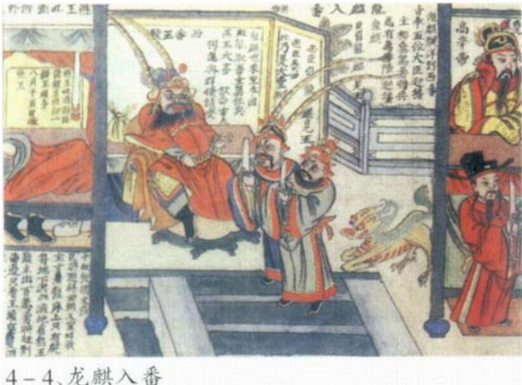  
P ot u yst  nehehevae aie theleadr. anuthen kille thevaer' leader by thisecwhile was seepinThevade w defeated without any soldiers or weapons

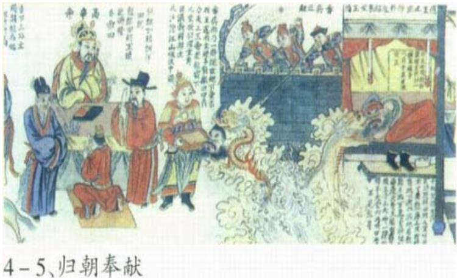  
Figure 5. Panhu took the head of the leader, and returned to present it to the Emperor

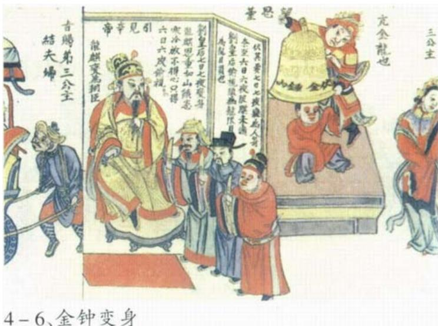  
Figure 6. Gao Xin rewarded the dragon-unicorn with by giving him his third daughter in marriage. The day before the wedding, Panhu transformed into a man, crowned by a large bell

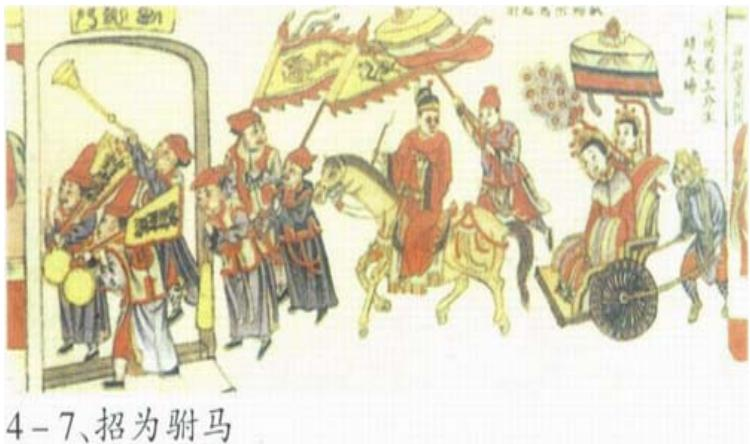  
Figure 7. The marriage was celebrated with a large party, and Panhu became the prince of the kingdom

  
Figure 8. Panhu was given surnames for his four children by the Emperor Gao Xin

  
Figure 9. Panhu was made ruler of Canton Province, and moved his whole family to this area

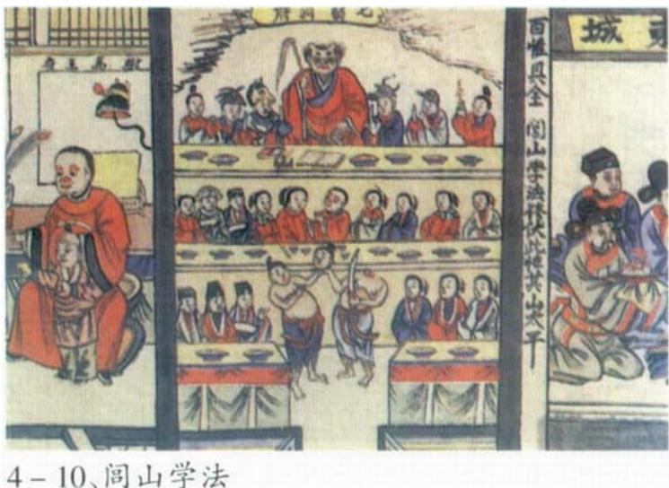  
Figure 10. Later, Panhu went to the mountains to learn skills from a Taoist priest

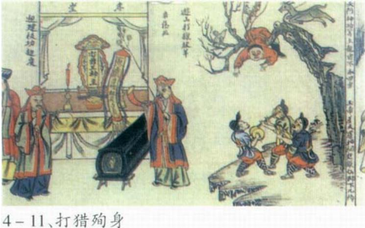  
Figure 11. Panhu was killed accidentally when hunting

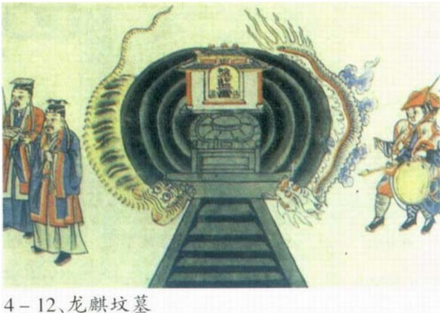  
Figure 12. His offspring buried his body and built a tomb for him in Canton Province

史诗通常在祭祖仪式中叙述，尽管它们的内容可能与神话在形式和角色上相似。例如，史诗通常在每年的祭祖节期间讲述，这些仪式在不同地区有所不同。我将以浙江省的一个仪式为案例研究，该仪式被列为该省的非物质文化遗产。几乎所有在浙江地区由社团主办的仪式都经历三个阶段：首先是向祖先敬酒，然后向天地鞠躬，最后由年长者（被视为群体中知识最渊博的人）演唱史诗。尽管在祭祀仪式中能够演唱史诗的长者越来越少，但这一传统仍然传承给了下一代。

与史诗相关的图像有多种形式。这里呈现的大多数版本是绘制在白色棉布上，这些图像要么被插入在家谱书的开头，要么用于描述那些被视为神圣的角色。图13展示了一根雕刻的法杖，这种法杖通常被安放在祖先神庙的中心。法杖上雕刻的图案是龙形神兽，它与人们的历史根源有关。它象征着史诗中的人的形象和象征物之间的关系。我们可以借鉴莱维-斯特劳斯（Levi-Strauss, 1986, 18）对图像、符号和概念的讨论。他指出，符号是图像与概念之间的中介，符号与图像相似，都是具体的实体，但符号则表征概念。概念具有无限的能力，因此法杖和类似的神圣物品可以被视为在它们之间进行中介的符号。

  
Figure 13. Carved wand featuring dragon-unicorn (Photo by author: 27 January 2014)

该论文探讨了她如何在现代化的中国国家背景下，理性地运用其神话遗产，以实现物质和象征性的双重目标。

# 5. 现代女性世界中的神话

在探讨畲族史诗代际传承的过程中，一位年轻的畲族男性告诉我，对于他这一代人来说，神话并不是从长辈那里口述学习的，而是通过汉族人编写的描述性书籍而获得的。因此，畲族首先是通过他人的描述来认识自己的。这并不是一个新现象，因为畲族的神话似乎是基于汉朝至清朝时期产生的汉族叙事，并由畲族进行重构的。通过比较来自畲族地区的故事与汉代经典文献中记录的故事，我将指出畲族参与了一种转型和重评过程，这一过程正如列维-斯特劳斯（Lévi-Strauss）所描述的亲属关系（1963年）。这一过程可以通过这三方面的史诗来观察。

该方面的第一个内容是神话内容的体现性修改。根据博阿斯（189）所述，看起来神话世界不仅被构建起来，又被打破，新的世界则从碎片中重新建立。这种将神话视为由离散元素组成的思想，可以以不同的方式组合和重组以产生不同的意义，得到了列维-斯特劳斯（1963）的发展，他认为神话类似于语言，由音素、形态素和语意素等离散元素构成，主张“在神话中存在较高和更复杂秩序的基本成分单元，其内容虽不完全相同但可以变化。”显然，潘虎所基于的汉代经典作品《风俗通义》于公元189年左右发表，描述了蛇族的起源，并提到了一位养了一只毛色斑斓犬的皇帝。这只狗被称为潘虎（应，2010）。另一部书《搜神记》则更详细地记录了这个故事：“高辛的妻子耳朵疼，医生引导了一条虫，然后把它放在一个地方并命名它为‘盘’，而这个虫子后来变成了一只毛色斑斓的狗。”（甘，1979）在这一作品出版几百年后。

风俗通义中，盘虎的故事以汉字书写，由畲族人自己创作（Lan, 2011）。然而，在畲族版本的故事中，狗被转变成了龙独角兽。虽然汉族人视狗为一种平凡卑微的动物，但龙独角兽这一神话生物则被视为极为尊贵。因此，将平凡的狗转变为尊贵的龙独角兽，可以看作是一种合理的举动，使这一史诗的内容更易于让年轻的畲族人理解。根据列维-斯特劳斯（Lévi-Strauss，1963）的说法，神话思维中的逻辑与现代科学同样严谨。因此，畲族人以理性的方式改编他们的神话，使古代的奇幻元素与较近历史的已知变得相连。例如，在故事的结尾，畲族人会加入他们自己的迁徙路线，使得史诗对他们的孩子来说更加有意义。

在社的神话中可以观察到的第二个方面是神话的图形表现。虽然口头传颂的史诗在理性上被改编，以与特定群体的已知历史和生活经历相联系，但该群体的图形描绘被视为神圣，不受修改。然而，有证据表明，过去确实发生过转变。最有意义的形象是龙—独角兽，它被视为社人群的象征。前文展示了社人如何将狗转变为龙—独角兽，这被主导的汉族群体视为一种更具威严的生物。然而，社人为何选择这一特定的动物而非其他动物呢？列维-斯特劳斯指出，人与图腾之间没有直接的关系。唯一可能的关系必须是“伪装的”，因此是隐喻性的。从这个隐喻的视角出发，我们可以解释为何选择龙—独角兽作为关键象征，因为这使它们成为高地位的生物，而龙是中国主导的汉族的象征。龙与独角兽的结合暗示着社人正在重申一种不亚于甚至高于汉族的地位。这种解释也许可以在社的刺绣和女性发饰中找到证据（见图1）。凤凰是一种神话鸟，在中国历史上，凤凰与龙有着相同的象征意义，但表征的是女性的特质，与龙的男性气质形成对比。由于社人传统上是母系社会，凤凰对他们尤为重要，并与雄性的龙—独角兽配对，作为社女性身份的象征（庞金，2007）。

  
Figure 14. Women's ornaments featuring the Phoenix (Photo by author: 27 January 2014)

然后，狗在古典中文中提到的社群中又有什么呢？事实上，尽管汉代的文献中描绘了与狗陪伴的社人（见下图15），而且大多数学者在浙江访问的社村也显示狗作为社群的重要组成部分。

  
Figure 15. Statue of She man accompanied by a dog in ancestral temple (Photo by author: 27 January 2014)

十九世纪末，英语贸易商和翻译者朗对奥吉布瓦人表示，氏族名称和关于守护精灵的信仰之间存在混淆（列维-斯特劳斯，1973，87）。他提到狗可以被视为守护动物。支持这一解释的证据来自于1985年由惠昌宗教和民族事务局保存的一份文件，其中记录了官员与一位75岁姓沈的老人兰华金之间的对话（曹，2014）：当我年轻时，大约十岁，我的爷爷告诉我，我们的姓是兰，曾经我们的家族在庙宇中祭祀，传说狗是沈族的守护神…… 藏族以象征群体的动物和被视为守护者的动物之间的差异，可能对汉人等外来者并不明显，后者在庆典和仪式上可能看到了这些被尊崇的动物，但并未完全理解每种动物所附带的意义。

她神话的第三个方面体现在叙述过程中变革和再评估的明显性上。当故事被他人，例如汉人，叙述时，社的史诗故事可能显得奇怪且难以置信，但我们能够对这些故事产生情感共鸣，并将其与听众联系起来。尽管故事的结构可能从根本上保持不变，但意义和情感内容是从他们自身的视角重构的，这在叙述中显而易见。叙述者常常作为外部观察者，审视甚至俯视其他民族的生活。当汉人叙述故事时，叙述者从他们个人的角度出发，故事从他们的视角进行讲述。勒维-斯特劳斯指出，童话无非是将某种形式通过叙述者的情感传达给听众。因此，社的讲故事者会添加他们认为合理的内容，而忽略那些看似无意义或荒谬之处。社人民从他们所听到的旧一代的史诗叙述、家族书籍中的记录、以及他们祖庙中的文物和仪式中汲取灵感，来为自己重建这些神话。尽管这些故事最初是基于汉人的经典文学，今天的社人可能在汉学校中首先接触到这些故事，但社的叙述基于他们自己的来源，并在现代世界中具有合理性。

# 6. 结论

史诗的瑟氏不仅服务于维护民族认同和声望，还可能被用于实现与现代化国家相关的物质利益。在接下来的几年里，该村将与政府合作，开发通往满湖的路线。这一项目与瑟氏的起源神话以及斯图贝尔住宿的重新建立相关，该住宿如今仍然保留着传统。尽管施特劳斯认为神话在现代世界的艺术中充满神秘感，但在当代中国，神话可能被视为中国现代性中的一个重要且有时是核心的元素。

# References

Annoymous. (1978). Myth and meaning. London (etc.): Routledge and Kegan Paul.

Bas F88. "Introduction JamesTeit, Traditons f theThompsoRiver IndiansBritish Colu. Memories of American Folklore Society.

Cao, D. M. (2014). Reconstruct She people, Beijing: China Publishing Group Corp. . (2014). .

Clarke, S. (1981). The Foundations of Structuralism: a Critique ofLevi-Strauss and the Structuralist Movement The Harvester Press / Barnes & Noble Books.

Cruz, L.& FrijhofW. ds. (00). Itruci:Myth ihistry, history n myth,Proinsof the International Conference of the Society for Netherlandic History New York: June 5-6, 2006. Myth in History, History in Myth. Leiden, Boston: Brill.

Ell R.F.(8). What Black El t nsaid: hellusoy aes f Gree primiivi.Anth Today 2.

Fowler, H. W., & Fowler, F. G. (1995). The Concise Oxford dictionary of current English. Oxford: Oxford University Press.

Gan, B. (1979). In S. Y. Wang (Trans.), History of Searching God. Beijing: Zhonghua Book Company. F. (1979):.+.:.

Hao, S. Y. (2002). Atlas of Distribution of National Minorities in China. Beijing: Sinomaps Press. (2002).:.

Herodotus. (1987). The History. Chicago, London: University of Chicago Press.

Lan, L. (2011). Art value of She Ancient Graphs. Studies in Culture and Art, 4(1).. (2011). 4(1).

Lévi-Strauss, C. (1963). Structural anthropology vol.1, New York: Basic Books.

Lévi-Strauss, C. (1963). Structural anthropology vol.2, New York: Basic Books.

Lévi-Strauss, C. (1966). Savage mind. London: George Weidenfeld and Nicolson Ltd.

Lévi-Strauss, C. (1973). Totemism. Harmondsworth: Penguin.

Malcolm, M. W. (1976). A Companion to The Iliad. Chicago: University of Chicago Press.

Milton, K. (1996). Environmentalism and cultural theory: exploring the role of anthropology in environmentai discourse. London: Routledge.

Nevena Dimitrova, P. (2013). From Logos to 'Dialogos': the Problem of Ignorance and the 'Dialogical' Knowledge According to St. Maximus the Confessor. Communio viatorum.

Pang, J. (2007). Chinese Phoenix Culture. Chongqin: Chongqing Press. . (2007).. .

Segal, R. A. (2004). Myth: A Very Short Introduction. Oxford: Oxford University Press.

Verant, J.P. (1980). yth and Society inAncient Greece.Brighton: Harvester Press; Atlantic Highlands, N.J. Humanities Press.

Y Z. 10. In L. Warans Geal uBeij Zo Boo (2010

Zhejiang Ethnic Affairs Commission. (1992). Gao Guang Song of She Group. Beijing: China Radio & Television Publishing House. . (1992)..: At.

Zhong, J. . (1990). Discussion about Epics, Study of Gelsall. Gansu: Gansu Ethnic Press.. (1990) .In  (Ed.),  (Vol.1), #.

# Copyrights

Copyright for this article is retained by the author(s), with first publication rights granted to the joural.

This is an open-access artile istributedunder the ters and conditions of theCreativeCommons Attrut license (http://creativecommons.org/licenses/by/4.0/).