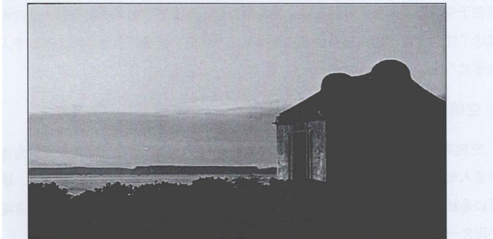
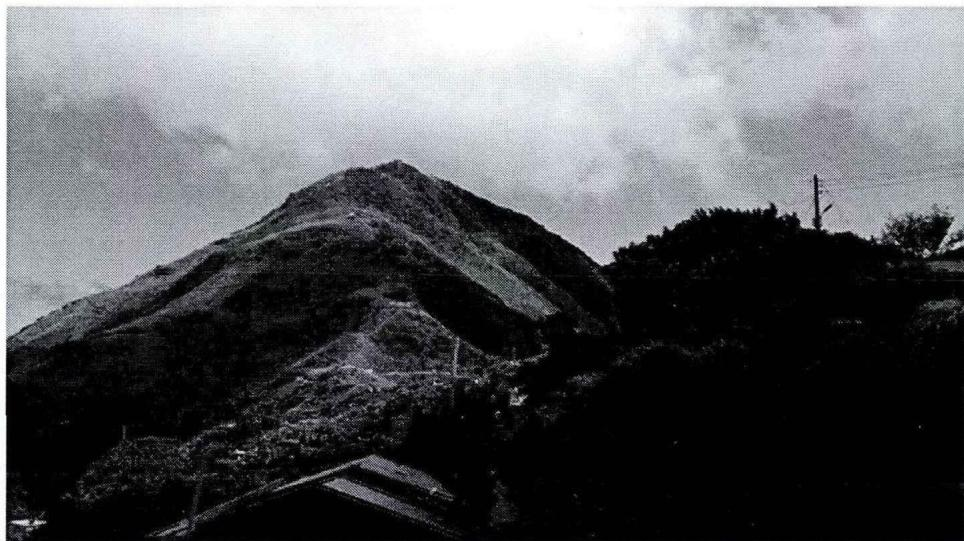
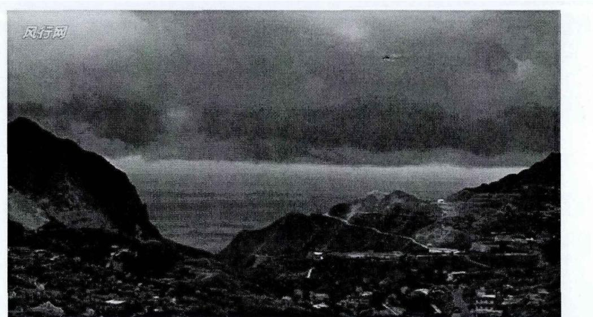
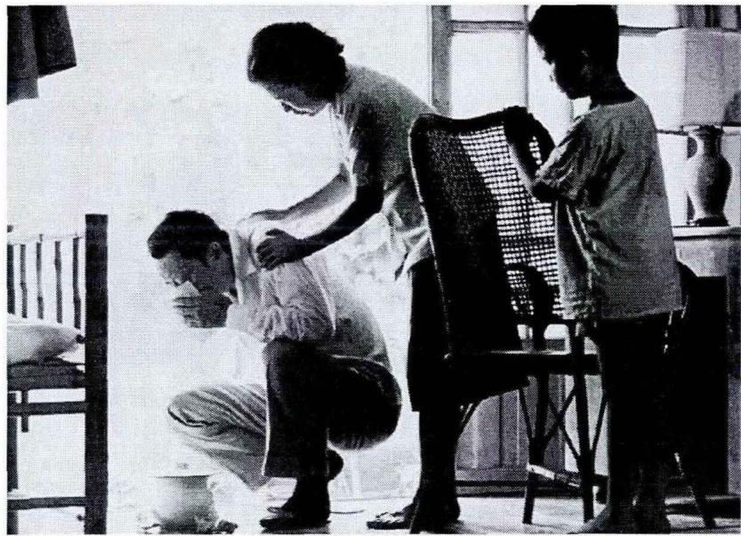

# 1. 论文基本信息
## 1.1 标题
本论文核心主题为**侯孝贤电影的美学风格研究**，英文并列标题为 *Research on Artistic Style of Hou Hsiao-hsien's Movies*，属于电影艺术、美学研究领域，聚焦台湾新电影代表人物侯孝贤的创作风格体系化梳理。
## 1.2 作者
作者为王莉，就读于太原理工大学设计艺术学专业，研究方向为现代媒体艺术，导师为胡钢锋副教授，本论文为其2014年提交的硕士学位论文。
## 1.3 发表/完成单位
本论文为太原理工大学硕士学位论文，未在期刊/会议公开发表，属于学位论文类研究成果。太原理工大学为山西省重点高校，其设计艺术学专业聚焦媒体艺术、视觉设计等方向的研究。
## 1.4 完成年份
2014年。
## 1.5 摘要
本论文以侯孝贤的电影艺术风格为研究对象，旨在弥补当时大陆学界缺乏侯孝贤电影系统美学研究的空白，核心研究逻辑为：① 从长镜头、空镜头、影调、固定机位四个维度，提炼侯孝贤电影的外在美学特征；② 总结其纪实美学的恒定内核；③ 追溯其风格形成的三大来源：东方传统文化熏陶、个人诗性气质、巴赞纪实美学影响；④ 归纳其对中国电影的四方面影响。研究以侯孝贤18部作品为核心素材，采用文献研究、文本分析、比较研究等方法，最终构建了完整的侯孝贤美学分析框架，为后续研究提供了系统性的美学视角参考。
## 1.6 原文链接
- 原文上传链接：`uploaded://60260ee5-dd27-4a86-aa01-b0162f65ddb7`
- PDF链接：`/files/papers/69c52449f25d470fe6d395f0/paper.pdf`
- 发布状态：已完成的硕士学位论文。
  ---
# 2. 整体概括
## 2.1 研究背景与动机
### 2.1.1 核心问题
论文试图解决的核心问题是：侯孝贤电影独特的美学体系是什么？其形成的根源是什么？对中国电影发展有哪些价值？
### 2.1.2 研究必要性与领域空白
侯孝贤是<strong>台湾新电影（Taiwan New Cinema，20世纪80年代台湾兴起的写实主义电影革新运动，核心导演包括侯孝贤、杨德昌等，主张关注本土现实与历史记忆）</strong>的核心代表人物，多次获得威尼斯、戛纳等国际电影节大奖，是华语电影在世界影坛的标志性人物。但在本研究开展的2014年，大陆学界对侯孝贤的研究存在明显短板：① 大多为单部作品的零散影评，缺乏对其全部作品的系统梳理；② 研究维度集中在叙事、历史记忆、长镜头技法等单一方向，缺乏从美学层面对其风格的整体提炼；③ 未形成完整的“特征-来源-影响”的分析链条，相关研究如散落的宝石缺乏串联。
### 2.1.3 创新切入点
本论文首次从系统美学视角切入，覆盖侯孝贤从早期商业片到后期历史题材的全部18部作品，构建了完整的侯孝贤美学研究框架，弥补了此前研究的系统性空白。
## 2.2 核心贡献与主要发现
### 2.2.1 核心贡献
1.  **美学特征提炼**：首次将侯孝贤的外在美学特征归纳为四个维度：长镜头的“人与自然统一”和谐美、空镜头的“虚实结合”诗意美、影调的泼墨写意美、固定机位的朴素美，清晰呈现了侯孝贤电影的美学辨识度。
2.  **风格溯源**：明确了侯孝贤美学的三大来源：东方传统文化（中国古典美学、客家文化、台湾本土历史）的内化、个人诗性气质的表达、西方巴赞纪实美学的实践，厘清了其东西方融合的风格成因。
3.  **价值总结**：系统总结了侯孝贤对中国电影的四方面影响：省略叙事的缺陷美、文化表达的丰富性、历史记忆的厚重感、人性挖掘的深度，为后续华语电影创作提供了参考。
### 2.2.2 主要结论
侯孝贤的电影美学是东西方文化融合的产物：既践行了西方纪实美学的真实追求，又融入了中国古典美学的写意、留白特质，同时承载了台湾本土的历史记忆，其创作打破了传统电影的二元对立叙事模式，构建了独有的“侯氏美学”体系，为华语电影的国际化和本土化结合提供了成功范例。
---
# 3. 预备知识与相关工作
## 3.1 基础概念
为方便初学者理解，本部分对论文涉及的核心专业术语进行解释：
1.  <strong>长镜头（Long-take）</strong>：也叫长拍镜头，指连续拍摄数十秒到数分钟不进行剪切的镜头，能够完整保留事件发生的时空完整性，增强画面的真实感，避免人为剪切对现实的割裂。
2.  <strong>空镜头（Empty Shot）</strong>：指没有人物出现、仅呈现景物的镜头，通常用来烘托情绪、营造意境、实现场景转换，在艺术电影中常作为写意表达的重要手段。
3.  <strong>固定机位（Fixed Camera Position）</strong>：指拍摄过程中摄影机的位置、角度、焦距均保持不变的拍摄方式，能够保持画面的稳定感和客观感，弱化导演的主观引导，让观众自主观察画面内容。
4.  <strong>景深镜头（Depth of Field Lens）</strong>：指通过调整光圈、焦距等参数，使画面中从近景到远景的所有景物都清晰成像的镜头，能够完整保留空间内的全部信息，让观众自主选择关注重点，是纪实美学的核心技术手段之一。
5.  **巴赞纪实美学**：法国电影理论家安德烈·巴赞提出的电影理论体系，核心主张为：电影的本质是记录现实，应通过长镜头、景深镜头等技术手段，客观呈现现实的多义性，避免导演的主观干预，让观众自主解读内容。
6.  <strong>省略叙事（Ellipsis Narrative）</strong>：指有意跳过事件的前因后果、中间过程，仅呈现关键片段的叙事手法，能够营造留白感，留给观众自行想象补充的空间，增强作品的多义性。
## 3.2 前人工作
本领域的研究可分为台湾和大陆两个脉络：
### 3.2.1 台湾地区研究
台湾学界对侯孝贤的研究起步于20世纪80年代，研究更为系统深入：
- 焦雄屏是最早系统研究侯孝贤的学者，1988年主编的《台湾新电影》收录了多篇侯孝贤电影的评论，首次将其创作与台湾社会、历史脉络结合，奠定了侯孝贤研究的基础。
- 2000年林文淇、沈晓茵、李振亚主编的《戏恋人生：侯孝贤电影研究》是全球第一本侯孝贤研究专著，集结了十年间国内外的核心研究成果，是该领域的权威参考资料。
- 台湾地区的研究多聚焦侯孝贤电影的历史表达、身份认同、文化内涵等方向，已经形成了较为成熟的研究体系。
### 3.2.2 大陆地区研究
大陆学界对侯孝贤的研究起步于20世纪90年代中期，整体较为零散，可分为两个方向：
- **人文方向研究**：吴冠平、李道新、胡克等学者关注侯孝贤电影的人文内涵、历史记忆、本土文化表达，认为其作品是台湾文化身份的符号，承载了中国传统文化的内核。
- **技法方向研究**：陈旭光、范志忠等学者聚焦侯孝贤的长镜头、剪辑、声音等技法特征，分析其写实性的实现路径，部分研究对比了侯孝贤与贾樟柯等大陆第六代导演的技法差异。
  但大陆地区此前的研究缺乏从美学层面对侯孝贤整个创作生涯的系统梳理，是本研究要填补的核心空白。
## 3.3 技术演进
台湾电影的创作脉络可分为三个阶段，本研究的对象侯孝贤处于第二到第三阶段的转折点：
1.  **1980年之前**：台湾电影以商业通俗剧为主，主打明星阵容、套路化叙事，缺乏写实性和本土表达。
2.  **1980-1990年**：台湾新电影运动兴起，侯孝贤、杨德昌等导演转向写实主义，关注本土社会和小人物命运，大量使用长镜头、固定机位等技法，逐渐形成了独特的艺术风格，侯孝贤的《风柜来的人》《悲情城市》等作品是该阶段的标志性成果。
3.  **1990年之后**：侯孝贤的创作从个人成长记忆转向台湾历史表达，推出“台湾三部曲”（《悲情城市》《戏梦人生》《好男好女》），其美学风格完全成熟，成为国际公认的电影大师。
## 3.4 差异化分析
本研究与此前的相关研究相比，核心差异和创新点在于：
1.  **视角创新**：首次从系统美学视角切入，而非零散的技法、人文分析，构建了完整的侯孝贤美学框架。
2.  **覆盖全面**：覆盖侯孝贤从1980年到2013年的全部18部作品，而非仅聚焦几部经典作品，能够完整呈现其美学风格的演变过程。
3.  **逻辑完整**：形成了“外在特征-内在内核-风格来源-行业影响”的完整分析链条，而非单一维度的讨论，研究的系统性更强。
    ---
# 4. 方法论
本研究为艺术学人文研究，采用三种核心研究方法，无理工科类的算法、公式。
## 4.1 方法原理
本研究的核心逻辑是：以美学理论为支撑，以侯孝贤的全部作品为研究对象，从外在形式特征到内在内核，再到风格成因和行业价值，逐层拆解侯孝贤的美学体系，弥补此前研究的系统性空白。
## 4.2 核心方法详解
### 4.2.1 文献研究法
首先搜集整理三类核心文献，作为研究的理论基础：
1.  侯孝贤相关研究文献：包括台湾和大陆学界的所有核心研究成果、侯孝贤的公开访谈、编剧朱天文的创作记录等，梳理现有研究的成果与空白。
2.  美学理论文献：包括中国古典美学（留白、写意、天人合一等思想）、西方电影美学（巴赞纪实美学等）的相关著作，构建研究的理论框架。
3.  台湾历史文化资料：梳理台湾从日治时期到战后的历史脉络、客家文化等本土文化特征，为分析侯孝贤电影的历史表达提供背景支撑。
### 4.2.2 文本分析法
对侯孝贤的18部电影作品进行逐部细读，从四个维度拆解作品特征：
1.  镜头语言：分析长镜头、空镜头、固定机位、景深镜头的使用场景、频率、表达效果。
2.  影调风格：分析色调、光线的使用特征，以及其营造的氛围。
3.  叙事特征：分析叙事结构、省略手法的使用、因果关系的处理等。
4.  文化表达：分析作品中的方言、民俗、历史事件的呈现方式，挖掘其文化内核。
    通过对所有作品的特征归纳，提炼出共性的美学特质。
### 4.2.3 比较研究法
通过三个维度的对比，明确侯孝贤美学的传承与创新：
1.  与中国古典美学对比：分析侯孝贤的空镜头、影调与中国山水画留白、泼墨写意的关联性，明确其东方文化内核。
2.  与巴赞纪实美学对比：分析侯孝贤的长镜头、景深镜头使用与巴赞理论的契合点，以及其融入东方诗意的创新之处。
3.  与同时代导演对比：与小津安二郎、杨德昌等导演的风格对比，明确侯孝贤美学的独特性。
    ---
# 5. 研究对象与评估维度
（注：本研究为人文社科类研究，无理工科类的实验、量化评估指标，因此对框架内容进行学科适配）
## 5.1 研究对象（对应框架“数据集”）
### 5.1.1 核心研究对象
本研究的核心对象是侯孝贤执导的18部剧情长片，完整覆盖其从早期商业片到成熟艺术片的整个创作生涯，具体作品包括：《就是溜溜的她》（1980）、《风儿踢踏踩》（1981）、《在那河畔青草青》（1982）、《风柜来的人》（1983）、《儿子的大玩偶》（1983）、《冬冬的假期》（1984）、《童年往事》（1985）、《恋恋风尘》（1986）、《尼罗河女儿》（1987）、《悲情城市》（1989）、《戏梦人生》（1993）、《好男好女》（1995）、《南国再见，南国》（1996）、《海上花》（1998）、《千禧曼波》（2001）、《咖啡时光》（2004）、《最好的时光》（2005）、《聂隐娘》（2013）。
这些作品覆盖了个人成长、乡土生活、历史变迁、都市生存等多个题材，能够全面反映侯孝贤美学风格的形成与演变，具备足够的代表性。
### 5.1.2 辅助研究资料
包括侯孝贤公开访谈、编剧朱天文的创作笔记、台湾历史文化资料、国内外相关研究文献，作为作品分析的补充支撑。
## 5.2 评估维度（对应框架“评估指标”）
本研究采用人文社科艺术研究的通用评估维度，无量化计算公式：
1.  **文本契合度**：评估研究结论是否与侯孝贤电影的实际内容一致，是否存在脱离作品的主观臆断，要求所有结论都有对应的作品片段作为支撑。
2.  **理论自洽性**：评估构建的美学分析框架逻辑是否通顺，外在特征、内核、来源、影响四个部分是否能够相互支撑，没有逻辑矛盾。
3.  **学术创新性**：评估研究内容是否填补了现有研究的空白，是否提出了新的分析视角或结论，对后续研究是否有参考价值。
## 5.3 对比基线（对应框架“对比基线”）
本研究的对比基线为已有的侯孝贤相关研究成果：
1.  台湾地区的成熟研究（焦雄屏、林文淇等学者的成果）：对比本研究在美学视角上的独特性，以及针对大陆研究空白的补充价值。
2.  大陆地区的零散研究（单部作品评论、单一维度分析）：对比本研究的系统性和完整性，验证其对现有研究的拓展价值。
    ---
# 6. 研究结果与分析
## 6.1 核心结果分析
### 6.1.1 四大外在美学特征
#### （1）长镜头：人与自然统一的和谐美
侯孝贤的长镜头追求客观、冷静的视角，完整记录人物与环境的互动，不刻意引导观众情绪，突出“天人合一”的和谐感。其长镜头使用受沈从文自传的影响，秉持“阳光底下所有事都可以包容”的客观叙事态度。
典型案例为《风柜来的人》中的海边长镜头：少年们惹事之后坐在海边小屋旁，长镜头取远景，远山、海水、小屋与迷茫的少年融为一体，既渲染了少年对未来的迷茫情绪，也呈现了人与自然的和谐共存之美。

*该图像是插图，展示了《风柜来的人》中的自然景观与建筑结构，运用长镜头手法渲染人与自然和谐的美感，突出了宁静的氛围。*

#### （2）空镜头：虚实结合的诗意美
侯孝贤的空镜头相当于中国山水画的“留白”，看似无人物的“虚”景，实则承载了人物情绪、时代氛围的“实”质内容，实现了虚实结合的诗意表达。
典型案例包括：
- 《悲情城市》中的山海空镜头，雾蒙蒙的山海没有人物，却烘托了时代的压抑感和人物命运的无常。

  
  *该图像是图 2-2，展示了《悲情城市》中空镜头的表现手法，主要以黑白色调呈现出景深和空间感，体现了“虚”与“实”的对比。*

- 《恋恋风尘》中的山空镜头，高耸的山峰和流动的云表现了时间的永恒，与人物短暂的情感创伤形成对比。

  
  *该图像是图 2-3，展示了《恋恋风尘》中空镜头“山”的画面，表现出世间的永恒。黑白色调的山峰高耸，背景云朵阴沉，营造了宁静而又深邃的气氛。*

- 《恋恋风尘》结尾的山城空镜头，灰蒙蒙的天际和层云抚平了人物的情感创伤，传递出坚韧的生活态度。

  
  *该图像是插图，表现了《恋恋风尘》中的空镜头“山城”，展示了主人翁内心的创伤与孤独感。阴霾的天空与绵延的山脉相映衬，形成了一种压抑的氛围。*

#### （3）影调：淡淡悠长的泼墨写意美
侯孝贤的影调借鉴了中国泼墨山水画的特征，通过两个层面实现写意表达：
- 黑白灰色调：大量使用黑、白、灰的低饱和度色调，像老照片一样传递历史感和苍凉感。比如《童年往事》的灰白色调，表现了从大陆迁往台湾的外乡人的生活艰辛，唤起观众对过往的回忆。

  
  *该图像是插图，表现了生活的艰辛。画面中一位男子蹲在地上，表情沉重，旁边一位女性在安慰他，另有一名儿童在一旁观望，整体运用灰白色调，传达出浓厚的情感和压抑的氛围。*

再比如《好男好女》的黑白灰色调，既表现了主人公的颓废生活状态，也映射了时代的压抑氛围。

*该图像是插图，展示了电影《好男好女》中人物的黑白灰色调表现，营造出生活的颓废感。图中人物神情凝重，背景昏暗，强化了情节的压抑氛围。*

- 平实自然光：大量使用自然实景光线，拒绝人工打光的夸张效果，呈现出素雅的古典美感。比如《童年往事》中穿透树叶的斑驳光线、雨天的自然柔光，烘托出生活的朴素质感。
  此外，侯孝贤通过合理的场面调度（根据场景内容移动镜头），避免长镜头的僵硬感，让画面保持自然生动。
#### （4）固定机位：还原真实的朴素美
侯孝贤大量使用固定机位拍摄，秉持“机位不动来表达心境的沉着”的理念，以客观的视角还原生活的本来面目，避免镜头运动带来的主观引导。
典型案例包括：
- 《恋恋风尘》全片仅5个运动镜头，其余全部为固定机位切换，完整还原了乡村少年的成长状态，呈现出朴素的生活质感。
- 《悲情城市》中狱友被枪毙的段落：固定机位拍摄文清坐在狱中，狱友平静地告别，画外传来枪响，随后镜头切到文清一家吃饭的场景。平静的固定机位反衬出时代动荡下小人物的无力，带来强烈的情感冲击。
### 6.1.2 内在恒定美学特质：纪实美学
侯孝贤所有作品的核心内核是对纪实美学的追求，其纪实性体现在两个层面：
1.  **个体生命的记录**：关注边缘小人物的生存状态，不做道德评判，客观呈现生命的本来面目。比如早期的《风柜来的人》记录迷茫的乡村少年，《童年往事》记录自己的家庭成长经历，都是对普通人生命轨迹的真实呈现。
2.  **历史记忆的记录**：后期的“台湾三部曲”打破政治禁忌，以庶民的视角记录台湾被官方历史忽略的片段：《悲情城市》记录二二八事件下普通人的命运，《戏梦人生》以布袋戏大师李天禄的生平记录日治时期的台湾社会，《好男好女》记录白色恐怖时期的历史，为大众提供了官方叙事之外的庶民历史记忆。
    其纪实性通过镜头实现：长镜头保留时间的完整性，景深镜头保留空间的完整性，让观众自主解读内容，避免导演的主观干预。
### 6.1.3 美学风格三大来源
1.  **东方传统文化的熏陶**：侯孝贤深受中国古典美学和台湾本土文化的影响：① 美学表达上借鉴中国山水画的留白、泼墨写意思想；② 文化内核上呈现客家文化的朴素特质，大量使用方言、民俗元素；③ 历史表达上聚焦台湾本土的庶民记忆，承载了中国传统文化的归属感。
2.  **诗性气质与文化的客观表述**：侯孝贤具有独特的诗性表达能力，通过光线、声音的处理营造诗化意境：① 光线偏好暗调、自然光，传递古旧、深远的中国文化质感；② 声音处理上采用现场同步录音，音画不同步的设计让观众保持距离感，客观思考历史内容。
3.  **巴赞纪实美学的影响**：侯孝贤是巴赞纪实美学的忠实践行者：① 大量使用长镜头、景深镜头，保留时空的完整性；② 偏好使用非职业演员，捕捉最自然的生活状态；③ 采用客观的叙事视角，不做道德评判，保留现实的多义性，与巴赞的理论主张高度契合。
### 6.1.4 对中国电影的四方面影响
1.  **省略手法的缺陷美叙事**：侯孝贤借鉴中国水墨画的留白思路，大量使用省略叙事，跳过事件的因果关系和中间过程，仅呈现关键片段，打破了传统叙事的完整性要求，形成了独特的缺陷美，给观众留下了充足的想象空间。
2.  **丰富多样的文化表达**：侯孝贤的电影融合了传统戏曲、地方民俗、本土文化等多元元素，打破了商业电影套路化的叙事模式，为华语电影的文化表达提供了更多可能性。
3.  **历史回忆的大气之美**：侯孝贤的电影将个人成长记忆与时代历史变迁结合，既记录了个体的命运，也承载了民族的集体记忆，为华语电影的历史题材创作提供了“以小见大”的范例。
4.  **人性美的挖掘**：侯孝贤始终关注小人物的命运，挖掘普通人身上的坚韧、豁达等传统美德，传递了人文关怀，让电影回归“人”本身的表达。
## 6.2 支撑数据分析
论文通过对《童年往事》中主角阿孝的服饰统计，支撑了客家文化对侯孝贤的影响的结论，以下是原文表4-1的结果：

| 类别 | 服饰 | 时间/秒 | 时间合计/秒 | 百分比/% |
| --- | --- | --- | --- | --- |
| 制服 | 卡其裤 | 2332 | 3665 | 64 |
|  | 白色短袖 | 878 |  |  |
|  | 蓝色制服外套 | 455 |  |  |
| 素色 | 白色短袖内衣 | 563 | 1136 | 20 |
|  | 白色无袖内衣 | 573 |  |  |
| 流行款式 | 格子衬衫 | 612 | 946 | 16 |
|  | 喇叭裤 | 334 |  |  |

从统计结果可以看出，阿孝的服饰以单一色调的制服和素色服装为主，占比高达84%，符合客家文化朴素、节俭的特质，验证了侯孝贤对本土文化的自然呈现。
## 6.3 风格验证分析（对应框架“消融实验/参数分析”）
论文通过两类对比验证了结论的可靠性：
1.  **侯孝贤不同时期作品对比**：对比1983年《风柜来的人》之前的商业片和之后的艺术片，发现其风格转变与接触沈从文自传、巴赞纪实美学的时间点高度吻合，验证了这两个因素对其风格形成的影响。
2.  **与巴赞理论的对比**：侯孝贤的长镜头、景深镜头使用符合巴赞的纪实主张，同时又融入了东方的诗意和写意表达，验证了其对巴赞美学的东方化创新。
    此外，论文还指出侯孝贤电影的局限性：大量使用固定长镜头、省略叙事，导致作品与普通观众之间存在疏离感，受众范围较窄，艺术性和大众性的平衡是其尚未解决的问题。
---
# 7. 总结与思考
## 7.1 结论总结
本论文首次从系统美学视角对侯孝贤的全部创作进行了梳理，构建了完整的侯孝贤美学研究框架：
1.  提炼出四大外在美学特征：长镜头的和谐美、空镜头的诗意美、影调的写意美、固定机位的朴素美，清晰呈现了侯孝贤电影的美学辨识度。
2.  明确了其纪实美学的恒定内核，其作品既是个体生命的记录，也是台湾庶民历史的记录。
3.  厘清了其风格的三大来源：东方传统文化的熏陶、个人诗性气质、巴赞纪实美学的影响，验证了其东西方文化融合的特质。
4.  总结了其对中国电影的四方面影响：省略叙事的缺陷美、文化表达的丰富性、历史记忆的厚重感、人性挖掘的深度。
    本研究填补了当时大陆学界侯孝贤系统美学研究的空白，为后续相关研究提供了重要的参考框架。
## 7.2 局限性与未来工作
### 7.2.1 研究局限性
本研究存在三点明显局限：
1.  **作品覆盖不全**：研究仅覆盖到2013年的《聂隐娘》，未涉及《聂隐娘》上映后的相关讨论，也未包含侯孝贤后续的创作和社会活动相关分析。
2.  **题材分析失衡**：研究更多聚焦于乡土、历史题材作品，对《千禧曼波》《南国再见，南国》等都市题材作品的美学分析相对薄弱，未能完整覆盖侯孝贤的全部创作维度。
3.  **当代价值不足**：对侯孝贤美学的当代传播价值、商业市场接受度的分析不足，未讨论其美学在当下新媒体环境中的适用性。
### 7.2.2 未来研究方向
基于本研究的局限，未来的研究可从四个方向拓展：
1.  **补充最新研究**：结合2014年之后侯孝贤的新作、访谈和最新的国内外研究成果，完善侯孝贤美学体系的分析。
2.  **补充题材分析**：深入挖掘都市题材作品的美学特征，对比乡土与都市题材的美学差异，完善对侯孝贤整个创作生涯的研究。
3.  **跨文化对比**：将侯孝贤与贾樟柯、是枝裕和等亚洲写实主义导演进行对比，明确其在世界影坛的独特地位。
4.  **当代价值研究**：分析侯孝贤的慢美学、纪实美学在当下短视频、快节奏内容盛行的环境中的新价值，以及其对当下华语电影创作的借鉴意义。
## 7.3 个人启发与批判
### 7.3.1 核心启发
本研究带来的最大启发是：侯孝贤的美学是东西方文化融合的成功范例，他没有照搬西方的纪实美学理论，而是结合中国传统的留白、写意等美学思想和本土文化特质，创造出了具有东方特色的电影语言，这对当下华语电影如何讲好中国故事、构建中国特色的电影美学体系具有重要的借鉴意义。同时，侯孝贤对小人物、本土历史的关注，也提醒当下的电影创作者要扎根生活，关注普通人的命运，而非一味追求商业化的大场面和套路化叙事。
### 7.3.2 潜在改进空间
本研究仍有可以改进的地方：
1.  **局限性分析可深入**：论文对侯孝贤电影与观众的疏离感仅简单提及，未深入分析艺术性与大众性的平衡问题，也未讨论侯孝贤作品在商业市场的传播困境及破解路径。
2.  **当代价值可强化**：论文未讨论侯孝贤美学对当下电影创作、甚至短视频创作的借鉴意义，比如其纪实性、留白表达如何适配当代受众的内容消费习惯，这部分内容的补充能够进一步提升研究的实用价值。
3.  **案例覆盖可扩展**：论文对《海上花》等后期作品的分析相对较少，可补充这部分内容，让研究更加全面。
    总体而言，本论文是大陆学界侯孝贤美学研究的系统性开拓成果，具备较高的学术参考价值。