# 1. 论文基本信息
## 1.1. 标题
论文核心主题为《侯孝贤电影的写实主义》，配套毕业实践作品为剧情短片《告别语》，属于“理论研究+创作落地”结合的艺术硕士学位论文。
## 1.2. 作者
作者为和泽宇，隶属于中国电影艺术研究中心2024届艺术硕士，研究方向为电影创作（含纪录片），导师为国家一级导演黎涛。
## 1.3. 发表/所属单位
该论文为中国电影艺术研究中心硕士学位论文，未正式公开发表，属于毕业答辩用内部文稿。
## 1.4. 发表年份
2024年。
## 1.5. 摘要
### 研究目的
厘清侯孝贤电影写实主义的核心内涵，明确其与西方写实主义的本质差异，补充过往研究中被忽略的中国传统自然观对侯孝贤创作的影响，同时梳理其可复用的创作方法，指导作者自身的毕业短片创作。
### 核心方法
从叙事理念、美学手法两个维度拆解侯孝贤不同时期的代表作品（《风柜来的人》《童年往事》《悲情城市》《海上花》等），结合老庄哲学、帕索里尼诗电影理论、沈从文创作观展开分析，最终将总结的方法落地到短片《告别语》的全流程创作中。
### 主要结论
侯孝贤的写实主义本质是中国传统道家自然观与电影写实技法的融合，和西方复刻现实表象的写实主义有本质区别；其创作方法可系统拆解为3项叙事理念和3项美学手法，可有效适配小成本现实主义短片的创作。
## 1.6. 原文链接
原文官方来源：`uploaded://6195345c-83ee-40c0-83b7-fe762e11e73e`
PDF链接：`/files/papers/69c5244af25d470fe6d395f6/paper.pdf`
发布状态：未公开发表的硕士学位论文。

# 2. 整体概括
## 2.1. 研究背景与动机
### 核心问题
过往关于侯孝贤的研究大多集中在文化身份解读、镜头形式分析两个维度，存在两个明显的研究空白：一是很少明确区分侯孝贤的东方写实主义与西方写实主义的本质差异，对中国传统哲学对其创作的影响挖掘不足；二是多数研究属于理论批评视角，很少从创作者的角度拆解可复用的、落地性强的创作方法。
### 研究必要性
侯孝贤作为华语电影史上最具代表性的作者导演之一，其创作方法对小成本现实主义题材创作有极强的参考价值，但由于其作品风格相对小众，很多创作者对其技法的理解仅停留在“用长镜头”的表层，缺乏系统的认知框架。
### 创新思路
以“创作者视角”为核心切入点，一方面补充侯孝贤写实主义的中国哲学根源（老庄自然观），明确其和西方写实主义、好莱坞戏剧化叙事的差异；另一方面把抽象的风格总结拆解为可落地的叙事、表演、摄影、剪辑具体技法，最后通过毕业短片创作验证方法的可行性。
## 2.2. 核心贡献/主要发现
1. **理论贡献**：首次明确了侯孝贤写实主义的“东方属性”，其核心不是西方巴赞提倡的“复刻现实表象”，而是道家“道法自然”的创作理念，即不人为干预人物和故事的自然发展，通过生活细节传递情绪和意境。
2. **方法贡献**：系统梳理了侯孝贤写实主义的完整创作框架：叙事层包含「自然观融合、反戏剧化构建、自由间接视点」3个核心理念，美学层包含「自然化表演、深焦深度空间、意境化剪辑」3项落地技法。
3. **实践贡献**：将上述方法完整落地到20分钟剧情短片《告别语》的创作中，验证了这套方法对小成本、小人物现实主义题材的适配性，为同类短片创作提供了可参考的样本。

# 3. 预备知识与相关工作
## 3.1. 基础概念
为帮助初学者理解，先对本文涉及的核心专业术语做通俗解释：
### 3.1.1. 写实主义（Realism）
广义的写实主义是19世纪起源于法国的艺术思潮，核心目标是客观、不加修饰地描绘现实世界，反对夸张、理想化的表达。在电影领域，西方写实主义的核心理论基础是巴赞的**摄影本体论**：认为摄影的本质是自动记录现实，因此长镜头、深焦镜头等保留时空完整性的技法最能体现真实。
### 3.1.2. 长镜头（Long take）
指连续拍摄时长明显高于常规镜头的拍摄手法，和蒙太奇剪辑（把短镜头拼接起来制造含义）相对，能够保留事件发生的完整时空，避免导演的主观切割，更贴近现实的原生状态。
### 3.1.3. 深度空间（Deep space）
指镜头画面中的前景、中景、后景都有清晰的内容和人物调度，和“浅景深只突出单一主体”的手法相对，能够呈现更丰富的现实层次，还原生活本身的复杂度。
### 3.1.4. 自由间接话语（Free indirect discourse）
原本是文学创作的叙事技巧，指介于第三人称全知叙述和第一人称主观叙述之间的叙事方式：表面是客观叙述，实则暗含人物的情绪和视角。该概念被帕索里尼引入电影理论，成为“诗电影”的核心特征，对应电影中「看起来是客观空镜/全景，实则承载角色情绪」的镜头。
### 3.1.5. 好莱坞经典叙事模式
主流商业电影的通用叙事框架：以人物的明确欲望为核心驱动力，遵循「目标确立→冲突出现→高潮解决」的线性因果逻辑，有明确的起承转合和戏剧冲突，所有情节都为推动主线服务。
## 3.2. 前人工作
海内外关于侯孝贤的研究已经形成了成熟的体系，核心可以分为三类：
1. **文化/美学批评视角**：台湾学者焦雄屏从中国传统美学角度解读其作品的抒情性；戴锦华从冷战背景、国族寓言的维度解读其“台湾三部曲”的历史内涵；大卫·波德维尔从场面调度的形式主义角度分析其长镜头、深度空间的风格特征。
2. **影响溯源视角**：杨雅君的硕士论文梳理了沈从文的客观创作观对侯孝贤的影响，指出《从文自传》让侯孝贤确立了“冷静看待世间悲欢”的叙事视角。
3. **技法分析视角**：李迅梳理了侯孝贤的视线剪辑、跳轴等7种核心剪辑技法；沈晓茵系统整理了其长镜头、间离叙事的具体特征。
## 3.3. 技术演进
电影写实主义的发展脉络可以分为三个阶段：
1. **西方写实主义起源**：从卢米埃尔兄弟的早期纪实短片，到意大利新现实主义（罗西里尼、德西卡）用实景拍摄、非职业演员还原底层生活，再到法国新浪潮的作者写实，核心都是围绕“还原现实表象”展开。
2. **东方写实主义的探索**：以小津安二郎、沟口健二为代表的日本导演率先把东方美学融入写实创作，用固定长镜头、留白手法传递东方的含蓄情感。
3. **侯孝贤的融合创新**：侯孝贤在继承西方写实技法的基础上，把中国道家的自然观、传统抒情文学的意境表达融入创作，形成了独有的“抒情写实”风格，跳出了西方写实主义的框架。
## 3.4. 差异化分析
本文和过往研究的核心区别有两点：
1. **补充了哲学根源的挖掘**：过往研究大多提到沈从文对侯孝贤的影响，但很少追溯到更根源的中国老庄自然观，本文明确了侯孝贤“不干预、重自然”的创作理念本质是道家思想的延伸。
2. **转向创作者视角**：过往研究大多属于批评视角，更多是解读“作品是什么样的”，本文则站在创作者的角度回答“怎么用这套方法拍自己的作品”，拆解的技法具备极强的可复制性。

# 4. 方法论
## 4.1. 方法原理
侯孝贤写实主义的核心逻辑是：**以“道法自然”为核心，放弃人为制造的戏剧冲突、刻意的情绪引导，让故事、人物、情绪像自然生长一样自然呈现，在绝对客观的表象下传递绝对主观的情感和意境**。和西方写实主义“复刻现实”的目标不同，侯孝贤的写实最终指向的是“传情达意”，是东方抒情传统的现代表达。
## 4.2. 核心方法详解
### 4.2.1. 叙事层三大核心理念
#### （1）自然观与写实主义融合
侯孝贤的创作完全遵从老庄“道法自然”的哲学，这里的“自然”不是指自然风光，而是指**不加人为干预的、自然而然的状态**：
- 故事逻辑完全遵从生活逻辑，而非戏剧因果逻辑，不会为了推动情节刻意制造巧合和冲突；
- 重大事件不会刻意放大，而是埋藏在日常细节中。比如《咖啡时光》中女主角怀孕是核心剧情，但影片没有任何刻意强调的片段，而是通过日常的行为细节自然带出，符合道家“顺其自然”的态度。
#### （2）反“戏剧化”的故事构建
完全反对好莱坞经典叙事模式，核心特征是：
- 放弃线性因果链，用片段式、日记式的结构组织故事，只保留有“情绪味道”的片段，省略前因后果，片段之间没有明确的逻辑关联，靠情绪串联整体。比如《童年往事》没有明确的主线，只是零散展现阿孝童年的各个片段，像一本日记；
- 不拍核心戏剧冲突，只拍冲突的事前、事后。侯孝贤明确表示“ACTION（戏剧冲突时刻）不是我感兴趣的，我感兴趣的是时间和空间在当下的痕迹”，比如《海上花》所有的争吵、冲突都发生在镜头外，镜头只拍人物喝酒、聊天的日常状态，靠细节传递人物关系。
#### （3）自由间接话语与视点构建
受沈从文的客观视角和帕索里尼诗电影理论的影响，侯孝贤的镜头视点在三种状态间自由切换：
- 全知客观视角：完全站在旁观者的角度记录事件，不代入任何情绪；
- 角色主观视角：完全从角色的眼睛出发看世界；
- 自由间接视点：介于两者之间，表面是客观镜头，实则暗含角色的情绪，是侯孝贤最具代表性的视点特征。

  比如《悲情城市》中的经典段落：众人在酒楼讨论身份认同的困境，悲愤地唱起《松花江上》，紧接着切到九份开阔天空的空镜头：
下图（原文图5）是酒楼众人唱歌的场景：

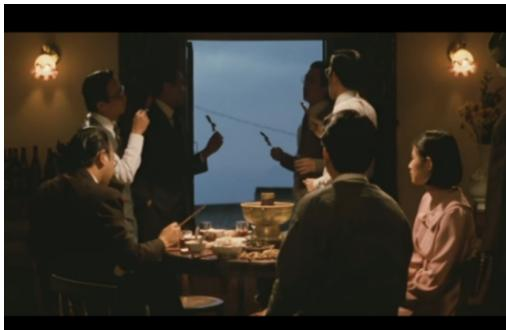
*该图像是电影场景的一部分，展示了一群人在灯光柔和的室内聚会。几位男士手持餐具，神情专注地参与互动，背景中可见窗外的夜景。人物之间的交流和盛宴的氛围体现了侯孝贤电影中的写实主义风格。*

下图（原文图6）是紧接着的天空空镜头，属于典型的自由间接视点：

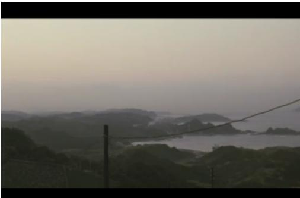
*该图像是侯孝贤电影中的一幅风景插图，展示了宁静的海岸线和起伏的山丘，给人以写实主义的视觉感受。画面中的自然元素体现了电影所追求的真实与细腻。*

这个空镜头不属于任何一个角色的主观视角（没有拍某个角色抬头看天的前置镜头），但观众能明显感受到画面中承载的悲愤、苍凉的情绪，就是自由间接视点的效果。

再比如《悲情城市》结尾，文清被逮捕后，镜头切到全家围坐打牌的场景：
下图（原文图7）是文清一家的全家福：

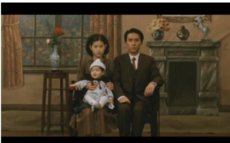
*该图像是插图，描绘了一对夫妻和他们的婴儿坐在一间装饰精美的室内环境中。画面中的夫妻神态平和，背景中有一处窗户和装饰品，突显出家庭的温馨气氛。*

下图（原文图8）是从阿雪视角出发的镜头：

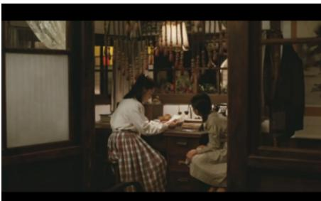
*该图像是用于分析侯孝贤电影中的写实主义的一幅插图。画面展示了两位女性在室内交流的场景，体现了电影中的生活细节与人际关系。*

下图（原文图9）是全家围坐打牌的自由间接视点镜头：

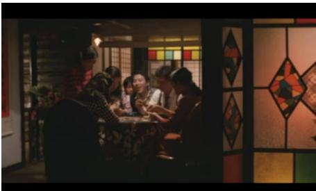
*该图像是侯孝贤电影中的一幕，展示了一群人在一张圆桌旁聚集，进行讨论或游戏，背景透过彩色玻璃窗透出温暖的光线，营造出亲密的氛围。*

这个镜头表面是客观记录全家打牌的日常，实则暗含着“个体在时代洪流面前无能为力，只能靠日常麻痹自己”的悲凉情绪，不需要刻意煽情就能让观众共情。
---
### 4.2.2. 美学层三大落地技法
#### （1）自然流畅的表演
侯孝贤完全反对职业演员僵化的、戏剧化的表演，核心方法是：
- 大量使用非职业演员（身边的朋友、剧组工作人员），不给明确的台词，只给场景框架，让演员自由发挥；
- 针对职业演员，通过“消除表演感”的训练让演员融入场景：比如提前让演员熟练使用道具（水烟、鸦片枪），让道具成为生活的一部分；拍摄吃饭、喝酒的场景时让演员真吃真喝；用远机位拍摄，避免演员注意到镜头，甚至用偷拍的方式捕捉最真实的状态；
- 演员不需要“演”角色，而是出场就“成为”角色，优先捕捉演员的自然状态和神采，而不是符合剧本要求的表演。
#### （2）客观呈现的表里世界：深焦长镜头+深度空间调度
深度空间和深焦长镜头是侯孝贤最核心的视觉标识，单镜头平均时长从早期的43秒逐步增加到后期的100秒以上，调度方法是：
- 镜头始终保持足够的距离，不刻意用特写引导观众的注意力，让观众自己选择关注的内容；
- 前景、中景、后景都安排人物活动，还原现实生活的复杂度，不需要的信息不会刻意排除在画外。

  比如《悲情城市》中文良出狱的段落：镜头没有刻意对准文良，而是从远处拍摄林家打牌的日常，仆人从前景入画喊“文良回来了”，众人来回穿梭，整个场景像真实的家庭生活一样自然流动：
下图（原文图1）是文良出狱的深度空间调度镜头：

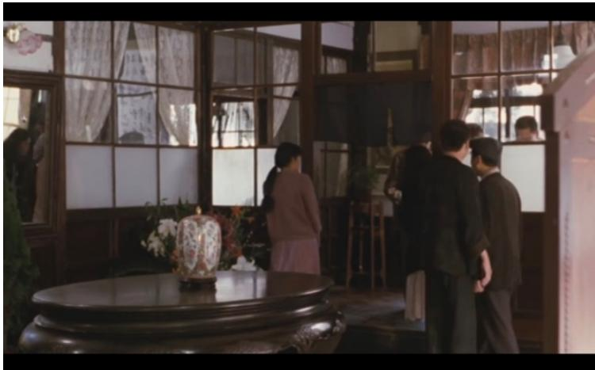
*该图像是插图，展示了侯孝贤电影中的一处场景。画面中央是一个古典的桌子，上面摆放着精美的花瓶，周围几个人物在交谈，体现出影片的写实主义风格。*

再比如《童年往事》中讨论哥哥读书的段落：镜头停在厨房门口，后景是妈妈做饭，中景是姐姐摘菜，前景是哥哥的身影，通过对话自然带出家里的经济困境，没有刻意的冲突和特写，悲伤的情绪完全藏在日常对话里：
下图（原文图2）是《童年往事》的家庭对话调度镜头：

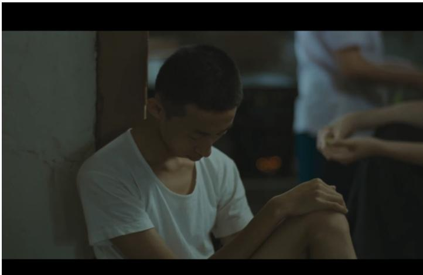
*该图像是电影场景的一部分，描绘了一个坐在墙角的少年，他穿着白色T恤，神情忧郁，周围环境模糊，暗示着内心的孤独与沉重。背景中隐约可见其他人物，增强了情感氛围。*

《海上花》中五少爷被双玉欺骗的段落，同样用深度空间调度，前景是仆人走动，中景是五少爷和叔叔对话，后景是房间的门窗，把人物的困惑和悲伤藏在日常的场景中：
下图（原文图3）是《海上花》的深度空间调度：

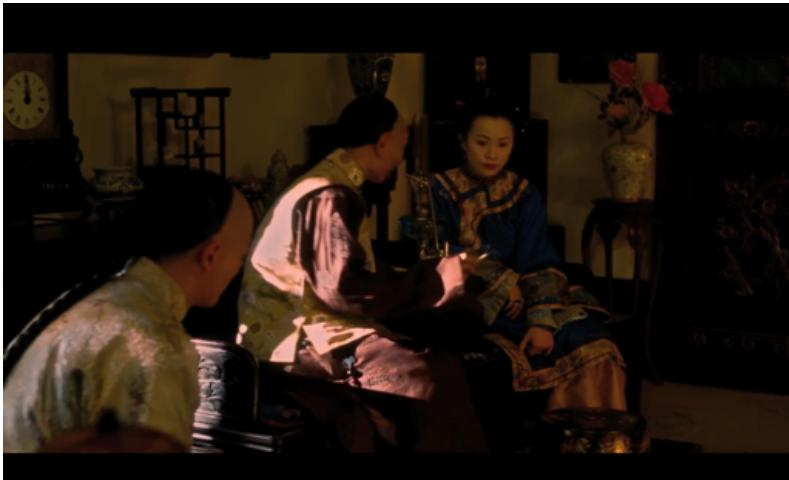
*该图像是示意图，展示了传统场景中几位角色的互动，背景布置体现出典雅的中国古典风格，细节如盛开的花卉和摆设物品增添了画面的文化氛围。*

下图（原文图4）是五少爷困惑的特写，用自然光线拍摄：

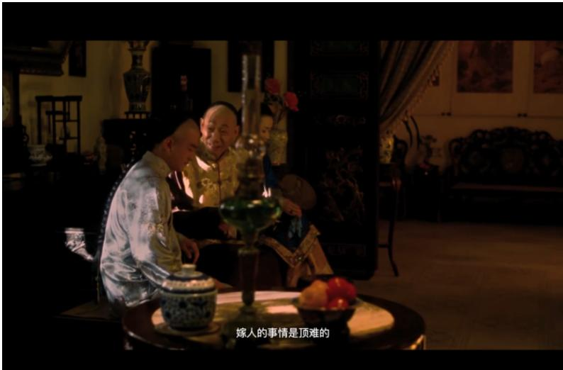
*该图像是电影中的一幕，场景设定在一个古典室内环境。画面中，两位角色坐着，表情沉重，周围的装饰典雅，传达出一种宁静但压抑的气氛。图中有一面桌子，上面摆放着水瓶和水果，暗示着文化的交汇与生活的细节。*

#### （3）悠远绵长的意境表达：意境化剪辑
侯孝贤的剪辑不追求镜头之间的因果衔接，核心目的是传递情绪和意境，常用的方法是：
- 用空镜头做情绪过渡，承担省略时间、抒发情感的作用；
- 对待重大戏剧事件（比如死亡）用极其平静的剪辑处理，符合道家“生死自然”的理念。

  以《童年往事》中三次死亡的剪辑为例：
##### 表1：父亲去世段落的镜头表

| 镜头 | 景别 | 角度 | 内容 | 时间 | 视点 |
| --- | --- | --- | --- | --- | --- |
| 1 | 远景 | 固定 | 阿孝家房子外景 | 22s | 主观 |
| 2 | 中近 | 固定 | 阿孝坐在窗户边看着外面 | 9s | 客观 |
| 3 | 全景 | 固定 | 家人在屋子里的活动 | 8s | 客观 |
| 4 | 中近 | 固定 | 祖母正在剪纸 | 10s | 客观 |
| 5 | 全景 | 固定 | 慧兰写字时突然停电，随后点燃蜡烛 | 65s | 客观 |
| 6 | 全景 | 固定 | 慧兰发现父亲病危，呼喊，全家人围观 | 35s | 客观 |
| 7 | 近景 | 固定 | 祖母尝试唤醒父亲，母亲悲伤喊叫 | 18s | 客观 |
| 8 | 远景 | 固定 | 邻居围观，医生到来 | 12s | 客观 |
| 9 | 全景 | 固定 | 阿孝带医生进入卧室，医生查看父亲的病情 | 52s | 客观 |
| 10 | 中景 | 跟镜头 | 医生宣布父亲死亡 | 72s | 主观 |
| 11 | 中景 | 摇+跟镜头 | 母亲慧兰痛哭流涕，家里其余人也开始难过 | 110s | 主观 |
| 12 | 中景 | 固定 | 屋里昏黄的灯泡 | 10s | 客观 |
| 13 | 全景 | 固定 | 家里人守灵并静坐讨论死亡的怪事 | 35s | 客观 |
| 14 | 中景 | 固定 | 死亡父亲的尸体 | 16s | 客观 |
| 15 | 中近 | 固定 | 恢复平静的母亲 | 18s | 客观 |
| 16 | 近景 | 摇 | 全家人的反应 | 36s | 客观 |
| 17 | 中近 | 摇 | 姐姐让弟弟们去洗澡睡觉，阿孝前去洗澡 | 30s | 客观 |
| 18 | 全景 | 固定 | 阿孝在卫生间开始洗澡 | 38s | 主观 |
| 19 | 近景 | 固定 | 阿孝听到外面母亲尖叫，迅速回头 | 7s | 主观 |
| 20 | 全景 | 固定 | 母亲再次情绪失控 | 13s | 主观 |
| 21 | 近景 | 固定 | 切回阿孝的反应 | 11s | 主观 |

*注：以上为原文表1内容，记录了父亲去世段落的完整镜头设计。*

##### 表2：母亲去世段落的镜头表

| 镜头 | 景别 | 角度 | 内容 | 时间 | 视点 |
| --- | --- | --- | --- | --- | --- |
| 1 | 全景 | 固定 | 房子外面下着下雨 | 10s | 客观 |
| 2 | 全景 | 固定 | 奶奶坐手工的桌前，空无一人 | 8s | 客观 |
| 3 | 全景 | 固定 | 奶奶卧睡在床上，背对镜头，看不清脸上的表情 | 8s | 客观 |
| 4 | 中景 | 固定 | 哥哥阿忠与弟弟阿孝护送姐姐与母亲上车 | 43s | 客观 |
| 5 | 全景 | 固定 | 车消失在路口 | 20s | 主观 |
| 6 | 全景 | 固定 | 夜晚的街头，青年们正在街头混战 | 28s | 客观 |
| 7 | 近景 | 固定 | 弟弟的脸 | 8s | 客观 |
| 8 | 近景 | 固定 | 弟弟阿孝的脸 | 7s | 客观 |
| 9 | 全景 | 固定 | 阿孝与姐姐面对病重的母亲，无能为力 | 65s | 主观 |
| 10 | 全景 | 固定 | 伙伴喊阿孝去打架 | 10s | 客观* |
| 11 | 近景 | 固定 | 阿孝跑出门外 | 15s | 客观 |
| 12 | 全景 | 固定 | 阿孝因母亲生病拒绝去参加帮派斗争 | 35s | 客观 |
| 13 | 近景 | 跟 | 阿孝回到屋内，沉思发呆 | 20s | 客观 |
| 14 | 全景 | 固定 | 白天街头人们闲聊 | 18s | 客观* |
| 15 | 近景 | 固定 | 慈制（母亲死亡）的告示 | 12s | 客观 |
| 16 | 全景 | 固定 | 众人聚集在去世母亲的周围 | 18s | 客观 |
| 17 | 中景 | 固定 | 母亲的尸体 | 14s | 客观 |
| 18 | 全景 | 固定 | 祖母坐在家里房间的椅子上 | 13s | 客观 |
| 19 | 中景 | 固定 | 姐弟四人的画面，隐约有哭声传出 | 14s | 客观 |
| 20 | 中近景 | 固定 | 阿孝痛苦的表情 | 40s | 客观 |
| 21 | 全景 | 固定 | 窗外树叶在沙沙作响 | 15s | 主观* |
| 22 | 中景 | 固定 | 阿孝看向窗外发呆 | 8s | 客观 |
| 23 | 全景 | 固定 | 祖母面朝镜头，躺卧在床上 | 4s | 客观 |

*注：原文表中视点列的“客”“王观”为笔误，已修正为“客观”“主观”。*

##### 表3：祖母去世段落的镜头表

| 镜头 | 景别 | 角度 | 内容 | 时间 | 视点 |
| --- | --- | --- | --- | --- | --- |
| 1 | 全景 | 固定 | 房子外景，伴随着阿孝的画外音，我们得知祖母病重卧床 | 20s | 客观 |
| 2 | 全景 | 固定 | 祖母卧床，已经去世 | 17s | 主观 |
| 3 | 近景 | 固定 | 祖母手背的蚂蚁 | 7s | 主观 |
| 4 | 近景 | 固定 | 祖母苍白的脸庞 | 7s | 主观 |
| 5 | 全景 | 固定 | 阿孝坐在床边陪着祖母，收尸进入，为祖母清理身体 | 82s | 客观 |
| 6 | 近景 | 固定 | 床榻上祖母的血迹 | 5s | 客观 |
| 7 | 中近 | 跟镜头 | 收尸人看向家中四人 | 16s | 主观 |
| 8 | 全景 | 固定 | 兄弟四人站在床边看着，人群里没有姐姐慧兰 | 32s | 主观 |

三次死亡的剪辑处理有明显的递进关系：父亲去世时阿孝是恐惧的，母亲去世时阿孝是痛苦的，祖母去世时阿孝已经完全平静，接受了生死的自然规律，三次剪辑都没有刻意煽情，而是用空镜头、客观视角传递情绪，完全符合道家“生死自然”的理念。

# 5. 实验设置
本文属于创作实践类论文，“实验”即毕业短片《告别语》的全流程创作，核心目标是验证侯孝贤写实主义创作方法的可行性。
## 5.1. 创作基础（对应理工科论文的“数据集”）
### 故事原型
灵感来源于日本养老纪实书籍中“老人照顾患病配偶逐渐丧失自我”的社会现象，结合中国家庭养老的现实特征，设定了一对老年夫妻的故事：退休教师张荣生日夜照顾患阿尔茨海默症的妻子美萍，在长期的疲惫中逐渐产生了对自由的渴望，最终在一个雨夜做出了自己的选择。
### 场景与人物设定
- 地域选择南京，利用南京夏天湿润、梧桐树茂密的环境特征烘托人物压抑的情绪；
- 人物设定为退休教师和退休舞蹈老师，独生女已经成家，尽量削弱子女线的戏份，把核心冲突集中在两位老人的关系上；
- 核心场景为老房子、公园、江边等生活化的场景，避免刻意的美术置景，尽量还原真实的生活质感。
## 5.2. 评估维度（对应理工科论文的“评估指标”）
主要从四个维度验证方法的落地效果：
1. **叙事真实度**：是否符合生活逻辑，有没有刻意制造戏剧冲突；
2. **表演真实度**：有没有明显的表演痕迹，演员状态是否自然；
3. **镜头适配度**：是否运用了侯孝贤的客观视角、深焦长镜头、深度空间调度等技法；
4. **情绪感染力**：是否能通过细节传递情绪，而不是靠刻意的煽情（特写、配乐）引导观众情绪。
## 5.3. 对照参照（对应理工科论文的“对比基线”）
和同类养老题材短片的常见创作手法做对照：
- 常见手法：刻意制造婆媳矛盾、子女不孝等强戏剧冲突，用大量特写拍老人的惨状，用悲情配乐刻意煽情，演员刻意表演病态；
- 本文创作完全摒弃上述手法，用侯孝贤的写实方法创作，对比两者的呈现效果差异。

# 6. 实验结果与分析
## 6.1. 核心落地效果分析
侯孝贤的创作方法在《告别语》中得到了完整的落地，效果符合预期：
1. **叙事层面**：没有刻意制造强冲突，所有情节都是日常细节：喂饭、擦身、遛弯、和女儿的对话，唯一的“高潮”是雨夜的冲突，也是长期情绪积累的自然结果，没有突兀的转折；
2. **表演层面**：妻子美萍的角色选用非职业演员，只给场景框架不给明确台词，捕捉最自然的状态；丈夫的角色选用职业演员，拍摄时尽量不干预表演，让演员自由发挥，最终呈现的表演没有明显的戏剧化痕迹；
3. **镜头层面**：大部分镜头用中长焦、固定机位的客观视角，用长镜头记录日常动作，空镜头用来传递情绪，比如结尾雨过天晴的空镜头、江边风筝的空镜头，都属于自由间接视点，自然传递出人物释然的情绪；
4. **灯光与空间层面**：尽量用自然光源，妻子的房间用暖光体现过去的温暖回忆，丈夫独处的场景用冷光体现其压抑的状态；公园、江边的场景用深度空间调度，后景保留真实的路人、跳舞的老人等元素，还原生活的真实感。

   下图是短片《告别语》的拍摄工作照，可见拍摄时尽量还原生活化的场景，避免刻意置景：

   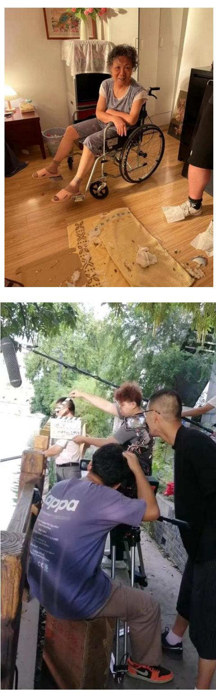
   *该图像是两张展示电影拍摄过程的照片。第一张显示了一位坐在轮椅上的演员，周围环境展现真实生活的细节；第二张则是拍摄现场，多个工作人员在协助演员和导演。通过这两张图像，可以看到侯孝贤电影的写实主义风格。*

下图是短片《告别语》的公园场景剧照，用了深度空间调度，后景保留了公园的真实环境：

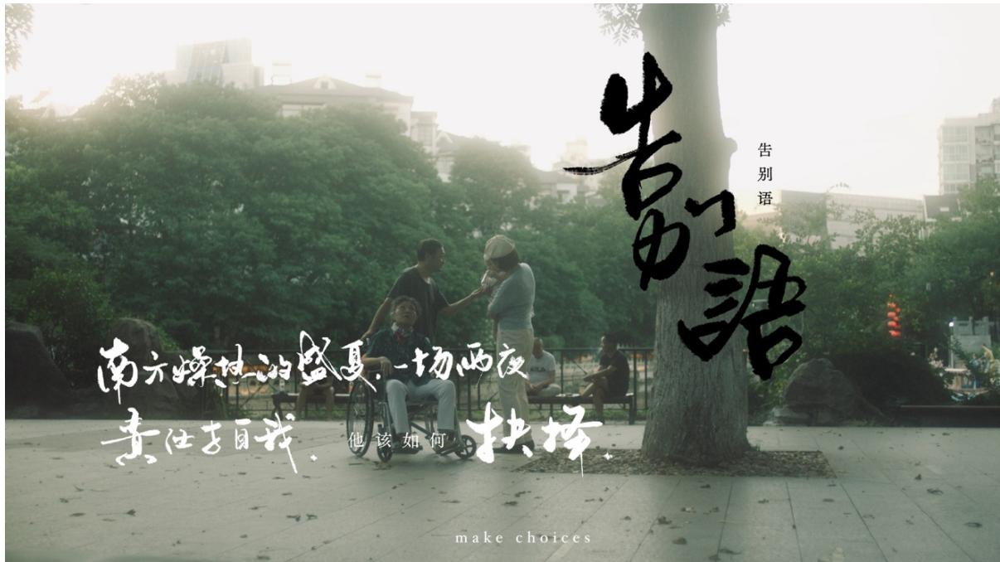
*该图像是插图，展示了一个公园场景，其中一位坐在轮椅上的老年人与两位年轻人在互动。图中包含了文字，表达了生活中的选择和感悟，背景是茂密的树木和城市建筑，营造出一种温暖而富有情感的氛围。*

下图是短片《告别语》中男主角的特写，用柔和的自然光，避免刻意的戏剧化打光：

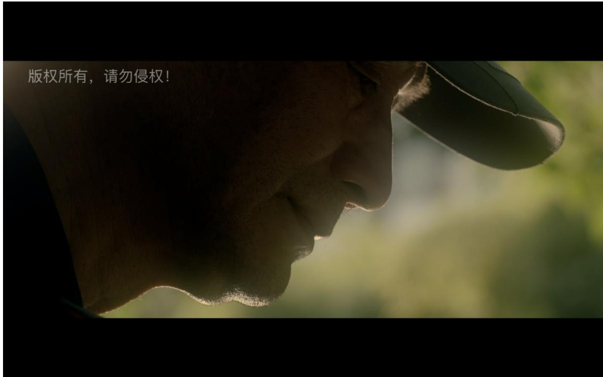
*该图像是一幅插图，描绘了一位男性侧脸的特写，散发出柔和的光线，背景模糊，传达出安静的氛围。图像左上方标注了“版权所有，请勿侵权！”*

## 6.2. 技法适配性分析
侯孝贤的写实主义方法非常适配小成本短片创作：
- 不需要大投资、大场面、复杂的特效，只需要把注意力放在生活细节、演员状态、情绪传递上，成本极低；
- 尤其适合小人物、现实主义题材的创作，不需要强情节支撑，靠细节和情绪就能打动观众；
- 对于没有太多拍摄资源的新人创作者来说，这套方法的落地门槛极低，只要足够了解生活、尊重生活逻辑，就能拍出有质感的作品。

# 7. 总结与思考
## 7.1. 结论总结
1. 侯孝贤的写实主义和西方写实主义有本质区别，其核心是中国道家“道法自然”的哲学与电影写实技法的融合，本质是东方的“抒情写实”，而非西方的“复刻写实”。
2. 侯孝贤的创作方法可以系统拆解为可复用的完整框架：叙事层包含「自然观融合、反戏剧化构建、自由间接视点」三个核心理念，美学层包含「自然化表演、深焦深度空间、意境化剪辑」三个落地技法。
3. 这套方法对小成本现实主义短片创作有极强的适配性，不需要高成本投入，只要尊重生活逻辑、关注细节，就能拍出有情感浓度的作品。
## 7.2. 局限性与未来工作
### 论文本身的局限性
- 对侯孝贤写实主义与中国传统抒情文学（唐诗宋词、古典散文）的关联挖掘不足，仅提到了道家自然观的影响；
- 仅分析了侯孝贤现实题材的作品，没有涉及后期武侠题材《刺客聂隐娘》中写实主义的延伸和变化；
- 对技法的拆解可以更细化，比如不同场景下自由间接视点的具体切换技巧、非职业演员的具体引导方法等，可操作性还有提升空间。
### 未来研究方向
- 可以进一步研究侯孝贤的写实方法在其他题材（比如悬疑、科幻）中的适配性，探索其和类型片的融合可能；
- 可以对比侯孝贤与是枝裕和、贾樟柯等其他东亚写实主义导演的技法差异，梳理东方写实主义的完整脉络；
- 可以进一步探索这套方法在短视频、网络短剧等新形态内容中的应用可能。
## 7.3. 个人启发与批判
### 核心启发
1. 对于创作者来说，好的现实主义创作不需要刻意“卖惨”“制造冲突”，尊重生活逻辑、抓住真实的细节和情绪，远比刻意的戏剧冲突更有力量。侯孝贤的方法打破了“文艺片门槛高”“新人拍不出好作品”的误区，只要足够了解生活，就能用低成本拍出动人的作品。
2. 对于观众来说，理解侯孝贤的写实主义之后，再看他的作品就不会觉得“闷”“看不懂”——他的电影不是看情节的，而是看细节、感受情绪的，那些零散的日常片段，其实是每个人都有过的共同记忆，情感是共通的。
### 潜在不足与改进空间
1. 侯孝贤的方法更适合慢节奏、情绪向的题材，对于快节奏的商业类型片不能完全照搬，需要做适配：可以保留写实的表演、细节真实的优势，适当增加戏剧冲突，平衡艺术性和观赏性。
2. 本文对“反戏剧化”的论述可以更辩证：完全摒弃戏剧冲突适合作者向的艺术创作，但对于面向大众的作品，适度的戏剧冲突可以降低观众的理解门槛，不需要完全否定。
3. 实际创作中可以根据题材灵活调整技法，比如针对不同的人物关系、情绪强度，调整长镜头的时长、视点的切换频率，不需要完全照搬侯孝贤的固定范式。