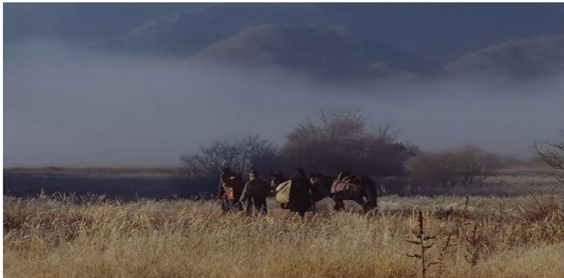
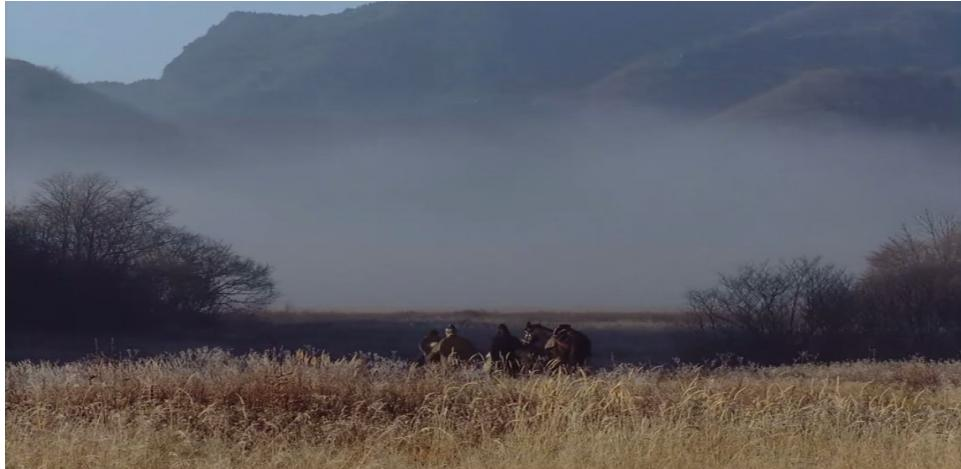
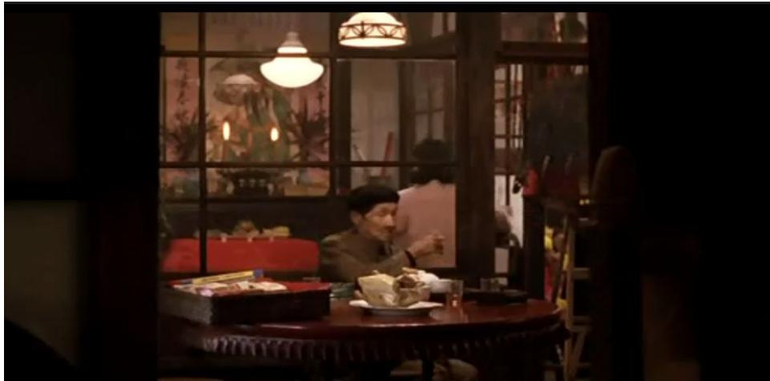
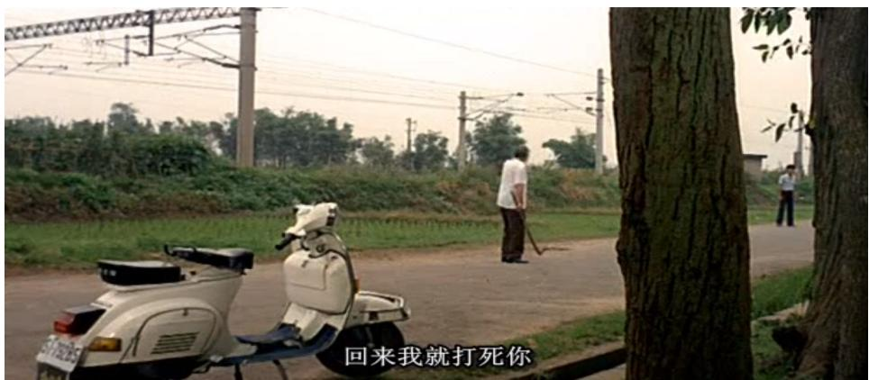

# Hunan 1938 湖南師靴大学Normal Un硕士学位论文

# 论侯孝贤电影的叙事艺术

回科学学位口专业学位学科专业学位类型研究生姓名导师姓名、职称论文编号

# 论侯孝贤电影的叙事艺术 The Narrative Art of Hou Hsiao-hsien'film

研究生姓名 戴雪晴指导教师姓名、职称 杨经建教授学科专业 戏剧与影视学研究方向 影视理论与批评

# 湖南师范大学学位评定委员会办公室二零一七年五月

# 摘要

侯孝贤是一位享誉中外影坛的台湾本土导演。本文以电影叙事学为切入口,对侯孝贤电影的叙事艺术进行研究。

论文主要分为三个部分：

首先是对侯孝贤电影叙事风格的探索。深受中国传统文化的影响，侯孝贤的电影呈现出了东方式的审美特质。其中，诗意性是侯孝贤电影叙事中最为显著的特点，本章从侯孝贤电影镜头的诗意性探索与电影氛围的诗意性营造两方面阐述其诗意性的叙事风格。

其次是对侯孝贤电影叙事时空的分析。时间和空间是电影叙事过程中不可或缺的元素。电影作为第七艺术，区别于其他艺术门类最重要的一个特征就是独具一身的时空性，本章从电影叙事时空出发，探析其电影中对叙事时间的重塑以及对叙事空间的建构。

其三是对侯孝贤电影叙事策略的解读。叙事策略不仅仅是导演叙述的一种技法，也是导演叙事艺术构成的关键。在叙事策略这一章，主要通过对叙事结构以及叙事聚焦进行分析，归纳出侯孝贤电影中推陈出新的电影结构以及叙事聚焦的多元化表现。

关键词：侯孝贤　叙事风格　叙事时空　叙事策略

# Abstract

Hou Hsiao-hsien is a well-known Chinese and foreign Taiwan local director. This paper takes cinema narratology as the cut, research on the Narrative Art of Hou Hsiao-hsien 's Films.

The paper is divided into three parts:

The first is the exploration of Hou Hsiao-hsien 's film narrative style. By the deep influence of Chinese traditional culture, Hou Hsiao-hsien's film shows the aesthetic characteristics of the East style. Among them, poetic is the most significant feature of Hou Hsiao-hsien's film narration. This chapter expounds its poetic narrative style from the poetic exploration of Hou Hsiao-hsien's film and the poetic creation of the film atmosphere.

Followed by the analysis of Hou Hsiao-hsien's film narrative time and space. Time and space are indispensable elements in the process of film narration. The most important feature of the film as the seventh art is different from other art categories. This chapter starts from the time of film narration,analyzes the remodeling of the narrative time and the construction of the narrative space.

The third is the interpretation of Hou Hsiao - hsien's film narrative strategy. The narrative strategy is not only a technique described by the director, but also the key to the composition of the narrative art. In the chapter of narrative strategy, we mainly analyze the narrative structure and narrative focus, summarize the film structure of Hou Hsiao-hsien's film and the diversified expression of narrative focus.

Key words: Hou Hsiao-hsien's， narrative style， narrative space-time , narrative strategy.

# 目录

摘要..

Abstract..

# 绪论..

一、研究背景..  
二、研究现状.  
三、电影叙事学.

# 第一章 侯孝贤电影的叙事风格. 9

第一节 镜头的诗意性探索..一、舒缓的长镜头..二、唯美的景深镜头  
第二节 氛围的诗意性营造.. 14一、意境的营造. 15二、意象的呈现.. 17

# 第二章侯孝贤电影的叙事时空 22

第一节 叙事时间的重塑 .22

一、时间的倒错 .22  
二、时间的省略. .24  
第二节 叙事空间的构建. 26  
一、家庭空间. .28

二、市井空间. .31第三章侯孝贤电影的叙事策略.. 33第一节 推陈出新的叙事结构. .33

一、散文式片段结构.. .33  
二、缀合式团块结构.. .36

第二节 灵活多变的叙事聚焦. 38

一、限定性的内聚焦叙事. .38  
二、无限性的零聚焦叙事. .41

结语 ..45 参考文献.. .48

# 绪论

# 一、研究背景

二十世纪八十年代初，台湾电影界爆发了一场具有时代性和变革性的电影运动，史称台湾电影新浪潮运动。在此次电影运动中，涌现了一批新锐而有富有艺术性的年轻导演，他们“用艺术电影书写台湾历史，俯瞰台湾政治风云变幻，对台湾历史和现实社会有较为透彻的反思和深沉的忧患意识。”他们将台湾社会中个体的生存状态真实地展现在荧幕前，客观地再现了台湾历史变迁下，普通台湾民众的生存机遇与历史阵痛。时势造英雄，在新电影运动的发展过程中，以侯孝贤为代表的新电影导演开始显露头角，并以其新颖的电影风格与叙事手法为台湾电影的发展掀起了新的篇章。

侯孝贤从小随父亲从广东梅县移居台湾，先后在花莲、新竹和凤山居住。1972 年，侯孝贤从国立艺专电影专业毕业。1973年，侯孝贤担任李行导演的电影《心有千千结》的场记，正式踏入电影界。1980年，侯孝贤开始独立拍摄电影至今，共拍摄了十九部电影作品。若按照电影叙事风格、主题内容等方面来划分，其创作生涯大致可以分为五个阶段：

第一阶段，为初入电影行业，跟随电影主流拍摄的一系列商业化“都市爱情片”时期。1980-1982年，侯孝贤先后拍摄了都市爱情商业片《就是溜溜的她》、《风儿踢踏踩》和《在那河畔青草青》，三部电影均以台湾青年为主体，叙述了青年男女之间温馨、甜蜜的爱情故事。其电影风格诙谐幽默且具有一定的教育意义。

第二阶段，为电影风格类型的转型阶段。至此，侯孝贤的影片风格开始由商业片向文艺片类型过渡。此阶段以1983年三段式合拍电影《儿子的大玩偶》为起始，以《尼罗河的女儿》为结尾。在此期间，侯孝贤电影的叙事主题由“都市爱情”转向了“个体成长”，拍摄了一系列带有个人传记色彩的电影，如《风柜来的人》（1983年）、《冬冬的假期》（1984年）、《童年往事》（1985年）、《恋恋风尘》（1986 年)。在此阶段，侯孝贤独具匠心的固定镜头、景深镜头、框式长镜头等一系列电影拍摄技法逐渐发展、成熟，为侯孝贤电影风格的最终确立奠定了基础。

第三阶段，侯孝贤将“个体成长”转向了“集体性的历史回望”，创作了“台湾电影三部曲”- 一《悲情城市》（1989年）、《戏梦人生》（1993年）和《好男好女》（1995 年)。三部电影以台湾普通民众、布袋戏大师和进步的知识分子三类人物为主体，光影化地呈现了台湾日据时代、“光复”年间和“白色恐怖”时期的历史沉浮与民众疾苦。《悲情城市》勇夺威尼斯国际电影节金狮奖预示着侯孝贤迎来了其电影创作的第一个巅峰时期，而“台湾三部曲”的完成更是引领着侯孝贤走出了台湾，迈向了世界。

第四个阶段，侯孝贤将电影由“集体性的历史回望”转向了台湾现代都市生活，拍摄了《南国再见，南国》（1996）、《千禧曼波》（2001）等影片。侯孝贤在这一阶段的电影创作主要以台湾现代都市青年不羁的生活状态和空虚的精神风貌为表现内容。其创作虽大致延续了以往的电影风格，却又在光影、音乐等方面进行了大胆创新。具有情调、意蕴性的光影和动感十足的电子音乐让我们看到了一个内心不羁且疯狂的侯孝贤。

第五个阶段，“出走”阶段，从独立拍片开始，侯孝贤电影的叙事空间就基本定格在了台湾本土，而 2003 年受邀拍摄纪念日本导演小津安二郎诞生100 周年的电影《咖啡时光》，侯孝贤首次将拍摄的空间移至了日本东京，《红气球之旅》（2007年）将拍摄场所移至法国，《刺客聂隐娘》（2015年）更将叙事时空移至了中国唐代。这一时期，侯孝贤电影风格在总体上也保持着相对统一的状态，但在叙事内容上有了更为多元化的表现。

近四十年的电影创作生涯，十九部电影作品，相对来看，侯孝贤并不算是数量高产的电影导演，但侯孝贤的电影却获得了国内外一致的认可与赞誉。1989年，他凭借着电影《悲情城市》获得了第 46界威尼斯国际电影节金狮奖，1993年《戏梦人生》获得第 46 届戛纳国际电影节评审团奖，2015年侯孝贤凭借《刺客聂隐娘》获得了第 68 届戛纳电影节金棕榈最佳导演奖在国际电影节上的大放异彩，使侯孝贤当之无愧的成为了台湾电影的领军人物。台湾学者叶月瑜曾坦言：“到了二十世纪末，侯孝贤获得了前所未有的认可和褒奖，任何一位为西方世界欣赏的当代中国电影人都无法与之相比。”①

从影至今，侯孝贤以其独具特色的电影风格打造了一个属于自己的电影王国，标志性的镜头语言、非戏剧化的电影结构以及诗意化的叙事风格成为了侯孝贤电影的标签。他与编剧朱天文、摄影师李屏宾、剪辑师廖庆松长期合作，营构了一个稳定的创作团体，这种稳定的重要性不仅仅是维系了台湾一个一流的电影创作团体的存在，更保证了其电影风格得以一脉相承，延续至今。

# 二、研究现状

学术界对侯孝贤导演的研究大致可以分为以下几类：

# 1．对侯孝贤电影风格的研究。

具有代表性的文章有：李相的《儒梦人生——侯孝贤电影的作者特质》①，论文通过对侯孝贤个人成长经历、艺术创作道路的审视以及对其电影视听语言的细致分析，揭示了侯孝贤导演鲜明的作者电影特质以及电影中具备的民族性。王睿在论文《平静与深思:侯孝贤电影风格解读》中通过对侯孝贤电影叙事主题以及电影视听语言的分析，揭示了侯孝贤电影的“静”以及深藏于内的人文关怀。孟洪峰在论文《侯孝贤风格论》③中用“闷”、“愣”“浑”三个单字概述了他对侯孝贤电影的风格印象，并且进一步分析了侯孝贤电影的东方式意境和强大的心理张力。

# 2.对侯孝贤电影的文化价值与意义的研究。

具有代表性的文章有：北京电影学院教授倪震在《侯孝贤电影的亚洲意义》④一文中，着重探讨了侯孝贤电影在厚重的社会历史叙事中，其创作意识形态的变化历程，进而探讨他作品中的亚洲视野和怀旧情结。南京师范大学文学院教授孙慰川在《论侯孝贤的得与失—兼谈电影的艺术性与观赏性之关系》③一文中，从观赏性的角度，分析了侯孝贤导演坚持拍摄文艺片，摒弃商业片和商业性的得与失。北京师范大学周星教授在《电影在地性与透视生活的真切感——关于侯孝贤电影的意义认知》中谈到，即使电影市场受到利益原则的支配，但电影作为一种文化产品来说，并不简单的投入、产出与回报的关系。文化精神和感知才是最终判断电影艺术的标准。周星教授进一步在文中指出，侯孝贤电影具有一种以人为本的本土文化气息，具有“在地性”的生活丰富性与艺术处理的真切生活感。

# 3．将侯孝贤导演与其他导演进行对比研究。

此类对比研究多见于与日本电影大师小津安二郎、中国导演贾樟柯进行对比研究。北京大学艺术学院陈旭光教授在《"长镜头”的“似”与“非"：语言、美学与文化——侯孝贤与贾樟柯比较论》①一文中，通过对侯孝贤、贾樟柯两人作品中长镜头进行对比分析，揭示了各自长镜头背后的电影美学观念，并进一步谈到，由于两位导演成长于不同的文化语境和社会环境中，所以双方在艺术创作上形成各自不同的艺术追求。侯孝贤电影是一种独具内涵的东方影像实践，而贾樟柯导演却擅长为社会普通民众“见证”、“立言”。重庆邮电大学教师王鹤和顾小勇在《小津安二郎与侯孝贤镜语中的情感与诗意》③一文中从二人最擅长且最具风格的固定长镜头入手，探析了日本电影导演小津安二郎和侯孝贤导演极具东方人文特色的电影风格。

除了以上较为专业的期刊论文研究之外，自2000 年开始，陆续有电影学者著书对侯孝贤导演进行整体性的研究，主要集中于中国台湾地区与美国。

# 1.中国台湾地区

2000 年，在侯孝贤导演组织筹备拍摄电影《千禧曼波》时，曾在台湾杂志《影响》主持“电影斗阵”专栏的三人小组（林文淇、沈晓茵和李振亚）有感于对侯孝贤导演全方位、系统性的研究稀缺且刻不容缓，于是三人将近年发表在《中外文学》杂志上侯孝贤研究的小专辑和近十年来国内具有代表性的研究论文进行整合集结，在麦田出版公司的支持下，出版了第一本侯孝贤导演的研究专著《戏恋人生——侯孝贤电影研究》①。2006年，侯孝贤的御用编剧朱天文出版了《最好的时光——侯孝贤电影记录》②，此书收录了侯孝贤导演的电影小说、电影剧本，并且记录了侯孝贤在电影《最好的时光》电影创作过程中剧本讨论、实际拍摄以及剪辑阶段真实的工作状态和生活细节。2015年，电影《刺客聂隐娘》的编剧之一谢海盟出版了《行云纪:<刺客聂隐娘>拍摄侧录》③，此书以摄制组辗转的外景地湖北、京都、九寮溪、内蒙古等地名为章节，记录了《刺客聂隐娘》拍摄过程中真实、有趣而又艰难的光影旅程。

# 2.美国

2014年，美国电影学者詹姆斯·乌登创作（黄文杰翻译）的专著《无人是孤岛——侯孝贤的电影世界》①出版，此书按照侯孝贤电影的创作时序分析了其影片的艺术特色。此外，他还将其作品置放于宏大的台湾社会历史之中，叙述了具体电影拍摄时所处的时代环境与背景，具有一定的社会文化深度。2015 年，由美国电影学者白睿文遍访（朱天文校订）的专著《煮海时光—一侯孝贤的光影记忆》出版，此书由 2009 年白睿文在金马电影节期间对侯孝贤导演本人的九次访谈（每次2-5个小时）构成。专著一共七章，从侯孝贤导演的生平一直谈论到了侯孝贤创作至今的所有作品，可以说这本书最大程度上还原了侯孝贤电影创作过程中真实的状态和想法。

从当今的学术研究成果来看，以电影叙事学为基点，对侯孝贤电影叙事艺术进行研究的论文所占比例较小，主要有：韩笑的论文《台湾导演侯孝贤的电影叙事风格浅析》①，论文着重探讨了三个方面，其一，谈论了侯孝贤电影的亚洲意义；其二，探讨了侯孝贤重人文关怀和情绪气韵的风格特征；其三，简明扼要的论述了侯孝贤电影的主题与结构等。赵丝玲的《侯孝贤电影的叙事手法——以<童年往事>、<恋恋风尘>、<风柜来的人>为例》②一文主要以三部作品为研究对象，探讨了侯孝贤电影缓慢的叙事节奏和电影剧情。范志忠在《侯孝贤作品与第三世界新电影的叙事策略》中，将侯孝贤视为第三世界新电影的代表，侧重探讨了电影中长镜头的纪实风格以及反叛性的叙事立场。

综上所述，以电影叙事学、叙事学为切入点，对侯孝贤电影叙事艺术进行研究的论文相对较少，尚有可挖掘的空间，笔者正是在此背景下进行研究创新。

# 三、电影叙事学

叙事，“叙”即为叙述、叙说，“事”即为故事，简单来说，叙事即为讲述故事。罗兰·巴特曾表示：“叙事与人类历史同时产生，叙事跨越国度，跨越历史，跨越文化伴随人类生命存在。”英国小说家毛姆曾在著作《巨匠与杰作》中谈到：“听故事的愿望在人类身上，同财产观念一样是根深蒂固的。自有历史以来，人们就聚集在篝火旁或市井处听讲故事。这种愿望始终一样强烈…”④

即便叙事与我们有着千丝万缕的联系，但其被确定成为一门独立的学科却是在二十世纪六十年代。1969 年，法国当代文艺理论家茨维坦·托多洛夫出版《<十日谈>语法》一书，首次提出：“…这门著作属于一门尚未存在的科学，我们暂且将这门科学取名为叙事学，即关于叙事作品的科学。”①至此，叙事成为了一门古老而又新颖的科学门类。

电影艺术对叙事的探索可以追溯到其诞生之日，“从早期电影《工厂大门》、《水浇园丁》到今天的好莱坞大片、后现代影片，都是在讲述一个或多个故事：在某时某地，某些人发生了某些事。”②可以说，电影最基本的特质就是叙事，电影因叙事而存在。早期的电影学家乔治·梅里爱、谢尔盖·米哈伊洛维奇·爱森斯坦等人对电影语言、电影结构的探索，实质上也为电影叙事学奠定了研究基础。

“电影最初是一种电影演出或者是现实的简单再现，以后便逐渐变成了一种语言，一种叙述故事和传达思想的手段。”③学术界一般认为“电影叙事学的真正发展大体在二十世纪八十年代。著名学者有法国的费朗索瓦·若斯特、美国的大卫·波德维尔等人。他们将文学叙事研究成果和心理学学术研究成果引入到电影领域，完善了电影叙事学研究。”在当代叙事学学科之下，电影叙事学是其中一个重要的分支。电影叙事是“以电影剧本为蓝图，在导演的支配下，通过演员的表演，最后通过画面和声音所呈现的事件过程。”③

电影作为一种叙事的艺术，我们可从以下两个方面来理解：一是从文本出发，电影究竟讲述了一个怎样的故事？二是电影中的故事是如何被讲述出来的？因此，电影叙事研究主要从两部分展开，一方面是对具体故事文本的研究，主要包括对故事文本的叙事内容、叙事结构等方面进行研究；另一方面则是强调对电影传达思想的言语与手段——视听语言进行研究。本文即是通过此两方面来研究侯孝贤电影的叙事艺术。

# 第一章 侯孝贤电影的叙事风格

黄式宪教授在谈论侯孝贤叙事的总体风格时曾说：“其叙事的总体格局，采用了一种诗化的方式。”①“他的电影的特质也在于此，是抒情的，而非叙事和戏剧他倾向于气氛和个性，对说故事没有兴趣。”③与同时期的电影导演相比，侯孝贤的电影作品在叙事风格上呈现出了更为典型的东方式审美特质，有着更为浓厚的诗意性滋味。侯孝贤叙事风格的诗意性特征主要集中表现为对电影镜头的诗意化探索以及氛围的诗意性营造两个方面。

# 第一节 镜头的诗意性探索

“电影的诗意，是建立在电影诗意语言基础上的一种美学思想的语言外化形态和艺术感觉形式，体现出电影导演的文学追求和美学自觉。”侯孝贤导演善于“运用内在的诗化语言建构镜头的叙事能力，突出地表现为使用景深镜头和长度镜头相结合,强化镜头的内在张力。”④

# 一、舒缓的长镜头

长镜头的使用最早可以追溯到电影诞生时的一系列作品中。对于卢米埃尔兄弟而言，长镜头并非是由内而外的电影审美自觉，而是在当时低工业社会背景下不得已而为之的拍摄技法。随着电影工业的发展和电影艺术家的探索，至二十世纪四、五十年代，意大利新现实主义电影运动的风起云涌，“长镜头美学”才有了真正意义上的发展。同时期，法国电影艺术家安德烈·巴赞提出了“电影是现实的渐近线”口号，确立了“长镜头理论体系”。

早期台湾电影的发展主要由政府把控，市场的运营机制并不具有自主权。当时期“进口电影器材，无论是为了制作还是展出，都被视为‘奢侈品’，因而其关税要高出其他行业的百分之五十还多。"台湾导演为了削减电影高昂的拍摄成本，势必在拍摄电影过程中减少镜头数量并尽可能地在有限的镜头中传达更多的电影信息。因此，长镜头的确是他们不二的选择。

成长于此背景下的侯孝贤导演，早期对长镜头的使用可以说是他在台湾电影大环境下无意为之的创作技法，而在漫漫的电影拍摄过程中对长镜头美学的探索却是他对台湾电影最重大的贡献之一。

长镜头是侯孝贤电影中较为常用的一种镜头类型，也是电影学者在研究侯孝贤导演时无法避开的一个论述点。相比于其他导演拍摄所使用的长镜头，侯孝贤电影中的长镜头有着一种独特的韵味和风格。在他的电影中，长镜头不仅仅承担着信息的呈现与传递功能，更为重要的是在他的长镜头创作中，观众能够体会到一种诗意般情怀。正如台湾影评人林文淇所说：“侯孝贤总能将镜头放在最能捕捉生活饱满意义的位置，让电影片段充满丰富的韵味。细心体会的观众因而能够在同一镜头里看到包括人、家庭、社会与生命层次的意义。”②

《海上花》是侯孝贤电影创作中，长镜头使用频率最高的一部电影。在长达110 分钟的放映时间中，侯孝贤只使用了39个镜头，基本达到了一场一镜。电影以一个时长为八分钟的长镜头开篇：长三书寓中，倌人与客人围坐在方桌的两旁喝酒划拳、逗趣聊天，两盏青底白瓶油灯将电影画面分割成为了有前、后景且相对独立的“品”字形区域。在拍摄席间人物间的对话时，侯孝贤摒弃了电影里惯用的“正反打”镜头，而采用了近乎凝滞般左右浮动的轨道长镜头来展现人物之间的对话过程。昏黄的灯光与红木质家具相得益彰，古典式的房屋装饰与清末民初时精致的服饰装扮交相辉映，映衬着长三书寓这所高级妓院的奢侈与浮华。“它的视觉丰富性令人难忘，奠定了影片整体上的氛围。”①开篇长镜头的使用不仅将影片整体节奏变得悠然而舒缓，更在连续不剪切的长镜头内呈现了长三书寓的古典唯美的内部场景与人物装扮，使得本具有纪实性的长镜头增添了诗意性的韵味。

《刺客聂隐娘》是侯孝贤导演的第一部武侠电影，讲述了一个自幼被道姑嘉信公主带走习武的女杀手窈七能杀却不杀的故事。聂隐娘窈七奉命归家刺杀表兄田季安，以控制魏博之叛乱，维护朝廷之安定。面对曾经的婚约对象，至亲的兄长，窈七尽管武功盖世却也无法下手，正如道姑所说：“汝今剑术已成，而道心未坚。”

在电影武斗环节的展现中，侯孝贤摒弃了一般武侠片中常用的快速剪辑的蒙太奇技法，而采用了他最具风格化的长镜头来展现人物之间的厮杀搏斗。相比于刀光剑影的武打场面所能带来的视觉冲击力，侯孝贤更注重在缓慢的长镜头中刻画窈七在杀与不杀之间情感纠葛与内心矛盾。窈七第一次在屋顶与田季安正面交手时，身着一黑一白服饰的两人便已显示早已身处截然不同的阵营。武斗中，窈七一次次用身体上的快速躲闪将田季安的狂乱刺剑迎刃而解，毫不费力。简单的一刺一躲，双方真实的武力对比便跃然银幕，窈七的无心还击透露着对田季安的惻隐之心。在杀与不杀之间，她摇摆不定，内心情感的纠葛溢满银幕。

此外，窈七赴约田元氏，长镜头全程记录了窈七穿越白桦林的过程。阳光穿过树林的间隙，斑驳的光影洒落在孤身迎战的窈七身上，聂隐娘窈七的孤寂与侠风展现无遗，虽无张艺谋在《英雄》打斗环节中色彩的大胆使用而带来的视觉奇观，但在光影的作用下，《刺客聂隐娘》的道古侠风却体现得淋漓尽致，充满着诗意武林的影像气质。

# 二、唯美的景深镜头

景深镜头是侯孝贤电影诗意化镜头元素中较为重要的一点。其景深镜头主要有两种表现形式，其一为大景深，是指调焦物前后影像均能清晰的呈现在影片中，它“能够全面、清晰介绍被摄主体周围环境特点增强所拍摄画面的深远空间感。”①；其二为小景深，是指调焦物前后的影像呈现出前实后虚或前虚后实的效果，具有突出与强调的作用。

侯孝贤在大景深镜头效果的使用中，除了将精心选择的场景囊括于内，还十分注重将其环境与人物命运、内在心理进行深度的融合与统一，营造一种契合电影风格的环境氛围，具有浓厚的人文诗性气息。

在电影《刺客聂隐娘》的结尾，聂隐娘与磨镜少年、采药老者牵着马匹远走于苍茫的郊野时，侯孝贤选取三人为中心调焦点，前景是清晰可见在水气笼罩下层层叠叠的山脉，后景是枯黄了的树枝、植被。雾气弥漫的前景画面与枯黄干燥的植被后景相结合所带来的苍凉感映衬着聂隐娘杀手生涯的悲凉与对未来人生的迷惘。

  
（《刺客聂颖娘》截图图片来源：爱奇艺网）

  
（《刺客聂颖娘》截图 图片来源：爱奇艺网）

在电影小景深镜头的运用中，侯孝贤偏好将镜头纵深空间的前后景调整于前实后虚的状态。在此模式下的小景深镜头不仅能够将人物或环境置于突出的画面位置，还能运用有效的场面调度刻画剧中人物关系。

一般来说，小景深镜头具有一定的纪实性，但侯孝贤导演却将景深镜头进行艺术加工，使得他电影中的小景深镜头有着一定的诗意情怀。而这诗意性创作的诀窍就在于他十分擅长运用门框等物具作为画面的再造性边缘来结构景深镜头，营造了类似中国传统园林艺术中的隔景效果。

侯孝贤在拍摄《悲情城市》林家“小上海”酒家重新开业的宴会时，将镜头置放于厨房内部的位置，以厨房的门框以及客厅与饭厅之间的玻璃窗框将整个平面分割成了三个较为独立的空间。镜头内昏黄的灯光与古朴的门框、旧式的木质家具相照应，空间的纵深感和立体感得以深化。小景深镜头的使用使得人物虽在三个空间内穿梭，但层次分明，井然有序。门框式的画面边缘也使其镜头画面呈现了一种人在画框内生活、行走之感，极具诗意性。

  
（《悲情城市》截图 图片来源：优酷网）

电影《冬冬的假期》中，当封建古板的外公得知儿子与其女友未婚先育后，拿着铁锹追打儿子至屋外，侯孝贤自然地借用了两棵植物将父亲与儿子分割在了两个不同的区域，父亲所在的前景是实景，而身后儿子所处的后景则是虚景。在这个景深镜头中，侯孝贤巧妙的借用植物将前后景进行分割，不仅让画面的空间纵深感得以加深，更有效的利用两棵树木所形成的两块独立区域暗示着父亲与儿子之间的矛盾与鸿沟，使镜头画面具有了一定的意蕴性和诗意性。

  
（《冬冬的假期》截图 图片来源：土豆网)

# 第二节 氛围的诗意性营造

东、西方之间不同的社会属性及其文化精神致使东、西方艺术自诞生之日

起，便形成了西方重“再现”，东方重“表现”的美学体系。侯孝贤成长于东方文化体系下，受中国传统文化的影响，在电影创作中形成了重气韵、重意境的诗意性叙事风格。

# 一、意境的营造

意境是中国古典文化艺术中一个重要美学范畴，在中国美学体系中占有重要地位。宗白华先生在《中国艺术意境之诞生》一书中借用唐代画家张操论画的话明确界定意境的概念：“‘外事造化，中得心源’。造化和心源的凝合，成了一个有生命的结晶体，鸢飞鱼跃，剔透玲珑，这就是‘意境'，一切艺术底中心之中心。”①此外，他进一步谈到“艺术家以心灵映射万象，代山川而立言，他所表现的是主观的生命情调与客观的自然景象交融互渗，成就一个鸢飞鱼跃，活泼玲珑，渊然而深的灵境；这灵境就是构成艺术之所以为艺术的‘意境’。”②

在宗白华看来，意境是“情”与“景”的结合，艺术作品中描绘的客观自然景象包含着作者主观化的情感。瑞士思想家阿米尔也曾表示，一片自然风景是一个心灵的境界。山川河流等自然景象不仅仅是中国诗人、画家抒发情感的媒介，在侯孝贤的电影中，我们也能看到他将情感深藏于自然景物之内，通过借景抒情、情景交融的创作手法，营造了符合影片主题内容的意境氛围，极具诗意性。

《悲情城市》以台湾“二·二八”历史事件为背景，讲述了台湾一个普通家族在社会历史漩涡中的兴衰变化。电影中，林家四兄弟在历史的悲鸣中无一幸免，各自走向了命运的深渊。大哥林文雄，因制止三弟林文良偷运禁品等违法行为，遭到了上海帮的枪杀；二弟林文森被日本人征去菲律宾当战地医生，再也没有回来；三弟林文良被人密报为汉奸，被捕入狱而遭到刑讯逼供，出狱后，神智彻底混乱；四弟林文清，一个经营照相馆的聋哑人，看似实则与历史斗争无关的普通民众，却也身不由己的卷入到了历史斗争、党派对抗的漩涡之中，最终被捕，生死不明。

《悲情城市》中人物的命运就如同台湾当时的社会生存环境一般悲凉而惨烈，为了表达一种历史的阵痛感、营造一种民众生存之艰辛的社会状态，侯孝贤在电影中运用了大量的山水空镜头来渲染其时代之“悲”，社会之“凉”，呈现了一种悲凉、无助、孤寂的意境。

剧中，宽美的兄长宽荣在酒家与一大波思想进步青年饮酒畅谈，酒到深处，便不能自己，他们言辞激烈的诉说着对政府的失望，控诉着政府的暴行与腐败，偶然间，听到屋外“流亡三部曲”的歌声，几位进步青年随音而起，端起酒杯走向窗边，唱起了《松花江上》：“九一八，九一八！从那个悲惨的时候，脱离了我的家乡，抛弃那无尽的宝藏，流浪！流浪…”伴随着歌声，镜头摇至窗外，绵延起伏的山脉与天空连成一片，海边的迷雾使得山脉若隐若现，音乐声的阵阵敲击，彷佛似一阵阵重拳敲击着人们的心灵，不由地让人深思着当权政府的腐败，其悲怆、凄凉之情徒然而生，久久不散。

《恋恋风尘》中，阿远用来送货的摩托车被偷后，与阿云在火车站台发生争吵，独自一人登上了火车，来到了海边。海边乌云密布的天空与广袤无垠的大海连成一片。远处岸边的巫师做着法术，一对母女跪在其后，巨大的海风卷起汹涌的海浪，一阵阵地向岸边扑来，都市生活中屡屡受挫的阿远无助的蹲在岸边，任雨水浸湿自己的衣裳也不为所动，他双手紧紧的抱住自己，望向远方。人生不如意之事与海浪的翻滚交相辉映，灰白的色调呈现出阵阵的寒意，而心间的凉意也直涌心头。

《刺客聂隐娘》电影上映后，如山水画般的电影画面虏获了大批影迷的心。

电影的外景取材于国内外的观光胜地，有湖北武当山、神农架大九湖、随州银杏谷、台湾宜兰、日本京都大觉寺等，侯孝贤运用中国传统绘画形神交融、天人合一的美学原则将层峦叠嶂的山影、波光荡漾的湖面、云雾弥漫的平原与游荡于轻纱罗幔间刀光剑影相互融合与作用，诉说着聂隐娘的英气与孤独，呈现了一场诗情画意的侠女故事。

# 二、意象的呈现

意象最早缘起于《周易·系辞》，后经庄子、王充和王弼等人的论述而逐渐发展、成熟。“所谓意象，是客观物象经过创作主体独特的情感活动而创造出来的一种艺术形象。”①亦如辞海中对意象的解释，意象是“主观情意和外在物象相融合的心象。”②

侯孝贤的电影区别于其他商业化电影最为重要的一点便是他电影中的物象往往寄托着作者内心的情感与思想，具有深刻的内涵，成为了具有诗化感的意象。

# 1.火车

侯孝贤曾公开表示过对火车的迷恋，“我对火车就是迷恋啊，小时候坐汽车就吐，我不习惯，而且我小时候有气喘。所以我都坐火车火车的稳定，会让思维进入到一个状态，像催眠一样，在看景物中间就会去想很多的事情”①在侯孝贤电影中，火车是一个重要意象，它不仅仅是农业社会进入工业社会重要的象征，并且在电影中它还是青年们都市梦的起源与精神回归的载体。

电影《儿子的大玩偶》是侯孝贤艺术风格转向的一部重要的电影，同时也是台湾新电影运动的奠基之作。电影改编自台湾著名乡土文学作家黄春明的同名小说，讲述了二十世纪五、六十年代台湾进行现代化工业改革过程中，台湾年轻人坤树就业之难、生存之苦的故事。为了养家糊口，坤树模仿日本的“三明治人”,将自己装扮成小丑的模样,把电影的宣传海报挂在身上，在乡镇的路上四处宣传。面对造型奇特的坤树，周围人充满了新奇而鄙夷的眼神，连孩子也都会戏耍他。一次，坤树在铁轨边叫卖宣传电影时突发肚子疼，他脱下用自家床单缝制而成的滑稽戏服走进厕所。不料，刚刚将小丑的大红鼻头模型取下放在窗台，窗外的孩子便迅速地一把偷走，孩子们拿着坤树的小丑装备和服饰奔跑于火车铁轨之旁，坤树立马起身，追打这群野孩子，抢夺回自己的衣物。不久，火车轰鸣地远远驶来，穿越过低矮的乡间房屋、农田庄舍，昏白的蒸汽在站台弥散，随着火车这一城市工业化的产物而来都市人——衣着得体且有“正经”工作的列车员、身着校服套装，阅览书籍的学生与乡间穿着滑稽服饰的“三明治人”坤树、面瘦饥黄的乡村孩童形成了鲜明的对比，城乡之间的社会生存矛盾对比感得以凸显，让观众在观影过程中，不自觉的感受到了乡村民众在都市现代化进程中的无力感和艰辛感。

电影《恋恋风尘》以一个火车运动的长镜头开篇。昏黑的屏幕中一个晃晃荡荡的小光点闪烁着，伴随着火车运动的轰鸣声，小光点的面积越来越大，光影越来越亮，一列火车缓缓驶出隧道。固定在火车上的摄影机以人物的视角带领我们穿越了一个又一个的山洞隧道，山间葱郁而广袤的树林，氤氲弥漫的雾气，让观众从一开篇就感受到了矿山小镇浓郁田园气息，感受到了一种恬静的生活状态。而后，生活在矿山小镇的阿远与阿云先后乘坐火车去往台北都市闯荡。都市生活的艰辛打破了之前所有美好的幻想。阿远送货的摩托车被偷，工作屡屡受挫，与阿云在站台上首次爆发了争吵此后，接到服兵役通知后的阿远进入部队，与远在台北的阿云分隔两地，虽然有着书信的来往，但心灵上的距离却越来越远。最终，阿云逐渐消失在了阿远的生活之中，嫁给寄信的邮差。面对女友的背叛，阿远清楚的知道，矿山小镇是他情感疗养的归宿与温暖的港湾。于是，在兵役期满后，他乘着曾经带领他走向都市生活的火车回到了家乡。《恋恋风尘》中，火车是乡村通往都市的载体，它将意气风发的青年人带入充满诱惑的都市之中。而面对都市生活中的失意青年，它又温柔地将其带回最初温暖的家园。火车不仅是青年们梦想起源的载体，也是他们回归的载体。

对于电影中火车频繁出现，侯孝贤表示：“那是向往外面的世界，我在一个小地方长大，会想外面的世界是不是海阔天空。”①正如侯孝贤所说，火车带领着电影中的他们走向更广阔的地方，去往寻觅梦想。车轨划过的痕迹也是他们努力寻梦的过往。看似平凡的火车、铁轨却在侯孝贤的电影中多了一份诗意性。

# 2.信件

如果说火车是都市与乡村之间的连接载体，那么信件则是不同时空中人物之间信息交流的载体。侯孝贤电影中的信件不仅仅承担着信息间的传递功能，它还是人物之间一种不露痕迹的爱意传达方式，这种委婉的传递方式也使得信件这一简单的交流工具有了诗意般的意韵。

《冬冬的假期》讲述了来自台北都市的冬冬与妹妹婷婷随舅舅去往苗栗外公家过暑假的故事。在台北离别住院的母亲前，冬冬曾答应每周写信讲述他们在外公家的生活。此后，每周信件的来往打破了原本较为封闭的乡间生活空间，将冬冬度假的乡村空间与母亲所在的城市空间再度相接。

在信件的往复中，冬冬不仅仅描绘了自己在外公家的生活状态和日常琐事，而且，他还以儿童的视角将外公家发生的一系列故事进行了转述，让观众看到了一个外表严厉而内心无比柔软的中国传统父亲形象。剧中，冬冬的外公是家庭中的尊者，生活中他不苟言笑，对待子孙的教育也古板而严苛。面对调皮的小舅，外公以恨铁不成钢之势将其赶出了家门，并豪言敢回来就打断双腿，父子关系跌入冰底。此后，小舅在外窝藏偷车贼而深陷牢狱，古板的外公发现儿子身陷囹圖时，却又悄然进入警局，不动声色地保释了儿子。这份不动神色却又伟岸的父爱跃然呈现在冬冬的信件之中，让我们看到了一位中国传统父亲对孩子深沉的爱意。

此外，通过冬冬给母亲的信件中，也向观众展示了外公高尚的职业操守与仁爱之心。面对生命垂危的病人，外公毅然地放弃了去台北看望生病女儿的机会而回家抢救奄奄一息的疯女人寒子。当面对寒子父亲的诘难与责骂时，他仍以医者仁心的职业道德劝说其父亲为寒子做结扎手术。

《风柜来的人》中，阿清、阿荣和郭仔本是生活在风柜渔村的一群高中毕业生，因打架斗殴而受到警方的追捕，三人为了逃避责任结伴来到台湾南部城市高雄，梦想在大都市中能够开创一片属于自己的天地。不料，一封来自风柜的信件打破主人公阿清看似平静的都市生活。信件中讲述了其父亲突然离世的消息，阿清坐在桌边难以置信，轻描淡写地跟同伴说着信件上的内容。

回到风柜，阿清坐在家门口的台阶上，呆呆的看着父亲曾经日日坐着的旧藤椅，思绪不知不觉飘回到了儿时，回忆起了曾经他与父亲之间的点点滴滴剧中，阿清看似对父亲的离世充满着淡漠与无感，却又在不经意的回忆中体现着他对父亲浓浓的怀念之情。电影中的信件，不仅将父亲突然离世的消息传达给了远方的儿子，更作为了一种媒介让主人公阿清有机会思绪宁静地回忆过往。电影在向观众重现曾经威武、健康的父亲形象的同时也让我们跟随着阿清重温了父子间充满爱意的过往，感受着阿清对父亲的怀念。

# 3.玉玦

《刺客聂隐娘》电影风格含蓄而唯美，极具东方诗意美感。电影中多次出现的玉玦在表现嘉诚公主和先皇、聂隐娘和田季安两组人物的关系及其走向上承担着一定的象征隐喻性。

首先，“玦”寓为决绝之意。剧中，先皇曾在嘉诚公主下嫁魏博时赐与一对玉玦，意为钦命公主，必以决绝之意，坚守魏博，不让魏博，跨越河洛一步。自下嫁至魏博后，公主为了尽快融入当地的风俗人情，稳定藩镇与大唐朝廷之间的稳定的从属关系，主动地将先皇所赐的宫女、奴婢一一遣送，并留用魏博的宫人、奴婢。公主以其决绝的诚心收获了魏博的民心。从此，京师自京师，魏博自魏博。

其次，玉玦的分开象征着聂隐娘与田季安两人之间的分离以及对立的人生走向。嘉诚公主曾在田季安冠礼后将一对玉玦分别赐予他和聂隐娘窈七。玉玦名为贺礼，其实是具有婚约信物的物件。嘉诚公主原意是等到窈七笄年之后，便让田季安迎娶窈七。但为了政治结盟也为了田季安今后能够顺利的接掌魏博，嘉诚公主让田季安与洺州刺史的女儿成了婚。窈七在政治的漩涡中，被抛弃，被遗忘。如同分开的玉玦，窈七与田季安的人生走向了不同的道路。

# 第二章 侯孝贤电影的叙事时空

对于电影叙事来说，时间和空间是极为重要的部分。现实中的时间是线性向前的，具有一维不可逆性，但电影中的时间却灵活自由，具有可逆性。侯孝贤电影中叙事时间的多变性表现为对现实时间的重塑。生活离不开空间，电影艺术也离不开空间。侯孝贤电影中的叙事空间不仅承载着人物的活动，更在一定程度上与叙事内容及主题相关联。

# 第一节 叙事时间的重塑

在电影叙事中，时间是一个十分重要的元素。故事的叙述必定在时间的流程中展开，“电影要讲好一个故事，其中一个至关重要的环节就是如何控制时间流程，如何重构乃至‘雕塑’时间。”①不同的导演在雕塑时间的过程中有着不一样的风格与特质，侯孝贤在电影时间的把控、塑造中，体现了高度风格化的创作风格。本小节即从叙事过程中时间的倒错和时间的省略两方面讨论侯孝贤对时间的重塑。

# 一、时间的倒错

热拉尔·热奈特在《叙事话语》中将时间分为时序、时距与频率三个部分。他认为时序问题主要是研究"在故事中事件接续的时间顺序和这些事件在叙事中排列的伪时间顺序的关系。”°在文学与电影作品中，顺叙是主要的叙述方式，顺叙是指故事情节与事件按照时间的单一线性化顺序进行先后叙述，具有通俗易懂、次序井然的特点，因此顺叙也成为了电影主流的叙述方式。

但纵观侯孝贤的电影，顺叙的叙述方式却并不常见。他总是试图通过逆时序来挑战传统电影中的时间观念。通俗来说，逆时序是指“包含多种变形的线性时间运动。”①逆时序的使用将打破时间一维直线性发展的特点，而产生时间上的倒错。侯孝贤的电影不以平铺直叙见长，他擅长利用闪回与倒叙的手法使电影中的时间呈现出倒错的状态。

电影中的闪回是指在现有叙事的过程中，突然呈现过去时空内某个片段或情节。相对而言，闪回“在电影中用得相对比较保守，因为闪回有可能使我们游离于往前发展的情节”而让观众在视觉与心理上造成曲折感。面对闪回所具有的局限性，绝大部分导演在电影创作中是谨慎或避免使用的，但侯孝贤却并不在意单一化的线性叙事时间被打断，闪回的叙事手法在其电影中俯拾皆是。

电影《风柜来的人》中，主人公阿清对逝世父亲曾经有三次记忆的闪回。第一次，阿清从高雄写信回风柜，信纸上一只死去的蟑螂勾起了他儿时跟父亲在田野里打蛇的记忆：穿着棒球服的父亲勇猛而威武，面对草丛中快速滑动的长蛇毫不畏惧，手持棒球棍猛烈地将其打死。第二次，父亲去世后，他坐在门框边，望着父亲生前日日坐着的那把旧藤椅，不由的出了神，电影再一次闪回了一段关于父亲的记忆：年幼时的阿清如同现在一样坐在门框边，年轻健硕的父亲坐在那把曾经崭新的藤椅上会心地看着自己，母亲从画外走来，召唤自己一起迎送即将出门的父亲，一家三口其乐融融，生活得简单而温馨。第三次，阿清吃饭时，抬头望见逝世父亲曾经坐着的位置，不由得回忆起小时候因为调皮，而在餐桌上受到了父亲责骂的片段。三次记忆的闪回，虽然一次次打破了现实时间的一维性，打断了故事情节的向前发展，但让观众看到了一个不同于现在时空中无法自理的父亲形象，体现着阿清内心对父亲的敬畏与怀念。

《恋恋风尘》中，主人公阿远在电影中也有两次记忆的闪回：第一次，以闪回的方式展现了阿远父亲因为采矿安全事故而导致腿疾的片段。第二次，以闪回的方式描述了阿远儿时高烧不退，外祖父对入赘父亲的责难，并让自己改姓的决定。两次记忆的闪回，不单单在内容上介绍、补充了关于父亲的过往，而且也可看作是阿远在为现在时空中父亲的失责和慵懒生活的一种解释和同情。电影的闪回将过去时空与现在时空的片段交替穿插，在补充故事材料信息的同时，也打破了单一的时间进程，造成了时间上的倒错感。

除开闪回，倒叙也是侯孝贤电影中常见的一种使时间呈现倒错的手段。倒叙是指“叙述者先叙述故事的结局或其他相关情节之后，反过来再叙述故事的原因或始末。”①在中国电影的发展历程中也时常将其作为一种叙述手段被使用。中国电影人甚至认为：“倒叙实质上还属于经典的线性模式，它的完整性和较长延续性能够为接受者接受。”相对于片断性的闪回，倒叙较为完整的叙述过程不仅有利于观众的接受而且还能够制造悬念，引起观众的好奇心。

《悲情城市》中，侯孝贤对林文良这一角色的塑造就是以倒叙的方式展开。对于精神错乱、狂躁不安的林文良，侯孝贤并没有按照顺叙的方式先交代其生病的缘由，而是先将其神志不清且带有一定危险性的病态展示了出来，使观众在视觉与心理上得到双重冲击的同时引发对林文良病因及过往的极大好奇心。电影在一系列惊悚、疯狂的病态表现出来后，开始追述林文良发病前的故事：林文良与上海帮勾结，利用家中货船偷运走私货品失败而与其结怨，后受人密报其为汉奸而被捕入狱，遭到刑讯逼供。不仅身体上遭到了虐打，而且心理也出现了严重的问题，变成了一名精神痴呆者。导演采用倒叙的方式将林文良精神错乱的原因逐层拨开。倒叙过程中悬念的层层揭开打破了传统主流电影中顺叙的叙事手法，使得时间在电影的进程中呈现出了倒错的状态。

# 二、时间的省略

热拉尔·热奈特曾在《叙事话语》中引用克里斯蒂安·麦茨对叙事及时间的定义，“叙事是一组有两个时间的序列：被讲述的事情的时间和叙事的时间（‘所指’时间与‘能指’时间)，这种双重性不仅使一切时间畸变成为可能，挑出叙事中的这些畸变也是不足为奇…。”①

李显杰在《电影叙事学：理论与实例》中曾指出电影的叙事时间主要有三种形态：“1.本事时间2.本文时间3.放映时间。本事时间属于故事范畴，本文时间属于本文叙述范畴，放映时间属于观众的接受范畴。”其中本事时间对应的是麦茨所说的被讲述的事情的时间，即指故事本事在其自然的时间顺序上所具有的时间持续过程；本文时间对应的是麦茨所说的叙事的时间，即电影中讲述故事或事件时，叙述主体重新安排的时间。

从文学领域引申到电影艺术中来，电影中的本事时间与本文时间所具有的时距同样使时间畸变成为可能。“电影叙事的‘本事’时间可以说是影片叙事的前提和基础，是‘本文’叙述时间建构的出发点和时间背景。‘本文’时间则是对‘本事’时间的逆转、扩展、省略或超越。影片叙述本文正是通过对故事‘本事时间作出多种多样的时间畸变，而结构出丰富多彩的影片本文。”③侯孝贤电影中时间的畸变主要表现为叙事过程中“本文时间”对“本事时间”的省略。

《童年往事》是以侯孝贤为原型创作的一部自传性影片，追述了侯孝贤从童年时期到成年时期的旧时往事。电影中“本事时间”跨度近二十年，显然侯孝贤不能原封不动的将“本事时间”内的全部往事纳入电影叙述中。一方面，时间跨度大，生活片段繁多而冗杂，并无全部展现的必要。另一方面，电影的放映时间一般为90 分钟，实际来说，也根本无法完全承载讲述二十年间全部生活的过往。所以，侯孝贤在结构影片时，必定要有所选择性的选取某些具有意义的生活段落而舍弃一系列无关紧要的故事内容。在选取的过程中，“本事时间”得到压缩、省略而形成了影片中新的“本文时间”。

《童年往事》以父亲的早逝、母亲的病逝以及祖母的老逝为分割点和转场点，讲述了侯孝贤从少年向青年的成长转变。父亲去世时，少年时期的侯孝贤懵懵懂懂坐在洗漱间回望着悲痛欲绝的母亲与姐姐而不知所措，镜头一转场，一位坐在村口大树上，啃着甘蔗的青年侯孝贤出现在了画面中，成长过程的真实时间在镜头一剪切之间流逝、省略，从而完成了少年侯孝贤向青年侯孝贤的过渡。此外，母亲去世至祖母去世之间的几年光景，也并未以影像化的方式呈现出来，而是以侯孝贤画外音旁白的方式将其述出，对几年的“本事时间”做出了省略性的调整。

《戏梦人生》讲述了台湾布袋戏大师李天禄前半生的生活经历。影片以李天禄本人的口述与回忆片段的影像化呈现相结合，展现了他如戏一般的人生。影片的故事时间以李天禄出生的1910 年为起始，以1945年日本宣布无条件投降，撤离台湾省为结尾，横跨三十五年的时光。面对“本事时间”的冗长，侯孝贤在讲述故事的时候仍然沿用了省略的手法，仅以李天禄悲惨的童年生活、偶然走进布袋戏剧团、入当上门女婿、婚内出轨、为日本表演宣传剧、中年时期岳父与儿子的相继离世为主要情节构建了李天禄坎坷曲折的前半生生活，省略了一些存在却对主题表述、人物形象构建无意义的故事“本事时间”内所发生的事件。

侯孝贤电影中时间的省略不仅仅让文本结构更为的紧凑，而且时间的跳跃更带来了影片片段化的呈现模式，形成了侯孝贤独特的电影风格。

# 第二节 叙事空间的构建

空间不仅在生活中无处不在，而且在电影艺术中也不可或缺。对于电影来说，叙事空间是“电影制作者创造或选定的、经过处理的，用以承载所要叙述的故事或事件中的事物的活动场所或存在空间，它以活动影像和声音的直观形象再现来作用于观众的视觉和听觉。”①对于导演来说，“电影的创作不同于戏剧舞台创作，不能虚拟或抽象，故事情节的推进和人物命运的演变必须在真实可见的场景中展开，因此场景对于电影的成功起到非常重要的作用。”②

空间场景的选取承载着电影叙事的开展，是导演经过深思熟虑之后的结果。为了更直观化的了解侯孝贤电影主要场景空间的选取，特列表如下：

表1 侯孝贤电影叙事空间的选取  

<table><tr><td colspan="1" rowspan="1">电影</td><td colspan="1" rowspan="1">主要场景空间</td><td colspan="1" rowspan="1">空间地域性</td><td colspan="1" rowspan="1">社会属性</td></tr><tr><td colspan="1" rowspan="1">《儿子的大玩偶》</td><td colspan="1" rowspan="1">家、火车站、街道</td><td colspan="1" rowspan="1">台湾：北方村镇</td><td colspan="1" rowspan="1">乡村</td></tr><tr><td colspan="1" rowspan="1">《风柜来的人》</td><td colspan="1" rowspan="1">家、海边、街道、</td><td colspan="1" rowspan="1">台湾：风柜、高雄</td><td colspan="1" rowspan="1">乡村、都市</td></tr><tr><td colspan="1" rowspan="1">《冬冬的假期》</td><td colspan="1" rowspan="1">家、田野、街道</td><td colspan="1" rowspan="1">台湾：苗栗</td><td colspan="1" rowspan="1">乡村</td></tr><tr><td colspan="1" rowspan="1">《童年往事》</td><td colspan="1" rowspan="1">家、学校、街道</td><td colspan="1" rowspan="1">台湾：凤山</td><td colspan="1" rowspan="1">乡村</td></tr><tr><td colspan="1" rowspan="1">《恋恋风尘》</td><td colspan="1" rowspan="1">家、车站、台球厅、海边、军营</td><td colspan="1" rowspan="1">台湾：南方小镇、台北市</td><td colspan="1" rowspan="1">乡村、都市</td></tr><tr><td colspan="1" rowspan="1">《尼罗河的女儿》</td><td colspan="1" rowspan="1">家、街道、酒吧</td><td colspan="1" rowspan="1">台湾：台北市</td><td colspan="1" rowspan="1">都市</td></tr><tr><td colspan="1" rowspan="1">《悲情城市》</td><td colspan="1" rowspan="1">家、医院、照相馆</td><td colspan="1" rowspan="1">台湾：基隆市</td><td colspan="1" rowspan="1">都市</td></tr><tr><td colspan="1" rowspan="1">《戏梦人生》</td><td colspan="1" rowspan="1">家、戏院、田野</td><td colspan="1" rowspan="1">福建：郊外小镇</td><td colspan="1" rowspan="1">乡村</td></tr><tr><td colspan="1" rowspan="1">《好男好女》</td><td colspan="1" rowspan="1">家、酒吧、街道、田野、监狱</td><td colspan="1" rowspan="1">台湾、大陆</td><td colspan="1" rowspan="1">乡村、都市</td></tr><tr><td colspan="1" rowspan="1">《南国再见，南国》</td><td colspan="1" rowspan="1">家、酒吧、台球厅、街道、赌场</td><td colspan="1" rowspan="1">台湾：北部小镇</td><td colspan="1" rowspan="1">乡村</td></tr><tr><td colspan="1" rowspan="1">《海上花》</td><td colspan="1" rowspan="1">“长三书寓”</td><td colspan="1" rowspan="1">上海 (全内景)</td><td colspan="1" rowspan="1">都市</td></tr><tr><td colspan="1" rowspan="1">《千禧曼波》</td><td colspan="1" rowspan="1">家、街道、酒吧、</td><td colspan="1" rowspan="1">台湾：台北市日本：北海道夕张市</td><td colspan="1" rowspan="1">都市</td></tr><tr><td colspan="1" rowspan="1">《咖啡时光》</td><td colspan="1" rowspan="1">家、街道</td><td colspan="1" rowspan="1">日本</td><td colspan="1" rowspan="1">都市</td></tr><tr><td colspan="1" rowspan="1">《最好的时光》</td><td colspan="1" rowspan="1">家、撞球厅、清末民初高级妓院、酒吧、</td><td colspan="1" rowspan="1">台湾：高雄、台北大陆</td><td colspan="1" rowspan="1">乡村、都市</td></tr><tr><td colspan="1" rowspan="1">《红气球之旅》</td><td colspan="1" rowspan="1">家、街道</td><td colspan="1" rowspan="1">法国：巴黎</td><td colspan="1" rowspan="1">都市</td></tr><tr><td colspan="1" rowspan="1">《刺客聂隐娘》</td><td colspan="1" rowspan="1">聂府、都市厅、胡姬寝处、村舍、原野</td><td colspan="1" rowspan="1">唐代藩镇：魏博</td><td colspan="1" rowspan="1">朝廷、藩镇</td></tr></table>

从上表来看，侯孝贤在叙事空间的地域性选择上，主要以台湾本土地区为主，在空间场景的选取中，较为多样化，但总体来说主要有以下两类场景空间：

# 一、家庭空间

家，对于任何民族、任何阶层的人来说都是一个至关重要的生活空间。在侯孝贤电影空间的构建中，家庭空间一直是他在空间选取与营造中的较为关注的一个场景。纵观侯孝贤的电影作品，可以发现其电影中的家庭空间并非恒定不变，其空间形态随着叙事内容及主题的变化而变化。

在侯孝贤电影创作的早期，以“追忆青春，个体成长”为主题拍摄的一系列影片中，家庭空间是电影叙事过程中一个频繁出现的空间场景。这一时期，家庭空间内环境的设置较为明亮、开阔且多采用自然光影，营造了一种悠闲而舒适的空间感受，为“追忆青春”的主题故事增添了些许温暖的视觉及心理感受。

在《风柜来的人》中，主人公阿清家的房屋坐落在大海边，视野开阔明亮。残疾的父亲日日坐在屋前空地的旧藤椅上静看日出日落，时间在不经意间流逝，平淡而闲暇；《冬冬的假期》中，苗粟外公家的房屋结构具有强纵深性，且分隔为上下两层。冬冬与婷婷在光滑的桧木楼板上“刷刷刷”的滑动，在榻榻米的床板上看着窗外被夏风吹过而簌簌发声的植被，无忧无虑的生活状态与之交相辉映，田园气息弥漫在整部电影之中；在《童年往事》中，侯孝贤将自己童年时，板式木屋搬至银幕上，利用传统日式房屋平面化、强纵深的结构将一家人在家不同的生活状态囊括于内，《童年往事》中，“家”这一空间不仅承载了一家人日常化活动展示的功能，更这空间内描绘了侯孝贤人生中与至亲的生离死别，记录着他的成长与成熟。

侯孝贤电影创作最重要的一个时期，就是“台湾三部曲”的创作时期。在这一时期内，关于家庭空间的构建，可以明显的看出与之前“追忆青春”主题电影中的差别。“台湾三部曲”中，侯孝贤以台湾普通民众的生活出发，追忆了台湾历史中最为残酷、血腥的“二二八事件”与“白色恐怖”历史时期的故事。为了迎合悲怆的时代背景与环境，《悲情城市》、《戏梦人生》、《好男好女》三部电影的家庭空间相对封闭、逼仄，且多采用灰暗、黑白的光影将生活空间“异化”,让家庭空间在悲惨的历史进程中也弥漫了一层苍凉的色彩。

侯孝贤电影中家庭空间不仅仅与叙事背景和叙事内容相映衬，更与空间内的人物性格相照映。电影《海上花》采用全内景的拍摄手法，将叙事空间限定在了封闭式的“长三书寓”内。虽然“长三书寓”并不能完全等同于具有血缘关系，真正意义上的“家”，但在这高级妓院中，倌人与客人之间早已形成类似家庭的结构模式。

朱天文曾表示自己在看《海上花》这本文学作品时屡攻不克，但侯孝贤却看得津津有味，他在《海上花》里看到了“里头的家常、日常这些东西。这个，其实就是他自己的电影的特色和魅力所在——日常生活的况味。换句话说，是长三书寓里浓厚的家庭氛围打动了他。”①

《海上花》分为了四组平行的家庭空间场景，每组空间的色调不同且各具特色。沈小红的荟芳里多以红木质家具为主，在低亮度的油灯下，空间整体色调趋于暗红。红色给人以奔放与危险的视觉感受，这也如同沈小红与王莲生的情感之路一样轰轰烈烈、崎岖坎坷。沈小红内心的不安分和骚动如同这房间内的红色一般热烈，在王莲生未出现的日子里，她做着极其危险的生活选择——与其他男子偷情。这种潜在的危险在某日被王莲生撞见之后，两人之间的关系从此破裂。红色这一色彩中的危险、奔放意蕴在沈小红的情感生活中得到了印证与体现。

周双珠的公阳里整体空间色调、光线偏暗，家具在零星几盏油灯的照耀下，颜色更趋于暗黑，就着装来说，周双珠的服饰也多以沉稳的深蓝色为主，整体空间给人以稳重大气的视觉感受。在长三书寓中，周双珠作为老的亲生女儿，她的性格相比于其他倌人来说，更为的沉稳、老练。在对待双宝、双玉两人之间的明争暗斗时，她不急不慢，灵活自如地在双方之间做着调停工作。沉稳的性格特点与稳重的空间色调交相辉映。

黄翠凤的尚仁里整体空间偏黄色，房内的装饰相比与其他信人来说更为奢华。五彩珐琅的窗户、宫廷式梳妆镜、壁挂着的各类字画、坐落于桌的西洋钟表彰显着她生活中的浮华。生活中黄翠凤的性格既泼辣又精于算计，一方面，她对母包养小白脸一事嗤之以鼻，当面更是直接羞辱。另一方面，她又时刻计算着自己赎身之事。她骨子里的傲气、倔劲与空间内明黄的色调遥相辉映。

张慧贞的东合兴里，空间内门帘的色彩与个人的着装多以桃粉、橘色为主。粉红、橘黄不同于之前三人房屋内具有的正统色调，而具有边缘色的质感。这也如同她的爱情、命运一般，处于边缘的位置。王莲生与张慧贞在一起，归结于沈小红对王莲生的背叛，王莲生一气之下愤然与张慧贞组合了一个新的“家”，这种新的组合更多的是一种对沈小红背叛的报复，而不是两人之间的情投意合。

在“长三书寓”这个大家庭中，每个小家庭都有着无法言说的心境与故事。侯孝贤大胆而巧妙的在场景空间中运用具有意蕴性的色彩元素表达了人物的情感、命运的走向，空间的选取与营造在一定程度上承担起了叙事的功能。

# 二、市井空间

侯孝贤曾在讲座中谈到：“我的创作焦点是存在的人，就是生命的本质，存在的个体打动我，所以我拍的都是一些边缘人，一些小人物。”①侯孝贤电影作品多以台湾普通民众为表达对象，注重对其日常生活及内心世界的挖掘与展现。在其电影中，普通民众与边缘小人物出现、活动频率最高的空间当属市井空间。

市井最初是指古代城邑中买卖货物的场所，现代社会中的市井即指社会公共空间内的街头，街市。市井空间即为公共的街、市空间。对于市井空间的选取与营造，侯孝贤在表现不同题材类型、不同叙事主题的电影时有着不同的选择。

乡村与都市的二元化对立是侯孝贤电影中经常表达的主题，在刻画城乡空间时，他往往从社会生活中最质朴、最接地气的市井空间出发，通过对空间内街道以及建筑装饰的展示，表现着城乡之间对立的矛盾性状态。

街道是市井空间中重要的组成部分，街道的空间风格可以说是一个区域的内在文化的外在展示。侯孝贤电影中，不同区域内街道的选取与构建有着不同的风格特征。

乡村的街道往往狭长、绵延。街旁的建筑往往低矮而简约，且多为家庭住房，充满了浓郁的田园生活气息。电影《冬冬的假期》中，苗粟郊外的街道被两旁绿色的植物簇拥着，道路狭长空旷，车流稀少，孩子们在街道内自由地奔跑、玩耍，闲适的生活气息弥漫整部电影。《恋恋风尘》中，阿远与阿云所在的矿山小镇，道路绵延弯曲，房屋依山而建，高大的树木笼罩着低矮的房屋。树下三三两两乘凉的村民，生活得悠闲而惬意。没有车来车往的交通路况，没有高大的建筑群体，居民在依山傍水的环境下，生活得平静祥和。

相比于乡村街道的通畅、宽敞，都市中的街道显得尤为闭塞、拥挤。电影中的都市空间往往被街道两旁现代化建筑分割为了各自独立且闭塞的狭小片区。街边各色各样闪烁的霓虹灯、飞驰而过的交通工具、极具动感的音乐将夜晚的都市映衬得迷离而飘渺。

侯孝贤在电影《尼罗河的女儿》中将镜头转向了台北都市。电影中，台北都市的街道车流涌动，道路两旁停靠的私家车、闪烁的霓虹灯、人来人往的夜店将城市生活中的灯红酒绿、纸醉金迷渲染得淋漓尽致。《千禧曼波》中，女主角Vicky在夜晚时分，独自游荡于城市的天桥之中，天桥顶部异乎寻常的蓝色灯管将整个空间笼罩得光怪离陆。Vicky 披散着长发奔走于狭长的天桥中，不时地回头望向镜头，似乎在牵引、拉扯着摄影机与观众走向她那段疯狂而悲哀的爱情回忆中。

侯孝贤电影中狭窄、逼仄的都市街道、各式各样的店铺、广告牌使市井空间充满了迷离的氛围和物质的韵味，被压缩的市井空间也使得生活其中的人显得异常压抑与彷徨。

通过分析可以看出，侯孝贤电影的叙事空间并不是简简单单的场景空间，他努力的将电影叙事过程中的主旨、情绪隐藏于内，让观众能在叙事空间的视觉呈现中无形地体会到他所想要表达的主题与情感。

# 第三章 侯孝贤电影的叙事策略

电影的叙事策略是指导演在电影叙事过程中，运用的一系列讲述策略。叙事策略不仅是叙述过程中所运用的叙述技法，更是导演电影风格形成的关键。本章，试从电影的叙事结构和叙事聚焦两方面分析侯孝贤电影的叙事策略。

# 第一节 推陈出新的叙事结构

结构，是电影叙事过程中最为重要的构成技巧之一。罗伯特·麦基曾说：“结构是对人物生活故事中一系列事件的选择,这种选择将事件组合成一个具有战略意义的序列，以激发特定而具体的情感，并表达一种特定而具体的人生观。”①

由此来看，结构是创作者按照一定的创作构思与创作意识将事件、内容进行的一种风格化的编排与整合。可以说，结构的选择是导演在将剧本文字转化为视频影像过程中最具导演风格化的步骤之一，结构的选择对于影像风格的形成具有至关重要的作用。侯孝贤电影使用的叙事结构往往不同于主流商业化电影惯用的因果式线性叙事结构，而创新性地使用了一种偏散文化和团块化的结构范式。

# 一、散文式片段结构

侯孝贤的电影兼具散文化与诗意化的特征，这种电影风格不仅仅体现在唯美的视听语言中，更隐匿于电影结构中。侯孝贤的电影并不以戏剧冲突为影片构建的重点，他曾表示：“我感觉冲突没什么好写的，啪啪两下就没了，对我来讲是一种韵味…我感觉这是我们华人、东方人看事情的角度，而且是我们的习惯，我们表达情感的方式。”②“我剪片子的时候，只要我认为不过瘾，不够好，或者是感觉没有到，就剪掉，不会管它连不连。其实连不连观众都能看懂，因为我是呈现片段，不是戏剧结构非常强的片子。”①

伴随与生俱来的东方式思维，侯孝贤通过选择故事中有意蕴、有内涵、有代表性的片段进行组接，开拓性地构建了一种散文式片段化的叙事结构。这种叙事结构充满了生活的原味，在片段相连的空隙中，又给观众留有了想象与思考的空间。

《冬冬的假期》取材于编剧朱天文的短篇小说《安安的假期》，电影讲述了冬冬、婷婷两兄妹因为其母亲病重，无法照顾两个孩子的日常起居，而由小舅接至乡间外公家过暑期的故事。在电影叙事过程中，侯孝贤别有深意的选取了冬冬、婷婷与小伙伴在乡间田野玩耍、铁轨旁结识疯女人寒子、外公与小舅之间的冲突矛盾作为主要叙述片段。在表现乡村田园生活美好的同时，又在其平淡似水的叙述中传递着人性的善恶。

在电影的前半段中，侯孝贤着力刻画了冬冬、婷婷在乡村日常生活的点点滴滴，似流水般地展示着他们在田野逗趣乌龟、在乡间溪流中戏水、在农田间奔跑穿梭等一系列真实的乡间儿童生活片段。在这些简单而日常化的生活片段中，我们感受到了乡村生活的恬静与闲适，这样的生活状态也与影片起始时矫情朗诵毕业致辞的都市孩子形成了鲜明的对比，体现了孩子真实的生活天性。

在电影的后半段，疯女人寒子无意间冲入铁轨救下婷婷，从此也就走进了冬冬、婷婷的世界，也让冬冬和婷婷走进了疯女人的世界。婷婷捡到受伤的小鸟，只身来到河边寻求寒子的帮助，寒子将小鸟紧紧的窜在手中，她爬上树梢将小鸟放回鸟巢，自己却不幸跌落流产，生命垂危。面对奄奄一息的寒子，村民唯恐避之不及，只有婷婷不顾外公外婆的呵斥，执意一夜陪伴昏迷的寒子。

孩子与疯子，都是世界上思维最为简单的人，没有复杂的想法与算计，在婷婷与寒子的身上，我们不仅看到了孩子的单纯与女性的善良，也看到了那些所谓正常人背后的虚伪与凉薄，侯孝贤选取最为简单的生活片段讲述了一个最为深刻的道理。

朱天文曾对侯孝贤选取事件片段化所做出过如下解释：“他取片断时，像自始以来就在事件的核心之中，核心到己经完全被浸染透了，以至理直气壮认为他根本无需向谁解释。”①正如朱天文所述，侯孝贤将看似平淡的片段化事件进行重构与组接，看似无序，实则是极具内涵。

《童年往事》是侯孝贤以自身为故事原型拍摄的一部自传性的电影。影片从侯孝贤的幼年时期叙述到了青年时期，时间跨度近二十余年。在近100 分钟的放映时间中，侯孝贤选取了家庭中父亲、母亲以及祖母三人的相继离世为主要故事片段，并通过侯孝贤脑海中碎片化的童年往事，刻画了三次生死离别后阿孝（电影中的阿孝指代侯孝贤）的成长。

孩童时期，阿孝调皮捣蛋，整日游荡在外。他偷窃家中的生活费埋藏在路边大树下、在考试中“帮助”同学而向其索要告知费父亲离世后，青年阿孝开始展露出了他极度“疯狂”的一面，他成立帮派，在街口围挡卖布匹的老板，索要保护费；放学后把老师的自行车放气；走进妓院，将自己的处男之身献给红灯区的妓女侯孝贤通过成长中的一件件生活小事刻画着自己街头混混的人物形象，让我们在银幕上看到了一个年轻气盛的侯孝贤。

然而，伴随着母亲突发口腔癌，阿孝开始逐渐承担家中的责任，他不再游荡于街头巷尾，不再留恋于打架斗殴他在母亲离世时的恐惧和面对祖母逝世后的自责让我们看到了一个懵懂无知少年的成长。在电影平静而单调的叙述中，在一件件生活琐事组合的背后，我们看到了人在面对至亲离世时的悲哀与无助，体会到了人世的苍凉与无奈。

# 二、缀合式团块结构

在侯孝贤的电影中，除了惯用散文式片段叙事结构外，还偏好使用缀合式团块叙事结构。缀合式团块结构“整体上无连贯统一的中心贯穿情节，而是通过几个相互间并无因果联系的故事片段连缀而成，”它以电影中内在的情绪或意蕴贯穿全片，“虽貌似散状无序，实则精心编织，秩序井然。”②

《最好的时光》是侯孝贤最具特色的电影之一。影片由1966年“恋爱梦”1911年“自由梦”和2005年“青春梦”三个独立的爱情故事组成，讲述了不同历史政治背景下，人们对最好的时光的追寻与怀念。

“恋爱梦”以20 世纪60年代的台北为故事背景，讲述了撞球厅小姐秀美与兵役青年阿震的爱情故事。身处兵役期的阿震与撞球厅的秀美之间没有缠绵悱侧、山盟海誓的许诺。信件中简单的一句“期待再见到你”隐隐的叙述着阿震对秀美的思念。兵役休假时，一路苦苦的寻觅是阿震对“期待再见到你”的证明。再次见面时，两人羞于牵手却又努力靠近彼此的肢体动作无不刻画着青年男女间最真最诚的情感。“恋爱梦”取材于侯孝贤自己的故事，我们似乎也看到了侯孝贤对已逝去的“恋爱梦”的追寻与怀念。

在“自由梦”中，侯孝贤讲述了清末民初艺伎与文人之间的爱情故事。文人为艺伎怀孕的妹妹赎身、送嫁，但面对艺伎的质问：“你可曾想过我的终身？”时，文人却低头不语，艺伎似乎已从沉默中明白一切，站于身后低声抽泣。两人间心心相惜却无法跨越世俗之限，正如同这段小故事中默片的表达方式一般，一切无处言说。

“自由梦”则讲述了新世纪台湾双性恋女孩靖的爱情故事。靖生活在台北都市，在灯红酒绿的生活环境中她迷失而彷徨。一方面，她无法拒绝女朋友Micky爱意。另一方面，她又对相片冲洗店的男店长震有着好感。她始终左右徘徊于Micky与震之间，兜兜转转无法抽身。

侯孝贤用缀合式团块结构将三段爱情故事相组合，描绘了一场恋爱的众生相，观众总能从三段爱情故事中找到属于自己的影子和过去。在团块化的编排中“恋爱梦”的唯美纯粹、“自由梦”的现实无奈、“都市梦”的迷离放纵串联起了爱情中最真实样子。

此外，电影《海上花》也是缀合式团块叙事结构的代表作。电影取材于清末作家韩邦庆的长篇吴语小说《海上花列传》，后经张爱玲翻译为国语版本，又被侯孝贤于1999 年拍摄完成。面对原著中极为复杂的人员设置与人际关系，侯孝贤选取了三组具有代表性的人物来结构电影。三组人物分别是：荟芳里的倌人沈小红、东合兴里的倌人张惠贞与广东洋务官王莲生；公阳里的倌人周双珠与洪老爷；尚仁里的倌人黄翠凤与罗老爷。三组人物平行穿插于电影之中，虽然人物组合设置在同一部电影中，但人物之间各自独立，并无交集，呈团块化的叙事结构。

王莲生与沈小红、张惠贞之间的爱恨情仇是电影主要的叙事内容。王莲生本一心对沈小红好，但沈小红对王老爷却日渐冷漠，背地里与一武生持有私情，终被王老爷发现。王老爷勃然大怒，一气之下，便另寻倌人张惠贞，承诺要娶其为妻。此时，沈小红却体会到了被抛弃的滋味，最终叹息出：“如果你扔掉我，我无路可退，只能死了”之语。三人之间的情感纠葛剪不断理还乱，最终以王老爷独自南下，结束了这场两女一男的爱情混战。

除开这段爱情故事之外，还有两组并列的故事段落。其一，倌人周双珠与客人洪老爷的故事。两人之间相敬如宾，恩爱有加。作为长三书寓里母的亲生女儿，周双珠为人成熟冷静。影片中，面对妹妹之间的明争暗夺，她左右调停，彰显着她沉着的处世之风。其二，尚仁里倌人黄翠凤的故事。她可以说是长三书寓中最有思想、最会赚钱、最具个性的信人。一方面，面对鹎母对其赎身的刁难，她针锋相对，显示了其泼辣、精明人物个性。另一方面，文化程度不高，不识字的她又对客人罗老爷十分依赖。可以说黄翠凤的人物形象与性格特征是《海上花》中最为立体和真实的。

《海上花》长三书寓里三段独立的妓女故事以交叉剪辑的方式存在于一部电影之中，让我们在短短的100 分钟的放映时间里看到了上海上世纪十里洋场风光背后的人情冷暖。

# 第二节 灵活多变的叙事聚焦

叙事聚焦是叙事的核心问题之一，任何一部或一类叙事作品，都必须采用一定的叙事焦点，而叙事焦点本身又具有丰富的内涵和极大的外延。热拉尔·热奈特在只考虑纯语式的限定条件下，根据“谁看谁感知”将叙事聚焦分为了三大类五种聚焦方式：无聚焦或零聚焦叙事、内聚焦叙事（其中又分为固定内聚焦、不定式内聚焦、多重式内聚焦）、外聚焦叙事。

不同叙事聚焦的选择决定了其影片风格特征与美学追求。本小节将结合热拉尔·热奈特的叙事聚焦理论与李显杰《电影叙事学：理论与实例》中的影片叙述人理论来分析侯孝贤电影中灵活多变的叙事聚焦。

# 一、限定性的内聚焦叙事

热拉尔·热奈特将茨维坦·托多罗夫所述的内视角公式：“叙述者 $=$ 人物”（叙述者只说某个人物知道的情况）改称为内聚焦叙事。内聚焦叙事主要是指将视角限定在电影内某一个固定人物的身上，着重展现此人物的所见、所闻、所想、所感。

在内聚焦叙事中，电影中常常会有一位清晰明确的叙述者以第一人称“我”出现，并且“我”常用讲叙、旁白、独白等各种方式来证明自己的存在。李显杰教授在《电影叙事学：理论与实例》中将电影叙事中第一人称“我”分为了两类：

1.画外的“我”。画外的“我”是指“叙述人并不呈现在或只偶尔出现在画面上，主要以‘第一人称’画外音介入影片本文。”①由此来看，画外的“我”内聚焦叙事主体主要以第一人称的画外音旁白参与到叙事之中，而并不以一个剧中人物参与到故事之中。

2.画内的“我”。画内的“我”是指：“‘我’既作为叙述人又是影片中的一个出场人物(主人公或配角)呈现于画面中，参与到本文的事件中去的叙述方式。”②由此来看，画内的“我”既是故事的叙述人又是故事的参与者。

侯孝贤内聚焦叙事的电影作品中既有画外的“我”者叙述，也有画内的“我”者叙述。以下选取侯孝贤的《戏梦人生》和《好男好女》来分析其电影中内聚焦叙事的使用。

电影《戏梦人生》讲述了台湾布袋戏大师李天禄坎坷而不平凡的一生，采用的是画外的“我”（年老的李天禄）的内聚焦叙事模式。影片开端于20 世纪 20年代，留着长辫的老人围坐在圆桌前讨论着孙子李天禄的周岁生日宴，母亲将幼年的李天禄从画外抱进画内后，现在时空中老年的李天禄开始以第一人称“我”的画外音叙述着自己的身世：“说来说去，人的这个命运，自从哦，我老爸被我老妈招亲了以后，紧接着我出世，我外公外婆他们都遵循传统，让算命先生给我算命，算命先生说这个孩子的命太硬，为了改变现状我不得不改变了对父母的称呼，所以我叫我爸爸为叔叔，把我母亲称为阿姨。这就是我们过去，一切都按照算命先生的意思做。在日剧时代，报出生户口必须在一个月内登记，我父亲姓许，所以给我报名许天禄，但后来我外公也去报，他给我报为李天禄，警察笑着说没有这样的条件，他父亲姓许，所以他也必须姓许，如果你给他报李天禄，这样就文不对题了…外公回来后很生气，就拜托我们门口的保正永福伯去劝说父亲，你当时被招亲来的时候说得很清楚，第一胎不管是男还是女，都跟他姓李，除了第一胎，其他的他都不管…所以，我从出生到现在都姓李这就是我出生的故事。”配合着影像化的回忆性片段，老年李天禄带有追述性的叙述语气阐述着自己的幼时往事，使观众从“我”的叙述中对影像画面有了更详细的认知与理解。此后，画外“我”继续带领引导着观众见证了母亲为病重的外祖母“拜天公”的特殊计划、我被继母虐待的悲惨童年、在丘程的引荐下进入剧团，开始接触布袋戏等旧时往事。

“从叙述功能上来看，画外的‘我’者叙述始终意识到自己作为叙述人所承担的叙述责任，‘我’时时处处的引导和关注着与观众的沟通，向观众回述着逝去的年华岁月，诉说着当时的情景与心情，并反思性的做出评价与阐释。”①电影中，画外的“我”的内聚焦叙事模式让我们理性而立体化的重温了李天禄坎坷崎岖的前半生，看到了他在生命困境中的不屈与奋进。

《好男好女》改编自兰博洲的短篇小说《幌马车之歌》，电影由梁静现在时空中的颓废生活、过去时空中的爱情纠葛以及梁静所饰演的抗日战士蒋碧玉的故事组成，三个不同时空的故事相互交叉叙述，探讨着人生、爱情和政治问题。

《好男好女》在表现现在时空主人公梁静的故事时，采用的是画内的“我”的内聚焦叙事模式。电影以剧中主人公梁静为叙述主体，通过她的内在化叙述，向观众一层层地拨开了她生活萎靡、颓废的内在缘由。电影中，女主角梁静在恋人阿威被枪杀后的日子中，虽然相继与很多男人有过身体上的接触，但是心灵上的伤痛却始终未得到抚慰。现实时空中的梁静安静而沉默，她一人独自生活，没有倾诉的对象，生活中所有的压力她都隐藏于心。在无声骚扰电话一次次打来之后，她似乎寻觅到了一个情绪的宣泄口，她开始跟骚扰电话那头的无声者诉说着内心积藏已久的情感：“我跟你说，我头好痛。我是拿了钱没有错，你在日记上看到的三百万，都没有了。人家都讲，人死都死了，钱最好。他死了，我是跟别的男人好，可是你要知道，要是我死了他也不会帮我守寡，我跟那么多男人睡，你以为我很爽吗？（开始哭泣）阿威我跟你说，你不要去那么久，你赶快回来啊。我每年都会去看你，可是有什么用？阿威我跟你说，我搬家了，你找不到我。你如果没有死，你出现，我不会生气的。阿威，我好想你啊！”

梁静泣不成声地讲述着自己的颓靡生活和对恋人阿威的思念，让观众走进了她的内心世界，看到了一个失去恋人之后迷惘、无措、心伤至深的女性内心。正如李显杰教授在描绘画内的“我"者叙述时所说的：“‘我'者叙述只是在描述‘我'眼目中的世界，并‘自言自语’地、情不自禁地、愤懣地或困惑地吐露着内心的思想、情绪、意识与无意识。”①

通过梁静的独白叙述，可以看到，梁静虽与众多男性交往，但不是为了满足自己内在的欲望，而是她妄图通过与他人的交往来填补自己失去恋人后内心的空白与无助，这种内心情感的外在展示与梁静在家中如幽魂一般的生活状态互相交映，共同刻画着梁静的孤单和寂寞。

# 二、无限性的零聚焦叙事

热拉尔·热奈特在《叙事话语》中，将零聚焦叙事又称为无聚焦叙事。在这种聚焦模式中，看似是事件自行地在叙述故事，而并没有聚焦叙述者，其实不然，在这种聚焦模式中，叙述主体并非由具体的人来担当，而是由摄影机这只客观的眼睛作为隐含的叙述者来组织、推进叙事的进程。

“这是一种传统的、无所不知的视角类型，叙述者或人物可以从所有的角度观察被叙述的故事，并且可以任意从一个位置移向另一个位置总之它仿佛像一个高高在上的上帝，控制着人类的活动，因此，又被称为上帝的眼睛。”③

李显杰教授在《电影叙事学：理论与实例》中将这种不具备人称的客观叙述聚焦分为了两种类型。其一，为完全不露痕迹而由影像自行展示的“呈现式”叙述；其二，为有字幕插入而构成的“影像一字幕式”叙述。

在“呈现式”叙事聚焦中，电影的叙事完全交由“镜头一影像来实施，影片中非但没有可辨的‘讲述声音'，甚至连交代性的字幕都没有。”纵观侯孝贤的电影可以看到，其影片《南国再见，南国》、《恋恋风尘》等使用的就是“呈现式”的零聚焦叙事模式。

《南国再见，南国》通过城市边缘化小人物身上发生的一连串事件对现代台湾社会进行了透视与展现，暗讽了物质化当道的社会生活，思考了现代社会中的人际、家庭关系。电影中，摄影机镜头以上帝般的全方位视角深入于不同时空之中，不仅看到了阿扁、小麻花等边缘化人物窘迫、迷惘的生活状况，更深入于捷哥与恋人阿瑛的私密空间，看到了阿瑛对安稳生活的期盼以及捷哥内心的雄心抱负。《恋恋风尘》中零聚焦叙事模式的使用让我们的视野并不局限于某一人物的单一化视角之中，通过摄影机镜头的影像化追踪，我们不仅看到了阿远与阿云追寻都市梦的旅程，更从双方较为独立、私密化的视角中探寻到了两人关系逐渐裂变心理旅程。

在“影像一字幕式”的零聚焦叙事中，虽然故事的叙述也主要通过“镜头一影像化”展开，但导演也利用上帝一般的权利，在电影中穿插了提示性、说明性的字幕，以起到辅助性叙事的作用。电影中穿插的说明性字幕能让观众从中获取多于影片中人物所能够告知的信息，体现着茨维坦·托多罗夫对零聚焦公式“叙述者>人物”（叙述者叙述的比人物知道的都多）的阐述。

侯孝贤在多部作品中都使用了“影像一字幕式”的零聚焦叙事模式。字幕的使用扩展了零聚焦叙事的方式，也使得观众通过字幕这一渠道获得了更多的影片信息。以下通过分析侯孝贤具体的电影作品来谈论“影像一字幕式”零聚焦叙事模式中字幕在叙事中的主要作用。

第一，以一种全知的视角交代影片中故事所处时代背景，多出现在片头或结尾。例如，在电影《悲情城市》中，开场时打出字幕：“一九四五年八月十五日，日本天皇宣布无条件投降，台湾脱离日本统治五十一年。”影片结尾时，打出字幕：“一九四九年十二月，大陆易守。国民政府迁台，定临时首都于台北。”一头一尾字幕的呈现，不仅向观众介绍了故事发生的时代背景，也委婉的提示了观众影片故事的时间跨度。《戏梦人生》开篇时，“一八九五年中日甲午战争，中国战败，签订马关条约割让台湾、澎湖列岛给日本。自此日本统治台湾五十年，至二次世界大战结束。”字幕淡入画面，将布袋戏大师李天禄出生的时代环境、成长背景以一种简洁的方式呈现了出来。“八世纪中叶，唐帝国日益衰微，朝廷于国境边陲设置藩镇，屏障中央。日久，藩镇各行其是与朝廷若即若离，其中最强的是魏博。”电影《刺客聂颖娘》也在开篇时以字幕的方式交代了唐朝朝廷与藩镇魏博之间微妙的关系，暗含了聂隐娘被派刺杀表兄田季安的原因。

其次，用字幕来展示“失语”人的内心世界。字幕是“失语”人物内在思想的外在表述手段。在《最好的时光》第二段“自由梦”中，侯孝贤采用默片的拍摄手法，将人物的对话由字幕的方式记录在纯黑的屏幕上，字幕成为了剧中人物言说、交流的媒介，在全剧中起到了至关重要的作用。又如在《悲情城市》中，主人公林文清被设定成了聋哑人，文清以字条的方式与人沟通，并由字幕的方式呈现给了观众，字幕在此承担了延续情节发展的作用。

相比限定在固定人物身上的有限性内聚焦叙事而言，零聚焦叙事模式更为的自由与广阔，它能穿梭于剧中各人物之间，以全知的视角引领着观众走向电影的世界。

# 结语

二十世纪八十年代，侯孝贤等一批台湾青年电影导演发起了台湾新电影运动，其中，侯孝贤与杨德昌被誉为“台湾新电影双子”。在台湾新电影运动期间，他们拍摄了一系列在内容和形式上具有现实主义倾向、人文主义关怀的影片，推动了台湾电影的改革与创新。

首先，从叙事主题上来说，侯孝贤与上一代导演最大的不同就是他抛弃了商业电影中逃避现实、逃避历史而努力刻画虚假美好生活的电影主题。侯孝贤“努力的从日常生活细节或现有的文学传统中寻找素材，以过去难得一见的诚恳，为这一代台湾人的生活、历史及心境塑像。”①从《儿子的大玩偶》到《冬冬的假期》、《童年往事》、《恋恋风尘》侯孝贤均将镜头对准了台湾社会中最边缘、最底层的人物，将他们现实生活中的喜怒哀乐真实的展现在了银幕上。电影里没有对当局的歌功颂德，也没有风花雪月的爱情片段，他以最客观的视角、最真诚的创作理念开启了新电影运动的创作，成为了台湾新电影运动中的先锋。

其次，侯孝贤对电影的叙事结构进行了创新与突破。当时期台湾主流商业电影大多采用的是经典好莱坞电影惯用的因果式线性叙事结构，此种结构在情节的设计上有着明显的起承转合，因此故事往往跌宕起伏，引人入胜。其结构的强冲突性和节奏感所能带来的吸引力，不仅得到了观众的一致认可，更获得了导演们的青睐。从侯孝贤的电影作品来看，他偏好运用散文化叙事结构来讲述故事，这种结构虽看似弱化了故事间的矛盾与冲突，却又能够“不叫剧中人哭泣,却能表达出悲伤的心情,不描写戏剧性的起伏,却能使人认识人生”②，极具生活质感与内涵。

最后，侯孝贤在电影拍摄过程中形成了独具特色的电影风格。台湾新电影运动的导演追求写实主义美学风格，但深受东方传统文化的影响，侯孝贤的电影在影像风格上呈现了诗意性特征，在情感的表达上呈现了含蓄性的特质。作为台湾新电影运动的旗手，侯孝贤为影迷、为影坛奉献了一部又一部的经典之作。作为一位充满人文气息的电影导演，他始终坚持着自己独具匠心的叙事风格而享誉国内外影坛。

曾有人问侯孝贤，中国电影应该拍成什么样子？侯孝贤说：平易，非常简单，所有的人都能看。但是看得深的人可以看得很深，非常深邃。如同他所说的一般，他的电影以台湾普通民众、社会小人物为表达对象，纪实化地记录着他们的生活。作为一名观影人，不需要有渊博的文化知识与社会履历均能看懂，任何普通人都能在侯孝贤的电影中窥视到自己日常生活中的片段。但这并不意味着侯孝贤的电影缺乏深度，侯孝贤善于将台湾近现代史上最重要、最深刻的历史事件浸润于普通民众的生活日常之中，正如他所说的，看得懂的人，可以看得很深，非常深邃。

亦曾有许多影评人、观众提出质疑，认为侯孝贤的电影过于文艺，过于沉重而极度缺乏娱乐性和大众性。他们也曾提出建议，认为侯孝贤应该在电影的艺术性之外再加入一些商业化的元素，做到艺术与商业兼顾为最好。对此，朱天文在书中曾写道：“错了，为什么要兼顾？侯孝贤之所以仍然有赚钱的一点希望，乃是他的艺术，而非他的商业。”①侯孝贤也曾表示自己不会拍商业片，“他只能拍他所能拍的，此若得以充分的实践的话，他才有机会变成‘只此一家，绝无仅有'，而这个，就成为了他的商业性。”①在当今电影市场，商业化电影与商业化导演已经多如繁星，数不胜数。那就让侯孝贤做电影中的独行者，让侯孝贤拍侯孝贤风格的电影吧。

# 参考文献

# 专著类：

[1][美]白睿文：《煮海时光，侯孝贤的光影记忆》[M].朱天文校订.广西师范大学出版社,2015年

[2][美]詹姆斯乌登：《无人是孤岛》[M].黄文杰译.复旦大学出版社,2014年.

[3]朱天文：《最好的时光:侯孝贤电影纪录》[M].山东画报出版社,2006年.

[4]吴念真,朱天文：《<恋恋风尘>:剧本及一部电影的开始到完成》[M].台北远流出版社,1992年

[5]谢海盟：《行云纪：<刺客聂隐娘 $>$ 拍摄侧录》[M].广西师范大学出版社,2015年.

[6]饶曙光主编：《电影要从非电影处来：侯孝贤电影研究》[C],中国电影出版社,2013年.

[7]卓伯棠主编：《侯孝贤电影讲座》[M].广西师范大学出版社,2009 年.

[8]彭吉象：《影视美学》[M].北京大学出版社,2002年.

[9]孙慰川：《当代港台电影研究》[M].中国电影出版社,2004年.

[10]宋子文：《台湾电影三十年》[M].复旦大学出版社,2006年.

[11]陆晓云：《电影城市:中国电影与城市文化（1990-2007 年)》[M],中国电影出版社，2008年

[12]李显杰：《电影叙事学:理论和实践》[M].中国电影出版社,2000 年.

[13]皮埃尔·索尔兰：《电影叙事学研究》[M].刘云舟译.北京联合出版公司,2014年.

[14]宋家玲编著：《影视叙事学》[M].中国传媒大学出版社,2007年.

[15]尹兴：《影视叙事学研究》[M].四川大学出版社,2011年.

[16][加]安德烈·戈德罗,[美]弗朗索瓦·若斯特：《什么是电影叙事学》[M].刘云舟译.商务印书

馆,2015年.

[17]胡亚敏：《叙事学》[M].华中师范大学出版社,2004年.

[18]路春艳：《中国电影中的城市想象与文化表达》[M].北京师范大学出版社,2010年.

[19]张燕,谭政著：《影视概论教程》[M].北京师范大学出版社.2011年.

[20]宗白华：《艺境》[M].商务印书馆,2015年.

[21]宗白华：《美学散步》[M].上海人民出版社,2016年.

[22]陈志生：《电影诗意语言类型的研究》[M].中国电影出版社,2012年.

[23]胡继华：《宗白华 文化怀幽与审美象征》[M].文津出版社,2005 年.

[24]夏昭炎：《意境概说——中国文艺美学范畴研究》[M].北京广播学院,2003年.

[25][法]马尔丹：《电影语言》[M].何振洽译.中国电影出版社,1985年.

[26]蒲震元：《中国艺术意境论》[M].北京大学出版社,2004年.

[27][法]安德烈·巴赞：《电影是什么？》[M].崔君衍译.文化艺术出版社,2008 年.

期刊类:

[1]李相：《儒梦人生——侯孝贤电影的作者特质》[J].当代电影.2006（05）.

[2]王睿：《平静与深思:侯孝贤电影风格解读》[J].电影文学.2011（14）.

[3]孟洪峰：《侯孝贤风格论》[J].当代电影.1993（01）.

[4]倪震：《侯孝贤电影的亚洲意义》[J].当代电影.2006（05）.

[5]孙慰川：《论侯孝贤的得与失——兼谈电影的艺术性与观赏性之关系》[J]].北京电影学院学报.2004（04）.

[6]陈旭光：《"长镜头"的"似"与"非"：语言、美学与文化——侯孝贤与贾樟柯比较论》[J].电影新作.2013（02）.

[7]王鹤，顾小勇：《小津安二郎与侯孝贤镜语中的情感与诗意》[J].电影文学.2014（05）.

[8] 赵丝玲：《侯孝贤电影的叙事手法—以<童年往事>、<恋恋风尘 $>$ 、 $<$ 风柜来的人>为例》[J].群文天地.2012（15）.

[9]戴锦华：《本文的策略:电影叙事研究》[J].电影艺术.1994.

[10]廖庆松：《悲情城市创作谈》[J].北京电影学院学报.1992.

[11]黄洁：《飘散在恋恋风尘中的浅吟低唱——侯孝贤和他的恋恋风尘》[J].江汉大学学

报.2002(03)

[12]高远：《<千禧曼波>:变与不变的侯孝贤》[J].北京电影学院学报.2002(04).

[13]万传法：《在思想、心灵的深处—谈侯孝贤及其影片》[J].当代电影.1998(02).

[14]黄仁：《侯孝贤的中国梦—<海上花>》[J].当代电影.1999(02).

[15]孙慰川：《台湾新电影运动述评》[J].当代电影.2004（06）.

[16]张靓蓓：《<悲情城市 $>$ 创作谈》[J].北京电影学院学报.1990(02).

[17]姜宝龙：《专访侯孝贤：电影是一种乡愁》[J].北京电影学院学报.2007(06).

[18]朱天文,阿城,侯孝贤,谢海盟,李屏宾,李迅,陈墨,吴冠平,索亚斌,冯斯亮,田艳茹：《刺客聂隐娘》[J].当代电影.2015(10).

[19]蔡洪声：《侯孝贤·新电影·中国特质——与侯孝贤、朱天文的对话》[J].电影艺术.1990(5).

[20]贾樟柯：《梅县来的人》[J].当代学生:读写版.2011(18).

[21]胡延凯：《台湾新新电影》[J].电影艺术,1996（06）.

[22]焦雄屏：《台湾新电影的历史及文化价值》[J].北京电影学院学报.1990(02).

# 后记

人生天地之间，若白驹之过隙，忽然而已。三年的研究生生活转瞬即逝，在论文开题、写作过程中我曾无数次的憧憬着当论文写作完毕时，我的后记该写些什么？

翘首期盼，论文终于完成了，而我也要开始书写后记了。

首先，衷心的感谢我的导师杨经建教授。无论是在论文的开题还是写作过程中，我都得到了杨老师细致的指导与暖心的鼓励。如今，毕业论文得以顺利完成，这定与杨老师的悉心指导密不可分。杨老师不仅学术上治学严谨，学识渊博，在生活中也是处处关心我们，照顾我们。在此，学生向杨老师表达最为诚挚的敬意与谢意！

其次，真诚的感谢在硕士求学阶段传授我知识的岳凯华老师、汤晨光老师、刘长华老师、曾小明老师、高欢欢老师、王成刚老师，恩师们的谆谆教诲让我铭记于心。

再次，感谢在三年的研究生生活中给予我帮助、鼓励的朋友们。特别感谢梁宇红、曾文君、易红丹、杨卓、李云涛在我论文写作遇到困难和瓶颈时给予我的陪伴与能量。

最后，感谢湖南师范大学，感谢她让我遇到了如此美好的你们与三年时光。