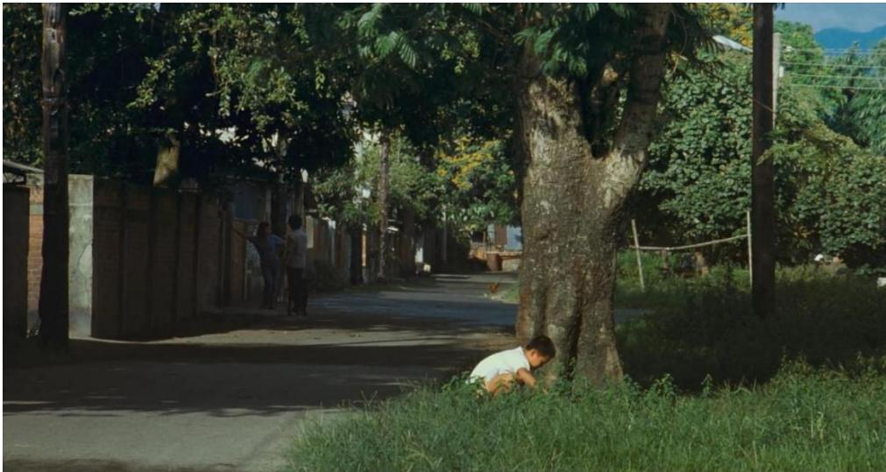
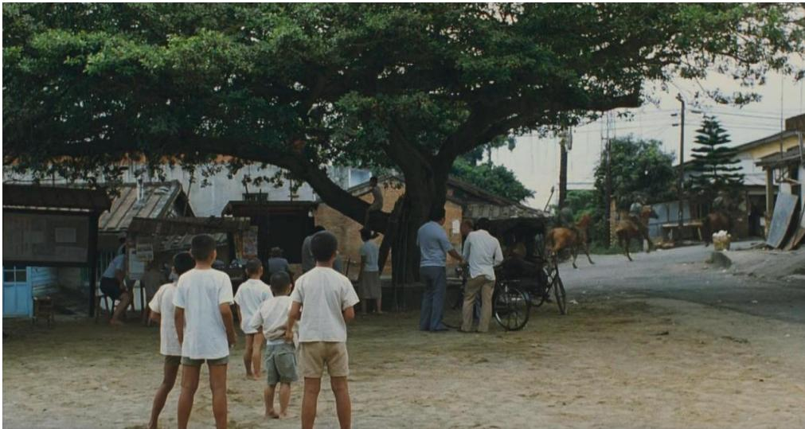
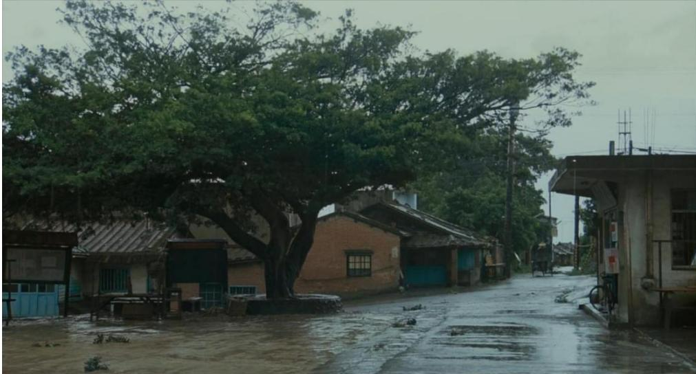
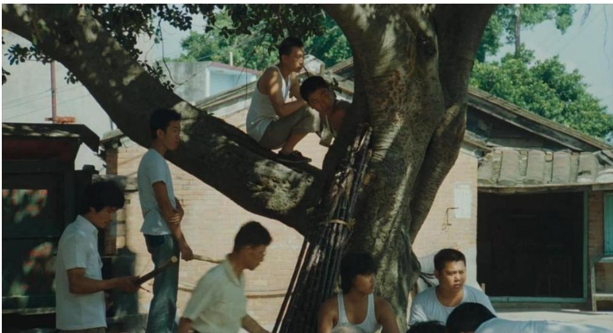
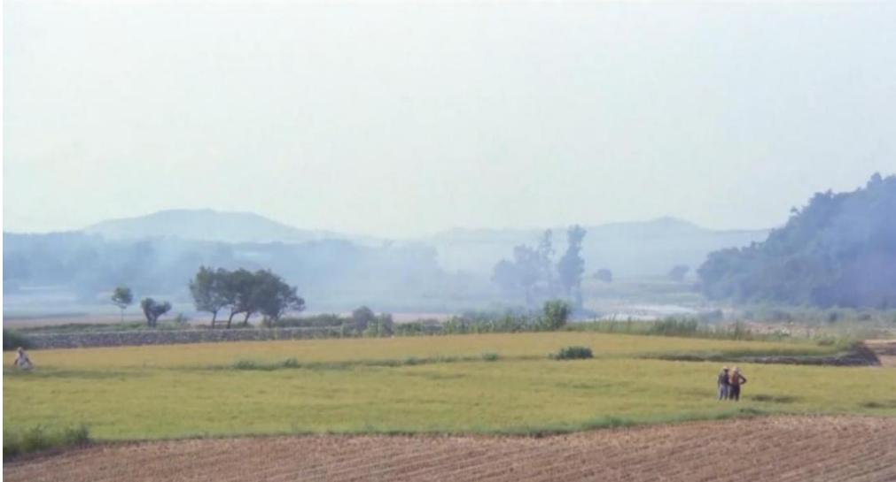
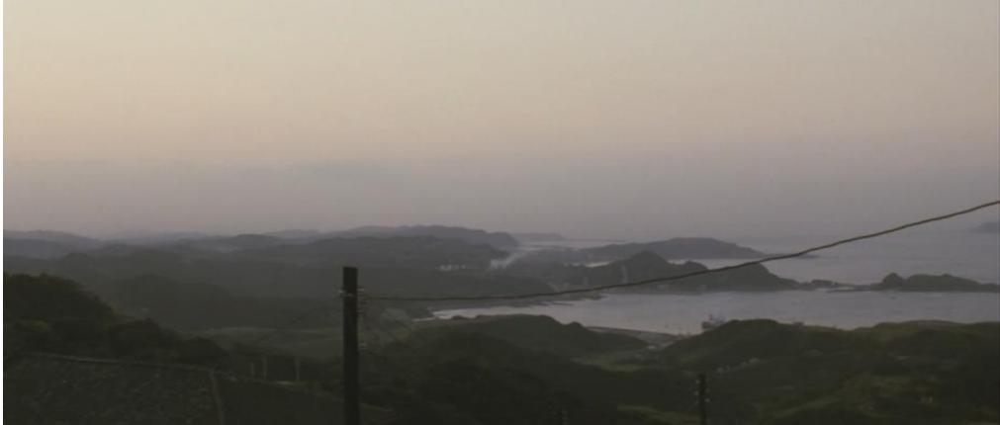

分类号 J905级 公开190535

# 硕士学位论文

（学术型）

# 题目

# 情·景·物：侯孝贤电影的文学性表达

作 者 娄金林指导教师 裴亚莉 教授一级学科名称 戏剧与影视学二级学科名称 戏剧与影视学提交日期 二〇二二年六月

# 摘要

侯孝贤导演作为享誉世界的电影大师，在世界电影史中拥有属于他的精准的坐标。自他创作初始至今，学界对其电影作品的研究没有停止过。当然，在这四十多年的探讨过程中，对其作品的研究视角不断被丰富、研究深度不断被挖掘。二十世纪初，西方文艺思潮进入中国学者的研究视野，再到后来的八十年代，众多西方思潮流派涌入国门，观念之新、之纷繁，令人目不暇接，这种吸收外来文学理论的井喷式现象，在中国文学史上任何一个时期都难以寻见。如今，在西方文学理论的大潮下，我们欣赏和批评艺术作品时，总是对其外在形式津津乐道，不断地在研究中强调着“作者已死”，“诗言志”的评价方式，在今天的学术潮流中看起来似乎是难以启齿、陈旧落伍的，其实不然。在对侯孝贤导演的大量研究与解读中，已经有不少的成果注意到了他的作品中充盈着大量的主观个人体验与客观历史凝视，以及对台湾的社会、历史、文化进行更深层次的探讨之尝试。

本文立足于中国古典文艺理论，以侯孝贤导演作品中的情、景、物为落脚点，尝试对其作品与文学传统之间的互动和联系作出阐释，并通过侯孝贤导演对文学传统的自觉追求，梳理出其电影的文学性蕴涵。

本文由绪论、正文和结语组成，其中正文部分包括四个章节。

绪论部分阐明了选题缘起和研究意义，并对相关研究成果做出了评述。另外还有梳理文学性与电影的文学性之界定，这里需要提到的是，文学性是一个极其复杂的概念，在中国的文学传统中包含了情、景、物三个维度，但绝非只此三个维度，这部分会提出情、景、物三者在中国文学传统中的重要性，以及选择这三者作为落脚点论述而不涉及其他中国文学传统的原因。

第一章对侯孝贤导演的创作背景进行梳理，将其创作放置于台湾地区的社会历史语境下，重点论述其在台湾新电影运动发展、台湾乡土文学成为台湾文学主流的历史视野下受到的来自文学的影响，阐明侯孝贤导演与文学的交汇。

第二章、第三章、第四章分别从情、景、物出发，阐明三者之间内在的复杂关系。三者水乳交融，互为表里，没有清晰的界限，在大多数情况下，景和物二者是服务于情的统摄，但有时也有景和物的出现会形成对情的割裂。在这三章将进一步论述作品与中国文学传统之间的互动与关联，探讨三者如何构成了侯孝贤电影的文学性特质，即抒情性特质。

关键词：侯孝贤，文学性，抒情性，中国古典文学

# Abstract

As a world-renowned film master, director Hou Hsiao-hsien has his own precise coordinates in the history of world cinema.Since the beginning of his creation to the present, the academic community has not stopped studying his film works, and of course, in the course of these forty years of exploration, the perspective of his works has been enriched and the depth of research has been explored.At the beginning of the twentieth century， Western literary trends entered the research horizon of Chinese scholars,and then in the 198Os,many Western schools of thought poured into the country, and the newness and diversity of the concepts were overwhelming, and this kind of spurt of absorbing foreign literary theories is hard to find in any period of Chinese literary history.Nowadays, under the tide of Western literary theory, when we appreciate and criticize works of art, we are always delighted with their external forms and constantly emphasize in our studies that "The Death of the Author" and that "Poem Expressing Ideal" approach to evaluation may seem unpalatable and outdated in today's academic trends, but it is not.Among the numerous studies and interpretations of director Hou Hsiao-hsien, there have been a number of results that have noted the abundance of subjective personal experiences and objective historical gaze in his works, as well as the attempt to explore Taiwan's society, history, and culture on a deeper level.

Based on classical Chinese literary theory， this paper attempts to explain the interaction and connection between Hou Hsiao-hsien's works and literary traditions, and to sort out the literary connotations of his films through his self-conscious pursuit of literary traditions.

The article is divided into three parts: introduction, body and conclusion, and the body part has four chapters.

The first part of the introduction gives an account of the origin of the topic and the significance of the innovative research, together with a review of the research. It is important to mention here that literariness is an extremely complex concept, which includes three dimensions in the Chinese literary tradition, namely, emotion, scene, and objects, but not only these three dimensions.

The first chapter compares the creative background of director Hou Hsiao-hsien, places his creation in the social context of Taiwan, focuses on his influence from literature under the historical perspective of the development ofTaiwan new movie and the emergence of Taiwanese native-soil literature as the mainstream of Taiwanese literature, and clarifies the intersection between director Hou Hsiao-hsien and literature.

Chapter 2, Chapter 3 and Chapter 4 respectively start from emotion, scene and objects. The internal relationship between the three is complex. The three are in perfect harmony with each other. There is no clear boundary. In most cases, scene and objects serve the unity of emotion, but sometimes there are scenes and objects that appear to create a severance of emotion. In these three chapters, we will further discuss the interaction and connection between the work and the Chinese literary tradition, and explore how the three constitute the literary quality of Hou Hsiao-hsien's films, that is, the lyrical quality.

Key words: Hou Hsiao-hsien, literariness, lyricism, Chinese classical literature

# 目录

绪论..  
0.1选题缘起与研究意义. ··········································  
0.2 研究综述... ·················· .2  
0.2.1对侯孝贤导演电影的总体研究 .2  
0.2.2 对侯孝贤导演电影的文学性研究. ..5  
0.3 文学性与电影的文学性.. ...6  
0.4情、景、物:抒情与文学的一种表征. ..8  
第一章 侯孝贤电影与文学的交汇 ..11  
1.1 侯孝贤创作的外部影响. ...11  
1.1.1 创作背景梳理. ..11  
1.1.2 乡土文学对侯孝贤创作的影响 ..12  
1.2 侯孝贤创作的内部影响. ...15  
1.2.1 从“小毕的故事"谈起. ..15  
1.2.2 抒情诗人:侯孝贤电影文学性的自觉， ...17  
第二章 侯孝贤电影中的情 ...19  
2.1“残缺"的父亲与"出走"的儿子. ...19  
2.2 女性的群像:母亲、恋人、奶奶. ...21  
2.3“住在历史下游的人家”. ..23  
第三章 侯孝贤电影中的景. ...27  
3.1“无我之境":关于树的景.. ...28  
3.2“有我之境":山峦、大海、田野 ..32  
第四章 侯孝贤电影中的物 ...35  
4.1 侯孝贤与“物哀”. ....353  
4.1.1 何谓“物哀” ..35  
4.1.2 侯孝贤与物哀美学的延申， ...36  
4.2 欣赏与超越:侯孝贤电影中的"物哀"美学. ..37  
4.2.1 对人之感动.. ..37  
4.2.2 对世相之感动. ...38  
4.2.3 对自然物之感动. ...39  
结语... ...41  
参考文献.. ..43  
附录侯孝贤电影创作年表 ...47

# 绪论

# 0.1选题缘起与研究意义

回看台湾电影史，不可回避地需要提及到一位导演，便是自台湾新电影运动中脱颖而出的侯孝贤导演。1982年《光阴的故事》拉开了台湾新电影的序幕，另一开山之作便是侯孝贤参与创作的被学者称作台湾新电影滥觞源头的《儿子的大玩偶》（1983）。一批开始回归现实、关注台湾现实社会生活的电影作品进入台湾观众的视野，掀起了一场有关台湾文化生活的革命，这在八十年代之前的台湾社会语境下是无法想象和抵达的，“台湾新电影以反思往日历史、确立台湾身份、重建电影语言为最高任务。”①

同样在这个时期，侯孝贤开始了确定其个人独特的电影风格的进程。侯孝贤在各种访谈中多次提及沈从文对自己电影创作产生的巨大影响，在《沈从文自传》中领略到的“不以物喜，不以己悲”的胸襟，和一种“俯视”的、“冷眼看生死”的法则被他吸收到自己的创作观念中。这时当我们再来回顾侯孝贤导演的作品时，会清晰地感受到流露于他作品中的独属于中国传统美学的审美观点和情感表达方式。倪震认为，侯孝贤之所以可以成为亚洲电影的领军人物之一，是因为其始终以历史方式介入台湾与中国大陆的种种联系，以相对冷峻的叙事风格实现对个人与社会的关照。“尽管20年来，亚洲电影情势起伏变迁，后起之秀层出不穷，然而侯孝贤仍然从容自信地保持其个人特色，延伸着他的人文探索和历史回顾。侯孝贤电影持之以恒的生命力，固然与其人文含量和内省体悟有关，但超越台湾本土，具备亚洲文化的视野和内蕴，也是产生世界影响的原因之一。”③对侯孝贤电影的研究由来已久，这对电影史的延伸、对华语电影美学的探讨以及对华语电影的创作都具有相当可观的意义。从世界电影史的角度来看，侯孝贤电影中所体现的情感表达甚至可以上升为一个民族的情感表达，他作品所传达的价值观、审美情趣明晰地表露着中国文学传统的观点与情感。在谈到“情”的时候，笔者认为将此放置于中国文学的传统中来考察不失是一个比较合适的角度。中国文学的传统是抒情的传统，以往的研究成果中在讨论侯孝贤电影的“情”的时候，大多往往是单独考察了“情”，考察的过程中割裂了情、景、物的互动关系，本文的研究正是基于此发起的。因此，研究侯孝贤电影的文学性表达，为我们提供了理解侯孝贤电影和其文化视野的新的思维范式，进一步拓展研究侯孝贤电影的研究视角，更可以提供一条研究侯孝贤电影与文学之间互动关系的线索。

提及文学性，能够延伸出关于侯孝贤电影的诸多思考，如中国文学传统是如何呈现于侯孝贤电影中的？这种呈现又是如何影响着电影的抒情性表现的？电影与文学性的互动是否形塑了侯孝贤独特的电影风格和气质？文学性的表达是否能够为侯孝贤电影在世界电影舞台上大放异彩的特异性提供一个有效的支撑？再者说电影的文学性或者抒情性的表现是否可以为我们研究电影的审美价值提供一个新的有效途径？本文从上述问题出发，通过梳理侯孝贤电影中呈现的中国文学传统的审美范式，从而进一步思考总结侯孝贤电影与文学性间的交织。

# 0.2研究综述

# 0.2.1对侯孝贤导演电影的总体研究

侯孝贤于上世纪八十年代初开始以导演的身份独立进行创作，特别是其作为“台湾新电影”运动的领军人之一，在“台湾新电影”初生的时期就受到一众学者的关注，学界对其人与其作品的讨论是由来已久的。本文文献主要来源于中国知网，时间界定为1986年5月至2022年1月，以“侯孝贤”为关键词进行相关主题的搜索，共得出学术期刊658条，学位论文82条，中文图书5本，外文图书2本。笔者将所获取的文献分为电影形式研究、电影内容研究、电影比较研究、其他相关研究、学术研讨会与书籍五个类别进行以下梳理。

# （1）电影形式研究

对侯孝贤导演电影形式的研究在笔者整合的文献中占比较大，最为突出的是对其影像风格的研究，主要对叙事手法、镜头语言、美学风格的分析，这些成为研究侯孝贤电影不可或缺的部分。

侯孝贤电影叙事的主要特征为：非直线性叙事，淡化冲突和叙事，情节缓和散漫，片段化地展示故事情节，故事在一种缓和的节奏中展开；在镜头语言上表现为：长镜头、空镜头、固定镜头的大量组合运用，跳切的镜头组合方式；在美学风格上表现为：写实性特征显著，注重情境的书写。

具体而言，晏凌在《叙事与景观平衡—一看侯孝贤的<冬冬的假期>》中提到电影中田园景观承载了舒缓的情感，没有起承转合、伏笔、铺排手法的渲染营造了叙事明快的步调，侯孝贤的叙事是在景观的铺陈中累积出来的。万传法《在思想、心灵深处——谈侯孝贤及其影片》中提到侯孝贤通过省略情节达到放置个体情感、家族伦理的空间，抒情化通过叙事的实与虚实现。李相在《儒梦人生-

谈侯孝贤电影的作者特质》一文中指出，侯孝贤电影的长镜头、空镜头以及全景镜头为他赋予了“作者”的特质，是侯孝贤电影风格不可忽视的重要表现。孟洪峰在《侯孝贤风格论》中用闷、愣、浑形容侯孝贤的电影印象，风格特征则体现在通过人与物与环境的交互表现情绪。

# （2）电影内容研究

这部分笔者从电影的主题、题材等方面进行梳理。二十世纪八十年代台湾电影市场萎靡，本土观众厌倦了琼瑶式爱情喜剧片、武侠片、意识形态强烈的反共片，继而将目光转向引进的欧美电影。侯孝贤及其他“台湾新电影”的发起者和拥护者借解严之际较为宽松的政治环境，创作转向区别于传统电影的主题、题材，聚焦现实生活中普通人的真实生活和情感。对电影内容的研究在对侯孝贤电影研究领域中占比较大，这是探讨侯孝贤电影究竟表现了什么的问题。

这部分研究多将侯孝贤电影的主题进行归纳总结。如何萱的《本土语境中的成长追寻与乡情呼唤一一侯孝贤成长电影主题观察》一文，提到侯孝贤早期的“成长四部曲”是通过将个体经验放置于城乡变迁中，从叙述个体成长的过程中侧面反映台湾地区社会的发展变化，给予观众了解台湾历史、社会和文化的窗口。孙慰川在《秉持写实主义精神 谋求美与真的统一一一读侯孝贤的“悲情三部曲”》一文中提出，“悲情三部曲”的叙事主题是建立在对台湾历史的反思前提上的。史可扬、康思齐《“归去”主题在侯孝贤电影中的流变》一文中，梳理“归去”主题在侯孝贤不同创作时期的三个层面，第一个层面表现为城乡对立，否定的城市和赞美乡村，第二个层面为在社会全面工业化的语境下对乡土文明的缅怀，第三个层面为超脱了历史和现实的维度。

另一部分文献侧重于研究侯孝贤电影中某一种类型的题材。如在康一雄的《<刺客聂隐娘>：视觉华丽的反女性主义电影》、孙力珍、侯东晓的《侯孝贤电影中”慢美学“与女性意识—一从<南国再见，南国>到<刺客聂隐娘>》、杨君宁德《女性声音、文学视角一一朱天文在侯孝贤电影中的文化实践》等文章中，研究侯孝贤电影中和女性相关的话题，探讨侯孝贤电影中女性主体的建构和以何种方式关照女性。

# （3）电影比较研究

这一类是基于比较视野的研究，具有代表性的有陈旭光、李雨谏的《“长镜头”的“似”与“非”：语言、美学与文化—一侯孝贤与贾樟柯比较论》，文章具体分析侯孝贤、贾樟柯二人在使用长镜头这种电影语言手法上的异质性，进而得出两位导演在艺术创作上的不同追求，作者将之归因于两位导演所处的不同文化语境。郭小橹的《一种影像：关于小津，关于侯孝贤》，作者认为虽然侯孝贤和小津安二郎的叙事观念和影像风格具有一致性，但在这种一致性之下又呈现了不同名族的特殊性和时代的差异性，文章通过具体影像语言、角色形象设置等具体分析两位导演关于东方观念的差异。王锦川的《侯孝贤与杨德昌电影比较研究》一文中，梳理了两位导演的创作经历，对比分析两位导演作品中的视野、主题、镜头、叙事、对儒家精神的态度等五个方面。同样将侯孝贤导演与其他导演进行比较的文章还有黄婧秋、罗洋的《电影时空中的东方意象—一试论小津安二郎与侯孝贤的影像风格》、赵春《一种影像，两道风景—一小津安二郎与侯孝贤电影比较》等。

# （4）其他相关研究

侯孝贤与编剧朱天文合作了三十年之久，如果要研究朱天文，就绕不开侯孝贤。这部分文献梳理来自研究朱天文的文章，虽然数量不多，但是对于研究侯孝贤也同样具有宝贵的参考意义。刘春苗的硕士论文《朱天文电影文学创作研究》谈到侯孝贤在朱天文的小说文本转换成电影的过程中扮演了极为重要的角色，两人相同的艺术观念保障了小说文本和电影的统一性，在美学风格上保持高度一致，具体从朱天文的散文化叙事、女性抒情的写作风格论述其对侯孝贤创作的影响。黄奕卿的硕士论文《悬而未决的激情—一论朱天文小说与电影的互动》从不同时期小说创作和电影创作中的题材的流变，将朱天文和侯孝贤的合作分为三个时间段，具体从电影题材、文学性风格、女性意识三个方面论述了朱天文对侯孝贤电影的影响。同样在研究朱天文时提到侯孝贤的文章还有杨君宁的《女性声音、文学视角与美学形构—一朱天文在侯孝贤电影中的文化实践》、叶秀琴和金进的《朱天文<童年往事>的影像化叙事》、梁佳玲的《文本与形象的互动—一朱天文电影剧本改变研究》等。

# （5）学术研讨会及相关书籍

近年来，有关侯孝贤电影研究的学术研讨会在两岸三地时有举行，具有代表性的有于2012年7月由中国电影资料馆主办的“电影高峰论坛：侯孝贤影展暨研讨会”，两岸电影学者就侯孝贤电影作品展开学术讨论，有关这次研讨会的部分论文收录在饶曙光老师主编的《电影要从非电影处来》一书，这些文章分别从技术、美学、历史、文化研究等多个角度阐释了侯孝贤的电影，论文集就文章研究角度将其分为传承与变革、形式与意义、历史与意象、接受与互动等多个单元。同样的学术论文集还有由王德威主编，台湾学者林文淇、沈晓茵、李振亚编著的《戏恋人生—一侯孝贤电影研究》（2000），该论文集为研究侯孝贤电影的学者提供了台湾地区独特的本土视角。2007年11月侯孝贤受邀前往香港浸会大学开展电影讲座，相关讲稿由卓伯棠收录于《侯孝贤电影讲座》一书。书中侯孝贤谈及了自己的创作历程，对于电影的真实与现实的看法，自己与小津安二郎、布列松等电影大师在创作上、艺术观念上的异同等，为研究学者提供了最能够接近侯孝贤电影世界的第一视角。美国学者白睿文的《煮海时光：侯孝贤的光影记忆》汇编了作者与侯孝贤十九个访谈录，访谈内容是孝贤对自己作品的诠释、分析和回顾。相关的研究书籍还有朱天文的《最好的时光一一侯孝贤电影记录》、《红气球的旅行一一侯孝贤电影记录续编》书中收录了朱天文的短篇小说、侯孝贤电影剧本、侯孝贤电影创作后记等重要资料。

# 0.2.2对侯孝贤导演电影的文学性研究

纵观学者对侯孝贤电影的相关研究文献，主要集中在关于侯孝贤电影的艺术表现形式、电影主题和题材的探讨，其中有些学者提到侯孝贤电影的“抒情性”，或者说侯孝贤是一位“抒情诗人”，他的电影具有“诗性气质”，具有代表性的文章有张晓迪的《电影是一种乡愁—一论侯孝贤电影的抒情特质》，他在文中提出侯孝贤电影中对传统爱情价值观的体现是通过“抒情”达到的，分别从乡愁怀旧的主题思想、远观静默的诗化视角、悲情无力的文化情结三个方面展开对其观点的论述。孙士雪的《论侯孝贤电影的诗性美学》一文中通过分析侯孝贤电影的视点，即对普通人和历史的关怀，认为他电影的诗性美学的“本”是写实，通过分析电影中简约的语言，展示自然的画面，克制的演员表演以得到电影的诗性美学的“质”在于含蓄；葛春颖的《侯孝贤的诗意美学品格》同样是通过分析意境、叙事策略、镜头语言得到侯孝贤电影的美学风格是诗意的。

在这些文章中，“长镜头”讨论的频次颇多，通过“长镜头”以达到“抒情”和“诗意”的观点在这些文章中几乎都能找到。虽然将研究视角集中在长镜头的出现上，可以加强侯孝贤与其他一众擅长利用长镜头的导演的共性，但更多的是带来研究思维固化的缺憾。存在长镜头的电影不在少数，我们不能一以概之为“诗电影”，或者说其导演是一位“抒情诗人”，这是逻辑混乱的。且笔者认为，要论定侯孝贤的作品是“诗电影”，是具有“诗性气质”的，其中的“诗”不是指诗学问题中研究电影的艺术规律那么简单。这个问题是有待商榷的，我们或许可以把这里的“诗”指向文学性，要探讨这个问题应该回到中国的文学传统，即抒情传统。“抒情”是极具文学意味的表达，蕴籍着复杂含混的文学话语，仅仅以“长镜头”便指认某位导演的“抒情性”是片面的。因此本文尝试将侯孝贤导演置于中国文学传统中，充分探讨其电影“抒情性”的源流，并通过“情”、“景”、“物”对侯孝贤电影的文学性表达进行探讨。

对侯孝贤电影作品中文学性的研究不仅有助于为我们的提供理解侯孝贤电影和其文化视野的新的思维范式，更可以为我们提供一条研究侯孝贤电影与文学之间互动关系的线索，从而以一种新的视角重新审视这位生于内地，长于台湾地区的华语电影导演。也只有如此，才能让我们更好的理解侯孝贤导演的作品风格，并且突出侯孝贤导演的特异性。

# 0.3文学性与电影的文学性

在探讨侯孝贤电影的文学性表达之前，笔者认为有必要对“文学性”以及“电影的文学性”做一个简要的梳理。文学性话题的出现很容易让人不自觉地联想起二十世纪初俄国结构主义语言学家、形式主义批评家罗曼·雅各布森（RomanJakobson）首次提出的“文学性”概念，他认为“文学科学的对象并非文学，而是‘文学性’，即使一部既定作品成为作品的特性。"在此之后，“文学性”(Literariness）便成为了一个历久弥新的话题，从它提出至今，中外学界有关它的探讨就没有停止过，但是关于文学性的定义，至今也没有得出一个面面俱到、无懈可击的公认说法。中国学者史忠义梳理了西方学者有关“文学性”提出的种种定义，概括成了以下五类：“形式主义的定义”、“功用主义的定义”、“结构主义的定义”、“文学本体论的定义”以及“涉及文学叙述的文化环境”，①但无论以上哪一种，他认为都存在缺陷，因为对此的解释没有绝对的标准和定义。如果必须对“文学性”予以界定，那“这种定义应该是宏观的、开放性的定义，而非微观意义上的死标准。”②尽管现在我们没有能够得到一个确切的、普遍认同的有关“文学性”的定义或者概念，但笔者并不觉得遗憾，因为文学不是停滞不前的，文学在发展的过程之中随之孕育而生或是已有的相关文学观念也是在发展变化的，因此文学性的概念或是界定也是发展变化的，“有多少种文学观念，就会有多少种对文学性的理解。”③

对于雅各布森来说，“文学性”就是“文学之所以成为文学”的特性，如此说来，电影的“文学性”是否存在便成为一个被悬置的问题，如果电影是具有文学性的，那电影的文学性又指涉着什么？它又以何种方式存在？上个世纪八十年代，张骏祥先生在“根据国庆三十周年献礼片导演总结学习会上作了题为《用电影表现手法完成的文学》的发言。他提出，电影不仅是综合性艺术，而且“电影又是文学”，“导演的任务就是用自己掌握的电影艺术手段把作品的文学价值充分体现出来。”并且呼呼“不要忽视了电影的文学价值。”①张骏祥讲话中所指的电影的“文学价值”主要体现在以下几个方面：首先，电影作品要体现出清楚明确的思想倾向；其次，导演在电影作品中要塑造好典型形象；最后，电影要兼收并蓄文学的表现方法和技巧。

中国电影学术界对张骏祥的此次发言极为关注，因此引发了一场热烈且持久的关于电影的文学性的激烈论战。最早对张骏祥“电影就是文学”这一观点持赞同意见并响应的是学者王愿坚，他在《电影，看得见的文学—一学艺笔记之二》一文中提出“一部电影艺术作品，同时也是一部看得见的文学作品文学性是电影艺术从娘胎里带来的一种属性或者可以说，电影，就是看得见的文学。”②王愿坚认为电影的文学性囊括了多个方面：文学和电影都积极能动地反映生活；电影也如同文学那样体现了人丰富多样的内心世界；电影自带叙事性；电影同文学一样写人的行为动作；电影同文学一样具备凝练且具表现力的语言。舒晓鸣、文论在《谈电影的文学价值》一文中阐释了电影的文学价值就是“一部影片透过银幕形象自然流露出来的思想性或哲理性、人物形象的真实性和鲜明性、表现风格上的独特性。”③在对张骏祥的响应和声援中，产生较大影响的应属学者陈荒煤的《不要忘了文学》这篇文章，他提到“电影的基础是文学”，电影艺术和文学的关系密切，同时也存在许多亟待探讨的问题，但“我们不能不承认电影需要有真正文学价值的文学创作为基础。”邱明正在《电影文学性漫谈》一文中提及“电影的文学性不仅表现于以文学剧本为基础或媒介，也不仅表现于电影的旁白、字幕和画外音，同时还表现于运用文学的叙事、抒情手段和功能，尤其重要的是还表现于电影中的语言—一叙述语言、描写语言，特别是人物语言。”③

也有学者对张骏祥的观点表示了不同的看法，张卫在《“电影的文学价值”质疑——与张骏祥同志商榷》一文中认为电影作为一门独立的艺术，也能承担表现思想，创造典型的功能，如果用“文学价值”来涵盖之，那就混淆了电影的价值和文学的价值。因为“电影艺术本身所反映的思想内容就是思想内容，典型形象就是典型形象，表现手段就是表现手段。”他认为电影是一门综合的艺术，尽管“它自由地表现接近于文学”，但也不能片面地去强调文学价值而忽略电影中其他例如绘画、音乐、摄影等艺术元素。郑雪来在《电影文学与电影特性问题一一兼与张骏祥同志商榷》一文中也提出了与张骏祥不同的观点，“电影并非文学的复制品，也不是它的一个经过改善的变种或分支。电影有它本身的艺术规律”，“由于电影剧本作为一种文学样式必须具有文学性，而电影本身却可以或以文学性，或以戏剧性、音乐性、绘画性等而见长，或偏重某‘性’，或各‘性’兼备。”$\textcircled{1}$

与“文学性”问题的探讨一样，关于电影的“文学性”在学界同样引起了广泛讨论，至今没有对其盖棺定论。尽管如此，但我们绝不能将电影与文学割裂开来。笔者认为，在这种情况下如果要探讨侯孝贤电影的文学性表达，需要将之放置于中国文学传统的范畴中讨论，即“抒情”的语境下讨论。

# 0.4情、景、物：抒情与文学的一种表征

陈世骧先生曾经在《论中国抒情传统》中提到—一中国文学传统从整体而言就是一个抒情传统。②“抒情传统”的提出更像是一种宣言，在中西对照的比较文学视野下拟定了中国文学之于世界文学中的定位。此后关于抒情传统的论述，在港台学者和海外汉学者如高友工、王德威、陈国球等人那里能够看到传承和流变，但陈世骧先生提出抒情传统之初所谈到的“抒情精神在中国传统之中享有最尊尚的地位，正如史诗和戏剧兴致之于西方”③的原点是不可否认的。

立足于陈世骧先生的抒情论点，再回过头来溯源抒情精神之于文学传统，笔者尝试从文学传统中找到情、景、物能够体现侯孝贤电影的文学性表达的合理性。学界对于中国文学的起源之看法，在于《诗经》，从中国文学诞生之始，“抒情”便一直萦绕其中，“中国文学的荣耀别有所在，在其抒情诗。长久以来备受称颂的《诗经》标志着它的源头；当中‘诗’的定义是‘歌之言’，和音乐密不可分，兼且个人化语调充盈其间，再加上内里普世的人情关怀和直接的感染力，以上种种，完全契合抒情诗的所有精义。”④《诗经》成形于公元前11世纪至前6世纪，存留的305 篇在孔子的时代被命名为《诗》，直到宋代才有了《诗经》这个称法。“诗”字的远流最早便是见于《诗经》之中，在流传的305篇中有三处可见“诗”,即《小雅·巷伯》、《大雅·卷阿》、《大雅·崧高》，“寺人孟子，作为此诗”，“矢诗不多，维以遂歌”，“吉甫作诵，其诗孔硕”。在古人心目中的“诗”是“歌出的文字”，墨家学者曾指出诗的“诵、弦、歌、舞”，可见“诗”的原始意义与音乐有紧密的关联。其后《楚辞·九章》中出现的“诗”淡化了音乐性，更多地指向诗义本身，即是否是具有“诗意”的作品，《九章·悲回风》中“介眇志之所惑兮，窃赋诗之所明”其中的“诗”便是如此。陈世骧先生在比较中国之“诗”与西方之“poetry”的词义时，谈到亚里士多德所提的“诗”具有抽象的“制作”的意味，它所适用的是希腊文学的史诗和戏剧，而中国文学中“这个‘诗’字乃是自然萌发的实体，此字之创造非为文学评论时的方便，而是早期诗艺创造冲动的流露，其敏感的意味，从本源、性格和含蓄上看来都是抒情的。”①

陈世骧先生在谈“诗”时点出“‘兴’是这种诗歌之所以特别形成一种抒情文类的灵魂。”②“兴”是初民在群体劳动过程中配合“上举”的动作发出的呼喊，这种呼喊的始源发乎于情。古典文论中关于“情”的论述，离不开“志”。《左传·襄公二十七年》中赵文子对叔向提到“诗以言志”，这时的“志”，是士大夫咏诵诗歌的理性行为，其中“情”的意向还不够明确。先秦《尚书·尧典》中提到：“诗言志，歌永言，声依永，律和声。”这应该是最早在“志”中体现“情'的，这时的“志”可以理解为情感志向或者理想抱负。再其后，孔子在阐明“诗言志”时曾提出“兴观群怨”说，意在说明“诗言志”的“志”是指向对社会的干预作用，诗是具有教化作用的，但我们不能否认“志”在其中也有感发情感的成分，是有“情”的存在的。“情”在“志”中的观点在后来的《毛诗序》中得到了充分的体现，“情动于中而形于言，言之不足故嗟叹之，嗟叹之不足故永歌之，永歌之不足，不知手之舞之，足之蹈之也。”将“情”引进“志”，相比孔子时代“志”的政教作用，此时的“志”更多的是进入了艺术的审美本质问题之中，体现人们主观的审美活动，即情的抒发。陆机在谈到诗这种文体的审美特征时提到“诗缘情而绮靡”，更加明确了“情”在诗中的审美本质。这与后来刘勰所说的“昔诗人什篇，为情而造文；辞人赋诵，为文而造情”意见相同，都认为“情”在艺术创作中不仅是原动力，而且是艺术内容的主体。“诗缘情”的观点影响着后世中国文学的发展，我们再回看唐诗、宋词、元小说、明传奇、清昆曲，抑或是近现代的中国文学时，都能在其中找到“情”是艺术创作的审美本质这一点。西方的艺术创作也有关于对“情”做出的论述，如华兹华斯所说：“诗是强烈情感的自然流露。”只是“情”在西方文学中并不处于“正统”，他们的文学传统是关于史诗和戏剧的，而“情”在中国文学传统中是处于“正统”的地位的。

王昌龄在《诗格》中提出“诗有三境”，一是物境，二是情境，三是意境。皎然在《诗式》中提“诗情缘境发，法性寄筌空。”他们都在指向文学中审美的最高范式是“意境”，意境离不开“情”的生发，意境生成中的事象、物象、意象都是有了“情”才升华为“意境”。古人在艺术创作中营造意境时的主观对象是情，客观对象是景和物，不论是在诗词歌赋还是绘画、书法中都能窥见，“象外之象，景外之景”、“文外之旨”的意境表达是艺术家情感抒发的最高境界。

因此，笔者认为从中国文学的传统中把握侯孝贤的电影，应该从情、景、物三个维度进行考察。直接参与到侯孝贤电影创作的剪辑师和编剧也曾谈起他们的创作是依归于中国文学的抒情传统的。学者张靓蓓曾经指出廖庆松的剪辑手法是出于“中国诗化抒情传统”，廖庆松本人在谈到《悲情城市》的剪辑时说：“那时候我很清楚地感觉到，我剪出的就是一种中国文学的抒情传统。”①朱天文在《<悲情城市 $>$ 十三问》中谈到的第五问“抒情的传统或是叙事的传统”，她引征陈世骧先生有关抒情传统论述，说：“诗的方式，不是以冲突，而是以反映与参差对照。既不能用戏剧性的冲突来表现苦痛，结果也就不能用悲剧最后的‘救赎’来化解。诗是以反映无限时间空间的流变，对照出人在之中存在的事实却也是稍纵即逝的事实，终于是人的世界和大化自然的世界这个事实啊。对之，诗不以救赎化解，而是终生无止的绵绵咏叹，沉思，与默念。”③

# 第一章 侯孝贤电影与文学的交汇

笔者认为，要探讨侯孝贤电影与文学的交汇，需要从创作的外部影响和内部影响两个维度来讨论。外部影响是指，侯孝贤电影创作的社会语境，其中最重要的是八十年代台湾地区文学思潮对电影创作的影响；内部影响是指，侯孝贤的编剧朱天文，其身份和小说作品的特殊性给侯孝贤电影带来了一种天然的、与生俱来的文学性，侯孝贤本人有意识地从文学那里借来了具有文学意味的艺术表现手法。

# 1.1侯孝贤创作的外部影响

# 1.1.1 创作背景梳理

侯孝贤导演的独立创作始于八十年代初，正值台湾新电影运动兴起，此时中国台湾的社会环境较之前发生了很大的变化，为这次台湾电影“新浪潮”的萌芽和发展提供了有利条件。用侯孝贤自己的话来说，就是“那时候党外运动兴起，时代已经在骚动了，经济起来，中产起来，社会开始释放能量，而我们正好拍出跟以前不一样的电影，社会空气跟舆论都支持我们。”①

首先就政治环境而言，战后的台湾以“中华民国”的名义保持着在联合国的席位，1972年联合国代表权回归到了大陆手中，台湾地区的国际地位陡然下降。1978年12月，中美两国签署《中美联合建交公报》，美国与中国台湾地区划清界限。1979年元旦，全国人大常委会发表《告台湾同胞书》，郑重宣布和平统一祖国的大政方针，叶剑英委员长继《高台湾同胞书》后，于1981年国庆前夕发表“九条”方针，进一步阐述用和平的方式解决台湾问题。这一系列政治举措，使台湾当局在国际上失去话语权。由于国民党在中国台湾地区长时间的独裁统治，岛内民众压抑已久，导致1979年爆发“美丽岛事件”，民众呼吁人权、民主与自由。国民党迫于压力，逐渐改变政治上的独裁，到八十年代后期，蒋经国宣告解除戒严，解除党禁，开放媒体及言论自由，台湾社会从封闭走向开放。此事件使得台湾社会在政治、经济、文化各方面都产生巨大影响，包括电影在内的文艺创作有了相对宽松的环境。

就经济而言，截止到八十年代初，战后台湾地区经济经历了四个阶段：五十年代在美国的经济援助下，贯彻“以农业培养工业，工业发展农业”的基本方针，扩张农业和建立进口替代工业；六十年代扩张出口，大力发展对外经济贸易；七十年代发展重化工业，加大扩张对外贸易；八十年代转变产业结构，发展高新技术产业。台湾经济的发展很大程度上决定着电影的生产与消费，比如社会资本累积增加，提高了对电影生产的投入资金；社会空间环境提升，为电影放映提供了更专业的场所；民众平均收入水平提升，增加了包括电影在内的娱乐消费支出等等，这些都为台湾电影行业的发展提供了有利条件。

就文艺创作而言，八十年代政策的松动给予文艺创作者更广泛的创作空间，经济发展带来的社会变化还有人口结构改变，各个阶层对文化的需求更加多元化。加之七十年代末台湾乡土派文学作家取得“乡土文学论战”的胜利，使以现实主义为本质的台湾乡土文学成为台湾文学的主流。这场论战可以看作是对三十年代台湾乡土文学论战的一次回归，都是在复杂的社会历史背景下“作家意识的觉醒，更是民族意识、社会意识的觉醒，”①七十年代末的这次论战“启蒙了整个八〇年代的种种文化与社会运动。”②台湾新电影正是在台湾乡土文学的影响下发展起来的，乡土文学作品成为台湾新电影改编的对象，电影继承了乡土文学的精神内核。综上，八十年代台湾的政治环境、经济发展状况、文化环境为台湾新电影、侯孝贤电影创作创造了有利条件。

# 1.1.2乡土文学对侯孝贤创作的影响

电影《风柜来的人》可以说是侯孝贤导演创作生涯中的一条分割线，这一点侯孝贤导演本人也曾指认过：“我说《风柜来的人》就是我整个创作的开头，终于回到了我自己的位置，一路下来，到现在都没有变。”③他的电影创作发轫于台湾新电影运动，同时，侯孝贤的作品也是台湾新电影的重要组成部分。这次台湾电影的“新浪潮”与台湾乡土文学之间的关联是及其显著的，正如学者所说：“文学与电影联合以争论一座岛屿的政治，正是运动的信号。”④所以，当我们讨论侯孝贤的电影的时候是无法避开台湾乡土文学的。

台湾在历史上先后经由荷兰、西班牙、日本殖民者的侵占和统治。1949 年蒋介石统治集团溃败后逃往台湾，虽然日本殖民统治者已被赶出台湾，但国民党在政治、经济上依赖于美国、日本，致使台湾的社会背景异常复杂，在社会中普遍存在亲美、亲日的思想倾向。早在日据时期，台湾本土作家黄石辉就日本殖民统治者“皇民化”、“去中国化”的殖民教育于1930年发表了《怎么不提倡乡土文学》一文，首次提出了“台湾乡土文学”。他呼吁“用台湾话作文，用台湾话写小说，用台湾话做歌谣，描写台湾的事物。”①他的文艺主张引发了三十年代的乡土文学论争，虽然这次的论证只是偏向于文学创作的语言工具问题，但他在特殊的历史时期强调了中国的民族意识进而与与统治者进行反抗，他的行为和主张无疑是带有值得肯定的启蒙性和反抗精神的。1945年国民党独统台湾后，提倡“反共文学”，台湾乡土文学处于边缘化的状态。1960 年左右台湾的一批作家意识到要唤醒民众的民族意识，回归中华民族主义，基于西化、殖民经济、现代化、国民党强权主义的复杂社会背景，台湾作家陈映真借由对钟理和作品的评价，在台湾文坛盛行倾向西化的现代主义文学、反共文学的情况下再次提出“台湾乡土文学”。这里的乡土并不是指乡村，而是指台湾本土。他认为在创作上台湾作家应该关注现实生活，贴近人民真实的生活进行创作，这种创作不仅仅是单纯地在作品中加入本土化的背景，而应该特别关注台湾人民真实的情感，对台湾乡土文学的理解后来也贯穿在陈映真的作品中。这种对于文学创作的深刻认识成为了黄春明、王祯和等台湾籍作家创作的倾向。

1982 年，被标榜为“中华民国二十年来第一部公开上映之艺术电影”的作品《光阴的故事》掀起了台湾新电影运动。值得一提的是，台湾电影史上的这次“新浪潮”和二战后法国电影新浪潮有异曲同工之妙，同样是对传统电影制作的一次颠覆，反传统，反优质，是对电影叙事形式和风格的一次革新运动。一群年轻的导演不满足于台湾电影过去老旧的电影风格，表现当下现实生活和表达真实情感是他们所追求的价值，如学者周斌所言：“它既适应了台湾社会和台湾电影变革发展的需要，也适应了一批青年电影编导艺术地表达自己对台湾社会状况和近现代历史地看法与见解之需要。”②扎根于现实生活的台湾乡土文学正好为他们的创作提供了灵感，一方面体现在电影创作者将台湾乡土小说改编为电影搬上银幕，另一方面体现在创作者将个人本土化的经验嵌入到电影中，总之，“乡土”是台湾新电影文学基调和情感基调的源泉。新电影的许多代表作，如《看海的日子》、《小毕的故事》、《我们都是这样长大的》、《风柜来的人》、《童年往事》这些电影都旨在关注台湾当地的现实生活。“新电影的创作者大多以中国知识分子自居，充满忧时伤国精神，企图藉电影的写实性反映民间疾苦，故特别重视写实性题材，而且喜欢作社会批判甚至政治批评，‘历史感的有无’几乎成为衡量一部新电影是否‘有分量’的一个先决条件。台湾新电影尽管不强调影片的‘主题’，但其创作者却特别重视电影的‘教化功能’，故‘文以载道’的情况相当普遍…台湾新电影显然属于‘为人生而艺术’的一派。”①

台湾新电影与台湾乡土文学的立场一样，是对于现代性带有批判意识的一种反思，对殖民地性格的一种反思，这种反思不仅是单纯地沉溺在现代化进程下对乡土逝去的伤怀，还包含对战前日本殖民和冷战历史下美国新殖民主义的揭露和反抗，试图在零散的现代性生活体验中找到属于本土的主体性体悟。这种主体性具体体现在在中国民族主义的视角下批判现实、回归现实、关怀台湾的土地和人民的意识中，“他们都努力从日常生活细节或是既有的文学传统中寻找素材，以过去难得一见的诚恳，为这一代台湾人的生活、历史、及心境塑像。”②台湾新电影运动的作品中具体体现为电影人以大陆人的身份找回属于中国传统的精神，提醒台湾人关注具体的事与物回归现实生活，如同《电影手册》的影评人所说的这次运动是“中国国内战争后第一代移民后代的情感表达。”③

回归现实，关注台湾普通人民的现实生活是台湾新电影运动作品统一的主题，这要求导演需要从个体在台湾的生活经验出发，以对台湾人民的真实生活观照为出发点进行创作。侯孝贤青年时期阅读过黄春明、陈映真等乡土文学作家的小说，台湾新电影的另一开山之作，由侯孝贤、曾壮祥、万仁执导的电影《儿子的大玩偶》原著作者正是黄春明，乡土文学是侯孝贤有意识地自觉地选择。他谈到：“在反映台湾的经验上，电影总是比小说晚，晚了约当十年。小说先描绘，电影之后才跟上。所以我们希望借用小说家的题材，或借助他们的力量，打开不同的视野。”④他早期的作品《风柜来的人》、《冬冬的假期》、《童年往事》、《恋恋风尘》被称为“成长四部曲”，将自己和身边人的个体生活经验融入社会的整体情境中，在历史中实现个体生活的还原再现。不仅于此，反国民党专制、去殖民化也是其成长电影主题中一个重要的内核。《风柜来的人》、《恋恋风尘》关注从乡村、矿区进入城市工作的青少年男女，在城市的种种窘迫际遇无不在说明着现代化将台湾社会的乡村和城市割裂，这种对于普通人的现实写照，他并不刻意去逃避乡土的落后性，而是希望普通人能够在社会中找到平等的主体性身份，他的现实创作观念和台湾乡土文学的精神内核可以说是一致的。

# 1.2 侯孝贤创作的内部影响

# 1.2.1从“小毕的故事”谈起

有人说，朱天文是侯孝贤的“御用编剧”，侯孝贤是朱天文的“御用导演”。1982 年侯孝贤在《联合报》看到朱天文的短篇小说《小毕的故事》，有意将此改编为电影。有意思的是，朱天文原本是带有防备心与侯孝贤赴约，但一见面却被侯孝贤的坦诚所打动，二人从此开始了长达三十多年的合作。朱天文作为一位作家，她有意识地将电影与文学融合在一起，当然，这也少不了侯孝贤主动尝试将文学意识纳入电影，二人的合作同时也使得侯孝贤对于文学的感悟能够在电影中更加准确地彰显出来。二人的合作被朱天文形容为“空谷回音”，“在侯孝贤的身边，我扮演一个空谷回音的角色。侯孝贤是一个能量极大的创作者，而我的职责是用语言去捕捉这个浩瀚的创作行为的律动。”①作家阿城将二者的关系形容得更为准确，“天文永远是柔弱、专注、好奇、羞涩、敏锐、质朴的集合体”，“侯孝贤无疑是贵金属，但如果没有朱天文这样的稀有金属进入，侯孝贤的电影会是这样吗？换言之，侯孝贤的电影是一种独特合金。”②

简单梳理侯孝贤和朱天文的合作历程，可以发现，朱天文的小说创作剧本创作与侯孝贤的电影创作在不同的时期关于题材的变奏似乎是同步的。电影《风柜来的人》、《冬冬的假期》、《恋恋风尘》等，与朱天文的《画眉记》、《这一天》、《最蓝的蓝》几篇短篇小说都属于半自传性质的创作，他们同为大陆移民的后代，将生长于斯的经验书写出来，在作品中还体现了对中国大陆的原乡情结。到了八十年代末解严之际，他们将目光转向历史，反思和批判国民党当局的犯下的罪恶行径，改编蓝博洲的《幌马车之歌》、陈映真的《铃铛花》、《将军族》、吴浊流的《无花果》等涉及白色恐怖、“二·二八”事件的小说，创作出了《悲情城市》、《好男好女》等突破政治禁忌、反思历史的作品。从《南国再见，南国》能够看出侯孝贤电影创作较之前的转变，与朱天文这时的小说《炎夏之都》都开始关注当下都市生活中的男女，他们的目光转向了都市生活中更为多元化的空间，相继创作了《千禧曼波》、《最好的时光》、《咖啡时光》等。

侯孝贤与朱天文的合作并非是简单地将文学文字转换成电影影像，更重要的是在艺术创作理念上的彼此靠近，在这场跨界的文艺创作中，朱天文给侯孝贤带来了新的文学视角。与同时期同样是拍摄少年题材的杨德昌导演有所不同，相比之下侯孝贤电影中没有《牯岭街少年杀人事件》里的爆烈，而是多了柔和平静的气质，笔者认为这种柔和的气质是编剧朱天文所带来的。朱天文将女性视角介入到了侯孝贤的电影中，“在《好男好女》和《海上花》里，我所提供关于女人的面向也许是有决定性的。尤其是《海上花》，我相信孝贤是透过我来拍女人。他现在已经发现在他过去的几部影片里，女人有时缺席或是处于边缘。但我觉得现在他已经比以前知道得多了。”①《童年往事》里的奶奶、母亲和姐姐这些女性角色更多地像是组成电影叙事的某种符号，侯孝贤这时对女性的书写是围绕在男性中心主义的边缘的，尽管她们操持着家里的一切事务，但她们是失语的，女性更像是一种陪衬。到了《悲情城市》、《好男好女》中对女性的关注逐渐明朗清晰。《悲情城市》里男主文清耳聋口哑，生理上的缺陷使他在男性中心主义中失去了话语权，以往在男性世界中的话语特质在这里失效，取而代之的是女性的声音，以书信或是日记的方式在电影中进行言说。朱天文在《好男好女》的剧本中提到：“男人为他们的斗争都死去时，女人们走出来，抚慰战场，见证史实。”③可见在这时的创作女性已经不再是缺席或是失语的状态，宽美参与历史的方式是以书信和日记这种感性的、极具个人主观性的方式，蒋碧玉则是直接投身于革命当中。

侯孝贤电影中的女性声音在《海上花》及其之后尤为明显，剧本都由朱天文操刀，这种观念的源泉无疑来源于朱天文。此前日本平户市邀请侯孝贤拍摄一部有关郑成功的影片，梳理郑成功生平的过程中他想了解秦淮河的青楼背景，于是翻阅了张爱玲翻自《海上花列传》的《海上花》，此后决定弃拍《郑成功传》转向拍摄《海上花》。女性的群戏在侯孝贤以往的电影中是找不到的，“长三书寓”这个晚清微观世界里所涉及到女性之间的人情世故、明争暗斗，如何把握她们之间的张力，使一切看起来“平静而近自然”，这其中少不了朱天文女性视角的渗透和受其师胡兰成女人论的影响。回看侯孝贤在《海上花》之后的《千禧曼波》、《咖啡时光》、《最好的时光》、《刺客聂隐娘》几部影片，都是以女性为主导，虽然几部作品中的女性处于不同的时空，但还是能找到她们之间的共性：在当下的生活中找到个人情感的出处。Vicky和阳子都是具有精神和身体双重自由的新少女，在追求感情的态度上不同于小杏、素云，朱天文在《世纪末的华丽》中说“有一天男人用理论与制度建立起的世界会倒塌，她将以嗅觉和颜色的记忆存活，从这里并予之重建”③在Vicky 和阳子身上得到了印证。朱天文女性视角的渗透给欣赏侯孝贤电影提供了新的角度，“男有刚强，女性烈”①的艺术观念在侯孝贤后期的作品中尤为明显。

“朱天文的电影小说全写给电影大师侯孝贤，侯孝贤的影像风格也影响了这批小说的创作，电影中大量使用长镜头、定镜，因此，慢节拍的散文化叙事风格，成为了二人作品的标签。”②朱天文与侯孝贤的合作诠释了“文学与电影联姻”，分不出哪一方更重要，两人的艺术理念是在长期的磨合中不断向对方靠近，朱天文的文学理念浸润在侯孝贤的电影里，使其作品的文学意蕴更加丰富，反之，侯孝贤用影像化的方式呈现朱天文的文字，拓展了其小说和电影剧本的审美价值。朱天文曾经提及到能够彻底进入到侯孝贤的电影艺术世界，这给她的写作提供了新的参照系统和视野，是极其有帮助的。

# 1.2.2抒情诗人：侯孝贤电影文学性的自觉

1970 年代陈世骧先生提出的“抒情传统”一说，认为中国文学的本质在于“抒情”，它蕴藏在各种文类之中，贯穿于中国文学史中这个论点，引发了学界的关注和讨论，伴随着研究的不断深入，中国文学的传统是“抒情传统”几乎成为了中国文学研究者的共识。王德威教授在此议题上建立了一套探讨“抒情传统”的“传统”，他将陈世骧、普实克、沈从文作为其抒情论述的奠基人，而沈从文正是朱天文引介给侯孝贤，且影响侯孝贤创作观念甚深的精神导师。“抒情传统”深刻地影响着文学与电影，这个理念受到了台湾文学与电影的普遍接受。一方面“抒情传统”的理论日益完备，另一方面它指导着艺术家的创作实践，侯孝贤的电影可以称得上是“抒情传统”的诠释典范。朱天文曾将侯孝贤的电影视作诗歌，她说：“侯孝贤并不是说故事的人，而是抒情诗人。”③

侯孝贤的电影是诗化的影像，是关于“情”的低声耳语。换言之，侯孝贤的电影从不是以叙事为先，而是以抒情为先。因此将“情”作为独特的审美对象，在侯孝贤导演的电影作品中具有强烈的可感性。

古典文论中“诗言志”说法的流变与内涵的丰盈不仅为我们提供了一个在文艺作品中将情感作为考察对象的向度，即“诗缘情”的向度，同时也提供了一种志向的、志趣的、政治的向度。总的来说，“诗言志”的实质应当是将文艺看作是人的心灵的表现，是人的思想、意愿、情感的外化。而后，刘勰《文心雕龙·明诗》说：“人禀七情，应物斯感。感物吟志，莫非自然。”也就是说，人禀受了各种情感，受外物刺激而心有所感，心有所感而吟咏情志，所有的诗歌都出于自然情感。此外，他在《文心雕龙·物色篇》也曾提及：“岁有其物，物有其容；情以物迁，辞以情发。”将情感作为审美对象的理论内涵被进一步丰富，文艺作品的创作与主观的情感的交织成为中国古典文艺理论所着重探讨的一个范畴，电影作为一种文艺作品，导演的“情”之体现正是直观的。通过视觉感官来参与审美感受是我们理解电影最基本、最直接的方式。

陈世骧先生在《中国诗学与禅学》一文中将中国古代传统抒情诗的本质归结为两个重要的方面：“一种升华为非个人化的意境情感，一种是在得到生动描写的自然对象中具体化的情感，由此中国人达到特殊与一般，自我与宇宙的契合无间。”①而关注侯孝贤对自然的呈现，就无可避免要谈到侯孝贤的长镜头。侯孝贤的长镜头被无数次指认为“纪实”的，但笔者认为，侯孝贤电影中长镜头的真正价值不在于纪实，恰恰在于隐藏在“纪实”的长镜头背后的“情”。这种“情”是一种对待自然的态度，更直白地来说，侯孝贤导演所擅长的长镜头，其实更多的是作为一种“凝视”而存在的，这种”凝视“背后，隐藏着的正是侯孝贤看待自然万物的情感。对长镜头的理解是我们用来区别该影片是否具有纪实性的重要手段之一，而这种区分的本质应当是在镜头与生活的间隙中找到用以连接二者的情感之所在。由此我们可以得出一个结论，对侯孝贤电影的探讨应该回归到一种对侯孝贤电影的文学性表达上。

# 第二章侯孝贤电影中的情

侯孝贤电影的文学性表达，首先体现在“情”。陈世骧先生指出，中国文学区别于西方的，在于抒情传统。抒情传统由诗经而来，经由楚辞、汉赋、唐诗、宋词成为中国文学的中心。朱天文在陈世骧理论基础上提出，中国文学是诗的传统，区别于悲剧的冲突，诗是以时间与空间的流变为参照物，体悟一切自然的变化，并以无声咏叹的方式实现“情”的外化。侯孝贤以“诗”的方式成就了其电影的抒情特质，具体来说他从不刻意追求叙事的冲突，他以一种跳跃的、含蓄的方式淡化叙事，从而进入抒情的空间。《论语·阳货》有载，子曰：“小子，何莫学夫《诗》？《诗》可以兴，可以观，可以群，可以怨；迩之事父，远之事君；多识于草木鸟兽之名。”侯孝贤以台湾的自然、社会以及生活在那里的人，作为起兴对象，作为抒情的源头，进入了一种内涵本初的诗性表达，借以电影实现可以观，可以群，可以怨的创作意味。这就是为什么侯孝贤的电影总是从渐显中开始，在渐隐中结束，言虽尽但情延宕其中。侯孝贤电影的文学性表达，正体现在其用以起兴的人群情感传递的过程中。侯孝贤曾说：“我那时候的直觉，东方表达情感不一样。我举个例：以前出国我买东西回来，我太太很开心，但是她不会说的，她只说花了多少钱，很贵会骂；但是做菜的时候那菜就很好吃。她是间接表达，很多都是这样的。东方很政治的，话说一半的，西方就不会。西方很直接。我那时候就知道要找一个东方的表达方式，不属于西方的表达方式，正好现实面有。”①侯孝贤以人物作为“情”的传递载体，传递着极具中国古典文学意味的“情”。

阐明了侯孝贤电影的抒情特性后，再进一步考察侯孝贤的电影中所抒之“情”的落点，笔者将其归为“残缺”的父亲与“出走”的儿子、女性的群像以及“住在历史下游的人家”三个类别，以下分别展开探讨。

# 2.1“残缺”的父亲与“出走”的儿子

简单地梳理侯孝贤电影中的“父亲”形象，不知是否是巧合，电影中的父亲都是“残缺”的。

《风柜来的人》之中阿清的父亲，本是一个热衷于棒球运动的、勇敢的父亲，幼时阿清眼中的父亲是一个敢用棒球打死一条蛇的人物，是可以征服自然保护自己的父亲。而在后来的一次棒球游戏中，父亲被棒球击中头颅，成了一个无法说话、无法保护家庭的父亲。而影片中那个曾经热衷于棒球运动的父亲，后来只出现在阿清的回忆里，或者是想象里。阿清、阿荣和郭仔与人斗殴，将对方打伤，警察找上了他们，于是三人毅然“出走”，离开风柜，去到了高雄，高雄的一切都是极具吸引力的，三个风柜来的人被骗去看了一场“彩色电影”，画面里是正处在飞速发展中的高雄。随后三人开始工作、遇见了漂亮的女孩子，直到阿清父亲的离世……

《恋恋风尘》里的父亲在阿远很小的时候因为事故受了腿伤，拐杖、酒精成为了电影中伴随父亲出现的物像，同时物像的呈现在另一方面代表着父亲在家庭构成中的残缺感。当阿远想要离开家乡外出打工时，父亲并没有阻止，反而是在事后不经意地说起老师对阿远的评价，父亲是清楚的，他明白自己的腿伤很难维持生计，他也明白阿远辍学打工会缓解家庭的压力，所以他对阿远的学业有着长久的自责，自责到要为阿远分期付款买一块手表，送阿远一个打火机。手表、打火机看起来都是稀松平常的物，但它们在一定上意义参与着阿远由男孩成为男人的仪式。对于阿远来说，父亲的权威是缺失的、不可信的。阿远并不确信父亲送的手表是不是真的防水，所以把它泡在杯子里，他也不确信打火机是一个男人的必需品，一切来自父亲的权威都被他一一抵消。同样，一个残缺的父亲伴随着一个出走的儿子，阿远辍学去了台北打工，起初在一家印刷店做活，后来做了送货员，丢掉了老板的摩托车，让这个山乡里来的孩子束手无策。

《童年往事》中的父亲是从大陆南下来到的台湾，抗战胜利后在台北教育部门任职，患有哮喘的父亲整日里坐在一把竹椅上，写字读书，很少与儿女们交谈，只有阿孝考上“省立凤中”时，一向沉默的父亲才与他说：“好，那你以后要好好读哦。”除此之外，父亲几乎不会和儿女们交谈，只是自顾自地坐在书桌前，家庭里发生的一切好似都与他无关。因为偷钱的阿孝被母亲追着打，镜头里的父亲只是看了一眼，一言不发闭上眼睛。父亲在阿孝成长中已经处于了缺位的状态，从电影开始到结束，父亲几乎没有离开那把竹椅，他总是眉头紧锁，忧愁又安静，直到他去世前，仍旧坐在那把竹椅上。父亲的忧愁，阿孝是不知道的，但姐姐知道，“所以他买的家具都是些竹子做的，比较便宜，走的时候也可以丢掉”，想要回到家乡的父亲，却永远躺在了可以随时丢掉的竹椅上。综上，父亲的残缺表现在两个方面，第一，生理层面的父亲感染肺病，担心传染给孩子，所以不与孩子亲近。第二，心理层面的父亲从不参与家庭的论争、打闹，家庭里发生的一切都在竹椅之外。因为阿孝他们物理空间上的家，并不是父亲心中的真正的家，是一个“走的时候可以丢掉”的暂居地。直到父亲离世，电影才真正地完成了父亲的残缺。不同于侯孝贤其他电影的是，阿孝的“出走”本就是影片所预设的，还在襁褓中的阿孝便随父母出走离开梅县，到了台湾。

《冬冬的假期》里真正的父亲只出现了两次，即影片的开头与结尾，而假期中外公取代了“父亲”的职责。冬冬来到外公家见到外公时，外公只是微微点头，在家庭中外公是具有权威的父亲，小舅和女友未婚先孕，外公将小舅赶了出去。但外公并不是不爱他们的，“做父母的，也不能看管孩子一辈子，只能在他还没有走入人世以前，先给他打好根基，教他做一个人，起码应该有的一些东西…”侯孝贤是一个敏锐的导演，外公何尝不是中国的大多数父亲，对孩子的感情深深地埋藏在心底，含蓄却温情。

上述的四部电影中，父亲或是不能说话，或是很少说话，总是在孩子成长过程中以一种缺位的状态出现，因此我们应该对侯孝贤电影中“残缺”的父亲与“出走”的儿子进行一个解读，笔者尝试着从以下两个方面进行解读。第一，与侯孝贤的个人经历有关。侯孝贤的父亲曾任广东梅县教育局长，在侯孝贤12岁时去世，这使得侯孝贤电影中的父亲，都是基于他自身成长中对父亲的理解来实现银幕在线的。第二，六、七十年代的台湾，经济发展迅速，性别不再限制着劳动力的选择，女性劳动力成为了社会发展的刚需，传统大家庭由此崩塌，不但使得父亲处于一种缺位的状态，同时也辐射着侯孝贤电影对女性的书写。

# 2.2 女性的群像：母亲、恋人、奶奶

纵观侯孝贤的整个创作历程，可以说其前期电影大多都是以男性为主，例如《风柜来的人》、《恋恋风尘》、《童年往事》等，而后期大多以女性为主，例如《咖啡时光》、《千禧曼波》、《刺客聂隐娘》等。微观角度上看，侯孝贤前期电影中的女性基本上都由母亲、恋人、奶奶等角色出现，都属于传统的女性形象。朱天文在谈及侯孝贤前期电影中的女性时说：“在所有侯孝贤的影片里出现的女人，都应对了他小时候最常接触的三个女人：他的母亲、姊姊和祖母。她们都是比较没有自我而且抑制的，经常表现得比较包容、比较吃苦耐劳；总之，就是符合一般传统对亚洲女人的印象。但这只不过是外在的表层。长久以来，侯孝贤从来不曾想到他们内心发生些什么”，①“很传统、很隐忍的女性”，因此承载着“传统”与“隐忍”的女性就落在了侯孝贤对母亲、恋人和奶奶的校色上。

在《风柜来的人》中，阿清的母亲包揽了家庭所有事情，一边她要照顾丈夫，一边还要抚养孩子。在一次与阿清的争吵中，母亲扔出了手中的刀，划伤了阿清的腿，这是母亲作为一个女性的瞬时爆发，但片刻以后她必须重新回到现实，她马上走去阿清身边，关心的问：“会不会痛？”这一次母亲的爆发也是阿清出走的部分原因，同时也是阿清在影片后半部分的苦恼。

《童年往事》中伴随阿孝母亲的是做饭洗衣、卫生清洁以及相夫教子，母亲生病后，她仍不愿去台北看病，“家中没人做饭，阿婆没人看着就不见了…”此外让笔者记忆犹新的是母亲与姐姐聊天，在这个长达4分钟的长镜头里，侯孝贤没有任何视觉技巧的渗透，整个镜头只是阿孝母亲在叙说。这是侯孝贤对母亲的爱的一种回应，他不需要任何视觉技巧来构建母亲，只是静静地把镜头交给她，让她静静地叙述。如果我们将这一段落与阿孝母亲和姐姐聊天时长达4分钟的固定机位连接起来，可以发现，如今的这个整天洗衣、做饭、清扫的母亲，曾经也是一个拥有初恋的女孩，嫁做人妻的她要通过牺牲来获得幸福，正如曾昭旭所说：“母亲牺牲的何止是少女的情梦？根本是牺牲了包括精神物质在内的整个生命，为的只是持守这一份家计，承传这一点父祖的精神，以饶益子弟的长大。”阿孝在不断地长大，他的身体在发育，当他在厕所偷偷看禁书，夜里遗精，甚至到后来去风月场所的同时，母亲也在渐渐地老去，渐渐地离去。他的成长伴随着母亲的老去，不断成长的阿孝与垂垂老矣的母亲一个代表着生，一个代表着死，二者的对撞是阿孝真正的童年记忆。

《恋恋风尘》中阿远的母亲出场次数并不算多，但却让人记忆深刻。弟弟去信给阿远：“阿云和别人结婚了…她妈妈不理他们，也不让他们进门……妈妈送她一个戒指，说准备好久了，妈妈送她的时候，阿云就一直哭一直哭…”，阿云离开阿远与信差结婚后，阿远母亲仍旧给了她一枚戒指。她是真正理解儿子情感的，她知道阿远深深地喜欢阿云，所以将戒指交给阿云既是她对儿子恋情的认可，也是她对儿子的爱。戒指这一物像，承载着一种温柔宽和的爱，将戒指交给阿云，这一行为可以直接引发观众的遐想：如果阿远和阿云在一起有多好啊！电影呈现的真实与观众的遐想之间产生了巨大的审美受挫，而这一“受挫”正是侯孝贤对“恋情”的认识，悠长的、轻缓的以及忧伤的。阿远服兵役结束，回乡后他站在门口呼喊母亲，没有得到回应，镜头拉近后以阿远的视点代替摄影机，此时的母亲蜷缩着身体躺在榻榻米上，随风而动的蚊帐轻轻的摇摆，微风轻抚，树影婆娑，母亲垂垂老矣。

侯孝贤电影里的母亲，深深的爱着孩子们，她们往往在填补着“残缺的父亲”，心甘情愿以自我的牺牲换来家庭的和美。需要指出的是，侯孝贤电影中的“姐姐”“奶奶”同样也以“母亲”的方式存在，《童年往事》中阿孝的姐姐，操持家务，洗碗抹地为了家庭放弃了去台北女一中的机会，体谅家庭同样牺牲着自我。而电影中的奶奶是一种彻底的遵从于父权的女性，《童年往事》中阿孝的奶奶每天都在念叨的事情就是“回大陆”，语言不通的奶奶在阿孝考上“省立凤中”时从帕子里拿出私房钱奖励阿孝，而一旁的姐姐却视而不见。《冬冬的假期》里的奶奶，在丈夫打骂儿子时，并没有正面出来维护，而是在后院偷偷与儿子见面，对儿子的关心隐藏在父亲绝对权威的背后。

侯孝贤电影中的“恋人”往往都是以“纯洁的初恋”的方式登场。《风柜来的人》里的小杏、《童年往事》里的阿孝喜欢的少女，《恋恋风尘》里的江素云、《悲情城市》里的宽美等等，天真懵懂却又记忆深刻。阿孝因为女孩的一句“等你考上大学了再说”，开始发奋读书，阿清对小杏的痴望…似乎在漫长的成长岁月里，总会出现一个“初恋”让少年完成一次成长。

作为一种对照，我们可以以电影《恋恋风尘》里的江素云为例，对侯孝贤电影中女性群像的整体表现做一个归结。江素云是阿远的青梅竹马，甚至阿云的母亲在阿云嫁给邮差之后所表现的情绪远远大于阿远的母亲，似乎她也认定自己女儿的行为是一种“背叛”。阿远弟弟写给阿远的信中说到：“哥，这封信爸妈叫我暂时不要写，不过阿云她妈妈叫我一定要写，我没办法，阿云跟别人结婚了哥，阿公说这是缘分不能勉强的啦。”如此看来，造成一段甜美恋情结束的是所谓的“缘分”，但换个角度来说，对“缘分”的抵触也是侯孝贤电影中女性形象转变的一种体现，阿云不再是整日裁剪冥币的“阿婆”们，也不是为成全家庭而放弃求学的“姐姐”们，更不是因为“家中没人做饭，阿婆没人看着就不见了”的“母亲”们，而是敢于抵触“缘分”，追求主体性的女性。在这之后，侯孝贤电影中的“恋人”便以全新的面貌出现。《千禧曼波》里的Vicky，《好男好女》里的蒋碧玉、梁静，《咖啡时光》里的阳子等等都是一种自觉的女性。

# 2.3“住在历史下游的人家”

前面对侯孝贤电影中的“父亲”和“女性”进行了解读，可以发现侯孝贤电影里的父亲、女性交织构成里“家”。侯孝贤电影里总是会提及“家”，电影《悲情城市》、《戏梦人生》、《好男好女》里的“家”更加深刻，笔者称他们是“住在历史下游的人家”。三部电影里的“家”，都在无际的历史进程里艰难地生活着，或悲或喜，一切自然地发生，自然地结束。没有《雷雨》里复杂的家庭关系，也没有“激流三部曲”的宏大，更没有《白鹿原》里的山乡巨变，他们只是生活在“历史下游”的人家，承受着历史的苦难，也承受着历史的欢欣，对于上游汹涌的“历史波涛”，他们无能为力，侯孝贤同样无能为力，他唯一做了的，就是用电影轻声告诉我们“且看，有一户人家住在历史下游”。三部电影，《悲情城市》、《戏梦人生》、《好男好女》，被称为“悲情三部曲”，基于“家与国”的考察角度，“悲情三部曲”在美学上存在一种延展性。“悲情三部曲”聚焦于台湾历史中的“家”，导演并没有直接干涉叙事，也没有通过历史与家的戏剧化冲突实现思考，而是在历史的一端静静地眺望着他们。

《悲情城市》是以台湾二·二八事件作为背景，故事时间集中在1945 年至1949年间，此间台湾光复，国民党政府逃往台湾。贾樟柯在《侯导，孝贤》一文中说到：“1987年台湾解严，1988年蒋经国逝世，1989年《悲情城市》横空出世。能有什么电影会像《悲情城市》这样分秒不差地准确降临到属于它的时代呢？”直面历史的《悲情城市》并没有在电影中“选边站”，它只是很客观地把一个事件和一个家庭呈现出来，电影中多次以陈仪的广播讲话来推动故事的发展，同时它也沉郁压抑，正如侯孝贤所说，“主要比较反映激烈的就是所谓的独派跟统派，基本上他们两个都对这个片子有意见，因为他们都想在这个片子找到他们的位置。那我拍电影，我不可能，我不是从意识形态开始的嘛，我是主要从人，从人本身开始的，所以它没有办法完全解释他们要的东西”①从这一段访谈中我们基本可以看到侯孝贤导演对历史与人的一个看法，就是从人出发进入历史。

《悲情城市》中的林家，正是“住在历史下游的人家”，老大林文雄不仅打理着家族生意，同时还做着船运生意，此外还开了一家酒馆，取名“小上海”。因牵涉到上海老板的非法利益，被上海老板枪击致死。老二林文森，在南洋打仗未归，生死未卜。老三林文良，参军后脑袋中弹被遣返修养，后因政治运动被国民党当局逮捕，出狱后再次精神分裂。老四文清，聋哑摄影师，他一边听着陈仪的广播，一边看着正在发生的历史，生理上的“失语”使得林文清成为了最好的见证人，使得他真正理解什么是“你们要有尊严的活，父亲无罪”。侯孝贤始终保持着不介入的态度，安静地“回放”历史，回放活在历史中的一个家、一个人的境遇。

《戏梦人生》则是以“日据时代”为背景，故事时间集中在1895年至1945年。电影中李天禄扮演自己，一边讲述，一边演绎。他作为“住在历史下游的人”对那段历史念兹在兹，电影中的李天禄还远不是“布袋戏大师”，彼时的李天禄只是一个因为生计被迫跟着师父表演布袋戏的青年人。换句话说，侯孝贤导演只截取了李天禄普通人的生活切面，这也反映着侯孝贤导演“从人本身开始”的创作理念。日剧时代，普通人是如何应对的？侯孝贤在《戏梦人生》里给出了直接的回答：无力反抗只能顺从。影片并没有通过建构“不为日本人唱戏”的桥段来实现李天禄作为大师的人格，而是平淡地告诉大家，李天禄去为日军唱戏了，仅此而已。如果要追问原因，那便思考庞然的历史撞上一个普通人会发生什么？迎面撞上去的，就是《悲情城市》中，高唱《流亡三部曲·九一八》的知识分子，被撞得粉碎。躲下来的，就是《戏梦人生》里的青年李天禄，尚有生存的希望。

《好男好女》相比上述两部电影的故事时间有所不同，电影穿梭在抗日战争与彼时的台湾之间。《好男好女》部分改编自蓝博洲的《幌马车之歌》，影片分为黑白与彩色两个单元，黑白的影像以钟浩东、蒋碧玉等人作为叙事主线，彩色影像以扮演蒋碧玉的梁静的生活作为叙事主线。侯孝贤导演选取了两个“住在历史下游的人家”，一个在资本主导的社会里怀揣着社会主义理想，一个在喧嚣嘈杂的社会里寻找自我的女性演员。一方面，钟浩东、蒋碧玉等人以社会主义理想为己任，先是前往大陆参加抗战，后返台创办《光明报》一切看起来是那么井然有序，当我们以为他们快要成功的时候，钟浩东被当局以“反叛分子”的罪名枪决，“住在历史下游的人家”不知道什么时候就会被历史侵吞。另一方面梁静极力地试图走出“蒋碧玉”的生活来理顺自己的生活，寻找自我。然而离开戏里的世界后，面对他的是死去的男友，是被人偷去的日记本，是不出声的骚扰电话一切看起来是那么凌乱，但她却无可奈何地承受着，只有轻声唱着“别人的生命，是框金又包银，我的生命不值钱。别人若开嘴，是金言玉语，我若是多说话，马上就出事情。”不管是蒋碧玉。还是梁静，对于侯孝贤导演而说，都是“住在历史下游的人家”，都是好男好女。

综合上述三部电影，我们可以发现侯孝贤导演对历史的讲述始终都聚焦在一个人、一个家。家与国、人与历史之间的缝隙是侯孝贤动“情”之处。侯孝贤以一个相对客观的方式进入历史，以“住在历史下游的人家”作为起兴对象，去“观”去“群”、去“怨”。一如含蓄的东方美学，对于那些“住在历史下游的人家”侯孝贤没有让他们戏剧性地、冲突性地与历史打成一片，而是保持着存有温度的距离，一声声地咏叹。侯孝贤曾说：“虽然我的电影很多都是讲述人生的苍凉，但不意味着我的人生观就是‘痛苦即人生’。我感觉人生味道的时刻是人困难的时候，这也是最有人生力量的时候。人活着本来就不容易，这就是苍凉的意义，活在那一刻是多么地不容易，在那一刻是有时间、空间的，你是存在的，你是有力量的，在那儿对抗，我感觉这个东西才是活着的。”①或者说，“苍凉”是他对“住在历史下游的人家”所秉持的“情”，这种“情”是保持在不介入与反思之间的一句追问：“悠悠苍天，此何人哉？”

# 第三章侯孝贤电影中的景

侯孝贤电影的文学性表达，其次体现在“景”。在中国古典文论里，“景”与“情”往往是相伴相生的，二者的共同构成古典文论里所谓的“境”，换言之“情景交融”正是“意境”的一种表征，一切景语皆情语。“意境”旨在抒情，“它是华夏抒情文学和抒情理论高度发展的产物。”①。有关“意境”生成的讨论，古人已经研究得非常透彻。王夫之在《姜斋诗话·卷上》提到：“情景虽有在心在物之分，而景生情，情生景，哀乐之触，荣悴之迎，互藏其宅。”其后又在《姜斋诗话·卷下》补充道：“情、景名为二，而实不可离。神于诗者，妙合无垠。巧者则有情中景，景中情。”“妙合无垠”，“难分物我”的物化状态是情景交融的最高境界，总之，“景中生情，情中含景”。

王夫之这里所提到的“景中情”看似是对“景”的纯粹客观地描写，虽不言情，但是要隐蔽地流露出艺术家地主观感情，“以写景之心理言情，则身心中独喻之微，轻安拈出。”这和王国维先生所说的“无我之境，以物观物，故不知何者为我，何者为物”有异曲同工之妙。而“情中景”则主观情感溢于言表，“景”本来的面貌被浓厚的主观情感所覆盖，即王国维先生提出的“有我之境，以我观物，故物皆著我之色彩”。王国维先生在谈到意境创造的同时也提出了对艺术家修养的要求，他认为诗人应该“对宇宙人生，须入乎其内，又须出乎其外。入乎其内，故能写之，出乎其外，故能观之。入乎其内，故有生气，出乎其外，故有高致。”“出”和“入”的两个方面，既要求艺术家要有丰富的生活阅历，又要求其跳脱出“宇宙人生”，从一个更客观的角度来看待世间万物，这恰恰与侯孝贤电影的文学性表达不谋而合。

不管是诗学、画论还是书论，“意境”始终处在被探讨的中心，而侯孝贤的电影往往更是有情有景、藏情于景、情藏景中，所以将古典文艺理论中的“意境”置于侯孝贤电影的讨论，不失是一种避免过度阐释的方法。本文将“意境”引入侯孝贤电影的研究中，首先是作为侯孝贤电影文学性表达的依据，其次是为本章节所探讨的景提供一个理论范畴。王国维先生提到的“入乎其内”，是一个艺术家需要具备的基本素质，就算是普通人，大多数也具备这个素养，但难就难在“出乎其外”，如何跳脱出“宇宙人生”看世间百态才是困难所在。笔者认为，侯孝贤的“天的眼光”就是其“出乎其外”的具体表现，侯孝贤曾谈到：“沈从文的自传提供我一个view看人间的事情，一个作者对自己身边的事能够这么客观，这是不容易的。不太有什么激动、情绪在里面，就像上帝在看这个世界一样，这样反而更有能量。”①朱天文说：“侯孝贤用这个天的眼光来看他自己的少年时候，就拍了《风柜来的人》。在拍摄的过程中他要摄影师陈坤厚“远，远，远”——要镜头放得远一点，人物都活动在一个大远景里。然后是“冷，冷，冷”和“远，远，远”的镜头。”②以长镜头的方式刻意远离叙述人，便是侯孝贤对自己“天的眼光”的正面回应，同时也是对“出乎其外”的美学实践。不管我们称之是“天的眼光”也好，是“上帝之眼”也罢，我们都无法回避侯孝贤电影在情与景之间自觉靠向文学性表达的趋向。由此，笔者将进一步考察侯孝贤电影中的“景”，并试图阐述其电影中“情中景”与“景中情”，本章节将侯孝贤电影中的部分镜头整合，并集中在树、山峦、海和田野的“景”中，进一步阐明侯孝贤电影中“意境”的生成。

# 3.1“无我之境”：关于树的景

在侯孝贤的电影中，常常能找到“长镜头 $^ +$ 空镜头”这样的组合方式。不少学者将其指认为“纪实风格”，这当然是合乎情理的论述，然而仅仅拘泥于纪实是远远不够的，因为我们忽略了侯孝贤“长镜头 $^ +$ 空镜头”所指向的另一个向度，即“意境”的向度。侯孝贤电影中的“长镜头 $^ +$ 空镜头”代表着其看待人与非人乃至世间万物的一种角度，不介入的“天的眼光”不仅可以保持画面的完整度，还可以使镜头内的内容形成一种相对稳定的意境。侯孝贤将自己的情感通过“长镜头+空镜头”组合的方式投射于流动在时间和空间中的自然万物，这便使得原本波涛汹涌的“情”变得水流潺潺。换句话说，景中所蕴之情是含蓄的、难以言状的，正是所谓的“含不尽之意见于言外。”

笔者注意到，“树”作为一个具有审美意味的“景”频繁地出现在侯孝贤的电影里，在《冬冬的假期》、《童年往事》、《恋恋风尘》、《戏梦人生》、《好男好女》里都能够看到树的身影。导演为何如此钟情于树，换句话说，树所营造的意境以及蕴含的“情”是亟需解答的。

侯孝贤电影里的树，特别是枝繁叶茂的大榕树，频繁地以公共空间的存在出现在“村口”，树下是大人们家长里短的空间，树上是孩童们玩耍的领地，树不仅是电影在人们生活中的一部分，也是重要的叙事空间，同样是构成意境的重要组成元素。侯孝贤曾谈起少年时与树的特殊经历，小时候经常去县公馆的一棵大芒果树偷芒果吃，因为害怕被发现，所以整个过程非常专注，在这种专注的情况下可以听见风、蝉的声音，他开始自觉到这就是电影，因为当他非常专注的时候，感觉身边的所有东西都是凝结的，“是slowmotion 的状态”，那一刻能明显地感觉到时间和空间以及一种孤独的感觉。

生物学意义上，树与人一样有着生命，但它无法言说、无法书写，因而让“树”作为一个旁观者就像让《悲情城市》里天生聋哑的文清成为旁观者一样，对于侯孝贤来说是顺其自然地见证历史的方式，从这个意义上来说，侯孝贤便已经隐“情”于树中了。树的年轮与人的年岁都在增长，然而树要比人存于世的时间更久，侯孝贤电影里的大树就宛如导演的存在，不言说、不评判，只是以自己的方式见证着时空的流动。我们可以发现，侯孝贤电影中大树的直径往往都是几人无法合抱的，这意味着它们远比电影中“当下”的人更有时间感，见证过更多的生活，或者说更孤独。树落下种子后便开始了无法撼动的一生，它没有办法跟着阿孝去打架，没有办法跟着阿远去当兵，也没有办法跟着冬冬去度过一个假期。但当影片的叙述人再度出现在树下时，叙事时间的畸变与叙事空间的更换便以显性地方式显露出来，我们才会意识到“童年”的流逝，进入导演试图创造的审美意境之中。在《童年记忆》中多次出现大树，片头阿孝用来藏的东西的树，同样出现在了母亲患上喉癌后哥哥姐姐回家的镜头里，侯孝贤并没有将童年逝去的情感直接告诉观众，而是以树和“情”创造出了一种“无我之境”，既没有评价树，也没有评价人，但对于世事变化和童年逝去的情感却都经由树传递给了我们，这就使得树成为了藏情于景的媒介，它以一种“看破不说破”的媒介的方式存在，有无数的“讯息”会经由它，而它再以一种独特的方式传递给我们，这种独特的方式就是我们要论述的“无我之境”。

《童年往事》里的树多次出现在主人公阿孝的童年时代和少年时代，树在不同的时间所蕴藏的情感是不同的。童年阿孝把赢来的弹珠和从妈妈那里偷来的钱藏在树下（图1），被妈妈发现偷钱后，再次回到树下寻找，钱已经不见了，妈妈误以为是阿孝在撒谎，在树下教训了他。导演在摄影机背后远远地观看，远景镜头里的树和小阿孝构成的“景”，树作为“旁观者”也在静静地看，它成为了小阿孝的“见证人”。明明没有撒谎却被母亲说是撒谎，阿孝自然是委屈的，是带有情绪张力的，尽管一旁的大树知道阿孝没有撒谎，也知道是谁偷偷拿走了阿孝藏起来钱和弹珠，但它是无法言说的，就像小阿孝无力为自己辩解一样，这些关于童年的回忆，都在婆娑的树影里慢慢淡出。树与情在此时进入一个“无我之境”,侯孝贤记叙自己童年的往事时不像《城南旧事》那样给观众造成强烈的追忆感，而是像风吹动树叶一样轻柔地缅怀记忆中的片段，不动声色地让观众自行体悟。

  
（图1：童年阿孝在树下藏弹珠和钱）

电影里的树有时也是历史的见证者，它充当着导演看待历史的“眼睛”。小孩间的游戏淡化了他们生活在那段特殊历史时期的事实，全景里的小阿孝和伙伴们停下游戏，同大人们一样，看向了大榕树下像闯入者一般路过的国名党骑兵（图2）。电影里没有交战的场景，战况的消息是通过报纸和广播传达出来的，小阿孝离历史最近的距离是家门口坦克履带留下的印记和大榕树下奔走的骑兵。电影中，一场狂风暴雨后，地上留有坦克履带留下的印记，还有满地被雨水打落的落叶，雨后的树构成了一种“有事发生”的隐喻。

  
(图2：国名党骑兵路过）

电影里父亲和母亲病重后的都出现过一幕雨中的大榕树这个景（图3）。再次重复了上述我们提到的隐喻，童年阿孝感受到死亡的氛围是看到父亲擦拭鲜血的纸巾，刚刚还是在学校收取保护费的学生，回到家看到鲜血的阿孝脸上有流露出害怕，但从他立马就听从母亲的话去洗澡，没有直接去查看父亲的情况，这也能说明阿孝担心父亲但害怕直面亲人的病痛。导演通过雨中的树暗指父亲即将去世，景中的树是一个大远景，昔日风吹树冠的景成了雨打枝叶的景，导演在不露声色中构建起这个意境，一方面，观众能从这个景中体悟出阿孝的父亲的去世，另一方面，它同样透露着侯孝贤对于亲人病故的怀念，生老病死之于人就像风雨雷电之于树，总会发生，也总让人伤感。成年阿孝在雨中送别病重的母亲，已经失去了父亲的他一路目送载着母亲的车消失在路口尽头，他局促不安地拉扯着自己的衣角，画面中的树是阿孝看出去的视角，树与母亲的离去构成了景别，跟父亲去世前的树一样，雨轻轻拍打着枝叶，一切都在自然而然地发生，并成为记忆。

  
(图3：雨中的树）

少年时代的阿孝成了整天打架斗殴、无所事事的坏学生，施暴同学，报复老师，被处分是习以为常的事。这时候画面里的树不再像童年那样树叶摇晃在风中，而是以近景的方式出现，只能看到树巨大且杂乱的枝干（图4）。少年与树构成的景在画面上有一种压迫感，阿孝蹲在树上，颠覆了影片前期二者和谐的关系，童年的阿孝将树视作自己的秘密领地，将钱和弹珠藏在树下，试图寻求“树”的保护，而少年阿孝则蹲在树上寻衅滋事，帮人打架。通过呈现不同时期阿孝与树构成的景，来强调他的成长。成长后的阿孝是蹲在树上的，二者的关系已经被颠覆，就像青春期间所有的男孩一样，热血沸腾着、躁动着、叛逆着。

  
(图4：树和少年阿孝)

侯孝贤在电影里大量描写了树的景，但台词里并没有对这种“景”予以评价，观众能从画面中展开对“树”的联想，间接地感悟到创作者不外露的情感倾向，因而与树共同构成“无我之境”。同样含蓄的表达在导演别的电影里也能找到，比如收到家书的阿远得知心爱的女生已经嫁与他人，痛哭之后导演给到了落日余晖下树林的景，这个长长的空镜头，伴着孤独感的吉他声，这个景让我们想起了多少遗憾的爱情故事，阿远的恋情已经结束，但观众的情绪还延宕在景中。退伍回家的阿远没有去询问阿云妈妈阿云的近况，在家看了熟睡中的妈妈，到地里找阿公聊天，阿公对阿远的恋情没有询问没有评价，而是给他讲种番薯的道理，祖孙二人在山峦下你一言，我一语，谈论的都是有有关于自然的事，此刻的景彷佛是在传达，少年已经回归现实，他的生活还要继续。

# 3.2“有我之境”：山峦、大海、田野

苏轼曾言“诗中有画，画中有诗”，这就要求诗中要体现具体可感的空间，画中要体现诗人未言的情绪。中国古代的诗歌和画要营造“看此画令人生此意，如真在此山中”的意境，就“要求通过对自然景物的描绘，表达出整个生活、人生的环境、理想、情趣和氛围。”①如果说“无我之境”是侯孝贤在景中赋予了含蓄的、不言明的情感，给观众营造广阔的审美想象空间，那“有我之境”就是在景中能强烈感觉到导演想要抒发的情感，他的这份情感是通过故事中的人与自然，也可以理解为人与环境之间亲近、相融来体现的。中国古代山水画营造意境会强调静、远、空，“可游可居”是艺术家追求的审美理想。笔者看来，侯孝贤的“有我之境”和中国古代宋元山水画追求的审美表现有相似之处，电影中时常出现重叠的山峦，视野开阔的田野，一望无际的大海，颇具“远山一起一伏则有势，疏林或高或下则有情”之感。

《冬冬的假期》犹如一幅充满诗意的乡土画卷，山峦、田野、溪流、古老的树、游走在村落里的小孩，小孩的世界里是爬树、游泳、跟踪捕鸟的人，到处冒险。描写淳朴的乡间景色时，导演丝毫不保留他对乡野的赞美，通过大量的空镜头、长镜头描写人和自然的场景，人在田野里显得特别渺小，但是与自然的关系是和谐的、交融的（图5）。一如冬冬爬上古老的大树，在物理距离上冬冬成了树的一部分，在心理距离上，导演是想通过景表达他对人与自然能够和谐相处的欢欣。初来乡间的冬冬穿着整齐，洁白的长袜、干净的球鞋与乡间的小孩格格不入，玩具汽车换来乌龟后，他收获了乡间小伙伴的友谊，冬冬加入他们，在乡间开始了他的冒险。影片结尾处，父亲与冬冬驾车离开，冬冬在路边向小溪中的伙伴们挥手告别，汽车已经驶出画面，但导演的目光还停留在乡野景致上，能够强烈感受到导演对乡野的留恋。侯孝贤对乡野的描述总让人感受到“至平至淡，至无意而实有所不能不尽者。”

  
(图5：山峦、田野)

《风归来的人》里有一个段落，阿清和伙伴们去到了朋友舅舅的空房子，三个少年在海边奔跑打闹，海浪一层一层拍打在岸边，等待兵单的无所事事的少年离开了父母的视线，这里成了他们的乐园，这个长镜头给的时间很长，少年们和大海构成的景散发着青春的气息。同样是海，在《悲情城市》营造的意境就有所不同了。青年们吃饭席间，听闻传来的歌声，他们附和着歌声高唱《流亡三部曲》,“流浪，流浪，哪年哪月才能回到我那可爱的故乡”，画面里出现了夜雾笼罩下海港、山峦的景（图6），这里是家园，“哪年，哪月，才会收回那无尽的宝藏。”

高声歌唱的几个青年人看见的大海祥和宁静，一派大好河山的景观，他们并不沉沦在故乡的悲悯之中，而是有力地歌唱，大海的景连接着几位怀揣着雄心壮志的青年人，情感的流露是直接的，窗外的海被直接赋予了人的情感。

  
（图6：海港）

# 第四章 侯孝贤电影中的物

# 4.1 侯孝贤与“物哀”

# 4.1.1 何谓“物哀”

所谓“物哀”，即“物の哀れ（もののあはれ）”。日本史书《古语拾遗》有载，“哀れ（あはれ）”即本用于慨叹，同汉语之中的“呜呼”、“啊”一样，并不特表哀伤之情，反之可表悲伤、惊诧、欣喜等多种情感。在此之前，日本传统文化的审美追求，即真实，强调艺术应真实地介入生活。此后，在“ま乙と”的基础上，日本传统文化的审美追求上升到了“あはれ”，也就是“哀”。伴随着其审美追求的不断深化，“哀”已经无法完整地、全面地表征日本审美意识的情绪，由此便有了“もののあはれ”ーー“物哀”。

叶渭渠先生在《日本文学思潮史》中指出“物哀”，即“对所感之对象表现一种爱怜和同情混成的心绪”，而所感之对象则是自然万物。就目前学界对“物哀”源流之考证而言，尚无一个明晰的定论，但大多都指向了江户时代国学家本居宣长。本居宣长在《〈源氏物语〉玉小栉》将平安时代的美学理论凝练为“物哀”。“物哀”之“物”源自自然万物，但又不拘泥于此，同时还可以是人间世相、情趣种种，而“物哀”之“哀”则是人之与万物的主观情感，并不单指悲哀、哀伤，可以是欢欣愉悦。因此所谓“物哀”正是上述二者的交织产生的美感。叶渭渠认为，“物哀”是多重的，第一层是对人之感动，其中男女之情的哀感最为突出。第二层是对世相的感动，附着在对人间世相的咏叹上。第三层是对自然物的感动，是对自然美的动心，尤以四季无常感最为显著。我们一般认为“物象”，即指客观存在的事物，它并不依赖于人之存在而存在，是具体可感的，然而当“物象”这一概念进入“物哀”时，它所指涉的便远远不是可观可感之物了。参照“物哀”之“物”，我们对侯孝贤电影中的物象做一澄清，一方面，侯孝贤电影中的物象指可观可感之物，即叶渭渠先生所言之自然物。另一方面，侯孝贤电影中的物象也是可感不可观之物，即叶渭渠先生所说的人之情与世相。

厘清了这一概念，我们尝试对“物哀”做出概述，“物哀”即主体与其对“物象”的能动作用二者交织出某种情状。我们在此基础上，参照叶渭渠先生述及的“物哀”层级关照侯孝贤电影中的“物象”，本文此处所指的“物象”是对叶渭渠先生的一个囊括，它包括对人之感动、对世相之感动以及对自然物之感动。

# 4.1.2 侯孝贤与物哀美学的延申

我们前文已述及“物哀”的美学内涵，然而在侯孝贤电影中呈现出强烈的物哀美学旨趣，对于一个华语电影导演而言似乎是不合理的，但基于笔者认为如果从台湾日殖时期的文化入手或可以为我们提供一个合理的阐释。

1895 年，清政府与日本签订《马关条约》，割让台湾及其附属岛屿于日本，由此，台湾开始了长达半个世纪的殖民统治。日殖时期，日本政府不断加强殖民驯服的手段，出台了系列政策、法规，更为重要的是，日本政府对台湾文化与艺术的殖民同化。1896年，日本政府于台湾设立“总督府”，颁布《台湾总督府条例》，以总督独裁的制度实现对台湾的殖民统治。与此同时，日本政府还在台湾设立了警察署，以此进一步强化殖民统治，然而日本政府的所作所为遭到了台湾人民的奋勇反抗，日本刚进入台湾的前十几年里，台湾的民众曾有过一段短暂的抵抗，甲午割台，乙末抗战，①台湾军民为捍卫“台湾民主国”浴血奋战。1898 年，日本政府颁发《保甲条例》，以辅助日本政府在台湾所设立的警察制度，《保甲条例》要求，十户为一甲，十甲为一保，全保全甲连坐，由此，日本政府对台湾的殖民统治进入了空前的境地。

另一方面，日本政府在台湾推行“同化政策”，极大程度地普及日语教育，教授台湾人民学习日语及日本文化，伴随着日本政府殖民政策的进一步完善，台湾本岛内遍地都是所谓的“国语传习所”。日本政府对台湾文化的侵袭也体现在宗教上，日本当局下令查封台湾本土宗教场所，取消中国传统节日，以日本宗教与传统节日取而代之，要求台湾本土居民住日式房屋、穿和服、食日料、讲日语、取用日本姓名在文化生活的方方面面巩固着殖民统治。日本政府将电影事业视作把控意识形态的主要阵地，禁止台湾歌谣、布袋戏、歌仔戏的展演，取而代之的是“皇民剧”，同时日本当局设立了极其严苛的电影审查制度，台湾电影创作彻底失去自主性，以至于台湾电影产业链条从上游到下游，都牢牢把握在日本政府手中。

日本政府对台湾的殖民化统治使得很大一部分生于日殖时期的台湾乡民对日本文化的态度是模糊的、暖昧的。台湾光复后，世界格局极度动荡，美苏为首的两大阵营对峙，国民党当局因对美日的经济依赖，故而秉承着一以贯之的亲美状态，因此国民党政府在处理日本殖民问题时并未采取坚决地去殖民化，这便使得日本文化在台湾遗留下来。然而我们却无法将台湾的日本文化指认为一种“遗腹子”的存在，相反在日殖时期严苛的殖民统治下，中国传统文化与台湾之间的联系已然被割裂，从而使得日本文化在台湾是以一种所谓“正统”方式出现并且存在。值得一提的是，而后即便是国民党政府退据台湾，彼时在日据时期成长起来的台湾乡民恰恰于此时构成了台湾政治、经济和文化社会的最小公约数。正是由于上述的种种原因，国民党政府并未剔除日本文化在台湾得以根植的土壤，由此使得台湾在文化上表现出了明显的日本文化偏向。

1947年4月，襁褓之中的侯孝贤与家人去往台湾，而此前的一个月台湾“二·二八”爆发。可以说侯孝贤是一个既秉承着中国传统文化之熏陶，又浸染着彼时台湾纷杂的文化之质素而成长起来的富有经验的、创造的个体。他没有经历过日据时期的生活，但是在日据遗留下来的文化氛围中成长，这便为我们提供里理解侯孝贤电影的又一种视角：即侯孝贤作为一个特殊的文化个体，他具备着欣赏日本美学的独特能力，而这种能力更是一种超越的能力，简而言之，侯孝贤对日本美学的理解并不局限于其审美框架之中，反之是一种对日本美学超越性的认知。也正是基于此，本文选择了最能体现日本民族审美意识的“物哀”美学，在此我们将着重探讨侯孝贤电影是如何欣赏并超越“物哀”美学的。

# 4.2欣赏与超越：侯孝贤电影中的“物哀”美学

# 4.2.1 对人之感动

叶渭渠先生说“物哀”的第一层，即对人之感动，特别以男女之情的哀感最为突出，而“男女之情”正是侯孝贤电影反复述及的主题。电影《风柜来的人》中，阿清在与母亲争执后离开风柜，去往台湾南部城市高雄。彼时的台湾，正值转型期，经济飞速发展，到处林立的高楼，形色各异、穿着时髦的女孩子都是风柜没有的。阿清几个“没当兵，中学没毕业，又没一技之长”的毛头小子站在车水马龙的高雄街头口出狂言，“妈的，以后有钱了也要在这栋楼里买套房子。”在高雄阿清遇到了小杏，并且深深为这个女孩倾倒。小杏是阿清同乡黄锦和的同居女友，为了追寻爱情小杏独自离开基隆来到高雄，然而即便她买花、买饰品、求姻缘签，黄锦和依旧冷漠易怒。一切都被阿清看到眼里，但阿清从没有向小杏表露心迹，他能做的就是偷偷地窥探小杏的生活，以朋友的身份陪她逛街、吃饭、聊天，以及在阿荣的朋友对小杏出言不逊时大打出手。后来，黄锦和因为盗窃公司产品被检举，无奈只能“上船”谋生路，小杏也离开了黄锦和去往台北，而阿清望着远去的小杏，挥别自己的少年时光。《风柜来的人》里的阿清，正如每一个少年一般小心翼翼地喜欢着小杏。阿清对小杏的喜欢被电影呈现得淋漓尽致，但小杏知道或者不知道，阿清的喜欢伴随着她的离开幻灭了。导演将二人的情感以渐显渐隐的方式呈现给观众，从而使得观众进入哀而不伤的审美境界。同样在电影《恋恋风尘》中青梅竹马的阿远和阿云一同上学，一同成长。阿远家中父亲因工致残，爷爷年迈，弟弟妹妹尚未成人，作为家中长子只能无奈辍学前往台北的务工。一年后，阿云也来到台北，尽管二人生活困顿，但彼此相互陪伴着。不久后阿远服兵役，每日与阿云写信往来，但纸上诉情的恋人远不如身旁无微不至的男孩。阿远退伍前，阿云嫁作人妇，与整日给二人送信的邮差结婚生活，另一边写给阿云的信总是“查无此人”，在一封家书里阿远知道阿云已嫁整部电影里二人没有一次牵手、一次拥抱、一个吻，但却让人意犹未尽。影片的末尾，阿远回到家乡，站在阿公打理的番薯田间，风轻轻的吹起衣角。曾经沧海难为水，即便是青梅竹马，在无常世事之间也会慢慢淡去。侯孝贤并不刻意地呈现这一份纯真的初恋，只是将二人恋情的欢欣、哀感呈现出来。在侯孝贤大多电影里，都涉及到“男女之情”这个主题，我们回看侯孝贤的一众电影，可以发现在其电影中“男女之情”总在慢慢地淡去，或是主观原因，或是客观原因，总是以一种逝去或正在逝去的方式存在着，《童年往事》里的阿孝喜欢的女孩，《悲情城市》里拍完全家福的文清和宽美，《好男好女》里的阿威和梁静，《千禧曼波》里的Vicky..

# 4.2.2 对世相之感动

叶渭渠先生说“物哀”的第二层，即对世相的感动，同样在侯孝贤的电影里处处都充斥着对“世相”的情悰。《童年往事》里阿孝的父亲去世、母亲去世，甚至阿婆去世时，身体已经爬满的蚂蚁，要知道影片里的祖母是最疼爱阿孝的，在阿孝考上“省立凤中”时祖母给了阿孝奖励，还要带阿孝回大陆祭祖。那个执着寻乡的老太太一次次迷路，一次次被三轮车送回，无际的空间与无尽的时间中，她和阿孝、姐姐、父亲、母亲一样只能直面不可抗拒的悲与哀。电影《戏梦人生》同样，李天禄扮演的李天禄，在荧幕上回述着自己的前半生，面对母亲、父亲、公公、奶奶、岳父、小儿子故去，李天禄平静地陈述这一切，他的陈述不是哭诉，没有怨恨，而是平静的告诉观众世间的悲欢离合。《悲情城市》里赌场上意气风发的大哥林文雄，被人枪杀；影片开头便生死未卜的二哥直至影片结束仍没有任何音讯；老三林文良好不容易病愈出院，却又被捕入狱，出狱时已神经错乱疯疯癫癫；老四林文清带着宽美和儿子拍过一张照片后被捕入狱，他似乎知道自己的结局，而一个又聋又哑的普通人，除了一张照片再没有什么可以留下了，他只能“听天由命”，然而文清被捕后，悲剧依旧在继续电影《好男好女》中，参加抗战颠簸五年后回到台湾的钟浩东和蒋碧玉，却迎上了国民党当局蓄意制造的“白色恐怖”，钟浩东被捕入狱，曾经险些在抗日路途中丢掉性命的钟浩东被国名党当局冠上共产思想罪名，处以死刑。另一个时空内，结束了“蒋碧玉”的扮演，梁静仍要面对无休无止的骚扰电话、电报和恫吓《千禧曼波》里，离开了令自己室息的豪豪的监视和控制后，Vicky 遇到了捷哥，当她远赴日本寻找捷哥时，却未曾见到捷哥一面，甚至都不知道捷哥在哪里

侯孝贤始终保持着与“住在历史下游的人家”的距离，他不会介入故事本身，人物、事件，一切都顺理成章地发生，电影所传递出的情感不想交响乐一般时而高昂时而低沉，反之是轻声地咏叹着、体认着无常世相。

# 4.2.3对自然物之感动

侯孝贤电影中的“物哀”，不仅体现在对人之感动和对世相之感动，同样体现在对自然物的感动，可以说侯孝贤的电影始终保持着对物的关注。20世纪 70 年代以来，台湾经济迅速发展，城乡之间产生了巨大的差距，“物”便无以复加地成为了蕴含着意义的符号，而侯孝贤却一如既往的对“物”存有着敬畏。

《冬冬的假期》里，冬冬用遥控汽车换来了一只乌龟，此时的乌龟便作为一种自然物而存在，在乡间的孩童看来，乌龟是随手便可以抓来的，而在冬冬看来，遥控汽车是流水线的产物，随时可以买来的。物在附着着主体不同的认知下进行了交换，冬冬用遥控汽车换来乌龟以后，他并没有质疑价值对等与否，反之是欣喜地玩弄着乌龟，很快因为他这一行为，便与乡间孩童打成一片。我们可以在交换的行为上体会到侯孝贤导演对物的特别情感，乌龟和玩具车，怎么看都是毫不相干的东西，而差别就在于乌龟是自然物，是有生命的物，玩具车反之。这一交换的行为不仅流露着侯孝贤电影的“物哀”美学，更从另一个向度使得观众进入了物哀的第二层含义，即对世相的感动，这里的世相，是20世纪八十年代台湾经济飞速发展所导致的城乡二元问题。无独有偶，《恋恋风尘》中同样体现着侯孝贤对物的态度，影片中父亲送给阿远一只手表，阿远为了测试手表是否真的防水，将手表泡进了水杯里，这一行为体现着阿远对父亲复杂的情感，同时也体现着他对消费泡沫岌岌可危的信任感。电影《童年往事》里，父亲本以为在还会回到大陆，所以家具都购置了竹制品，为的是离开台湾时方便丢弃，这里的物显然牵附着“物哀”的两层意蕴。首先电影里姐姐说这段话时，父亲作为背景坐在竹椅中一动不动，这就构成了一种对人之感动，即对曾经尚未染上肺病的父亲的怀念之情。其次，竹制品作为一种相对廉价的家具，便携且轻巧，父亲本计划回到大陆时可以将家具轻便地处理掉，然而回到大陆已经成为了一个遥不可及的念头，广播里两岸的军事冲突，朋友来信中大陆的政治情况都在暗示着回到大陆已无可能，

这就构成了一种对世相的感动。

侯孝贤电影中的“物哀”之情体现在各式各样的物象之上，本文不再一一述及，下文主要通过对“火车”这一“物象”的论述来阐明物哀在侯孝贤电影中的普遍性。火车作为一种物象，可以说贯穿在侯孝贤导演的大多数影片中，诸如《风儿踢踏踩》、《在那河畔青草青》、《儿子的大玩偶》、《冬冬的假期》、《童年往事》、《恋恋风尘》、《悲情城市》、《南国再见，南国》、《千禧曼波》、《咖啡时光》和《红气球的旅行》。可以说不管是侯孝贤早期还是后期的电影，不管是拍摄地在国内还是国外都存在着火车这个物象。

首先，火车是特殊的物象，它蕴藉着时间与空间的变化。在时间上，它隐喻着一个飞速发展的台湾和侯孝贤幼时的台湾的背离。在空间上，它隐喻着城市与乡村的背离。早在日据时期，台湾便大肆修筑铁路，伴随着台湾社会经济水平的不断提高，火车成为了连接农业文明与工业文明的通道。《冬冬的假期》里冬冬乘坐火车从城市去往村镇，一面是嘈杂的城市，一年前恬静的村镇。《恋恋风尘》里阿远坐上去往台北火车，一边车水马龙，一边云淡风清。

其次，火车这个物象是“出走”的必由之路，它指涉着一种离开故土的复杂情感。《冬冬的假期》中，冬冬原本是与小舅一同乘坐火车前往外公家，却因小舅给女友送衣服，把冬冬和妹妹留在了车上。《恋恋风尘》中，阿远和阿云几次离开家乡都是乘坐火车。

那么火车的物象是如何承载“物哀”的，笔者认为，侯孝贤的火车物象，在“物哀”的三个层级都有呈现。第一，对人之感动，侯孝贤因为晕车，所以从小便喜欢火车，电影里反复出现的火车物象，无一不在肯定着侯孝贤对火车的喜爱，因而实现了第一个层级的“物哀”，即对个人的喜爱火车的欢欣之情。第二，对世相之感动，火车横亘在城市与乡村之间，以飞速的状态远离着乡土文明记忆，火车物象是侯孝贤对乡土记忆的追思，也是对台湾经济社会发展的咏叹。第三，对自然物之感动。侯孝贤电影中有着很多火车行进的画面，《恋恋风尘》里阿远离开家乡时，火车渐渐将隧道甩开，回到家乡时，火车渐渐贴进隧道，从城市到乡间的铁轨两边到处都是生长着的自然物，他们构成回家的记忆与离家的记忆。

# 结语

侯孝贤导演在电影创作上，自觉地接续到中国文学传统的深刻蕴涵，这是他作为艺术家拥有极高艺术修养的体现。长期以来，他一直是被看作东方电影的代表人物，笔者看来，正是他汲取了中国文学传统并使之指导其电影创作，这种文学与电影互动的结果形塑了侯孝贤独特的风格和气质，使其区别于别的电影大师，也使其能够在世界电影的舞台上独树一帜。目前针对侯孝贤电影的研究，大多集中在西方文艺理论以及西方艺术史、电影研究的理论视域下。本文以情、景、物三个维度作为考察侯孝贤电影文学性表达的主要要素，无疑是一次突破当下学界附着于西方文艺理论的阐释困境，是一次重归中国古典文艺理论的阐释实践。自先秦时期起，中国文艺理论便开始萌芽生发，尽管相关的概念和范畴存在着一定的争议，但都对我们当下文艺理论批评有着重要的借鉴意义。经由魏晋、唐宋、明清乃至近现代，中国文艺理论逐渐与西方文艺美学交汇，因而独具中国意味的审美旨趣大有失势之动向。有不少学者致力于融通中国古典文艺理论与西方美学思想，从而为本研究提供了理论依据，也就是说，中国古典文艺美学对电影同样具有着不可忽视的阐释效力。本文选取情、景、物三个中国古典文艺理论中的重要元素作为侯孝贤电影文学性表达的考察依据，首先是基于情、景、物三者在中国古典文艺美学之中贯穿的重要地位，其次，上述三者更是深入电影文本的一把钥匙，再次，所谓情、景、物，不单单只是文学理论研究中的批评范式，更是中国古典美学的重要表征。

本文的第一章着重探讨侯孝贤电影与文学的交汇问题，笔者基于两个视角，即侯孝贤电影创作的外部条件和内部条件，侯孝贤电影创作的外部条件探讨了台湾新电影的崛起、乡土文学思潮对其电影创作的影响。侯孝贤电影创作的内部条件探讨了朱天文与侯孝贤二者间所指涉的文学与电影的巧妙结合、侯孝贤自觉的文学意识在电影中的表达。由此得出结论：侯孝贤的电影创作与文学创作、文学思潮、文学观念有着千丝万缕的关系。

本文的第二章，由抒情传统作为着力点，探讨了侯孝贤电影中所呈现的“情”。本文将侯孝贤电影中的“情”归结为：其一，父子之情，即“残缺”的父亲与“出走”的儿子，本文列举了残缺”的父亲与“出走”的儿子在侯孝贤不同的电影中所生成的“情”，并进一步深入社会语境之中探究此“情”缘于何处；其二，家庭之情，即“女性的群像”，其中囊括了奶奶、母亲、姐姐、初恋等女性的群像，分别探讨了她们所指向的“情”之所在，并进一步基于文本语境探究了“情”缘何处；其三，家国之情，即“住在历史下游的人家”，此处本文以“悲情三部曲”为主要的考察对象，深入探讨了侯孝贤电影中深沉的家国之情，不难发现，侯孝贤以一种冷眼旁观的方式凝视着历史，体悟着人间冷暖、家国兴衰。

本文的第三章，由景入手，探讨了侯孝贤电影中树、田野、大海、山峦等景象，并结合王国维《人间词话》中提及的“无我之境”、“有我之境”对侯孝贤电影中的情进行了阐释，强调了侯孝贤电影中景与情的互动关系。

本文的第四章，由物入手，以日本古典文艺美学思想“物哀”作为切入点论证了侯孝贤电影中物与情的互动，分别体现在对人之感动、对世相之感动、对自然物之感动。本文还论证了“物哀”在侯孝贤电影中出现的合理性。

本文因论述逻辑将情、景、物三者分列讨论，需要指出的是，侯孝贤电影中的情、景、物往往都是以你中有我、我中有你的状态出现的，所以将三者的分章论之也意味着本研究在一定程度上存在论述力不足的问题。以上四章内容，我们首先明确了侯孝贤创作之初的社会文化背景，台湾乡土文学思潮对电影创作的影响，最直接的结果就是掀起了一场“电影思潮”，当然，这也离不开艺术家自觉转变创作理念，主动吸收文学蕴涵将其运用于电影创作中。侯孝贤电影的文学性体现在“抒情”，这是其电影的艺术特质，在其电影里的显现，是通过生活中的“景”和“物”来实现的，在他的电影中具体体现在主体附着了情在作为客观对象的“景”、“物”上。

通过上述的论证阐明了侯孝贤电影的文学性表达，可以说是一次简单的以中国古典文艺理论对电影实现有效阐释的有益尝试。希望后来的对侯孝贤电影的研究可以补充本研究的缺憾。

# 参考文献

# 一、专著：

[1］[美]白睿文.煮海时光：侯孝贤的光影记忆[M].朱天文校，桂林：广西师范大学出版社，2015(09).  
[2]卢非易.台湾电影：政治、经济、美学(1949-1994)[M].台北：远流出版公司，1998.  
[3]侯孝贤.恋恋风尘：侯孝贤谈电影[M].卓伯棠编，北京：新星出版社，2018(05).  
[4]何琼.台港文学：民族文化的艺术透视[M].北京：民族出版社，2008(11).  
[5］朱天文.红气球的旅行[M].济南：山东画报出版社，2016(06)  
[6]朱天文.最好的时光：侯孝贤电影记录[M].济南：山东画报出版社，2006(11).  
[7］王志敏.现代电影美学体系[M].北京：北京大学出版社，2006(01).  
[8］陈世骧.中国的抒情传统:陈世骧古典文学论文集[M].北京：生活·读书·新知三联书店，2014.  
[9]童庆炳.文学理论教程[M].北京：高等教育出版社，2015(06).  
[10］李泽厚.美的历程[M].北京：文物出版社，1981(03).  
[11］王德威.史诗时代的抒情声音：二十世纪中期的中国知识分子与艺术家[M].北京：生活·读书·新知三联书店，2019(06).  
[12]饶曙光.电影要从非电影处来——侯孝贤电影研究[M].北京：中国电影出版社，2013(07).  
[13]张少康.中国文学理论批评史教程[M].北京：北京大学出版社，2011(06)  
[14]［美]陈世骧.中国文学的抒情传统：陈世骧古典文学论集[美].北京：生活·读书·新知三联书店，2015(01).  
[15］高友工.美典：中国文学研究论集[M].北京：生活·读书·新知三联书店，2008(05).  
[16］［美]陈世骧.陈世骧文存[M].沈阳：辽宁教育出版社，1998（12）.  
[17］张靓蓓.凝望·时代：穿越悲情城市二十年[M].台北：田园城市文化公司，2011（07）.  
[18］朱天文.好男好女：侯孝贤拍片笔记分场、分镜剧本[M].台北：麦田出版有限公司，1995（05）．  
[19］朱天文.世纪末的华丽：小说集1988-1990[M].上海：上海译文出版社，2010（04）.

[20］［日]大西克礼.幽玄·物哀·寂：日本美学三大关键词研究[M]王向远译，上海：上海译文出版社，2017（07）．

# 二、连续出版物（期刊）：

[1]倪震.侯孝贤电影的亚洲意义[J].当代电影.2006(05):57-62  
[2]史忠义．“文学性”的定义之我见[J].中国比较文学.2000(03)  
[3]童庆炳.谈谈文学性[J].语文建设.2009(03):55-59  
[4］张骏祥.用电影表现手段完成的文学(根据国庆三十周年献礼片第二次导演总结学习会上的发言整理)[J].电影通讯.1980(11):2+1-14  
[5］王愿坚.电影，看得见的文学—一学艺笔记之二[J].电影文学.1980(09)  
[6]舒晓鸣.文伦.谈电影的文学价值[J].电影文化.1982(01)  
[7］陈黄煤.不要忘了文学.电影剧作[J].1982(01)  
[8]邱明正.电影文学性漫谈[J].电影新作.1983(01):84-86  
[9］郑雪来.电影文学与电影特性问题—一兼与张骏祥同志商榷［J].电影新作.1982(05):79-83  
[10］张卫．“电影的文学价值”质疑——与张骏祥同志商榷[J].电影文学.1982(06)  
[11］陈劲松.中国文学视界中的台湾乡土文学［J].现代台湾研究.2007(01) :63-66  
[12］朱双一.黄春明与中国现代乡土文学传统［J].台湾研究集刊.1998(04) :84-93  
[13]陈映真.回顾乡土文学论战[J].文艺理论与批评.1994(02)  
[14］赵稀方.今天我们为什么纪念陈映真［J].中国现代文学研究丛刊.2017(06) :91-100+199  
[15］周斌.台湾新电影运动的反思与启示［J].上海大学学报(社会科学版).2016(05):32-46  
[16］焦雄屏,季尔廉.台湾新电影的历史及文化价值［J].北京电影学院学报.1990(02):81-93+291-293  
[17］梁良.香港新浪潮与台湾新电影[J].北京电影学院学报.1989(02):41-63  
[18］焦雄屏,季尔廉.台湾新电影的历史及文化价值［J].北京电影学院学报.1990(02) :81-93+291-293  
[19］贾斌武.从文学时代到影像时代—一台湾文学改编电影的历史性考察［J].扬子江评论.2014(04):86-91  
[20］蔡洪声.台湾电影的发展历程[J].当代电影.1995(06)  
[21]牛可.美援与战后台湾的经济改造[J].美国研究.2002(03):66-87+4-5  
[22］李非,胡少东.台湾经济发展规律探析——以经济增长、产业结构演变及对外贸易为视角［J].厦门大学学报(哲学社会科学版).2009(04):65-71  
[23］陈孔立.二二八事件中的本省人与外省人［J].台湾研究集刊.2006(03) :52-59+66  
[24]陈小冲.1945 年的台湾历史变局探析［J].台湾研究.2006(05):60-64  
[25］张燕.反叛传统的辉煌——台湾新电影初探[J].电影创作.1999(02)  
[26]陈犀禾.六十年来台湾电影的“国族”想象［J].文艺研究.2012(07):82-89  
[27]孙慰川.台湾新电影运动述评[J].当代电影.2004(06):119-122  
[28]孟洪峰.侯孝贤风格论[J].当代电影.1993(01)  
[29］韩琛.台湾新电影三十年:乡土与本土的纠结［J].台湾研究集刊.2012(01) :79-86  
[30］马勇诚,张会军,穆德远.台湾新电影中摄影营造空间的特点［J].北京电影学院学报.1999(02):78-84  
[31］朱天文.我的“台湾书写”［J].扬子江评论.2010(03):1-3

# 三学位论文：

[1］谭笑晗.法国《电影手册》杂志华语电影批评研究[D].东北师范大学.2015(12)  
[2]郭家琪.鸿沟与跨越[D].北京大学.2013(10)  
[3］王士琼.论黄春明小说的乡土世界[D].汕头大学.2006(01)  
[4]黄奕卿.悬而未决的激情—论朱天文小说与电影的互动[D].广西师范大学.2017 (02)  
[5］刘春苗.朱天文电影文学创作研究[D].华侨大学.2015(03)  
[6]孟岩. $1 9 8 7 { \sim } 2 0 1 2$ 台湾电影研究[D].上海戏剧学院.2013(09)  
[7］何玲玲．“物感”说与“物哀”说[D].扬州大学.2007(06)  
[8]雷芳.日本“物哀”美学范畴史论[D].南京师范大学.2017(12)

# 附录

# 侯孝贤电影创作年表：

<table><tr><td rowspan=1 colspan=1>年份</td><td rowspan=1 colspan=1>电影名</td><td rowspan=1 colspan=1>编剧</td><td rowspan=1 colspan=1>摄影</td></tr><tr><td rowspan=1 colspan=1>1980</td><td rowspan=1 colspan=1>就是溜溜的她(Lovable You)</td><td rowspan=1 colspan=1>侯孝贤</td><td rowspan=1 colspan=1>陈坤厚</td></tr><tr><td rowspan=1 colspan=1>1981</td><td rowspan=1 colspan=1>风儿踢踏踩(Play while you play)</td><td rowspan=1 colspan=1>侯孝贤</td><td rowspan=1 colspan=1>陈坤厚</td></tr><tr><td rowspan=1 colspan=1>1982</td><td rowspan=1 colspan=1>在那河畔青草青(Green,GreenGrass of Home)</td><td rowspan=1 colspan=1>侯孝贤</td><td rowspan=1 colspan=1>陈坤厚</td></tr><tr><td rowspan=1 colspan=1>1983</td><td rowspan=1 colspan=1>儿子的大玩偶(The SandwichMan)</td><td rowspan=1 colspan=1>吴念真</td><td rowspan=1 colspan=1>陈坤厚</td></tr><tr><td rowspan=1 colspan=1>1983</td><td rowspan=1 colspan=1>风柜来的人(The boys fromFengkuei)</td><td rowspan=1 colspan=1>朱天文</td><td rowspan=1 colspan=1>陈坤厚</td></tr><tr><td rowspan=1 colspan=1>1984</td><td rowspan=1 colspan=1>冬冬的假期(A Summer atGrandpa&#x27;s）</td><td rowspan=1 colspan=1>朱天文 侯孝贤</td><td rowspan=1 colspan=1>陈坤厚</td></tr><tr><td rowspan=1 colspan=1>1985</td><td rowspan=1 colspan=1>童年往事(A Time to Live,A Timeto Die)</td><td rowspan=1 colspan=1>朱天文 侯孝贤</td><td rowspan=1 colspan=1>李屏宾</td></tr><tr><td rowspan=1 colspan=1>1986</td><td rowspan=1 colspan=1>恋恋风尘(Dust in the Wind)</td><td rowspan=1 colspan=1>吴念真 朱天文</td><td rowspan=1 colspan=1>李屏宾</td></tr><tr><td rowspan=1 colspan=1>1987</td><td rowspan=1 colspan=1>尼罗河女儿(Daughter of the Nile)</td><td rowspan=1 colspan=1>朱天文</td><td rowspan=1 colspan=1>陈怀恩</td></tr><tr><td rowspan=1 colspan=1>1989</td><td rowspan=1 colspan=1>悲情城市(A City of Sadness)</td><td rowspan=1 colspan=1>朱天文 吴念真</td><td rowspan=1 colspan=1>陈怀恩</td></tr><tr><td rowspan=1 colspan=1>1993</td><td rowspan=1 colspan=1>戏梦人生(The Puppetmaster)</td><td rowspan=1 colspan=1>朱天文 吴念真</td><td rowspan=1 colspan=1>李屏宾</td></tr><tr><td rowspan=1 colspan=1>1995</td><td rowspan=1 colspan=1>好男好女(Good Men,GoodWomen)</td><td rowspan=1 colspan=1>朱天文</td><td rowspan=1 colspan=1>陈怀恩</td></tr><tr><td rowspan=1 colspan=1>1996</td><td rowspan=1 colspan=1>南国再见，南国(GoodbyeSouth,Goodbye)</td><td rowspan=1 colspan=1>朱天文</td><td rowspan=1 colspan=1>陈怀恩 李屏宾</td></tr><tr><td rowspan=1 colspan=1>1998</td><td rowspan=1 colspan=1>海上花(Flowers of Shanghai)</td><td rowspan=1 colspan=1>朱天文</td><td rowspan=1 colspan=1>李屏宾</td></tr><tr><td rowspan=1 colspan=1>2001</td><td rowspan=1 colspan=1>千禧曼波(Millennium Mambo)</td><td rowspan=1 colspan=1>朱天文</td><td rowspan=1 colspan=1>李屏宾</td></tr><tr><td rowspan=1 colspan=1>2004</td><td rowspan=1 colspan=1>咖啡时光(Coffee Jikou)</td><td rowspan=1 colspan=1>侯孝贤 朱天文</td><td rowspan=1 colspan=1>李屏宾</td></tr><tr><td rowspan=1 colspan=1>2005</td><td rowspan=1 colspan=1>最好的时光(Three Times)</td><td rowspan=1 colspan=1>侯孝贤朱天文</td><td rowspan=1 colspan=1>李屏宾</td></tr><tr><td rowspan=1 colspan=1>2007</td><td rowspan=1 colspan=1>红气球之旅(La Voyage du BallonRouge)</td><td rowspan=1 colspan=1>侯孝贤 Margolin</td><td rowspan=1 colspan=1>李屏宾</td></tr><tr><td rowspan=1 colspan=1>2015</td><td rowspan=1 colspan=1>刺客聂隐娘(The Assassin)</td><td rowspan=1 colspan=1>朱天文 阿城侯孝贤</td><td rowspan=1 colspan=1>李屏宾</td></tr></table>