# 2010届研究生硕士学位论文

分类号：

密级：

学校代码：10269  
学号：51072901120

# 华東师統大学

# East China Normal University

# 硕士学位论文 MASTER'S DISSERTATION

# 再植存在 论侯孝贤电影的日常场景建构及其精神渊源

院 系： 中国语言文学系专 业： 文学与传媒研究方向： 现当代文学与传媒指导教师： 仲立新副教授论文作者： 蔡潇

学校代码：10269

# 華東師範大学

# 再植存在 -论侯孝贤电影的日常场景建构及其精神渊源

院 系：中国语言文学系专 业：文学与传媒研究方向：现当代文学与传媒指导教师：仲立新副教授硕士研究生：蔡潇

# EAST CHINA NORMAL UNIVERSITY

# Re-planting the Existence: on the construction of the daily scene and cultural origins of Hou Hsiao-hsien films

Department: Chinese Literature

Professional: Literature And Media

Research direction: Modern Literature And Media

Supervisor:Prof. Zhong Li Xin

Postgraduate: Cai Xiao

# 华东师范大学学位论文原创性声明

郑重声明：本人呈交的学位论文《再植存在—论侯孝贤电影的日常场景建构及其精神渊源》，是在华东师范大学攻读硕士/博士（请勾选）学位期间，在导师的指导下进行的研究工作及取得的研究成果。除文中已经注明引用的内容外，本论文不包含其他个人已经发表或撰写过的研究成果。对本文的研究做出重要贡献的个人和集体，均已在文中作了明确说明并表示谢意。

作者签名：

日期： $2 0 6 0$ 年5月25日

# 华东师范大学学位论文著作权使用声明

《再植存在——论侯孝贤电影的日常场景建构及其精神渊源》系本人在华东师范大学攻读学位期间在导师指导下完成的硕士/博士（请勾选）学位论文，本论文的研究成果归华东师范大学所有。本人同意华东师范大学根据相关规定保留和使用此学位论文，并向主管部门和相关机构如国家图书馆、中信所和“知网”送交学位论文的印刷版和电子版；允许学位论文进入华东师范大学图书馆及数据库被查阅、借阅；同意学校将学位论文加入全国博士、硕士学位论文共建单位数据库进行检索，将学位论文的标题和摘要汇编出版，采用影印、缩印或者其它方式合理复制学位论文。

本学位论文属于（请勾选）

（）1.经华东师范大学相关部门审查核定的“内部”或“涉密”学位论文\*，；于 年／月日解密，解密后适用上述授权。（）2.不保密，适用上述授权。

导师签名A中款

  
2010年5月25日

\*“涉密”学位论文应是已经华东师范大学学位评定委员会办公室或保密委员会审定过的学位论文（需附获批的《华东师范大学研究生申请学位论文“涉密”审批表》方为有效)，未经上述部门审定的学位论文均为公开学位论文。此声明栏不填写的，默认为公开学位论文，均适用上述授权)。

# 蔡潇硕士学位论文答辩委员会成员名单

<table><tr><td rowspan=1 colspan=1>姓名</td><td rowspan=1 colspan=1>职称</td><td rowspan=1 colspan=1>单位</td><td rowspan=1 colspan=1>备注</td></tr><tr><td rowspan=1 colspan=1>马以鑫</td><td rowspan=1 colspan=1>教授</td><td rowspan=1 colspan=1>华东师范大学</td><td rowspan=1 colspan=1>主席</td></tr><tr><td rowspan=1 colspan=1>文贵良</td><td rowspan=1 colspan=1>教授</td><td rowspan=1 colspan=1>华东师范大学</td><td rowspan=1 colspan=1></td></tr><tr><td rowspan=1 colspan=1>漆瑷</td><td rowspan=1 colspan=1>副教授</td><td rowspan=1 colspan=1>华东师范大学</td><td rowspan=1 colspan=1></td></tr><tr><td rowspan=1 colspan=1>刘晓丽</td><td rowspan=1 colspan=1>副教授</td><td rowspan=1 colspan=1>华东师范大学</td><td rowspan=1 colspan=1></td></tr><tr><td rowspan=1 colspan=1>柳珊</td><td rowspan=1 colspan=1>副教授</td><td rowspan=1 colspan=1>同济大学</td><td rowspan=1 colspan=1></td></tr><tr><td rowspan=1 colspan=1></td><td rowspan=1 colspan=1></td><td rowspan=1 colspan=1></td><td rowspan=1 colspan=1></td></tr><tr><td rowspan=1 colspan=1></td><td rowspan=1 colspan=1></td><td rowspan=1 colspan=1></td><td rowspan=1 colspan=1></td></tr></table>

# 论文摘要

侯孝贤的电影，通常没有一个完整的叙述标的。真正的故事需要观者自己去建构和完善。是戈达尔所谓的“银幕上的还不是最鲜活的，观众与银幕之间发生的才是最鲜活的”。

他的电影和现实之间的关系是一种“再植存在”—就是模仿和建构出来的真实跟真正的真实、实质上的真实是一个等同的关系，是可以独立存在的。这种真实是通过日常来呈现的，剔除了戏剧性的情节与西方影像表达的“造梦”痕迹，让电影贴近生活。

在电影语言的运用方面，侯孝贤的长镜头拍摄和景深运镜等，脱胎于西方的写实主义影像风格及安德烈.巴赞的电影理论，但在美学风格上却又逐渐脱离西方的写实主义。他找到了自己“东方”式的抒情方式和叙事态度以及对中国传统美学、传统哲学的皈依。他的电影里无处不在的悲悯情怀和亘古不变的日常生活细节，背后是导演对“东方哲学观”和传统美学的“空远”时空观的追求。电影中的景色诗学—对自然景物的植入是遵循道家“物我统一”、“天人合一”的哲学观——这也是对今天环境科学的一个另类表达。

因台湾和大陆独特的地缘政治关系一一台湾长时期游离在中国大陆的怀抱之外。作为华语电影最重要的电影人，侯孝贤一直站在一个普通个体的角度讲述台湾的历史，还原个体在大的历史变迁中的悲情和伤痛。他电影里最常见的“失父”与“失乡”的主题就是几代台湾人对个体身份认同和国族属性的寻找—一迷茫而惶惑。而大陆，作为中华文化的发源地和理论上的台湾母体，在和台湾分离或结合的过程中，充满了政治和文化上的动荡、变异和排挤。

侯孝贤的电影呈现了这个岛屿子民漂泊无依的精神征候和对“两岸”历史创造性地回望。在台湾“去中国化”的语境中，导演坚持赋予他的电影独特的东方文化特征，并尝试着在传统哲学的框架内为普通人的日常生活找到精神的支点和依靠。

侯孝贤虽然关注历史与政治，也描摹城乡的差异与区别，但在他的视野里，城市不完全是罪恶，乡村也不是田园牧歌，历史与政治也只是背景。他主要还是拍人的，反映人在时间和空间里的状态，创造出“物我统一”的影像世界。

关键词：侯孝贤电影再植存在　精神渊源 日常生活

# ABSTRACT

Hou Hsiao-hsien to produces his movies in "Re-plantation of existence"一 is the reality of being imitated,which is the same to the real realityand essential reality,and which can exist independently.This truth is presented through the routine,which knock out the dramatic plot and the "dreams" traces of the Western image.

Hou Hsiao-hsien's film gradually moves away from Western realistic Image style, represented by André Bazin. He found his "oriental" type of expression and narrative approach as well as conversion to traditional Chinese aesthetics and the traditional philosophy.

The using of the long shots and depth of field skillis the director's the pursuit for "Oriental View of Space and Time" and the "wide and distant" aesthetics of the Chinese Painting and Caligraphy. Poetic scenery in his films abides by the philosophy of Taoism "the reunification of material world and their own "," harmony between man and nature ".

Hou Hsiao-hsien under the cross-strait political context: "the loss of a father" and "the loss of hometown".

Because of the unique geo-political relations between Taiwan and mainland China, Hou Hsiao-hsien has been standing in a common perspective of individual life to narrate Taiwan's history.

In his films, the most common "the loss of a parent" and "the loss of hometown" theme is the searching for individual identity and National property of several generations of Taiwanese people -- confused and bewildered.In the context of Taiwan "de-sanitizations",the director preserved to confer the unique traditional culture characteristics upon his films.

KEY Words: HouHsiao-hsien moves Re-plantation of existence Spirit -origins daily life

# 目 录

前言

第一章 侯孝贤电影的日常场景建构.. 6

1、时间  
2、空间  
3、演员

第二章 日常场景背后的精神渊源 .33

1、在体裂伤 33  
2、诗歌精神 .38  
3、儒道传统 .46

# 第三章 影像与文字在日常场景建构上之比较 .56

1、电影与小说 ..56.  
2、《海上花》的改编 .58  
3、场景镶边 ..64  
4、日常生活流 ..67

结语：与电影同在的时光 >附录1、侯孝贤导演作品年表 142、侯孝贤电影片长与镜头数 76主要参考文献后记 79

# 前言

# 1、风吹树叶，自成波浪

电影作为摄影技术的产物，这其中必然存在写实主义的倾向和造型问题。这两个倾向在电影发明后同时存在。他们的始祖是卢米埃尔和梅里爱。“他们拍摄的影片在某种程度上体现了黑格尔式的正题和反题。”①

卢米埃尔的影片有它真正的创新之处：他用照相的方式记录了日常生活的情景。他的早期影片，如《婴儿的早餐》、《玩纸牌》，都表明了照相爱好者对家庭日常生活情景的兴趣。最为人们喜欢的是《水浇园丁》②，这是从日常生活中抽取的一个绝好的、有滑稽的高潮可资利用的故事。一个园丁正在浇花，一个顽童踩住了水管，园丁正在检查不再流水的水管时，顽童缩回了脚，水冲了出来，喷了园丁一脸。影片的结局与它的风格一致：园丁追打顽童。

这部影片是后来出现的一切喜剧片的胚胎和原型，它体现了卢米埃尔的一个富有想象力的意图：把摄影技术发展成一个讲故事的工具。但这只是现实生活中一个小事件而已，它使人们吃惊和赞叹的是那种照相的逼真性，观者可能同时会感受到：水正在向你喷来，你躲避不及。

但是，卢米埃尔并不认为电影应该讲故事，他的绝大多数影片在记录我们周围的世界时，除了表现它之外，别无其他目的。

后来，在有声片蓬勃发展时期，卢米埃尔的头号摄影师梅吉西说：“卢米埃尔兄弟已经很恰当地规定了电影的真正领域。它所表现的乃是生活的动态、自然界和它的现象、人群和人们的变动。凡是运动的东西都在电影机的拍摄范围之内，电影摄影机的镜头向世界开放。”④

卢米埃尔的镜头的确是在这个意义上向世界开放的。他的初期作品《工厂大门》、《火车进站》、《里昂戈德里埃广场》的题材，都是人来人往、熙熙攘攘的公共空间。这是生活中最不受控制和最无意识的瞬间，是一大堆乱糟糟的、变化无穷的、在不断消散的、只有摄影机才能抓住的东西。它极有效果地表明了这类场景的偶然性质，那些悠闲飘向天边的烟云则显示了它们的片段性质。卢米埃尔力求避免干预客观事物，置身事外地进行记录—一他的镜头很像普鲁斯特用他想象中的祖母来跟他记忆中的祖母形象相比照的镜头。

西方学界对卢米埃尔影像世界的评价是“风吹树叶，自成波浪”。后代人对他的影片的赞赏也在于影片所蕴涵的照相式素质。

卢米埃尔全盛时期之后，乔治．梅里爱用另一种方式把电影事业接替了过去，加强了电影手段日渐衰退的魅力。他对电影的主要贡献在于一以经过搬演的幻像来代替未经搬演的现实，以经过设计的情节来代替日常生活中的琐事。梅里爱的成就在于投合了卢米埃尔照相式的写实主义未能满足观众的需求。不过，他也模糊了电影本身和舞台剧及科学幻想剧之间的界限。

# 2、再植存在

电影遵循着写实主义倾向发展的结果，便是突破了最初由卢米埃尔创立的照相式日常生活的界限。同时，卢米埃尔影像世界的本身也是有局限的。

首先，电影描绘运动的世界本身，而不仅是运动世界的某一阶段。这种连续运动的物质世界必然要求影片愈来愈多地依靠摄影机的运动和剪辑的手法来表情达意。主观的运动——要求有主体性的人来参与完成的动作——经常跟客观的运动同时并存。

另外，要让观众和故事穿越漫长的时间和巨大的空间，看到发生在不同时间和地点的事件，电影必须通过一道中间程序-——搬演——来再现处于复杂多样运动状态中的外部现实。电影对于时间的再现是其他艺术无可比拟的，对于过去五十年、几百年甚至上千年的事情，只有搬演才能重回过去。所以，俄国电影大师塔科夫斯基称导演的工作为“雕刻时光”。③

侯孝贤的电影恪守着对现实世界的忠诚再现，他的电影理念和早期的卢米埃尔有相通的地方。但也非完全真实的照相。他的电影中，比如街道和脸孔、河流和房屋启示了一个远比他们所呈现的情节要丰富得多的领域。也即是说这些物质具有了独立的意义，这个意义是绵延在特定的故事内容下的“冰山八分之七”。

它全是由人们熟悉的瞬间组成，像出生与死亡，一丝微笑，“风吹树叶，自成波浪”之类的普通瞬间。正如德国电影理论家齐格弗里德．科拉考尔所言：“日常生活的领域一现实一切其他形式的母体，它改变得很慢，战争、瘟疫、地震和革命都摧毁不了它。电影即倾向于探索日常生活的这种构造。不仅帮助我们理解我们特定的物质环境，并且向各个方向扩展它。电影实际上是把整个世界变成了我们的家园。”①

侯孝贤也是在这样的意义上提供对于日常生活的认识和意义。他的电影所展现的正是我们习见的东西一—我们在现实中不再去看或感到厌倦的东西，如一日三餐、家常闲聊、街头斗欧、童年游戏、生和死等，剔除了戏剧化的夸张表演，却真正具有一种力量，即对现实的复原，直指生命本身的力量。

侯孝贤自己称这种“对现实的复原”为“再植存在”一—模仿出来的真实跟真正的真实、实质上的真实是一个等同关系，它是可以独立存在的。侯孝贤把这一特征称为自己艺术的盲点一一使他的电影变得奇怪，离人群越来越远。这一自省的说法恰恰可以反观一一是这样的坚持使他的电影与众不同，不制造奇观，不人为满足观众的心理期待。观看的过程或许并不使人轻松愉悦，但绝非乏味与简单。

自梅里爱之后，许多电影是从一个预先设定的观念出发，然后进入物质世界来为这个观念寻找例证。显然，这是违反电影手段的方法，电影的精神是“唯物主义”（这里加引号，是为了区别哲学的唯物主义概念，是说电影的写实性，就是电影必须有场景呈现，即便是表现精神性内容，也必须是由物象化的情景来表达的）的，它是自“下”而“上”一从物质材料出发，取得线索之后逐步走向某个问题或信念。侯孝贤的电影提供了这种观影体验和对日常现实的忠诚。看他的电影，我们的精神不再穿越无人地带的公路，而是经由事物丛林中的蜿蜒小径，曲折也是不无艰难地到达思想信念。

在电影语言的运用方面，侯孝贤的长镜头拍摄和景深运镜等，脱胎于西方的写实主义影像风格及安德烈.巴赞的电影理论，但在美学风格上却又逐渐脱离西方的写实主义。他找到了自己“东方”式的抒情方式和叙事态度以及对中国传统美学、传统哲学的皈依。他的电影里无处不在的悲悯情怀和亘古不变的日常生活细节，背后是导演对“东方哲学观”和传统美学的“空远”时空观的追求。电影中的景色诗学—一对自然景物的植入是遵循道家“物我统一”“天人合一”的哲学观——这也是对今天环境科学的一个另类表达。

因台湾和大陆独特的地缘政治关系一一台湾长时期游离在大陆的怀抱之外。作为华语电影最重要的一员，侯孝贤从一个普通的个体生命的角度讲述台湾的历史，还原个体在大的历史变故中的悲情和伤痛。他电影里最常见的“失父”与“失乡”主题就是几代台湾人对个体身份认同和国族属性的寻找一一迷茫而惶惑。大陆，作为中华文化的发源地和理论上的台湾母体，在和台湾分离或结合的过程中，充满了政治和文化上的动荡、变异。侯孝贤的电影呈现了这个海岛子民漂泊无依的精神征候和对“两岸”历史创造性地回望。

在台湾“去中国化”的政治语境中，导演坚持赋予他的电影独特的东方文化特征，他汲取古老中国的传统文化，并尝试着在传统哲学的框架内为普通人的日常生活找到精神的支点和依靠。

# 3、当前研究现状

当前侯孝贤电影的研究，大多停留在视觉的技术分析上，或者是从历史与政治的角度去做文化批评建构，很少有学者关注侯氏电影里浓烈的“东方”文化意味与哲学思考。侯孝贤虽然关注历史与政治，也描摹城乡的差异与区别，但在他的视野里，城市不完全是罪恶，乡村也不是田园牧歌，历史与政治也只是背景。他主要还是把镜头对准日常生活中的人，即便是这“人”处在大的历史变迁中—一他仍然按照日常化的节奏，反映人在时间和空间里的状态，创造出“物我统一”的影像世界。他的电影没有批判，不刻意反映社会结构，在文化上也不是刻意为之，他只是用悲悯的眼光看世界。传统文化在他身上是不自觉的流露与展现的。这一点恰恰是很多研究者没有注意到的，而这也正是贯穿他影片的核心意义。

因大陆与台湾的特殊关系，侯孝贤的电影是在晚了很多年之后，才在内地看到的。相比于港台和国外，大陆的研究更晚更薄弱。很难找到有分量的系统性研究，大多数还停留在对电影和导演的介绍上。

# 4、此论文的研究方式

本论文采取的是电影文本分析与文化分析相结合的方式。电影文本分析中包含有大量的电影镜头分析。这些镜头分析手法主要借鉴布鲁斯．卡温的《解读电影》与唐纳德．里奇的《小津》等著作。

卡温侧重于对电影镜头的技术性分析与严谨的西方解读方式。而里奇却在电影镜头分析的背后带上浓重的文化分析烙印，并试图找寻出某一文化符号对作者电影的情绪性影响。

我把两者的研究方法结合起来，在第一部分运用严谨的镜头分析，解读侯孝贤电影的影像特征与镜头语言。第二部分，侧重于文化的分析与探究，找寻侯孝贤电影与中国传统文化的渊源，以及作者对传统文化的认同与坚持，并在此一坚持和认同下，反映在影像世界中的美学意味和哲学观。

第三部分是关于文学与电影的异同，主要是通过侯孝贤的《海上花》与其他以“日常生活流”为内容的电影的比较，谈同类题材的改编问题。这部分大量涉及电影学、传播学、小说理论以及电影改编艺术理论。齐格弗里德．克拉考尔的《电影的本性》以及安德烈．巴赞的《电影是什么》是我研究侯孝贤电影的理论基础。

克拉考尔侧重从电影发展史的角度，探寻作为“照相技术”的电影的本质和生命力，指出“日常生活”和“物质世界”是电影应该描绘的世界与表现领域。侯孝贤的电影正是在这个层面上遵寻着真正的电影手段讲述故事。

巴赞对我的启发主要在他对法国“新浪潮”电影的分析，他喜欢采取个案分析的方式，详细解读这一类电影的美学特征、技术、哲学意味以及它们在电影史上的位置与创新。巴赞提供了我对于《海上花》电影文本分析的思路和细节处理。他们共同支撑起我论文第三部分的内容和理论构架。

结语部分是我对电影的一点感性认识，包含了正文部分不便提及的关于侯孝贤电影风格的前后变化以及改编和演员的一些题外话。不是采取研究的方式，而是以问题和感想形式作了一番探讨，算是对整个论文的一个补充和梳理。

# 第一章侯孝贤电影的日常场景建构

侯孝贤的电影可分为前后两个时期，早期的电影多是城市喜剧型的言情片，很商业，很卖座。自1983年《风柜来的人》开始，他的创作有了很大改变，慢慢回到自己的生活经验上来。这也是他首次在电影里展现自己看世界的视角。

《风柜来的人》那种画面质感和镜头张力既来自于侯孝贤对于技术的实验，也来源于他精神层面的变化。个人与电影之间的关系发生了改变，电影不仅是职业手段，更是个人的精神记忆以及与世界沟通的纽带。在《风柜来的人》中，他对日常场景的建构还不是十分自觉的，仅是觉得那样的场景与画面符合他的日常经验。

从《冬冬的假期》至后来的作品，侯孝贤所有的电影都是以熟悉的、反复出现的日常事务为背景，日复一日、年复一年的日常空间为场景。人们每天都在经历的已成习惯的煮饭、吃饭、洗澡、孩子们的嬉戏、季节变换、阳光和雨水等构成影片的基本元素。

日常场景在他的电影中有着特殊而又独立的意义，不仅作为背景和情节的空间，而具有了和影片本身一致的栩栩如生的生命力量和美学意义。再加上后来侯孝贤技术上的风格化追求臻于极致，和他对于日常场景的追求和坚持共同构成了作者电影最突出的特征。

长镜头、景深、非职业化演员的表演以及戏剧性的消解等，这些是侯孝贤电影最突出的技术性特征，但是，研究纯粹的电影技术特征是没有意义的。因为电影的技术特征是和导演对时间和空间的感觉相连的，它是导演哲学意义上的时空观的外显。同样，日常场景是侯孝贤电影最突出的元素和内容，也是主题之一，在这个主题的建构上，观众能强烈感受到导演在时间、空间和表演上的独特体验。

# 1、 时间

# 真实时间

贝拉．巴拉兹@认为，电影的时间包含了三重含义，首先是放映时间（影片的延续时间)，其次是剧情所展现的时间（影片故事的叙述时间）和观看时间（观众所体验到的时间感)。最后一重是主观的、印象式的，也是最具有探讨价值的。大多数的电影在时间建构方面，为努力适应戏剧性的要求，而使时间无一例外地具有比真实时间要快得多的特征。人们在观影时的悲喜感大多来自于这种在浓缩的时间中，事件被夸大和凸显的紧张感。蒙太奇手法中的“慢镜头”不是使时间放慢或停滞了，相反，是使特定的时间从生活中突出出来，从而更戏剧化了，因为在真实时间中，时间永远向前，我们根本无法重回过去。

塔科夫斯基说，电影影像基本上是时光中生活事件的观察，依据生活本身的形态加以组织，并遵守其时间的法则。塔科夫斯基强调时间对于电影的重要性，并以此反对现代“诗意电影”脱离了现实和时间写实意义。他认为电影中诗意的关键，在于影像本质上既是穿越时光的一种现象的观察。③

在塔科夫斯基的电影里，时间不仅是经验的一个尺度，而且是人生甚至精神的重要方面。时间向来同变化相连，而不仅是状态。时间是往事的积累，是决定现实的过去的记忆。人们看电影就是为了获得一种时间的体验，“电影是唯一把时间变成一种感觉的体验。”③

侯孝贤似乎没有提到过塔科夫斯基对他的影响，事实上，侯孝贤的电影一直有一种东方的时间感和节奏。他大量采用段落镜头和固定镜头，在影像的时间意义上，他和塔科夫斯基的理解和感悟非常相似。

当时间成为人类的基本尺度又是电影影像的要素，那么电影应当成为处理时间的艺术—一将其采集整理并重新创作——但必须是在尊重真实时间、有生命的时间的前提下。“电影的时间表达主要体现在它记录事件而不是显示拍摄过程，这样才是真正的电影艺术，并且符合艺术和真实。”④

从以上雅克．奥蒙的理论出发，电影导演的任务就应该是从一个平常的记录出发来组成一个有时间意义的影像：既要以客观的姿态不介入所要拍摄的事件，不干扰其时间性，又要对所拍摄的事件和时间有一定的规定。也要求导演从所拍摄的“一团时间”中做出有创意的裁剪和构思。

侯孝贤说“时间是真实生活的依据”，①这句话可以从一个相反的层面理解—一时间依据真实生活而存在。他影像中的时间形式其实是化解在那些符合现实逻辑的日常细节中的。所以他的电影镜头从来不会一直追着每一个演员、每一个角色的神情走，而采用非常接近现实生活的拍摄方法。人物和镜头拉开一定的距离，戏剧性和冲突不是浮在镜头表面，那种紧张感不在画面之上，而是潜在画面之下。有点类似于我们日常的生活状态一看起来琐碎而无意义，但摘取几个生活的片段重新拼接起来，就会发现它和真实生活几乎等同的意义。

《童年往事》是中年之后的侯孝贤回忆自己的童年和少年时代，属于“自传体的忆往电影”。作者在一场电影中追寻40年前的时光，建立起与回忆和时间经验的联系。因此“时间感”充满整个电影，这种“时间感”既体现在画面细节的技术层面，也体现在整体的精神层面。既有微观的“个体时间感”，也有宏观的“时代时间感”。

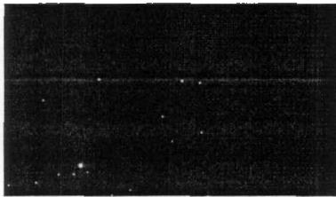  
图1-1

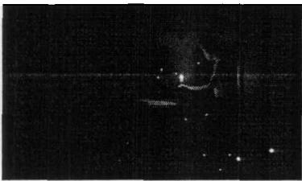  
图1-2

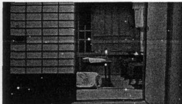  
图1-3

以上是《童年往事》中的三幅画面，讲述的是父亲在一个停电的夜晚突然去世。这是阿哈的生命中也是这个家庭第一次遭遇死亡和离别。图1-1是一个完全的黑屏，全家人陷入一片黑暗，这个黑屏持续近一分钟，只有声响一一摸索的划火柴的声音。图1-2姐姐摸索着找到火柴点亮一支蜡烛。这个时间不是戏剧时间，它基本上是我们在日常生活中遭遇停电并点燃蜡烛的时间过程。图1-3是电突然来了之后，镜头从外往内看，照见方桌上的一支蜡烛在燃烧，几秒钟的停顿之后是姐姐的惊呼声。

停电以及真实时间的运用让观众和影像中的人物共同经历了促不及防的悲剧，而事先没有任何铺垫和预感，完全是一个真实的生活场景。另一方面，真实时间的运用造成了镜头的绵延，也符合以回忆作为整个基调的片子，体现了作者对过往时间记忆上的主观色彩。图1-3是停电之后突然明亮，整个画面的色彩跳动了一下，有一种不可预知结果的惨白和凄凉，紧接其后的就是姐姐的呼声。这个镜头在构图上还有一层潜在的含义—一整个画面最主要的位置上因人物的缺失而显出荒凉感。这和剧情父亲的离去对于整个家庭的悲剧感和灾难性相连。从此，父亲去世前那种家庭的祥和平稳与温馨很少再现。而阿哈再次出现的时候已经是一个青春茂盛的少年。

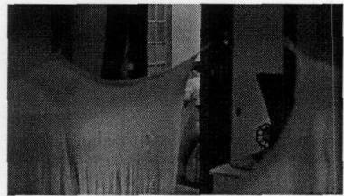  
图1-4

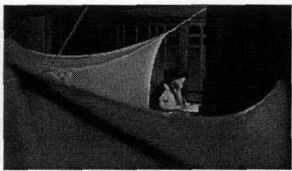  
图1-5

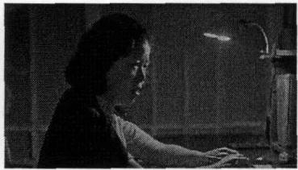  
图1-6

图 1-4 是少年阿哈的第一次梦遗，他在卫生间洗内衣。下一个镜头（即图1-5）是母亲在灯下给姐姐写信诉说病情。图1-6是母亲告诉阿哈她可能是喉癌。

这三个连续的镜头是把生和死连在一起。面对阿哈的健康与青春，导演让我们看见了衰老和疾病，它们彼此紧密相连，生命的旺盛就在死亡的身边。而这几个镜头同时也意味着时间的流逝与阿哈的成长。一个非常日常化的细节，把漫长的生命成长与时间不可抵御的力量嫁接在一起。

对事件的选择和时间裁剪上，越是普通和日常，越具有真实性。这种压缩时间的电影处理方式，虽然有人为的痕迹，但在情节和时间的统一性上是有效的。它穿插着提醒我们去自动意识到真实生活，尤其是那些和我们自身有直接关系的事件，它澄清了我们的记忆，使我们的记忆进行这种选择的动机是不由自主产生的。

整个《童年往事》在结构上是通过死亡来完成对时间变迁和成长的书写。三次亲人的死亡，阿哈终于由童年到少年再到青年。20 年的光阴里，一次失去就是一次成长。时间总是和变化相连，而不仅是一种状态。那些变化就是人生中最常见的生老病死。阿哈听不见自己生命拔节的声音，而亲人的失去却像一个时间的回响停留在记忆里，仿佛时间在一个个生命的嘎然而止中显示出跳动和延续。

侯孝贤在《童年往事》中所运用的电影语言也强化了观者的时间感。他在影片中使用了许多固定的长镜头- -个场景凝立不动，也不做剪接，人物在这个仿佛凝固的场景画面中进出和活动，这样造成了镜头本身并不主动引导观众去看拍摄者所展现的东西，而留给观众自由选择和思考的余地。

大量中景和远景镜头将观众的注意力从银幕的框架拉开，不断的暗示镜头之外存在的时间，要观众去想象建构这个时间，以及这个不可见的时间和银幕上所直接呈现的时间之间的关系。

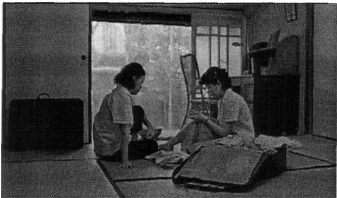  
图1-7

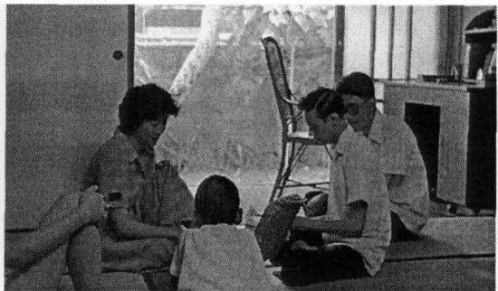  
图1-8

上图1-7是姐姐出嫁前，在一个雨天和母亲长达六分钟的闲聊。母女俩翻拣着母亲当年的嫁妆，母亲告诫女儿婚后一定要当心丈夫的身体，娓娓讲述着和父亲二十年的婚姻生活："身体要紧，其他都是假的。和你父亲结婚时不知他有病。结婚二十年，服侍他二十年..."母亲平静地叙说，窗外的雨声越来越大，夹杂着阿哈没有韵律的寂寞歌声。完全是一个日常嫁女的情景，可是带出来的却是过去的记忆一—是母亲过去的充满爱与无奈的艰辛生活—是另一个时间里的悲怆。这个长镜头造成了时间上的绵延感和一种日常化的平静与散淡。但又不是“空无”，它传达出大量潜在的信息—一记忆、怀念、期待与压抑。

影片的结尾，母亲去世后，姐姐整理父母留下的遗物，无意中发现父亲的自传，她把父亲的自传读给弟弟们听（图1-8)，读着读着突然泣不成声。父亲的自传提供了对父亲记忆的重构，之前影片中父亲的形象和行为都获得了解释。这种追忆里面既有个人的关于“父”的记忆与回溯，也包含着一种更为深广的时代记忆（如父亲总是买便宜的藤制家具，以便回大陆时可以丢掉)。民国四十七年台海空战、陈诚之逝、随时准备回返大陆的祖母等，都在这一意义上建构了一种大的时代记忆、民族记忆一—尽管影片在这种大的时代记忆上采取了几乎可被忽略的日常书写。

电影是时空交织的艺术。确切地说，“它首先是一种时间艺术。”①“因为空间是一个严密、客观、独立于我们的范畴，我们进入影片再现的空间，犹如处在真实的空间中一样。如果时间也变成一个固定严密的范畴，那么，它必然涉及社会的的参照系统：钟点、日、月、年，这样一来，只有延续性时间才具有美学价值。”①因为我们生活在时间中—“时间是本能的对象，空间是感觉的对象。”②延续性时间让我们强烈地意识到生命的存在和流动，它是伸缩性的，也是主观的。时间绵延

长镜头是导演的主观时间感。从电影的本性来说，“它对时间的绝对控制是一种完全特殊的现象。电影不仅使时间具有一种价值，而且还打乱了时间，它使时间原来无可抗拒、无可挽回的进程变成一种完全自由、摆脱外界各种束缚的现实，这就是延续时间。”③

关于“时间延续”类的电影，最经典的可追溯到1951年意大利导演德．西卡的《温别尔托．D》④，它使我们看到真正的现实主义电影在时间方面的特点。关于“连续时间”的这类实验，在电影创作中并不鲜见。1948年阿尔弗莱德．希区柯克拍摄的《夺魂索》就是连续90分钟不切换镜头的一部影片。不过，那还是一种戏剧式的“动作”。也许问题实质不在于胶片上影像的连续性，而在于事件的时间结构。

《夺魂索》可以连续拍摄下来，不变镜头，不用切换，但它仍然是一场戏剧性的演出，因为在剧本中，已经根据虚设的时间对事件做了安排，即戏剧时间一一正如音乐时间或舞蹈时间一样。同样的手法在科波拉《教父》的开场中也是如此，一场持续18分钟的婚礼，观众并没感受到时间的极限，相反，紧张的情绪始终存在，因为所有重要人物以及事件背景都在这18分钟里呈现。这种形式上的时间延续正是戏剧时间的一种表现。

《温别尔托．D》的创新就在于如何把生活时间，把一个人自然平常的活动表现得有声有色，富于戏剧性（如影片中小女仆清晨醒来做家务的段落)。它不是以人为的外在的戏剧性设置来处理时间节点，而是通过戏剧性的消解和日常事件的连续性建构来暗示时间的存在，它和我们日常所感知到的时间是极为相似的。

侯孝贤在电影手法的运用上和上个世纪五、六十年代法国电影新浪潮以及意大利的新现实主义有承接的地方，但在真实性的处理和时间结构上，比他们做得更为自然。今天回看意大利现实主义电影的代表作如《偷自行车的人》、《罗马不设防的城市》、《游击队》或《卡比利亚之夜》，会发现“写实”在这些电影里还是有刻意的痕迹，而完美如《偷自行车的人》，它还是有一些向传统戏剧化电影让步的地方（如教堂和贫民窟的那两段)。这里之所以把《温别尔托．D》提出来，是因为他虽然不够光滑完美，但在同类影片中，它的追求更高，也更纯粹。

《温别尔托．D》所表现出来的情感的客观性和侯孝贤电影中的视野极为相近。这些电影的缺点和优点都和道德或政治无关。而唯一能在形而上的层面上讨论的是关于人的个体处境和存在感（《温别尔托．D》甚至表现了一只小狗的存在意义）。

《悲情城市》是一部可以从政治或历史的角度解读的影片，但在影像中，频繁出现的镜头大多数是林家人团团围坐的吃饭、生孩子、买菜、闲聊。而大的政治事件如“台湾易守”和“二二八事件”只是一两个镜头带过。这些镜头也没有直面事件现场，仍然是通过林家人的遭遇来呈现。

至于影片中每个人物的故事也不是用封闭的单线条的戏剧化的方式来讲述，在结构的层面上，看上去散漫，实质上需要观众自己去建构和想象。

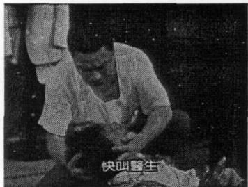  
图1-9

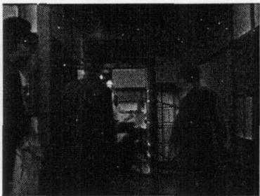  
图1-10

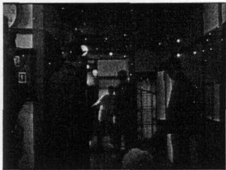  
图1-11

上图是大哥林文雄被枪杀的那一段落，图1-9中，大哥妾弟阿嘉与上海帮发生冲突被砍伤，逃到大哥赌博的地方，大哥问他怎么回事。图1-10，镜头切向走廊，上海帮成员扶着伤员准备进入镜头左边的房间，一场打斗似乎已经过去。大哥突然挥刀冲了过来，砍倒门边阻拦的人。上海帮背对镜头转过身去，上海爷叔拔枪射死大哥。图1-11，大哥想挣扎着站起来，终于倒下。

这个段落至此结束，至于大哥是如何找到上海帮驻地，为何要和他一向痛恨的上海帮赌博，上海爷叔又为何要制大哥于死地，他枪杀大哥前的心理和反应都没有交代和渲染。侯孝贤只用了一个镜头拍完了大哥生命的最后一段时间。

死亡来得如此突然又仓促。没有任何铺垫的斗欧和枪杀让人生变得凶险，死亡变得轻薄，它甚至消解了影片作为艺术的悲剧感，而只有苍凉。这一点和戏剧性的电影及绝大多数好莱钨电影的处理都不同。

观众在看到这一段时，内心是有很深的恐惧感的，这种恐惧感来自于个体面对生命的无常和未知时的惊悚。真实人生里的死亡和灾难往往都是猝不及防的，也没有那么多的戏剧性，生命仿佛变成了时间暴政中若有若无、若隐若现的符号，似乎只能证明时间的存在，而不说明任何其他的意义。

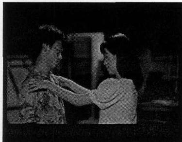  
图1-12

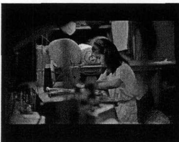  
图1-13

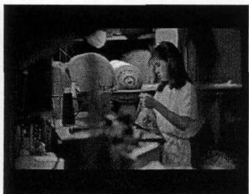  
图1-14

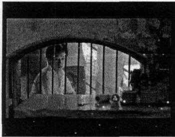  
图1-15

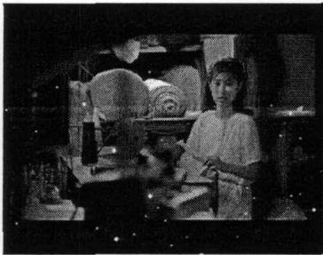  
图1-16

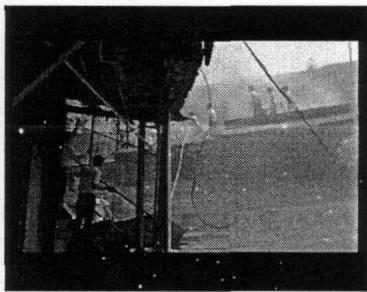  
图1-17

《恋恋风尘》里的阿远要去当兵，阿云为他做了一件衣服，因为太大，她熬了一夜才改好。上图1-12至1-17 是这一段情节的镜头。

图1-15中的阿远隔着裁缝店的窗户看屋子里的阿云，预言又止，最后只说外面失火了。图1-16，阿云说，衣服马上就改好了。而图1-17是一个在二人世界之外突然插进来的外界镜头。嘈杂的市声、救火人的吆喝声、灰蒙蒙的清晨一个粗暴的人间景象。二人世界的那种沉潜、宁静和安稳被打破，这个镜头看似和前面几个镜头在情感基调上似乎不一致，但和影片《恋恋风尘》的主题却非常契合。因为阿云和阿远的爱情一直和人世的风尘相连。

侯孝贤曾多次谈起对这个段落的构思，本来设定好的情节是阿远临走前送给阿云一千多个信封，后来觉得这样的设定太戏剧化太过了，就用了后来的这几个镜头。观众看到的是一段很自然很平常的活动过程，戏剧性被消解了，似乎生活就是时间在静静地流淌。

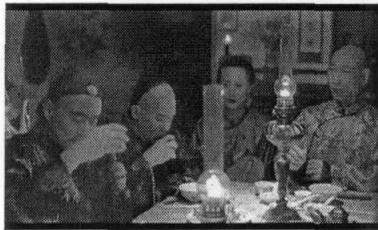  
图1-18

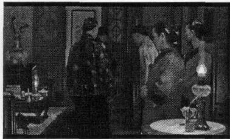  
图1-19

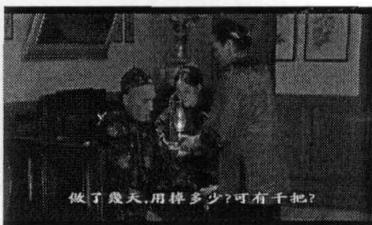  
图1-20

《海上花》是侯孝贤电影里长镜头被运用到极致的片子，1小时 49 分钟的片长只有40个镜头。开场部分的吃酒划拳（入图1-8）就用了8分钟的时间。这一段落里，没有直接的戏剧冲突，只在众人的闲聊中交代故事发展的背景和脉络。观众也可从这些日常的交谈和个人的神情中看出每个人的性格。比如梁朝伟扮演的王老爷一直郁郁寡欢。（后来他将在多次的酒局中露面，一直很不开心，只有唯一的一次沈小红在他身边时，他才有笑容。)

图1-19 和图1-20 是第一个出场的沈小红的段落。整个段落就是一个镜头，长7分钟。不同于以往的是，这个长镜头用了推轨，镜头跟随人而移动，人变成了一个动机，这种镜头避免了直接的切换带来的观影情绪消失，也避免了跟拍的僵硬和对真实的破坏。时间感在这里是无意识的，它变成了人的动作行为的延续。

安德烈．巴赞在评价《温别尔托．D》说，这样的电影主题是存在于分镜之前，而非分镜之后。①巴赞的意思是我们在分镜之后能看见的只是事实。如果向别人讲述《悲情城市》、《恋恋风尘》或《海上花》的故事，能叙述出来的只是那些含义非常模糊没有明确意义指向的动作。而听者也无法从别人的讲述里想象影片中情节的紧张与梦魔式的观赏情绪。这些影片的叙事单元不再是插曲、事件、转折和人物性格，它是生活中各个具体时刻的串联一“本体论的平等从根本上打破了戏剧性的范畴。”②

故事的真正时间不再是戏剧时间，而是人物活动的具体延续时间。影片所表现的内容与演员的行为动作完全合一，或者自始至终就是演员的行为动作。如《海上花》“荟芳里，沈小红”那一段，我们在这一单元中对时间的久暂已经有了极限体验。时间作为一种难以割舍的整体涌现在我们面前，不再是一系列“瞬间”的组成，而是一种延续时间。这也正是电影能引人入胜和美不胜收的奥妙之一，当电影中的人和事与我们潜在的意识和自发的生活无限接近时，我们才感觉到延续时间。

在侯孝贤的电影中，延续时间具有绝对的自由和流动性，它的进程可以被加速、放慢、颠倒或停止，甚至不被人们觉察。导演力图使电影无限接近真实生活，在艺术上，它构成了观赏的距离和阻隔—一这种距离和阻隔正是因为我们长时期对真实物质世界的隔膜所造成的，我们习惯于在一种戏剧化的影像世界中感受生活。那种浓缩的戏剧性时间，使我们激动或狂喜，却也远离了真实。

法国电影理论家马塞尔．马尔丹从对待世界的态度上，划分出两种类型的导演，一种是从思维和概念出发一—像爱森斯坦、德莱叶、希区匹克、伯格曼、雷乃、特吕弗等。一种是从感觉和直觉出发——如杜甫仁科、雷诺阿、布努艾尔、沟口健二、费里尼、安东尼奥尼等。①

前一类导演倾向于根据个人观点来重现世界，把重点放在戏剧章法上。这是诱惑观众的主要手段，也是以概念化的形象世界来抓住观众，使之无法逃脱的工具。侯孝贤显然属于后一类导演，在现实世界面前掩藏自己，章法在他的作品中，只占次要地位，观众自由要大得多。影片吸引观众并不俘虏观众，他们所表现的景象更多是以张力而不是以奇特性作为特征。时间的绵延构成了电影和真实人生之间的奇妙张力一一延续性时间变得活跃和渗透，让人们能够具体地感受到，电影才能和我们的内心和真实生活结合在一起。

# 2、空间

电影的空间是双重的：一方面，电影构成的基本元素是有一定范围限度的平面，另一方面，是再现空间并通过摄影机的连续运动，给我们的感觉提供足够的材料，以使得我们能够建立起一个无限深远空间的视像（这里谈论的空间主要是后一种空间）。

空间是无法越过时间的，任何一种空间都必须在时间中存在，空间的变换必须通过时间的延续而体现出来，时空相互依存。爱浦斯坦认为，不是空间统摄时间，而是时间统摄空间。爱浦斯坦强调了人首先生活在时间中，其次才是空间。这两者是人在现实生活中不可缺少的要素。

影像世界里，时间、空间和因果关系都是以既模仿现实，又有别于现实的方式运行的。因此，对电影时间和空间的建构包含着导演对世界的理解和观看视角。

侯孝贤电影里对于空间的建构和时间的建构相互契合：力图再现真实生活。他将日常生活的无限循环放置在一个有限的空间里，这个空间和日常生活一样提供了无限的伸展性和开放性，人物就在这空间里自然地活动。

在景深概念还没有被真正确立并频繁使用的时代，银幕世界就已经是一个三维空间。电影是综合艺术，造型能力是其表现力的集中体现，二维空间和三维空间提供了足够想象驰骋的舞台。侯麦曾经说过：“任何在一个平面的、有限空间内进行形象塑造的艺术都是绘画艺术。”

我并不十分同意侯麦把电影归入绘画一种，因为电影是摄影艺术，它不是静止的、画幅式的，我们观看的影片空间，只是影片中的空间，是剧情展开的空间。导演是掌控摄影机运动的，只能说他的画面具有绘画上的构图特性。电影对空间感觉的要求较之绘画要更为开阔和立体。以下，我将借用侯麦关于电影里三种空间的说法来分析侯孝贤电影在空间建构上的特色。

# 绘画空间

西方绘画讲究焦点透视，其画内空间是向心的；中国传统绘画奉行散点透视原则，其画内空间是离心的。另外，中国传统画致力于突破画框的局限，使画内空间向画外延伸，以有限的画内空间创造出无限的画外空间。侯孝贤的电影画面集西方绘画和中国传统绘画特色于一体，既注重向心建构，又注重拓展画面外的空间。他非常喜欢使用固定机位的景深镜头，形成很有纵深感的画面，画面中心和边缘形成了张弛有度的结构。空间的延伸在侯孝贤的电影里既是形式上的也是情绪上的。

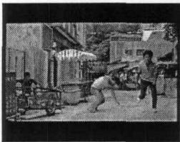  
图1-21

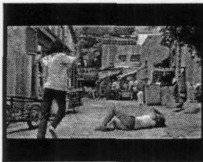  
图1-22

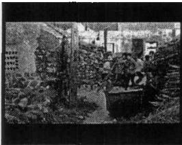  
图1-23

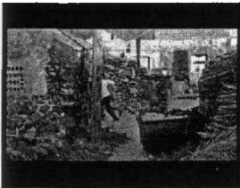  
图1-24

上图是《风柜来的人》里两个段落。图1-21和1-22是阿清和朋友们在街头与别人斗殴。图1-21是阿清向画面的右边跑去，跑出了镜头，消失在画框外，而图1-22中，阿清是从左边跑入画面的，很显然，他在摄影机前转了一个U型的圈。在这个意义上，景框在构图上的重要性显然退居其次。图1-23 和1-24是侯孝贤的电影在处理暴力动作中常用的手法，观众很少能够看到鲜血淋漓的惊悚场面和人物的恐惧表情。最激烈的打斗动作都发生在摄影机镜头目力不能及的地方。隐在画面深处或没有呈现的部分由观众自己想象。

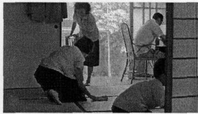  
图1-25

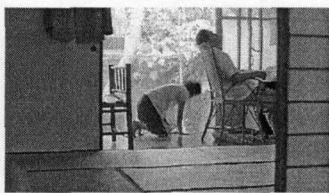  
图1-26

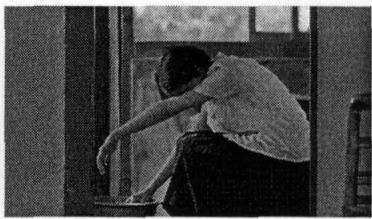  
图1-27

图1-25至图1-27是《童年往事》里的一个段落。阿哈考上省立凤中，全家人都很开心，姐姐由此回忆起自己的一段伤心往事。图1-25 是姐姐一边擦席子一边娓娓道来，其他人都在做着各自的事情。图1-26 中，姐姐抑制不住悲伤突然跑出了镜头，图1-27是姐姐再次出现在镜头里，这时她在抹眼泪。这个段落是由两个静止的长镜头完成的，只有一次切换。

图1-25是一个日常场景的构图，摄影机由内向外（这也是侯孝贤最喜欢用的拍摄方式）拍摄，以门构成内框。这是一个稳定和谐的构图，弟弟在离摄影机最近的左边，姐姐居中，父母在靠近门的地方一个水平的位置上，一左一右。至图 1-26，姐姐和弟弟都不见了，画面中最主要的地方突然空出了很大一块，图1-25 中的和谐被破坏了，造成一种视觉上的疏离和空洞感。同时，画面前方的父母动作上有了变化，是父亲仰头叹息和母亲半跪的形象。图1-27整个画面只有姐姐一个人，并且占据景框最中间的位置。图1-25、1-26都是散点画面，图1-27 是向心画面，这组画面呈现了中国传统家庭伦理的氛围，同时也弥漫着世事变迁所带给这个家庭的创伤感。

《童年往事》是侯孝贤自己童年生活的记忆，因此在拍摄时投入了大量真实的情感，在这一段落里，他在构图上表达了对姐姐命运的喟叹以及全家平静的日常生活表面所隐藏的深深的苍凉和无奈。

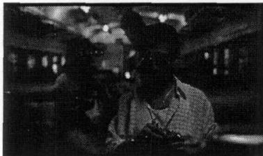  
图1-28

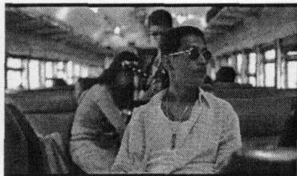  
图1-29

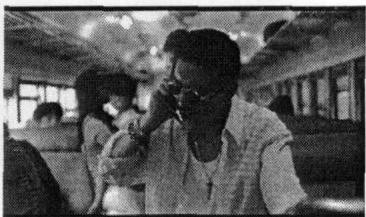  
图1-30

侯孝贤所有的电影中，运用最广泛的是宽景深即深焦镜头—一前景到背景都很清晰。宽景深的运用可使许多平面和物体都在焦点中，重要的讯息可以包含在前景、中景和背景中。这一点类似绘画中的透视，因为没有透视感，就没有距离和远近。

图1-28和图1-30就是用广角镜头拍摄的宽景深画面。镜头前面处于中心位置的是小高，他脸上的表情清晰可见。透过小高可以清楚地看见背景中的阿扁和小麻花，他们在小高身后轻桃地调情，动作和话语夹杂在小高的通话中。这是《南国再见，南国》中的开场镜头，长长的铁轨，晃动的火车车厢，火车穿过山洞，光线从暗淡到明亮。小高的表情一直是落寞的，作为一个传统的黑帮大哥，小高背负着太多的责任和道义，对比背景中阿扁和小麻花的快乐和轻浮，小高的时代就像片头的小火车一样，成为古典和浪漫的象征。这一个镜头已经把影片中所有重要的讯息和情绪表达出来了，当后来影片中的交通工具变成摩托和汽车的时候，小高也在现代的世界里进退失据，终于酿成悲剧。如果采用浅景深和变焦镜头是无法到达这样的效果的。

侯孝贤电影空间的“真实性”，使观众能很容易地进入戏剧空间并参与剧情。他有意识地运用景深并且放弃容易造成空间时间化和观念化的蒙太奇美学。摄影机起到的是类似人的“眼睛”作用，“人眼”不是万能的“上帝之眼”，所以摄影机也有看见和看不见的地方（如图1-21至图1-24)。人物可以自由地出入被摄景框一一延伸了观者的空间想象和对自己视觉限度的认可，在这个意义上，摄影机是有限的，而世界是无限的。内框的被使用，提醒我们在一个人为的、电影的视觉架构中看与被看的问题。

三远一一高远、深远、平远是中国绘画中非常重要的空间布局手法，侯孝贤电影中的“取象于远”及“平远”的空间布局，会通了中国传统绘画的“远”

的空间观念和表现手法。

侯孝贤电影里很少有那种让观者感到很“紧”的近景和大特写。他的镜头总是推得很远，同时让自然或风物入景，使剧中人和观者的目光伸展到远处。

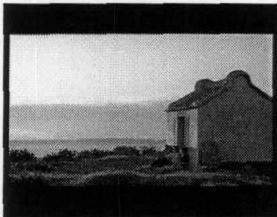  
图1-31

  
图1-32

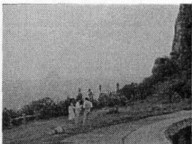  
图1-33

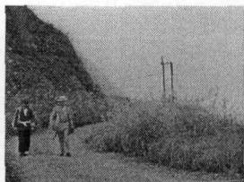  
图1-34

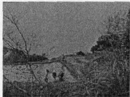  
图1-35

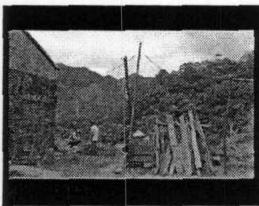  
图1-36

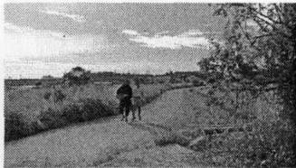  
图1-37

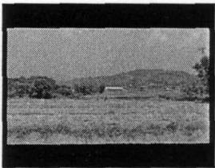  
图1-38

上面几幅画面是侯孝贤早期电影里最经典几个远景镜头。图1-31是阿清家旁边的一处旧屋，紧靠河边，阿清和他的朋友打架之后在河边聊天，旁边的河里有船，不时有行船发出声音。河流和船是漂泊和远行的象征，正和阿清们压抑而空虚的生活形成对比。这幅画面的色彩和构图上也有极强的对比，明和暗、动和静。平远的视角节制了观者的情感，更集中于对画面外世界的想象。

图1-32至图1-35都是《悲情城市》里的镜头。灰蒙蒙的海边是《悲情城市》里出现最多的自然背景，灰和蓝也是影片最主要的色调。侯孝贤在这里把人物推至深远，几乎和自然融为一体。灰蓝的雾和海，使人物在视觉上十分渺小和无助，是一种无路可去的迷茫和绝望。同样是深远的画面，《恋恋风尘》里的构图和色调要明亮和恬静很多，如图1-36中，阿远和爷爷在深山里对谈，话题非常日常，爷爷絮叨着，阿远倾听着，人物和周围的自然已经融为一体。图1-37是《童年往事》里阿哈和祖母一起回大陆的画面，仍然是定镜远景拍摄，人物由远及近，显得很小，路很长，整个画面非常开阔和开放。

图1-38是《冬冬的假期》里关于寒子故事的那一段落。寒子父亲从外面回来，撞见了捉麻雀的人在调戏寒子。镜头突然切入一个大远景，父亲和男人在距离摄影机很远的画面深处打斗，几乎看不清楚。

大远景的突然切入，消解了这一情节凝聚起来的戏剧冲突，摄影机到主体的距离也影响了观者的注意力一一观众的紧张感消失。同时，空间的辽阔和距离的拉远赋予画面强烈的悲悯色彩和冷静的旁观态度。

侯孝贤的电影中，空间永远不是单纯的框框，许多重要的场面都是在无穷无际的地平线前展开的，人是空间中的一个俘虏，他们孤独地、默默无言地存在。

安德烈．巴赞说：“电影本质上是大自然的杰作，没有开放的空间结构也就不可能有电影。因为电影不是嵌入世界中，而是替代这个世界。”①侯孝贤的电影似乎在践行着巴赞的理论，他的“再植存在”就是努力在电影里植入真实生活的时间和空间，使一切看起来“逼真自然”，不违背生活逻辑。

# 生活空间

这里的生活空间不是建筑学意义上的，这个空间用侯麦的说法更接近于一般所说的“入镜景物”一它具有一定的建筑感并属于审美范畴。但是它不同于布景——虽然很多人习惯于把它当成布景。

侯孝贤对这一类空间的处理，摆脱了装饰性。使它具有一定的功能，被用来展示某种抽象关系，基于这个原则，我们可以分析并非严格意义上的建筑空间里的物体。《风柜来的人》、《冬冬的假期》和《悲情城市》所摄入的建筑空间和中国古典园林有美学上的相近之处（运用门窗回廊来造成视觉上的层次感和丰富性)，但侯孝贤的目的显然不仅是视觉上的美感，而是让空间和人物的活动以及状态有某种深刻的联系。空间在这里不是作为演出的舞台（这一点和舞台剧显然区别明显)，而是构成一种三维上的真实存在。人无法从这样的空间里独立出来，如果电影里的人物换一个生活空间，整个影片的基调和氛围都将大为改变。

下图是《风柜来的人》里阿清他们租住的房子，这也是影片里最主要的场景。

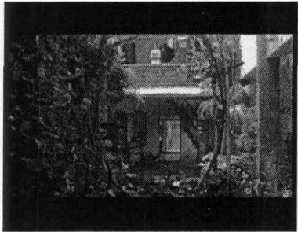  
图1-39

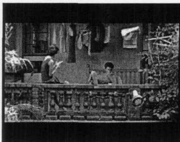  
图1-40

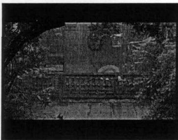  
图1-41

这是一栋类似四合院的民居，每一面都是两层楼，二楼有走廊相通。每个房间有门和窗，走廊外侧有推拉窗。小杏和黄锦和住的房间和阿清的房间成直角，即楼梯上二楼之后要先经过小杏的房间到达阿清们的屋子。这种空间上的布局使他们生活的隐私性被消解了，阿清可以从不同的视角窥见小杏和黄锦和之间的生活状态。如图1-39 就是从阿清的视角看过去，小杏落寞地站在走廊上的情景，而图1-40 却使阿清更深地了解了小杏和锦和之间的感情裂痕。

这样的空间布局具有一定的封闭性，四合院的世界本身就和外界没有太多牵扯。这一群从风柜来的人，他们在大都市高雄的生活是从压抑和受挫开始的，他们是被边缘的一群。四合院之外的世界是嘈杂喧闹，是法律和规则，而他们几个人活在自己的世界里，粗糙而又茫然。

同样是从乡村到都市，《恋恋风尘》里阿远他们居住的空间和阿清们又不同。

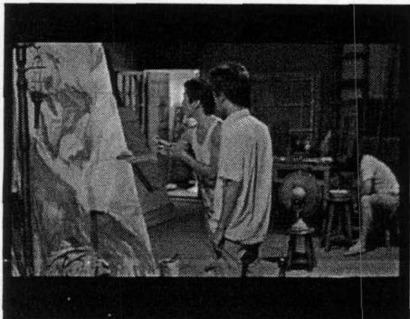  
图1-42

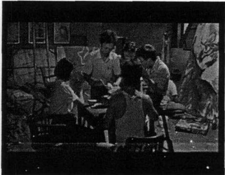  
图1-43

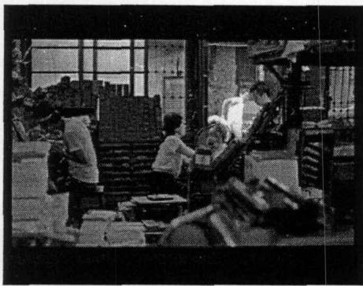  
图1-44

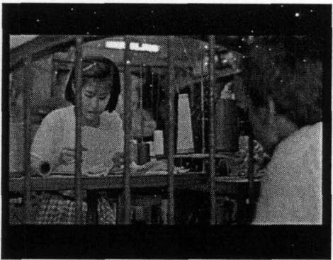  
图1-45

《恋恋风尘》里的空间比《风柜来的人》更为开放也更为日常，这些从矿区来的男孩女孩，他们的生活和工作无法截然分开，他们和外界即都市台北的联系就是工作和老板。如图1-42和图1-43，阿远的朋友为戏院画海报，他们工作的戏院后台也是他们吃饭和睡觉的地方，图1-44是阿远工作的印刷作坊，楼下是车间，楼上是他睡觉的地方。图1-45是阿云的裁缝铺，也是她日常生活的基本空间。

这种生活和工作紧密相连的空间强调了一种无根的漂泊感—一他们在都市一旦失去工作也就失去生活的空间。这和影片中那首《港都夜雨》一—“青春男儿，去向哪里，漂泊万里”的意境和情绪相连。

空间相对于时间更能传达出日常性（只要不把电影刻意风格化)，也更能让观众“入戏”。因为时间感比较抽象，而空间是具体实存。侯孝贤电影里的空间都具有独立性一—即可以单独存在一—像我们平时所生活的空间一样，没有电影化或奇观化。他在空间摄影上的运镜变化，有时是为了强调某种潜在的影片主题。

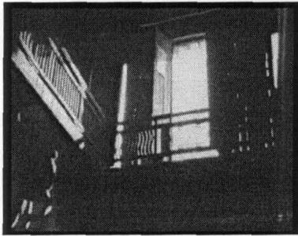  
图1-46

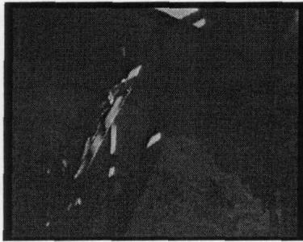  
图1-47

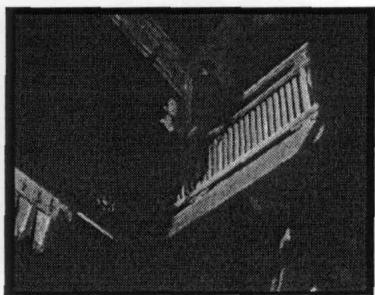  
图1-48

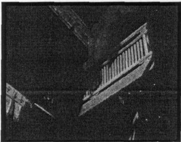  
图1-49

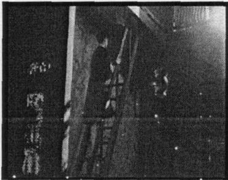  
图1-50

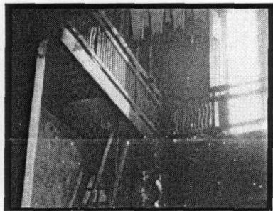  
图1-51

图1-46至图1-51是《好男好女》里蒋碧玉的生活空间，木质的两层小楼，摇摇欲坠的陡峭楼梯。这个段落，由一个镜头组成。情节是蒋碧玉的弟弟得知姐夫钟皓东被枪决的消息，跑回家告诉姐姐，蒋碧玉下楼然后再上楼。这一组六个画面全部采取低角度拍摄。木楼和摄影机形成70度仰角，增强了我们视觉上的高度，从而形成一种空间上的压迫感，也符合我们从低处看高处物体移动的习惯。电影把一种政治上的压迫感空间化了，以暗示国民党白色恐怖对普通人带来的压抑和戕害。

1998 年，侯孝贤拍摄了反映清末民初妓院生活的《海上花》，因为难以复原一百多年前的生活空间，在选景方面遇到难题。最后，全部采用搭建的内景拍摄。内景拍摄造成了时空上的封闭性，但这种封闭性正好和妓院一—这一本来就在常规生活之外的场所—一形成了情绪上的呼应。

实际上，《海上花》在情节上完全没有东方式奇观，除了道具稍显奢华-这一点也恰是“长三书寓”这一高级妓院应有的特色。妓女们在这一看似华丽的空间内，其生活却非常日常，甚至连奇遇都少见。吃饭、陪酒、聊天、烧烟，客人也是那几个老相识，生活实际而又琐碎。那种因爱情而激起的浪漫主义的幻想和跨越这一身份的努力，最终都失败了。在这个意义上，“长三书寓”的封闭性更是精神和社会性的。

另外，在具体空间的建构上，侯孝贤针对不同人物的性格，做了参差对照，在视觉上，形成了一种“大空间”下的“小空间”。

  
图1-52

  
图1-53

  
图1-54

  
图1-55

图1-52至1-55分别是沈小红、周双珠、黄翠凤和张惠贞的寓所，也是他们接客做生意的地方。沈小红是上海滩的资深头牌，美而带一点傲气，在她和王莲生的关系中，她擅用情绪技巧套牢王莲生，自己却又不愿全部付出。再加上莲生对她的痴迷和专情，令她多多少少有点看不起他（她从不为他点烧烟可以看出）。后来她姘上戏子，心思更不在莲生这里。她的空间设计上（图1-52)，是浓烈而厚重的红色和红木，服饰和摆设上的品位还在，只是带着潦草和漫不经心。沈小红的生活空间和她本人的状态是吻合的，美丽、颓废和委顿，还有一种危险的纠缠弥漫在空间里。

周双珠（图1-53）是整个《海上花》的灵魂，她大气、超脱却善良，圆滑世故却又顾全大局。她的生活空间和她的服饰都以蓝、绿作为主色调，用具是青花瓷，陈设简单质朴，房间的光线明亮而低调。与她形成鲜明对照的是黄翠凤（图1-54）——她是影片中唯一具有西洋风格的妓女，时髦而洋派——从她的披风到以琉璃装饰的灯具和窗户可以看出。这样的空间营造和黄翠凤泼辣精明的性格及巧于周旋的手段和能力是契合的。

与三位“红倌人”不同的是，张蕙贞是从“野鸡”刚升为“长三”（即从下等妓寮升级为高级妓女)，她的房间布置是以浅粉、桃红或明黄为主色调，显出肤浅而轻桃的品位。而她的服饰气质谈吐也和她的空间装饰一样，带着下等妓女的不自信和拘谨，在品位和历练上与头牌们还有很大差距。

侯孝贤是善于转化“限制”①的导演，《海上花》就是成功地把空间—一这一技术上的限制，转化为电影美学发挥的空间并成为有力的象征手段。

# 运动空间

这个空间不是指传统意义上的场面调度—一即人与物的空间关系。也不是指摄影机的运动或空镜（摄影机的复杂运动从来不是侯孝贤极力追求的，空镜的意义主要是美学上的)，而是指那种因为人在运动中，空间和人所呈现出的一种独特的美感和力量。这种空间的形成是一种很主观的视角，也正因为主观，而具有一种真实而纯粹的视觉冲击力。这一点是侯孝贤对日常视觉的一个发现和创新，几乎没有看到其他的导演在电影中大段呈现这种视觉空间。

运动，是人的一个基本常态，走路、跑步或在火车、轮船上，移动的风景是我们最普遍的视觉范围。侯孝贤把这种视觉特征表现到极致，他曾多次声称，有些镜头只是当时觉得很棒，很有力量，就拍下来，本身并没有复杂的隐喻。①马塞尔．马尔丹对安东尼奥尼电影空间的评价似乎更适用于侯孝贤的这类空间“这些空间并不是一种心理状态的替身或信号，也不是一种象征，它其实是一种体积（Volume，剧戏容积)，那种别具一格的丰富和优美感是一种补充性的幅度，具有独立的价值。人的内心在其中有了充分的暴露，并和整个世界建立了共鸣。”②但是，侯孝贤比他们走得更远，也更为自觉，他把一种东方的时空观和美学价值几乎是不落痕迹地渗透进画面。

  
图1-56

  
图1-58

  
图1-57

  
图1-59/图1-60

上图是《恋恋风尘》开头的段落，小火车穿过侯峒的山洞。开头只是画面上的一个圆形的小白点（图1-56)，伴随火车的轰鸣声，白点越来越大，像一个圆形的拱门。葱郁的树木布满山坡，白色的雾气缭绕着，晃动的车厢里，阿云和阿远干净的、青春的脸。侯峒的山、树和雾气是自成一个世界的，人、天、地、物和谐而统一。

从阿云和阿远的视角看出去，层层叠叠的山和树构成一种视觉上的阻隔，也是他们未来的一个隐喻。他们的爱情和矿区的风物一样，美丽、自然，但干净而脆弱。当火车把他们带离故乡之后，他们的爱情也变得莫测起来。

小火车是通往外界的一个工具，运行的火车赋予静止的空间一种流动，一种不可知的变化，一种熟悉的陌生感。另外，运动让时间和空间紧密联系起来，有一种时空上的绵延感——这是人最日常最自然的一种状态——时间和空间一起飞驰而过—一像阿云和阿远的青葱岁月。

同样的镜头后来在《南国再见，南国》的开头也出现过，但因为影片所要表达的主题和时代感不同，同样的镜头给人的视觉体验完全不同。当人物变成黑帮大哥小高和时尚而现代的阿扁、小麻花时，在小火车上看到的空间只是一种浪漫的怀旧。是在城市生活空间之外的，和现代人多少有点隔膜。

  
图1-61

  
图1-62

图1-61和图1-62是一个持续两分钟的长镜头，小高乘坐的小火车由慢到快，当火车开上穿街而过的单条铁轨时，街边的房子在火车的运动里抖动起来，配合着林强的《自我毁灭》，有一种强烈的后现代感。节奏激越而颓废的电子音乐赋予浪漫而优雅的火车时空一种错置和颠倒。

这部电影延续了侯孝贤一贯表现日常的手法，没有夸张和戏剧化。虽然电影讲的是台湾南部黑帮的故事，但却是最真实最朴素的人生。作为大哥的小高在现代社会里没有翻云覆雨的能力，虽然他保留着传统大哥的责任道义和男人的挣扎与努力，但却难逃苍凉的命运。他在现代社会里的失败，是侯孝贤所迷恋的那种雄性的力的美和黑道浪漫输给现代政治的阴冷和算计的- 一种表征。

所以，这部影片在画面、色调和场面调度上都有一种强烈的对比—一传统与现代。在空间的处理上，侯孝贤突出的是小高的视角，一种和传统不能兼容的奇特和诡异。

图1-63至图1-67是小高开车回家帮家人搬家，这是一组从车里看出去的镜头，是小高的主观视角，他戴着绿色墨镜。画面是他从车里所看到的不同角度的台北镜头，飞速移动的高楼大厦，拥挤的人流，立交桥对人的挤压，绿色增添了城市的诡异感一—都市面目，总会在某个瞬间让人感觉无所适从。而这时候的音乐是雷光夏的《小镇的海》一 -一首台湾民谣——小高内心的声音和眷恋，与他的真实生活有遥远的距离。

  
图1-68

  
图1-69

  
图1-70

侯孝贤对动态空间的迷恋，使他的电影充满流动的质感和生命张力。不同的交通工具，赋予看与被看一种双重的逆向的视觉体验。火车和汽车的私密性与保护性，形成视觉上的隔离感，小高从火车或汽车看出去的世界，是他难以主宰的，隔膜的，但车厢提供了一种保护，世界和他不是肌肤相亲。

摩托的空间是裸露的、开放的、召唤的，同时也是刺激的、凶险的、莫测的。摩托车让人体验那种极致的压力和速度—一在毫无保护的状态下，仿佛肉身在直接与身外的时空进行搏战一—是适合小高和阿扁的生活感觉的——没有预期的、能够触碰出火花的生活。

图1-68至图1-70是一段长达3分钟的摩托车运动镜头，他们行驶在嘉义空朦湿润的漫长山路上——空间原来的宁静和安详被划破。速度所带来的快感和刺激，使他们的生命具有一种能量—人在困境中的对抗力量一也是人的存在感。①虽然，他们也因这种对抗而毁灭了自己。

  
图1-70

  
图1-71

  
图1-72

  
图1-73

在《最好的时光里》，轮船（图1-70至图1-73）延伸了空间的纬度也赋予了时间一种浪漫质感。张震乘坐1960年代的小火轮穿行台湾南部，静美而辽阔的海面和浩大的少年情怀及不可知的甜蜜而茫然的未来，纠缠在一起。动感的阔大空间让人的气质和胸怀也变得浩荡而优雅，甜蜜而忧愁，一如1960年代的爱情。

运动中的物体，充满动感的生命，使空间在一种难以割裂、同现实生活相雷同的连续活动中，让延续时间深深地进入，相互渗透。“如果电影把自己在空间中的幅度注入时间的纬度之中，那么，它也表明：时间和空间的关系不是绝对的、固定的，相反，是自然地变化无穷的，这是经过实验的。”②

# 3、演员

# 非职业演员

作为表现物质世界的电影而言，它并非应该是专以人为表现对象的。它的主题物应该是可见现象的无尽洪流一一不断变化中的物质存在形式，其中可以包括属于人的表现，但不一定以之作为中心一一人也是物象之一。

因此，克拉考尔认为：演员的表演只有当它并不单纯以演出为目的，而是使我们感到如他的人物的自然物质生活中某一偶然的事件一—许多可能发生的偶然事件之一时一它才是忠实于电影手段的。也只有这样，他再现的生活才是真正电影化的。?也就是说，当我们感觉一个演员的表演太过时，不是说他表现得太舞台化，而是觉得他的表现太有目的性，缺少照相所特有的那种含义模糊或飘忽不定的色泽。

考虑到电影演员保持本色的重要意义和他作为原材料的职能，许多电影导演启用非职业演员来演绎自己的故事。以日常生活作为表现手段、不依靠台词和动作来建构戏剧性的侯孝贤电影，非职业演员是他电影的一个特色。

非职业性演员的表演带给电影一种纪录的倾向一—就侯孝贤的电影本身而言，他描绘的是人在一个时间或者历史里的状态，而不是结构封闭的戏剧性的个人故事。他的电影背后是涉及整个社会和历史的时间和事件，而不是集中在个人冲突上一他表达的不是人与人的故事，而是人与时间的故事一一其实，都难以用“故事”一词来浓缩他的电影，应该说是一种“状态”一流动的、飘忽的、持续的一—日常人生。

如此看来，舞台化的表演和技巧纯熟的职业演员显然不适合在侯孝贤的电影里演出一一舞台化的表演传达给我们的是人与人之间的纠葛，人是这个世界的绝对尺度，世界要靠人来开合。而职业演员却又在无数“非我”表演里丧失作为人的自然状态和日常本真。

西方导演对非职业演员的使用，多数是出于对社会生活而不是对个人命运的强烈兴趣—一在探索性的影片中，非职业演员成为现实的一个组成部分，但又不使自己的生活成为注意的中心。侯孝贤在这点上和西方导演不同，他对人的命运有着强烈关注和兴趣——不是为了建构对社会的批判一—非职业演员在他的电影中，不是以群体面目出现的一而是影片和观众关注的中心。甚至，他们和影片在艺术上建立起一种超乎影片之外的相互消解和同构关系。

李天禄是侯孝贤较早使用的非职业演员，侯孝贤曾多次谈到过他的表演“很过瘾，很棒”。①看过李天禄在《恋恋风尘》、《悲情城市》和《戏梦人生》里的表演，就知道这种“过瘾和棒”是指他生命的坚韧和悲情以及他表演上的从容和淡定——几乎没有表演的痕迹——这和侯孝贤在这些电影里所建构的那种情绪和人生的“自然”状态极为符合。

李天禄是布袋戏演员，擅长一个人面对观众讲述，并且绘声绘色。侯孝贤的电影通常都是没有规定台词去给演员背诵，只有场景，演员要在这个场景里按照剧情的发展，自己“即兴”说话。例如《悲情城市》里李天禄饰演的林阿禄在面对警察抓人和《恋恋风尘》里对阿远爸爸所说的那一段关于阿远身世的对话，就是一个老人在面对突然降临的灾难时所表现出的即愤怒无奈而又隐忍认命的抗挣。

还有《恋恋风尘》的结尾部分，阿远失去了爱情，带着一颗受伤的心回到山里，爷爷（李天禄）絮絮叨叨和他讲着自己所种的庄稼—平静、平淡，却充满了理解和看穿一切的睿智和平和一一是日常状态下一个老人的真实表现。

《戏梦人生》是以李天禄一生的命运作为表现内容的电影。但这部片子独特的地方在于穿插了李天禄生动的讲述，并且给予他影片中少有的近距离镜头-李天禄讲述的精彩远远超过搬演的部分。而饰演青年李天禄的林强，似乎状态还不够，表演上有很多粘滞的地方。

《戏梦人生》探究了如何用电影语言适切地表达一个老艺人早期生命中的点点滴滴——而这个生命故事的背后是台湾的过去- 一个远离现在的时间—它不再激越，不再纠缠，不再痛彻心扉一李天禄的讲述也是冷眼旁观的、平和的、从容的，甚至是冷淡的—符合远观历史的心态和结构上的疏离感。而他在影片中的坦率、实际和冷淡正好消解了戏剧化（艺术化）讲述所带来的虚假，也将台湾历史从国族史空洞的公式叙述中释放出来，使它有了人的“生活气味”。①

演员在侯孝贤的电影中通常具有决定性的地位。侯孝贤拍电影不是先有一个完整的故事，再让演员来演绎，而是跟着演员的状态拍下去的，甚至会因某个演员的独特气质而为他/她写戏和拍戏，对非职业演员也是如此。所以，我们看到流动的画面上，人物完全是本真状态，不需要太多的演出技巧，人物和环境能和谐浑融。

比如辛树芬（《悲情城市》里的宽美、《恋恋风尘》里的阿云、《童年往事》里的吴素云）、游安顺（《童年往事》里的少年侯孝贤）、林强（《戏梦人生》里的青年李天禄、《南国再见，南国》里的阿扁）、伊能静（《南国再见，南国》里的小麻花、《好男好女》的梁静和蒋碧玉）、一青窈（《咖啡时光》里的女儿）等，这些非职业演员的身上都有各自不同的能量。除了伊能静的表演有“过”的痕迹外，其他人都是日常状态下的本真表演。

  
图1-74

  
图1-75

  
图1-76

辛树芬，是最理想的侯孝贤电影的女主角一一温婉敦厚、纯净含蓄。她在《悲情城市》里和梁朝伟搭档，梁的表演非常精准，但辛树芬的表演是自然和家常的，这就使他们在某些段落中的节奏不是那么一致。比如《悲情城市》里梁朝伟接到宽荣被抓的一封信时，他把信交给宽美。宽美正在喂孩子。梁朝伟的情绪一直是很自觉的，很专业化的那种演出，而宽美的表现是稍显滞后的，在表演上有小段的情绪过渡——（如图1-75）她把信放下，表情有点木。梁朝伟用手捂住了脸，辛树芬的表情依然是不知所措的，直到孩子抓走了信，她才开始哭—一这段表演初看之下会让人产生疑惑，两个人的伤心不在同等程度上一一细想之下，也合情理—一辛树芬的反应是一个人在日常生活里，遭遇突然而至的厄运常有的木然冷漠和无所适从一相比梁朝伟戏剧情绪过于饱满的演绎，显得节奏上的不协调。

面对镜头时显得过于紧张的非职业演员，很难传达出近景和特写的意义。所以，侯孝贤的电影大量使用中景、远景和大全景，几乎没有特写。人物到摄影机的距离越远，越能忽略镜头的存在，也越能使演员的状态更松弛，他们在这个意义上面对自己表演一一无形中造就了侯孝贤的电影风格和美学特色。

# 职业演员

侯孝贤后期的电影比较多地使用职业演员，他调动演员的能力是使一个职业演员看起来像个真正的非职业演员，从而进入后天的天真状态。他有一个非常著名的说法是“让舒淇运动，让梁朝伟看书”。①

所以，我们看到《千嬉漫波》里的舒淇不再是她以往那种片段化、破碎化的爆发式演出。她有了一股持续的张力一—是潜在的、流动的——和电影的节奏以及戏中人融为一体。大多数的电影是短拍镜头，因此演员在情绪上是不连贯的。

而侯孝贤的电影基本上没有详细的对白，只有很清楚的道具，这个道具在演员的生活经验之内，再加上长镜头（基本上一个镜头一个段落)，这样不得不使演员在演出时要面对自己、面对一个真实存在的时空— -它不可能用短暂的技巧和情绪抵抗得了。舒淇无论是在《千嬉曼波》还是在《最好的时光》里，她扮演的都是她自己。

演员必须既是扮演者，又是工具，而这个工具的性质—一他的先天的、在真实生活中成长起来的自我一和他运用这个工具的才能同样重要。①所以，有时候，似乎一个演员的成功和他非演员的因素有关一尤其在那些以日常生活为内容的电影里。

《咖啡时光》里阳子的扮演者一青窈是第一次拍电影，她真实表现自己每天的生活，节奏舒缓、表情平淡、行动从容，像在真实生活里一样自然平常，哪怕是一个喝水的简单动作。但这部片子的张力却不在一青窈身上，而是作为职业演员的父亲和继母一一那种父亲的沉默和继母的焦虑以及这种关系里微妙的隔阂和牵制一一是一种很真实的情绪。

  
图1-77（阳子向母亲说出自己怀孕）

  
图1-78（继母希望父亲能说服女儿）

  
图1-79（父亲沉默地转过身去）

这本来是一个戏剧冲突很强烈的故事，女儿阳子未婚先孕并且声称要自己养育孩子，不结婚也不告诉男朋友。继母很难开口去直接跟阳子讨论这件事情的结果。继母希望父亲去跟女儿说，但是父亲就是不讲。而且，从始至终，那个演父亲的演员一直是沉默的，演继母的余贵美子似乎一直在等待这个沉默的破解，最后就焦虑了一我们能明显感觉到那种焦虑。后来，他们到东京来看女儿，父亲还是不说话，继母一个人嘀嘀咕咕—一那种继母进退两难的焦虑和担负着世俗眼光的压力完全释放了出来。

整个影片没有按照常规的爆发式的戏剧冲突方式走，但那种潜在的冲突和影片想要表达的一些东西还是释放得很完整的。这种释放完全是依靠演员的真实情绪和凝聚起来的日常氛围传达的。那个演父亲的小林捻侍是有对白的①，但他就是一直沉默一他认为生活中的父亲就是这样的一他不是试图扮演父亲，他是在做一个父亲。而演后母的余贵美子，面对这种只有戏剧内容，却要自己去讲具体对白的演绎——那种焦虑和不自信一一正好是一个继母的日常状态。

演员如果从一个戏剧性很强的角度进入表演，必然要负载着传达强烈戏剧性的对白，而这样最大的后果是失真一—即使是技巧娴熟的职业演员。而当演员处于只有情景而没有对白的条件下，他的表演空间就辽阔起来，他必须用日常语言填补时间一这个时间既是影像中的流动时间，也是一个真实性原则—一你在此时不能说出彼时的话。

没有人比辛树芬更适合侯孝贤的电影一一离乱中的淡定和隐忍。

默片更加凸显表演的张力。（舒淇在《最好的时光之自由梦》中饰艺旦。）

# 第二章日常场景背后的精神渊源

# 1、在体裂伤

# 失乡与失父

1985 年拍摄的《童年往事》是侯孝贤自己的自传。这部电影几乎涵盖了侯孝贤所有重要影片的主题—一失乡与失父。

陈国富说：“《童年往事》的记忆成为时代的记忆、民族的记忆。当片尾代表新的一代的四兄弟凝视着祖母的尸体，那仿佛是长达一个世纪的凝视见证了另一个世纪的逝去，电影找到了最后的观点，而被注目的对象是观众。”①陈国富诗意而含蓄的评价里有一个令人迷惑的问题——“民族”所指涉的对象是谁？但有一点可以肯定，这些“时代、民族记忆”的主体，并不是逝去的那一代—一他们是被记忆的对象。

在阿哈的记忆里，故乡是祖母和父亲心底的期盼，而对于他这一代人而言，是没有故乡的一—或者说台湾越来越取代那个父辈们记忆中的故乡大陆。

《童年往事》里对这种记忆和书写方式是通过大量的家庭日常劳动作息来表  
现的：妈妈和姐姐永远在烧饭做菜，打扫房屋，外婆总是在做冥币，父亲是恒久  
地坐在书桌前。这些大量的日常场景产生了一种简约的作用：活着就是“求生存”一是人的本能。

这里的家庭环境是一个矛盾的综合体：它一方面是家，是一个独立封闭的空间，住在里面的人用回忆努力复制家乡的气氛，将里面塞满了乡音和回忆。另一方面，它又不是家，因为它不断地遥指家乡，更加凸显“家乡”的缺席和回归的渺茫。

1989 年的《悲情城市》，将这种“无根”的漂泊感表现得更为凝重也更为直接。《悲情城市》整个影片充满了灰雾迷茫的海边镜头。文清为躲避国民党的白色恐怖，带着宽美和孩子想要逃跑，最后却没有上车。宽美在日记中说，我们想过逃，但能逃向哪里呢？而以宽荣为代表的进步知识分子，他们躲在深山依然难逃被逮捕和枪杀的命运。大哥林文雄气愤地说，咱们本岛人最可怜，一下什么日本人，一下什么中国人。众人吃，众人骑，就没人疼。

“二二八事变”①之后的同年5月，台湾省政府成立，台湾终于成为中华民国的一省，尽管回归的过程充满血腥暴力与悲情。以台湾与中国在种族文化上高度的同质性，如果中国的政治情况一直处于稳定状态中，台湾的国家属性很有可能就在“二二八”之后确立。但是，《悲情城市》所呈现的历史并非止于此，它在末尾将台湾这一段历史延伸到代表中国的国民政府内战失败迁台，中国一分为二。历史的车轮使得台湾并未真正回归祖国，反而是“祖国”奔逃至台湾寻求庇护。所以，对于台湾和台湾人而言，一种对国家的“迷思”②和身份认同的寻找从来就未曾停止过。

侯孝贤说，电影是一种乡愁。不仅是《童年往事》和《悲情城市》，对故乡的逃离、思念和寻找在他多部电影里有不同的表达和呈现。

《风柜来的人》里，阿清、阿荣这些生活在澎湖地区的渔家少年，因对无聊的渔村生活的厌倦而来到都市高雄，等待着他们的是一系列受挫的都市生活经历。当他们再次回到风柜，发现故乡还和从前一样死寂、平淡、无聊和无望。阿清们成为城市里的漂泊者，乡土意义上的故乡风柜也和他们渐渐远离一—他们实际上已经无家可归。

《恋恋风尘》里的阿远和阿云，恬淡静美的矿区并不能提供他们生活的出路，唯有放弃学业到台北打工。他们在城市的生活压抑而又迷茫，最终丢失了自己的爱情。阿远重回侯峒，希望故乡的风情能够抚慰自己的伤痛。《冬冬假期》里的冬冬在铜锣洞悉了生命和自然的奥妙，经历了成长的蜕变。而乡村并不是想象中的世外桃园、田园牧歌。《南国再见，南国》中的阿扁重回台南嘉义，没有想象中血浓于水的亲情，等待他的是地方警察和议员相互勾结对他的排挤和暴力打压。《好男好女》里的钟浩东、蒋碧玉怀抱一腔热血回大陆参加抗战，遭遇的却是无休止的审问和怀疑，他们也因这一段经历终于在国民党的白色恐怖中罹难。

由于台湾和大陆独特的地缘关系—一本省人没有祖国，外省人失去了故乡一一加上侯孝贤自己的生活经历—一1948 年全家迁台。作为一个失去了故乡的外省人，对故乡的反思和身份追寻成为他电影的一个母题。

父亲形象的缺席和贫弱也是侯孝贤电影形象塑造的一个特色。《风柜来的人》里阿清的父亲头被棒球打中，从此成为一个脑袋上有洞的植物人。这个父亲形象犹如一个隐喻，是台湾残缺而苦难的历史记忆。《恋恋风尘》里的阿远父亲是个好赌而不思进取的矿工，无力供养阿远念书，让他进城打工。《童年往事》里阿哈的父亲是终日坐在书桌前疾病缠身的小公务员。《戏梦人生》里李天禄的父亲无力保护和养育儿子而使他在很小的时候就外出去唱布袋戏。《悲情城市》中，大哥几乎取代了父亲，成为一个强有力的家庭支撑。《南国再见，南国》的父亲是一个终日怀念上海而直至去世都没有真正能够回到上海的老人。

这些影片里，父亲要么沉默失语，要么残疾早亡。“父一代”对“子一代”的保护和扶持已经荡然无存，而“子”对“父”显示出强烈的矛盾心情，他们无法割舍对“父”一代的血缘亲情和文化影响，却又无法认同和依持父辈的价值观“子一代”是独立地走过了自己的人生和时间——如同台湾对于大陆——回归总是充满否定、变动、排挤和文化冲突。

所以，侯孝贤电影中的父子关系是疏离和冷淡的。这种对“父”的形象塑造和失去故乡的无根和漂泊感缠绕在一起，构筑了侯孝贤电影中无处不在的苍凉和荒芜感。

# 《从文自传》的影响

除了“失乡和失父”的主题外，侯孝贤所有的电影在表达“失去”——生命是由失去建构起来的。那些生命中离你最近的人往往是在你猝不及防的情况下失去。如同李天禄所言，说起人生，最凄惨的就是生离死别。①《戏梦人生》里的李天禄幼年失去阿公、母亲，青年时期失去父亲和儿子。《童年往事》里的阿哈是在父亲、母亲和祖母的死亡中完成自己的成长仪式。《悲情城市》里的林家在经历了“二二八事变”之后，家破人亡，只剩下老弱。《恋恋风尘》里的阿远在一种不自知中失去了阿云。《南国再见，南国》里的阿扁失去了大哥，大哥也失去了自己最爱的女人。《千禧曼波》里的小豪失去了Vicky，而Vicky 失去了捷哥。

生老病死、吃饭睡觉是侯孝贤镜头里的内容，“失去”就掩藏在这些镜头的背后。当戏剧性的建构趋向淡薄或消失的时候，“失去”变得如此自然、如此简单—一它是生命的一部分一—时间流逝，年华老去，亲人死亡，爱人别离——如此天经地义。戏剧性凝聚起来的情绪张力被消解了，生命本身的戏剧性就凸显出来，在个人无法觉察的生活背后，是生命在静静地流淌和新陈代谢。

沈从文说，生活中到处是“偶然”，生命中还有比理性更具势力的情感。一个人的一生可以说即由偶然和情感乘除而来。①侯孝贤曾多次提起《从文自传》给了他一个看世界的视角一“他写自己的乡镇，自己的家，那种悲伤，完全是阳光底下的感觉，没有波动，好像是俯视的眼睛在看着这个世界。”这个视角不仅影响了侯孝贤的美学风格，也影响了他对戏剧的处理手法。

《从文自传》是沈从文1932年回望1902-1922年之间自己从出生到进入都市前的生活经历。因为是“回望”，所以在叙述的时候，是冷静而从容的。隔了30年的光阴往回看，时间滤去了尖锐的疼痛，大悲大喜都已经是前尘往事。所以沈从文写到死亡和杀戮，语气里的平和淡漠，充满了悲悯和俯瞰尘世的超脱。

写到生病：到六岁时我的弟弟方两岁，两人同时出疹子，时正六月，日夜皆在吓人高热中受苦，又不能躺下睡觉，一躺下就咳嗽发喘，又不要人抱，抱时全身难受，我和弟弟两人当时皆用竹軍卷好，同春卷一样，竖立在屋中阴凉处。家中人当时已为我们预备了两具小小棺木，搁在廊檐下。但十分幸运，两人到后居然全好了。③写到杀戮：这愚蠢的杀戮继续了约一个月，方渐渐减少下来。或者因为天气很严冷，不必担心它的腐烂，埋不及时就不埋，或者又因为还有另外一种示众意思，河滩尸首总常常躺下四五百。④

侯孝贤的电影对于生老病死的处理也是采取类似手法，他的镜头常常规避对悲情和暴力的直接描写。《悲情城市》里大哥林文雄猝死，林家并没有哭天喊地、悲痛欲绝。只是一家人在雨中默默站立，而镜头一转却是文清结婚的喜乐声无论有多少隐痛和绝望，生活总在继续，生命繁衍不息一个体如此卑微渺小却又坚韧强大。

  
图2-1（躲在深山的宽荣被围捕）图 2-2（“二二八”事变的冲突现场） 图2-3（深山里的打斗场景）

《悲情城市》中，躲在山里的宽荣和他的同志被抓，枪声和叫骂声夹杂其间，侯孝贤把这个镜头拉远抬高，变成一个俯瞰的大全景镜头一天、地、人都在这个镜头里，人物在空旷的山间渺小如蚁，镜头仿佛是“天”之眼——人在做，天在看。

小川绅之介在《收割电影》中谈起侯孝贤，说他的电影里充满了雨和水，一看就知道是亚洲的电影，是在生产稻米的地方拍出来的影片。小川是在一个更大的地域范围上归类侯孝贤的电影。实际上，侯孝贤的电影之路是完全从中国的传统文化中摸索而来，因为他在拍摄《风柜来的人》时并没有看过小津的影片，更不知道小川和他的纪录片。正如叶月瑜所言，在文化价值的信仰上，侯孝贤从来都是个传统主义者。②

《从文自传》里除了对生死的描述外，沈从文更深情地回忆了自己如何去读一本大书——自然和人世。“我感情流动而不凝固，一派清波给予我的影响实在不小。我幼小时较美丽的生活，大部分都与水不能分离。我的学校就是在水边的。我认识美，学会思索，水对我有极大的关系。”③“我学会了采笋子，采蕨菜。后山上到春天各处是兰花，各处是可以充饥的刺莓，在竹簧里有无数雀鸟，我便跟他们认识许多果树。”④

《童年往事》里阿哈的庙前时光基本上就是沈从文的湘西童年，而沈从文在《从文自传》中也写到了自己的庙前时光。逃学、打架、采野果是生命最初也最美好的一段时光一一自在、自然、充满原始的生命力量。在这样一个精神层面上，侯孝贤从《从文自传》获得的就不仅是一个观看视角，还有彼此相通的自然和生命情怀。《童年往事》里，阿哈家门前滴水的树、采芭乐的镇外小路。《风柜来的人》里阿清家旁边的大河、行船和旧屋。《恋恋风尘》里的铁路、火车和索桥。还有雨和水，是侯孝贤每一部电影里必有的镜头。以这些景物入镜，让它们在电影里具有和剧情同等重要甚至可以独立出来的意义和审美价值，侯孝贤从《从文自传》获得特有的领悟一一电影原来可以这样拍，自然的生命力、熟悉的风土人情是最美的艺术原型。

有过军旅生活经历的沈从文在作品中常常流露出对原始的力的赞美和歌颂。

《从文自传》中充满了在街头打架斗殴的描写，也有对男性力量的肯定和认同，如《一个老战兵》里的老兵，《一个大王》里的土匪。这些人按自然本性行事，把生命交付给无常的命运，能够活一天，就快活一天。像《一个大王》里的土匪在生命朝不保夕的情况下，竟然和一个女匪私定终身，充满了艳情和传奇色彩。而这些充满力量的生命的死亡却又是那么突然和血腥一一仿佛就是无意义地走上这么一遭一—承受了老天爷摊派的吃、喝、睡、疾病和痛苦。

侯孝贤对“人”的关注，使他的电影充满了悲悯情怀。他的电影里几乎没有什么“大人物”，都是芸芸众生，甚至是底层的边缘人物。他远远的关注，看他们歌哭欢笑一一好和坏，难堪和残破都尽收眼底。

早年的街头成长经历，侯孝贤对“街头暴力”和“黑道浪漫”有着独特的情结。他的大多数电影里都有对“街头暴力”的描写和展现。至《南国再见，南国》时，街头暴力第一次和黑道掺杂在一起。但由于侯孝贤对街头暴力的肯定，使他无法厘清街头厮混和黑金的区别，结果在电影中，黑道也代表了他所推崇的男性情谊。

在阿萨亚斯拍摄的纪录片《侯孝贤访谈录》中，侯孝贤明确说起，他很怀念很留恋自己成长中的街头岁月，很男性的，充满了生命力。黑社会是很有意思的，他比较浪漫，是男人和男人之间的较量。政治虽然也是男性相争，但充满阴冷和算计，比较没有意思。①在这个层面上，侯孝贤对男性力量和男性情谊的认可和沈从文有某种程度的重合一是一种对生命本性的赞美—一人的那种对抗的能量—一充满了黑暗、冒险和浪漫的土流氓色彩。

# 2、诗歌精神

侯孝贤是个抒情诗人，而不是说故事的人，他最富才情的地方是抒情而不是说故事，他需要空间来活动自如，情节却会限制他的安逸和自发性。

故事的来龙去脉如一条大河，不能件件从头说起，他便抽刀断水，取一瓢饮，而事件被择取的片段，主要是因为它本身存在的魁力，而不是为了环扣和起承转合。著名导演郑洞天说，看侯孝贤的电影，首先要有沉得住气的经验，镜头长而且不动，中全景为主，不显山不露水，就像日本导演小津安二郎的《东京物语》、意大利导演奥尔米的《木屐树》，不要急着在他的电影中找故事，只需静静地领

悟那种氛围里透着的道理和情怀。①

朱天文说侯孝贤电影的特质就在于是抒情的，而非叙事和戏剧。....吸引侯孝贤走进内容的东西，与其说是事件，不如说是画面的魅力，他倾向于气氛和个性，对说故事没有兴趣……”②

研究当代台湾电影的学者孙蔚川认为侯孝贤是悲悯而淡定的光影诗人。中国古典诗歌的运用，不仅表现在镜头的结构和技法上，也反映在整个影片气氛的营造上。

# 空镜—一诗歌“比兴”

“空镜头”在英文中是“inserts shot”：指画面中没有人物的镜头，由于电影特性所规定，它在提供银幕视觉形象信息上，有重要作用，它与演员（包括人和动物）的镜头可以互补而不能替代。它是导演阐明思想、叙述故事、抒发感情意境的重要手段之一。此外，它在银幕时空的转换和调节影片节奏等方面也有独特作用。④

侯孝贤电影中的空镜头转场的作用并不明显，更多是一种情绪的绵延。在空镜和实镜的嵌入结构中，空镜表达了作者的情感——并不冷漠的大自然—主观的、抒情的一一和中国古典诗歌营造的氛围相似。

在我国早期的诗歌创作中，“比、兴”是非常常见的手法。所谓“比”，按照朱熹的解释是“以彼物比此物也”，就是比喻。它通过具形具色的事物比所要写的事物，使之形象、生动、具体。所谓“兴”，即“先言他物以引起所咏之词也”。诗用形象思维，离不开比兴两法。因此，比与兴构成了诗的两种技巧。

电影也是形象思维的产物，在表现物质存在的世界方面，电影和诗歌经由不同的路径取得了一致的表达效果。受中国传统文化熏陶的侯孝贤，他的电影自《风柜来的人》开始，建构的就是一种民族化的影音风格。虽然他在长镜头、景深以及写实的技巧方面延续的是西方安德烈．巴赞的写实主义美学理论，但这些镜头技巧的背后是导演的时空观一一侯孝贤时空的观念完全是东方式或者说中国式的。

空镜头本身是一种空间的延续一一既是物质空间也是精神空间的延续，（我没有把它归入第一章“电影空间”来论述，是因为侯孝贤的空镜头里有中国传统的诗歌美学和非常厚重的情感抒发，单单作为电影空间来讨论是不够的)。后期侯孝贤电影里空镜使用较少，个人认为是他越来越接近现代主义表达的一个痕迹。也就是说他和他的电影在后期有了区隔，作品是作品，他是他自己，他开始有距离地看待他所拍摄的人和物。而之前，他自己就在那个形式或人物里一一自然的人格化是所有民族化诗歌的特征。

这方面最典型的例子是《童年往事》里阿哈家门前的大树和电线杆。或许因为这部影片的自传性色彩，《童年往事》里的风物一一那种真实和日常，没有刻意美化和修饰的自然之物，如果镜头的背后没有一双湿润的眼睛是很难拍出的。开头部分是炎热的老夏天，蝉声此起彼伏，阳光透过树叶斑驳地投射到地上。到阿哈的母亲生病，镜头里有多处下雨的场景。黄包车拉走了重病的母亲，阿哈和弟弟站在门口。这时候是一棵树的空镜（见图2-6）—一在镜头的左前方—一雨下得很大，小巷空寂破落。这是从阿哈的视角看出去，同时也是导演的视角。那样一种安静湿润的空洞是阿哈预感到即将来临的悲剧时内心的一种无奈和悲哀一一无能为力。在这个空镜里，导演的视角和阿哈是重合的，这个空镜头是一个抒情的镜头一一一声苍凉叹息一一和前面叙事部分形成情感上的参差。

  
图2-4

  
图2-7

  
图2-5  
图2-8

  
图2-6  
图2-9

  
图2-10

《童年往事》里有很多个镜头表现风雨中摇摆的树、残破的小巷、倒下的电线杆。纯粹自然的手法和光线，让这些事物具有独立的生命力，不断出现，成为电影潜在的一部分，并不附着在叙事上，有时候，它们就是动作本身，指向一个无声的寂静的内心所在。

诗的方式，不是以冲突，而是以反映与参差对照，既不能用戏剧性的冲突来表现痛苦，结果也不能用悲剧最后的‘救赎’来化解。诗是以反映时空的无限流变，对照人在其中存在的事实却也是稍纵即逝的事实。不以救赎化解，而是终生无止的绵绵咏叹、沉思与默念。在影像世界里，空镜头就是这些咏叹、沉思和默念的形式与载体。

  
图2-11（阿远痛哭）

  
图2-12（移动空镜头）

《恋恋风尘》里阿远接到弟弟的来信，得知阿云已经嫁给邮差，阿远悲痛欲绝，捶床大哭。镜头一转，是一个长达1分钟的空镜（图2-12）——缓缓移动的木麻黄树梢，晚霞破成了金色的碎片，悠扬而忧伤的笛声飘荡在天地间——傍晚时分，明亮和阴霾并存，美丽和终结相连。这是“兴“的手法的一个极致运用。导演没有停留在正面表现人物的痛苦上，空镜的介入，一方面避免了观众被剧情胁迫的可能，另一方面，也是悲悯情怀的外射，摄影机毕竟不是上帝——在镜头的取舍上，要维持剧中人的尊严。

诗歌是文学中最凝练、最省净的表达方式。有时候一个字，一句话就把千言万语说到了。在侯孝贤的电影中，那些复杂缠绕的情绪，有时候一个镜头就表达了，而那些被省略的部分恰恰构成了电影耐人寻味的地方。

  
图2-13（远景阿远与阿公）

  
图2-14（全景阿远远与阿公）

  
图2-15（静态空镜头）

《恋恋风尘》影片的最后，经历了情感创伤的阿远回到山里，和阿公共话稼墙。山风穿过苍翠的绿树，青山巍巍，万物葳蕤。最后一个镜头接入的就是一个万物圆融的画面——碧海、青天、苍山——和谐为一。导演在这个镜头里省略了太多想要说出却没有说出也无法说出的话。在美丽而亘古的自然面前，人的伤痛变得微小一—最关键的是，阿远看到了一种辽阔—一在阿公和自然面前，生命经过了痛苦洗礼之后的辽阔一一淡而远的辽阔一一是获得，也是失去。

在讨论《恋恋风尘》的剧本时，侯孝贤坚持把主角改成长子，“觉得从少男的情怀辐射出来的调子，纯净哀伤，文学的气味会很浓，是诗的。”①对于这种诗样情怀的表现，《恋恋风尘》里大量使用天空、绿树和青山的空镜头来表现那种淡淡的哀愁。

  
图2-16（宽荣和一群朋友打开窗户唱歌）  
图2-17（海边空镜，雷声滚滚）

《悲情城市》里，一群知识分子在九份的餐厅聚餐时，唱起“流亡三部曲”之一的《松花江上》：“哪年哪月才能回到我那可爱的故乡…”这时，侯孝贤接入一个空镜头（图 2-17)，画面上是暮色苍茫的海滩，《松花江上》的歌声延续至这个空镜头里，在空镜头快结束时，天边响起了隐隐的雷鸣。这个空镜头长37 秒，暮色苍茫的海滩配以《松花江上》的歌声，在情感的表达上属于兴的手法之倒用。从表意的层面看，苍茫的暮色和隐隐的雷声则是比的手法，暗喻这些知识分子所期盼的那种回归故乡的愿望实现的渺茫和艰险。

# 情绪蒙太奇

以表现日常琐事为内容的电影，要传达出日常隽永的诗意，除了场景的真实再植外，就是作者在时空组接以及叙事手法和叙事节奏上的创造性经验。使芸芸众生的生老病死、穿衣吃饭不再是无意义的重复，而是在镜头的“凝视”下获得永恒。

经典好莱坞电影的时空组合方式是服从于叙事目的，而叙事又是建立在线性的因果关系之上。线性因果链使电影的时间有序可循，也使电影的空间造型具有了明确的目的。但是，侯孝贤电影的终极目的不在于叙事，而在于抒情。他的电影的时空组合方式就是以情绪的流动来建构画面和营造气氛。

沈从文曾经说过，写作是一种情绪的体操。①侯孝贤在某种意义上是用镜头写作的人，看他的电影镜头构成非常简单，没有高深的技巧和复杂的大制作，但是电影却令人荡气回肠。他实践沈从文的创作手法，使情感“凝聚成渊潭，平铺成湖泊”。②

《悲情城市》是一首平民史诗，侯孝贤在这部电影里按照情绪流动来建构时序，观点的跳接是非常大胆而具有开创性的。

  
图2-18

  
图2-19

  
图2-30

  
图2-31

  
图2-32

  
图2-33

  
图2-34

  
图2-35

上图2-18至2-35是日本女子静子的段落。这段戏由静子到医院送礼物给宽美开始，随即插入回溯片段—一静子弹琴唱歌，宽荣在旁边倾听；静子独自插花；宽荣研墨，静子的哥哥写字；日文草书插片，日文男声念诵插片的诗词。时序转换，宽美、宽荣、文清聚集观赏静子的礼物，宽荣谈礼物卷轴中诗词的意义。时间再次转换，宽美将礼物的涵义解释给文清听。整个段落结束于中文诗词的插片。

在这个段落中，侯孝贤的回溯以直接切接的方式出现和结束，没有传统的明显暗示（例如画面扭曲)。回溯通常的作用是用来延伸时间、解释现在，在这个段落中也是如此。只是特殊的地方在于，回溯通常有固定的观点，但以上的回溯我们难以厘清是谁的观点。初看似乎是静子的，再看则可以是宽荣的一一因为回溯结束时的日文插卡是男声念诵的，且静子没有出现。但再往下看，回溯又变得是宽美的—可以是整段都是宽美讲述给文清的内容。

这个段落没有刻意去建构回溯是谁的观点，他是以整个画面的情绪性流动来结构时间—一成就了将时间及叙说极度浓缩、无限延伸、多重可能的面貌——从而使电影带上了浓浓的诗意—一唯美与感性。

  
图.2-37（文清和宽美笔谈）图2-38

  
图2-39

  
图2-40

在《悲情城市》中，诗意化的叙事和诗句的造型直接出现在影像中，如上述夹杂的日文插卡。还有文清与宽美的笔谈，文清在古典名曲《罗蕾莱》中跟宽美讲述的童年故事以及文清带来的狱友的血书：“生离祖国／死归祖国／死生天命/无想无念/”，都是在一种诗的基调里塑型。

另外，《悲情城市》是以宽美和阿雪两位女性视角来叙事，不断插入宽美日记的画外音一“九分秋深，满山山花，白茫茫的一片，像雪。”以及阿雪的书信画外音，以女性特有的敏感细腻和诗一样的语言，与画面形成声画对位或声画错位，构成耐人寻味的“诗画交融”的韵味。女性视角不仅凸显日常和生命生生不息的坚韧，更给林家的变故注入悲怆的情调和伦理色彩。

侯孝贤和廖庆松的合作，创造出“气韵剪辑法”：“即没有过去、现在、未来的清楚界限。影像画面的“现在”里包含了过去与未来，时空随着‘情绪'而转换。那种感觉也许更接近感情本身，而我让观众看到的也是感情，而不是所谓的电影的解说形式：中近景、特写去酿造一个戏剧空间的张力。”把过去与现在混在一起，以散点辐射开来的段落“绵绵咏叹、沉思与默念”的方式来酝酿诗情，营造出一种“诗“一般的气氛”。

  
图2-41（冬冬爬在树上） 图2-42

  
图2-43

  
图2-44

《冬冬的假期》是一首童年的歌谣。冬冬爬在树上，女疯子来了，小孩子都跑掉了。冬冬不知道情况，就问底下的小孩怎么回事，他们说是女疯子。冬冬在树上没法下来，就看他的周遭，风刮过稻田，远处有烧荒的炊烟，劳作的农人，雾蔼茫茫的大山。音乐响起。

这一段落中的稻田长镜头初看之下是冬冬的视角——因为冬冬在树上，正是一个俯瞰的大远景，但仔细看又会发觉这其实是导演的视角——他对于那一瞬间时空的理解。这里稻田的空镜不是诗歌的比兴，也不是镜头的承接，它是人对时间和空间的体验——瞬间的凝结——情感的放大——侯孝贤电影中的时间感通常这样形成。这也是情绪建构的处理手法，像一种慢动作。①观众在看这一段落时，感受到的是时空如诗样的悠远和绵长。实际上，是导演通过造型来造境一酝酿中国诗歌意境的一种手法。

  
图2-46

  
图2-45

  
图2-47

  
图2-48

  
图2-49

  
图2-50

  
图2-51

  
图2-52

情景交融是侯孝贤电影最突出的美学特征。在他所有的电影里，人从来不是独立于物外或凌驾于物上。在那些不断被拉远的全景和远景镜头中，人物有时被处理成一个渺小的形象，与自然同一（见上图)，“这种镜头创造出的恰是一种抒情的、甚至是颂诗式的戏剧情调。”袁玉琴教授认为：“侯孝贤电影与中国古典美学有着深刻的内在联系。”并指出：意境是中国传统美学特有的理论范畴。中国古典诗词及传统绘画作品，都将意境的营造作为作品创作的重要美学原则。侯孝贤电影所追求的美感，正是这种“心源”和“造化”相融合的产物。③台湾著名影评人焦雄屏也认为：侯孝贤的风格已不自觉向中国传统美学靠拢，逐渐脱离以巴赞为主流的西方电影写实观念。侯孝贤所强调的“让景及角色、空间自己向我说话”，完全符合古人论戏剧所说的“因事以造形，随物而赋象”的说法，重点是创作者不以主观支配客体，让客体自然展现的自由态度。①

侯孝贤自己也承认：“传统中国观念一直在我心里内化并影响着我。”②巴赞的长镜头理论和戈达尔《筋疲力尽》的情绪结构曾经影响过侯孝贤的电影创作，③但是，西方的电影理论和电影作品影响的仅是他的技术构成，在哲学和美学的精神构成上，侯孝贤的电影呈现的是典型的中国文化特征。

# 3、儒道传统

# “中”与“庸”

《中庸》对于“中”的意义作了充分发挥，真正的含义是指“恰如其分”“恰到好处”。④在“中”这个概念里，时间是个重要的组成元素。冬天穿皮大衣是“正好”，但如果在“夏天”就成为可笑了。儒家常常把“时”与“中”联系起来，如“时中”，含义是懂得“适当其时”又“恰如其分”地行事。对于情感方面，《中庸》说：“喜怒哀乐之未发，谓之中；发而皆中节，谓之和。致中和，天地位也，万物育焉。”就是说，人的感情还未发出来时，内心里无所谓“过分”或“不及”，这时称为“中”。当人的感情倾泻出来时，而保持恰如其分，这时也仍然是“中”。“中”是天下的本原，“和”是天下的普遍规律，只有做到“中和”才能使天地安处其位、万物生生不息。

侯孝贤的电影，观众很难明确知道哪一段落是高潮，哪一段落是铺垫。他的影片在个人情感方面的节制和疏离，遵循着儒家所谓的“中”一淡化外部冲突和戏剧性，来传达出人和天地的和谐圆融——因此台湾有学者认为侯孝贤是在“逃避”。@

《童年往事》里的阿哈一家，当父亲去世时，全家悲恸大哭；母亲去世时，只剩下静默和阿哈一个人的哀泣；祖母去世时，是在无声无息中，等到发现时，祖母已死去多时。这里每一个人的死亡，对于这个家庭来说都是致命的大事，但对于生存所要面对的难题和生命日日成长的蓬勃的力量而言，死亡不是高潮。侯孝贤用以化解这种悲痛的是自然和日常一—悲痛不会被无限地放大和凝结-它成为生命日日要面对的常态。

《悲情城市》描摹一个家庭在大的时代变迁中惨淡悲痛的现实，但却几乎没有鲜血淋漓的杀戮。白色恐怖的血腥和残忍，多是通过声音和色调来传达。

上图是《悲情城市》中第149-158号镜头，“二二八事件”后，文情在狱中与两位难友告别。151号镜头：起幅画面全是黑的，从第149号镜头（大哥文雄独自在屋中沉思）和150 号镜头（监狱内一盏灯）开始响起的皮鞋在地面上行走的声音从画外传来，声音的方向感很强，是从景深向前走来。然后是开锁和开门的声音。摄影机以低机位仰拍一位狱卒入画，背对摄影机说“吴继文、蔡东和，开庭。”狱卒出画。几秒钟之后，画外传来几位男子用日语清唱的《幌马车之歌》。吴、蔡两位换好衣服，从右侧入画。文清起身，镜头跟摇上。在越来越清晰的《幌马车之歌》之歌声中，文清与吴、蔡两人互相拍拍对方的肩膀以示告别。吴、蔡走到牢门口，蹲下来穿鞋，文清和黑衣狱友也蹲下来，镜头跟摇下。吴、蔡走出牢门。狱卒入画，关上牢门，恢复为起始的黑画面。脚步声渐行渐远，黑画面持

续了7秒，两声枪响，整个段落结束。

这一段落里只有黑白两色营造的单调和压抑的气氛，仰拍的狱卒传达出紧张和惊悚以及画外枪声带来的恐怖。《幌马车之歌》的响起，却引起了情绪上的舒缓和压力的转移。相似的镜头在《好男好女》里蒋碧玉被捕的段落也有呈现。它们反映出侯孝贤对于政治事件的风格化处理手法，这种手法既是情感的节制，也是他对于历史和政治所持的中庸态度——不是批判控诉——是一种人文主义的关怀，也是儒家情感的含蓄、节制和内敛的外射。

《中庸》说：“天命之谓性，率性之谓道，修道之谓教。道也者，不可须臾离也，可离非道也。”①这里提出了看似“普通”和“寻常”事物的重要性，这是《中庸》的另一个重要思想，它以“庸”来表示，就是“普通”和“寻常”。

人们每天都需要吃饭喝水，因此，吃饭喝水成为人类的日常活动。它们如此重要，又如此寻常，成为人人不能离开的事物。当人们每天吃饭喝水、春种秋收，这就是顺乎人性的，是“率性之谓道”。

侯孝贤电影的基本精神并不着眼在儒家的社会规范和道德观上，但他汲取儒家所提倡的对日常生活的重视以及顺乎人性的生活。他的所有电影都以人的每日具体而平常的生活做为表现内容，并力图寻找这不断重复的日常背后的意义。在他的电影里，对白和动作似乎是未经设计的，他让一个故事流动起来的能力就是使这些琐碎的日常包含了整个生命的意义。

《悲情城市》里的林家，在影片结束的时候，大哥被枪杀，二哥死在南洋，三哥疯了，文清被抓了。一家人只剩下老人，女人和小孩。可是，我们看到的最后一个镜头仍然是他们一大家人团团围坐吃饭的镜头。虽然已经家破人亡，可是生活还在继续，新的生命不断生长起来。侯孝贤没有刻意制造希望，他只呈现生命生生不息的自在状态—即脆弱渺小又坚韧强大。

《恋恋风尘》里的阿远失去了爱情，回到故乡，在山里找到阿公。阿公和他絮絮叨叨地说着庄稼的长势。似乎那些情感上的缠绵和疼痛像自然生命一样，有它们自己的季节，会消亡和重生——没有什么比顺应自然地过日子更重要。

这方面最为突出的例子是《戏梦人生》，这部以李天禄的在日据时期的真实经历为素材的电影，站在个体的角度，就李天禄当时所处的环境去看他的一生，以非常客观的手法来表现他所见证的时代变化。

电影的情节仍然是李天禄的日常生活，从出生到娶妻生子到和妓女的交往以及他失去亲人的细节。处在一个时代的大变化中，作为个体的李天禄，没有太多选择，他为了顺应潮流活下去，为日本人演政治宣传剧。朱天文说，很多人会质疑，李天禄为什么要帮日本人做宣传。最后你会发现，人生就像大海一样。人总要活下去，他会想到下一代。今年播种明年谷子成熟了要收成，这就是人生。怎么活下去才是最重要的，不管谁来谁去。《戏梦人生》就是描绘大海一般恒久不变的人生。①

人顺乎本性的活着，“庸“和”常“才是最重要，这就是个体生命的意义。《戏梦人生》以及侯孝贤的其他电影都是在这个层面上使“人”去掉一些符号化的定义，让“人”回归到自然的生命的意义层面，而不是赋予某种社会意义。

像《戏梦人生》就是一个“人”的故事，而这个人的故事却在某种意义上瓦解了社会历史意义。《戏梦人生》的结尾，台湾人在敲打日本人败逃留下的飞机，李天禄问他们为何要拆飞机，对方说，因为请布袋戏师傅来演戏，要卖掉飞机的零件来付钱给师傅，感谢老天爷保佑，真的让日本人战败离开了。胜利对于当地老百姓来说，并不在政治或历史叙述的框架内，而是一套属于个人的生存哲学和命运法则。

# 知命

庸常的人生中一一生老病死一死亡是无法绕过的一个门槛。在侯孝贤的电影里，死亡几乎和吃饭一样频繁出现。在处理这些剧中人物死亡时，侯孝贤槟弃了戏剧化的建构模式，使之成为自然人生的一部分。在这种处理手法背后，是导演所秉承的儒家“知命”人生观。

《论语．宪问》里，孔子说：“道之将行也与，命也；道之将废也与，命也。”②意思是他尽了己力之所及，而把事情的成败交付给命。“命”通常作“命数”、“命运”或“天意”。对孔子来说，这个字的含义是“天命”或“天意”。也就是朝着一定目标而去的一股力量。在这股力量当中，有一些是人力所能控制的，还有一些外部的力量是人的努力所无法控制的，人能做的就是尽力而为，只有在竭尽所能之后，才沉静接受人力所无法改变的部分，这种人生态度就是“知命”。在这个意义上，儒家所讲的“知命”和“宿命”不是一个概念。儒家的“知命”观其实是积极的，是“为而无所求”。①

侯孝贤电影的“苍凉感”也是来自于这种对人物命运的处理。他的电影虽然结局大多是“死亡”或“失去"，但是电影本身具有一种力量—一种彪悍的对抗力量—一与时间或者命运。

《悲情城市》里大哥林文雄的死是最让人感慨的。他是那样一个强硬的人，也是林家的脊梁。在面对大陆黑社会和国民党政府以及地方帮会势力的挤压，他尽力保护家人，避免和他们发生冲突或纠缠。他也有自己满腔的悲愤和无奈，最后却在一次械斗中被毫无预感地射杀。相比于林文雄让人唏嘘的死亡，文清的被抓更是在想尽各种可能的办法之后，无处可去的一种顺命。

《戏梦人生》里的李天禄，他母亲的死、阿公的死、父亲的死以及他儿子和岳父的死，都是在尝试各种可能活下去的办法之后，最终不得不接受命运的安排。儒家所强调的那种“朝向一定目标的力量”是这些渺小的贱命所无法掌控的，他们在这种强大的力量下被碾碎。

作为表现“人”的状态或命运的电影，侯孝贤是力图发掘这些“人”身上的那种“能量”一活在那一刻是那么的不容易，在那一刻是有时间空间的，你是存在的，你是有能量的，在那儿对抗。这就是苍凉的意义。③

把这种“对抗”发展到极致的是《南国再见，南国》，这部讲述台湾南部帮会故事的影片，丝毫没有黑道电影惯有的夸张、戏剧、惊险与暴力。所有的只是一个黑道大哥和他的小跟班的日常生活一吃饭、吵架、挣钱—平凡人的烦恼人生。作为大哥的小高努力维持一个传统男人的责任、道义和黑道规则，但是，在现代社会里，在一个传统日益崩解和消亡的社会，他却无论如何找不到自己的位置。他的平凡的梦想—到上海来开个小饭馆，娶自己心爱的女人—到死都没有实现。梦想那么平凡，死亡却又那么突然。导演在赋予小高强大的男性力量和传统的黑道浪漫之后，却让他纠缠在无聊的世俗琐事中，最后毫无意义地命丧稻田。侯孝贤除了在片中表达自己浓郁的黑道怀旧之情外，就是展现一个人在困境中抗争的能量。小高只是做了他所当做的事情，其价值在儒家所谓的“做”之

中，而不在于达到什么外在的结果。

但是，侯孝贤在处理人物最终的结局时，他的叙事态度却又是道家的“齐生死”，他总是“偶然”地或“平静”地让这这些人物死亡或梦想落空。生命并无宏大的戏剧冲突或多少庄严的情感等待在那里。比如《恋恋风尘》里的阿远，他在一种理所当然的不自知中失去了阿云。《最好的时光之自由梦》里的艺旦姐在她两情相悦的男人追求自由的梦想里，彻底失去了自由的机会。最平静自然的生活里有着石破天惊的绝望和破碎。

侯孝贤展现这种破碎却又把它推远，他用道家的“超脱”来化解儒家的“为而无所求”的“彪悍”—形成了观者和影片的距离，这和上一章我所提到的沈从文式的“冷眼看生死”的人生观是一致的。也是道家所谓的“死生、存亡、穷达、贫富、贤与不肖、毁誉、饥渴、寒暑、是事之变、命之行也。”①对死亡的态度是“不乐寿，不哀天”②自然就会豁达超脱地看死生了，但他的人物却又并非道家的“无为”-传统哲学中，儒道思想共同影响侯孝贤的电影创作和风格。天人合一

“天人合一”的观点是中国古代哲学的主要基调。但是，儒家和道家的“天人合一”观点又有不同。儒家是以心理的情感原则作为建构社会伦理观和世界观的基石。“仁，天心也”，天地宇宙都是处于人的情感的和谐关系之中。

道家思想中的天，无论是指自然而然之“道”还是指自然本身，都没有人伦道德的含义，老庄“天人合一”思想所强调的是贬抑人为，提倡不要以人灭天。老子说：“人法地，地法天，天法道，道法自然。”③这里的“自然”就是自然而然、究竟至极的意思。

庄子在老子“道”论的基础上，更多地讲人的精神境界。他说“天地与我并生，而万物与我为一”④，就是明确界定一种“天人合一”境界。这里的“天”就是指自然，人与天地万物之自然合为一体，人与我、人与物的分别，都已经不存在。他的“蝴蝶梦”就是其“天人合一”境界的最典型、最生动的表现。

庄子的“天人合一”境界比起老子的“复归于婴儿”的境界来，更多地具有审美意义。中国传统文化中深厚的审美意蕴主要源于庄子的“天人合一”思想。

侯孝贤自己习“道”，老庄哲学对他电影的影响除了“超脱”的生死观外，就是对自然风物的看重。他以实景入镜，使一切显得逼真自然。安德烈．巴赞说“如果不以自然物为依据，银幕就不可能为我们制造空间距离感的幻像。”①但是，侯孝贤的自然显然不是为了营造空间距离感，而恰恰是为了凸显空间的真实性以及道家那种万物“圆融一体”的东方美学。

  
图2-53

  
图2-54

  
图2-55

  
图2-56

  
图2-57

  
图2-58

  
图2-59

  
图2-60

  
图2-61

  
图2-62

《戏梦人生》这个影片的名字和“庄周梦蝶”有一定精神上的联系—幻想（影像建构）和真实（李本人口述）交互出现并形成相互解构的视觉冲击。在空间营造上，也是两层空间一室内空间和自然空间的辨证呈现。与室内空间的阴暗潮湿所带来的压抑成对比的是，李天禄的布袋戏演出全是在乡间田野，树阴下，搭起简陋的戏台，大自然提供他的演出一种阔大的背景。

看过影片的人都知道，李天禄是一个无家可归的人，童年时因后母虐待，还是孩子就离开家人，四处去演戏。长大之后他带着家人跟随戏班流浪。他的一生都是在“路上”，在漂泊动荡中度过。但是，影片所呈现的空间并没有给人以悲惨感，相反，流水、山路、乡村提供他一种归属—一仿佛是大自然包容了他，美丽的自然风景将李天禄的栖身之所建构为家的感觉一—自然收留了他。

李天禄本人在影片中第一次出场就是在外景中（图2-53），这也是他唯一一次出外景。在大自然的背景中，他说出阿麽生病的故事。在他的身后是工人正忙着搬木材，替几间旧房子换上新的房屋大梁。这个影像凸显出大自然的亘古稳定和个体飘摇无定的命运。仿佛李天禄已回到家乡，在日常状态的家庭场景中，述说自己一生的故事。

另一方面，李天禄所演出的布袋戏多是民间传说，乡野小戏，戏剧的形式和内容本身就呈现自然质朴的原生态特征，乡间野地正好提供这种艺术形式一个完美的演出场景。在这个层面上，自然也包容并收留了他的艺术。

实际上，侯孝贤所有的影片都表达了这种“无家可归”的漂泊和迷茫，而他大量以自然入景，已经在不自觉中，把自然和人的命运统一起来，并使自然作为人的一个潜在的归宿与依靠，包容了人的悲喜。

  
图2-63

  
图2-64

  
图2-65

  
图2-66

《风柜来的人》里的渔村少年，压抑的都市生活和空虚的乡村岁月，让他们的青春无处安放。在整个影片那种清淡的忧伤基调下，有一段他们在海边嬉戏的镜头，是全片最美也是最抒情的一个段落（如上图）。海天一色中，《四季》的音乐响起，他们的背后是蓝色的大海和不断扑过来的亮白的浪花，几个少年背对大海踏起舞步。这是他们最放恣和纵情的一个片段，只有在面对大海这个阔大的胸怀时，他们拥抱了自己的生命和青春。这个镜头像一种仪式，让他们暂时超离了逼仄压抑的生活和对未来茫然无路的恐惧。这个镜头之后，他们进入都市，开始和真正的生活短兵相接。

  
图2-67

  
图2-68

  
图2-69

  
图2-70

阿清家的旁边就是大海，每次打架或者伤心时，他总是坐在海边的破屋旁，侯孝贤用远景和长镜头凸显他的无助，并以超脱的俯瞰视角让阿清和周围的风物融为一体。人的生命和烦恼在大海面前，显得那么渺小与短暂。同样的镜头在《恋恋风尘》里更具震撼力也更有哲学意味。

  
图2-71

  
图2-72

  
图2-73

  
图2-74

  
图2-75

在城市打工的阿远，一次偶然中丢失了老板的摩托车，又因此事和阿云闹别扭。对生活失去信心的阿远去了海边。以上的这一组镜头，侯孝贤用了远得看不见人真实表情的镜头，来呈现阿远的苦闷纠结和他在海天一色中的位置。苍茫的海天交界处，一对做法事的父子和法师，阿远眺望浩淼的海水和看不到头的海岸线，无助地蹲下，海浪不断地砸在他的背上。阿远没有选择结束自己的生命，而是重新回到生活中来。在道家“物我两忘”的情景中，人和物经历了一重转化，“物”以它的生命性提供给人“万物复情”①的关怀和温暖，并让人超脱了一己的烦恼，从而与“万化为一”。

《恋恋风尘》这部影片的名字本身就包含了人和物的情感，阿远和阿云的爱情从开始到结束都和矿区侯峒的人情风物紧密相连，它不仅是一段男女相爱的故事，更是人对自然对生命对生活本身的接受和爱恋一—人和环境风俗已经无法分开，只有更紧地相互包容，你中有我，我中有你。

在《冬冬的假期》里，台北来的少年冬冬，在乡村风情中经历了都市生活经验之外的成长洗礼，乡村以优美淳朴的自然风光拥抱了冬冬，也让他看到了恬静的生活中隐藏的尴尬和疼痛。

侯孝贤的景色诗学是他电影最为突出的美学特征，在那些具有政治色彩或政治背景的影片里一—《童年往事》、《悲情城市》、《戏梦人生》以及《南国再见，南国》——虽然政治对剧情具有真正的效果和影响，但是面对自然山川和人类亘古不变的日常生活，政治便只能如昙花一显。在这个层面上，能很容易地理解侯孝贤电影里对政治的态度—--不是批判，也非逃避——他的美学本体只为呈现人在生存、死亡、爱等最日常生活中的意义。

# 第三章 影像与文字在日常场景建构上之比较

# 1、电影与小说

# 相同之处一一人生之无涯

伟大的小说，如《红楼梦》、《包法利夫人》、《战争与和平》及《追忆似水年华》等，都触及了波澜壮阔的生活面。他们力求或仿佛力求在一个大于他们本身情节的规模上展现生活——电影也是如此。由于“故事”在小说中被证明是一种利弊参半的东西，那么，两种艺术形式之间的这一显见的相同之处就变得十分确定。

大多数的小说通常都有故事，但故事却带来了用连贯有续的事件来代替生活的不可揣测的偶然性的危险，结果便损伤了一一如福斯特所言的一一生活本身应有的“更微妙的成长”①。

因此，对于小说和电影的创作者而言，他必须在考虑作品“故事性”的同时，朝着相反的方向努力一“他需要打破故事的藩篱，绝不能让故事结构限制住无边无际的现实，让一个封闭的世界来代替它。”③这样，才不会使小说或电影陷入近似舞台剧的危险中。优秀的小说家和电影导演，他必须学会利用“凌乱的残片”③，讲些“跟故事的结构没有什么关系的事情”④，给一些引起读者兴趣的人物“添油加醋”③也惟有如此，才能暗示出“人生之无常”@。

小说和电影一样，倾向于表现人生之无涯一这跟它们对人生的无限空间的深切怀恋是有关系的。无论在东方还是西方，小说之走向历史的前台，是在诗歌之后。当时已不再追求人生的终极意义，小说所表现的人生一并不呈现为永恒存在的一个完整循环，而是在年月的次序中无头无尾地展开的。

电影的情况更要特殊一点，它的起步和发展比小说还要晚，并从出现之日起就受到舞台剧的影响和戕害。作为照相术发展而来的电影，它和小说一样，应是一个和生活相似——无限开放的艺术形式。

对于生之无涯的表现，影响到故事的发展过程。小说家需要为他的故事寻找结尾，以便显得完整。而深受舞台剧封闭空间影响的电影，也致力于讲述一个被架空的有头有尾的故事。大多数情况下，完整恰恰是让人失望的一结尾给人一种无端干涉的感觉，打断了小说或电影本应有的无穷无尽的可能性和毛绒绒的感性质地。

上述的相同只是小说和电影最表征的近似之处。他们之间的不同足以和这个相同相抵消。小说和电影的形式特征毫无共同之处，它们所抓取的世界也互不相同。

形式特征如果单指技术手段和传播方式而言，这种不同是非常明显和外在的，但却不是本质的不同。因为小说能够表现的领域一时间、空间、速度和叙述角度一一自爱森斯坦和伯格曼出现以来，这些都不成问题了。最大的也是最难跨越的不同是这两种手段由形式规约而来的表现内容的不同一一它们所描绘的是“两个不同的世界”。①

# 不同之处一一物质的连续和精神的连续

电影和小说都描绘生活流，但它们的焦点却并不集中于生活的同一些方面。电影倾向于表现一种“仍然跟物质现象紧密地、仿佛由一根脐带联结在一起的生活，而它的情绪和理智即来自这些物质现象”③。电影致力于利用这些现象的暗示力量，以便传达出所有那些看不见的和非物质的东西。

这一点在日本的小津安二郎、中国的侯孝贤和印度的阿巴斯的电影里尤为明显。比如侯孝贤电影那种道家的哲学观，不是通过语言一独白或对白以及动作来体现的，而是他无处不在的俯瞰镜头和大、中远景的影像来暗示的。小津电影里对日本市民社会价值观的肯定和认同，是用他一贯的低机位摄影和严谨的构图来传达的。摄影机所抓取的始终是一种物质的连续。

小说也常常热衷于描绘实体——脸、物体和风景等。但这只是小说所掌握的世界一部分而已。作为一种文字作品——它更为个人和内心一一能够深入探究内心生活一一从情绪到观念，从心理到思想。

“小说的世界主要是一种精神的连续”③—这种连续里含有电影所无法表达的元素一不具有可资表现的客观形态。比如沈从文的小说、普鲁斯特的《追忆似水年华》、伍尔芙的作品，甚至张爱玲的小说——它们其实是一个话语的圈套，解开这个套，发现能用影像来安排事件的载体极为稀薄一一剩下的就是幽微的情绪和景物一—这些在影像世界里仍需要有本体可资附丽，才能有生命力。

电影绝无可能暗示出小说里那些纯粹的沉思默想和复杂的主观描摹。比如沈从文《边城》里关于水手和妓女之间的暖昧关系的主观叙述，就很难用影像来传达（这一点我在下文改编部分还会谈到）。电影能够抓取也许只是景观片段和情节线索，而这样一来必然失去文字所传达的情感粘度以及风物人情在小说里所具有的独立价值。或许可以求助于另外一些电影手法和人工设计一—对话、旁白、解说和字幕——这样却鼓励了电影在“非电影化”的路上前行—“大量的话语只能导致影像沦为语言所唤起的幻想的拙劣替代品”①。

当小说和电影之间的区别如此深刻而肯定的时候，改编的问题也随之凸显。另外，在侯孝贤那些并非改编的电影里，对人情风物的表现达到了近乎小说的文学性和诗性，这又提供了另一种可以讨论的可能—一电影在多大程度上，可以通过物质连续的表达来反映精神的连续。

同样拍摄于上个世纪八十年代初期，表达少男少女恋情和在地风情的侯孝贤的《恋恋风尘》和凌子风根据沈从文同名小说改编的《边城》，你会发现后者在多大程度上背离影像和小说的本质（这方面将在“镶边”部分具体论述）。下面首先探讨侯孝贤唯一一部由小说改编的电影特征。

# 2、《海上花》的改编

# 主题与结构

1998 年，侯孝贤拍摄了《海上花》，这是他唯一一部根据名著改编的电影②，也是被喻为“最不侯式”的影片。若从侯孝贤一贯而来的电影题材、背景及技术形式上看，这部片子的确与以往作品不同。但读过小说又熟悉侯孝贤电影的人必然会懂得侯孝贤为什么会改编这样一部电影。而电影和小说在深层的精神上的联系，在改编过程中，实现了同构关系。

侯孝贤的电影最擅长描摹的是日常生活一—吃饭、劳作、生养、闲聊。电影里的动作和故事情节也就在这些家常的内容里缓缓流淌。日常生活既作为一个主

题，又是真正的电影的材料和内容。

韩庆邦的《海上花列传》，虽然写的是清末上海滩高级妓院里的故事，但并没大肆敷衍嫖客和妓女之间带有淫狎和戏剧性色彩的故事，剔除了同类小说中那种夸张和猎奇的笔法。这样，整个《海上花列传》满纸即是“长三堂子”的家常气息和平淡无奇的故事情节。再加上作者独创的“藏闪”笔法——细节的写实，情节的散淡含蓄，不细心的阅读者简直不知道小说讲些什么，要讲些什么。所以张爱玲要说“微妙的平淡无奇的《海上花》自然使人嘴里淡出鸟来”①。

但是，这样散漫而充满日常气息的小说，大量的日常细节的详尽描写，正是一个适合电影的表现对象。而“日常性”也暗合侯孝贤的电影品位和追求，成为吸引他改编的主要方面。另外，小说所处理的是一个群体而非个体一一信人和嫖客本是生活在独特时空中的一群人。群体的特征跟电影的潜力相适应一—记录、探索和呈现那种具有历史感的时间存在。而且小说作者始终是通过具体的行动和对话来交代人物性格和关系，没有那种复杂冗长的心理描写和电影剧本式的抽象思想的谈论。这些都提供了一种可被转换成客观现象的形象。

电影《海上花》在对小说结构上的改动是最大的，剔除了小说中那些极具暗示色彩的伏笔和大量只有一个姓名的人物，这样故事就集中在儿个比较主要的人物和主要的场景上。小说里原来极度铺陈的李漱芳和陶玉甫的生死恋在影片中只在酒席上被众人闲聊提及，并没正面描写。想必仅是妓院常态的一部分，且因故事过于俗套，不具有立体意义而侧面带过。

另外，作为小说串场线索的赵朴斋和二宝的故事都被拿掉。赵朴斋从苏北乡下到上海，他的遭遇背后连接着更为阔大的妓院之外的地理空间，这和齐韵叟的故事背后连接着更为广大的社会空间是相似的。电影因时间对空间的限制而很难表达。

二宝的故事显然过于戏剧化了，而这种“痴心女子负心郎”的故事自唐传奇以来，已有很多。虽然，小说里对二宝的描写和刻画还算真实和立体，但这个故事所暗含的那种社会结构和伦理意义显然不是侯孝贤所追求和要表达的。二宝的故事，既不能在“长三书寓”的日常形态中提供有价值的探索，也不是纯粹爱情意义上的。二宝的爱情和性格里都夹带俗气和私心，是一种对权贵的媚俗和趋附。

这样的爱情理想，在任何时代出身贫贱的女子身上都有。

  
图3-1

  
图3-2

  
图3-3

  
图3-4

适合于侯孝贤电影“去戏剧化”的爱情表达，莫过于王莲生和沈晓红了。王沈之间既没有“李陶恋”的苦情和夸张，也没有二宝故事里浓烈的戏剧性。他们之间的情感张力是无法明叙的。她跟了他四五年了，他包养她，为她还债，但他的性格是怯弱的，时间久了感情自然就平淡了一“长三书寓”里倌人和恩客之间多是熟客，一做好几年，家常的夫妻也不过如此。她又爱上了唱戏的漂亮小生，但离不开他的物质资助，或许还有一点感情的惯性。而他，始终是爱她的，却想不出她冷淡他的原因。他为了填补被她冷落的空虚又去做了别人一一小说里是“垫空当快手结新欢”，却没有直写莲生被冷落的心境—一电影里每次出场总是莲生落落寡欢的神情。

她知道了，竟然去打了他的新欢一和妻子发现丈夫不轨而大闹的情形极为相似——电影里都是通过别人的闲聊交代这些背景，真正反映他们感情的是在那些欲说还休的言辞和微妙的情绪流动中。小红和莲生这一段改编是最忠于原著的，显然这是侯孝贤最为擅长的领域—大量的情节“留白”和用日常语言造境。

同样，周双珠和洪善卿、黄翠凤和罗子富之间的爱情，也都具有妓院的日常形态，既熟悉平淡又飘忽不定，暗示了其中的交易性质。但侯孝贤对这两段故事的表现，显然不在爱情上。

  
图3-5

  
图3-6

  
图3-7

双珠和洪善卿之间，是为了凸显双珠的人情练达和宅心仁厚，她对自己处境的那种清醒而通透的认识。她和洪之间，也是好几年的交情了，有着彻底的了解和默契，但她显然并不真心属意于他，也不强求。

周双珠作为整个电影《海上花》的灵魂，是侯孝贤真正欣赏的那类通达超脱的人生观的体现。他拿掉了小说里“嫁双宝”一段，显然是为了保持整个电影气氛上的一致性—“长三书寓”的日常气氛。

  
图3-8

  
图3-9

  
图3-10

  
图3-11

黄翠凤的故事，去掉了小说里她周旋在两个嫖客之间的手段、敲诈罗子富和那些装腔作势的言论以及戏剧性改装等，而单拍她对待生意的头脑和赎身时的精明算计。她是西风渐近，上海时髦倌人中的另类代表。小说中，她还带有浓重的旧倌人习气，而在电影里，她那种不带温情的现实主义完全是一个新女性了。这样，在整个电影里，这几个主要人物的性格就显得参差而立体。再加上那些具有传奇色彩、能够满足观众猎奇心理的情节和戏剧性都在电影里被抽离了，对白的力量就立刻凸显出来。

# 技术

吴语小说《海上花》曾因为方言的原因而限制了它的传播。后因张爱玲的译写而有了白话版本的《海上花开》和《海上花落》。不过张译版本和原作相比，却没有了原来版本中出语言带来的鲜活的生命力。原作中的客人和信人都说苏白，苏州土白自有一种温软缠绵的妩媚处，很符合长三堂子的气氛，又有一种家居的慵懒和疲塌。

电影《海上花》是根据张爱玲的译本而来，演员基本上说上海话，扮演王莲生的梁朝伟因上海话不过关，侯孝贤把他安排为要去广州的洋务官，因此中间有广东话搀杂其中。选择用上海话对白，个人认为是导演的一个创举，若是用普通话，估计整个气氛只会让人笑场。

但是，比较原文的苏白来说，上海话还是显得过硬一一比如李嘉欣扮演的黄翠凤，一开口就有一种凛冽的寒气。而且，市井气息太浓，不适合谈情说爱，缺乏幻想的余地。虽然，对于表现日常内容的影片来说，上海话也许是最适合的，但“长三堂子”里的日常毕竟和弄堂里真正的日常是不同的。前者的日常是带有表演性质的一一她们的举手投足、穿衣吃饭都有一种“看与被看”的心态——要诱惑客人。倌客之间那种如同夫妻的日常关系只是表面，而一旦越出欢场的游戏规则，事情就会大不一样。

语言的问题在这样一部没有外景，没有明确故事线索的电影中，立刻显示它的重要性来，一句对白可能就是一个动作，也可能潜伏着人物内在的关系。小说《海上花》的对白已经高度凝练和简约，电影惟有利用语言的限制来寻找空间。所以，侯孝贤剔除了那些用语言来抒情表意的部分，浓烈的戏剧冲突也全拿掉。这样，由上海话带来的那种稍显坚硬的感觉就在散淡的情节和日常细节中被中和了。

还原一百年前信人的生活，首先面对的是空间限制，再加上小说《海上花》还潜在地写了很多妓院之外的空间，电影对这个空间限制的突破便是全用内景空间，人物的塑造和情节的发展集中在对白和日常细节中。封闭式空间对很多现实主义小说的改编来说并非明智之举，但对于一百年前的妓院来说，却具有统一性。

妓院空间相对于真正的普通百姓的生活空间是不同的，它具有时空上的封闭性和独立性。小说里对这一点有非常详细的交代，客人常常吃酒吃到半夜或天亮，白天起来已是中午，吃完中饭再抽烟吃酒。因为语言的静态性，小说对具体时间的交代比较容易。而对于影像来说，必须有具体的空间或事件才能暗示时间性。因为没有外景空间，电影《海上花》的时间就不具有流动性，而停滞的时间恰恰和“醉生梦死，不知今昔何昔”的妓院风情相统一。电影也正是利用内景的封闭性建构出妓院独特的时空特点。

一百年前的妓院生活一—白昼宣淫被视为异事，妓女们接客也不多，且都做的是熟客一一日常的生活节奏庸懒沉缓，几近于闲适。对于这样的生活情调，电影《海上花》把长景头用到极致，110分钟的影片，只有 40个镜头，平均接近3分钟一个镜头。开场交代背景的8分钟的长镜头，几乎就是一个真实酒局的完整段落。冗长的镜头营造出妓院生活沉静舒缓的节奏，而对于日常细节中的微妙变化和人物的动态，推轨的使用使定镜长镜头有了层次和变化。

  
图3-12

  
图3-13

  
图3-14

  
图3-15

  
图3-16

  
图3-17

  
图3-18

  
图3-18

以上是电影开头，沈小红第一次出场的段落，一个镜头，没有切换，但是画面是流动的。在这个长8分钟的镜头里，镜头的移动是把人当成一个信号的。图3-13 中，画面对白是汤老爷在替莲生打圆场，佣人阿金走到边上去拿茶叶，镜头跟着她移动，而没有静止凝固在说话人脸上。阿金在整个画面中成为配合对白的一个信号，她做不同的动作，对白仍在继续。这样避免了一般电影里横切造成的突兀和对观众的提醒。“长三书寓”的生态和节奏也在这种“摇”的镜头绵延中得以展现。另外，电影《海上花》在大的段落转场中，采取传统的“淡入淡出”①手法，使出镜和入镜之间有了时间质感，也是在形式上吻合长三书寓的内容和氛围。

# 心理—一物理

电影《海上花》相对于小说而言，重点虽有所转移，事件也有大幅度的删减，但它仍然保留了小说中浓郁的日常精神和独特的“长三书寓”情调，并且是非常电影化的。《海上花》拍峻之后，很少有人拿它去跟原著比较高下，相比于那些极忠于原著的改编却被诟病的电影而言，《海上花》最有意义的地方在于它首先忠于的是电影手段，其次才是小说里的主要精神。一部电影能在多大程度上满足电影手段的要求是它成功的关键，当然，小说《海上花》也有不可否认的电影化实质一细节的铺陈、场面的白描、群体性人物的参差性格。

电影《海上花》槟弃了小说里潜在的对社会环境想一窥全貌的企图和野心，只以最具物质感的“长三书寓”日常场面来表现信客之间的纠缠和对信人行色的塑造，这也是侯孝贤电影一贯的追求—拍“人”的状态。当场面从语言转化成形象之后，电影便获得了独立的生命，甚至比在原作中更有效果，在美感上也合乎分寸。

通常认为只有现实主义和自然主义的小说才适合改编，因为这类小说一般都包含丰富的物质细节和故事性十足的戏剧冲突。但电影《海上花》提供了一个全然不同的例证。“一部小说改编的可能性并不取决于它是否专门描写物质世界，而是看它的内容是否具有心理——物理的对应。③”一部对外部世界有详尽描写的小说可能主题和题材根本不适合电影，比如《包法利夫人》、《红与黑》以及萧红、张爱玲的一些小说。而一部以内心生活为主要内容的小说，也可以改编成一部出色的电影。比如《法国中尉的女人》、《广岛之恋》以及《罗生门》等。

“没有真正适合电影的文学形式”①，改编从来都是一种再创作，选择符合“电影化”手段的小说并加以改动，就是一个导演的眼光和能力了。改编失败的作品通常是导演为了忠实于原著，而采取了一些“非电影化”的技术和人为的手法，结果便是损伤了原著也损伤了电影。

# 3、场景镶边

看过侯孝贤那些美丽的电影，尤其是《恋恋风尘》、《风柜来的人》、《童年往事》以及《冬冬的假期》，就会发现，沈从文的小说其实并不难改编。侯孝贤从沈从文的自传和作品里获得了一个看世界的角度，并把这个角度运用到他所有的电影作品里，形成了自己独特的电影风格。只要改编者能领悟沈从文作品里本身蕴涵的这个视角，影像就不会失去原著最有价值的精神。

以小说《边城》为例，虽然作品所含的深层感情是主观和怀旧的，但并不同于普鲁斯特式的回忆（那是很难用影像表达的）。沈从文的小说总是花费大量篇幅详尽描摹地方风土人情，日常生活是他主要也是刻意表达的内容，它们同样构成了他小说的主体。在形式上，他也同样不建构浓烈的戏剧冲突，且以一种冷静超脱的笔法看待人物的命运。

环境描写被深深嵌入故事里，他们不但具有独立意义，而且和波澜壮阔的生活流融为一体。作者的目的只在于展示- 一些善良美好的东西在不自知中的失去。这种物理一—心理高度融合又统一的小说，长镜头、远景、全景和空镜也许是最好的表现手法。这种由技术运用将带来的影片的抒情和文学性质也正是小说本身所包含的。这一类小说，最忌讳的是单独抽取剧情，讲述一个独立自足的舞台剧式的故事。这样，小说中那些原本丰富而重要的场景描写就失去了作用，仅仅作为情节的陪衬。

1984 年，大陆导演凌子风把小说《边城》拍成了电影。若从严格意义上来讲，《边城》并不能算做真正意义上的电影—“电影的存在是因为画面的不可替代性，它的视觉特性绝对要比电影作为思想或文学容器的性质更为重要。”①但在影片《边城》中，导演把“非电影化”手段运用到了极致。开头部分是大段的关于沈从文及小说非常做作的介绍——有点类似于专题纪录片一—情节开始后，不断插入和影像格格不入的女声解说，这样，整个电影又有点类似广播剧，画面本身的功能和意义退居其次了。解说也彻底破坏了观众本应沉浸其中的影像氛围，使一个本来情节非常简单的故事变得索然无味，也失去了小说原有的精神内涵。

小说《边城》充满了日常细节的描写——撑船、闲聊、吃饭、喝酒、挖野菜，人物的这些活动又和周围的在地风情一不仅仅是风光，还有人情世故——紧密相连。故事的情节其实是很淡薄的，它只是被日常所掩盖的一条潜流，再加上未成年少女心境的含蓄和飘忽，若只按情节冲突来建构影片，而没有充分植入真实场景，电影的失败是必然的。我们看到的电影《边城》如果换一个外景地，换一个时代，故事不会受到任何影响——那么茶侗和其他任何地方就没有区别了，小说极力营造的那种“天、地、人”一体的地域风情也就不存在了。

由于戏剧性的结构被人为地设置好，在影片中看来还算真实的外景镜头也就不再起到小说里那样重要的作用。它们远远未能突入故事内部，从而使生活流显露出来。它们始终是一些插入性镜头，只表明了电影作者在努力使故事适应于电影手段的要求，而这样的努力却并不成功。

这些以动作为指向，以情节发展为依归的电影，把真实的纪录性质的场景镜头变成了影片的一道镶边。镶边在观众身上所起的魅力，最终还是被主体强烈的舞台化性质抵消了。

同样，吴贻弓根据林海音同名小说改编的《城南旧事》，开场时表现北京上个世纪二十年代的风情场面，内容却抽掉了小说里最具时代感的“兰姨娘”一段，不但使父亲的形象失去了立体感和多面性，也使电影努力建构的原生态场景成为一道镶边。这道镶边的作用显然在于使全剧更像1920 年代的北平，这样的安排并不足以肯定导演的电影感。他在每一个段落中都讲述一个完整的舞台剧式的故事——有发展、高潮和结尾—场景完全可以从故事中剥离，真正所吸引观众的是紧凑的情节和故事发展，场景变得可有可无了。

林海音的小说，虽然是由不同的几个小故事组成，但在作者的叙述中，充满了丰盈的日常生活细节—妞儿唱戏、小鸡吃食、豆蔻的滋味、多子女家庭的烦恼和吵闹一一电影里这些和情节关系不大的内容都被槟弃了，只剩下一根故事的枝干一—原本可以让生活流流入的缺口便被堵死。它的各种偶然性的巧合都是精心选择的结果，它们被集中在一起，以阐明一个带有微妙的意识形态色彩的思想。在真实的人生中，几乎没有人能有幸经历一段完整的故事似的人生，至多只是插曲与片段，充满动荡和开放性。

小说里人物的对话因为和文字整体的叙述风格融合，并不觉得别扭，但在影像中，经由真人说出来，立刻便会觉得矫情。例如“我们看海去”里关于“好人坏人”的讨论，这就使电影试图告诉我们应当怎样来把握影片的寓意，也给影片硬加上一层含义，消解了画面本身所固有的多样性和模糊性。电影照搬小说里的对白，正体现电影作者对文字和画面的区别的不明晰。

起镶边作用的场景，常常具有迷惑性，它使我们相信仿佛生活流已渗入了故事。其实，恰恰相反，这些偶然插入的日常镜头并没有阐明自由流动的生活，反而成为一段靠人工赋予意义的情节的组成元素。在电影《边城》和《城南旧事》中，日常场景都是一出舞台剧的布景。

“真正的电影艺术家可以说是这样的一个人，他在刚开始是想讲述一个故事，但在拍摄过程中，他那网罗整个物质现实的内在要求，以及那种感到必须抓住物质现实才能通过电影化的语言来讲述故事（任何故事）的心情战胜了他，于是他愈来愈深地闯入了物质现象的丛林，甚至有迷路的危险”①。侯孝贤就是这一类艺术家。看他的电影你会明确感到，他所遵循的是一条目的和方向都十分独特的发展路线，直线发展的剧情对他来说，是不可想象的，但影片却呈现出一种难以捉摸的力量。

同样是表现少男少女纯真恋情的《恋恋风尘》里，充满了从生活中偶然获得的和剧情发展无关的画面。穿过山洞的由远及近的火车，走在绿树掩映的索桥上的山民，铁轨边的露天电影，父亲醉酒和别人比赛搬石头，祖父种番薯，以及雾蔼深浓的大山空镜。这些都是以环境作为唯一的联结因素，显得既没有逻辑又没有必然性，却真正传达了影像的意义，场景具有独立的作用，不再成为情节的附庸。

他的自传影片《童年往事》，并没有像《城南旧事》那样，努力剔除生活中真实存在的不洁和不雅，去建构那种虚假的洁净和空灵。生活流在《童年往事》中既被暗示又被再现出来一—终日劳作的母亲和姐姐、被风刮落的电线杆、雨中的大树、和祖母在野外采芭乐、在肮脏的路边吃冰—一使影片充满了沉甸甸的生活质感和成长之痛。影片所呈现的哲学意味和诗意并没附着在任何一句对白上。

这种以任意的方式衔接故事的各个元素和用散乱的物质现实进入场面，和意大利新现实主义——费里尼、德．西卡及罗西里尼等人的影片相似——看起来并不严谨，却“能于物质现实的迷宫中指点出意味深长的各种现象和事件”③。这些从倏忽变化的生活中顺手拈来的场景，不仅具有美学意义上的不可替代性，更重要的是暗示了以生活流为归宿的影片的特质。

# 4、日常生活流

日常生活流在各种电影的主题中占有一个独特的位置。它是一个最普遍的主题，和其他电影主题的不同之处在于，它不仅是一个主题。这种内容跟电影的根本特性相吻合——它是从电影手段本身“流”出来的。

作为一个单纯的主题，生活流通常出现在那些以描绘现实生活某一方面为唯一目的的影片里，比如纪录片。但纪录片中对现实生活的描绘通常是为了展示社会结构中存在的问题，完全没有表演和戏剧性，和故事片中的生活流在美学和哲学的层面提供的意义是有很大不同的。

许多“插曲式”④影片和利用“找到的故事”拍摄的故事片，常使人感到它们是“生活原貌”这一主题的各种变异形式。例如，早期法国导演鲁吉埃的《法勒比克》叙述一个典型的法国农村家庭一年到头的生活情况；德．西卡的《温别尔托．D》叙述了一个退休的老公务员绝望的日常生活；日本的小津安二郎所有的作品都展现了日本市民阶层的普通生活；侯孝贤带给我们的是台湾人的日常生活形态；还有国内导演贾樟柯的一些影片，呈现了底层或者是边缘人群的日常生活状态（但由于他艺术上粗糙，影片质量不可与上述大师同日而语）。所有这些影片都把日常生活当作一系列偶然事件或一个发展过程（例如侯孝贤的《南国再见，南国》、费里尼的《大路》、贾樟柯的《三峡好人》）来描绘，从表面看，他们像是为描绘生活而描绘生活。

但是，仔细考察上述这些电影，“生活原貌”的主题并非它们的唯一主题。表现这一主题的影片同时也都表现其他主题。比如侯孝贤的电影《悲情城市》、《童年往事》、《戏梦人生》、《好男好女》有对历史和政治主题的表达；《风柜来的人》、《冬冬的假期》、《恋恋风尘》、《南国再见、南国》是对成长和乡土的描摹；《千禧曼波》、《咖啡时光》、《最好的时光》是对时间的哲学思考。这些影片串联起来，就是一部台湾一百年来的历史，只是，这个历史不是官方文本，而是普通人日复一日的日常生活。德．西卡的《温别尔托．D》，揭露的其实是社会问题—一不作为的政府如何一步一步把一个退休的老人逼上绝路。小津的作品里无一例外关注的是日本市民阶层的伦理和家庭问题，他对他们的理解、尊重和认可，对社会和伦理规范的遵循(这一点甚至体现在他的电影构图上）。

因此，描绘日常生活的影片通常都肩负着某种更为专门的使命。有时候，这些使命或主题，并不怎么适合于电影表现一一比如费里尼电影里关于人的孤独问题，阿巴斯电影中的存在主义命题以及侯孝贤电影里的时间哲学一一最主要的是看这些主题和日常生活流这一表现形式和内容是否有共生关系。从这一点来说，小说《边城》中的清涩之恋和《城南旧事》里的成长忧伤倒和生活流这一电影的主题有共存关系。只是电影作者没有突出生活流，而不再是一部插曲式电影。

当日常生活和影片中的其他主题共生共存时，生活流也就成为和它有联系的其他主题的母体—一促成其主题的根源。这样，日常生活就既是一个主题，又是真正的电影的材料和内容。像侯孝贤的所有电影，人们可以从中领略各种主题及美学体验，但没有人能够忽略他影片中强大的日常生活特色。克拉考尔认为：“凡是通过这种内容来暗示其主题的影片，由于这种内容的优势地位，所以都一定是

真正的电影。”①

其他的电影主题几乎都不具备“日常生活流”这样主题的普遍性。他们类似于悲剧或喜剧这一非电影化的主题或者像那些和生活流联系在一起的特定主题一样，有着大致相同的有限范围。它们的背后都联系着社会结构，其形式和影响力也是以当时的社会或历史条件为转移。这方面，小说也如此。可以说，以日常生活为表达形式和内容的电影具有其他题材无以伦比的永恒性。这一点，我们从另外几种很知名的题材可以轻易获得例证—悬疑、战争或情色——类型片通常迫使跟它同时出现的日常生活的电影化材料退居其次，从而凸显类型主题的重要。

电影使观众觉得新奇和惊心动魄的地方，主要在于外部世界的风光、自然景象和日常细节。从电影化的观点来看，改编影片在思想意义上的损失有时是一种积极作用。电影只有在迷恋于事物表面的时候，它才成为真正的电影。而导演的能力就在于对物质世界进行创造性的重现。

今天的时代，是一个在精神上无所依凭的时代。在这个世界里，不存在任何完整的东西，一切都是由零碎的偶然事件组成，它们的流动代替了有意义的连续。碎成片片的个人在碎成片片的现实里进行自己的活动。这是普鲁斯特、乔伊斯、弗吉尼亚．伍尔芙的世界，也是安东尼奥尼、英格玛．伯格曼、基耶洛夫斯基和费里尼的世界。

现代小说所描绘的世界已经从零碎的精神活动逐渐扩展到分散的物质事件。它们变成这样一种精神的连续：包含有现实的物质的一面，但并不孤立地表现这一面（上文提到的小说《海上花》、《边城》、《追忆似水年华》、《尤利西斯》等都是如此）。小说的形式不再单纯是传达思想和感情的工具，形式本身就是目的——是小说家想创造的美的世界形象——形式变成了艺术作品的主体。

照相和电影的发明使人类能更深地触及物质现实的深层，不仅把物质材料剥离出来，并且在再现这些材料时发挥了它们最大的作用。照相和电影是现代科技的产物，也是迎合人类的处境而产生的及时需要。刘易斯．福德蒙在《技术与文明》中说，“电影执行了一个很合时宜的使命，帮助我们理解和欣赏各种物质对象，电影在没有意识到自己目标的情况下，给我们再现了一个由相互渗透、相互影响的机体组成的世界：使我们对那个世界产生一个更具体的印象。”但是，这些并不是全部，电影在记录和探索物质现实时让人们看到了一个未曾被注视的世界一一街道、陌生人的脸、飞鸟的痕迹、火车进站等，这些日日面对，却无从抓拿的世界。

电影使我们看到了在电影出现之前没有或者是在未来出现的东西。它通过物质现象的的各种心理一—物理的对应有效地帮助我们去发现这个世界。那些由于科学技术所造成的对真实物质世界的疏离和漠视，我们通过摄影机的镜头重新经验和观照它们，它们便从冬眠的、虚假的状态中恢复了活力。我们能够自由地经验这个世界，因为我们已碎成片片。

电影是一种特别擅长再现物质现实的手段一—它的特性是使我们沉醉于组成物质生活之流的各种物象和事件之中。在这一点上，纪实性影片和故事片是相同的。虽然故事片既有写实的现实场景也有造型意图，但造型从来不是一种压倒性的力量。法国的新浪潮电影、意大利的写实主义电影、亚洲的小津安二郎、侯孝贤以及伊朗的阿巴斯，他们的电影都属于写实和造型相结合的范例，也都依靠摄影机对实景的拍摄来暗示影片的力量。费里尼说，“一部好片子，不应该指望成为一个独立自在的”艺术品，而应当“含有错误，就像生活，像人们那样。”①侯孝贤的电影画面就具有这样的力量—一-常常让人忽视他结构上的缺陷和故事情节的散漫，而被那些无意进入镜头的偶然现象所吸引。偶然，就是生活本身。

阿哈的庙前时光（赌弹子、阿婆的呼唤、吃生煎包）

和祖母寻找回大陆的路（在路边吃刨冰、采芭乐）

# 结语：与电影同在的时光

伯格曼说，电影惟一能做的就是使时间的流逝变得甜美，它给人做伴，让我们的生活稍微好一点。

每个人关于电影的记忆都是甜蜜而美好的，尽管很多年后已经记不起来电影里的故事。我对电影大部分的记忆都是来源于露天电影，它没有电影院的封闭与神秘，却因为空间的开放和延伸，能使人和人之间的关系变得奇妙而开放。

在电影院里，因为光线暗下来，你不得不把目光集中于前面的幕布。而在乡镇的露天电影里，你可以随意观察你前后左右的人。电影的魔力不仅是使一群人在同一个时间为同一个东西着谜，还在于那一刻彻底的狂欢和放纵。露天电影是一个集体的节日，每个人都在这个节日里分享到一份属于自己的礼物。那些朴实的、终日劳作的人，得以在那样一个短暂的时间里，放下身体的疲惫与精神的烦扰，进入一个离他们很远或者是根本不存在的世界。

电影的平易和日常是超过任何其他艺术形式的。文学需要识字的人才能阅读，戏剧因为成本和空间，越来越远离大众的生活。只有电影和普通人建立起一种亲密关系。影像的物质性让你觉得世界触手可及，它们已经存在或在未来存在，照相和科技又使这样的感觉具体化和诗化了。电影一刹那之间的耀眼光芒，让我们烛照自己，观看自己，获得幸福与满足。银幕上的幸运儿，是世俗人生的梦想，凡人由此获得一份信心和力量。银幕里的不幸和痛苦，恰恰让我们感慨自己的幸运与幸福。所以，电影是上帝送给人类的一块甜蜜的蛋糕。

真正好的电影，或许根本无法提供你对于人或人生截然分明的优劣。像侯孝贤的电影，它只是展示你每天都在经历或可能经历的事情。就像阿远，他非常突然地失去了自己的爱情，而爷爷跟他说的是，今年的番薯长得有多么好，要风得风，要雨得雨。这就是真实人生，不管有多少无奈，日子总要继续。

最早看侯孝贤的电影，是《风柜来的人》，感慨于他对渔村少年百无聊赖生活的描摹。任何有过中国乡镇生活经历的人，都会在这样的电影里找到自己生活的影子，阿清们，就是我小镇的同学或兄弟，他们曾经在粗糙的街面上，骑着自行车，呼啸而去。后来是《恋恋风尘》，那样一段美好的青木瓜之恋，却在少年无法把握的命运里失去。阿清、阿远、阿云，这些过早与生活短兵相接的少年，像中国无数出生在乡村和小镇孩子一样，在一种不自知中，他们的命运被改变，或失去或离散，却都无声无息，是被沉默和沉没的一群人。

再后来，是《冬冬的假期》和《童年往事》，关于成长，关于记忆，没有苍白的忧伤，没有华丽的感慨，没有泡沫之夏的暖昧。这些成长里都有着深广的关于生活整体而实在的体验。是侯孝贤自己的人生，拍得沧桑却不忧伤。生命简陋而无常，自有一种彪悍的力量。

《悲情城市》、《戏梦人生》和《好男好女》，是对于历史和政治的另外一种眼界。它们不属于官方文本叙事，没有以党派、主义或理想的名义来建构影像的叙述标的和关于历史的理解。他们是个体记忆，不关乎崇高，却同样值得尊重。作为普通人，我们也只能在失去亲人、无法把握的时代动荡中说，“九分秋深，满山山花，白茫茫的一片，像雪。”个体的时间体验是对官方“大叙事”的解构，李天禄为我们提供了个体经验的完美蓝本一一用以感知时间和生命节奏的就是四时寒暑，生命交替。

后期的影片，侯孝贤努力想拍出当下的生活节奏和更年轻一代的生活状态。这些却正是他经验世界所陌生的。因此，很多人不喜欢他后期的片子。而我觉得《千禧曼波》、《咖啡时光》和《最好的时光》三部片子，虽然技术上的风格并没有大变化，但在意境上要逊色很多。比如，《千禧曼波》里对台湾声色场所的描摹，那其实并不是“现代“的真实面目，只是一个外壳而已。《最好的时光》里舒淇拉住张震的手，已经很不“侯式”了，过于甜蜜与直接，冲淡了怀旧的气氛。欧阳静的故事，也非常态，顶多只是一个“现代”的另类。《咖啡时光》是为纪念小津安二郎而作，因此有很强烈的小津风格一—吃饭与嫁女。但故事的内容过于散漫，而“咖啡”在日本也是泊来品，并未能很好地传达那种怀旧感和独特的日本风情。

在侯孝贤的后期作品里，我最爱的是《南国再见，南国》和《海上花》。我甚至认为，在侯孝贤所有的作品里，这两部分别代表了两个极致。《南国》把一种生命的能量和抗争发挥到了颠峰，而作者的视角始终是在电影之外，这才是真正的“现代性”。《海上花》是对日常生活的极致皈依，以极简手法创造出极繁复的意境，那对白没有任何文艺腔，却是千锤百炼。电影的时代感不在于拍摄了很多现代生活潮流的浮光掠影，而在于任何题材领域，都能拍出现代质感，那是艺术的进步和创新，既是形式与内容层面，也是精神层面的。

值得一提的是编剧朱天文，不仅在于她讲故事的功力和影像的情绪结构，她还提供了电影另一重女性的视角和婉约的气质。侯孝贤的电影一直很“男性”，女性形象基本上是《童年往事》里祖母、母亲和姐姐的类型—贤淑、勤劳、沉默——月亮一样传统而隐忍的古典形象。至《海上花》、《好男好女》和《咖啡时光》，女性已经不再是一个传统符号，她们的形象变得参差而多样。

不过，我个人觉得，侯孝贤是忠爱那一类女子的一一安静、美丽、大方、坚韧、懂得世故，就像《今生今世》里的畬爱珍，小津电影里的原节子。她们的能量淡定而又执着，看上去柔软却又无比强韧，是可以怡然地活在这个世界里的。最接近侯孝贤理想的是辛树芬，她之与侯孝贤电影的意义犹如原节子之与小津一一自有一种元气从演员本身散发出来，影片就多了一个层次。

好的电影就像好的电影人一样，是一种传奇——常常带给人一种“秘密的欢喜”—那里有更多的孤寂，更多的痛苦，更多的离弃。同时，有一种力量，一种期待——一种自我童年以后就很难体验到的期待和力量——关于爱恨、关于生死、关于天空和雨水。

很认同侯孝贤的说法—一“虽然我的电影是讲述人生的苍凉，那并不意味着我的人生观是‘痛苦即人生’，有人生味道的时刻是人困难的时候，这也是最有人生力量的时候。”

《恋恋风尘》里的镜头，非常安静，看不见人，却充满人气。

侯侗是一个干燥忧伤的矿区小镇。

附录： 侯孝贤导演作品年表

<table><tr><td colspan="1" rowspan="1">年份</td><td colspan="1" rowspan="1">电影名（均为35mm）</td><td colspan="1" rowspan="1">编剧</td><td colspan="1" rowspan="1">摄影</td><td colspan="1" rowspan="1">获奖/参赛纪录</td></tr><tr><td colspan="1" rowspan="1">2007</td><td colspan="1" rowspan="1">红气球</td><td colspan="1" rowspan="1">侯孝贤</td><td colspan="1" rowspan="1">李屏宾</td><td colspan="1" rowspan="1">第60届法国坎城影展竞赛片/开幕片</td></tr><tr><td colspan="1" rowspan="1">2005</td><td colspan="1" rowspan="1">最好的时光</td><td colspan="1" rowspan="1">侯孝贤朱天文</td><td colspan="1" rowspan="1">李屏宾</td><td colspan="1" rowspan="1">第 58届法国坎城影展竞赛片；东京电影节黑泽明奖;第 10届韩国釜山电影街国际影展开幕片；2005纽约国际影展参赛片；2005多伦多国际影展参展片；2005年台湾年度最佳电影;第42届台湾金马奖最佳女主角。</td></tr><tr><td colspan="1" rowspan="1">2004</td><td colspan="1" rowspan="1">咖啡时光</td><td colspan="1" rowspan="1">侯孝贤朱天文</td><td colspan="1" rowspan="1">李屏宾</td><td colspan="1" rowspan="1">第 24 届伊斯坦布尔国际电影节金郁金香奖；第9届韩国釜山国际电影年度亚洲电影人展;第61届威尼斯影展竞赛片。</td></tr><tr><td colspan="1" rowspan="1">2001</td><td colspan="1" rowspan="1">千禧曼波</td><td colspan="1" rowspan="1">朱天文监</td><td colspan="1" rowspan="1">李屏宾</td><td colspan="1" rowspan="1">第 54届坎城影展最佳影片/最佳技术奖；芝加哥影展银雨果奖；第38届台湾金马奖最佳原创电影音乐奖/最佳摄影奖/最佳音效奖/最佳原创电影音乐。</td></tr><tr><td colspan="1" rowspan="1">1998</td><td colspan="1" rowspan="1">海上花</td><td colspan="1" rowspan="1">朱天文</td><td colspan="1" rowspan="1">李屏宾</td><td colspan="1" rowspan="1">第 35 届台湾金马奖最佳美术设计/评审团大奖；第5届香港金紫荆奖“十大华语片奖”；亚太影展最佳导演；法国《Telerama》年度十大佳片第一名。</td></tr><tr><td colspan="1" rowspan="1">1996</td><td colspan="1" rowspan="1">南国再见，南国</td><td colspan="1" rowspan="1">朱天文</td><td colspan="1" rowspan="1">陈怀恩李屏宾</td><td colspan="1" rowspan="1">第49届坎城影展竞赛片；第33届台湾金马奖最佳电影歌曲奖。</td></tr><tr><td colspan="1" rowspan="1">1995</td><td colspan="1" rowspan="1">好男好女</td><td colspan="1" rowspan="1">朱天文</td><td colspan="1" rowspan="1">陈怀恩</td><td colspan="1" rowspan="1">第 32届台湾金马奖最佳导演奖/最佳改编剧本奖/最佳录音奖;亚太影</td></tr><tr><td colspan="1" rowspan="1"></td><td colspan="1" rowspan="1"></td><td colspan="1" rowspan="1"></td><td colspan="1" rowspan="1"></td><td colspan="1" rowspan="1">展最佳导演奖；第1届香港金紫荆奖“十大华语片奖”。</td></tr><tr><td colspan="1" rowspan="1">1993</td><td colspan="1" rowspan="1">戏梦人生</td><td colspan="1" rowspan="1">朱天文吴念真</td><td colspan="1" rowspan="1">李屏宾</td><td colspan="1" rowspan="1">第45届坎城评甚团大奖；第 30届金马奖最佳摄影奖。</td></tr><tr><td colspan="1" rowspan="1">1989</td><td colspan="1" rowspan="1">悲情城市</td><td colspan="1" rowspan="1">朱天文吴念真</td><td colspan="1" rowspan="1">陈怀恩</td><td colspan="1" rowspan="1">第46届威尼斯影展金狮奖；第26届台湾金马奖最佳导演奖/最佳男主角奖。</td></tr><tr><td colspan="1" rowspan="1">1987</td><td colspan="1" rowspan="1">尼罗河女儿</td><td colspan="1" rowspan="1">朱天文</td><td colspan="1" rowspan="1">陈怀恩</td><td colspan="1" rowspan="1">1987年意大利都灵国际电影节特别平审奖。</td></tr><tr><td colspan="1" rowspan="1">1986</td><td colspan="1" rowspan="1">恋恋风尘</td><td colspan="1" rowspan="1">吴念真朱天文</td><td colspan="1" rowspan="1">李屏宾</td><td colspan="1" rowspan="1">1987 年葡萄牙特利亚电影节最佳导演奖；1987年法国南特三大洲影展最佳摄影/最佳音乐奖。</td></tr><tr><td colspan="1" rowspan="1">1985</td><td colspan="1" rowspan="1">童年往事</td><td colspan="1" rowspan="1">朱天文侯孝贤</td><td colspan="1" rowspan="1">李屏宾</td><td colspan="1" rowspan="1">1985年第 22届台湾金马奖最佳原创剧本奖/最佳女配角奖;第6届夏威夷国际影展评委会特别奖；1986年第31届亚太影展评委会特别奖，第 36届西柏林国际电影节国际电影评论家协会奖；1987年荷兰鹿特丹国际影展非欧美电影最佳作品奖。</td></tr><tr><td colspan="1" rowspan="1">1984</td><td colspan="1" rowspan="1">冬冬的假期</td><td colspan="1" rowspan="1">朱天文侯孝贤</td><td colspan="1" rowspan="1">陈坤厚</td><td colspan="1" rowspan="1">第 30届亚太影展最佳导演奖;1984年瑞士卢卡诺国际影展特别推荐奖；1984年法国南特三大洲影展最佳剧情片奖。</td></tr><tr><td colspan="1" rowspan="1">1983</td><td colspan="1" rowspan="1">风柜来的人</td><td colspan="1" rowspan="1">朱天文</td><td colspan="1" rowspan="1">陈坤厚</td><td colspan="1" rowspan="1">1983年法国南特三大洲影展最佳影片奖。</td></tr><tr><td colspan="1" rowspan="1">1983</td><td colspan="1" rowspan="1">儿子的大玩偶</td><td colspan="1" rowspan="1">吴念真</td><td colspan="1" rowspan="1">陈坤厚</td><td colspan="1" rowspan="1">西德曼海姆影展佳作。</td></tr><tr><td colspan="1" rowspan="1">1982</td><td colspan="1" rowspan="1">在那河畔青草青</td><td colspan="1" rowspan="1">侯孝贤</td><td colspan="1" rowspan="1">陈坤厚</td><td colspan="1" rowspan="1">第19届台湾金马奖最佳童星奖。</td></tr></table>

# 侯孝贤电影片长与镜头数

<table><tr><td rowspan=1 colspan=1>年份</td><td rowspan=1 colspan=1>影片</td><td rowspan=1 colspan=1>片长（分钟）</td><td rowspan=1 colspan=1>镜头</td><td rowspan=1 colspan=1>秒/镜头</td></tr><tr><td rowspan=1 colspan=1>1983</td><td rowspan=1 colspan=1>风柜来的人</td><td rowspan=1 colspan=1>104</td><td rowspan=1 colspan=1>308</td><td rowspan=1 colspan=1>20</td></tr><tr><td rowspan=1 colspan=1>1984</td><td rowspan=1 colspan=1>冬冬的假期</td><td rowspan=1 colspan=1>93</td><td rowspan=1 colspan=1>320</td><td rowspan=1 colspan=1>17</td></tr><tr><td rowspan=1 colspan=1>1985</td><td rowspan=1 colspan=1>童年往事</td><td rowspan=1 colspan=1>138</td><td rowspan=1 colspan=1>285</td><td rowspan=1 colspan=1>29</td></tr><tr><td rowspan=1 colspan=1>1986</td><td rowspan=1 colspan=1>恋恋风尘</td><td rowspan=1 colspan=1>110</td><td rowspan=1 colspan=1>197</td><td rowspan=1 colspan=1>33</td></tr><tr><td rowspan=1 colspan=1>1987</td><td rowspan=1 colspan=1>尼罗河女儿</td><td rowspan=1 colspan=1>93</td><td rowspan=1 colspan=1>198</td><td rowspan=1 colspan=1>28</td></tr><tr><td rowspan=1 colspan=1>1989</td><td rowspan=1 colspan=1>悲情城市</td><td rowspan=1 colspan=1>159</td><td rowspan=1 colspan=1>215</td><td rowspan=1 colspan=1>44</td></tr><tr><td rowspan=1 colspan=1>1993</td><td rowspan=1 colspan=1>戏梦人生</td><td rowspan=1 colspan=1>143</td><td rowspan=1 colspan=1>100</td><td rowspan=1 colspan=1>85</td></tr><tr><td rowspan=1 colspan=1>1995</td><td rowspan=1 colspan=1>好男好女</td><td rowspan=1 colspan=1>108</td><td rowspan=1 colspan=1>57</td><td rowspan=1 colspan=1>123</td></tr><tr><td rowspan=1 colspan=1>1998</td><td rowspan=1 colspan=1>海上花</td><td rowspan=1 colspan=1>95</td><td rowspan=1 colspan=1>40</td><td rowspan=1 colspan=1>138</td></tr></table>

# 主要参考文献

1、《当代台湾电影》，孙蔚川，中国广播电视出版社2008年1月版。

2、《影像中国》，焦雄屏（台湾），复旦大学出版社2005年版。

3、《台湾电影：政治、经济、美学（1949——1994)》，台湾远流出版公司1998年版。

4、《电影是什么》，安德烈、巴赞著，催君衍译，江苏教育出版社 2005 年版。

5、《侯孝贤电影讲座》，侯孝贤的讲稿，卓伯棠主编，广西师范大学出版社2009年版。

6、《最好的时光一一侯孝贤电影记录》，朱天文著，山东画报出版社2006 年版。

7、《戏梦人生一一李天禄回忆录》，侯孝贤策划，李天禄口述，曾郁文撰稿。台湾远流出版公司1991年版。

8、《特写：阿巴斯和他的电影》，阿巴斯（伊朗）著，单万里译。上海人民出版社，世纪出版集团2007年版

9、《文学与影像比较》，卢玮銮、熊志琴主编，三联书店（香港）有限公司2007年版。

10、《解读电影》布鲁斯.卡温（英国）著，李显立译，广西师范大学出版社，2003年版。

11、《电影导演论电影》雅克.奥蒙（法国）著，车琳译，上海人民出版社 2008年版。

12、《小津》唐纳德.里奇（美国）著，连城翻译。上海译文出版社2009年版。

13、《中国当代电影发展史》章柏青、贾磊磊主编，文化艺术出版社2006年版。

14、《影视美学》彭吉象著，北京大学出版社2002 年版。

15、《中国美学史》，李泽厚、刘纲纪主编，中国社会科学出版社1984年版。

16、《天光云影》，宗白华著，北京大学出版社2005年版。

17、《当代华语片导演访谈录》之《侯孝贤与朱天文：文字与影像》，白睿文著。  
广西师范大学出版社，2008年版。

18、《观念与范式：类型电影研究》，沈国芳著，中国电影出版社2005年版。

19、《台湾电影史话》陈飞宝编著，中国电影出版社1988年版。

20、《世界电影史》格雷戈尔（德国）著，郑在新等译，中国电影出版社1987

年版。

21、《侯孝贤经典电影全集》，收录侯孝贤1983——2005年的所有电影。

22、《电影赋比兴集》刘成汉（香港），台湾远流出版社1993年版。

23、《镜文化思辩》黄式宪著，中国电影出版社1998年版。

24、《电影的本性一一物质现实的复原》，齐格弗里德.克拉考尔（德国），邵牧君译，中国电影出版社1981年版

25、《台湾电影、社会与历史》李天铎（台湾），台湾亚太图书出版社1997年版。

26、《从文自传》沈从文著，江苏文艺出版社1995年版。

27、《老子》，朱谦之撰《老子校译》中华书局1984年版。

28、《海上花列传》，韩庆邦著，金欣 祁虹点校，安徽文艺出版社2005年版。

29、《海上花开》／《海上花落》，张爱玲译本国语海上花，上海古籍出版社1995年版。

30、《关于电影》，让．科克托著，周小珊译，华东师范大学2005年版。

31、《中国哲学简史》，冯友兰著，天津社会科学院出版社，2005 年版。

32、《戏恋人生一一侯孝贤电影研究》，林文淇/沈晓茵/李震亚编，台湾麦田出版社，2005年版。

33、《当代电影思潮》，范志忠著，浙江大学出版社2008年版。

34、《小说面面观》，（英）福斯特著，苏炳文译，花城出版社1984年12月版。

35、《中国美学十五讲》，朱良志著，北京大学出版社2006年版。

36、《中国古典美学二十一讲》，陈望衡著，湖南教育出版社 2007年版。

37、《并非冷漠的大自然》，（俄）爱森斯坦著，中国电影出版社1996年版。

38、《大学．中庸》金良年导读、胡真集评，上海世纪出版集团2007年版。

39、《观看之道》（英）约翰．伯格，戴行钺译，广西师范大学出版社2007年版。

40、《另一种讲述的方式》（英）约翰．伯格／（瑞士）让．摩尔著，沈语冰译，广西师范大学出版社2007年版。

41、《迎向灵光消逝的时代》（德）瓦尔特．本雅明著，许绮玲/林志明译，广西师范大学出版社2004年版。

42、《摄影简史》（英）伊安．杰芙里著，晓征／筱果译，生活·读书·新知三联书店出版社2002年版。

# 后记

论文的写作，犹如一次分娩，总是苦乐参半的。看它从孕育到萌芽，从单薄到丰满，终于变成一个论文的样子。当初的焦虑和茫然落到了一个实处，无论好坏，自己还是爱的。就像自己的孩子，无论美丑，十月怀胎，撕心裂肺的疼痛，终于变成一团温热的肉体，捧在手里，总是一个世俗的天使。我很庆幸，选了一个自己很有兴趣的选题，没有在写作的过程中，耗尽我的激情和勇气。虽然在很多地方，写得那么的力不从心，但总算按照自己的方式把它表达出来了。

论文的完成也就意味着一段生活的结束。研究生的三年，与我的意义，犹如电影中的一个空镜头，歌剧中的一段咏叹，是停顿，转折，更是抒情。能够在这三年里，遭逢不同的人和事，读了一些好书，有的使我明理，有的使我坚持。闵行更是以它阔大的空间和绵延的时间,让我对生命有了重新的体验和领悟。虽然，一旦离开，我们的生活立刻碎成片片。但是，感谢这样的一段生活，让我知道完整的可贵和意义。

电影和人生最大的不同在于，电影可以无数次的NG，而人生不能。