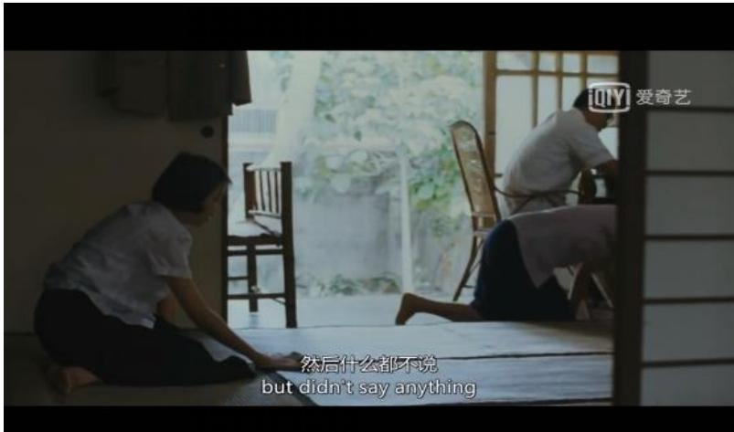
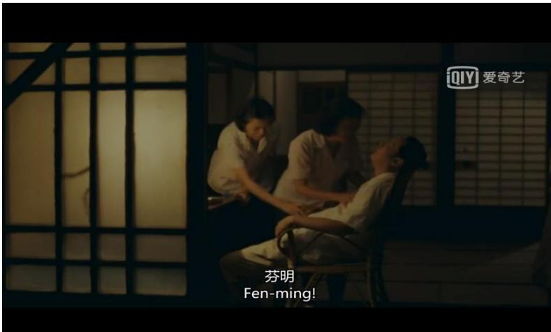
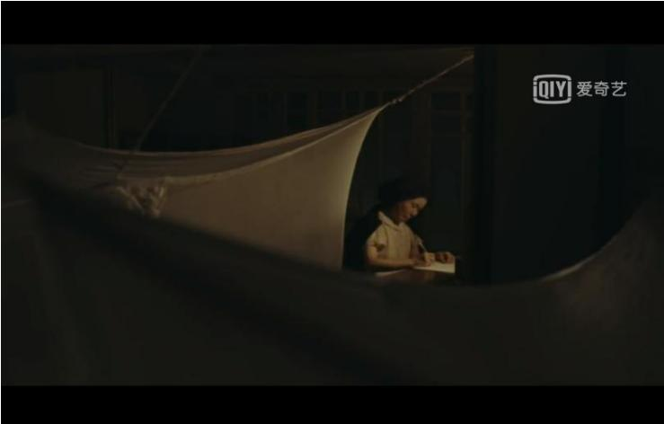
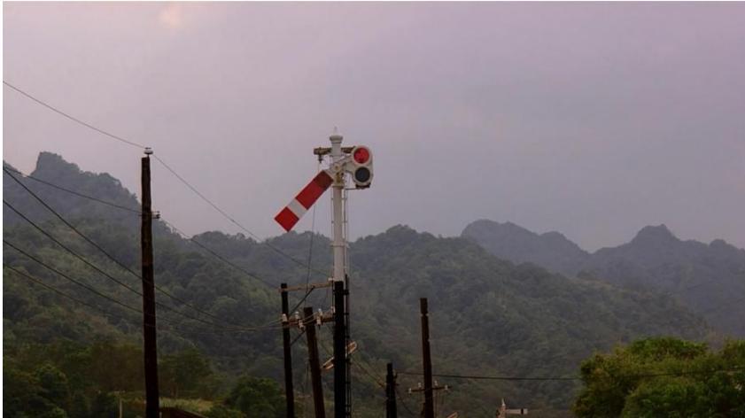
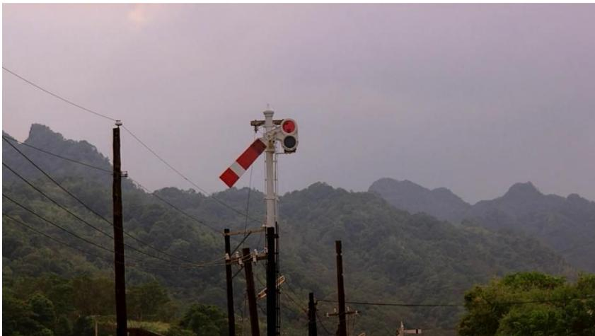
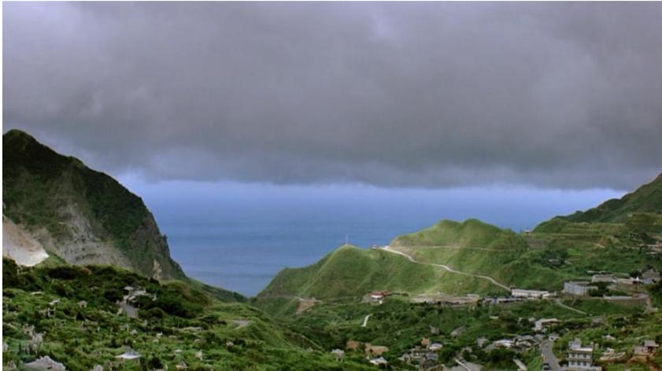
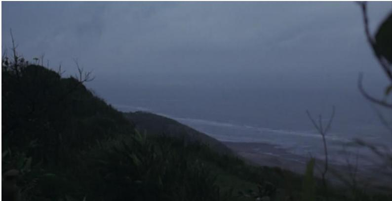
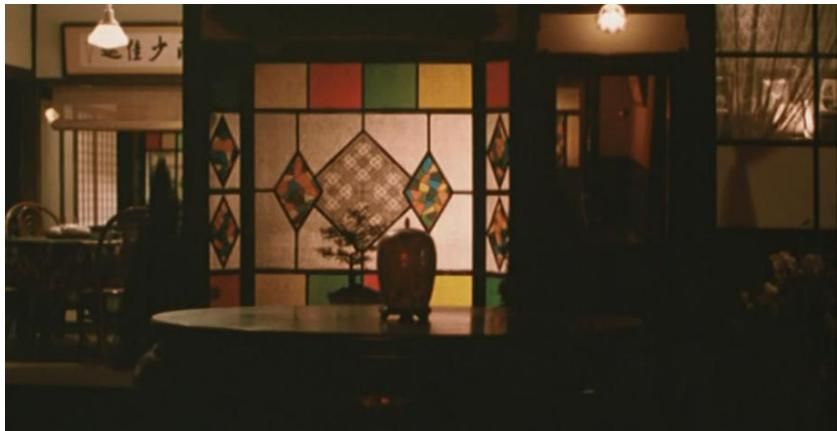
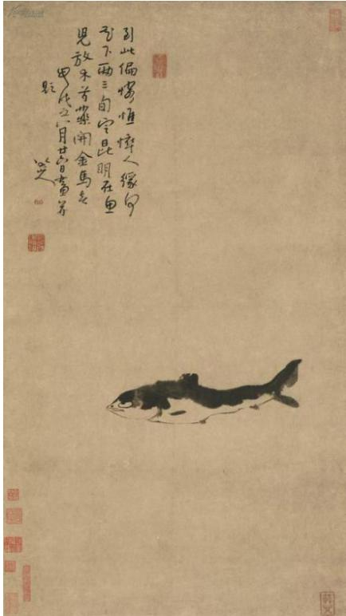

# 1. Bibliographic Information
## 1.1. Title
The full Chinese title is *沉寂力量——侯孝贤电影的日常性美学* (Silent Power: The Daily Aesthetics of Hou Hsiao-hsien's Films), with the English title *Temps Mort: The Study of Daily Scene and Aesthetics of Hou Hsiao-hsien's Films*. The core topic of the paper is the systematic exploration of the unique daily-oriented aesthetic system in Hou Hsiao-hsien’s filmography, including its construction mechanisms, expressive features, and cultural/philosophical origins, using Gilles Deleuze’s film image theory as the core analytical tool.
## 1.2. Authors
The author is <strong>Wang Rong (王嵘)</strong>, a master’s degree candidate in Drama and Film Studies at the School of Communication, East China Normal University. Her supervisor is Professor Nie Xinru, a leading scholar in Chinese film theory and media studies. The thesis defense committee consists of three associate professors from East China Normal University: Wu Ming (committee chair), Liu Tan, and Xu Kun.
## 1.3. Journal/Conference
This is a 2019 master’s degree thesis from East China Normal University, one of China’s top-tier universities with a highly ranked humanities and communication discipline. Master’s theses in this field undergo strict peer review by the defense committee, so it has formal academic credibility in Chinese-language film studies circles.
## 1.4. Publication Year
2019, as it is submitted for the 2019 graduating class of master’s students.
## 1.5. Abstract
### Research Objective
To systematically deconstruct Hou Hsiao-hsien’s unique daily aesthetics, addressing three core questions: 1) What kind of daily scenes does Hou’s film construct? 2) How is his trivial, non-dramatic daily visual style presented? 3) What is the cultural and aesthetic significance of this daily orientation?
### Core Methodology
The paper adopts Gilles Deleuze’s image theory (especially concepts of *temps mort* (silent time), time-image, and the fracture of the perception-movement mechanism) as its theoretical foundation, combined with close text analysis of Hou’s full filmography, systematic literature review of prior Hou Hsiao-hsien studies, and historical context analysis of Taiwan New Cinema and Taiwan’s modern history.
### Main Results
1.  It identifies three core lens techniques that construct Hou’s daily aesthetics: frame dilution, static still/empty shots, and duration-focused long takes.
2.  It proposes two core construction orientations of Hou’s daily aesthetics: framing the body as a carrier of idle, non-purposeful time, and presenting grand history as present-tense daily experience.
3.  It traces the dual origins of Hou’s aesthetics: traditional Chinese Confucian-Taoist thought and Chinese aesthetic spirit (rhythm, negative space, harmony between human and nature), as well as its affinity with Deleuze’s modern film theory of direct time presentation.
### Key Conclusion
Hou’s seemingly trivial, non-dramatic daily scenes break the perception-action logic of traditional dramatic cinema, release strong accumulated "silent power", and present a direct, authentic form of life time, offering a uniquely Eastern approach to cinematic expression and historical narration.
## 1.6. Original Source Link
- Original upload link: `uploaded://ee7581f8-5b84-4927-8122-ecba77dffc2e`
- PDF link: `/files/papers/69c5484ca9147b0c3a8f4c9b/paper.pdf`
  This is an officially completed and defended master’s thesis, not a preprint.

# 2. Executive Summary
## 2.1. Background & Motivation
### Core Problem to Solve
Prior research on Hou Hsiao-hsien, the flag bearer of Taiwan New Cinema and one of the most influential Chinese-language directors globally, has mostly focused on surface-level features: his oriental poetic imagery, long take style, and historical narrative of Taiwan identity. Few studies have systematically explored "daily nature" as the core of his entire aesthetic system, and many existing studies force-fit Western theories to film texts rather than analyzing from the intrinsic logic of Hou’s works.
### Importance of the Problem
Hou’s aesthetic style has shaped the creation of East Asian art cinema for decades, and clarifying the core of his aesthetics is critical for understanding Chinese-language film history and the development of global art film theory. The gap in daily aesthetics research means prior studies cannot fully explain the unique touching power of Hou’s seemingly plain, plotless films.
### Research Gap
Only two existing studies touch on daily themes in Hou’s films: Zhou Dongying’s work focuses only on time structure without deep analysis of daily aesthetics as a system, and Cai Xiao’s master thesis uses Bazin’s realism theory without connecting to the unique "silent power" of daily scenes proposed by Deleuze.
### Innovative Entry Point
This paper uses Deleuze’s *temps mort* and time-image theory to systematically deconstruct Hou’s daily aesthetics from three dimensions: construction techniques, expressive orientations, and origin tracing, avoiding the common problem of theory-text mismatch in prior studies.
## 2.2. Main Contributions / Findings
### Primary Contributions
1.  It constructs the first systematic theoretical framework for Hou Hsiao-hsien’s daily aesthetics, filling the long-standing research gap in this area.
2.  It expands the application of Deleuze’s film theory in Chinese-language film studies, proving the natural affinity between Eastern aesthetic spirit and Deleuze’s concepts of modern cinema.
3.  It clarifies the essential difference between Hou’s historical narration and traditional grand historical narratives: his "present-tense daily history" approach offers a new, more empathetic path for historical-themed film creation.
### Key Findings
- Hou’s daily aesthetics is built on three core lens techniques: frame dilution (obstructed composition, light-dark contrast, fixed shots) that removes dramatic rendering, static still/empty shots that carry pure time, and long takes that realize unbroken time duration.
- Two core construction logics define the aesthetics: focusing on body attitudes rather than purposeful actions (the body becomes a carrier of idle daily time), and weaving grand historical events into trivial daily details (turning distant "historical events" into immediate "present events" for audiences).
- The aesthetic origin is a combination of complementary Confucian-Taoist traditions, Chinese aesthetic spirit of rhythm and negative space, and the global modern cinema pursuit of direct time expression.
- Hou’s daily aesthetics is not a purely regional Eastern feature: it aligns with Deleuze’s time-image theory, so it has universal value for global art film research.

# 3. Prerequisite Knowledge & Related Work
## 3.1. Foundational Concepts
All core technical terms are explained below for beginner readers:
1.  **Taiwan New Cinema**: A film movement that emerged in Taiwan in the early 1980s, led by directors including Hou Hsiao-hsien, Edward Yang, and Wan Ren. It abandoned the previous commercial film mode of exaggerated melodrama and genre formula, focused on realistic depiction of Taiwan’s local life, personal growth experiences, and social historical changes, using plain, non-dramatic narrative styles, long takes, and non-professional actors. It is one of the most important transformative movements in Chinese-language film history.
2.  **Gilles Deleuze’s Core Film Theory Concepts**:
    - **Movement-image**: Deleuze’s classification of pre-WWII classic cinema (represented by Hollywood genre films). In movement-image, time is subordinate to movement and narrative, organized by strict causal logic and dramatic conflict. It follows the *perception-action mechanism*: characters receive stimuli from a pre-set situation, make corresponding purposeful actions, and advance the plot. Time is only an indirect measurement of movement, completely manipulated to serve narrative needs.
    - **Time-image**: Deleuze’s classification of post-WWII modern cinema (represented by Italian neorealism and European art films). In time-image, time is prior to movement, the perception-action mechanism is broken: characters are in a pure audio-visual situation, do not take purposeful actions to advance the plot, the narrative abandons strict causal logic, and time is presented directly rather than being subordinate to movement.
    - **Fracture of the perception-movement mechanism**: The core turning point from movement-image to time-image. When a character’s situation exceeds their ability to respond, they no longer produce purposeful actions corresponding to external stimuli, but fall into wandering, hesitation, or stagnation. At this point, the causal link between perception and action is broken, and non-narrative pure audio-visual situations appear, making direct presentation of time possible.
    - **Temps Mort (Silent Time / Dead Time)**: A core concept in Deleuze’s time-image theory, referring to non-narrative, "useless" time fragments in film that do not advance the plot, such as empty shots, still life shots, or scenes of characters wandering aimlessly. In these fragments, trivial daily scenes release accumulated "silent power", present time directly, and carry rich emotional and ideological connotations beyond the surface narrative.
3.  **Daily Aesthetics (film)**: An aesthetic tendency that abandons dramatic conflict, spectacle presentation, and grand narrative, focuses on depicting trivial, ordinary daily life scenes, explores hidden meaning, emotion, and power in daily life, and pursues a sense of unfiltered real life experience.
4.  **Long take**: A shot that lasts for a relatively long time (usually 30 seconds or longer, even several minutes) without cutting, maintaining the complete continuity of time and space. It is an iconic technique of art cinema, in contrast to montage which cuts time and space to serve narrative efficiency.
## 3.2. Previous Works
The paper systematically sorts prior research into domestic (Greater China) and international categories:
### Domestic Research
- Published monographs: Most are interview collections, script collections, and production notes (such as *The Time of Cooking Sea: Hou Hsiao-hsien’s Light and Shadow Memory*, *Hou Hsiao-hsien’s Film Lectures*). Only four academic monographs focused on Hou’s films exist, none of which are by mainland Chinese scholars.
- Journal and degree papers: 503 valid research papers on Hou’s films were retrieved from CNKI (China National Knowledge Infrastructure). 27% of these focus on film aesthetics, most of which study surface features like Eastern poetic charm, oriental imagery, and long take style. Only two papers touch on daily themes:
  1.  Zhou Dongying’s *Daily Moments, Body-Image and Time Crystal: A Study of Time in Hou Hsiao-hsien’s Films*: Focuses on time structure only, without systematic analysis of daily aesthetics as a core system.
  2.  Cai Xiao’s master thesis *Replanting Existence: A Study of Hou Hsiao-hsien’s Daily Scene Construction and Its Spiritual Origin*: Uses Bazin’s realism theory, but does not connect daily scenes to Deleuze’s concept of silent power.
### International Research
Most studies position Hou within the context of Taiwan New Cinema, focusing on cultural identity and historical narrative. Only one study by Yun-hua Chen uses Deleuze’s time-image theory to analyze *Good Men, Good Women*, but no studies systematically explore his daily aesthetics.
### Core Theoretical Foundations Cited
- Deleuze’s *Cinema 1: Movement-Image* and *Cinema 2: Time-Image* (core theoretical framework)
- Henri Bergson’s duration theory (philosophical foundation of Deleuze’s film theory)
- Zong Baihua’s Chinese aesthetic theory on rhythm and space consciousness (foundation for analyzing Eastern aesthetic origins)
## 3.3. Technological Evolution
### Evolution of Hou Hsiao-hsien’s Creation
1.  Pre-New Cinema period (1980-1982): Commercial romance films, laid the foundation for his understanding of performance and lighting.
2.  Taiwan New Cinema peak period (1983-1987): Personal experience-themed films (*The Boys from Fengkuei*, *A Summer at Grandpa’s*, *A Time to Live, A Time to Die*, *Dust in the Wind*), formed his signature style of non-dramatic daily depiction.
3.  Historical trilogy period (1989-1995): *City of Sadness*, *The Puppetmaster*, *Good Men, Good Women*, extended daily aesthetics to historical narrative.
4.  Later cross-cultural and genre exploration period (2003-present): *Café Lumière*, *Flight of the Red Balloon*, *The Assassin*, further expanded the application of daily aesthetics across cultural contexts and genres.
### Evolution of Hou Hsiao-hsien Research
Early research focused on his position in Taiwan New Cinema, then shifted to surface aesthetic style analysis, then to cultural identity and historical narrative research. This paper’s systematic study of daily aesthetics fills a gap at the latest stage of Hou research.
## 3.4. Differentiation Analysis
Compared to prior studies, this paper has three core innovations:
1.  **Different core focus**: Prior research focused on Eastern poetic charm, long take skills, and historical narrative, while this paper positions daily aesthetics as the core of Hou’s entire aesthetic system, rather than a secondary feature.
2.  **Different theoretical application**: Prior studies either used Bazin’s realism theory or forced Deleuze’s theory to fit film texts, while this paper organically combines Deleuze’s *temps mort* concept with close text analysis, avoiding theory-text mismatch.
3.  **Higher systematicity**: This paper covers construction techniques, expressive orientations, and origin tracing, forming a complete theoretical framework of Hou’s daily aesthetics, which is not available in prior fragmented studies.

# 4. Methodology
## 4.1. Principles
The core idea of the paper is to use Deleuze’s time-image theory and *temps mort* concept as the analytical tool, combine close reading of Hou’s representative films, systematic literature review, and historical context analysis, to deconstruct the construction logic, expressive forms, and spiritual origin of Hou’s daily aesthetics. The core theoretical intuition is that Hou’s seemingly trivial, non-dramatic daily scenes are exactly the *temps mort* described by Deleuze: they break the perception-action mechanism of classic cinema, present time directly, and release silent power, which is the core of Hou’s unique aesthetic charm.
## 4.2. Core Methodology In-depth
The research is carried out in three sequential layers:
### Layer 1: Theoretical Foundation Construction
First, the paper clarifies the connotation of Deleuze’s concepts related to daily aesthetics:
- It sorts out the evolution from movement-image to time-image, and clarifies that the fracture of the perception-movement mechanism is the prerequisite for the emergence of daily aesthetics. In classic movement-image, trivial daily scenes are cut because they do not serve narrative and dramatic conflict; in modern time-image, daily scenes become the carrier of direct time presentation, because daily life itself has weak sensory-motor links, which fits the state after the perception-action mechanism breaks.
- It explains the concept of *temps mort*: Deleuze pointed out that "the most ordinary or daily situation often releases some accumulated 'silent power'", which exactly matches the aesthetic effect of Hou’s films. The paper uses Yasujiro Ozu’s films (a representative of daily aesthetics that Deleuze focused on) as a reference to confirm the rationality of using Deleuze’s theory to analyze Hou’s works.
### Layer 2: Analysis of Artistic Expression Techniques
The paper analyzes from two dimensions: lens language and construction orientation:
#### Dimension 1: Core Lens Language Techniques
1.  **Frame Dilution**
    Hou uses fixed shots, obstructed composition (e.g., Japanese sliding doors, door frames, cloth curtains as foreground obstructions), and light-dark contrast (large dark areas to reduce visible frame elements) to dilute the frame, remove dramatic rendering, and present daily scenes naturally. Deleuze’s frame theory points out that the reduction of visible elements in the frame does not mean a lack of meaning, but enhances the "readability" of the image, allowing audiences to perceive hidden meaning outside the visible picture.
    For example, in *A Time to Live, A Time to Die*, the scene where the eldest sister recalls her failure to enter the top girls’ high school uses sliding door obstruction, a fixed low-angle shot, and blurred parents in the depth of field with no lines. The regret and guilt of the whole family are extended naturally in the fixed shot without any dramatic rendering:

    
    *该图像是侯孝贤电影中的一个场景，展现了人物在静谧空间中的日常生活。画面中有两位女性，一个跪在地上，另一个则坐在地板上，背景为宽敞的室内环境，明亮的光线透过窗户洒入，营造出一种宁静而内省的氛围。图中的英文字幕为"but didn't say anything"，增强了场景的情感表达。*

    Another example: the scene of the father’s death after a sudden power outage in *A Time to Live, A Time to Die* has a short completely black frame, reaching maximum dilution. The suddenness and triviality of death in daily life are more prominent here than any dramatic rendering:

    
    *该图像是电影《沉寂力量》的一幕，展现了人物在昏暗环境中的互动。画面中，有三名角色，其中一人坐在摇椅上，表情痛苦，另外两人则似乎在试图安慰或救助他。对话框中出现了人物的名字，突显情感紧张的氛围。*

    The light-dark contrast technique is also used in the scene where the mother cries while writing a letter after learning she has throat cancer. Large dark areas dilute the frame elements, and the only bright part is the mother under the lamp, highlighting the hidden sadness in daily life:

    
    *该图像是电影《沉寂力量》中的一帧，展现了一位人物在昏暗的环境中，透过布帘写作的瞬间，突出日常生活中的细腻美感。*

2.  **Static Still and Empty Shots**
    Still life shots and empty landscape shots are used as carriers of pure time. These static elements remain unchanged, while characters’ fates and emotions change dramatically, forming a "things remain, people change" contrast that extends emotions infinitely.
    For example, in *Dust in the Wind*, the same railway signal light appears at the opening and closing of the film: at the opening, the hero and heroine are still young lovers, while at the closing, the heroine has married another man. The unchanged signal light carries the regret of lost youth:

    
    *该图像是图3，展示了电影《恋恋风尘》中片头的信号灯。画面中信号灯的红灯和白色条纹标志在背景的青山衬托下，营造出一种宁静而富有生活气息的氛围。*

    
    *该图像是插图，展示了电影《恋恋风尘》片尾的信号灯。信号灯高耸在背景山脉的前方，周围有电线杆，色彩与环境和谐，体现了影片对日常生活细节的独特关注。*

    Empty landscape shots are also used to extend emotions. The ending of *Dust in the Wind* uses a long empty shot of the village’s mountains and clouds. No lines mention the hero’s lovelorn pain, but the vast, unchanged landscape contains the helplessness and sadness of life:

    
    *该图像是电影《恋恋风尘》片尾的故乡景色，展现了青山绿水的自然风光和宁静的村庄，天空中似乎云层密布，给人一种淡淡的忧郁感。*

    The paper distinguishes between still life shots and empty landscape shots per Deleuze’s theory: still life shots are time itself, carrying changes of time, while empty landscape shots are carriers of *temps mort*, clearing away characters and actions, presenting eternal nature, and connecting past, present, and future.
3.  **Long Takes**
    Long takes maintain the integrity of time and space, realize time duration, dissolve dramatic conflict, and present daily scenes realistically.
    For example, the 3-minute long take of Nie Yinniang saying goodbye to her master in *The Assassin* uses a distant view, with characters as small as dot figures in traditional Chinese landscape painting, and natural clouds and mountains occupying most of the frame. The conflict between the Taoist concept of ruthless kendo and Nie Yinniang’s human ethics is extended in the continuous time of the long take, removing the dramatic rendering of traditional martial arts films.
    Another example: the long take of the violence scene at the end of *City of Sadness* uses a high-angle long shot. The violence scene in the lower right corner is small and blurred, while the vast mountains and sea occupy most of the frame. The cruelty of history is dissolved into the daily natural landscape, making the silent power more prominent:

    
    *该图像是一幅插图，展现了一片阴暗的海岸线景观，背景中的天空呈现出昏暗的色调，突显出自然环境的宁静与沉寂，具有侯孝贤电影中的日常性美学特征。*

#### Dimension 2: Core Construction Orientations
1.  **Body as the Carrier of Idle Time**
    The paper abandons the classic film focus on purposeful actions of characters, and instead focuses on capturing characters’ attitudes, expressions, and aimless wandering states. After the fracture of the perception-movement mechanism, the body is no longer a carrier of action to promote the plot, but a carrier of pure time and emotion.
    For example, in *Millennium Mambo*, the camera focuses on Vicky’s wandering posture, the swaying of her hair, and the movement of her holding a cigarette. There is no strong dramatic plot, but the confusion and loss of Taiwan’s youth at the turn of the millennium are fully presented through her body. In *Flowers of Shanghai*, the scene of Shen Xiaohong arguing with Wang Liansheng is not shown; only her sitting posture and expression of being angry while trying to save face are presented, and the character’s emotion is fully expressed through body attitude.
2.  **History as Present Tense**
    Grand historical events are woven into trivial daily details, abandoning grand historical narrative and iconic historical scenes, describing the daily life of ordinary people in specific historical periods, and turning distant "historical events" into immediate "present events" that audiences can empathize with.
    The most representative prop is the dining table: dining is the most common daily behavior, and changes in characters and times are reflected in dining scenes. For example, in *City of Sadness*, the Lin family’s dining table appears at the opening and closing: at the opening, the family is full and lively when the casino opens, while at the closing, only the elderly grandfather and his insane son are left eating at the table. The impact of history on the family is fully presented without any grand narrative:

    
    *该图像是插图，展示了一扇以彩色玻璃装饰的窗户，背景中隐约可见家具和室内环境。窗户的设计包含几何形状和鲜艳的颜色，营造出一种温馨而宁静的氛围，反映了侯孝贤电影中的日常性美学。整体光线柔和，透出一种怀旧的感觉。*

    The paper takes *City of Sadness* as a case to point out that this daily historical narrative is an "asymptote" of objective history: it is a subjective interpretation of history with the creator’s position, not an absolute objective restoration. For example, *City of Sadness* focuses on ethnic conflict between native Taiwanese and mainlanders, and downplays the responsibility of the Japanese and the United States for the February 28 Incident, reflecting Hou’s subjective thinking on Taiwan’s cultural identity.
### Layer 3: Aesthetic Origin Tracing
1.  **Confucian-Taoist Tradition**
    The Confucian concept of "knowing fate" (do one’s best and accept the changes of life calmly) and Taoist concept of "harmony between man and nature" are complementary, forming the spiritual core of Hou’s aesthetics. Hou treats life, death, gains, and losses as normal parts of daily life without sensational rendering, which reflects the Confucian attitude of "knowing fate" and the Taoist view of nature as the carrier of eternal time. For example, the deaths of the father, mother, and grandmother in *A Time to Live, A Time to Die* are all presented as trivial daily events, no exaggerated sadness is shown.
2.  **Chinese Aesthetic Spirit**
    The Chinese aesthetic pursuit of rhythm, negative space, and "meaning beyond the image" is consistent with Hou’s lens techniques. For example, frame dilution and empty shots in Hou’s films are similar to the negative space in traditional Chinese painting: the limited picture contains infinite meaning, as in Bada Shanren’s fish painting, where the blank space around the fish is full of the feeling of rivers and lakes:

    
    *该图像是一幅鱼的水墨画，描绘了一条黑白相间的鱼，背景呈淡黄色。画面上方有行书文字，内容可能与鱼类相关，呈现出典雅的中国传统艺术风格。*

    Hou also chooses an Eastern emotional expression different from Western dramatic expression: Western aesthetics pursues direct conflict and dramatic tension, while Eastern aesthetics pursues implicit, reserved charm, which is reflected in Hou’s abandonment of dramatic conflict and focus on daily details. The influence of Shen Congwen’s literary works is also an important origin: Shen’s objective description of the joys and sorrows of life in daily life, and his broad mind to包容 suffering, have a profound impact on Hou’s creation.
3.  **Affinity with Deleuze’s *Temps Mort* Concept**
    Hou’s daily aesthetics is not only an Eastern aesthetic feature, but also consistent with the development trend of modern cinema pointed out by Deleuze: the pursuit of direct time presentation and abandonment of the perception-movement mechanism, so it has universal film aesthetic value.

# 5. Experimental Setup
As this is a humanities theoretical research paper, the "experimental setup" is adjusted to match the research logic of film studies:
## 5.1. Datasets (Research Objects)
### Film Corpus
The research objects are all of Hou Hsiao-hsien’s representative films, covering all stages of his creation:
- Pre-New Cinema period: *Cute Girl*, *Cheerful Wind*, *Green, Green Grass of Home*
- New Cinema peak period: *The Boys from Fengkuei*, *A Summer at Grandpa’s*, *A Time to Live, A Time to Die*, *Dust in the Wind*
- Historical trilogy period: *City of Sadness*, *The Puppetmaster*, *Good Men, Good Women*
- Later period: *Flowers of Shanghai*, *Café Lumière*, *Flight of the Red Balloon*, *Three Times*, *The Assassin*
### Literature Corpus
The literature dataset includes 503 valid domestic research papers on Hou’s films, relevant international research, Deleuze’s film theory works, Chinese aesthetic theory works, and historical materials related to the February 28 Incident and Taiwan’s modern history.
The selection is reasonable: it covers all stages of Hou’s creation, and all relevant theoretical and historical materials, fully supporting the research conclusions.
## 5.2. Evaluation Metrics
As this is a theoretical humanities study, there are no quantitative evaluation metrics. The evaluation criteria are:
1.  **Theoretical consistency**: Whether the analysis is consistent with the intrinsic connotation of Deleuze’s film theory.
2.  **Text consistency**: Whether the analysis is consistent with the actual content of Hou’s films.
3.  **Logical completeness**: Whether the theoretical framework is complete and the argumentation logic is rigorous.
## 5.3. Baselines
The baseline views are the main conclusions of prior Hou Hsiao-hsien research:
1.  Hou’s aesthetic core is Eastern poetic charm and traditional Chinese aesthetic imagery.
2.  Hou’s historical narrative is a realistic restoration of Taiwan’s local history.
3.  Hou’s long take technique is derived from Bazin’s realist aesthetic.
    This paper compares with these baselines, and points out that daily aesthetics is the deeper core of Hou’s aesthetics, which covers the Eastern poetic charm feature and is more essential.

# 6. Results & Analysis
## 6.1. Core Results Analysis
The paper’s main results are verified by a large number of film text examples:
1.  The three lens techniques (frame dilution, static shots, long takes) are widely present in all of Hou’s representative films, and effectively construct daily scenes and silent power. For example, frame dilution is used in *A Time to Live, A Time to Die*, *City of Sadness*, *Flowers of Shanghai* and other films, effectively removing dramatic rendering and presenting natural daily scenes.
2.  The two construction orientations are also fully verified: the body as time carrier is reflected in *Millennium Mambo*, *Flowers of Shanghai*, *The Assassin* and other films; the present-tense historical narrative is reflected in *City of Sadness*, *The Puppetmaster*, *Good Men, Good Women* and other historical-themed films, which is significantly different from traditional grand historical narrative films, and has a more touching realistic power.
    Compared with prior research baselines, this paper’s framework is more systematic and essential, solving the problem that prior research only stays on the surface of aesthetic features and does not touch the core of daily aesthetics.
## 6.2. Data Presentation (Tables)
The paper provides a statistical table of domestic Hou Hsiao-hsien research literature:
The following are the results from Table 1 of the original paper:

<table>
<thead>
<tr>
<th>Total (papers)</th>
<th>Comparative study</th>
<th>Film aesthetics</th>
<th>Film history</th>
<th>Cultural study</th>
<th>Narrative</th>
<th>Ideology</th>
<th>Psychoanalysis</th>
<th>Work analysis</th>
<th>Creation theory and others</th>
</tr>
</thead>
<tbody>
<tr>
<td>503</td>
<td>45</td>
<td>135</td>
<td>26</td>
<td>64</td>
<td>24</td>
<td>1</td>
<td>2</td>
<td>111</td>
<td>98</td>
</tr>
<tr>
<td>100%</td>
<td>8.9%</td>
<td>27%</td>
<td>5%</td>
<td>13%</td>
<td>4.7%</td>
<td>0.2%</td>
<td>0.4%</td>
<td>23%</td>
<td>20%</td>
</tr>
</tbody>
</table>

This table clearly shows that film aesthetics research accounts for the largest proportion (27%) of domestic Hou research, but prior aesthetic research rarely focuses on daily aesthetics, which confirms the research gap and the necessity of this paper’s research.
## 6.3. Ablation Studies / Parameter Analysis
While there are no ablation studies in the natural science sense, the paper carries out a rigorous differentiation analysis of related concepts: it distinguishes between still life shots and empty landscape shots in Deleuze’s theory, pointing out that still life shots are time itself, carrying changes of time, while empty landscape shots are carriers of *temps mort*, clearing away characters and actions, presenting eternal nature, and connecting past, present and future. This distinction effectively avoids the confusion of concepts in prior research, and improves the accuracy of the analysis.

# 7. Conclusion & Reflections
## 7.1. Conclusion Summary
This paper systematically constructs the theoretical framework of Hou Hsiao-hsien’s daily aesthetics, clarifies its construction techniques, expression orientations, and aesthetic origins, and proves that Hou’s seemingly trivial, non-dramatic daily scenes release strong "silent power", break the perception-action mechanism of traditional dramatic films, present the direct time form of life, and offer a unique Eastern path for cinematic expression and historical narration. The research fills the gap in the systematic study of Hou’s daily aesthetics, and expands the application of Deleuze’s film theory in Chinese-language film studies.
## 7.2. Limitations & Future Work
The paper implicitly points out limitations in the *City of Sadness* case analysis: it only analyzes the subjective position of Hou’s historical narrative, but does not further discuss the complex relationship between this subjective position and Taiwan’s local ideological trends, which can be further explored in future research. In addition, the paper only compares Hou’s aesthetics with Deleuze’s theory, and does not compare it with other Eastern directors’ daily aesthetics (such as Hirokazu Kore-eda, Jia Zhangke) to explore the commonalities and differences of East Asian daily aesthetics, which is also a promising future research direction.
## 7.3. Personal Insights & Critique
This paper’s greatest inspiration is that it reveals that the power of art films does not come from dramatic conflict and spectacle, but from the excavation of hidden meaning in ordinary daily life, which has important guiding significance for art film creation. The method of organically combining Western film theory with Chinese-language film texts, without forcing theory to fit the text, is also worth learning for Chinese-language film research.
Potential improvements:
1.  The analysis of the influence of Japanese film directors (such as Yasujiro Ozu) on Hou’s aesthetics is insufficient. Although the paper mentions that Hou watched Ozu’s films after forming his style, the implicit influence of Japanese daily aesthetics on Taiwan’s cultural context can be further explored.
2.  The analysis of audience acceptance of Hou’s daily aesthetics is lacking: why Hou’s films are loved by art film audiences but difficult to be accepted by the general public can be further discussed from the perspective of audience psychology.
3.  The paper’s conclusion that Hou’s daily aesthetics has universal value can be further verified by comparing with European art film directors’ daily aesthetics, such as Robert Bresson and Chantal Akerman, to explore the commonalities and differences between Eastern and Western daily aesthetics.