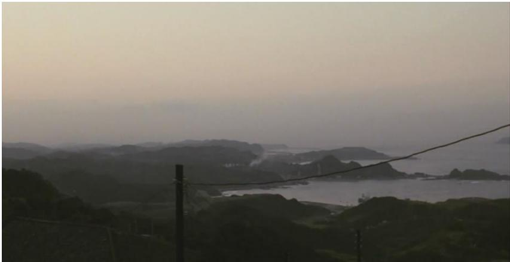

2019 届研究生硕士学位论文

# 华東师範大学

East China Normal University硕士学位论文MASTER'SDISSERTATION论文题目：_沉寂力量—一侯孝贤电影的日常性美学

院 系： 传播学院专 业: 戏剧影视学研究方向： 电影研究指导教师： 聂欣如 教授学位申请人：王蝶

# 華東师範大學

East China Normal University

# MASTER'SDISSERTATION

Title: Temps Mort: The Study of Daily Scene and Aesthetics of Hou Hsiao-hsien's Films

Department: Communication Major: Drama and Film Research Direction: Theories of Fim Art Supervisor: Nie Xinru Candidate: Wang Rong

# 王嵘 硕士学位论文答辩委员会成员名单

<table><tr><td rowspan=1 colspan=1>姓名</td><td rowspan=1 colspan=1>职称</td><td rowspan=1 colspan=1>单位</td><td rowspan=1 colspan=1>备注</td></tr><tr><td rowspan=1 colspan=1>吴明</td><td rowspan=1 colspan=1>副教授</td><td rowspan=1 colspan=1>华东师范大学</td><td rowspan=1 colspan=1>主席</td></tr><tr><td rowspan=1 colspan=1>刘弹</td><td rowspan=1 colspan=1>副教授</td><td rowspan=1 colspan=1>华东师范大学</td><td rowspan=1 colspan=1></td></tr><tr><td rowspan=1 colspan=1>徐坤</td><td rowspan=1 colspan=1>副教授</td><td rowspan=1 colspan=1>华东师范大学</td><td rowspan=1 colspan=1></td></tr><tr><td rowspan=1 colspan=1></td><td rowspan=1 colspan=1></td><td rowspan=1 colspan=1></td><td rowspan=1 colspan=1></td></tr></table>

# 内容摘要

侯孝贤的电影成长于台湾“新电影”时期。作为公认的台湾“新电影”旗手，侯孝贤的主体影像空间，是“一个更为开阔的台湾现实”。换句话来说，其电影作品通过构筑日常场景，在叙事，镜头语言等方面呈现出一种追求日常性的去戏剧化美学风格，然而，在侯孝贤构筑的日常场景的平淡琐碎，甚至是沉闷之中，却能够释放出德勒兹所说的那种积蓄而来的“沉寂力量”。因为侯孝贤并非简单记录生活的真实，在他的作品中，平凡的生活图景下是复杂的时间和空间结构。

本文正是要探讨侯孝贤作品中这种独特的日常性美学：它是如何在侯孝贤的作品中，以怎样的镜头语言，叙事形式等艺术手法所建构出来的，在他的作品中，又有哪些独特元素表现了这种日常性，其美学源头来自何处。而为了回答以上问题，笔者将引入德勒兹的影像理论作为理论基础和理论工具。

关键词：侯孝贤日常性 美学 沉寂力量

# Abstract

In terms of the progress of the film of Hou Hsiao-hsien,it starts form the period of"new film" in Taiwan. As a recognized flag bearer of the "new film" of Taiwan,the main image space of Hou Hsiao-hsien is "a more open reality in Taiwan". In other words, his film works present a kind of daily de-dramatic aesthetic style in the aspects of narrative, lens language and so on through the construction of everyday scenes. However, it can release the "Temps Mort" of what Gilles Deleuze believes in the trivial and even dull daily scenes constructed by Hou Hsiao-hsien. It is because that Hou Hsiao-hsien does not simply document the reality of life, while it is the complex structure of time and space under the ordinary picture of his works.

In this paper, it willtry to explore this unique daily aesthetics in the works of Hou Xiaoxian, which includes how it is constructed in the works of Hou Hsiao-hsien with what kinds of lens language, narrative form and other artistic techniques. It also explores the unique elements of his works that express this daily nature and where his aesthetic origins come from. To answer the above questions, it willintroduce the image theory of Gilles Deleuze as the theoretical basis and theoretical tool in this paper.

# Keywords: Hou Hsiao-hsien； Daily aesthetics; Temps Mort

# 目录

第一章绪论.….

1.1侯孝贤导演的创作轨迹..

# 1.2侯孝贤电影概述..

1.2.1国内对侯孝贤导演的研究概述 3  
1.2.2．侯孝贤电影美学研究概述. .6  
1.2.3.探讨侯孝贤电影中“日常性”的研究概述 7  
1.2.4国外对侯孝贤导演的研究概述. .8  
1.2.5小结.. 9

# 1.3本文的研究意义和研究方 ....10

1.3.1研究目标.. .10  
1.3.2研究方法. .10  
1.3.3研究意义与创新之处. 12

# 第二章 理论基础：日常性的沉寂力量 ..13

第三章日常性的艺术表达. ..18

# 3.1镜头语言中的日常性美学. ...18

3.1.1景框内稀释：影像空间的日常性 18  
3.1.2静止：日常背后的纯粹时间. 21  
3.1.3．长镜头：时间的绵延 .26

# 3.2日常性的两种建构取向. ..30

3.2.1躯体：无所作为的时间载体. .30  
3.2.2历史：一种现在时态. .32  
3.2.2.1 日常性中建构“小写的历史” .32  
3.2.2.2《悲情城市》：历史的“渐近线” .36

# 第四章侯孝贤的日常性美学溯源. .39

4.1 儒道传统 ....39  
4.2 中国美学与东西之辨. ...40  
4.3日常性美学与“沉寂时间” .44

第五章结语：日常性的沉寂力量. ..46

参考文献.… .48

致谢..… .50

# 第一章绪论

# 1.1 侯孝贤导演的创作轨迹

侯孝贤是台湾电影领军人物，他以1983 年的集锦片《儿子的大玩偶》和长故事片《风柜来的人》在华语电影界崭露头角，并一举在1989 年通过作品《悲情城市》获得威尼斯电影节金狮奖，引起了华语电影界之外全世界范围内的广泛关注。侯孝贤成长于台湾新电影运动时期，作为领军人物，他与万仁、曾壮祥合拍的作品《儿子的大玩偶》成为台湾新浪潮电影运动的序幕之作。

20 世纪70年代，侯孝贤自艺专毕业之后在剧组里担任场记，后又转为担任编剧和副导演。换句话说，侯孝贤接受的并不是正统的电影教育，他学习电影的方式是“学徒见习式”的。这一时期，侯孝贤与李行导演、赖成英导演合作了多部影片。而这一阶段则被詹姆斯·乌登称作为“侯孝贤的奇特实习阶段”1，这是因为在参与这些电影的拍摄与制作的时候，侯孝贤接收到的是“非常浓厚的商业电影训练”2——而在这之后开始独立创作的侯孝贤竟然变成了一个艺术电影大师。不可否认的是，在片场担任副导演的经历对侯孝贤产生了深远的影响，使得他汲取到了两个宝贵的经验：布光的重要性和表演的重要性，而布光和表演则成为他日后艺术电影作品中最为重要的美学元素。3

从1980年起，侯孝贤就开始了身为导演的独立创作，并在接下来的五年中与导演陈坤厚建立了长久的合作关系。1980到1982年，侯孝贤拍摄了三部大众商业色彩较为浓厚的作品，即1980的《就是溜溜的她》、1981的《风儿踢踏踩》和 1982的《在那河畔青青草》。这三部电影主要都是以喜剧形式表现青年男女的爱情故事，欢快的基调和偶像派的男女主人公使得这几部作品取得了不错的商业反响，因此，这三部影片又被公认为是“侯孝贤的商业三部曲”4。在学者黄钟军的研究中，因这几部作品在台湾新电影运动之前，所以侯孝贤的这一创作阶段又被称为“前新电影时期”5，它对于侯孝贤日后创作的成熟有着承前启后的重要意义。

在台湾新电影运动最蓬勃的阶段（1983年至1987年），侯孝贤从1983 年开始先后拍摄了《儿子的大玩偶》（1983）、《风柜来的人》（1983）、《冬冬的假期》（1984）、《童年往事》（1985）和《恋恋风尘》（1986）五部作品。这一时期是侯孝贤电影个人风格化形成与转变的重要阶段，而这一时期的几部作品多取材于导演及主创人员的童年自身经历与私人化的个人体验，呈现出导演对个体生命的关注，并通过这种关注，折射出20世纪50年代至80年代台湾的社会以及生活面貌。贾樟柯曾在为《煮海时光:侯孝贤的光影记忆》一书做序言时满怀感情地描述他第一次观看《风柜来的人》的情形，他写道：“银幕上出现的台湾青年竟然长着跟我山西老家朋友一样的脸..我万分迷惑，搞不懂为什么明明一部台湾电影，却好像在拍山西老家我那些朋友的故事....原来在中国人的世界里，只有侯孝贤才能这样准确地拍出我们的今生。”由此可见，侯孝贤对个体生命的关注具有更高意义上的普世价值，并能够超越时代、地域和文化语境。

从20 世纪90 年代中期开始，侯孝贤的创作再一次经历了重要转折。正如朱天文评述的那样，“《戏梦人生》在他（侯孝贤）的创作历程之中是一次巅峰，而后，转折了。”从1989 年开始，侯孝贤决定要“开始跨入另外一个领域，拍过去台湾的历史”。以此作为创作目标，侯孝贤拍摄了被誉为“台湾三部曲”的三部重要作品，即1989年的《悲情城市》、1993 年的《戏梦人生》和 1995年的《好男好女》。在这三部抒写历史的影片中可以窥见侯孝贤对于构造历史真实的一种路径选择：侯孝贤表现历史的方式从不是从正面直接表现历史事件和历史时期的宏大面貌，而是从个体的日常性体验出发，捕捉普通人、底层人在历史事件之中的命运变迁和情感体验。

在“历史三部曲”之后，侯孝贤的创作便跨入了一个新的领域，他开始尝试在国际投资并在外国拍摄制作的纯粹的外语片，2003年，他拍摄了《咖啡时光》该片是为小津安二郎的百年诞辰所作，在这之后，也就是2007年，侯孝贤又拍摄了一部法语片《红气球之旅》。在这两部纯外语片之间，侯孝贤创作了《最好的时光》（2005），该片入围了2005年戛纳电影节竞赛单元。这部电影以一个意味丰富的三段式结构展开，有一种解释是，这三个迥然不同的段落是侯孝贤对自己过往三种不同创作类型主题的反思和回应，有意无意地以此对自己的过往创作进行总结。8在这之后，2015年，侯孝贤拍摄了至今为止创作生涯中唯一的一部武侠片《刺客聂隐娘》，该片一举夺得2015年戛纳电影节最佳导演奖。

纵观侯孝贤的创作生涯，从早期的乡土题材和取材于个人经验的作品到从普通人的日常生活反思台湾历史，再到武侠片《刺客聂隐娘》，侯孝贤一直在试图“拍出自然法则底下人们的活动”。9无论故事的时代背景如何，侯孝贤一直“迷恋于再造的真实”，并选择“将真实生活里的片段拿来使用”，由此呈现出来的是一种独属于侯孝贤作品的日常性美学，是一种能够超越时代、文化语境的对更加普世意义上对现实的创造性“复原”。

# 1.2侯孝贤电影概述

# 1.2.1国内对侯孝贤导演的研究综述

两岸学界对侯孝贤电影作品的关注始于1980年代，这种关注在其作品《悲情城市》斩获金狮奖之后更成热潮。但是，与侯孝贤有关的出版书籍大多数是其电影作品原著小说、剧本和分镜头脚本的合集，如《最好的时光，侯孝贤电影记录》，或访谈录，如朱天文校订的《煮海时光：侯孝贤光影记忆》，以及卓伯棠整理的《侯孝贤电影讲座》等。至于两岸学者间对侯孝贤电影作品本身的理论专著仅有寥寥无几的四部，且其中并没有大陆学者的身影，它们分别是：林文淇等三人主编的《戏梦时光：侯孝贤电影的城市、历史、美学》，黄文英与曹智伟合著的《海上繁华录—一<海上花>的影像美感》，陈相因与陈思齐合编的《聂隐娘的前世今生：侯孝贤与他的刺客聂隐娘》，以及美国学者詹姆斯·乌登的论著《无人是孤岛：侯孝贤的电影世界》。除此之外，两岸各地的电影研究专著，尤其是对台湾电影的研究书籍中也经常会收录对侯孝贤电影研究的相关文献。

而这样的文献则比较丰富，比如张霭珠在其论著《全球化时空、身体、记忆：

台湾新电影及其影响》的第一章节《不一样的历史，不一样的人生》中探讨了侯孝贤“台湾三部曲”的全球化时空与历史记忆，熊秉真等主编的《流离与归属》收录了王万睿的《复摄山城：侯孝贤与吴念真之地景美学》，林建光和江凌青编纂的《新空间·新主体：华语电影研究的当代视野》收录了孙松荣对侯孝贤和蔡明亮作品进行的比较研究：《台湾电影的写实新景框：侯孝贤与蔡明亮的银幕脉动》。除此以外还有很多，如焦雄屏撰写的《台湾电影精选系列》，孙慰川著的《当代台湾电影》等都有对侯孝贤作品的研究文章的收录。

此外，对侯孝贤的研究最为丰富的还是期刊、学术论文和学位论文。经检索，中国知网以侯孝贤为主题的研究文献共684篇，除去新闻报道、画报信息等与电影理论研究无关的文章，侯孝贤电影相关研究的文献共计503篇。通过梳理和统计，国内对侯孝贤电影的研究文献可如下表分类：

<table><tr><td rowspan=1 colspan=10>表1.侯孝贤电影研究文献数据统计</td></tr><tr><td rowspan=1 colspan=1>总计（篇）</td><td rowspan=1 colspan=1>比较研究</td><td rowspan=1 colspan=1>电影美学</td><td rowspan=1 colspan=1>电影史学</td><td rowspan=1 colspan=1>文化研究</td><td rowspan=1 colspan=1>叙事</td><td rowspan=1 colspan=1>意识形态</td><td rowspan=1 colspan=1>精神分析</td><td rowspan=1 colspan=1>作品分析</td><td rowspan=1 colspan=1>创作论与其他</td></tr><tr><td rowspan=1 colspan=1>503</td><td rowspan=1 colspan=1>45</td><td rowspan=1 colspan=1>135</td><td rowspan=1 colspan=1>26</td><td rowspan=1 colspan=1>64</td><td rowspan=1 colspan=1>24</td><td rowspan=1 colspan=1>1</td><td rowspan=1 colspan=1>2</td><td rowspan=1 colspan=1>111 </td><td rowspan=1 colspan=1>98</td></tr><tr><td rowspan=1 colspan=1>100%</td><td rowspan=1 colspan=1>8.9%</td><td rowspan=1 colspan=1>27%</td><td rowspan=1 colspan=1>5%</td><td rowspan=1 colspan=1>13%</td><td rowspan=1 colspan=1>4.7%</td><td rowspan=1 colspan=1>0.2%</td><td rowspan=1 colspan=1>0.4%</td><td rowspan=1 colspan=1>23%</td><td rowspan=1 colspan=1>20%</td></tr></table>

如表格1所示，国内对侯孝贤的研究以比较研究、电影美学研究、文化研究和作品分析散论为主，其中又以美学研究为最兴盛。

对侯孝贤电影的“比较研究”是指运用对比的研究方法，将其作品同与其处于同一时期或者创作手法、艺术风格类似的导演作品作对比并开展分析，从而比较他们的电影内容以及创作手法或者电影风格。该视角下的研究多见以将侯孝贤同小津安二郎比较最多，其次则是与杨德昌、蔡明亮、贾樟柯等导演的对比研究。如《电影时空中的东方意象——试论小津安二郎与侯孝贤的影像风格》和《一种影像:关于小津，关于侯孝贤》两篇文章都是对侯孝贤与小津安二郎作品的影像风格展开对比，这类文章基本秉持同样的观点，即两位导演的作品中都蕴含了极其相似的东方美学意象。《台湾当代电影的文化身份一一以侯孝贤、杨德昌、蔡明亮的获奖作品为例》则将台湾地区电影届最富盛名的三位导演进行分析，从台湾地区的文化、历史、现代性等角度谈文化渊源对台湾导演创作的具体影响。值得一提的是，在这一部分的研究之中，还有一部分研究者将研究的角度对准了侯孝贤电影的文学改编问题，也就是将侯孝贤的电影文本与原著的小说文本放在一起进行对比并开展分析，比如将《刺客聂隐娘》、《海上花》与各自的原本小说进行的比较研究等。

文化研究是将侯孝贤作品纳入民族建构和社会文化语境，尤其是台湾历史文化的变革之中，其中重要的主题有：侯孝贤电影中的“台湾身份焦虑”以及对本土意识的探寻，如李成蹊的《侯孝贤电影的文化身份及其意义》，杨爽的《寂静的探寻一一论侯孝贤电影对台湾文化身份的呈现》等。另外，还有探讨侯孝贤电影中的乡村形象和城乡文化的，如黄钟军的《导演身份与台湾电影的城乡二元写作》和《侯孝贤“前新电影”时期作品中的城乡二元议题研究》等等。其中，熊小霜在《侯孝贤电影的文化记录性研究》一文认为，侯孝贤电影作品极具文化记录价值，其中包含了大量珍贵的台湾地区的历史民俗细节。

除此以外，对侯孝贤电影作品的诸多研究中还有许多是引入了主题学、叙事学、意识形态批评、精神分析等文艺批评理论进行展开的。它们与文化研究共同的特点是将侯孝贤的电影作品作为类小说的叙事文本，对其进行文本阐释。如在《你想要知道的台湾新电影(但又没敢问拉康的）》一文中，作者以拉康理论作为工具，就台湾三位导演：杨德昌，侯孝贤，蔡明亮进行比较研究。该文认为，在侯孝贤的电影作品中，自然与社会—一或想象域与符号域——之间的对立往往是其作品的基本结构，而《风柜来的人》等三部重要作品则都可以看成是某种意义上的成长小说（Bildungsroman）的变奏10，也就是说，侯孝贤电影体现了一种现代性的典型表达。

对侯孝贤电影作品的“史学研究”是将其纳入台湾电影的宏大版图中，分析其在整个台湾电影历史和当下的意义和作用。其中有综述类研究，如薛朝文和徐晓村的《台湾新电影研究综述》总结了1985年至 2010 年以来对侯孝贤电影作品的研究概况，他们认为，在这个时期之内，对侯孝贤导演的研究主要集中于艺术风格的探寻和对导演本身的研究，具体来说，艺术风格是从电影的创作层面展开，并试图从中探寻作为一个集合的台湾新电影的艺术创作特色问题；其次，“以历史的视角来记录侯孝贤的电影人生”，并从中找寻侯孝贤在台湾新电影运动历史中的位置。

作品分析则是对侯孝贤电影作品的散论，有些不具备太多理论价值，仅仅是观影之后兼具情感抒发和点评式的评析类文章。创作论和其他则指收录了侯孝贤本人的创作经验谈和访谈类文章，以及对导演本人人生经历的综合评述。

# 1.2.2．侯孝贤电影美学研究概述

经由文献梳理发现，电影美学分析是对侯孝贤电影研究最重要的一个方面。本篇论文也是分析侯孝贤的电影美学，因而对这部分的论文进行了较为细致的梳理。总的来说，关于侯孝贤电影美学的研究主要有以下几个方面：

(1)．风格论  
(2)．东方意蕴、中国美学与诗学  
(3)．镜头语言  
(4)．时间与空间  
(5)．符号美学

其中，“东方意蕴、中国美学与诗学”这一部分主要是从电影本体论美学的角度出发，从侯孝贤电影作品的电影语言、艺术创作特色和风格等角度开展研究，从而找寻侯孝贤电影独特的美学特质。在这之中，很大一部分的文章都认为侯孝贤的电影作品具备一种东方意蕴的独特气质，和中国诗学与美学独有的气蕴。如吴明的《侯孝贤华语电影的文化突围》一文认为，侯孝贤电影抓住了中国美学以及中国文化总“形散神不散”的关键，形成独具魅力的开放性与多义性。除此以外，这一部分的文章多集中于对《刺客聂隐娘》的讨论上，但数量虽多，难免人云亦云，缺少新意。除此以外，还有从音乐、剪辑、镜头等多个角度对侯孝贤电影的视听语言展开分析的。其中又以分析其标志性长镜头的文章为最多。

风格论则是以美学理论为作为理论工具从而展开对侯孝贤电影作品的艺术风格研究的。这一部分的文章有45 篇之多，占据电影美学这一分类的 $3 3 \%$ 。代表性的文章有李黎明的《<刺客聂隐娘>争鸣：作者风格、形式美学与时代症候》等等。其中，《个体景观视野下的时代变迁一一论侯孝贤的电影美学思想》一文从个体遭遇和城乡背景两个角度展开研究，并认为侯孝贤电影作品背后的美学思想与浓厚的台湾城乡变革背景和文化渊源密不可分。另外，还有一小部分文章意在探寻侯孝贤电影中的时空问题，如《时间之流与存在之思一一侯孝贤电影的审美意义研究》这篇文章就以“时间”作为切入点，试图探讨侯孝贤电影作品背后复杂的时间、空间关系，以及就此而形成的独特美学风格。

# 1.2.3.探讨侯孝贤电影中“日常性”的研究概述

如前文所述，在对侯孝贤电影作品的美学风格、艺术特色所开展的研究之中，大多数都将目光集中在其作品之中的东方意蕴、中国美学和写意性，少有文章关注到其电影中的“日常性”。目前探讨侯孝贤电影中“日常时刻”的文章有两篇，一篇为硕士论文，一篇为期刊论文。它们分别是：周冬莹的《日常时刻、身体-影像与时间的晶体—一侯孝贤电影中的时间研究》，以及蔡潇的《再植存在——论侯孝贤电影的日常场景建构及其精神渊源》（此为硕士学位论文），

其中，前者主要探讨了侯孝贤电影中的时间问题。该文主要运用了德勒兹的“时间-影像”理论，从“日常时刻、身体一影像、时间的晶体”三个不同的角度深入分析了侯孝贤电影作品中的“时间”问题。侯孝贤电影中的时间问题表现出侯孝贤确实创造了一种德勒兹意义上的“少数”电影，该文敏锐地关注到了侯孝贤作品中的时间性问题，具有很大的参考价值。但笔者作为读者认为，该文章的结论并不甚清晰，三种时间结构和其所罗列的三种概念似乎又没有十分紧密的联系。除此以外，虽有提及，该文并没有对侯孝贤电影中的日常时刻进行太多关注，更多的是举用了德勒兹在《电影2：时间-影像》一文中对小津安二郎电影的描述。而蔡潇的《再植存在—一论侯孝贤电影的日常场景建构及其精神渊源》一文则主要是利用了镜头分析以及文化研究作为研究方法，并在第三部分着重比较了文学文本与侯孝贤电影文本的异同。该文主要运用的是巴赞和克拉考尔的电影理论，并认为侯孝贤的电影恪守着对现实世界的忠诚再现，是一种立足于现实的再植存在。

# 1.2.4国外对侯孝贤导演的研究综述

国外对侯孝贤电影作品的研究并不多，并且大部分研究是在论述台湾电影的过程中提及了侯孝贤及其作品，因此对侯孝贤的研究多以比较研究和文化研究的形式呈现，即将其纳入台湾新浪潮的背景下进行考察。如《Taiwan film directors：a treasure island/Emile Yueh-yu Yeh and DarrellWilliam Davis》一书集中分析了以侯孝贤，蔡明亮以及李安等为代表的台湾知名导演，以及他们的主要电影作品，并将他们纳入台湾电影的广阔背景之下进行考察，从而探讨了他们如何打破传统，创作出既私人又坚持审视台湾复杂历史的电影作品。再如Wen Tien-Hsiang的《Hou Hsiao-Hsien: a standard for evaluating Taiwan’s cinema》将侯孝贤作品如台湾三部曲等纳入整个台湾的历史社会和台湾新电影运动的历史进程中进行考察，并探讨了侯孝贤在其中扮演了怎样的“奠基石”角色。类似角度的文章还有Ti Wei 的 《 How did Hou Hsiao - Hsien change Taiwan cinema — A criticalreassessment》等等。

除此以外，还有访谈录文章如《Words and Images:A Conversation with HouHsiao-hsien and Chu T'ien-wen》，或《Cinema and history: critical reflections》等等。它们主要收录了包括侯孝贤本人在内的关于其电影作品的探讨和访问内容。

值得一提的是，国外也有一些对侯孝贤的电影美学进行的研究，如 Shigehiko的《The eloquence of the taciturn: an essay on Hou Hsiao-Hsien》一文通过分析视听语言等电影元素探讨了侯孝贤电影作品中列车等交通工具元素的使用及其形成的美学特征。Yun-hua Chen 的文章《Deleuze and Hou Hsiao-hsien’s‘mosaic'in Good Men,Good Women (1995)》则是仅有的将德勒兹理论与侯孝贤电影文本结合的研究，该文选取作为侯孝贤的台湾三部曲的最后一部，也是最少被讨论的一部作品，即《好男好女》作为研究对象，利用德勒兹的时间-影像理论来探讨了该作品复杂的时间空间问题。

至于国外关于侯孝贤的研究论著，也仅有美国学者詹姆斯·乌登的论著《无人是孤岛：侯孝贤的电影世界》。该书就侯孝贤电影创作的文化和历史背景进行探讨，并认为其他的作品具有一种独特的电影风格，如静态镜头，即兴表演等等。

# 1.2.5小结

在对侯孝贤电影研究相关文献进行梳理之后发现，国外对侯孝贤的研究较少，大多将其放在台湾新电影运动的背景下进行审视，少有对侯孝贤“日常性”风格的关注。而在国内对侯孝贤电影作品的分析之中，电影美学的研究是最受关注的领域。其中又以风格论为盛。除此以外，经文献梳理之后发现，目前学界已有许多学者从文化、历史的角度分析侯孝贤电影美学的精神内核，也有从叙事、人物、主题、色彩等艺术表达层面解读侯孝贤电影美学的建构，在这些文章中有许多精彩的论述和研究，但是大部分学者都将焦点放在了侯孝贤电影中的东方意趣和诗学意蕴的研究上，少有学者认为侯孝贤电影存在一种“日常性”的美学特质。而这正是本文与前人研究的区别之所在：本文试图真正从电影本身出发探讨侯孝贤作品，就其“日常性美学”的精神渊源、内在机制、艺术表达等方面展开研究，形成对侯孝贤作品“日常性”美学的系统观点。

# 1.3本文的研究意义和研究方法

# 1.3.1研究目标

本文的研究目标是从多个角度系统分析侯孝贤的“日常性”电影美学。以此为目的，本文拟引入德勒兹相关理论概念作为工具。至于为何会选择借用德勒兹的影像理论来探讨侯孝贤电影的日常性美学这一问题，主要出于以下考虑，德勒兹在其著作《电影2：时间-影像》中提出了“沉寂时间（又译为冗逝时间，tempsmort）”这一概念，虽然他没有给出详细和完整的概念化描述，但就笔者的理解来看，“沉寂时间”是对德勒兹所说的现代电影“非理性剪辑”中“沉寂与空白时间”的一种描述。“事实上，最为庸俗或日常的情境释放出相当于极限一情境之活泼力量的‘沉寂力量（静谧力量）’，相当于极限-情境的活跃力量。11而这种在侯孝贤电影中直观表现出来的，展现日常场景的平淡而琐碎的风格与“沉寂力量”有着紧密的亲缘性。因此，德勒兹的影像理论作为工具来服务于本文的研究是合理和科学的。

归根结底，本文围绕着侯孝贤“日常性”电影美学这个话题，主要回答的是“是什么”，“为什么”和“怎么样”的问题。即：

(1)．侯孝贤电影建构出了怎样的“日常性”场景？（是什么）

(2)．侯孝贤电影平淡琐碎的日常影像风格是怎样呈现的？（怎么样）

(3)．侯孝贤电影的日常性有何意义？（为什么）

# 1.3.2研究方法

为解决以上三个关键问题，本研究将依照如下顺序展开：

首先本文将主要通过文献回顾的方式，在绪论中梳理当前国内外对侯孝贤电影作品的研究，以及在第一章中对“什么是日常性”进行概念性的梳理。其中，最重要的是说明“日常性”在德勒兹电影理论中的具体内涵，说明在德勒兹哲学语境中，影像的“日常性”与“运动一影像”和“时间一影像”两种维度的分野紧密相连，说明日常性美学是怎样从一开始就与纯声光情境紧密相连，与时间一影像紧密相连。

由此出发，本文同时将强调“运动一影像的危机”这样一个极其关键的时刻。简言之，这便是德勒兹所说的“纯视听情境”闪现的时刻，与此同时，它也是“时间一影像”的信号。“沉寂时间”正是建立在“感知一运动机制的断裂”这一时刻之上的。因为在这一时刻，“情境变得不可容忍”，人物不再为了感觉而行动，而只是表现出游荡的彷徨不决。这正体现出日常生活庸俗性的永恒与真实状态。日常性是专注于捕捉日常生活中的变化，拒绝戏剧性，（或其实是建构了独特的，非传统意义上的，日常生活的戏剧性），因为“什么也没有发生”恰恰是日常，是日常中主体的问题。换言之，侯孝贤电影呈现的一日三餐、家常闲聊、街头斗殴、童年游戏等,不仅在内容上选择表现人物最庸常的日常生活片段，更是在艺术表达和呈现方式上剔除了戏剧化和奇观式表达，在他影片之中所呈现出来的这种琐碎和平淡恰恰才是生命的直接时间形式。而这也就是日常性的“沉寂力量”之所在，是日常性所带来的真正意义。

第三章将集中论述“怎么样”的问题，即：侯孝贤电影平淡琐碎的日常影像风格是怎样呈现的？使用了哪些艺术手法？该章节主要从三个角度展开论述。首先就镜头语言展开分析。本文认为，侯孝贤影片从景框内空间展示了影像的日常性（景框稀释；构图省略人物等），而静物镜头、景物镜头和空镜空间构成一种“绵延性”（即时间与情感的绵延）。如《恋恋风尘》结尾处的空镜头延宕出主人公阿远无尽的悲伤，在日常性的表达上实现了“物我合一”的境界。在这里笔者将着重区分德勒兹理论意义上静物影像与空无空间、景物镜头的差别。此外，侯孝贤电影中的运动长镜头时常对准日常化的景物，如大海，火车（火车穿越山洞已成为侯孝贤的标志性镜头之一）等等，人物对这种日常运动感知的瞬间是一个日常而平凡的时刻，然而创伤已经不动声色地包含在这一平凡的事物中。

除此以外，就日常性美学的艺术表达而言，在第三章的第三小节，本文还重点关注了侯孝贤影片当中两种建构日常性的取向：躯体的影像和历史的影像。本文认为侯孝贤的电影关注不同历史时期的台湾现实，如讲述白色恐怖时期的影片（《悲情城市》）以及讲述日据时期的影片（《戏梦人生》），而它们的共同特点就在于侯孝贤呈现出了一种“现在时态”的历史，通过将历史编织进日常性之网，舍弃对宏大时代背景的粗略勾勒，精心刻画日常生活的细枝末节，实现了将抽象的、看不见摸不着的“历史之事”作为“当下之事”进行叙述的过程。而分析侯孝贤电影中的躯体影像则探讨了侯孝贤如何通过捕捉人物的姿态和神态，描述人在时间和空间于当下的痕迹之中的活动。

最后一部分，本文将就侯孝贤“日常”美学的精神源头和文化背景展开论述，探究侯孝贤电影文本之下的儒道精神和东方美学内核，包括早年阅读沈从文的作品给侯孝贤的创作带来了怎样深厚的影响。以此，本节将论述侯孝贤“日常性”风格的美学源头和精神渊源。

最后一章则将主要结合之前各部分的研究成果，对本文研究期望解决的三个关键问题作出集中和归纳式的解答。

# 1.3.3研究意义与创新之处

在对侯孝贤电影研究相关文献进行梳理之后发现，尽管学界已有学者从文化、历史的角度分析侯孝贤电影美学的精神内核，也有从叙事、人物、主题、色彩等艺术表达层面解读侯孝贤电影美学的建构，但是往往都是流于表面和现象的概括，以及略带主观性的解读。其中虽然也有以德勒兹、拉康、麦茨等人的理论进行分析的文章，但却存在以理论解释电影，以电影套用理论的现象，仅仅表达了对理论本身的理解，而非真正从电影本身出发探讨作品内在机制。本文试图从侯孝贤电影作品本身出发，就其“日常性美学”的精神渊源、内在机制、艺术表达等方面展开研究，形成对侯孝贤作品“日常性”美学的系统观点。

# 第二章 理论基础：日常性的沉寂力量

在开始本文的论述之前，最首要的问题是廓清何为“日常性”。显然，本文想要讨论的并不是侯孝贤电影中有哪些现实生活的日常图景，或者换句话说，不仅止步于此。因为，如果从德勒兹的理论视域下对其进行审视，侯孝贤电影中的“日常性”是一种“沉寂与空白的时间”12，这种表现与意大利新现实主义中刻意将日常与“关键时刻”对立开来完全不同，具体来说，侯孝贤电影中构造的那种日常性要比世俗性的日常生活更加深刻。用侯孝贤自己的话说，他的作品中，这种剔除戏剧性的“对于现实日常的复原”是一种“再植存在”。13也就是说，在其表层的日常影像之下，侯孝贤的电影实则蕴含着复杂的时间结构，而本文正是要厘清这种时间结构与其日常性美学之间的复杂关系。

那么，究竟什么是德勒兹所说的“沉寂力量”和“沉寂时间”呢？这与侯孝贤电影作品中的日常性美学又有何联系？

简单来说，德勒兹哲学语境中，影像的“日常性”与“运动一影像”和“时间一影像”两种维度的分野有关。德勒兹以第二次世界大战作为节点重新梳理电影史，并“将电影切分为两个时期的感官机能图式的撕裂”14。德勒兹认为，二战以前，经典好莱坞为代表的剧情片为了叙事和节奏拆解完整时空，追求因果、逻辑严密不可动摇，并使得影片叙事围绕某一中心展开—一这归根结底是为了追寻一种戏剧性以吸引观众。然而，战争巨大的摧毁性使得人类的思维处于一种惊鄂的动情状态，亦使得新影像：时间一影像成为可能。以意大利新现实主义为代表的影像中，人物在战后成片的废墟中游荡，陷入困厄，并不再由戏剧性的情节、情境推动而做出行为一一情节、戏剧性被抵制，庸俗、琐碎的“日常性”占据了这类影像。日常性之所以在现代电影中凸显出来，正是因为“日常生活只能允许薄弱的感官机能连结存在其中”，因为庸常性、“来来去去、起起伏伏”正是日常生活的本来面貌，因此日常性美学从一开始就纯声光情境紧密相连，与时间一影像紧密相连。

接下来，本章将详细梳理德勒兹对于影像“日常性”的论述过程。

20 世纪80年代，德勒兹先后发表了《电影1：运动一影像》和《电影2：时间一影像》两部著作，力图探索精神、思维同影像之间的关系。而这里的“影像”既是影像之电影，又是电影之影像。换言之，哲学“流变为电影”，而非哲学变为电影研究，而是既非纯哲学也非电影再现的思考，“影像”就是德勒兹所捕获的“哲学一电影”之流变。15受亨利·柏格森“思维的运动”理论的启发，德勒兹认为“影像的运动就是思维的运动”，正如周冬莹在《影像与时间》这本书中论述的那样，在德勒兹看来，“影像就是思维和概念的‘肉身’，而电影则成为了影像对思维的实践。”16这样一来，在德勒兹的论述中，影像被抽绎出来又返还回电影，这是德勒兹理论中影像与电影的基本关系。

德勒兹对于电影的基本认识在于：电影并不是为了与观众交流或简单描述外部现实而存在，电影本身就是“思维冲突的领域”，是思考的模式，是思维的创造和运动。作为目前人类现代生活最为关键的事件之一，只有通过电影，我们才有可能获得一种“与人类之眼无关”的观看方式，换言之，电影提供了一种“没有主体的但能接收知觉素材”的全新观看方式，而这种方式，德勒兹说：“正是通过对时间的想象达到的。”17时间正是德勒兹的影像理论的关键与核心之所在。然而，这里的时间并非通常世俗意义上或者叙事学意义上的时间概念，德勒兹并不关心影像叙事，因为在他看来，叙事只不过是影像的必然产物，也正是在这个意义上，德勒兹批判麦茨的电影符号学理论，因为尽管他不否认电影是叙述的，但电影应该首先是运动和时间的影像。归根结底，德勒兹理论所讨论的时间是“柏格森意义上的时间。”18柏格森的时间观念是“绵延”的，度量这种时间的工具不是现在、过去或者将来，而是一个非俗世的、伸展的、无法度量的空间。

借此，德勒兹理论的两大支柱“运动一影像”和“时间一影像”在柏格森的“绵延时间”的基础上被建立起来。像前文所提的那样，德勒兹批判麦茨在其电影符号理论中关于时间的观点，同时也拒绝用符号学的方式来分析现代电影中的时间问题。因为，他相信影像作为一种视觉符号，具有其内在的自主性，所以皮尔士的图像符号学被德勒兹吸收和演化，同柏格森的影像理论进行有机结合，从而发展出两大电影影像符号：运动一影像和时间一影像。

运动一影像中，时间是可以通过运动来显现的，并且可以通过间接的方式进行计量，显然它是时序性的。详细来说，这种间接的呈现方式就是镜头运动与剪辑，比如格里菲斯在《党同伐异》中使用平行交替蒙太奇来表现日后成为经典手段的“最后一分钟营救”。可以想见的是，在这种经典电影中，镜头的运动和剪辑都是由预先编排的结局和提前设定的意义来进行组织和设计的，因此，经典影片中的时间是被操控的时间，在德勒兹看来，“运动一影像”就是对思维和精神的操控，因而是不自由的。

而现代电影的影像则与经典电影中的影像是完全不同的，现代电影之中，“时间”先于运动而存在，而不是依附于运动或与运动共时，这具体表现为：摄影机、人与物的无中心运动和蒙太奇的非连续性。也正因为脱离了运动的控制，影像得以获得时间上的自由，或“精神与思维的自由”，德勒兹认为，这是真正意义上的自由影像。

更重要的问题在于，运动一影像的内在机制是什么，而运动一影像又是如何转变为时间一影像呢？

首先需知，德勒兹在柏格森思想的基础之上强调一种“绝对运动的图景”19,即“所有事物，它们的作用和反作用连成一体，这正是宇宙普遍性的变动。”20这也就是说，物质世界正是一种“绝对的运动影像”。而日本学者应雄认为，这里的论述已然是一种“元电影”。然而，这种绝对运动的图景在人的面前却会大打折扣，因为人会根据自己的实践性的利害原则部分地接受来自外部的作用，同时部分地做出反作用21。于是，在这种情况下，人就成为一个“不确定的中心”，一个在普遍性运动的宇宙世界中的一个“湾曲”，作用和反作用被“截流”下来，这一部分成为知觉，获得这部分知觉的人，必然对此做出反应，这一反作用即为行动影像，而情感影像正是处于二者间的间隔，是“一时不知如何是好而不能实现的行动”。这就是知觉影像/情感影像/行动影像如何成立的全部过程。

如上所述，蒙太奇为运动一影像赋予了时间，通过特定的、预先赋予意义的情境建立起影像间关系，因而时间在这个过程里，仅仅只是成为了测量运动的数值一一运动物体的附属品。然而，二战之后，以意大利新现实主义电影为代表的新影像脱离了运动一影像中那个稳定、平均和标准化的中心，预设的情境被打碎而变得离散和开放，运动从而变得彷徨、漂浮、暖昧不清，这就是感知一运动机制的断裂或称感官机能连结的松脱，与之而来生成的是纯试听情境，由此时间获得了直接呈现的缺口。

由此可知，“感知一运动”机制的断裂是影像中时间获得自由的开始。人物不再置身于预先设定的，具有目的性的感官机能情境之中，任何的移动、追跑都是徒劳的，因为情境远超出他所有的启动能力22，因而面对情境不再呈现出明确的、戏剧化的反应动作，这种去戏剧性、去情节性的“声光情境”（又译作纯视听情境）既不诱发动作，也不延伸动作，而这个特殊的崭新的符号所涉及的一类重要的影像，就是日常生活的庸俗性影像。23日常生活从来不是规整的，从来不是如同古典主义戏剧那般合乎逻辑和严谨，恰恰相反，真实的世俗生活是琐碎的、无序混杂的，同时充满了“决裂、不调和不和谐”。正如柏格森所强调的那样，世界的各个部分彼此相连，如同存在无数细线，“这种连贯天生脆弱”，因而时常被打乱呈现出无序。

在“日常性”的影像之中，隐喻、象征以及换喻等手法被摒弃（如《战舰波将金号》里石狮怒吼的镜头象征着人民的反抗和觉醒），影像不再被人为的赋予意义，而是呈现出意义消解的去规范和去整体性。德勒兹认为，小津安二郎的作品中情节是缺场的，这种方式“从一开始便祭出了冗逝时间（又译作“沉寂时间”;temps mort），并使得这些时光在影片流动中不断繁生。”24如《晚春》中的花瓶空镜镜头，被德勒兹指认为“时间的纯粹和直接的影像”。影片中和父亲相依为命的女儿不愿谈婚论嫁，并无法接受父亲有意续弦，父女二人最终达成谅解发生在女儿婚前最后一次父女二人的旅行中。这个片段里出现了德勒兹所关注的那个花瓶空镜头。女儿絮絮地讲着心事，而父亲沉沉睡去，空花瓶兀自静立着，窗外有夜风拂动引得竹影斑驳。影像中充满了日本传统“物哀”的意蕴，花瓶这一静物自身蕴涵或自成内容的载体，充满了对人生种种，爱、亲情和流逝时光的依恋和感叹，时间在此挣脱了运动的束缚，或者说，它在自己呈现自己。日常性影像中一切都是普通和平凡的，正如小津安二郎的作品从不试图表现日常生活中“相对于生命长流中微薄时刻的强烈时刻”一样。

众多研究者不可避免地将侯孝贤与小津安二郎作比较，甚至称其为小津安二郎的模仿者。但事实上侯孝贤自拍完《童年往事》之后才第一次真正观看了小津安二郎的作品。不过，侯孝贤本人也对这种“雷同”十分感兴趣25。两位导演作品内部存在何种异同显然不是本研究关注的重点，不过值得注意的是，两位导演作品中奇妙的“不约而同”至少说明二者在电影精神上是一致的，侯孝贤同样致力于“表现正常生活中正常人所发生的正常事件”，他曾这样说：“人活在那一刻不容易，那一刻是时间、空间，你是存在的，你是有能量的，在那儿对抗，我感觉这个东西才是活着的。”26他的电影天生关注日常性，他将镜头对准特定背景下普通人的普通生活，展现如一日三餐、家常闲聊、街头斗殴、童年游戏等情节，剔除了戏剧化和奇观式表达，这种琐碎和平淡恰恰才是生命的直接时间形式。正如德勒兹所说，“事实上，最平凡或者最日常性的情境往往释放一些积蓄的‘沉寂力量’”，它们“将不受约束的意义纳入时间与思维的直接关系之中”，从而使得时间和思维有形有声，而这也就是日常性影像所带来的真正意义。

本研究基于这样一个基本观点，即侯孝贤的电影作品作为一种日常性影像的呈现，时时关注日常时刻的“沉寂力量（静谧力量）”，形成独具侯氏特征的“日常性美学”。接下来，本文将深入侯孝贤电影的精神内部，从叙事、镜头语言等多个方面展开更加详细的论述。

# 第三章 日常性的艺术表达

# 3.1 镜头语言中的日常性美学

# 3.1.1景框内稀释：影像空间的日常性

景框是电影影像构筑的基本27，这一术语虽然来源于绘画艺术，但电影景框与绘画景框最大的不同在于，前者是一个开放的运动系统，是一种“异质性的现实”，电影景框在选定影像空间元素（取景）之外，同时也是影像空间的延伸。德勒兹在讨论景框、镜头运动和蒙太奇之间的复杂关系时引入了数学和逻辑学概念，他认为景框的功能凸显着对绵延世界的选取作用，其意义在于选定元素从而形成种种集合和子集，而整个景框则成为一个大的整体集合。此外，这一“景框美学”还强调了取镜的饱和（saturation）与稀释（rarefaction），这两个术语显然来自于化学概念，用在这里则强调景框作为特定封闭集合中元素的稀薄与饱和状况，但德勒兹强调，元素的多少并不能真正决定其美学意蕴的丰富与否，因为影像除了可以被观看，是“可视见的”之外，同时也是“可阅读的”。28他强调当银幕转变为全黑或者全白时，便是达到了“最大稀疏”，如希区柯克《意乱情迷》中牛奶洒向镜头后留下的空白镜头一样，此时的画面元素是不可视的，但画面所传达的信息却是可读取的。

侯孝贤的电影作品在景框内空间上善用减法，具体来说，其作品中的景框内空间常常呈现出一种德勒兹意义上的“稀释”。这种“减法”是通过构图、光影明暗和固定机位共同构成的。

侯孝贤早期带有乡土小说意蕴的几部影片如《风柜来的人》、《冬冬的假期》以及《童年往事》等具有或多或少的自传色彩，因取材于台湾本土生活，日式建筑成为影片人物生活最主要的日常场景之一。因此，侯孝贤常常使用日式推拉门、榻榻米等作为其经典“遮挡式构图”29的工具。如《童年往事》里，阿孝成功考上了初中，全家人都很高兴，大姐却回想起自己考上一女中那天自己和父亲的兴奋，这个场景中，日式推拉门遮挡住了画面前景处约五分之一的部分，大姐跪坐在榻榻米上一边擦地一边絮絮叨叨地回忆着，景深处母亲也在擦地板，而她身边是坐在书桌前伏案工作的父亲。这是一个低角度的固定镜头，父母亲二人因处于景深处而面目模糊，父亲的一部分身体被前景的推拉门遮挡住了，母亲则是彻底背对着镜头，在大姐回忆到父亲告诉她“是四十一名考上的，算术还考一百”时，父亲摘下了眼镜靠在了身后的椅背上，并且闭上了眼睛（图1）。

  
图1.

虽然他们没有一句台词，我们也无从得知他们面部的细微表情，但在大姐说道：“好可惜哦，都不能念一女中，要是那时候念一女中就好了”时，景深处父母亲的沉默、母亲卖力擦拭地板的动作却使得这个场景获得了无限绵延的意义：家中无法负担起所有孩子的学费，因此大姐作为长女迫于生活的早熟和懂事，以及她心中无法消解的遗憾、委屈，还有父亲和母亲的无可奈何、对女儿的歉疚，以及这个家庭不可言说的心酸，这些意蕴都在这个固定镜头里绵延、延宕开来。显然，这种遮挡式构图是在构图上做减法，一定程度上稀释景框内空间，但其中有限的画面元素却能绵延出丰富而动人的意蕴；低视角和固定镜头则提供了一种模糊人称的观看视角，我们毋宁说这是一种去隐喻、去象征的日常化视角，是德勒兹所说的“一种日常生活背后的潜在”视角。

《童年往事》中，另一个重要的桥段是以一场停电作为开端的。阿孝考取学校之后的一个普通的夜晚，母亲在厨房忙活，大姐在备课，奶奶则在剪纸，这是一个绝对日常性的时刻。伴随着街坊四邻的呼喊，突然停电了，画面陷入一片纯粹的黑暗。正如德勒兹所说，“当银幕转变为全黑银幕或全白银幕时，似乎以空无的整体集合便能臻至最大的稀释”30，这个停电的时刻是一个最大稀疏化的画面。然而，景框内元素的稀疏并不等同于意义的匮乏，恰恰相反，在短暂的停电之后，蜡烛被点燃了，紧接着传来大姐的大叫声一一父亲就在这个短暂的、平淡的、毫无征兆的停电时刻中去世了（图2）。即便是这样一个给主人公的生活带来巨大影响的时刻，侯孝贤也描述地普通和平凡，推拉门在这个场景中再次形成遮挡式构图，固定镜头抹去了所有的戏剧化的、渲染的笔墨痕迹，因为它们都是多余的一一诚如任何日常生活的平凡时刻，死亡和失去是毫无征兆的，那个短暂的、全黑的电影空间再次重申了这一点，正因为这个停电时刻的日常性，死亡摘下了人为赋予的戏剧化的凄美面纱，回归了它生鲜而赤裸的真实面貌。

  
图2.

此外，明暗对比也是侯孝贤常常用来做构图减法的工具。比如《童年往事》中阿孝起夜，看到得知自己可能患上喉癌的母亲在昏黄的灯光下一边给大女儿写信，一边暗暗垂泪（图3）。这个场景中，层层叠叠在房间里晾晒的白色布单形成阻隔，这又是一个侯孝贤式的经典“遮挡式构图”，这些部分陷入大面积的暗部，唯一的亮部则是处于画面中心，在那盏灯下独自垂泪的母亲。大面积的“暗”稀释了景框内元素，而暗部却恰恰蕴含了这个场景的最深厚力量，正如吴明所说，侯孝贤影像中的“暗”是“以驱迫亮部，以不可见挤压可见，以不可知推测可知”，蕴含了中国美学的智慧，即“力蓄于内，有无相生。”31

  
图3.

由以上可知，侯孝贤善用固定镜头、构图遮挡、明暗对比在景框内空间做减法，使其电影空间形成德勒兹的哲学语境下景框内空间的“稀释”，任何在市场化的文艺叙事里写照的大喜大悲的场景（死亡、怨怼、心酸等）在侯孝贤的电影中都被刻画成庸常、平淡的日常时刻，然而，被省略的、不可视化的空间中，去除戏剧性和冲突性的日常时刻却暗生出无穷的意蕴，此为德勒兹所说的“影像的可读性”，也是侯孝贤日常性美学沉寂力量的表现之一。

# 3.1.2静止：日常背后的纯粹时间

在侯孝贤的电影作品中，戏剧性总是延宕的，他总是善于捕捉世俗生活的庸常时刻，因为“连接宇宙与日常、延续与变化的是同一视野”。静止作为“时间的纯粹的和直接的影像”，具有一种“绵延性”32。侯孝贤的影像空间往往庸常忙碌，不过，在这之中，静物镜头作为重要的“静止”元素指涉着纯粹和直接的时间形式，而风景镜头与空无空间则作为区别于前者的“极限一情境(situation-limite）”的处理方式表现着德勒兹所表述的那种“冗逝时间（沉寂时间）。”33

《恋恋风尘》讲述了青梅竹马的小情侣阿远和阿云一起在小村子里长大，但由于阿远入伍这段感情渐渐疏远，阿云最终另嫁他人的故事。其中值得探讨的是，影片中出现了两个几乎一模一样的静物镜头（图4；图5）。这两个镜头是阿远和阿云居住的村庄里那条唯一通往村外的铁路边上的信号灯。第一个信号灯镜头出现在影片开始时。阿远和阿云考完试搭火车回家，车上阿云因为考试没有考好偷偷抹眼泪,阿远则表面责备实则关心地叮嘱她，平时有不会的题目要来问他。两人沿着铁轨走回家，阿远自然地替阿云接过手中的米袋子，这时出现了第一个信号灯的镜头，远山翠绿，电线杆和火车信号灯杂乱地树立着，这是一个再平凡不过的日常时刻，也是再平淡不过的故乡景象。到了影片的末尾，阿远退伍归来，这个信号灯再次出现了，故乡的景色如常，短短几年的时间不会改变山，也不会改变云，然而物是人已非，阿云却已经嫁作他人妇了。

  
图3.《恋恋风尘》片头的信号灯

  
图4.《恋恋风尘》片尾的信号灯

这既是两个空镜头，同样也是静物镜头，在这里，它们承载了从现在向过去回溯的一种过渡，“静物具有其不变的时间性”，山川和信号灯都没有变，但是青春已经结尾了，这两个再平凡不过的、日常的静物镜头承载了德勒兹的哲学语境中无限的时间意义。对求而不得的青涩爱恋的遗憾，人生如梦、物是人非的慨

叹在画面中无限地延宕开来。

侯孝贤电影作品中的“静”，即静物镜头和空镜头最主要的作用正是赋予情感一种能力—一在纯粹的时间中不断延宕的能力，“变化的一切寓于时间之中，而时间本身不变”，“它只能在另一种时间一一无限的时间中变化”，静物镜头本身“自成内容的载体。”34不过德勒兹同时也指出，“在某个空间或说无人风景与严格定义下的静物影像之间，确实存在许多的相似处、共通功能和难以察觉的通路，可是它们绝非同一事物。”35静物影像即时间本身，变化发生在时间里，然而时间本身不会改变，然而风景镜头和空无空间则“吞噬了人物和动作，只保留一种地貌的描绘，一种抽象的清单。”36

《恋恋风尘》的结尾，阿远返乡，站在田间同阿公聊着今年番薯的收成。没有人提起阿云，提起他们那段无疾而终的青涩初恋，也没有任何笔墨刻意渲染这个时刻：比如去提醒观众阿远身上穿着的正是那件象征着他们爱情的、阿云亲手做给他的花衬衫。阿远和阿公有一搭没一搭地聊着，这似乎是一个最平凡而日常的时刻，接下来镜头再一次转向了故乡的景色：浮云悠悠，远山苍茫（图5）。人物的命运、生活和情感已然经历骤变，而山水不变，这是一种德勒兹哲学语境中的“沉寂时间”或称“冗逝时间”的展现，人物和动作在此被一概清除，“视觉影像变成考古学式、层积图式和地质构造式”，自然被呈现为一种广阔的地缘与生活情境的真实再现。它蕴涵了一种“过去、现在和未来在根本上交织”的时间维度，一种永恒、宏大与辽阔蕴涵其间，揭示出个体命运的无常和不可见的心灵创伤，而关于人生那种“无从问起，亦无从对答”的怅惘和感伤在最平凡的、不变的景物之中不断绵延。

  
图5.《恋恋风尘》片尾的故乡景色

类似于《恋恋风尘》结尾的风景镜头，侯孝贤常用空镜头拍摄自然风景进行错接，用以段落转场和桥段结尾。在这里，“错接不是一种连续性的接合，也不是接合之间的断裂”，错接本身蕴涵一种力量，其与相邻影像往往会发生奇妙关联。《悲情城市》里，宽容和一群知识分子朋友在小酒馆聚会，一起议论失业、腐败、军人无秩序等社会议题，大家群情激昂，高谈阔论，一起慷慨高歌《流亡三部曲》，这时伴随着激昂的歌声错接进一个风景镜头（图6），九份的海和远山隐没在朦胧的雾气里，这个镜头同时也承担了转场的作用。历史背景的宏大时间与日常时刻的纯粹时间在此刻交错，青年人意气风发与严峻残酷的现实背景形成冲撞，从而通过这个山海景色的空镜头延宕开来。

《悲情城市》的片尾同样值得回味。祖父同他的孙子还有仅剩的、已经神志不正常的儿子坐在桌边吃饭，这个场景所采用的构图同影片开始时林家新赌场开张时吃饭的场景是几乎完全一致的。在这两组镜头中再次采用了前文提及的“遮挡式构图”，两个相似的场景中彼时的繁华热闹和此刻形成了对比，正如詹姆斯·乌登所说：“这就是历史对这个家庭的全部影响。”38下一个镜头便是影片的末尾，这是一个长达将近30秒的固定空镜头（图7），曾经见证了这个家庭从人丁兴旺的热闹场景的客厅十分安静，昏黄的灯光下，考究的五彩玻璃隔断上映出桌上瓷瓶黑色的影子。房间没有改变，陈设也几乎没有任何变化，然而历史却默默地改变了一切，可知这又是一个“物是人非”的时刻，宏大历史洪流对人的生活、感情和命运的磨难，以及对这种磨难的一切慨叹都蕴含在这个平凡的日常时刻之中，在这个30秒的空镜头之内，因此这是“以不变承应万变”的沉寂时间，与此同时，它并不是一片“瞬间的当下时间”，而是一个由“过去、现在和未来”所组成的时间域39，勾连起整部影片的时空结构，那种对人生、命运和历史的慨叹情绪和情感在此得以绵延。

  
图6.

需要申明的是，侯孝贤电影作品中这种自然景观影像并非是碎片化、断裂的质料，其在整个影像系统内部是不可结构、不可分割的存在。这更像是一种非情节化的“影像连续体”，而动作在此间失去意义一一动作的因果变得毫不重要，静物、空镜头、风景镜头和空无空间带来的沉寂体验和空白使得相邻影像的余韵不断延续，这种延续进一步抹平了特殊时刻与日常时刻的分明界限，一切都变得日常化，也在此意义上获得了一种纯粹的真实。

  
图7.

总之，在侯孝贤的电影作品中，“静物和空镜头成为了情感的容器”，它们不仅常常出现在转场和桥段的末尾，同相邻影像发生关系产生意蕴，同时还代表了一种延宕，制造了一种“微妙的暂停”，这些最为普通的静物同时成为自身内容的载体，容纳深刻的、复杂的人类情感，这并非是移情一一因为作为日常景观一部分的“静止”本身就蕴含了无穷的时间力量，毋宁说，是侯孝贤日常性美学的沉寂力量。

# 3.1.3．长镜头：时间的绵延

长镜头作为侯孝贤电影作品风格化的重要标识之一，同样也是其电影美学中十分重要一环。正如朱天文所说，长镜头“意在维持时空的完整性，源于尊重客体，不喜主观的切割来干扰其自由呈现。”40在侯孝贤电影作品中，长镜头让人物与环境产生关联，产生对话，在技法上，侯孝贤作品中的长镜头往往与自然景观相关联。有学者指出，在这种纯视听情境之中，自然环境往往作为日常存在的重要部分被重点呈现41，人物溶于景观之中，自然作为“个体时间中一种生命的形态”用来治愈角色内在的破碎和断裂42。例如《恋恋风尘》中一家人接受伤的父亲回家时穿过山间索桥，这是一段20秒的固定长镜头，大远景使得人物仿佛自然宇宙中的苍茫一粟，移动的点状人物被天空、山川包围，“空间变为时间”，再现的障碍被打破，时间在长镜头构筑的连续时空中获得绵延。

在影片《刺客聂隐娘》中，侯孝贤更是将自然景观式的长镜头用到了“极致”。聂隐娘拒杀田季安而去拜别师父的场景采用了长达3分钟的长镜头。这个镜头以一种中国水墨画式的构图展开，山间云雾缭绕，远处峰石林立，镜头向右缓缓摇出站在崖边，身着白袍，手执拂尘的师父。隐娘沿山间小路走上来，跪地言明“不杀”之因果，师父则慨叹：“剑道无亲，不与圣人同忧。汝今剑术已成，唯不能斩绝人伦之情”。两人基本始终处于画面右侧三分之一处，因远景而显渺小，仿佛传统山水画中细致的“点景人物”。良久，隐娘对着师父拜了三拜，从右侧出镜离去了。不知何时山间云雾翻滚，倏忽间峰石林木皆隐没于氤氲的雾气之间，偌大的天地间独留白衣道姑。这段长镜头产生的中国古典美学的意蕴是不同于符号化、脸谱化的“中国武侠电影”的，师徒二人在剑道人情上的决裂是聂隐娘自我裂变的过程，也是侯孝贤电影美学“儒”、“道”合一的真正的精神内核。而长镜头在此最重要的作用便是将不可见的抽象历史具象化，使其成为侯孝贤自己所说的那种“再植存在”43：一个唐朝的故事，一种与现代世俗生活何其遥远的侠义精神何以让观者有如此深刻的共情感受？答案是，长镜头赋予了摄影机诗意的视点，影像以四散的凝视结构起自然景观与人物的隐秘关联，再现的障碍被打破，空间得以获得哲学意义上的无限铺陈，这是中国山水画的时空观的体现，这是一种余韵镜头，为画面带来了延宕的绵延感。与此同时，远景、长镜头、对白的“复古”和表演本身的自然性去除了市场化语境下大多数武侠影像的戏剧化和冲突性，获得了一种极具真实感的日常性美学力量。

除此以外，侯孝贤的影片中长镜头常与火车这一日常性影像中常常出现的交通工具相联系，实际上，火车和铁路已经成为侯孝贤电影影像的重要标记，在《南国，再见南国》中小高和他朋友们坐在放着强烈电子音乐的火车里，侯孝贤并没有用任何复杂的情节和台词来交代环境和背景，八十年代台湾社会传统与现代冲撞的意味已经淋漓尽致，跃然于银幕之上。在《南国，再见南国》的铁路长镜头中，摄像机代替了火车的运动视角，随着景深运动的空间深度不断地向观众“迫近”，嘈杂动感的电子音乐里，铁路两旁是一成不变的故乡远山和陈旧的车站、老宅，朴素的乡亲们有着故乡气息的脸孔。台湾的年轻人“常常希望离开，然而尝试之后发现根本无法离开。”44这是一个“流动的景观”，运动长镜头中，长镜头和景深使得影像的时间不断延伸，不断扩张，而正如德勒兹所说：“只要景深用来服务于平行影像的简单连续，它就是在表现时间”45，换言之，这是以空间的形式再现时间，更重要的是，它连接着更为潜在的电影时间，在《南国，再见南国》中，这代表了乡愁一一逃离台湾又“无处可逃”的乡愁和因此产生的巨大断裂。

长镜头在表现日常性上的重要作用还体现在侯孝贤的历史题材作品中，具体来说，虽然任何电影作品都是一定程度上的再现真实，但《童年往事》等作品毕竟带有侯孝贤的自传色彩，可以看作是某种程度上的“当下之事”，但《刺客聂隐娘》、《海上花》和《悲情城市》却是实实在在的“历史之事”，毕竟谁也不曾亲自见过千年前的唐朝景象，如何构筑一个历史的真实，是所有历史题材的电影必须要面对的问题。对于侯孝贤来说，与其追求谁也不曾见过的真实性，不如追求一种“再植存在”意义上的“日常性”。关于如何将“历史之事”展现为“当下之事”会在下文另辟一章进行更详细的论述，在这里仅仅就长镜头与构筑“日常性”的真实展开讨论。

《悲情城市》的镜头长度约为四十二秒，并且约百分之七十一的镜头是固定不动的，对比侯孝贤过去的作品，这几个数字实在是“很大的飞跃”。4医院走廊是一个重要的场景，在此的戏份基本都取全景并沿同一条轴线进行拍摄，比如静子到医院找宽美这一桥段，起初她处于镜头景深处，随着她慢慢走进门厅，镜头近处有许多元素来共同构成这个日常场景，如推着推车进入病房的护士，还有坐在长椅上一瘸一拐起身的男性病人，紧接着护士看到静子与她寒暄，两人讨论起宽美现在何处，这时候一位医生走上前来加入谈话，两人正好位于静子两侧，三人形成恰到好处的三角形构图。这个看似简洁的长镜头其实需要十分复杂的设计才能达到如此精准的调度。静子来找宽美是与她辞行，她要回日本了，回去之前将哥哥的遗物和自己最珍爱的一套和服赠予宽美宽荣兄妹。侯孝贤没有表现任何关于日本结束在台湾统治的历史关键场面和标志性镜头，但两段日常的谈话已经包含了所有需要传达的信息。静子与宽美辞行的场面同样用一个固定长镜头表现，并采用了侯孝贤善用的以门框作为前景遮挡的构图。静子坚持要求宽美收下她最爱的和服，并说：“别后永远不要相忘”，但彼此都知道此别就再不会相见了。接下来是长久的沉默。长镜头所记录的这一片完整的时空又一次带来了叙事的张力，节奏缓慢的日常性生活片段和庸常的瞬间得以延宕出重要的美学力量。乌登曾评价，侯孝贤电影的观众不过是一群“跨过围栏观看的邻居”，他们往往是站在远距离目睹“简单的日常生活在上演”47，然而随后他们才会意识到，他们的邻居（影片中的人物）的日常时刻正是历史本身。当然，诚如前文提到的那样，侯孝贤追求的是一种“再植存在”意义上的“日常性”真实，他所构造的历史时空也是他眼中的历史，是他对历史的某种视角和解读，因此，更准确地说，侯孝贤的影片为观众构造出一种日常性的“真实感”：去除了情境和理性原则的影像展现出巨大的沉寂力量。

在医院走廊里另外一个重要的场景是二二八事件的发生，这个桥段的处理与前文提到的静子辞别非常类似，甚至机位的摆放也没有什么不同。摄影机处于一个较远的距离，前景处坐在长椅上的病人和护士的目光视线带着观众一起向景深处聚焦一一那里是拿着火把乱作一团的人群还有挣扎着向医院跑来的伤者，医生忙着处理病人并且安抚混乱的人群。这时陈仪的广播讲话自画外起，镜头转场，医生们聚集在收音机前收听政府关于此次事件的处理政策。同样，《悲情城市》中对暴力场景的处理同样采用了长镜头的手法。在影片末尾，宽荣被捕，而士兵押送宽荣一行人的场景是由一个较高视点的运动长镜头表现的：山间小道上，押解的队列由轴线走近，宽荣的某位战友试图逃跑，一个士兵追赶出画，画外随即传来枪响，宽荣大喊一声被士兵骂骂咧咧地打倒在地，这时候镜头缓慢向右摇，山坡、海岸和奔腾的浪花占据了画面百分之九十的部分，右下角的暴力场景成为广袤自然中微小的一部分，甚至是模糊不清的，只有枪声清晰可辨（图8）。在这里让我们再次回顾对于侯孝贤影片自然静物影像的讨论，“创伤以一种内在的断裂形式”蕴涵在平凡的自然景物之中，物质的力量（德勒兹所说的那种自成载体的力量）取代了运动的力量，这是一种永恒性得以连接一个更加深远广阔的世界或者空间从而超越个体的磨难和悲痛。历史就在这些日常性的时刻中缓慢渗入，宏大而残酷的变革在平淡中呈现，从而具有了更加动人而深刻的美学力量。

  
图8.

# 3.2日常性的两种建构取向

# 3.2.1躯体：无所作为的时间载体

在柏格森看来，分别存在两个不同影像系统：物质自身存在的影像系统和对宇宙的知觉的影像系统。48在柏格森的影像哲学中，身体在“对宇宙的知觉的影像”内占据核心位置，他认为身体也是一个影像，并强调身体作为影像的特殊性在于：身体具有双重机制一—动作的施行和情感的体验。49但他并不强调身体的物质性，而是为了通过考察身体从而通向知觉、思维和精神。在柏格森思想的基础上，德勒兹认为躯体电影是“感知一运动”情境断裂的产物。在他的哲学语境下，对事物的理解通常可以分为“世俗”和“纯粹”这两个不同的层面，不过在他的褶皱思想之下，这两个层面是始终交织缠绕在一起，难以分割的。德勒兹认为，身体在世俗层面时表现为“有机身体”，即我们由四肢、头颅、器官等部分组成的物质身体。“感知一运动”模式正是物质身体展现出的一整套“刺激一反应”机制，只有遇到特定的刺激，人的身体才会做出反应，而相应的情感则由此产生，接着人才会展开行动。前文提到的经典电影正是依赖这一机制结构影像和叙事。然而，现代电影中，时间挣脱铰链，呈现纯粹的状态，感知一运动关系的断裂成为首当其冲的“支配影像的新力量”。50相应的是，人也成为了“纯粹感觉”的人，不再与动作建立关系，影像不再在动作中延伸，而是与记忆、梦幻、潜在建立关系，即回忆一影像或梦幻一影像。此外，德勒兹说，还有一种可能，那就是与感知一运动模式完全决裂的躯体电影，在这里动作被态度取代51，“身体不再是分隔思维的障碍，不再是为了能够思维而必须克服的东西”，也就是说，以身体作为中介，电影才得以完成它同精神、思维的联姻，躯体的态度将思维同时间联系起来。“那么，请给我一个躯体”，德勒兹如是说，而这首先就意味着将摄影机架设在日常躯体上。52

躯体电影或身体电影所关注的重点正是人物的神态、姿态。对于侯孝贤来说，动作从来不是他所关心的重点，他认为，人在时间和空间于当下的痕迹之中的活动才是真正有价值的东西，他说：“我花非常大的力气在追索这个痕迹，捕捉人的姿态和神采，对我而言，这是电影最重要的部分。”53

在影片《海上花》中，沈小红得知王莲生去做了张蕙贞的生意，被沈小红知道后一阵大闹。然而影片却并没有表现她是如何“带着姨娘，追到明园打了张蕙贞”，这些情节全都被做了减法，是以旁人在饭桌上的“八卦”传达给观众的。王莲生到沈小红住处和解，“妈妈”说着场面话打圆场，而她只是笔直地坐在床前，影片表现的是她那拿乔的姿态，那种恃宠而骄、不服软、“”又任性的神情，还有从她那笔直的坐姿里流露出来的一点点心虚。躯体影像中动作、所言所行本身都不再重要，重要的是人物的身体和人物的姿态。

《千禧曼波》是一部更加关注身体的电影，它创造了一种迷幻、迷醉的氛围来表现千禧年前后台湾年轻人那种孤独的、无所适从的状态。影片的开场是舒淇扮演的Vicky在昏暗的通道里游荡，摄影机捕捉了她躯体的摇曳倾动，发丝的挥舞，她拿着香烟的手指。Vicky的男友豪豪对她有几乎变态的占有欲，每次她回家之后他都要嗅遍她的身体以确定她的忠诚。影片着重表现两个人身体的交缠，豪豪夸张的、色情的闻嗅的姿势。而Vicky 的身体则始终是抗拒的、躲避的，这个片段没有什么台词，然而这种身体的对抗却“分泌”出了人物和人物关系。

《刺客聂隐娘》虽然有部分武打的镜头，然而，身为刺客的聂隐娘更多的时候却一直处于一种观望、等待的状态，影片始终表现的是她疲惫、疑惑、犹豫的身体姿态。比如，她本是来刺杀田季安的，却躲在幔帐背后默默观察，听他讲述对自己不多的记忆。隐娘沐浴这一场景同样在展现她身体的那种迷茫的、疲惫的、孤独的姿态。

侯孝贤的影片中，许多时候不表现人物有目的性的行动，很多时候表现的是人物那种游荡的、漫无目的的身体状态。如《风柜来的人》里表现少年们在大街上无所事事地游荡，同样地，在电影《咖啡时光》中，阳子也一直处于一种游荡的状态，影片常表现她在摇摇晃晃的电车上，或看着窗外的景物或昏昏欲睡，除此以外，更多的时候她游荡在熙熙攘攘的马路上，或者是坐进那家咖啡馆。这种游荡的、困厄的、去除因果的身体状态正是人物处于“沉寂时间”时的状态，是纯粹“视听情境”的体验。

# 3.2.2历史：一种现在时态

# 3.2.2.1日常性中建构“小写的历史”

历史的影像是指侯孝贤电影作品中对难以把握甚至不可把握的历史时期、历史故事的展现，如改编自唐代裴短篇小说集《传奇》的《刺客聂隐娘》、描述十九世纪末上海英租界的《海上花》等等。而因其特殊性，侯孝贤的“历史的影像”在日常性的表达上也呈现出不同以往的美学特点。本节将研究侯孝贤电影作品中对“历史之事”是如何呈现的。

前文中，在侯孝贤的长镜头美学研究里已经对历史的影像的建构有了些许的探讨，即侯孝贤借用长镜头抓取日常生活的细碎片段，摒弃预设情境，历史进程被编织进日常时刻的细碎之网，使其变得同“当下之事”一样无法预料，换言之，侯孝贤电影作品关注“私人的历史”，关注平凡人物生活中的日常时刻，通过挖掘真实素材进行大胆的艺术化创作，从而使得“历史之事”被构筑为一种“当下之事”。而达成这种转变的艺术手法和艺术表达除了前文深入分析过的长镜头的精细运用之外，饭桌则成为侯孝贤“历史的影像”中表达日常性的重要道具。

《悲情城市》里开场戏和结尾戏里都出现了林家那张饭桌。林家的赌馆新开张，大家热热闹闹围坐在桌边吃饭，这是一个像庆典一样热闹的场面，而在影片末尾侯孝贤再次用几乎同样的机位和构图拍摄了这张饭桌以及吃饭的场景，然而在桌边的用餐的人却只有祖父和他仅剩下的、疯掉的儿子了。不言自明，历史对这个家庭的全部影响都浓缩在了这张饭桌上。宽荣和他的知识分子朋友们在小酒馆里围坐在一起吃饭的场景是一段调度极其复杂且精致的长镜头，他们隔窗高歌，针砭时弊，慷慨激昂，肆意挥洒年轻人满腔的抱负和赤诚。而第二次在文清照相馆的聚会同样是在饭桌上，但时局陡转直下，气氛已经不再如节日那般轻松和激昂了。并且在这次聚会之后，这些青年人再没有完整地相聚过，他们一个接一个地失踪、被捕，甚至被处决。再一次出现吃饭的场景是在宽荣为了躲避追捕而躲进山间之后，文清寻去探望。这个场景的前半段是两人对文清的去留发生了争执，直到宽荣的妻子来送饭方打破僵局，我们才得以知道这是一个隐含的饭桌环境，这时候的时局已经十分严峻，文清从狱中死里逃生，但很多狱友却已经死去了。当年的知识分子群体已经再不复昔日少年意气，挥斥方遒的好时光。除此以外，文清去给牺牲的狱友遗孀送遗物（一件写着：你们要活得有尊严，父亲无罪的血衣）的场景同样发生在这户人家的饭桌前。

除《悲情城市》以外，《海上花》大量的戏份更是发生在饭桌这个特殊的场域之中。该片以极端的长镜头闻名，开场一段长达九分钟的长镜头将租界妓院风貌描绘地淋漓尽致。条形餐桌前挤满了人，氛围热烈喧闹，众人行酒令、调笑，使得观众仿佛置身于其间，九分钟长镜头的缜密调度里将人物关系、人物矛盾介绍详尽，同时也生动地将历史转化为日常时刻进行展现。

《戏梦人生》讲述的是台湾日据时期到日本战败投降这段历史时期内名为李天禄的布袋戏大师的人生故事。深谱影视文本编码机制的观众会理所当然地将“布袋戏”看作勾连台湾文化、身份认同和日本统治之间矛盾和碰撞的线索或载体，然而出人意料的是，这部影片中却对布袋戏的文化作用乃至李天禄本人作为文化符号的重要性并不甚关注。如同他的上一部作品《悲情城市》一样，侯孝贤的历史观是一种自然的、去奇观的、日常性的历史观。布袋戏并没有被处理作台湾文化和身份的符号，它只不过是一个普通人讨饭吃的手艺，不过是普通人生活的一个普通的部分；李天禄作为后人眼中的布袋戏大师，在《戏梦人生》里也没有被处理为一个传统文化的耀眼符号，恰恰相反，在这部影片当中他不过只是一个讲述故事的普通人，甚至他所讲述的也不是什么英勇抗争的故事，而是在那个艰难的时期他如何想方设法地生活下来的故事。54

《戏梦人生》中丽珠考验李天禄忠诚度的场景是一个长达七分钟以上的固定长镜头，这同时也是一个吃饭的场景，同样采用侯孝贤善用的遮挡式构图。李天禄的旁白则讲述他与丽珠交往过程中重要事件（埔里风波和青蛙治疗唇疗）。这些发生在战争期间的故事里没有出现一点战争的场景和日本人的影子，然而这或许才是战争期间大部分普通人的生活一一不是所有人都在直面枪炮。侯孝贤从不是像写编年史或教科书那样聚焦历史"重大"事件，而是选择聚焦“饭桌”和吃饭的场景这些细碎的日常时刻，因为这些庸常的生活片段才是最鲜活生动的，而它们当然不会被记载在史册里。正是通过对这些素材（口述历史、文献、采访等）进行挖掘并进行大胆的想象和艺术化创作，侯孝贤构造出一种“日常性”的真实感和生动感。

照文化研究的学者解读，食物在中国文化里是无处不在的标记，民以食为天的观念和中国文化本身一样古老。而侯孝贤自己则表示，吃饭使得演员达到最为放松、自然的状态，包括他们的即兴对白。换句话说，侯孝贤致力于让演员处于一种脱离预设情境的状态，环境不再给与人物刺激，“人物再也不是行动者”。而吃饭这个最日常的场景将宏大的历史逐一拆解，烟火气让从不具象的遥远过去变得可见、可感，饭桌在侯孝贤的影片当中不是符号，而是提供了一种类似于场域的功能55，吃饭这一日常时刻将悲欢离合、世事变迁都包容在内。或许这种日常场景一开始让观众昏昏欲睡，因为侯孝贤给出的是最纯粹的日常时刻，它们也带有日常生活最永恒的庸常性，但侯孝贤却依托此展现了一种历史的现在时态，这些栅栏那边的邻居会慢慢发现，人物们正在经历着与他们的“此刻”别无两样，毫不奇观化的庸常时刻，而历史正是这些庸常的片段本身。以此，侯孝贤得以将“历史之事”呈现为“当下之事”。

在呈现历史方面，影像显然要比文字更有先天性地优势，因为影像是直观"可视化”的，然而，不得不承认的是，无论是影像还是文字或是其他任何媒介，都无法也不可能做到完全“原原本本”地重现历史，它们都只能在一定程度上阐释历史。在这里更需要阐明的是，故事片本身表现的更是一种人为构造的历史，因此我们在这里所讨论的“历史的真实”是一种观众从中感受到的“真实感”，并不是那种绝对的、客观的真实。

关于故事片如何构造“历史的真实感”存在两条路径，一条如《建国大业》、《建党伟业》等影片，选择从历史的宏观视角出发，通过塑造大人物、描绘大场面来构筑一种时代氛围。而侯孝贤的影片显然选择了另外一条道路，那就是选择把握庸常的日常时刻，通过描写平凡人物平凡的生活，将历史编织进日常时刻之网，因此侯孝贤的历史的影像是一种现在时态的。这种触摸历史的真实的路径最重要的表现就是对细节的关注。比如《海上花》里细腻地表现吃饭等日常生活环境，以及《刺客聂隐娘》对唐朝的摆设、物品、服装、礼节进行尽可能的复原。《海上花》的艺术指导黄文英曾为影片还原上海滩女性的衣着原貌而远赴香港，但是，黄文英找到的香港老师傅们却只会做1920 年以后的改良式旗袍5，于是，黄文英只好翻遍史书，亲自设计、手绘缝纫影片中的旗袍，力求还原细节。在《海上花》中，正是这样对细节高度的关注才得以构造出那样真实而生动的日常时刻，这正是“沉寂力量”之所在。

除此以外，《海上花》和《刺客聂隐娘》在台词上同样都做到了尽可能的细节还原。《海上花》全片都采用地道的上海话和少量的粤语对白，力求还原真实的上海滩，虽然几位主演的上海话并不地道，甚至被一些上海观众批评“很出戏”-尽管最终呈现出的效果不尽人意，但这部全方言的影片仍然体现了侯孝贤在日常性构筑上做出的努力，因而在此，本文仍然倾向于将其列为侯孝贤日常性美学的一部分进行讨论。

至于《刺客聂隐娘》其实并不能算真正的“历史影片”，因为它改编自唐传奇小说，而非真实的历史事件。然而，正如赵彦卫所说：“盖此等文备众体，可以见史才、诗笔、议论”。5唐代传奇小说正是在借鉴了史传的一种文学艺术，因此，唐代藩镇割据时代蓄养刺客为史实，但具体的人物则或为虚构，如聂隐娘在历史上恐怕并无其人。侯孝贤在对原小说进行影视化改编的时候，不仅仅注重环境布置、美术道具上的细节精益求精，全片更是采用了文言文台词。尽管本片在“做减法”上做到了极致，人物台词很少，但举手投足、一言一行都极度关注细节，从而构筑出历史时空下主创眼中的个体人的日常生活，构造出一种生动的、可信的真实感。正如前文提到，侯孝贤电影的观众不过是一群“跨过围栏观看的邻居”，他们往往是站在远距离目睹“简单的日常生活在上演”。侯孝贤将大写的叙事转变为小叙事，他的历史的影像选择了一种现在的时态，因为没有什么比历史的日常性时刻更加动人，去除了情境和理性原则的影像展现出巨大的沉寂力量。

# 3.2.2.2《悲情城市》：历史的“渐近线”

前文提到，侯孝贤借由影像的日常性建构出一种历史的“小写叙事”，从而拓宽了书写历史的视野，他的影片构建了一种“关注普通历史经历者的文化史”。然而，有一点不能忽视，那就是侯孝贤影片当中这种极力营造的日常性与真实感是艺术层面上的，并非客观意义上的。正如布莱希特所说，在电影之中，似乎一切都是真实的，然而这是极具欺骗性的，因为这些人物早就被提前设置了一系列的艺术观、人生观乃至世界观。正因如此，电影只是对历史的一种解读，是客观历史真实的“渐近线”，侯孝贤的影片中，日常性美学使得其影像在某种程度上极度接近历史的某一侧面，然而材料文本的取舍等等都是其本身不可避免的虚构性和主观性的印证。本节将以《悲情城市》为个案进行分析，试图阐明侯孝贤日常性的历史影像与真实历史之间的关系，厘清这一点对本研究的完整性和准确性来说极为重要。

《悲情城市》描绘了自1945年日本人在台殖民统治结束至1949 年国民党迁入台湾之间台湾的社会和历史面貌，并且首次公开探索其中最大的历史禁忌：1947年“二二八事件”，因此，这部影片甚至在台湾成为一种文化事件，其重要性和影响力达到了前所未有的程度。58究其原因，自1947年“二二八事件”爆发至今，长达七十多年的时间里，各派政治力量在不同的历史阶段，以达成各自的政治目的，极力操控对“二二八事件”的解释权59，这不仅为事件本身蒙上了沉重的历史阴影，更是使得真相更加扑朔迷离。褚静涛在其论著《二二八事件研究》中概括道：“解释二二八事件，举其大者，有暴乱说、起义说、文化冲突说、派系冲突说、省籍冲突说、阶级冲突说。”60对“二二八事件”的不同解释背后是不同政治派别和政治力量之间的博弈，比如，台湾一些学者将“二二八事件”归因为台湾回归祖国而造成的灾难，将陆、台割裂，试图从台湾主体性的角度为“台独”寻求合理性；而台民暴乱说则在现实上有助于国民党加强统治，“让台湾人闻共丧胆，不敢有反抗之心。”61尽管年代久远，事件之细节盘根错节，但不能否认的是，叛乱说、“台独”说等都是对历史事实的扭曲，将事件简单归因为省籍冲突同样不可取，归根结底，在“族群冲突的表象”之下，“二二八事件”实则是“官民冲突、阶级对立”，是一场“广大台胞自发的省政改革运动。”62

然而回到影片本身可以发现，实际上，《悲情城市》着墨于省籍冲突。林家是本省人，影片中，林家大哥文雄为救老三文良来“求神拜佛”，然而双方却语言不通，还需要一个翻译在一旁将文雄的台语翻译成粤语，再由粤语翻译成沪语。语言隔阂正是本省人和外省人之间重重矛盾、隔阂以及冲突最直观的映射。不仅如此，在看似平淡的日常性叙事中，《悲情城市》里外省人和本省人的冲突实则是极度尖锐的：文雄被外省人枪杀；文清在火车上因为聋哑无从分辩而差点被当作外省人暴打。在影片中文雄曾说：“咱们本岛人最可怜，一下子日本人，一下子中国人。众人吃,众人骑，就是没人疼。”另外，文清这一人物被设置成聋哑人同样是值得玩味的，是否这个善良、柔弱的形象就代表了台湾，代表了对台湾身份认同的焦虑和台湾主体性迷失的悲情呢？

除了着墨于省籍冲突，《悲情城市》似乎“将日本过分美化了”。五十年的日据统治给这片土地留下了深深的烙印，无论是日式陈设、片中人物跪坐、说日语等生活习惯，还是对宽美和日本少女静子之间纯朴、真挚的友情都暗示着当台湾脱离日本之后的强烈失落。然而，正如黄彰健在2007年的研究《二二八事件真相考证稿》中指出的那样，日本人蓄意放弃对粮食配给管制，造成光复后台湾粮食大灾难—一“二二八事件”爆发日本难辞其咎；而美国人企图掌控台湾，实属帮凶。然而，影片抹去了这一部分的史实，将矛盾简单化，着墨于外省人和本省人之间的族群冲突，甚至将省籍冲突本身尖锐化、简单化处理，然而根据史料，许多本省台胞对自己同胞的过激行为不认同，看到孤立无助的大陆籍外省人多能施以握手。比如有文献这样记载道，“若干年后，被救的大陆籍同胞记忆犹新。28日，新竹县长朱文伯自桃园到台北，准备向土地银行和善后救济分署接洽新竹县农田水利，及修理学校校舍的贷款和补助费，到了太平町中段，就被民众拦住去路，遭到殴打。台籍义士吴深雷挺身而出，掩护他躲到自己的朋友林刚朗家里。长官公署感慨‘台民之间，救护藏匿外省籍人员者，在在皆是。’”64不同人写就的书写历史之间因作者的立场、身份、视角的不同而导致对同一段历史的解读大相径庭甚至彼此矛盾，而作为一种影像历史的《悲情城市》也一样带有主观性和虚构性。电影与历史相互补充，相互消解。侯孝贤借由这部影片表达的是对台湾主体性的迷惘和追逐，以及由这种迷惘而产生的悲情迷思，由此也就不难理解为何在影片材料上会有前文提及的取舍和侧重。不可否认的是，《悲情城市》提供了一种解读“二二八事件”的宝贵视角，影片所呈现出来的日常性美学不仅具有艺术欣赏价值，更是描摹了一幅台湾社会的风俗图景。

# 第四章 侯孝贤的日常性美学溯源

# 4.1儒道传统

中华文明是以儒家为表显的儒、释、道三家合一的综合文明，李泽厚提出，“儒道互补是两千多年来中国思想的一条主线”。65他把从思想史发掘出的“儒道互补”也应用到美学领域中，指出“以庄子为代表的道家做了以孔子为代表的儒家学说的对立和补充。”66在李泽厚看来，儒家和道家思想一起形成了中华民族耀眼的理性精神，而儒、道传统之间看似对峙，实则内外相生，相辅相成，这两种不同的精神气质同时内蕴于中国古往今来的艺术家、知识分子的身上，而这正是中国美学的精神内核之构成。具体而言，李泽厚的这种思想与美学上的“儒道合流”或称“儒道互补”的观点是在人与自然的关系维度上确立的，即“人的自然化”与“自然的人化”之间的对立和融合。具体来说，虽然二者都将“天人合一”作为其“审美理想”，但侧重点上却有所不同。儒家更加强调人的作用，强调人的能动性，认为自然应当“为人所用”，而道家则恰恰相反，更加追求“合于自然”7。可见，道家“人的自然化”正是对儒家的“自然的人化”的补充和支持，二者之间相辅相成，确立了“儒道互补”的中国美学和美学传统。而在侯孝贤的电影当中，这种儒道合流的美学精神正体现为侯孝贤追对“精神遁世中的入世人生”69的追求和向往，所以“表现正常生活中正常人所发生的正常事件”并努力发掘这些平凡而庸常的日常时刻背后的含义，成为了侯孝贤最为独特的美学风格和美学标志，而侯孝贤电影中那种精心构筑的日常场景或许可以从“儒道合流”的美学精神中找寻到源头。

侯孝贤的电影作品摒弃情境设置的戏剧冲突和戏剧性，拒绝宏大而忽略细节的宏观历史时刻，他关注的是个体生命的情感体验，是普通人的庸常生活。即便是死亡这样重大的时刻，侯孝贤也从未进行过任何煽情、戏剧化和夸张的处理。如前文提到的《童年往事》中父亲的去世，以及主人公母亲的去世和祖母的去世，这些死亡的时刻在侯孝贤的影片当中被处理成生命必须要面对的常态。“道之将行也与,命也道之将废也与,命也。”得失、荣辱听其自然，不容于心，生老病死是人生常态，中国人信奉尽己力之所及，而一切成败皆由天命，这种“知命”正是一种对人生百态和生命本源的“大悲之慨与大喜之望”，这也是侯孝贤影片当中苍凉感的来源所在。正如《恋恋风尘》结尾祖父与阿远漫无目的的闲聊以及影片结尾那片故乡的远山，是对物是人非和人生况味的无尽慨叹。《南国再见，南国》里没有类型片中黑道电影那种精彩刺激的打斗场面和让人血脉喷张的暴力美学，有的不过是黑道大哥小高吃饭、吵架、挣钱的庸常生活。作为一个社会边缘人，主人公试图在其中找寻自己的位置，他正是“尽己力之所及”，然而最终他失败了，他在一个破晓时分连人带车冲入一片荒无人烟的田野。侯孝贤正是这样处理人物的最终结局一一平静而偶然，“死生、存亡、穷达、贫富、贤与不肖、毁誉、饥渴、寒暑、是事之变、命之行也”70，人生固有一死，这种对死、生“旁观”的态度正是侯孝贤电影那种悲情而不绝望的气质之来由。

除此以外，道家思想尤其为侯孝贤朴素、自然的日常美学风格提供了养料。道家美学的思想并不强调戏剧化或者极尽可能的夸张化、奇观化，而是将重点放在了有限形象之外的“意味”的体悟，如“天人合一”， “天地与我并生,而万物与我为一”无一不指向一种超越有形之外的人生感悟- -侯孝贤那种超脱生死、苍凉的美学基调可以在此找到解释。《悲情城市》影片末尾的落点——那张看过了这个家庭风云沉浮的饭桌构成了日常性的绵延，它是德勒兹所说的“事件最准确的视觉存储”，实现了儒道美学中的纯粹静观，是一种物我合一、虚实合一的境界。

# 4.2中国美学与东西之辨

“中国性”一直是围绕侯孝贤的电影作品讨论最多的话题之一，一提到最具有“中国神韵”的导演，侯孝贤的名字毫无疑问地会列在其中，尽管他的影片中从不进行任何的“中国符号”堆砌。侯孝贤的中国性是内核式的，更详细来说，他的影片能够将中国文化的灵魂内核融入进日常的生活时刻之中。那么，中国文化的灵魂内核是什么呢？在《中国诗画中所表现的空间意识》这篇文章中，宗白华曾经谈到斯宾格勒的“文化象征物”的概念71。斯宾格勒认为，每一种文化都有一种“基本象征物（Prime Symbol）”，具体来说，是“是某一确定意义终极的、不可分的、尤其是不请自来的印象”72。埃及的“路”、希腊的“立体”和近代欧洲文明的“无尽空间”都是其各自的基本象征物，是这些文明精神内核的具象表现，而到了艺术之中，“埃及金字塔里的甬道，希腊的雕像，近代欧洲的最大油画家伦勃朗（Rembrandt）的风景，是我们领悟这三种文化的最深的灵魂之媒介”73。基本象征作为共同体生命活动的踪迹，在其民族精神、生活的方方面面深深的烙印着，包括宗教、神话、礼仪、艺术和思维方式等等。正如金字塔的甬道象征着埃及对死亡的敬畏；“无限安详和亲近的人体塑像”则代表希腊人对感性生活的渴望；而无限扩展的空间则是“西方近代浮士德式灵魂”的映射，74斯宾格勒的象征学说和空间学说为宗白华从美学上构建中国文化精神的基本象征提供了重要的思想资源，虽然他从未在论述中直接阐明，但胡继华指出，宗白华是通过“节奏”来构建中国文化精神的基本象征的，“节奏”正是中国美学架构基本概念（气韵、意境等）的深层内涵。“...在中国文化里，从最低层的物质器皿，穿过礼乐生活，直达天地境界，是一片浑然无间，灵肉不二的大和谐、大节奏。”75

在宗白华看来，“气韵是生命的节奏，中国艺术意境的本体就是音乐的节奏，中国文化意识的最后根据就是‘大和谐’、‘大节奏’。”7更详细地来说，宗白华认为，“生命的节奏就是中国艺术形式的深层动力结构”77，“生命不断超越有限时空中的形象而指向无限的境界”，有道是“意象在六合之表，荣落在四时之外”，生命指向和遥望的正是那无限的空间。柏格森提出的那种驱动宇宙在时间的绵延中持续不断地结构进的形式、支配一切的“生命冲力（elan vital）”大致等同于宗白华所说的“势即生命”，即“贯注和流荡于宇宙、生命和心灵之间的生命”，是一种诞生于时间经验的心灵力量。中国艺术中呈现出的就是这样一种文化精神。正如八大山人画鱼（图9），那尾极其生动的鱼之外的空白处从不会让观者觉得仅仅只是空白，恰恰相反，我们只觉得满纸是江河湖海，无限的时间蕴于无限的空间之中，气韵生动之间我们能感受到那种宗白华所说的“有节奏的、空灵的生命”。而在侯孝贤的电影中，那种构图上的“减法”和景框稀释，不正与中国画中“留白”的手法有着异曲同工的相似性吗。这种中国美学之中蕴含的气韵和节奏或许可以为侯孝贤的电影美学的来由提供一种解读的可行性。

  
图9.

在《煮海时光》这本访谈录当中，侯孝贤曾谈过他的电影作品“路线”之来源。20 世纪70年代，台湾逐渐萌芽出一种电影文化，以陈映真为代表的《剧场》杂志的一批作家开始倡导将欧洲电影引入台湾，旨在开启一个台湾的现代主义电影运动。这是一个良好的开端。在那之后，《影响》杂志在前人的基础上提出台湾电影本土化的愿景。乡土文学作家黄春明曾激昂地表达：“为什么我们需要趾高气扬的外国人来告诉我们什么是好的？艺术必须生长于自己的土壤！”78可见，在那个时期，包括侯孝贤在内的台湾电影人们已经有了东西方电影表达差别的观念。侯孝贤在访谈中曾说：“这两个表达情感不一样。一如东方的文字与西方的文字不一样，东方的文字是具象的.....基本上是象形延伸的；例如‘书’这个字以前叫‘册’，‘象’这个字形就很像一只大象。而西方是符号语音的，是抽象的。79”侯孝贤敏锐地把握住东西方情感表达上的差异，西方那种直接的、戏剧式的表达与东方美学中含蓄的、“话说一半”的、间接的表达存在着天生的巨大差异，因此，他致力于寻找一个东方的表达方式，而这种“东方的”、“不属于西方的表达方式”正是：向日常性贴近。

创作初期，侯孝贤不满意市场话语下培养出的职业演员，因为他们“演电影和演电视演习惯了”，侯孝贤的创作顺序有别于其他导演，他会根据挑来的非职业演员重新设定剧本，甚至于他的镜头形式都是由此而来。因为非演员不会表演，侯孝贤就将镜头设定地“长、远”且“不要乱动”，只有如此才能让演员达到最自然的状态，也就是演员在日常生活中原有的真实状态。除此以外，还要让演员处于“生活的时间当中而非戏剧的时间之中”，这也是侯孝贤如此热衷于“吃饭”这个日常时刻的原因之一，“吃饭每个人都会吃”，“我很喜欢拍吃东西.....我感觉吃饭是一直在的，人必须吃饭”80，正是因为这是最普通平凡不过的日常时刻，是“生活的时间”，才能够承载无限的情感和多重的事件。侯孝贤在这个日常时刻中看到了其日常性背后的力量。

侯孝贤认为西方美学中那种直接的、突出冲突的叙事表现方式与东方美学截然不同，因为前者“没有本土性”。“我感觉冲突没有什么好描写的，啪啪两下就没了，对我来讲是一种韵味。”81 比起一昧的追求冲突性和戏剧化，侯孝贤的电影关注的是人本身，关注人物在时间和空间之中的活动。侯孝贤认为，对社会结构、历史、政治乃至时代的批判和探讨是会自然出现的，只要需要描述角色、塑造角色，让角色真正生活在那个特定的背景和特定的时空当中去，“自然就会有批判，甚至那比批判的力量还要大”&2。这“比批判还要大的力量”就是活的角色，是活在日常生活中的鲜活的角色，这也就是日常性的巨大力量。这也正是前文提到的侯孝贤那种“现在时”历史观的由来。显然描述特定历史时期普通人的庸常生活，比起追求批判、追求大而空洞的历史符号要更有力量。尽管这种描述是一种“再植存在”的真实，掺杂了大量主创者的主观感受，但是那种“以小见大”“吉光片羽”的细节是如此生动，以至于令人信服。

侯孝贤曾谈及自己的影片讲述的大多是人生的苍凉，但那绝不意味着他的人生观是“痛苦即人生”，恰恰相反，他认为人生真正的意义就是与日常生活的碰撞，“人活着本来就不容易，这就是苍凉的意义”，因此，侯孝贤热衷于描述普通的人在普通的生活中与生活的苦难对抗，《戏梦人生》、《南国，再见南国》都是这样的故事。许多人谈论沈从文与侯孝贤之间精神内核的微妙契合，比如贾樟柯曾说，看完《风柜来的人》曾让他一度迷惑，为何一部台湾电影却似乎在拍他的山西老家，似乎在讲述他那些家乡朋友们的故事。紧接着他在侯孝贤的访谈中发现了他与沈从文之间的契合，他写道：“我似乎通过侯孝贤，再经由沈从文弄懂了一个道理—一个体的经验是如此的珍贵。”8而侯孝贤则充满感情地表达道：“读了《从文自传》我很感动，书中客观而不夸大的观点让人感觉，阳光底下在悲伤、在恐怖的事情都能以人的胸襟和对生活的热爱把它包容.....我突然发现看待世界的角度还有这么多，视野还有这么广。”84沈从文那种将生生死死、悲伤和苦难纳入日常性的表达和视角当中，将外在巨变编织进庸碌日常的美学形式，以及用一种宽阔的、开放的胸襟去接纳和包容的精神内核引起了侯孝贤的巨大共鸣，并且对他日后的电影创作产生了深远的影响。由此，在他的艺术表达日渐成熟之后，侯孝贤的日常性美学也逐渐成型。比如前文提到的对静物、风景镜头的关注等等。日常性的物、日常性的时刻、庸常的人和平凡的人生构成了侯孝贤电影的内容和形式，这是侯孝贤作为一个从自发到自觉的电影作者在“还不会拍电影的时候”就选择的一条与西方文化截然不同的东方美学式的道路。

# 4.3日常性美学与“沉寂时间”

依据前文所述，本文认为，侯孝贤的日常性美学中有着深厚的东方文化渊源，然而，这并不等同于本文意在将侯孝贤的日常性美学简单地定义为一种“东方美学”。正如前文提到的那样，在侯孝贤影片之中，景框稀释等美学特征正是“气韵生动”的绝佳表现，在这种日常性美学中，蕴含着柏格森提出的那种驱动宇宙在时间的绵延中持续不断地结构的形式、支配一切的“生命冲力（elan vital）”，而这同样也是宗白华所说的“势即生命”，换句话说，侯孝贤的日常性美学中蕴含着一种诞生于时间经验的心灵力量，这既是东方的，又与西方哲学有着通约之处。

德勒兹曾经将沉寂时间、沉寂力量定义为“现代电影的非理性剪辑(irationalcut）所决定的影像间不可通约的关系”85，而这一点正是经由小津安二郎的影片论证而来的。德勒兹曾就此谈到小津安二郎作为东方艺术家与西方电影人之间的分歧，他写道：“安东尼奥尼曾谈到‘事件的地平面’但却只注意到字面上对西方人来说存在着双重意义，一是人们俗称的地平面，另一则是难以理解、经常遇到却令人却步的宇宙学地平面，这便是西方电影的分歧点，分化为欧洲人文主义与美国科幻片。他提出日本人在这点上的差异.....对他们来说，连接宇宙与日常生活、持恒与变动的是同一地平面，而且是唯一一个，就像时间般作为变化着的不变形式。”86当然，“沉寂时间”并不是只属于东方性的影像特征，在安东尼奥尼的《奇遇》等影片之中，任意空间、荒废空间带来的纯声光情境已经证明了这一点。但德勒兹在清理这一概念时表明，小津安二郎可算是独一无二的视觉影像与听觉影像之发明家，因此也许我们可以指出，侯孝贤的电影中，这种富有沉寂力量的日常性美学带有独特的东方性特征，二者之间绝不矛盾。

# 第五章结语：日常性的沉寂力量

通过以上论述，本文认为侯孝贤的电影作品当中呈现出一种独特的日常性美学，而这种日常性美学是通过构图、景框稀释、长镜头、静物一影像和风景镜头等艺术手法呈现出来的。

在侯孝贤的影像之中，那些油灯（如出现在《海上花》中）、火车指向标、老饭桌等等日常性的静物镜头和空镜头去除了影像的表面运动，释放出一种东方的、以不变应万变的美学力量，更重要的是，在这些静止的空白之中，时间独立于情境，意蕴独立于自身而自行流动。侯孝贤影片当中偏爱的风景镜头也带来了类似的效果。正如侯孝贤在《煮海时光：侯孝贤的光影记忆》这本访谈录里谈到的那样，他痴迷于自然的景象和空寂的静物，如《童年往事》里那个吊灯的镜头，他认为这当中蕴含着一种无需言明的意蕴，“就静静地看着这个家的变化”，同时他又谈到，树叶的沙沙作响、大海的流动和火车的穿梭让他“痴迷”。静物和自然创造的是纯粹的时间的节奏，它们“蕴涵或自成内容的载体”，在这样平凡的日常影像之中“动作影像甚至运动一影像被纯声光情境所取代”，换句话来说，“它们不再是感知运动，而是将被释放的感知纳入时间与思维的直接关系中”，由此我们可以在侯孝贤的影像当中感受到，这种在日常的、世俗的庸常忙碌中开放的自然景物影像和少量的静物影像使得情感与时间在一处绵延扩张。长镜头呈现出一片完整的时空，如前文反复讨论过的《悲情城市》中那个知识分子慷慨高歌的镜头，其后接入的空寂的风景镜头正是这样一片情感的无限绵延，这一片情感是复杂的，因为随后爆发了可怕的暴力和难以预料的牺牲，因此，这片影像连接起过去、此刻和未来，日常性的背后蕴含着无限的美学力量。

在侯孝贤的电影作品之中，通过构图、明暗对比和固定机位等艺术手法，其影像的景框内部常常呈现出一种德勒兹哲学语境当中的“稀释”状态，如他十分偏爱的遮挡式的构图和《童年往事》中那个纯黑的影像空间。这种拍摄方法提供了一种日常生活背后的潜在，影像回归其可视化之外的“可阅读性”。通过在景框内空间做减法，侯孝贤将生、死时刻与日常时刻的边界抹平，在不可视化的影像空间内部绵延出无限的意味。

与此同时，本文发现，在侯孝贤的影片当中，动作从来不是他所关心的重点，在他的影片当中，摄像机被架在了躯体之上—- -躯体是那种无所作为的日常时间之载体。在这里能够再一次体会到在侯孝贤的影片之中，感知一运动情境是如何断裂的。动作本身不再重要，动作之前和动作之后的身体才是表现的重点，如《红气球之旅》中省略人物丢失租房合同时焦急寻找的动作，而是表现她疲惫的身体状态。除此以外，人物的游荡成为了生命的直接形式。

在侯孝贤的影片当中，历史是一种“现在进行时”。在他的历史题材影片之中，看不到那种教科书、历史编年史式的宏大叙事，相反，他主张将人物放进特定的历史背景中去，描述平凡人物的日常生活，无须刻意批判、刻意判断，而日常自会开口说话，这种日常性影像的力量要比批评本身有力量得多。侯孝贤力求从历史细枝末节的素材基础之上进行艺术化创作，将历史编织进日常生活之网，追求一种“再植存在”意义上的真实感，从而将“历史之事”构造为“当下之事”。与此同时，本文通过对《悲情城市》进行个案分析，指明侯孝贤的历史叙事并非纯粹的客观真实，而是“历史的渐近线”。

在最后，追根溯源，本文又发现侯孝贤对中国传统美学之中的儒、道文化的深刻理解使得他的影像中具有一种与单纯的符号堆砌截然不同的中国韵味，对中国美学精神内核的把握是侯孝贤作品中那种“形散神不散”、朴素而自然的美学风格的由来；另外，对东方美学精神的理解促使侯孝贤选择了一条与西方的影像表达截然不同的道路，也就是关注日常性而去除戏剧性的冲突性。不过，本文也指出，侯孝贤的日常性美学并不能简单地定义为一种东方美学，更准确的说，侯孝贤的电影中，这种富有沉寂力量的日常性美学带有独特的东方性特征，而二者之间绝不矛盾。

至此，对侯孝贤影片当中“日常性”的思考通过引入德勒兹的“沉寂时间”概念之后得以延伸并且扩大化。侯孝贤的影片揭示出日常的平凡瞬间所具有的无限意义，除此之外，影像在庸常时刻的绵延中结构出直接时间的真实，这种“人在特定的时间中活着”或许才是真正的“生活的戏剧性”，是侯孝贤的影片所带给我们的日常性的沉寂力量。

#

参考文献  
专著1．詹姆斯·乌登，乌登，黄文杰．无人是孤岛:侯孝贤的电影世界[M]．复旦大学出版社,2014.2．朱天文．最好的时光，侯孝贤电影记录[M]．山东画报出版社,2006.3．卓伯棠．侯孝贤电影讲座[M]．广西师范大学出版社,2009.4．侯孝贤著.卓伯棠编.恋恋风尘：侯孝贤谈电影[M].北京：新星出版社,20185．吉尔·德勒兹，德勒兹，陈永国,etal．哲学的客体:德勒兹读本[M]．北京大学出版社,  
2010.6．克莱尔·科勒布鲁克．导读德勒兹[M]．重庆大学出版社,2014.2015(5):58-64.7．麦永雄．德勒兹哲性诗学--跨语境理论意义[M]．广西师范大学出版社,2013.8．周冬莹．影像与时间:德勒兹的影像理论与柏格森、尼采的时间哲学:Deleuze's image  
theory and the time philosophy of Bergson and Nietzsche[M].中国电影出版社,2012.9．吉尔·德勒兹.电影1:运动一影像[M]，黄建宏译，台北：远流出版公司，2003 年10．吉尔·德勒兹.电影2:时间一影像[M]，黄建宏译，台北：远流出版公司，2003 年11．亨利·柏格森.材料与记忆[M]，肖聿译，北京：华夏出版社1999 年版12．柏格森．形而上学导言[M]．商务印书馆,1963.13．胡塞尔.内在时间意识现象学[M].杨富斌译.北京：华夏出版社，1999:5714．张祥龙．朝向事情本身[M]．团结出版社,2003.15．邵清风．视听语言.第2版[M]．中国传媒大学出版社,2013.16．赵彦卫．云麓漫钞[M]．辽宁教育出版社,1998.17．徐辉．有生命的影像:吉尔·德勒兹电影影像论研究[M]．北京大学出版社,2014.18．李泽厚．历史本体论·己卯五说[M]．北京：生活·读书·新知三联书店，200819．李泽厚．华夏美学[M]．天津：天津社会科学院出版社，200120．宗白华.宗白华全集[M].1994.21．黄彰健．二二八事件真相考证稿[M]．台北，联经出版事业股份有限公司，200722．褚静涛．二二八事件研究[M]．社会科学文献出版社,2012  
期刊1.Udden J. Taiwanese Popular Cinema and the Strange Apprenticeship of HouHsiao-hsien[J].Modern Chinese Literature& Culture,2003,15(1):120-145.

2．Yeh, E.Y.,& Davis, D.W. (20o5). Taiwan film directors: A treasure island. New York: Columbia University Press.

3．黄钟军．侯孝贤“前新电影”时期作品中的城乡二元议题研究[J]．南京师范大学文学院学报,2013(1):142-145.

4．聂欣如．电影之海钧鱼人——德勒兹影像理论研究[J]．北京电影学院学报,2011(5):5-

5．黄文达.吉尔·德勒兹的电影哲学思想.文艺研究.2012

6．蔡潇．间奏、日常或时空体美学——电影中的“沉寂时间”[J].文艺研究,2018(2):85-96.

7．周冬莹．论德勒兹的回忆-影像及非时序性时间[J]．当代电影

8．吴明．侯孝贤华语电影的文化突围[J]．东南学术,2013(2):226-230.

9．应雄．德勒兹《电影2》读解:时间影像与结晶[J]．电影艺术,2010(6):97-105.

10．李振纲．生命之美的内在性——《庄子·德充符》解读[J]．哲学研究,2010(4):44-50.

11．胡子轩.(2015)．穿行在影像世界中的德勒兹.鲁东大学学报:哲学社会科学版(烟台)2011年第5期第54-59页.

12．张波.德勒兹《时间-影像》中的核心概念解读.电影文学.2009,2.

13．时宏宇．宗白华论中国艺术的基本象征物：时间化的空间意识[J]．东岳论丛,2010,  
31(2):87-90.  
14．吴金香．宗白华意境理论对艺中之"道"的深刻体认[J]．重庆科技学院学报(社会科学版),  
2011(2):147-149.  
15．朱文伯."二·二八"被殴记.沈云龙主编《台湾月刊》1947 年4 月，第 27-28 页  
16．邹士方，王德胜．宗白华美学思想初探[J].文艺研究,1984(4):11-22.

# 致谢

感谢我的母校，华东师范大学，2012年本科入学时，我尚不知侯孝贤其人，七年过去，如今虽仍是个长进浅浅的电影学徒，但七年之间，是电影给我多元的视角，给我包容的心，教我对世界、对美共情，对他人的苦难共情。

我的导师聂欣如老师是一个可爱的人，他对待学术不但严谨，而且真挚。老师从未用一幅过来人的口吻赠过我什么良言警句，但从老师的一言一行，做学术的一点一滴，我习得的是做人的原则和正直，是做学问的踏实和做学术的良心。感谢聂老师指出我的论文初稿中，对侯孝贤的“日常性”与“客观性”的讨论暖昧不清，有混为一谈的危险；感谢聂老师永远严厉地指出我的怠惰，又在我取得一点点小成果的时候给我鼓励；感谢聂老师在我做助教期间，事事以我的雅思考试为先，从不催促我的工作一一尽管那就是我的本职工作；感谢老师像标杆一样鞭策我，让学生永远不敢偏离方向。老师永远是认真的、严厉的、温暖的，老师是遥远的，但又是没有距离的。感谢聂欣如老师，成为聂老师的学生是我的荣幸。

感谢吴明老师，2013年，在她的电影课上我第一次看到了侯孝贤的作品，是她带给我电影、美学的启蒙，教会我如何从应试教育、市场的流行话语造就的框架思维里跳脱，教会我如何真挚地欣赏电影。感谢李同兴老师，感谢您在论文框架和结构上给我的宝贵建议；感谢刘弢老师、钱春莲老师和罗薇老师在预答辩环节对我论文提出的质疑，为我的论文最终成文指明方向。

感谢哲学系姜宇辉老师，在阅读德勒兹、理解德勒兹的过程中，他的论文和研究赠我一把火炬，照亮德勒兹荆棘丛生的思想迷宫。

感谢我的挚友刘蕴漪和纪慧娟，感谢你们七年如一日包容我的任性和缺点，感谢你们永远鼓励我，支持我，永远相信平凡的我不平凡；感谢我珍贵的朋友魏文韬，感谢你同我分享一切，感谢你鼓励我表达观点，感谢你阅读我的每一篇文章，永远不厌烦给我意见，感谢你高贵又真挚的灵魂。感谢学长石立阅读我的论文，鼓励我，给我建议。谢谢蒋东廷，在做开题期间陪我熬夜，帮我下载了侯孝贤研究的所有英文文献，为我做文献综述省去大量时间，感谢你。

我要感谢我的朋友孟繁东，感谢你陪我看电影，感谢你永远支持我永远帮助

我，谢谢你鼓励我“追风赶月”。

感谢我的父母，我的姐姐，感谢你们做我坚实的后盾，七年之前支持我选择我喜欢的专业，感谢你们永远相信我，永远鼓励我，我爱你们。

我始终相信，对于整个世界来说，时至今日电影仍是独一无二的窗口，只要你不将视野局限在影院电影，你将在电影里找到一切。因此，最后，我感谢侯孝贤，感谢电影。