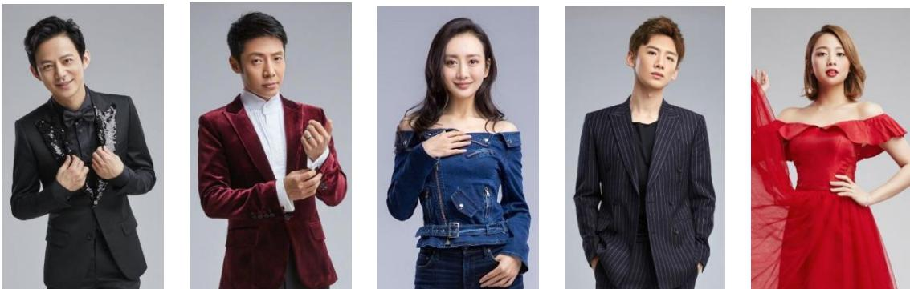
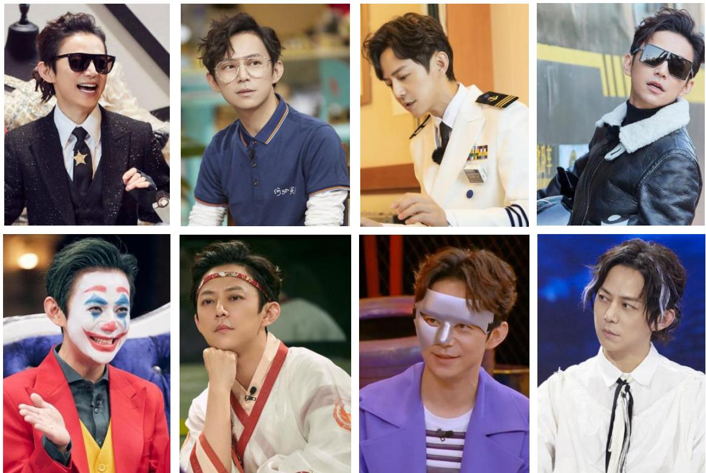
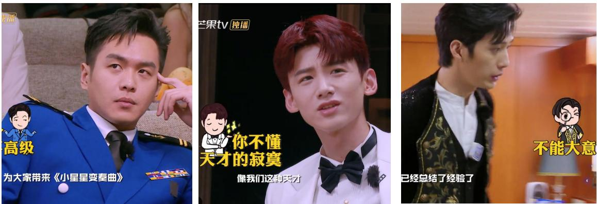
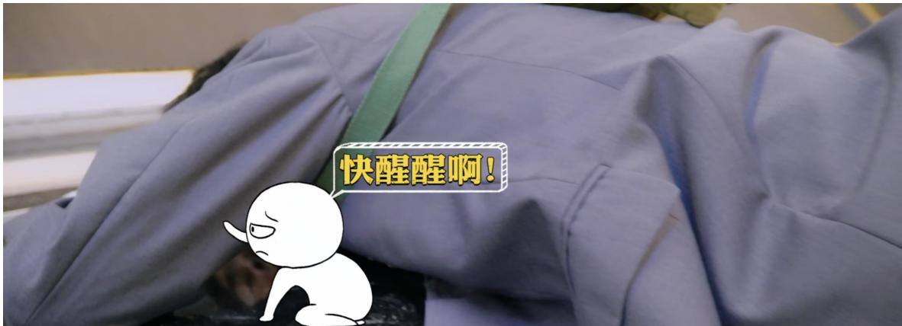
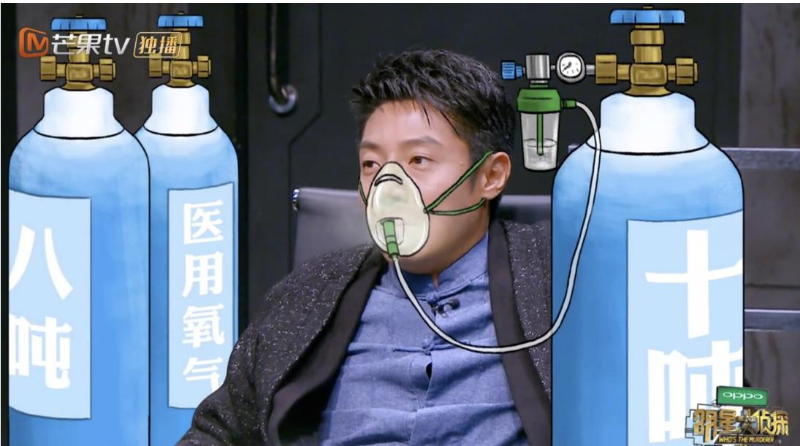
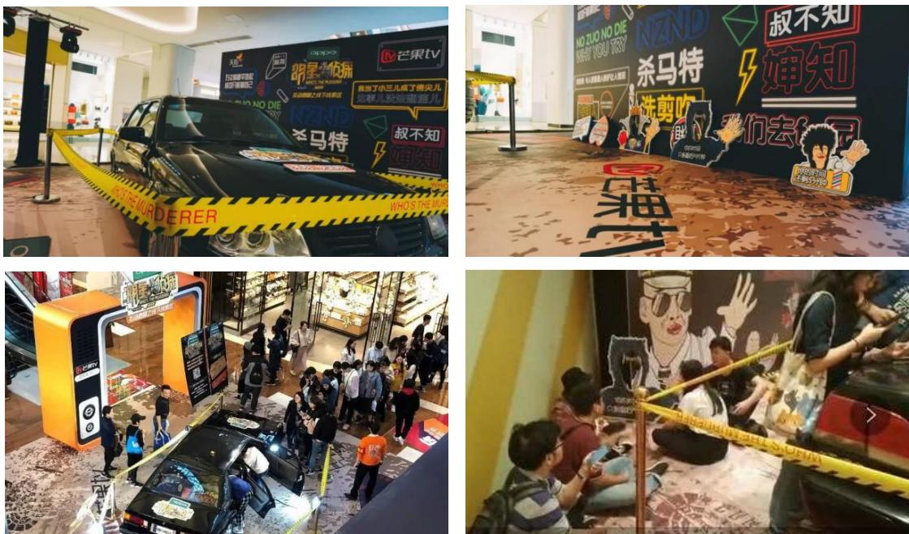
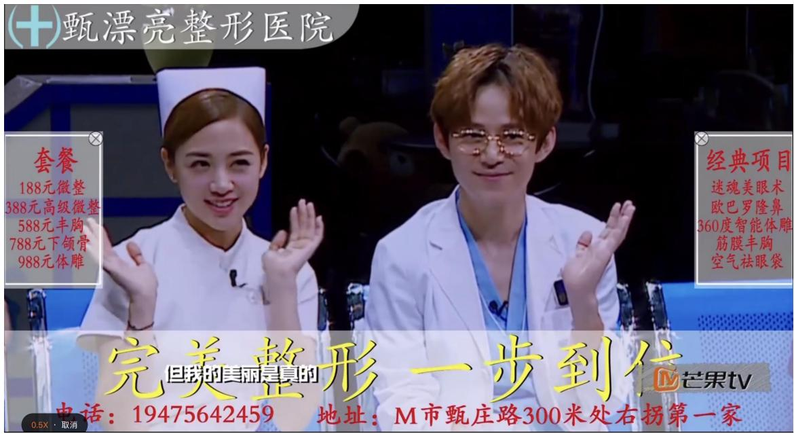
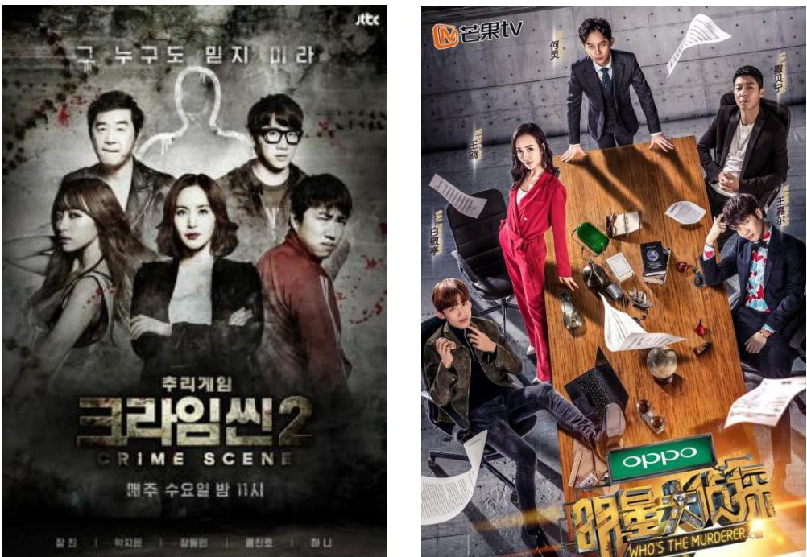
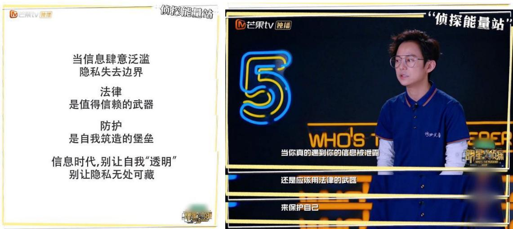
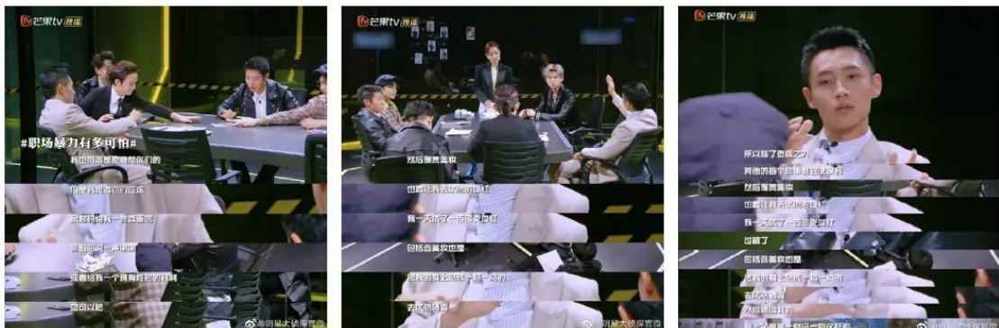

# 硕士学位论文

“5W”视角下的推理真人秀《明星大侦探》节目研究

学科专业： 戏剧与影视学研究方向： 播音与主持艺术作者姓名： 曹秋敏指导教师： 宫兆敏 教授

# 硕士学位论文

# “5W”视角下的推理真人秀《明星大侦探》节目研究

硕士研究生：曹秋敏导 师：宫兆敏 教授学科专业：戏剧与影视学答辩日期：2020年5月授予学位单位：哈尔滨师范大学

# A Thesis Submitted for the Degree of Master

# RESEARCH ON THE REASONING REALITY SHOW STAR DETECTIVE FROM THE PERSPECTIVE OF "5W"

Candidate : Cao Qiumin Supervisor : Prof. Gong Zhaomin Speciality : Drama and film studies Date of Defence : May,2020 Degree-Conferring-Institution :Harbin Normal University

# 目录

摘要.   
Abstract..

# 第一章绪论..

# 一、研究背景与意义.

（一）研究背景..  
（二）研究意义.

# 二、研究现状与理论基础..

（一）研究现状...  
（二）理论基础..

三、研究方法与创新之处. 3

（一）研究方法. 3（二）创新之处.

# 芎二章推理真人秀及《明星大侦探》节目概述. 4

# 一、推理真人秀节目概述. 4

（一）推理真人秀节目的界定..（二）推理真人秀节目的缘起与发展. 4

二、推理真人秀《明星大侦探》节目概述.

（一）节目定位. 6（二）游戏规则. 6（三）环节设置.

# 三、《明星大侦探》节目的样本意义.

（一）高认可度具备代表性..（二）超越原版彰显创新性. 8（三）价值导向体现责任感. 8

四、《明星大侦探》节目研究的样本选取与编码..

（一）样本选取.. 9（二）样本编码.

# 第三章“5W”视角下的推理真人秀《明星大侦探》节目要素分析. 12

一、传播主体分析.. 12

（一）用心打磨的编导团队. 12  
（二）双重角色的明星玩家.. 14  
（三）助力节目的素人嘉宾.. .17  
（四）多元构成的主持人组合. .19

# 二、传播内容分析.. .20

（一）正能量的节目题材. .20  
（二）悬疑烧脑的剧情设置.. .21  
（三）沉浸式的舞台设置.. .23  
（四）独具特色的视听效果. .26

# 三、传播媒介分析.. .29

（一）发挥芒果独播优势. .29  
（二）打造线上传播矩阵.. 30  
（三）开展线下宣传活动. .31

# 四、传播对象分析. .33

（一）受众群体构成.. ..33  
（二）受众需求分析. 34

# 五、传播效果分析.. 37

（一）认知层面—获知与认同.. .37  
（二）心理态度层面—接受与共鸣. .38  
（三）行为层面——点播、参与和购买. ..39

# 第四章《明星大侦探》对我国真人秀节目发展的启示.. .41

# 一、创新超越 打破引进魔咒. .41

（一）节目风格的创新.. ..41  
（二）嘉宾选择的创新. .42  
（三）节目题材的创新. ..42  
（四）灯光置景的创新. ..43  
（五）后期特效的创新. ..43

# 二、打造独特 IP- 规避同质现象. .44

（一）精准独特的定位. ..44  
（二）无法复制的案情.. .45  
（三）多维立体的互动. ..45  
（四）独具魅力的衍生节目 ..46

三、主打“原生”- -开创广告营销新模式. .47

（一）原生口播广告.. ..47   
（二）原生植入广告. .47   
（三）原生视频广告. ..48

四、注重责任—正确价值引导.. 49

（一）节目内的价值引导构建.. .49  
（二）节目外的价值引导延伸. .52  
结语.. .54  
参考文献.. ..5  
攻读硕士学位期间所发表的学术论文. .58  
哈尔滨师范大学学位论文原创性声明. ..59  
哈尔滨师范大学学位论文版权使用授权书. .59  
致谢... .60

# 摘要

近年来，国内真人秀市场剽窃、抄袭之风十分严重，节目的同质化、粗劣化致使大多数季播真人秀节目都难以逃脱口碑和收视逐季衰减的命运，而《明星大侦探》作为我国首档推理真人秀节目，从第一季横空出世到第五季完美收官，收视持续走高，总播放量已达147.8亿，豆瓣评分也分始终保持在9分左右，而且人气和口碑都超越了其韩国原版，更是凭借强烈的社会责任感，赢得了业界和官方的认可，使其成为一档现象级真人秀节目，具有很高的研究价值。

为了全面、深入地分析和解读推理真人秀《明星大侦探》节目的成功之道，本文以著名传播学者拉斯韦尔提出的“5W”传播模式作为理论基础，运用理论论述与案例分析相结合的方法，对《明星大侦探》节目的传播主体、传播内容、传播媒介、传播对象以及传播效果5个要素进行了多维度、系统化的分析，深入探讨其成功背后的传播特征。

本文通过对《明星大侦探》节目的“5W”视角分析，总结出其传播模式能够带给我国真人秀节目的启示：依靠强大的创新能力，实现超越原版的神话；秉持先进的IP打造理念，规避同质化现象的发生；将品牌特色与节目内容进行高度融合，开启原生广告新模式；构建正确的价值导向，体现社会价值与文化价值。

《明星大侦探》作为国内真人秀节目的头部IP，在行业内具备案例的典型性和代表性，希望在“5W”视角下对其进行的节目研究能够为我国真人秀节目的未来发展提供有益的借鉴。

关键词推理真人秀；明星大侦探；节目；传播

# Abstract

In In recent years, plagiarism is very serious in the domestic reality show market. The homogenization and crudeness of the programs make it difficult for most of reality shows to escape the fate of attenuation of public praise and audience. However, as the first detective reality show in China,“Who's the murderer” has soared its popularity and public praise from the first season to the fifth season, with a total of 14.78 billion views. Its Douban rating has also remained at around 9. Besides, its popularity and public praise both surpass its original Korean version, and it has won the recognition of the industry and the government by virtue of its strong sense of social responsibility, making it a phenomenal reality show with high research value.

In order to comprehensively analyze the success of “Who's the murderer", this paper takes the "5W" communication mode proposed by the famous communication scholar Laswell as the theoretical basis, makes a multi-dimensional and systematic analysis on the five essential elements of communication, including subject, content, medium, object and effect. Based on the analysis of the 5W perspective of “Who's the murderer, this paper summarizes the enlightenment that its communication mode can bring to Chinese reality shows: Basing on its strong innovation ability, it has achieved the myth of surpassing the original version. Adhering to the advanced IP creation concept, it avoids the occurrence of homogenization by precise positioning, unique cases, multi-dimensional interaction and promotion of derivative products. Integrating the brand features are with the program content, it has creates a new mode of native advertising. Constructing the correct value orientation, it has reflected social value and cultural value.

As the head IP of domestic reality shows,“Who's the murderer” is typical and representative in the industry. Hoping that the program research based on the perspective of “5W” can provide useful reference for the future development of Chinese reality shows

Key words:Reasoning reality show; Who's the murderer; Program; Communication

# 第一章绪论

# 一、研究背景与意义

# （一）研究背景

近年来，在国内众多明星真人秀节目中，有一种现象级节目类型异军突起，那就是“推理真人秀”节目。这类节目改变了人们对以往很多真人秀节目空洞低俗、审美扭曲的印象，为受众开启了悬疑、烧脑的神奇之旅，因而大受欢迎，其中最具代表性的就是芒果TV推出的《明星大侦探》节目。作为国内首档推理真人秀节目，《明星大侦探》以其“悬疑”的案情设计、“鲜明”的人物角色、“搞笑”的后期特效、“正能量”的价值引导而大受欢迎，开播五季以来，收视持续走高，总播放量已达147.8亿，豆瓣均分更是高达9.1分。《明星大侦探》不仅做到了长期“保鲜”，而且口碑爆棚，打破了长期以来引进节目国外版一边倒好评的魔咒，收视和口碑都超越了韩国原版《犯罪现场》，这种突破无疑会对我国推理真人秀节目的发展产生积极的影响，进而为整个业界提供可借鉴之处。

# （二）研究意义

笔者查阅了大量相关文献，通过对文献的整理与总结可以看出，目前，学界对于“推理真人秀节目”的研究成果相对较为匮乏。在现有文献较少的实际情况下，本文以推理真人秀《明星大侦探》节目作为研究对象，具备理论和现实双方面的意义与价值。理论方面，对推理类真人秀节目进行概念的梳理与发展现状的总结，有利于对这一全新的真人秀节目类型进行定位与归类；现实方面，对《明星大侦探》节目进行全面分析，并且总结其成功的主要经验，可以为我国真人秀节目的未来发展提供有益的借鉴与启示，有助于媒体从业者在网络化的新形势下，制作出更多可以体现社会价值与文化价值的真人秀节目，以满足受众的多方面需求，并以此促进文化产业的发展。

# 二、研究现状与理论基础

# （一）研究现状

在以往的真人秀节目类型中，并没有“推理类”这一类型，因此，国内外学界对于“推理真人秀节目”这一对象的研究极少。

国外真人秀节目发展的起步较早，但从已有的文献资料来看，国外真人秀节目的研究主要集中于真人秀节目对传媒行业发展的促进，及其对受众、文化、社会等方面的影响的探讨上，比如 Anita Biressi,Heather Nunn 的《Reality TV:Realismand Revelation》等。目前国外对于推理真人秀节目尚无系统性研究。

目前，国内关于推理类节目的综合研究的文章只有刘建萍的硕士论文《中国推理类综艺节目研究》一篇，文章以推理类综艺节目为研究对象，对我国推理类综艺节目的缘起、发展、文本等方面进行了分析，总结了推理类综艺节目的发展过程，分析了其发展中存在的问题，并对这类节目的未来发展提出了建议。

关于《明星大侦探》的研究文章比较多，主要以内容策划、叙事手法、视听语言等单方面内容为主。比如李丹的《推理游戏综艺真人秀<明星大侦探>叙事研究》运用叙事学相关原理，对《明星大侦探》节目的叙事结构、叙事话语、叙事内容等方面进行了深入研究；胡游的《<明星大侦探>视听语言的功能研究》从受众和媒介生产者两个角度队《明星大侦探》的视听语言的功能进行了论述；秦扬、万晔儒的《浅析剧情化模式下综艺的剧情架构和角色设定—一以<明星大侦探>为例》以剧情化为切入点，对《明星大侦探》节目的角色设定、剧情架构以及叙事策略进行了详解；潘紫菱、戴程程的《角色、场景与剧本：网络综艺节目<明星大侦探>第四季的受众认同分析》将《明星大侦探》第四季作为研究对象，对节目的角色、场景与剧本等元素进行剖析并探讨受众认同原因。目前尚且没有从传播学角度出发，对于推理真人秀《明星大侦探》节目进行的全面性研究。

# （二）理论基础

本研究的理论基础是“5W”传播模式”，也叫“5W”理论。

传播学四大奠基人之一，美国著名传播学者哈罗德·拉斯韦尔，在1948 年发表的《社会传播的结构与功能》一文中，明确提出了传播过程及其五个基本构成要素：谁（Who） $\twoheadrightarrow$ 说了什么（Says What） $\twoheadrightarrow$ 通过什么渠道（InWhich Channel）$\twoheadrightarrow$ 对谁（ToWhom） $\twoheadrightarrow$ 取得了什么效果（WithWhatEffect）。这就是著名的“5W”传播模式，五个清晰而简明的“W”概括了传播过程的五个要素，是传播过程模式中的经典，奠定了传播学研究的五大基本内容。

本文将以传播学的“5W”理论为基础，对《明星大侦探》节目的传播主体、传播内容、传播媒介、传播对象、传播效果五个要素进行多维度地分析与总结，以探讨推理《明星大侦探》节目成功的经验，为我国真人秀节目的发展提供借鉴与启示。

# 三、研究方法与创新之处

# （一）研究方法

科学的研究方法，能够使研究所得出的结论更加严谨。本文将主要运用以下两种较为科学有效的研究方法：

# 1、文献研究法

将大量与推理真人秀和《明星大侦探》节目相关的文献资料和网络信息进行阅读、整理，并加以归纳、总结及分析，深入挖掘推理真人秀《明星大侦探》节目获得成功的原因。

# 2、个案研究法

本文以《明星大侦探》作为推理真人秀节目的个案代表，对其五季60 期节目的内容进行全面的梳理和总结，并对其涉及的传播媒介和引发的互动话题等进行全面的分析与探讨。

# （二）创新之处

第一，选题较为新颖。由于推理真人秀节目属于新兴的节目类型，目前学界尚无对其进行较为系统性研究的成果，本研究在理论上具有一定的先行价值。

第二，研究视角较为全面。通过查阅文献资料，笔者发现，虽然近几年已经有学者将《明星大侦探》节目作为研究对象，但大多都只是针对这档节目的某一方面进行探讨，还没有对其进行多角度、全面性地分析与研究，所以本文运用“5W”理论对该节目的传播主体、内容、媒介、受众和效果五个方面展开分析，视角全面。

第三，应用性较强。在我国，推理真人秀节目处在发展初期，本文立足于其节目的系统性研究，可以更好地为我国真人秀节目的发展提供借鉴和启示，因而体现了较强的实用价值。

# 第二章推理真人秀及《明星大侦探》节目概述

# 一、推理真人秀节目概述

# （一）推理真人秀节目的界定

关于“推理”，《辞海》给出的定义为“推理亦称‘推论'，是由一个或一组命题（前提）推出另一命题（结论）的思维模式[1]。”

关于“真人秀节目”，国内早期对其定义为“自愿参与者在规定情境中，为了预先给定的目的，按照特定的规则所进行的参与行为的真实记录和艺术加工[2]”尹鸿教授还指出：“真人秀具备七个关键元素：自愿参与者、竞争行为、真实记录、规定情境、目的、规则和艺术加工。”

通过对“推理”和“真人秀节目”概念的梳理与整合，并结合现阶段中外推理真人秀节目的特征，笔者将“推理真人秀节目”界定为：自愿参与者在特定的推理情境中，以实现预设的竞争目标为目的，按照一定规则，通过已知的线索对人物或事件进行分析与推理的真实记录和艺术加工。

# （二）推理真人秀节目的缘起与发展

# 1、国外推理真人秀节目的发展概况

1999 年，荷兰推出的《老大哥》史开真人秀节目之先河，给受众和业界都带来了惊喜与启发。随着这一节目形态在全球迅速蹄红并趋向多元化，推理真人秀节目在欧美和日韩等推理文学积淀深厚，且经济发展水平较高的地区迅速发展、成熟，并已经形成了独特的节目模式，获得了受众的认可。

近年来，为了满足受众的不同审美需求，国外推理真人秀节目不断创新，推出了密室逃脱类、生存推理类、角色扮演类等多种类型。这些节目都有一个共同的特点，那就是互动性极强，受众感觉自己不再是单纯的节目观看者，而是成为了节目的参与者。比如，日本富士TV的《是谁在说谎》、美国广播公司的《谁是真凶》、韩国JTBC 的《犯罪现场》等都让全世界的观众过了一把侦探瘾，自然也都取得了非常高的人气和收视率。

# 2、我国推理类综艺节目的发展概况

我国推理真人秀节目的产生得益于两个方面的双重影响，那就是国外推理真人秀节目的迅猛发展和我国法制节目的收视热潮，二者共同形成了我国推理真人秀节目产生的强大背景。2011年江苏卫视的《非常了得》、2013年央视综艺频道的《开门大吉》、2015 年战旗TV的《LyingMan》以及江苏卫视的《蒙面唱将猜猜猜》、浙江卫视的《星星的密室》等都具有推理真人秀节目的雏形，并收获了较好的口碑。

而我国真正意义上的推理真人秀节目的出现是在2016年，芒果TV引进韩国推理真人秀节目《犯罪现场》版权，推出了自制明星角色扮演推理真人秀节目《明星大侦探》，填补了我国推理真人秀节目的市场空白。作为一种新兴的节目类型，对国外优秀节目版权的引进，能够规避一定的市场风险，提高节目的播放量和影响力。借助《犯罪现场》的播出热度，以及主创团队精良的本土化改造，《明星大侦探》一经推出便赢得了超高的人气，收视率一路飙升，占据了当年真人秀节目排行榜的首位。至今，《明星大侦探》已播出五季，不但收视不减，吸引了无数粉丝，更是获得了比其原版《犯罪现场》更好的口碑，豆瓣评分一直保持在9分左右。

表 2-1《明星大侦探》节目各季播出时间统计表  

<table><tr><td rowspan=1 colspan=1>季别</td><td rowspan=1 colspan=1>播放平台</td><td rowspan=1 colspan=1>首播日期</td><td rowspan=1 colspan=1>收官日期</td></tr><tr><td rowspan=1 colspan=1>第一季</td><td rowspan=5 colspan=1>芒果TV独播</td><td rowspan=1 colspan=1>2016年3月27日</td><td rowspan=1 colspan=1>2016年6月23日</td></tr><tr><td rowspan=1 colspan=1>第二季</td><td rowspan=1 colspan=1>2017年1月13日</td><td rowspan=1 colspan=1>2017年4月14日</td></tr><tr><td rowspan=1 colspan=1>第三季</td><td rowspan=1 colspan=1>2017年9月22日</td><td rowspan=1 colspan=1>2018年1月26日</td></tr><tr><td rowspan=1 colspan=1>第四季</td><td rowspan=1 colspan=1>2018年10月26日</td><td rowspan=1 colspan=1>2019年1月25日</td></tr><tr><td rowspan=1 colspan=1>第五季</td><td rowspan=1 colspan=1>2019年11月8日</td><td rowspan=1 colspan=1>2020年2月14日</td></tr></table>

# 二、推理真人秀《明星大侦探》节目概述

《明星大侦探》是我国首档推理真人秀节目，该节目由芒果TV自制，节目版权引自韩国JTBC 的推理真人秀节目《犯罪现场》，但主创团队成功对其进行了本土化改造，使其以“ $3 0 \%$ 跌宕剧情十 $4 0 \%$ 娱乐搞笑十 $3 0 \%$ 智能推理[3]”的黄金比利和超强的互动性，大受中国观众喜爱。

《明星大侦探》2016年3月开播，在芒果TV平台独家播出。截至2020 年1月17日，《明星大侦探》共推出五季60 期，总播放量达,147.8亿，五季豆瓣评分平均9.1分。在收获了超好的口碑的同时，《明星大侦探》节目又凭借精良的制作和强烈的社会责任感赢得了业界和官方的认可，上榜 2016中国泛娱乐指数盛典“网络节目榜"top10[4]；在国家新闻出版广播电视总局主办的TV地标（2017)中国电视媒体综合实力大型调研评选中，夺得年度制作机构优秀节目奖[5]；在中国电视艺术家协会主办的2017中国综艺峰会年度匠心盛典中获得“年度匠心编剧”节目称号[6]。

# （一）节目定位

《明星大侦探》定位为中国“首档明星角色扮演推理真人秀”，内容包括“ $3 0 \%$ 跌宕剧情 $+ 4 0 \%$ 娱乐搞笑 $+ 3 0 \%$ 智能推理”，以“烧脑剧情”与“悬疑推理”为节目主打，同时兼顾娱乐性。《明星大侦探》结合推理类电视剧与真人秀节目的特点，激发明星嘉宾之间智商、情商与艺能的较量，以逻辑推理为内核，以娱乐搞笑为外壳，让观众在娱乐中体验到烧脑的快感的同时，也在一个个生动的案例中体会出生活的哲理。《明星大侦探》节目宣传语：大白吧，真相！

# （二）游戏规则

《明星大侦探》的游戏规则与英国经典图版游戏“妙探寻凶”和韩国推理真人秀《犯罪现场》相类似，每期以一个全新的案件为开端展开故事，游戏玩家以不同的游戏角色身份在规定的时间内，对特定的“犯罪现场”进行搜证，并展开讨论和推理，最后通过投票的方式检举嫌疑人。

游戏角色：“侦探”、“嫌疑人”、“真凶”。每期节目都会邀请6位明星玩家参与游戏，他们通过抽取角色卡，随机产生1名“侦探”、4名“嫌疑人”以及1名“真凶”。

游戏任务：“侦探”通常与案情关系不大，他的任务是带领玩家搜索证据、分析案情、抓出真凶；“嫌疑人”的任务是在洗脱自身嫌疑的同时寻找线索，检举真凶；“真凶”则必须隐藏好自己的身份，并嫁祸给其他嫌疑人，只有“真凶”可以说谎。

游戏目标：检举成功，抓到“真凶”，其他所有玩家获胜；检举失败，“真凶”逃脱，则“真凶”获胜。

游戏奖励：游戏设立侦探酬金，抽取角色卡时，每位玩家获得一根金条，如果抓住“真凶”，投票正确的所有玩家保留金条，其余玩家则需归还金条，“侦探”若两次都投对，可额外获得一根金条；如果“真凶”获胜，其余玩家需将所有金条全部交给“真凶”。（第二季起）

《明星大侦探》作为一档推理真人秀节目，其主要核心是便悬疑推理，明确的游戏规则可以强化节目的戏剧冲突，成为悬疑推理的助力。

# （三）环节设置

《明星大侦探》节目以现场搜证、集中推理、票选“真凶”为主要脉络，设置了紧密的游戏环节。这些环节按时间顺序设置，除特殊案件外，环节不可跳过，

亦不可逆转。五季节目中，节目组根据观众反响对节目环节进行了几次调整，笔者第四、五季固定环节进行了整理，见表2-2。

表 2-2《明星大侦探》节目游戏环节统计表  

<table><tr><td rowspan=1 colspan=1>排序</td><td rowspan=1 colspan=1>环节</td><td rowspan=1 colspan=1>简介</td></tr><tr><td rowspan=1 colspan=1>一</td><td rowspan=1 colspan=1>不在场证明阐述</td><td rowspan=1 colspan=1>玩家逐个进行自我介绍，并说明案发前后自己的时间线。</td></tr><tr><td rowspan=1 colspan=1>二</td><td rowspan=1 colspan=1>第一轮现场搜证</td><td rowspan=1 colspan=1>玩家分两组进行搜证，每人可拍摄十张证据照片，限时十分钟。</td></tr><tr><td rowspan=1 colspan=1>三</td><td rowspan=1 colspan=1>第一次集中推理</td><td rowspan=1 colspan=1>侦探梳理人物关系图；六名玩家轮流展示证据照片并展开讨论。</td></tr><tr><td rowspan=1 colspan=1>四</td><td rowspan=1 colspan=1>侦探投票</td><td rowspan=1 colspan=1>侦探根据已有证据和线索，经过推理非公开投出第一票。</td></tr><tr><td rowspan=1 colspan=1>五</td><td rowspan=1 colspan=1>第二轮现场搜证</td><td rowspan=1 colspan=1>六名玩家再次进入现场进行集体搜证；侦探对嫌疑人进行搜身。</td></tr><tr><td rowspan=1 colspan=1>六</td><td rowspan=1 colspan=1>侦探一对一审问</td><td rowspan=1 colspan=1>侦探在审问室单独审问“嫌疑人”，以获取更多信息。</td></tr><tr><td rowspan=1 colspan=1>七</td><td rowspan=1 colspan=1>第二次集中推理</td><td rowspan=1 colspan=1>六名玩家再次进行集中讨论并进行总结性推理。</td></tr><tr><td rowspan=1 colspan=1>八</td><td rowspan=1 colspan=1>第三轮现场搜证</td><td rowspan=1 colspan=1>玩家单独进入现场进行深度搜证，证据不可分享。</td></tr><tr><td rowspan=1 colspan=1>九</td><td rowspan=1 colspan=1>单独投票</td><td rowspan=1 colspan=1>六名玩家入投票间，进行非公开投票。</td></tr><tr><td rowspan=1 colspan=1>+</td><td rowspan=1 colspan=1>真相公开</td><td rowspan=1 colspan=1>宣布玩家得票情况，并公布“真凶”。</td></tr></table>

# 三、《明星大侦探》节目的样本意义

《明星大侦探》作为我国首档推理真人秀节目，以烧脑的剧情、缜密的思维开创了国内推理类真人秀节目的先河，填补了市场空白。节目一经播出便取得了傲人的收视战绩，并在竞争激烈的真人秀节目领域异军突起、独树一帜，从第一季到第五季，始终保持旺盛的生命力，四年来并无同类型节目出现。选择《明星大侦探》作为本文的样本意义，在于它不但有着超高的受众认可度，而且在原版的基础上进行了本土化创新，同时还不遗余力的对受众进行正确的价值引导。《明星大侦探》这档具备代表性、创新性和责任感的节目，可以为我国真人秀节目的发展提供借鉴与启示。

# （一）高认可度具备代表性

受众认可度一般是指观众对节目的喜爱程度，而衡量真人秀节目受众认可度的重要标准当然是节目的播放量、热度和口碑了,而《明星大侦探》无疑是高播放量、高热度、高口碑的三高节目。

《明星大侦探》自2016年3月第一季上线，到2020 年1月第五季收官，共播出 60 期节目，总播放量已达147.8亿，其中第一季12.9亿、第二季23.8亿、第三季 38.5亿、第四季 26.7亿、第五更是高达45.9亿；高收视也带动了节目的高热度，截至第五季收官，《明星大侦探》微博超话阅读量达97.5亿，节目相关话题多次登顶微博热搜榜；在获得持续关注的同时，该节目也得到极高的口碑，五季豆瓣评分平均达到了9.1分，打破了真人秀节目N代口碑和收视不断下滑的魔咒，在众多真人秀节目中位列前茅。

# （二）超越原版彰显创新性

《明星大侦探》的节目创意及框架主要来源于韩国推理真人秀节目《犯罪现场》，《犯罪现场》节目的选材均来源于真实案件，参与嘉宾多为具有专业背景的律师、警察等，为了最大限度地还原“犯罪现场”，节目灯光昏暗，气氛恐怖压抑。

《明星大侦探》节目除采用了原版节目的框架和形式外，在其它方面都进行了创新性的本土化改造。节目组并没有采用原版节目的案情故事，而是按照国内观众的喜好下大力气对故事背景、结构、情节、角色等进行了原创；考虑到节目的受众群体为年轻人，《明星大侦探》节目减少了原版节目严肃压抑的气氛，利用有趣的字幕、搞笑的表情包、吐槽弹幕等方式增加了娱乐搞笑的成分；节目组邀请了具有一定推理能力的明星嘉宾，不但带来了一众粉丝，还因其具有表演和综艺功底，为节目增加了戏剧性和娱乐性；另外，《明星大侦探》在深耕节目内容的同时，十分注重节目场景的打造，在道具、服装等方面完胜《犯罪现场》。

经过本土化创新的《明星大侦探》节目通过五季的播出不仅获得了高播放量，也收获了极高的人气，国内口碑已经远远超过其韩国原版《犯罪现场》，堪称业界典范。

# （三）价值导向体现责任感

一档真人秀节目的意义主要在于给观众带来娱乐之外的引导和思考。作为推理真人秀节目，《明星大侦探》的受众群体以年轻人为主，包括青少年，这一群体社会经验较少，价值体系也尚未成熟，既容易被正能量的内容所感染，也容易受到不良信息的误导。通过节目向他们传递正确的、积极向上的价值观，是一档节目社会责任感的体现。

《明星大侦探》在选题上注重社会热点问题，涉及网络暴力、自然资源保护、校园霸凌、理性整容、微笑抑郁症等多个方面，引起了强烈的社会共鸣；在节目中，嘉宾撒贝宁不断地为观众普及法律知识，强调守法的重要性；从第四季起，节目还推出了侦探能量站，明星嘉宾与观众探讨节目中涉及的法律和社会问题，并请来相关领域的嘉宾对观众进行正确的价值引导。

另外，节目组一直强调每期节目都有Bug,其作案过程在现实生活中不可能被重现，避免模仿作案。节目中更有相当一部分案件是以一些超现实的形式呈现出来的，比如“记忆删除”、“灵魂交换”、“梦境重现”等等，既满足了侦探迷们的推理需求，又有效避免了效仿的负面作用。

# 四、《明星大侦探》节目研究的样本选取与编码

# （一）样本选取

本研究以《明星大侦探》已经播出的五季60 期节目为样本，其中所统计期数均为正片数，即案件数，不包括先导片、特辑、颁奖典礼等。举例论证时，选取其中具有代表性的节目样本作为例证，因节目每季都会进行调整和改进，为更具代表性，在研究中会尽量选取近两年播出的第四季和第五季的样本进行分析。分析样本时出现的带引号的名字，如“何律师”“撒金刚”“贾设计”“欧冒险”等均为节目中的剧情角色名称。

# （二）样本编码

为方便表述，现将《明星大侦探》五季共60 份样本进行编码。第一、二、三、四、五季分别用A、B、C、D、E表示；第一个案件用01表示，第二个案件用 02表示，第二个案件用03表示，以此类推。例如第五季第一案《海上钢琴师》编码为：E01，在节目中表述为：E01《海上钢琴师》，具体样本编码见表2-3：

表2-3明星大侦探节目研究编码表  

<table><tr><td rowspan=1 colspan=1>季别</td><td rowspan=1 colspan=1>期数</td><td rowspan=1 colspan=1>片名</td><td rowspan=1 colspan=1>编码</td></tr><tr><td rowspan=12 colspan=1>第一季</td><td rowspan=1 colspan=1>第1期</td><td rowspan=1 colspan=1>网红校花的坠落</td><td rowspan=1 colspan=1>A01</td></tr><tr><td rowspan=1 colspan=1>第2期</td><td rowspan=1 colspan=1>冲不上的云霄</td><td rowspan=1 colspan=1>A02</td></tr><tr><td rowspan=1 colspan=1>第3期</td><td rowspan=1 colspan=1>男团鲜肉的战争</td><td rowspan=1 colspan=1>A03</td></tr><tr><td rowspan=1 colspan=1>第4期</td><td rowspan=1 colspan=1>人鱼之泪</td><td rowspan=1 colspan=1>A04</td></tr><tr><td rowspan=1 colspan=1>第5期</td><td rowspan=1 colspan=1>消失的新郎</td><td rowspan=1 colspan=1>A05</td></tr><tr><td rowspan=1 colspan=1>第6期</td><td rowspan=1 colspan=1>疯狂的郁金香</td><td rowspan=1 colspan=1>A06</td></tr><tr><td rowspan=1 colspan=1>第7期</td><td rowspan=1 colspan=1>请回答1998</td><td rowspan=1 colspan=1>A07</td></tr><tr><td rowspan=1 colspan=1>第8期</td><td rowspan=1 colspan=1>都是漂亮惹的祸</td><td rowspan=1 colspan=1>A08</td></tr><tr><td rowspan=1 colspan=1>第9期</td><td rowspan=1 colspan=1>决战足球之夜</td><td rowspan=1 colspan=1>A09</td></tr><tr><td rowspan=1 colspan=1>第10期</td><td rowspan=1 colspan=1>英雄不联盟</td><td rowspan=1 colspan=1>A10</td></tr><tr><td rowspan=1 colspan=1>第11期</td><td rowspan=1 colspan=1>帅府有鬼</td><td rowspan=1 colspan=1>A11</td></tr><tr><td rowspan=1 colspan=1>第12期</td><td rowspan=1 colspan=1>命运的巨轮</td><td rowspan=1 colspan=1>A12</td></tr><tr><td rowspan=2 colspan=1>第二季</td><td rowspan=1 colspan=1>第1期</td><td rowspan=1 colspan=1>公主嫁到</td><td rowspan=1 colspan=1>B01</td></tr><tr><td rowspan=1 colspan=1>第2期</td><td rowspan=1 colspan=1>唐人街传奇</td><td rowspan=1 colspan=1>B02</td></tr></table>

<table><tr><td colspan="2" rowspan="10"></td><td colspan="1" rowspan="1">第3期</td><td colspan="1" rowspan="1">午夜列车</td><td colspan="1" rowspan="1">B03</td></tr><tr><td colspan="1" rowspan="1">第4期</td><td colspan="1" rowspan="1">博物馆奇妙夜</td><td colspan="1" rowspan="1">B04</td></tr><tr><td colspan="1" rowspan="1">第5期</td><td colspan="1" rowspan="1">周五见</td><td colspan="1" rowspan="1">B05</td></tr><tr><td colspan="1" rowspan="1">第6期</td><td colspan="1" rowspan="1">2046</td><td colspan="1" rowspan="1">B06</td></tr><tr><td colspan="1" rowspan="1">第7期</td><td colspan="1" rowspan="1">恐怖童谣</td><td colspan="1" rowspan="1">B07</td></tr><tr><td colspan="1" rowspan="1">第8期</td><td colspan="1" rowspan="1">恐怖童谣·下卷</td><td colspan="1" rowspan="1">B08</td></tr><tr><td colspan="1" rowspan="1">第9期</td><td colspan="1" rowspan="1">绝望的主妇</td><td colspan="1" rowspan="1">B09</td></tr><tr><td colspan="1" rowspan="1">第10期</td><td colspan="1" rowspan="1">花田醉</td><td colspan="1" rowspan="1">B10</td></tr><tr><td colspan="1" rowspan="1">第11期</td><td colspan="1" rowspan="1">疯狂马戏团</td><td colspan="1" rowspan="1">B11</td></tr><tr><td colspan="1" rowspan="1">第12期</td><td colspan="1" rowspan="1">收官派对</td><td colspan="1" rowspan="1">B12</td></tr><tr><td colspan="2" rowspan="12">第三季</td><td colspan="1" rowspan="1">第1期</td><td colspan="1" rowspan="1">酒店惊魂</td><td colspan="1" rowspan="1">C01</td></tr><tr><td colspan="1" rowspan="1">第2期</td><td colspan="1" rowspan="1">酒店惊魂ⅡI</td><td colspan="1" rowspan="1">C02</td></tr><tr><td colspan="1" rowspan="1">第3期</td><td colspan="1" rowspan="1">暗黑童话</td><td colspan="1" rowspan="1">C03</td></tr><tr><td colspan="1" rowspan="1">第4期</td><td colspan="1" rowspan="1">深夜麻辣烫</td><td colspan="1" rowspan="1">C04</td></tr><tr><td colspan="1" rowspan="1">第5期</td><td colspan="1" rowspan="1">NZND 之岁月无情</td><td colspan="1" rowspan="1">C05</td></tr><tr><td colspan="1" rowspan="1">第6期</td><td colspan="1" rowspan="1">末日蜜蜂</td><td colspan="1" rowspan="1">C06</td></tr><tr><td colspan="1" rowspan="1">第7期</td><td colspan="1" rowspan="1">又冲不上的云霄</td><td colspan="1" rowspan="1">C07</td></tr><tr><td colspan="1" rowspan="1">第8期</td><td colspan="1" rowspan="1">无忧客栈</td><td colspan="1" rowspan="1">C08</td></tr><tr><td colspan="1" rowspan="1">第9期</td><td colspan="1" rowspan="1">狼人前传</td><td colspan="1" rowspan="1">C09</td></tr><tr><td colspan="1" rowspan="1">第10期</td><td colspan="1" rowspan="1">仙梦昆仑</td><td colspan="1" rowspan="1">C10</td></tr><tr><td colspan="1" rowspan="1">第11期</td><td colspan="1" rowspan="1">又是漂亮惹的祸</td><td colspan="1" rowspan="1">C11</td></tr><tr><td colspan="1" rowspan="1">第12期</td><td colspan="1" rowspan="1">又是漂亮惹的祸ⅡI</td><td colspan="1" rowspan="1">C12</td></tr><tr><td colspan="2" rowspan="12">第四季</td><td colspan="1" rowspan="1">第1期</td><td colspan="1" rowspan="1">逃出无名岛</td><td colspan="1" rowspan="1">D01</td></tr><tr><td colspan="1" rowspan="1">第2期</td><td colspan="1" rowspan="1">逃出无名岛Ⅱ</td><td colspan="1" rowspan="1">D02</td></tr><tr><td colspan="1" rowspan="1">第3期</td><td colspan="1" rowspan="1">神秘来电</td><td colspan="1" rowspan="1">D03</td></tr><tr><td colspan="1" rowspan="1">第4期</td><td colspan="1" rowspan="1">NZND 回到未红时</td><td colspan="1" rowspan="1">D04</td></tr><tr><td colspan="1" rowspan="1">第5期</td><td colspan="1" rowspan="1">天堂公寓</td><td colspan="1" rowspan="1">D05</td></tr><tr><td colspan="1" rowspan="1">第6期</td><td colspan="1" rowspan="1">巨想谈恋爱</td><td colspan="1" rowspan="1">D06</td></tr><tr><td colspan="1" rowspan="1">第7期</td><td colspan="1" rowspan="1">魔法学校的秘密</td><td colspan="1" rowspan="1">D07</td></tr><tr><td colspan="1" rowspan="1">第8期</td><td colspan="1" rowspan="1">燃烧的玫瑰</td><td colspan="1" rowspan="1">D08</td></tr><tr><td colspan="1" rowspan="1">第9期</td><td colspan="1" rowspan="1">家有儿女</td><td colspan="1" rowspan="1">D09</td></tr><tr><td colspan="1" rowspan="1">第10期</td><td colspan="1" rowspan="1">奇幻游乐园</td><td colspan="1" rowspan="1">D10</td></tr><tr><td colspan="1" rowspan="1">第11期</td><td colspan="1" rowspan="1">头号玩家</td><td colspan="1" rowspan="1">D11</td></tr><tr><td colspan="1" rowspan="1"></td><td colspan="1" rowspan="1">第12期</td><td colspan="1" rowspan="1">头号玩家ⅡI</td><td colspan="1" rowspan="1">D12</td></tr><tr><td colspan="1" rowspan="12">第五季</td><td colspan="1" rowspan="1">第1期</td><td colspan="1" rowspan="1">海上钢琴师</td><td colspan="1" rowspan="1">E01</td></tr><tr><td colspan="1" rowspan="1">第2期</td><td colspan="1" rowspan="1">海上钢琴师ⅡI</td><td colspan="3" rowspan="1">E02</td></tr><tr><td colspan="1" rowspan="1">第3期</td><td colspan="1" rowspan="1">甄的不行街</td><td colspan="3" rowspan="1">E03</td></tr><tr><td colspan="1" rowspan="1">第4期</td><td colspan="1" rowspan="1">盘丝餐厅</td><td colspan="3" rowspan="1">E04</td></tr><tr><td colspan="1" rowspan="1">第5期</td><td colspan="1" rowspan="1">天台上的罪恶</td><td colspan="3" rowspan="1">E05</td></tr><tr><td colspan="1" rowspan="1">第6期</td><td colspan="1" rowspan="1">NZND 破冰谜案</td><td colspan="3" rowspan="1">E06</td></tr><tr><td colspan="1" rowspan="1">第7期</td><td colspan="1" rowspan="1">MGQ时尚风云</td><td colspan="3" rowspan="1">E07</td></tr><tr><td colspan="1" rowspan="1">第8期</td><td colspan="1" rowspan="1">X 学校杀人事件</td><td colspan="3" rowspan="1">E08</td></tr><tr><td colspan="1" rowspan="1">第9期</td><td colspan="1" rowspan="1">木偶复仇记</td><td colspan="3" rowspan="1">E09</td></tr><tr><td colspan="1" rowspan="1">第10期</td><td colspan="1" rowspan="1">探案唐人街</td><td colspan="3" rowspan="1">E10</td></tr><tr><td colspan="1" rowspan="1">第11期</td><td colspan="1" rowspan="1">北方慢车谋杀案I</td><td colspan="3" rowspan="1">E11</td></tr><tr><td colspan="1" rowspan="1">第12期</td><td colspan="1" rowspan="1">北方慢车谋杀案II、IⅢI</td><td colspan="3" rowspan="1">E12</td></tr></table>

# 注释：

[1］夏征农，陈至立.辞海[M].上海辞书出版社，2009:2301.

[2］尹鸿，冉儒学，陆红．娱乐旋风——认识电视真人秀[M].中国广播电视出版社,2006.

[3］芒果TV．《明星大侦探》：芒果TV大自制 悬疑内容“烧脑”不停[J].声屏世界·广告人.2016，04:150.

［4］“中国泛娱乐指数盛典”在京颁奖《火星情报局》等榜上有名 http://t.m.china.com.cn/convert/c_yTzaGL.html?bsh_bid $\equiv$ 1577795815.

[5］TV地标（2017）中国电视媒体综合实力大型调研成果发布 http://media.people.com.cn/n1/2017/1206/c14677-29690119.html.

[6］2017中国综艺峰会匠心盛典：每一个工种都在相依前行 https://www.sohu.com/a/209854758_549923.

# 第三章“5W”视角下的推理真人秀《明星大侦探》节目要素分析

著名传播学者拉斯韦尔认为，任何一个传播过程都包括如下五个要素：谁（Who) $\twoheadrightarrow$ 说了什么（Says What） $\twoheadrightarrow$ 通过什么渠道（InWhichChannel） $\twoheadrightarrow$ 对谁（ToWhom） $\twoheadrightarrow$ 取得了什么效果（WithWhatEffect)，这也就是“5W”要素，即传播学中所说的传播主体、传播内容、传播媒介、传播对象、传播效果]。任何一档节目从策划、制作、播出到被受众所认识、接受并引起反应都必须完成这五个要素，为了全面、深入地分析和解读推理真人秀《明星大侦探》节目的成功之道，为我国真人秀节目的未来发展提供借鉴，笔者将以传播学的“5W”视角，对《明星大侦探》节目的传播主体、传播内容、传播媒介、传播对象以及传播效果5个要素进行多维度、全面性的分析。

# 一、传播主体分析

传播主体是“5W”要素中的第一个“W”，是传播过程中的信息收集、加工、发出者。在推理真人秀《明星大侦探》节目中，传播主体主要包括编导团队、明星玩家、素人嘉宾以及主持人，他们共同参与节目的创作。

# （一）用心打磨的编导团队

《明星大侦探》自开播以来，已历经五季，然而粉丝量依旧不减，这档节目受到如此热捧，保持极高的播放量和口碑，与其节目编导团队的用心是分不开的。《明星大侦探》每期一个案子，时长约100分钟，从选题、筹备到录制完成，平均需要耗时三个月。可以说，每一期精彩节目的背后都是编导团队的用心打磨。

# 1、用心打磨剧本

《明星大侦探》的编剧构成较为多元，既有最专业的影视编剧、推理小说作家，也有节目组的编导、推理爱好者和节目粉丝，这在很大程度上保证了剧本的创新性和多样性。在节目的选题过程中，《明星大侦探》节目组邀请推理界的资深人士从众多的推理小说中进行筛选，同时还设立了专门的征名环节，将大众的评价与建议当做重要的参考因素。另外，《明星大侦探》在选题上还十分注重价值观的正确引导，几乎每一期都会结合社会热点问题，引发大众的理性思考。

经过严格的筛选后，被录用的选题进入剧本创作阶段。从角色设置、情节构思到形成完整的故事，每个剧本真正进行录制前往往会修改数百遍。如B07《恐怖童谣》的创意最初来自于粉丝，编导团队为了达到更好的节目效果，对原创进行了两三百个版本的修改才最终定稿，花费了将近4个月的时间，而《恐怖童谣》的原创作者唐欣也由粉丝变身成了节目组的专职编剧。

这样精雕细琢打磨的剧本，题材新颖，逻辑严密。每个案件的背景都依托于社会热点话题，并根据不同的剧情设置搭建场景、布置道具、准备服装，使案情得到完美的呈现。《明星大侦探》节目制片人、第一至三季总导演何忱说：“改稿是正常的，每一期的剧本都要反复磨，逻辑线越严谨花的时间越多!我们靠梦想在鼓励自己”[8]。

# 2、用心打磨逻辑

《明星大侦探》作为一档推理真人秀节目，推理的逻辑性同样重要，达成这一点，要靠编导团队的细心和用心。首先，为了使节目的逻辑性更加严密，节目组会邀请专业影视编剧及推理小说作家为其提供推理思路和新奇的诡计，并修复逻辑上的错漏；其次，节目组还会请教法医、警察、心理学家等相关领域的专业人士来解决一些专业问题，比如死亡原因、犯罪过程、心理活动，还包括哪些犯罪的细节不能呈现、如何避免模仿犯罪等。

另外，为了找出推理上的漏洞，每一期节目正式录制前，编导团队都会组织至少两场试玩会，对节目逻辑进行检查。第一场为“纸质版试玩会”，其方式有点像剧本杀，每个玩家拿着自己的剧本，通过纸面上的证据分析、讨论、推理，在这个过程中找出逻辑漏洞，进行修复；纸质版试玩结束后，进行“实景试玩会”，帮助节目组在逻辑上做最后的纠错。试玩玩家很多元，既有剧本杀、狼人杀、密室逃脱的高阶玩家，也有节目组的编导，还有其它娱乐节目的导演，以及媒体人和经纪人等等。实景试玩过程中，高阶试玩玩家不但能找出推理上的小漏洞，还能够和编导一起讨论复盘修正。

经过一系列精心打磨，编导团队才会最终确定一个逻辑较为严谨的故事架构，节目才会真正进入拍摄阶段。

# 3、用心打磨细节

《明星大侦探》节目拥有很多“二刷”、“三刷”，甚至“多刷”的忠实粉丝，很多人对节目中的案件、角色、道具等都如数家珍，这档节目之所以能够获得观众如此青睐，编导团队对节目细节的用心打磨功不可没。

首先，《明星大侦探》节目中，大多数“案件”的发生时间都是与播出时间相一致的，以 B04《博物馆奇妙夜》为例，这期节目是在 2017年2月17日与观众见面的，而节目中的案发时间也是这一天，正是这一细节的处理，使节目中的时间与观众的生活时间相同，大大拉近了节目与观众之间的距离，使其产生身临其境的感觉。但值得关注的是，该期节目的录制时间并不是2月17日，而是编导们在编写剧本时就进行了细节上的处理。

其次，编导团队对节目细节的打磨还体现在取名上。节目中角色的名字，比如“白读书”、“何患者”“撒微笑”等等，看上去十分随意，实则是精心设计的。首先，编导们会选取明星嘉宾的姓名中的一个字作为其在节目中的“姓”，比如何炅、王鸥、大张伟，在节目中分别姓“何”、“鸥”、“大”，这个“姓”一旦确定便不会轻易改变，无论他们在节目中扮演什么角色，都叫“何某某”、“鸥某某”、“大某某”，玩家们多为观众十分熟悉的明星，这样取名无疑会让观众产生亲切感，也使嘉宾们在录制时方便称呼；其次，角色名字的选择多来源于其职业和身份，比如“大机长”、“蓉护士”、“鬼学姐”、“魏公主”等，观众通过名字就很容易辨识节目中的角色及扮演者，不会对应错误；再次，节目中的一些未出场角色的名字还起到了娱乐搞笑的作用，比如从未露面的医生“梅毛冰”、特别有钱的老板“甄不行”、经常提供重要线索的“不重要的朋友”，还有非常不一般的“一般般杂志社”等，这些名字都在大笑之余给人留下深刻印象；另外，节目中的道具名称也很有讲究，像“一喷即晕药”、“昏睡丸”、“迷迷迷迷粉”之类，这样叫既让观众明白其作用，又避免了用真实药名容易产生的效仿行为。

另外，编导团队还利用嘉宾特点进行细节设计。作为当红流量小生，白敬亭爱鞋的形象深入人心。D01《逃出无名岛》中，白敬亭的剧本角色被设置为“潮鞋店店主”，在他的包里装满了鞋；EO6《NZND破冰谜案》中，相关线索竟然写在了“白RAP”的鞋垫上。此外，编导们还多次在白敬亭所饰演角色的房间里摆放很多鞋子，有效利用了嘉宾的自身特点，让观众迅速获得综艺点。

编导团队是一档真人秀节目的灵魂所在，其作用贯穿了节目的整个过程。不但要进行节目的策划、剧本的编写、后期的制作，还要了解每位参与者的性格，提前带入参与者视角，正式录制中，现场导演需要全程关注参与者的行动，设计剪辑思路，完善节目内容。

# （二）双重角色的明星玩家

尹红教授曾提出真人秀节目的首要元素就是“参与者一一故事主体和观众收看客体的人物元素”[9]，由此可见参与者的重要性。《明星大侦探》因其推理真人秀节目的特殊性，对参与者的要求较高，每位明星玩家在节目中都要演绎好游戏角色和剧情角色。

游戏角色包括“侦探”“嫌疑人”和“真凶”，不同身份的角色行动目标不同。侦探全力查找线索、抓捕真凶；嫌疑人既要证明自己的清白又要帮助侦探分析案情、检举凶手；而凶手则可以通过说谎的方式掩藏自己的身份，洗脱嫌疑，甚至嫁祸他人。游戏中，玩家们退去明星光环，专心搜索证据，分享线索，推理案情。他们不但会犯低级错误，会相互猜疑，也会“谎话连篇”，破解密码时的惊喜、被人指证时的无奈、投票错误时的懊恼等等这些都表现出了真性情。比如，A12《命运的巨轮》、DO4《DZND 回到未红时》中，撒贝宁的游戏角色都是“真凶”，但都成功“甩锅”给了白敬亭，成为“背锅侠”的小白每次被关进笼子都会大呼冤枉，并用牙咬笼子，与撒的得意形成鲜明对比，由此产生了强烈的戏剧效果。

剧本角色指的是玩家们根据剧情设定而扮演的人物。《明星大侦探》节目中的剧情角色是玩家在抽取角色卡时自由选择的。明星玩家在每期节目的不同剧情设置中扮演有独特性格、人生经历的不同人物，在A08《都是漂亮惹的祸》中，玩家分别扮演医生、护士、患者、清洁工，而在 B01《公主嫁到》中又变身为太子、公主、谋士、将军，这些个性鲜明的角色都是为每一期的主题而量身设定的。完整的一季《明星大侦探》中，一位明星玩家最多可能拥有12个不同的剧情角色身份。

《明星大侦探》总导演何舒说，《明星大侦探》遵循三条原则来选择高能的明星玩家：第一，热爱推理题材，因为这是一个推理游戏；第二，有一定的演技，因为节目中需要角色扮演；第三，要具有良好的表达能力，因为节目中涉及大量的对抗与表达[10]

# 1、常驻嘉宾

在真人秀节目中，嘉宾的选择及搭配直接影响着节目效果的呈现。在策划常驻嘉宾人选时，《明星大侦探》节目组充分考虑到了嘉宾的智商、情商、个性特点、推理能力、以及表达能力和综艺感等，将何炅、撒贝宁、王鸥、白敬亭、鬼鬼5位不同类型的嘉宾（如图3-1）巧妙地组合，可谓生旦净丑齐上场，自然好戏连台。

  
图3-1《明星大侦探》节目常驻嘉宾

《明星大侦探》节目中的常驻嘉宾因出场较多为观众所熟识，他们通过角色的扮演和话语的表达，在节目中建立起了自己鲜明的形象标签。

何炅，当红综艺主持，智商与情商都很高，机敏睿智、逻辑思维能力和推理能力格外突出，是四季的“金条王”，节目中的灵魂人物；

撒贝宁，央视法制节目主持人，在节目中充分放飞自我，搞笑、自恋、爱讲方言，与以往知性、稳重的形象形成鲜明反差，被戏称为“狗头侦探";

王鸥，当红演员，高颜值女神形象，在节目中表现得沉稳而理性，凭借一流的直觉，投票正确率极高，被称为“直觉女神”;

白敬亭，新生代小生，思维活跃、观察力强，经常在节目中破解密室，有“密室终结者”的美誉，但也因此成为“万年背锅侠”;

鬼鬼，台湾歌手，活泼直率的可爱小女生，笑出“鹅叫”是她的鲜明特色。拥有极强的地毯式搜证能力，有“搜证犬”之称。

这些明星嘉宾来自娱乐圈的不同领域，拥有各自的粉丝群体，为《明星大侦探》节目带来了大量基础受众。不同个性与风格的玩家在节目中形成了互补与平衡，满足了节目受众的不同喜好。这些在节目中形成的形象标签，给观众带来了惊喜，使参与节目的明星拥有了更高的人气，也给节目带来了大量忠诚度较高的粉丝。

# 2、飞行嘉宾

为了增加节目的新鲜感和吸引力，在《明星大侦探》五季60 期节目中，共请来了41位飞行嘉宾，但节目组却能够做到不炒八卦话题，巧用热点明星，实为可贵。

（1）为了契合节目悬疑推理的特性，节目组邀请了一些参演过悬疑推理类影视剧的明星作为飞行嘉宾，比如《法医秦明》中秦明的扮演者张若昀、《唐人街探案》中秦风的扮演者刘昊然、《沙海》中黎簇的扮演者吴磊、《美人为馅》中白锦曦的扮演者杨蓉、《白夜追凶》中一人分饰两角的潘粤明等，这些深受推理迷喜爱的明星的加入给节目增加了一份神秘感。

（2）《明星大侦探》节目组还请来了大张伟、魏大勋等综艺大咖为节目增添笑料。大张伟那浓郁的老北京味儿和随口而出的顺口溜都给人一种听相声的感觉，在A11《帅府有鬼》中，大张伟就说了“月亮走我也走，饭前便后要洗手”、“东边日出西边雨，西边日出不可以”、“万丈高楼平地起，成功只能靠自己”等令人捧腹的“绝句”。

（3）魏晨、薛之谦、黄明昊等实力唱将也出现在《明星大侦探》的现场，歌迷们在节目中看到了唱歌之外的他们，或演技炸裂，或妙语连珠，或卖萌搞笑，真的是充满了意外与惊喜。

（4）节目组还邀请了一些当红流量明星来增加节目热度。C03《暗黑童话》的飞行嘉宾是TF-BOYS组合里的王源，他的名气和热度带动了一大批粉丝前来观看节目，当期节目播放次数达1.6 亿次，为第三季最高；第五季还请来了热度正高的流量小生肖战加盟，也为节目带来了很高的人气。

（5）《明星大侦探》还通过对大数据的准确分析，挑选观众呼声高的飞行嘉宾，从而保证了节目口碑和点击量持续走高，同时起到了很好的宣传作用。A11《帅府有鬼》中的飞行嘉宾炎亚纶就是应观众要求请来与鬼鬼组CP的。

（6）还有一些飞行嘉宾是为了宣传自己的电影而来的，比如苏有朋为宣传自己导演的《嫌疑人X的献身》参与了B09《绝望的主妇》；马丽和乔杉为了宣传其主演的《手机狂响》参与了D09《家有儿女》，这些很少在真人秀节目中露面的嘉宾的到来，也为《明星大侦探》增色不少。

# （三）助力节目的素人嘉宾

根据中国产业信息网的数据显示，素人和明星相结合的网络综艺的点击率正在逐步上升[1]，这也为原本完全由明星主导的国内真人秀节目带来了创新发展的机遇。《明星大侦探》从第四季起，邀请素人嘉宾以“侦探助理”和“专家顾问”的身份出现在节目中，开启了“星素结合”的创新型模式。

# 1、侦探助理

“侦探助理”全程参与节目，帮助侦探进行搜证、分析、推理。这些“侦探助理”大多是来自高等学府的大学生，有北大才子郭文韬、南大校草蒲熠星、中传名嘴齐思钧等，这些素人嘉宾的加入给整个节目注入了新鲜的血液。

第五季，在《明星大侦探》衍生节目《名侦探学院》中，这些素人嘉宾成为主角，通过竞赛的形式展示自己的才华与学识，胜出者可以成为《明星大侦探》下一期的“侦探助理”，这种正能量满满的比拼，无疑会对广大青少年观众起到示范和引导的作用。

# 2、专家顾问

从第四季开始，《明星大侦探》又增加了另一类素人嘉宾，那就是是节目组请来的顾问，有律师、法医、心理学家、社会学家等多个相关领域的专家，见表3-1。这些这些专家顾问在节目中为受众普及法律知识、解析社会问题、提供专业意见，成为节目传达正确价值观的有效助力。

表3-1专家顾问参与《明星大侦探》节目统计表  

<table><tr><td rowspan=1 colspan=1>编码</td><td rowspan=1 colspan=1>片名</td><td rowspan=1 colspan=1>专家顾问</td></tr><tr><td rowspan=1 colspan=1>D01</td><td rowspan=1 colspan=1>逃出无名岛</td><td rowspan=1 colspan=1>虎嗅编辑鲁茜瑶泛心理学平台作者隋真梁羽生文学奖特别贡献奖得主 推理小说家蔡骏</td></tr><tr><td rowspan=1 colspan=1>D02</td><td rowspan=1 colspan=1>逃出无名岛ⅡI</td><td rowspan=1 colspan=1>正义网 采访部主任　于潇壹心理 科普主任 张真壹心理 咨询负责人柏冰心理咨询师 催眠师管玲</td></tr><tr><td rowspan=1 colspan=1>D03</td><td rowspan=1 colspan=1>神秘来电</td><td rowspan=1 colspan=1>当当梅溪书院 市场经理刘海蒂长沙市图书馆 副馆长龙耀华中国政法大学 犯罪心理学博士张蔚</td></tr><tr><td rowspan=1 colspan=1>D04</td><td rowspan=1 colspan=1>NZND 回到未红时</td><td rowspan=1 colspan=1>厦门大学 中文系助理教授杨玲著名心理学家张久祥</td></tr><tr><td rowspan=1 colspan=1>D05</td><td rowspan=1 colspan=1>天堂公寓</td><td rowspan=1 colspan=1>简单心里CEO简里里中国人民大学法学院 刑事法律科学研究中心副教授王莹</td></tr><tr><td rowspan=1 colspan=1>D06</td><td rowspan=1 colspan=1>巨想谈恋爱</td><td rowspan=1 colspan=1>法医吉驰不良 PUA研究者 小红帽公益发起人孔唯唯</td></tr><tr><td rowspan=1 colspan=1>D07</td><td rowspan=1 colspan=1>魔法学校的秘密</td><td rowspan=1 colspan=1>北京师范大学 中国工艺研究院徐珊湖南省长沙市开福区疾病控制中心检验科主任谈骅</td></tr><tr><td rowspan=1 colspan=1>D08</td><td rowspan=1 colspan=1>燃烧的玫瑰</td><td rowspan=1 colspan=1>中山大学 天文与空间科学研究院院长李淼</td></tr><tr><td rowspan=1 colspan=1>D09</td><td rowspan=1 colspan=1>家有儿女</td><td rowspan=1 colspan=1>湘潭市人民检察院副检察长 第四届全国优秀公诉人钟晋</td></tr><tr><td rowspan=1 colspan=1>D10</td><td rowspan=1 colspan=1>奇幻游乐园</td><td rowspan=1 colspan=1>北京师范大学 公民与道德教育研究中心副主任班建武</td></tr><tr><td rowspan=1 colspan=1>D11</td><td rowspan=1 colspan=1>头号玩家</td><td rowspan=1 colspan=1>中国科学院心理研究所副所长黄峥</td></tr><tr><td rowspan=1 colspan=1>E01</td><td rowspan=1 colspan=1>海上钢琴师</td><td rowspan=1 colspan=1>著名心理咨询师及畅销作家柏燕谊</td></tr><tr><td rowspan=1 colspan=1>E02</td><td rowspan=1 colspan=1>海上钢琴师Ⅱ</td><td rowspan=1 colspan=1>青年作家张皓宸</td></tr><tr><td rowspan=1 colspan=1>E03</td><td rowspan=1 colspan=1>甄的不行街</td><td rowspan=1 colspan=1>中南大学计算机学院 网络空间安全系教授 王伟平</td></tr><tr><td rowspan=1 colspan=1>E04</td><td rowspan=1 colspan=1>盘丝餐厅</td><td rowspan=1 colspan=1>趁早创始人 畅销书作家 王潇</td></tr><tr><td rowspan=1 colspan=1>E05</td><td rowspan=1 colspan=1>天台上的罪恶</td><td rowspan=1 colspan=1>环保知名人士黄小山</td></tr><tr><td rowspan=1 colspan=1>E06</td><td rowspan=1 colspan=1>NZND 破冰谜案</td><td rowspan=1 colspan=1>厦门大学 中文系助理教授 杨玲</td></tr><tr><td rowspan=1 colspan=1>E07</td><td rowspan=1 colspan=1>MGQ时尚风云</td><td rowspan=1 colspan=1>礼仪专家周思敏</td></tr><tr><td rowspan=1 colspan=1>E08</td><td rowspan=1 colspan=1>X学校杀人事件</td><td rowspan=1 colspan=1>知名亲子专家杨谨</td></tr><tr><td rowspan=1 colspan=1>E09</td><td rowspan=1 colspan=1>木偶复仇记</td><td rowspan=1 colspan=1>中国著名社会学家李银河</td></tr><tr><td rowspan=1 colspan=1>E10</td><td rowspan=1 colspan=1>探案唐人街</td><td rowspan=1 colspan=1>文学情感博主都靓</td></tr><tr><td rowspan=1 colspan=1>E11</td><td rowspan=1 colspan=1>北方慢车谋杀案I</td><td rowspan=1 colspan=1>中国公益律师李莹</td></tr><tr><td rowspan=1 colspan=1>E12</td><td rowspan=1 colspan=1>北方慢车谋杀案II、IⅢ</td><td rowspan=1 colspan=1>中国青年作家蒋方舟</td></tr></table>

# （四）多元构成的主持人组合

在《辞海》中“主持”一词的解释为：“负责掌握或处理”。那么，主持人在节目中的作用自然是掌控节目流程与节奏，处理节目过程中的突发状况。而真人秀领域中对主持人的探索大多停留在“主持人非专业化”、“去主持人化”等褒贬不一的形式上。《明星大侦探》作为国内首档推理真人秀节目，为真人秀主持模式开辟了新的道路。

推理类真人秀节目有着紧密的游戏环节、复杂的案情线索，独特的角色设定，这就使得行使主持人功能的角色显得尤为重要。《明星大侦探》节目中，主持人的功能由“侦探”主持、隐形主持和画外主持共同完成。

# 1、“侦探”主持

《明星大侦探》的每期节目中，抽到“侦探”身份的玩家都会身兼主持人的部分职责，在“集中推理”、“一对一审问”等环节中起到主导走向和控制节奏的职责，并且带领其他玩家串联线索，分析案情，查找真凶。“侦探”融入在剧情中，减少了生硬感和干预感，让节目的节奏更加自然真实。

表3-2《明星大侦探》节目“侦探”主持职能统计表  

<table><tr><td rowspan=1 colspan=1>环节</td><td rowspan=1 colspan=1>侦探主持职能</td></tr><tr><td rowspan=1 colspan=1>不在场证明阐述</td><td rowspan=1 colspan=1>引导玩家依次进行自我介绍并阐述不在场证明</td></tr><tr><td rowspan=1 colspan=1>第一轮现场搜证</td><td rowspan=1 colspan=1>组织并引导玩家进入现场搜证区域进行第一次搜证</td></tr><tr><td rowspan=1 colspan=1>第一次集中推理</td><td rowspan=1 colspan=1>梳理人物关系图组织玩家进行证据展示和讨论</td></tr><tr><td rowspan=1 colspan=1>侦探投票</td><td rowspan=1 colspan=1>投出自己的第一票</td></tr><tr><td rowspan=1 colspan=1>第二轮现场搜证</td><td rowspan=1 colspan=1>组织并引导玩家进入搜证区进行第二轮搜证并对嫌疑人进行搜身</td></tr><tr><td rowspan=1 colspan=1>侦探一对一</td><td rowspan=1 colspan=1>单独提审嫌疑人</td></tr><tr><td rowspan=1 colspan=1>第二次集中推理</td><td rowspan=1 colspan=1>组织玩家进行第二次集中讨论 总结推理思路</td></tr><tr><td rowspan=1 colspan=1>单独投票</td><td rowspan=1 colspan=1>组织玩家进行非公开单独投票</td></tr></table>

# 2、隐性主持

作为一档推理真人秀节目，《明星大侦探》节目环节较多，线索复杂，节目流程及节奏必须有思维缜密的主持人来把控。但“侦探”这一角色是由玩家抽签产生的，所以“侦探”主持的现实身份有可能是演员、歌手等非专业主持人，而且每位“侦探”的性格和思维也不同，这就造成“侦探”主持控场效果的不确定性。为了保证节目效果，节目组又在玩家中“安插”了何炅和撒贝宁两位隐性主持人。

何炅与撒贝宁都是从业多年的专业主持人，主持经验丰富。何炅在很多节目中都展现了他强大的控场能力和严谨的思维方式；撒贝宁拥有法学专业背景，且自带笑点。何撒二人合力控场取得了良好的效果[12]，并被粉丝称为“双北”CP。他们平时与其他玩家一样，在节目中扮演正常的角色，参与游戏的各个环节，但却总能在需要的时候引导玩家思维，把控节目节奏。

# 3、画外主持

在《明星大侦探》节目中，除“侦探”主持和隐性主持外，还有一位久闻其声不见其人的主持人，那就是画外主持。画外主持主要负责游戏规则、重要环节提醒、搜证倒计时、投票结果等部分的播报或宣布，以达到增强节目仪式感、清晰节目流程、提醒玩家和观众注意的目的。为避免违和感，画外主持不会在节目画面之内出现，因此，我们在节目中就会经常听到浑厚的男生从画外传来：

“第一轮现场搜证：六名玩家分为两组，轮流取证，限时十分钟”

“你的时间只剩五分钟”

“十秒倒计时开始：10、9、82、1，时间到，请离开现场”

“第一次集中推理：根据收集到的线索完成推理”

“第二轮现场搜证：六名玩家集体进入现场搜证”

“一对一审问：侦探拥有单独提审嫌疑人的权利”

“现在公开投票结果…”

“真凶揭晓时刻：各位检举—一成功（失败）”

# 二、传播内容分析

传播内容是传播过程的中心元素，是传播主体在传播过程中向受众传递的所有信息。可以说，传播内容的优劣直接影响节目的整体质量和后续发展。对于推理真人秀而言，题材、剧情、场景、视听效果等都是传播内容的一部分，《明星大侦探》节目注重传播内容的质量，并将正确的价值观融入到传播内容之中。

# （一）正能量的节目题材

《明星大侦探》在节目选题阶段就考虑到正确价值观的传递，其题材选取大多围绕社会热点问题，引发受众思考，传达正确的价值观。另外，在题材选择上，《明星大侦探》还从经典影视作品中吸收灵感，致敬经典，弘扬文化。

# 1、紧扣热点体现社会价值

《明星大侦探》每期节目的题材大多都涉及社会热点，以受众关心的热点话题或事件作为背景来构思剧情，节目通过情节发展及人物角色，让观众直接感受到案件背后所反映出的社会问题，并呼呼受众使用正确的方式分析和解决问题。

A04《人鱼之泪》呼吁人们保护生态环境；B06《2046》探讨了人工智能未来的发展及其与人类的关系；C01《酒店惊魂》讲述校园霸凌给当事人带来的伤害；D01《逃出无名岛》提醒人们不要成为没有理智的网络喷子；EO7《MGQ时尚风云》关注了职场暴力的问题。另外，有一些案件中还同时涉及了几种社会问题，比如C11《又是漂亮惹的祸》同时探讨了家暴、传销、整容；D05《天堂公寓》也关注了逃避现实、亲子关系、骗保等多个热点话题。

作为一档推理真人秀节目，《明星大侦探》不仅利用节目自身的故事性和悬疑性来满足节目受众的娱乐需求，还通过节目内容来引发受众对社会热点问题的深入思考，向受众传递正确的价值观，引导受众保持积极向上的生活态度，体现了节目的社会价值。

# 2、致敬经典提升文化价值

推理真人秀节目以推理性与逻辑性吸引受众的同时，也需要一定的文化内涵作为支撑。因此，《明星大侦探》节目组在题材上借用了一些经典电影、电视剧、小说、童话故事以及哲学思想，来增强节目内容的文化深度，提升文化价值。

《泰坦尼克号》、《东方快车谋杀案》、《复仇者联盟》等等经典作品的借鉴，使节目中的人物、情节都可以在原著中找到影子，但又与原著有很大不同，营造了一种熟悉的陌生感。例如，原定 2020 年春节档的电影《唐人街探案3》因新冠疫情未能如期上映，但《明星大侦探》却在同期推出了E10《探案唐人街》，节目中的侦探“刘秦风”由电影《唐人街探案3》的主演刘昊然扮演，给影迷们带来了不小的惊喜；A07《请回答1998》借鉴了热门韩剧《请回答1988》的元素，并以1998 年具有代表性的社会现象为背景，做了一期极具年代感的节目，在给70 后、80 后带来“回忆杀”的同时，也吸引了一批韩剧迷；C03《暗黑童话》中，观众可以看到《白雪公主》、《美女与野兽》、《阿拉丁神灯》等多个童话故事的影子，唤起了受众儿时的美好记忆。

在《明星大侦探》的五季节目中，还有很多期都致敬了经典，这种借鉴与改编解决了推理类节目观众融入难度较大的问题，也有效提升了节目的文化价值。

# （二）悬疑烧脑的剧情设置

剧情是传播内容的核心要素。《明星大侦探》因其推理真人秀节目的特性，在剧情设置上要紧紧围绕悬念展开。

英国戏剧理论家威廉·阿契尔指出，悬念是指“预示出一种十分吸引人的事态，却不把它预叙出来[13]。”就是运用延宕的叙事策略将答案的揭晓一再延后，使剧情呈现悬疑性和紧张感。要想使剧情的悬念达到预设效果，必须遵循“三原则”:悬置、惊奇、满足。《明星大侦探》节目在设置剧情时便满足了上述“三原则”，每期节目的剧情设置都给人一种悬疑烧脑的感觉。

# 1、悬置

悬置，就是叙事开头的悬念生成要引人入胜。在以悬疑烧脑为关键词的《明星大侦探》节目中，整个剧情的发展过程充满了层层悬念，这也正是其吸引受众的关键所在。

节目一开始，悬置便随之展开。发现尸体，自我介绍，不在场证明阐述，都在观众心中现在形成巨大悬念：死者是谁？死亡原因是什么？谁有作案时间？谁在说谎？当然，最大的悬念还是：谁是凶手？

在接下来的现场搜证和集中推理过程中，悬置继续展开。每一个新的证物都有可能会引出一段新的故事，知道的线索越多疑问便越多。他（她）的具体身份是什么？他（她）和死者存在怎样的关系？他（她）的杀人动机是什么？他（她）会是凶手吗？一连串问号的出现让观众迫不及待地希望破解凶案，找出凶手。

最后一轮悬置被安排在投票阶段，玩家根据已经掌握的线索和自己对案情的推理进行非公开投票，这时悬念又产生了。玩家们各自投的都是谁？谁是得票最多的嫌疑人？他（她）和他（她）到底谁是真凶？玩家们能够检举成功吗？带着这些疑问，观众怀着忐忑的心情跟玩家一同等待结果的宣布。

# 2、惊奇

惊奇，就是情节铺陈要跌宕起伏。为了达到悬疑烧脑的节目效果，《明星大侦探》通过反转情节、意外情节和虚幻情节的设置，来满足观众对于惊奇的期望。

反转情节的设置可以增强惊奇感。《明星大侦探》节目有许多剧情设置都运用了欧亨利式的反转结局。比如在C12《又是漂亮惹的祸ⅡI》中，原本的证据显示“蓉护士”是家庭暴力的受害者、“撒煎饼”的弟弟被传销组织杀害、“白患者”的妻女死于一起纵火案，但随着搜证和推理的深入，观众同玩家一同拨开案件的层层迷雾，竟然发现：“蓉护士”是家暴的施暴者、“撒煎饼”是传销组织的头目、“白患者”是真正的纵火者。

意外情节也是《明星大侦探》节目剧情设置中的惯用手法。A08《都是漂亮惹的祸》中，死者“甄院长”才是真正的凶手；B12《收官派对》上，《明星大侦探》总导演小盒子竟“死”于道具间；C06《末日蜜蜂》，真凶“蓉生物”在搜证过程中离奇“失踪”；D11《头号玩家》刚开头，所有角色就都晕倒在游戏大厅内；E02《海上钢琴师Ⅱ》中，“何船长”发现另外几位玩家竟然是他的“爸爸”、“爷爷”“太爷爷”。这一桩桩意外，让观众无不感到惊奇至极。

虚幻情节是《明星大侦探》中最让观众感到惊奇与烧脑的剧情。节目组脑洞大开地在很多期节目中加入了时空穿梭、灵魂交换、记忆删除等虚幻情节，例如D03《神秘来电》，讲述了2018年的数学家“撒德巴”、数学老师“何猜想”、极地导游“欧冒险”和2000年MG中学的学生“鬼机灵”、“邓杰伦”、“贾四艇”因为一部能够链接时空的手机联系在了一起，为了破解2018年和2000 年的两起案件，相隔18年的他们在两个不同的“因吹四艇”书店内展开搜证，合力推理，最终揭开迷局的故事，使观众与玩家共同经历了一场悬疑与烧脑的惊奇之旅。

# 3、满足

满足，就是悬念结束后要让受众感受到极大的满足与愉悦。“用悬念对未知情境进行冲突或抑制型表现，将引起受众对即将发生的未知情境的期待，谜底一旦揭开，就带来审美主体的欣赏快感[14]。”

在《明星大侦探》节目中，游戏的最终目标是抓住“真凶”，当这个悬念的谜底揭晓，节目的意义也就随之结束，前面的谜团越多，矛盾与冲突越大，后面的真相公开就越刺激，也越是令人期待。

节目组会在真相公开时，使用延宕手法来延长等待结果的时间，增加紧张气氛。此时，六位玩家会紧张而忐忑地观察他人表情，焦急地结果。在紧张感达到峰值时，答案被公布，悬念终于尘埃落定，玩家与受众积攒了一整期的紧张情绪在这一瞬间得到释放，或高兴或失落，或兴奋的发表自己的看法，甚至因为对于结果的震惊而发出尖叫，得到了跌宕起伏的心理体验和极大的精神满足。

# （三）沉浸式的舞台设置

舞台设置涵盖了演员表演空间的舞台设施、布局及现场道具、演员的服装、化妆等[15]，《明星大侦探》根据每个案件不同的故事背景，进行独特的舞台设置，还原真实的“犯罪现场”，打造“沉浸式”的氛围，不仅让现场的玩家可以快速的进入角色状态，更能够跨越时空间障碍，给予受众沉浸式的探案体验，引发强烈的节目参与感。

# 1、还原真实的场景

《明星大侦探》的场景运用了封闭式的“沙盒”设置，场景布局包扩案发现场、公共空间、私人空间、讨论室、投票间等。无论是影棚还是实景，设施和布局都设置得十分合理，力图还原真实场景。

《明星大侦探》十分重视大场景对气氛的营造，A11《帅府有鬼》还原了一个颇具年代感的民国帅府；B06《2046》打造了一个科技感十足的未来世界；C10《仙梦昆仑》营造了一个梦幻般的昆仑仙境；D07《魔法学校的秘密》展现了一个“霍格沃茨”般的魔法学校，哥特式的建筑风格，大门两侧的复古壁灯，中世纪的欧式马车，狭长的餐桌上摆放着法棍，复古场景在点点烛光的映衬下得以呈现，这一切都让人沉浸到了“哈利·波特”的魔法世界。

为了增强场景的真实性，《明星大侦探》从第三季起开启了部分实景，C01《酒店惊魂》搭建了一个4000平米的“玫瑰酒店"；D01《逃出无名岛》在某神秘小岛上的“无名艺术馆”拍摄；而 E01《海上钢琴师》更是搬出了一艘豪华游轮“鼓浪屿号”。实景设置更容易营造真实感与沉浸感，将受众代入到案情之中。

另外，节目组还会根据剧情需要设置一些特殊场景，比如，D10《奇幻游乐园》中的密室；D02《逃出无名岛Ⅱ》中的迷宫；D05《天堂公寓》中的暗道等。最出彩的特殊场景设计当属《酒店惊魂ⅡI》中隐藏的秘密实验室，当“鬼可云”用遥控器打开墙上的暗门时，玩家和观众都变得紧张起来，走过一条长长的密道，一个简陋的实验室出现在眼前，昏暗的色调、破旧的墙壁、带铁栅栏的房门、散落的药瓶，都给人一种阴森恐怖的感觉，这一场景似乎让整个案件变成了“现在进行时”，让每一个玩家都异常紧张，同时也让观众产生了极强的代入感和沉浸感。

# 2、精致有趣的道具

道具是指演出戏剧或拍摄电影时所用的器物[16]。《明星大侦探》节目由于故事背景的差异，每个案件的道具设计也不尽相同，各种精致有趣的道具成为现场最具吸引力的元素，在沉浸式舞台设置中地位不容忽视。《明星大侦探》每期都有 3000余件道具，这些道具分为叙事道具和线索道具两种。

《明星大侦探》中的叙事道具是指在节目中用于展现背景、叙述故事、交代人物、烘托气氛的道具。在节目中，除“侦探”外的五位玩家都有各自的私人空间，这五个房间都被叙事道具赋予了强烈的个人色彩，充分的表达了空间主人的性格、喜好、身份、职业等，也间接反映了其心理活动及价值取向。在A09《决战足球之夜》中，足球宝贝“欧宝贝”的房间贴满了C罗的海报，书架上摆着各种C 罗造型手伴，日记本里记载着对C罗的思念，还有一本自己YY的跟C罗的“结婚证”，这个空间虽然不大，但却充分反映出了“欧宝贝”是C罗的忠实球迷的人设。

《明星大侦探》中的线索道具是指能够对案情的梳理起到推动作用的道具。每期节目涉及案情的线索道具有几百件，可能是手机、电脑、照片、衣物等个人物品；也可能是摆件、绳子、匕首等作案工具。线索道具中隐含着嫌疑人的职业、身份、社会关系等重要线索，通过这些碎片化的信息，可以拼凑出嫌疑人与死者之间、嫌疑人与嫌疑人之间错综复杂的关系，理清每个人的犯罪动机。在搜证过程中，一些有趣的道具设置也增强了节目的可看性，比如在 EO7《MGQ 时尚风云》中，“蓉美妆”的手机密码提示为“最喜欢的两种香水”，为了破解这一密码，魏晨扮演的“魏秘书”和撒贝宁扮演的“撒时装”找出二十几瓶名字奇特的香水逐个进行比对，魏和撒闻香水闻到头晕的画面十分搞笑，给人印象深刻。

《明星大侦探》情节复杂，逻辑严密，每一个案件中，道具都会对案情的推理起到很大的作用，值得一提的是，节目中所涉及的每一件道具都制作得非常精致、逼真，给观众营造了很好的沉浸式氛围。

# 3、贴合角色的造型

作为推理真人秀节目，《明星大侦探》为了成功地与观众“共情”，每一个案件的人物造型都极为讲究，每个玩家的服装、化妆、饰品都是精心设计而成的。符合故事背景和角色定位的造型设计，不但可以使玩家迅速进入角色，还能够帮助受众理解人物，在观看的同时产生更强的认同感，得到沉浸式的破案体验。

在每个不同的案件中，明星玩家的造型都会根据所塑造角色的不同而进行全新的设计，每位玩家在一季节目中最多会拥有12个不同的造型，以此来展现符合自身角色的身份特点，比如何炅在第五季中就有穿着制服的“何船长”、满脸油彩的“何小丑”、梳着小辫子的“何美男”、古装打扮的唐人街茶店老板“何茶”等众多贴合人物角色的造型（如图3-2）。

  
图3-2何炅在《明星大侦探》第五季中的部分造型

# （四）独具特色的视听效果

法国著名导演罗伯特·布烈松曾说，“电影书写的影片，籍影像与声音的关系来表达[17]。”同样，推理真人秀节目和电影一样，也需要通过视听语言来表达。《明星大侦探》节目视听语言的呈现与一般真人秀节目相比，有着独特而鲜明的特点。

# 1、电影化的拍摄剪辑

推理真人秀《明星大侦探》用写实化的拍摄手法，电影化的剪辑风格来增强节目的现场感与紧张感。

推理真人秀中，玩家们找到的任何一个证据、线索，或者说的每一句话都有可能影响推理结果，所以《明星大侦探》在拍摄过程中就需要运用写实的手法，多机位、多角度真实地记录嘉宾的每一动作，每一反应。节目组每期都会设置 20个以上的机位，由于嘉宾们搜证时会在各个房间不断地穿梭，游动机位就显得尤为重要，它可以随时捕捉有用信息，避免丢失画面。

另外，在节目拍摄过程中还会出现一些意外，以C12《又是漂亮惹的祸》为例，跟“死者”长着同一张脸的“潘刮痧”突然出现，玩家们被吓到尖叫，现场一片混乱，但摄像师并没有中止拍摄，而是记录下了“潘刮痧”出现一一引起混乱一一情绪平复的整个过程。这种真实的记录给观众以强烈的现场感和参与感。

在剪辑方面，《明星大侦探》运用电影化的风格，平行蒙太奇的手法来营造氛围。美国电影导演格利菲斯指出，“平行蒙太奇是指将同时进行的事件分割成小的片段，并交替地出现在银幕上。”这种手法有利于营造紧张的氛围，在“烧脑”的推理真人秀中发挥着重要作用。《明星大侦探》的搜证环节，往往由三人一组同时展开，节目镜头会在三位玩家之间来回切换，形成对比，特别是两个玩家互搜时，这种对比更会产生强烈的戏剧效果，造成紧张感。

在镜头的运用上，《明星大侦探》特写镜头运用极多。每当玩家找出涉及案件线索的证物时，镜头都会给其一个大大的特写，玩家或惊喜或错愕的表情可以迅速吸引受众目光，造成强烈的视觉冲击；运动镜头在《明星大侦探》中运用的频率也非常高，比如在展现“尸体”时，急推急拉的运动式镜头就为节目营造出了紧张的氛围。

# 2、游戏化的后期特效

游戏化指的是“在非游戏情境中使用游戏元素和游戏设计技术[18]。”《明星大侦探》在后期特效上充分运用了游戏化风格，将搞笑、调侃、拼贴、重构等元素运用到极致。《明星大侦探》节目的后期特效总是能准确命中“笑点”，被网友们戏称“有毒”。

为了制造紧张而欢乐的节目气氛，《明星大侦探》每一期的搜证环节，都会根据当期剧情设计专属的“尔康倒计时表情包”。如A10《英雄不联盟》中的“绿巨人尔康”，B10《花田醉》中的“花旦尔康”造型；C03《暗黑童话》中的“女巫尔康”；D11《头号玩家》中的“校服尔康”；E01《海上钢琴师》中的“水手尔康”等，五季下来，“尔康”已经拥有了50多个搞笑的造型。

为了强化人物形象，节目组还根据嘉宾的特点制作了一些专属贴图。撒贝宁“狗头侦探”的称号深入人心，在他错误分析案情的时候，旁边总是会被贴上狗头；鬼鬼在节目中总是笑出“鹅叫”，后期便经常在她大笑时在画面上贴上一群大鹅。另外，制作组更是为每位嘉宾都设计了与当期角色相同造型的Q版人物（如图3-3)，可爱而搞笑，增强了节目娱乐感的同时，也让角色更加深入人心。

  
图3-3《明星大侦探》Q版人物截图

《明星大侦探》中还有一个出场率极高的“人物”，那就是可爱“小白人”，他总是善于把握时机，制造爆笑气氛。比如D11《头号玩家》开场，“甄刘”晕倒在现场，一个“小白人”就蹲着他旁边，用手推他，还配着“快醒醒啊”的字幕，最有趣的是“小白人”脸上担忧的表情（如图3-4)，很多网友表示被其圈粉。

  
图3-4D11《头号玩家》卡通人物截图

另外，节目组还会根据剧情的需要为角色P上相应的“道具”或“服饰”，比如 D09《家有儿女》中，当“撒爸爸”得知自己找回的“女儿”实际上是个骗子时，非常崩溃，后期适时地给他P上了氧气罐（如图3-5)，这种特效不但有趣，而且还对剧情起到了一定的强调作用。

  
图3-5D09《家有儿女》特效截图

《明星大侦探》在后期特效方面的出色表现，主要得益于节目组对于受众心理的把握和重视，他们能够将受众想看的东西精心地展现出来，才使节目达到了理想的效果，成功吸引了受众的目光。

# 3、烘托气氛的音乐音效

德国艺术心理学者W·舒里安认为“任何令人猛然惊悚、久久难消的镜头都无法产生可与强烈音响、声音、音乐、话语、噪音之类相比的效果[19]。”推理真人秀节目因其营造氛围的需要，更是离不开符合故事情境的音乐和音效，《明星大侦探》对音乐与音效的把握非常到位，既营造了现场气氛又引发了观众的共鸣。

A07《请回答1998》中，80年代的游戏机、盗版音像店、老式收音机，再配上当年红极一时的金曲《相约九八》，一下便把观众拉回到了那个曾经熟悉的年代;A04《人鱼之泪》中，当刘昊然扮演的“然朋友”从大坛子里钻出来时，《舌尖上的中国》的配乐响起，画外音也模仿《舌尖上的中国》画外音：“腌制了鲜嫩多汁的小鲜肉…”，让人爆笑的同时，感觉就像发生在身边的趣事；E09《木偶复仇记》中，气氛诡异的神秘古堡灯光昏暗，留声机中不断传出的清冷恐怖的童谣，让人不寒而栗，仿佛置身于一个真实的案件场景之中；C09《狼人前传》中狼的对月嚎叫声、门“不见了”的“胱当”声、瓶子碎裂的“咔嗪”声，都一下下扣动着观众的心弦，使人产生身临其境之感。

《明星大侦探》在五季节目中还多次运用老歌新编来引发受众的情感共鸣。第一首改编歌曲《如果我开挖掘机你还会爱我吗》出自A03《男团鲜肉的斗争》，洗脑的旋律，搞笑的歌词，使其迅速被网友们所传唱；CO5《NZND 之岁月无情》中，又将经典歌曲《粉红色的回忆》的歌词糅合诸多知名奢侈品牌改编成《Shopping的回忆》，被粉丝们广为传唱；其后“何美男”、“撒微笑”、“白RAP”更是陆续推出了《我可以抱你吗》、《你的微笑》、《一人背锅醉》等金曲，这些曾经非常熟悉的旋律加上新潮有趣的歌词，减少了受众对节目的陌生感。

# 三、传播媒介分析

传播媒介是是信息传播的载体，在传播过程中发挥着将信息传递给受众的中介作用。《明星大侦探》节目依靠全方位、立体化的整合营销传播来实现内容的传输，具体而言，就是要多媒介、多维度地去进行节目传播。

# （一）发挥芒果独播优势

2014年4月，湖南广播电视台进军新媒体领域，突破自身媒介形态限制，以湖南卫视为资源依托，以芒果TV为融合媒介，启动“台网融合”计划，其原创节目不再对外销售版权，形成芒果独播模式，以打造“芒果”品牌媒体生态圈。

资源的整合是《明星大侦探》营销传播的策略之一。作为芒果TV自制的推理真人秀节目，《明星大侦探》自然会借助“芒果独播”的资源优势进行信息传播。背靠这一优质传播媒介，《明星大侦探》可以实现多方位的节目推荐、高频次的信息推送和娱乐化的推广风格，从而提高关注度，增加节目的播放量。

# 1、多方位的节目推荐

在《明星大侦探》节目的播出季，芒果TV会以专题板块的形式在首页的优势位置对其进行推介，内容包扩搜证花絮、案情预告、搞笑片段等。当节目内容更新时，还会利用弹窗、开屏等形式向用户进行推送，便于粉丝在第一时间观看到节目。

平台还会在其他多个位置对《明星大侦探》进行推荐。节目正片更新或者相关碎片信息发布时，平台都会在推荐页、标题栏以及其他节目的播放界面进行宣传和推介，增加节目曝光频次，吸引受众的注意力。

# 2、高频次的信息推送

平台对节目信息推送的频次也会对节目的播放量产生直接影响，在每周五《明星大侦探》正片更新之前，芒果TV平台都会在不同时间段，高频次地向用户推送节目的嘉宾互动、花式剪辑等相关内容，以培养受众持续性的观看习惯。

以 E05《天台上的罪恶》为例，节目播出时间为2019年12月13日，但平台已在7日至13日连续一周时间，每天推送该期节目的各种剪辑片段，使受众在接受了大量碎片化信息后，产生强烈的好奇心和探究欲，进而形成主动接受节目信息，观看节目正片的习惯。

# 3、娱乐化的推送风格

与《明星大侦探》的节目风格一致，芒果TV平台对于节目的推送风格也是娱乐化的，时刻展现着推理与搞笑的特点。推送内容的标题如“刘昊然张若昀穿军大衣翻垃圾”、“肖战三重身份智斗撒贝宁”“范丞丞蹲坑躲避嫌疑”“害羞鸭！黄明昊向鬼鬼发射土味情话”等，运用了大量网络词语，轻松搞怪，深受年轻受众的喜爱。

除推送《明星大侦探》节目相关内容外，明星嘉宾的动态也成了平台的日常推送内容，“白敬亭朋友圈活跃得像个微商”、“鬼鬼专访自爆理想男友”、“魏大勋和撒贝宁battle你站谁”等，都吸引了一批明星粉前来给“爱豆”助阵。

# （二）打造线上传播矩阵

单一的传播媒介无法满足推理真人秀节目的传播需求和互动需求，因此，《明星大侦探》还利用多种新媒体平台来打造线上信息传播矩阵，实现多样化的信息传递，引发话相关题讨论。同时，还可以进行节目内容反馈、有奖竞猜等多种方式的互动，有效增加了节目传播的深度与广度，也扩大了节目的影响力。

# 1、社交媒体平台的差异化宣传

《明星大侦探》充分利用了社交媒体的互动传播优势，在多种社交媒体平台上开通了官方账号，对节目的相关内容和活动进行推送，并抛出一些热点话题引发讨论，和受众进行交流与互动。节目组会根据社交平台的不同特性，发布不同内容，使其相互补充、相互促进，从不同角度完成节目的传播与互动，比如微博和微信公众号就是《明星大侦探》进行差异化传播的两大社交媒体平台。

《明星大侦探》的官方微博“@明星大侦探官微”，主要用于发布节目播出的动态信息和相关宣传。官微在节目播出期间每天更新，回顾上期节目趣点，预告下期节目内容，同时还经常制造热门话题，发起投票征求网友意见等；在新一期节目播出前，官微还会发出藏有线索的角色定妆照，使受众产生心理期待；节目嘉宾还经常在官微与粉丝互动，其中何炅、白敬亭与粉丝互动率最高。更为可贵的是，即使在节目的空档期，“@明星大侦探官微”也从未停止更新和宣传，可以说是一档很用心的节目。

《明星大侦探》的官方微信公众号“明星大侦探”，则主要用于节目衍生内容及产品的推广和深化等。除日常的推理故事和简单的推理小测试外，公众号还推出了推理游戏，为节目挖掘潜在的受众人群。另外，公众号上还推出了节目周边产品，比如“白敬亭同款卫衣”就受到了许多粉丝的钟爱。

# 2、信息交流平台的有效互动

《明星大侦探》节目组还经常在信息交流平台如知乎、豆瓣上发帖，引发网友讨论。比如2020年1月8日，第五季总导演何舒就在豆瓣上发了题为“你对大侦探5的幕后好奇吗，要不再聊个5毛钱”的帖子，欢迎网友踊跃提问，并用1月（696205514）日下午15点这样的谜题形式说明回复时间，这样有趣的形式引来了大量明侦粉的关注。

论坛与贴吧也是节目组与受众进行互动的平台，案情的设计、嘉宾的表现等话题的跟帖量都很大，猜真凶的小游戏也非常受网友的欢迎，这些互动保证了节目结束后观众仍然兴致不减。

# 3、意见领袖的多维推介

随着新媒体技术的发展，意见领袖实现了从拥有“渠道”到拥有“流量”的转变[20]。推理真人秀节目的发展少不了意见领袖的榜样力量，《明星大侦探》节目在传播过程中便充分利用明星嘉宾，在微博、微信、抖音、贴吧以及其它媒介上进行全方位的宣传造势。

一方面，明星嘉宾们会在各自的微博等社交媒体上对节目进行推广，嘉宾之间的调侃与互动也引来了受众的热议，粉丝们不但点赞、评论，还会转发，给节目带来二次宣传。

另一方面，明星嘉宾还可以通过自己参与的其他综艺节目对《明星大侦探》进行宣传，比如节目的常驻嘉宾何炅，就经常在自己主持的另一档节目《快乐大本营》中，向受众宣传介绍《明星大侦探》节目，这种方式提高了宣传效率，加快了传播速度。

# （三）开展线下宣传活动

《明星大侦探》节目不仅通过多种线上媒介进行宣传与推广，还通过一些线下途径与受众进行互动。线上线下合力传播，很好地扩展了受众群体，增强了用户粘性。

# 1、开播发布会

《明星大侦探》在每季节目开播前都会举办开播发布会，邀请当季嘉宾与媒体及粉丝进行现场互动。第五季开播发布会上，何炅、白敬亭、杨蓉、魏晨、黄明昊、吴昕等六位老玩家到场助阵，范丞丞、侯明昊两位新玩家也惊喜亮相。

发布会上播放了《明星大侦探》第五季的高能先导片，介绍了本季的嘉宾阵容，还透露了粉丝期待值最高的宇宙天团NZND 组合将在第五季举办一场盛大的专场演唱会；第五季第一案将在一艘巨型豪华游轮上展开探案之旅；全新的衍生节目《名侦探学院》也将在这一季与观众见面。

开播发布会不仅让粉丝们能够与偶像明星互动，而且还得到了新一季节目的很多信息，这就使受众产生了强烈的好奇心与期待感。

# 2、线下搜证

《明星大侦探》节目组在第四季的“互动微剧”《片场谜案》播出的同时，在长沙富兴时代购物中心、广州保利时光里、上海周浦万达广场、北京龙湖长楹天街开放了四个线下线索搜证区，让“明侦粉”们过了一把侦探瘾。

现场按照《片场谜案》的场景进行搭建，超醒目的节目logo、被黄色警戒线围起来的案发现场、经典的尔康头像、“鬼明星”乘坐的汽车都令人惊喜不已（如图3-6）。粉丝们探案热情高涨，边搜证边讨论，并通过再次观看节目视频的方式排除疑点，最后确定凶手，提交案件报告。

  
图3-6《明星大侦探》线下搜证活动现场

这种线下活动让参与者真实地体验了一次做“侦探”的刺激与乐趣，拉近了推理粉与节目之间的距离，增加了节目粘性，同时也对《明星大侦探》节目进行了宣传，培养了新的受众群。

# 3、明侦校园行

“明侦校园行”是《明星大侦探》举办的大型线下活动，在天津、青岛、西安、杭州、成都等全国14座城市的高校做了30场“密室追凶”，让《明星大侦探》的烧脑解密和脑洞大开面对面的呈现在明侦粉面前。

活动方搭建了实景密室，并利用VR虚拟技术，让大学生们真正体会到实景探案的独特魅力和穿越时空的神奇体验。同时，粉丝们还可以追随明侦的脚步，用OPPOReno2记录每一次的解密过程。

大学生群体是《明星大侦探》节目的主要目标受众，“明侦校园行”作为一次大型线下活动，深入大学校园，让节目为更多的大学生所熟识、喜爱，起到了极好的宣传作用。

这种线上线下立体联动的传播方式，使节目与受众之间的互动内容更加丰富，也使节目和受众之间的联系更加紧密。

# 四、传播对象分析

自著名传播学家拉斯韦尔的“5W”理论问世以来，传播对象便开始作为传播过程中的重要组成部分为大众所关注。传播对象即受众，是媒介信息传播的接受者，受众对其所接收到的信息作出反应，从而影响传播效果。在传统的真人秀节目制作过程中通常是以传播主体思维为主，而推理真人秀《明星大侦探》节目则更加注重传播对象思维，先去判断受众的结构和喜好，然后再进行节目的策划和制作。

# （一）受众群体构成

《明星大侦探》是国内首档推理真人秀节目，凭借故事悬疑、逻辑严密、风格轻松，迅速收到了特定受众群体的关注和喜爱。

# 1、受众群体的年龄结构

《明星大侦探》节目以特定时空中发生的神秘杀人事件作为背景，将“密室逃脱”和“狼人杀”两个时下极受欢迎的游戏巧妙融合于节目内容之中。基于节目“悬疑烧脑”、“游戏感强”、“娱乐搞笑”等特点，节目组将受众群体定位在年轻人身上。

从百度指数的人群画像中得出，《明星大侦探》受众群体的年龄段主要集中在 $2 0 \sim 2 9$ 岁，以网生代为主[21]。“网生代”指的是网络环境下成长起来的新一代，《明星大侦探》所体现出的“网感”让他们感觉熟悉而惊喜，节目开播五季以来，一直保持极高的人气和热度，“网生代”受众群体的力量不可小觑。

# 2、受众群体的职业特征

在当前这个生活节奏极快的时代，喜欢推理类节目的往往不是从事这一行业的专业人士，而是普通的“吃瓜群众”，这样的群体在中国的网民中占比极高，他们渴望表达自己，在观看过程中寻求存在感和成就感[22]。

一方面，思维活跃的学生喜欢通过网络参与节目互动，进行话题讨论，分享观看体验，成为推理真人秀节目的主要收视群体；另一方面，《明星大侦探》的受众还包括很多高知、高收入群体，包括医生、教师、公司高管等，这些人被节目中所体现出的社会价值和文化价值所吸引，在推理与娱乐的同时，享受节目的精神内涵。

# 3、受众群体的主要类型

对于推理真人秀节目来说，其受众群体构成与其他真人秀节目有着很大的差异，具体来说，《明星大侦探》节目的受众群体主要有三种类型：

第一种，是推理文学爱好者。这类受众喜爱推理小说和推理类影视剧，热衷于线索梳理、案情推演等逻辑推理层面的内容。他们对于节目的忠诚度最高，经常在节目的互动平台进行相关讨论，乐于指出节目中存在的问题并提出建议，也会向身边的亲友推荐这档节目。

第二种，是推理游戏玩家。他们有着丰富的密室逃脱、狼人杀等推理游戏经验，往往更关注节目的游戏层面。他们喜欢破解节目中的密码、谜题，还原密室，集中讨论时，他们会根据嘉宾的语言和表情判断谁在说谎。这类受众喜欢“集体讨论”，内容多是节目中的机关、道具以及嘉宾们的现场表达等等，他们之间甚至还会因为共同喜爱这档节目而成为朋友。

第三种，是节目嘉宾粉丝。嘉宾粉丝包括嘉宾个人粉丝和嘉宾组合粉丝。嘉宾个人粉丝群体对节目内容的观看具有选择性，他们往往只关注自己喜欢的嘉宾；节目嘉宾组合粉丝群体，也叫“CP粉”，如“双北CP”、“白鬼CP”、“NZND 组合”等都有对应粉丝。这类粉丝群体乐于制作、转发自己喜欢的嘉宾组合的照片、视频等，对于节目内容的二次传播起到了很大的作用。

# （二）受众需求分析

美国社会学家E·卡茨曾在其著作《个人对大众传播的使用》中提出过“使用与满足说”，他认为人们接触传媒的目的就是为了满足自己的需求[23]。”受众的需求有很多方面，娱乐需求、参与需求和情感需求是受众在观看推理真人秀节目时的主要诉求。《明星大侦探》利用大数据技术对受众群体所喜爱的流行文化、网络用语、行为偏好等信息进行搜集和整理，并根据分析结果来选择主题，确定嘉宾，完善内容；节目播出后，再根据受众的评论与态度进行传播策略的调整，使受众需求得到最大化的满足。

# 1、娱乐需求

推理真人秀节目与其他类型的真人秀节目一样，具有给受众提供释放情绪，缓解压力的娱乐需求的普遍功能。《明星大侦探》节目中嘉宾的“脱冕”、推理的“烧脑”、制作的“鬼畜”等都能够让观众在节目娱乐搞笑的氛围之中得到身心的愉悅和放松。

首先，《明星大侦探》节目的嘉宾有著名主持人，有当红影视偶像，也有实力派歌手，而这些明星在节目中时常“被虐”“被恶搞”，这与他们平时光鲜亮丽的高端形象形成强烈反差，这种解构明星既有形象的“脱冕”，满足了受众的猎奇心里，带来娱乐感的满足。例如，在C03《暗黑童话》中，美丽的芒果国公主由身材高大的男演员魏大勋扮演，经典的白雪公主服饰穿在嘴大眼小，男人味十足的“魏公主”身上，显得十分滑稽搞笑，再加上“妩媚”的表情和“我的美令人羨慕，遭人嫉妒。”的台词，令一众嘉宾直呼“辣眼睛”、“想吐”，很多粉丝也在互动平台留言，说看了“魏公主”，笑了一整期。

其次，受众在观看推理真人秀节目时，可以享受探索与推理的乐趣，满足自身娱乐需求。《明星大侦探》节目的受众群体当中，“推理迷”占据了不小的比例，对于他们来说，最大的乐趣就是通过与嘉宾共同搜集证据、梳理线索、推演案情来侦破一件件离奇“命案”，最终抓获“凶手”。节目中一些特别的案情设计更是让“推理迷”兴奋不已，D05《天堂公寓》中，所有嫌疑人都不认识死者，而每个人的杀人动机都是针对另一个嫌疑人，最终形成了一个闭环，那么到底是那一环真正动了手呢？很多粉丝表示看这一期的时候一直在用小本本记录和画图，真的是非常有趣。

再次，《明星大侦探》节目中时常出现的一些“鬼畜”的剪辑、随意的拼贴、搞笑的动画，都能够满足人们在快节奏的生活中，渴望获得一丝放松的简单心愿。比如，A08《都是漂亮惹的祸》中，“何副院”和“鬼护士”一起说：“我的鼻子是假的，我的眼睛是假的，但我的美丽是真的。”就被后期剪辑、制作成了整容医院的广告（如图3-7)，还加上了配音：“一流的整容设备、专业的审美标准，中华第一刀甄院长亲自操刀，甄漂亮整形医院，当红明星的倾力推荐。”这种老式广告的感觉，引爆了观众的笑点，带来了娱乐需求的极大满足。

  
图3-7A08《都是漂亮惹的祸》后期制作截图

# 2、参与需求

斯图亚特·霍尔做“使用与满足”的研究时坚持认为，受众不是自娱自乐，而是在阐释媒体文本中的某些价值观念，同时最大可能地参与到媒介文本当中的一个过程，而非以一种消极的方式“被影响”[24]。《明星大侦探》就因其推理真人秀节目参与性强的特点而深受观众的喜爱。

一方面，与其他真人秀节目不同，《明星大侦探》的游戏化过程本身就带有很强的参与属性。在“现场搜证”、“集中推理”、“一对一审问”等游戏化的节目流程中，受众的注意力高度集中，紧紧跟随嘉宾玩家共同进行证据搜索，线索分析，密室还原，案情推理，甚至会将自己代入角色身份，去体验这些过程，感受参与的乐趣。

另一方面，《明星大侦探》还在节目外围为受众提供了参与途径。受众可以通过留言、跟帖、弹幕等多种方式讨论案情，评价嘉宾，在 E02《海上钢琴师Ⅱ》推出之后，有网友留言：“五季里面，这个脑洞最大，同意的举手。”有网友回复：“同意，好几代人都跌落到同一空间了，厉害！”另一位网友却说：“我觉得还是《酒店惊魂》脑洞最大，灵魂交换哦。”还有人说：“哈哈，这期简直就是大型认亲现场，笑死我了。”“对对对，何老师认完爸爸认爷爷，那哭笑不得的表情真是太逗了。”这种有趣的互动满足了受众的参与需求。

# 3、情感需求

著名传播学家托尼施瓦茨曾说过：“电视电波就像上帝一样，向它的信徒布施感情、知识、情趣和道德观念，从而使人与人之间，人与社会之间的关系发生微妙的变化[25]。”推理真人秀《明星大侦探》节目通过角色的情感体验来引发受众的深层思考与情感共鸣。

当节目受众的观点、立场与传播主体的观点、立场完全一致时，就会引发受众强烈的情感共鸣。比如在A07《请回答1998》中，真凶“撒霸王”最终将票投给了自己。他说：“我自首，犯错的道路到此为止，我不能再辜负母亲对我的期待，我必须坦诚地面对自己”。这种处理方式，引发了受众的强烈共鸣，很多网友都表示十分赞同节目传递出来的核心价值观；E08《X学校杀人事件》中，当“贾乖巧”讲述自己为了博得爸妈的欢心，一直在扮演一个“极致乖巧、极致努力、极致专一”的“三极男孩”，实则心中十分痛苦的故事时，扮演妈妈的王鸥深情流泪，并拥抱了“贾乖巧”，这一画面深深的打动了观众的心，许多爸妈为之动容，并引发了深层次的思考与强烈的情感共鸣，满足了受众的情感需求。

# 五、传播效果分析

在“5W”传播模式中，传播效果是传播过程中最后一个基本要素。传播效果指的是传播者发出的信息通过媒介传至受众而引起受众在社会认知、思想观念以及行为方式等方面的反应[26]。传播效果是检验传播活动是否成功的重要标志，按照其发生的逻辑顺序或表现阶段可以分为三个层面：认知层面、心理和态度层面和行动层面[27]。

# （一）认知层面 获知与认同

认知层面效果，指的是传播内容对受众的知识结构和知识量所产生的影响。作为一档推理真人秀节目，《明星大侦探》的认知层面效果主要体现在两个方面：一是受众通过观看节目极大地丰富了法律知识，二是受众在每期节目中都会获得面对社会问题的正确观点和解决方案。

《明星大侦探》节目组将法律常识、人文知识等巧妙地融入错综复杂的案件情节之中，帮助受众增加知识储备量。节目的常驻嘉宾撒贝宁是央视法制节目主持人，毕业于北京大学法学院，有着丰富的法律知识，他在很多期节目中都会给观众普及一些法律知识，并不断强调知法、懂法、守法的重要性，例如C07《又冲不上的云霄》中，撒贝宁就向受众科普职务犯罪等方面的法律知识；后期制作时还会以花字等形式对节目中涉及的常识进行提示，比如在A07《都是漂亮惹的祸》中出现烧坏的人民币时，屏幕上就出现了知识小提示：请各位亲参照中国人民银行《残损人民币兑换法》；节目组还巧妙地利用道具进行日常知识普及，E05《天台上的罪恶》中，环保人士“欧买噶”的电脑密码提示为4个分类垃圾桶，搜证的玩家需要将写有易拉罐、西瓜皮、陶瓷碗、打火机等的22个卡片按照正确的分类方法分别投入到四个垃圾桶中才能得到密码，这种新颖有趣的方式让受众观看节目的同时学习到了垃圾分类的知识。

另外，《明星大侦探》几乎每一期结尾都会有律师、心理学家、社会学家等相关领域专家给受众分析本期节目中涉及的法律问题及社会问题，并给出遇到这种情况时的正确解决方案，如遭遇家庭暴力要零容忍，第一时间报警；患了抑郁症不要逃避，一定要请医生进行科学有效的治疗；遇到校园霸凌时要及时跟老师和家长沟通，寻求帮助等等。D06《巨想谈恋爱》通过“甄巨想”使用“心机”欺骗女性的情节设置，向公众展示了PUA（搭汕艺术家）的欺骗性，通过不良PUA研究者、小红帽公益发起人孔唯唯的讲解，使观众懂得了不良PUA具有扭曲两性关系、传播性疾病等严重危害，遇到这种情况应该及时去医院检查并报警求助。《人民日报海外版》评论“《明星大侦探》是国内首个教育防范PUA欺诈的综艺节目。”

每期节目播出之后，在《明星大侦探》官微等互动平台发起的针对这些法律和社会问题的话题时，受众的感知程度和讨论热度都很高，“涨知识了”“赞同这种做法”“正能量满满”等都成为讨论中的高频词语。由此可见，通过《明星大侦探》节目受众收获了法律知识，懂得了面对社会问题的正确处理方式，认知层面传播效果良好。

# （二）心理态度层面 接受与共鸣

心理态度层面效果指的是传播内容对受众的情感、态度以及价值观所产生的影响。

《明星大侦探》每期节目都有独立的主题，对观众传输的正确价值观的传输。以 E05《天台上的罪恶》为例，这一案件中，由于邻居们掩埋垃圾、高空抛物、有毒垃圾混倒等多种不良行为导致了“鸥小弟”的死亡，将随意丢弃垃圾的后果最大化给观众看，呼吁人们要正确处理垃圾，用戏剧化的方式将正能量注入到受众心中；嘉宾们也会在节目中适时地传递正能量，比如《玫瑰酒店》中，“撒侦探”就引导几位“施暴者”向校园暴力的“受害者”道歉；C04《深夜麻辣烫》关注了儿童走失问题，结尾处发布了一些走失儿童的信息，还公布了公安部儿童失踪信息发布平台的网址。此外，每位嘉宾还会在《侦探能量站》中以自己的真实身份，表达对剧中事件及角色的看法，并融入主流价值观，给观众满满的正能量。

《明星大侦探》节目心理态度层面的传播效果可以通过互动平台体现出来。微博方面，价值导向类的内容平均转发量、评论量、点赞量都高于其他类型，大多数网友在评论时均表示支持或赞同节目所传达价值观，更有不少粉丝结合亲身经历对话题进行深层次探讨，以及表达节目对其产生了积极的价值引导作用；在官方微信公众号发布的涉及价值观方面的文章也都获得了较高的关注，留言中多是网友因情感共鸣而主动分享的人生感悟。阅读、点赞、讨论、分享等行为代表着较为强烈的欣赏和赞同，能够证明《明星大侦探》节目话题共鸣深化的程度较高，充分体现了其突出的受众心理态度层面的传播效果。

# （三）行为层面- 点播、参与和购买

行为层面效果指的是传播内容对受众从认知到态度再到行动上的影响。《明星大侦探》节目受众行动层面的效果主要体现在，节目播放量的不断上升、节目互动的高参与性，以及节目推广产品的购买等方面。

目前，《明星大侦探》已推出了五季60 期节目，截至 2020 年1月，从播放量上看，第一季12.9亿、第二季23.8亿、第三季38.5亿、第四季26.7亿、第五45.9亿，总放量已达147.8亿；从豆瓣评分上看，第一季9.3，第二季9.1，第三季9.1，第四季8.7，第五季9.0，可以说是收视高、口碑高、热度高。

《明星大侦探》节目的受众活跃度极高，经常以各种形式参与节目的互动。线上，多种媒介互动不断，受众在互动平台上参与讨论、评价，参加测试、游戏，给节目组提出各种意见和建议，甚至参与节目剧本的创作；线下，每当节目组组织互动活动，观众们都热情高涨，比如《明星大侦探》第四季推出了《互动微剧》线下搜证的体验式活动，北京、上海、广州、长沙四个城市的线下搜索区，都有很多粉丝来到“案件现场”排队“搜证”。

高口碑、高收视的《明星大侦探》节目也引领了受众的下载、购买等行为，给平台和广告商带来了巨大收益。平台方面，《明星大侦探》属芒果独播，并推出了每周五会员抢先看政策及会员节目《名侦探俱乐部》，它的热播自然带动了芒果TV 的下载量和芒果会员的购买量，在《明星大侦探》第五季开播时推出的买会员赠“明侦盲盒”活动就引起了一阵购买热潮；广告商方面，从“OPPO”连续四季冠名和不断增加的其他品牌广告就可见《明星大侦探》的“带货”能力非同一般，吃着“奥利奥”、喝着“百事可乐”、用“OPPO”手机看《明星大侦探》已经成为“明侦粉”们的标配。

从上述三点可以看出，《明星大侦探》的受众在观看节目的过程中，不仅获得了相关知识、接受了节目所传达的正确价值观，还在点播、参与、购买等多方面产生行为，传播效果显著。

注释：  
[7] 李彬.传播学引论[M].高等教育出版社，2013.  
[8] 《恐怖童谣》引热议《明星大侦探2》总导演揭秘烧脑  
https://www.sohu.com/a/128930278_114731.  
[9]尹鸿，陆虹，冉儒学.电视真人秀的节目元素分析[J].现代传播.2005,05:47—52.[10］做了5季的《明星大侦探》，保持高口碑高播放量的秘密是什么？  
https://baijiahao.baidu.com/s?id $\equiv$ 1655220355322813606&wfr=spider&for=pc.  
[11］李婕.浅析我国网络综艺节目的创新—一一以《明星大侦探第四季》为例[J].今传媒.2019，03:116.  
[12］李晨瑜.浅析《明星大侦探》热播背后的关系因素[J].大众文艺.2019,04:165-166.[13］写作技法词典[M].商务印书馆，1996.  
[14]李兴国,余跃.在悬念中叙事——论电视节目中的悬念意识[J].现代传播.2003,10:21.[15］[美］欧文·戈夫曼.日常生活中的自我呈现[M].冯钢译.北京大学出版社，2008.[16］百度百科：道具  
https://baike.baidu.com/item/道具/33635?fi $\mathbf { \tilde { \mathbf { \tilde { \mathbf { \tilde { \tau } } } } } }$ aladdin.  
[17]［法］罗伯特·布烈松.电影书写札记[M].南京大学出版社,2012.  
[18］[美］凯文·韦巴赫,丹·亨特.游戏化思维[M]，周逵,王晓丹译.浙江人民出版社，2014.[19］［德］W·舒里安.影视心理学[M].罗悌伦译.成都：四川人民出版社，1998.  
[20］韩旭.关于微博营销中意见领袖作用的研究[J].品牌研究，2018,6:277-279.  
[21］唐帆.芒果TV客户端推送节目内容的设置分析——以《明星大侦探》为例[J].新媒体研究.2017,10:56.  
[22］余梦雨．《明星大侦探》中的后现代表现特征研究[J].传媒论坛.2018,22:147.  
[23］郭庆光.传播学教程[M].中国人民大学出版社，1999.  
[24］胡游．《明星大侦探》视听语言的功能研究[J].媒介研究.2018,02:155.  
[25］陈龙.在媒介与大众之间:电视文化论[M].学林出版社,2001.  
[26］郭庆光.传播学教程[M].中国人们大学出版社,2001.  
[27]成振珂.传播学十二讲[M].新世界出版社,2015.

# 第四章《明星大侦探》对我国真人秀节目发展的启示

从前文中我们可以看出，芒果TV 的推理真人秀《明星大侦探》节目，在传播主体、内容、媒介、受众、效果等方面都体现出了独有的节目特色，连续播出五季仍然保持极高的人气，实现了流量与口碑的双贏。作为国内首档推理真人秀节目，《明星大侦探》不但填补了市场空白，而且它的成功经验也为我国推理真人秀节目，乃至其它类型的真人秀节目的未来发展提供了诸多启示。

# 一、创新超越- -打破引进魔咒

《明星大侦探》节目版权引进自韩国的《犯罪现场》。不同于大多数引进节目的全盘照抄，《明星大侦探》以“受众思维”的理念，对节目进行了大幅的创新，并融入一些本土化元素，为目标受众量身打造了一档全新的推理真人秀节目。《明星大侦探》与其原版《犯罪现场》相比，除节目的整体框架相似外，在节目风格、嘉宾选择、节目题材、灯光置景、剪辑特效等方面都有较大差异。节目播出后，不但实现了极高的播放量，更是取得了比原版更好的口碑，打破了我国引进节目“永远不如原版”的魔咒。

# （一）节目风格的创新

《犯罪现场》是“韩国首个RPG 推理游戏”节目，于2014年5月、2015年4月、2017年4月共播出三季；《明星大侦探》于2016年3月、2017年1月、2017年9月、2018年10月、2019年11月共播出五季。纵观这些节目，我们发现，《明星大侦探》与《犯罪现场》在节目风格上存在较大差异，这一点从两档节目的宣传海报（如图4-1）中可见一斑。

《犯罪现场》以展现犯罪过程为主要着力点，风格过于写实。节目整体色调偏灰，时刻给观众一种紧张压抑的感觉，整体气氛沉闷、恐怖。《犯罪现场》的嘉宾玩家执着于角色表演，但由于嘉宾并非全明星阵容，演技参差不齐，因而表演中的“用力过猛”也就成了节目中的唯一笑点。

《明星大侦探》更注重现场搜证和集中推理两方面，节目整体营造出一种暖色调的氛围，将推理性与娱乐性相结合，不会刻意营造恐怖气氛，让受众在轻松的氛围下感受推理的乐趣。节目还通过综艺感很强的明星嘉宾之间的幽默互动来淡化紧张阴郁的色彩，使节目轻松愉快、笑料百出。

  
图4-1《犯罪现场》与《明星大侦探》宣传海报对比图

总的来说，《明星大侦探》一改《犯罪现场》严肃、压抑的基调设定，营造了轻松、幽默的探案氛围，将悬疑推理题材与真人秀节目进行了更好的融合，形成了自己独特的节目风格，使得其受众范围较原版更加宽泛。

# （二）嘉宾选择的创新

为了达到节目预设效果，《犯罪现场》与《明星大侦探》在嘉宾选择上都很用心，但选择原则却不尽相同。

《犯罪现场》希望节目更具案件侦破的专业性，所以选择嘉宾时更偏重善于推理的“专业型”玩家，律师、刑警、心理学家、职业游戏选手等多种相关职业的嘉宾成为了节目的主角，而明星嘉宾则主要负责节目的主持和角色的演绎。

《明星大侦探》节目在悬疑推理的同时兼顾娱乐性，因此放弃了原版的嘉宾选择原则，采用了以明星为主的嘉宾阵容。节目中既有何炅和撒贝宁这样的资深主持人把控节奏，又有王鸥、张若昀、刘昊然这样颜值高、演技好、推理能力强的嘉宾，再加上鬼鬼、大张伟、魏大勋等善于制造笑料的玩家，保证了节目的效果与流量。

# （三）节目题材的创新

《明星大侦探》在节目题材方面与《犯罪现场》差异较大，无论在题材的选择上还是题材的来源上，都进行了较大幅度的创新改造。

《犯罪现场》为了吸引网络流量，迎合了受众的窥视心理，在题材选取上多以情感复杂的狗血故事为主，涉及到了金钱、选美、婚外情、变性等一系列刺眼的元素，如《选美大会杀人事件》、《财阀女大学生杀人事件》、《贸易公司李组长杀人事件》等。《犯罪现场》的题材来源以现实为主，每期案件都改编自真实案例，由于节目中都是很日常的杀人案，因而缺乏新鲜感，这一点从案件名称上也可以体现出来，从第一季到第三季，每期节目都被简单粗暴地命名为《XX杀人事件》。

《明星大侦探》则多以本土社会热点问题为主题，涉及“职场暴力”、“网络安全”、“垃圾分类”等多方面问题，前文已述。节目致力于通过对社会热点问题的展现，引导受众的反思与情感共鸣。《明星大侦探》的题材来源非常广泛，有的源自专业编剧、推理小说作家的作品，有的是粉丝提供的素材，最值得一提的是对经典影视剧和小说进行重新阐释、拼贴而成的节目题材，增加了观众的认同感。另外，节目中还使用了一些武侠、古典等本土化元素，使节目更具吸引力。

# （四）灯光置景的创新

灯光方面，《犯罪现场》为了配合其严肃的节目风格，现场灯光非常昏暗，色调偏冷，整体给人一种清冷、肃杀之感。在现场搜证时，只有玩家正在搜索的一个房间是有光的，整个场景中的其余灯光全部熄灭，这无疑增强了节目的恐怖气氛；人物面光也很阴暗，嘉宾脸上的阴影清晰可见，也给人带来一种紧张的情绪。

《明星大侦探》总体风格轻松、幽默，打光也比较正常，无论是搜证区还是讨论区都很明亮，这也有助于观众看清道具和线索。除第一季前几期外，《明星大侦探》都采取了全场打光的形式，这样观众可以在画面中看到嘉宾们在不同房间同时搜证，也便于玩家之间的互动；人物面光明亮而柔和，将嘉宾的皮肤衬托得非常白皙。

置景方面，《犯罪现场》完全在影棚内拍摄，采取地面标志线划分空间的敞开式置景形式，而且三季基本没有太大变化，每期的房间的布置也都大同小异，不外乎是床、衣柜、桌子、沙发等普通生活物品，摆放的道具也相对较少，而且略显粗糙。

《明星大侦探》在置景方面可以说是完胜《犯罪现场》，每期节目的置景都极其精心，而且各具特色，从第三季开始还加入了实景设置，“玫瑰酒店”、“北方慢车”、“鼓浪屿号游轮”等都给观众带来了惊喜与震撼。节目中的空间布置也非常用心，例如节目中出现的“名画”“古籍”“银票”等道具都是查阅资料后精心制作而成的。

# （五）后期特效的创新

后期特效直接影响一档节目的整体效果，好的特效可以提升节目的品质，吸引受众的目光。与《犯罪现场》相比，《明星大侦探》在后期的特效处理上占有明显的优势。

《犯罪现场》的后期特效基本只有花字，每期节目字体基本相同，色彩也比较单一，而且字幕闪得过快，整体给人一种简单粗糙、单调晦涩的感觉，令观感失色不少。

《明星大侦探》的后期特效可以说是非常出彩的，每个卡通形象和动画都是节目组根据当期节目内容原创的。每期节目的特效都很有特点，有的还融入了本土化元素，“媒婆”花字、Q版“花旦”、“穿旗袍的尔康”表情包等都是《明星大侦探》节目后期人员在节目的本土化创新过程中结合节目的娱乐性而原创的。

总体上看，《明星大侦探》在引进韩国版权后，并没有“复制”、“粘贴”，而是根据国内受众的喜好，以节目主题为中心进行了本土化创新，重新构建一个全新的节目模式，并在主题、置景、特效等多个方面形成了自己的特色，超越了原版，取得了比原版更好的收视成绩和口碑，打破了引进节目“不如原版”的魔咒，站在了国内真人秀节目的顶端，也给国内引进真人秀节目的本土化发展提供了经验。

# 二、打造独特 IP- -规避同质现象

IP 是英文"Intellectual Property”的缩写，通常翻译为知识产权。一个具有市场价值的IP是拥有独特魅力，可以吸引用户参与感的。

《明星大侦探》节目通过精准的定位、独特的案情、多维的互动以及衍生产品的推广，不断提升品牌价值、拓宽品牌领域，成功打造了我国首档推理真人秀的超级IP,也为我国真人秀节目的发展开辟了一条新路，具有很高的借鉴价值。

# （一）精准独特的定位

目前，在我国的真人秀节目领域，“跟风”、“模仿”所导致的同质化现象十分严重，引起了受众的审美疲劳。要想创作出具有吸引力的节目，就需要独辟蹊径，找准市场空白点。

《明星大侦探》从一开始就对节目进行了差异化定位，开创式的将推理元素与娱乐搞笑相结合，并融入真人秀节目中，还借鉴了电影、舞台剧、综艺节目等多种艺术形式，颠覆了传统真人秀节目的既有印象，更加贴合个性化、娱乐化的“网感”思维，形成了独特的节目模式，大大降低了同质化风险。

目前，《明星大侦探》已经推出了五季，以鲜明的特色征服了受众，获得了极大的成功，站在了国内真人秀节目的顶端，成为了真人秀领域的头部 IP。

# （二）无法复制的案情

《明星大侦探》作为一档推理真人秀节目，无法像其他很多类型的真人秀节目那样每期都使用同样的“套路”，也不可能照搬其原版《犯罪现场》的案情，因而每期节目都需要全新的剧本创作。案情是《明星大侦探》的灵魂，每期节目独具特色的案情设置有效增强了受众粘性，带来了大批忠实粉丝。

《明星大侦探》每一个案件都有着独立、完整、逻辑缜密、推理性强的原创案情。为了让剧情更具新鲜感和吸引力，节目组请来了蔡骏等悬疑推理小说作家和一些知名影视编剧，从东野圭吾等知名作家的推理小说和《泰坦尼克号》、《楚门的世界》等经典影视作品中寻求灵感，对经典作品进行改编和拼贴，并脑洞大开的在其中融入“梦境”“未来”“时空重叠”等奇幻色彩，于是就有了《海上钢琴师》、《逃出无名岛》、《2046》等一个个精彩、炫酷的案情。

更为与众不同的是，《明星大侦探》节目组还策划、创作了一些具有连续性的案情，其中最有特点的便是“NZND”系列。“NZND”是第一季节目中打造的组合，成员有“何美男”（何炅）、“撒微笑”（撒贝宁）、“白Rap”（白敬亭）、“贾跳舞”（黄明昊）、“大主唱”（大张伟）等人。“NZND”组合一“出道”便人气飙升，从第一季火到了第五季。AO3《男团鲜肉的战争》、B05《周五见》、CO5《NZND之岁月无情》、DO4《NZND 回到未红时》、EO6《NZND 之破冰迷案》，讲述了这个男团从出道、走红到遭遇危机的故事。作为五季之中一直在发展、延续的案情，引起了节目受众较高的关注度和期待感，帮助节目增强了受众黏性，扩大了影响力。

这种较高难度的节目性质增加了其被模仿和超越的困难度，暂时避免了被同质化的危机感[6《明星大侦探》开播五年，历经五季，目前仍是国内唯一一档真正意义上的推理真人秀节目。

# （三）多维立体的互动

为了提高节目的传播深度和广度，扩大节目IP 影响力，《明星大侦探》依托芒果TV的资源与背景，在平台充分互动的基础上，利用自身优势，通过多种途径，与受众展开多维度、立体化的互动。

# 1、明星互动

《明星大侦探》中的明星嘉宾，除正常的节目录制之外，还在节目与受众互动方面起到了很大的作用。节目官微时常转与明星个人微博互转、互评，并调侃明星的角色与人设；而在微信公众号中也推出了多角度的明星角色解读，以吸引嘉宾个人粉丝参与互动，增加了节目的关注度。

# 2、内容互动

无论是在芒果TV大平台，还是其它线上传播媒介，都有大量的《明星大侦探》节目相关视频、话题、文章等，并经常引起粉丝的热议。这是节目内容向外延伸的一种途径，使节目内容更为细节化、深入化、碎片化，满足观众的探索心理。

# 3、游戏互动

《明星大侦探》在互动平台中推出了一些推理类游戏，游戏的玩法与《明星大侦探》节目基本相同，玩家可以呼朋唤友共同感受推理的乐趣。这种互动方式无疑提高了受众的参与感，激发了受众对于逻辑推理和案件侦破的热情，也增强其对节目的喜爱和理解。

# 4、活动互动

《明星大侦探》经常在互动平台中公开征集剧本、招募编剧和审稿人，鼓励观众参与到节目的创作之中，满足观众的参与感；节目组还在官微推出了“大侦探拍屏活动”，受众可以对节目中感兴趣的内容进行截屏拍摄并转发，增强了节目的传播广度；另外，《明星大侦探》举行的“名侦进校园”等活动也取得了较好的互动效果。

《明星大侦探》通过多种形式、多种渠道的互动组合，将内容产品延伸到节目之外，使品牌形象深入人心，减少了“被同质”的可能性。

# （四）独具魅力的衍生节目

创新性的衍生内容，可以增强节目的活跃度，有助于相关产业链的形成，实现节目增值。《明星大侦探》就推出了《名侦探俱乐部》、《头号嫌疑人》一—互动微剧、《名侦探学院》等衍生节目。

# 1、《名侦探俱乐部》

《名侦探俱乐部》是《明星大侦探》的会员节目，以第五季为例，包括“漫画版案件还原”“嘿嘿嘿路透”、“神秘小黑屋问答”“抽取下期角色卡”等环节。芒果TV会员可以通过《名侦探俱乐部》了解更多《明星大侦探》的节目信息、幕后故事和明星嘉宾的互动趣事。

# 2、《头号嫌疑人》—互动微剧

《明星大侦探》在第四季推出了一系列沉浸式互动微剧，包括《秘密》、《双面维纳斯》、《时间俱乐部》、《你的世界》等七个故事，由王鸥、乔振宇、鬼鬼、魏晨等嘉宾主演。观众观看互动微剧之后可以用两种方式参与节目，一是进入播放平台的互动专区获取线索，经过推理之后确定凶手进行投票；二是前往节目组设立的四个线下实景线索区进行现场搜证，并投票。这种线上线下立体联动的新玩法，提升了受众的参与体验。

# 3、《名侦探学院》

《名侦探学院》是《明星大侦探》第五季推出的全新衍生节目，由蒲熠星、郭文韬、唐九洲、齐思钧、周峻纬等来自各大知名学府的草根嘉宾以名侦探学院学员的身份参与节目。学员们通过益智推理游戏，进行智商与情商的对抗和比拼，每期的胜出者将成为“侦探助理”，参与下一期《明星大侦探》节目的录制。学员们在节目中所展现出来的丰富的学识和强大的推理能力吸引了大批“学生粉”，也增强了节目的品牌影响力。

# 三、主打“原生” 开创广告营销新模式

推理真人秀《明星大侦探》在五季节目中不断尝试着原生广告的运用，依托内容与创意，将品牌特点与节目内容进行高度融合，无论是口播广告、植入广告还是视频广告都更加注重用户感受，使广告内容更多的与用户达成共鸣，取得了良好的传播效果。

# （一）原生口播广告

《明星大侦探》根据推理真人秀节目的特点，结合不同广告客户的诉求，为许多品牌量身打造了原生口播广告语，使受众对节目中推广的品牌产生了深刻的印象。如OPPO的“案情高能到手抖，稳定拍摄靠Reno”，我是谜APP的“玩谁是卧底，做明星侦探”；怡宝纯净水的“断案喝怡宝，真凶跑不了”等。这些原生广告语读起来朗朗上口，不仅增强了品牌的传播力，也增加了节目的娱乐效果。《明星大侦探》节目的原生广告语大多都运用了“案情”、“侦探”、“断案”等与节目相关的词语，最大程度上贴合推理真人秀节目的特征，不会让受众觉得过于生硬。

另外，嘉宾们还会在节目中适时地进行创新性口播，例如在E07《MGQ时尚风云》中，“候助理”在解释一张他和另一个人一起手拿奥利奥的合影时说：“这是我的哥哥，我们感情很好，小时候我们经常一起吃奥利奥。”；D09《家有儿女》中，“鬼小妹”在讲述与“撒爸爸”的亲情时说：“我们常常用抖音一起记录美好生活，像旅行啊、吃美食啊。”通过这样的花式口播方式成功的将广告代入至剧情当中，观众不仅没有反感，反而很喜欢广告的创意形式，很多粉丝甚至还在弹幕上打出：“这广告太有才了”、“广告666”“金主爸爸棒棒哒”等留言。

# （二）原生植入广告

《明星大侦探》将广告与节目的角色、道具、线索及场景有机融合，为品牌带来大幅的曝光率和关注度，同时也达到了不打扰受众观看节目的，使节目方、

广告商和受众的实现三方共赢。

道具是《明星大侦探》中原生植入广告的主要载体之一，而明侦粉们最熟悉的莫过于手机广告的道具植入了。玩家们在搜证过程中需要拍照取证，因而“探案工具”一一手机在《明星大侦探》节目中出镜率极高，首先在第一轮现场搜证开始时，会有一个领取“探案手机”的“仪式”，“侦探”在此时一般会说“拿起我们的‘明大密探’一OPPO手机，一起去搜证吧”；在搜证中，嘉宾们也会经常提及手机的特点，D02《逃出无名岛Ⅱ》中，“撒侦探”在搜证时就边用OPPO手机拍摄一张地图边说道“这焦点真是好敏感，这么短的距离还有实有虚”。另外，节目组还为OPPO手机安排了一些有趣的植入方式，在D03《神秘来电》中,作为证据的报纸上有一条新闻：《震惊！解锁它只需要0.000001秒!》，这种植入方式既突出了产品特点，又不影响观众的收视体验。

《明星大侦探》中，除手机外其它很多广告的植入也都体现了原生性。比如，E10《探案唐人街》中，“鬼戏曲”房间的京剧脸谱的眼线用欧莱雅黑魔水卸掉之后，显示出密码；E04《天台上的罪恶》中，“贾三刘”房间的一个百事可乐的空罐里，藏着一张超市购物小票，“何刀疤”取出后发现，小票上除打印着购买硫酸一瓶外，还有“赠送百事可乐一罐，有百事美食更美味”的字样；B04《博物馆奇妙夜》一案中，“魏保安”说“我去买了瓶飘柔，回来之后洗了一次头”，但瓶中却只剩下半瓶洗发水，于是玩家们认定他在说谎，揭露了其真凶身份，而半瓶“飘柔”也就成了这一期的直接证据。这些新颖的原生广告植入形式，既不影响节目效果，又让观众感觉新鲜有趣。

# （三）原生视频广告

“原生视频广告是指以视频形式投放的原生广告，其特点是视频广告的形式或内容与平台本身的形式和内容高度融合[28]。”原生视频广告可以在不打破节目期待的同时，实现广告商的营销需求，达到较好的传播效果。

作为一档推理真人秀节目，《明星大侦探》的原生视频广告的剧情也延续了节目的“悬疑推理”特点，广告中的人物角色也由节目中的明星嘉宾出演，并通过简短的故事带出品牌或产品特性。在凯迪拉克汽车的视频广告中，以“侦探”身份出现的王鸥，通过对嫌疑人的审问，带出XT4的节油特性。这种定制化的原生视频广告，可以让广告植入与节目产生较强的关联，易于与节目受众进行沟通。

在如今广告营销不断迭代的形势下，如何抓住用户的注意力，是所有媒体努力的方向。推理真人秀《明星大侦探》节目对原生视频广告新模式的有益探索，让我们看到了节目与广告的双赢，为真人秀节目广告模式的转型与发展提供了可

行的参考。

# 四、注重责任- -正确价值引导

习近平总书记在文艺工作座谈会上的重要讲话中，要求广大文艺工作者要把社会主义核心价值观生动活泼、活灵活现地体现在文艺创作之中[29]。价值认同才能产生情感共鸣，对于真人秀节目来说，在节目中构建正确的价值导向，是责任也是使命。作为一档推理真人秀节目，《明星大侦探》始终注重自身责任，在节目中通过内外合力的方式不遗余力地对受众进行正确的价值引导，这也是这档节目最为值得其它真人秀节目学习和借鉴之处。

# （一）节目内的价值引导构建

《明星大侦探》节目组在整个节目过程中都在进行价值引导的构建，让受众以轻松娱乐的方式接受社会主义核心价值观的引导。下面笔者将以E03《甄的不行街》为例，对《明星大侦探》节目内的价值引导构建进行分析。

# 1、节目开头的价值引导

作为一档推理类节目，避免模仿作案是节目首先要考虑的问题。E03《甄的不行街》在节目开头用非常醒目的文字提醒受众：此节目的事件均为游戏任务设定，人物背景细节描述均为虚构，请勿模仿。

# 2、节目过程中的价值引导

《明星大侦探》在每期节目过程中都会通过多种方式对受众进行价值引导。E03《甄的不行街》讲述了一个因个人信息泄露、网贷、网络诈骗等社会热点问题引起的谋杀案。节目中运用了暗示、科普、回避等形式，呼吁人们增强法律意识，注意保护个人信息，不要轻信网贷，避免危害人身安全或造成财产损失。

表 4-1《甄的不行街》角色统计表  

<table><tr><td rowspan=1 colspan=1>扮演者</td><td rowspan=1 colspan=1>游戏角色</td><td rowspan=1 colspan=1>人物角色</td><td rowspan=1 colspan=1>角色介绍</td></tr><tr><td rowspan=1 colspan=1>NPC</td><td rowspan=1 colspan=1>死者</td><td rowspan=1 colspan=1>甄行</td><td rowspan=1 colspan=1>一个喜欢在网上晒生活的富二代</td></tr><tr><td rowspan=1 colspan=1>NPC</td><td rowspan=1 colspan=1>死者</td><td rowspan=1 colspan=1>贾名牌</td><td rowspan=1 colspan=1>一个因还不清网贷而假死，整容成甄行的大学生</td></tr><tr><td rowspan=1 colspan=1>白敬亭</td><td rowspan=1 colspan=1>侦探</td><td rowspan=1 colspan=1>白领</td><td rowspan=1 colspan=1>来公寓租房的公司白领</td></tr><tr><td rowspan=1 colspan=1>何炅</td><td rowspan=1 colspan=1>嫌疑人</td><td rowspan=1 colspan=1>何房</td><td rowspan=1 colspan=1>房产经纪，曾参与网上诈骗戚仙女</td></tr><tr><td rowspan=1 colspan=1>撒贝宁</td><td rowspan=1 colspan=1>嫌疑人</td><td rowspan=1 colspan=1>撒味</td><td rowspan=1 colspan=1>小吃店老板，因假想防卫导致甄行死亡</td></tr><tr><td rowspan=1 colspan=1>杨蓉</td><td rowspan=1 colspan=1>嫌疑人</td><td rowspan=1 colspan=1>蓉3C</td><td rowspan=1 colspan=1>手机店主，修手机时经常窃取顾客信息</td></tr><tr><td rowspan=1 colspan=1>戚薇</td><td rowspan=1 colspan=1>嫌疑人</td><td rowspan=1 colspan=1>戚仙女</td><td rowspan=1 colspan=1>出手阔绰的富婆，甄行继母，曾在网上购买信息</td></tr><tr><td rowspan=1 colspan=1>侯明昊</td><td rowspan=1 colspan=1>凶手</td><td rowspan=1 colspan=1>候候喝</td><td rowspan=1 colspan=1>奶茶店老板，在网上贩卖信息的“黑产小王子”</td></tr></table>

（1）E03《甄的不行街》通过情节、线索等节目内容向观众展示了信息泄露的后果和危害。

“甄行”将自己的租房合同晒到了网上，“贾名牌”很容易便找到了她的住处；

“甄行”因在网上说新租的房子要装Wi-Fi，被“贾名牌”安装了带有摄像头的Wi-Fi;

“何房”手机送去维修，被“蓉3C”更改了信息设置；

“何房”身份证信息泄露，被用来网贷上百万；

“甄行”爸爸给她发信息提醒她钥匙不要放在地垫下，信息被窃取后，“蓉3C”拿地垫下的钥匙进入了“甄行”的房间；

“蓉 3C”自拍“绑架”镜头，用“换脸”软件换成“甄行”的脸，用于诈骗“戚仙女”；

“戚仙女”在名为“黑黑黑交流群”的网上信息交易黑市购买到了“甄行” 的住址信息;

“候候喝”将奶茶店的会员登记信息在网上出卖。

（2）在E03《甄的不行街》中，嘉宾对节目中涉及的一些相关知识进行了科普和提醒。

“何房”告诉大家，房屋经纪手里，只可以有一把备用钥匙；

“何房”和“撒味”解释了什么是裸贷；

“候候喝”讲解了网络黑色产业链可以通过侵入信息系统去盗取用户个人信息在内的所有数据；

“何房”提醒大家在网上晒生活时，要避免将个人信息晒出去；

“撒味”科普了什么是假想防卫。

（3）E03《甄的不行街》还通过一些细节处理，回避尖锐问题，避免模仿作案。

节目中出现了一百万现金，节目组没有采用与真钱非常相似仿真钱，而是用了印有“出纳点钞练功技术比赛专用，内部使用，禁止流通”字样的点钞券，避免受众因受到感官上的刺激而产生犯罪冲动；

节目中用于迷晕“贾名牌”的迷药，名字叫做“晕个两小时”，不使用现实中的药名可以有效避免模仿作案;

玩家推理杀人过程时，后期使用了简易动画演示的方式，避免模仿作案。

（4）真相揭晓之后，嘉宾以角色身份进行忏悔或诉说感悟，对受众进行正确的价值引导，此时后期也会配上相应的字幕，具体见表4-2。

表 4-2E03《甄的不行街》角色感悟与字幕统计表  

<table><tr><td rowspan=1 colspan=1>角色</td><td rowspan=1 colspan=1>感悟</td><td rowspan=1 colspan=1>字幕</td></tr><tr><td rowspan=1 colspan=1>撒味</td><td rowspan=1 colspan=1>主动承认自己在假想防卫过程中所犯的错误，并指出事发后应立即报警。</td><td rowspan=1 colspan=1>发生意外情况以法为先相信法律会做出公平的判决</td></tr><tr><td rowspan=1 colspan=1>蓉3C</td><td rowspan=1 colspan=1>为自己窃取别人手机、电脑中的隐私而道歉，并提醒大家保护好自己的个人隐私。</td><td rowspan=1 colspan=1>增强个人信息保护意识尤为重要</td></tr><tr><td rowspan=1 colspan=1>撒味</td><td rowspan=1 colspan=1>AI换脸等争议较大的技术，要在法律范围之内去运用，才能造福人类。</td><td rowspan=1 colspan=1>AI技术是把双刃剑合理合法地运用才是发展的前提</td></tr><tr><td rowspan=1 colspan=1>何房</td><td rowspan=1 colspan=1>有时是我们在分享生活的同时把信息晒出去了，证件信息、详细住址等是不能晒的。</td><td rowspan=1 colspan=1>加强个人隐私保护意识避免成为大数据时代下的透明人</td></tr><tr><td rowspan=1 colspan=1>撒味</td><td rowspan=1 colspan=1>要用自己的能力去为自己开创未来，不要去相信网上贷款之类的东西。</td><td rowspan=1 colspan=1>用拼搏为梦想助力脚踏实地才是成功的唯一捷径</td></tr><tr><td rowspan=1 colspan=1>候候喝</td><td rowspan=1 colspan=1>在笼子里说：“千万不要犯法，千万不要像候候喝一样做违法乱纪的事情。”</td><td rowspan=1 colspan=1></td></tr></table>

# 3、节目结尾的价值引导

《明星大侦探》在每期节目结尾设置“侦探能量站”，以明星个人身份进行正能量分享；在尾字幕滚动的同时，还会请专家顾问对当期节目所涉社会问题进行分析、解读，并给出解决方案或建议。

（1）E03《甄的不行街》“侦探能量站”共出现四次字幕，每次字幕出现之后，当期嘉宾何炅、撒贝宁、白敬亭、杨蓉、戚薇、侯明昊会对节目中所涉及的信息泄露、隐私保护等相关社会现象的看法进行正能量的分享（如图4-2）。

  
图4-2E03《甄的不行街》“侦探能量站”字幕与嘉宾何炅分享截图

（2）E03《甄的不行街》尾字幕滚动的同时，中南大学计算机学院网络空间安全系教授王伟平针对个人信息安全问题为观众进行了分析和讲解。首先是目前网络信息安全的现状，目前我们会遇到的网络安全问题很多，包括垃圾短信、垃圾邮件、恶意链接等；关于如何保护个人信息安全，王教授说，不要将自己的信息登录在各种网站上，尽量使用复杂一点的密码，用开放式WIFI上网时尽量避免登录私密账户；最后，王教授还针对信息泄露的做法给出了建议：一旦信息泄露，要及时更改账户、更新密码，防止受到经济损失，还要及时通知亲朋好友，防止别人利用你的个人信息进行欺诈。

E03《甄的不行街》中涉及了多方面的社会热点问题及法律问题，既提醒受众注意保护个人隐私和信息，又展示了非法网贷的危害，还告诫人们窃取、倒卖他人信息是违反行为，另外还加入了假想防卫、过失伤人等法律层面的问题，强调无论在什么情况下，都要用法律的武器保护自己，这种复线式的价值观传递，在真人秀节目中是极其少见的，值得推广和借鉴。

# （二）节目外的价值引导延伸

《明星大侦探》除节目内的价值引导构建，还通过节目内容的碎片式加工和热点话题的深入讨论来实现节目外的价值引导延伸。

# 1.节目内容的深度加工

《明星大侦探》节目在传播的过程中，会根据不同媒介的传播特色，将节目内容进行深度加工，形成多渠道的二次传播。例如，E05《天台上的罪恶》播出后，官微就发布了垃圾分类知识竞赛：“最美柜姐鸥买噶已经用完的化妆品是什么垃圾呢？”“贾三刘宠物店里裹着猫砂的猫屎应该是什么垃圾呢？”“何刀疤不小心养死了他的盆栽，那么盆栽属于什么垃圾？”等，引发了受众的兴趣，很多网友都参与了答题。《明星大侦探》通过这种与节目中的故事情节相结合的方式对节目内容进行了拓展与深化，对“垃圾分类”问题进行了深入的探讨，使节目的价值引导得以延伸。

# 2、热点话题的深入讨论

为进一步激发受众对节目中所涉及的社会热点问题的深层思考。《明星大侦探》在每期节目结尾处都会有“上微博，搜索明星大侦探话题词，一起边看边聊。”的宣传，以此吸引受众参与节目热点话题的深入讨论。

E07《MGQ时尚风云》的主题是反对职场暴力，节目上线后，官方微博便抛出了“#职场暴力有多可怕#”等热点话题（如图4-3)，众多粉丝围绕话题分享了自身经历。“分享”式话题更容易让受众产生共鸣，引导其进行深层次的思考，从而

实现价值引导的目的。

# 明星大侦探官微

19-12-27

看完这期节目有没有被扎心？一起勇敢说出来吧！快来参与#职场暴力有多可怕#话题讨论，分享你身边或发生在你自己身上的故事，大大在线翻牌给你奖励！ (超认真脸.jpg)

  
图4-3《明星大侦探》官微话题截图

# 注释

[28］2018年中国原生视频广告投放策略白皮书

https://lmtw.com/mzw/content/detail/id/154437/keyword_id/-1.

[29］习近平总书记在文艺工作座谈会上的重要讲话学习读本[M].学习出版社，2015.

# 结语

推理真人秀《明星大侦探》节目凭借连续五季居高不下的播放量、人气和口碑，以及强大的本土化创新能力成为了国内真人秀领域的头部IP。本文以传播学的“5W”理论为基础，对《明星大侦探》节目的传播主体、传播内容、传播对象、传播媒介、传播效果展开全面、系统的研究，分析、总结其成功经验，为我国真人秀节目的未来发展提供有益的借鉴与启示。

从传播主体层面看，《明星大侦探》节目用心的编导团队成功地实现了节目的创新性改造；一众颜值、推理、演技俱佳的明星玩家，很好地诠释了节目悬疑烧脑加娱乐搞笑的思维；素人嘉宾的加入也为节目增添了活力。

从传播内容层面看，《明星大侦探》节目十分注重传播内容的质量。通过正能量的节目题材、悬疑烧脑的剧情设置、沉浸式的舞台设置、独具特色的视听语言实现了“受众思维”化的传播内容打造。

从传播媒介层面看，《明星大侦探》有效地利用率芒果独播优势，并通过多种媒介和渠道进行线上 $^ +$ 线下的全方位、立体化传播，拉近了节目与受众之间的距离，扩大了节目的收视群体。

从传播对象层面看，《明星大侦探》节目的受众以受教育程度较高的年轻群体为主。节目组树立受众思维，通过多种形式很好地满足了受众的认知需求、参与需求和情感需求。

从传播效果层面看，受众通过《明星大侦探》节目丰富了法律和社会知识，认知效果良好；节目话题共鸣程度较高，心理态度方面效果显著；受众不断刷新节目的播放量，参与节目互动，对推广的商品产生购买行为，行动层面效果突出。

在“5W”视角下，通过对推理真人秀《明星大侦探》节目的系统性研究与分析，笔者总结出其对我国真人秀节目发展的启示：通过立意、选材、后期等多方面的创新，可以达到超越原版的效果；通过精准的定位、独特的案情、多维的互动以及衍生产品的推广，打造独特IP，规避了同质现象；依托内容与创意，将品牌特点与节目内容进行高度融合，开启了原生广告新模式；在节目中构建的正确的价值观是真人秀节目应该承担的社会责任。

《明星大侦探》节目的这些成功经验都有助于我国真人秀节目创作者在网络化的新形势下，制作出更多可以体现社会价值与文化价值的真人秀节目，以满足受众的多方面需求，并以此促进我国文化产业的发展。

# 参考文献

1 李婕.浅析我国网络综艺节目的创新———以《明星大侦探第四季》为例[J].今传媒.2019,03:116.  
2 李晨瑜.浅析《明星大侦探》热播背后的关系因素[J].大众文艺.2019,04:165-166.  
3 李丹.推理综艺真人秀《明星大侦探》叙事研究[D].湖南工业大学，2019.  
4 潘紫菱,戴程程.角色、剧场与剧本：网络综艺节目《明星大侦探》第四季的受众认同分析[J].新媒体研究.2019,10:112-115.  
5 秦扬,万晔儒.浅析剧情化模式下综艺的剧情架构和角色设定——以《明星大侦探》为例[J].数字传媒研究.2018,11:9-12.  
6 徐娇娇.基于“5W”模式的网络自制综艺节目传播特征研究——以《奇葩说》为例[D].重庆大学，2018.  
7 周光蕾.剧情式真人秀的叙事研究——以芒果TV《明星大侦探》为例[D].华中科技大学，2018.  
8 王倩.推理类综艺节目的受众需求分析——以《明星大侦探》为例[J].北方传媒研究,2018,5:75-76.  
9 胡游．《明星大侦探》视听语言的功能研究[J].媒介研究.2018,02:155.  
10 余梦雨．《明星大侦探》中的后现代表现特征研究[J].传媒论坛.2018,22:147.  
11 刘潇媛．《明星大侦探》舞台叙事特点简析[J].戏剧之家,2018,11:124-125.  
12 韩旭.关于微博营销中意见领袖作用的研究[J].品牌研究,2018,6:277-279.  
13 刘建萍.中国推理类综艺节目研究[D].湖南师范大学,2017.  
14 王柏川.受众需求与媒介责任——我国电视真人秀节目发展研究[D].渤海大学，2017.  
15 高亚芳.我国真人秀电视节目的叙事分析[D].上海师范大学，2017.  
16 刘洋.传播学视域下我国体验式真人秀节目研究——以《咱们穿越吧》为例[D].渤海大学，2017.  
17 舒娜.国内明星真人秀节目的本土化策略研究——以《奔跑吧兄弟》为例[D].西南大学，2017.  
18 唐帆.芒果 TV客户端推送节目内容的设置分析——以《明星大侦探》为例[J].新媒体研究，2017,10：55-56.  
19 尹鸿，冉儒学，陆虹．娱乐旋风——认识电视真人秀[M].北京：中国广播电视出版社,2016.  
20 高歌.网站自治脱口秀节目的传播策略研究——以《奇葩说》为例[D].浙江传媒学院,2016.  
21 杨雨萌.剧情设置在《明星大侦探中》的应用[J].西部广播电视2016,11：136  
22 刘建萍.推理类综艺节目叙事话语分析——以《明星大侦探》为例[J].西部广播电视 2016,19:103-104.  
23 朱烨.本土推理综艺节目的网络首秀—一浅析《明星大侦探》制作特色与不足[J].业者探索，2016,3:134-115.  
24 金珊.新媒体时代网络真人秀的游戏化思维探索.以《明星大侦探》为例[J].东南传播，2016,10:115-117.  
25 芒果TV.《明星大侦探》:芒果TV 大自制 悬疑内容"烧脑"不停[J].声屏世界·广告人.2016，04:150.  
26 苗棣，毕啸南．解密真人秀：规则、模式与创新技巧[M].北京:中国广播影视出版社,2015.  
27 成振珂.传播学十二讲[M].新世界出版社,2015.  
28 习近平总书记在文艺工作座谈会上的重要讲话学习读本[M].学习出版社，2015.  
29 王妍.多元媒介环境下电视真人秀节目的传播策略研究[D].东北师范大学，2015.  
30 武珍毅.传播学视野下的中国明星真人秀节目研究[D].浙江师范大学，2015.  
31 李多.浅析韩国推理类综艺节目《犯罪现场》[J].视听，2015,11:108-109.  
32［美]凯文·韦巴赫,丹·亨特.游戏化思维[M]，周逵,王晓丹译.浙江人民出版社，2014.  
33 李彬.传播学引论[M].高等教育出版社，2013.  
34[美]罗伯特·布烈松.电影书写札记[M].南京大学出版社.2012.  
35 黄敏学，王峰.网络口碑的形成、传播与影响机制研究[M].武汉：武汉大学出版社，2011.  
36 郭庆光.传播学教程[M].北京:中国人民大学出版社,2011.  
37 夏征农，陈至立.辞海[M].上海辞书出版社，2009.  
38［美]欧文·戈夫曼.日常生活中的自我呈现[M].冯钢译.北京大学出版社，2008.  
39 尹鸿，冉儒学，陆红.娱乐旋风——认识电视真人秀[M].中国广播电视出版社，2006.  
40 尹鸿，陆虹，冉儒学.电视真人秀的节目元素分析[J].现代传播。2005，05:47—52.  
41Anita Biressi,Heather Nunn. 《Reality TV:Realism and Revelation》[M].ColumbiaUniversity Press,2005.  
42 李兴国,余跃.在悬念中叙事——论电视节目中的悬念意识[J].现代播.2003,10:21  
43 陈龙.在媒介与大众之间:电视文化论[M].学林出版社,2001.  
44［德]W·舒里安.影视心理学[M].罗悌伦译.成都：四川人民出版社，1998.  
45 写作技法词典[M].商务印书馆，1996.  
46“中国泛娱乐指数盛典”在京颁奖《火星情报局》等榜上有名http://t.m.china.com.cn/convert/c_yTzaGL.html?bsh_bid $\underline { { \underline { { \mathbf { \Pi } } } } }$ 1577795815.  
47 TV地标（2017）中国电视媒体综合实力大型调研成果发布http://media.people.c0m.cn/n1/2017/1206/c14677-29690119.html.  
48 2017中国综艺峰会匠心盛典：每一个工种都在相依前行https://www.s0hu.c0m/a/209854758_549923.  
49《恐怖童谣》引热议《明星大侦探2》总导演揭秘烧脑https://www.sohu.com/a/128930278_114731.  
50 做了5季的《明星大侦探》，保持高口碑高播放量的秘密是什么？https://baijiahao.baidu.com/s?id $\underline { { \underline { { \mathbf { \Pi } } } } }$ 1655220355322813606&wf $\mathbf { \tilde { \mathbf { \tilde { \mathbf { \tilde { \tau } } } } } }$ spider&for=pc.  
51 百度百科:道具https://baike.baidu.com/item/道具/33635?f $\mathbf { \tilde { \mathbf { \tilde { \mathbf { \tilde { \tau } } } } } }$ aladdin.  
52 2018年中国原生视频广告投放策略白皮书https://lmtw.com/mzw/content/detail/id/154437/keyword_id/-1.

# 攻读硕士学位期间所发表的学术论文

1《探讨新媒体环境下播音主持的发展策略》发表于《青年与社会》期刊（ISSN1006-9682）2019 年 03 期，P246

# 致谢

随着毕业论文的落笔，我的硕士研究生生涯也将画上圆满的句号，真的很庆幸自己可以拥有这珍贵的深造机会。回望过去的三年，几多收获，几多留恋，我将带着所有的美好，感恩前行。

首先要感谢我的导师宫兆敏教授。从论文的选题、写作到修改，宫老师在每一个环节都给予我细致耐心的指导，帮助我解决了许多难题，让我受益良多。正是您无私的教导与付出，才让我的毕业论文能够顺利完成，真诚地道一声谢谢。老师，您辛苦了！

在此，还要感谢传媒学院的安立国副院长、阎菲老师、殷其雷老师、刘文鑫老师、席妍妍老师，谢谢你们在学习和生活中给予我的指导与帮助。

另外，我要感谢兰浩博、梅瑞琪、纪元、李宏天、宫鹤桐、赵晶磊、蔡靖琳，以及2017级戏剧与影视学专业的所有同学，我的研究生生活因有你们而留下了许多难忘的记忆，相信在今后的人生道路上，我们仍会相互扶持，共同成长。

最后，感谢辛苦评阅此文和参与答辩的各位专家、教授。

谨以此献给所有我由衷感谢的人！