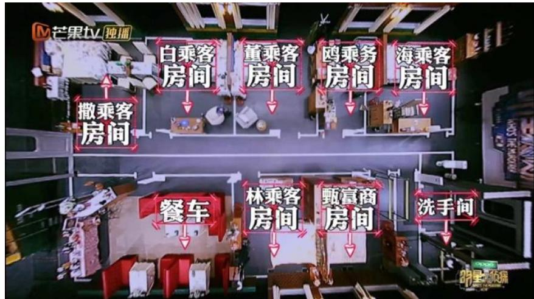
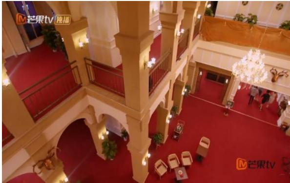
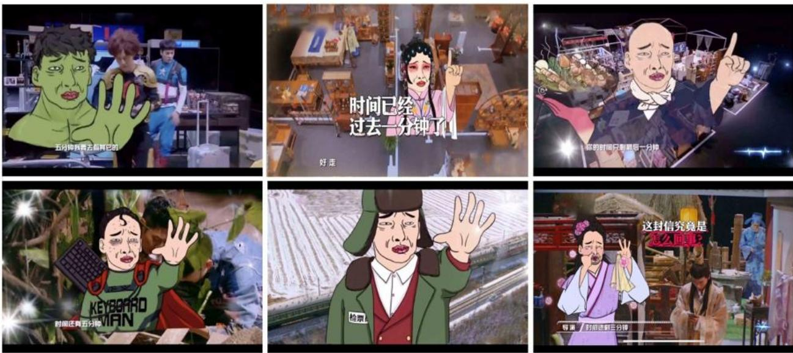
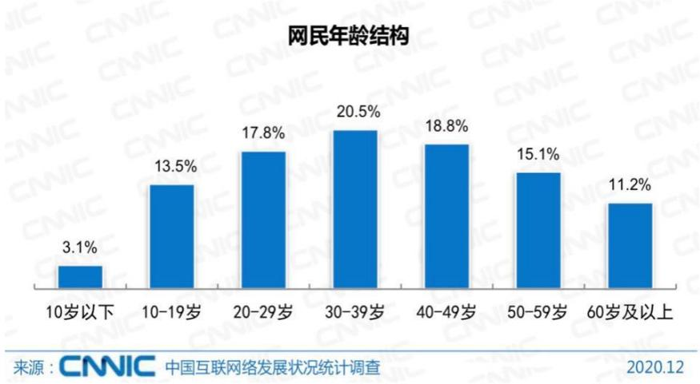
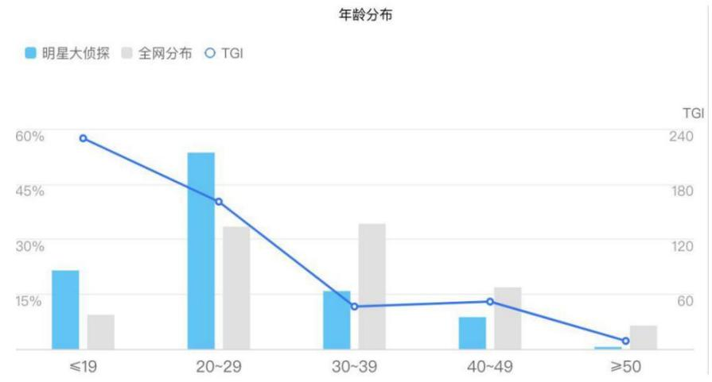

# 1. 论文基本信息
## 1.1. 标题
《明星大侦探》节目的创新策略研究，核心主题是系统拆解国产推理类头部网络综艺《明星大侦探》的全链条创新路径，为网络自制综艺的发展提供经验参考。
## 1.2. 作者
作者为孟祥傲寒，是曲阜师范大学传媒学院戏剧与影视学（广播电视艺术学方向）2021届硕士研究生，指导教师为刘波副教授。
## 1.3. 发表载体
该论文为曲阜师范大学2021届硕士学位论文，未在正式期刊/会议发表，属于学位论文类研究成果。
## 1.4. 发表年份
2021年
## 1.5. 摘要
本论文以芒果TV头部推理综艺《明星大侦探》1-6季为研究对象，针对国内网络自制综艺普遍存在的同质化、泛娱乐化、引进综艺本土化不足、“综N代”口碑易下滑等行业痛点，采用文献研究、案例分析、比较分析、内容分析相结合的方法，从内容生产、形式设计、传播运营三个维度系统剖析节目创新的核心要素。研究发现，《明星大侦探》通过本土化内容改造、沉浸式形式设计、以受众为中心的全渠道传播，实现了内容与形式的双重创新，既满足了受众的娱乐需求，也承担了正向社会价值引导功能，打破了“综N代”口碑逐季下滑的行业魔咒。论文同时总结了节目现存的剧本打磨不足、广告植入生硬等问题，并提出了可复制的创新策略启示，对国产网络自制综艺尤其是垂直类、引进类综艺的发展具有较高的参考价值。
## 1.6. 原文链接
- 原文链接：`uploaded://579d7d72-8e94-4a93-a749-84ccd0ddefce`
- PDF链接：`/files/papers/69c3f1dddcbc649cbf54fc59/paper.pdf`
- 发布状态：未正式期刊发表的硕士学位论文。

# 2. 整体概括
## 2.1. 研究背景与动机
### 2.1.1. 核心问题
论文试图解决两大核心问题：① 作为一档引进类推理综艺，《明星大侦探》为何能打破海外引进综艺“水土不服”的通病，在国内获得口碑与流量的双丰收？② 作为已播出6季的“综N代”节目，它为何能打破多数系列综艺口碑逐季下滑的行业魔咒，长期保持高受众粘性？
### 2.1.2. 行业背景与研究缺口
2014年被称为国内网络自制综艺元年，此后网综市场规模快速扩张，但也暴露出三大痛点：① 同质化严重：一档节目成功后大量同类节目跟风，内容缺乏新意；② 泛娱乐化：部分节目为追求流量忽略内容质量和社会价值，低俗化倾向明显；③ 引进综艺本土化不足：多数引进节目直接照搬海外模式，不符合本土受众的文化与审美需求。
在此背景下，2016年芒果TV引进韩国JTBC电视台推理综艺《犯罪现场》版权，改造后推出的《明星大侦探》成为行业特例：截至2021年第六季播出时，总播放量超200亿，豆瓣评分长期稳定在8.5分以上，是国内少有的兼具流量与口碑的“综N代”节目。但此前学界对《明星大侦探》的研究多集中在叙事、营销、社会价值等单一维度，缺乏对其创新策略的系统性、全链条研究，对其他网综的可借鉴性不足，这正是本文的研究切入点。
### 2.1.3. 创新思路
论文跳出单一维度的研究框架，从“内容-形式-传播”全产业链视角拆解《明星大侦探》的创新策略，同时通过横向对比原版节目、纵向对比6季内容的迭代，提炼出可复制的通用创新经验，弥补行业研究的空白。
## 2.2. 核心贡献与主要发现
### 2.2.1. 核心贡献
1.  理论层面：首次系统性梳理了推理类垂直网综的创新逻辑，填补了国内网络自制综艺创新策略研究的空白，为后续同类研究提供了分析框架。
2.  实践层面：总结出四大可复制的创新启示：引进与本土融合并举、类型创新与垂直细分并重、周边衍生与联动效应并行、游戏互动与受众参与并进，为国产网综尤其是垂直类、引进类综艺的发展提供了实操参考。
### 2.2.2. 主要发现
1.  引进综艺的核心竞争力不在于对原版模式的复刻，而在于本土化改造：《明星大侦探》在原版“推理+综艺”的框架基础上，加入了本土社会热点、经典文化IP、更符合国内受众喜好的搞笑元素，是其超越原版生命力的核心原因。
2.  垂直类网综要平衡专业性与娱乐性：既要有符合核心受众需求的专业内容（比如严谨的推理逻辑），也要有适配大众受众的娱乐设计，才能破圈获得更广泛的受众。
3.  “综N代”要打破审美疲劳，需要通过IP化运营强化受众粘性：通过打造贯穿多季的剧情IP、衍生内容，能强化受众的归属感，延长IP生命周期。
4.  网络综艺的价值引导不需要生硬的说教：通过剧情内容自然传递正向价值观，更容易获得受众的接受和认同。

# 3. 预备知识与相关工作
本部分为初学者梳理理解本文所需的基础概念、行业背景与先前研究脉络。
## 3.1. 基础概念
### 3.1.1. 网络自制综艺节目
简称网综，指由视频网站（而非传统电视台）主导投资、制作、发行，主要在网络平台播放的综艺节目。相较于传统电视综艺，其内容尺度、形式创新的空间更大，受众定位更垂直，互动性更强。
### 3.1.2. 综N代
指已经推出多季的系列综艺节目，“N”指代季数。这类节目通常拥有固定的受众基础，但也普遍面临内容同质化、受众审美疲劳、口碑逐季下滑的行业困境。
### 3.1.3. 使用与满足理论
传播学经典理论，该理论将受众视为具有特定需求的主动个体，而非被动接受媒介灌输的对象：受众接触媒介的过程是基于自身需求主动选择、使用媒介，从而获得需求满足的过程。卡茨等学者将受众的媒介使用需求分为五大类：
1.  认知需求：获取信息、知识、提升认知的需求；
2.  情感需求：获得情绪体验、审美愉悦的需求；
3.  个人整合需求：增强信心、实现自我投射、获得成就感的需求；
4.  社会整合需求：获得社交话题、加强与他人联系的需求；
5.  休闲娱乐需求：放松压力、逃避现实的需求。
### 3.1.4. 议程设置理论
传播学经典理论，指大众传播虽然不能决定受众对某一事件的具体看法，但可以通过提供信息、安排相关议题的方式，影响受众对该事件的重视程度。
### 3.1.5. 本土化改编
指引进海外成熟的节目模式后，不直接照搬原版内容与形式，而是结合本土受众的文化背景、审美偏好、社会现实对节目进行全方位改造，使其更适配本土市场的过程。
### 3.1.6. 蒙太奇
影视制作的核心手法，指通过将不同的镜头按照逻辑、节奏、叙事需求进行组接，从而产生单个镜头本身不具备的含义，实现叙事、抒情、渲染氛围等目的。常见的蒙太奇类型包括平行蒙太奇、积累蒙太奇、抒情蒙太奇、心理蒙太奇等。
### 3.1.7. Z世代
指1995-2009年间出生的一代人，他们成长于互联网普及的时代，是互联网的“原住民”，对网络的依赖度高，偏好个性化、垂直化、互动性强的内容，是国内网综的核心受众群体。
## 3.2. 前人工作
### 3.2.1. 《明星大侦探》相关研究
此前学界对《明星大侦探》的研究主要集中在五个方向：
1.  内容生产与制作研究：分析节目沉浸式体验、后期制作、嘉宾配置的特点；
2.  营销传播研究：从5W传播模式、整合营销等视角分析节目传播策略；
3.  叙事学解读：从悬念设置、叙事视角等角度分析节目叙事特色；
4.  社会文化价值研究：分析节目在价值观引导、社会议题传播方面的作用；
5.  本土化研究：分析节目对原版《犯罪现场》的本土化改造点。
    但现有研究多聚焦单一维度，缺乏对节目创新策略的系统性、全链条梳理，可借鉴性不足。
### 3.2.2. 综艺节目创新策略相关研究
此前国内综艺创新研究主要集中在三类：
1.  文博类综艺创新研究：比如《中国诗词大会》《上新了·故宫》等文化类综艺的创新路径；
2.  引进类综艺创新研究：分析引进综艺的本土化改造经验；
3.  网络综艺创新研究：多为泛泛的行业趋势分析，缺乏对垂直类网综的深度案例研究。
    总体来看，针对推理类垂直网综的创新策略研究存在明显空白，这正是本文的研究价值所在。
## 3.3. 技术演进脉络
国内推理类综艺的发展经历了三个阶段：
1.  1.0阶段（2014-2015年）：以《Lying Man》《饭局的诱惑》为代表，核心是“桌面狼人杀”模式，场景简单，以嘉宾语言互动为主，受众窄，破圈难度大；
2.  2.0阶段（2016年起）：以《明星大侦探》为代表，引入“实景搜证+剧情推理+综艺搞笑”的模式，将推理与剧情、娱乐深度结合，首次实现推理类综艺的大众破圈；
3.  3.0阶段（2019年后）：衍生出《密室大逃脱》《开始推理吧》等更多实景推理综艺，逐步形成完整的推理综艺赛道。
    本文的研究对象《明星大侦探》是推理类综艺2.0阶段的标杆作品，承担了推理类综艺从小众走向大众的行业作用。
## 3.4. 差异化分析
与现有研究相比，本文的核心创新点在于：
1.  研究框架更系统：首次从“内容生产-形式设计-传播运营”全产业链维度拆解节目创新策略，而非聚焦单一维度；
2.  对比视角更全面：同时采用横向对比（与原版《犯罪现场》对比）和纵向对比（与自身6季迭代对比），更清晰地凸显创新的核心价值；
3.  实用性更强：提炼出的创新启示具有可复制性，能够直接为其他网综的制作运营提供参考。

# 4. 方法论
本文采用三种研究方法相结合的方式，确保研究的严谨性与实用性。
## 4.1. 案例研究法
### 4.1.1. 方法原理
案例研究法是对单一典型案例进行深度、全面的剖析，从而提炼出具有普适性的经验与规律的质性研究方法，适合研究复杂、动态的行业实践问题。
### 4.1.2. 具体应用
本文以《明星大侦探》1-6季为单一典型案例，深入拆解其在内容生产、形式设计、传播运营全链条的创新实践，分析其成为“综N代”常青树的核心原因，同时梳理其存在的问题。
## 4.2. 比较分析法
### 4.2.1. 方法原理
比较分析法通过横向（与同类其他对象）、纵向（与自身不同发展阶段）的对比，凸显研究对象的特征与优势，提炼差异化的创新点。
### 4.2.2. 具体应用
本文的比较分为两个维度：
1.  **横向对比**：与原版韩国JTBC电视台的推理综艺《犯罪现场》对比，分析《明星大侦探》在内容、形式、传播层面的本土化改造创新点，解释其在国内获得更高认可度的原因；
2.  **纵向对比**：对比《明星大侦探》1-6季的内容、形式、传播的迭代变化，分析其创新的演进路径，以及第四、五季口碑下滑的核心原因。
## 4.3. 内容分析法
### 4.3.1. 方法原理
内容分析法是对研究对象的内容进行系统性的编码、分类、统计，从而提炼出内容的特征与规律的研究方法，能够降低定性研究的主观性。
### 4.3.2. 具体应用
本文系统整理了《明星大侦探》1-6季共72个案件的主题、剧情、嘉宾配置、场景设计、视听语言、后期制作、传播数据等内容，分类梳理其创新的具体表现，确保研究结论基于客观的节目内容而非主观判断。
## 4.4. 核心创新框架
作者将《明星大侦探》的创新策略分为三大维度，每个维度下有具体的落地路径：
### 4.4.1. 内容维度创新
内容是节目核心竞争力的来源，《明星大侦探》的内容创新覆盖主题、剧情、嘉宾三个层面：
#### 4.4.1.1. 主题创新
采用三大主题策略，兼顾社会价值、受众熟悉度与多元性：
1.  **贴近社会热点**：每期主题结合当下社会议题（比如网络暴力、微笑抑郁症、儿童性侵、职场霸凌、垃圾分类等），发挥议程设置功能，通过剧情自然传递正向价值观，避免生硬的说教；
2.  **借鉴经典IP**：结合国内外经典影视作品（比如《海上钢琴师》《东方快车谋杀案》《仙剑奇侠传》《唐人街探案》等），降低受众认知门槛，引发情感共鸣；
3.  **融合多元主题类型**：覆盖现实、童话、仙侠、科幻、民国等多元题材，满足不同受众的喜好，避免题材同质化。
#### 4.4.1.2. 剧情创新
通过悬念设置和IP联动强化受众粘性：
1.  **跌宕起伏的戏剧剧情**：采用“总悬念+多层小悬念”的叙事结构：总悬念是每期固定的“找出真凶”，小悬念则包括人物隐藏关系、杀人动机、案件反转等，环环相扣，一波三折，保持受众的好奇心；
2.  **连续剧情IP联动**：打造贯穿多季的IP元素，比如“NZND虚拟男团”“甄漂亮整形医院”“冲不上的云霄”等系列案件，强化受众粘性，甚至衍生出现实的粉丝应援文化。
#### 4.4.1.3. 嘉宾配置创新
采用“明星+素人+专业人士”的三层配置，兼顾流量、专业性与政策要求：
1.  **明星嘉宾**：常驻嘉宾风格互补（何炅负责控场、撒贝宁负责普法+搞笑、王鸥擅长直觉推理、白敬亭擅长破解密室、鬼鬼擅长搜证），形成稳定的化学反应；飞行嘉宾兼顾流量与推理能力，适配节目调性；
2.  **素人嘉宾**：从第四季起加入侦探助理，多为高学历推理爱好者，第六季升级为双侦探模式，响应“星素结合”的政策要求，拉近与普通受众的距离；
3.  **专业人士**：邀请法律、心理、社会学等领域的专家，在节目中科普专业知识，强化价值引导，提升节目的专业性。
### 4.4.2. 形式维度创新
形式是内容的载体，《明星大侦探》通过沉浸式的形式设计提升受众的观看体验：
#### 4.4.2.1. 场景空间营造
1.  **实景空间**：早期是演播室棚拍，从第三季起每季节首尾案件采用实景搭建（比如4000平的玫瑰酒店、无名艺术馆、游轮、列车等），打造沉浸式体验，让嘉宾和受众更有代入感。早期棚拍场景布局如下图所示（原文图2-1）：

    
    *该图像是图 2-1，展示了《午夜列车》场景布局。图中标注了多个区域，包括白乘客房间、蓝乘客房间、绿乘客房间等，清晰呈现了场景内不同房间的布局和关系。这些布局设计为节目情节发展提供了空间支持。*

    第三季《酒店惊魂》的实景空间如下图所示（原文图2-2）：

    
    *该图像是《明星大侦探》节目中《酒店惊魂》场景的实景空间，展示了典雅的室内装潢和舒适的环境布局，为节目情节的发展提供了良好的空间背景。*

2.  **精美道具**：道具分为两类：①陈述性道具：贴合时代/场景背景，增强真实感（比如《请回答1998》案件中的BP机、搪瓷杯、旧海报等）；②线索道具：承载案件线索，推动剧情发展；同时将广告植入做成线索道具，降低植入的生硬感。
#### 4.4.2.2. 视听语言创新
1.  **画面语言**：构图根据场景采用中心构图、三分法构图、纵深构图等，清晰呈现人物和线索；灯光从早期模仿原版的冷暗色调改为暖亮色调，兼顾推理的严肃性和综艺的娱乐性；用色彩烘托氛围、塑造人物形象（比如用冷色调烘托悬疑氛围，用暖色调塑造阳光的人物性格）。
2.  **听觉语言**：根据场景搭配悬疑、搞笑、抒情的BGM，打造节目主题曲《无罪说》，改编经典老歌作为综艺梗（比如NZND组合的《如果我开挖掘机你还会爱我吗》），用拟声音效烘托氛围、强化综艺效果。
#### 4.4.2.3. 后期制作创新
1.  **剪辑**：采用电影化的蒙太奇手法：平行蒙太奇展示多组嘉宾同时搜证的过程，加快叙事节奏；积累蒙太奇渲染氛围（比如恐怖案件开头叠加多个阴森场景的镜头）；抒情蒙太奇表达情感（比如感人剧情处搭配空镜头和音乐）；心理蒙太奇外化嘉宾的推理思路，让受众清晰理解嘉宾的逻辑。
2.  **特效字幕**：除了基础的信息说明功能，还能渲染情绪、展现人物内心、塑造人设、增强娱乐性，是节目后期的核心特色之一。
3.  **原创动画IP**：打造了三个专属动画符号，成为节目的标志性元素：①尔康倒计时表情包：每期搜证倒计时环节出现，会根据当期主题改变造型，被网友称为“铁打的尔康”；②嘉宾Q版形象：根据当期嘉宾的角色制作，用于展现嘉宾的内心活动；③小白人：极简风格的卡通形象，用于吐槽、烘托氛围。
    其中尔康表情包的部分截图如下图所示（原文图2-23、2-24）：

    
    *该图像是插图，展示了《明星大侦探》节目中的角色和场景。左侧图像展示了一个角色在强调某个观点，右侧则是更具卡通风格的表现，增强了节目的互动性和趣味性。*

    
    *该图像是《明星大侦探》节目中的尔康表情包部分截图，展示了多个动画角色与场景互动的瞬间，体现了节目的创新表达和嘉宾互动。画面中有显著的幽默元素，增强了观众的参与感。*

### 4.4.3. 传播维度创新
通过以受众为中心的传播理念和全渠道传播矩阵，实现裂变式传播：
#### 4.4.3.1. 以受众为中心的传播理念
1.  **大数据精准定位**：通过百度指数等数据锁定核心受众为20-29岁的Z世代，根据受众喜好调整内容、嘉宾、传播策略；2020年全国网民年龄结构和《明星大侦探》受众年龄分布如下图所示（原文图3-1、3-2）：

    
    *该图像是一个图表，展示了2020年12月全国网民的年龄结构。数据显示，30-39岁人群占比最高，为20.5%，其次为40-49岁和20-29岁人群，分别为18.8%和17.8%。数据来源于CNNIC网络统计调研。*

    
    *该图像是图表，展示了《明星大侦探》受众群体的年龄分布。图中蓝色柱状图代表该节目的受众分布，而灰色柱状图表示全国整体年龄分布，X轴为年龄段，Y轴为比例。20-29岁年龄段的观众占比最高，且整体趋势显示年轻群体对节目的偏爱明显。*

2.  **满足受众多元需求**：契合使用与满足理论的五大需求：认知需求（科普法律、心理、行业知识）、情感需求（沉浸式的视听体验）、个人整合需求（满足受众的侦探梦投射，跟随节目一起推理获得成就感）、社会整合需求（提供社交话题，促进线上线下讨论）、休闲娱乐需求（明星搞笑互动，放松压力）。
#### 4.4.3.2. 全方位互动的传播渠道
1.  **线上全媒体矩阵**：①芒果TV站内全流量扶持：首页推荐、短视频片段推送、弹窗竞猜活动，提升站内曝光；②社交媒体运营：微博开设官方账号、虚拟角色账号（比如NZND组合成员的个人微博）、超话讨论，微信公众号发布番外内容、互动活动，抖音发布短视频片段，扩大站外传播；③UGC二次传播：鼓励粉丝在B站、豆瓣、知乎等平台创作二次内容（比如剪辑、剧情分析、同人创作），实现裂变式传播。
2.  **线下情境化活动**：举办开播发布会、NPC演员招聘、明侦校园行/城市行等活动，拉近与受众的距离，提升受众粘性。

# 5. 实验设置（适配人文社科研究设计）
## 5.1. 研究样本与数据来源
### 5.1.1. 核心样本
《明星大侦探》第一季到第六季全部正片内容，共72个案件，具体案件的主题、背景等信息见附录表A。
### 5.1.2. 辅助数据
1.  节目运营数据：芒果TV官方公布的各季播放量、豆瓣平台的用户评分；
2.  受众数据：中国互联网络信息中心（CNNIC）2020年的网民年龄结构数据、百度指数公布的《明星大侦探》受众年龄分布数据；
3.  传播数据：微博超话阅读量、抖音话题播放量、B站相关视频播放量等公开传播数据。
## 5.2. 评估指标
本文用于评估节目创新效果的指标包括：
### 5.2.1. 播放量
- 概念定义：指节目在芒果TV平台的正片总播放次数，用于衡量节目的传播广度和受众覆盖规模。
- 公式：$\text{播放量} = \sum_{i=1}^{m} P_i$，其中$P_i$为第$i$集正片的平台统计播放量，$m$为总集数，播放量统计采用平台的去重规则。
### 5.2.2. 豆瓣评分
- 概念定义：国内权威影视内容评分平台豆瓣的用户打分，满分为10分，由看过节目的注册用户主动评分生成，能较为客观地反映节目的口碑质量和受众满意度。
- 公式：$$\text{豆瓣评分} = \frac{\sum_{i=1}^{n} s_i}{n}$$，其中$s_i$为第$i$个用户的打分，$n$为参与打分的总用户数。
### 5.2.3. 社交媒体话题量
- 概念定义：节目相关话题在微博、抖音等社交平台的阅读/播放总量，用于衡量节目的受众讨论度和社会影响力。
- 公式：$\text{话题量} = \sum_{j=1}^{k} T_j$，其中$T_j$为第$j$个平台相关话题的总阅读/播放量，$k$为统计的平台数量。
### 5.2.4. 衍生IP生命力
- 概念定义：指节目衍生出的子IP（包括衍生节目、虚拟角色、线下活动、互动剧等）的受欢迎程度，用于衡量节目IP的生命周期和商业化潜力。
## 5.3. 对比基线
本文选择三类对象作为对比基准：
1.  **原版节目《犯罪现场》**：韩国JTBC电视台推出的推理综艺，共3季后停播，用于对比《明星大侦探》本土化改造的创新价值；
2.  **同期其他综N代节目**：比如《奔跑吧兄弟》《极限挑战》等系列综艺，这类节目普遍面临逐季口碑下滑的问题，用于对比《明星大侦探》打破“综N代魔咒”的创新效果；
3.  **同期其他推理类网综**：比如《饭局的诱惑》《Lying Man》等早期狼人杀主题推理综艺，这类节目场景简单、形式单一，用于对比《明星大侦探》作为垂直推理类综艺的创新优势。

# 6. 实验结果与分析
## 6.1. 核心节目表现结果
以下是原文绪论部分表0-1的《明星大侦探》六季播放量与豆瓣评分数据：

| 节目名称 | 芒果TV播放量 | 豆瓣评分 |
| --- | --- | --- |
| 《明星大侦探》第一季 | 13.1亿 | 9.3 |
| 《明星大侦探》第二季 | 24.1亿 | 9.1 |
| 《明星大侦探》第三季 | 38.8亿 | 9.2 |
| 《明星大侦探》第四季 | 27.1亿 | 8.6 |
| 《明星大侦探》第五季 | 46.7亿 | 8.5 |
| 《明星大侦探》第六季 | 45.7亿 | 9.1 |

从数据可以看出：
1.  播放量整体呈上升趋势，除第四季略有下滑外，其余季别均保持增长，第六季播放量是第一季的3.5倍，说明受众覆盖规模不断扩大；
2.  豆瓣评分除第四、五季略有下滑外，均保持在8.5分以上，第六季重回9.1分，打破了大多数综N代口碑逐季下滑的行业规律，验证了其创新策略的有效性。
## 6.2. 分维度创新效果分析
### 6.2.1. 内容创新效果
1.  社会议题引发广泛讨论：比如《夜半酒店Ⅱ》关注儿童性侵话题，相关微博话题阅读量超20亿，引发大众对儿童性教育的讨论；《无忧客栈》关注微笑抑郁症，相关话题阅读量超10亿，提升了大众对心理疾病的认知；
2.  IP运营大获成功：虚拟组合NZND的相关话题阅读量超10亿，拥有现实的粉丝应援、官方微博，成为贯穿六季的核心IP，强化了受众粘性；
3.  嘉宾配置获得认可：常驻嘉宾的“人设”深入人心，素人嘉宾和专业人士的加入也获得了受众的广泛好评，相关话题多次登上微博热搜。
### 6.2.2. 形式创新效果
1.  实景搭建成为行业标杆：第三季《酒店惊魂》的4000平实景搭建开创了国内网综实景录制的先河，后续很多推理综艺都模仿其场景设计；
2.  后期风格成为特色：尔康表情包、Q版人物、小白人等原创动画符号成为节目的标志性元素，很多网综都借鉴其特效字幕的设计思路。
### 6.2.3. 传播创新效果
1.  线上传播覆盖规模大：微博超话阅读量超100亿，抖音相关话题播放量超60亿，B站相关视频总播放量超千万，实现了裂变式传播；
2.  线下活动参与度高：明侦校园行、城市行覆盖全国10余个城市，参与人数超10万；
3.  衍生IP开发成功：衍生节目《名侦探学院》第一季、第二季豆瓣评分均为9.3分，互动微剧《头号嫌疑人》播放量超2亿，延长了IP生命周期。
## 6.3. 存在问题分析
作者通过分析也指出了节目存在的五大问题，也是第四、五季口碑下滑的核心原因：
1.  **剧本内容打磨不足**：部分案件逻辑不严密、证据链不完整，过于追求反转而忽略推理的合理性，导致推理爱好者的满意度下降；
2.  **主题立意契合度不足**：部分案件为了贴合热点强行拔高主题，主题与剧情的关联度低，无法引发受众共鸣；
3.  **嘉宾选择不够慎重**：部分飞行嘉宾推理能力不足、适配度低，影响节目节奏和受众观看体验；
4.  **后期制作质量下滑**：部分案件剪辑混乱、有效推理内容被剪、字幕错误多，影响受众的观看体验；
5.  **广告植入过多**：部分广告植入生硬，打断节目叙事节奏，引发受众反感。
## 6.4. 创新策略启示效果
作者总结的四大创新启示，已经被行业内很多综艺借鉴：
1.  **节目引进与本土融合并举**：不要照搬海外模式，要结合本土文化和社会现实进行改造，这已经成为国内引进综艺的共识；
2.  **类型创新与垂直细分并重**：避开综艺同质化的红海，深耕垂直细分领域（比如推理、国风、职场等），精准对接目标受众需求；
3.  **周边衍生与联动效应并行**：打造IP矩阵，开发衍生节目、线下活动、周边产品，延长IP生命周期，提升商业化能力；
4.  **游戏互动与受众参与并进**：通过互动剧、线下活动等方式提升受众的参与感，从单向传播转向双向互动。

# 7. 总结与思考
## 7.1. 结论总结
本文以《明星大侦探》1-6季为研究对象，通过案例研究、比较分析、内容分析等方法，从内容、形式、传播三个维度系统拆解了其创新策略，指出其核心成功逻辑是：以优质内容为核心，通过本土化改造贴合本土受众需求，用沉浸式的形式设计提升观看体验，以受众为中心打造全渠道传播矩阵，同时传递正向社会价值。本文的研究填补了国内推理类网综创新策略系统研究的空白，为国产网络自制综艺节目尤其是垂直类、引进类综艺的发展提供了可复制的经验参考。
## 7.2. 局限性与未来工作
### 7.2.1. 研究局限性
1.  样本覆盖有限：研究仅覆盖到2021年播出的第六季，后续《明星大侦探》改名《大侦探》后的第七、八季内容未纳入研究范围，无法反映节目最新的创新迭代和问题；
2.  定量研究不足：研究以定性分析为主，缺乏大规模的受众定量调研，对创新策略与受众满意度之间的因果关系验证不足；
3.  商业化分析不足：未对节目IP的商业化路径、盈利模式进行深入研究。
### 7.2.2. 未来研究方向
1.  扩展研究样本，覆盖后续季数的内容，分析其创新的迭代与存在的新问题；
2.  加入定量研究方法，通过受众问卷、访谈等方式验证不同创新维度对受众满意度的影响权重；
3.  对比研究国内其他推理类综艺（比如《开始推理吧》《密室大逃脱》等）的创新路径，总结推理类综艺的发展规律；
4.  研究推理类IP的产业化路径，包括线下剧本杀、文旅项目、衍生产品的开发模式。
## 7.3. 个人启发与批判
### 7.3.1. 核心启发
1.  **内容为王永远是综艺的核心竞争力**：哪怕是娱乐属性的综艺，只要内容有深度、有关怀、尊重受众的智商，就能获得口碑与流量的双丰收，《明星大侦探》的成功证明了受众并不排斥“有意义”的娱乐，反而会为优质内容买单；
2.  **本土化创新不是简单的“换皮”**：而是要深入理解本土受众的文化语境、关注的社会议题、审美偏好，从内容到形式进行全方位的适配，《明星大侦探》没有照搬原版《犯罪现场》的严肃风格，而是加入了更多的综艺搞笑元素、本土社会议题、经典文化IP，才获得了比原版更长久的生命力；
3.  **IP化运营是延长综N代生命周期的有效路径**：通过打造连续的剧情IP、衍生内容、线下活动，能强化受众的归属感和粘性，避免审美疲劳，打破“综N代”的口碑下滑魔咒。
### 7.3.2. 潜在问题与改进方向
1.  论文对创新策略的普适性分析不足：很多创新策略是推理类综艺特有的，哪些可以迁移到其他类型的综艺，还需要进一步探讨；
2.  论文对节目存在的问题的分析不够深入：比如剧本质量下滑的根本原因是编剧团队的变动、还是创作周期的压缩，没有进行更深的挖掘；
3.  从后续《大侦探》的发展来看，论文提出的问题（比如剧本质量、嘉宾选择、广告植入）并没有得到完全解决，甚至出现了老嘉宾流失、过度消费情怀的新问题，如何平衡新老受众的需求、如何在保持创新的同时不丢失节目的核心特色，是节目未来需要解决的核心问题，也是未来研究可以关注的方向。