索取号：J9

# 曲华师範大学

硕士学位论文

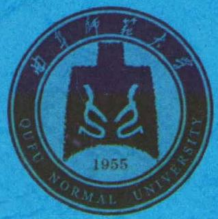

# 《明星大侦探》节目的创新策略研究

研究生： 孟祥傲寒指导教师： 刘波副教授培养单位： 传媒学院一级学科： 戏剧与影视学二级学科： 广播电视艺术学完成时间： 2021年4月5日答辩时间： 2021年5月30日

# 摘要

2014年被业内认为是我国网络自制综艺节目元年，网络自制综艺节目在投资力度、观众数量、广告收益等方面创造了新的高度，各大视频平台纷纷把更多的制作经费投入到自制综艺节目上。细数近年来我国的网络自制综艺节目，从2014年爱奇艺的《奇葩说》，到2015 年爱奇艺的《偶滴歌神啊》，2016年优酷视频的《火星情报局》，2017年爱奇艺的《中国有嘻哈》，2018年腾讯视频的《奇遇人生》，再到 2019 年芒果TV的《女儿们的恋爱》，2020 年芒果TV的《乘风破浪的姐姐》，这些网络自制综艺节目，在节目经费、制作班底、加盟明星等方面都颇具实力，获得了口碑与点击量的双丰收。但是随着网络自制综艺节目的繁荣发展，一些网络自制综艺节目制作粗糙、缺乏社会责任感、缺乏创新能力等问题逐渐暴露，在此情境下，《明星大侦探》作为一种新兴的节目类型应运而生。《明星大侦探》是芒果TV推出的一档明星推理真人秀节目，一经推出便在网络上获得了极高的播放量和良好的口碑。《明星大侦探》作为网络自制综艺节目的佼佼者，该节目的创新策略值得深入分析和研究,总结其成功经验与不足之处,以期为我国网络自制综艺节目发展提供经验与启示。

本研究以《明星大侦探》为对象进行分析，主体包含四个部分：第一部分梳理了《明星大侦探》1-6季的节目内容，从节目主题、节目故事内容、节目嘉宾三个方面展开论述。第二部分聚焦《明星大侦探》节目形式层面的创新，其一，关注该节目的场景设置与道具,探究该节目如何通过场景设计及适配场景的道具，为观众打造沉浸式体验；其二，以画面语言和听觉语言为切入点，对该节目在视听语言方面的创新做出论述；其三，从《明星大侦探》的后期剪辑与特效字幕两方面展开，探讨节目后期制作的特色与创新。第三部分从“使用与满足”理论入手，分析《明星大侦探》节目的传播理念，并总结《明星大侦探》传播渠道上的创新。第四部分为《明星大侦探》节目存在的问题以及创新策略启示，列举了《明星大侦探》节目存在的问题，总结了对该节目的思考及其创新策略，以期为今后网络自制综艺节目的发展提供启示。

《明星大侦探》通过设置新颖且具有社会价值的节目内容，不同于传统的综艺节目形式，取得了良好的传播效果。本研究以《明星大侦探》为例，将《明星大侦探》的节目文本进行归纳整理，从节目内容、节目形式、节目传播策略三个方面进行分析，探究《明星大侦探》节目的创新特色。尽管《明星大侦探》仍存在一些问题，但《明星大侦探》在节目创新上已经取得了良好的效果，对该节目的创新策略进行整理归纳，有利于网络自制综艺节目进一步发展。

关键词：《明星大侦探》；创新策略；传播策略

# Abstract

2014 is considered to be the first year of domestic Online variety shows. Domestic online variety shows continue to create new heights in terms of investment， viewer clicks，and advertising revenue. A large number of video websites have put more funds into self-made variety shows.In recent years, China's self-produced variety shows on the Internet, from 2014 iQiyi's Let's Talk ，2015 iQiyi's the god of songs,2016 Youku Video's Mars Intellgence Agency,2017 iQiyi's The Rap of CHINA, Tencent Video's adventure life in 2018, Mango TV's Daughter's Love in 2019 to Mango TV's Older Sisters Who Brave the Winds and Waves in 2020, alltese network self-made variety shows have great strength in term of program funding, team, joing stars and etc. Also, won a double harvest of reputation and clicks.However, along with the maturity of online self-made variety shows, some problems have been gradually exposed such as rough production, lack of in diversity and creativity. In this context, "Star Detective" a new type of show, came into being. Who's the murderer is a reality show of star reasoning launched by Mango TV. Once it was launched, it has gained extremely high broadcast volume and good reputation on the Internet. As the leader of network self-made variety shows, Who's the murderer is worthy of in-depth analysis and research on the innovative strategy of the show. Also, to summarize its successful experience and shortcomings, in order to provide experience and enlightenment for the development of network self-made variety shows in our country.

The study takes Who's the murderer as the object to analyze, and the main body includes four parts: the first part combs the program content of Who's the murderer from the first season to the sixth season, and analyzes it from three aspects: program theme, program story content and program guests. The second part focuses on the innovation of the program form. First, it pays attention to the scene seting and props of the program, and finds that the program creates an immersive experience for the audience through the construction of real space and the use of exquisite props; second, it states the innovation of the program in audio-visual language from the aspects of picture language and auditory language; thirdly, it analyzes the characteristics and innovation of the program’ s post-production from the two aspects of post-editing and special effects subtitles of Who's the murderer. Starting with the theory of "use and satisfaction", the third part analyzes the communication concept of the program， and then summarizes its innovation in communication channels. The fourth part is the problems existing in the program and the inspiration of innovation strategy, which lists the problems of Who's the murderer and summarizes the thinking and innovative strategies of the program， in order to provide enlightenment for the development of online self-made variety shows in the future.

Who's the murderer has achieved good communication effect by setting up novel and socially value program content, which is different from the traditional variety show form. Taking Who's the murderer as an example, this paper summarizes the program text of Who's the murderer from three aspects: program content, program form and program communication strategy, and summarizes the innovative features of Who's the murderer. Although there are still some problems in Who's the murderer, it has achieved good results in program innovation. It’s helpful to further develop the self-made variety show by sorting out and summarizing the innovative strategies of the program.

Keywords: Who's the murderer; Innovation strategy; Communication strateg

# 目录

摘要..

Abstract..

目录..

绪论.. .3

第一节 研究背景与意义.

第一章《明星大侦探》节目内容的创新策略. 10

# 第一节 主题要素：节目主题的万象包罗. 10

一、贴近社会热点话题 11  
二、借鉴经典影视作品. 12  
三、融合多元主题类型. 13  
一、风格互补的明星嘉宾. 18  
二、相得益彰的素人嘉宾. 22  
三、知识渊博的专业人士 23

第二章《明星大侦探》节目形式的创新策略. .24

第一节 场景空间的视象营造. .24  
一、实景空间营造真实氛围. .24  
二、精美道具完善舞台布景.. .26  
第二节 声画兼具的视听语言符号. .27  
一、风格各异的画面语言. .28  
二、引人入胜的听觉语言 .32

# 第三节 极具特色的后期制作. .34

一、故事性与综艺性融合剪辑. 34  
二、挖掘特效字幕的潜在功能. 36

第三章《明星大侦探》节目传播的创新策略. .46

第一节 以受众为中心的传播理念. .46  
一、大数据精准定位目标受众. .46  
二、满足受众多元化心理需求. .48  
第二节 全方位互动的传播渠道创新. .51  
一、媒介化：传播矩阵立体化造势. ..51  
二、情境化：线下活动推广造势. .59

第四章《明星大侦探》节目存在的问题及创新策略启示. 62

# 第一节《明星大侦探》节目存在的问题. 62

一、剧本内容仍需打磨 .62  
二、主题立意应更契合. .63  
三、邀请嘉宾应更慎重. .63  
四、后期制作仍需认真. .. 64  
五、节目植入广告过多. 64  
一、节目引进与本土融合并举. .65  
二、类型创新与垂直细分并重. .66  
三、周边衍生与联动效应并行. .66  
四、游戏互动与受众参与并进. .67

参考文献.. 77 在读期间相关成果发表情况. 80 致谢. 81

# 绪论

# 第一节研究背景与意义

# 一、研究背景

新世纪以来，随着社会科技水平的不断发展，以及受众精神需求与审美观念的不断提高，我国的综艺节目出现了越来越多的类型。在“互联网 $+ ^ { \mathfrak { n } }$ 的背景下，各大视频网站迅速发展,2007年搜狐视频推出国内首档网络自制脱口秀节目《大鹏嚼吧嚼》，让人们开始注意到网络自制综艺节目。2013年国家广播电视总局发布《关于做好 2014年电视上星综合频道节目编排和备案工作的通知》，要求丰富电视节目类型以及抵制电视节目的过度娱乐,在这种背景下一批形式新颖、各具特色的网络自制节目和观众见面了。2014年腾讯视频播出调查类真人秀节目《你正常吗》，仅8期节目播放量就超过4亿，赢得了较高的关注度和影响力。一时间各大视频网站争相制作网络综艺节目，以期在这一新兴产业中分一杯羹,2014年网络自制综艺节目数量大幅度上涨，被学者称为“互联网综艺节目的发展元年”。自此，网络自制综艺节目全面崛起，开始与电视综艺节目争夺受众。

随着网络自制综艺节目逐渐成熟，节目制作粗糙、节目类型相似、节目内容缺乏新意等问题逐渐暴露，处于成长期的整个行业也暴露出林林总总的问题。网络自制综艺节目基于网络平台，相对于电视节目，国家相关政策更为宽松，节目质量也参差不齐，呈现出泛娱乐化、低俗化、同质化等现象。2016年《明星大侦探》因其新颖的节目类型，深刻的价值观念，在一众网络自制综艺节目中异军突起，同时也弥补了我国推理类真人秀节目的空白。芒果TV于2016年从韩国JTBC 电视台购买了在韩国国内收视率较高的推理类真人秀节目《犯罪现场》的版权，并以该节目为基础制作了我国首档明星推理真人秀节目《明星大侦探》，该节目由 $30 \%$ 跌宕剧情 $+ 4 0 \%$ 综艺搞笑 $+ 3 0 \%$ 智能推理”组成，以悬疑推理为核心，同时具有强烈的娱乐性及趣味性，赢得了年轻群体的喜爱。截至2021年3月笔者统计时，《明星大侦探》各季在芒果TV的播放量及豆瓣评分如表0-1。从表中可以看出，《明星大侦探》除第四季外，播放量整体呈上升趋势 (截止笔者统计时，第六季尚未播完)，由此可见《明星大侦探》受欢迎程度与日俱增。豆瓣评分除第四、五季外，皆在9分以上，对比其他“综N代”节目，播放量和口碑都一马当先。

表0-1综艺节目《明星大侦探》六季豆瓣评分列表  

<table><tr><td colspan="1" rowspan="1">节目名称</td><td colspan="1" rowspan="1">芒果TV 播放量</td><td colspan="1" rowspan="1">豆瓣评分</td></tr><tr><td colspan="1" rowspan="1">《明星大侦探》第一季</td><td colspan="1" rowspan="1">13.1亿</td><td colspan="1" rowspan="1">9.3</td></tr><tr><td colspan="1" rowspan="1">《明星大侦探》第二季</td><td colspan="1" rowspan="1">24.1亿</td><td colspan="1" rowspan="1">9.1</td></tr><tr><td colspan="1" rowspan="1">《明星大侦探》第三季</td><td colspan="1" rowspan="1">38.8亿</td><td colspan="1" rowspan="1">9.2</td></tr><tr><td colspan="1" rowspan="1">《明星大侦探》第四季</td><td colspan="1" rowspan="1">27.1亿</td><td colspan="1" rowspan="1">8.6</td></tr><tr><td colspan="1" rowspan="1">《明星大侦探》第五季</td><td colspan="1" rowspan="1">46.7亿</td><td colspan="1" rowspan="1">8.5</td></tr><tr><td colspan="1" rowspan="1">《明星大侦探》第六季</td><td colspan="1" rowspan="1">45.7亿</td><td colspan="1" rowspan="1">9.1</td></tr></table>

2014年以来网络自制综艺节目层出不穷，《明星大侦探》作为网络自制综艺节目的成功案例，以该节目为研究对象，对其在节目内容、节目形式、节目传播方式等方面进行分析，可以获得该节目在创新策略上的成功经验，为其它网络自制综艺节目在节目内容制作、节目形式创新以及节目传播等方面提供借鉴。

# 二、研究意义

自 2007年搜狐视频推出我国第一档网络自制综艺节目《大鹏嚼吧嚼》以来，不同类型的网络自制综艺节目层出叠现，节目质量参差不齐。《明星大侦探》将推理元素与娱乐元素相结合，播出后即获得了较高的播放量及良好的口碑，在一众网络自制综艺节目中脱颖而出。基于此情况，研究《明星大侦探》节目的创新策略对今后我国网络自制综艺节目的发展具有一定参考价值。

# 1.理论意义

《明星大侦探》因其新颖的节目类型，强烈的趣味性，受到社会的广泛关注，许多学者已经注意到了这一现象并做出解读，但至今对其进行深人研究的还比较少。目前对于《明星大侦探》的研究大多是从营销学、叙事学等角度分析其现状、问题和发展趋势，对节目创新策略的研究较为缺乏。本文希望运用传播学等相关理论为支撑，对《明星大侦探》进行研究，探究该节目在节目内容、节目形式、传播方式三个方面的创新，剖析该节目中存在的问题，本文力图通过对这些问题的思考与探究，为我国网络自制综艺节目的研究提供新的视角。

# 2.实践意义

近些年来，我国网络自制综艺节目的类型越来越多样化，网络自制综艺节目的发展如日中天，以网络自制综艺节目中的佼佼者《明星大侦探》为研究对象，分析该节目的创新策略，探究其火爆的原因以及存在的问题，为我国网络自制综艺节目的发展提供可以借鉴的经验，使得我国网络自制综艺节目能够实现更好的发展。因此，本文的研究具有一定实践意义。

# 第二节研究现状

# 一、关于《明星大侦探》节目的研究现状

明星推理类综艺节目是国内新兴起的一种节目类型，虽然受到年轻群体和一众学者的广泛关注，但是对其进行深人研究的文章并不多。目前，国内学者对《明星大侦探》的文

献研究与切入角度主要集中在以下五个方面，其一是关于该节目的内容生产与制作，其二是该节目的营销与传播，其三是从叙事学角度解读该节目，其四是对于该节目所产生的社会价值与文化价值研究，其五是该节目的本土化研究。

# 1.《明星大侦探》节目的内容生产与制作

邹欣等对《明星大侦探》节目模式进行了分析，归纳总结了网络综艺节目的共性以及发展趋势，邹欣等认为该节目给受众提供了一种沉浸式的体验氛围，使受众在观看节目时具有强烈的参与感和代入感；并分析了网络综艺节目的发展趋势，认为网络综艺节目应该重视形态创新，同时兼顾受众自身的需求设计制作出符合受众需求的产品，为网络自制节目的制作提供了新的视角。①

王慧婧叙述了《明星大侦探》的制作团队在节目后期制作中，根据剧情进行剪辑，通过剪辑调整故事结构，调动观众参与节目的积极性，并通过制作二维动画增强节目的综艺感。②王巧从《明星大侦探》节目的制作特色寻找该节目长盛不衰的原因，王巧认为该节目故事内容设置独特，加入了很多本土化的元素，可以提高受众的参与感，而合适的嘉宾则能够与节目相互作用，实现更好的节目效果。③

潘紫菱等以《明星大侦探》第四季作为研究对象，运用戈夫曼的理论对节目中的不同元素进行研究分析并寻找受众喜爱该节目的原因，认为《明星大侦探》第四季之所以能够获得观众的喜爱，与节目中嘉宾与剧本角色的相互成就、舞台对剧本场景的还原以及剧本的叙事方法不无关系。④

廖明隽认为该节目运用多种艺术形式相结合，使节目获得了更好的娱乐效果，同时剧本具有一定的逻辑性，使得节目具有戏剧张力，建立了“推理 $+$ 娱乐”IP 矩阵，增强了受众的观看兴趣；不同性格、形象的嘉宾参与节目，增强了节目的可看性，也拉近了与观众之间的距离。通过打造衍生节目和衍生产品，获得了更多的节目受众。③

# 2.《明星大侦探》节目的营销与传播

刘波、张莹以后现代思想为出发点，认为该节目采用消弭距离感的传播理念、游戏化的内容策略以及结构化与模块化的叙事手法，以与现实生活相关联的内容、多种观看视角等节目设计，削弱了节目与观众之间的距离；同时该节目运用网络社交平台与观众实现节目互动，让观众获得参与感，进一步削弱了观众与节目的距离感。⑥

牛玥、曹秋敏都以拉斯韦尔的“5W”传播模式为理论对《明星大侦探》的广泛传播进行解读，探究了《明星大侦探》在众多网络自制综艺节目中崭露头角的优势。牛玥认为具有一定粉丝基础的嘉宾，设置与当下社会热点相关的节目主题，每一季之间相关联的剧情，优质的节目平台，新媒体社交平台的多元互动，是该节目获得忠实观众和良好传播效果的优势所在。①曹秋敏则以“5W”传播模式分析节目并总结出该节目对我国真人秀节目发展的启示。②

张娜娜以整合营销理论作为框架对《明星大侦探》的整合营销传播策略、特征进行探讨，认为该节目以受众为中心，通过对节目内容进行本土化的创新、邀请明星参与节目等方式拉近与节目受众之间的距离；通过设置每一季之间相关联的剧情，打造与剧本相匹配的场景等方式，进一步增加节目的受众群体；通过各种网络平台宣传节目，扩大节目的传播范围。③

# 3.以文学批评理论解读《明星大侦探》

李丹利用叙事学原理对《明星大侦探》进行解读，认为《明星大侦探》在叙事结构方面运用了因果式的线性结构，呈现出拥有紧凑的结局段落的特点；在节目过程中通过多种叙述角度切换，使观众获得丰富的观看体验；同时，《明星大侦探》通过节目主题传达社会正能量，通过文化价值感染的方式来向社会传达节目意义,使节目达到了娱乐性与教化性的平衡。④

张栗晶认为，《明星大侦探》通过一个接一个的悬念设置吸引观众参与节目，并使用多种叙述角度丰富观众的观赏体验。 $\textcircled{5}$ 有的学者认为，《明星大侦探》从游戏内容、环节以及玩家之间的互动方面做了积极的游戏化价值引导。还有的学者则以巴赫金的“狂欢理论”为切入点，从参与节目的嘉宾的“本我”与“戏中人”两个方面进行了剖析，得出《明星大侦探》是良性狂欢发展范本的结论。?

# 4.《明星大侦探》节目的社会价值与文化价值研究

卜彦芳等认为该节目通过在节目内运用间离效果、近因效应和意见领袖来强调节目的价值定位，在节目外通过新媒体社交平台的互动拓展话题的思考深度，从而达到价值引导的目的。并且从认知、行为和心理三个层面对观众进行正能量的传播。③

史炎荣从网络综艺节目价值引领方面存在的问题入手，分析了《明星大侦探》在网络综艺价值引领方面的实践，并提出网络综艺节目价值引领方面的优化策略。③刘欠认为,参与该节目的嘉宾在节目中通过自身的品格和节目中所扮演的角色向观众传达正确的价值观，并通过节目内容探讨社会热点问题，传播正能量。@

# 5.《明星大侦探》节目的本土化研究

夏临、严安琪都从《明星大侦探》的本土化策略对节目进行了研究，他们认为该节目从节目内容、嘉宾的选择、场景设计以及后期制作上进行了本土化革新，拉近了节目与观众的距离。除此之外，夏临认为方言的使用展现了我国不同地区的多种语言文化差异，让节目内容更加丰富。①严安琪则认为节目的本土化策略还体现在节目价值取向上，认为该节目价值取向与我国本土主流价值观相呼应。②

从以上研究中可以得出，目前关于《明星大侦探》的研究文章比较多，在内容制作、叙事手法、营销传播方面具有一定的学术研究成果，但对该节目的创新策略研究并未出现相关的文献论文的写作，针对《明星大侦探》节目的火爆现象，对其创新策略的启示分析值得深入思考与研究。

# 二、关于综艺节目创新策略的研究现状

根据文献整理，国内已有不少学者对综艺节目的创新策略进行了研究，从文献内容来看，相关的文献研究主要集中在文博类综艺节目的创新研究、引进类综艺节目的创新研究以及网络综艺节目的创新研究三个方面。

1.文博类综艺节目的创新策略研究

文博类综艺节目是近年来比较常见的综艺节目类型，已有不少学者对该类节目进行创新研究。赵梓含梳理了文化类电视节目的发展历程，辨析了文化类电视节目的类别与特征,运用“使用与满足”、“表征”、“陌生化”等理论，从该类节目存在的问题入手，探讨其创新策略。③也有研究者从诗词文化的角度切人，探讨了《经典咏流传》的创新策略，赵萌萌在将创新系统套用在物理学层级结构——宏观、中观、微观三个层次，从理念创新到形态设计创新再到路径操作创新来探究《经典咏流传》的创新策略。她认为创新理念层面的策略是节目创新的根，一个作品立意的正确、新颖、深刻关系到作品的成果。《经典咏流传》在把握立意新颖之轻赛制重传播的基础上，实现了策略上的创新。④裴斐斐在《文化自信视域下“清流综艺”节目的创新策略》中认为《一堂好课》将学科教学与综艺节目相结合创新了节目形态。③周红在《浅谈文化类综艺节目〈上新了·故宫〉的创新策略》中认为该节目把年轻人作为受众群体，通过节目形式与内容的创新，让更多年轻人关注中国传统文化。这类研究主要针对文博类综艺节目的发展现状和问题，分析这类节目的创新点，提出相应的策划、创新、发展方面的建议。

# 2.引进类综艺节目的创新策略研究

近年来我国综艺节目市场涌现出许多新的节目，这其中引进类节目占了很大比例。荣红红梳理了我国引进类益智节目的发展现状，认为这类节目具有水土不服、内容单一、缺乏创新等问题；并以《开门大吉》为例进行了结构形态、文本内容、创作意识、受众意识、品牌意识等方面的分析总结，认为这类节目的创作者应该打破原版节目的内容壁垒，增加多元化、参与式的内容，在原版节目模式的基础进行本土化的改造，打造具有本土化特征的节目形态。①马静梳理了千禧年后引进类节目的发展历程，并分析了该类节目在我国收视火爆的原因，以《爸爸去哪儿》为切入点进行了研究，认为引进类节目应该在抓住原版节目精髓的基础上进行本土创新，利用传统媒体与新媒体进行传播，实现多类型媒体立体式营销。②陈广容则探讨了引进类综艺节目本土化创新的重要性，并提出了相应的本土化创新措施，认为选用本土化的表述方式、适当融入本土文化能够获得观众共鸣，也能丰富节目内容。③高新竹认为版权引进节目通过对节目模式的本土化改造在我国综艺节目市场上不断壮大，但“拿来主义”只能是一种暂时的过渡手段，想要提升我国的综艺节目质量和创新水平，需要加强版权意识并且融入传统文化。 ④

# 3.网络自制综艺节目的创新策略研究

近年来，网络自制综艺节目数量整体呈上升趋势，很多学者注意到这一现象，并且对众多网络自制综艺节目进行研究。董琳烨针对网络自制综艺节目现状进行了分析梳理，以网络综艺节目《你正常吗》作为案例，从节目的内容、形式、营销策略和叙事模式四个方面进行分析，从而得出网络综艺节目创新策略方面的结论。③任颖子认为网络综艺节目的受众群体呈现年轻化的特点，节目题材要满足他们的需求与兴趣，同时也要与传统文化相关联，满足不同受众的需求。赵家耀认为网络综艺节目的节目形式逐渐形成个性化、分众化定制，选择热点与人文性兼具的内容使节目既有趣又不乏深度。③

近几年来我国网络自制综艺节目发展迅速，而笔者在关于综艺节目创新策略搜集资料的过程中，搜集到的大多是电视综艺节目方面的研究，由此可以看出，国内相关文献对于网络自制综艺节目的研究相对匮乏，对这一新兴节目领域的创新策略研究不够深入。

# 第三节研究内容与方法

# 一、研究内容

本文以《明星大侦探》为研究对象，从节目内容、节目形式、节目传播三个方面进行

分析，总结《明星大侦探》节目创新策略的具体表现。

首先，对《明星大侦探》的节目内容进行研究，梳理每期节目的主题、故事内容，寻找《明星大侦探》节目内容中所具有的创新元素，探究其节目内容的特色。

其次，对《明星大侦探》的节目形式进行研究，将从场景设置、视听语言与后期剪辑制作三个方面进行阐释，分析《明星大侦探》节目形式方面做出的创新。

再次，分析《明星大侦探》传播策略的创新，从传播学角度出发，对《明星大侦探》的传播方式进行分析，探究其在传播渠道上的创新。

最后，通过以上对该节目的分析研究产生思考，总结《明星大侦探》节目在创新策略上的启示以及仍存在的问题。

# 二、研究方法

# 1.案例研究法

通过对《明星大侦探》节目进行深入解读，吸收并借鉴相关理论的阐述，从节目的内容、形式与传播方式三个方面对节目进行探究，深入分析《明星大侦探》在节目内容和节目形式上的特色以及该节目在传播方面的优势，以此解读《明星大侦探》现象级传播的原因所在。

# 2.比较分析法

通过与《明星大侦探》原版节目《犯罪现场》进行横向比较，以及对《明星大侦探》节目1-6 季进行比较，在此比较中分析《明星大侦探》节目的创新策略以及该节目自身的优势与不足，争取为其他网络自制综艺节目的创新发展提供一定的思考。

# 3.内容分析法

通过对《明星大侦探》节目1-6季的播出内容进行认真的整理和系统的分析，分析该节目每一季中节目主题的设置和邀请嘉宾的选择，以及节目场景设计、视听语言、后期制作等方面的特点，探究该节目在节目内容与节目形式上的创新之处。

# 第一章《明星大侦探》节目内容的创新策略

人们对于“创新理论”的认识，最早来源于政治经济学家熊彼特出版的《经济发展理论》，他在本书中首次提出了“创新理论”并使用该理论解释资本主义的本质特征。随着时间的发展，人们发现“创新理论”并不仅只适用于经济学领域，在其他领域同样可以通过创新的方式突破瓶颈，获取更高的效益。谢耘耕、陈虹认为：“真人秀节目的创新通常分为三个层面：理念创新、内容创新和形态创新。”①现今我国的网络自制综艺节目虽然发展迅猛，但在节目类型、节目内容等方面已初现雷同、陈旧之象，网络自制综艺节目想要走得更远，就需要更多的创新。本研究以“创新理论”为参考，试着分析《明星大侦探》的节目内容，阐述《明星大侦探》节目内容的创新策略。

当前我国的网络综艺节目数量众多，但题材过于集中，往往是一个节目取得了成功,就引来了其他节目纷纷效仿，但对于综艺节目来说，题材、形式也许可以复制，但是独一无二的内容却很难效仿。优秀的节目并不是一味迎合市场，也不是大牌明星的堆砌，而是新颖的创意与精彩的内容之间的综合与博弈。芒果TV于2016年从韩国JTBC 电视台购买了在韩国国内具有良好口碑的推理类综艺节目《犯罪现场》的版权，并以该节目为基础制作了我国首档明星推理真人秀节目《明星大侦探》，该节目从第一季到第六季已经走过了五个年头，无论是播放量还观众口碑都取得了不错的成绩。《明星大侦探》每一期节目都以一个“凶杀案”展开，通常邀请6位明星作为嘉宾参与节目（第四季起，每期邀请一位素人嘉宾作为侦探助理帮助侦探查案)，一位明星嘉宾扮演侦探，其余五位嘉宾扮演犯罪嫌疑人，五位犯罪嫌疑人中有一位是真凶。参与节目的明星嘉宾需要在节目现场设计的场景中寻找证据，并通过推理、投票找出真凶。与许多引进节目在节目制作流程和内容上都直接照搬不同，《明星大侦探》并没有直接采用版权方原有的案情故事，而是选择了我国观众较为熟悉的题材作为节目内容，对剧本的基本框架、故事情节以及人物角色进行了本土化的改造，并在其中运用了诙谐、怀旧等方式，对节目内容进行了全新的改造，使之更符合我国观众的口味。

# 第一节 主题要素：节目主题的万象包罗

网络综艺节目主题的选择往往具有鲜明的指向性，通过设置与主题相关的故事剧情来吸引人们关注这些主题，影响其在受众心目中的重视度。可以说恰当的主题选择是节目成功的关键因素之一，现在热播的网络综艺节目如《奇葩说》《吐槽大会》等，都是运用大数据，借助微博、豆瓣、知乎等社交媒体对当下社会的热点问题和贴近人们生活的话题进行筛选统计，选择适合节目的主题。“议程设置”是大众传播影响社会的重要方式，《明星大侦探》每一期节目都选择不同的主题，作为本期节目想要传达给受众的正确价值观或想要大众关注的社会问题，这样的主题设置可能无法影响受众如何思考节目中存在的社会现象，但可以通过节目内容影响受众对节目中出现的相关问题的重视度。《犯罪现场》中的大部分案件是在真实案件的基础上进改编而来，例如第一季第一案《李德满会长杀人事件》,本期案件是以子女凯,遗产而杀害父母的真实案件为主题改编而来；第一季第九案《足球场杀人事件》，是以2013年6月在巴西发生的真实案件改编而来。这些案件极具现实主义色彩，主要关注现实生活中已经发生过的案件，并希望通过这些已经发生的案件惊醒世人。与《犯罪现场》相比，《明星大侦探》主题更为多元化。《明星大侦探》每期节目的游戏案件都为虚构事件，并且每期案件都有相对完整的故事框架、人物角色，其中有对往日时光的怀念、对当今社会的反思、对未来社会的展望以及科幻仙侠等题材，内容包罗万象。（截至2021年3月17日，该节目的内容统计见附录表A。）

# 一、贴近社会热点话题

相较于传统的电视综艺节目来说，网络自制综艺节目限制少，在内容、形式等方面的要求也更加宽松。正因如此，有一部分网络自制综艺节目的生产者为了获取高点击率与播放量，一味地去迎合市场，而忽视了节目的内容生产，将节目的现实意义与社会效益放到一边。《明星大侦探》虽然是一档网络综艺节目，但其着眼于社会现实问题，通过每期节目内容所探讨的主题针砭时弊，引导正确的价值观。

从第一季到第六季，《明星大侦探》许多主题都与我国社会时下热点话题相契合。在主题中设置与社会热点相关的话题是该节目向受众传递正确价值观的一种方式，有力地改变了网络综艺节目“娱乐至死”、观照现实不足的弊病。《明星大侦探》节目中并没有运用说教或者辩论的方式去告诉观众应该做什么、不应该做什么，或者做了这些事情的后果是什么，而是通过节目的故事内容和嘉宾的演绎，让观众通过观看节目，对这些事件的危害性和可能出现的后果产生切实感受，从而反映这些事件中映射的社会问题。第一季第八案《都是漂亮惹的祸》中映射了当今社会中人们热衷于整容的现象；第二季第五案《周五见》以及第四季第一案《逃出无名岛》都探讨了网络暴力的危害；第三季第八案《无忧客栈》呼吁人们关注身边的“微笑抑郁症”患者，关注心理健康问题；第四季中第四案《NZND回到未红时》面对现在粉丝们追星的现状，一起反思偶像的意义；第五季中第七案《MGQ时尚风云》关注了职场问题；第六季第二案《夜半酒店Ⅱ》关注了现实生活中真实存在却容易被忽视的儿童性侵问题，等等。

第三季第十一案《又是漂亮惹的祸》中，仅一期节目案件就结合了当时我国四个热门的社会事件—“整容”、“传销”、“家庭暴力”及“杭州保姆纵火案”。这一期案件的发生地是位于天堂岛的“甄漂亮整形医院”，通过案件反映了当今社会中人们对美丽容貌的过度追求，当容貌成为评价他人的一种标准，通过整容就能获得一张出众的脸，从而改变自己的命运，何乐而不为？美丽的外貌是许多人的追求，适当的整容可能会给一部分人带来外貌上的自信，但是整容有风险，可能会对身体造成不可逆的伤害，节目组通过本期案件中“何患者”一直无法闭上的眼睛，提醒人们整容要谨慎，切莫盲目追风。在本期案件中白敬亭饰演的角色“白患者”，他的母亲、妻子、孩子在大火中丧生，仅“白患者”幸免于难，影射了2017年震惊国内的杭州保姆纵火案；“撒煎饼”的弟弟“撒果子”误入背后大boss为“甄院长”的传销组织，离奇身亡，影射了当年的李文星被骗进入传销公司后死亡的悲剧；杨蓉饰演的“蓉护士”长期遭受她的丈夫“甄院长”的“家庭暴力”，在一次家暴中，“蓉护士”的孩子因为目睹母亲被殴打哮喘病复发身亡。在本期节目中受害者与加害者的身份重叠和混淆，受害者用自己的方式去惩罚那些应该受到惩罚但法律制裁不了的人，在惩罚了别人的同时，自己也就成为了罪人。正如撒贝宁在节目中所说：“法律，是过去几千年里人类文明不断的智慧总结，是我们目前为止寻找到的最可行，也是最公正的一种对罪恶惩罚的手段。”无论是家庭暴力，还是整容医疗事故、网络传销，这些潜藏在社会阴暗角落里待解决的问题，并不是“以暴制暴”复仇反击的理由，这些罪恶只能由法律来惩罚，任何人都没有权利也不可以因为自身受到不公正的待遇而去动用私刑惩罚他人。

此外，《明星大侦探》涉及的主题还有环境保护、虐待儿童、校园暴力、人工智能、家庭关系等，这些主题都是来源于当今社会热点话题，与人们的现实生活息息相关。

# 二、借鉴经典影视作品

知名度高、广为人知的经典影视作品同样是《明星大侦探》愿意选择的主题，在该节目第一季到第六季中，每一季都有以此为主题的案件。第一季第十案《英雄不联盟》就是以漫威影业集各路超级英雄于一片的《复仇者联盟》作为案件背景。在第一季中《请回答1998》《英雄不联盟》《命运的巨轮》，分别以韩国热播作品《请回答1988》、美国经典大片《复仇者联盟》《泰坦尼克号》作为案件背景。第二季第二案《唐人街传奇》则是选取了我国近几年来叫好又叫座的悬疑喜剧电影《唐人街探案》以及获得金像奖的《一代宗师》作为案件背景。第二季第三案《午夜列车》是向经典电影作品《东方快车谋杀案》致敬。又如第三季第四案《深夜麻辣烫》、第四季第七案《魔法学校的秘密》、第九案《家有儿女》、第十一案《头号玩家I》、第五季第一、二案《海上钢琴师I》《海上钢琴师Ⅱ》、第六季第三案《新四大才子》等皆是以热播、经典影视作品为案件背景或者主题，这些都是观众耳熟能详的作品。

第五季中的前两个案件，以同名电影为灵感来源的《海上钢琴师I》《海上钢琴师Ⅱ》的播出时间正值电影作品《海上钢琴师》在国内首次上映期间，国民综艺以此致敬影视传奇《海上钢琴师》首次在国内上映。《明星大侦探》节目宣传片中将节目内容与电影内容不断穿插，节目嘉宾的身影与电影主人公“1900”弹琴的画面相重叠，仿佛这个故事发生在电影中的弗吉尼亚号。电影作品《海上钢琴师》豆瓣评分高达9.3分，在豆瓣 top 250 榜单中位居11名，在国内影迷心中有着无可取代的位置。上映前期，电影以“海上钢琴师国内上映”、“4K修复版钢琴师定档”等话题登上微博热搜，虽然很多国内观众已经在网络上观看过此片，但是此片在国内正式上映仅8天累计票房便已过亿，由此该影片在观众心目中的地位可见一斑。而《明星大侦探》第五季回归的第一集选择了以《海上钢琴师》为主题，既契合了时间和主题也点燃了观众的期待。

《明星大侦探》节目组通过这些观众们熟悉的名字、造型、场景，使观众们产生一种似曾相识的感觉，获得相似性的联想，加强节目的综艺效果。虽然这些案件主题都与经典影视作品相关，但《明星大侦探》没有照搬这些影视作品的内容，电影《海上钢琴师》的主要内容是追求内心的自由，而案件中的核心内容是亲情；《MGQ时尚风云》借鉴了电影《穿普拉达的女王》的背景，但是电影的主题是励志女性在职场中的升职奋斗，而案件中的主题内容是人与人之间的沟通以及要在职场中保护自己的权益；《午夜列车》致敬的《东方快车谋杀案》，核心内容是家暴。《明星大侦探》利用这些经典影视作品吸引观众，却又展现出与经典作品不一样的内容情节，使观众耳目一新。

# 三、融合多元主题类型

《犯罪现场》每期节目的案件内容多基于现实生活中的真实案件改编而来，与《犯罪现场》每个故事都设定在现实社会不同，《明星大侦探》设置了许多不同的故事背景与主题。

童话是广为人知的一种文学体裁，基本上伴随着每个人的成长；仙侠文学往前追溯,可以追溯到风靡魏晋南北朝的神话、志怪小说，是中国人特有的一种文化，选择这些受众所熟知且喜爱的题材作为节目案件的背景来源，可以让节目受众更愿意去了解、观看该节目。例如第一季第四案《人鱼之泪》就是以安徒生的经典童话故事《海的女儿》为背景，讲述带着地产开发目的的几个人到人鱼岛旅游期间人鱼岛岛主被害，以此展开的推理。在本期节目的最后，王鸥饰演的人鱼“鸥助理”一段感人的自白道明了整个案件的真相：“欧助理”为了保护人鱼岛不受破坏，在明知自己杀人就会化作泡沫的情况下，依然选择杀死了人鱼岛主，保护人鱼岛。这是《明星大侦探》节目第一次涉足超现实领域，意在通过本期节目呼呼大众爱护生态环境。

仙侠文学是中国自古就有的一种文学体裁，可以追溯到魏晋南北朝时期神话、志怪小说。民国时期又由报刊、杂志带动兴起。从二十世纪初以《蜀山剑侠传》为代表的文学作品，到90年代末的仙侠主题游戏，再到如今由文娱IP产业链带动的不计其数的电影电视剧，可以看出仙侠主题作品一直被我国广大群众所喜爱。《明星大侦探》充分利用了我国广大群众对仙侠主题作品的喜爱，创造出了与之相关的节目内容。例如第三季第九案《仙梦昆仑》就是一期选取《仙剑奇侠传》《三生三世十里桃花》等作品，以中国独有的仙侠文化为主题、在中国风背景下展开的奇幻案件。

科幻内容也是《明星大侦探》节目乐于选择的主题，《明星大侦探》节目多次选择以科幻内容作为节目主题，借未来、虚幻之事，既表现了对未来生态、科技发展的担忧和反思，也有对当下现实的警示。例如第二季第六案《2046》，以人工智能高科技为背景，这期案件设定在人类的生存环境已经受到破坏的2046年，天才科学家发明了机器人“何完美”，在测试过程中发现“何完美”竟然有自主意识,于是决定销毁“何完美”，却被“何完美”提前杀害，上演了一出人类与机器人之间的“对决”。本期主题从人与人工智能的关系出发，将人与机器人之间的关系进行艺术化呈现，引发人们思考科学发展与人类之间的关系，机器人能否代替人类？人工智能是人类发展的福音，还是会成为人类的威胁？这期案件既是对科学发展与人类关系的反思，也是对人性的思考。

童话、仙侠题材一直是为我国受众所喜爱、熟知的题材，而科幻题材也为节目受众所关注，《明星大侦探》节目选择这些题材作为案件主题并合理地穿插在案件中，提高了节目内容的可看性，极大提升了观众的观看兴趣，也使得节目更容易获得受众的喜爱和关注。

# 第二节内容要素：节目内容的多维并举

“内容为王”是节目创新亘古不变的核心，如何以优质的内容吸引用户是所有节目都要思考的问题。《明星大侦探》将备受观众喜爱的悬疑推理和综艺娱乐结合在一起，以明星嘉宾带领着观众们一起深人案件、寻找真凶的方式来呈现，使得节目既拥有推理探案的紧张气氛，又不失综艺节目的幽默与搞笑。在有些案件中，更是如《盗梦空间》中的多层梦境一样，随着案件不断推进，又牵扯出来新的案件，形成了案中案，使得案件内容更加扑朔迷离，让观众不禁赞叹节目的“烧脑”程度。

# 一、跌宕起伏的戏剧剧情

《明星大侦探》作为一档推理类综艺节目，最重要的节目内容就是每一期节目案件的剧情。《明星大侦探》虽然是引进的韩国综艺节目《犯罪现场》，但在案件剧情设置上并不相同。在《明星大侦探》每期的节目中都有一个扑朔迷离的杀人案件，节目中的案件虽然不会像悬疑推理影视剧那样在剧情设置上天衣无缝，但剧情设置有自己的独特性，随着一个个线索与嫌疑人杀人动机的不断出现，会让观众迫不及待地想要知道谁才是真正的杀人凶手。

中国古典章回体小说，通常分多个章节讲述故事，为了抓住读者的好奇心，每个章节的结尾处恰好是故事的关键情节，故事在此处按下不表，写上一句“欲知后事如何，且听下回分解”，每至此处，常常让读者欲罢不能。李渔在《闲情偶寄》中总结章回体小说和戏曲创作时认为：“每编一折，必须前顾数折，后顾数折；顾前者欲其照应，顾后者欲其埋伏。”此处的“埋伏”与“照应”就是前面的内容要设下悬念吸引读者的注意力与好奇心，而后面的内容则需要与前面的内容相呼应并要对前面设下的悬念给予解答。作为一档推理类综艺节目来说，一个完整且有悬疑性的故事才能吸引受众的关注。悬念“是创作者在处理情节、设置冲突、展现人物命运，利用受众对未来发展不确定的、怀疑的、神秘的情形所持有的兴奋、期待、焦虑、好奇的心理而做的一种悬而未决的处理方式。”①《明星大侦探》每期的节目都是围绕着一个悬而未决的案件展开，在推理探案的过程中，通常会有多个悬念来控制故事的发展，这些悬念的展开往往会推动故事的发展，促使观众怀着期待的心理去探究案情、观看节目。张国涛认为：“总体上剧作的悬念呈现出一种连续滚动、层层递进的状态，并构成一个有层次、有秩序的悬念体系。”②《明星大侦探》节目中的每一个故事，通常会有一个总悬念来推动故事情节的发展，总悬念之下又会出现若干小悬念，小悬念往往出现在故事的发展阶段，通过小悬念继续推动故事的发展。

由于节目故事中案件的发生、凶手的杀人动机、推理破案的过程等情节都带有一定的悬疑色彩，注重悬念设置可以说是《明星大侦探》节目最主要的叙事特色，因此设定好总悬念非常关键。在《明星大侦探》中总悬念就是寻找真正的杀人凶手,在每一期节目的开始几乎都是伴随着被害人“尸体”的出现，这就给观众留下“究竟谁是杀人凶手”、“死者为什么被杀害”的悬念,这个悬念是观众和节目中除了杀人凶手外都不知道的悬念，从而将观众带入节目的故事情节中。张智华教授在《电视剧叙事艺术研究》中指出“破案剧的悬念设置十分重要，直接关系到破案剧的成败。”③对于《明星大侦探》节目来说也是如此,总悬念的设置至关重要，关系到这一期案件是否好看，能否抓住观众的心，但是单一的悬念会显得故事缺乏吸引力以及故事内容深度欠缺，不能进一步抓住观众内心。所以《明星大侦探》节目在故事的展开的过程中还设置了许多小悬念，这些小悬念有的是五位嫌疑人的杀人动机，有的是五位嫌疑人之间的关系,还有的是搜证过程中发现的证据，等等。在第四季第五案《天堂公寓》中，五位嫌疑人纷纷表示并不认识被害人,那么此时除了“谁是杀人凶手”、“死者为什么被杀害”这个总悬念外，第一个小悬念“谁是死者”就出现了，自然引起了玩家和观众的好奇。在集中推理环节，通过搜出的证据和五位嫌疑人的陈述发现每位嫌疑人都有杀人动机，但想要杀死的人都不是死者。那死者又是被谁杀害的呢，又一个小悬念出现了，带着这些悬念观众会不自觉地想要继续探求真相。随着在搜证阶段找到的证据，五位嫌疑人与被害人的关系逐渐明朗，被害人是天堂公寓的房东，同时也是一个网络写手，他由于缺乏创作灵感，便潜入到天堂公寓中，利用天堂公寓住客生活中的把柄造成他们之间相互猜疑，让他们以为自己的生活被另一个住客破坏从而相互萌生杀机，被害人则通过偷窥他们的生活来维持自己的创作。《明星大侦探》每一期节目案件中的小悬念是一个接连一个出现的，又通过节目中嘉宾的诘问、推理，或者通过线索、证据的出现而被解答，每个小悬念之间连接紧密、丝丝入扣，使得剧情更具紧张感。一个悬念被解开,同时新的悬念又出现，悬念环环相扣，通过悬念的不断涌现调动玩家和观众的好奇心及求知欲，接连不断的悬念不仅丰富了剧情内容也推动了节目的进程。

想要时刻紧扣观众的心弦，一波三折的剧情是必不可少的。在《明星大侦探》节目中往往是旧的悬念还未解决，新的悬念就已经出现，使整个破案过程呈现出更多的疑点，让观众欲罢不能，跟随着玩家的脚步一步步探其究竟。第一季第六案《疯狂的郁金香》中，几位嘉宾在第一轮搜证时，发现许多证据中都出现了一个关键人物——已经去世的“安教授”，此时观众的疑问不再仅仅是谁杀害了“死者”，还不禁会出现“安教授是谁？”“她为什么会死？”“她和死者究竟是怎样的关系？”的疑问，这些疑问驱使着观众的好奇心继续观看节目。通过第一轮搜证发现，“撒天才”、“孙基因”、“鬼化学”、“魏有钱”，每个人都向安教授发送过威胁短信，每个人都有杀害安教授的动机。随着第二轮搜证，越来越多的疑问出现了，“撒天才”承认他在大家喝的酒里下了毒并且自己没有喝酒，但还是和大家一起晕倒了，那么说明有人通过其他方式对大家进行了投毒。与此同时，在“何香水”的手机上发现了“死者”发给他的短信：“复仇计划已发给你，记得马上删掉”。真正投毒的人还没有知晓，新的悬念又出现了，在接下来“何香水”解释复仇计划的过程中，马上解答了真正投毒的人是死者，死者和他是提前喝下解药的，但还是晕倒了，可谓是一波未平一波又起，剧情越来越扑朔迷离，观众的好奇心也越来越浓厚。这样的剧情在《明星大侦探》中经常出现，通过曲折的剧情增加了故事的复杂性，这类剧情通常能激发节目受众的期待心理，使节目受众在观看过程中获得一种独特的审美愉悦。

# 二、创作连续的剧情呼应

与许多“综N代”节目每一季内容都没有紧密的联系不同，《明星大侦探》在每一季的节目内容中进行一些连续性的故事剧情创作，连续性的剧情可以黏连固有的节目受众,同时也可以吸引新的受众，使节目的影响力进一步扩大。

《明星大侦探》第一季第二案《冲不上的云霄》与第三季第七案《又冲不上的云霄》,在案件名称上相呼应，虽然剧情没有呼应点，但是观众在看到案件名称上会不禁联想起之前的节目。第一季第八案《都是漂亮惹的祸》与第三季《又是漂亮惹的祸Ⅰ》《又是漂亮惹的祸Ⅱ》以及第六季第九案《还是漂亮惹的祸》也是如此。而最新一季节目的《夜半酒店》与第三季《酒店惊魂》则有了剧情之间的联系。串联《夜半酒店》的整个故事，会发现霄云大酒店是玫瑰酒店的前传，在《夜半酒店》中的“灵魂互换”情节出现的时候，给观众的感觉是又玩“灵魂互换”的梗，而继续观看节目会发现“灵魂互换”并不是重复使用的元素，而是关联了之前《酒店惊魂》的节目剧情，《夜半酒店》中“灵魂互换”的方法正是第三季第二案《酒店惊魂Ⅱ》中贾科学和郝珍珠所研究出来的“灵魂互换仪器”,在《酒店惊魂》中，这个仪器是很成熟的，可以任何人任意进行灵魂互换，而在《夜半酒店》中，这个仪器尚处于半成品的研制阶段，使用过的人都留下了后遗症，比如“白门童”的智商降到50，“张水手”的视力变差等。这些剧情上的关联，让节目组利用了已有的节目题材，使观众在随着嘉宾解谜的过程中有一种原来如此的惊喜，也提高了节目的关注度和讨论度。

在《明星大侦探》设置的一系列相呼应的元素中，最为成功的便是“NZND”组合。“NZND”全称是“No Zuo NoDie”，意为“不作死就不会死”，是《明星大侦探》节目中由 MG 娱乐重磅打造的一个虚拟组合。这个组合经历了六季，有的成员加入有的成员离开，固定成员有“何美男”、“撒微笑”、“白rap”，其他成员有第一季的“大主唱”、“陈舞蹈”，第三季的“王八卦”、第四季的“魏全能”等，他们性格迥异、各有所长。这个组合第一次出现在第一季第三案《男团鲜肉的斗争》中，这期节目播出后“NZND”组合在网络上大火，引发了网友的热烈讨论。在微博、豆瓣等社交平台上，“NZND”这一虚拟组合，获得了犹如当红明星一般的关注度。在新浪微博，“NZND”组合犹如现实中的明星一样,拥有组合团体微博，也有每个成员的专属微博，粉丝们像为现实中的明星应援一样，制作了应援海报、剪辑了打歌视频，疯狂地为自己喜爱的成员进行应援活动。节目组看到了“NZND”组合的潜力，在接下来的每一季中都设置了带有该组合的剧情。以娱乐圈为背景的故事，本身对受众就具有十足的吸引力，网络暴力这个话题正好可以搭载“NZND”组合，于是在第二季第五案《周五见》中以“NZND”组合成员为主要人物，以网络暴力为主题设置了剧情内容。在第三季第五案《NZND之岁月无情》开播前，微博上出现了一个名为#nznd 组合出道十周年#的话题，阅读量超过一亿，可见这一组合在网络世界已有不输流量明星的知名度。在第四季第四案《NZND之回到未红时》中,故事回到 2014年"NZND"组合出道前夕，A班6名练习生为了争夺3个出道位各显神通，不料在竞演结束后“甄C位”被发现溺毙在后台的水缸中，推理就此展开。这一集的故事延续了此前三集综艺感爆棚的风格，并且紧扣当下的选秀风潮，表达了正确追星、偶像的意义等正能量的主旨。到了第五季第六案《NZND破冰谜案》又探讨了娱乐圈明星的人设话题。其实并不是在娱乐圈里才有人设，在我们现实生活中，人们通常会为自己设立一个向他人展示的形象，这种人设形象，可能不是自己本身的性格或者不是自己本身所具有的能力、物力，如果为了保持这种人设而做一些超出自身能力范围、不道德的事情，其实是错误的。维持与自身实际情况不相符的人设，是很艰难的事情，有的人甚至为保持这个不属于自己的人设做出许多匪夷所思的事情，可是与自己截然相反的人设迟早都会崩塌，就像何炅在节目中说的：“人设崩了这个人就不存在了。”没有一个人是完美的，现实生活中的每一个人都有一些不完美，勇敢地认识自我、接受自我，通过不断的努力让自己成为更好的人才是真谛，人设会崩塌，但自我不会。第六季开播前，微博上一条“在吗？下午见”的微博登上热搜榜，随即“明星大侦探官微”公布了“NZND顶牛演唱会”即将开办的消息，引得无数节目粉丝的关注。节目中把“NZND”组合与热门话题结合作为节目内容，既能引起节目受众较高的关注，也能运用节目中的元素对当今社会中的热门话题进行讨论，进一步扩大节目的影响力。

《明星大侦探》通过在不同季别的节目中创作具有连续性的剧情内容，以及在每一季的节目内容中设置重复出现的剧情角色，使得每一季节目有更紧密的联系，这是《明星大侦探》作为季播节目在内容设定连贯性上的突破与创新。

# 第三节角色要素：节目角色的多元组成

尹鸿教授曾在《电视真人秀的节目元素分析》中提出真人秀节目的七个基本元素，第一个基本元素就是“参与者——故事主体和观众收看客体的人物元素。”①选择嘉宾的重要性由此可见一斑。《明星大侦探》作为一档明星推理真人秀节目，自然离不开明星这一重要元素，选择哪些明星作为节目的嘉宾，既需要考虑明星的片酬，还需要考虑明星的表现力，以及选择的明星是否具有一定的逻辑推理能力，等等。一档综艺节目中是否有自己喜爱的嘉宾，是观众选择观看综艺节目时的一个关键因素，如果一档节目选择的嘉宾不尽人意会影响节目的长期收视。

# 一、风格互补的明星嘉宾

《犯罪现场》每期邀请6位嘉宾参与节目，固定嘉宾一般是由娱乐圈人士与法律界人士组成，飞行嘉宾也多是邀请明星和司法界的专家、律师等 (参与嘉宾见附录表B)。与《明星大侦探》相比，《犯罪现场》更注重展现每位嘉宾的逻辑思维分析和推理过程，确定嫌疑人需要有严格缜密的推理论断，邀请法律界人士参与节目，无疑可以增强节目推理部分的专业性和可看性。例如《犯罪现场》第三季第十一案《犯罪现场PD杀人事件》中侦探的角色就是由犯罪心理学家表昌元担任。表昌元一进入案发现场就通过观察尸体分析了死者的死因，在询问嫌疑人的过程中极具专业性，利用自己的专业知识去分析每位嫌疑人的心理，搜证阶段会注意房间中他人忽略的细节，从犯罪心理学的角度去分析嫌疑人的犯罪动机，整个探案过程中一直秉承着认真严谨的专业态度。

# 1.常驻嘉宾

《明星大侦探》有五位常驻嘉宾，分别是湖南卫视当家主持人何炅，中央电视台著名法制节目主持人撒贝宁，颜值担当青年演员王鸥，偶像剧小生白敬亭以及中国台湾演员鬼鬼。与《犯罪现场》相比较，《犯罪现场》在选择嘉宾时，更愿意选择专业人士，比如律师林方歌、刑警林文奎、犯罪心理学家表昌元等。而《明星大侦探》相对来说更侧重于节目的娱乐效果，在邀请嘉宾方面，选择了全明星阵容。

随着智能手机、平板、笔记本等各种高科技设备的普遍使用，网络已经成为年轻群体获取信息、表达意见的主要方式，电视节目主持人想要与年轻群体建立沟通渠道，就需要建立与年轻群体的对话空间。从汪涵主持的《火星情报局》，马东主持的《奇葩说》到蔡康永和小S主持的《花花万物》等，近几年来电视节目主持人加入网络自制综艺节目已经成为普遍现象。

何炅从业多年以来，既主持过湖南卫视的多档娱乐节目，也主持过央视《开学第一课》这样的公益节目，还主持过现场直播的大型晚会，各种各样的主持经历，锻炼出他超强的记忆力、灵活的临场反应能力、强大的控场能力以及良好的人际交往能力。在节目没有设置主持人的情况下，他在节目中会适时地进行一定的节目流程提点，当大家的讨论话题“跑偏”时，他能够及时把话题引导到案件当中，从而使得节目环节能够井然有序地进行下去；当飞行嘉宾第一次参加节目不了解节目流程时，他会带领飞行嘉宾熟悉节目环节，提醒飞行嘉宾需要注意的事项，他给予每位嘉宾以关注包容，给飞行嘉宾以温暖，担当了隐形主持人的角色。同时，何炅作为《明星大侦探》的常驻嘉宾，他也能够凭借自己优秀的逻辑思维能力和推理能力快速地整理纷繁错杂的证据并表达出自己的推理分析，他的分析常常能够给予案情新的突破口。

《今日说法》中维护正义、不苟言笑的主持人，是大多数人对撒贝宁的第一印象，而在《明星大侦探》中他向观众展示了自己的另一面，他可以是义正辞严的“狗头侦探”也可以是邪魅狂狷的“芳心纵火犯”。毕业于北大法学系的高材生，同时也是法律节目主持人的撒贝宁，拥有清晰的头脑和缜密的逻辑思维，优秀的控场能力和整合能力非常适合《明星大侦探》这档节目。在节目中，撒贝宁作为侦探时敏锐的侦查能力和高超的审问能力,总能起到至关重要的作用。虽然有的时候，他投票选择的嫌疑人并不是真正的凶手，但也是因为他具有丰富的法律知识和多年从事法律节目的相关经验，让他在考虑案情的时候更为全面，而节目组的剧本可能没有考虑那么周全，从而导致撒贝宁对案情进行了过度的推理。在节目紧张刺激的推理探案过程中，撒贝宁还时刻不忘根据案件中存在的问题，给大家进行法律和道德上的知识普及，作为一个法律人的责任感一直存在于撒贝宁的心中。在第一季第七案《请回答1998》中，撒贝宁扮演本案的凶手“撒霸王”，为了传递正确的价值观，他不顾自己的输赢，在最后的投票环节投了自己一票选择了自首，并说：“犯错误的道路到此为止，我不能再辜负母亲对我的期待，我必须坦诚的面对自己。”在本期案件中，作为凶手的撒贝宁本来能够通过给他人投票来减少自己的最终得票数，从而逃脱，但他在投票阶段把票投给了自己，用自己的实际行动维护法律的正义，也让自己作为凶手的内心得到了解脱。同样在第三季第七案《又冲不上的云霄》中“魏高管”采购的报警器未能进行报警，导致了本期案件中的飞行事故，“熊空少”根据找到的个人汇款电子回执单、通话记录等证据，指出“魏高管”接受了“飞得更高公司”的行贿。“魏高管”对自己的行为进行了辩解，他认为“MG航空公司”与“飞得更高公司”之间一直存在合作关系，有金钱来往很正常，同时强调自己采购时对报警器有问题并不知情。撒贝宁指出了这件事情的严重性，并强调了责任的重要性，指出“你这是职务犯罪，只要收了钱，就已经违反了法律”。他在综艺节目的舞台上时刻不忘把握好自己的分寸，传播自己心中的正义，引导人们树立正确的价值观。另外，撒贝宁在节目中表现了相当广泛的知识储备，从“拓扑学”到薛定谔的猫，再到光线长短代表的摩斯密码，足以看出他的知识储备量。

王鸥在电视剧中一直以高冷御姐的形象示人，在《明星大侦探》中她也是颜值担当,每一期节目中的扮相都很美丽，而且贴近剧中角色人物，可以说是百变美人。尽管搜证能力和推理能力表现平平，但她在游戏中会认真整理思路和线索，不会轻易地被别人动摇，往往能凭借直觉找出真凶。在节目中也是综艺感十足，需要搞笑的时候也不会故意端起“女神”的架子，对于其他嘉宾抛的“梗”既能接住也能吐槽回去。王鸥在节目中还有一个非常重要的作用就是黏合各方，王嘉尔第一次参加节目的时候，普通话说不利索，王鸥用广东话为他解释节目规则与注意事项，在第一季第七案中《请回答1998》曾出现过集体嘲讽鬼鬼的场面，而王鸥在这个时候出来保护鬼鬼。

作为偶像剧当红小生，白敬亭在《明星大侦探》第一季的时候定位是流量担当，但一季一季走过来，他的逻辑思维能力和分析能力一点点展现出来。白敬亭在节目中有一个外号叫做“密室终结者”，号称没有他解不开的密室。白敬亭经常在大家遇到密室难题躊躇不前时，找到关键的突破口，他看似面露难色，实际上无数个想法在脑子里飞转，听上去不可思议的想法，往往就是解开密室难题的关键。例如第一季第九案《决战足球之夜》中他解开反锁的洗手间的秘密——反锁的洗手间可以在洗手间外面通过绳子拉动门锁而关闭从而造成密室的假象，第三季第二案《酒店惊魂》中他发现卧室床上的床旗本应有两个穗子，但其中一个穗子不见了，凭借这一点他想到把床旗铺在地上拉动堆起来的书可以将门反锁，第四季第十一案《头号玩家》中发现凶手把监控房和惩罚间的牌子互换造成了密室的假象，等等。他每每都能通过自己细致入微的观察与“脑洞”推理出凶手制造密室的方法，推动案情的发展。他不善言谈，却总是能够破解密室，因此经常被撒贝宁怀疑和“甩锅”，也获得了“背锅侠”的称号。

鬼鬼是来自中国台湾的影视剧演员，在前三季和第五季中都以常驻嘉宾的身份出现在节目中，她的性格正如她的名字一样，鬼灵精怪、活泼可爱，虽然并不擅长逻辑推理，但是拥有敏锐的搜查能力。推理分析一直不是鬼鬼的强项，在第一季第七案在此之前大多数观众对她的印象是吵吵闹闹、疯疯癫癫，而从《请回答1998》开始，她找到了适合自己的定位，那就是搜证，在搜证阶段鬼鬼常常采用地毯式搜索法找出隐蔽处的关键性证据，这些证据往往能够推进案情的分析。在第一季第八案《都是漂亮惹的祸》中，她在插座里找到打开箱子的钥匙进而发现“甄院长”的录音笔可以说是本期案件找出真凶的关键，录音笔中的内容与“甄院长”打给“鬼护士”和“何副院长”的通话内容一致，从而发现人们面前的“张代表”并不是真正的“张代表”，而是“甄院长”。在接下来的《决战足球之夜》中又是她发现了水槽中翻板塞上残留的血迹，由此推断出凶手是最后一个使用过洗手池的人。在节目中，鬼鬼找出诸如此类的关键性线索比比皆是，奠定了她“搜证犬”的地位。在节目中有一个搜身的环节，在每次类似搜身这种情况出现，鬼鬼一定会站出来维护王鸥或者其他女嘉宾，不让男生碰，看起来她是傻傻的，但是她就是用自己的风格和可爱的方式帮女嘉宾解围，还达到了綜艺效果。

这些常驻嘉宾来自娱乐圈的不同领域，在各自的领域都拥有良好的粉丝基础，在《明星大侦探》播放初期，节目受众相对较少，邀请这些具有一定粉丝基础的明星作为嘉宾参与节目，可以吸引这些嘉宾的粉丝自发观看节目，从而为节目带来基础受众。何炅，像水一般温柔包容；撒贝宁，一身正气，搞笑幽默；王鸥，聪明冷静，温柔体贴；白敬亭，外冷内热，少年感十足；鬼鬼，活泼可爱，活跃气氛，可以看到节目组对于常驻嘉宾的选择相当讲究，这些嘉宾既能在各自的位置上发光发热，也能组合在一起形成各种化学反应,风格各异的嘉宾在节目中相得益彰、相辅相成，满足了不同节目受众的个性喜好。

# 2.飞行嘉宾

如果说常驻嘉宾是一档综艺节目能否成功的重要元素之一，那么飞行嘉宾的选择得当对于该档节目就是锦上添花。为了增加节目的新鲜感与丰富性，《明星大侦探》节目组还邀请了许多飞行嘉宾。

张若胸、刘昊然、杨蓉、大张伟、魏晨、乔振宇等都是《明星大侦探》节目经常邀请的飞行嘉宾。张若胸可以说得上是《明星大侦探》中的高能玩家，语言表达能力强，逻辑思维始终在线，不是凶手的时候，能够冷静分析破案，是凶手的时候，也能沉着反击隐藏自己。第一季第五案《消失的新郎》是张若均第一次参加《明星大侦探》，在本集他的表现中规中矩，但是在接下来的第八案《都是漂亮惹的祸》中便崭露锋芒了。在本期案件中张若昀饰演的“张代表”是杀人凶手，在第二次集中推理阶段，由于“换脸”假想的提出,张若昀嫌疑非常大，即使在这样的情况下，张若昀仍能不慌不乱，一脸淡定地分析辩解以及“甩锅”。作为青年演员中的实力派，张若昀也把他的演技带到了节目中，在第三季第一案《酒店惊魂》中把为妹妹复仇的张经理饰演的淋漓尽致，在第四季第一案《逃出无名岛》从头到尾与角色无缝贴合，“键盘喷子、没脑的喷子、造谣的喷子”“我就是个喷子，我需要脑子吗？！”说到喷子时的义愤填膺活脱脱地就像一个被“键盘侠”伤害过的人。刘昊然凭借他在《唐人街探案》中侦探秦风的形象深入人心，在《明星大侦探》中也仿佛秦风“附体”，展现了他逻辑思维能力的强大，表达能力的清晰。在第四季第一案《逃出无名岛》中，很多证据指向刘吴然饰演的“刘传单”是凶手，当他也以为自己是凶手准备甩锅时，却想到了关键性的问题——真正的杀人凶器并不是自己安装的弹道发射器，从而剧情反转，最后帮助大家锁定了真凶“鸥小编”。笔者认为杨蓉在《明星大侦探》中的定位是演技担当，在很多案件中她饰演的角色都很贴近剧中人物，可以把其他嘉宾和观众带人剧情内容中去，例如在第三季第十二案《又是漂亮惹的祸》中杨蓉饰演一个可怜的母亲，在她讲述“甄院长”对她实施家庭暴力时表现出的愤怒与自己孩子去世却无法救助时的无奈，都让观众印象深刻。她虽然逻辑推理能力一般，但是脚踏实地，对于大家找到的证据都会进行细致地梳理，并且得出结论以后就不太容易受到其他人的影响，也就是说，她不太容易受到凶手的蛊惑，这也是她投票准确率高的原因。《明星大侦探》虽然是一档推理类节目，但同时也是一档综艺节目，综艺搞笑也是其重要组成部分，大张伟本身的性格很有趣，在第一季第二案《冲不上的云霄》首次登场，他的到来可以说是把第一季的各位嘉宾真正融合在一起的超强黏合剂。节目录制之初，嘉宾之间都还不熟，对于《明星大侦探》这种既需要演技又需要推理的综艺还是有些许不适应，但是大张伟总能把尴尬弄成笑点，让大家放松，让一切变得自然。他在节目中总是贡献“金句”，插科打珲，把每个人的搞笑潜质都调动起来，让推理节目的整体风格不再是严肃沉闷。就像何炅所说的“大张伟是《明星大侦探》永远的瑰宝。”

此外，节目组还邀请了许多实力派演员、当红明星作为飞行嘉宾来增加节目热度，例如潘粤明、王源、肖战等。在芒果TV《明星大侦探》节目的页面中开展了“你希望谁来参加？”的讨论话题，由节目受众通过讨论来决定飞行嘉宾的选择。邀请实力派演员、当红明星以及观众喜爱的明星作为飞行嘉宾，既可以吸引明星粉丝观看节目，保证节目的点击量，同时也起到了良好的宣传作用。

# 二、相得益彰的素人嘉宾

2017年国家新闻出版广电总局发布《关于把电视上星综合频道办成讲导向、有文化的传播平台的通知》，鼓励制作播出星素结合的综艺娱乐和真人秀节目，“星素结合”的模式逐步成为综艺节目的主流。在综艺节目中，素人通常被理解为非明星的普通人，素人嘉宾的表现虽然不像明星那样专业化，但其贴近生活的真实表达，可以引发观众的情感共鸣和代人感。《明星大侦探》自第四季开始起，嘉宾阵容不再仅仅由明星组成，而是改为明星嘉宾与素人嘉宾共同参与节目，素人嘉宾以侦探助理的身份出现参与节目，侦探助理在节目中协助侦探搜索证据、推理案情。《明星大侦探》第六季开启了“双侦探”模式，素人嘉宾不再仅仅是侦探助理，而是成为“双侦探”中的一员，加强了素人嘉宾的参与感。

由于该节目的推理元素，邀请的侦探助理大多是逻辑推理能力较强，来自高等学府的学生，比如参加《一站到底》成功守擂六期的南大才子蒲熠星，毕业于中国传媒大学的湖南卫视节目主持人齐思钧，海南省理科状元的北大校草文韬等。

笔者在多位素人嘉宾中选取其中具有代表性的一位进行分析。蒲熠星在第四季第一案《逃出无名岛》以侦探撒贝宁徒弟“蒲鱼”的身份第一次登场，与撒贝宁组成的“撒网捕鱼”组合让大家印象深刻。撒贝宁在第一轮讨论的时候开玩笑说：“这个案子我胜任不了，徒弟呀！咱俩还是适合打鱼呀!”蒲熠星答到：“溜，三十六计走为上。”对于撒贝宁抛来的“梗”接的自然又妥帖。在《逃出无名岛》的搜证阶段，蒲熠星在玻璃中突然见到一个穿红色衣服的女人，接着失声尖叫，吓到飞起，反应与屏幕前的普通观众受到惊吓时一样，无形间缩短了节目与受众之间的距离，增加了节目的真实性。在《逃出无名岛》中蒲熠星非常安静，不会扰乱大家的节奏，虽然有些拘谨，但总体来说他对案情有自己的推理，敢于接“梗”，并奠定了助理存在的模式。在以明星嘉宾为主的节目中，素人嘉宾如果喜欢“抢戏”就会喧宾夺主，引起观众反感；但如果太没有存在感也会让观众没有记忆点。蒲熠星在《明星大侦探》中能很好找到自己的定位，说话不卑不亢，尊重每一位嘉宾，搜证时不过分表现，面对其他嘉宾抛的“梗”或导演组安排的表演任务能很好的完成，投票阶段也能帮助侦探梳理案情，总体来说是一个合格但不过分夺人眼球的助理角色，很容易博得观众的喜欢。

与明星相比较，素人嘉宾更接“地气”，更能够减少节目与受众之间的距离感，素人嘉宾的加入不仅没有影响节目进程，反而使节目更加真实有趣。节目中素人嘉宾虽然镜头不多，但是他们的加入为《明星大侦探》带来了新鲜感，提高了节目的点击量。

# 三、知识渊博的专业人士

作为一档推理类综艺节目，《明星大侦探》节目中的许多案件涉及了法律、心理学、社会学等领域的专业知识，自第四季起，节目在增加了侦探助理的基础上，还邀请了案情相关领域的专业人士加人节目 (见附录表C)，他们在探案过程中向侦探提供参考意见和帮助，或在片尾小剧场中对本期案件中出现的问题、存在的现象进行梳理讲解。

第四季节目中，在嘉宾分析案情遇到专业领域的问题无法解决时，会以场外连线等方式联系专业人士，专家们从专业的角度解释其领域的专业术语，或者是从专业角度提供破案思路。例如第四季第二案《逃出无名岛Ⅱ》中，嘉宾们进入一间“梦境”密室中无法逃脱，密室中的一个人偶身上写着这样一段话：“守护好你的陀螺，它是你的心锚，有它在,你就不会迷失。”嘉宾们面对密室一筹莫展，也没有走出密室的办法，此时资深心理咨询师、催眠师管玲就以侦探好友身份解释了“心锚”的意思，帮助侦探走出“梦境”密室。这些专家顾问除了在探案中帮助嘉宾答疑解惑外，还在每一期节目的结尾为观众分析本期节目中所涉及的法律、心理、社会等相关问题，拓展节目主题的深度与广度。例如，第五季第九案《木偶复仇记》的最后邀请了著名社会学家李银河解释了什么是“偏见”以及“偏见”是如何产生的，并告诉观众正确认识事物的一个基本途径就是要去掉偏见。

专业人士作为节目嘉宾加入《明星大侦探》节目，可以看出《明星大侦探》越来越重视节目的价值引导，同时，专业人士加人节目，提高了节目的现实意义与专业性，能够更好地带动观众思考节目中展现的社会问题，也在一定程度上缓解了当今综艺节目“娱乐至上”的现象。

# 第二章《明星大侦探》节目形式的创新策略

著名文学批评家艾·阿·瑞恰慈曾经说过：“内容与形式的关系正如同‘肌理’与‘骨架’一般，其内在性的联结是无法分割的。”①对于综艺节目而言节目内容固然重要，但节目形式，对于一档节目的有效传播也有着至为关键的影响。《明星大侦探》作为国内首档明星推理类综艺节目，在实现了推理类综艺节目的内容创新的同时，也实现了推理类综艺节目的形式创新。

# 第一节 场景空间的视象营造

引进《明星大侦探》时，正值桌游“狼人杀”和场景游戏“密室逃脱”广泛流行时。“狼人杀”游戏是曾经在国内风靡一时的桌面游戏，现如今也是许多年轻人聚会时会玩的游戏。该游戏具有一定的趣味性，同时也能够锻炼玩家的逻辑推理能力和语言表述能力。2014年正值我国网络自制综艺节目崛起之时，战旗TV抓住网络自制综艺节目崛起和“狼人杀”游戏流行的机遇，在自家的平台上推出了推理类电竞明星真人秀节目Lying Man。该节目以“狼人杀”游戏作为节目的主要内容，邀请当时在各大直播平台较为有名的主播以及各类电竞游戏的电竞选手作为节目嘉宾，并通过直播的形式呈现给观众。2016年腾讯视频邀请了马东、侯佩岑等明星作为嘉宾，推出明星狼人杀访谈综艺娱乐节目《饭局的诱惑》，各位明星在节目中一起演绎“狼人杀”游戏。这些节目因其游戏形式的限制，舞台设置都比较简单。“密室逃脱”需要玩家在一间门被锁上的房间内通过缜密的侦查、细致的推理以及齐心协作逃出密室。《明星大侦探》则是吸收了“狼人杀”和“密室逃脱”的特点，集嘉宾认真的分析推理、精湛的演技以及精美的舞台布景于一身，将观众带入到节目之中，跟随嘉宾一起进行现场搜证、推理分析、寻找真凶，这种强烈的参与感是传统综艺节目不能与之相较的。

# 一、实景空间营造真实氛围

“节目的场景设计是集空间和时间于一体的观赏性艺术，通过线条、色彩、实体道具和空间的组合，彰显节目的风格特色。”②场景设计的美感对于视觉效果的呈现至关重要。《明星大侦探》除个别案件外几乎都在演播室内拍摄，通过嘉宾精彩的演绎与适配案件内容的场景设计将观众带人到节目之中。场景设计就如同大型综艺节目的舞台设计。在戈夫曼的描述中，“舞台是入场前的筹备，其准备工作包括'前台'与‘后台'两个区域。”③在戈夫曼引申的"前台"概念中，“‘前台’区域分为舞台设置与个人前台，是个体在演出过程中运用的表达性装备；‘后台’区域则留存着大量个体不愿公示的事实。”①戈夫曼对于“前台”和“后台”的定义亦可作用于此。“舞台设置作为前台的重要部分而发挥作用，它涵盖了演员表演空间的舞台设施、布局及道具等。”②《明星大侦探》每一期都设有一个单独的剧本，根据剧本的故事背景与节目环节进行舞台设置，打造真实的“案件现场”。营造场景的真实感，可以让参与节目的明星嘉宾快速地融入到剧本故事之中，并迅速地进入“案发现场”，从而进入到节目的游戏氛围，或狂飙演技或认真推理。营造场景的真实感，同样可以让节目受众快速地进入节目氛围，自发地跟随嘉宾一起探索剧情，从而实现一种沉浸式的体验。沉浸式体验最早是由心理学家契克森米哈在1975 年提出的，他认为当人们在从事某项活动时，把自己的身心完全投入到这项活动，所有的动作、思想都集中在此，即进入沉浸状态。营造场景的真实感，打造沉浸式体验，可以强化视觉的呈现效果和营造氛围，便于将受众带入到故事情节中，增强叙事表达和情感传递。

《明星大侦探》每期节目根据剧本的故事背景和节目环节设置场景，通常由6-10 个空间组成，包括案发现场、五位嫌疑人的房间、集中推理室、投票间等。节目最初两季由于经费限制等原因，场景布局较为紧凑，案发现场和嫌疑人的房间都紧紧地挤在节目录制现场的一个角落，每个房间之间没有任何隔断，仅以线条作为“虚拟墙壁” (如图2-1所示)，嘉宾在搜索证据的时候，经常会一不小心就从房间A穿越到了房间B。但即使场景布局紧凑,节目组还是尽力还原真实场景,营造案件现场的真实氛围。第一季第七案《请回答1998》中节目组根据案件背景打造了20 世纪90年代小镇的场景，音像店、游戏机厅、杂货铺,充满怀旧感的场景设计一下子把受众的思绪拉回到1998年。第二季第十案《花田醉》以中国传统文化戏曲为主题，还原了一个年代感颇强的民国戏园。

  
图 2-1《午夜列车》场景布局

为增强场景的真实氛围，《明星大侦探》自第三季起，开始在部分案件中进行真实场景搭建。因为真实场景的搭建耗资巨大，节目组一般只在每一季的前两个案件和最后两个案件进行真实场景的搭建。第三季开篇案件《酒店惊魂》中，节目组租借了一幢大楼，耗时一个月搭建了4000平方米的“玫瑰酒店”，场景包括富丽堂皇的酒店大堂（如图2-2 所示)、酒店中的密道，阴森的实验室等。第三季的收官案件《又是漂亮惹的祸》也是进行了实景搭建，位于天堂岛上的“甄漂亮整形医院”虽然只是一家整容医院，但是大型医院有的各种设施、医疗器械，节目组在搭建“甄漂亮整形医院”都放置进去了，可谓是应有尽有。第四季的开篇案件《逃出无名岛》，节目组在一个小岛上耗时30 天搭建了规模宏大、诡异氛围的“无名艺术馆”（如图2-3所示)，“无名艺术馆”透露着科技感与时空交错的氛围，和案件诡异的气氛相辅相成。第五季中《海上钢琴师》《北方慢车谜案》更是“出手大方”，分别在游轮和列车上进行推理断案。与在舞台上进行场景布置不同，真实场景能够营造出统一的环境氛围，体现出更加真实的环境，对于案件还原度也更高。真实场景的好处还可以让案件中的人物角色有更多的活动空间和演绎空间，搜证的难度也会相对增加，节目的观赏性也会有一定程度的提升。

  
图2-2《酒店惊魂》实景空间

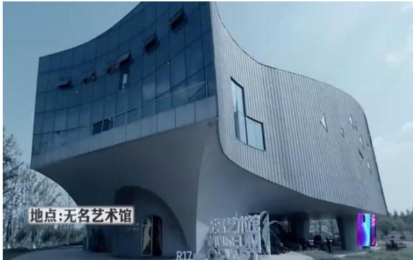  
图 2-3《逃出无名岛》无名艺术馆外景

# 二、精美道具完善舞台布景

《明星大侦探》对于真实氛围的营造不仅在于场景设计，还有道具的使用。道具是含于布景之中的细节，是完善舞台布景的重要元素，《明星大侦探》中的道具主要分为陈述性道具和线索道具。《明星大侦探》中的陈述性道具主要是指在节目中交代背景、刻画人物、叙述故事的道具。陈设性道具与舞台设置的整体基调相辅相成，共同为案件的故事发展创造了适宜的场景。依旧以第一季第七案《请回答1998》举例，《请回答1998》的故事背景设定在1998年，音像店中红色的电话机、90年代巨星刘德华的海报、当时热播剧《还珠格格》的明信片（如图2-4 所示)，杂货铺中的搪瓷杯、跳跳糖，游戏机厅内老旧的跳舞机，“欧美人”与“白状元”屋内的BP机、Windows98系统的台式电脑等具有当时时代特征的各种道具，让嘉宾和受众一起回到了1998年。又例如，在第四季第五案《天堂公寓》中张若昀扮演的“张高级”是一位假装成功人士的普通员工，他的房间放置着各种成功学书籍以及装满高端洋酒的酒柜，无不显示着他是一位成功人士，但却睡在简易的气垫床上,

暗示着他其实并没有那么“高级”。

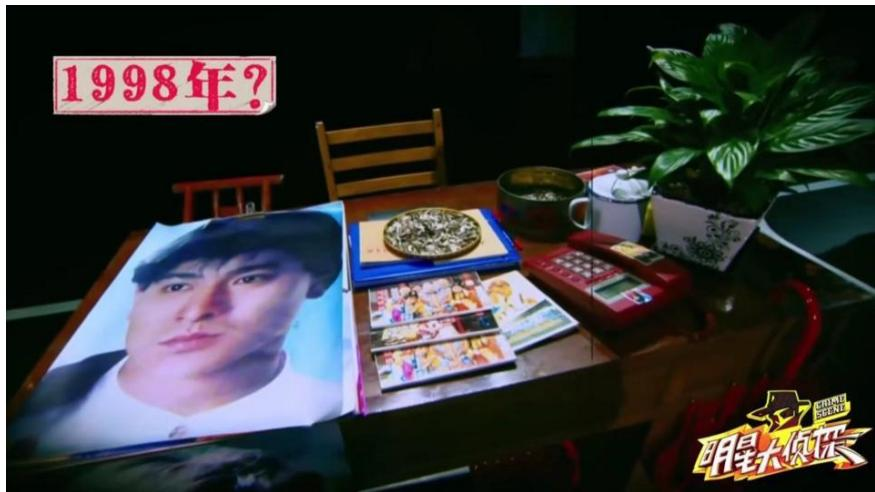  
图2-4《请回答1998》音像店道具

在《明星大侦探》中出现的任何一个道具，都有可能是推动剧情发展的重要线索，这些作为线索的道具被称为线索道具，通过这些线索道具可以推断出案件的隐藏信息、嫌疑人的作案动机、嫌疑人与死者的关系或者是嫌疑人彼此之间的关系等。例如在第五季第八案《X学校杀人事件》中，通过在“撒天才”和“何创造”房间发现的病历单中得知，“撒天才”与“范车车”在18岁之后都出现了“笑出鹅叫”的症状，而“笑出鹅叫”是DNA复制之后生产的2号孩子的症状，从而发现了“今日之子”计划的秘密。这些线索道具不仅与舞台布景紧密相连，共同营造场景的真实气氛，还推动了剧情发展。

《明星大侦探》中还有许多植入广告作为道具出现，抖音App是某些线索的承载，飘柔洗发水是“买凶人”与“凶手”确认身份的道具，OPPO手机更是每一期的“探案神器”。在第一季节目中，嘉宾收集线索时使用的是拍立得相机，但是拍立得相机拍出的照片存在对焦不准确、画质模糊的问题，自第二季起OPPO手机开始赞助节目，成为每期节目拍摄线索的机器。《明星大侦探》节目中，广告作为道具出现在节目中还会成为解开线索的关键道具，第五季第十案《探案唐人街》中，“晨私家”发现“鬼戏曲”笔记本电脑桌面与旁边的油画只有眼影一处不同，于是用欧莱雅黑魔水（卸妆水）擦掉眼影部分，从而找到了笔记本电脑的密码，并顺利打开电脑。节目组巧妙地将产品与道具结合起来，既让广告获得了理想的传播效果，也让广告在节目中的植入不显生硬与突兀。

# 第二节 声画兼具的视听语言符号

语言是人类传递信息、交流思想、表达感情的必要工具，是一种特殊的社会现象。通过科学地区分，人类语言可以分为逻辑思维语言和形象思维语言，“形象思维语言注重空间、时间、色彩、音调、情感，具有表情性、概括性、模糊性，像音乐语言、舞蹈语言、

绘画语言、雕塑语言等。”①视听语言是影视作品独特的语言表达，它通过画面与声音的排列组合传达信息、表达情感。

# 一、风格各异的画面语言

“所谓画面语言，主要是指电视艺术家用以构成视觉形象的各种因素和方式，体现创作构思的各种手段和技法的总和。这其中包括构图、光效、色彩、影调等诸多语言表述方式。”②

首先，是《明星大侦探》的画面构图。画面语言的基础是构图，一幅画面通常由主体、陪体以及主体周围的景物和空间构成，选择恰当的构图方式可以将节目画面中所包含的信息较为完整地传递给观众。《明星大侦探》中，每期节目的嘉宾以及线索道具，是节目画面主要表现的内容和观众关注的焦点，将节目的嘉宾以及线索道具安排在合理的位置进行构图，可以让节目内容更为充分地展现给观众，同时也让节目画面看起来更加赏心悦目。《明星大侦探》每一期节目都是以一个全新的、独立的案件作为节目的主要内容，每一期节目明星嘉宾都会饰演新的人物角色，由于每一期人物角色都不相同，因此对嘉宾进行描写刻画是不可或缺的。摄制组在以嘉宾作为拍摄主体时，多采用中心构图法或三分法构图,这两种构图方法都可以让节目嘉宾处于节目画面的视觉焦点，将人物信息展现得更为完整。在嘉宾入场环节，经常使用中心构图法，这种构图方法将嘉宾放置于节目画面的中心位置,用以突出嘉宾所扮演的人物形象。例如在第四季第七案《魔法学校的秘密》中，吴昕所饰演的“吴老师”戴着眼镜一袭白裙出场，一副知性优雅的教师形象深入人心（如图 2-5 所示)。

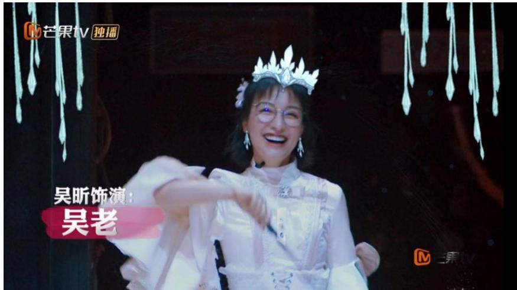  
图2-5《魔法学校的秘密》中心构图法拍摄嘉宾

《明星大侦探》是一个多人参与的节目，嘉宾之间的对话、沟通是节目需要展示给观众的部分。在不在场证明阐述和集中推理阶段，所有嘉宾坐成半圆形或者围坐在一张桌子周围，节目组在拍摄群像时多采用多方位变化构图，虽然人物众多但画面简洁，作为陪体的背景交代了当期节目的大环境，也不会让画面过于单调(如图2-6所示)。在集中推理时，每位玩家都在努力摆脱自己的嫌疑同时又在怀疑别人，此时多用三分法构图突出人物的面部表情、神态、语气。在搜证阶段，嘉宾行动频率高、行动动作琐碎，使用的构图方法也比较多样。

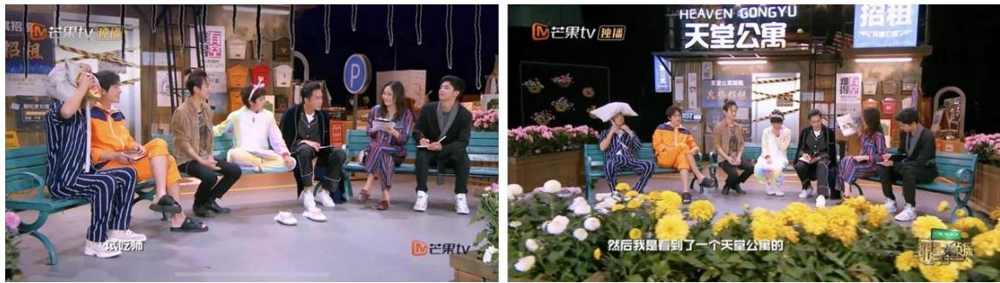  
图2-6《天堂公寓》嘉宾群像拍摄

纵深度变化构图可以展示较大的空间，《明星大侦探》实景录制的几期节目如《逃出无名岛》《又是漂亮惹的祸》中每个场景空间都较大，通过纵深度变化构图可以展示场景环境以及玩家的行动，让观众也能了解场景内的摆设与玩家共同寻找线索。集中讨论时，因为镜头中人物较多，为了展现人物的全貌与对话时的情景，节目组多以平拍为主；合作搜证时，由于人物运动幅度较大，摄制组运用了多种角度进行拍摄，如俯拍、仰拍等，从多种角度展现嘉宾们搜证的动作 (如图2-7所示)。《明星大侦探》节目组也会利用景深镜头的透视原理来增强画面的空间感，如第三季第二案《酒店惊魂Ⅱ》，当鬼鬼饰演的“鬼可云”打开墙上的暗门时，一条幽暗的密道出现在眼前，深邃而悠长，密道通向哪里，密道里面有什么，让玩家与观众都异常紧张但又好奇不已。

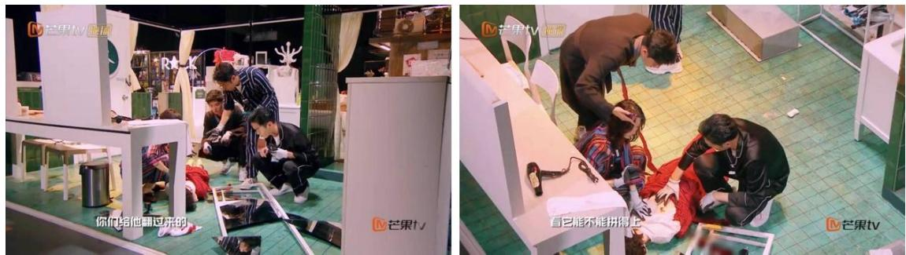  
图2-7《天堂公寓》拍摄角度

其次，《明星大侦探》节目中灯光的运用比之《犯罪现场》也有创新之处。光效的变化直接刺激着观众的视觉，合理地运用灯光可以起到吸引观众注意力、渲染节目氛围的作用。《犯罪现场》节目的整体风格比较严肃，其现场灯光也相应的比较灰暗，多使用白色的冷光，给人一种严肃的紧张感。《明星大侦探》第一季学习了《犯罪现场》的用光方式,现场灯光比较灰暗 (如图2-8所示)，人物的面部光线也很阴暗。《明星大侦探》自第二季起，现场都使用了明亮的灯光（如图2-8所示)，也不再只使用白色光，还加入了黄色光源。

这样整个画面会很明亮，观众可以清晰地在画面中看到嘉宾们在房间搜证以及他们之间的互动，白色与黄色混合光也会让嘉宾面部看起来明亮而柔和。除白色光和黄色光外，《明星大侦探》节目也尝试了运用不同颜色的光源来营造节目氛围，例如第二季第十一案《疯狂马戏团》就运用了蓝色、紫色、红色等光源来营造马戏团热闹欢快的氛围。

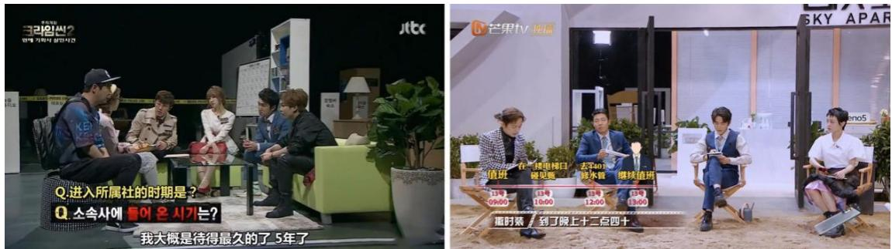  
图2-8《犯罪现场》与《明星大侦探》现场灯光对比

最后，《明星大侦探》通过色彩营造节目氛围、刻画人物形象。在画面语言中，色彩同样是构成画面的基本要素，从审美享受而言，它可以给人们带来审美的愉悦感，从而对人们的内心情感产生冲击，从它的作用而言，色彩往往以最直观的形式呈现出来，有效地运用色彩有助于烘托作品的主题思想，营造作品的整体氛围，更有利于创作者情感的主观表达。“色彩在画面的呈现上，主要是通过色调的呈现和调节上来产生的。”①色调是指画面色彩外观的基本倾向，是受众对一部影视作品或某个段落中整体颜色的概括评价。色调分为暖色调和冷色调，暖色调常象征着热烈、温暖、活泼，而冷色调象征着冷静、安详、庄重。《犯罪现场》注重节目的推理性与严肃性，整体的色调偏灰暗，给人一种冷静、严肃的紧张感。《明星大侦探》则是将推理性与娱乐性相融合，在节目中整体营造出一种暖色调的氛围。《明星大侦探》节目组无论是在场景设计上还是在嘉宾服饰上都大量运用暖色调，为原本恐怖的“凶杀案”现场营造一丝轻松的氛围。例如第二季第二案《唐人街传奇》运用了大量以红色为主的道具(如图 2-9所示)，如灯笼、鼓、花等，嘉宾的服饰也搭配红色或者黄色的装饰 (如图 2-10所示)，以此来彰显唐人街欢度春节的氛围，同时也会降低节目的恐怖氛围，为观众营造出了一种喜庆、欢快的节目氛围。当然节目组也不是一味地使用暖色调让节目因失去色彩而变得贫乏，还运用了蓝色、紫色、绿色、红色、黄色等颜色来形成冷暖交叉的效果，使色彩的搭配趋于平衡。

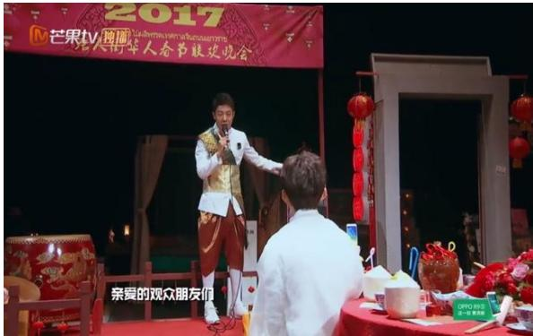  
图 2-9《唐人街传奇》红色为主的道具

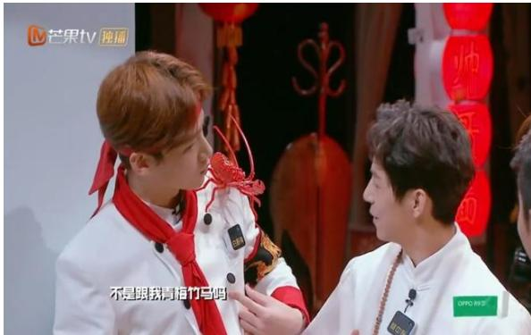  
图2-10《唐人街传奇》人物服饰

暖色调可以营造出温馨、欢快的节目氛围，冷色调则可以营造出严肃、凝重的节目气氛。《明星大侦探》节目的集中推理室和投票间的场景布置大多以冷色调为主，例如暗灰色、棕色，以增强其严肃性（如图2-11所示)。在《明星大侦探》节目中，冷色调还用来提升剧情的神秘感和恐惧感，例如《酒店惊魂》中的密道、《逃出无名岛》中的迷宫，在偏冷色调下记录嘉宾在探案的过程可以给观众营造一种神秘、紧张的氛围，增加节目的叙事张力。另外，在《明星大侦探》案情真相公开环节，演绎每一个悲情故事真相的片段都使用了冷色调，以此来增强悲凉、令人惋惜的氛围，让观众感受到凶手杀人时的愤怒与残忍以及被害人临死前的绝望（如图 2-12所示）。

  
图 2-11《唐人街传奇》集中推理室场景色调图 2-12《冲不上的云霄》真相公开片段色调

色彩不仅可以营造气氛，对于影视作品中人物形象的刻画也起着关键的作用。在《明星大侦探》每一期案件中，嘉宾的造型都会根据当期节目中案件的角色进行设计，以此来展现不同角色的身份特点，例如第三季最后一案《又是漂亮惹的祸》中，白敬亭饰演的“白患者”是一位在火灾中失去至亲的人物，节目组在为他设计服装时选择了灰色与白色为主色调的服装 (如图 2-13所示)，通过服装以突显出这一人物的内心色彩——亲人都在火灾中丧生对生活不再抱有希望。而大张伟饰演的“大邻居”是一位与凶杀案无关而又乐观的人，节目组在为他选择服装时则使用了亮蓝色以及黄色 (如图2-14 所示)，来凸显这一人物的阳光与无忧无虑。通过色彩可以塑造人物形象、刻画人物细节，让观众更容易捕捉节目中不同人物的细节形象，了解人物的个性特征，从而使观众更容易进入节目氛围。

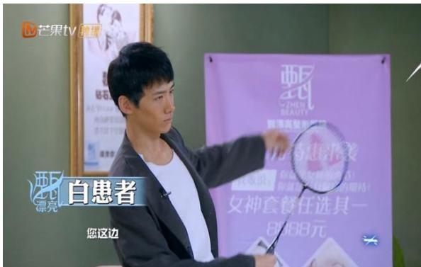  
图 2-13《又是漂亮惹的祸》“白患者”服装

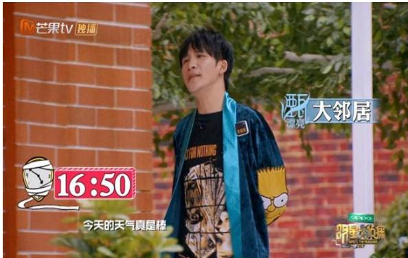  
图2-14《又是漂亮惹的祸》“大邻居”服装

# 二、引人入胜的听觉语言

观众在观看综艺节目时，不仅会关注画面，还会捕捉声音。声音是视听语言中不可或缺的组成部分，任何一档成功的综艺节目都离不开视觉语言和听觉语言的共同作用，《明星大侦探》也不例外。《明星大侦探》节目的听觉语言创新主要体现在音乐和音响元素两方面。

在综艺节目中，音乐可以营造节目氛围，营造与画面内容相应的意境，能够产生立体、完整的艺术效果,可以更为轻易地打动人心。音乐能够传达欢快、恐怖的情绪，同时还可以营造轻松、紧张的氛围。《明星大侦探》节目中，具有悬疑气氛的音乐和幽默搞笑的音乐会根据不同的场景来运用，这种使用方式使该节目的节奏张弛有度，其中包含严肃专业的推理环节，也不乏轻松幽默的综艺氛围。在案件进入恐怖阶段时，节目所使用的配乐大多较为阴森诡异，而案件中温馨搞笑的时刻，节目所使用的配乐或轻松明快或悠闲美好，体现出了节目轻松、搞笑的特点。例如第三季第一案《又是漂亮惹的祸 $\bigstar \bigstar \bigstar$ ，在所有嘉宾玩家出场各自去做自己的事情时，灯突然熄灭，一阵奇怪的音乐莫名响起，旋律尖锐而空灵，所有人都惊慌失措，更有女嘉宾吓得大叫，现场的恐怖气氛达到极致。

《明星大侦探》中使用了许多配乐，这些配乐除了可以营造氛围之外，还起到了表达人物情感的作用。第五季第八案《X学校杀人事件》聚焦当下热点基因编辑的主题，科学家通过胚胎改造，创造父母眼中的“完美”孩子。本案中的“贾完美”1号在十岁时知道自己即将被“完美”的2号替代，为了不被替代，他砸晕了“完美”的2号将其送走，之后便克制自己的本性，再也不玩游戏，装作很乖巧的样子，努力学习讨好父母。他认为父母爱的根本不是他，而是那个能满足父母所有期待的小孩，此时饰演“贾完美”母亲的王鸥潸然泪下，《不完美小孩》的背景音乐响起，“贾完美”一遍一遍说着要学习、赌咒发誓一定听妈妈的话的画面以及“贾完美”的奖状、入学通知书的画面随着背景音乐出现，作为母亲看见孩子为讨好父母而压抑天性的心酸通过音乐流露出来。

在综艺节目中，配乐能够渲染节目氛围，表达人物情感，是综艺节目必不可少的元素，而节目主题曲能够起到凸显节目内容、增强观众记忆点的作用。综艺节目大多都有属于自己的节目主题曲，这些节目主题曲通常是以节目的中心内容为创作源泉，例如早期的综艺节目《曲苑杂坛》的同名主题曲，现如今《花样姐姐》的主题曲《Goda Goda》等，这些主题曲贴合节目风格，能够传达节目主旨，通常由节目嘉宾进行演唱。《明星大侦探》第三季推出了自己的主题曲《无罪说》，该曲充满了探案解密的紧张色彩。《无罪说》由唐恬作词，李伟菘作曲，由节目嘉宾何炅、撒贝宁、王鸥、鬼鬼、魏大勋共同演唱，以富有节奏的旋律，配上蕴含深意的歌词，营造出紧张悬疑的气氛。这首歌曲将《明星大侦探》节目中探案、悬疑的元素尽数展现。以下为歌曲《无罪说》的部分歌词：

世界本浑浊 罪与爱同歌  
人人有话说 你呢  
侦探的法则 别相信耳朵  
追寻真相的 白鸽  
正义演说 或来自恶魔  
极恶之恶 或出自爱呢  
通往深渊 的线索  
屠龙的高手 变做 恶龙 难道只是传说  
世界本浑浊 罪与爱同歌

人人有话说 你呢

主题曲中的歌词，本身就是对节目主旨的提炼，对节目剧情的概括性叙述。例如歌词中“侦探的法则，别相信耳朵”就是点明了侦探要重证据与推理而轻诡辩。“正义演说,或来自恶魔”，则是指节目中真凶为掩饰罪行而进行的看似正义的辩解。“极恶之恶，或出自爱呢”，节目里有很多因爱而杀人的情节，其实很多时候凶手不是真正的坏和残忍，他们只是因爱而生恨，而选择了暴力杀人的错误行为。综艺节目的主题曲与其节目的关系是相互依存、相互作用的，节目的传播使得其主题曲流行，主题曲的流行又增加了其节目的整体传播。

提到《明星大侦探》中的音乐的创新，必须提到“NZND”组合，这个组合在第一季第三案《男团的战争》中第一次出现，他们的成名曲《如果我开挖掘机你还会爱我吗》,歌词诙谐幽默略带恶搞，旋律则是源自一首脍炙人口的儿童歌曲《假如幸福的话就拍拍手吧》，这样的改编令观众捧腹大笑，在网络上广泛流传。《明星大侦探》中多次运用这种经典歌曲与全新歌词相结合的方式，引起观众过往的记忆，以此来拉近与受众之间的距离。在第三季《NZND之岁月无情》中，何炅演唱的《Shopping 的回忆》改编自经典老歌《粉红色的回忆》，依然是熟悉的旋律，但歌词已经改编为各大奢侈品牌的集合。第四季第四案《NZND 回到未红时》，也是何炅演唱了《我希望在你的 Shopping 里》，自诩自己就是适合唱这种“贵”的歌，更是把这种风格的歌曲定义为“都市轻奢风”。除此之外，有很多期节目案件真相公开时刻，嘉宾就会不约而同地唱起改编自经典老歌的《有一种不祥的预感》，给受众一种既无奈又搞笑的感觉。《明星大侦探》节目组正是通过这些受众熟知的旋律与无厘头的歌词的结合，加强了节目与受众之间的联系。

音响，主要是指电影或者电视剧中除去人的语言以及音乐之外的其他声响，是影视作品重要的组成部分。音响元素在《明星大侦探》节目中的运用比较零散，节目中一个人物的面部表情或者肢体动作都可能会配上拟音。例如第三季第十一案《又是漂亮惹的祸》中，何炅饰演了一位割双眼皮失败的患者，眼睛会一直睁开，大张伟饰演的侦探让他发言时，节目组为其配上了闪闪发光的特效以及“布灵布灵”的拟音，突出“何患者”的面部特点，兼具幽默与搞笑。音响作为辅助元素，可以配合视觉画面烘托环境气氛、突出人物形象和强化戏剧效果。《明星大侦探》节目中经常使用音响来渲染恐怖的气氛，例如第二季第七案《恐怖童谣》中，位于深山中的古堡里，会不时传来儿童低声吟唱的歌曲，伴随这段吟唱出现的还有轻微的敲门声、窗户摇晃的声音，配合画面中出现的昏暗走廊、表情怪异的娃娃、不断闪烁的灯光，让人不寒而栗，毛骨悚然，让观众有一种身临其境的感觉，同时也有力地渲染了冰雪封山中古堡的恐怖气氛。音响还能突出节目中人物的身份形象，在《明星大侦探》节目中，人物的身份形象可以通过服装造型来表现，也可以运用节目中的音响效果来表现。在第五季第七案《MGQ时尚风云》中，“何社长”出场时，杂志社员工争先恐后地欢迎社长，配合员工因为推揉动作发出碰撞的音响，以及配合动画特效出现的锣鼓声，无不显现着“何社长”重量级的身份。

《明星大侦探》节目擅长运用音响营造节目气氛，丰富节目的娱乐表达。在《明星大侦探》节目中，各种音响的运用看似微不足道，却可以在无形中使得节目更加真实、更具吸引力。

# 第三节 极具特色的后期制作

对于综艺节目而言，节目的后期制作同样也是至关重要的。后期制作在整个综艺节目生产流程中扮演故事重构的角色，情节的推进、人物形象的塑造很大程度上也依赖着后期制作。

# 一、故事性与综艺性融合剪辑

节目的后期剪辑可以最大程度地修正前期拍摄过程中的不足，是对节目的二次升华，优秀的后期剪辑可以丰富画面内涵，使节目内容表达更清楚、节奏更鲜明。

由于《明星大侦探》逻辑推理性和剧情互动性的特点，节目的后期剪辑难度较大，既要尊重剧情的推理逻辑，又要在逻辑体系基础上展示剧情，《明星大侦探》采用了电影的剪辑手法。蒙太奇，“由许多个镜头合乎逻辑地、有节奏地组接在一起，从而阐述或叙述某件事情的发生和发展的技巧。”①蒙太奇所具有的独特的叙事功能，令推理类节目受益良多，《明星大侦探》通过平行蒙太奇、积累蒙太奇、抒情蒙太奇、心理蒙太奇等多种蒙太奇手法来叙述故事、展现人物内心情感。

平行蒙太奇，在功能上属于叙事蒙太奇，“是指故事发展中,将两件或更多的事件在同一时间、不同空间同时并置进展，画面交替出现，互相联系，彼此呼应，以达到相互促进,互为补充，对比烘托或互相刺激的目的。”②《明星大侦探》节目的搜证阶段，用到最多的剪辑方法就是平行蒙太奇。在搜证阶段，六名玩家分为两组进行取证，每组限时十分钟,在这十分钟内，每位玩家会根据自己的想法有不同的行为方式，去往不同的房间，获取不同的信息，运用平行蒙太奇这种剪辑方法可以将每个人在做的事情进行交汇，完成时空的省略，加快叙事节奏，同时也渲染了搜证时的紧张气氛。第二季第五案《周五见》中，“何美男”在第二轮搜证时发现“撒微笑”房间内有与案发时进入凶杀现场外卖员一样的衣服,而此同时，“白rap”在“鸥记者”的房间发现“鸥记者”的出生证明，从而发现“鸥记者”是“郝巨星”与“贾天王”的孩子。在“郝巨星”与“贾天王”拍摄电影时，“贾天王”被烧死，“郝巨星”被污蔑乱扔烟头导致火灾，受不了舆论的攻击而自杀，而污蔑“郝巨星”的人正是本期案件的死者“甄花旦”。在本期案件中，“撒微笑”与外卖员一样的衣服是一个干扰性线索，而发现“鸥记者”的真实身份是指向“鸥记者”杀人动机的线索，剪辑师通过平行蒙太奇的剪辑手法把两个同时发现的线索剪辑在一起，把干扰性线索与决定性线索引发的故事分别交代清楚，从而洗去“撒微笑”的嫌疑，后面则通过其他线索洗去“乔学生”的嫌疑，最后通过关键性线索锁定了杀人真凶“鸥记者”。

积累蒙太奇也是叙事蒙太奇的一种，是“将一些内容、性质、景别、运动方式等大致相似的镜头组接，通过不断地叠加的积累效应，树立一个主题或渲染一种情绪。”③影视作品中的积累蒙太奇手法如同中国古典诗词中意象的并置叠加，能够渲染情绪，加强剧情对观众的感染力。清代词人纳兰性德的小令《蝶恋花·出塞》这支小令的最后一句用三个不同的意象“深山”“夕照”“秋雨”并置叠加，将自己此时所有的感受都融入到景物之中，为我们营造了清冷孤寂的氛围。在《明星大侦探》中也有多处运用积累蒙太奇来渲染情绪，例如第二季第七案《恐怖童谣·上卷》开篇的几个镜头，一望无际的森林、茫茫白雪的山谷、雪地上匆匆行走的行人、风雪交加中急奔的马车、神秘阴森的古堡，一种恐怖气息随即而来，进人城堡后，空旷的古堡走廊、家具陈旧的大厅以及烛光下表情怪异的布娃娃，使人不寒而栗，恐慌不安的情绪跃然于眼前。

抒情蒙太奇是表现蒙太奇的类型之一，“是一种在保证叙事和描写的连贯性的同时,表现超越剧情之上的思想和情感。让·米特里指出：‘它的本意既是叙述故事，亦是绘声绘色的渲染，并且更偏重于后者。”①《明星大侦探》节目中抒情蒙太奇经常与背景音乐结合使用来营造节目氛围。第一季第四案《人鱼之泪》中，“鸥助理”在回忆杀死人鱼岛主的情景时，通过不断转换的画面来表现其杀人时的心理与事后的悔意，将空镜头与缓慢音乐相结合营造了一种悲伤的情感氛围，随后画面转向“欧助理”充满悲伤的脸庞，更加深刻地表达了此时她内心的悔意与不舍。

心理蒙太奇是表现蒙太奇的类型之一，“主要指通过镜头组接或音画的有机结合，直接而生动地展示人物的心理活动和精神状态，譬如表现人物的闪念、回忆、梦境、幻觉、想象、遐想、思索甚至是潜意识的活动，是影视作品中心理描写的重要手段。”②在影视作品中，心理蒙太奇通常被应用于展示人物的心理活动，就如同小说中的心理描写一样,在推理类综艺节目中常常用到心理蒙太奇来表达节目中角色的心理活动，如某个角色在分析推理时脑海中一闪而过的想法、回忆在搜证时看到却没有在意的证据等。心理蒙太奇弥补了推理类综艺节目无法展现玩家心理活动的缺点，为玩家的心理活动以及探案时逻辑分析的心路历程找到了一个切入点，以便观众能够通过直观的画面理解玩家的内心想法和推理逻辑。《明星大侦探》节目中，心理蒙太奇多用于展现搜证阶段玩家的搜证思路和投票阶段玩家的内心想法。第二季第一案《公主嫁到》最后的投票阶段出现了平票的情况，“撒太子”与“蓉宫女”各获得了三票，这时唯一没有把票投给他们俩的“鬼侧妃”可以在他们俩之间选择一人投票，这一票将要决定能否找出真正的凶手。“鬼侧妃”先是牵住了“撒太子”的手，此时“撒太子”说请用你的脑子想一想，此时的画面出现“鬼侧妃”一幕幕的回忆：交给太子的胭脂、瓶子里的不明液体、“炅先生”没有用过的毒药，伴随着“撒太子”的画外音“口红杀人是男人所为还是女人所为”，“鬼侧妃”恍然大悟，最终把票投给了“蓉宫女”，抓住了本期案件的凶手。在节目录制的时候，“鬼侧妃”从一开始认定“撒太子”是“凶手”到想清楚真正的“凶手”应该是“蓉宫女”仅是一瞬间的事，观众在观看节目时不能感知她的心理变化，但是剪辑师通过心理蒙太奇外化了“鬼侧妃”转变投票对象的心理过程，帮助观众理解了她的最终决定。

# 二、挖掘特效字幕的潜在功能

综艺节目的后期制作还包括了特效字幕和动画特效。特效字幕和动画特效是在画面剪辑完成之后对节目进行的二次加工，后期特效对于综艺节目的呈现有着锦上添花的作用。

# （一）特效字幕的运用

字幕是“影视文字符号，认为字幕是通过银幕显现、以阅读的方式来接受的信息，字幕具有与语言相同的表意功能和解读方式。”③起初字幕只是在电影影片和新闻节目中出现的解说文字，用以解释说明节目内容，以最直观的方式将信息内容传递给观众，后来字幕逐渐在综艺节目中开始应用。随着观众对综艺节目的要求越来越高，以及后期制作技术和数字技术的更新换代，字幕的形式风格也变得越来越多样化、娱乐化。现在综艺节目中的特效字幕不单单只是传统的字幕，而是与图片、动画配合使用的形式多样、色彩丰富的一种表达手段。与传统字幕单一的形式相比，特效字幕具有娱乐性和多样性，特效字幕的运用能够充分传达节目内容，让节目画面更加丰富，起到与节目相互映衬的效果，同时增加了节目的吸引力与视觉冲击力。

目前网络自制综艺节目中最流行的字幕形式就是特效字幕，网络自制综艺节目发展势头如日中天，网络综艺节目的竞争也日益白热化，特效字幕的创新对于一档综艺节目来说也尤为重要。《明星大侦探》的特效字幕在一众网络综艺节目中别出心裁，以极富想象力和创造力的形态在一众网络综艺节目中脱颖而出，吸引受众的广泛讨论。《明星大侦探》节目中特效字幕没有固定的形式，会随着节目内容而变换，特效字幕在《明星大侦探》中主要有以下几种作用。

首先，特效字幕在综艺节目中常起到解释说明、适时补充信息的作用。在节目制作中,由于节目画面缺少完整的信息或者画面细节不能全面呈现，以免观众在观看节目时对节目内容产生不解，在后期制作时会采用特效字幕的方式，起到介绍节目环节以及解释说明的作用，常在节目中用于需要介绍游戏规则或者人物信息 （如图2-15 所示)。第三季第二案《酒店惊魂Ⅱ》中，大家在“何漫画”的口袋中发现了铅笔和钥匙，由此他不得不承认一号病房的门是他打开的，并解释了如何用不配套的钥匙和铅笔打开了一号病房的门，由于镜头无法拍摄何漫画打开门锁时门锁内部的状态，为了让观众理解其打开门锁的方式，后期制作时以特效字幕的形式展现给观众，还加上了温馨提示的字幕“游戏任务设计请勿模仿”，此时观众也能根据特效字幕理解“何漫画”打开房门的方法（如图 2-16 所示)。此外，特效字幕还起到了适时补充信息的作用。《明星大侦探》中会涉及到许多法律知识,后期制作时以特效字幕的形式对这些法律知识进行补充说明，还是以《酒店惊魂》中的一幕举例，在本案中，“张经理”以为自己杀了人，“撒兽医”向他普及，如果“张经理”杀死被害人之前，被害人已经死亡，那么他的行为不叫杀人，叫做对象不能犯，字幕采用简单明了的字形普及了这个法律知识 (如图2-17所示)。

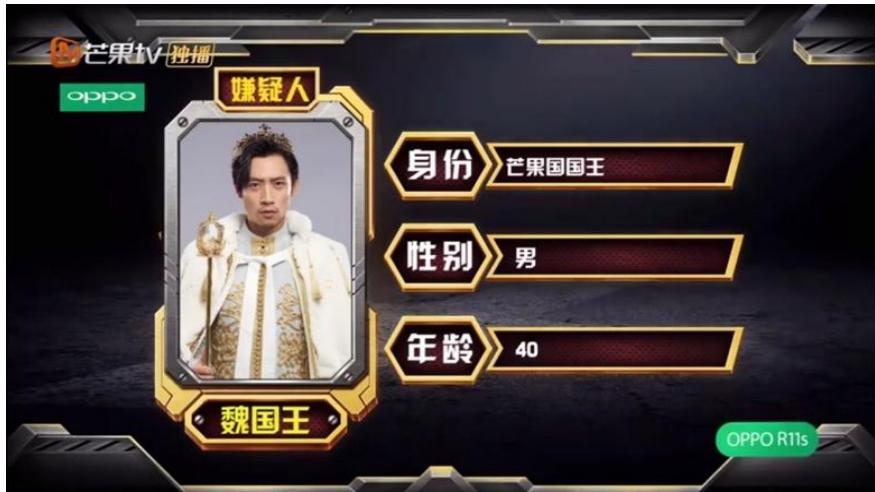  
图2-15《暗黑童话》使用特效字幕介绍游戏中的人物信息

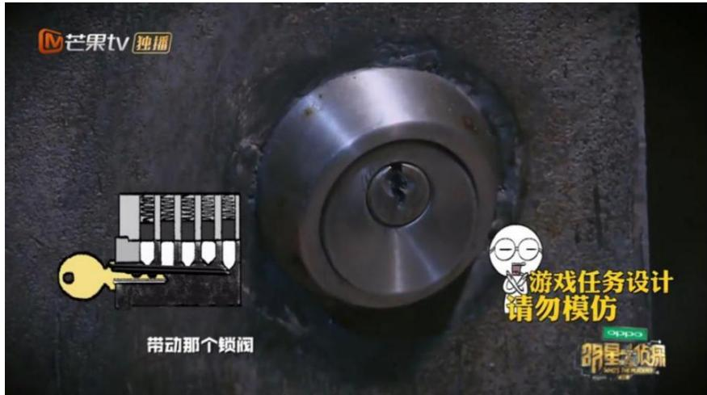  
图2-16《酒店惊魂》使用特效字幕解释打开门锁的方式

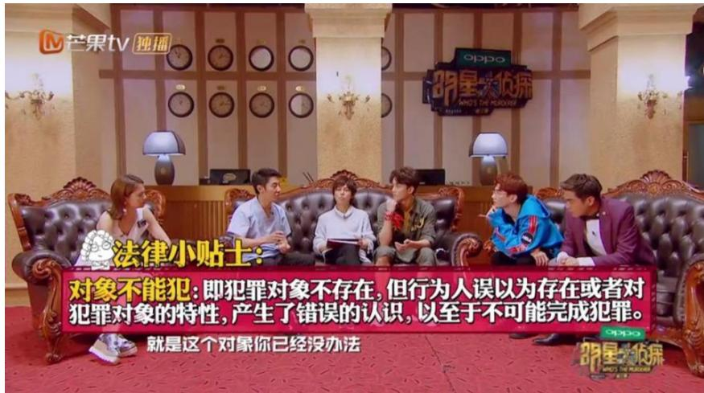  
图2-17《酒店惊魂》使用特效字幕普及法律知识

其次，特效字幕在综艺节目中起到渲染情绪氛围的作用。随着特效字幕在综艺节目中的运用和发展，特效字幕已经在渲染人物情绪、烘托节目氛围等方面成为不可缺少的手段。特效字幕可以渲染节目中人物的情绪，当节目中的人物出现较为强烈的情绪起伏时，特效字幕可以让观众更加深刻地体会到节目中人物的情绪，增强节目的可看性和趣味性。当节目中的人物生气时，会用红色的特效字幕表达人物的愤怒,当节目中嘉宾遇到好笑的事情时，会出现“哈哈哈”的特效字幕等 （如图2-18 所示)。特效字幕还可以烘托节目氛围，由于《明星大侦探》节目每期的主题不同，相应地每期节目需要营造的氛围也不相同，特效字幕可以配合节目中的场景与音响一起营造节目氛围，例如第五季第七案《MGQ 时尚风云》,本期节目场景设置在时尚杂志社，所涉及的人物都是时尚杂志社的工作人员，人物出场时，后期在走廊使用了金色流光的特效，人物也加上了金色星星的特效，营造时尚杂志社纸醉金迷的氛围。本期节目设定的故事背景是为杂志社社长庆祝生日，社长人场时，使用了小白人举着气球的Q版图像以及表示喜庆的挂饰的特效，还使用了“恭迎老佛爷”的彩色字幕，营造出一片庆生的欢乐氛围（如图2-19 所示）。

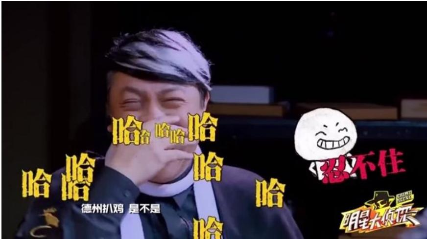  
图2-18《请回答1998》使用特效字幕渲染节目中人物的情绪

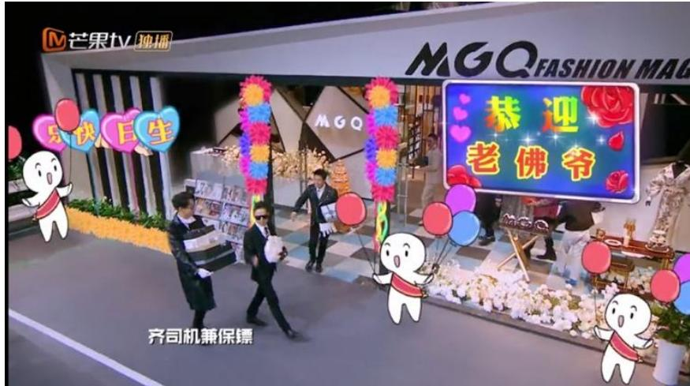  
图2-19《MGQ时尚风云》使用特效字幕营造节目氛围

再次，特效字幕在综艺节目中起到反映人物内心活动的作用。在《明星大侦探》节目中，特效字幕可以用配合节目中人物的表情和动作，对人物内心进行模拟，表达出剧中人物的心理动作。《明星大侦探》第四季第三案《神秘来电》中，“鬼机灵”发现了“贾四艇”在他们俩合照下对她写的表白话语，便质问“贾四艇”是不是喜欢她，“贾四艇”结巴地否认，同时低下了头，特效字幕出现了“贾四艇”害羞的表情包以及“好难为情”的文字，接着“鬼机灵”把“贾四艇”写的那段话读出来，“贾四艇”脸上出现了表示害羞的粉红图案，“鬼机灵”接着问“贾四艇”，“我爱什么？”“贾四艇”不再搭话，特效字幕在“贾四艇”的头上做出了一个透明玻璃罩的样子，表示屏蔽。“鬼机灵”见“贾四艇”不理她,对着空气问“他是不是爱我”，此时“贾四艇”的脸上又一次出现表害羞的粉红图案并搭配文字“你说呢” （如图 2-20所示)。节目中，那些嘉宾无法说出的话语，通过特效字幕展现出来，可以让观众解读剧中人物的内心和了解故事剧情，用有趣的特效字幕来表达剧中人物内心，对剧情的发展也有着推动作用。

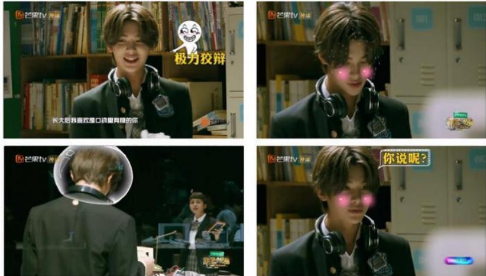  
图2-20《神秘来电》使用特效字幕反映人物内心活动

最后，特效字幕可以塑造人物形象。《明星大侦探》节目中，常常用特效字幕配合镜头画面塑造人物形象，节目中人物的行为动作以及故事剧情，通过后期制作时标签化的提炼，可以起到突出人物形象的作用。例如，节目中鬼鬼的“搜证犬”人设、白敬亭的“背锅侠”“注孤生”人设、撒贝宁的“狗头侦探”人设、王鸥的“直觉女神”人设，等等。节目中，通过画面与特效字幕的配合把这几位明星在节目中的形象刻画得深入人心。

除此之外，特效字幕还可以增强节目的娱乐效果。作为一档推理类网络综艺节目，《明星大侦探》节目在推理之余还不忘满足观众的娱乐需求，在后期制作时，会运用网络流行语，自制的表情包，有趣的特效字幕，来增加节目的娱乐性。例如第四季第六案《巨想谈恋爱》中，魏晨在自我介绍时说，虽然你们都不认识我，但一定是看着我的戏长大的，大家一片沉默，画面上出现“黑人问号脸”的图片以及一阵风吹树叶的特效，随后大家哄堂大笑，满屏出现“哈哈哈”的特效字幕,这时撒贝宁说“那我真是很幸运，我能长这么大”，此时后期标注的特效字幕是“贵剧有毒”，观众跟随着现场的氛围，也不禁莞尔一笑。在第一季第七案《请回答1998》中，白敬亭在说“杀人动机”这几个字的时候语速比较快，鬼鬼把“杀人动机”听成了“山东鸡”，她表示不解并重复了一遍“山东鸡”，引起在场其他嘉宾的大笑，特效字幕随即出现了“山东鸡”的字样 （如图 2-21所示)，并出现一系列大公鸡、小黄鸡、老母鸡的特效（如图 2-21所示)。同时节目组在后期制作时，还对节目中出现的小动物进行了拟人化的处理，这些处理同样能增加娱乐效果，例如第四季第五案《天堂公寓》的搜证阶段，屋顶花园有两只小鸡的道具，在嘉宾搜证时，出现了两只小鸡对话的特效字幕 （如图2-22所示)，这样的拟人化处理也为节目增添了娱乐性。

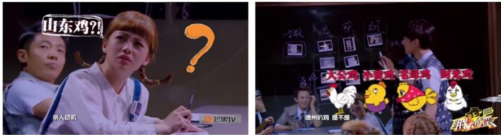  
图2-21《请回答1998》使用特效字幕增强节目的娱乐效果

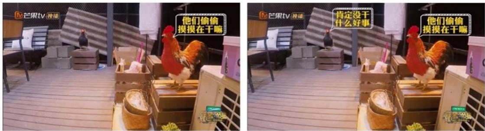  
图2-22《天堂公寓》使用特效字幕对动物进行拟人化的处理

特效字幕在节目中的运用可以让观众能够拥有良好的视觉体验，同时还可以凸显节目的娱乐性和趣味性，也促使节目画面的构成更加多姿多彩。

# （二）形象丰富的动画运用

《明星大侦探》节目中，除了上述特效字幕的运用之外，在后期制作中独有的动画特效也独具匠心。《明星大侦探》节目在后期制作时创造了其节目独有的动画花字，这些动画花字以节目内容为创作依据，为节目量身打造，让节目看起来趣味性十足。

首先，是“尔康”卡通表情包的运用。“表情包是基于社交媒体及互联网不断发展后的产物，它通常是以时下流行的语句、动漫、影视截图等为主要素材，通过二次创作而形成的一种用以表达特定情感方式的图片。”①《明星大侦探》节目中的“尔康”卡通表情包出自经典电视剧《还珠格格》中的角色尔康，他夸张的表情、做作的手势被网友截图做成表情包在网络中广为流传。《明星大侦探》节目中，“尔康”卡通表情包是在“尔康”表情包的基础上，将其形象卡通化，并结合《明星大侦探》节目每期不同的内容制作而成,通常出现在搜证环节的倒计时时刻。在搜证环节的倒计时阶段，在出现画外音“你的时间只剩最后XX分钟”的同时，还会有“尔康”倒计时的卡通表情包（如图 2-23 所示)。最初几期节目只是“尔康”的卡通形象配合字幕出现，随着节目的播出，还出现了“尔康环抱紫薇”的表情包（如图 2-23所示)，以及与当期节目主题内容相关的“尔康”卡通表情包。例如《明星大侦探》第一季第十案《英雄不联盟》中，“尔康”化身为绿巨人浩克（如图2-24所示)；第二季第十案《花田醉》中，他又化身为戏剧名伶的形象 (如图2-24所示)；第三季第四案《深夜麻辣烫》中，“尔康”又变成了手捧麻辣烫的小二 (如图 2-24所示),“尔康”举着麻辣烫的手都烫红了，让观众不禁为“尔康”一阵心疼；第四季第一案《逃出无名岛I》探讨了网络暴力，尔康又化身为“键盘侠”，胸前写着“正义”二字，身后背着一个键盘，带有一丝戏谑的意味 (如图 2-24所示)；第五季最后一案《北方慢车谜案I》中，“尔康”则是穿上了军大衣，以检票员的身份出现（如图2-24 所示)；第六季第三案《新四大才子》中，“尔康”以“如花姐”的经典抠鼻形象出现 (如图 2-24所示)。《明星大侦探》节目从第一到第六季，除少数几期节目“尔康”卡通表情包没有出现外，基本上每期节目都运用了与节目主题内容相应的“尔康”卡通表情包，这些贴合节目内容的“尔康”卡通表情包在节目中频繁出现，使其成为《明星大侦探》节目的一个象征性符号,网友们戏称为“流水的嘉宾，铁打的尔康”。

  
图2-23《明星大侦探》尔康表情包部分截图  
图2-24《明星大侦探》1-6季尔康表情包部分截图

其次，是Q版人物动画的运用。《明星大侦探》节目在后期制作时会根据嘉宾在当期节目中的人物形象制作一系列Q版人物动画，这些Q版人物动画与嘉宾当期的人物形象造型相同，能让观众一眼就认出来，常用于展示嘉宾的内心想法、嘉宾之间的互相调侃等。

《明星大侦探》节目第一轮搜证环节，嘉宾单独搜证时，画面比较单调，这时候就会出现该嘉宾的Q版人物动画，例如《明星大侦探》第五季第三案《甄的步行街》中，何炅在侯明昊房间寻找线索时，竟什么都没有发现，此时画面上出现了何炅的Q版人物动画，并配有字幕“你成功引起了我的怀疑” （如图2-25 所示)，没有找到线索的何炅不甘心，继续在奶茶配料箱里寻找线索，此时画面上出现的是何炅Q版人物闭着眼睛推着眼镜的动画，与字幕“万物皆可是线索”搭配（如图2-25所示)，展现了何炅找不到线索不停止的内心想法，在侯的房间里依旧没有找到线索，此时何炅的Q版人物已经变成了抓着头发大喊“这不科学啊” （如图2-25 所示)，接下来何炅终于找到了一个箱子却打不开，此时何炅的Q版人物已经冒怒火 (如图 2-25所示)，随即倒地不起 (如图 2-25 所示)，最后何炅终于在侯明昊房间门口的花盆里找到了线索，此时何炅的Q版人物终于长舒一口气“总算有线索了”（如图 2-25所示)，后期制作组运用Q版人物动画，既展示了嘉宾的内心想法，又提升了单独搜证阶段画面的可看性。除此之外，这些Q版人物动画还会出现在嘉宾的自我介绍时，推理案情时亦或者回忆时，等等。例如《明星大侦探》第四季第六案《巨想谈恋爱》中，撒贝宁与王鸥在剧中饰演的是一对夫妻，撒贝宁在讲述与王鸥的相遇时，王鸥的Q版人物动画随着撒贝宁的讲述出现在画面上 (如图 2-26 所示)，让他们相遇的过程活灵活现，让这段回忆具有了画面感。

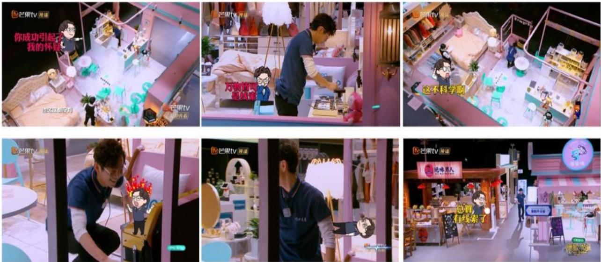  
图2-25《甄的不行街》Q版人物图

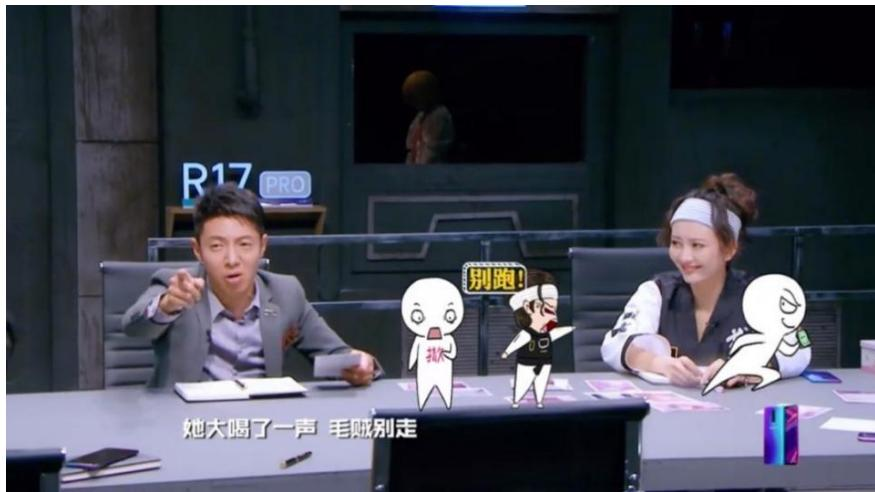  
图2-26《巨想谈恋爱》Q版人物图

最后，是“小白人”动画形象的运用。《明星大侦探》节目中深入人心的动画形象,除了“尔康”表情包、Q版人物动画外，还有一群“看热闹不嫌事儿大”的“小白人”。后期制作组设计的“小白人”采用了极简画风，“小白人”大大的脑袋，胖乎乎的身体，极具可爱之感，配合节目中嘉宾的语言、动作，使得整档节目更加具有娱乐性。这些“小白人”会出现在节目里的任何环节，有时候是单独一个出现，有时候是一群一起出现，既能与嘉宾互动，吐槽嘉宾的行为，又能强调嘉宾的行为，展示嘉宾的内心感受，等等。例如《明星大侦探》第三季第八案《无忧客栈》中，在搜证环节，撒贝宁“戏精”附体，装作掉进了水里，这时一个“小白人”出现了，它坐在板凳上呼唤着其他“小白人”一起来看撒贝宁的表演 (如图 2-27所示)，此时如果没有小白人的配合，只是撒贝宁一个人在给自己“加戏”，那么效果一定会差很多，配合上“小白人”的动画形象，既让撒贝宁的独角戏不会显得尴尬，又增添了节目的娱乐性。“小白人”还经常出现在嘉宾身边，有的时候是配合嘉宾所说的话（如图 2-28所示)，有的时候是展现嘉宾的内心情感，如喜悦、难过、疑惑等 (如图 2-28所示)，有的时候是吐槽嘉宾的行为 (如图2-28 所示)，还有的时候是作为局外人肯定嘉宾的表现 (如图2-28 所示)。这些“小白人”频繁地出现在《明星大侦探》的每一期节目里，能够贴合剧情为节目增添笑点，同时也能够让观众加深对节目的印象。

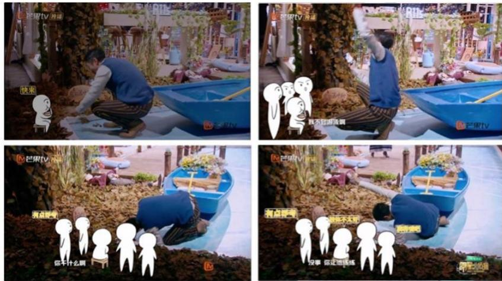  
图 2-27《无忧客栈》小白人动画形象

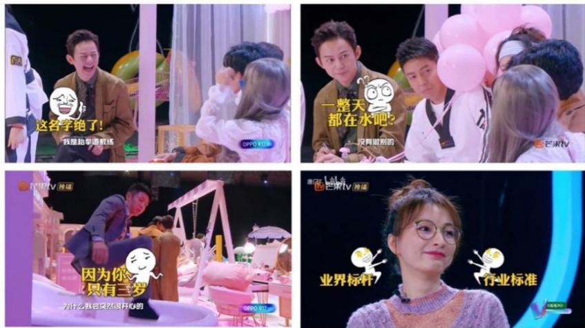  
图2-28《巨想谈恋爱》小白人动画形象

# 第三章《明星大侦探》节目传播的创新策略

伴随网络自制综艺节目持续发展的势头，除了节目的内容与形式层面的创新，节目传播策略的创新也同样重要。陆地教授认为网络自制视频节目的基本特征为“专为网络而创作、适合网络传播、符合网民胃口。”①在互联网时代，一档综艺节目的传播早已不是单向性的传播，多元化的受众需求推动着节目组制作符合观众喜好的节目，网络化的传播媒介促使着节目进行全方位立体化的传播。

# 第一节 以受众为中心的传播理念

依托于互联网时代的网络自制综艺节目，必须顺应时代的发展，互联网的多元发展为《明星大侦探》节目制作层面的创新提供了基础。在传播层面，《明星大侦探》以受众为中心，借助网络收集大数据分析节目受众的需求与喜好，并在此基础上制作符合受众偏好的节目内容。

# 一、大数据精准定位目标受众

根据中国互联网络信息中心今年发布的第47次《中国互联网络发展状况统计报告》显示，截止2020年12月，“我国的网民规模已有9.89亿，普及率达 $7 0 . 4 \%$ ，其中 20-29岁、30-39岁的网民分别以 $1 7 . 8 \% . 2 0 . 5 \%$ 的占比成为网民中的主要群体”②(如图3-1所示)，“而网络视频（含短视频）的用户规模高达9.26亿，网络视频用户使用率为 $9 3 . 7 \%$ ，成为网民使用率排名第十位的互联网应用。”③根据群邑与中国广视索福瑞媒介研究（CSM）发布的《2020电视大屏生态白皮书》显示，2017年以来越来越多家庭的智能电视接人了互联网。截至2019年，在我国家庭中智能电视或OTT④盒子已有 $6 0 . 8 \%$ 接入了互联网，较之前相比增加了 $1 5 \%$ 。与此同时，智能电视或OTT观众在爱奇艺、腾讯等视频平台的收视比例明显提升，为了更快、更多地观看这些视频平台的节目，也愿意为此支付会员费用。“预计2019年‘爱优腾芒’将继续成为52城市OTT观众网络视频收视的主流平台。”③

  
图3-12020年12月全国网民年龄结构

由此可见，随着互联网突飞猛进的发展和快速普及，互联网正深刻地改变着受众群体的观看习惯，特别是年轻受众群体，他们在观看视频时更倾向于选择以互联网为代表的新兴媒介。

在百度指数搜索《明星大侦探》节目受众群体的年龄分布，20-29岁的年轻群体占比达到 $5 3 . 5 4 \%$ ，是关注该节目的主要群体；19岁以下和30-39岁的人群是关注该节目的次要群体，分别占比 $2 1 . 4 2 \%$ 和 $3 4 . 1 2 \%$ ，40-49岁以上的群体关注该节目的人数较少，为 $8 . 6 8 \%$ ，50 岁以上的群体则鲜少关注该节目（如图3-2所示)。由此可以看出，90后、00后是关注《明星大侦探》节目的主要人群。《明星大侦探》的受众群体主要是年轻群体，这与综艺节目的主要受众群体相吻合。

  
图3-2《明星大侦探》受众群体年龄分布

在互联网飞速发展的今天，网络自制综艺节目获取用户需求的途径也越来越多。网络自制综艺节目可以运用业已成熟的大数据技术定位节目的受众群体，并收集节目受众群体的喜好、观看诉求、网络浏览习惯等信息进行分析，根据分析结果确定节目的传播内容、制定节目的传播策略。《明星大侦探》的受众群体主要为20-29岁的年轻群体，我们通常称之为“Z世代”（1995-2009 年间出生的一代人)。这一受众群体成长于日新月异的互联网时代，作为互联网时代的“原住民”，他们的生活已经与互联网密不可分，对互联网有着极强的依赖性。在过去，人们发现自己不了解的事物时，通常选择查阅书本或者请教他人，而“Z世代”在遇到自己不了解的事物时，常常选择打开搜索引擎“百度一下”。在信息技术快速发展与“Z世代”对互联网高度依赖的背景下，《明星大侦探》节目运用大数据、算法等技术，收集、分析受众的需求、兴趣爱好、网络浏览习惯等，从而精准定位节目的受众群体，并根据大数据分析结果针对性的制作节目内容、邀请参与节目的嘉宾，以保证节目的观看量。另外，节目受众通过微博、百度贴吧、豆瓣等社交平台发表自己对节目的观点、意见，《明星大侦探》制作方也可以根据节目受众对节目的评价、建议，做出反馈,调整节目内容等，从而制作出更符合节目受众需求的内容。

# 二、满足受众多元化心理需求

1948 年拉斯韦尔在《传播在社会中的结构与功能》一书中正式提出5W理论即“who(谁)、say what(说了什么)、in which channel（通过什么渠道）、to whom（向谁说）、with what effect(有什么效果)。”①其中，传播对象作为节目传播内容的接受者，传播效果的反馈者，必然为各档节目所关注。早期的网络自制综艺节目更倾向于电视综艺节目的“替代品”，是一种单向性很强的传播，主要是以“传者中心”的思维进行节目制作，而《明星大侦探》节目更加注重传播对象的需求和兴趣。丹尼斯·麦奎尔和斯文·温德尔在上世纪末提出“受众中心模式”，该模式认为受众并不是消极被动的接受者，相反他们是传播活动的主动参与者，一切传播活动都要以受众为中心。因此，受众的需求和兴趣是以受众为中心的传播最需要把握住的，并以此制作受众喜爱的节目内容。“受众中心模式”认为要满足受众的需求与兴趣，需要创建一种使用与满足的模式。

20 世纪50年代出现的“使用与满足”一一种受众行为理论，“把受众成员看作有着特定‘需求’的个人，把他们的媒介接触活动看作基于特定需求动机来‘使用’媒介，从而使这些需求得到‘满足’的过程。”②1974年，传播学家卡茨、格里维奇等人提出了使用与满足理论，认为受众使用媒介时有五大需求，分别为“认知需求—获得信息、知识和理解的需求；情感需求——情绪的、愉悦的或美感体验；个人整合需求——增强信心，稳固身份地位；社会整合需求——加强与家人、朋友等的接触；休闲娱乐需求——逃避或转移注意力。”③

# 1.认知需求—获得信息、知识和理解的需求

“认知需求，是个体对于认知社会、获取更多知识、技能、方法的需求。”④是个体对事物的追寻、认知、了解的内在动力。美国人本主义心理学家马斯洛认为，每个人在遇到问题时，都会产生解决问题的想法，除此之外，人在遇到未知事物时会产生探索的需求。认知需求分为两个层次，首先是为满足存活需求的认知需求，其次是单纯的认知需求。原始社会中，人类为了维持生存而去认识世界，从事实践活动。可见，认知需求最初是为存活需求而服务的。在脑力劳动和体力劳动分工后，认知需求从存活需求中独立出来。亚里士多德认为求知是人的本性，个体自身的认知需求，如求知欲、好奇心、兴趣等，会驱使着个体通过学习认识社会、获得知识、技能，人类在满足认知需求的过程中，不断完善自身、充实自己，并获得精神上的满足。随着互联网以及新媒体技术的普及，大众认识社会、获取知识、技能的途径也逐渐增多，人们可以从综艺节目中获得更加丰富的知识，满足自己的认知需求。

《明星大侦探》作为一档推理类综艺节目，其特色是娱乐与知识相结合，可以让受众在观看节目的过程中，获得身心的愉悦以及知识的增加。作为推理类综艺节目，《明星大侦探》节目的每一期案件都涉及了许多不同领域的知识。比如第三季第七案《又冲不上的云霄》中，向观众们介绍了飞机降落时必须打开扰流板，并解释了什么是扰流板，节目通过嘉宾们的分析探案，向观众科普了生活中很少接触到的小知识。又比如，第三季第八案《无忧客栈》中，通过客栈老板被杀害，引出无忧客栈中房客接连自杀的一系列秘密。无忧客栈中房客接连自杀的真相原来是“潘打工”对住在4号房的房客进行恶意诱导和心理暗示，导致他们在浴缸里割腕自杀。4号房这些自杀的房客其实都患有“微笑抑郁症”，这种病症的患者，在多数时候通常都面带微笑，但是这种微笑并不是发自内心的，而是出于职业习惯或是出于维护自己美好形象的目的，刻意掩饰自己的情绪。《明星大侦探》通过这样的一期节目，让人们了解了“微笑抑郁症”这个心理学知识以及该如何对待身边的“微笑抑郁症”患者。《明星大侦探》自第四季起，开始邀请案情相关领域的专业人士加入节目，他们在探案过程中向侦探提供帮助，为观众提供更为专业的建议。例如第四季第三案《神秘来电》中，中国政法大学的犯罪心理学博士张蔚向观众科普什么是团伙犯罪和协作犯罪。《明星大侦探》虽然是一档综艺节目，但节目内容不仅仅局限于娱乐，而是将各个领域的知识，以易于受众接受的形式融人节目中，不仅提高了受众对节目的喜爱和观看热情，也让受众在观看节目时充实了自己的精神世界，极大程度地满足了受众的认知需求。

2.情感需求——情绪的、愉悦的或美感体验

“情感需求是指由于友谊、道德、美感、共情等个体基本的情感需求导致的获取某件事物或接受某类信息的动机。”①根据使用与满足理论显示，受众为满足自身的情绪或美感体验，会积极主动地根据自己的需求选择媒介。

《明星大侦探》节目为了更好地呈现节目效果，对节目进行了充分的前期准备和后期加工，力图在视觉呈现以及后期制作上加强节目的感染力，满足受众的审美需求，增加节目对受众的吸引力。《明星大侦探》自第三季起，每一季节目的首期案件和收官之作都是采用实景搭建，进行实景拍摄。营造场景的真实感，打造沉浸式体验，可以强化视觉的呈现效果，便于将受众带人到故事情节中，增强叙事表达和情感传递。纵观《明星大侦探》的几季节目，节目组用心设计舞台场景、精心制作节目道具，很好地衬托出每期节目所需的情景氛围，受众在与案件主题相符合的情景与嘉宾的推理中获得审美的愉悦，有效地提高了观众对节目的好感度。

# 3.个人整合需求——增强信心，稳固身份地位

“个人整合需求是指个体通过将外部规则进行内化，从而促进个体价值的实现的需求。”①个体可以通过使用媒介，不断地发展自身能力并调整自己的行为，使自己的身份地位、个人能力、认同度等得到肯定。受众在身份地位、个人能力、认同度等方面得到肯定，会获得个人整合层面的满足。作为一档推理类综艺节目，《明星大侦探》节目能够满足受众侦探梦想的投射，也是其满足受众个人整合需求的一方面。受众在观看节目的过程当中，实现了基于某种意识或无意识的深层期待与自我实现诉求的“替代性满足”，借助于节目影像达成对现实的“幻想性再造”。《明星大侦探》节目，无论是案件的搜证过程还是推理过程，都需要受众有细致的观察力和较为丰富的知识储备以及逻辑推理能力，对案件进行分析推理，才能在一系列迷雾中排除错误答案找出真凶。在《明星大侦探》节目中，观众不仅只是节目的接受者，更是节目的参与者。《明星大侦探》使用了网络播放的形式，观众可以根据自己的实际情况，选择暂停节目并进行分析推理，通过自己的推理判断找出凶手。《明星大侦探》吸引了众多拥有侦探梦想的受众来观看节目，这些拥有侦探梦想的受众可以通过观看节目，并随着节目的进行分析推理案件，在这个过程中实现自己的侦探梦想，这也是《明星大侦探》作为推理类综艺节目满足受众需求的重要组成部分。

# 4.社会整合需求—加强与家人、朋友等的接触

“社会整合需求是指生活在社会群体中，由于与他人沟通、交往、互动，以及生活在群体中所必须遵守的群体规范，参与社会热点议程的讨论并在其中体现个人价值的需求。”②“人的本质不是单个人所固有的抽象物，在其现实性上，它是一切社会关系的总和。”③人自出生起就决定了个人必须在群体中生活，因此社交需求是个体必不可少的一个需求。个体通过与他人交流和沟通来了解社会，并与之建立关系，因此希望参与周围人的讨论、增加与朋友的共同话题等，都是在一定程度上满足了受众的社交需求。综艺节目可以成为自己和家人、朋友讨论的话题，增加与家人、朋友之间的接触。随着互联网的发展，人们沟通交流的方式也越来越多，通过网络进行交流已经成为人们生活中非常普遍的一种方式，越来越多的年轻人喜欢在网络上发表自己的观点，参与话题讨论。《明星大侦探》节目内容紧跟社会热点，传播方式与年轻人的社交习惯相适应，使得许多年轻受众纷纷参与节目讨论，为年轻受众在人际交往中提供了交流的话题，满足了受众的社会交往需求。

# 5.休闲娱乐需求—逃避或转移注意力

综艺节目可以供人们消遣娱乐，人们通过观看综艺节目，可以让自己从学习、工作的紧张情绪中得到放松。“娱乐功能是现代社会中大众传媒的一项重要功能，娱乐功能是指大众传播能够满足人们的精神生活需求，从而使个体产生精神层面的满足与愉悦的一种功能。”①观看综艺节目可以满足人们的休闲娱乐需求，是现代社会生活中人们排解心中的疲劳感与压力的主要途径。《明星大侦探》节目作为一档明星推理真人秀节目，明星的参与是该节目的一大特色，观众在观看节目的过程中，会因为嘉宾的一个动作或者一句话而喜笑颜开，也会因为节目中的一个故事或者一个片段而百感交集。例如第一季第七案《请回答1998》中，鬼鬼错误地把“杀人动机”，听成了“山东鸡”，不仅引起了现场嘉宾的哄堂大笑，也让观众不禁捧腹大笑；第五季第八案《X学校杀人事件》何炅朗诵纪伯伦的诗歌《你的孩子其实不是你的孩子》，呼呼家长不要要求孩子做“完美小孩”，要倾听孩子的声音，关爱孩子们，不管他是不是完美，引得嘉宾现场落泪，也让观众去思考该如何对待自己的孩子的问题。

《明星大侦探》这档节目由何炅、撒贝宁作为固定嘉宾参与节目，王鸥、杨蓉等知名演员作为常驻嘉宾参与节目，并邀请白敬亭、侯明昊等偶像艺人广泛参与，这种节目嘉宾构成模式满足了受众的娱乐需求，同时也提高了节目的知名度，让更多人了解到《明星大侦探》这档节目。作为专业主持人，何炅与撒贝宁有着强大的控场能力，能够灵活地把握节目进程，而像王鸥、杨蓉这样的知名演员，能够表达出节目中复杂角色的人物情感，保证节目中人物表演的专业水准，白敬亭、侯明昊等偶像艺人的加入，能够吸引许多年轻观众观看该节目，既满足了受众休闲娱乐的需求，又提高了节目的吸引力。

# 第二节全方位互动的传播渠道创新

随着信息技术的发展，全媒体传播开始成为当下网络自制综艺节目传播的重要手段。《明星大侦探》在传播渠道上的创新主要表现为整合网络媒体在线上进行多样化传播，在线下举办各种活动宣传节目，进一步扩展受众群体。

# 一、媒介化：传播矩阵立体化造势

首先，《明星大侦探》作为芒果TV自制的综艺节目，芒果TV 利用自身的平台优势通过网页以及移动客户端不遗余力地宣传节目。

2014年4月，湖南广播电视台将旗下的金鹰网与芒果TV进行改版融合，推出全新的芒果TV网络视频平台，继而湖南广电宣布不再进行互联网版权分销，正式实行芒果TV独播的战略。芒果TV整合了湖南广电和芒果传媒的优势，出品的综艺节目品质优良，既有从传统电视综艺节目转型成网络综艺的《爸爸去哪儿》《超级女生 2016》等，又有《妈妈是超人》《妻子的浪漫旅行》《我家那闺女》等一系列网络自制综艺节目。短短几年，芒果TV从仅仅是湖南卫视节目的“搬运工”走向了拥有多款独立自制节目的视频播放平台。

《明星大侦探》作为芒果TV自制的综艺节目，顺理成章地运用了芒果TV的平台优势进行节目的传播。芒果TV的独播战略虽然意味着《明星大侦探》的播出渠道变窄，但是在芒果TV的平台内，可以充分利用其平台优势对节目进行全方位、高频率的节目推荐。

第一，每一季《明星大侦探》播出时，芒果TV会在首页进行大幅页面推送。芒果 TV在首页的海报轮播位置设置《明星大侦探》的专题板块来进行节目宣传，用户在进入网站的第一时间就会获知目前平台正在主推《明星大侦探》，当用户点击宣传海报进入《明星大侦探》节目的二级页面后，就会看到这一节目各种各样的视频信息，节目正片的完整视频、本期节目的有趣看点、精彩的节目花絮、明星嘉宾的个人剪辑应有尽有，节目受众可以根据自己的喜好与需求选择观看的视频。类似于《明星大侦探》这样的N代综艺节目，往季的视频链接也能在此页面轻松找到，便于键入该页面的受众选择观看。在芒果TV 首页放置《明星大侦探》节目的海报宣传，既可以吸引进入网站的用户注意到该节目进而选择观看该节目，为节目吸引新受众，又可以方便该节目的固有受众快速进人节目播放页面进行观看。

第二，芒果TV在网站其他位置增加《明星大侦探》节目的曝光量，吸引用户的注意力，提高节目的点击量。芒果TV首页会设置不同视频类别的热播榜，在用户进入芒果TV网站后可以在这里看到芒果TV最热播的内容，《明星大侦探》播出期间，该节目的播放量通常都是TOP1，即使是之前播过的季别也在热搜榜占有一席之地，平台用户可以通过热播榜做出观看节目的选择。除此之外，芒果TV 网站内其他节目的播放页面也会对《明星大侦探》进行宣传推荐。芒果TV的其他节目，例如《密室大逃脱》《小巨人运动会》等节目播放页面的下方有一个“看了还会看”板块，此处会放置《明星大侦探》某几集的节目视频链接或者《明星大侦探》节目的精彩剪辑，视频的标题多使用简单明了突出视频主题并且能抓住用户注意力的词汇，如“主持界最强侦探何炅cut：横扫侦探界奥斯卡”、“狗头侦探撒贝宁难逃魔咒频频被打脸”。这些具有吸引力的标题内容往往会吸引观看这些节目用户的注意，进而通过视频链接进入《明星大侦探》的播放页面，从而增加《明星大侦探》的播放量。

第三，芒果TV为了保持《明星大侦探》的热度与关注度，在每一集节目播出前的空档时间，每天都会在不同时间段推出下一期节目的预告、精彩片段、明星嘉宾的个人剪辑等。这些节目视频主要以短视频为主，一般都在五分钟以内。随着现代社会生活节奏的加快，大多数人在工作日都比较忙碌，很少有人选择花费大量时间观看长视频，而短视频可以利用碎片化内容吸引用户的注意力，用户可以在等公交、工作学习等空白时间，观看自已较为感兴趣的内容。节目受众通过这些视频片段可以了解《明星大侦探》节目的最新动态以及观看自己喜爱的嘉宾的精彩表现，并通过这些视频片段对下一期节目产生期待心理,当周五节目更新时，便会迫不及待地去观看节目。这样既可以保持《明星大侦探》节目的热度，也可以吸引节目受众持续关注节目。

芒果TV的移动客户端也会在《明星大侦探》播出期间，对节目进行全方位的宣传。在《明星大侦探》播出期间，芒果TV的移动客户端用户在打开手机或者平板App 时收到弹窗的推送。《明星大侦探》节目1-5季每一集的更新时间是在每周五，在周五节目更新前,移动客户端用户打开芒果TVApp会有参与《明星大侦探》本期节目“谁是凶手”有奖竞猜的弹窗推送（如图3-3所示)。对于《明星大侦探》的固有受众看到这样的弹窗，会迫不及待地根据之前已经更新的节目片段进行猜测并参与活动，而其他用户可能会因为有奖竞猜而去观看节目，有助于吸引节目的新受众。除此之外，在《明星大侦探》新一季节目更新时，芒果TVApp导航栏中间位置还会有《明星大侦探》节目的LOGO按钮，在导航栏清一色的按钮中很难被用户忽视。在芒果TVApp 的搜索栏也会显示《明星大侦探》节目的搜索提示，引导进人App 的用户去搜索观看该节目。

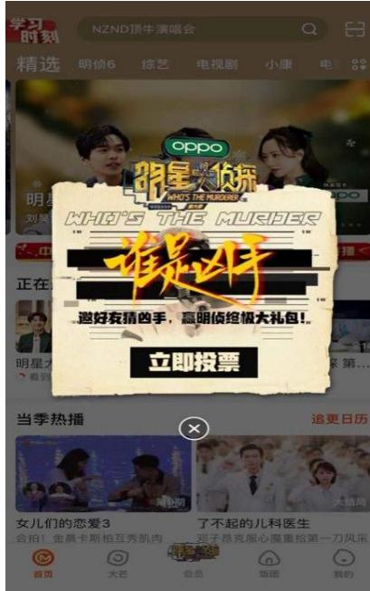  
图3-3芒果TVApp“谁是凶手“有奖竞猜弹窗推送

无论是芒果TV 首页还是芒果TV移动客户端，芒果TV以不同形式对《明星大侦探》节目进行推荐宣传，可以说是平台内全方位、高频率360 度无死角的宣传服务。

其次，《明星大侦探》节目在各大社交媒体平台，譬如新浪微博、微信公众号，开通了官方账号。社交媒体平台作为当今社会信息传递的重要方式，成功地被《明星大侦探》节目组转变为宣传与营销节目的利器。《明星大侦探》节目组利用社交媒体平台传播的便捷性，向广大网民进行节目相关内容和活动的推送，并通过这些平台与节目受众交流互动。

《明星大侦探》在新浪微博开通了官方微博“明星大侦探官微”，用以发布节目的播出动态、精彩花絮、节目相关信息等，为节目受众提供关于《明星大侦探》节目的各种消息。在每一季节目播出期间，官微每天会进行高频率的更新，主要包括新一期节目的预告与定妆照、往期节目中有趣的看点，转发明星嘉宾关于节目的微博等。在新一期节目播出前，官微会发出新一期节目的节目预告与角色定妆照，通过预告短片里设置的悬念与文字抛出的一个个问题，使受众产生心理期待；在新一期节目播出的当天放出视频链接，提醒受众去观看节目，在节目中解答之前的谜题。值得一提的是，在最新一季节目播放时，官微会同步芒果TV节目上架的时间，在微博同时放出视频链接，以“微直播”的形式，发出当期节目的讨论，在微博平台“陪伴”受众一起观看节目。在每一期节目播出后，还会把当期节目中“侦探能量社”环节每一位嘉宾关于本期案件的看法以图片的形式总结出来，宣传节目中的正能量。除此之外，官微还会把本期节目中每一位嘉宾扮演的人物角色信息进行单线整理，方便受众回顾节目以及满足不同嘉宾粉丝的喜好。

“明星大侦探官微”还会在微博中制造热门话题，引发受众的广泛讨论，提高节目的知名度。以《明星大侦探》第六季播出前的一条微博为例，2020年12月11日，明星大侦探官微发布了一条“在吗？下午见”的微博，引发了3.7万的转发与5.4万的讨论，更是直接登上微博热搜榜，并在微博热搜榜见榜一整天，可见《明星大侦探》节目的热度与受众对该节目的期待。“明星大侦探官微”不仅在微博中制造热门话题，还会充分与节目嘉宾以及节目受众进行互动，制造出良好的宣传效果。“明星大侦探官微”会转发明星嘉宾关于节目的微博，引发该嘉宾粉丝积极参与节目的讨论，不仅如此，参与节目的嘉宾还经常在官微与粉丝进行互动，何炅作为芒果TV的“自家人”就经常出现在官微中与粉丝进行互动。

“明星大侦探官微”作为节目的官方平台，以发布节目信息为主，除了官方微博外，《明星大侦探》节目组还在微博为《明星大侦探》的“剧中人”开通了微博账号。“NZND”组合是出现在《明星大侦探》第一季中的人物，从此他们的故事成为了《明星大侦探》每一季节目的固定元素，《明星大侦探》节目组在微博上为“NZND”组合成员开通了账号，将节目中的虚拟人物打造成具有真实性的社交人物。这些虚拟人物的微博账号像真实的明星账号一样，发布节目中与“NZND”组合有关的信息，会在用户生日时发布生日动态,会关注组合的其他成员，并与组合其他成员互动。在组合成员互动时，也会按照节目中的人物设定一样，互相拌嘴、假意吹捧，极具真实性。《明星大侦探》节目组在微博为节目中的虚拟人物开设微博账号，不仅对节目起到了良好的宣传作用，也为扮演剧中人物的嘉宾带来了更多的关注与讨论。

《明星大侦探》节目组除了开通微博账号外，还在新浪微博开设了超级话题。《明星大侦探》在新浪微博超话综艺社区排名第二，有 52.7万粉丝，发表帖子10.7万，阅读量更是高达101.6亿。微博用户可以在超话社区参与话题，进行互动讨论。《明星大侦探》节目组则可以通过用户的评论对节目做出调整，制作出更符合受众需求的节目。

微博是一个用户体量大并且活跃度高的社交平台，借助微博平台上明星的宣传，能够让节目在较短时间内快速传播，并且能够使得节目的相关信息在网上活跃更长的时间。《明星大侦探》节目组邀请参与节目的嘉宾都有一定的粉丝基础，例如节目最初的常驻嘉宾何炅、撒贝宁、白敬亭，最新几季的常驻嘉宾刘昊然、张若昀，以及飞行嘉宾大张伟、侯明昊、范丞丞等，这些嘉宾在微博平台的粉丝数量加起来极为庞大，他们的粉丝群体对于节目宣传推广也有很大作用。参与《明星大侦探》的嘉宾（或嘉宾的工作室）在每期节目开播前会在个人微博上为节目进行宣传，发布该嘉宾参加节目的剧照或者转发节目中的精彩片段，与粉丝进行互动，拉近粉丝与节目的距离，激发粉丝观看节目的兴趣，同时，他们发布的微博内容也助推了话题发酵，使得节目的知名度进一步提升。“明星大侦探官微”也会转发、点赞嘉宾的个人微博形成互动，将嘉宾的个人粉丝转化为《明星大侦探》节目的受众，而嘉宾在节目中的表现也能够吸引《明星大侦探》节目的受众成为其粉丝，形成良性循环。《明星大侦探》充分利用了嘉宾的名人效应，带有节目嘉宾的话题经常登上微博热搜榜，该节目也自然成为微博平台上网友经常讨论的热门话题，增加了节目的传播,同时也有利于节目口碑的塑造。

在微信平台上《明星大侦探》节目开设了官方微信公众号“明星大侦探”（已于 2020年7月29日更名为“盒子工作室Box”），用以节目相关内容的宣传以及节目衍生产品的推广等。明星大侦探公众号会在每期节目更新前后发布与节目相关的文章进行宣传，这些文章通常是根据当期节目内容的主题创作的节目番外内容，往往能够引起受众的期待与讨论。例如第五季第七案《MGQ时尚风云》更新前，公众号以节目中人物的服装搭配LOOK为内容发布了一篇文章，文章中的服装搭配宛若时尚杂志的内容，既贴合了当期节目的主题，又展示了当期节目中的人物造型，引发了受众观看节目前的期待。又比如第五季第八案《X学校杀人事件》播出后，公众号发布了剧中人物“贾乖巧”的番外故事，再一次引发了受众关于父母与“完美”孩子之间的讨论。明星大侦探公众号还会发布案情解析，解答节目中存在的谜题，帮助受众更好地还原案情；发布原创推理故事，让热爱推理的受众在节目的播出空档，依然可以享受推理的乐趣；推出推理游戏，让节目的各位“推理迷”参与游戏互动，进一步为节目锁定潜在的受众人群；推出节目的问卷调查，通过问卷调查了解受众的兴趣与需求，吸取受众的建议，改进节目内容。《明星大侦探》节目组通过微信公众号可以获知推送信息的阅读率、转发率等，更快速、更准确地分析用户数据，而且微信用户数量众多，《明星大侦探》节目组在微信平台进行宣传，可以提高节目曝光率,减少宣传成本。

再次，在抖音短视频平台设立官方账号。2016年，短视频传播成为新媒体传播的新风口。短视频，又称微视频、小视频，是指在各种新媒体平台上播放的，时长由几秒到几分钟不等的视频内容。短视频因其时长较短、制作简单、社交属性强等特点，快速地在网络中流行起来，具有强大的传播力度和速度，成为一种适合大众参与的娱乐形式。根据第 47次《中国互联网络发展状况统计报告》数据显示，“截至2020年12月，我国短视频用户规模达9.89亿，占网民整体的 $7 0 . 4 \%$ 。”①目前国内的短视频平台众多，比较知名的短视频平台有抖音短视频、快手短视频、火山小视频等。

抖音短视频平台于2016年9月20日上线，是字节跳动推出的一个专注年轻人的音乐短视频社区平台。据 2021年1月5日抖音官方发布的《2020 抖音数据报告》显示，抖音日活跃用户数超过6亿。根据艾瑞指数发布的数据来看，抖音短视频的用户在年龄分布上24 岁以下和25-30岁的用户占比最高，分别为 $2 7 \%$ 和 $2 9 . 0 3 \%$ 。可见抖音短视频平台颇受当代年轻人的喜爱，尤其是90后、00后新时代的年轻人，这与《明星大侦探》节目的受众人群相吻合。《明星大侦探》在抖音传播的主要手段，包括以下几个方面：第一，开通官方账号 (如图3-4所示)；第二，发布多个原创短视频；第三，参与节目嘉宾发布节目相关短视频。

  
图3-4《明星大侦探》抖音短视频平台官方账号

《明星大侦探》节目于2017年9月在抖音短视频平台开设了官方账号，并于9月 28日发布了第一条短视频，短视频内容是《明星大侦探》常驻嘉宾何炅的魔性舞蹈，背景音乐使用的是何炅在节目中演唱的《我可以抱你吗 Burberry》。抖音的定位是专注于音乐短视频的社区平台，背景音乐与短视频内容相互衬托，增强短视频的视听效果，带给用户极致的视听感受。背景音乐的使用成为抖音平台一大特色，基于抖音平台的这种特征，抖音用户习惯于这种视听兼具，极具感染力的传播形式。“明星大侦探”发布的短视频非常注重背景音乐与视频内容的契合度，例如第四季第一案《逃出无名岛》播出前发布的短视频中，刘昊然扮演的发传单的小哥身着恐龙服饰，背景音乐就使用的是《我是一条小青龙》，歌曲诙谐幽默，又符合扮演人物的形象；发布嘉宾在集中推理阶段眼神相互对峙时的视频时，背景音乐是《目不转睛》，展现了嘉宾对峙时紧张的气氛；而在发布“NZND”组合出道四周年的视频时，背景音乐是具有潮流感的电子音乐。参与《明星大侦探》节目的嘉宾，包括何炅、大张伟、白敬亭、张若昀等多位艺人都在抖音发布了节目相关短视频，为节目进行宣传。其中，白敬亭在《明星大侦探》第五季开播前的短视频，点赞数超过51万，评论1.8万条。

截止 2021年3月20日，《明星大侦探》的主话题#明星大侦探#在抖音总播放量超过49.9亿，#明星大侦探第六季#为2455.7万次，全站相关话题总播放量超60亿。这样的播放量不是明星大侦探官方抖音一个账号所能完成的，很多都是来自综艺娱乐账号、节目粉丝的自发安利传播。围绕《明星大侦探》节目内容进行的二次创作，例如节目中片段剪辑、节目花絮、参与节目嘉宾的采访等短视频都能填补节目受众意犹未尽的心理需求，使得这些短视频具有较强的传播力。同样，短视频的内容也会激发潜在受众观看节目的欲望，从而去观看节目，实现节目目标人群的扩容。

最后，在百度贴吧、豆瓣、知乎等信息交流平台，《明星大侦探》节目受众会进行关于节目的网络讨论，受众的表达欲望不断加强，这无疑也增加了节目的关注度与热度，对节目的宣传也起到了一定的作用。在百度贴吧、豆瓣都有关于节目的各种讨论，例如每一期节目的分析、每一季节目的案件精彩程度排行、节目嘉宾的表现盘点，亦或是对节目的评价等。《明星大侦探》节目组有时也会现身这些平台发布节目相关话题，引发广大网友的热烈讨论。《明星大侦探》第五季导演何舒就在第五季节目播出期间于豆瓣社区发布了“你对大侦探5的幕后好奇吗，要不再聊个5毛钱？”的帖子，吸引了大量粉丝参与讨论。知乎的广告语是“有问题，上知乎”，其定位是高质量的互动式问答社区。在知乎平台上以提问的形式，对《明星大侦探》节目中的案件、嘉宾表现等进行讨论。通过这些信息交流平台，节目组可以了解到受众对于节目的看法、需求以及对节目的建议，从而制作出更加符合观众需求的节目，同时，在这些信息交流平台中引发的关于节目的讨论，可以吸引平台其他用户观看该节目并加入其中进行讨论互动。

《明星大侦探》作为芒果TV的独播节目，仅在芒果TV播出，播出渠道虽然单一，但是《明星大侦探》运用其他新媒体平台对节目进行传播，形成一个多种渠道、具有持续性、可参与性的传播矩阵，实现节目信息多样化的传播。

2019年1月25日，中共中央政治局就全媒体时代和媒体融合发展举行第十二次集体学习。习近平总书记指出：“全媒体不断发展，出现了全程媒体、全息媒体、全员媒体、全效媒体，信息无处不在、无所不及、无人不用，导致了舆论生态、媒体格局、传播方式发生深刻变化，新闻舆论工作面临新的挑战。”①其中，全员媒体是指“由于手机等智能终端的普及应用，媒体进入门槛大大降低，参与主体显著增加，一元主导、强力引导的宣传舆论场变成多元共治、柔性制衡的公众舆论广场，单向传播转化为多向互动、同频共振，人人都是媒体、个个都有话筒成为媒体生态和舆论场现实场景。”①在互联网以及智能终端普及的全媒体时代，大众不再仅是信息、文化的接收者，还可以是信息、文化的传播者。从传统的“我说你听、我拍你看”一对多的传播，成为多对多传播的“多向互动”，生活中的普通人也能够踏入传媒的大门。

正是在这样的全媒体时代，《明星大侦探》节目的粉丝，从只能作为观众单向观看节目，到参与网络讨论，再到为自己喜欢的节目进行周边创作，他们不再仅仅是节目的观看者，更是节目的传播者。很多《明星大侦探》的受众出于对节目内容、嘉宾的喜爱或厌恶,亦或者是受机会主义、个人声誉等因素影响，围绕节目发布评论文章、制作剪辑视频等。这些由网络用户制作的内容被称为用户生成内容，简称 UGC(User Generated Content),是普通互联网用户制作并上传到互联网的资源。《明星大侦探》节目的受众利用自身技能或写评论文章或制作视频，对节目进行宣传，通过在微博刷话题进行节目讨论、在豆瓣对节目进行评分、在B站发布视频等方式为自己喜欢的节目做宣传推广。

以哗哩哗哩平台为例，哗哩哗哩平台简称B站，早期是以 ACG (动漫、漫画、游戏)为主要内容创作与分享的视频网站，并聚集了一群具有相同爱好的用户，自2013年起，B站不再局限于二次元内容，而是增加了更多的内容分区，并开始涉猎三次元内容，B站的内容已经逐渐从单一走向多元化，随着不断发展，越来越多的年轻用户入驻B站，现已成为围绕用户、创作者和内容构建的国内年轻群体高度聚集的文化社区和视频平台。B站有很多《明星大侦探》的粉丝自发剪辑、创作的视频，在B站的搜索栏以“明星大侦探”为关键词搜索，会发现B站有关于《明星大侦探》节目上千条的视频。《明星大侦探》的粉丝将节目中有趣的片段剪辑成搞笑合辑，或者是将参与节目嘉宾们的表情、互动，通过匪夷所思的二次剪辑组合成令人啼笑皆非的鬼畜视频等。其中，B站UP主“鹿菌酱”在节目基础上以嘉宾白敬亭为主要人物剪辑的名为《【最全笑点合辑】白敬亭，一个让人笑到室息的综艺奇男子!》的视频，截至2021年3月20日获得了521.3万的播放量，是目前B站有关《明星大侦探》点击量最高的视频。这些粉丝制作的视频不仅有搞笑的片段、打动人心的故事，还有令人为之一振的“神仙文案”，视频中嘉宾的高能操作、喜怒哀乐，并不仅仅停留在画面里，也留在了受众的眼晴里和耳朵里。

作为国内最早引入弹幕功能的网站之一，弹幕自然是B站的特色文化。弹幕是指屏幕上像子弹一样密集滑过的视频评论。通过弹幕，B站用户可随时将自己关于视频的想法、见解发送至屏幕，让其他观看视频的用户能够看到并参与互动，拉近观看视频用户之间的距离，引起用户的共鸣。部分观看《明星大侦探》粉丝制作的这些视频的用户，会将观看后的想法发布在弹幕上，亦或者是与已发出的弹幕进行互动，这些视频的观看者既是弹幕的发出者，同时也是弹幕的接收者。视频弹幕中的良性互动可以让这些视频被更多B站用户看到 (根据B站的推荐机制，弹幕数量多的视频会有更多的用户可以看到)，从而使得《明星大侦探》节目被更多B站用户所了解。全媒体时代，每一个受众都是传播者，《明星大侦探》粉丝们制作的这些视频，不仅助长了节目粉丝的参与热情，同时也让潜在受众了解《明星大侦探》这档节目，并在此基础上去观看节目，由此实现节目的二次传播。

此外，一些综艺娱乐账号、节目粉丝账号在新浪微博、微信公众号、豆瓣、百家号等平台对节目的相关评论文章，无论文章内容是对《明星大侦探》节目的表扬还是批评，都对《明星大侦探》节目的传播起到了一定的推动作用。

# 二、情境化：线下活动推广造势

《明星大侦探》节目在网络上运用各种传播媒介进行节目的宣传与推广，在线下的宣传活动也多姿多彩，通过线下活动与受众进行交流互动，线上线下多种途径共同宣传推广节目，打造传播合力，进一步扩展受众群体，提升受众黏性。《明星大侦探》通过线下活动进行节目传播，主要包括以下几个方式：第一，举办节目发布会；第二，进行节目中“NPC”(节目中的非玩家角色)演员的线下招聘；第三，举办“明侦校园行”、“明侦城市行”活动。

第一，举办节目发布会。与许多综艺节目一样，《明星大侦探》也会在每季节目开播前举办开播发布会，邀请当季参与节目的嘉宾与媒体及粉丝进行现场互动。《明星大侦探》节目第一季节目发布会，由于节目知名度等原因是作为芒果TV众多节目中的一员出现在芒果TV夏秋新品发布会中，自第二季起开始举办单独的节目发布会。第三季节目开播发布会别出心裁，除了在发布会现场播放了节目先导片《名侦探的品格》，还把发布会设计成此前在节目中出现过的“NZND”组合十周年演唱会发布会（如图3-5所示)。令参与发布会的媒体与粉丝出乎意料的是，现场竟然有人“死亡”，一时间引得在场人员叫声连连、不知所措，正在这令人慌张的时刻，“咔”与场记板落下的声音一起响起，大家才如梦初醒，明白过来这不仅仅是一场简单的发布会，还是《明星大侦探》第三季节目拍摄的一个片段。发布会这样的环节设计，让到场媒体及粉丝都体验到了参与节目的乐趣。举行节目发布会，不仅可以让媒体得到关于节目的最新消息并进行传播，还能让参与发布会的粉丝了解新一季节目的信息，既调动了媒体和受众好奇心与期待感，也引起了受众的关注与讨论。

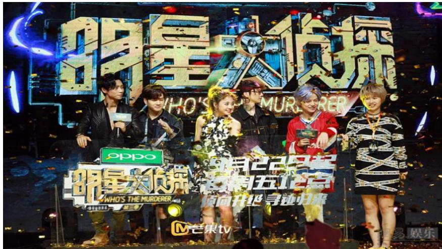  
图3-5《明星大侦探》第三季发布会

第二，进行节目中“NPC”演员的线下招聘。《明星大侦探》第一季开播前，以日薪两千的高价招聘“NPC”演员扮节目中的"受害人”。通常电视剧或者综艺节目招聘群众演员薪资往往少得可怜，有的粉丝甚至付钱给招聘人员，希望招聘人员雇佣他们，从而获得与明星见面的机会，而《明星大侦探》以不止一倍的薪资招聘“NPC”群演，自然引来了无数人的目光，同时也为节目带来了一定的关注度。《明星大侦探》“NPC”演员线下招聘的第一站，便选在了距离湖南广播电视台不远处的湖南大众传媒职业技术学院，到场参与“NPC”招聘的学生可谓是摩肩接踵（如图3-6所示)。“NPC”演员的招聘规则为，报名人员在获得参与资格后，由工作人员化妆伪装成“尸体”进行三关的测试，只要在"鲜肉侦探团"的骚扰下能保持一分钟不乱动的话，就能拿到相应的奖金。虽然只是选拔阶段，节目组的服道化也非常认真，参赛者或浑身浴血，或面色惨白，为活动平添色彩。《明星大侦探》节目在开播前，进行线下的高额薪酬“NPC招”聘，既让节目成为舆论的焦点，宣传了节目，又拉近了受众与节目之间的距离。

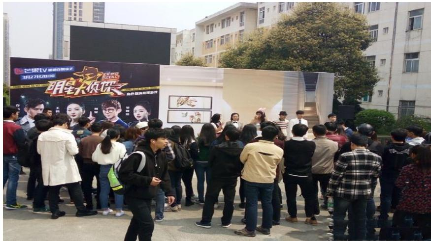  
图3-6《明星大侦探》线下NPC招聘第一站

第三，举办“明侦校园行”、“明侦城市行”活动。“明侦校园行"是《明星大侦探》第五季开播前举办的大型线下活动（如图3-7所示)，在天津、济南、青岛、郑州、西安等全国14 座城市的高校进行了30场活动，将《明星大侦探》中解密的快乐，带到粉丝的身边，让参与活动的同学们感受到了“明侦校园行”解密探案的快感，切身体验了一次当侦探的感觉。大学生群体作为《明星大侦探》主要的目标受众，“明侦校园行”深入大学校园，将节目的热度延伸至线下，让喜爱《明星大侦探》的学生、推理迷参与到节目的活动中,充分带动了节目受众参与节目的积极性，减少了节目与受众之间的距离感，同时也起到了良好的宣传作用。

“明侦校园行”活动获得成功后，为提升节目与观众之间的互动性和宣传节目，《明星大侦探》在第六季开播前，又将活动范围扩大，举办了“明侦城市行”活动，计划在南京、长沙、武汉等10个城市进行30场线下活动。节目粉丝与各位推理迷可以在线下参与剧本杀游戏、实景搜证探案、VR 虚拟探案等项目，让粉丝身临其境地感受实景探案的奇妙。活动现场部分场景1:1还原了节目场景，并且准备了侦探标志性的风衣（如图3-8 所示)，粉丝可以穿上风衣体验一把当侦探的快感。在活动现场还有节目周边商品贩卖，粉丝可以购买节目相关商品。与“明侦校园行”相比，“明侦城市行”让更多的受众群体参与到了节目的线下活动中，增强了节目的参与性，扩大了节目的影响力，也使得节目与受众之间建立了更好的互动。

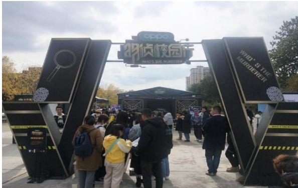  
图3-7“明侦校园行”活动现场

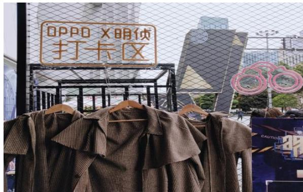  
图3-8“明侦城市行”活动现场打卡区

《明星大侦探》节目在网络上借助新媒体渠道高速度全方位立体化的传播，通过制造节目相关热点、对节目内容进行再生产等方式，扩大节目的传播效果，提高节目的知名度;在线下，借助《明星大侦探》的传播，引导受众主动地参与节目活动，放大节目的社会影响力，提升并保持公众对节目的关注度。《明星大侦探》线上线下多维立体的传播方式，强化了节目与受众之间的互动性，也使《明星大侦探》节目产生更大的传播效果。

# 第四章《明星大侦探》节目存在的问题及创新策略启示

《明星大侦探》一经播出就引起了广泛讨论，吸引了大量的观众，播出六季以来受欢迎程度与日俱增，获得了收视率与口碑双丰收，其在节目内容、节目形式与传播渠道方面的创新值得我们学习，但是在竞争日益激烈的网络自制综艺节目市场想要长远发展，就必须思考节目所存在的问题。

# 第一节《明星大侦探》节目存在的问题

随着综艺节目制作水平不断提升以及互联网技术不断创新，受众对网络自制综艺节目内容、质量等方面要求的不断提高，网络综艺节目面临着越来越多的考验。面对竞争日益激烈的综艺节目市场，《明星大侦探》虽然在节目创新等方面处于行业领先地位，但也应看到其中存在的问题，了解节目存在的不足，以期促进节目长远的发展。

# 一、剧本内容仍需打磨

《明星大侦探》作为一档推理类综艺节目，它的受众群体主要是喜爱悬疑推理这类元素的用户，为了满足节目核心用户的需求，《明星大侦探》召集了专业的编剧团队。《明星大侦探》的编剧团队包含了悬疑影视剧编剧、推理小说家等，还包含了原本是节目忠实观众的热心投稿人，这样的编剧团队在很大程度上保证了剧本内容的多样性和包容性，创作出许多精彩的案件。例如，搞笑风格显著的第一季第三案《男团鲜肉的战争》，具有怀旧风情的第一季第七案《请回答1998》，颇具未来科技感的第二季第六案《2046》，关注社会现实问题的第四季第六案《巨想谈恋爱》，探讨人性的第五季第八案《X学校杀人事件》，关注职场现状的《令人心酸的offer》。但是，伴随《明星大侦探》节目期数的增多，一些逻辑不够严密、线索混乱的案件也越来越多，例如第五季第二案《逃出无名岛Ⅱ》中，因为凶手需要照顾植物人妈妈和智力不正常的哥哥，大家从而推断凶手是医生或者护士。“张医生”和“白月光”都符合这个条件，而“白月光”毕业于“哈哈佛医学院”，有照顾智障儿童志愿者的经历，又有在“白月光”房间内找到的线索“被撕掉的本子”，指向“白月光”是凶手的证据更多，所以大部分嘉宾都把票投给了“白月光”。最后揭晓真正的凶手却是“张医生”，而剧本中设计“张医生”是凶手的理由十分牵强——“张医生”是儿科医生可以照顾智力仅有三四岁的哥哥。《明星大侦探》为了增加节目的可看性，推出了一些体量比较大的案件，例如每一季开篇之作和收官之作，这些案件往往都是故事线索较多、人物关系又很复杂，加之其中还关联着案中案，脑洞、反转、剧情不断“升级”，导致嘉宾在推理过程中很难理清头绪，更不用说看节目的观众了。

《明星大侦探》节目的定位是推理类综艺节目，但近几季节目中为了追求节目的娱乐性，而忽略了推理类节目剧情和推理的重要性。《明星大侦探》节目定位在推理，就需要好好琢磨剧本，完善证据链，把剧本中逻辑推理部分夯实。案件剧本作为节目演出的基础,如果案件逻辑不够严密，会令很多观众在观看中索然无味甚至放弃观看；如果案件内容过于简单，嘉宾只需要简单的推理便可轻松得出凶手是谁的结论，使节目缺少波折，失去推理的乐趣；剧本太混乱，嘉宾就无法形成完整的逻辑链条，无法做出有效推理，从而使整个节目只有从头到尾的插科打珲和综艺搞笑，使推理爱好者对节目失去兴趣；设定太难以理解，一味追求案件的不断转折，把案情的转折点设立在突然发现某两个角色之间存在父子、父女关系上，这种行为会使嘉宾和观众迷失在情节与设定中，无法得出准确的结论,使推理变得毫无意义。

# 二、主题立意应更契合

《明星大侦探》每期节目都有独立的主题，通过剧本内容和嘉宾的演绎对观众进行正确价值观的传输。第一季第四案《人鱼之泪》以环境保护为主题，呼吁大众关注生态环境问题；第二季第六案《2046》以人工智能为主题，探讨科技发展与人性的问题；第三季第八案《无忧客栈》以一群人住客栈却离奇死亡的人，呼吁人们关心身边的“微笑抑郁症”患者；第四季第六案《巨想谈恋爱》中反映出恋爱中PUA人格对女性的危害；第五季第一案《海上钢琴师》与同名电影联动，探讨了亲子关系；第六季第十一案《芒城风云I》以战乱年代为时代背景，讲述了一群小人物不顾自己的生命安危，尽微薄之力想拯救自己的国家与同胞免于危难。这些案件的主题明确，与案件剧情有鲜明的呼应，受众通过观看节目能够领悟节目主题，同时丰富相关的生活常识、法律知识等。但是也有些节目中的案件主题不够明确，节目主题与剧情内容关联不多，有的时候为了契合主旋律题材和社会热点题材，强行拔高主题立意。以第五季第五案《天台上的罪恶》为例，节目为了契合垃圾分类、保护环境的主题，以乱扔垃圾、垃圾混倒等不良行为致使“鸥小弟”死亡为案情内容，作案动机牵强，表现主题不明确，如果不是王鸥将主题点明，很多观众意识不到这期的主题是呼呼人们要正确处理垃圾。

# 三、邀请嘉宾应更慎重

《明星大侦探》是一档推理类综艺节目，以推理为主，综艺搞笑为辅。这样的节目设定就要求参与节目的嘉宾必须具备一定的逻辑分析能力且对悬疑推理有一定的兴趣，否则在节目案件的推理过程中就会无所作为，跟不上其他嘉宾的进度，导致节目不能正常进行下去，或者是因为对推理不感兴趣，而导致该嘉宾在节目中无所事事，只能靠油嘴滑舌博得几个镜头。参与节目的嘉宾除了需要具备一定的逻辑分析能力，如果能兼具综艺搞笑能力，那对《明星大侦探》节目来说无疑是锦上添花。从《明星大侦探》1-5季播出的节目以及网络上节目受众的评价中不难看出，撒贝宁、何炅、白敬亭等人兼具逻辑分析与综艺搞笑两种能力，从而使节目取得良好的节目效果，获得节目受众的称赞。逻辑分析与综艺搞笑两种能力兼备的嘉宾是《明星大侦探》节目获得良好口碑的原因之一，但是一档综艺节目总是几个嘉宾反复出现，很难吸引到其他明星粉丝的关注。《明星大侦探》出于提升节目的关注度与影响力的考虑，也会经常邀请一些粉丝基础较大的流量明星与综艺感较强的明星作为飞行嘉宾参与节目。虽然粉丝基础较大的嘉宾能够吸引更多的观众观看节目，综艺感较强的嘉宾能够让节目看起来更轻松有趣，但是对于推理类节目来说逻辑推理是其卖点，节目应该立足于逻辑推理，参与节目的嘉宾也应该有较强的逻辑推理能力与参与度才能保证节目的顺利推进。最近几季经常邀请的嘉宾谭松韵，虽然外表靓丽，表演有灵气，但是与《明星大侦探》节目的适配度较低，她在节目中逻辑推理能力较弱，在大家分析案情、探究疑点时不清楚自己要干什么该干什么，影响观众的观看体验，与《明星大侦探》节目极不合适，导致她参与的几期节目评价普遍偏低。节目还应减少邀请争议较大的明星嘉宾，自身争议较大的嘉宾参与节目，容易导致观众的关注点偏移。邀请争议较大的嘉宾参与节目，在当期节目的视频弹幕中，不是嘉宾粉丝刷屏“某某某好帅”就是不喜欢该嘉宾的人对嘉宾的谩骂，将节目的关注点从讨论节目内容偏离到对嘉宾个人的负面新闻讨论上。

# 四、后期制作仍需认真

《明星大侦探》节目的后期制作水平一直广受好评，但是在推出第四季之后，很多网友纷纷表示对这季节目深感失望，认为节目中存在推理过程剪辑混乱、字幕错误、节目时长过长等问题。在第四季第三案《神秘来电》中，不但在剪辑上有很多的重复部分，而且在后期字幕上也发生了几个致命性的错误。本期节目搜证阶段的镜头非常少，搜证过程并没有通过镜头表现出来，基本上都是通过各位玩家口述出来，并且同样的镜头总是来来回回的播放，让节目观众不知所谓。此外，不少网友表示《明星大侦探》节目的时长越来越长了，但是节目中的有效推理部分却越来越少。由于部分案件的剧情设定过于复杂，人物之间关系、时间线的交织，以及凶手的作案过程都复杂化了，这本身就很考验剪辑的功底怎样剪辑才能让观众快速理解案情，并跟随嘉宾的脚步进入节目。一边是剧本不断烧脑和深入的剧情，一方面是松散的剪辑，节目效果自然大打折扣，想要节目越办越好不仅需要前期的精心准备，同样也需要后期的认真对待。

# 五、节目植入广告过多

随着《明星大侦探》知名度的增加，越来越多的赞助商愿意为节目投资，过多的广告就会导致节目中广告泛滥的问题，观众认为在嘉宾搜证、推理时突然打广告显得太过突兀，也厌烦节目中有太多广告出现。《明星大侦探》节目最主要的资金来源是各个品牌方的投资，在节目中出现广告自然也不可避免，但是可以通过改变打广告的方式，让节目中的广告变得有趣起来，而不是生硬插入。例如抖音 App 的广告，第三季第一案《酒店惊魂》中,白敬亭饰演的角色“白大神”，在节目中的身份为“抖音大神”，不在场证明阐述时，侦探询问他到达酒店之后都做了什么事情，“白大神”回答他在房间里录制抖音视频，这时节目中出现了抖音当年的热门音乐以及抖音时刻的特效；第一轮搜证环节，“白大神”房间内的桌子上放置着抖音的宣传手册以及拍摄视频所需的眼镜、帽子等物品，接着又在房间内的手机上发现其录制的视频，前后呼应，植入自然。通过细节不经意地展示一个广告,胜过十个强硬尴尬的宣传，抖音在这期节目中植入的广告与案件剧情关系紧密，让观众看了会心一笑，印象深刻。而第二季第一案《公主嫁到》的故事背景设定在古代，在一片古香古色的场景中，插入金富力润滑油的广告就显得格格不入。这种节目中随处可见的植入广告，虽然为节目带来了稳定的资金，也为植入广告品牌带来了一定的知名度，但是在节目中植入过多广告，会打断节目的流畅性，影响了观众的观看体验。

# 第二节《明星大侦探》节目创新策略启示

在我国，一档引进类综艺节目获得了成功，就会紧接着继续制作第二季、第三季，例如《奔跑吧兄弟》已经播出了九季 (包含更名后的《奔跑吧》)，节目不断更新，而节目内容与形式依旧保持原样，这是我国不少综艺节目存在的一大问题。《明星大侦探》虽然是引进韩国《犯罪现场》节目，但是在节目内容、节目形式等方面进行了创新性的改造，并取得了成功。《明星大侦探》的创新尝试，给引进类节目与网络自制综艺节目以启示，探索了网络自制综艺节目的创新之路。

# 一、节目引进与本土融合并举

随着海外节目在国内的良好收视表现以及观众审美水平的提升，大量海外引进节目如同雨后春笋般被引入国内，但是这些引进节目在节目环节、制作方法等方面都直接复制原版节目，与原版节目如出一辙，例如湖南卫视从韩国MBC 电视台引进的亲子户外真人秀节目《爸爸去哪儿》。对于看过海外原版节目的观众来说，只不过是换了一批明星嘉宾“表演”同样的剧本。海外引进综艺节目想要突出节目特色，在一众海外引进综艺节目中脱颖而出，获得观众的喜爱，必须重视节目的本土化创新，不能全部照搬。节目的本土化创新可以让节目内容更加贴近本国观众的日常生活，使观众内心产生共鸣。《明星大侦探》是引进韩国JTBC 电视台的节目《犯罪现场》，但是《明星大侦探》在韩国原版节目的基础上,通过对剧本内容、故事背景、人物角色等方面的本土化改编，让《明星大侦探》节目具有了自己鲜明的特色，在取得收视佳绩的同时,也获得了观众良好的口碑。

# 二、类型创新与垂直细分并重

一直以来，悬疑推理都是观众喜闻乐见的热门题材，前有影视作品《重案六组》，后有网剧《白夜追凶》《暗黑者》等，每一部悬疑推理的影视作品基本都获得了观众的追捧。综艺节目中也慢慢出现了与悬疑推理相关的作品，例如韩国的《犯罪现场》、美国的《谁是真凶》、网络综艺节目《饭局的诱惑》及LyingMan等，都获得了受众的喜爱，这其中最受观众欢迎也最成功的当属《明星大侦探》。《明星大侦探》节目之所以能够在一众网络综艺节目中崭露头角，很大的优势在于其与众不同的节目类型，其作为一档以“推理破案"为主打的综艺节目，已经形成了自己的风格和优势，获得了一大批固定受众，在一众网络自制综艺节目中占有一席之地。

网络自制综艺节目的播放渠道决定了其拥有广大的受众群体，网络综艺节目的受众群体呈现社会背景和年龄层次的多样化特点，不同受众群体对网络综艺节目的需求与期待是有较大区别的，优质的网络综艺节目应有更加精准的定位和策划，在选择网络综艺节目的定位和主题时需要考虑受众的真实需求。网络综艺节目在用户细分方面具有得天独厚的优势，大量的互联网用户带来了更多可测量的数据，网络综艺节目在策划的初期可以利用这些数据，洞察用户需求，找到目标受众，确定其节目类型，并对节目内容进行精准判断，来进行节目类型的创新。优质的网络综艺节目应具备独特性，当其他视频平台还把制作节目的大部分资金与主要精力投入在脱口秀节目、选秀节目等类型的节目上时，芒果TV 已经对自家的网络自制节目进行了新的规划，抢占了先机，把主要精力投入在观察类综艺节目、以及推理类综艺节目等新兴的节目类型上了。

# 三、周边衍生与联动效应并行

《明星大侦探》节目在第二季播出期间推出了《名侦探俱乐部》这一VIP专享节目,这个节目的内容包括参与节目嘉宾的互动小游戏，嘉宾在节目中精彩镜头合辑，节目花絮以及案件还原等，这档节目与正片内容衔接紧密，可以提供除了正片以外更多的内容，满足《明星大侦探》忠实用户以及参与节目嘉宾粉丝不同的喜好。

除此之外，芒果TV在《明星大侦探》第五季播出期间，推出了《明星大侦探》的衍生节目《名侦探学院》，参与该节目的嘉宾多为《明星大侦探》第四季出现的素人嘉宾,这些嘉宾作为名侦探学院的学员，通过一系列的推理游戏，例如真人大富翁、你画我猜、狼人杀等游戏，来决定成为下一期《明星大侦探》的侦探助理。《名侦探学院》一经播出便获得了观众的喜爱，第一季、第二季在豆瓣评分均获得了9.3分的高分。该节目也为素人嘉宾提供了一个更大的舞台，其中蒲熠星、唐九洲更是在节目播出期间频登热搜榜，素人嘉宾展现了普通人的多才多艺，观众通过观看素人嘉宾的游戏过程从而产生一种真实感，即使没有真正参加节目的观众也可以通过观看节目的过程获得满足感。《明星大侦探》与《名侦探学院》错峰播放，在一定程度上保持了《明星大侦探》节目的热度，带来了更高的受众黏性，依靠《明星大侦探》节目，也为《名侦探学院》带来了流量和新的节目体验，衍生节目与《明星大侦探》相辅相成，获得了更好的传播效果。

# 四、游戏互动与受众参与并进

2019年1月18日，芒果TV推出自制互动剧《明星大侦探之头号嫌疑人》，是芒果TV首次实现全民互动参与的互动微剧。该节目由《明星大侦探》衍生而来，王鸥、乔振宇、黄明昊、鬼鬼和魏晨参与节目，以6个案件作为6期节目。观众可以通过观看节目全程参与案件推理，在节目中，观众以侦探的角色进入剧情，并通过与角色、情节的交互跟随剧情，在探案的过程中，观众可以点击屏幕画面中个人觉得可疑的地方进行证据的收集，只要点击屏幕，观众就可以放大该地区 (如图4-1)，点击可疑物品，便可以将物品收集进背包完成搜证（如图4-2)。除了收集证据，观众还可以与玩家进行交流，对他们进行审讯。在节目的最后，观众会以侦探的身份，对收集到的证据和审讯结果进行整合，在网络页面写下自己的推理。《明星大侦探之头号嫌疑人》广受好评，节目组又在第六季开播前推出了新的互动节目《明星大侦探互动衍2之目标人物》，剧情合理，案件环环相扣，也获得了节目受众的喜爱。互动剧作为新媒介技术的产物，调动观众的视觉与听觉，提高了观众的视听体验，让观众在成为节目观看者的同时，也成为节目内容的生产者和主导者。

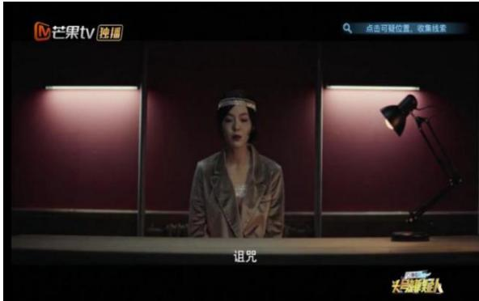  
图 4-1《明星大侦探之头号嫌疑人》交互界面

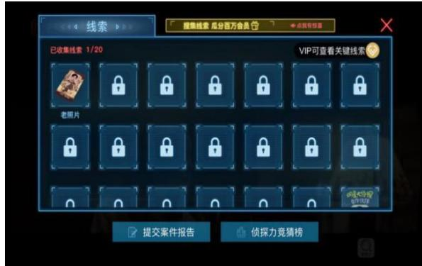  
图4-2《明星大侦探之头号嫌疑人》线索背包

# 结语

2021年3月11日，《明星大侦探》第六季的收官之作《芒城风云Ⅱ》在芒果TV上线,上线播出仅两天，《芒城风云Ⅱ》上下两集播放量总计超过2.6亿，从微博、知乎等平台网友的评论来看，第六季节目中的案件整体质量较高，一扫第四季和第五季的口碑下滑，重回前几季的巅峰水准，打破了大部分“综N代”节目播放量接连下滑、受众口碑愈发降低的"魔咒”，完美落幕。六季节目中，多位明星嘉宾各显身手联袂打造了一场又一场的极致烧脑盛宴，让观众享受了推理与幽默完美结合的乐趣。

《明星大侦探》节目是从韩国JTBC 电视台购买了《犯罪现场》的版权后，在其基础上经过本土化的改编处理，制作的我国首档明星推理真人秀节目。《犯罪现场》第一季前几集播出后的收视率并不尽人意，直到第一季第五集播出后收视率才呈现大幅度的增长,第二季节目由于案件内容丰满、剧情起伏多变以及节目嘉宾配置的改变等原因，收视率进一步增长，在韩国本土也取得了受众良好的口碑。然而行至第三季，节目收视率呈现下滑之势，无论是本土受众还是国外的网络受众对节目的评价多为节目缺少趣味性、无聊，节目至此停播。与《犯罪现场》不同，《明星大侦探》在我国走出了一条截然不同的创新之路，并获得了六季节目的成功。无论是从节目内容层面还是节目形式层面，《明星大侦探》都超越了其原版节目，在传播渠道上更是借助了互联网的便利，走出了适合自身发展的康庄大道。

《明星大侦探》播出六季来，整体已日趋成熟，从节目内容层面看，《明星大侦探》节目十分注重节目内容的质量，分别从节目主题的设置、节目案件的内容、节目嘉宾的配置三个方面进行创新，实现了节目内容的本土化创新。从节目形式层面来看，节目组通过实景式的空间设置、极具特色的视听语言、丰富多样的后期制作，增强了节目的娱乐性和可看性。从传播渠道来看，《明星大侦探》有效地利用网络节目传播的优势，实现了节目全方位的传播，获得更好的传播效果。《明星大侦探》节目虽然在创新策略方面极具优势,但是仍存在一些阻碍节目发展的问题亟需解决，相信随着我国网络自制综艺节目的发展以及相关理论愈发充实，这些问题可以随之解决。

受本人能力所限，虽然对《明星大侦探》节目进行了力所能及的研究，但可能仍然无法完成对节目的系统把握与深度洞察，期待未来能借助更丰富的研究资料和更科学的研究方法，继续进行深入研究。

# 附录

表A《明星大侦探》节目内容统计表  

<table><tr><td colspan="5" rowspan="1">表A《明星入侦探》节目内容统计表</td></tr><tr><td colspan="1" rowspan="1">季别</td><td colspan="1" rowspan="1">播出时间</td><td colspan="1" rowspan="1">案件名称</td><td colspan="1" rowspan="1">主题</td><td colspan="1" rowspan="1">相关来源/背景</td></tr><tr><td colspan="1" rowspan="12">第一季</td><td colspan="1" rowspan="1">2016.4.3</td><td colspan="1" rowspan="1">网红校花的坠落</td><td colspan="1" rowspan="1">网红、爱情</td><td colspan="1" rowspan="1">女高怪谈、包养</td></tr><tr><td colspan="1" rowspan="1">2016.4.10</td><td colspan="1" rowspan="1">冲不上的云霄</td><td colspan="1" rowspan="1">责任、酒驾</td><td colspan="1" rowspan="1">《冲上云霄》</td></tr><tr><td colspan="1" rowspan="1">2016.4.17</td><td colspan="1" rowspan="1">男团鲜肉的斗争</td><td colspan="1" rowspan="1">偶像、明星</td><td colspan="1" rowspan="1">《原来是美男啊》</td></tr><tr><td colspan="1" rowspan="1">2016.4.24</td><td colspan="1" rowspan="1">人鱼之泪</td><td colspan="1" rowspan="1">环境保护</td><td colspan="1" rowspan="1">《海的女儿》</td></tr><tr><td colspan="1" rowspan="1">2016.5.1</td><td colspan="1" rowspan="1">消失的新郎</td><td colspan="1" rowspan="1">卧底、经济纠纷</td><td colspan="1" rowspan="1">无</td></tr><tr><td colspan="1" rowspan="1">2016.5.8</td><td colspan="1" rowspan="1">疯狂的郁金香</td><td colspan="1" rowspan="1">复仇、科技进步</td><td colspan="1" rowspan="1">无</td></tr><tr><td colspan="1" rowspan="1">2016.5.15</td><td colspan="1" rowspan="1">请回答1988</td><td colspan="1" rowspan="1">怀旧、家庭暴力</td><td colspan="1" rowspan="1">《请回答1988》</td></tr><tr><td colspan="1" rowspan="1">2016.5.22</td><td colspan="1" rowspan="1">都是漂亮惹的祸</td><td colspan="1" rowspan="1">整容</td><td colspan="1" rowspan="1">《名侦探柯南（新一的真实身份和小兰的眼泪）》</td></tr><tr><td colspan="1" rowspan="1">2016.5.29</td><td colspan="1" rowspan="1">决战足球之夜</td><td colspan="1" rowspan="1">足球</td><td colspan="1" rowspan="1">欧冠决赛、c罗</td></tr><tr><td colspan="1" rowspan="1">2016.6.5</td><td colspan="1" rowspan="1">英雄不联盟</td><td colspan="1" rowspan="1">梦想</td><td colspan="1" rowspan="1">《复仇者联盟》</td></tr><tr><td colspan="1" rowspan="1">2016.6.12</td><td colspan="1" rowspan="1">帅府有鬼</td><td colspan="1" rowspan="1">民国</td><td colspan="1" rowspan="1">无</td></tr><tr><td colspan="1" rowspan="1">2016.6.19</td><td colspan="1" rowspan="1">命运的巨轮</td><td colspan="1" rowspan="1">爱情</td><td colspan="1" rowspan="1">《泰坦尼克号》</td></tr><tr><td colspan="1" rowspan="12">第二季</td><td colspan="1" rowspan="1">2017.1.20</td><td colspan="1" rowspan="1">公主嫁到</td><td colspan="1" rowspan="1">宫廷斗争</td><td colspan="1" rowspan="1">《琅琊榜》《扶摇</td></tr><tr><td colspan="1" rowspan="1">2017.2.3</td><td colspan="1" rowspan="1">唐人街传奇</td><td colspan="1" rowspan="1">唐人街、武学世家纷争</td><td colspan="1" rowspan="1">《唐人街探案》《一代宗师》</td></tr><tr><td colspan="1" rowspan="1">2017.2.10</td><td colspan="1" rowspan="1">午夜列车</td><td colspan="1" rowspan="1">复仇与报恩</td><td colspan="1" rowspan="1">《东方快车谋杀案》</td></tr><tr><td colspan="1" rowspan="1">2017.2.17</td><td colspan="1" rowspan="1">博物馆奇妙夜</td><td colspan="1" rowspan="1">盗墓、文物保护</td><td colspan="1" rowspan="1">《盗墓笔记》《鬼吹灯》</td></tr><tr><td colspan="1" rowspan="1">2017.2.24</td><td colspan="1" rowspan="1">周五见</td><td colspan="1" rowspan="1">明星、键盘侠、网络暴力</td><td colspan="1" rowspan="1">“网络暴力”词条</td></tr><tr><td colspan="1" rowspan="1">2017.3.3</td><td colspan="1" rowspan="1">2046</td><td colspan="1" rowspan="1">人与科技的关系</td><td colspan="1" rowspan="1">《西部世界》《真实的人类》《机械姬》</td></tr><tr><td colspan="1" rowspan="1">2017.3.10</td><td colspan="1" rowspan="1">恐怖童谣·上卷</td><td colspan="1" rowspan="1">精神分裂、虐待儿童</td><td colspan="1" rowspan="1">《致命ID》《无人生还X24个比利》</td></tr><tr><td colspan="1" rowspan="1">2017.3.17</td><td colspan="1" rowspan="1">恐怖童谣·下卷</td><td colspan="1" rowspan="1">精神分裂、虐待儿童</td><td colspan="1" rowspan="1">《致命ID》《无人生还X24个比利》</td></tr><tr><td colspan="1" rowspan="1">2017.3.24</td><td colspan="1" rowspan="1">绝望的主妇</td><td colspan="1" rowspan="1">网络杀人游戏、以暴制暴</td><td colspan="1" rowspan="1">《消失的爱人》</td></tr><tr><td colspan="1" rowspan="1">2017.3.31</td><td colspan="1" rowspan="1">花田醉</td><td colspan="1" rowspan="1">戏曲、传统文化</td><td colspan="1" rowspan="1">《老九门》</td></tr><tr><td colspan="1" rowspan="1">2017.4.7</td><td colspan="1" rowspan="1">疯狂马戏团</td><td colspan="1" rowspan="1">金钱纠纷</td><td colspan="1" rowspan="1">无</td></tr><tr><td colspan="1" rowspan="1">2017.4.14</td><td colspan="1" rowspan="1">收官派对</td><td colspan="1" rowspan="1">节目制作</td><td colspan="1" rowspan="1">《白夜行》</td></tr><tr><td colspan="1" rowspan="4">第三季</td><td colspan="1" rowspan="1">2017.11.3</td><td colspan="1" rowspan="1">酒店惊魂I</td><td colspan="1" rowspan="1">校园暴力</td><td colspan="1" rowspan="1">无</td></tr><tr><td colspan="1" rowspan="1">2017.11.10</td><td colspan="1" rowspan="1">酒店惊魂Ⅱ</td><td colspan="1" rowspan="1">灵魂交换</td><td colspan="1" rowspan="1">无</td></tr><tr><td colspan="1" rowspan="1">2017.11.17</td><td colspan="1" rowspan="1">暗黑童话</td><td colspan="1" rowspan="1">童话、爱情</td><td colspan="1" rowspan="1">《格林童话》</td></tr><tr><td colspan="1" rowspan="1">2017.11.24</td><td colspan="1" rowspan="1">深夜麻辣烫</td><td colspan="1" rowspan="1">罪孽与自我救赎</td><td colspan="1" rowspan="1">《名侦探柯南》</td></tr><tr><td colspan="1" rowspan="9"></td><td colspan="1" rowspan="1"></td><td colspan="1" rowspan="1"></td><td colspan="1" rowspan="1"></td><td colspan="1" rowspan="1">《深夜食堂》</td></tr><tr><td colspan="1" rowspan="1">2017.12.1</td><td colspan="1" rowspan="1">NZND 之岁月无情</td><td colspan="1" rowspan="1">男团、怀旧</td><td colspan="1" rowspan="1">《名侦探柯南(背叛的舞台）》《原来是美男啊》</td></tr><tr><td colspan="1" rowspan="1">2017.12.8</td><td colspan="1" rowspan="1">末日蜜蜂</td><td colspan="1" rowspan="1">爱护环境、未来生态</td><td colspan="1" rowspan="1">《肖申克的救赎》《恶意》</td></tr><tr><td colspan="1" rowspan="1">2017.12.15</td><td colspan="1" rowspan="1">又冲不上的云霄</td><td colspan="1" rowspan="1">时空循环</td><td colspan="1" rowspan="1">《名侦探柯南：沉默的15分钟》《忌日快乐》《土拨鼠之日》《蝴蝶效应》</td></tr><tr><td colspan="1" rowspan="1">2017.12.22</td><td colspan="1" rowspan="1">无忧客栈</td><td colspan="1" rowspan="1">微笑抑郁症</td><td colspan="1" rowspan="1">《电锯惊魂》、“蓝鲸”(杀人游戏)</td></tr><tr><td colspan="1" rowspan="1">2017.12.29</td><td colspan="1" rowspan="1">狼人前传</td><td colspan="1" rowspan="1">狼人杀游戏</td><td colspan="1" rowspan="1">《狼人杀》《暮光之城》</td></tr><tr><td colspan="1" rowspan="1">2018.1.5</td><td colspan="1" rowspan="1">仙梦昆仑</td><td colspan="1" rowspan="1">仙侠、游戏</td><td colspan="1" rowspan="1">《仙剑奇侠传》《古剑奇谭》等古装向作品</td></tr><tr><td colspan="1" rowspan="1">2018.1.12</td><td colspan="1" rowspan="1">又是漂亮惹的祸I</td><td colspan="1" rowspan="1">家庭暴力</td><td colspan="1" rowspan="1">《侦探学院Q（开膛手Jack杀人事件）》</td></tr><tr><td colspan="1" rowspan="1">2018.1.19</td><td colspan="1" rowspan="1">又是漂亮惹的祸 Ⅱ</td><td colspan="1" rowspan="1">私人审判</td><td colspan="1" rowspan="1">《楚门的世界》《黑镜》</td></tr><tr><td colspan="1" rowspan="9">第四季</td><td colspan="1" rowspan="1">2018.11.2</td><td colspan="1" rowspan="1">逃出无名岛I</td><td colspan="1" rowspan="1">网络暴力、键盘侠</td><td colspan="1" rowspan="1">《无人生还》《网络杀机》</td></tr><tr><td colspan="1" rowspan="1">2018.11.9</td><td colspan="1" rowspan="1">逃出无名岛Ⅱ</td><td colspan="1" rowspan="1">网络暴力、复仇</td><td colspan="1" rowspan="1">《盗梦空间》《楚门的世界》</td></tr><tr><td colspan="1" rowspan="1">2018.11.16</td><td colspan="1" rowspan="1">神秘来电</td><td colspan="1" rowspan="1">数学、平行空间</td><td colspan="1" rowspan="1">《死亡预告》、浪矢解忧杂货店》《信号》《推理笔记》</td></tr><tr><td colspan="1" rowspan="1">2018.11.23</td><td colspan="1" rowspan="1">NZND 回到未红时</td><td colspan="1" rowspan="1">偶像的意义</td><td colspan="1" rowspan="1">《偶像练习生》《创造101》</td></tr><tr><td colspan="1" rowspan="1">2018.11.30</td><td colspan="1" rowspan="1">天堂公寓</td><td colspan="1" rowspan="1">生活方式的选择</td><td colspan="1" rowspan="1">《捉迷藏》《楼下的房客》</td></tr><tr><td colspan="1" rowspan="1">2018.12.7</td><td colspan="1" rowspan="1">巨想谈恋爱</td><td colspan="1" rowspan="1">情感、pua</td><td colspan="1" rowspan="1">《追女至尊》《戒指女王》</td></tr><tr><td colspan="1" rowspan="1">2018.12.14</td><td colspan="1" rowspan="1">魔法学校的秘密</td><td colspan="1" rowspan="1">生命、选择</td><td colspan="1" rowspan="1">《哈利·波特》系列</td></tr><tr><td colspan="1" rowspan="1">2018.12.21</td><td colspan="1" rowspan="1">燃烧的玫瑰</td><td colspan="1" rowspan="1">青少年犯罪、人生选择</td><td colspan="1" rowspan="1">《魔宫魅影》《彗星来的那一夜》《你的名字》</td></tr><tr><td colspan="1" rowspan="1">2018. 12.28</td><td colspan="1" rowspan="1">家有儿女</td><td colspan="1" rowspan="1">欺骗、家庭关系</td><td colspan="1" rowspan="1">《家有儿女》《行骗天下JP家族篇》</td></tr><tr><td colspan="1" rowspan="3"></td><td colspan="1" rowspan="1">2019.1.4</td><td colspan="1" rowspan="1">奇幻游乐园</td><td colspan="1" rowspan="1">移植记忆</td><td colspan="1" rowspan="1">《奇幻游乐园》</td></tr><tr><td colspan="1" rowspan="1">2019.1.11</td><td colspan="1" rowspan="1">头号玩家I</td><td colspan="1" rowspan="1">家庭霸凌、友情</td><td colspan="1" rowspan="1">《头号玩家》</td></tr><tr><td colspan="1" rowspan="1">2019.1.18</td><td colspan="1" rowspan="1">头号玩家Ⅱ</td><td colspan="1" rowspan="1">杀人游戏、密室逃脱</td><td colspan="1" rowspan="1">《头号玩家》《端脑》《朋友游戏》</td></tr><tr><td colspan="1" rowspan="14">第五季</td><td colspan="1" rowspan="1">2019.11.8</td><td colspan="1" rowspan="1">海上钢琴师I (上)</td><td colspan="1" rowspan="1">亲子关系</td><td colspan="1" rowspan="1">《恐怖游轮》《海上钢琴师》</td></tr><tr><td colspan="1" rowspan="1">2019.11.15</td><td colspan="1" rowspan="1">海上钢琴师I(中、下）</td><td colspan="1" rowspan="1">亲子关系</td><td colspan="1" rowspan="1">《恐怖游轮》海上钢琴师》</td></tr><tr><td colspan="1" rowspan="1">2019.11.22</td><td colspan="1" rowspan="1">海上钢琴师Ⅱ</td><td colspan="1" rowspan="1">穿越、亲情</td><td colspan="1" rowspan="1">《恐怖游轮×海上钢琴师×盗梦空间》</td></tr><tr><td colspan="1" rowspan="1">2019.11.29</td><td colspan="1" rowspan="1">甄的步行街</td><td colspan="1" rowspan="1">网络黑产</td><td colspan="1" rowspan="1">《床下有人》放学后》</td></tr><tr><td colspan="1" rowspan="1">2019.12.6</td><td colspan="1" rowspan="1">盘丝餐厅</td><td colspan="1" rowspan="1">重置时间、记忆覆盖</td><td colspan="1" rowspan="1">《大话西游之月光宝盒×忌日快乐》《土拨鼠之日》</td></tr><tr><td colspan="1" rowspan="1">2019.12.13</td><td colspan="1" rowspan="1">天台上的罪恶</td><td colspan="1" rowspan="1">垃圾分类、环境保护</td><td colspan="1" rowspan="1">《白夜行X名侦探柯南 (浴室杀人事件)》</td></tr><tr><td colspan="1" rowspan="1">2019.12.20</td><td colspan="1" rowspan="1">NZND 破冰谜案</td><td colspan="1" rowspan="1">明星人设</td><td colspan="1" rowspan="1">《原来是美男啊》</td></tr><tr><td colspan="1" rowspan="1">2019.12.27</td><td colspan="1" rowspan="1">MGQ时尚风云</td><td colspan="1" rowspan="1">职场关系</td><td colspan="1" rowspan="1">《名侦探柯南》</td></tr><tr><td colspan="1" rowspan="1">2020.1.3</td><td colspan="1" rowspan="1">X学校杀人事件</td><td colspan="1" rowspan="1">基因编辑、“完美”孩子</td><td colspan="1" rowspan="1">《世界奇妙物语2012春季特别篇》《少年007系列》《逃出克隆岛》</td></tr><tr><td colspan="1" rowspan="1">2020.1.10</td><td colspan="1" rowspan="1">木偶复仇记</td><td colspan="1" rowspan="1">流言、偏见</td><td colspan="1" rowspan="1">《名侦探柯南》</td></tr><tr><td colspan="1" rowspan="1">2020.1.17</td><td colspan="1" rowspan="1">探案唐人街</td><td colspan="1" rowspan="1">用正确的方式去保护所爱之人</td><td colspan="1" rowspan="1">《唐人街探案》</td></tr><tr><td colspan="1" rowspan="1">2020.1.24</td><td colspan="1" rowspan="1">北方慢车谜案I</td><td colspan="1" rowspan="1">少年之间的感情</td><td colspan="1" rowspan="1">《东方快车谋杀案》</td></tr><tr><td colspan="1" rowspan="1">2020.1.31</td><td colspan="1" rowspan="1">北方慢车谜案Ⅱ</td><td colspan="1" rowspan="1">身份转换、蝴蝶效应</td><td colspan="1" rowspan="1">《东方快车谋杀案》《蝴蝶效应》《记忆碎片》</td></tr><tr><td colspan="1" rowspan="1">2020.1.31</td><td colspan="1" rowspan="1">北方慢车谜案Ⅲ</td><td colspan="1" rowspan="1">家庭暴力对孩子的影响、蝴蝶效应</td><td colspan="1" rowspan="1">《东方快车谋杀案》《蝴蝶效应》《记忆碎片X想见你》</td></tr><tr><td colspan="1" rowspan="1">第六季</td><td colspan="1" rowspan="1">2020.12.24</td><td colspan="1" rowspan="1">夜半酒店I</td><td colspan="1" rowspan="1">家庭关系</td><td colspan="1" rowspan="1">无</td></tr></table>

<table><tr><td rowspan=1 colspan=1>2020.12.31</td><td rowspan=1 colspan=1>夜半酒店Ⅱ</td><td rowspan=1 colspan=1>儿童性侵、灵魂交换</td><td rowspan=1 colspan=1>无</td></tr><tr><td rowspan=1 colspan=1>2021.1.7</td><td rowspan=1 colspan=1>新四大才子</td><td rowspan=1 colspan=1>文章代笔、顶替人生</td><td rowspan=1 colspan=1>《唐伯虎点秋香》</td></tr><tr><td rowspan=1 colspan=1>2021.1.14</td><td rowspan=1 colspan=1>天空公寓</td><td rowspan=1 colspan=1>家与房子的关系、无良房地产开发商</td><td rowspan=1 colspan=1>无</td></tr><tr><td rowspan=1 colspan=1>2021.1.21</td><td rowspan=1 colspan=1>忘忧杂货铺</td><td rowspan=1 colspan=1>抑郁症、情绪管理</td><td rowspan=1 colspan=1>《解忧杂货店》</td></tr><tr><td rowspan=1 colspan=1>2021.1.27</td><td rowspan=1 colspan=1>神奇的部落</td><td rowspan=1 colspan=1>文明平等、环境保护</td><td rowspan=1 colspan=1>无</td></tr><tr><td rowspan=1 colspan=1>2021.2.03</td><td rowspan=1 colspan=1>吼莱坞往事</td><td rowspan=1 colspan=1>新闻造假、获得成功的方式</td><td rowspan=1 colspan=1>影视圈</td></tr><tr><td rowspan=1 colspan=1>2021.2.10</td><td rowspan=1 colspan=1>心酸的offer</td><td rowspan=1 colspan=1>工作机会、成为更优秀的自己</td><td rowspan=1 colspan=1>《令人心动的offer》</td></tr><tr><td rowspan=1 colspan=1>2021.2.17</td><td rowspan=1 colspan=1>还是漂亮惹的祸</td><td rowspan=1 colspan=1>贩卖外貌焦虑、网络贷款</td><td rowspan=1 colspan=1>无</td></tr><tr><td rowspan=1 colspan=1>2021.2.24</td><td rowspan=1 colspan=1>NZND 顶牛演唱会</td><td rowspan=1 colspan=1>偶像人设、正确追星</td><td rowspan=1 colspan=1>无</td></tr><tr><td rowspan=1 colspan=1>2021.3.3</td><td rowspan=1 colspan=1>芒城风云I</td><td rowspan=1 colspan=1>爱国、家国情怀</td><td rowspan=1 colspan=1>谍战、《和平饭店×老九门×风声》</td></tr><tr><td rowspan=1 colspan=1>2021.3.10</td><td rowspan=1 colspan=1>芒城风云Ⅱ</td><td rowspan=1 colspan=1>公平正义的标准、法制社会</td><td rowspan=1 colspan=1>沉浸式游戏体验馆</td></tr></table>

表B《犯罪现场》嘉宾统计表  

<table><tr><td rowspan=1 colspan=1>季别</td><td rowspan=1 colspan=1>姓名</td><td rowspan=1 colspan=1>职业</td><td rowspan=1 colspan=1>出演集数</td></tr><tr><td rowspan=12 colspan=1>第1季</td><td rowspan=1 colspan=1>全贤武</td><td rowspan=1 colspan=1>主持人</td><td rowspan=1 colspan=1>E01-E10</td></tr><tr><td rowspan=1 colspan=1>朴智允</td><td rowspan=1 colspan=1>主持人</td><td rowspan=1 colspan=1>E01-E10</td></tr><tr><td rowspan=1 colspan=1>洪榛浩</td><td rowspan=1 colspan=1>前职业游戏选手</td><td rowspan=1 colspan=1>E01-E10</td></tr><tr><td rowspan=1 colspan=1>NS允智</td><td rowspan=1 colspan=1>歌手</td><td rowspan=1 colspan=1>E01-E10</td></tr><tr><td rowspan=1 colspan=1>林方歌</td><td rowspan=1 colspan=1>律师</td><td rowspan=1 colspan=1>E01-E6</td></tr><tr><td rowspan=1 colspan=1>姜龙锡</td><td rowspan=1 colspan=1>律师</td><td rowspan=1 colspan=1>E07-E10</td></tr><tr><td rowspan=1 colspan=1>Henry</td><td rowspan=1 colspan=1>歌手</td><td rowspan=1 colspan=1>E01-E04</td></tr><tr><td rowspan=1 colspan=1>姜敏赫</td><td rowspan=1 colspan=1>歌手、演员</td><td rowspan=1 colspan=1>E05-E06,E10</td></tr><tr><td rowspan=1 colspan=1>金圣圭</td><td rowspan=1 colspan=1>歌手、演员</td><td rowspan=1 colspan=1>E07</td></tr><tr><td rowspan=1 colspan=1>昭宥</td><td rowspan=1 colspan=1>歌手</td><td rowspan=1 colspan=1>E08</td></tr><tr><td rowspan=1 colspan=1>Key</td><td rowspan=1 colspan=1>歌手</td><td rowspan=1 colspan=1>E09</td></tr><tr><td rowspan=1 colspan=1>林文奎</td><td rowspan=1 colspan=1>现任刑警</td><td rowspan=1 colspan=1>E05-E06,E10</td></tr><tr><td rowspan=13 colspan=1>第</td><td rowspan=1 colspan=1>朴智允</td><td rowspan=1 colspan=1>主持人</td><td rowspan=1 colspan=1>E00-E12</td></tr><tr><td rowspan=1 colspan=1>洪榛浩</td><td rowspan=1 colspan=1>前职业游戏选手</td><td rowspan=1 colspan=1>E00-E12</td></tr><tr><td rowspan=1 colspan=1>张镇</td><td rowspan=1 colspan=1>导演</td><td rowspan=1 colspan=1>E00-E12</td></tr><tr><td rowspan=1 colspan=1>张东民</td><td rowspan=1 colspan=1>搞笑艺人</td><td rowspan=1 colspan=1>E00-E12</td></tr><tr><td rowspan=1 colspan=1>Hani</td><td rowspan=1 colspan=1>歌手</td><td rowspan=1 colspan=1>E00-E12</td></tr><tr><td rowspan=1 colspan=1>金志勋</td><td rowspan=1 colspan=1>演员</td><td rowspan=1 colspan=1>E01-E02,E10</td></tr><tr><td rowspan=1 colspan=1>吴贤庆</td><td rowspan=1 colspan=1>演员</td><td rowspan=1 colspan=1>E03</td></tr><tr><td rowspan=1 colspan=1>XIUMIN</td><td rowspan=1 colspan=1>歌手</td><td rowspan=1 colspan=1>E04-E06</td></tr><tr><td rowspan=1 colspan=1>姜敏赫</td><td rowspan=1 colspan=1>歌手、演员</td><td rowspan=1 colspan=1>E05</td></tr><tr><td rowspan=1 colspan=1>NS允智</td><td rowspan=1 colspan=1>歌手</td><td rowspan=1 colspan=1>E07</td></tr><tr><td rowspan=1 colspan=1>金炫茂</td><td rowspan=1 colspan=1>主持人</td><td rowspan=1 colspan=1>E08</td></tr><tr><td rowspan=1 colspan=1>BoA</td><td rowspan=1 colspan=1>歌手</td><td rowspan=1 colspan=1>E09</td></tr><tr><td rowspan=1 colspan=1>表昌元</td><td rowspan=1 colspan=1>警察大学教授、犯罪心理学家</td><td rowspan=1 colspan=1>E11-E12</td></tr><tr><td rowspan=6 colspan=1>第云</td><td rowspan=1 colspan=1>朴智允</td><td rowspan=1 colspan=1>主持人</td><td rowspan=1 colspan=1>E00-E12</td></tr><tr><td rowspan=1 colspan=1>张镇</td><td rowspan=1 colspan=1>导演</td><td rowspan=1 colspan=1>E00-E12</td></tr><tr><td rowspan=1 colspan=1>金智勋</td><td rowspan=1 colspan=1>演员</td><td rowspan=1 colspan=1>E00-E8、E10、E12</td></tr><tr><td rowspan=1 colspan=1>梁世炯</td><td rowspan=1 colspan=1>主持人、搞笑艺人</td><td rowspan=1 colspan=1>E00-E5、E07-E9、E12</td></tr><tr><td rowspan=1 colspan=1>郑恩地</td><td rowspan=1 colspan=1>歌手、演员</td><td rowspan=1 colspan=1>E00-E2、E04-E12</td></tr><tr><td rowspan=1 colspan=1>洪榛浩</td><td rowspan=1 colspan=1>前职业游戏选手</td><td rowspan=1 colspan=1>E08-E12</td></tr></table>

附录  

<table><tr><td rowspan=1 colspan=1>宋再临</td><td rowspan=1 colspan=1>演员</td><td rowspan=1 colspan=1>E01-E02</td></tr><tr><td rowspan=1 colspan=1>NS允智</td><td rowspan=1 colspan=1>歌手</td><td rowspan=1 colspan=1>E03</td></tr><tr><td rowspan=1 colspan=1>Hani</td><td rowspan=1 colspan=1>歌手</td><td rowspan=1 colspan=1>E03</td></tr><tr><td rowspan=1 colspan=1>金秉玉</td><td rowspan=1 colspan=1>演员</td><td rowspan=1 colspan=1>E03</td></tr><tr><td rowspan=1 colspan=1>振勇</td><td rowspan=1 colspan=1>歌手、演员、制作人</td><td rowspan=1 colspan=1>E05</td></tr><tr><td rowspan=1 colspan=1>张东民</td><td rowspan=1 colspan=1>搞笑艺人</td><td rowspan=1 colspan=1>E06,E09</td></tr><tr><td rowspan=1 colspan=1>朴素珍</td><td rowspan=1 colspan=1>歌手</td><td rowspan=1 colspan=1>E06,E11</td></tr><tr><td rowspan=1 colspan=1>车银优</td><td rowspan=1 colspan=1>歌手、演员</td><td rowspan=1 colspan=1>E07</td></tr><tr><td rowspan=1 colspan=1>表昌元</td><td rowspan=1 colspan=1>警察大学教授、犯罪心理学家</td><td rowspan=1 colspan=1>E10</td></tr></table>

表C《明星大侦探》专业人士节目统计表  

<table><tr><td colspan="1" rowspan="1">季别</td><td colspan="1" rowspan="1">案件名称</td><td colspan="1" rowspan="1">专家顾问</td></tr><tr><td colspan="1" rowspan="11">第四季</td><td colspan="1" rowspan="1">逃出无名岛I</td><td colspan="1" rowspan="1">虎嗅编辑 鲁茜瑶泛心理学平台作者 隋真梁羽生文学奖特别贡献奖得主、推理小说家 蔡骏</td></tr><tr><td colspan="1" rowspan="1">逃出无名岛Ⅱ</td><td colspan="1" rowspan="1">正义网采访部主任 于潇壹心理科普主任 张真壹心理咨询负责人柏冰资深心理咨询师、催眠师 管玲</td></tr><tr><td colspan="1" rowspan="1">神秘来电</td><td colspan="1" rowspan="1">当当梅溪书院市场经理 刘海蒂长沙市图书馆副馆长 龙耀华中国政法大学犯罪心理学博士 张蔚</td></tr><tr><td colspan="1" rowspan="1">NZND 回到未红时</td><td colspan="1" rowspan="1">厦门大学中文系助理教授 杨玲著名心理学家 张久祥</td></tr><tr><td colspan="1" rowspan="1">天堂公寓</td><td colspan="1" rowspan="1">简单心理CEO 简里里中国人民大学法学院刑事法法律科学研究中心副主任王莹</td></tr><tr><td colspan="1" rowspan="1">巨想谈恋爱</td><td colspan="1" rowspan="1">法医吉驰不良 PUA研究者、小红帽公益发起人孔唯唯</td></tr><tr><td colspan="1" rowspan="1">魔法学校的秘密</td><td colspan="1" rowspan="1">北京师范大学、中国工艺研究院 徐珊</td></tr><tr><td colspan="1" rowspan="1">燃烧的玫瑰</td><td colspan="1" rowspan="1">中山大学天文与空间科学研究院院长 李淼</td></tr><tr><td colspan="1" rowspan="1">家有儿女</td><td colspan="1" rowspan="1">湘潭市人民检察院副检察长、第四届全国优秀公诉人钟晋</td></tr><tr><td colspan="1" rowspan="1">奇幻游乐园</td><td colspan="1" rowspan="1">北京师范大学公民与道德教育研究中心副主任 班建武</td></tr><tr><td colspan="1" rowspan="1">头号玩家</td><td colspan="1" rowspan="1">中国科学院心理研究所副所长 黄峥</td></tr><tr><td colspan="1" rowspan="11">第五季</td><td colspan="1" rowspan="1">海上钢琴师I</td><td colspan="1" rowspan="1">著名心理咨询师及畅销作家 柏燕谊</td></tr><tr><td colspan="1" rowspan="1">海上钢琴师Ⅱ</td><td colspan="1" rowspan="1">青年作家 张皓宸</td></tr><tr><td colspan="1" rowspan="1">甄的不行街</td><td colspan="1" rowspan="1">中南大学计算机学院网络空间安全系教授 王伟平</td></tr><tr><td colspan="1" rowspan="1">盘丝餐厅</td><td colspan="1" rowspan="1">趁早创始人 畅销书作家 王潇</td></tr><tr><td colspan="1" rowspan="1">天台上的罪恶</td><td colspan="1" rowspan="1">环保知名人士 黄小山</td></tr><tr><td colspan="1" rowspan="1">NZND 破冰谜案</td><td colspan="1" rowspan="1">厦门大学中文系助理教授 杨玲</td></tr><tr><td colspan="1" rowspan="1">MGQ时尚风云</td><td colspan="1" rowspan="1">礼仪专家 周思敏</td></tr><tr><td colspan="1" rowspan="1">X学校杀人事件</td><td colspan="1" rowspan="1">知名亲子专家 杨谨</td></tr><tr><td colspan="1" rowspan="1">木偶复仇记</td><td colspan="1" rowspan="1">中国著名社会学家 李银河</td></tr><tr><td colspan="1" rowspan="1">探案唐人街</td><td colspan="1" rowspan="1">文学感情博主 都靓</td></tr><tr><td colspan="1" rowspan="1">北方慢车谜案I</td><td colspan="1" rowspan="1">中国公益律师 李莹</td></tr><tr><td colspan="1" rowspan="1"></td><td colspan="1" rowspan="1">北方慢车谜案Ⅱ、Ⅲ</td><td colspan="1" rowspan="1">中国青年作家 蒋方舟</td></tr><tr><td colspan="1" rowspan="12">第六季</td><td colspan="1" rowspan="1">夜半酒店I</td><td colspan="1" rowspan="1">可靠树公益心理咨询创始人邓伟华</td></tr><tr><td colspan="1" rowspan="1">夜半酒店Ⅱ</td><td colspan="1" rowspan="1">北京青少年法律援助与研究中心佟丽华</td></tr><tr><td colspan="1" rowspan="1">新四大才子</td><td colspan="1" rowspan="1">吉林省心理咨询协会副秘书长丁建略</td></tr><tr><td colspan="1" rowspan="1">天空公寓</td><td colspan="1" rowspan="1">北京市京师律师事务所创始人合伙人、国际关系学院研究生导师 封越平</td></tr><tr><td colspan="1" rowspan="1">忘忧杂货铺</td><td colspan="1" rowspan="1">中南大学心理健康教育与咨询教师、教授 唐海波</td></tr><tr><td colspan="1" rowspan="1">神奇的部落</td><td colspan="1" rowspan="1">长沙市生态环境保护行业协会会长、高级环保工程师 刘军亮</td></tr><tr><td colspan="1" rowspan="1">吼莱坞往事</td><td colspan="1" rowspan="1">中国仲裁法学研究院 宴艳</td></tr><tr><td colspan="1" rowspan="1">心酸的offer</td><td colspan="1" rowspan="1">G20 青年企业家协会影响力人才 牛文</td></tr><tr><td colspan="1" rowspan="1">还是漂亮惹的祸</td><td colspan="1" rowspan="1">长沙市人民检察院第一监察部主任 李治明</td></tr><tr><td colspan="1" rowspan="1">NZND顶牛演唱会</td><td colspan="1" rowspan="1">中南大学湘雅医院心理卫生中心副主任 杨放如</td></tr><tr><td colspan="1" rowspan="1">芒城风云I</td><td colspan="1" rowspan="1">北京和众泽益工业发展中心创始人、中国志愿服务联合会研究会副秘书长 王忠平</td></tr><tr><td colspan="1" rowspan="1">芒城风云Ⅱ</td><td colspan="1" rowspan="1">中国政法大学刑事司法学院副教授 方鹏</td></tr></table>

# 参考文献

# 著作类

[1][美]尼尔·波兹曼.娱乐至死[M].章艳,译.桂林:广西师范大学出版社,2009.  
[2][加]欧文·戈夫曼.日常生活中的自我呈现[M].冯钢,译.北京:北京大学出版社,2008.  
[3]陈虹等.电视节目形态：创新的观点[M].上海:复旦大学出版社,2013.  
[4]尹鸿,冉儒学,陆虹.娱乐旋风一认识电视真人秀[M].北京:中国广播电视出版社,2006.  
[5]张小琴,王彩平.电视节目新形态[M].北京:中国广播电视出版社,2007.  
[6]周敏.电视娱乐节目的公益性传播研究[M].北京:人民出版社,2016.  
[7]郑保章.电视专题与电视栏目[M].北京:中国广播电视出版社,2007.  
[8]谢耘耕,陈虹.真人秀节目：理论、形态和创新[M].上海:复旦大学出版社,2007.  
[9]朱礼庆.娱乐的本性：电视娱乐节目的娱乐性研究[M].北京:光明日报出版社,2013.  
[10]苗棣,毕啸南.解谜真人秀—规则、模式与创作技巧[M].北京:中国广播影视出版社,2015.  
[11]蔡骐.大众传播中的粉丝现象研究[M].北京:新华出版社,2013.  
[12]郭庆光.传播学教程[M].北京:中国人民大学出版社,1999.  
[13]王心语.影视导演基础[M].北京:中国传媒大学出版社,2009.  
[14]史可扬.影视传播学[M].广州:中山大学出版社,2011.  
[15]杨承虎.中国电视节目创新研究[M].北京:中国传媒大学出版社,2014.  
[16]张国涛.电视剧本体美学研究[M].北京:北京大学出版社,2012.  
[17]张智华.电视剧叙事艺术研究[M].北京:中国电影出版社,2013.  
[18]赵毅衡.重访新批评[M].成都:四川文艺出版社,2013.  
[19]高廷智.电视声音构成[M].北京:北京师范大学出版社,1998.  
[20]高鑫.电视艺术理论[M].北京:中国传媒大学出版社,2012.  
[21]周新霞.魅力·剪辑影视剪辑思维与技巧[M].北京:中国广播电视出版社,2011.  
[22]石长顺.电视栏目解析[M].武汉:武汉大学出版社,2008.  
[23]杨承虎.中国电视节目创新研究[M].北京:中国传媒大学出版社,2014.  
[24]高鑫.电视艺术理论[M].北京:中国传媒大学出版社,2012.

# 学位论文类

[1]周光蕾.剧情式真人秀的叙事研究[D].武汉:华中科技大学,2018.  
[2]李丹.推理游戏综艺真人秀《明星大侦探》叙事研究[D].株洲:湖南工业大学,2019.  
[3]张娜娜.《明星大侦探》的整合营销传播研究[D].南昌:江西财经大学,2019.[4]成青青.视频网站自制综艺节目形态创新研究[D].重庆:重庆大学,2017.  
[5]刘建萍.中国推理类综艺节目研究[D].长沙:湖南师范大学,2017.  
[6]陈凯.文化类综艺节目《见字如面》创新策略研究[D].日照:曲阜师范大学,2019.  
[7]赵萌萌.诗词文化类电视综艺节目《经典咏流传》创新策略研究[D].日照:曲阜师范大学,2019.  
[8]赵梓含.文化类电视节目创新策略研究[D].济南:山东师范大学,2019.  
[9]曹秋敏．“5W”视角下的推理真人秀《明星大侦探》节目研究[D].哈尔滨:哈尔滨师范大学,2020.  
[10]赵继.基于使用与满足理论的音乐真人秀节目传播效果研究[D].重庆:重庆大学,2018.  
[11]杨颖.网络综艺节目创新研究[D].长沙:湖南大学,2018.  
[12]匡婉滢.国内网络自制综艺节目的创新研究[D].长沙:湖南大学,2016.  
[13]张丹丹.新世纪以来限定时空式悬疑片的悬念设置方法研究[D].北京:中国艺术研究院,2020.  
[14]南力瑛.5W理论视角下共青团中央在哗哩哗哩平台的传播策略研究[D].长春:吉林大学,2020.  
[15]曾玲.我国网络自制综艺节目的传播策略研究[D].桂林:广西大学,2018.  
[16]周香伶.媒体奇观视域下的《奇葩说》语言分析[D].重庆:西南政法大学,2018.  
[17]季存森．“泛文化”视角下电视文化节目创新研究[D].苏州:苏州大学,2018.  
[18]史炎荣.网络综艺的价值引领研究[D].南京:南京师范大学,2020.  
[19]王浩.中国网络综艺节目现状、问题与原因研究[D].济南:山东师范大学,2019.  
[20]徐娇娇.基于“5W”模式的网络自制综艺节目传播特征研究[D].重庆:重庆大学,2018.

# 期刊类

[1]刘波,张莹.《明星大侦探》：推理类网络综艺节目的一种传播范式[J].电视研究,2017(01):44-46.  
[2]邹欣,刘斌,吴闻博.形态创新：网络综艺节目特性与发展趋势——以《明星大侦探》为例[J].电视研究,2017(08):27-29.  
[3]刘漱羽．《明星大侦探》：在网络综艺中传播正能量[J].当代电视.2018,12:52.  
[4]张绍刚,史芮瑛.纪录形态真人秀中的结构和剧情[J].现代传播,2014,(03).  
[5]蔡之国.电视纪录片的悬念叙事[J].当代传播，2007(06):122.  
[6]卜彦芳,李秋霖.网络综艺的价值引导方式及效果分析——以《明星大侦探》为例[J].新闻爱好者,2019(03):11-15.  
[7]尹鸿,陆虹,冉儒学.电视真人秀的节目元素分析[J].现代传播,2005(05):47-52.  
[8]李铭,廖芳.试论蒙太奇手法的类型[J].电影文学,2008(17):25.  
[9]陆地.网络自制视频节目发展的特点和空间[J].新闻与写作,2014(03):53-55.  
[10]仝文瑶,邓璐,邢毓雯.全媒体战略下电视内容生产的创新研究[J].中国电视,2021(01):55-58.  
[11]姚洪磊,石长顺.新媒体语境下广播电视的战略转型[J].国际新闻界,2013,35(02):13-21.  
[12]连语燕.推理类综艺节目成功因素分析——以网络综艺节目《明星大侦探》为例[J].新媒体研究,2019,5(05):130-131.  
[13]刘建萍.推理类综艺节目叙事话语分析——以《明星大侦探》为例[J].西部广播电视,2016,(19).[14]周阳.《明星大侦探》中叙述分层及叙述视角解读[J].新闻研究导刊,2018,9(03):46-47.  
[15]王蕾.文化类电视综艺节目的创新传播路径[J].青年记者,2018(27):67-68.  
[16]高倩.国内网络自制综艺节目现状及特征研究[J].西部广播电视,2016(18):72-73.  
[17]郑铮,蒋轶,黄丽娟.国内网络自制综艺节目现状及发展趋势研究[J].西部广播电视,2015(15):108-110.  
[18]李婕.浅析我国网络综艺节目的创新——以《明星大侦探第四季》为例[J].今传媒,2019,27(03):114-117.  
[19]王倩.推理类综艺节目的受众需求分析——以《明星大侦探》为例[J].北方传媒研究,2018(05):75-76.  
[20]夏临.海外引进网络综艺《明星大侦探》本土化策略研究[J].东南传播,2020(06):131-133.  
[21]王巧.网络推理综艺《明星大侦探》持续爆红原因探究[J].艺术评鉴,2019(16):161-163.  
[22]牛玥.网络自制综艺的传播策略及其优势特色探析——以《明星大侦探》为例[J].新媒体研究,2018,4(05):129-131.

# 在读期间相关成果发表情况

[1]孟祥傲寒.浅谈影视动画特效中的情感表达[J].戏剧之家,2020(36):149-150.

# 致谢

三年时光，犹如白驹过隙，终于还是到了要和曲园说再见的时刻。回首在学校的三年,我得到了许多关怀与帮助，更收获到了专业知识、师生情谊、同窗友谊。

首先要感谢我的导师，刘波老师。刘老师是一位学识深厚、风趣幽默的老师，不管在学术研究上还是在生活中都给予我很大的帮助。其次，要感谢曲阜师范大学传媒学院的各位授课老师以及在本论文写作过程中提出宝贵意见的各位老师。感谢我亲爱的同学和舍友，给予我无限的欢乐和包容。最后感谢我的父母和我的爱人，你们的爱，让我能勇敢前行。