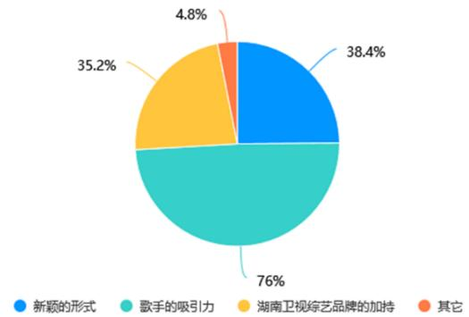

# 1. Bibliographic Information
## 1.1. Title
The core topic of the paper is the 25-year development trajectory, transformation characteristics, driving factors, and optimization strategies of variety shows produced by Hunan Satellite TV (Hunan TV) from its satellite launch in 1997 to 2022. The full title is *Research on the Development and Transformation of Hunan TV Variety Show*.
## 1.2. Authors
The author is Lan Liqin, a Master of Journalism and Communication student at the School of Journalism and Communication, with a research focus on international communication and cross-cultural communication. The paper was supervised by Associate Professor Chang Xumin, and submitted as a master's professional degree thesis in May 2023.
## 1.3. Publication Venue
This work is an officially reviewed and archived master's degree thesis from a Chinese university (the specific university is not explicitly stated, but the thesis is supervised by a faculty member of a School of Journalism and Communication with a focus on media and cultural research). Master's theses in journalism and communication in China undergo rigorous blind review by academic committees, so the work has high academic credibility and practical reference value for the domestic media industry.
## 1.4. Publication Year
The thesis was submitted and completed in 2023.
## 1.5. Abstract
This paper takes 158 regular variety shows (excluding one-off gala events) launched by Hunan TV between July 1997 and December 2022 as its core research object. It first sorts the general development context of China's TV variety industry as the macro background, then divides Hunan TV's variety show development into 6 stages and identifies 5 key turning points (2004, 2008, 2013, 2017, 2021) via quantitative content analysis. The study finds that Hunan TV's variety shows have undergone four core transformations: content from fast-paced competitive formats to slow-paced healing formats, participants from star-only to balanced inclusion of ordinary people, production scenes from single studio settings to multi-scene (outdoor, dual space, cloud recording) arrangements, and value orientation from pure entertainment to explicit mainstream value guidance.
The paper identifies three main drivers of transformation: regulatory control by the National Radio and Television Administration (NRTA), public criticism of over-entertainment and fan culture, and Hunan TV's active internal innovation strategy. It also finds existing problems including rigid programming schedules, excessive commercial placement, over-reliance on traffic stars, and insufficient value connotation. Finally, it proposes targeted optimization strategies from the dimensions of audience positioning, media convergence, and era-focused content creation, to provide reference for the development of the entire domestic TV variety industry.
## 1.6. Original Source Link
- Original upload link: `uploaded://4c5dca78-09fd-45bc-91b6-9910f2f18bd5`
- PDF access link: `/files/papers/69c3f1dedcbc649cbf54fc5f/paper.pdf`
  This is an officially completed and archived graduate thesis, with publicly available content for academic research purposes.

# 2. Executive Summary
## 2.1. Background & Motivation
### Core Problem to Solve
As the undisputed leader of China's provincial satellite TV variety industry for more than 20 years, Hunan TV has long been famous for its "Happy China" brand positioning and hit entertainment shows. However, after 2010, it faced multiple overlapping challenges:
1.  **Industry competition**: Other provincial satellite TVs (Zhejiang TV, Dragon TV, Jiangsu TV) rapidly caught up with their own hit variety shows, breaking Hunan TV's long-term monopoly on the variety market.
2.  **New media impact**: Online variety shows produced by streaming platforms (iQiyi, Tencent Video) occupied a large share of young audiences, who increasingly shifted from traditional TV to online viewing.
3.  **Regulatory pressure**: The NRTA issued a series of policies to rectify over-entertainment, fan culture, and traffic-only orientation in the variety industry, including the 2011 "Entertainment Limitation Order" and 2021 fan culture rectification measures. In October 2021, Hunan TV was directly interviewed by regulatory authorities for over-entertainment and star-chasing issues.
4.  **Public criticism**: Hunan TV faced long-term criticism from social groups (parents, feminist groups, etc.) for excessive promotion of star culture, vulgar content, and gender stereotypes.
    Against this background, Hunan TV announced a brand upgrade in September 2021, replacing its 17-year-old "Happy China" slogan with "Youth China", and launched a large-scale transformation of its variety show content.
### Research Gap
Prior studies on Hunan TV's variety shows mostly focus on single hit programs (such as *Happy Camp* or *Super Girl*) or brand strategy analysis, and lack a systematic, longitudinal, data-supported analysis of its 25-year development and transformation trajectory. This paper fills this research gap.
### Innovative Entry Point
The paper takes the full set of 158 regular variety shows (not just hit programs) as the research sample, combines quantitative content analysis, audience questionnaire surveys, and qualitative case comparison to systematically reveal the transformation logic and effect of Hunan TV's variety shows.
## 2.2. Main Contributions / Findings
### Primary Contributions
1.  **Systematic historical sorting**: For the first time, it completely sorts Hunan TV's 25-year variety show development process into 6 clear stages, and identifies 5 key turning points supported by cross-dimensional data analysis.
2.  **Multi-dimensional transformation analysis**: It summarizes the four core transformation dimensions of Hunan TV's variety shows in terms of content, participants, production scenes, and value orientation, and reveals the internal and external driving forces of transformation.
3.  **Effect verification**: It uses multi-dimensional metrics (traditional TV ratings, online popularity, audience satisfaction, industry reputation) to evaluate the actual effect of Hunan TV's 2021 brand upgrade, correcting the one-sided misunderstanding that "declining traditional TV ratings mean transformation failure".
4.  **Practical reference**: It proposes targeted optimization strategies for the existing problems of Hunan TV's variety shows, which provide important reference for the transformation of all domestic traditional TV variety producers under the dual pressure of regulation and market competition.
### Key Conclusions
1.  The transformation of traditional TV variety shows needs to balance three core requirements: regulatory policy orientation, audience demand changes, and market competition rules.
2.  Adhering to people-centered creation, integrating mainstream values into entertainment content, and promoting deep media convergence are the only ways for traditional TV variety to achieve sustainable development in the digital era.
3.  Hunan TV's 2021 transformation to "Youth China" has achieved initial success: while traditional TV ratings have declined slightly, its online popularity, social reputation, and cross-regional influence have improved significantly, and it has maintained its leading position among provincial satellite TVs.

# 3. Prerequisite Knowledge & Related Work
## 3.1. Foundational Concepts
Below are core concepts that beginners need to understand to read this paper, with clear definitions:
- **Satellite TV (Shangxing Weishi)**: In China, this refers to provincial TV stations that broadcast programs via communication satellites, allowing their content to be received nationwide (prior to satellite launch, provincial TV only covered their own administrative province). Hunan TV was one of the first provincial stations to launch satellite services in 1997.
- **Regular Variety Show**: A fixed, periodically broadcast TV program format that combines multiple art forms (singing, dancing, games, talk shows, etc.) to provide entertainment and information. This paper excludes one-off gala events (such as Spring Festival galas) because they are non-regular and not comparable to weekly scheduled programs.
- **Over-entertainment (Fan Yulehua)**: A phenomenon where media content excessively prioritizes entertainment effects and ratings, at the cost of cultural value, social responsibility, and educational functions, often leading to vulgar content, excessive star worship, and negative impact on underage audiences.
- **Slow Variety Show (Man Zongyi)**: A variety show subgenre that emerged in China around 2017, characterized by no intense competition, no scripted dramatic conflict, focusing on daily life, slow-paced narrative, and emotional healing for audiences.
- **Star + Ordinary People (Xingsu Jiehe)**: A variety show casting model where both celebrities and non-celebrity ordinary participants (called *suren* in Chinese) appear as guests, reducing over-reliance on celebrity traffic and making content closer to real life.
- **Media Convergence (Meitie Ronghe)**: The integration of traditional media (TV, radio, newspapers) and new media (streaming platforms, short video apps, social media) in content production, distribution, and operation, to adapt to changing audience viewing habits.
- **NPS (Net Promoter Score)**: A metric to measure audience satisfaction and loyalty, calculated as the percentage of "promoters" (respondents who score 9-10 out of 10) minus the percentage of "detractors" (respondents who score 0-6 out of 10). Scores range from -100 to +100, with scores above 0 indicating good satisfaction.
- **CSM (China Guangshisuofu Media Research)**: The most authoritative TV audience rating survey institution in China, responsible for collecting and publishing industry-standard TV ratings data.
## 3.2. Previous Works
The paper divides prior relevant research into three categories:
1.  **Marxist literary theory guiding TV variety**: Prior scholars including Luo Xin (2017) and Yu Hongju (2019) emphasized that TV variety, as a form of literary and artistic work, must adhere to a people-centered creation orientation, transmit positive energy, and avoid over-entertainment. This study takes these theoretical views as the core foundation for analyzing value orientation transformation.
2.  **General research on China's TV variety development**: Prior scholar Zhang Guotao divided China's TV variety development into four stages: gala era (pre-1997, dominated by CCTV's Spring Festival Gala and other official galas), game/quiz era (1997-2004), reality show era (2004-2013), and diversified development era (2013-present). This paper builds on this general industry stage division to adjust and refine Hunan TV's specific stage division.
3.  **Research on Hunan TV variety**: Prior studies mostly focus on individual hit shows (such as *Happy Camp*, *Super Girl*, *Where Are We Going, Dad?*) or brand strategy analysis of the "Happy China" positioning, but lack systematic longitudinal analysis covering all regular programs over 25 years. This paper fills this gap.
### Necessary Supplementary Background
Prior to 1997, China's TV variety market was completely dominated by China Central Television (CCTV), with almost no commercial variety shows from provincial stations. Hunan TV's *Happy Camp*, launched in 1997, was the first national hit variety show from a provincial satellite TV, marking the beginning of the rise of provincial TV in the variety sector.
## 3.3. Technological Evolution
The timeline of China's TV variety industry development and Hunan TV's position in it is as follows:

| Time Period | Industry Stage | Hunan TV's Role |
|-------------|----------------|-----------------|
| 1983-1997 | Gala era, CCTV monopoly | No national influence, mainly news and local content |
| 1997-2004 | Game/quiz era, provincial TV rise | Industry leader with hit show *Happy Camp* |
| 2004-2013 | Reality show/talent show era | Industry rulemaker, *Super Girl* created the national talent show boom, later introduced imported reality formats |
| 2013-2021 | Diversified era, online variety platforms rise | Slow variety pioneer, facing increasing competition from streaming platforms |
| 2021-Present | Mainstream value-oriented era, regulatory rectification | Transformation pioneer with "Youth China" brand upgrade |

This paper's research covers the entire 1997-2022 period, tracking Hunan TV's evolution across all these industry stages.
## 3.4. Differentiation Analysis
Compared to prior research, this paper has three core innovations:
1.  **Comprehensive research object**: It covers all 158 regular variety shows (excluding galas) launched by Hunan TV from 1997 to 2022, rather than only focusing on a small number of hit programs.
2.  **Mixed research methods**: It combines quantitative content analysis (coding programs by type, participant, scene, value orientation), audience questionnaire surveys (386 valid responses), and case comparison (between 2013 *I Am a Singer S1* and 2022 *Infinity and Beyond*) to verify transformation effects.
3.  **Focus on transformation logic**: It not only describes development stages, but also systematically analyzes the driving forces of transformation from three dimensions: regulatory policy, public opinion pressure, and internal innovation strategy.

# 4. Methodology
## 4.1. Principles
The core idea of the study is to combine longitudinal historical sorting, quantitative content analysis, and qualitative effect evaluation to systematically reveal Hunan TV's variety show development trajectory, transformation characteristics, driving factors, and existing problems, then propose targeted optimization strategies. The theoretical basis is Marxist literary theory (people-centered creation, social responsibility of art and media) and media industry development theory.
## 4.2. Core Methodology In-depth
The research process is divided into 5 sequential steps:
### Step 1: Sample Collection and Sorting
The authors first collected all regular variety shows (excluding one-off gala events) launched by Hunan TV between July 1997 and December 2022 from official archives (Hunan TV official website, Mango TV, Golden Eagle Network), totaling 158 programs. For each program, they recorded 6 core attributes:
1.  Launch year and broadcast duration
2.  Program type (classified into 8 categories: performance, talk show, talent show, game show, life show, knowledge show, experience show, other)
3.  Main participant type (star only, ordinary person only, star + ordinary person)
4.  Production scene (studio only, outdoor only, dual space/studio + observation room)
5.  Core value orientation (pure entertainment, explicit value guidance)
### Step 2: Stage Division and Turning Point Identification
First, the authors sorted the general development of China's TV variety industry as the macro context, then conducted cross-tabulation analysis of program attributes and launch year to identify turning points:
1.  **Program type + launch year cross-tabulation**: Found that 1997-2003 was dominated by game shows, 2004-2007 by talent shows, 2008-2012 by knowledge-oriented shows, 2013-2016 by celebrity reality shows, 2017-2020 by slow variety and observation shows, 2021+ by value-oriented shows.
2.  **Participant type + launch year cross-tabulation**: Found that before 2008, over 90% of shows used star-only casting, 2008-2020 saw increasing ordinary participants, 2021+ shows had a balanced ratio of stars and ordinary people.
3.  **Production scene + launch year cross-tabulation**: Found that before 2006, 100% of shows were recorded in studios, 2006+ saw increasing outdoor recording, 2010+ dual space (studio + observation room) became common, 2020 saw the emergence of cloud recording during the COVID-19 lockdown.
4.  **Value orientation + launch year cross-tabulation**: Found that before 2011, over 90% of shows were pure entertainment, 2011+ saw increasing value guidance content, 2021+ over 75% of new shows had explicit value guidance.
    Combining the results of these four cross-tabulations, the authors identified 5 key turning points (2004, 2008, 2013, 2017, 2021) and divided Hunan TV's variety show development into 6 corresponding stages.
### Step 3: Transformation Effect Evaluation
The authors selected two highly comparable music variety shows from different periods to evaluate transformation effects, as they have similar production standards, cast coverage (including mainland and Hong Kong singers), and nostalgic positioning, but represent different development stages:
- *I Am a Singer Season 1* (2013): Representative of the pre-transformation celebrity reality show era
- *Infinity and Beyond (Sheng Sheng Bu Xi) Hong Kong Music Season* (2022): Representative of the post-transformation value-oriented era
  They evaluated effects using three multi-dimensional metrics:
1.  **Ratings data**: Collected official CSM ratings and audience share data for both shows during their broadcast period.
2.  **Audience satisfaction survey**: Designed a structured questionnaire (see Appendix A in the original paper) distributed online, collected 386 valid responses, measuring audience preference, NPS score, and program attraction factors for both shows.
3.  **Reputation evaluation**: Collected industry awards from NRTA official announcements and central media reviews for both shows to compare social value recognition.
### Step 4: Transformation Driver Analysis
The authors analyzed the driving forces of transformation from three complementary dimensions:
1.  **External regulatory factors**: Collated all relevant policies issued by the NRTA from 2006 to 2021 that regulate variety shows, and analyzed their direct impact on Hunan TV's program adjustment decisions.
2.  **External public opinion factors**: Analyzed public criticism of Hunan TV from different social groups (parents, feminist groups, fan groups) regarding over-entertainment, fan culture, and gender stereotypes, and their impact on program content adjustment.
3.  **Internal innovation factors**: Analyzed Hunan TV's internal development strategies, including the 2007 "high-end rise" strategy, media convergence strategy with Mango TV, and 2021 "Youth China" brand upgrade.
### Step 5: Problem Identification and Strategy Proposal
Based on the above analysis, the authors summarized existing problems of Hunan TV's variety shows, and proposed targeted optimization strategies aligned with national cultural development requirements and industry development trends.

# 5. Experimental Setup
## 5.1. Datasets
The study uses three core datasets:
### 1. Program Dataset
Covers all 158 regular variety shows (excluding galas) launched by Hunan TV between 1997 and 2022. For each program, the dataset includes: launch year, broadcast duration, program type, participant type, production scene, and value orientation.
- Sample program entry: *Happy Camp*, launched 1997, ended 2021, type: game show, participant: star + ordinary, scene: studio, value orientation: pure entertainment (1997-2011), partial value guidance (2012-2021)
- Rationale for selection: This dataset covers the entire 25-year research period, ensuring comprehensive, unbiased longitudinal analysis, rather than focusing only on hit programs.
### 2. Audience Survey Dataset
Includes 386 valid questionnaires collected from respondents across different age groups, genders, and regions. Demographic breakdown: 66.06% female, 33.93% male; 70.62% aged 21-30, with remaining respondents covering ages 13 to 50+. The survey covers viewing channels, program preference, NPS score, and attraction factors for the two sample music shows.
- Rationale for selection: The sample covers the main demographic of Hunan TV viewers, providing first-hand feedback on the audience perception of transformation effects.
### 3. Performance Dataset
Includes:
- CSM ratings data for *I Am a Singer S1* (2013, CSM 45-city sample) and *Infinity and Beyond* (2022, CSM 63-city sample)
- Industry award data from NRTA official announcements
- Online popularity data from Mango TV and public opinion platforms
- Rationale for selection: The two sample shows have similar production standards and positioning, making them highly comparable for evaluating changes in program performance before and after transformation.
## 5.2. Evaluation Metrics
### 1. Program Output Metrics
These metrics describe the characteristics of Hunan TV's program supply in different periods:
1.  **Annual new show quantity**: Number of new regular variety shows launched each year, reflecting the speed of program innovation.
2.  **Program type proportion**: Proportion of each program type (game, talent, reality, etc.) in all shows, reflecting the content focus of different periods.
3.  **Participant type proportion**: Proportion of shows with star-only, ordinary-only, or star+ordinary casting, reflecting changes in casting strategy.
4.  **Scene type proportion**: Proportion of shows with studio, outdoor, or dual space recording, reflecting changes in production mode.
5.  **Value orientation proportion**: Proportion of shows with explicit value guidance content, reflecting changes in program cultural connotation.
### 2. Program Performance Metrics
These metrics evaluate the effect of transformation:
#### a. TV Rating
- **Conceptual Definition**: The percentage of TV-owning households watching a specific program during its broadcast time, measuring the size of the traditional TV audience for the program. It is the most traditional core indicator for evaluating TV program performance.
- **Mathematical Formula**:
  \$
  \text{Rating} = \frac{\text{Number of households watching the program}}{\text{Total number of TV households in the survey sample}} \times 100\%
  \$
- **Symbol Explanation**: The numerator is the count of sample households that tuned into the program during its broadcast; the denominator is the total number of TV-owning households in the CSM survey sample (45 major cities in 2013, expanded to 63 major cities in 2022).
#### b. Audience Share
- **Conceptual Definition**: The percentage of viewers watching a specific program among all viewers who were watching any TV program at that time, reflecting the program's competitiveness relative to other programs in the same time slot.
- **Mathematical Formula**:
  \$
  \text{Audience Share} = \frac{\text{Number of households watching the program}}{\text{Total number of households watching TV at that time}} \times 100\%
  \$
- **Symbol Explanation**: The denominator is the count of sample households that were watching any TV program during the program's broadcast time, not all TV-owning households.
#### c. Net Promoter Score (NPS)
- **Conceptual Definition**: Measures the willingness of audiences to recommend the program to others, reflecting audience satisfaction and loyalty.
- **Mathematical Formula**:
  \$
  \text{NPS} = (\text{Percentage of Promoters} - \text{Percentage of Detractors}) \times 100
  \$
- **Symbol Explanation**: Promoters are respondents who give a score of 9 or 10 out of 10 for the program; Detractors are respondents who give a score of 0 to 6 out of 10; Neutral respondents (7-8 out of 10) are not included in the calculation. NPS ranges from -100 to +100, with scores above 0 considered good, and scores above 50 considered excellent.
#### d. Industry Reputation
- **Conceptual Definition**: Measured by official awards from the NRTA and positive reviews from central state media (People's Daily, *Guangming Daily*), reflecting the program's social value recognition by regulators and mainstream public opinion.
## 5.3. Baselines
The study uses two types of baselines for comparison:
1.  **Historical baseline**: Hunan TV's own variety show performance in previous stages (e.g., comparing 2021+ new shows' performance with 2013-2016 celebrity reality show era performance), to measure changes in its own performance before and after transformation.
2.  **Industry baseline**: The overall development level of variety shows from other leading provincial satellite TVs (Zhejiang TV, Dragon TV, Jiangsu TV) and online streaming platforms, to evaluate Hunan TV's market competitiveness after transformation.
    These baselines are representative: historical baselines reflect internal changes, while industry baselines reflect Hunan TV's relative position in the overall variety market.

# 6. Results & Analysis
## 6.1. Core Results Analysis
### 1. Development Stage and Turning Point Results
The 6 clearly defined stages of Hunan TV's variety show development are:

| Time Period | Stage Name | Core Characteristics | Representative Shows | Number of New Shows |
|-------------|------------|-----------------------|-----------------------|---------------------|
| 1997-2003 | Exploration stage | Dominated by game shows, no clear brand positioning | *Happy Camp* | 13 |
| 2004-2007 | Talent show era | "Happy China" brand established, national talent show boom | *Super Girl*, *Super Boy* | 18 |
| 2008-2012 | Knowledge communication era | Impacted by 2011 "Entertainment Limitation Order", increasing knowledge-oriented content | *Day Day Up*, *Take Me Out* | 35 |
| 2013-2016 | Celebrity reality show era | Dominated by imported reality formats, heavy reliance on celebrity cast | *I Am a Singer S1*, *Where Are We Going, Dad?* | 21 |
| 2017-2020 | Diversified exploration era | Rise of slow variety and observation shows, increasing ordinary participants | *Back to Field*, *My Little One* | 41 |
| 2021-Present | "Youth China" transformation era | Explicit value orientation, balanced cast of stars and ordinary people | *Infinity and Beyond*, *Time Concert* | 32 (2021-2022 only) |

The 5 key turning points are:
- 2004: Launch of "Happy China" brand and *Super Girl*, starting the talent show era
- 2008: Launch of *Day Day Up*, starting the shift to knowledge-oriented content
- 2013: Launch of *I Am a Singer* and *Where Are We Going, Dad?*, entering the celebrity reality show era
- 2017: Launch of *Back to Field*, starting the slow variety trend
- 2021: Brand upgrade to "Youth China", suspension of *Happy Camp*, full transformation to value-oriented content
### 2. Transformation Dimension Results
The four core transformation dimensions are:
1.  **Content transformation**: From fast-paced, competitive formats (game shows, talent shows, competitive reality shows) to slow-paced, healing formats (slow variety, observation shows, cultural shows). For example, *Back to Field* has no competition or scripted conflict, only showing celebrities living a quiet rural life, providing emotional healing for young audiences facing high work pressure.
2.  **Participant transformation**: From 90% star-only shows before 2008 to 38% ordinary-only, 25.9% star+ordinary shows in the full sample, with 2021+ shows having an almost perfectly balanced ratio of stars and ordinary participants. For example, *Sing for You (Huanchang Dapengche)* invites ordinary people from all walks of life (teachers, doctors, chefs, delivery workers) to sing on street stages, rather than focusing only on celebrities.
3.  **Scene transformation**: From 100% studio recording before 2006 to 23.4% outdoor, 9.5% dual space shows in the full sample. During the 2020 COVID-19 lockdown, Hunan TV pioneered "cloud recording" shows like *Hey! What Are You Doing?*, which were recorded entirely at celebrities' homes via video link, breaking traditional space limitations.
4.  **Value orientation transformation**: From 90% pure entertainment shows before 2011 to 75% of new shows having explicit value guidance after 2021. For example:
    - *Infinity and Beyond* commemorates the 25th anniversary of Hong Kong's return to China, transmitting patriotism and cultural identity via classic Hong Kong music
    - *Cloud Shop* promotes rural revitalization by helping farmers in Hunan's Xiaohe Village sell agricultural products via the program
### 3. Transformation Effect Comparison
The paper compares the performance of *I Am a Singer S1* (2013, pre-transformation) and *Infinity and Beyond* (2022, post-transformation):
#### a. Ratings Comparison
The following are the results from Table 3.1 and 3.2 of the original paper:

<table>
<thead>
<tr>
<th>Program</th>
<th>Average CSM Rating (%)</th>
<th>Average Audience Share (%)</th>
</tr>
</thead>
<tbody>
<tr>
<td><i>I Am a Singer S1 (2013)</i></td>
<td>2.308</td>
<td>10.66</td>
</tr>
<tr>
<td><i>Infinity and Beyond (2022)</i></td>
<td>0.515</td>
<td>2.32</td>
</tr>
</tbody>
</table>

The lower traditional TV ratings for *Infinity and Beyond* are explained by changes in audience viewing habits, as shown in the audience survey results below:
The following is the audience contact channel distribution from Figure 3.1 of the original paper:

*该图像是图3.1湖南卫视综艺节目受众接触渠道的饼图，展示了观众通过视频APP、短视频平台、社交软件、亲友推荐和电视节目等多种渠道接触综艺节目的比例分布。*

78.56% of respondents watch Hunan TV variety shows via video apps, 62.7% via short video platforms, and only 54.76% via traditional TV sets. *Infinity and Beyond* had over 100 million views on Mango TV within a week of launch, ranked first in online variety popularity, and was the top-rated program in Hong Kong during its broadcast, with an average of 1.18 million Hong Kong viewers per episode, far exceeding *I Am a Singer S1*'s Hong Kong viewership.
#### b. Audience Satisfaction Comparison
The NPS score comparison from the survey is as follows:

<table>
<thead>
<tr>
<th>Program</th>
<th>Promoter Percentage (%)</th>
<th>Detractor Percentage (%)</th>
<th>NPS Score</th>
</tr>
</thead>
<tbody>
<tr>
<td><i>I Am a Singer S1</i></td>
<td>43.1</td>
<td>24.3</td>
<td>18.8</td>
</tr>
<tr>
<td><i>Infinity and Beyond</i></td>
<td>39.0</td>
<td>27.8</td>
<td>11.2</td>
</tr>
</tbody>
</table>

While *Infinity and Beyond* has a slightly lower overall NPS score, 7% more respondents selected "very much like" for *Infinity and Beyond* than for *I Am a Singer S1*, indicating higher loyalty among its core audience.
The following is the program attraction factor distribution from Figure 3.4 of the original paper:

*该图像是一个饼图，展示了影响湖南卫视综艺节目吸引力的各项因素。其中，76%表示湖南卫视品牌的加持是关键因素，38.4%源于新颖的形式，35.2%与歌手的吸引力相关，其他因素占4.8%。*

76% of respondents said the most attractive factor of Hunan TV's variety shows is the program content, while the Hunan TV brand accounts for 35.3%, indicating that audiences prioritize content quality over brand or celebrity appeal.
#### c. Reputation Comparison
The following are the awards for the two shows from Table 3.5 and 3.6 of the original paper:

<table>
<thead>
<tr>
<th>Program</th>
<th>Awards and Recognition</th>
</tr>
</thead>
<tbody>
<tr>
<td><i>I Am a Singer S1</i></td>
<td>2013 NRTA Most Influential Provincial Satellite TV Program, 2014 NRTA Innovative Program, Nominated for China TV Starlight Award</td>
</tr>
<tr>
<td><i>Infinity and Beyond</i></td>
<td>2022 NRTA Excellent Online Audiovisual Work, 2023 NRTA Innovative Program, widely praised by People's Daily and *Guangming Daily* as a model for cultural integration between the mainland and Hong Kong</td>
</tr>
</tbody>
</table>

*Infinity and Beyond* has significantly higher social value recognition, reflecting the success of Hunan TV's value orientation transformation.
### Overall Transformation Effect
After the 2021 "Youth China" transformation, Hunan TV's traditional TV ratings declined slightly, but its online popularity, social reputation, and cross-regional influence improved significantly. It maintained its position as the top provincial satellite TV in total national coverage (1.358 billion viewers in 2022) and audience loyalty.
## 6.2. Ablation Studies / Parameter Analysis
The paper analyzes the independent impact of different transformation drivers:
1.  **Regulatory policy impact**: Every major policy release corresponds to a clear turning point:
    - The 2011 "Entertainment Limitation Order" directly led to the 2012 adjustment of reducing pure entertainment shows, shortening the duration of *Happy Camp* from 120 minutes to 90 minutes, and adding science popularization segments.
    - The 2015 Reality Show Regulation (restricting celebrity participation and minor participation in reality shows) led to the 2017 shift to slow variety and increased use of ordinary participants.
    - The 2021 Fan Culture Rectification directly led to the suspension of *Happy Camp* and the launch of the "Youth China" brand.
2.  **Public opinion impact**: Criticism from parent groups regarding excessive promotion of star culture led to reduced use of traffic stars and increased focus on ordinary people. Criticism from feminist groups regarding gender stereotypes led to programs focusing on female empowerment, such as *Sisters Who Make Waves*, which showcases middle-aged female celebrities breaking age and gender stereotypes.
3.  **Internal strategy impact**: The 2007 "high-end rise" strategy (proposed by then Hunan TV director Ouyang Changlin) laid the foundation for later value orientation transformation, emphasizing that Hunan TV should not only pursue ratings but also improve program quality and cultural connotation. The media convergence strategy with Mango TV allowed Hunan TV to adapt to online viewing habits, reducing the impact of declining traditional TV ratings.

# 7. Conclusion & Reflections
## 7.1. Conclusion Summary
This paper provides the first systematic, data-supported longitudinal analysis of Hunan TV's 25-year variety show development from 1997 to 2022. It identifies 5 key turning points and 4 core transformation dimensions (content from competitive to slow-paced, participants from star-only to balanced inclusion of ordinary people, scenes from single studio to multi-scene arrangements, value orientation from pure entertainment to explicit value guidance). The study finds that transformation is driven by a combination of external regulatory pressure, public opinion criticism, and active internal innovation.
After evaluating transformation effects via multi-dimensional metrics, the paper identifies existing problems including rigid programming schedules (variety shows only broadcast on weekend prime time, no content for other time slots), single audience demographic (overly concentrated on young women, insufficient coverage of middle-aged, elderly, and rural audiences), excessive commercial placement that disrupts viewing experience, and over-reliance on traffic stars with insufficient positive value guidance.
It proposes four targeted optimization strategies:
1.  **Clarify audience positioning**: Expand beyond young female audiences, serve all age groups, and explore the sinking market (counties and rural areas).
2.  **Improve program quality**: Reduce excessive commercial placement, integrate mainstream values and Chinese excellent traditional culture into program content, avoid pure entertainment orientation.
3.  **Build a converged media ecosystem**: Strengthen the "Hunan TV + Mango TV" dual platform model, develop OTT (Internet TV) services for the living room, and enhance cross-screen interaction between TV and mobile terminals.
4.  **Adhere to original innovation**: Focus on contemporary Chinese themes, tell good Chinese stories, and explore international communication of Chinese culture via variety shows.
    The findings provide important practical reference for the transformation of traditional TV variety shows in China, especially for provincial satellite TVs facing dual pressure from regulation and online competition.
## 7.2. Limitations & Future Work
The authors explicitly point out the following limitations of the study:
1.  **Sample bias in audience survey**: The survey sample is relatively concentrated in the 21-30 age group, with insufficient samples of middle-aged and elderly viewers, which may affect the generalization of satisfaction results to the full audience demographic.
2.  **Short observation period for post-transformation effects**: The "Youth China" transformation was only launched in September 2021, and the study only covers up to 2022, so the long-term effect of the transformation needs further observation over 3-5 years.
3.  **Insufficient international communication analysis**: The study mainly focuses on Hunan TV's domestic influence, with little analysis of its international communication effect on overseas Chinese and foreign audiences.
    Future research directions proposed by the authors include: tracking the long-term performance of Hunan TV's new programs after 2022, expanding the audience survey sample to cover more age groups and regions, and studying the international communication effect of Hunan TV's programs to support Chinese culture "going global".
## 7.3. Personal Insights & Critique
This paper is a highly valuable study for understanding the development of China's TV variety industry and the transformation of traditional media in the digital era. Its greatest strength is that it avoids the one-sided focus on hit programs or brand marketing that is common in prior research, and instead provides a comprehensive, objective analysis based on the full population of programs and multi-dimensional performance data. Its findings have strong practical guiding significance for the entire industry: transformation is not just a passive response to regulatory requirements, but an inevitable choice for traditional media to adapt to changing audience demand and market competition. The balance between entertainment function and social value is the core challenge for variety show creation, and Hunan TV's exploration provides a replicable model for other producers.
Potential areas for improvement:
1.  **Add cross-platform comparison**: The paper could add a comparative analysis with variety shows from other leading provincial satellite TVs (Zhejiang TV, Dragon TV) to better highlight the uniqueness of Hunan TV's transformation path.
2.  **Add economic performance analysis**: The paper could include data on advertising revenue and IP derivative revenue for programs before and after transformation, to evaluate the commercial sustainability of the value-oriented transformation, which is an important concern for industry practitioners.
3.  **Optimize value orientation coding**: The current classification of value orientation is relatively subjective; combining it with public opinion analysis of program reviews and bullet comments would make the coding more objective and rigorous.
    Overall, this is a rigorous, comprehensive study that fills an important research gap and provides valuable insights for both academic research and industry practice.