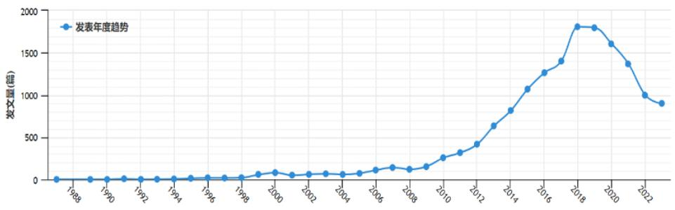
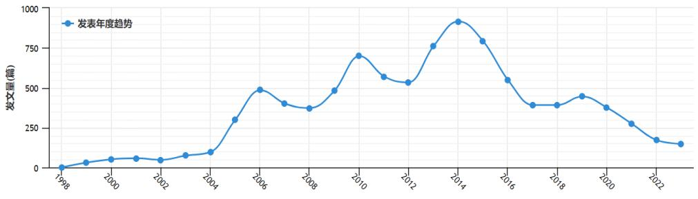
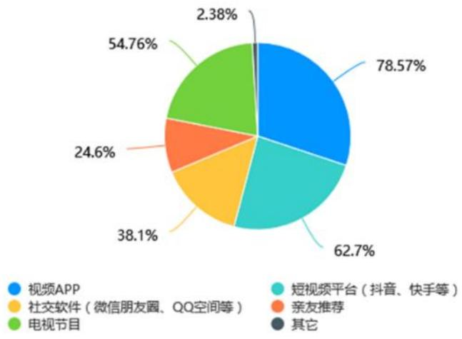
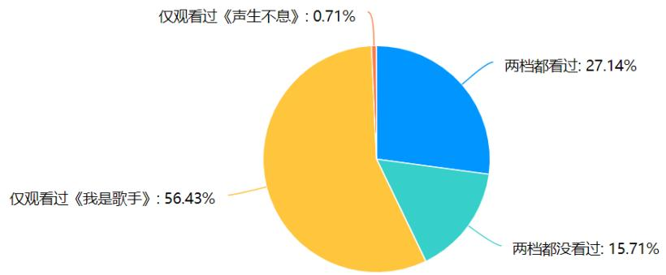
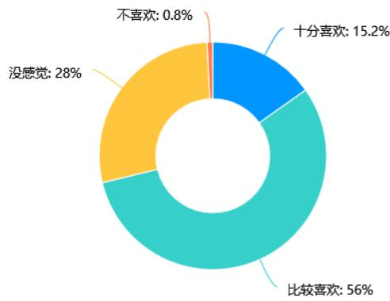
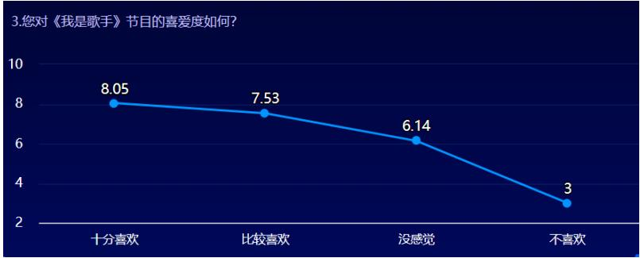
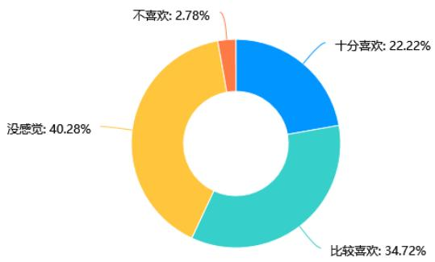
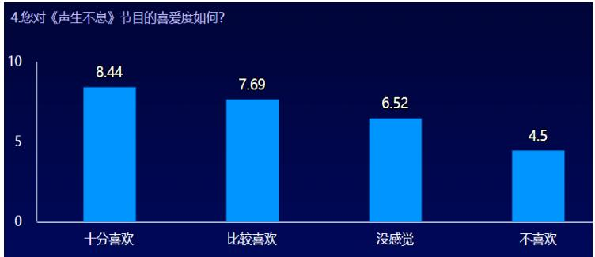

# 1. 论文基本信息
## 1.1. 标题
《湖南卫视综艺节目发展与转向研究》，核心主题是系统梳理湖南卫视1997年上星至2022年25年间的综艺节目发展脉络，分析其转向特征、动因，并针对现存问题提出优化策略。
## 1.2. 作者
蓝丽琴，为华侨大学新闻与传播学院2023届新闻与传播专业硕士，研究方向为国际传播与跨文化传播，指导教师为常旭旻副教授。
## 1.3. 发表/提交信息
本文为2023年5月提交的硕士专业学位论文，属于学位产出成果，未在期刊/会议公开发表。
## 1.4. 摘要
本文以湖南卫视1997年上星至2022年的158档常态综艺节目（不含非常态晚会类节目）为研究对象，梳理其发展阶段与核心特征，明确转向的关键时间节点及多维度动因。研究发现，湖南卫视综艺在内容、参与主体、录制场景、价值引领四个层面发生了显著变化，转向动因包括主管部门的政策规制、社会对其“过度娱乐化”的批判、自身主动谋发展的战略需求三个层面。同时指出其当前存在节目编排固化、商业植入过多、过度依赖流量明星、价值传导不足等问题，从受众定位、融合发展、聚焦时代三个维度提出优化建议，旨在丰富湖南卫视综艺相关研究，为国内电视综艺行业发展提供参考。
## 1.5. 原文与PDF链接
- 原文链接：`uploaded://4c5dca78-09fd-45bc-91b6-9910f2f18bd5`
- PDF链接：`/files/papers/69c3f1dedcbc649cbf54fc5f/paper.pdf`
- 发布状态：已完成的公开硕士学位论文。

# 2. 整体概括
## 2.1. 研究背景与动机
### 2.1.1. 核心问题
国内电视综艺近40年呈现加速演变趋势，湖南卫视作为省级卫视综艺赛道的长期领军者，2021年将沿用17年的“快乐中国”频道口号升级为“青春中国”，标志着其发展方向的重大转向。但现有研究大多聚焦于湖南卫视单个综艺节目的创新、传播效果，缺乏对其25年发展与转向脉络的系统梳理，也未能清晰回答其转向的核心动因、实际效果与未来发展路径。
### 2.1.2. 研究必要性
当前电视综艺行业面临多重压力：一是政策层面主管部门不断加强对过度娱乐化、追星炒星等乱象的规制；二是市场层面面临其他省级卫视、网络视听平台的双重竞争，受众观看习惯从电视端向移动端转移；三是社会层面公众对综艺的文化内涵、价值导向要求不断提升。湖南卫视作为行业标杆，其转向经验对整个电视综艺行业具有重要参考价值。
### 2.1.3. 研究切入点
本文以湖南卫视1997-2022年的全样本158档常态综艺为研究基础，采用定量内容分析、问卷调查、案例分析结合的方法，全景式梳理其发展脉络，明确转向节点、特征与动因，针对现存问题提出可落地的优化策略。
## 2.2. 核心贡献与主要发现
### 2.2.1. 核心贡献
1. **系统梳理发展脉络**：首次对湖南卫视25年的全样本常态综艺进行分类统计，划分出6个发展阶段，明确了2004、2008、2013、2017、2021五个关键转向节点，填补了现有研究的时间与维度缺口。
2. **多维度分析转向特征**：从内容、参与主体、录制场景、价值引领四个维度量化分析了转向的具体表现，清晰呈现了其从“泛娱乐”向“价值引领”的转型逻辑。
3. **多层面解释转移动因**：结合政策、社会舆论、自身发展战略三个层面，明确了湖南卫视转向是外部压力与内部主动谋变共同作用的结果，而非单一因素驱动。
4. **针对性提出优化方案**：基于现存问题提出的四大优化策略，对湖南卫视自身及整个电视综艺行业的转型都具有参考价值。
### 2.2.2. 主要发现
1. 湖南卫视综艺25年的发展与国内电视综艺的整体演进高度同频，同时长期引领行业创新方向，先后开启了国内游戏综艺、选秀综艺、明星真人秀、慢综艺的发展热潮。
2. 转向后湖南卫视的电视端收视率虽有所下滑，但跨屏传播效果、受众深度认可度、节目美誉度显著提升，2022年其覆盖人口达13.58亿，稳居省级卫视第一，验证了转向的有效性。
3. 当前湖南卫视综艺仍存在受众结构单一（70%为13-27岁女性）、商业植入过度、内容同质化等问题，转型仍处于初期阶段，需进一步优化。

# 3. 预备知识与相关工作
## 3.1. 基础概念
### 3.1.1. 电视综艺节目
本文所指的是**常态电视综艺节目**，即定期、固定时段播出的，综合音乐、舞蹈、游戏、访谈、竞技等多种艺术形式，以娱乐、休闲、文化传播为核心目的的电视栏目，排除了仅在特定节点播出的非常态晚会类节目。
### 3.1.2. 泛娱乐化
指传媒内容过度偏向娱乐属性，弱化思想性、文化性与价值传导，刻意制造浅层快感，导致受众沉迷娱乐、忽视深层思考的现象，是国内综艺行业长期存在的突出问题。
### 3.1.3. 限娱令
是公众对国家广电总局针对电视综艺过度娱乐化出台的一系列规制政策的俗称，核心是限制综艺节目的播出时长、时段、类型，引导综艺强化价值导向，其中2011年《关于加强电视上星综合节目管理》、2021年《关于进一步加强文艺节目及其人员管理的通知》是最具代表性的政策文件。
### 3.1.4. 马克思主义文艺观
是指导我国文艺创作的核心理论，核心要求是文艺要**为人民服务、为社会主义服务**，坚持以人民为中心的创作导向，把社会效益放在首位，实现社会效益与经济效益的统一。
## 3.2. 相关研究现状
现有相关研究主要分为三类：
1. **马克思主义文艺观指导综艺创作的研究**：核心聚焦于如何在综艺创作中平衡娱乐性与价值导向，坚持以人民为中心，避免过度娱乐化，为本文提供了理论基础。
2. **国内电视综艺发展研究**：学界普遍将国内电视综艺的发展划分为四个阶段：1983-1996年的晚会萌芽阶段、1997-2003年的游戏益智阶段、2004-2012年的选秀与真人秀探索阶段、2013年至今的多元融合阶段，但现有研究大多为个案分析，缺乏对行业整体演进的系统梳理。
3. **湖南卫视综艺相关研究**：现有研究80%以上为单个节目的个案分析，比如对《超级女声》选秀模式、《向往的生活》慢综艺创新的研究，仅不到10%的研究涉及湖南卫视综艺的整体发展，且时间跨度大多截止到2020年，未覆盖2021年“青春中国”升级后的转向阶段，也未采用全样本的量化分析，存在明显的研究缺口。

   下图为现有研究的发表年度趋势，可以看出电视综艺研究在2013年真人秀爆发后快速增长，湖南卫视综艺研究则在2004年“快乐中国”定位提出后逐步升温：

   
   *该图像是图表，展示了电视综艺节目的发表年度趋势。根据图表数据显示，发表量在2012年达到峰值，随后逐渐回落至2021年，整体趋势呈现出明显的波动。该图表以年份为横轴，发表量为纵轴，使用蓝色的点线来表示年度数据变化。*

图0.1 电视综艺节目发表年度趋势

*该图像是图表，展示了湖南卫视综艺节目从1998年至2022年的年度发表趋势。图中显示，发表数量在2006年后迅速上升，并在2014年达到高峰，随后逐渐下降。*

图0.2 湖南卫视综艺节目年度发表趋势
## 3.3. 技术演进脉络与差异化分析
### 3.3.1. 行业演进脉络
国内电视综艺的发展经历了三个阶段：第一阶段是1990-2010年的模仿引进阶段，大量节目模式从欧美、日韩引进；第二阶段是2010-2020年的本土化改造阶段，对引进模式进行符合国内文化的调整；第三阶段是2020年至今的原创探索阶段，聚焦本土文化、时代主题的原创综艺成为主流。湖南卫视作为行业领军者，全程引领了这一演进过程。
### 3.3.2. 本文与现有研究的差异
现有研究多为碎片化的个案、片段分析，本文是首个采用<strong>全样本（158档综艺）、长时段（25年）、多维度</strong>的系统研究，不仅覆盖了2021年最新的转向阶段，还结合了收视率、问卷调查的定量数据，结论更具严谨性与说服力。

# 4. 方法论
本文采用四种研究方法结合的混合研究路径，兼顾定性深度与定量严谨性：
## 4.1. 文献研究法
通过梳理马克思主义文艺观、电视综艺发展、湖南卫视综艺相关的国内外文献，明确研究缺口，奠定理论基础，确定研究框架。
## 4.2. 内容分析法
是传播学领域常用的量化研究方法，指对传播内容进行客观、系统的编码，将定性内容转化为可统计的定量数据，从而发现传播规律的方法。本文对158档综艺从四个维度进行编码统计：
1. **节目类型**：分为表演、脱口秀、才艺秀、游戏秀、生活秀、才智秀、体验秀、其他共8类；
2. **参与主体**：分为明星（全部嘉宾为演艺界明星）、素人（全部嘉宾为普通群众）、星素结合（明星与素人共同参与）共3类；
3. **录制场景**：分为户外（全部在室外录制）、演播室（全部在室内演播室录制）、双空间（同时有演播室与第二录制空间，比如观察类综艺的拍摄现场+观察室）共3类；
4. **价值导向**：分为纯娱乐（以搞笑休闲为核心，无明确价值传导）、价值引领（有明确的文化传播、主流价值观宣传、公益导向）共2类。
   编码完成后通过统计软件对编码结果与播出时间进行交叉分析，确定转向节点与特征。
## 4.3. 案例分析法
选取不同发展阶段的代表性节目，比如《快乐大本营》（游戏综艺阶段）、《超级女声》（选秀阶段）、《爸爸去哪儿》（明星真人秀阶段）、《向往的生活》（慢综艺阶段）、《声生不息·港乐季》（价值引领阶段），深入分析不同阶段的节目特征与转向逻辑。
## 4.4. 问卷调查法
选取两个同类型、不同发展阶段的代表性节目：2013年的《我是歌手》第一季（泛娱乐时代的爆款竞演综艺）、2022年的《声生不息·港乐季》（转向后的价值引领类献礼综艺），发放398份受众满意度问卷，回收有效问卷386份，对比分析转向效果。其中核心评估指标为<strong>净推荐值（NPS）</strong>，是计量用户向他人推荐产品/服务可能性的指数，计算公式为：
$$
\text{NPS} = \text{推荐者占比} - \text{批评者占比}
$$
符号解释：推荐者指对节目打9-10分的受访者，批评者指对节目打0-6分的受访者，得分范围为-100到100，得分越高说明受众满意度与口碑越好。

# 5. 实验设置
## 5.1. 研究样本（数据集）
本文的研究样本为1997年7月-2022年12月期间，湖南卫视官方渠道（金鹰网、芒果TV）收录的158档常态综艺节目，排除了非常态的晚会类节目，覆盖了湖南卫视上星25年所有定期播出的综艺栏目，样本代表性强，能够完整反映其发展脉络。
## 5.2. 评估指标
### 5.2.1. 内容特征指标
即上述内容分析的四个编码维度（节目类型、参与主体、录制场景、价值导向），用于统计湖南卫视综艺的演变趋势与转向节点。
### 5.2.2. 传播效果指标
1. **收视率**：衡量电视节目传播广度的核心指标，指某一时段内收看某节目的人数占目标市场电视观众总人数的百分比，计算公式为：
   $$
\text{收视率} = \frac{\text{收看目标节目的观众人数}}{\text{目标市场拥有电视的总人口}} \times 100\%
$$
符号解释：分子为统计周期内收看该节目的样本观众数，分母为统计区域内符合统计条件的所有电视观众总人口。
2. **受众满意度**：通过上述NPS净推荐值衡量，反映受众对节目的主观评价与口碑。
3. **美誉度**：通过节目获得的行业奖项、官方媒体评价、社会认可度衡量，反映节目的社会效益。
## 5.3. 对比基线
1. 湖南卫视自身不同发展阶段的节目表现对比；
2. 同类型其他省级卫视、央视综艺的市场表现与口碑对比；
3. 国内电视综艺行业的平均收视率、口碑水平。

# 6. 实验结果与分析
## 6.1. 发展阶段与转向节点分析
通过内容编码与播出时间的交叉分析，最终确定湖南卫视综艺25年的发展分为6个阶段，对应5个关键转向节点：

| 发展阶段 | 时间范围 | 核心特征 | 代表性节目 |
| --- | --- | --- | --- |
| 探索阶段 | 1997-2003年 | 以游戏类综艺为主，尚未明确娱乐化定位 | 《快乐大本营》《玫瑰之约》 |
| 选秀兴起阶段 | 2004-2007年 | 提出“快乐中国”定位，选秀综艺爆发，全民参与 | 《超级女声》《快乐男声》 |
| 知识传导阶段 | 2008-2012年 | 受2011年限娱令影响，增加知识、公益类内容 | 《天天向上》《变形计》 |
| 明星真人秀阶段 | 2013-2016年 | 明星真人秀爆发，大量引进海外综艺模式 | 《爸爸去哪儿》《我是歌手》 |
| 慢综艺探索阶段 | 2017-2020年 | 慢综艺崛起，星素结合类节目增多，弱化竞技性 | 《向往的生活》《中餐厅》 |
| 价值引领阶段 | 2021年至今 | 升级为“青春中国”定位，价值引领类节目占比超75% | 《声生不息·港乐季》《云上的小店》 |

## 6.2. 转向特征分析
从四个维度呈现显著的转向趋势：
1. **内容维度：从竞技快节奏转向慢速叙事**：早期节目以游戏竞技、选秀PK为核心，节奏快、冲突强；2017年后慢综艺成为主流，无剧本、弱冲突的日常生活叙事占比提升，2022年生活秀、体验秀类节目占比超过40%。
2. **参与主体维度：从明星独占到素人、星素结合**：1997-2003年明星类节目占比超过70%，2022年素人类、星素结合类节目占比超过60%，普通群众成为节目的核心参与者之一。
3. **场景维度：从单一演播室转向多空间融合**：1997-2003年几乎所有节目都在演播室录制，2022年户外、双空间类节目占比超过40%，观察类综艺的双空间叙事成为主流模式。
4. **价值维度：从纯娱乐转向价值引领**：2010年以前价值引领类节目占比不足20%，2021年后占比超过75%，文化传承、乡村振兴、爱国主义等主流主题成为节目核心内容。
## 6.3. 转向效果分析
### 6.3.1. 收视率对比
选取同类型的《我是歌手》第一季与《声生不息·港乐季》对比：
表3.1《我是歌手》第一季的收视情况（CSM45城市网）

| 节目期数 | 播出时间 | 收视率% | 收视份额% |
| --- | --- | --- | --- |
| 第一期 | 2013.01.18 | 1.06 | 6.07 |
| 第二期 | 2013.01.25 | 1.13 | 6.80 |
| 第三期 | 2013.02.01 | 1.19 | 8.08 |
| 第四期 | 2013.02.08 | 1.12 | 7.83 |
| 第五期 | 2013.02.15 | 1.73 | 9.34 |
| 第六期 | 2013.02.22 | 1.72 | 9.07 |
| 第七期 | 2013.03.01 | 1.91 | 10.56 |
| 第八期 | 2013.03.08 | 2.07 | 11.45 |
| 第九期 | 2013.03.15 | 2.20 | 11.63 |
| 第十期 | 2013.03.22 | 2.48 | 12.20 |
| 第十一期（复活赛） | 2013.03.29 | 2.31 | 11.56 |
| 第十二期（半决赛） | 2013.04.05 | 2.45 | 12.96 |
| 第十三期（歌王之战） | 2013.04.12 | 4.12 | 18.24 |
| 平均收视 | - | 2.308 | 10.66 |

表3.2《声生不息·港乐季》湖南卫视版收视情况（CSM63城市网）

| 节目期数 | 播出时间 | 收视率% | 收视份额% |
| --- | --- | --- | --- |
| 第一期 | 2022.04.24 | 0.391 | 2.06 |
| 第二期 | 2022.05.01 | 0.574 | 2.43 |
| 第三期 | 2022.05.08 | 0.541 | 2.22 |
| 第四期 | 2022.05.15 | 0.560 | 2.40 |
| 第五期 | 2022.05.22 | 0.484 | 2.06 |
| 第六期 | 2022.05.29 | 0.448 | 2.00 |
| 第七期 | 2022.06.05 | 0.724 | 3.20 |
| 第八期 | 2022.06.12 | 0.641 | 2.91 |
| 第九期 | 2022.06.19 | 0.500 | 2.44 |
| 第十期 | 2022.06.26 | 0.484 | 2.25 |
| 第十一期 | 2022.07.03 | 0.397 | 1.82 |
| 第十二期 | 2022.07.10 | 0.576 | 2.73 |
| 收官特辑 | 2022.07.17 | 0.372 | 1.69 |
| 平均收视 | - | 0.515 | 2.32 |

从数据看《声生不息》的电视端收视率仅为《我是歌手》的22%，但需要考虑两个背景：一是10年间受众观看习惯从电视端向移动端转移，二是《声生不息》先在芒果TV上线，分流了电视受众。实际上《声生不息》芒果TV播放量破亿，香港地区同时段收视率第一，跨屏传播效果远超《我是歌手》。
### 6.3.2. 受众满意度对比
受众接触渠道分布如下图，可以看出78.56%的受众通过视频APP观看综艺，62.7%通过短视频平台，电视端仅占54.76%，验证了观看渠道转移的趋势：

*该图像是图3.1湖南卫视综艺节目受众接触渠道的饼图，展示了观众通过视频APP、短视频平台、社交软件、亲友推荐和电视节目等多种渠道接触综艺节目的比例分布。*

图3.1 湖南卫视综艺节目受众接触渠道

两档节目的观看情况如下图，56.43%的受访者仅看过《我是歌手》，27.14%两档都看过，仅看过《声生不息》的受访者不足1%，说明《我是歌手》的大众传播度更高：

*该图像是图表，展示了《我是歌手》第一季和《生生不息·港乐季》的观看情况。图中显示，观看《我是歌手》的观众比例最大，为56.43%，而观看《生生不息·港乐季》的观众比例为27.14%。*

图3.2 两档节目观看情况

两档节目的喜爱度与NPS对比如下：

*该图像是图表，展示了《我是歌手》第一季观众喜爱度的调查结果。根据数据，56%的人表示“比较喜欢”，28%“没有感觉”，15.2%“十分喜欢”，而0.8%的人“不喜欢”。*

*该图像是图表，展示了观众对湖南卫视综艺节目《我是歌手》第一季的喜爱度调查结果。调查结果表明，观众对该节目的总体喜爱度为8.05分，较为喜欢的得分为7.53分，感觉一般的得分为6.14分，而不喜欢的得分仅为3分。*

图3.3 《我是歌手》第一季喜爱度调查

*该图像是图表，展示了观众对《声生不息·港乐季》的喜爱度调查结果。数据显示，40.28%的观众表示‘没有感觉’，34.72%较喜欢，22.22%十分喜欢，而仅有2.78%表示不喜欢。*

*该图像是图表，展示了《声生不息·港乐季》节目喜爱度的调查结果。数据显示，受访者对该节目的喜爱程度从十分钟喜爱（8.44）到不喜欢（4.5）呈现递减趋势。*

图3.4 《声生不息·港乐季》喜爱度调查

表3.3 两档节目NPS对比

| 节目 | 批评者占比 | 中立者占比 | 推荐者占比 | NPS得分 |
| --- | --- | --- | --- | --- |
| 《我是歌手》第一季 | 24.3% | 32.6% | 43.1% | 18.8 |
| 《声生不息·港乐季》 | 27.8% | 33.2% | 39% | 11.2 |

虽然《我是歌手》的整体NPS更高，但《声生不息》的“十分喜爱”占比高出7%，说明其深度受众认可度更高。
### 6.3.3. 美誉度对比
两档节目都获得了广电总局“广播电视创新创优栏目”奖项，《声生不息》还作为香港回归25周年献礼节目，获得人民日报、光明日报等央媒点赞，在香港地区引发了港乐传播热潮，社会效益远高于《我是歌手》。
## 6.4. 转向动因分析
湖南卫视的转向是外部压力与内部主动谋变共同作用的结果：
1. **政策层面：主管部门的规制**：2006年限选秀、2011年限娱令、2015年限明星真人秀、2021年整治过度娱乐化，一系列政策倒逼湖南卫视调整节目方向。
2. **社会层面：过度娱乐化的批判**：其长期存在的追星炒星、过度娱乐问题引发了家长群体、女性主义群体、亚文化群体的多方批评，舆论压力推动其转型。
3. **自身发展层面：谋求高端发展的需求**：一方面节目同质化严重、其他卫视与网络综艺的竞争挤压市场份额；另一方面湖南卫视2007年就提出了“高端崛起”战略，想要摆脱“娱乐台”的标签，提升品牌格调，向主流媒体转型。
## 6.5. 现存问题分析
1. **编排固化，受众单一**：综艺全部集中在周末黄金档，其余时段几乎没有综艺编排；受众70%为13-27岁女性，缺乏中老年、男性受众，下沉市场覆盖不足。
2. **商业植入过多，价值缺失**：节目中广告植入密度过高，甚至打断节目叙事，影响受众观看体验，部分节目为了商业利益弱化价值传导。
3. **依赖流量明星，正向引导不足**：部分节目仍过度依赖流量明星提升收视率，容易引发粉丝群体对立，对青少年的价值观引导不足。

# 7. 总结与思考
## 7.1. 结论总结
本文通过对湖南卫视1997-2022年158档常态综艺的系统研究，明确了其25年发展的6个阶段与5个转向节点，从内容、主体、场景、价值四个维度清晰呈现了其从“泛娱乐”向“价值引领”的转型特征，验证了转向是政策规制、社会批判、自身发展三重因素共同作用的结果。虽然转向后电视端收视率有所下滑，但跨屏传播效果、受众深度认可度、节目美誉度显著提升，验证了转型的有效性。同时指出其当前存在的受众单一、商业植入过度、依赖流量明星等问题，提出了四大优化策略：
1. **明确受众定位**：坚持以人民为中心的创作导向，面向全年龄段、全性别受众，下沉县域、农村市场，避免受众窄化。
2. **提升节目格调**：将社会主义核心价值观、中华优秀传统文化融入综艺创作，平衡娱乐性与价值导向，避免过度娱乐化。
3. **打造全媒体生态**：深化“湖南卫视+芒果TV+小芒电商+风芒”的新媒体矩阵布局，探索OTT（互联网电视）客厅经济，加强国际传播，讲好中国故事。
4. **守正创新聚焦时代**：打造原创精品节目，避免同质化，聚焦乡村振兴、文化传承、青年成长等时代主题，实现社会效益与经济效益的统一。
## 7.2. 局限性与未来工作
### 7.2.1. 研究局限性
1. 问卷调查样本偏年轻，21-30岁受访者占比70.62%，样本代表性有限，未能充分反映中老年受众的评价。
2. 价值导向的编码为主观判断，未进行评分者信度检验，可能存在一定偏差。
3. 2021年转向的跟踪时间较短，对转向的长期效果（如品牌形象、受众结构的长期变化）未能充分评估。
### 7.2.2. 未来研究方向
1. 可以扩大问卷调查样本范围，覆盖全年龄段受众，更全面评估转向效果。
2. 增加与其他头部卫视（如浙江卫视、东方卫视）的横向对比，更清晰凸显湖南卫视转向的特殊性与参考价值。
3. 进一步研究台网联动的效应，分析芒果TV网络综艺与卫视综艺的协同发展逻辑。
## 7.3. 个人启发与批判
本文的核心价值在于通过湖南卫视的个案，清晰呈现了国内电视综艺行业“政策-市场-社会”三重因素互动下的转型逻辑，其转向经验对整个国内综艺行业都具有重要参考意义。对于电视综艺而言，娱乐性是其核心属性，但绝不是唯一属性，在政策规制收紧、受众审美提升、竞争加剧的背景下，主动融入主流价值、深耕本土文化、打造原创精品，是实现长期发展的唯一路径。

本文的潜在不足在于对媒介融合背景下的跨屏传播分析不够深入，当前电视综艺的传播场景已经从单一电视端转向多屏联动，未来的研究可以进一步分析短视频二次传播、社交平台讨论对综艺传播效果的影响，更贴合当前的媒介生态。