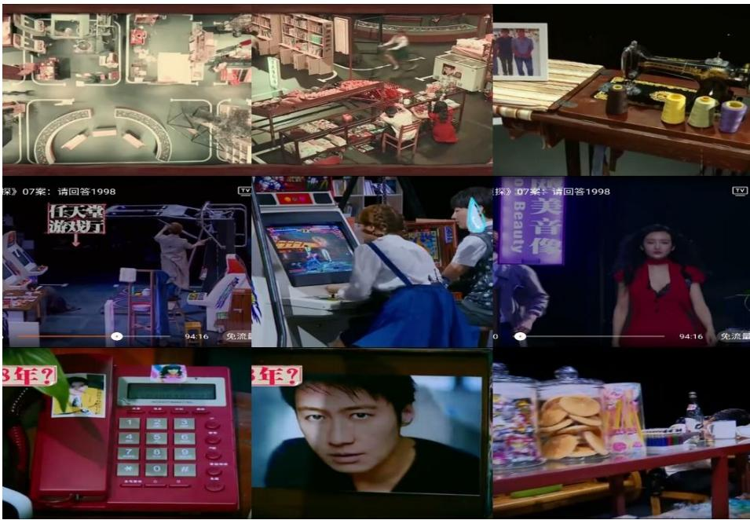
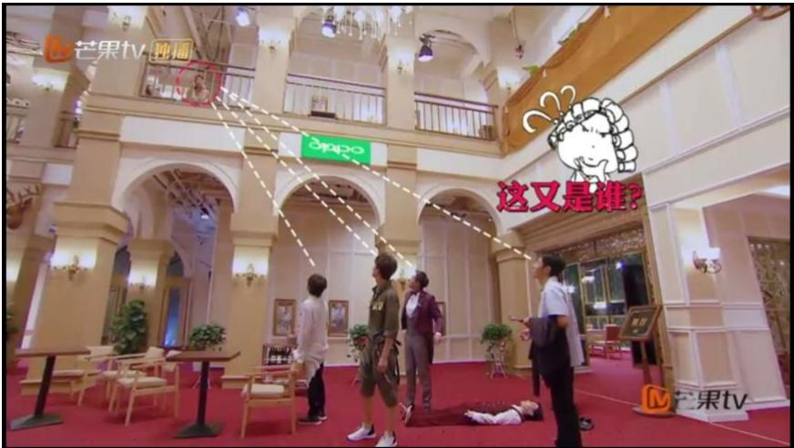
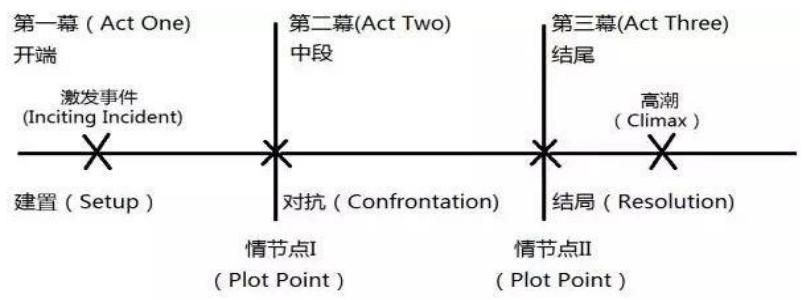
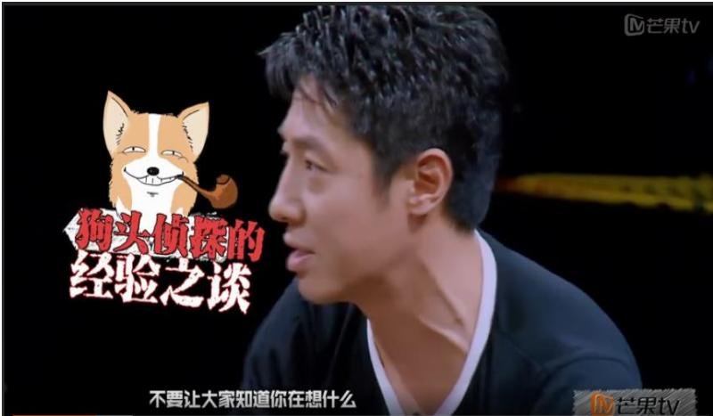
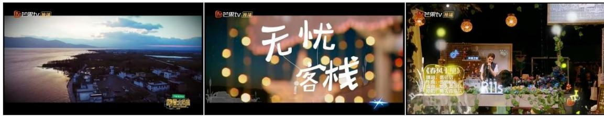
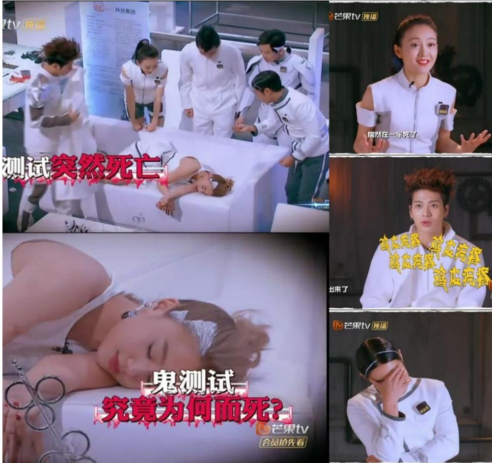
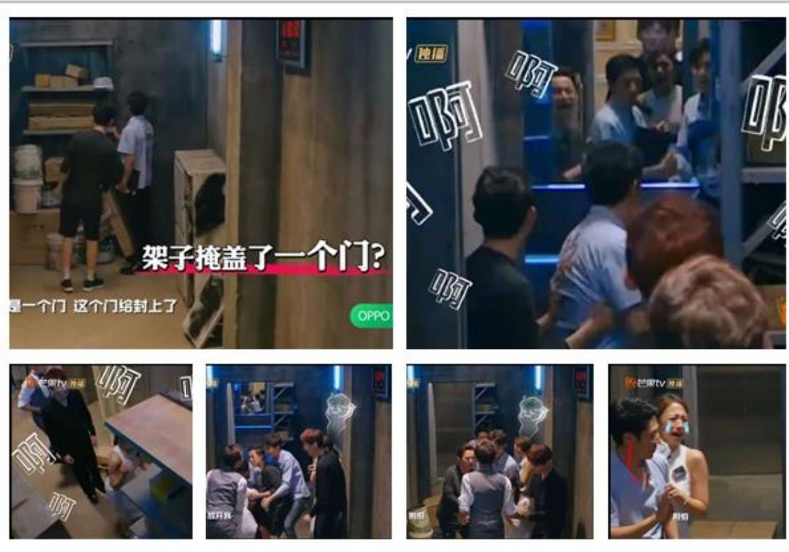
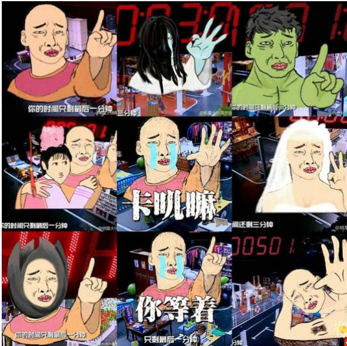
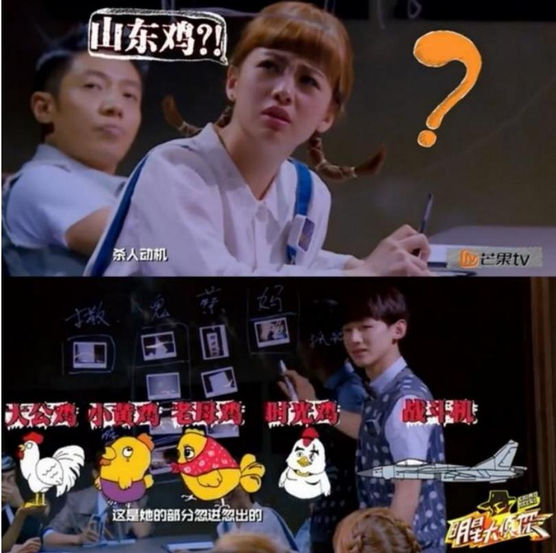
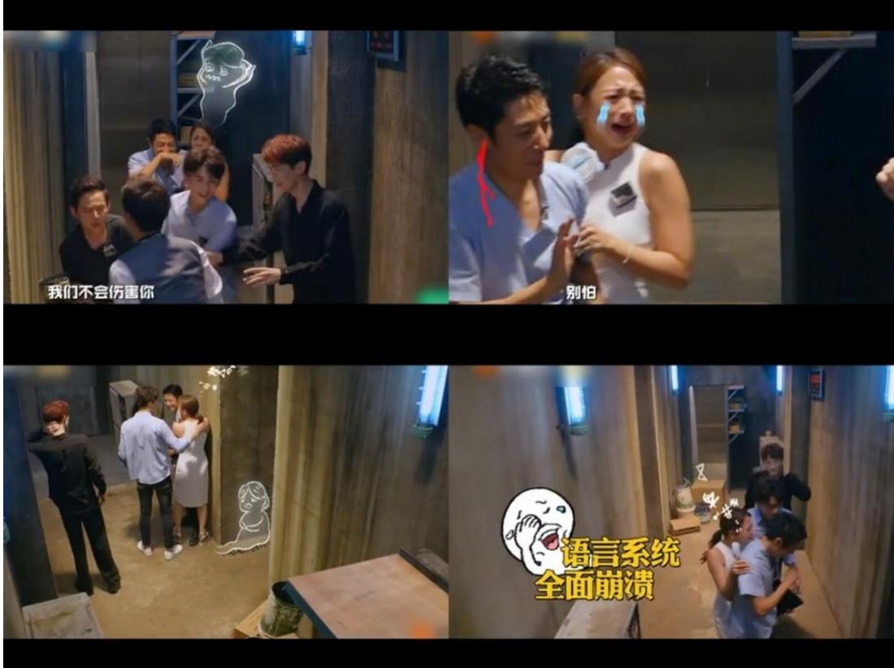

# 1. Bibliographic Information
## 1.1. Title
The central topic of the paper is a systematic narrative analysis of the emerging drama-style reality show genre in China, taking Mango TV's hit internet variety show *Who's the Murderer* (Chinese name: 《明星大侦探》) as a representative case study.
## 1.2. Authors
The primary author is **Zhou Guanglei**, a master's candidate in Journalism and Communication at Huazhong University of Science and Technology (HUST), supervised by **Professor Shi Changshun**, a leading Chinese scholar in television studies and media narratology, who first proposed the theoretical framework of television narratology in China.
## 1.3. Publication Venue
This is a master's degree thesis awarded by the School of Journalism and Information Communication, Huazhong University of Science and Technology. HUST is a top-tier national key university in China, and its journalism and communication program ranks among the top 10 in the country, with strong reputation in media industry practice and theoretical research.
## 1.4. Publication Year
2018
## 1.5. Abstract
Against the background of severe homogenization and audience aesthetic fatigue in China's reality TV industry, this paper takes the highly successful drama-style reality show *Who's the Murderer* as a case study, applies Tzvetan Todorov's "story-discourse" dichotomy narratology framework, and analyzes the genre's narrative strategies from two dimensions: narrative structure and narrative skills. The study finds that *Who's the Murderer* builds a complete "beginning-confrontation-ending" story framework based on Syd Field's three-act drama paradigm, uses fixed character labels and diverse character combinations to create three-dimensional round characters, and adopts multi-perspective narration and internet-style post-production to enhance audience immersion. Finally, the paper summarizes three actionable development strategies for China's drama-style reality shows: 1) Set diverse themes with social care to enhance program social value; 2) Balance the integration of real celebrity personalities and scripted plot characters; 3) Cultivate professional variety screenwriters to improve original content production capacity.
## 1.6. Original Source Link
The paper is an officially published master's thesis, available at:
- Uploaded source: `uploaded://ee573c9a-f666-4073-bc4c-a578cf1adb43`
- PDF link: `/files/papers/69c3f1dedcbc649cbf54fc61/paper.pdf`

  ---

# 2. Executive Summary
## 2.1. Background & Motivation
### Core Problem to Solve
China's reality TV industry boomed after the success of *Super Girl* in 2004, but by the mid-2010s, it fell into a development bottleneck: traditional reality shows either overemphasized unscripted "authenticity" leading to loose, uninteresting content, or relied too much on rigid scripts leading to accusations of "fakeness", causing widespread audience aesthetic fatigue. Drama-style reality shows (which embed game/performance processes into a complete pre-set plot framework) emerged as a promising solution after the success of *Go Fighting!* in 2015, but there was a lack of systematic academic research on the narrative mechanisms that make this genre successful, especially for internet-based drama-style reality shows.
### Research Gap
Prior studies either focused on general narrative rules of traditional reality shows, or only analyzed individual dramatic elements (e.g. character settings, conflicts) in specific programs, with no systematic deconstruction of the full narrative system of the drama-style reality show genre.
### Innovative Entry Point
The paper applies classic narratology theory to the study of this emerging genre, takes the most representative and highly acclaimed internet drama-style reality show *Who's the Murderer* as a sample, and extracts generalizable, actionable narrative strategies for the entire genre.
## 2.2. Main Contributions / Findings
1. **Theoretical definition**: It gives the first clear, systematic definition of drama-style reality shows for the Chinese context: "Real people voluntarily participate in pre-set specified scenarios, act as narrators, react to the plot based on their own personality, promote task completion, and the whole process is recorded and artistically processed."
2. **Narrative system deconstruction**: It deconstructs the narrative system of drama-style reality shows into two dimensions (narrative structure, corresponding to the "story" layer of Todorov's dichotomy; narrative skills, corresponding to the "discourse" layer), and clarifies the operational methods of each sub-component (scenario setting, story composition, character shaping, perspective use, audio-visual design, post-production).
3. **Practical strategies**: It summarizes three proven effective development strategies for domestic drama-style reality shows, filling the gap of practical guidance for the industry, and many subsequent hit drama-style variety shows have applied these strategies.

   ---

# 3. Prerequisite Knowledge & Related Work
## 3.1. Foundational Concepts
For beginners to understand this paper, the following core concepts are explained first:
1. **Drama-style reality show**: As defined above, a hybrid genre that combines pre-scripted dramatic plots with unscripted real performance of participants, different from both traditional scripted TV dramas and unscripted pure game reality shows.
2. **Narratology**: An academic discipline that studies the structure, nature, and form of narrative works, focusing on the difference between *what is told* (content) and *how it is told* (presentation form).
3. **Todorov's story-discourse dichotomy**: Proposed by French structuralist narratologist Tzvetan Todorov in 1966, this framework divides any narrative work into two independent but interrelated parts:
   - *Story*: The content of the narrative, including events, characters, background, plot logic, etc.
   - *Discourse*: The presentation form of the narrative, including narrative perspective, language, audio-visual skills, editing techniques, etc.
4. **Syd Field three-act structure paradigm**: A classic screenplay structure widely used in films and TV dramas, divided into three parts:
   - **Act 1 (Setup/Beginning, ~20% of runtime)**: Introduce background, characters, and the inciting incident that triggers the core conflict.
   - **Act 2 (Confrontation/Middle, ~60% of runtime)**: The main part of the work, where characters face obstacles and conflicts to achieve their goals.
   - **Act 3 (Resolution/Ending, ~20% of runtime)**: The core conflict is resolved, answers are revealed, and the story ends.
5. **Narrative perspective (Genette's classification)**: Proposed by narratologist Gérard Genette, there are three basic types of narrative perspective:
   - **Zero-focus (omniscient perspective)**: The narrator knows all information about the story, including characters' inner thoughts and hidden plot details.
   - **Internal focus**: The narrator only knows the information that a specific character in the story knows, the same as the character's field of vision.
   - **External focus**: The narrator only objectively records characters' external actions and words, does not access their inner thoughts or hidden information.
6. **Flat vs Round characters (E.M. Forster classification)**: A classification of literary characters:
   - **Flat characters**: One-dimensional characters defined by a single dominant trait, easy for audiences to recognize.
   - **Round characters**: Multi-faceted, complex characters with contradictory traits, similar to real people, more realistic and resonant.
## 3.2. Previous Works
1. **Reality TV basic theory**: Yin Hong, a leading Chinese media studies scholar, proposed 7 core elements of reality TV: voluntary participants, competitive behavior, real recording, specified scenario, purpose, rules, and artistic processing, laying the theoretical foundation for reality TV research in China.
2. **Dramatic elements in reality shows**: Prior studies found that adding dramatic elements (pre-set plots, conflicts, character settings) to reality shows can effectively enhance viewing attraction, and verified that the three-act structure is suitable for the narrative of drama-style reality shows represented by *Go Fighting!* and *Running Man China*.
3. **Television narratology**: Shi Changshun (supervisor of this paper) first proposed that narratology theory can be applied to the study of TV programs, and established the basic framework of television narratology, providing the core theoretical support for this paper.
## 3.3. Technological Evolution
The evolution of Chinese reality TV can be divided into three stages:
1. 2004-2014: **Traditional reality show era**: Dominated by talent shows, experience shows, and pure game competition shows, with little plot setting, focusing on showing participants' real reactions.
2. 2015-2017: **Drama-style reality show emergence era**: *Go Fighting!* first introduced a complete plot framework to reality shows, followed by a large number of similar programs, including both TV shows (*All Men Accelerate*, *Twenty-Four Hours*) and internet variety shows (*Who's the Murderer*).
3. 2018-present: **Mature era of drama-style reality shows**: The genre becomes the mainstream of Chinese variety shows, with more diversified themes and more mature narrative skills.
   This paper's research, published in 2018, is one of the first systematic studies of the drama-style reality show genre, located at the turning point between the emergence and mature stages.
## 3.4. Differentiation Analysis
Compared to prior related studies, the core innovations of this paper are:
1. It is the first study to apply Todorov's story-discourse dichotomy to systematically deconstruct the full narrative system of drama-style reality shows, covering both content and presentation dimensions, rather than only analyzing individual elements.
2. It focuses on internet-based drama-style reality shows, which have more flexible content and form than traditional TV shows, filling the research gap in this sub-category.
3. It proposes actionable, industry-oriented development strategies, rather than only conducting theoretical analysis.

   ---

# 4. Methodology
## 4.1. Principles
The core research principle is to use Todorov's "story-discourse" dichotomy as the overarching analytical framework, split the analysis of drama-style reality shows into two dimensions (narrative structure = story layer, narrative skills = discourse layer), and use the representative case *Who's the Murderer* to extract general narrative rules and strategies for the genre.
## 4.2. Core Methodology In-depth
### Data Collection Methods
The paper uses three complementary research methods:
1. **Literature research**: The author collected and sorted more than 50 relevant studies on reality TV theory, narratology, and drama-style variety shows, to build a solid theoretical foundation for the analysis.
2. **Text analysis**: The author took all 42 episodes of the first three seasons of *Who's the Murderer* (the most complete sample of the program at the time of research) as analysis objects, counted narrative elements (e.g. theme types, character setting rules, perspective use frequency) to ensure the accuracy of arguments.
3. **Case analysis**: The author selected representative high-rated episodes (including *Reply 1998*, *Horror Nursery Rhyme*, *Worry-free Inn*, *Horror Hotel*) for in-depth, episode-level analysis of specific narrative processes and effects.
### Analytical Framework
The analysis is divided into two parts corresponding to the two layers of Todorov's dichotomy:
#### Part 1: Narrative Structure (Story Layer)
This layer analyzes *what content the drama-style reality show presents*, including three sub-components:
1. **Narrative scenario setting**: The scenario is composed of closed space and clear game rules, which together drive plot development:
   - **Space setting**: Each episode of *Who's the Murderer* sets 6-8 independent scenes (crime scene, public space, each player's private space), with more than 1000 props, including 40-60 key clue props related to the case. The space setting is continuously upgraded across seasons: from daily life scenes in Season 1, to scenes with hidden passages/secret rooms in Season 2, to large-scale real built scenes in Season 3 (e.g. the 3-story real hotel built for *Horror Hotel*), to enhance audience immersion.
     The following figure (Figure 3-1 from the original paper) shows the 1990s-themed scene setting of the *Reply 1998* episode, which uses nostalgic props (sewing machine, old cassette tapes, 1990s star posters) to quickly bring audiences into the plot background:

     
     *该图像是图3-1《请回答1998》场景布置，展示了多个场景的布局，包括游戏机、办公室、家庭环境等，呈现了该剧集的时代特色和文化背景。*

   The following figure (Figure 3-2 from the original paper) shows the real 3-story hotel built for the *Horror Hotel* episode in Season 3, which greatly enhances the sense of reality and suspense:

   
   *该图像是图3-2，展示了《惊魂酒店》的搭建实景拍摄。画面中，几位参与者在房间内相互交流，注视着上方的标识和周围的环境，营造出悬疑的氛围。图中有对话框内容，表现了他们对于当前情境的疑惑。*

   - **Game rules setting**: Clear rules set the action goals for all participants: 6 players take roles of 1 detective, 4 innocent suspects, and 1 hidden killer (only the killer can lie); the goal of detective and innocent suspects is to find the killer, the goal of the killer is to hide their identity and escape; the program process follows a fixed 7-step flow: crime discovered → alibi statement → first round evidence search → first centralized reasoning → second round evidence search → one-on-one interrogation by detective → second centralized reasoning → final voting.
2. **Narrative story composition**: The story is built using two complementary structural tools:
   - **Adjusted three-act structure**: For reality shows, the three-act structure is adjusted to fit the features of unscripted real performance: beginning (~10% of runtime, set scenario, introduce characters, inciting incident = crime discovered), confrontation (~80% of runtime, evidence search, reasoning, conflicts between players), ending (~10% of runtime, voting, result reveal, case restoration). The following figure (Figure 3-3 from the original paper) shows the plot point setting rule of the classic three-act structure, which is strictly followed by the program:

     
     *该图像是图3-3，展示了经典三幕剧的情节点设置图。图中标示出了三幕剧的主要结构，包括开端、对抗、高潮和结尾，以及情节点的划分，帮助理解剧情发展的关键过程。*

   - **Core event + subordinate event combination**: The core event is the main murder case and the process of finding the killer (the trunk of the story), while subordinate events are the sub-stories of each suspect's motive and the interactive jokes between players (the leaves of the story). Core events ensure the logical completeness of the story, while subordinate events enrich the content, create entertainment effects, and highlight the theme.
3. **Narrative character shaping**: Characters are shaped via three layers to be both memorable and realistic:
   - **Stereotyped fixed character labels**: Each regular guest is given a distinct, amplified character label that matches their own personality, to help audiences recognize and remember them. Labels are created either by reinforcing their existing public image (e.g. He Jiong, a famous host known for intelligence, is labeled "evidence king, smart detective") or by creating contrast with their public image (e.g. Sa Beining, a former legal news host known for seriousness, is labeled "dog-head detective, funny old driver" because he often makes wrong reasoning and tells jokes in the show). The following figure (Figure 3-4 from the original paper) shows the stereotyped character image of Sa Beining:

     
     *该图像是插图，展示了芒果TV节目《明星大侦探》中一位角色的表现，画面上方显示了一只戴着烟斗的狗头形象，文字表达了节目中幽默的语境与情节设定，增强了视觉趣味性。*

   - **Variable character combinations**: Different guest combinations are used to create different chemical reactions, avoid content homogeneity, and attract different audience groups. For example, the "Shuangbei Combination" (He Jiong + Sa Beining, both graduated from top Beijing universities) creates high-IQ reasoning interactions, while the "Popo CP" (Gui Gui + Bai Jingting) creates cute, romantic interactive effects.
   - **Round character building**: The program avoids one-dimensional flat characters, and shows the multi-faceted traits of participants to make characters more realistic. For example, in the *Reply 1998* episode, Sa Beining, who played the killer, voluntarily turned himself in during the final voting, and emphasized that "escaping punishment for crime is not something to be proud of in real life", showing his sense of social responsibility behind his usual funny image.
#### Part 2: Narrative Skills (Discourse Layer)
This layer analyzes *how the story is presented to audiences*, including three sub-components:
1. **Multi-perspective narrative combination**: The program combines three types of narrative perspectives to achieve both clarity and immersion:
   - **Zero-focus perspective**: The production team acts as the omniscient narrator, using opening VCRs, scene overview shots, editing, and post-production subtitles to guide audiences to understand the story background and plot progress. The following figure (Figure 4-1 from the original paper) shows the zero-focus perspective opening of the *Worry-free Inn* episode, which introduces the scene setting to audiences:

     
     *该图像是插图，展示了芒果TV《无忧客栈》的不同视角，左侧为风景俯瞰，中间为节目标题，右侧为场景布置，整体营造出轻松的氛围。*

   - **Internal focus perspective**: The camera follows individual players' actions, and inserts post-interviews of players talking about their inner thoughts when they found clues, so audiences can experience the process of solving the case from the same perspective as the players, enhancing immersion. The following figure (Figure 4-2 from the original paper) shows the internal focus perspective when players found a victim who was killed halfway through the *2046* episode, creating a strong sense of shock:

     
     *该图像是图4-2，展示了芒果TV《明星大侦探》中内聚焦视角的场景。画面中，一名角色躺在桌子上，其他角色围绕她讨论，展现了剧情紧张的氛围与戏剧冲突。*

   - **External focus perspective**: The camera acts as an objective recorder, only capturing players' real reactions without explaining their inner thoughts, making the show feel more authentic and unscripted. The following figure (Figure 4-3 from the original paper) shows the external focus perspective when a sudden NPC appearance scared all players, capturing their real reactions without additional explanation:

     
     *该图像是图4-3，展示了真人秀节目中的外聚焦视角。画面中，参与者们在一个封闭的空间内，围绕一个被遮挡的门展开讨论和探索，表现出紧张和好奇的氛围。*

2. **Rich audio-visual design**: Music and sound effects are used for multiple purposes:
   - Shape character images: Play the *Detective Conan* theme song when He Jiong makes correct reasoning, play dog barking sound effects when Sa Beining makes wrong reasoning, to reinforce their character labels.
   - Create atmosphere: Use eerie theme songs and dim lighting in thriller-themed episodes (e.g. *Horror Nursery Rhyme*) to create a suspenseful, scary atmosphere.
   - Create entertainment effects: Adapt classic old songs familiar to post-80s and post-90s audiences with funny lyrics, to create humorous effects and resonate with the target audience.
3. **Internet-style post-production**: Post-production special effects are used to enhance "internet sense" (fit the preferences of young internet audiences):
   - Use popular internet meme elements: For example, the Erkang countdown meme (adapted from the classic TV drama *My Fair Princess*, with different shapes for each theme) is used for evidence search countdown, which has become a signature element of the show. The following figure (Figure 4-4 from the original paper) shows different versions of the Erkang countdown meme:

     
     *该图像是一个插图，展示了多个角色在倒计时中作出不同表情的场景。图中包含了各种风格的角色和幽默元素，戏剧性地表现了时间紧迫的氛围，适用于情境娱乐节目《明星大侦探》的相关讨论。*

   - Amplify funny moments: Add subtitles and cartoon effects to unexpected funny moments from players. For example, when Gui Gui misheard "murder motive" as "Shandong chicken" (a Chinese homophone), post-production added cartoon images of different chickens to amplify the joke, as shown in Figure 4-5 from the original paper:

     
     *该图像是插图，展现了综艺节目《明星大侦探》中的一幕。上半部分中，角色表现出疑惑并书写笔记，下半部分则展示了关于不同类型鸡的卡通形象，这些内容是参与者推理的线索，结合节目中的悬疑元素引发观众的笑点。*

   - Adjust program rhythm: Add funny cartoon effects after scary scenes to reduce excessive tension, balancing the suspenseful and entertaining attributes of the show. The following figure (Figure 4-6 from the original paper) shows post-production adding funny ghost cartoons after Gui Gui was scared by a sudden NPC appearance, to ease the tense atmosphere:

     
     *该图像是《明星大侦探》中后期效果调节环境氛围的示意图，展示了角色之间的互动与紧张气氛。上方画面中几位角色正在争论，下方画面中有角色相拥而立，强调了剧情的悬疑感和紧张焦虑的气氛。*

---

# 5. Experimental Setup
Since this is a humanities case study rather than a STEM experimental study, the research setup is as follows:
## 5.1. Research Sample
The research sample is all 42 episodes of the first three seasons of *Who's the Murderer*, broadcast on Mango TV from 2016 to 2018. The sample was chosen for three reasons:
1. It is the most successful drama-style reality show in China at the time of research, with Douban (China's most authoritative media rating platform) scores of 8.9, 9.0, 9.2 for the three seasons respectively, and 7.6 billion views of its related Weibo topics, representing the highest production level of the genre.
2. It has both typical features of drama-style reality shows (pre-set plot framework, character roles) and unique features of internet variety shows (flexible content, more bold themes, internet-style post-production), making it a representative sample.
3. It has completed three full seasons, with enough content to support systematic analysis of its narrative rules and evolution.
## 5.2. Evaluation Criteria
The paper uses three criteria to evaluate the effectiveness of the narrative strategies:
1. **Narrative completeness**: Whether the story has clear logic, a complete structure, and no obvious plot loopholes.
2. **Audience acceptance**: Measured by objective indicators including broadcast volume, Douban score, and social media discussion volume.
3. **Social value**: Whether the program transmits positive values, triggers public discussion of social issues, and has educational significance.
## 5.3. Baseline Comparison
The paper compares *Who's the Murderer* with other representative domestic drama-style reality shows broadcast at the same time, including *Running Man China*, *Go Fighting!*, *All Men Accelerate*, *Twenty-Four Hours*, and *72 Floors of Mystery*, to highlight the strengths and universality of its narrative strategies.

---

# 6. Results & Analysis
## 6.1. Core Results Analysis
1. **Narrative structure effectiveness**: The adjusted three-act structure with 10% beginning, 80% confrontation, and 10% ending, combined with the core + subordinate event combination, ensures that the program has both clear logical主线 and rich entertainment content, which is proven by the high audience retention rate of the program (average watch completion rate of over 80% for each episode, much higher than the industry average of ~40% for variety shows).
2. **Character shaping effectiveness**: The three-layer character shaping method (fixed labels + variable combinations + round characters) creates high audience stickiness: surveys show that more than 60% of viewers watch the program because they like the regular guests, and many character combinations have a large number of dedicated fans.
3. **Narrative skills effectiveness**: The combination of multiple narrative perspectives, rich audio-visual design, and internet-style post-production effectively meets the preferences of the target audience (post-80s and post-90s internet users), making the program both immersive and entertaining.
4. **Narrative strategy verification**: The three development strategies summarized from the case are proven effective by the program's continuous growth in reputation:
   - The evolution of themes from pure entertainment in Season 1 to social care themes in Season 3 (school bullying, depression, environmental protection, domestic violence) significantly improved the program's social reputation, and many relevant episodes triggered wide public discussion of social issues.
   - The balance between pre-set plot and real performance avoids the two common pain points of drama-style reality shows: "too scripted and fake" and "too loose and messy".
   - The emphasis on screenwriter cultivation (each script takes 3-4 months of polishing, and is tested by the production team multiple times before recording) ensures the high quality of the plot, which is the core reason for the program's high score for three consecutive seasons.
## 6.2. Representative Case Data
The following are the three-act structure analysis results of the representative high-rated episode *Worry-free Inn* (Season 3, Episode 9) from Table 3-2 of the original paper:

<table>
<thead>
<tr>
<th>Three acts</th>
<th>Program part</th>
<th>Time stamp</th>
<th>Plot content</th>
<th>Presentation form</th>
<th>Narrative meaning</th>
</tr>
</thead>
<tbody>
<tr>
<td rowspan="4">Beginning</td>
<td rowspan="4">Part 1 (upper episode)</td>
<td>00:00-01:30</td>
<td>Introduce game rules via animation</td>
<td>Animation</td>
<td>Set action goals for participants</td>
</tr>
<tr>
<td>01:30-02:10</td>
<td>Story background: High pressure in modern society, Worry-free Inn is built to help people get rid of urban anxiety</td>
<td>Short film</td>
<td>Explain story background</td>
</tr>
<tr>
<td>02:10-08:00</td>
<td>Discover victim (NPC), introduce all player roles</td>
<td rowspan="4">Main feature</td>
<td>Clarify core task</td>
</tr>
<tr>
<td>08:00-16:00</td>
<td>Players state their alibi, explain special features of Worry-free Inn</td>
<td>Set core suspense: Who killed the inn owner? How?</td>
</tr>
<tr>
<td rowspan="4">Confrontation</td>
<td rowspan="4">Part 1 + Part 2 (lower episode)</td>
<td>16:00-34:45</td>
<td>First round group evidence search</td>
<td rowspan="2">Continuously create new suspense via new evidence</td>
</tr>
<tr>
<td>34:45-68:20</td>
<td>First centralized reasoning: Players share evidence, dig into each character's backstory, piece together the full story, detective casts first blind vote, locks one suspect</td>
</tr>
<tr>
<td>00:00-02:55</td>
<td colspan="3">Recap of Part 1 content</td>
</tr>
<tr>
<td>02:55-26:25</td>
<td>Second round centralized evidence search</td>
<td rowspan="2">Main feature</td>
<td rowspan="2">Conflict and contradiction escalate, scope of suspects narrows</td>
</tr>
<tr>
<td></td>
<td></td>
<td>26:25-41:30</td>
<td>Detective conducts one-on-one interrogation with each player</td>
</tr>
<tr>
<td rowspan="2">Ending</td>
<td rowspan="2">Part 2</td>
<td>41:30-45:45</td>
<td>Individual voting: All players vote for who they think is the killer</td>
<td rowspan="2">Main feature</td>
<td rowspan="2">Solve suspense: Reveal final result</td>
</tr>
<tr>
<td>45:45-53:35</td>
<td>Announce voting result, reveal whether the real killer is caught</td>
</tr>
<tr>
<td rowspan="2">Bloopers</td>
<td rowspan="2">Part 2</td>
<td>53:30-63:20</td>
<td>Truth restoration short film: Explain the full process of the crime</td>
<td>Short film</td>
<td>Fill plot gaps</td>
</tr>
<tr>
<td>63:20-70:06</td>
<td>Next episode preview</td>
<td>Trailer</td>
<td>Attract audience to watch the next episode</td>
</tr>
</tbody>
</table>

This table verifies that the program strictly follows the adjusted three-act structure, with the confrontation part accounting for most of the runtime, focusing on the core appeal of reasoning and solving cases.
## 6.3. Theme Evolution Analysis
The theme evolution of the three seasons of *Who's the Murderer* (from Table 5-1 of the original paper) is as follows:

| Season | Proportion of entertainment themes (love, interest conflict) | Proportion of creative themes (fantasy, sci-fi) | Proportion of realistic social themes | Average Douban score |
|--------|-------------------------------------------------------------|------------------------------------------------|---------------------------------------|----------------------|
| 1      | 75% (9/12 episodes)                                         | 8% (1/12 episodes)                             | 17% (2/12 episodes)                    | 8.9                  |
| 2      | 58% (7/12 episodes)                                         | 25% (3/12 episodes)                            | 17% (2/12 episodes)                    | 9.0                  |
| 3      | 33% (4/12 episodes)                                         | 25% (3/12 episodes)                            | 42% (5/12 episodes)                    | 9.2                  |

This data shows that as the program added more realistic social themes, its audience reputation continued to improve, verifying that adding social value to themes is an effective strategy to enhance program influence.

---

# 7. Conclusion & Reflections
## 7.1. Conclusion Summary
This paper makes three core contributions to the research and practice of China's drama-style reality show industry:
1. It systematically defines the concept of drama-style reality shows for the Chinese context, clarifying the core attributes of this emerging genre.
2. It deconstructs the complete narrative system of drama-style reality shows using Todorov's story-discourse dichotomy, and clarifies the operational methods of each component of the narrative system, filling the gap of systematic theoretical research on this genre.
3. It summarizes three proven effective development strategies for the genre: first, set diversified themes reflecting social care to enhance the social value and educational significance of the program; second, balance the integration of real celebrity personalities and scripted plot characters to achieve a balance between "plot setting" and "real performance"; third, attach importance to the cultivation of professional variety screenwriters to enhance the original content production capacity of the industry.
## 7.2. Limitations & Future Work
### Limitations pointed out by the author
1. The drama-style reality show genre was still in the emerging stage in China when the paper was written, with very few successful samples besides *Who's the Murderer*, *Go Fighting!* and *Running Man China*, so the generalizability of the conclusions needs further verification with more subsequent programs.
2. The paper only analyzes Chinese domestic drama-style reality shows, and does not compare with foreign similar programs (e.g. Korean *Crime Scene*, the original version of *Who's the Murderer*), so the applicability of the proposed strategies to foreign markets needs further study.
### Future research directions suggested by the author
1. Explore narrative strategies for original drama-style reality shows with Chinese cultural characteristics, to reduce the industry's reliance on imported foreign program models.
2. Study the cross-platform communication effect of drama-style reality shows (from internet platforms to traditional TV platforms), as represented by *Who's the Murderer*'s TV spin-off *I Am a Great Detective*.
3. Explore the application of interactive narrative in drama-style reality shows, such as allowing audiences to participate in plot setting or reasoning processes via internet platforms.
## 7.3. Personal Insights & Critique
### Strengths
This paper is a pioneering and highly practical study of China's drama-style reality show industry. The three narrative strategies proposed in the paper have been widely applied in subsequent hit drama-style variety shows (such as *The Truth*, *Begin Again*, *The Oasis*), and have effectively promoted the improvement of the overall production level of China's variety show industry. The paper's emphasis on the cultivation of variety screenwriters is particularly valuable, as the lack of high-quality original screenwriters has long been the biggest pain point restricting the development of China's variety show industry.
### Areas for improvement
1. The paper mostly relies on qualitative case analysis, and lacks quantitative analysis of audience feedback (e.g. questionnaire surveys, big data analysis of bullet screen comments) to further verify the effectiveness of the narrative strategies.
2. The paper does not conduct in-depth discussion of the potential negative impacts of drama-style reality shows, such as excessive scriptedness leading to loss of authenticity, or improper plot setting having bad guidance for underage audiences. For example, the paper briefly mentions that the program's original reward mechanism (the killer gets all gold bars if they escape) may have a bad influence on teenagers, which is a very practical suggestion, and the program later adjusted this mechanism and added public welfare promotion sections after each episode to guide correct values.
3. The paper does not discuss the cost problem of the narrative strategies it proposes: for example, building real scenes and polishing scripts for months requires high investment, which may not be affordable for small and medium-sized production teams, and more cost-effective alternative strategies can be further explored.