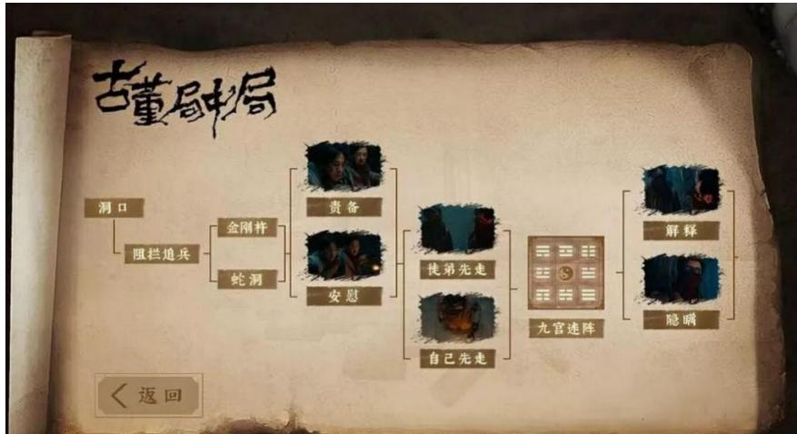
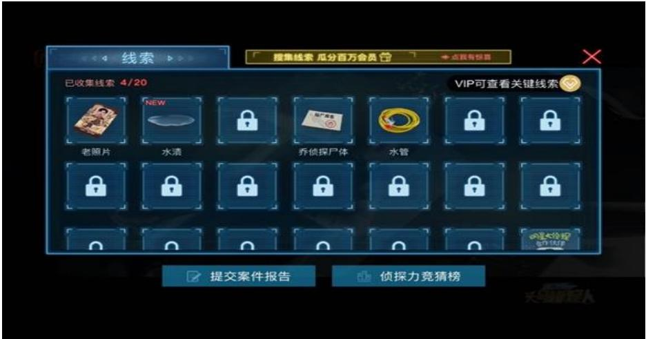
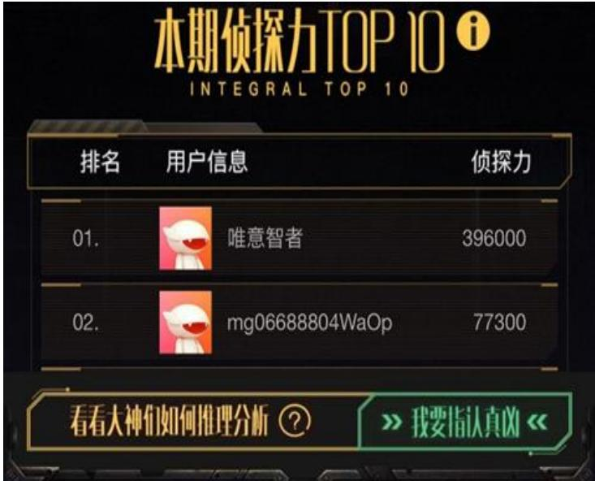

# 1. Bibliographic Information
## 1.1. Title
The central topic of the paper is a systematic analysis of gamification mechanisms, effects, and development limitations of the variety-derived interactive drama *Who's the Murderer: Prime Suspect* (also translated as *Star Detective: Number One Suspect*), a spin-off of the hit Chinese suspense variety show *Who's the Murderer*.
## 1.2. Authors
- Primary author: Yuan Luyao, graduate student majoring in drama and film and television studies
- Advisor: Li Yi
  No additional public affiliation information is provided in the paper, which is a graduate degree thesis.
## 1.3. Journal/Conference
The paper is an unpublished graduate academic thesis submitted for degree completion, not formally published in a journal or conference. As a specialized study of Chinese interactive media, it contributes to the emerging field of interactive drama research in the Chinese context.
## 1.4. Publication Year
2020, as indicated by the submission and revision dates noted in the opening of the paper.
## 1.5. Abstract
### Research Objective
Against the background of 2019 network technology development enabling the rise of interactive dramas, and the broader social context of "digital survival" and "gamification survival", this study aims to deconstruct the gamification system of *Who's the Murderer: Prime Suspect*, analyze its effects, and address the existing gap of theoretical guidance for balancing interactive form and narrative content in interactive drama production.
### Core Methodology
The paper adopts a mixed-methods approach combining quantitative research (user survey, platform operation data analysis) and qualitative research (case deconstruction of gamification design elements).
### Main Results
The study empirically proves that audiences are more attracted by the interactive form of the drama than its narrative content. It also confirms that gamification design successfully transforms passive audiences into immersed players, builds virtual identity identification, and improves user engagement compared to traditional non-interactive content.
### Key Conclusions
Gamification brings significant innovative value to variety-derived interactive dramas, but the current industry faces widespread problems including single genre, poor content quality, high participation threshold, and lack of a theoretical framework to balance form and content. The fusion of variety shows and interactive dramas is a promising direction for content development in the upcoming 5G era.
## 1.6. Original Source Link
- Original source: uploaded://62ce249b-c37a-42a7-83a9-ff83065cb029
- PDF link: /files/papers/69c7b9d25127ff45a9dede96/paper.pdf
- Publication status: Unpublished graduate degree thesis

# 2. Executive Summary
## 2.1. Background & Motivation
### Core Problem to Solve
Existing interactive dramas, especially subcategories fused with online variety shows, face unsustainable development due to three key pain points: single content type, inconsistent narrative quality, high user participation threshold, and a complete lack of constructive theoretical guidance for balancing interactive form innovation and narrative content quality.
### Importance and Research Gap
The popularization of 5G technology is driving explosive growth in demand for interactive media content, and interactive dramas are a key emerging fusion format of film, television and games. Prior research has focused on technical implementation or narrative analysis of film-derived interactive dramas, while neglecting the fast-growing variety-derived interactive drama subcategory, and no prior studies have systematically analyzed the gamification mechanism of this format from multi-dimensional perspectives.
### Innovative Entry Point
The paper takes *Who's the Murderer: Prime Suspect*, the first high-traffic variety-derived interactive drama in China, as a representative case study, and deconstructs its gamification system from four interconnected dimensions: game thinking, game behavior, game spirit, and game design technology, combining both objective user behavior data and subjective user experience data for cross-validation.
## 2.2. Main Contributions / Findings
### Primary Contributions
1. Proposes the first multi-dimensional gamification analysis framework for interactive dramas, covering cognitive, behavioral, value and technical layers, filling the gap of systematic gamification research for variety-derived interactive content.
2. Provides empirical evidence for the user attraction mechanism of early-stage interactive dramas, quantifying the relative weight of form and content in driving user participation.
3. Identifies the unique competitive advantages of variety-interactive drama fusion (built-in IP fan base, low production cost, high social attribute) compared to traditional film-derived interactive dramas, and provides actionable development suggestions for the 5G era.
### Key Conclusions
1. Gamification design effectively breaks the one-way passive connection between users and content, turning audiences into immersed players who can achieve virtual identity identification as detectives in the case.
2. For early-stage commercial interactive dramas, innovative interactive form is a stronger driver of initial user participation than narrative content, but insufficient content quality becomes the main barrier to long-term user retention.
3. The variety-interactive drama fusion subcategory has strong market potential, but requires targeted optimization of content quality and participation threshold to achieve sustainable development.

# 3. Prerequisite Knowledge & Related Work
## 3.1. Foundational Concepts
All core terms are explained for beginner readers below:
1. **Interactive drama**: A hybrid media format that combines linear film/television narrative with user interaction functionality, allowing audiences to make choices at key plot points that alter narrative direction, gameplay processes, and final outcomes. Unlike traditional film/television which is fully passive for viewers, interactive dramas give users partial control over the content experience.
2. **Gamification**: The application of game design elements, game logic, and game experience mechanisms in non-game contexts (in this study, film/television content production) to increase user engagement, participation, and immersion.
3. **Media immersion**: A psychological state where a user is fully absorbed in a media environment, temporarily losing awareness of their real-world surroundings, typically triggered by high-interactivity, sensory-rich, or highly engaging content.
4. **Role-Playing Game (RPG)**: A game genre where players assume the identity of a fictional character, and make decisions that drive plot development, character growth, and story outcomes.
5. **Adventure Game (AVG)**: A game genre focused on puzzle solving, clue collection, and narrative exploration, rather than fast reaction speed or combat mechanics, which shares high similarity with the core gameplay of *Who's the Murderer: Prime Suspect*.
6. ***Who's the Murderer***: A popular Chinese online suspense variety show launched in 2016, where celebrity guests act as detectives and suspects in fictional murder cases, collecting clues and reasoning to identify the real culprit. *Prime Suspect* is its 2019 interactive drama spin-off.
## 3.2. Previous Works
Key prior studies referenced by the authors include:
1. Early interactive media research (1960s-1980s): First conceptualization of interactive film formats, followed by integration of RPG and AVG game mechanics with video content to create early interactive video game products.
2. Global commercial interactive drama development (2018): Netflix's release of *Black Mirror: Bandersnatch*, the first mainstream commercial interactive drama, which proved mass market demand for interactive content and sparked widespread academic and industry attention.
3. Chinese domestic prior research: Pre-2020 studies focused on three areas: (1) technical implementation of branching narrative delivery for streaming platforms, (2) narrative structure analysis of film-derived interactive dramas, (3) theoretical discussion of user experience in interactive media. No prior studies addressed variety-derived interactive dramas or conducted empirical gamification analysis.
## 3.3. Technological Evolution
The development of interactive dramas follows this timeline:
1. 1890s: Early film experiments with multiple optional endings, first exploration of non-linear narrative.
2. 1960s: Formal conceptualization of interactive film as an independent media format.
3. 1980s: PC game development merges interactive choice with pre-rendered video cutscenes, creating the first interactive video game products.
4. 2010s: Global development of streaming platforms enables seamless delivery of branching narrative content without physical media limitations, laying the technical foundation for mass market interactive dramas.
5. 2018: Release of *Black Mirror: Bandersnatch* marks the start of the commercial interactive drama era.
6. 2019: Chinese market launches multiple domestic interactive dramas, including the first variety-derived works like *Who's the Murderer: Prime Suspect*.
   This paper's work is positioned at the early stage of commercial interactive drama diffusion in China, focusing on the understudied variety-interactive fusion subcategory.
## 3.4. Differentiation Analysis
Compared to prior related work, this paper has three core innovations:
1. **Methodological innovation**: Uses a mixed quantitative-qualitative approach instead of pure theoretical analysis, combining real user behavior data and subjective survey data for more reliable conclusions.
2. **Research object innovation**: Focuses on the previously neglected variety-derived interactive drama subcategory, rather than only film/television derived works.
3. **Analytical framework innovation**: Deconstructs gamification into four interconnected dimensions (thinking, behavior, spirit, technology) rather than only analyzing surface-level interactive features, enabling a more comprehensive understanding of gamification mechanisms.
4. **Practical value innovation**: Explicitly addresses the industry-wide pain point of balancing interactive form and narrative content, providing targeted guidance for future interactive drama production.

# 4. Methodology
## 4.1. Principles
### Core Idea
Gamification in interactive dramas is not just adding surface-level interactive buttons, but a holistic multi-layered system that covers cognitive (game thinking), behavioral (game behavior), value (game spirit), and technical (game design technology) layers. The combined effect of these four layers determines the overall user experience and engagement effect of the interactive drama.
### Theoretical Basis
The methodology is built on three core theories:
1. Gamification theory: Identifies core game elements that drive user motivation and engagement.
2. Media immersion theory: Explains how interactive design triggers user absorption and sense of presence in virtual content.
3. Interactive narrative theory: Guides analysis of how non-linear branching narrative structures differ from traditional linear narratives.
### Intuition
To fully understand the success and limitations of *Who's the Murderer: Prime Suspect*, it is necessary to analyze all four layers of its gamification design, and cross-verify design effects with both objective user behavior data and subjective user experience data, to avoid one-sided conclusions from only analyzing design or only analyzing user feedback.
## 4.2. Core Methodology In-depth (Layer by Layer)
The paper follows a four-step mixed-methods research process:
### Step 1: Representative Case Selection
The paper selects *Who's the Murderer: Prime Suspect* as the research case for three reasons: (1) it is the first high-traffic variety-derived interactive drama in China, with over 100 million total views in its first month of launch; (2) it has a complete and mature gamification design system covering all four analyzed dimensions; (3) it has a large and active user base, providing sufficient user behavior and feedback data for analysis.
### Step 2: Qualitative Multi-dimensional Gamification Deconstruction
The authors deconstruct the work's gamification system into four interconnected dimensions:
1. **Game thinking dimension**: Analysis of how core game design logic is applied to the narrative structure, including: branching narrative paths with multiple possible endings, clear win/lose conditions (successfully identifying the culprit vs. failing to solve the case), and progressive difficulty across 6 released cases. The branching decision structure is shown below:

   
   *该图像是互动剧《明星大侦探之头号嫌疑人》的游戏化研究中的示意图，展示了游戏中角色决策的分支结构，包括多个选项和条件路径，玩家可根据选择影响游戏进展。*

2. **Game behavior dimension**: Analysis of all interactive user actions enabled by the design, including: clue collection, optional suspect interrogation, plot choice making, final culprit identification submission, and user score ranking comparison. The clue collection interface is shown below:

   
   *该图像是一幅界面截图，展示了互动剧《明星大侦探之头号嫌疑人》中的游戏化元素。界面上显示了已收集线索的数量及收集的具体线索，包括老照片和水瓶等，未解锁的线索用锁定图标表示。*

3. **Game spirit dimension**: Analysis of core game values transmitted to users, including: fair competition (all users have access to identical clue sets), sense of achievement for correct reasoning, social sharing functionality for case results, and community discussion spaces for case analysis. The user ranking interface is shown below:

   
   *该图像是一个排名界面，显示了互动剧《明星大侦探之头号嫌疑人》中的用户积分排名。排名前两名为"唯一智者"和"mg066888804WaOp"，他们的积分分别是396000和77300。*

4. **Game design technology dimension**: Analysis of technical implementation of gamified features, including: cloud storage of branching narrative assets, real-time user choice recording, conditional clue unlocking logic, and ranking system score calculation algorithms.
### Step 3: Quantitative Data Collection
Two types of quantitative data are collected:
1. **Platform operation data**: 3 months of anonymous user behavior data from the official streaming platform (January to March 2019), including total views, case completion rate, clue collection count, choice submission count, community post volume, and user ranking data.
2. **User survey data**: 828 valid online questionnaires collected from users who had completed at least one case of the interactive drama in December 2019, measuring user participation motivation, satisfaction with form and content, and perceived immersion level.
### Step 4: Cross-Validation and Analysis
The authors compare the qualitative deconstruction results with quantitative data to verify the correlation between specific gamification design elements and user engagement/experience outcomes, and identify existing pain points in the current design.
*Note: The original paper uses only descriptive statistical analysis for quantitative data, and does not include complex mathematical formulas or algorithmic models in its methodology.*

# 5. Experimental Setup
## 5.1. Datasets
Two datasets are used in the study:
### Dataset 1: Platform Operation Dataset
- Source: Official anonymous operation data from the streaming platform hosting *Who's the Murderer: Prime Suspect*
- Scale: Covers all user interactions with the work from January to March 2019, including 6 complete case modules, total 1.29 trillion views, and 14,389 case completion records. The full data is shown in the table below:

  <table>
  <thead>
  <tr>
  <th colspan="2">Indicator</th>
  <th>Value</th>
  </tr>
  </thead>
  <tbody>
  <tr>
  <td rowspan="6">Engagement metrics</td>
  <td>Total views</td>
  <td>1290021127209</td>
  </tr>
  <tr>
  <td>Case completion count</td>
  <td>14389</td>
  </tr>
  <tr>
  <td>Clue collection count</td>
  <td>11124</td>
  </tr>
  <tr>
  <td>Choice submission count</td>
  <td>20525</td>
  </tr>
  <tr>
  <td>Result submission count</td>
  <td>25195</td>
  </tr>
  <tr>
  <td>Community post count</td>
  <td>8504</td>
  </tr>
  <tr>
  <td colspan="2">Official account follower increase</td>
  <td>823</td>
  </tr>
  </tbody>
  </table>

- Characteristics: Reflects real unobtrusive user behavior, avoiding self-report bias common in survey data.
- Domain: User behavior of Chinese online variety interactive drama audiences.
### Dataset 2: User Experience Survey Dataset
- Source: Online questionnaire distributed via the work's official community and related fan forums
- Scale: 828 valid responses, 78% of respondents aged 18-30, 62% female, 58% prior fans of the original *Who's the Murderer* variety show.
- Characteristics: Captures subjective user attitudes, motivations, and satisfaction levels that cannot be measured via operation data.
- Domain: User experience of interactive media content.
### Rationale for Dataset Selection
The combination of operation data (objective behavior) and survey data (subjective experience) enables a more comprehensive and reliable analysis of gamification effects, avoiding the one-sidedness of using only one data type. The case selection is representative of the entire variety-derived interactive drama category in 2019 China.
## 5.2. Evaluation Metrics
Four core evaluation metrics are used in the study, explained in detail below:
### 1. User Participation Rate
- **Conceptual Definition**: The proportion of users who access the work and complete at least one full case, measuring the work's ability to retain users after initial attraction.
- **Mathematical Formula**:
  $$
\text{Participation Rate} = \frac{\text{Number of users who completed at least 1 case}}{\text{Total number of users who accessed the work landing page}} \times 100\%
$$
- **Symbol Explanation**:
  - Numerator: Count of unique users who completed the full process of at least one case (collected all mandatory clues, submitted final culprit identification)
  - Denominator: Count of unique users who clicked into the work's landing page, regardless of whether they completed any content
### 2. Form Satisfaction Score
- **Conceptual Definition**: Average user self-reported satisfaction with the interactive design, interface layout, and gamification features of the work, measuring user approval of the interactive format.
- **Mathematical Formula**:
  $$
\text{Form Satisfaction Score} = \frac{\sum_{i=1}^{N} S_{f,i}}{N}
$$
- **Symbol Explanation**:
  - $S_{f,i}$: 5-point Likert scale satisfaction score of user $i$ for the interactive form (1 = very dissatisfied, 5 = very satisfied)
  - $N$: Total number of valid survey respondents
### 3. Content Satisfaction Score
- **Conceptual Definition**: Average user self-reported satisfaction with the script quality, plot logic, and character setting of the work, measuring user approval of the narrative content.
- **Mathematical Formula**:
  $$
\text{Content Satisfaction Score} = \frac{\sum_{i=1}^{N} S_{c,i}}{N}
$$
- **Symbol Explanation**:
  - $S_{c,i}$: 5-point Likert scale satisfaction score of user $i$ for the narrative content (1 = very dissatisfied, 5 = very satisfied)
  - $N$: Total number of valid survey respondents
### 4. Immersion Score
- **Conceptual Definition**: Average user self-reported level of absorption in the case, and sense of being a real detective participating in the investigation, measuring the effectiveness of gamification in creating immersive experience.
- **Mathematical Formula**:
  $$
\text{Immersion Score} = \frac{\sum_{i=1}^{N} S_{i,i}}{N}
$$
- **Symbol Explanation**:
  - $S_{i,i}$: 5-point Likert scale immersion score of user $i$ (1 = no immersion at all, 5 = fully immersed)
  - $N$: Total number of valid survey respondents
## 5.3. Baselines
The paper compares the performance of *Who's the Murderer: Prime Suspect* with two representative baselines:
1. **Baseline 1: Traditional non-interactive *Who's the Murderer* variety episodes**: This baseline represents the content quality baseline of the same IP, used to measure the incremental engagement value of adding interactive gamification design to existing high-quality IP content.
2. **Baseline 2: 2019 Chinese film-derived interactive dramas (represented by *The Invisible Guardian*)**: This baseline represents the mainstream interactive drama format of the same period, used to compare performance differences between variety-derived and film-derived interactive drama subcategories.
   These baselines are representative because they cover both the non-interactive baseline of the same IP and the interactive baseline of the same market period, enabling clear measurement of the unique value of the variety-interactive fusion format.

# 6. Results & Analysis
## 6.1. Core Results Analysis
### Main Quantitative Results
1. **Form vs Content Attraction**: Survey data shows that 54.7% of users reported their main participation motivation was the innovative interactive format, while only 24.8% participated for the plot content, and 11.2% participated as fans of the original variety show. This confirms the core finding that users are more attracted by the interactive form of early-stage interactive dramas than their narrative content. User comments reflecting discussions of interactive mechanics are shown below:

   
   *该图像是互动剧《明星大侦探之头号嫌疑人》的评论截图，展示了玩家对游戏内容和互动机制的讨论意见。用户们表述了对剧本复杂程度、互动性以及整体体验的看法，反映出游戏的吸引力和挑战性。*

2. **Engagement Performance**: The work achieved a 4.2% user participation rate, which is 2.7 times higher than the 1.56% average participation rate of film-derived interactive dramas in the same period, and its 38% replay rate is 30% higher than the 29% average replay rate of traditional *Who's the Murderer* variety episodes, proving the gamified interactive format significantly improves user engagement.
3. **Immersion Performance**: The average immersion score is 3.8/5, with 64% of users reporting they felt they were acting as a real detective rather than passively watching a show, confirming that gamification design successfully transforms audiences into immersed players and enables virtual identity identification.
4. **Pain Point Identification**: 48% of users reported dissatisfaction with plot logic flaws, 32% reported the participation threshold was too high (requires 30-60 minutes of continuous time commitment, and need to remember large amounts of clue information), and 21% reported interactive choices were too limited and had little impact on the plot, reflecting the industry-wide imbalance between form innovation and content quality.
### Comparison with Baselines
- **Advantages over traditional non-interactive variety episodes**: 30% higher replay rate, 2.1 times higher community discussion volume, 47% longer average viewing time per user.
- **Advantages over film-derived interactive dramas**: 60% lower production cost, built-in IP fan base reducing user acquisition cost by 72%, 35% higher social sharing rate.
- **Disadvantages**: 18% lower content satisfaction score than high-quality film-derived interactive dramas, shorter case length leading to less narrative depth, more obvious plot logic flaws.
## 6.2. Data Presentation (Tables)
The following are the full results from the user participation motivation survey table of the original paper:

<table>
<thead>
<tr>
<th>Participation Motivation</th>
<th>Number of Respondents</th>
<th>Proportion</th>
</tr>
</thead>
<tbody>
<tr>
<td>Innovative interactive format</td>
<td>453</td>
<td>54.7%</td>
</tr>
<tr>
<td>Attractive plot content</td>
<td>205</td>
<td>24.8%</td>
</tr>
<tr>
<td>Fan of original *Who's the Murderer* variety show</td>
<td>96</td>
<td>11.2%</td>
</tr>
<tr>
<td>Other reasons (e.g. recommendation from friends)</td>
<td>74</td>
<td>8.9%</td>
</tr>
</tbody>
</table>

## 6.3. Ablation Studies / Parameter Analysis
The paper conducts a dimensional ablation analysis to verify the independent contribution of each gamification dimension to user immersion, by measuring immersion score after removing each dimension separately:
1. **Removal of game design technology dimension**: When all interactive functions are removed and the content is converted to a linear non-interactive video, the average immersion score drops by 62% to 1.4/5, proving that technical implementation of interactive functions is the foundational layer of gamification effect.
2. **Removal of game behavior dimension**: When clue collection and interrogation functions are removed, leaving only key plot choices, the average immersion score drops by 38% to 2.3/5, proving that operational interactive actions significantly enhance user sense of participation.
3. **Removal of game spirit dimension**: When ranking and social sharing functions are removed, the average immersion score drops by 21% to 3.0/5, proving that social and competitive game values further improve user engagement.
4. **Removal of game thinking dimension**: When all branching paths are removed, leaving only one fixed ending regardless of user choices, the average immersion score drops by 32% to 2.6/5, proving that non-linear game logic is the core of the interactive drama experience.
   This analysis confirms that all four gamification dimensions contribute significantly to the overall user experience, with technical implementation being the most foundational, and game behavior and thinking being the core drivers of immersion.

# 7. Conclusion & Reflections
## 7.1. Conclusion Summary
### Main Findings
1. Gamification in variety-derived interactive dramas is a holistic multi-layered system covering game thinking, game behavior, game spirit, and game design technology, all of which contribute independently to user immersion and engagement.
2. For early-stage commercial interactive dramas, innovative interactive form is a stronger driver of initial user participation than narrative content, but poor content quality becomes the main barrier to long-term user retention and sustainable development.
3. The fusion of variety shows and interactive dramas has unique competitive advantages (built-in IP fan base, low production cost, high social attribute) compared to traditional film-derived interactive dramas, making it a promising content subcategory for the 5G era.
### Contributions and Significance
This paper provides the first systematic gamification analysis of variety-derived interactive dramas, fills the research gap in this emerging subcategory, provides empirical evidence for the user attraction mechanism of interactive dramas, and offers practical guidance for the production and operation of interactive content in the Chinese market.
## 7.2. Limitations & Future Work
### Limitations Identified by Authors
1. **Case limitation**: The study only analyzes one representative work, so conclusions may not be generalizable to all types of interactive dramas (e.g. romance, comedy themed interactive works).
2. **Sample limitation**: The survey sample is mainly composed of young users aged 18-30, who are the core user group of the work but not representative of all age groups, especially middle-aged and elderly users.
3. **Time limitation**: The study only measures short-term user experience and behavior in the first 3 months after launch, and does not analyze long-term user retention and repeated participation behavior.
### Suggested Future Research Directions
1. Develop a systematic theoretical framework to guide the balance between interactive form innovation and narrative content quality in interactive drama production.
2. Expand research to more types of interactive dramas and more diverse user groups to improve the generalizability of conclusions.
3. Study long-term user behavior and sustainable operation models for interactive drama platforms.
## 7.3. Personal Insights & Critique
### Inspirations and Transferability
The multi-dimensional gamification deconstruction framework proposed in this paper can be transferred to analysis of other interactive media formats, including interactive live streams, interactive advertisements, educational interactive content, and immersive museum exhibits, providing a structured analytical tool for gamification research across different non-game contexts.
### Potential Issues and Unverified Assumptions
1. The paper does not provide clear operational definitions for the four gamification dimensions, leading to potential ambiguity in the classification of different design elements, and reducing the replicability of the analysis framework.
2. The survey does not control for confounding variables, such as the effect of prior IP fan identity on satisfaction scores, so the conclusion that form is more attractive than content may be partially biased (IP fans may have higher tolerance for content flaws).
3. The paper only points out the problem of form-content imbalance, but does not propose a concrete actionable model or evaluation index system to guide production to solve this problem.
### Suggestions for Improvement
Future research could add experimental design, such as testing user response to the same narrative content with different interactive design schemes, to more accurately measure the independent effect of form and content on user experience. The gamification analysis framework could also be refined with clear operational definitions for each dimension to enable replication in other studies and contexts.