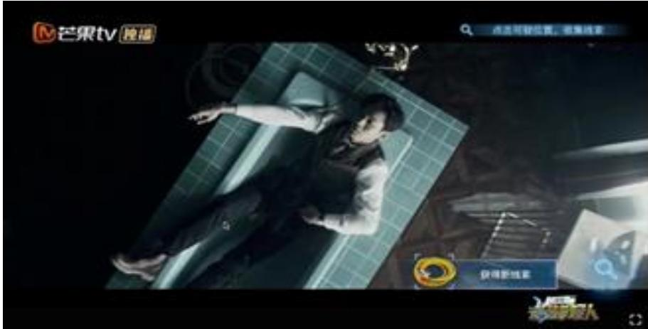
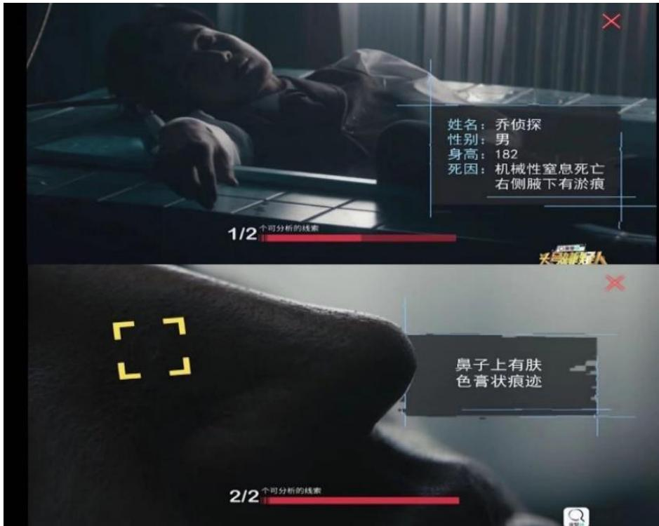
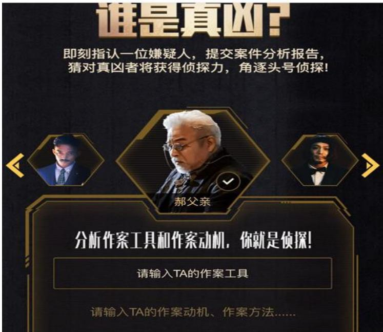
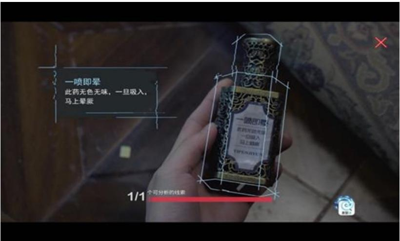
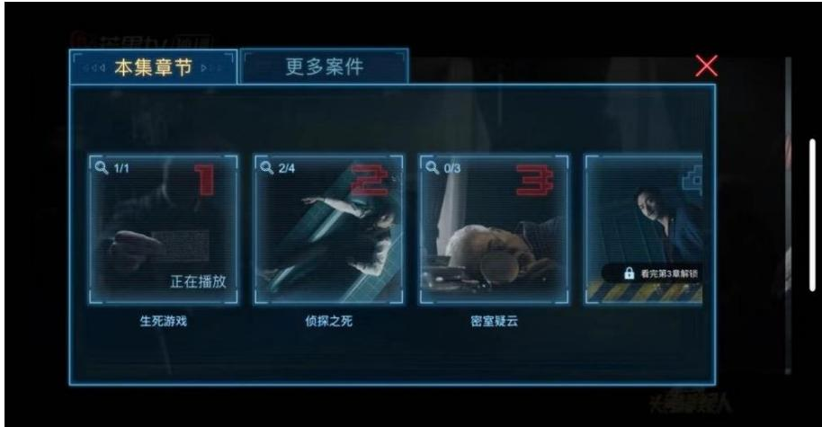
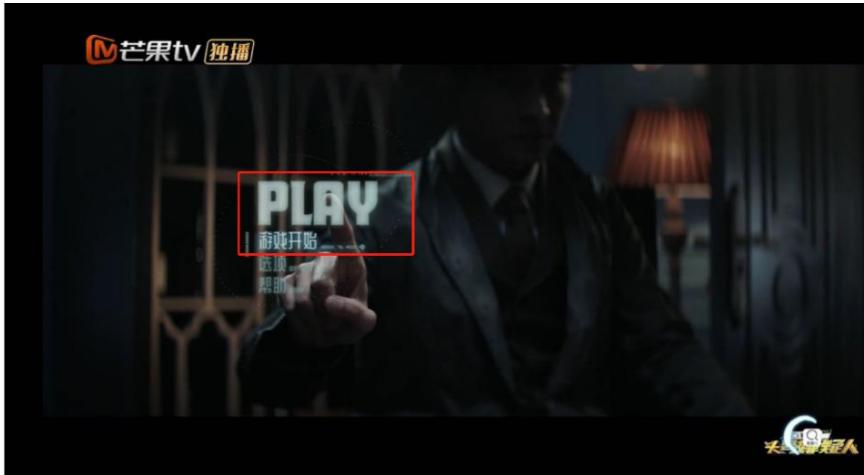

# :Gamification study about Interactive drama Who's the Murderer : Prime Suspect \$\fra { }\$ \$ FE: 5   
2020 5 10   
2020 513 # 5 :201#### # E E HX"E# T"5" 1 " KSEX

### "EE AE

#T5 E" 5G

# Gamification study about Interactive drama Who's the Murderer: Prime Suspect

Major in drama and film and television studies Graduate student: Yuan Luyao Instructor: Li Yi Abstract: In 2019, the development of network technology will add material foundation and technical support to the film and television industry, which make interactive drama emerge as the times require. Interactive drama is a kind of game video, which uses science and technology as its means and incorporates more game elements in its form and content than traditional online movies. Its appearance has realized the audience's pleasure after producing "meaningful choices" in virtual movies and TV programs, and has re-examined the philosophical issues of "fatalism" and "contingency" in life. Therefore, under the social background of "digital survival" and "gamification survival", this research adopts the method of combining quantitative research and qualitative research to discuss the four aspects of the gamification of interactive drama "top murderer of star detective" : game thinking, game behavior, game spirit, game design technology and the effect and significance of the gamification. In the research, it is proved that "the audience is attracted more by the form of the interactive drama than by its own content", and the innovative value brought by the gamfication into this new type of network interactive drama is affirmed: it can not only change the simple connection between the user and the content by using the "plot closed" interaction, but also change the audience into the player immersed in it through the application of various interaction designs, creating a sense of game and substitution, and realizing the identification of virtual identity. Nowadays, the manufacture and production modes of interactive dramas are mostly combined with movies and TV dramas, occasionally involving the combination with online variety shows. However, they all encountered the following problems: single type, poor content quality, high participation threshold and so on, especially in solving the problem of "how to balance the form and content of interactive drama", there is still no constructive theory to guide. Based on the current situation, this study is willing to explore more possibilities for the development of interactive drama combined with online variety shows, so as to enable them to win a place in Internet movies and TV programs when the "5G" network era is fully coming. Keywords: Interactive drama top murderer of star detective gamification interaction immersed # #

# Abstract. ...

# # -# . 10 # l (   
#   
#   
. 14 E... 15 # .

## ## 23#: 24#:. 25 # 27

# 27 \*## # 28 F 30 # 32

#"# 32   
# "# 33   
" 34   
E" 34

# E 36

-#E. 36  
# 37  
##55 38

# E 40

-# 40   
#FTI 41   
=# 42 # 44 48 # # # - M # " 5 1966F H# XA# T. E ## 201 #H90 E5 "# T# EA"K ."# 2011 # "#### 5 B U # E 201 ### ANE 101 2019 ##T- ##E# # # ( 2019118T TTE $^ +$ "#ES.ET 66# #25##+5 "# 75 "E # # ( 1" " 1.2016 E5G"#5G 202 2 E #

# -F

"# #""¥ " E 00# # 1. #"#" :ENTTAEVETX#E # E :### ② 201970≠# # #

# "#" #1971 '# I '"Z # M 5#

A# # 2.

# " #

# F # # 1.1 $^ \mathrm { ( 1 ) } 2 0 0 3$ F,

# " "T E # 2.

# E

EA #" "5 # # :a.:  .: .

# # # # 1.

#E # # #M ##1 # #F # 2. #2019118##- # T # ## "" "####2016 2019. : ## ## ### #> WEA M #: VM V——## # # - 1 . ## 3.

# ##

E" # H"# ##" E $^ +$ #" # " TEFEI E $^ +$ # " # - E" IE. "" #.M"K # # - 20 80###" \$X $^ { \textregistered } 2 0 0 3$ # # " #: ③ 20182018-2022: 22 2017. 1010# $7 . 2 \%$ 20223430 # 18951228 "" #11 ##"# 1897 AMH# # -1916# "" :#34 HEE#H 20 # ##M###15# 1999#2003# #### A## ## # X#"#### #M EE ### :

# ## 2015 #1" #"# 90##""# 2017 2018

# # " " #5 VRA " # M #

TEPHEP EATE " E."KA E "Interactv drama— "# E" # T 196 H# #TE 1981 " "" E"1 F RPG AVG### E E2018 Ne "1.1: 112019 # "

<table><tr><td rowspan=1 colspan=1>H</td><td rowspan=1 colspan=1>A</td><td rowspan=1 colspan=1></td><td rowspan=1 colspan=1>R</td><td rowspan=1 colspan=1>E</td></tr><tr><td rowspan=1 colspan=1>T</td><td rowspan=1 colspan=1>2019. 1.3</td><td rowspan=1 colspan=1>K</td><td rowspan=1 colspan=1></td><td rowspan=1 colspan=1>E</td></tr><tr><td rowspan=1 colspan=1>ET</td><td rowspan=1 colspan=1>2019.1.18</td><td rowspan=1 colspan=1>HE</td><td rowspan=1 colspan=1></td><td rowspan=1 colspan=1>E4</td></tr><tr><td rowspan=1 colspan=1></td><td rowspan=1 colspan=1>2019. 6.20</td><td rowspan=1 colspan=1>#</td><td rowspan=1 colspan=1></td><td rowspan=1 colspan=1>E</td></tr><tr><td rowspan=1 colspan=1></td><td rowspan=1 colspan=1>2019.7.8</td><td rowspan=1 colspan=1>K</td><td rowspan=1 colspan=1> </td><td rowspan=1 colspan=1>EL</td></tr><tr><td rowspan=1 colspan=1>V</td><td rowspan=1 colspan=1>2020.2.14</td><td rowspan=1 colspan=1></td><td rowspan=1 colspan=1></td><td rowspan=1 colspan=1>E</td></tr></table>

" ## ATEA # . E $^ +$ " # -\$ ### #1# #2# # E $^ +$ :# # 1. K ""AUEUE# ; 2# "# # =

## ## #A E"TFAE ## ## E"#A

E $^ +$ :# # #121 $=$ \$ $^ +$ $=$ \$ $+$ $^ +$ LF # E $^ +$ EFE" #

### ###" IE

$^ +$ E" ".# # # . #E # # " ". # # 2011 18# # TA # 625 1 6#"#2.1 21 " " :

<table><tr><td rowspan=1 colspan=1>*14</td><td rowspan=1 colspan=1>14</td><td rowspan=1 colspan=1></td><td rowspan=1 colspan=1></td></tr><tr><td rowspan=1 colspan=1>-</td><td rowspan=1 colspan=1></td><td rowspan=1 colspan=1>$rr$</td><td rowspan=1 colspan=1>2019118</td></tr><tr><td rowspan=1 colspan=1></td><td rowspan=1 colspan=1></td><td rowspan=1 colspan=1>EX</td><td rowspan=1 colspan=1>2019125 </td></tr><tr><td rowspan=1 colspan=1>*</td><td rowspan=1 colspan=1>A</td><td rowspan=1 colspan=1>M</td><td rowspan=1 colspan=1>20198</td></tr><tr><td rowspan=1 colspan=1></td><td rowspan=1 colspan=1></td><td rowspan=1 colspan=1>Justin</td><td rowspan=1 colspan=1>2019215</td></tr><tr><td rowspan=1 colspan=1>E</td><td rowspan=1 colspan=1>(E</td><td rowspan=1 colspan=1></td><td rowspan=1 colspan=1>2019222</td></tr><tr><td rowspan=1 colspan=1>*</td><td rowspan=1 colspan=1>(F</td><td rowspan=1 colspan=1></td><td rowspan=1 colspan=1>201931</td></tr></table>

a. ."" T"" .: #8 .: ". E(2.1T "K-.52.22.3);

  
2

  
22

  
23

2.4;

  
2 "

T "#2.5);

  
25""

#(2.6) .: 420:0 f.: F"". .10 T 5:

  
2

  
27

221

<table><tr><td rowspan=1 colspan=1>I</td><td rowspan=1 colspan=1></td></tr><tr><td rowspan=1 colspan=1>1</td><td rowspan=1 colspan=1>50</td></tr><tr><td rowspan=1 colspan=1>I</td><td rowspan=1 colspan=1>1000</td></tr><tr><td rowspan=1 colspan=1>E4</td><td rowspan=1 colspan=1>100</td></tr><tr><td rowspan=1 colspan=1>41</td><td rowspan=1 colspan=1>50</td></tr><tr><td rowspan=1 colspan=1>M1</td><td rowspan=1 colspan=1>x100</td></tr></table>

# 5 B #:- ## 20191  25 20:00 30 E.

# "

B#ABE" ##-""EECE#: #"- # " " #"A # " "T "# # " #TVp" AE. # EE E".T # F# E # A"E #

# E# # "": " "# $^ +$ ##

#"   
EE.TT ."   
" .   
. (A) d." AE # 4 " # E " # # "#"KE. J" #EE #A "# : ,- "# #"- 1. 2.8

  
2.8""

EEUE # # a. . . . " TE " 25 " E###:#52.9

  
2

## .K " #

#IF "A # # M ### " # ##T \*M HEHF " # ###EA#3.1) # " #

  
3

EWEFEH TE #5 ". E """ ② " THANEIE ETEHE A H"T. 3.2# 3.1#

  
3.2

# ## # ## EZ- #

—F# # #" # -#" E E # # E J #" #—" #A 5.F 10.0.T5T. #:4.1 ##""

  
4.1

E E # #"" 1957 -"K# ; (5) ;(6)##7);(9) #- "EE "," # "" M EAT

# # # ""F3 M" M"# EIF"H ",cp" 500 216"2#3 M #"—# .c"# # .""

#M E#" "K— ," E " "K E." "" MIEK # M # - 1967 ## "5 " A, ##3#, E ""5", ,# E E"# H ". "#EAE-. IF## # "# # " #"#### " # "" AB "  AB ++ BT: ##"#"" # " # ".-T " #011218 (3.1:

<table><tr><td rowspan=1 colspan=2></td><td rowspan=1 colspan=1>1290021127209</td></tr><tr><td rowspan=6 colspan=1>E</td><td rowspan=1 colspan=1> </td><td rowspan=1 colspan=1>14389</td></tr><tr><td rowspan=1 colspan=1> </td><td rowspan=1 colspan=1>11124</td></tr><tr><td rowspan=1 colspan=1> </td><td rowspan=1 colspan=1>20525</td></tr><tr><td rowspan=1 colspan=1></td><td rowspan=1 colspan=1>25195</td></tr><tr><td rowspan=1 colspan=1></td><td rowspan=1 colspan=1>8504</td></tr><tr><td rowspan=1 colspan=1></td><td rowspan=1 colspan=1>823</td></tr></table>

M # # # "# "" # E H EA # #20191127# # 31 ?!""

# "# "# #

TA j " 201 " # # - AB" E"EE EEE#4399" " "M # E5#-6.1:

  
6.1"AB"

E $^ +$ #" # "" T"# H# 201 " #

### 5 E12 ". T" " "K——# #

EEEETEFE KETEQTE--IFEE EETE ## TEE F # #B #" $^ +$ #" " # 828  #2019.12.25# : 1.:" 3# 527 $6 4 . 0 \%$ ;" #205 $2 4 . 8 \%$ ; ""#96 $1 1 . 2 \%$ 453 $5 4 . 7 \%$ E"\$"K6. #" $^ +$ #" 1# 2.# 201——- " #

  
62828

#" " 5G A# T2019 A# # # F " # AE " #EWE ## # # \$: [1] Baudrillard J. Simulacra and Simulation. [M]. University of Michigan Presss, 1994. [2]#..[.1996. [3:.[.1989. [4]#..[. : # 2014. []:.[].: EE2014. [6. ..2012. [7].#..[].2005. [8#.5.: 2012. [9]... 2014. [10...2015. [11].:.[.2014 [12].: .[]. 2000. [13].# 2[. #¥2008. [14].5..2011.

# [1] #.:  ".[]., 2017(10).

[2].1F##: .[J].#, 2016(07). [3] #..[J].# 2019 (07). [4].: .].#2019(06). [5]..J. ,2018(14). [6]..[].2019(15). [7] .F..2013 (05). [] . [J]. #, 2017(08). [9]. " —[], 2012(06). [10]. " ——  #.[]. , 2008 (02). [11]\$. ".[J].## ),2015(07). 12# . [J].1# 2018(28). [13].#F###.[D].:#, 2011. [14],.[J].52005(04). [15]#],2016.

# :

[12021 http://news. iresearch.cn/content/2018/06/274941.shtml. [2].: 4  " j#x. https://www.sohu. com/a/272260336_549923. [3] iT.z". https://new. qq. com/omn/20190730/20190730A0NOEA00.html [4]! https://www. sohu. com/a/323849325_523234. [5].   ". http://www. sohu. com/a/322214759_436725. [6.  . http://ent.sina. com. cn/tv/zy/2018-11-16/doc-ihnvukff7302285. shtm [7].#. http://www.sohu.com/a/297086554_120099891. [8] E"?. http://baijiahao.baidu. com/s?id $\equiv$ 1626761140531920372&wfr $\underline { { \cdot } } =$ spider&for [9].:. https://new. qq. com/omn/20190605/20190605A0KE0K. html. # ERAER"EENSR M.7K# FJT#H:-#"REHEET 201 " # EF F## # 618 201T # F # E AN#TFU "H"T #ET # [1].#2018, 26 (05)8385. [ # , 2018(12), 3840. [3#[.2018(238485.